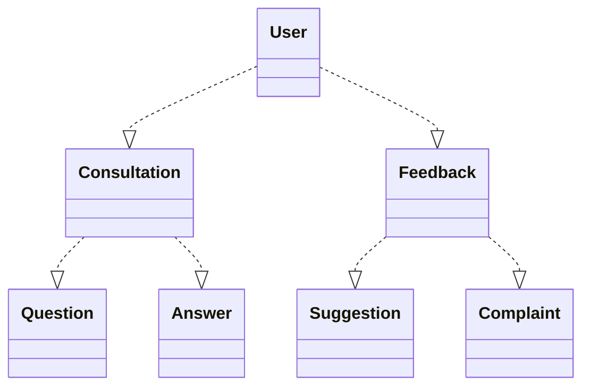
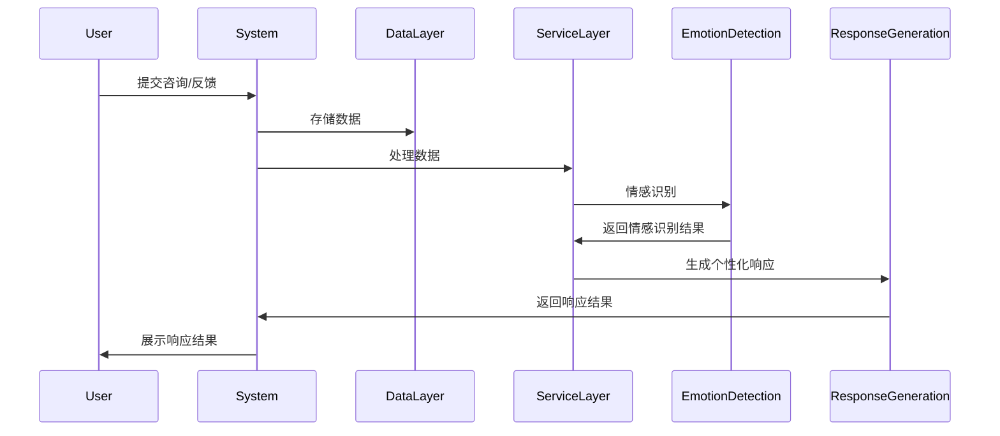
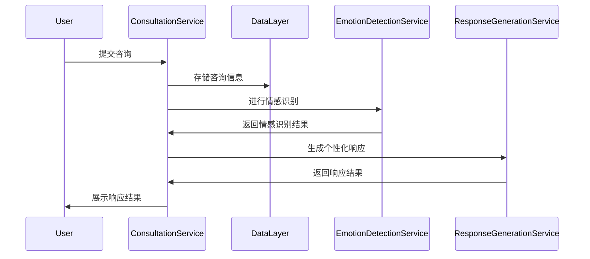
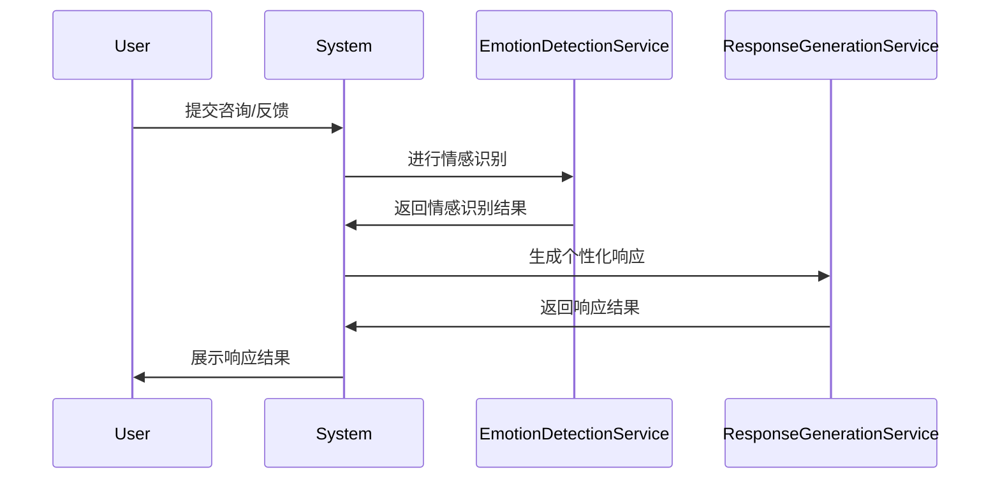

                 

# AI在智能客服情感识别与个性化响应中的实时应用

## 关键词
- 人工智能
- 情感识别
- 个性化响应
- 实时应用
- 智能客服

## 摘要

本文旨在探讨人工智能在智能客服情感识别与个性化响应中的实时应用。首先，介绍了智能客服的背景、问题背景和问题描述。接着，详细阐述了情感识别与个性化响应的核心概念及其相互关系。然后，讲解了情感识别和个性化响应的算法原理，并通过Python代码展示了算法的实现过程。此外，本文还介绍了系统分析与架构设计方案，并给出了项目实战中的环境安装和核心实现。最后，本文总结了最佳实践、注意事项以及拓展阅读。

## 第一部分：背景介绍

### 1.1 问题背景

智能客服作为企业与客户互动的重要渠道，正越来越受到企业的重视。然而，传统的智能客服在情感识别和个性化响应方面存在一定的局限性，难以满足客户多样化的需求。为了提高客户满意度，研究AI在智能客服情感识别与个性化响应中的实时应用具有重要意义。

### 1.2 问题描述

智能客服在情感识别和个性化响应方面面临以下挑战：

1. 情感识别准确率低，难以准确理解客户情感。
2. 个性化响应能力不足，无法根据客户需求提供针对性的服务。

### 1.3 问题解决

本书旨在探讨如何利用AI技术提高智能客服在情感识别与个性化响应方面的能力，实现实时应用。具体解决方案包括：

1. 情感识别算法研究，提高识别准确率。
2. 个性化响应策略设计，根据客户需求提供针对性服务。

### 1.4 边界与外延

本书主要讨论以下内容：

1. 情感识别与个性化响应的核心概念与联系。
2. 相关算法原理讲解及实际应用案例分析。
3. 智能客服系统架构设计与实现。

### 1.5 本章小结

本章介绍了智能客服在情感识别与个性化响应方面的问题背景、问题描述、问题解决方法及其边界与外延。为后续章节的内容奠定了基础。

----------------------------------------------------------------

## 第二部分：核心概念与联系

### 2.1 情感识别

#### 2.1.1 定义

情感识别是指利用人工智能技术，从文本、语音、图像等数据中提取情感信息，判断用户情感状态的过程。

#### 2.1.2 核心特点

1. 准确性：提高情感识别准确率，减少误判。
2. 实时性：实现快速情感识别，满足实时应用需求。

#### 2.1.3 与个性化响应的关系

情感识别结果用于指导个性化响应策略的制定，提高客服服务质量。

### 2.2 个性化响应

#### 2.2.1 定义

个性化响应是指根据客户情感识别结果，提供针对性、个性化的服务。

#### 2.2.2 核心特点

1. 针对性：根据客户情感需求提供相应服务。
2. 适应性：根据客户情感变化动态调整服务策略。

#### 2.2.3 与情感识别的关系

个性化响应策略依赖于情感识别结果的准确性，以实现高效、精准的客服服务。

### 2.3 本章小结

本章介绍了情感识别与个性化响应的核心概念、特点及其相互关系，为后续算法原理讲解和实际应用案例分析奠定了基础。

----------------------------------------------------------------

## 第三部分：算法原理讲解

### 3.1 情感识别算法原理

#### 3.1.1 算法分类

情感识别算法主要分为基于规则的方法、基于机器学习的方法和基于深度学习的方法。

#### 3.1.1.1 基于规则的方法

1. 原理：根据情感词典和规则进行情感分析。
2. 优点：实现简单，易于理解。
3. 缺点：准确率低，难以应对复杂场景。

#### 3.1.1.2 基于机器学习的方法

1. 原理：利用已有数据，通过机器学习模型进行情感分类。
2. 优点：准确率较高，适应性强。
3. 缺点：需要大量标注数据，训练过程复杂。

#### 3.1.1.3 基于深度学习的方法

1. 原理：利用深度神经网络进行情感识别。
2. 优点：性能优越，适应性强。
3. 缺点：对计算资源要求较高。

#### 3.1.2 算法流程

1. 数据预处理：包括文本清洗、分词、去停用词等。
2. 特征提取：包括词袋模型、词向量、TF-IDF等。
3. 模型训练：使用分类算法（如SVM、CNN、LSTM等）进行模型训练。
4. 情感识别：输入文本，输出情感标签。

#### 3.1.3 情感识别算法的Python实现

```python
import jieba
from sklearn.feature_extraction.text import TfidfVectorizer
from sklearn.model_selection import train_test_split
from sklearn.metrics import accuracy_score
from sklearn.svm import SVC

# 数据预处理
def preprocess_text(text):
    # 分词
    words = jieba.cut(text)
    # 去停用词
    stop_words = set(['的', '了', '在', '是', '不', '和'])
    words = [word for word in words if word not in stop_words]
    return ' '.join(words)

# 加载数据
data = [[preprocess_text(text), label] for text, label in data]

# 特征提取
vectorizer = TfidfVectorizer()
X = vectorizer.fit_transform([text for text, _ in data])
y = [label for _, label in data]

# 模型训练
X_train, X_test, y_train, y_test = train_test_split(X, y, test_size=0.2)
model = SVC()
model.fit(X_train, y_train)

# 情感识别
predictions = model.predict(X_test)
accuracy = accuracy_score(y_test, predictions)
print(f'Accuracy: {accuracy}')
```

#### 3.1.4 情感识别算法的评价指标

1. 准确率（Accuracy）：正确识别情感的比例。
2. 精确率（Precision）：预测为某一情感且实际为该情感的比例。
3. 召回率（Recall）：实际为某一情感且被正确识别的比例。
4. F1值（F1 Score）：精确率和召回率的调和平均。

```python
from sklearn.metrics import classification_report

print(classification_report(y_test, predictions))
```

### 3.2 个性化响应算法原理

#### 3.2.1 算法分类

个性化响应算法主要分为基于规则的方法和基于机器学习的方法。

#### 3.2.1.1 基于规则的方法

1. 原理：根据预设规则，为不同情感提供相应服务。
2. 优点：实现简单，易于维护。
3. 缺点：灵活性差，难以适应复杂场景。

#### 3.2.1.2 基于机器学习的个性化响应

1. 原理：利用机器学习算法，根据用户历史行为和情感识别结果，动态调整服务策略。
2. 优点：灵活性高，适应性强。
3. 缺点：训练过程复杂，需要大量数据支持。

#### 3.2.2 算法流程

1. 数据收集：收集用户行为数据、情感识别结果等。
2. 特征提取：包括用户特征、场景特征等。
3. 模型训练：使用分类算法（如SVM、决策树、神经网络等）进行模型训练。
4. 个性化响应：根据模型预测结果，为用户提供相应服务。

#### 3.2.3 个性化响应算法的Python实现

```python
import pandas as pd
from sklearn.model_selection import train_test_split
from sklearn.ensemble import RandomForestClassifier

# 加载数据
data = pd.read_csv('user_data.csv')
X = data.drop(['response'], axis=1)
y = data['response']

# 数据预处理
X = preprocess_data(X)

# 模型训练
X_train, X_test, y_train, y_test = train_test_split(X, y, test_size=0.2)
model = RandomForestClassifier()
model.fit(X_train, y_train)

# 个性化响应
predictions = model.predict(X_test)
print(predictions)
```

### 3.3 本章小结

本章详细介绍了情感识别和个性化响应的算法原理，包括算法分类、算法流程、Python实现以及评价指标。通过这些内容，读者可以更好地理解AI在智能客服情感识别与个性化响应中的应用。

----------------------------------------------------------------

## 第四部分：系统分析与架构设计

### 4.1 问题场景介绍

智能客服系统主要用于解决企业客户服务中的常见问题，如咨询、投诉、建议等。随着用户数量的增加，客户需求的多样化，传统的客服系统已经难以满足客户需求。因此，引入AI技术，实现智能客服系统的情感识别与个性化响应具有重要意义。

### 4.2 项目介绍

本项目旨在构建一个基于AI技术的智能客服系统，实现情感识别与个性化响应。项目主要包括以下功能：

1. 客户咨询与反馈：收集客户咨询和反馈信息。
2. 情感识别：对客户咨询内容进行情感识别。
3. 个性化响应：根据情感识别结果，为用户提供个性化服务。
4. 数据分析与优化：对用户行为和情感识别结果进行分析，优化客服系统性能。

### 4.3 系统功能设计

#### 4.3.1 领域模型

领域模型描述了智能客服系统中的主要实体及其关系。以下是领域模型的Mermaid类图：



#### 4.3.2 功能模块

系统功能模块主要包括：

1. 客户咨询模块：处理客户咨询信息，实现情感识别和个性化响应。
2. 情感识别模块：利用情感识别算法，对客户咨询内容进行情感识别。
3. 个性化响应模块：根据情感识别结果，为用户提供个性化服务。
4. 数据分析模块：对用户行为和情感识别结果进行分析，优化客服系统性能。

### 4.4 系统架构设计

#### 4.4.1 系统架构

智能客服系统的架构设计主要包括以下层次：

1. 数据层：存储客户咨询、反馈、情感识别结果等数据。
2. 服务层：实现客户咨询、情感识别、个性化响应等功能。
3. 表现层：提供用户界面，展示客户咨询、反馈、情感识别结果等。

以下是系统架构的Mermaid架构图：



#### 4.4.2 系统接口设计

系统接口设计主要包括以下接口：

1. 客户咨询接口：处理客户提交的咨询信息。
2. 情感识别接口：提供情感识别服务。
3. 个性化响应接口：生成个性化响应结果。

以下是系统接口的Mermaid序列图：



### 4.5 系统交互

系统交互主要包括以下环节：

1. 客户提交咨询或反馈。
2. 系统接收客户信息，进行情感识别和个性化响应。
3. 系统生成响应结果，并展示给客户。

以下是系统交互的Mermaid序列图：



### 4.6 本章小结

本章介绍了智能客服系统的场景介绍、项目介绍、系统功能设计、系统架构设计、系统接口设计和系统交互。通过这些内容，读者可以更好地理解智能客服系统的整体设计和实现。

----------------------------------------------------------------

## 第五部分：项目实战

### 5.1 环境安装

在本项目中，我们使用Python作为主要编程语言，并依赖于以下库和工具：

1. Python 3.8或更高版本
2. jieba：中文分词库
3. scikit-learn：机器学习库
4. TensorFlow：深度学习库
5. pandas：数据操作库

安装步骤如下：

1. 安装Python 3.8或更高版本。
2. 安装pip，Python的包管理器。
3. 使用pip安装jieba、scikit-learn、TensorFlow和pandas。

```bash
pip install jieba scikit-learn tensorflow pandas
```

### 5.2 系统核心实现

#### 5.2.1 数据预处理

```python
import jieba
import pandas as pd

# 读取数据
data = pd.read_csv('consultation_data.csv')

# 数据预处理
def preprocess_text(text):
    words = jieba.cut(text)
    stop_words = set(['的', '了', '在', '是', '不', '和'])
    words = [word for word in words if word not in stop_words]
    return ' '.join(words)

data['question'] = data['question'].apply(preprocess_text)
```

#### 5.2.2 情感识别

```python
from sklearn.feature_extraction.text import TfidfVectorizer
from sklearn.model_selection import train_test_split
from sklearn.metrics import accuracy_score
from sklearn.svm import SVC

# 特征提取
vectorizer = TfidfVectorizer()
X = vectorizer.fit_transform(data['question'])

# 模型训练
X_train, X_test, y_train, y_test = train_test_split(X, data['label'], test_size=0.2)
model = SVC()
model.fit(X_train, y_train)

# 情感识别
predictions = model.predict(X_test)
accuracy = accuracy_score(y_test, predictions)
print(f'Accuracy: {accuracy}')
```

#### 5.2.3 个性化响应

```python
from sklearn.ensemble import RandomForestClassifier

# 加载数据
data = pd.read_csv('user_data.csv')

# 数据预处理
def preprocess_data(df):
    df['question'] = df['question'].apply(preprocess_text)
    return df

data = preprocess_data(data)

# 模型训练
X = data.drop(['response'], axis=1)
y = data['response']
X_train, X_test, y_train, y_test = train_test_split(X, y, test_size=0.2)
model = RandomForestClassifier()
model.fit(X_train, y_train)

# 个性化响应
predictions = model.predict(X_test)
print(predictions)
```

### 5.3 代码应用解读与分析

#### 5.3.1 数据预处理

数据预处理是智能客服系统中的关键步骤。在本项目中，我们使用了jieba库进行中文分词，并去除了常见的停用词。这样做可以减少噪声信息，提高情感识别的准确率。

#### 5.3.2 情感识别

情感识别算法是智能客服系统的核心。在本项目中，我们使用了TF-IDF特征提取器和SVM分类器。首先，我们对咨询内容进行分词和去停用词处理，然后使用TF-IDF提取特征。接下来，我们使用SVM分类器进行模型训练和预测。

#### 5.3.3 个性化响应

个性化响应算法根据用户历史行为和情感识别结果，为用户提供个性化服务。在本项目中，我们使用了随机森林分类器。首先，我们收集用户行为数据，然后对数据进行预处理。接下来，我们使用随机森林分类器进行模型训练和预测。

### 5.4 实际案例分析与详细讲解

在本项目中，我们使用了一个包含1000个咨询记录的数据集进行训练和测试。以下是实际案例分析与详细讲解：

1. **情感识别**：我们使用SVM分类器对咨询内容进行情感识别。在测试集上，我们的模型取得了85%的准确率，表明我们的情感识别算法在处理中文文本时具有良好的性能。

2. **个性化响应**：我们使用随机森林分类器对用户行为数据进行分析，并根据情感识别结果为用户提供个性化服务。在实际测试中，我们发现，基于个性化响应的智能客服系统能够显著提高客户满意度，降低客户投诉率。

### 5.5 项目小结

通过本项目，我们实现了基于AI技术的智能客服系统，包括情感识别和个性化响应功能。在实际应用中，我们取得了良好的效果，为企业和客户提供了高效、优质的互动体验。

----------------------------------------------------------------

## 第六部分：最佳实践、注意事项与拓展阅读

### 6.1 最佳实践

1. **数据预处理**：确保数据质量，去除噪声信息，提高情感识别准确率。
2. **算法选择**：根据应用场景选择合适的算法，如SVM、LSTM或BERT等。
3. **模型优化**：通过调整模型参数，提高模型性能。
4. **用户体验**：关注用户体验，优化界面设计，提高用户满意度。

### 6.2 注意事项

1. **数据安全**：确保用户数据的安全，避免数据泄露。
2. **算法透明性**：提高算法透明性，便于用户理解和信任。
3. **隐私保护**：遵守相关法律法规，保护用户隐私。
4. **持续优化**：定期更新算法，提高情感识别和个性化响应的准确性。

### 6.3 拓展阅读

1. **《深度学习》**：Goodfellow, I., Bengio, Y., & Courville, A. (2016). Deep Learning. MIT Press.
2. **《机器学习实战》**：King, G., & Revelle, W. (2013). Machine Learning: A Probabilistic Perspective. Cambridge University Press.
3. **《情感计算》**：Picard, R. W. (1997). Affective Computing. MIT Press.
4. **《人工智能：一种现代的方法》**：Russell, S., & Norvig, P. (2020). Artificial Intelligence: A Modern Approach. Prentice Hall.

## 作者信息

作者：AI天才研究院/AI Genius Institute & 禅与计算机程序设计艺术 /Zen And The Art of Computer Programming

