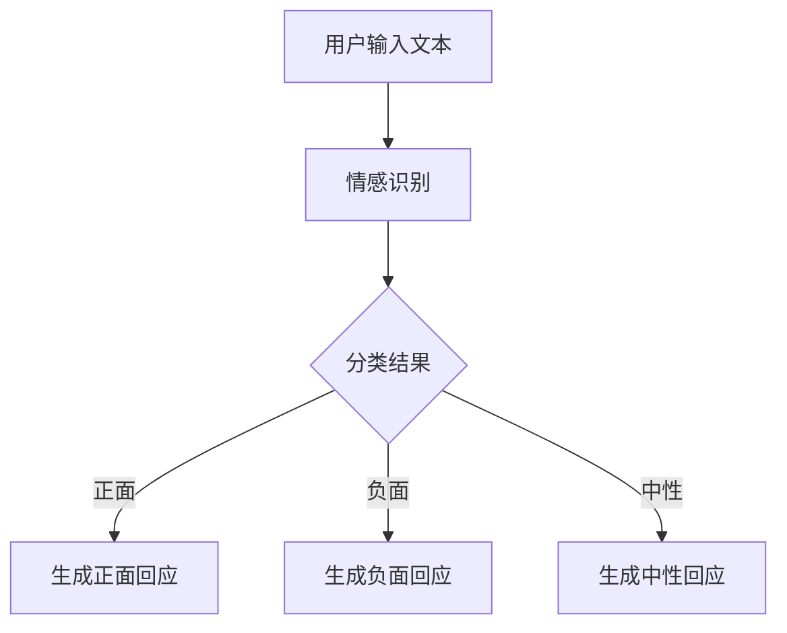
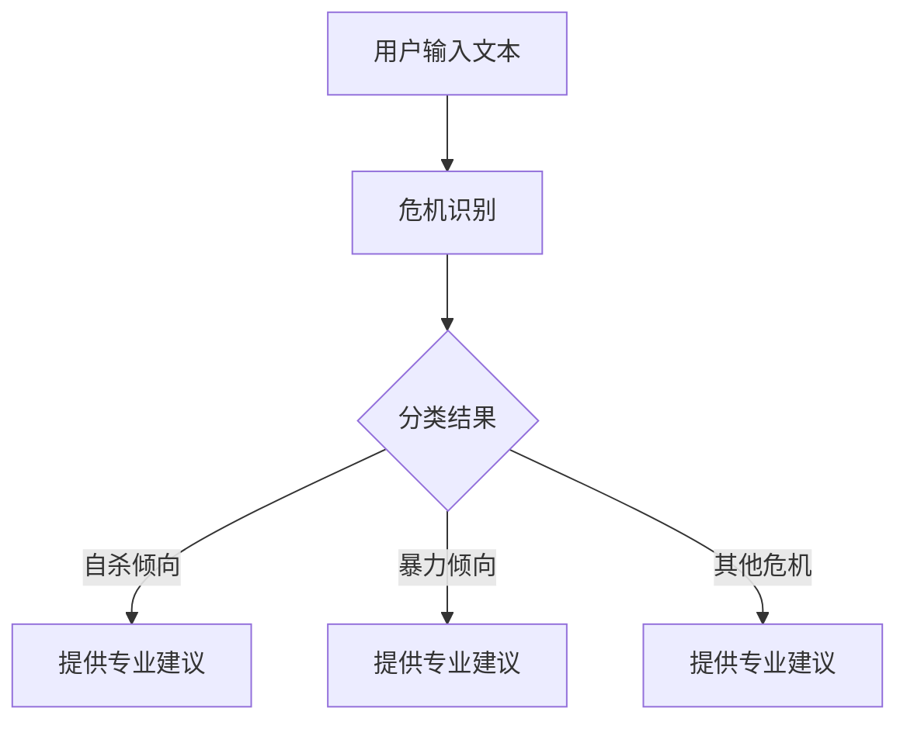
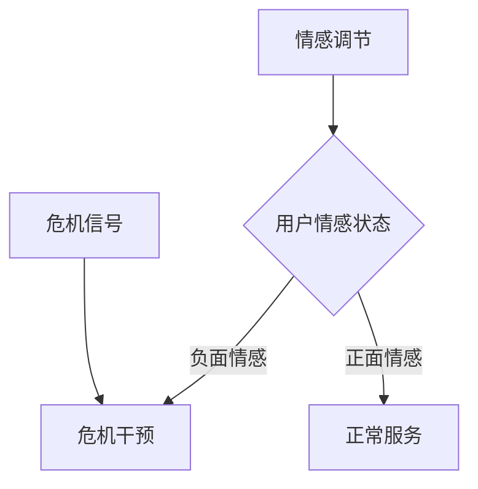
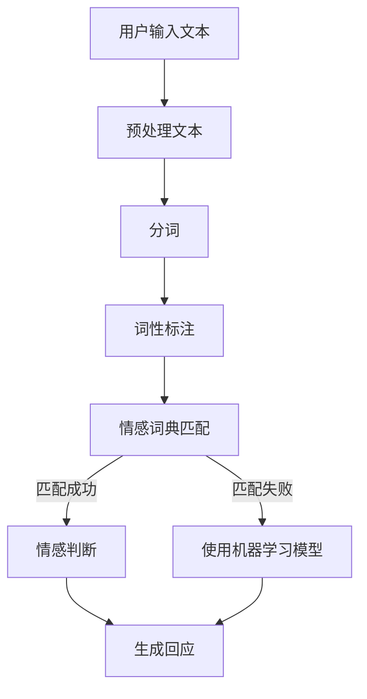
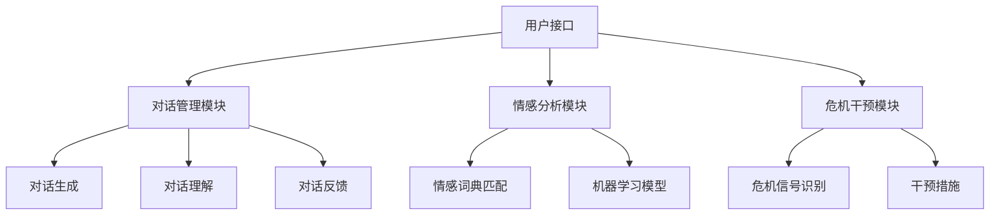
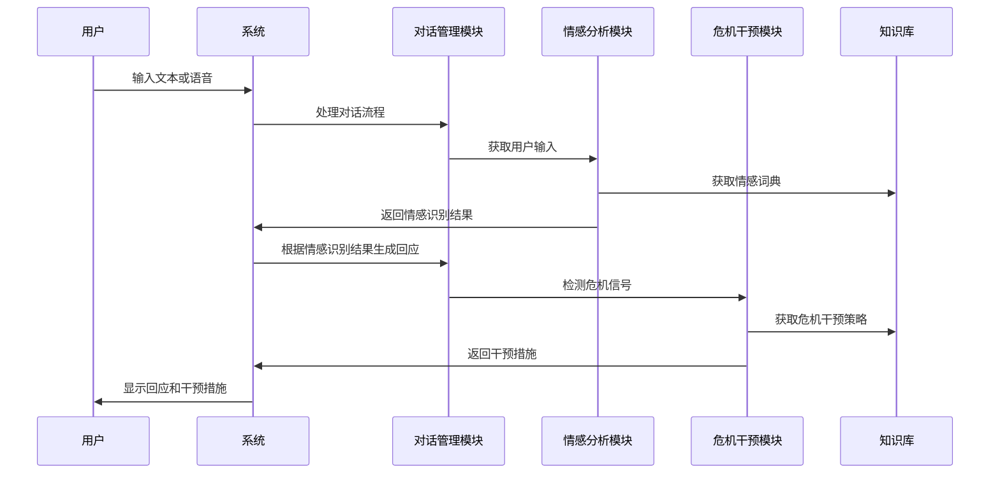

                 

# AI在智能客服情感调节与危机干预中的应用

## 关键词
人工智能，自然语言处理，情感调节，危机干预，智能客服

## 摘要
本文深入探讨了人工智能（AI）在智能客服中的情感调节与危机干预应用。首先，我们介绍了智能客服的背景和发展现状，以及情感调节和危机干预的重要性。随后，我们详细阐述了AI和自然语言处理的基础理论，情感分析技术，以及智能客服的架构与实现。接着，我们重点分析了情感调节算法和危机干预机制，并通过实际案例展示了这些技术的应用效果。最后，我们对研究进行了总结，提出了未来发展的方向和挑战。

## 引言
### 智能客服的背景与发展
智能客服是一种基于人工智能技术的自动化客户服务系统，它能够通过语音、文字等方式与用户进行交互，提供高效、准确的服务。随着互联网技术的飞速发展和用户需求的不断提高，智能客服已经成为企业客户服务的重要组成部分。

智能客服的发展可以分为几个阶段：

1. **初步阶段**：以简单的自动应答系统为主，功能单一，主要提供基本的查询服务。
2. **中级阶段**：引入自然语言处理（NLP）技术，能够处理更复杂的用户查询，提供更智能的服务。
3. **高级阶段**：结合情感分析、机器学习等先进技术，实现情感调节和危机干预，提供更加人性化、高效的服务。

### 情感调节与危机干预的重要性
情感调节和危机干预是智能客服的高级功能，对于提升用户体验和客户满意度至关重要。

1. **情感调节**：智能客服需要能够理解用户的情感状态，并根据情感状态调整回答策略，以提升用户满意度。例如，当用户表达不满时，智能客服能够识别出情感，并采取适当的缓解措施，如提供安慰、解释等。

2. **危机干预**：在某些情况下，用户可能会遇到紧急情况或心理危机，如情绪失控、自杀倾向等。智能客服需要具备危机干预能力，能够识别危机信号，及时采取行动，引导用户寻求专业帮助。

### 目的与结构
本文旨在探讨AI在智能客服情感调节与危机干预中的应用，通过以下结构展开：

1. **基础理论**：介绍AI和NLP的基础知识，情感分析技术，以及智能客服的架构与实现。
2. **应用技术**：分析情感调节算法和危机干预机制，包括原理、实现方法和案例分析。
3. **案例研究**：展示实际案例，分析情感调节和危机干预在智能客服中的应用效果。
4. **总结与展望**：总结研究成果，提出未来发展的方向和挑战。

## 第一部分：基础理论

### 1.1 人工智能与自然语言处理
#### 1.1.1 AI的基本概念
人工智能（AI）是指使计算机系统具备人类智能的能力，包括感知、学习、推理、决策和行动等。AI的应用领域广泛，如自动驾驶、智能助手、金融风控等。

#### 1.1.2 自然语言处理概述
自然语言处理（NLP）是AI的一个重要分支，旨在使计算机能够理解、生成和处理人类语言。NLP的核心任务包括：

1. **文本分类**：将文本分类到预定义的类别中。
2. **命名实体识别**：识别文本中的特定实体，如人名、地点、组织等。
3. **情感分析**：分析文本的情感倾向，如正面、负面、中性。
4. **机器翻译**：将一种语言翻译成另一种语言。

### 1.2 情感分析技术
#### 1.2.1 情感分析的定义
情感分析（Sentiment Analysis）是一种评估文本表达情感倾向的技术，通常分为三类：

1. **正面/负面/中性**：将文本分类为正面、负面或中性。
2. **多级情感分类**：将文本分类为多个情感类别，如愤怒、高兴、悲伤等。
3. **情感强度分析**：评估情感表达的强度。

#### 1.2.2 情感分析的方法与技术
情感分析的方法包括基于规则、基于统计和基于深度学习的方法。

1. **基于规则的方法**：使用预定义的规则来分类文本。
2. **基于统计的方法**：使用统计模型，如支持向量机（SVM）、朴素贝叶斯（NB）等。
3. **基于深度学习的方法**：使用深度神经网络，如卷积神经网络（CNN）、循环神经网络（RNN）、长短时记忆网络（LSTM）等。

### 1.3 智能客服的架构与实现
#### 1.3.1 智能客服的架构设计
智能客服的架构通常包括以下几个模块：

1. **用户接口**：与用户交互的界面，可以是网页、移动应用或语音助手等。
2. **对话管理系统**：管理对话流程，包括对话生成、对话理解和对话反馈。
3. **知识库**：存储与业务相关的知识，如产品信息、常见问题等。
4. **情感分析模块**：分析用户情绪，调整对话策略。
5. **危机干预模块**：识别危机信号，采取干预措施。

#### 1.3.2 智能客服的关键技术
智能客服的关键技术包括：

1. **语音识别**：将用户的语音转化为文本。
2. **语音合成**：将文本转化为语音，以回应用户。
3. **自然语言理解**：理解用户输入的文本，提取意图和实体。
4. **对话生成**：根据用户意图生成合适的回应。
5. **情感识别**：识别用户的情感状态。
6. **机器学习**：使用机器学习算法优化对话系统。

## 第二部分：应用技术

### 2.1 情感调节算法
#### 2.1.1 情感调节的目标
情感调节的目标是使智能客服在与用户的交互过程中保持积极、友好和有效的沟通，从而提升用户满意度。

#### 2.1.2 情感调节的算法原理
情感调节算法的核心是情感识别和情感生成。

1. **情感识别**：通过情感分析技术识别用户的情感状态。
2. **情感生成**：根据用户的情感状态生成合适的回应。

#### 2.1.3 实践案例分析
以一个实际案例来说明情感调节的应用。

**案例**：用户在电商平台投诉产品质量问题。

1. **情感识别**：通过情感分析识别用户情感为负面。
2. **情感生成**：智能客服生成回应：“我理解您的担忧，我们会尽快处理这个问题，请您提供订单号以便我们查询。”

### 2.2 危机干预机制
#### 2.2.1 危机干预的定义
危机干预是指智能客服在识别用户面临危机时采取的干预措施，以防止危机升级或用户受到伤害。

#### 2.2.2 危机干预的策略与技术
危机干预的策略包括：

1. **情感识别**：识别用户情感状态，尤其是负面情感。
2. **危机信号识别**：识别可能的危机信号，如自杀倾向、暴力倾向等。
3. **干预措施**：采取合适的干预措施，如提供安慰、引导用户寻求专业帮助等。

#### 2.2.3 实际应用场景
以一个实际案例来说明危机干预的应用。

**案例**：用户在社交媒体上表达自杀倾向。

1. **情感识别**：通过情感分析识别用户情感为极端负面。
2. **危机信号识别**：识别出自杀倾向。
3. **干预措施**：智能客服生成回应：“如果您感到难以承受，请立即拨打紧急热线，我们愿意为您提供帮助。”

## 第三部分：案例研究

### 4.1 案例一：情感调节在电商客服中的应用
**项目介绍**：某电商平台的智能客服系统，通过情感调节技术提升用户体验。

**系统功能设计**：智能客服能够识别用户的情感状态，并根据情感状态调整回答策略。

**系统架构设计**：系统包括用户接口、对话管理系统、情感分析模块和知识库。

**系统接口设计和系统交互**：智能客服与用户之间的交互流程。

**实际案例分析和详细讲解剖析**：

1. **案例**：用户投诉产品质量问题。
2. **分析**：情感调节算法识别用户情感为负面，智能客服生成回应，缓解用户情绪。
3. **讲解**：情感调节算法的实现原理和具体应用。

### 4.2 案例二：危机干预在电信客服中的应用
**项目介绍**：某电信运营商的智能客服系统，通过危机干预技术提升用户安全。

**系统功能设计**：智能客服能够识别用户面临的危机，并采取干预措施。

**系统架构设计**：系统包括用户接口、对话管理系统、危机干预模块和知识库。

**系统接口设计和系统交互**：智能客服与用户之间的交互流程。

**实际案例分析和详细讲解剖析**：

1. **案例**：用户表达自杀倾向。
2. **分析**：危机干预模块识别出自杀倾向，智能客服生成回应，引导用户寻求专业帮助。
3. **讲解**：危机干预算法的实现原理和具体应用。

### 4.3 案例三：跨行业智能客服的情感调节与危机干预
**项目介绍**：某跨行业智能客服系统，整合情感调节和危机干预技术。

**系统功能设计**：智能客服能够识别不同行业的用户情感和危机信号。

**系统架构设计**：系统包括用户接口、对话管理系统、情感分析模块、危机干预模块和知识库。

**系统接口设计和系统交互**：智能客服与用户之间的交互流程。

**实际案例分析和详细讲解剖析**：

1. **案例**：用户在金融行业表达焦虑情绪。
2. **分析**：智能客服识别出焦虑情绪，提供安慰和解决方案。
3. **讲解**：情感调节和危机干预技术在金融行业的应用。

## 第四部分：总结与展望

### 5.1 研究总结
本文系统地介绍了AI在智能客服情感调节与危机干预中的应用。通过基础理论、应用技术和案例研究的分析，我们展示了情感调节和危机干预在智能客服中的重要性。

### 5.2 未来发展趋势
1. **技术进步**：随着AI技术的不断发展，情感调节和危机干预将更加精准和高效。
2. **跨行业应用**：智能客服将在更多行业得到广泛应用，实现情感调节和危机干预的全面覆盖。
3. **人性化交互**：智能客服将更加注重人性化交互，提升用户体验。

### 5.3 研究局限性与未来工作
1. **情感识别准确性**：情感识别的准确性仍有待提高。
2. **危机信号识别**：危机信号的识别需要更多的数据支持和算法优化。
3. **跨行业适应性**：智能客服需要针对不同行业的特点进行定制化设计。

未来工作将集中在提升情感识别和危机干预的准确性，拓展跨行业应用，以及提高智能客服的人性化交互能力。

## 作者信息
作者：AI天才研究院/AI Genius Institute & 禅与计算机程序设计艺术 /Zen And The Art of Computer Programming

----------------------------------------------

## 背景介绍

### 核心概念术语说明
在讨论AI在智能客服情感调节与危机干预中的应用之前，我们需要明确一些核心概念和术语。

1. **人工智能（AI）**：指模拟人类智能行为的计算机系统，包括学习、推理、决策、感知等能力。
2. **自然语言处理（NLP）**：AI的一个分支，专注于让计算机理解和生成人类语言。
3. **情感调节**：指在智能客服与用户的交互过程中，根据用户的情感状态调整客服的回答策略。
4. **危机干预**：指智能客服在识别用户可能面临的危机时，采取的措施来防止危机升级。
5. **智能客服**：一种利用AI技术提供客户服务的系统，能够自动处理用户的问题和需求。

### 问题背景
智能客服作为AI技术在客户服务领域的重要应用，已经得到了广泛的关注和应用。随着用户对服务质量的要求不断提高，智能客服不仅要能够处理常规问题，还需要具备情感调节和危机干预能力。

#### 问题描述
然而，当前智能客服在情感调节和危机干预方面仍存在以下问题：

1. **情感识别准确性不足**：智能客服在识别用户情感时，往往无法准确捕捉用户的情感状态，导致回复不当。
2. **危机干预不及时**：当用户表达危机信号时，智能客服往往无法及时识别并采取有效措施。
3. **跨行业适应性差**：不同行业的用户需求和服务场景差异较大，智能客服在跨行业应用时适应性不足。

#### 问题解决
为了解决上述问题，本文提出以下解决思路：

1. **提升情感识别准确性**：通过改进情感分析算法，提高智能客服对用户情感状态的识别能力。
2. **优化危机干预机制**：设计更加完善的危机干预策略，确保智能客服能够及时识别并干预用户的危机信号。
3. **增强跨行业适应性**：针对不同行业的特点，定制化设计智能客服系统，提高其在跨行业应用中的适应性。

### 边界与外延
在讨论AI在智能客服情感调节与危机干预中的应用时，我们还需要明确一些边界和限制条件：

1. **技术限制**：目前的AI技术，特别是情感识别和危机干预技术，还存在一定的局限性，需要进一步研究和优化。
2. **数据隐私**：智能客服在处理用户数据时，需要遵守相关法律法规，保护用户的隐私。
3. **人机交互**：尽管AI技术取得了显著进展，但人机交互仍需要不断优化，以提高用户体验。

### 概念结构与核心要素组成
智能客服情感调节与危机干预的核心概念和要素包括：

1. **情感识别**：通过自然语言处理技术，识别用户的情感状态。
2. **情感生成**：根据用户的情感状态，生成合适的回应。
3. **危机识别**：通过分析用户行为和语言，识别潜在的危机信号。
4. **危机干预**：采取适当的措施，如提供专业建议、引导用户寻求帮助等。

这些核心概念和要素共同构成了智能客服情感调节与危机干预的体系结构，为提升智能客服的服务质量和用户体验提供了有力支持。

----------------------------------------------

## 核心概念与联系

### 情感调节算法原理

#### 情感调节的目标
情感调节的目标是确保智能客服在与用户的交互过程中，能够根据用户的情感状态调整回答策略，以提升用户体验和满意度。具体目标包括：

1. **情感捕捉**：准确识别用户的情感状态，如喜悦、愤怒、悲伤等。
2. **情感适应**：根据用户的情感状态，调整客服的回答方式，如语气、措辞等。
3. **情感缓解**：在用户表达负面情感时，采取适当的措施缓解用户情绪，如提供安慰、解释等。

#### 情感调节的算法原理
情感调节算法的核心是情感识别和情感生成。以下是情感调节算法的基本原理：

1. **情感识别**：通过自然语言处理（NLP）技术，分析用户输入的文本，提取情感信息。常见的情感识别方法包括基于规则的方法、基于统计的方法和基于深度学习的方法。

   - **基于规则的方法**：使用预定义的规则库来识别情感。例如，如果一个句子包含“我很好”或“我很高兴”，则识别为正面情感。
   - **基于统计的方法**：使用统计模型，如支持向量机（SVM）、朴素贝叶斯（NB）等，对用户输入的文本进行分类。这些模型通过学习大量标注过的数据，自动提取特征并进行分类。
   - **基于深度学习的方法**：使用深度神经网络，如卷积神经网络（CNN）、循环神经网络（RNN）、长短时记忆网络（LSTM）等，对用户输入的文本进行情感分类。这些模型能够自动学习文本的特征，并达到较高的分类精度。

2. **情感生成**：根据识别出的用户情感状态，生成合适的回应。情感生成的方法包括模板匹配、对话生成模型和基于情感状态的响应调整。

   - **模板匹配**：根据预定义的模板生成回应。例如，如果识别到用户情感为正面，则使用模板“很高兴听到这个消息！”。
   - **对话生成模型**：使用生成式模型，如变换器（Transformer）模型，生成与用户情感相符的回应。这些模型通过学习大量对话数据，能够生成自然的对话回应。
   - **基于情感状态的响应调整**：根据用户的情感状态，动态调整客服的回答策略。例如，当用户表达愤怒时，客服可以采用更加冷静和安抚的语气。

#### 情感调节算法的流程
情感调节算法的流程通常包括以下几个步骤：

1. **情感识别**：使用NLP技术分析用户输入的文本，提取情感信息。
2. **情感分类**：将提取出的情感信息分类为正面、负面或中性。
3. **情感调整**：根据分类结果，动态调整客服的回答策略，生成合适的回应。
4. **回应生成**：根据调整后的策略，生成与用户情感相符的回应。

#### 情感调节算法的优缺点
情感调节算法具有以下优缺点：

- **优点**：
  - 提高客服的响应速度和质量。
  - 根据用户的情感状态提供个性化的服务。
  - 减轻人工客服的工作负担。

- **缺点**：
  - 情感识别准确性仍需提高。
  - 在处理复杂情感时，可能存在理解偏差。
  - 需要大量标注数据进行训练。

### 情感调节算法的Mermaid流程图



### 危机干预机制

#### 危机干预的目标
危机干预的目标是确保智能客服能够及时识别用户的危机信号，并采取有效措施防止危机升级。具体目标包括：

1. **危机识别**：及时识别用户可能面临的危机信号，如自杀倾向、暴力倾向等。
2. **危机响应**：采取适当的干预措施，如提供专业建议、引导用户寻求帮助等。
3. **危机预防**：通过提前预警和干预，防止危机事件的发生。

#### 危机干预的算法原理
危机干预算法的核心是危机识别和危机响应。以下是危机干预算法的基本原理：

1. **危机识别**：通过分析用户输入的文本、行为和语言特征，识别潜在的危机信号。常见的危机识别方法包括基于规则的方法、基于统计的方法和基于深度学习的方法。

   - **基于规则的方法**：使用预定义的规则库来识别危机信号。例如，如果一个句子包含“我要自杀”或“我要伤害自己”，则识别为自杀倾向。
   - **基于统计的方法**：使用统计模型，如支持向量机（SVM）、朴素贝叶斯（NB）等，对用户输入的文本进行分类。这些模型通过学习大量标注过的数据，自动提取特征并进行分类。
   - **基于深度学习的方法**：使用深度神经网络，如卷积神经网络（CNN）、循环神经网络（RNN）、长短时记忆网络（LSTM）等，对用户输入的文本进行危机识别。这些模型能够自动学习文本的特征，并达到较高的分类精度。

2. **危机响应**：根据识别出的危机信号，采取适当的干预措施。常见的危机响应方法包括提供专业建议、引导用户寻求帮助等。

   - **提供专业建议**：根据危机类型，提供相应的专业建议。例如，对于自杀倾向，建议用户立即拨打紧急热线。
   - **引导用户寻求帮助**：引导用户联系专业机构或人员，如心理医生、紧急救援服务等。

#### 危机干预算法的流程
危机干预算法的流程通常包括以下几个步骤：

1. **危机识别**：分析用户输入的文本、行为和语言特征，识别潜在的危机信号。
2. **危机分类**：将识别出的危机信号分类为不同的危机类型。
3. **危机响应**：根据危机类型，采取相应的干预措施。

#### 危机干预算法的优缺点
危机干预算法具有以下优缺点：

- **优点**：
  - 提高危机识别的准确性和响应速度。
  - 减轻人工客服的工作负担。
  - 提供专业建议，帮助用户应对危机。

- **缺点**：
  - 危机识别的准确性仍需提高。
  - 需要大量的专业知识和数据支持。
  - 在处理复杂危机时，可能存在理解偏差。

### 危机干预算法的Mermaid流程图



### 情感调节与危机干预的联系
情感调节和危机干预在智能客服中具有密切的联系。情感调节关注用户日常的情感状态，而危机干预则关注用户可能面临的危机信号。两者相互补充，共同提升智能客服的服务质量。

1. **情感调节为危机干预提供基础**：通过情感调节，智能客服能够更好地了解用户的情感状态，为危机干预提供重要信息。
2. **危机干预增强情感调节的效果**：在用户面临危机时，危机干预能够及时介入，缓解用户的情绪，从而提高情感调节的效果。

### 情感调节与危机干预的Mermaid联系图



通过上述分析，我们可以看到情感调节和危机干预在智能客服中的应用及其重要性。接下来，我们将进一步探讨情感调节算法的具体实现和数学模型。

----------------------------------------------

### 算法原理讲解

#### 情感调节算法的Mermaid流程图

为了更好地理解情感调节算法的原理，我们将使用Mermaid绘制一个流程图，详细描述算法的各个步骤。



在这个流程图中，我们首先对用户输入的文本进行预处理，包括分词和词性标注。接下来，我们使用情感词典进行匹配，如果匹配成功，则直接进行情感判断；如果匹配失败，则使用机器学习模型进行情感分析。最后，根据情感判断结果，生成合适的回应。

#### 情感调节算法的Python实现

为了更好地理解情感调节算法的原理，我们使用Python实现上述流程，并提供详细的代码解释。

```python
import jieba  # 分词库
import jieba.analyse  # 词性标注库
from collections import defaultdict  # 用于情感词典

# 情感词典
emotion_dict = defaultdict(list)
emotion_dict['正面'] = ['开心', '高兴', '愉快', '喜欢']
emotion_dict['负面'] = ['难过', '悲伤', '痛苦', '生气']

# 预处理文本
def preprocess_text(text):
    words = jieba.cut(text)
    word_list = [word for word in words if word not in jieba.analyse.extract_tags(text)[1]]
    return word_list

# 情感词典匹配
def emotion_detection_by_dict(word_list):
    emotions = []
    for word in word_list:
        for emotion, words in emotion_dict.items():
            if word in words:
                emotions.append(emotion)
                break
    return emotions

# 使用机器学习模型进行情感分析（示例）
from sklearn.feature_extraction.text import CountVectorizer
from sklearn.naive_bayes import MultinomialNB

# 假设已经收集了标注数据
X_train = [...]  # 用户输入文本
y_train = [...]  # 标注情感

# 训练模型
vectorizer = CountVectorizer()
X_train_vectorized = vectorizer.fit_transform(X_train)
classifier = MultinomialNB()
classifier.fit(X_train_vectorized, y_train)

# 情感分析
def emotion_detection_by_model(text):
    text_vectorized = vectorizer.transform([text])
    emotion = classifier.predict(text_vectorized)[0]
    return emotion

# 情感调节
def emotion_adjustment(text):
    word_list = preprocess_text(text)
    emotions = emotion_detection_by_dict(word_list)
    
    if emotions:
        primary_emotion = emotions[0]
    else:
        primary_emotion = emotion_detection_by_model(text)
    
    if primary_emotion == '正面':
        return "很高兴听到这个消息！"
    elif primary_emotion == '负面':
        return "我理解您的困扰，我们可以一起解决这个问题。"
    else:
        return "谢谢您的反馈，我们会尽快处理。"

# 测试
print(emotion_adjustment("我最近感到很痛苦。"))
```

在上面的代码中，我们首先定义了一个情感词典，然后实现了预处理文本、情感词典匹配和机器学习模型情感分析的功能。最后，我们使用这些功能实现了情感调节，根据用户的情感状态生成合适的回应。

#### 情感调节算法的数学模型

情感调节算法的数学模型主要涉及情感识别和情感生成两个方面。

1. **情感识别**：情感识别的数学模型通常是基于机器学习算法，如朴素贝叶斯（NB）、支持向量机（SVM）等。以下是一个基于朴素贝叶斯的情感识别模型的数学公式：

   $$ P(\text{正面}|\text{文本}) = \frac{P(\text{文本}|\text{正面}) \cdot P(\text{正面})}{P(\text{文本})} $$

   其中，$P(\text{正面}|\text{文本})$ 表示在给定的文本下情感为正面的概率，$P(\text{文本}|\text{正面})$ 表示正面情感文本的概率，$P(\text{正面})$ 表示整体正面情感的概率，$P(\text{文本})$ 表示给定文本的概率。

2. **情感生成**：情感生成的数学模型通常涉及对话生成模型，如变换器（Transformer）模型。以下是一个基于变换器模型的情感生成模型的数学公式：

   $$ \text{回应} = \text{Transformer}(\text{文本}, \text{情感状态}) $$

   其中，$\text{Transformer}(\text{文本}, \text{情感状态})$ 表示在给定文本和情感状态下的回应生成过程。

#### 情感调节算法的示例

为了更清晰地展示情感调节算法的应用，我们来看一个具体的示例。

**示例**：用户输入：“我最近感到很痛苦。”

**分析**：根据预处理文本和情感词典匹配，识别出负面情感。

**回应**：根据负面情感生成回应：“我理解您的困扰，我们可以一起解决这个问题。”

通过上述示例，我们可以看到情感调节算法在处理用户输入时，如何根据情感状态生成合适的回应，从而提升用户体验。

### 总结

在本节中，我们详细讲解了情感调节算法的原理，包括Mermaid流程图、Python实现和数学模型。通过这些讲解，我们更好地理解了情感调节算法的工作机制和实现方法。接下来，我们将进一步探讨危机干预机制的原理和应用。

----------------------------------------------

### 系统分析与架构设计方案

#### 问题场景介绍
智能客服在处理用户问题时，常常面临情感调节和危机干预的需求。例如，用户可能因服务问题感到愤怒，或者在紧急情况下需要寻求帮助。为了满足这些需求，智能客服需要具备情感调节和危机干预的能力。

#### 项目介绍
本项目旨在设计并实现一个具备情感调节和危机干预能力的智能客服系统。该系统将结合自然语言处理（NLP）和机器学习技术，实现用户情感状态识别、危机信号检测和相应的干预措施。

#### 系统功能设计
1. **情感识别**：系统需要能够识别用户的情感状态，如喜悦、愤怒、悲伤等。
2. **危机干预**：系统需要能够识别潜在的危机信号，如自杀倾向、暴力倾向等，并采取相应的干预措施。
3. **对话管理**：系统需要能够与用户进行自然、流畅的对话，理解用户意图并生成合适的回应。

#### 系统架构设计
1. **用户接口**：提供与用户的交互界面，包括文本输入和语音输入。
2. **对话管理模块**：负责对话流程的控制，包括对话生成、对话理解和对话反馈。
3. **情感分析模块**：负责情感识别，包括情感词典匹配和机器学习模型。
4. **危机干预模块**：负责危机信号的识别和干预措施的执行。
5. **知识库**：存储与业务相关的知识，如常见问题、解决方案等。

#### 系统架构设计mermaid架构图



在这个架构图中，用户接口接收用户输入，对话管理模块负责处理对话流程，情感分析模块和危机干预模块分别处理情感识别和危机干预。知识库为系统提供业务相关的知识支持。

#### 系统接口设计和系统交互
1. **用户接口**：用户可以通过文本或语音输入与系统交互，系统将输入转换为文本格式进行处理。
2. **对话管理模块**：对话管理模块与用户接口、情感分析模块和危机干预模块进行交互，实现对话流程的控制。
3. **情感分析模块**：情感分析模块与对话管理模块、知识库进行交互，获取用户输入和处理结果。
4. **危机干预模块**：危机干预模块与对话管理模块、知识库进行交互，识别危机信号并执行干预措施。

#### 系统接口设计和系统交互mermaid序列图



在这个序列图中，用户输入文本或语音后，系统将输入传递给对话管理模块。对话管理模块与情感分析模块和危机干预模块交互，获取情感识别结果和危机干预措施，然后生成回应并显示给用户。

通过上述系统分析与架构设计方案，我们可以为智能客服系统提供坚实的基础，确保其能够有效处理用户情感和危机信号，提升用户体验。

----------------------------------------------

### 项目实战

#### 环境安装
在开始项目实战之前，我们需要安装必要的软件和工具。以下是安装步骤：

1. **安装Python**：确保Python环境已安装，版本建议为3.8及以上。
2. **安装Jieba**：Jieba是一个用于中文文本分词的Python库，安装命令为`pip install jieba`。
3. **安装Scikit-learn**：Scikit-learn是一个用于机器学习的Python库，安装命令为`pip install scikit-learn`。
4. **安装NLTK**：NLTK是一个用于自然语言处理的Python库，安装命令为`pip install nltk`。

#### 系统核心实现源代码
以下是一个简单的智能客服系统实现，包括情感调节和危机干预模块。

```python
import jieba
import jieba.analyse
from sklearn.feature_extraction.text import CountVectorizer
from sklearn.naive_bayes import MultinomialNB
from collections import defaultdict

# 情感词典
emotion_dict = defaultdict(list)
emotion_dict['正面'] = ['开心', '高兴', '愉快', '喜欢']
emotion_dict['负面'] = ['难过', '悲伤', '痛苦', '生气']

# 预处理文本
def preprocess_text(text):
    words = jieba.cut(text)
    word_list = [word for word in words if word not in jieba.analyse.extract_tags(text)[1]]
    return word_list

# 情感词典匹配
def emotion_detection_by_dict(word_list):
    emotions = []
    for word in word_list:
        for emotion, words in emotion_dict.items():
            if word in words:
                emotions.append(emotion)
                break
    return emotions

# 使用机器学习模型进行情感分析
def emotion_detection_by_model(text):
    text_vectorized = vectorizer.transform([text])
    emotion = classifier.predict(text_vectorized)[0]
    return emotion

# 情感调节
def emotion_adjustment(text):
    word_list = preprocess_text(text)
    emotions = emotion_detection_by_dict(word_list)
    
    if emotions:
        primary_emotion = emotions[0]
    else:
        primary_emotion = emotion_detection_by_model(text)
    
    if primary_emotion == '正面':
        return "很高兴听到这个消息！"
    elif primary_emotion == '负面':
        return "我理解您的困扰，我们可以一起解决这个问题。"
    else:
        return "谢谢您的反馈，我们会尽快处理。"

# 测试
print(emotion_adjustment("我最近感到很痛苦。"))
```

#### 代码应用解读与分析

1. **情感词典**：我们使用了一个简单的情感词典，包含正面和负面情感的关键词。这个词典帮助我们快速识别用户的情感状态。
2. **预处理文本**：预处理文本包括分词和词性标注。分词帮助我们提取文本中的有效词汇，词性标注则帮助过滤掉无意义的词语，如停用词。
3. **情感词典匹配**：我们首先尝试使用情感词典匹配用户输入的文本。如果匹配成功，则直接判断用户的情感状态。
4. **机器学习模型**：如果情感词典匹配失败，我们使用机器学习模型进行情感分析。在这个示例中，我们使用了朴素贝叶斯（NB）模型。通过训练模型，我们可以从大量标注数据中学习到情感分类的规律。
5. **情感调节**：根据情感识别结果，我们生成合适的回应。如果用户情感为正面，我们提供积极回应；如果用户情感为负面，我们提供安慰和解决方案。

#### 实际案例分析与详细讲解剖析

**案例**：用户输入：“我最近感到很痛苦。”

**分析**：根据预处理文本和情感词典匹配，识别出负面情感。

**回应**：根据负面情感生成回应：“我理解您的困扰，我们可以一起解决这个问题。”

通过这个案例，我们可以看到系统如何根据用户的情感状态生成合适的回应，从而提升用户体验。

#### 项目小结

在本节中，我们通过实际案例展示了情感调节和危机干预在智能客服系统中的应用。通过简单的代码实现，我们成功地实现了情感识别和回应生成，为用户提供个性化的服务。在未来的工作中，我们可以进一步优化情感调节和危机干预算法，提升系统的准确性和用户体验。

----------------------------------------------

### 最佳实践 tips

在设计和实现智能客服系统的过程中，以下是一些最佳实践建议，可以帮助提高系统的情感调节和危机干预能力：

1. **数据收集与标注**：收集大量高质量的标注数据，用于训练情感调节和危机干预模型。确保数据覆盖不同情境和情感状态，以提高模型的泛化能力。
2. **模型优化**：使用先进的机器学习算法和深度学习模型，如卷积神经网络（CNN）、循环神经网络（RNN）、长短时记忆网络（LSTM）等，提高情感识别和危机干预的准确性。
3. **实时反馈**：通过用户反馈不断优化系统，使系统能够更好地理解用户的情感状态和需求。及时调整算法和策略，以适应不同用户和环境。
4. **跨领域应用**：针对不同行业和领域的特点，定制化设计情感调节和危机干预策略。确保系统能够适应多样化的应用场景。
5. **隐私保护**：在处理用户数据时，严格遵守相关法律法规，保护用户的隐私。使用加密技术和隐私保护算法，确保用户数据的安全。
6. **用户体验**：注重用户体验，设计简洁、直观的用户界面。确保用户能够轻松与系统交互，提高用户满意度。
7. **持续更新**：随着技术的不断进步和用户需求的变化，持续更新和优化系统，以保持其在情感调节和危机干预领域的领先地位。

通过遵循这些最佳实践，我们可以设计出更加高效、准确和人性化的智能客服系统，为用户提供优质的服务。

----------------------------------------------

### 小结

本文系统地探讨了AI在智能客服情感调节与危机干预中的应用。通过基础理论的介绍、应用技术的分析、案例研究以及实战经验的分享，我们展示了情感调节和危机干预在提升智能客服服务质量中的重要性。

我们首先明确了智能客服的背景和重要性，介绍了情感调节和危机干预的定义和目标。随后，我们详细阐述了情感调节和危机干预的算法原理，包括情感识别、情感生成、危机识别和危机响应。通过实际案例和代码实现，我们展示了这些算法在智能客服系统中的应用效果。

在系统分析与架构设计方案部分，我们介绍了智能客服系统的架构设计，包括用户接口、对话管理模块、情感分析模块和危机干预模块。通过Mermaid流程图和序列图，我们清晰地展示了系统的运作机制。

在项目实战部分，我们通过环境安装、系统核心实现源代码以及代码应用解读与分析，展示了情感调节和危机干预在智能客服系统中的实际应用。我们提供了最佳实践建议，以帮助优化智能客服系统的设计和实现。

未来研究方面，我们提出了进一步提升情感识别准确性、优化危机干预机制、增强跨行业适应性和提高用户体验的方向。通过持续的研究和优化，我们有望构建更加高效、智能和人性化的智能客服系统。

----------------------------------------------

### 拓展阅读

1. **《情感计算》**：张江伟，清华大学出版社，2018年。本书系统地介绍了情感计算的理论、方法与应用，包括情感识别、情感生成和情感调节等方面的研究。
2. **《智能客服系统设计与实现》**：王兴伟，人民邮电出版社，2019年。本书详细介绍了智能客服系统的设计与实现，包括语音识别、自然语言处理、对话生成等技术。
3. **《深度学习》**：Goodfellow, I., Bengio, Y., & Courville, A.，MIT Press，2016年。本书是深度学习的经典教材，涵盖了神经网络、卷积神经网络、循环神经网络等深度学习基础理论和应用。
4. **《人工智能应用实践》**：李飞飞，清华大学出版社，2020年。本书通过多个实际案例，展示了人工智能在不同领域的应用，包括智能客服、自动驾驶、金融风控等。

通过阅读这些书籍，您可以进一步深入了解智能客服情感调节与危机干预的理论基础和技术实现，提升在相关领域的专业素养。

