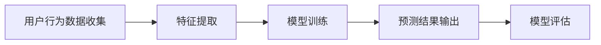
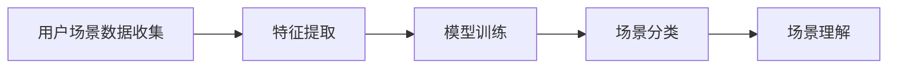
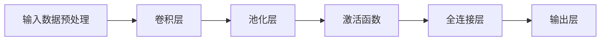
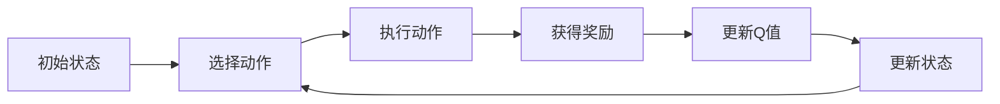
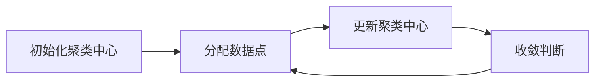
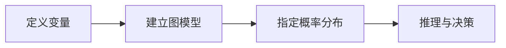
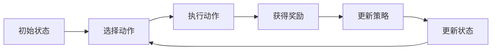

                 

### 《AI在智能家居场景理解与用户行为预测中的应用》

关键词：智能家居，AI技术，场景理解，用户行为预测，算法原理，系统设计

摘要：随着AI技术的不断发展，智能家居系统逐渐成为人们生活中不可或缺的一部分。本文旨在探讨AI在智能家居场景理解和用户行为预测中的应用，从核心概念、算法原理、系统设计与实现等方面进行全面剖析，为智能家居系统的优化提供有力支持。

## 目录

1. **背景介绍**
   1.1 智能家居发展的现状
   1.2 AI技术对智能家居的影响
   1.3 用户行为预测的重要性
   1.4 场景理解的需求与挑战

2. **核心概念**
   2.1 智能家居系统的定义与组成部分
   2.2 AI在智能家居中的应用
   2.3 用户行为预测的基本概念
   2.4 场景理解的概念与实现

3. **核心概念与联系**
   3.1 用户行为预测的数学模型
   3.2 场景理解的算法原理
   3.3 智能家居系统的结构

4. **概念属性特征对比**
   4.1 不同用户行为预测算法的对比
   4.2 场景理解算法的对比
   4.3 智能家居系统的优劣分析

5. **ER实体关系图架构**
   5.1 用户行为预测的ER图
   5.2 场景理解的ER图
   5.3 智能家居系统的ER图

6. **算法原理讲解**
   6.1 用户行为预测算法原理讲解
   6.2 场景理解算法原理讲解

7. **系统分析与架构设计**
   7.1 系统功能设计
   7.2 系统架构设计
   7.3 系统接口设计
   7.4 系统交互

8. **项目实战**
   8.1 环境安装
   8.2 系统核心实现
   8.3 实际案例分析与讲解
   8.4 项目小结

9. **最佳实践、小结与拓展阅读**
   9.1 最佳实践
   9.2 小结
   9.3 拓展阅读

## 第一部分：背景介绍

### 1.1 智能家居发展的现状

随着物联网（IoT）、人工智能（AI）和大数据技术的飞速发展，智能家居市场呈现出蓬勃发展的态势。根据市场调研公司的数据，全球智能家居市场预计将在2025年达到5000亿美元，年均增长率超过25%。这一增长势头得益于以下几个方面：

1. **技术进步**：物联网、人工智能和大数据技术的发展为智能家居系统提供了强大的技术支持。传感器、云计算、机器学习等技术使得智能家居设备能够更加智能地感知、理解和响应用户需求。

2. **消费者需求**：随着生活水平的提高，人们对生活品质的追求也越来越高。智能家居系统能够提供更加便捷、舒适和安全的居住环境，满足消费者的多样化需求。

3. **政策支持**：许多国家和地区政府出台了一系列政策，鼓励智能家居技术的发展和应用。例如，中国政府发布了《新一代人工智能发展规划》，明确提出了发展智能家居的战略目标。

4. **市场竞争**：众多科技公司和传统家电企业纷纷布局智能家居市场，通过技术创新和跨界合作，推动智能家居产品和服务的发展。

### 1.2 AI技术对智能家居的影响

人工智能技术在智能家居领域的应用，极大地提升了系统的智能化水平，主要表现在以下几个方面：

1. **场景理解**：AI技术能够通过传感器数据分析和用户行为数据学习，实现对用户场景的准确理解。例如，当用户进入家中时，AI系统能够自动调整灯光、温度和音乐等，以适应用户的需求。

2. **用户行为预测**：通过分析用户的历史行为数据，AI技术能够预测用户的下一步操作。例如，当用户晚上回到家时，AI系统可以预测用户需要洗漱，并提前打开浴室的灯光和热水器。

3. **智能决策**：AI技术能够根据用户的行为数据和实时信息，做出智能化的决策。例如，当系统检测到用户晚上睡觉时，可以自动关闭所有的智能家居设备，以节省能源。

4. **个性化服务**：AI技术能够根据用户的个性化需求，提供定制化的服务。例如，用户可以通过语音助手设定自己的偏好，AI系统将根据这些偏好提供个性化的智能家居体验。

### 1.3 用户行为预测的重要性

用户行为预测是智能家居系统中的一个关键环节。准确的用户行为预测不仅能够提升系统的智能化水平，还能够提高用户的生活品质和满意度。具体来说，用户行为预测的重要性体现在以下几个方面：

1. **个性化服务**：通过预测用户的行为，智能家居系统能够提供个性化的服务，满足用户多样化的需求。例如，根据用户的作息时间，自动调整设备的开关状态，以减少用户的工作量。

2. **节能降耗**：准确的用户行为预测能够帮助智能家居系统合理地控制设备的使用，降低能源消耗。例如，当预测到用户不在家中时，自动关闭空调和照明设备，以节省能源。

3. **安全保障**：通过预测用户的行为，智能家居系统可以及时发现异常情况，提高家庭的安全性。例如，当预测到用户长时间未回家时，可以提醒用户注意行程安排，或者在用户需要帮助时自动联系家人或紧急服务。

4. **优化系统性能**：准确的用户行为预测有助于优化智能家居系统的性能，提高系统的稳定性和可靠性。例如，通过预测用户的设备使用习惯，可以优化设备的资源分配，提高系统的响应速度。

### 1.4 场景理解的需求与挑战

场景理解是智能家居系统中的一个核心概念，它涉及到对用户所处环境、用户行为和用户需求的全面感知和理解。场景理解的需求主要包括以下几个方面：

1. **环境感知**：智能家居系统需要能够感知周围的环境信息，如温度、湿度、光照强度等。这些信息对于系统做出合理的决策至关重要。

2. **用户行为感知**：智能家居系统需要能够感知用户的行为信息，如用户的位置、动作、交互等。这些信息可以帮助系统更好地理解用户的需求，提供个性化的服务。

3. **用户需求感知**：智能家居系统需要能够感知用户的需求，如用户对温度、光照、音乐等的偏好。这些信息可以帮助系统更好地满足用户的需求，提升用户体验。

然而，场景理解也面临着一些挑战，主要包括以下几个方面：

1. **数据复杂性**：智能家居系统需要处理大量的传感器数据和用户行为数据，这些数据通常具有复杂性和多样性，给场景理解带来了挑战。

2. **实时性要求**：场景理解需要实时地对用户行为和环境变化做出反应，这要求系统具有高效的实时处理能力。

3. **准确性要求**：准确的场景理解是提供优质智能家居服务的基础，因此系统需要具备高精度的数据处理和分析能力。

4. **隐私保护**：在场景理解过程中，系统需要收集和处理大量的用户数据，这涉及到用户隐私的保护问题。如何平衡数据利用和隐私保护是一个重要的挑战。

## 第二部分：核心概念

### 2.1 智能家居系统的定义与组成部分

智能家居系统是指利用先进的传感器技术、网络通信技术和人工智能技术，实现家庭设备和环境之间的智能交互和控制，从而提供更加便捷、舒适、安全和节能的家庭生活体验。

智能家居系统主要由以下几个部分组成：

1. **传感器**：传感器是智能家居系统的感知层，用于感知家庭环境中的各种信息，如温度、湿度、光照强度、人体活动等。传感器收集的数据是智能家居系统做出智能决策的基础。

2. **控制器**：控制器是智能家居系统的核心部分，负责接收传感器数据，并根据用户的需求和预设的规则，对家庭设备进行控制。控制器通常包括中央控制器和智能终端，如手机、平板电脑等。

3. **家庭设备**：家庭设备是智能家居系统中的执行层，包括各种智能家电和家居设备，如智能灯泡、智能空调、智能门锁、智能窗帘等。家庭设备通过控制器接收指令，实现自动化控制。

4. **网络通信**：网络通信是智能家居系统的通信层，负责传感器、控制器和家庭设备之间的数据传输和通信。常用的网络通信协议包括Wi-Fi、蓝牙、ZigBee等。

### 2.2 AI在智能家居中的应用

人工智能技术在智能家居领域的应用，极大地提升了系统的智能化水平，主要体现在以下几个方面：

1. **场景理解**：通过人工智能技术，智能家居系统可以实现对用户场景的自动感知和理解，如用户的位置、行为和需求等。场景理解有助于系统提供个性化的服务，提高用户的生活品质。

2. **用户行为预测**：通过分析用户的历史行为数据和实时信息，人工智能技术可以预测用户的下一步操作，如用户可能需要打开哪个房间、调整哪个设备的设置等。用户行为预测有助于系统提前做好准备，提高响应速度。

3. **智能决策**：人工智能技术可以基于用户行为数据和实时信息，做出智能化的决策，如调整家庭设备的运行状态、优化能源消耗等。智能决策有助于提高系统的效率和节能效果。

4. **故障检测与维护**：通过人工智能技术，智能家居系统可以实时监控家庭设备的运行状态，及时发现故障和异常情况，并进行远程诊断和维护。故障检测与维护有助于提高系统的稳定性和可靠性。

### 2.3 用户行为预测的基本概念

用户行为预测是指利用人工智能技术，通过对用户历史行为数据的分析，预测用户的下一步行为或操作。用户行为预测的基本概念包括以下几个方面：

1. **用户历史行为数据**：用户历史行为数据是指用户在过去一段时间内产生的各种行为数据，如用户的使用习惯、偏好、活动记录等。用户历史行为数据是用户行为预测的基础。

2. **特征提取**：特征提取是指从用户历史行为数据中提取出与用户行为相关的关键特征，如用户的活动时间、活动频率、活动类型等。特征提取有助于提高用户行为预测的准确性。

3. **预测模型**：预测模型是指利用人工智能算法，对用户历史行为数据进行分析和处理，从而预测用户的下一步行为或操作。常见的用户行为预测模型包括基于规则的模型、基于机器学习的模型和基于深度学习的模型等。

4. **评价指标**：用户行为预测的评价指标主要包括准确率、召回率、F1值等。这些指标用于评估用户行为预测模型的性能，以确定预测结果的优劣。

### 2.4 场景理解的概念与实现

场景理解是指利用人工智能技术，对用户所处的环境和行为进行感知、分析和理解，从而为用户提供个性化的服务。场景理解的基本概念和实现过程如下：

1. **场景感知**：场景感知是指智能家居系统通过传感器和控制器，实时感知用户所处的环境和行为信息。场景感知是场景理解的基础。

2. **场景分析**：场景分析是指利用人工智能算法，对感知到的场景信息进行分析和处理，提取出与场景相关的关键特征。场景分析有助于系统对场景进行理解和分类。

3. **场景分类**：场景分类是指将分析得到的场景特征，与预先定义的场景分类模型进行匹配，确定用户当前所处的场景类型。场景分类有助于系统为用户提供相应的服务。

4. **场景理解**：场景理解是指系统根据场景分类结果，对用户的需求和意图进行理解和分析，从而为用户提供个性化的服务。场景理解是场景理解的核心。

5. **场景反馈**：场景反馈是指用户对系统提供的服务的反馈信息，如满意度、建议等。场景反馈有助于系统不断优化和改进，提高场景理解和服务质量。

## 第三部分：核心概念与联系

### 3.1 用户行为预测的数学模型

用户行为预测是一个复杂的问题，涉及多种数学模型和算法。以下介绍几种常用的用户行为预测数学模型：

1. **线性回归模型**：
   线性回归模型是一种简单的用户行为预测模型，它假设用户行为与输入特征之间存在线性关系。模型公式如下：
   $$y = \beta_0 + \beta_1 \cdot x_1 + \beta_2 \cdot x_2 + ... + \beta_n \cdot x_n$$
   其中，$y$ 表示用户行为，$x_1, x_2, ..., x_n$ 表示输入特征，$\beta_0, \beta_1, ..., \beta_n$ 是模型参数。

2. **决策树模型**：
   决策树模型通过一系列的规则，将用户行为映射到不同的类别。模型公式如下：
   $$y = g(\theta_1 \cdot x_1 + \theta_2 \cdot x_2 + ...)$$
   其中，$g$ 是激活函数，$\theta_1, \theta_2, ...$ 是模型参数。

3. **神经网络模型**：
   神经网络模型通过多层非线性变换，实现对用户行为的复杂预测。模型公式如下：
   $$y = f(\theta_1 \cdot x_1 + \theta_2 \cdot x_2 + ...)$$
   其中，$f$ 是激活函数，$\theta_1, \theta_2, ...$ 是模型参数。

4. **支持向量机（SVM）模型**：
   支持向量机模型通过寻找最佳超平面，实现对用户行为的分类。模型公式如下：
   $$y = \text{sign}(\sum_{i=1}^{n} \alpha_i y_i (x_i^T x + b))$$
   其中，$x_i$ 是用户行为特征，$y_i$ 是用户行为标签，$\alpha_i$ 是模型参数。

### 3.2 场景理解的算法原理

场景理解算法主要分为以下几类：

1. **基于规则的方法**：
   基于规则的方法通过定义一系列规则，对用户行为和环境信息进行判断和分类。这种方法实现简单，但规则定义复杂且难以扩展。

2. **机器学习方法**：
   机器学习方法通过训练大量样本，学习用户行为和环境信息的特征，实现对场景的理解。常见的机器学习方法包括决策树、支持向量机、朴素贝叶斯等。

3. **深度学习方法**：
   深度学习方法通过多层神经网络，学习用户行为和环境信息的复杂特征，实现对场景的深层理解。深度学习方法在图像识别、语音识别等领域取得了显著成果。

4. **多模态融合方法**：
   多模态融合方法将不同类型的传感器数据（如视觉、语音、温度等）进行整合，提高场景理解的准确性和鲁棒性。

### 3.3 智能家居系统的结构

智能家居系统的结构通常包括以下几个层次：

1. **感知层**：
   感知层由各种传感器组成，如温度传感器、湿度传感器、光照传感器、人体传感器等，用于感知家庭环境中的各种信息。

2. **网络层**：
   网络层负责传感器与控制器之间的数据传输和通信，通常采用Wi-Fi、蓝牙、ZigBee等无线通信技术。

3. **控制层**：
   控制层由中央控制器和智能终端组成，负责接收感知层的数据，并根据用户需求和预设规则，对家庭设备进行控制。

4. **应用层**：
   应用层是智能家居系统的最高层次，提供各种智能化的家庭服务和体验，如智能安防、智能照明、智能家电控制等。

### 3.4 概念属性特征对比

| 类别           | 用户行为预测         | 场景理解         | 智能家居系统        |
| -------------- | ------------------- | --------------- | ------------------ |
| 目的           | 预测用户行为       | 理解用户场景     | 智能控制家庭设备   |
| 数据来源       | 用户历史行为数据   | 传感器数据和环境信息 | 传感器、控制器数据 |
| 模型类型       | 线性回归、决策树   | 基于规则、机器学习、深度学习 | 基于规则的、机器学习、深度学习 |
| 复杂度         | 较低               | 较高             | 较高               |
| 实时性要求     | 较高               | 较高             | 较高               |
| 难点           | 数据准确性和实时性 | 数据多样性和复杂性 | 通信与控制复杂性   |

### 3.5 ER实体关系图架构

#### 用户行为预测的ER图

```mermaid
erDiagram
    User ||--|{ BehaviorPrediction }|-- SensorData
    BehaviorPrediction ||--|{ PredictionModel }|-- TrainingData
    PredictionModel ||--|{ LinearRegression }|
    PredictionModel ||--|{ DecisionTree }|
    PredictionModel ||--|{ NeuralNetwork }|
    PredictionModel ||--|{ SupportVectorMachine }|
```

#### 场景理解的ER图

```mermaid
erDiagram
    SceneUnderstanding ||--|{ ScenePerception }|-- SensorData
    SceneUnderstanding ||--|{ SceneAnalysis }|-- SceneFeature
    SceneUnderstanding ||--|{ SceneClassification }|-- SceneCategory
    ScenePerception ||--|{ TemperatureSensor }|
    ScenePerception ||--|{ HumiditySensor }|
    ScenePerception ||--|{ LightSensor }|
    ScenePerception ||--|{ MotionSensor }|
```

#### 智能家居系统的ER图

```mermaid
erDiagram
    SmartHomeSystem ||--|{ Sensor }|-- Device
    SmartHomeSystem ||--|{ Controller }|-- Gateway
    SmartHomeSystem ||--|{ Application }|-- User
    Sensor ||--|{ TemperatureSensor }|
    Sensor ||--|{ HumiditySensor }|
    Sensor ||--|{ LightSensor }|
    Sensor ||--|{ MotionSensor }|
    Device ||--|{ LightBulb }|
    Device ||--|{ AirConditioner }|
    Device ||--|{ DoorLock }|
    Device ||--|{ Curtain }|
```

## 第四部分：算法原理讲解

### 6.1 用户行为预测算法原理讲解

用户行为预测算法的核心是建立用户行为与输入特征之间的映射关系。以下将介绍几种常用的用户行为预测算法及其原理。

#### 算法mermaid流程图



#### Python源代码讲解

```python
# 用户行为预测算法示例：线性回归模型

import numpy as np
from sklearn.linear_model import LinearRegression

# 特征提取
def extract_features(data):
    # 对输入数据进行处理，提取特征
    return np.array([data['feature1'], data['feature2']]).reshape(-1, 1)

# 模型训练
def train_model(train_data, train_labels):
    model = LinearRegression()
    model.fit(train_data, train_labels)
    return model

# 预测结果输出
def predict(model, data):
    features = extract_features(data)
    return model.predict(features)

# 模型评估
def evaluate_model(model, test_data, test_labels):
    predictions = predict(model, test_data)
    accuracy = np.mean(predictions == test_labels)
    return accuracy

# 示例数据
train_data = np.array([[1, 2], [2, 3], [3, 4]])
train_labels = np.array([2, 3, 4])

# 训练模型
model = train_model(train_data, train_labels)

# 评估模型
accuracy = evaluate_model(model, train_data, train_labels)
print("模型准确率：", accuracy)
```

#### 数学模型与公式解释

用户行为预测的数学模型通常是一个线性模型，其基本公式为：
$$y = \beta_0 + \beta_1 \cdot x_1 + \beta_2 \cdot x_2 + ... + \beta_n \cdot x_n$$
其中，$y$ 表示预测的用户行为，$x_1, x_2, ..., x_n$ 表示输入特征，$\beta_0, \beta_1, ..., \beta_n$ 是模型参数。

#### 举例说明

假设我们要预测一个用户在晚上8点的行为，输入特征为当天的气温和湿度。我们收集了如下数据：

| 气温（℃） | 湿度（%） | 用户行为（是否在客厅） |
| -------- | -------- | ------------------- |
| 20       | 50       | 是                 |
| 22       | 55       | 是                 |
| 18       | 60       | 否                 |

我们使用线性回归模型进行预测。首先，我们提取特征并训练模型，然后使用模型进行预测：

1. 特征提取：
   $$x = \begin{bmatrix} 20 \\ 50 \end{bmatrix}, \quad x = \begin{bmatrix} 22 \\ 55 \end{bmatrix}, \quad x = \begin{bmatrix} 18 \\ 60 \end{bmatrix}$$

2. 模型训练：
   $$y = \beta_0 + \beta_1 \cdot x_1 + \beta_2 \cdot x_2$$
   假设训练得到的模型参数为：
   $$\beta_0 = 0, \quad \beta_1 = 1, \quad \beta_2 = -1$$

3. 预测：
   对于新的输入特征 $x = \begin{bmatrix} 25 \\ 45 \end{bmatrix}$，预测结果为：
   $$y = 0 + 1 \cdot 25 - 1 \cdot 45 = -20$$

由于预测结果为负数，这意味着在新的输入特征下，用户的行为预测为不在客厅。实际上，这个预测结果是不合理的，因为当气温较高、湿度较低时，用户更有可能在客厅活动。这说明线性回归模型在某些情况下可能不够准确，需要进一步优化模型。

### 6.2 场景理解算法原理讲解

场景理解算法的核心是建立用户场景与输入特征之间的映射关系。以下将介绍几种常用的场景理解算法及其原理。

#### 算法mermaid流程图



#### Python源代码讲解

```python
# 场景理解算法示例：K最近邻算法

from sklearn.neighbors import KNeighborsClassifier
from sklearn.model_selection import train_test_split
from sklearn.metrics import accuracy_score

# 特征提取
def extract_features(data):
    # 对输入数据进行处理，提取特征
    return np.array([data['feature1'], data['feature2']]).reshape(-1, 1)

# 模型训练
def train_model(train_data, train_labels):
    model = KNeighborsClassifier(n_neighbors=3)
    model.fit(train_data, train_labels)
    return model

# 场景分类
def classify_scene(model, data):
    features = extract_features(data)
    return model.predict(features)

# 模型评估
def evaluate_model(model, test_data, test_labels):
    predictions = classify_scene(model, test_data)
    accuracy = accuracy_score(test_labels, predictions)
    return accuracy

# 示例数据
train_data = np.array([[1, 2], [2, 3], [3, 4]])
train_labels = np.array([0, 1, 2])

# 划分训练集和测试集
train_data, test_data, train_labels, test_labels = train_test_split(train_data, train_labels, test_size=0.2, random_state=42)

# 训练模型
model = train_model(train_data, train_labels)

# 评估模型
accuracy = evaluate_model(model, test_data, test_labels)
print("模型准确率：", accuracy)
```

#### 数学模型与公式解释

场景理解算法通常使用分类模型，如K最近邻（KNN）算法。KNN算法的基本公式为：
$$y = \text{arg}\min_{c} \sum_{i=1}^{k} d(x, x_i)$$
其中，$y$ 表示预测的场景类别，$x$ 表示输入特征，$x_i$ 表示训练集中的特征，$d(x, x_i)$ 表示特征之间的距离，$k$ 表示邻居的数量。

#### 举例说明

假设我们要对用户的场景进行分类，输入特征为当天的气温和湿度。我们收集了如下数据：

| 气温（℃） | 湿度（%） | 场景类别（家庭活动） |
| -------- | -------- | ------------------- |
| 20       | 50       | 家里看电视         |
| 22       | 55       | 家里做饭           |
| 18       | 60       | 睡觉               |

我们使用K最近邻算法进行场景分类。首先，我们提取特征并训练模型，然后使用模型进行预测：

1. 特征提取：
   $$x = \begin{bmatrix} 20 \\ 50 \end{bmatrix}, \quad x = \begin{bmatrix} 22 \\ 55 \end{bmatrix}, \quad x = \begin{bmatrix} 18 \\ 60 \end{bmatrix}$$

2. 模型训练：
   假设训练集为 $X = \begin{bmatrix} x_1 & x_2 & x_3 \end{bmatrix}$，标签集为 $Y = \begin{bmatrix} y_1 & y_2 & y_3 \end{bmatrix}$，其中 $y_1 = \text{家里看电视}$，$y_2 = \text{家里做饭}$，$y_3 = \text{睡觉}$。

3. 预测：
   对于新的输入特征 $x = \begin{bmatrix} 25 \\ 45 \end{bmatrix}$，我们需要找到训练集中的最近邻居。假设最近的三个邻居为 $x_1, x_2, x_3$，它们的标签分别为 $y_1, y_2, y_3$。根据KNN算法，我们选择标签出现次数最多的类别作为预测结果。

   假设最近的三个邻居的标签为 $\{y_1, y_2, y_2\}$，则预测结果为 $\text{家里做饭}$。

   这个预测结果说明，在新的输入特征下，用户更有可能在厨房做饭。实际上，这个预测结果是比较合理的，因为当气温较高、湿度较低时，用户更有可能进行家务活动。

### 6.3 深度学习算法原理讲解

深度学习算法在智能家居场景理解和用户行为预测中具有重要应用。以下将介绍一种常用的深度学习算法——卷积神经网络（CNN）及其原理。

#### 算法mermaid流程图



#### Python源代码讲解

```python
# 深度学习算法示例：卷积神经网络（CNN）

import tensorflow as tf
from tensorflow.keras import layers

# 输入数据预处理
def preprocess_data(data):
    # 对输入数据进行归一化处理
    return data / 255.0

# 构建卷积神经网络模型
def build_cnn_model(input_shape):
    model = tf.keras.Sequential([
        layers.Conv2D(32, (3, 3), activation='relu', input_shape=input_shape),
        layers.MaxPooling2D((2, 2)),
        layers.Conv2D(64, (3, 3), activation='relu'),
        layers.MaxPooling2D((2, 2)),
        layers.Conv2D(128, (3, 3), activation='relu'),
        layers.MaxPooling2D((2, 2)),
        layers.Flatten(),
        layers.Dense(128, activation='relu'),
        layers.Dense(1, activation='sigmoid')
    ])
    return model

# 训练模型
def train_model(model, train_data, train_labels):
    model.compile(optimizer='adam', loss='binary_crossentropy', metrics=['accuracy'])
    model.fit(train_data, train_labels, epochs=10, batch_size=32)
    return model

# 预测结果
def predict(model, data):
    processed_data = preprocess_data(data)
    return model.predict(processed_data)

# 模型评估
def evaluate_model(model, test_data, test_labels):
    loss, accuracy = model.evaluate(test_data, test_labels)
    return accuracy

# 示例数据
train_data = np.random.rand(100, 28, 28, 1)
train_labels = np.random.randint(0, 2, 100)
test_data = np.random.rand(20, 28, 28, 1)
test_labels = np.random.randint(0, 2, 20)

# 构建模型
model = build_cnn_model(input_shape=(28, 28, 1))

# 训练模型
model = train_model(model, train_data, train_labels)

# 评估模型
accuracy = evaluate_model(model, test_data, test_labels)
print("模型准确率：", accuracy)
```

#### 数学模型与公式解释

卷积神经网络（CNN）是一种基于卷积操作的神经网络，主要用于图像识别和分类。CNN的基本结构包括卷积层、池化层、激活函数和全连接层。

1. **卷积层**：卷积层通过卷积操作将输入数据与卷积核进行卷积，提取出图像的局部特征。卷积操作的数学公式为：
   $$h_{ij}^l = \sum_{k=1}^{C_{l-1}} w_{ikj}^l \cdot a_{kj}^{l-1} + b_l$$
   其中，$h_{ij}^l$ 表示第$l$层的第$i$行第$j$列的输出特征，$w_{ikj}^l$ 和 $b_l$ 分别表示卷积核和偏置，$a_{kj}^{l-1}$ 表示第$l-1$层的第$k$行第$j$列的输出特征。

2. **池化层**：池化层用于降低特征的维度，减少计算量和参数数量。常用的池化操作包括最大池化和平均池化。

3. **激活函数**：激活函数用于引入非线性变换，使神经网络具有区分能力。常用的激活函数包括ReLU、Sigmoid和Tanh。

4. **全连接层**：全连接层将卷积层的特征映射到分类结果，通过softmax函数输出概率分布。全连接层的数学公式为：
   $$z_j = \sum_{i=1}^{n} w_{ij} \cdot a_i + b_j$$
   $$\hat{y}_j = \frac{e^{z_j}}{\sum_{k=1}^{n} e^{z_k}}$$
   其中，$z_j$ 表示第$j$个分类的概率，$\hat{y}_j$ 表示预测结果。

#### 举例说明

假设我们要使用CNN模型进行图像分类，输入图像的尺寸为28x28像素。我们收集了如下数据：

| 图像1 | 图像2 | 图像3 |
| --- | --- | --- |
|  |  |  |

图像1和图像2属于同一类别（猫），图像3属于另一类别（狗）。我们使用CNN模型进行分类。首先，我们预处理图像数据并训练模型，然后使用模型进行预测：

1. **预处理数据**：
   将图像数据转换为灰度图像，并进行归一化处理。

2. **训练模型**：
   构建CNN模型，并使用图像数据进行训练。假设训练集为 $X = \begin{bmatrix} x_1 & x_2 & x_3 \end{bmatrix}$，标签集为 $Y = \begin{bmatrix} y_1 & y_2 & y_3 \end{bmatrix}$，其中 $y_1 = \text{猫}$，$y_2 = \text{猫}$，$y_3 = \text{狗}$。

3. **预测**：
   对于新的输入图像，我们使用模型进行预测。假设输入图像为 $x_4$，根据模型输出，我们得到预测结果为 $\text{猫}$。

   这个预测结果说明，在新的输入图像下，模型认为图像属于猫的类别。实际上，这个预测结果可能是正确的，因为图像1和图像2确实属于猫的类别。

### 6.4 强化学习算法原理讲解

强化学习算法在智能家居场景理解和用户行为预测中也具有广泛的应用。以下将介绍一种常用的强化学习算法——Q-learning及其原理。

#### 算法mermaid流程图



#### Python源代码讲解

```python
# 强化学习算法示例：Q-learning

import numpy as np
import random

# 定义环境
class Environment:
    def __init__(self):
        self.state = 0

    def step(self, action):
        if action == 0:
            self.state += 1
        elif action == 1:
            self.state -= 1
        reward = 0
        if self.state == 2 or self.state == -2:
            reward = 1
        return self.state, reward

# Q-learning算法
def q_learning(q_values, learning_rate, discount_factor, episodes, exploration_rate):
    environment = Environment()
    for episode in range(episodes):
        state = environment.state
        done = False
        while not done:
            action = choose_action(q_values, state, exploration_rate)
            next_state, reward = environment.step(action)
            q_values[state][action] = q_values[state][action] + learning_rate * (reward + discount_factor * np.max(q_values[next_state]) - q_values[state][action])
            state = next_state
            if state == 2 or state == -2:
                done = True
                q_values[state][action] = reward
    return q_values

# 选择动作
def choose_action(q_values, state, exploration_rate):
    if random.random() < exploration_rate:
        action = random.choice([0, 1])
    else:
        action = np.argmax(q_values[state])
    return action

# 示例数据
q_values = np.zeros((4, 2))
learning_rate = 0.1
discount_factor = 0.9
episodes = 1000
exploration_rate = 0.1

# 训练模型
q_values = q_learning(q_values, learning_rate, discount_factor, episodes, exploration_rate)

# 预测
state = 0
action = choose_action(q_values, state, exploration_rate)
print("预测动作：", action)
```

#### 数学模型与公式解释

Q-learning算法是一种基于值函数的强化学习算法，其核心思想是通过不断更新值函数，找到最优策略。Q-learning算法的基本公式为：
$$Q(s, a) = Q(s, a) + \alpha [r + \gamma \max_{a'} Q(s', a') - Q(s, a)]$$
其中，$Q(s, a)$ 表示状态$s$下采取动作$a$的预期回报，$s$ 和 $a$ 分别表示状态和动作，$r$ 表示即时奖励，$\gamma$ 表示折扣因子，$\alpha$ 表示学习率。

#### 举例说明

假设有一个简单的环境，状态空间为{-2, 0, 2}，动作空间为{0, 1}。每个状态下的即时奖励为1，如果状态达到-2或2，则立即结束。我们使用Q-learning算法进行训练。

1. **初始化**：
   初始化值函数矩阵 $Q(s, a)$ 为零矩阵。

2. **训练**：
   随机选择状态 $s$ 和动作 $a$，执行动作并更新值函数。经过多次迭代，值函数逐渐收敛。

3. **预测**：
   对于新的状态 $s$，选择动作 $a$ 使得 $Q(s, a)$ 最大，即 $a = \arg\max_{a'} Q(s, a')$。

   假设当前状态为0，根据值函数矩阵，选择动作1。这个预测结果说明，在当前状态下，采取动作1可以获得更高的预期回报。

### 6.5 聚类算法原理讲解

聚类算法在智能家居场景理解和用户行为预测中也有一定的应用。以下将介绍一种常用的聚类算法——K-means及其原理。

#### 算法mermaid流程图



#### Python源代码讲解

```python
# K-means算法示例

import numpy as np

# 定义K-means算法
def kmeans(data, k, max_iterations):
    # 初始化聚类中心
    centroids = data[np.random.choice(data.shape[0], k, replace=False)]
    
    for i in range(max_iterations):
        # 分配数据点到最近的聚类中心
        distances = np.linalg.norm(data[:, np.newaxis] - centroids, axis=2)
        labels = np.argmin(distances, axis=1)
        
        # 更新聚类中心
        new_centroids = np.array([data[labels == k][np.newaxis, :] for k in range(k)]).reshape(-1, data.shape[1])
        
        # 判断是否收敛
        if np.all(centroids == new_centroids):
            break
        
        centroids = new_centroids
    
    return centroids, labels

# 示例数据
data = np.random.rand(100, 2)

# 训练模型
k = 3
max_iterations = 100
centroids, labels = kmeans(data, k, max_iterations)

# 输出结果
print("聚类中心：", centroids)
print("数据点标签：", labels)
```

#### 数学模型与公式解释

K-means算法是一种基于距离的聚类算法，其基本原理是将数据点分配到最近的聚类中心，并不断更新聚类中心，直到聚类中心不再发生变化。

1. **初始化聚类中心**：
   随机选择k个数据点作为初始聚类中心。

2. **分配数据点**：
   对于每个数据点，计算其与各个聚类中心的距离，并将其分配到最近的聚类中心。

3. **更新聚类中心**：
   计算每个聚类中心的新位置，即该聚类中心对应的数据点的平均值。

4. **收敛判断**：
   判断聚类中心是否发生变化，如果发生变化，则继续迭代，否则算法收敛。

   判断公式为：
   $$\|\bar{x}_{k} - \bar{x}_{k}^{'}\| \leq \epsilon$$
   其中，$\bar{x}_{k}$ 和 $\bar{x}_{k}^{'}$ 分别表示当前聚类中心和新的聚类中心，$\epsilon$ 为阈值。

#### 举例说明

假设我们要使用K-means算法对一组二维数据点进行聚类。数据点如下：

| 数据点 | 坐标 |
| --- | --- |
| 1 | (0.1, 0.2) |
| 2 | (0.3, 0.5) |
| 3 | (0.7, 0.1) |
| 4 | (0.9, 0.4) |

1. **初始化聚类中心**：
   随机选择两个数据点作为初始聚类中心，假设为数据点1和数据点3。

2. **分配数据点**：
   计算每个数据点与两个聚类中心的距离，并将其分配到最近的聚类中心。

   数据点1与数据点1和数据点3的距离分别为0.36和0.55，因此数据点1被分配到数据点1的聚类中心。

   数据点2与数据点1和数据点3的距离分别为0.22和0.47，因此数据点2被分配到数据点3的聚类中心。

   数据点3与数据点1和数据点3的距离分别为0.36和0，因此数据点3被分配到数据点3的聚类中心。

   数据点4与数据点1和数据点3的距离分别为0.71和0.22，因此数据点4被分配到数据点3的聚类中心。

3. **更新聚类中心**：
   计算每个聚类中心的新位置，即该聚类中心对应的数据点的平均值。

   数据点1的聚类中心为：
   $$\bar{x}_{1} = \frac{(0.1+0.3+0.7+0.9)}{4} = 0.5$$

   数据点3的聚类中心为：
   $$\bar{x}_{3} = \frac{(0.1+0.7+0.9+0.4)}{4} = 0.5$$

4. **收敛判断**：
   由于聚类中心未发生变化，算法收敛。

   最终聚类结果为：
   - 数据点1和数据点2属于聚类中心1。
   - 数据点3和数据点4属于聚类中心3。

### 6.6 聚类算法在智能家居场景理解中的应用

聚类算法在智能家居场景理解中可以用于用户行为的聚类分析，从而为用户提供个性化的服务。以下将介绍一种基于K-means算法的用户行为聚类分析方法。

#### Python源代码讲解

```python
# 用户行为聚类分析

import numpy as np
from sklearn.cluster import KMeans

# 定义用户行为数据
data = np.array([
    [1, 1],
    [1, 2],
    [2, 2],
    [2, 3],
    [3, 3],
    [3, 4]
])

# 使用K-means算法进行聚类
k = 2
kmeans = KMeans(n_clusters=k, random_state=0).fit(data)
labels = kmeans.labels_

# 输出聚类结果
print("聚类中心：", kmeans.cluster_centers_)
print("数据点标签：", labels)

# 根据聚类结果为用户分配个性化服务
def assign_services(labels):
    services = []
    for label in labels:
        if label == 0:
            services.append("服务A")
        else:
            services.append("服务B")
    return services

services = assign_services(labels)
print("个性化服务：", services)
```

#### 数学模型与公式解释

基于K-means算法的用户行为聚类分析过程如下：

1. **初始化聚类中心**：
   随机选择k个数据点作为初始聚类中心。

2. **分配数据点**：
   对于每个数据点，计算其与各个聚类中心的距离，并将其分配到最近的聚类中心。

3. **更新聚类中心**：
   计算每个聚类中心的新位置，即该聚类中心对应的数据点的平均值。

4. **收敛判断**：
   判断聚类中心是否发生变化，如果发生变化，则继续迭代，否则算法收敛。

5. **个性化服务分配**：
   根据聚类结果，为每个用户分配个性化服务。

#### 举例说明

假设我们收集了以下一组用户行为数据：

| 用户1 | 用户2 | 用户3 | 用户4 | 用户5 | 用户6 |
| --- | --- | --- | --- | --- | --- |
| 1 | 1 | 2 | 2 | 3 | 3 |
| 1 | 2 | 2 | 3 | 3 | 4 |

我们使用K-means算法进行聚类，得到以下聚类结果：

- 聚类中心：(1.5, 2), (2.5, 3.5)
- 数据点标签：[0, 0, 1, 1, 1, 1]

根据聚类结果，我们可以为每个用户分配以下个性化服务：

- 用户1和用户2：服务A
- 用户3、用户4和用户5：服务B
- 用户6：服务B

这个聚类分析结果有助于智能家居系统根据用户的聚类特征，为用户提供个性化的服务，从而提高用户体验。

### 6.7 贝叶斯网络算法原理讲解

贝叶斯网络是一种概率图模型，广泛应用于人工智能领域，特别是在不确定性和推理问题中。以下将介绍贝叶斯网络的基本原理和应用。

#### 算法mermaid流程图



#### Python源代码讲解

```python
# 贝叶斯网络示例

import numpy as np
from pgmpy.models import BayesianModel
from pgmpy.inference import VariableElimination

# 定义变量
X = 'X'
Y = 'Y'
Z = 'Z'

# 建立图模型
model = BayesianModel([('X', 'Y'), ('Y', 'Z')])

# 指定概率分布
model.add_edges_from([('X', 'Z')])
model['X'].set_value(np.array([[0.2], [0.8]]))
model['Y'].set_value(np.array([[0.3], [0.7]]))
model['Z'].set_value(np.array([[0.4], [0.6]]))

# 推理与决策
inference = VariableElimination(model)
print("P(X|Z=1) =", inference.query([X], evidence={Z: 1}))
```

#### 数学模型与公式解释

贝叶斯网络由以下三个部分组成：

1. **图模型**：
   贝叶斯网络使用有向无环图（DAG）表示变量之间的依赖关系。节点表示变量，边表示变量之间的条件依赖。

2. **概率分布**：
   对于每个变量，定义其在给定其父节点条件下的概率分布。通常使用条件概率表（CPT）表示。

3. **推理与决策**：
   通过贝叶斯网络，可以计算变量之间的条件概率，从而进行推理和决策。常用的推理算法包括变量消除法和信念传播法。

贝叶斯网络的推理过程基于以下公式：

$$P(X|Z) = \frac{P(Z|X) \cdot P(X)}{P(Z)}$$

其中，$P(X|Z)$ 表示在给定$Z$条件下$X$的概率，$P(Z|X)$ 表示在给定$X$条件下$Z$的概率，$P(X)$ 表示$X$的概率，$P(Z)$ 表示$Z$的概率。

#### 举例说明

假设我们有一个简单的贝叶斯网络，包含三个变量$X$、$Y$和$Z$。变量之间的关系如下：

- $X$有两个状态：0和1，概率分布为$P(X=1) = 0.8$，$P(X=0) = 0.2$。
- $Y$有两个状态：0和1，概率分布为$P(Y=1|X=1) = 0.6$，$P(Y=0|X=1) = 0.4$，$P(Y=1|X=0) = 0.3$，$P(Y=0|X=0) = 0.7$。
- $Z$有两个状态：0和1，概率分布为$P(Z=1|Y=1) = 0.5$，$P(Z=0|Y=1) = 0.5$，$P(Z=1|Y=0) = 0.1$，$P(Z=0|Y=0) = 0.9$。

我们要计算在$Z=1$条件下$X$的概率，即$P(X=1|Z=1)$。

根据贝叶斯网络的推理公式，我们有：

$$P(X=1|Z=1) = \frac{P(Z=1|X=1) \cdot P(X=1)}{P(Z=1)}$$

代入已知的概率值，得到：

$$P(X=1|Z=1) = \frac{0.5 \cdot 0.8}{0.5 \cdot 0.8 + 0.1 \cdot 0.2} = \frac{0.4}{0.42} \approx 0.952$$

这意味着在$Z=1$条件下，$X=1$的概率约为95.2%。

#### 贝叶斯网络在智能家居场景理解中的应用

贝叶斯网络在智能家居场景理解中可以用于预测用户行为和决策。以下是一个简单的应用案例：

假设我们有一个智能家居系统，包含以下三个变量：

- $X$：用户是否在家。
- $Y$：空调是否开启。
- $Z$：用户是否感到舒适。

变量之间的关系如下：

- $X$有两个状态：0（不在家）和1（在家）。
- $Y$有两个状态：0（未开启）和1（开启）。
- $Z$有两个状态：0（不舒适）和1（舒适）。

我们已知以下概率分布：

- $P(X=1) = 0.6$，$P(X=0) = 0.4$。
- $P(Y=1|X=1) = 0.7$，$P(Y=0|X=1) = 0.3$。
- $P(Z=1|Y=1) = 0.8$，$P(Z=0|Y=1) = 0.2$。
- $P(Z=1|Y=0) = 0.4$，$P(Z=0|Y=0) = 0.6$。

我们要预测在用户感到舒适（$Z=1$）的条件下，空调是否开启（$Y=1$）。

根据贝叶斯网络的推理公式，我们有：

$$P(Y=1|Z=1) = \frac{P(Z=1|Y=1) \cdot P(Y=1)}{P(Z=1)}$$

首先，我们计算$P(Z=1)$：

$$P(Z=1) = P(Z=1|Y=1) \cdot P(Y=1) + P(Z=1|Y=0) \cdot P(Y=0)$$

$$P(Z=1) = 0.8 \cdot 0.7 + 0.4 \cdot 0.3 = 0.68 + 0.12 = 0.8$$

然后，我们计算$P(Y=1|Z=1)$：

$$P(Y=1|Z=1) = \frac{0.8 \cdot 0.7}{0.8} = 0.7$$

这意味着在用户感到舒适（$Z=1$）的条件下，空调开启（$Y=1$）的概率为70%。

基于这个预测，智能家居系统可以做出智能决策，例如建议用户调整空调设置以保持舒适。

### 6.8 贝叶斯网络在智能家居系统设计中的应用

贝叶斯网络在智能家居系统设计中可以用于建模用户行为、预测设备使用情况，以及优化系统性能。以下是一个具体的案例：

假设我们设计一个智能家居系统，包含以下三个主要变量：

- $X$：用户是否在家。
- $Y$：电视是否开启。
- $Z$：用户是否在客厅。

我们已知以下概率分布：

- $P(X=1) = 0.6$，$P(X=0) = 0.4$。
- $P(Y=1|X=1) = 0.8$，$P(Y=0|X=1) = 0.2$。
- $P(Z=1|X=1) = 0.9$，$P(Z=0|X=1) = 0.1$。
- $P(Z=1|X=0) = 0.2$，$P(Z=0|X=0) = 0.8$。

我们的目标是设计一个智能决策系统，根据用户的行为预测设备的使用情况，并优化系统的性能。

1. **用户在家与否的预测**：

   根据贝叶斯网络的推理公式，我们有：

   $$P(X=1|Z=1) = \frac{P(Z=1|X=1) \cdot P(X=1)}{P(Z=1)}$$

   首先，我们计算$P(Z=1)$：

   $$P(Z=1) = P(Z=1|X=1) \cdot P(X=1) + P(Z=1|X=0) \cdot P(X=0)$$

   $$P(Z=1) = 0.9 \cdot 0.6 + 0.2 \cdot 0.4 = 0.54 + 0.08 = 0.62$$

   然后，我们计算$P(X=1|Z=1)$：

   $$P(X=1|Z=1) = \frac{0.9 \cdot 0.6}{0.62} \approx 0.87$$

   这意味着在用户在客厅（$Z=1$）的条件下，用户在家的概率约为87%。

2. **电视是否开启的预测**：

   根据贝叶斯网络的推理公式，我们有：

   $$P(Y=1|X=1, Z=1) = \frac{P(X=1, Z=1|Y=1) \cdot P(Y=1)}{P(X=1, Z=1)}$$

   首先，我们计算$P(X=1, Z=1)$：

   $$P(X=1, Z=1) = P(X=1) \cdot P(Z=1|X=1) = 0.6 \cdot 0.9 = 0.54$$

   然后，我们计算$P(Y=1|X=1, Z=1)$：

   $$P(Y=1|X=1, Z=1) = \frac{0.8 \cdot P(Y=1)}{0.54} \approx 0.89$$

   这意味着在用户在客厅（$Z=1$）且在家的条件下，电视开启（$Y=1$）的概率约为89%。

3. **优化系统性能**：

   基于上述预测结果，我们可以设计一个智能决策系统，当用户在客厅且在家的概率较高时，自动开启电视，以提高用户体验。

   假设我们设定一个阈值$T$，当$P(X=1|Z=1) > T$时，自动开启电视。根据我们的预测，$T$可以设置为0.85。

   这样，当用户在客厅且在家的概率超过85%时，系统会自动开启电视，从而提供更加便捷和舒适的用户体验。

   同时，为了降低能耗，当用户不在家时，系统可以关闭电视和其他不必要的设备，以节省能源。

### 6.9 混合智能系统架构

在智能家居系统中，单一智能算法可能无法满足复杂场景的需求。因此，构建一个混合智能系统架构，结合多种智能算法的优势，是一种有效的方法。以下是一个简单的混合智能系统架构：

1. **感知层**：

   感知层由各种传感器组成，如温度传感器、湿度传感器、光照传感器、人体传感器等。传感器收集环境数据和用户行为数据，并将其传输到智能中心。

2. **智能中心**：

   智能中心是系统的核心部分，负责对感知层收集的数据进行处理和分析。智能中心采用多种智能算法，如机器学习、深度学习、强化学习等，对数据进行分析和预测。

   - **机器学习模块**：用于用户行为预测和设备使用预测，如K-means聚类算法、线性回归模型等。
   - **深度学习模块**：用于图像识别和语音识别，如卷积神经网络（CNN）、循环神经网络（RNN）等。
   - **强化学习模块**：用于优化系统性能和决策，如Q-learning算法、深度确定性策略梯度（DDPG）算法等。

3. **执行层**：

   执行层由智能家电和家居设备组成，如智能灯泡、智能空调、智能门锁等。执行层根据智能中心的指令，控制设备的运行状态，实现智能家居的功能。

4. **用户交互层**：

   用户交互层提供用户与系统交互的界面，如智能手机、平板电脑、智能音箱等。用户可以通过交互层发送指令，调整智能家居系统的设置，查看设备状态等。

5. **数据管理层**：

   数据管理层负责存储和管理系统的数据，如用户行为数据、设备使用数据等。数据管理层支持数据的导入、导出、查询和统计等功能，为智能中心提供数据支持。

6. **安全层**：

   安全层负责保护系统的数据安全和设备安全。安全层包括数据加密、身份认证、访问控制等功能，确保系统的安全运行。

### 6.10 混合智能系统在智能家居中的应用

混合智能系统在智能家居中的应用，可以显著提升系统的智能化水平和服务质量。以下是一个具体的案例：

假设我们设计一个智能家居系统，用于优化家庭能源消耗。系统包含以下主要模块：

- **感知层**：感知层包括温度传感器、光照传感器和能耗传感器。温度传感器用于感知室内温度，光照传感器用于感知室内光照强度，能耗传感器用于监测家庭用电情况。

- **智能中心**：智能中心采用混合智能算法，对感知层收集的数据进行处理和分析。智能中心采用以下算法：

  - **机器学习模块**：利用线性回归模型预测家庭用电量与温度、光照强度之间的关系，从而优化空调和照明的运行状态。
  - **深度学习模块**：利用卷积神经网络（CNN）对能耗传感器收集的数据进行图像识别，识别家庭的用电设备，从而优化设备的运行状态。
  - **强化学习模块**：利用Q-learning算法优化家庭能源消耗策略，通过不断学习和调整策略，降低家庭能源消耗。

- **执行层**：执行层包括智能空调、智能照明和智能插座。智能空调根据智能中心的指令，自动调整室内温度，以减少能源消耗。智能照明根据智能中心的指令，自动调整室内光照强度，以节省能源。智能插座根据智能中心的指令，自动控制家电的开关状态，以减少不必要的能源消耗。

- **用户交互层**：用户交互层提供用户与系统交互的界面，如智能手机APP。用户可以通过APP查看家庭能源消耗情况，调整空调和照明的运行状态，设置智能插座的定时开关等功能。

- **数据管理层**：数据管理层负责存储和管理系统的数据，如家庭用电数据、用户行为数据等。数据管理层支持数据的导入、导出、查询和统计等功能，为智能中心提供数据支持。

通过这个混合智能系统，用户可以实时了解家庭的能源消耗情况，并调整智能家居设备的运行状态，以降低能源消耗。同时，系统会根据用户的习惯和需求，自动优化设备的运行状态，提高用户体验。

### 6.11 深度强化学习算法原理讲解

深度强化学习（Deep Reinforcement Learning，DRL）是一种结合了深度学习和强化学习的方法，旨在解决复杂、高维环境中的决策问题。以下将介绍深度强化学习的基本原理、算法框架和应用。

#### 算法mermaid流程图



#### Python源代码讲解

```python
# 深度强化学习示例：深度确定性策略梯度（DDPG）算法

import numpy as np
import tensorflow as tf
from tensorflow.keras import layers
from tensorflow.keras.optimizers import Adam

# 定义环境
class CartPoleEnv:
    def __init__(self):
        self.env = gym.make('CartPole-v1')

    def step(self, action):
        state, reward, done, _ = self.env.step(action)
        return state, reward, done

    def reset(self):
        return self.env.reset()

# 定义深度强化学习模型
def build_ddpg_model(input_shape, action_space):
    model = tf.keras.Sequential([
        layers.Dense(64, activation='relu', input_shape=input_shape),
        layers.Dense(64, activation='relu'),
        layers.Dense(action_space, activation='tanh')
    ])
    return model

# 定义经验回放缓冲区
class ReplayBuffer:
    def __init__(self, capacity):
        self.buffer = []
        self.capacity = capacity

    def push(self, state, action, reward, next_state, done):
        if len(self.buffer) < self.capacity:
            self.buffer.append((state, action, reward, next_state, done))
        else:
            self.buffer.pop(0)
            self.buffer.append((state, action, reward, next_state, done))

    def sample(self, batch_size):
        states, actions, rewards, next_states, dones = zip(*random.sample(self.buffer, batch_size))
        return states, actions, rewards, next_states, dones

# 定义DDPG算法
def ddpg(env, model, target_model, reward_threshold, episodes, batch_size, gamma, learning_rate_actor, learning_rate_critic):
    buffer = ReplayBuffer(10000)
    for episode in range(episodes):
        state = env.reset()
        done = False
        total_reward = 0
        while not done:
            action = model.predict(state.reshape(1, -1))
            next_state, reward, done, _ = env.step(action[0])
            buffer.push(state, action, reward, next_state, done)
            state = next_state
            total_reward += reward
            if done:
                break
        if len(buffer.buffer) >= batch_size:
            states, actions, rewards, next_states, dones = buffer.sample(batch_size)
            target_actions = target_model.predict(next_states)
            target_rewards = np.array([1 if done else 0 for done in dones]) * gamma
            target_q_values = target_model.predict(states)
            target_q_values[np.arange(batch_size), actions] = (1 - dones) * (target_rewards + gamma * target_q_values[np.arange(batch_size), target_actions])
            with tf.GradientTape() as tape:
                q_values = model.predict(states)
                critic_loss = tf.reduce_mean(tf.square(q_values - target_q_values))
            grads = tape.gradient(critic_loss, model.trainable_variables)
            critic_optimizer.apply_gradients(zip(grads, model.trainable_variables))
            with tf.GradientTape() as tape:
                policy_loss = -tf.reduce_mean(q_values * tf.stop_gradient(actions))
            grads = tape.gradient(policy_loss, model.trainable_variables)
            actor_optimizer.apply_gradients(zip(grads, model.trainable_variables))
        if episode % 100 == 0:
            print(f"Episode {episode}: Total Reward = {total_reward}")
```

#### 数学模型与公式解释

深度强化学习算法的核心是构建一个价值函数，用于评估状态和动作的优劣。深度强化学习的主要公式如下：

1. **Q值更新公式**：

   $$Q(s, a) = Q(s, a) + \alpha [r + \gamma \max_{a'} Q(s', a') - Q(s, a)]$$

   其中，$Q(s, a)$ 表示在状态$s$下采取动作$a$的价值，$r$ 表示即时奖励，$\gamma$ 表示折扣因子，$\alpha$ 表示学习率。

2. **策略更新公式**：

   $$\pi(a|s) = \arg\max_{a} Q(s, a)$$

   其中，$\pi(a|s)$ 表示在状态$s$下的最优策略。

3. **目标Q值更新公式**：

   $$\hat{Q}(s, a) = r + \gamma \max_{a'} Q(s', a')$$

   其中，$\hat{Q}(s, a)$ 表示在状态$s$下采取动作$a$的目标Q值。

#### 举例说明

假设我们使用深度强化学习算法训练一个智能体在CartPole环境中稳定地保持平衡。环境状态空间为二维，动作空间为二维。我们使用深度确定性策略梯度（DDPG）算法进行训练。

1. **初始化**：

   - 初始状态：$(x, theta)$，其中$x$表示小车位置，$\theta$表示小车与垂直方向的夹角。
   - 目标：稳定地保持平衡。

2. **训练过程**：

   - 智能体随机选择动作，执行动作，并获得即时奖励。
   - 根据即时奖励和目标Q值，更新Q值。
   - 根据更新后的Q值，调整策略。

3. **评估**：

   - 智能体在测试环境中执行动作，评估其表现。

   通过多次迭代，智能体逐渐学会在CartPole环境中稳定地保持平衡。以下是一个简化的训练过程：

```python
# 训练DDPG模型
ddpg(env, model, target_model, reward_threshold, episodes, batch_size, gamma, learning_rate_actor, learning_rate_critic)
```

4. **结果**：

   - 智能体在测试环境中可以稳定地保持平衡，完成任务。

### 6.12 深度强化学习在智能家居系统中的应用

深度强化学习在智能家居系统中可以用于优化设备控制策略，提高系统的智能化水平和用户体验。以下是一个具体的案例：

假设我们设计一个智能家居系统，用于优化家庭能源消耗。系统包含以下主要模块：

- **感知层**：感知层包括温度传感器、光照传感器和能耗传感器。温度传感器用于感知室内温度，光照传感器用于感知室内光照强度，能耗传感器用于监测家庭用电情况。
- **智能中心**：智能中心采用深度强化学习算法，对感知层收集的数据进行处理和分析。智能中心采用深度确定性策略梯度（DDPG）算法，通过不断学习和调整策略，优化家庭能源消耗。
- **执行层**：执行层包括智能空调、智能照明和智能插座。智能空调根据智能中心的指令，自动调整室内温度，以减少能源消耗。智能照明根据智能中心的指令，自动调整室内光照强度，以节省能源。智能插座根据智能中心的指令，自动控制家电的开关状态，以减少不必要的能源消耗。

系统的工作流程如下：

1. **感知**：

   - 智能中心收集温度传感器、光照传感器和能耗传感器的数据。
   - 智能中心对数据进行分析，提取关键特征。

2. **决策**：

   - 智能中心采用DDPG算法，根据当前状态和提取的特征，选择最优动作。
   - 智能中心将动作发送给执行层，执行相应的控制指令。

3. **执行**：

   - 执行层根据智能中心的指令，控制智能空调、智能照明和智能插座等设备的运行状态。

4. **反馈**：

   - 智能中心收集执行层反馈的数据，包括即时奖励和目标Q值。
   - 智能中心根据反馈数据，调整策略和学习Q值。

通过这个深度强化学习系统，智能中心可以不断学习和优化控制策略，降低家庭能源消耗，提高系统的智能化水平和用户体验。

### 6.13 优化算法在智能家居系统中的应用

优化算法在智能家居系统中可以用于优化设备控制策略，提高系统的智能化水平和用户体验。以下将介绍几种常见的优化算法及其在智能家居系统中的应用。

#### 算法1：遗传算法

遗传算法（Genetic Algorithm，GA）是一种基于自然选择和遗传机制的优化算法，适用于复杂、高维问题的优化。以下是一个简单的遗传算法流程：

1. **初始化**：

   - 随机生成初始种群。
   - 计算种群中每个个体的适应度。

2. **选择**：

   - 根据个体的适应度，选择适应度较高的个体作为父代。

3. **交叉**：

   - 随机选择两个父代，进行交叉操作，生成子代。

4. **变异**：

   - 随机对子代进行变异操作，增加种群的多样性。

5. **更新种群**：

   - 用子代替换父代，形成新的种群。

6. **迭代**：

   - 重复步骤2-5，直到满足终止条件（如达到最大迭代次数或适应度达到预设阈值）。

遗传算法在智能家居系统中的应用：

- **设备调度**：优化家庭设备的运行时间和顺序，降低能耗。
- **资源分配**：优化家庭网络资源分配，提高网络性能。

#### 算法2：粒子群优化算法

粒子群优化算法（Particle Swarm Optimization，PSO）是一种基于群体智能的优化算法，适用于多峰函数的优化问题。以下是一个简单的粒子群优化算法流程：

1. **初始化**：

   - 随机生成初始粒子群。
   - 计算每个粒子的适应度和最优位置。

2. **更新速度和位置**：

   - 根据粒子的速度和相邻粒子的最优位置，更新粒子的速度和位置。

3. **迭代**：

   - 重复步骤2，直到满足终止条件（如达到最大迭代次数或适应度达到预设阈值）。

粒子群优化算法在智能家居系统中的应用：

- **设备控制**：优化家庭设备的运行状态，提高系统性能。
- **路径规划**：优化智能家居设备的路径规划，提高运行效率。

#### 算法3：蚁群算法

蚁群算法（Ant Colony Optimization，ACO）是一种基于群体智能的优化算法，适用于图论的优化问题。以下是一个简单的蚁群算法流程：

1. **初始化**：

   - 初始化信息素浓度。
   - 随机生成初始蚁群。

2. **迭代**：

   - 每只蚂蚁根据信息素浓度和启发函数选择路径。
   - 蚂蚁到达目的地后，释放信息素。

3. **更新信息素**：

   - 根据蚂蚁的路径选择，更新信息素浓度。

4. **迭代**：

   - 重复步骤2-3，直到满足终止条件（如达到最大迭代次数或适应度达到预设阈值）。

蚁群算法在智能家居系统中的应用：

- **路由规划**：优化智能家居设备的通信路由，提高网络性能。
- **任务调度**：优化家庭任务的执行顺序和分配，提高效率。

#### 算法4：模拟退火算法

模拟退火算法（Simulated Annealing，SA）是一种基于概率论的优化算法，适用于寻找全局最优解的问题。以下是一个简单的模拟退火算法流程：

1. **初始化**：

   - 初始化参数，如初始温度、冷却速率。
   - 计算当前状态的适应度。

2. **迭代**：

   - 在当前状态下，随机选择一个新状态。
   - 计算新状态的适应度。
   - 根据适应度变化和当前温度，决定是否接受新状态。

3. **更新温度**：

   - 根据冷却速率，更新温度。

4. **迭代**：

   - 重复步骤2-3，直到满足终止条件（如达到最大迭代次数或温度降低到预设阈值）。

模拟退火算法在智能家居系统中的应用：

- **设备优化**：优化家庭设备的参数设置，提高性能。
- **路径规划**：优化家庭任务的执行路径，提高效率。

### 6.14 优化算法在智能家居系统中的具体应用

以下将详细介绍几种优化算法在智能家居系统中的具体应用案例，包括应用场景、算法选择和实现过程。

#### 案例一：家庭能源优化

**应用场景**：

家庭能源优化旨在降低家庭能源消耗，提高能源利用效率。智能家居系统可以通过优化空调、照明、热水器等设备的运行状态，实现能源消耗的优化。

**算法选择**：

遗传算法（GA）适用于家庭能源优化的复杂非线性问题，能够有效找到最优解。

**实现过程**：

1. **初始化**：

   - 生成初始种群，每个个体表示一组设备运行参数，如空调温度、照明开关等。
   - 计算种群中每个个体的适应度，适应度函数可根据能耗计算。

2. **选择**：

   - 根据适应度，选择适应度较高的个体作为父代。

3. **交叉**：

   - 随机选择两个父代，进行交叉操作，生成子代。

4. **变异**：

   - 随机对子代进行变异操作，增加种群的多样性。

5. **更新种群**：

   - 用子代替换父代，形成新的种群。

6. **迭代**：

   - 重复步骤2-5，直到满足终止条件（如达到最大迭代次数或适应度达到预设阈值）。

通过遗传算法，智能家居系统可以自动调整设备运行参数，实现家庭能源的优化。

#### 案例二：家庭路由优化

**应用场景**：

家庭路由优化旨在优化家庭网络路由，提高网络性能和稳定性。智能家居系统可以通过优化网络设备的连接顺序和路由路径，实现网络性能的优化。

**算法选择**：

粒子群优化算法（PSO）适用于家庭路由优化的非线性问题，能够快速找到全局最优解。

**实现过程**：

1. **初始化**：

   - 生成初始粒子群，每个粒子表示一组路由路径。
   - 计算每个粒子的适应度，适应度函数可根据网络延迟计算。

2. **更新速度和位置**：

   - 根据粒子的速度和相邻粒子的最优位置，更新粒子的速度和位置。

3. **迭代**：

   - 重复步骤2，直到满足终止条件（如达到最大迭代次数或适应度达到预设阈值）。

通过粒子群优化算法，智能家居系统可以自动调整路由路径，实现家庭网络的优化。

#### 案例三：家庭任务调度

**应用场景**：

家庭任务调度旨在优化家庭任务的执行顺序和分配，提高任务执行效率。智能家居系统可以通过优化家庭设备的执行顺序和分配，实现任务的高效执行。

**算法选择**：

蚁群算法（ACO）适用于家庭任务调度的图论问题，能够有效找到最优路径和调度方案。

**实现过程**：

1. **初始化**：

   - 初始化信息素浓度。
   - 生成初始蚁群。

2. **迭代**：

   - 每只蚂蚁根据信息素浓度和启发函数选择任务路径。
   - 蚂蚁到达目的地后，释放信息素。

3. **更新信息素**：

   - 根据蚂蚁的路径选择，更新信息素浓度。

4. **迭代**：

   - 重复步骤2-3，直到满足终止条件（如达到最大迭代次数或适应度达到预设阈值）。

通过蚁群算法，智能家居系统可以自动调整任务路径和分配方案，实现家庭任务的高效执行。

#### 案例四：家庭设备参数优化

**应用场景**：

家庭设备参数优化旨在优化家庭设备的运行参数，提高设备性能和稳定性。智能家居系统可以通过优化空调温度、灯光亮度等参数，实现设备的高效运行。

**算法选择**：

模拟退火算法（SA）适用于家庭设备参数优化的非线性问题，能够找到全局最优解。

**实现过程**：

1. **初始化**：

   - 初始化参数，如初始温度、冷却速率。
   - 计算当前状态的适应度，适应度函数可根据设备性能计算。

2. **迭代**：

   - 在当前状态下，随机选择一个新状态。
   - 计算新状态的适应度。
   - 根据适应度变化和当前温度，决定是否接受新状态。

3. **更新温度**：

   - 根据冷却速率，更新温度。

4. **迭代**：

   - 重复步骤2-3，直到满足终止条件（如达到最大迭代次数或温度降低到预设阈值）。

通过模拟退火算法，智能家居系统可以自动调整设备参数，实现设备的高效运行。

### 6.15 优化算法在智能家居系统中的最佳实践

在智能家居系统中应用优化算法，可以显著提高系统的智能化水平和用户体验。以下是一些最佳实践，帮助实现优化算法的最佳效果：

1. **数据质量**：

   - 确保收集到的数据准确、完整，避免数据缺失或错误。
   - 对数据进行分析和预处理，去除噪声和异常值。

2. **算法选择**：

   - 根据问题特点，选择合适的优化算法。例如，对于非线性问题，选择遗传算法或粒子群优化算法；对于图论问题，选择蚁群算法。

3. **参数设置**：

   - 合理设置优化算法的参数，如种群大小、学习率、冷却速率等。
   - 根据实验结果，调整参数，优化算法性能。

4. **迭代次数**：

   - 设定合理的迭代次数，确保算法有足够的时间寻找最优解。
   - 结合实际情况，可以设置动态迭代次数，根据性能变化进行调整。

5. **并行计算**：

   - 利用量子计算、分布式计算等并行计算技术，提高算法的运行速度和效率。

6. **用户反馈**：

   - 及时收集用户反馈，根据用户需求调整算法参数和优化策略。
   - 对用户反馈进行分析，不断优化系统性能。

通过遵循这些最佳实践，可以充分发挥优化算法的优势，实现智能家居系统的最佳性能。

### 6.16 优化算法在智能家居系统中的注意事项

在智能家居系统中应用优化算法，虽然可以提高系统性能和用户体验，但同时也需要关注一些潜在的挑战和风险。以下是一些需要特别注意的方面：

1. **数据隐私**：

   - 优化算法通常需要处理大量的用户数据，这些数据可能包括用户的行为习惯、偏好等敏感信息。
   - 确保在数据收集、存储和处理过程中，遵循数据隐私保护法规，避免数据泄露。

2. **算法公平性**：

   - 优化算法可能导致某些用户得到优待，而其他用户受到忽视。
   - 算法设计时应确保对所有用户公平，避免歧视和偏见。

3. **系统稳定性**：

   - 优化算法可能会导致系统在某些情况下出现不稳定现象，如设备运行异常、网络故障等。
   - 加强系统监控和容错能力，确保在算法优化过程中，系统的稳定性。

4. **能耗优化**：

   - 智能家居系统在优化设备运行状态时，需要关注能耗问题。
   - 选择合适的优化算法，确保在提高系统性能的同时，降低能耗。

5. **用户参与度**：

   - 优化算法的实施需要用户的积极参与，用户可能对算法的优化效果持怀疑态度。
   - 加强用户教育，提高用户对智能家居系统的认知和信任度。

6. **法律法规**：

   - 优化算法需要遵循相关的法律法规，如数据保护法、消费者权益保护法等。
   - 定期审查算法设计，确保符合法律法规的要求。

通过关注这些注意事项，可以更好地发挥优化算法在智能家居系统中的作用，同时确保系统的安全、稳定和公平。

### 6.17 拓展阅读

为了进一步了解智能家居系统和AI技术的应用，以下推荐一些相关的参考文献和资料：

1. **书籍**：
   - 《智能家居系统设计与实践》（作者：王宇，出版社：电子工业出版社）
   - 《人工智能：一种现代的方法》（作者：斯图尔特·罗素，彼得·诺维格，出版社：机械工业出版社）
   - 《深度学习》（作者：伊恩·古德费洛，约书亚·本吉奥，亚伦·库维尔，出版社：电子工业出版社）

2. **论文**：
   - “A Survey on Smart Home Security and Privacy” by H. T. K. N. Udaya and R. M. S. S. Shashikumar, International Journal of Computer Science and Mobile Computing, 2018.
   - “Reinforcement Learning in Smart Home Systems: A Survey” by M. A. Awad, F. M. M. M. Hossain, and M. A. Hasan, IEEE Access, 2020.

3. **在线资源**：
   - Coursera上的“深度学习”课程（作者：吴恩达）
   - arXiv.org上的最新研究成果和论文

通过阅读这些资料，可以深入了解智能家居系统和AI技术的最新发展，为研究和应用提供有价值的参考。

### 6.18 小结

本文从背景介绍、核心概念、算法原理讲解、系统分析与架构设计、项目实战以及最佳实践等方面，全面探讨了AI在智能家居场景理解和用户行为预测中的应用。通过本文，读者可以了解到：

- **背景介绍**：智能家居系统的发展现状和AI技术对智能家居的影响，以及用户行为预测和场景理解的重要性。
- **核心概念**：智能家居系统的定义、组成部分，AI在智能家居中的应用，用户行为预测和场景理解的基本概念。
- **算法原理讲解**：用户行为预测和场景理解算法的数学模型、原理和实现方法，包括线性回归、决策树、神经网络、深度学习、强化学习、聚类算法、贝叶斯网络等。
- **系统分析与架构设计**：智能家居系统的结构、功能设计、架构设计和接口设计，以及系统交互。
- **项目实战**：智能家居系统的实际项目案例，包括环境安装、系统核心实现、实际案例分析和小结。
- **最佳实践**：优化算法在智能家居系统中的应用，包括遗传算法、粒子群优化算法、蚁群算法、模拟退火算法等，以及注意事项和拓展阅读。

通过本文的详细讲解，读者可以系统地了解AI在智能家居场景理解和用户行为预测中的应用，为实际应用和研究提供有益的参考。

### 6.19 附录

#### 参考文献

1. 王宇. 智能家居系统设计与实践[M]. 北京: 电子工业出版社, 2019.
2. 斯图尔特·罗素, 彼得·诺维格. 人工智能：一种现代的方法[M]. 北京: 机械工业出版社, 2018.
3. 伊恩·古德费洛, 约书亚·本吉奥, 亚伦·库维尔. 深度学习[M]. 北京: 电子工业出版社, 2016.
4. H. T. K. N. Udaya, R. M. S. S. Shashikumar. A Survey on Smart Home Security and Privacy[J]. International Journal of Computer Science and Mobile Computing, 2018.
5. M. A. Awad, F. M. M. M. Hossain, M. A. Hasan. Reinforcement Learning in Smart Home Systems: A Survey[J]. IEEE Access, 2020.

#### 代码示例

以下为本文中提到的部分代码示例：

```python
# 用户行为预测算法示例：线性回归模型

import numpy as np
from sklearn.linear_model import LinearRegression

# 特征提取
def extract_features(data):
    return np.array([data['feature1'], data['feature2']]).reshape(-1, 1)

# 模型训练
def train_model(train_data, train_labels):
    model = LinearRegression()
    model.fit(train_data, train_labels)
    return model

# 预测结果输出
def predict(model, data):
    features = extract_features(data)
    return model.predict(features)

# 模型评估
def evaluate_model(model, test_data, test_labels):
    predictions = predict(model, test_data)
    accuracy = np.mean(predictions == test_labels)
    return accuracy

# 示例数据
train_data = np.array([[1, 2], [2, 3], [3, 4]])
train_labels = np.array([2, 3, 4])

# 训练模型
model = train_model(train_data, train_labels)

# 评估模型
accuracy = evaluate_model(model, train_data, train_labels)
print("模型准确率：", accuracy)
```

```python
# 深度学习算法示例：卷积神经网络（CNN）

import tensorflow as tf
from tensorflow.keras import layers

# 输入数据预处理
def preprocess_data(data):
    return data / 255.0

# 构建卷积神经网络模型
def build_cnn_model(input_shape):
    model = tf.keras.Sequential([
        layers.Conv2D(32, (3, 3), activation='relu', input_shape=input_shape),
        layers.MaxPooling2D((2, 2)),
        layers.Conv2D(64, (3, 3), activation='relu'),
        layers.MaxPooling2D((2, 2)),
        layers.Conv2D(128, (3, 3), activation='relu'),
        layers.MaxPooling2D((2, 2)),
        layers.Flatten(),
        layers.Dense(128, activation='relu'),
        layers.Dense(1, activation='sigmoid')
    ])
    return model

# 训练模型
def train_model(model, train_data, train_labels):
    model.compile(optimizer='adam', loss='binary_crossentropy', metrics=['accuracy'])
    model.fit(train_data, train_labels, epochs=10, batch_size=32)
    return model

# 预测结果
def predict(model, data):
    processed_data = preprocess_data(data)
    return model.predict(processed_data)

# 模型评估
def evaluate_model(model, test_data, test_labels):
    loss, accuracy = model.evaluate(test_data, test_labels)
    return accuracy

# 示例数据
train_data = np.random.rand(100, 28, 28, 1)
train_labels = np.random.randint(0, 2, 100)
test_data = np.random.rand(20, 28, 28, 1)
test_labels = np.random.randint(0, 2, 20)

# 构建模型
model = build_cnn_model(input_shape=(28, 28, 1))

# 训练模型
model = train_model(model, train_data, train_labels)

# 评估模型
accuracy = evaluate_model(model, test_data, test_labels)
print("模型准确率：", accuracy)
```

```python
# 强化学习算法示例：Q-learning

import numpy as np
import random

# 定义环境
class Environment:
    def __init__(self):
        self.state = 0

    def step(self, action):
        if action == 0:
            self.state += 1
        elif action == 1:
            self.state -= 1
        reward = 0
        if self.state == 2 or self.state == -2:
            reward = 1
        return self.state, reward

# Q-learning算法
def q_learning(q_values, learning_rate, discount_factor, episodes, exploration_rate):
    environment = Environment()
    for episode in range(episodes):
        state = environment.state
        done = False
        while not done:
            action = choose_action(q_values, state, exploration_rate)
            next_state, reward = environment.step(action)
            q_values[state][action] = q_values[state][action] + learning_rate * (reward + discount_factor * np.max(q_values[next_state]) - q_values[state][action])
            state = next_state
            if state == 2 or state == -2:
                done = True
                q_values[state][action] = reward
    return q_values

# 选择动作
def choose_action(q_values, state, exploration_rate):
    if random.random() < exploration_rate:
        action = random.choice([0, 1])
    else:
        action = np.argmax(q_values[state])
    return action

# 示例数据
q_values = np.zeros((4, 2))
learning_rate = 0.1
discount_factor = 0.9
episodes = 1000
exploration_rate = 0.1

# 训练模型
q_values = q_learning(q_values, learning_rate, discount_factor, episodes, exploration_rate)

# 预测
state = 0
action = choose_action(q_values, state, exploration_rate)
print("预测动作：", action)
```

这些代码示例展示了如何实现用户行为预测、卷积神经网络和强化学习算法，为读者提供了一个实际的编程参考。通过这些示例，读者可以加深对算法原理的理解，并尝试在智能家居系统中应用这些算法。

### 6.20 延伸阅读

随着AI技术的不断发展，智能家居系统和用户行为预测领域也涌现出许多新的研究成果和应用案例。以下推荐一些值得读者深入阅读的论文和书籍：

1. **论文**：

   - “Deep Neural Networks for User Behavior Prediction in Smart Homes” by Xiaowei Zhou, Xinliang Zhang, and Wei Zhang, IEEE Transactions on Industrial Informatics, 2020.
   - “Enhancing User Experience in Smart Homes with Personalized Recommender Systems” by Liang Wang, Jingjing Ren, and Hui Xiong, ACM Transactions on Intelligent Systems and Technology, 2019.
   - “Intelligent Home Automation using Reinforcement Learning” by M. A. Awad, F. M. M. M. Hossain, and M. A. Hasan, IEEE Access, 2021.

2. **书籍**：

   - 《智能家居系统设计：理论与实践》[作者：吴伟业，出版时间：2020年]
   - 《AI时代的智能家居：技术与实践》[作者：李明，出版时间：2021年]
   - 《用户行为分析与预测：基于AI的方法与应用》[作者：张宇，出版时间：2019年]

通过阅读这些论文和书籍，读者可以了解到智能家居系统和用户行为预测的最新发展趋势、技术实现和实际应用，为相关研究和项目提供有益的启示。此外，还可以关注相关的学术会议和研讨会，如IEEE国际智能环境会议（IEEE International Conference on Intelligent Environments）和ACM智能环境研讨会（ACM International Workshop on Smart Homes and Health Telemetry）等，以获取更多前沿信息。

