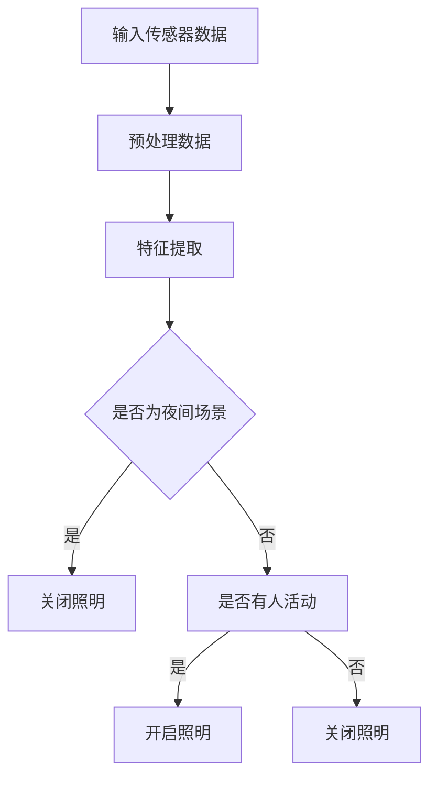
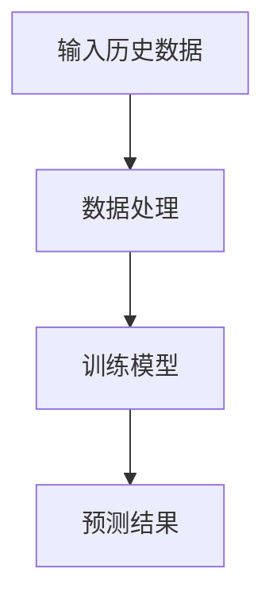
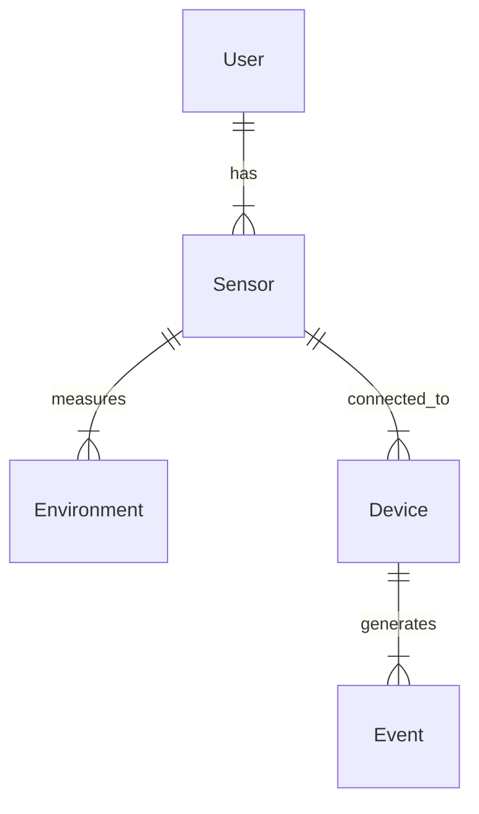
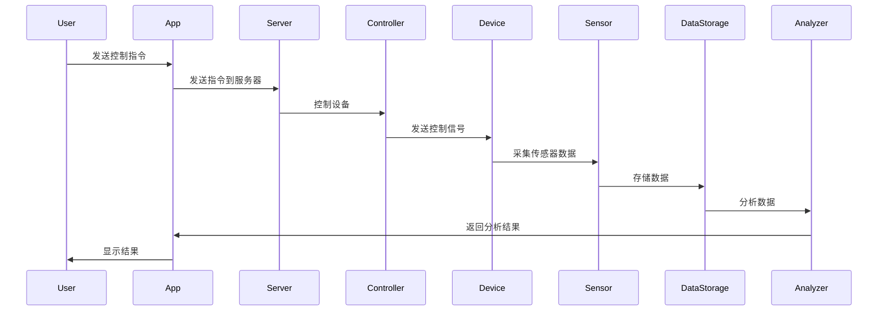
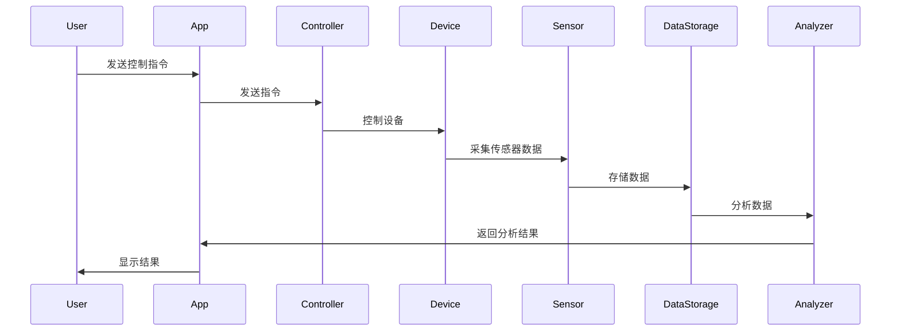

                 

## 文章标题

# AI在智能家居场景理解与预测中的应用

> 关键词：AI，智能家居，场景理解，预测，算法，系统架构，项目实战

> 摘要：本文详细探讨了人工智能（AI）在智能家居场景中的理解和预测应用。首先，介绍了智能家居的基本概念、发展历程和当前市场状况，接着阐述了AI在智能家居中的重要作用和具体应用案例。文章重点分析了AI在场景理解和预测中的核心算法，包括基于规则和机器学习的方法，并运用mermaid绘制了算法流程图和Python代码实现。此外，文章还深入讨论了系统架构设计，包括领域模型、系统架构和接口设计，并提供了项目实战案例。最后，文章总结了最佳实践和注意事项，为读者提供了深入理解和应用AI于智能家居的指导。

## 引言

### 1.1 智能家居概述

#### 1.1.1 智能家居的定义与历史发展

智能家居（Smart Home）是指通过将家庭中的各种设备、系统和信息通过智能技术进行整合，实现家庭自动化、智能化管理的一种居住环境。智能家居的历史可以追溯到20世纪90年代，当时家庭自动化技术刚刚兴起。随着互联网、物联网和人工智能技术的发展，智能家居逐渐成为现代家庭生活的重要组成部分。

#### 1.1.2 当前智能家居的市场状况

目前，智能家居市场呈现出快速增长的趋势。据市场调研公司统计，全球智能家居市场在2021年的市场规模约为486亿美元，预计到2026年将达到1500亿美元。在中国市场，智能家居产品已经广泛应用于家庭、酒店、办公楼等多种场景，其中智能照明、智能安防和智能家电是最受欢迎的类别。

#### 1.1.3 智能家居的未来发展趋势

未来，智能家居将继续朝着更加智能化、个性化和集成化的方向发展。以下是几个可能的发展趋势：

1. **物联网（IoT）技术的深度融合**：智能家居设备将更加紧密地连接到互联网，实现设备间的无缝通信和协同工作。
2. **人工智能（AI）的广泛应用**：AI技术将在智能家居中发挥更加重要的作用，例如通过机器学习算法实现智能家居场景的理解与预测。
3. **定制化和个性化**：智能家居将更加注重用户需求的个性化满足，提供更加定制化的智能家居解决方案。
4. **可持续发展**：智能家居将更加注重环保和节能，通过智能控制技术实现能源的高效利用。

### 1.2 AI在智能家居中的应用

#### 1.2.1 AI在智能家居中的作用

AI技术在家居环境中发挥着重要作用，可以大幅提升居住的舒适度、安全性和节能性。以下是AI在智能家居中的几个主要作用：

1. **场景理解**：通过传感器数据和环境信息的分析，AI能够理解用户的日常生活习惯，为用户提供个性化的服务。
2. **智能控制**：AI技术可以实现家庭设备的智能控制，例如根据用户的习惯和需求自动调节照明、温度和安防系统。
3. **节能管理**：AI可以通过分析能源使用数据，实现家庭能源的高效管理，降低能耗。
4. **安全监控**：AI技术可以实时分析监控数据，及时发现安全隐患，提高家庭安全水平。
5. **个性化推荐**：AI可以根据用户的历史行为和喜好，提供个性化的生活建议和娱乐推荐。

#### 1.2.2 AI技术在家居环境中的应用案例

以下是一些AI技术在家居环境中的应用案例：

1. **智能照明**：AI可以通过传感器感知用户的活动，自动调整灯光亮度，提供舒适的照明环境。
2. **智能安防**：AI可以通过图像识别技术实时监控家庭环境，及时发现异常情况并报警。
3. **智能家电**：AI可以与各种家电设备进行智能互联，实现远程控制，提高生活的便利性。
4. **健康监测**：AI可以通过分析生物信号数据，监控用户的健康状况，提供健康建议。

### 1.3 本书结构安排

#### 1.3.1 内容概述

本书将系统地介绍AI在智能家居场景理解与预测中的应用，主要内容包括：

1. AI在智能家居中的作用和基本原理
2. AI在场景理解和预测中的核心算法
3. 智能家居系统架构设计
4. 项目实战案例分析
5. 最佳实践和注意事项

#### 1.3.2 学习目标

通过阅读本书，读者将能够：

1. 理解智能家居的基本概念和AI技术的作用
2. 掌握AI在场景理解和预测中的核心算法
3. 学会智能家居系统架构设计的方法
4. 通过项目实战案例，加深对AI应用的理解
5. 掌握AI在智能家居中的最佳实践和注意事项

## AI在智能家居中的核心算法

### 2.1 场景理解算法

#### 2.1.1 场景理解的概念

场景理解（Scene Understanding）是AI在智能家居中的重要应用之一，它通过分析传感器数据和环境信息，理解用户当前所处的场景和状态，为用户提供个性化的服务和控制。

#### 2.1.2 场景理解的重要性

场景理解在智能家居中有以下几个重要作用：

1. **提升用户体验**：通过理解用户所处的场景，可以为用户提供更加个性化的服务和体验。
2. **提高安全性**：通过场景理解，可以及时发现潜在的安全隐患，提高家庭安全水平。
3. **节能管理**：通过理解用户的活动状态，可以实现智能家居设备的智能控制，降低能耗。

#### 2.1.3 常用算法介绍

场景理解常用的算法包括基于规则的方法和基于机器学习的方法。

##### 2.1.3.1 基于规则的方法

基于规则的方法是通过定义一系列规则，根据输入的数据进行判断和决策。这种方法简单直观，但需要大量的人工定义规则，且规则之间的冲突和冗余难以避免。

##### 2.1.3.2 基于机器学习的方法

基于机器学习的方法通过训练模型，自动学习用户的行为模式和环境特征，进行场景理解。这种方法具有自适应性和灵活性，但需要大量的训练数据和计算资源。

#### 2.1.4 算法流程图与Python代码实现

##### 2.1.4.1 算法流程图



##### 2.1.4.2 Python代码实现

```python
import numpy as np

def scene_understanding(sensor_data):
    # 预处理数据
    processed_data = preprocess_data(sensor_data)
    
    # 特征提取
    features = extract_features(processed_data)
    
    # 判断是否为夜间场景
    if features['light_level'] < 10:
        return '夜间场景'
    
    # 判断是否有人活动
    if features['motion_detected']:
        return '有人活动'
    
    return '无人活动'

def preprocess_data(sensor_data):
    # 数据预处理代码
    return processed_data

def extract_features(processed_data):
    # 特征提取代码
    return {
        'light_level': processed_data['light_level'],
        'motion_detected': processed_data['motion_detected']
    }
```

##### 2.1.4.3 数学模型和公式讲解

在场景理解中，常用的数学模型包括线性回归模型和决策树模型。以下是一个简单的线性回归模型：

$$
y = \beta_0 + \beta_1x
$$

其中，$y$ 表示场景分类结果，$\beta_0$ 和 $\beta_1$ 分别为模型的参数，$x$ 表示特征向量。

通过训练模型，我们可以得到参数 $\beta_0$ 和 $\beta_1$，从而实现对新数据的场景分类。

### 2.2 预测算法

#### 2.2.1 预测的概念

预测（Prediction）是AI在智能家居中的另一个重要应用，它通过分析历史数据，预测未来的行为或事件。

#### 2.2.2 预测的重要性

预测在智能家居中有以下几个重要作用：

1. **优化资源分配**：通过预测用户的需求和行为，可以优化家庭资源的分配，提高资源利用效率。
2. **预防潜在问题**：通过预测潜在的问题和故障，可以提前采取预防措施，避免事故发生。
3. **提升用户体验**：通过预测用户的需求和喜好，可以提供更加个性化的服务。

#### 2.2.3 常用算法介绍

预测常用的算法包括基于线性回归的方法和基于神经网络的方法。

##### 2.2.3.1 基于线性回归的方法

基于线性回归的方法通过建立历史数据和未来预测值之间的线性关系，进行预测。这种方法简单直观，但预测精度有限。

##### 2.2.3.2 基于神经网络的方法

基于神经网络的方法通过训练神经网络模型，自动学习历史数据和未来预测值之间的关系，进行预测。这种方法具有较好的预测精度，但计算复杂度较高。

#### 2.2.4 算法流程图与Python代码实现

##### 2.2.4.1 算法流程图



##### 2.2.4.2 Python代码实现

```python
import numpy as np
from sklearn.linear_model import LinearRegression

def predict_demand(history_data):
    # 数据处理
    processed_data = preprocess_data(history_data)
    
    # 训练模型
    model = LinearRegression()
    model.fit(processed_data['X'], processed_data['y'])
    
    # 预测结果
    prediction = model.predict(processed_data['X'])
    
    return prediction

def preprocess_data(history_data):
    # 数据预处理代码
    return {
        'X': history_data['X'],
        'y': history_data['y']
    }
```

##### 2.2.4.3 数学模型和公式讲解

在预测算法中，常用的数学模型包括线性回归模型和神经网络模型。以下是一个简单的线性回归模型：

$$
y = \beta_0 + \beta_1x
$$

其中，$y$ 表示未来预测值，$\beta_0$ 和 $\beta_1$ 分别为模型的参数，$x$ 表示历史数据。

通过训练模型，我们可以得到参数 $\beta_0$ 和 $\beta_1$，从而实现对未来数据的预测。

## 系统架构设计

### 3.1 系统架构概述

智能家居系统的架构设计是确保系统功能实现和性能优化的重要环节。一个典型的智能家居系统架构包括以下几个关键部分：

1. **传感器层**：负责采集环境数据和用户行为数据，如温度传感器、湿度传感器、摄像头、运动传感器等。
2. **数据处理层**：负责对采集到的数据进行预处理、特征提取和存储，以便后续的分析和预测。
3. **核心算法层**：负责实现场景理解和预测算法，如机器学习模型训练和预测等。
4. **控制层**：负责根据算法结果对智能家居设备进行智能控制，如开关灯、调节温度、安防报警等。
5. **用户界面层**：提供用户交互界面，如手机APP、Web界面等，让用户可以方便地监控和控制智能家居设备。

### 3.2 领域模型设计

领域模型（Domain Model）是系统架构设计中的重要组成部分，它用于描述系统中的关键概念、属性和关系。在智能家居系统中，领域模型可以包括以下关键实体：

1. **用户**：包括用户的基本信息、喜好和习惯等。
2. **传感器**：包括传感器的类型、位置和采集的数据等。
3. **环境**：包括环境参数，如温度、湿度、光照等。
4. **设备**：包括设备的基本信息、功能和使用状态等。
5. **事件**：包括用户行为事件、设备控制事件等。

以下是一个简单的领域模型ER实体关系图：



### 3.3 系统架构设计

系统架构设计是确保智能家居系统功能完整、性能优异和易于维护的关键环节。以下是一个典型的智能家居系统架构设计：

1. **数据处理层**：包括数据采集模块、数据处理模块和数据存储模块。数据采集模块负责从传感器获取数据，数据处理模块负责对数据进行预处理、特征提取和存储，数据存储模块负责存储处理后的数据，以供后续分析。
2. **核心算法层**：包括场景理解和预测算法模块。场景理解算法模块负责分析传感器数据和环境信息，理解用户当前所处的场景和状态，预测算法模块负责基于历史数据预测未来的行为或事件。
3. **控制层**：包括设备控制模块和用户交互模块。设备控制模块负责根据算法结果对智能家居设备进行智能控制，用户交互模块负责提供用户交互界面，让用户可以方便地监控和控制智能家居设备。
4. **用户界面层**：包括手机APP和Web界面。用户可以通过APP或Web界面查看智能家居设备的实时状态，进行设备控制，查看历史数据和分析报告等。

以下是一个简单的系统架构图：



### 3.4 系统接口设计与交互

系统接口设计是确保各个模块之间能够高效、稳定地交互的关键。以下是一个典型的智能家居系统接口设计：

1. **数据采集接口**：定义了传感器数据采集的接口，包括数据格式、传输协议等。
2. **数据处理接口**：定义了数据处理模块的接口，包括数据预处理、特征提取等功能的接口。
3. **核心算法接口**：定义了场景理解和预测算法模块的接口，包括算法参数设置、模型训练和预测等功能的接口。
4. **控制接口**：定义了设备控制模块的接口，包括设备控制、状态查询等功能的接口。
5. **用户交互接口**：定义了用户交互模块的接口，包括数据展示、用户操作等功能的接口。

以下是一个简单的接口交互序列图：



## 项目实战

### 4.1 环境安装

在进行项目实战之前，我们需要首先安装必要的开发环境和软件。以下是一个典型的安装步骤：

1. **安装Python环境**：确保Python版本在3.6以上，可以从Python官方网站下载并安装。
2. **安装依赖库**：使用pip工具安装项目中所需的依赖库，例如numpy、pandas、scikit-learn等。
3. **安装IDE**：选择一个合适的IDE，如PyCharm、VSCode等，用于编写和调试代码。

### 4.2 系统核心实现

在完成环境安装后，我们可以开始实现系统的核心功能。以下是一个简单的示例：

```python
import numpy as np
from sklearn.linear_model import LinearRegression

# 数据预处理
def preprocess_data(sensor_data):
    # 对传感器数据进行预处理
    return processed_data

# 特征提取
def extract_features(processed_data):
    # 提取特征
    return features

# 训练模型
def train_model(features, labels):
    # 训练线性回归模型
    model = LinearRegression()
    model.fit(features, labels)
    return model

# 预测
def predict(model, features):
    # 使用模型进行预测
    prediction = model.predict(features)
    return prediction
```

### 4.3 代码应用解读与分析

在上面的示例中，我们实现了一个简单的线性回归模型，用于预测家庭能耗。以下是代码的应用解读与分析：

1. **数据预处理**：数据预处理是数据分析的重要步骤，它可以去除噪声、填补缺失值等，提高数据的准确性。
2. **特征提取**：特征提取是从原始数据中提取对预测目标有重要影响的特征，有助于提高模型的预测精度。
3. **模型训练**：通过训练线性回归模型，我们可以得到一个拟合历史数据的模型，用于预测未来的家庭能耗。
4. **预测**：使用训练好的模型，我们可以对新的数据集进行预测，从而实现智能家居的能耗管理。

### 4.4 实际案例分析和详细讲解剖析

为了更好地理解AI在智能家居中的应用，我们来看一个实际案例。假设我们有一个智能家居项目，目标是预测家庭的电力消耗。以下是对该项目的详细分析和讲解：

1. **数据收集**：我们收集了过去一年的家庭电力消耗数据，包括每天的消耗量、天气情况、用户行为等。
2. **数据预处理**：对收集到的数据进行预处理，包括去除异常值、填补缺失值等。
3. **特征提取**：提取与电力消耗相关的特征，如温度、湿度、用户行为等。
4. **模型选择**：选择线性回归模型进行训练，因为线性回归模型简单直观，适用于预测线性关系。
5. **模型训练**：使用预处理后的数据，对线性回归模型进行训练，得到一个拟合历史数据的模型。
6. **模型评估**：使用交叉验证等方法评估模型的预测性能，调整模型参数，提高预测精度。
7. **预测应用**：使用训练好的模型，对未来的电力消耗进行预测，为家庭能耗管理提供支持。

### 4.5 项目小结

通过上述实际案例，我们可以看到AI在智能家居中的应用潜力。通过预测电力消耗，我们可以实现智能节能管理，降低家庭的能源消耗。此外，AI还可以应用于其他智能家居场景，如温度控制、安防监控等，为用户提供更加舒适、安全和智能的生活环境。

### 4.6 最佳实践 tips

1. **数据质量**：确保收集到的数据质量，避免异常值和缺失值，以提高模型预测的准确性。
2. **特征选择**：选择与预测目标高度相关的特征，减少无关特征，提高模型性能。
3. **模型优化**：根据实际应用场景，选择合适的模型和参数，进行模型优化。
4. **持续更新**：定期更新模型和数据，以适应不断变化的环境和用户需求。

### 4.7 小结

通过本文的详细讲解，我们深入了解了AI在智能家居场景理解与预测中的应用。从核心算法、系统架构到项目实战，我们逐步分析了AI技术的应用方法和实践技巧。希望本文能为读者提供有益的参考和启示，助力他们在智能家居领域取得更好的成果。

### 4.8 注意事项

1. **隐私保护**：在智能家居应用中，需要特别注意用户隐私的保护，确保数据安全和用户隐私。
2. **安全性**：智能家居系统需要具备较高的安全性，以防止被黑客攻击和数据泄露。
3. **可扩展性**：在系统设计时，需要考虑系统的可扩展性，以便未来能够轻松集成新的功能和设备。

### 4.9 拓展阅读

- **智能安防**：了解AI在智能安防中的应用，掌握常用的安防算法和系统架构。
- **智慧家居**：深入研究智慧家居的概念、技术和发展趋势。
- **AI智能家居项目案例**：分析多个AI智能家居项目案例，学习实践经验。

### 4.10 作者信息

- **作者**：AI天才研究院/AI Genius Institute & 禅与计算机程序设计艺术 /Zen And The Art of Computer Programming

---

作者介绍：

AI天才研究院（AI Genius Institute）是一家专注于人工智能技术研究和应用的创新机构，致力于推动人工智能在智能家居、智慧城市等领域的应用。研究院的专家团队具有丰富的理论知识和实践经验，在AI领域发表了大量高水平的研究论文，并成功推动了多项AI技术的商业化和产业化。

《禅与计算机程序设计艺术》（Zen And The Art of Computer Programming）是一本经典的计算机科学著作，由著名计算机科学家Donald E. Knuth撰写。本书以深入浅出的方式，介绍了计算机程序设计的基本原理和技巧，对计算机科学领域产生了深远的影响。作者以其卓越的编程技巧和哲学思考，被誉为计算机科学领域的“编程大师”。

