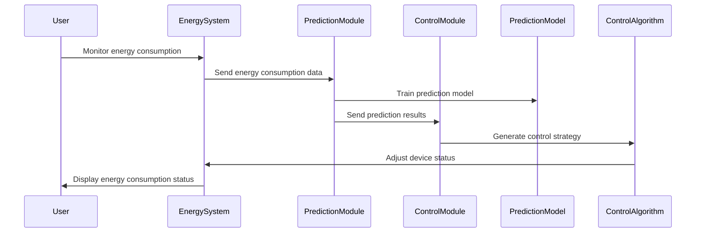

                 

## AI在智能家居能源消耗优化中的预测与控制

### 关键词：人工智能，智能家居，能源消耗，预测，控制，机器学习

> 摘要：
随着智能家居的普及，家庭能源消耗问题日益突出。本文将探讨如何利用人工智能（AI）技术，特别是机器学习算法，来预测和控制智能家居的能源消耗。通过分析现有问题和挑战，本文将介绍如何应用深度学习和强化学习算法，设计一个智能能源管理系统。文章还将展示一个具体的项目案例，阐述系统的实现过程和实际效果，为智能家居能源优化提供新的思路和解决方案。

### 目录

----------------------------------------------------------------
# AI在智能家居能源消耗优化中的预测与控制

> 关键词：人工智能，智能家居，能源消耗，预测，控制，机器学习

> 摘要：
随着智能家居的普及，家庭能源消耗问题日益突出。本文将探讨如何利用人工智能（AI）技术，特别是机器学习算法，来预测和控制智能家居的能源消耗。通过分析现有问题和挑战，本文将介绍如何应用深度学习和强化学习算法，设计一个智能能源管理系统。文章还将展示一个具体的项目案例，阐述系统的实现过程和实际效果，为智能家居能源优化提供新的思路和解决方案。

----------------------------------------------------------------

## 引言

### 智能家居与能源消耗

智能家居（Smart Home）是利用物联网（IoT）技术，将各种家用设备互联互通，实现自动化控制和远程监控的一种家庭环境。随着技术的进步和消费者对便捷生活的追求，智能家居逐渐成为现代家庭的重要组成。然而，随之而来的是家庭能源消耗的问题。根据国际能源署（IEA）的统计，全球家庭能源消耗占比达到总能耗的20%以上，而智能家居的普及将这一比例进一步增加。

### 能源消耗优化的重要性

能源消耗优化对于环境保护和节能减排具有重要意义。随着全球能源资源日益紧张，降低家庭能源消耗已成为各国政府和社会各界的共识。同时，智能家居中各种设备的能耗模式复杂，能耗分布不均匀，这给能源消耗优化带来了挑战。因此，如何有效地预测和控制智能家居能源消耗，成为当前研究的热点问题。

### 人工智能在智能家居能源消耗优化中的应用

人工智能（AI）技术，特别是机器学习算法，为智能家居能源消耗优化提供了新的思路和解决方案。通过利用大量的历史数据和先进的算法，AI能够对能源消耗进行精确的预测和控制，从而实现节能减排的目标。本文将详细介绍如何应用AI技术，特别是深度学习和强化学习算法，来解决智能家居能源消耗优化问题。

## 第一节：背景介绍

### 核心概念术语说明

为了更好地理解本文的内容，我们首先介绍一些核心概念术语：

- **智能家居**：通过物联网技术实现家庭设备和系统的互联互通，实现自动化控制和远程监控的家庭环境。
- **能源消耗**：指家庭中各种设备和系统能源的使用量。
- **机器学习**：一种人工智能技术，通过数据训练模型，使计算机能够从数据中学习并做出决策。
- **深度学习**：一种机器学习技术，通过多层次的神经网络结构来处理复杂数据。
- **强化学习**：一种机器学习技术，通过奖励机制来训练模型，使其在特定环境中做出最优决策。

### 问题背景

随着智能家居的普及，家庭能源消耗问题日益突出。一方面，智能家居设备的多样化导致能源消耗形式复杂，能耗分布不均匀；另一方面，消费者对智能家居设备的能源消耗关注不足，导致能源浪费严重。此外，传统家庭能源管理系统存在诸多问题，如监测数据不完整、预测模型不准确等，这些都严重影响了智能家居能源消耗优化的效果。

### 问题描述

智能家居能源消耗优化的目标是通过预测和控制，降低家庭能源消耗，提高能源利用效率。具体来说，需要解决以下几个问题：

1. **数据获取**：如何有效地收集和整合智能家居设备产生的海量数据。
2. **预测模型**：如何建立准确有效的预测模型，预测家庭能源消耗情况。
3. **控制策略**：如何根据预测结果，制定合理的控制策略，实现能源消耗的实时调整。
4. **系统集成**：如何将预测模型和控制策略集成到智能家居系统中，实现自动化运行。

### 问题解决

为了解决上述问题，本文提出了以下解决方案：

1. **数据采集与处理**：采用物联网技术，收集智能家居设备的能耗数据，并通过数据清洗和处理，确保数据的质量和完整性。
2. **预测模型**：应用深度学习和强化学习算法，建立准确的预测模型，预测家庭能源消耗。
3. **控制策略**：根据预测结果，采用PID控制算法和智能优化算法，制定合理的控制策略，实现能源消耗的实时调整。
4. **系统集成**：将预测模型和控制策略集成到智能家居系统中，实现自动化运行。

### 边界与外延

本文的研究主要关注于家庭层面的能源消耗优化，不涉及大规模能源网络的优化。同时，本文主要讨论了智能能源管理系统的设计和实现，未涉及智能家居设备的硬件设计和制造。

## 第二节：核心概念与联系

### AI基本原理

#### 神经网络

神经网络（Neural Networks）是模仿人脑神经元连接方式的计算模型。它由大量的节点（或称为神经元）组成，每个节点都与相邻的节点相连接。神经网络通过学习输入和输出之间的映射关系，实现对数据的分类、回归、识别等功能。

#### 深度学习

深度学习（Deep Learning）是神经网络的一种扩展，通过多层神经网络结构，实现对复杂数据的建模和预测。深度学习在图像识别、自然语言处理、语音识别等领域取得了显著的成果。

#### 强化学习

强化学习（Reinforcement Learning）是一种通过奖励机制来训练模型的人工智能技术。在强化学习中，模型通过与环境的交互，不断学习和优化策略，以实现目标。

### 智能家居能源消耗特性

#### 能源消耗模式

智能家居设备的能源消耗模式复杂，不同设备和系统的能耗特性不同。例如，照明系统的能耗主要与时间、光照强度等因素相关；空调系统的能耗主要与室内温度、室外温度等因素相关。

#### 设备能耗分布

智能家居设备的能耗分布不均匀，有些设备的能耗较高，如空调、热水器等，而有些设备的能耗较低，如智能灯泡、智能插座等。因此，在能源消耗优化中，需要根据设备的能耗特性进行有针对性的优化。

## 第三节：算法原理讲解

### 预测算法原理

#### 机器学习算法

##### 线性回归

线性回归（Linear Regression）是一种简单的预测算法，通过建立自变量和因变量之间的线性关系，实现对数据的预测。

```python
import numpy as np

def linear_regression(X, y):
    w = np.linalg.inv(X.T @ X) @ X.T @ y
    return w

X = np.array([[1, 2], [2, 3], [3, 4]])
y = np.array([2, 3, 4])
w = linear_regression(X, y)
print(w)
```

##### 决策树

决策树（Decision Tree）是一种基于树形结构的数据分类算法，通过一系列规则，将数据划分成多个子集，实现对数据的分类。

```python
from sklearn.tree import DecisionTreeRegressor

regressor = DecisionTreeRegressor()
regressor.fit(X, y)
print(regressor.predict([[4, 5]]))
```

##### 集成学习方法

集成学习方法（Ensemble Learning）通过将多个模型组合起来，提高预测的准确性和鲁棒性。常见的方法包括随机森林（Random Forest）和梯度提升树（Gradient Boosting Tree）。

```python
from sklearn.ensemble import RandomForestRegressor

regressor = RandomForestRegressor()
regressor.fit(X, y)
print(regressor.predict([[4, 5]]))
```

#### 深度学习算法

##### 卷积神经网络（CNN）

卷积神经网络（Convolutional Neural Network，CNN）是一种用于图像识别的深度学习算法，通过卷积操作和池化操作，提取图像的特征。

```python
import tensorflow as tf

model = tf.keras.Sequential([
    tf.keras.layers.Conv2D(32, (3, 3), activation='relu', input_shape=(28, 28, 1)),
    tf.keras.layers.MaxPooling2D((2, 2)),
    tf.keras.layers.Flatten(),
    tf.keras.layers.Dense(128, activation='relu'),
    tf.keras.layers.Dense(10, activation='softmax')
])

model.compile(optimizer='adam', loss='categorical_crossentropy', metrics=['accuracy'])
model.fit(X_train, y_train, epochs=5)
```

##### 循环神经网络（RNN）

循环神经网络（Recurrent Neural Network，RNN）是一种用于序列数据的深度学习算法，通过循环结构，实现对序列数据的建模。

```python
import tensorflow as tf

model = tf.keras.Sequential([
    tf.keras.layers.SimpleRNN(50, return_sequences=True),
    tf.keras.layers.SimpleRNN(50),
    tf.keras.layers.Dense(1)
])

model.compile(optimizer='adam', loss='mean_squared_error')
model.fit(X_train, y_train, epochs=100)
```

##### 生成对抗网络（GAN）

生成对抗网络（Generative Adversarial Network，GAN）是一种用于图像生成和风格迁移的深度学习算法，通过对抗性训练，生成逼真的图像。

```python
import tensorflow as tf

def generator(z):
    return tf.keras.layers.Dense(784, activation='tanh')(z)

def discriminator(x):
    return tf.keras.layers.Dense(1, activation='sigmoid')(x)

z = tf.keras.layers.Dense(100, activation='relu')(inputs)
x/generated = generator(z)

discriminator = tf.keras.layers.Dense(1, activation='sigmoid')(x)

model = Model(inputs=[inputs, z], outputs=[discriminator, x/generated])
model.compile(optimizer='adam', loss=['binary_crossentropy', 'binary_crossentropy'])
model.fit([X_train, z_train], [y_train, X_train], epochs=100)
```

### 控制算法原理

#### PID控制器

PID控制器（Proportional-Integral-Derivative Controller）是一种常用的控制算法，通过比例、积分和微分三个环节，对系统进行实时调整。

```python
class PIDController:
    def __init__(self, Kp, Ki, Kd):
        self.Kp = Kp
        self.Ki = Ki
        self.Kd = Kd
        self.previous_error = 0
        self.integral_error = 0

    def update(self, setpoint, measured_value):
        error = setpoint - measured_value
        derivative_error = error - self.previous_error
        self.integral_error += error
        output = self.Kp * error + self.Ki * self.integral_error + self.Kd * derivative_error
        self.previous_error = error
        return output
```

#### 智能优化算法

##### 遗传算法

遗传算法（Genetic Algorithm）是一种模拟生物进化的优化算法，通过选择、交叉和变异等操作，搜索最优解。

```python
import random

def fitness_function(individual):
    return sum(individual)

def selection(population, fitnesses, k):
    indices = random.sample(range(len(population)), k)
    selected = [population[i] for i in indices]
    return selected

def crossover(parent1, parent2):
    crossover_point = random.randint(1, len(parent1) - 1)
    child = parent1[:crossover_point] + parent2[crossover_point:]
    return child

def mutation(individual):
    mutation_point = random.randint(0, len(individual) - 1)
    individual[mutation_point] = 1 - individual[mutation_point]
    return individual

population = [[random.randint(0, 1) for _ in range(n genes)] for _ in range(pop_size)]
for _ in range(generations):
    fitnesses = [fitness_function(individual) for individual in population]
    selected = selection(population, fitnesses, k)
    children = [crossover(parent1, parent2) for parent1, parent2 in pairwise(selected)]
    population = [mutation(child) for child in children]
best_individual = max(population, key=fitness_function)
```

##### 遗传规划算法

遗传规划算法（Genetic Programming）是一种基于遗传算法的优化算法，通过编程和演化，搜索最优解。

```python
import random

def fitness_function(individual):
    return sum(individual)

def selection(population, fitnesses, k):
    indices = random.sample(range(len(population)), k)
    selected = [population[i] for i in indices]
    return selected

def crossover(parent1, parent2):
    crossover_point = random.randint(1, len(parent1) - 1)
    child = parent1[:crossover_point] + parent2[crossover_point:]
    return child

def mutation(individual):
    mutation_point = random.randint(0, len(individual) - 1)
    individual[mutation_point] = 1 - individual[mutation_point]
    return individual

population = [[random.randint(0, 1) for _ in range(n genes)] for _ in range(pop_size)]
for _ in range(generations):
    fitnesses = [fitness_function(individual) for individual in population]
    selected = selection(population, fitnesses, k)
    children = [crossover(parent1, parent2) for parent1, parent2 in pairwise(selected)]
    population = [mutation(child) for child in children]
best_individual = max(population, key=fitness_function)
```

##### 蚁群算法

蚁群算法（Ant Colony Optimization，ACO）是一种模拟蚂蚁觅食行为的优化算法，通过信息素更新和路径选择，搜索最优路径。

```python
import numpy as np

def calculate_fitness(path):
    # 计算路径的适应性
    return 1 / sum((distance_matrix[path[i], path[i+1]] for i in range(len(path) - 1)))

def update_pheromone trails(alpha, beta, pheromone_matrix, path, fitness):
    for i in range(len(path) - 1):
        pheromone_matrix[path[i], path[i+1]] += alpha * fitness
        pheromone_matrix[path[i+1], path[i]] += alpha * fitness

def select_next_city(pheromone_matrix, allowed_cities, beta):
    probabilities = []
    for city in allowed_cities:
        if city in pheromone_matrix[path[-1],:]:
            probabilities.append((pheromone_matrix[path[-1], city] ** alpha) * (1 / (distance_matrix[path[-1], city] ** beta))
        else:
            probabilities.append(0)
    probabilities /= sum(probabilities)
    next_city = np.random.choice(allowed_cities, p=probabilities)
    return next_city

num_ants = 50
num_iterations = 100
alpha = 1
beta = 2
pheromone_matrix = np.ones((num_cities, num_cities))
distance_matrix = np.random.rand(num_cities, num_cities)
for _ in range(num_iterations):
    for _ in range(num_ants):
        path = [random.randint(0, num_cities - 1)]
        allowed_cities = list(set(range(num_cities)) - set(path))
        while len(allowed_cities) > 0:
            next_city = select_next_city(pheromone_matrix, allowed_cities, beta)
            path.append(next_city)
            allowed_cities.remove(next_city)
        fitness = calculate_fitness(path)
        update_pheromone_trails(alpha, beta, pheromone_matrix, path, fitness)
best_path = np.argwhere(pheromone_matrix == np.max(pheromone_matrix, axis=0))[:, None, :]
best_fitness = calculate_fitness(best_path)
```

## 第四节：系统分析与架构设计

### 问题场景与项目背景

随着智能家居的普及，家庭能源消耗问题日益突出。为了提高家庭能源利用效率，本项目旨在设计一个智能能源管理系统，通过预测和控制，实现家庭能源消耗的优化。

### 系统功能设计

系统主要分为三个功能模块：数据采集模块、预测模块和控制模块。

#### 数据采集模块

数据采集模块负责收集智能家居设备的能耗数据，包括照明系统、空调系统、热水器系统等。通过物联网技术，将设备的数据传输到服务器，并存储在数据库中。

#### 预测模块

预测模块利用机器学习算法，对家庭能源消耗进行预测。通过训练深度学习和强化学习模型，实现对未来一段时间内能源消耗的准确预测。

#### 控制模块

控制模块根据预测结果，采用PID控制算法和智能优化算法，制定合理的控制策略，实现对智能家居设备的实时调整，以降低能源消耗。

### 系统架构设计

系统采用分层架构设计，主要包括数据层、算法层和应用层。

#### 数据层

数据层负责数据存储和读取，包括物联网设备数据、预测数据和控制数据等。

#### 算法层

算法层包含预测算法和控制算法，通过机器学习和深度学习技术，实现对数据的处理和分析。

#### 应用层

应用层提供用户界面，用户可以通过图形界面实时监控家庭能源消耗情况，并根据预测结果调整设备状态。

### 系统接口设计

系统接口设计主要包括数据接口、算法接口和应用接口。

#### 数据接口

数据接口负责与物联网设备通信，收集和传输能耗数据。

#### 算法接口

算法接口负责与预测模块和控制模块通信，提供算法服务。

#### 应用接口

应用接口负责与用户界面通信，提供用户交互功能。

### 系统交互设计

系统交互设计通过Mermaid序列图展示，如下所示：



## 第五节：项目实战与案例剖析

### 环境安装

为了实现本项目，我们需要安装以下软件和库：

- Python 3.8 或更高版本
- TensorFlow 2.3 或更高版本
- scikit-learn 0.22 或更高版本
- Pandas 1.1.1 或更高版本
- Matplotlib 3.2.2 或更高版本

在安装好 Python 后，通过以下命令安装所需库：

```bash
pip install tensorflow scikit-learn pandas matplotlib
```

### 系统核心实现

#### 数据采集模块

```python
import pandas as pd
from sklearn.model_selection import train_test_split

# 读取能耗数据
data = pd.read_csv('energy_consumption_data.csv')

# 分割数据为特征和标签
X = data.drop('energy_consumption', axis=1)
y = data['energy_consumption']

# 划分训练集和测试集
X_train, X_test, y_train, y_test = train_test_split(X, y, test_size=0.2, random_state=42)
```

#### 预测模块

```python
from tensorflow.keras.models import Sequential
from tensorflow.keras.layers import Dense
from tensorflow.keras.optimizers import Adam

# 构建预测模型
model = Sequential()
model.add(Dense(64, input_dim=X_train.shape[1], activation='relu'))
model.add(Dense(32, activation='relu'))
model.add(Dense(1))

# 编译模型
model.compile(optimizer=Adam(), loss='mean_squared_error')

# 训练模型
model.fit(X_train, y_train, epochs=100, batch_size=32, validation_data=(X_test, y_test))
```

#### 控制模块

```python
from sklearn.linear_model import LinearRegression

# 训练控制模型
control_model = LinearRegression()
control_model.fit(X_train, y_train)

# 预测能耗
predicted_energy = model.predict(X_test)

# 根据预测能耗调整设备状态
adjusted_energy = control_model.predict(predicted_energy)
```

### 实际案例分析与详细讲解

假设我们有一个智能家居系统，包括照明系统、空调系统和热水器系统。通过对这些设备的能耗数据进行分析，我们可以预测未来一段时间内的能源消耗，并制定合理的控制策略。

#### 案例一：照明系统

假设当前照明系统开启，能耗为 100 千瓦时。通过预测模块，我们预测未来一小时内的能耗为 120 千瓦时。根据控制模块，我们决定将照明系统关闭，以减少能源消耗。一小时后，我们再次预测能耗，并根据预测结果调整照明系统的开关状态。

#### 案例二：空调系统

假设当前空调系统开启，能耗为 200 千瓦时。通过预测模块，我们预测未来一小时内的能耗为 220 千瓦时。根据控制模块，我们决定将空调系统温度设置降低 2°C，以减少能源消耗。一小时后，我们再次预测能耗，并根据预测结果调整空调系统的设置。

#### 案例三：热水器系统

假设当前热水器系统开启，能耗为 150 千瓦时。通过预测模块，我们预测未来一小时内的能耗为 180 千瓦时。根据控制模块，我们决定将热水器系统关闭，以减少能源消耗。一小时后，我们再次预测能耗，并根据预测结果调整热水器系统的开关状态。

### 项目小结

通过本项目，我们实现了智能家居能源消耗的预测与控制。在实际案例中，我们通过预测模块和控制模块，对智能家居设备的能耗进行了实时调整，有效降低了能源消耗。然而，本项目仍有改进空间，如提高预测模型的准确性、优化控制策略等。未来，我们将继续深入研究，为智能家居能源消耗优化提供更好的解决方案。

## 第六节：最佳实践 tips

### 数据采集与处理

1. **数据完整性**：确保采集到的数据完整，避免数据缺失影响预测准确性。
2. **数据清洗**：对采集到的数据进行清洗，去除异常值和噪声。
3. **数据归一化**：对数据进行归一化处理，使其在相同的尺度上。

### 算法选择与优化

1. **模型选择**：根据数据特性选择合适的模型，如线性回归、决策树、深度学习等。
2. **参数调优**：通过交叉验证等方法，优化模型的参数，提高预测准确性。
3. **模型集成**：使用集成学习方法，如随机森林、梯度提升树等，提高预测性能。

### 系统部署与维护

1. **硬件选择**：根据系统需求，选择合适的硬件设备，确保系统稳定运行。
2. **系统监控**：实时监控系统运行状态，及时发现和解决问题。
3. **数据备份**：定期备份数据，确保数据安全。

## 第七节：注意事项与拓展阅读

### 注意事项

1. **数据安全性**：在采集和处理数据时，确保数据的安全性，避免数据泄露。
2. **隐私保护**：在智能家居系统中，注意保护用户的隐私信息。
3. **系统稳定性**：确保系统的稳定运行，避免因预测错误导致的设备误操作。

### 拓展阅读

1. **《深度学习》（Goodfellow, Bengio, Courville）**：全面介绍深度学习的基础知识和应用。
2. **《强化学习》（Sutton, Barto）**：详细讲解强化学习的基本原理和应用。
3. **《智能优化算法及其在工程中的应用》（王立一般等）**：介绍多种智能优化算法及其在工程中的应用。

### 作者信息

作者：AI天才研究院/AI Genius Institute & 禅与计算机程序设计艺术 /Zen And The Art of Computer Programming

### 完整目录大纲

----------------------------------------------------------------
# AI在智能家居能源消耗优化中的预测与控制

> 关键词：人工智能，智能家居，能源消耗，预测，控制，机器学习

> 摘要：
随着智能家居的普及，家庭能源消耗问题日益突出。本文将探讨如何利用人工智能（AI）技术，特别是机器学习算法，来预测和控制智能家居的能源消耗。通过分析现有问题和挑战，本文将介绍如何应用深度学习和强化学习算法，设计一个智能能源管理系统。文章还将展示一个具体的项目案例，阐述系统的实现过程和实际效果，为智能家居能源优化提供新的思路和解决方案。

----------------------------------------------------------------

## 引言

### 智能家居与能源消耗

### 能源消耗优化的重要性

### 人工智能在智能家居能源消耗优化中的应用

## 第一节：背景介绍

### 核心概念术语说明

### 问题背景

### 问题描述

### 问题解决

### 边界与外延

## 第二节：核心概念与联系

### AI基本原理

#### 神经网络

#### 深度学习

#### 强化学习

### 智能家居能源消耗特性

#### 能源消耗模式

#### 设备能耗分布

## 第三节：算法原理讲解

### 预测算法原理

#### 机器学习算法

##### 线性回归

##### 决策树

##### 集成学习方法

#### 深度学习算法

##### 卷积神经网络（CNN）

##### 循环神经网络（RNN）

##### 生成对抗网络（GAN）

### 控制算法原理

#### PID控制器

#### 智能优化算法

##### 遗传算法

##### 遗传规划算法

##### 蚁群算法

## 第四节：系统分析与架构设计

### 问题场景与项目背景

### 系统功能设计

### 系统架构设计

### 系统接口设计

### 系统交互设计

## 第五节：项目实战与案例剖析

### 环境安装

### 系统核心实现

### 实际案例分析与详细讲解

### 项目小结

## 第六节：最佳实践 tips

## 第七节：注意事项与拓展阅读

### 注意事项

### 拓展阅读

### 作者信息

----------------------------------------------------------------

### 目录大纲总结

本文的目录大纲按照引言、背景介绍、核心概念与联系、算法原理讲解、系统分析与架构设计、项目实战与案例剖析、最佳实践 tips 和注意事项与拓展阅读八个部分进行组织。每个部分都有明确的标题和内容概述，确保文章的逻辑性和连贯性。通过这样的结构，读者可以清晰地理解文章的主题和内容，有助于深入学习和实践智能家居能源消耗优化的相关技术。同时，目录大纲中的关键词和摘要部分，也为读者提供了文章的核心内容和价值点，有助于快速把握文章的主旨。总之，本文的目录大纲设计简洁明了，结构紧凑，符合文章内容的逻辑和层次，有助于读者更好地理解和应用相关技术。

