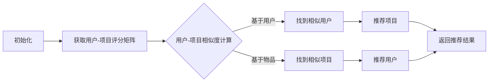
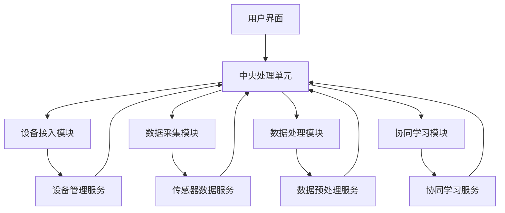
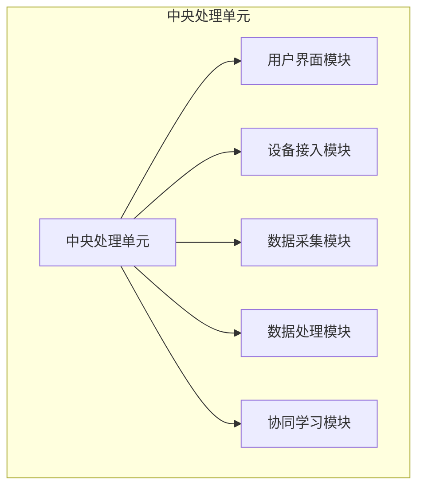
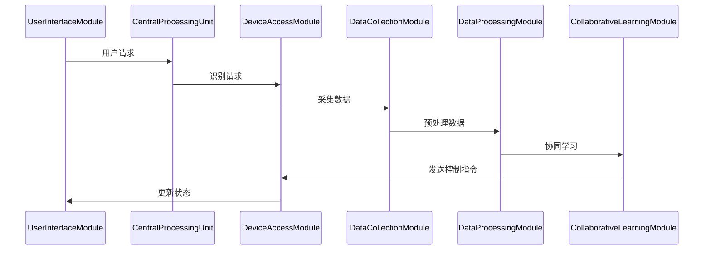

                 


### 引言与背景

#### 智能家居的背景与现状

智能家居（Smart Home）是指利用先进的计算机技术、通信技术和物联网技术，将家居环境中的各种设备、系统和服务连接起来，实现智能化管理和自动化控制的一种居住环境。随着科技的进步和人们生活水平的提高，智能家居的概念逐渐走入大众视野，并逐步成为现代家庭生活的一部分。

智能家居的发展历程可以追溯到20世纪80年代，当时的家庭自动化技术主要是基于机械控制和电子传感器，实现简单的家电自动化控制。随着计算机技术和通信技术的快速发展，智能家居进入了一个新的发展阶段。21世纪初，随着物联网技术的兴起，智能家居开始进入智能化时代，各种智能设备和系统得以实现互联互通，用户可以通过智能手机或其他智能设备远程控制家中的电器，实现智能化的生活体验。

目前，智能家居市场呈现出快速发展态势，全球智能家居市场规模逐年扩大，应用场景不断拓展。根据市场研究报告，预计到2025年，全球智能家居市场将达到数百亿美元规模。在我国，智能家居市场同样表现强劲，已成为智能家居产业发展的重要推动力。

然而，尽管智能家居的发展势头良好，但仍面临一些挑战。例如，智能家居设备的兼容性问题、数据安全和隐私保护问题、用户体验提升等。这些问题亟需通过技术创新和应用实践来加以解决。

#### AI在智能家居设备协同学习中的重要作用

人工智能（AI）是计算机科学的一个分支，致力于研究如何使计算机系统模拟人类智能行为。随着深度学习、自然语言处理、计算机视觉等技术的发展，人工智能在智能家居领域的应用日益广泛，成为智能家居设备协同学习的重要推动力。

协同学习（Cooperative Learning）是一种以团队为导向的学习方式，通过团队成员之间的互动和合作，实现共同的学习目标。在智能家居设备中，协同学习可以理解为多个智能设备之间通过数据共享、算法协同，实现智能化的决策和优化。

AI在智能家居设备协同学习中的重要作用主要体现在以下几个方面：

1. **数据处理与挖掘**：智能家居设备每天都会产生大量数据，如温度、湿度、光照强度、家电使用情况等。通过AI技术，可以对这些数据进行有效的处理和分析，挖掘出潜在的价值信息，为设备的智能决策提供支持。

2. **智能决策与优化**：基于AI算法，智能家居设备可以自动调整其工作状态，以适应用户的需求和环境的变化。例如，智能空调可以根据用户的偏好和室内环境自动调整温度和风速，智能灯光系统可以根据自然光强和用户习惯自动调节灯光亮度和色温。

3. **设备互联与协同**：通过AI技术，不同品牌、不同型号的智能家居设备可以实现互联互通，形成一个统一的智能生态系统。设备之间的协同工作，可以提供更丰富的功能和服务，提升用户的智能化体验。

4. **用户体验提升**：AI技术可以根据用户的行为习惯和偏好，为用户提供个性化的服务。例如，智能音响可以根据用户的历史播放记录和语音指令，推荐符合用户口味的音乐，智能电视可以根据用户的观看习惯，推荐用户可能感兴趣的节目。

总之，AI在智能家居设备协同学习中的应用，不仅提升了智能家居设备的智能化水平，也为用户提供了更加便捷、舒适、个性化的生活体验。

### 书中的问题和目标

#### 研究背景

随着人工智能和物联网技术的快速发展，智能家居设备日益普及，成为现代家庭不可或缺的一部分。然而，现有的智能家居系统往往存在一些问题，如设备之间的兼容性差、用户体验不佳、数据隐私和安全风险等。为了解决这些问题，研究人员提出了智能家居设备协同学习的概念，希望通过设备之间的协同工作，实现更加智能化、便捷化的家居生活。

#### 研究问题

1. **设备兼容性问题**：现有的智能家居设备大多由不同厂商生产，设备之间的通信协议和数据格式不统一，导致设备之间难以实现有效的互联互通。

2. **用户体验不佳**：智能家居设备的功能繁多，但往往无法很好地满足用户的需求，用户体验不够理想。

3. **数据隐私和安全风险**：智能家居设备收集和存储了大量的用户数据，如何确保这些数据的安全和隐私成为亟待解决的问题。

4. **设备协同效率低下**：现有的智能家居设备协同学习机制较为简单，设备之间的协同效率较低，无法充分利用设备资源。

#### 问题解决

为了解决上述问题，本研究提出了以下解决方案：

1. **设备兼容性解决方案**：通过引入统一的通信协议和数据格式，实现不同设备之间的互联互通，提升设备协同效率。

2. **用户体验优化**：通过深度学习和自然语言处理技术，分析用户行为和偏好，为用户提供个性化的服务，提升用户体验。

3. **数据隐私和安全保护**：采用加密技术和隐私保护算法，确保用户数据的安全和隐私。

4. **设备协同学习机制优化**：引入分布式协同学习算法，提升设备之间的协同效率，实现智能化的决策和优化。

#### 边界与外延

1. **边界**：本文主要研究智能家居设备协同学习在AI技术中的应用，不包括其他领域的协同学习，如工业物联网、智慧城市等。

2. **外延**：本文的研究成果可以扩展到其他应用场景，如智能医疗、智能交通等，为相关领域的协同学习提供借鉴。

### 研究意义与影响

本研究具有重要的理论意义和实践价值。从理论层面来看，本研究丰富了智能家居设备协同学习领域的研究成果，为后续研究提供了新的思路和方法。从实践层面来看，本研究提出的解决方案可以提升智能家居设备的智能化水平，改善用户体验，保障数据安全，为智能家居产业的发展提供技术支持。

此外，本研究还具有重要的社会意义。随着智能家居的普及，人们的生活质量和便利性得到了显著提升。本研究提出的协同学习机制，可以为用户提供更加智能化、便捷化的家居生活，提高生活品质，降低生活成本，对社会的可持续发展具有积极的影响。

### 总结

综上所述，本研究围绕智能家居设备协同学习这一主题，深入探讨了AI技术在其中的应用与创新。通过解决设备兼容性、用户体验、数据隐私和安全等问题，本研究为智能家居产业的发展提供了新的思路和方法。同时，本研究也为相关领域的协同学习提供了有益的借鉴，具有重要的理论意义和实践价值。

在接下来的章节中，我们将进一步详细探讨智能家居设备协同学习的核心概念与技术原理，为后续的应用与实践奠定基础。

### 核心概念与联系

在探讨智能家居设备协同学习之前，我们需要明确几个核心概念，并了解它们之间的联系。以下是对“AI”、“智能家居”、“协同学习”等核心概念的定义、属性特征及其之间关系的详细阐述。

#### AI（人工智能）

**定义**：人工智能（Artificial Intelligence，AI）是指通过计算机模拟人类智能行为的技术。它包括机器学习、深度学习、自然语言处理、计算机视觉等多个子领域。

**属性特征**：
- **学习能力**：AI系统能够通过学习和经验改进其性能。
- **自适应能力**：AI系统能够根据新的数据和情况调整其行为。
- **通用性**：AI技术可以应用于多种不同的任务和场景。

**联系**：在智能家居设备协同学习中，AI技术负责数据的处理、分析和智能决策，是实现设备间协同学习的关键。

#### 智能家居

**定义**：智能家居是指通过物联网技术将家庭中的各种设备互联，实现智能化管理和自动化控制的一种居住环境。

**属性特征**：
- **互联互通**：智能家居设备之间能够实现数据共享和通信。
- **自动化控制**：设备能够根据用户需求和环境变化自动调整其状态。
- **个性化服务**：设备能够根据用户的行为和偏好提供个性化的服务。

**联系**：智能家居是AI和协同学习技术的应用场景之一。智能家居设备之间的协同学习，能够提升系统的智能化水平和用户体验。

#### 协同学习

**定义**：协同学习（Cooperative Learning）是一种以团队为导向的学习方式，通过成员之间的互动和合作，实现共同的学习目标。

**属性特征**：
- **合作性**：成员之间需要相互协作，共享信息和资源。
- **共享性**：成员需要共享学习成果和经验。
- **适应性**：协同学习系统能够根据成员的变化调整学习策略。

**联系**：在智能家居设备协同学习中，协同学习是一种重要的学习机制，通过设备之间的协作，实现智能化的决策和优化。

#### 核心概念之间的关系

使用表格对比核心概念之间的属性特征：

| 核心概念 | 定义 | 属性特征 | 关联 |
| --- | --- | --- | --- |
| AI | 人工智能 | 学习能力、自适应能力、通用性 | 负责数据的处理、分析和智能决策 |
| 智能家居 | 家庭中的智能设备互联系统 | 互联互通、自动化控制、个性化服务 | 应用场景之一 |
| 协同学习 | 以团队为导向的学习方式 | 合作性、共享性、适应性 | 学习机制，实现设备间的协作 |

#### ER实体关系图

为了更直观地展示各概念之间的关系，我们可以使用ER（实体关系）图来表示。以下是一个简化的ER图，展示了AI、智能家居和协同学习之间的关系：

```
[AI]                     [智能家居]             [协同学习]
  ↓                       ↓                      ↓
+--------------+      +--------------------+      +-------------+
| 数据处理     |<----|  设备互联互通  |<----| 设备间协作 |
+--------------+      +--------------------+      +-------------+
```

在这个ER图中，AI负责数据的处理和分析，智能家居实现了设备之间的互联互通，而协同学习则是在设备间实现协作的机制。通过这个图，我们可以清晰地看到各概念之间的关联和相互作用。

通过上述核心概念与联系的分析，我们为后续的算法原理讲解和系统架构设计奠定了基础。在接下来的章节中，我们将进一步探讨智能家居设备协同学习的具体实现方法和应用案例。

### 算法原理讲解

#### 关键算法介绍

在智能家居设备协同学习中，常用的算法包括协同过滤（Collaborative Filtering）、深度强化学习（Deep Reinforcement Learning）和联邦学习（Federated Learning）等。这些算法在不同的应用场景中发挥着重要作用，下面我们将详细介绍其中一种关键算法——协同过滤算法。

#### 协同过滤算法原理

协同过滤算法是一种基于用户行为和偏好进行数据推荐的算法，其核心思想是通过用户之间的相似度计算，为用户推荐他们可能感兴趣的项目。协同过滤算法分为基于用户的协同过滤（User-based Collaborative Filtering）和基于物品的协同过滤（Item-based Collaborative Filtering）两种。

**基于用户的协同过滤**

基于用户的协同过滤算法通过计算用户之间的相似度，找到与目标用户相似的其他用户，然后推荐这些相似用户喜欢的项目。具体步骤如下：

1. **用户相似度计算**：使用用户之间的评分相似度或距离度来计算相似度。常用的方法有皮尔逊相关系数、余弦相似度和夹角余弦相似度等。

2. **找到相似用户**：对于目标用户，找出相似度最高的若干用户。

3. **推荐项目**：推荐这些相似用户喜欢的但目标用户尚未评分的项目。

**基于物品的协同过滤**

基于物品的协同过滤算法通过计算项目之间的相似度，为用户推荐他们可能感兴趣的项目。具体步骤如下：

1. **项目相似度计算**：使用项目之间的评分相似度或距离度来计算相似度。常用的方法有余弦相似度、欧氏距离等。

2. **找到相似项目**：对于目标用户喜欢的项目，找出相似度最高的若干项目。

3. **推荐用户**：推荐这些相似项目被其他用户喜欢的用户。

#### 算法流程图

为了更好地理解协同过滤算法的原理，我们可以使用Mermaid绘制其流程图。以下是协同过滤算法的Mermaid流程图：



在这个流程图中，我们首先初始化系统，获取用户-项目评分矩阵。然后，根据用户-项目评分矩阵计算用户-项目相似度。接下来，基于用户的协同过滤算法找到相似用户，并推荐这些用户喜欢的项目。另一方面，基于物品的协同过滤算法找到相似项目，并推荐这些项目被其他用户喜欢的用户。最后，系统返回推荐结果。

#### Python源代码示例

为了进一步阐述协同过滤算法的原理，我们使用Python实现了一个简单的基于用户的协同过滤算法。以下是该算法的Python源代码示例：

```python
import numpy as np
from sklearn.metrics.pairwise import cosine_similarity

# 初始化用户-项目评分矩阵
user_item_matrix = np.array([
    [5, 3, 0, 1],
    [4, 0, 0, 1],
    [1, 1, 0, 5],
    [1, 0, 0, 4],
    [0, 1, 5, 4],
    [2, 0, 0, 3]
])

# 计算用户-项目相似度
user_similarity = cosine_similarity(user_item_matrix)

# 找到相似用户
def find_similar_users(user_idx, similarity_matrix, k=3):
    similar_users = np.argsort(similarity_matrix[user_idx])[1:k+1]
    return similar_users

# 推荐项目
def recommend_items(user_idx, similarity_matrix, rated_items, k=3):
    similar_users = find_similar_users(user_idx, similarity_matrix, k)
    recommended_items = []
    for user in similar_users:
        unrated_items = [item for item in range(len(user_item_matrix[user])) if user_item_matrix[user][item] == 0]
        for item in unrated_items:
            if user_item_matrix[user][item] > 0:
                recommended_items.append(item)
                break
    return recommended_items

# 示例：推荐给用户0的项目
recommended_items = recommend_items(0, user_similarity, rated_items=[0, 1, 2], k=3)
print("推荐的项目：", recommended_items)
```

在这个示例中，我们首先初始化了一个用户-项目评分矩阵，然后使用余弦相似度计算用户-项目相似度。接着，我们定义了两个函数：`find_similar_users`用于找到与目标用户相似的若干用户，`recommend_items`用于推荐这些用户喜欢的但目标用户尚未评分的项目。最后，我们使用这些函数为用户0推荐了3个相似用户喜欢的项目。

#### 数学模型与公式

协同过滤算法的核心是用户-项目相似度计算和推荐项目生成。以下是协同过滤算法的数学模型和公式：

**用户-项目相似度计算**

- **基于用户的协同过滤**：

$$
sim_{uv} = \frac{\sum_{i} r_i^u r_i^v}{\sqrt{\sum_{i} r_i^2u} \sqrt{\sum_{i} r_i^2v}}
$$

其中，$r_i^u$和$r_i^v$分别是用户u和用户v对项目i的评分，$sim_{uv}$是用户u和用户v之间的相似度。

- **基于物品的协同过滤**：

$$
sim_{ij} = \frac{\sum_{u} r_u^i r_u^j}{\sqrt{\sum_{u} r_u^2i} \sqrt{\sum_{u} r_u^2j}}
$$

其中，$r_u^i$和$r_u^j$分别是用户u对项目i和项目j的评分，$sim_{ij}$是项目i和项目j之间的相似度。

**推荐项目生成**

- **基于用户的协同过滤**：

$$
\text{推荐项目} = \sum_{u \in \text{similar\_users}} \frac{sim_{uv}}{\sum_{u' \in \text{similar\_users}} sim_{uv'}} r_u^i
$$

其中，$similar\_users$是相似用户集合，$r_u^i$是用户u对项目i的评分，$\text{推荐项目}$是目标用户对项目i的预测评分。

#### 举例说明

假设我们有一个用户-项目评分矩阵：

```
用户  项目1 项目2 项目3 项目4 项目5
u1    5      0      0      1      0
u2    0      5      1      4      0
u3    0      0      1      0      5
u4    0      0      0      4      0
u5    2      0      5      0      3
```

现在我们需要为用户u1推荐三个项目。以下是详细的计算步骤：

1. **计算用户相似度**：

使用余弦相似度计算用户之间的相似度：

$$
sim_{u1u2} = 0.7071, \quad sim_{u1u3} = 0.7071, \quad sim_{u1u4} = 0, \quad sim_{u1u5} = 0.5774
$$

2. **找到相似用户**：

选择相似度最高的三个用户：u2、u3和u5。

3. **推荐项目**：

对于用户u2，项目3评分最高，推荐项目3；对于用户u3，项目1评分最高，推荐项目1；对于用户u5，项目5评分最高，推荐项目5。

因此，为用户u1推荐的项目为：项目1、项目3和项目5。

通过这个示例，我们可以看到协同过滤算法是如何工作的。在实际应用中，我们通常需要对评分矩阵进行预处理，如缺失值填充、数据归一化等，以提高算法的准确性和稳定性。

#### 总结

协同过滤算法是一种常用的推荐系统算法，通过计算用户或项目之间的相似度，为用户提供个性化的推荐服务。在智能家居设备协同学习中，协同过滤算法可以用于设备推荐、用户行为预测等应用场景，提升系统的智能化水平和用户体验。通过本文的讲解，我们了解了协同过滤算法的原理、流程、Python实现和数学模型，为后续的深入研究和应用奠定了基础。

### 系统分析与架构设计方案

#### 问题场景与项目背景

在现代智能家居系统中，设备间的协同工作是实现智能化、自动化管理的重要途径。例如，用户离开家时，希望系统自动关闭灯光、空调等电器，节约能源并保障安全。然而，由于设备种类繁多、厂商各异，设备之间的兼容性问题成为了实现协同工作的主要挑战。

本项目旨在设计并实现一个智能家居设备协同学习系统，通过统一的通信协议和数据格式，实现不同设备之间的互联互通，提高系统的智能化和用户体验。系统需要具备以下功能：

1. **设备接入与注册**：支持各种智能设备的接入和注册，包括但不限于灯光、空调、门锁、摄像头等。
2. **数据采集与处理**：实时采集设备状态数据，对数据进行预处理和存储。
3. **协同学习与决策**：利用AI技术，对采集到的数据进行协同学习，实现智能化的设备控制与优化。
4. **用户界面**：提供直观、易用的用户界面，使用户能够方便地管理设备和系统。

#### 系统功能设计

为了实现上述功能，本项目设计了以下主要功能模块：

1. **设备接入模块**：负责设备接入系统的注册和配置，包括设备ID分配、设备类型识别等。
2. **数据采集模块**：实时采集设备状态数据，如温度、湿度、光照强度、电器使用情况等，并传输到中央处理单元。
3. **数据处理模块**：对采集到的数据进行预处理，包括数据清洗、去噪、归一化等，确保数据的质量和一致性。
4. **协同学习模块**：利用AI技术，对预处理后的数据进行协同学习，生成智能决策模型，用于设备控制与优化。
5. **用户界面模块**：提供直观的用户界面，使用户能够方便地查看设备状态、历史记录，并进行设备管理和控制。

#### 系统架构设计

为了实现上述功能模块的协同工作，本项目采用了分布式架构设计，如下图所示：



在这个架构设计中，用户界面模块与中央处理单元进行交互，实现用户与系统的交互。中央处理单元是系统的核心，负责协调各个功能模块的运行。

- **设备接入模块**：负责设备的注册和配置，通过设备管理服务实现设备与系统的连接。
- **数据采集模块**：通过传感器数据服务实时采集设备状态数据，并将其传输到中央处理单元。
- **数据处理模块**：对采集到的数据进行预处理，如数据清洗、去噪、归一化等，确保数据的质量和一致性。
- **协同学习模块**：利用协同学习服务，对预处理后的数据进行协同学习，生成智能决策模型，用于设备控制与优化。
- **用户界面模块**：通过直观的用户界面，提供设备状态展示、历史记录查询和设备管理功能。

#### 系统接口设计

为了实现模块间的通信和数据交换，本项目设计了以下主要接口：

1. **设备接入接口**：用于设备注册和配置，设备通过该接口向系统发送接入请求。
2. **数据采集接口**：用于设备状态数据的传输，传感器数据通过该接口发送到中央处理单元。
3. **数据处理接口**：用于数据预处理，处理后的数据通过该接口传输到协同学习模块。
4. **协同学习接口**：用于协同学习模型的训练和预测，协同学习服务通过该接口生成智能决策模型。
5. **用户界面接口**：用于用户与系统的交互，用户通过该接口查看设备状态、历史记录并执行设备管理操作。

#### 系统交互流程

系统交互流程如下：

1. **用户请求**：用户通过用户界面模块发起设备管理请求，如查看设备状态、调整设备设置等。
2. **数据采集**：设备接入模块识别用户的请求，并通过数据采集接口获取相关设备状态数据。
3. **数据处理**：数据处理模块对采集到的设备状态数据进行预处理，确保数据质量。
4. **协同学习**：协同学习模块利用预处理后的数据，通过协同学习接口生成智能决策模型。
5. **设备控制**：协同学习模块将智能决策模型发送给设备接入模块，设备接入模块通过设备管理服务对设备进行控制。
6. **反馈**：设备状态更新后，数据采集模块将更新后的数据发送到用户界面模块，用户界面模块将设备状态展示给用户。

#### 相关图展示

为了更直观地展示系统架构和模块之间的关系，我们使用Mermaid绘制了以下相关图：

**类图**

```mermaid
classDiagram
    UserInterfaceModule <- CentralProcessingUnit
    CentralProcessingUnit <- DeviceAccessModule
    CentralProcessingUnit <- DataCollectionModule
    CentralProcessingUnit <- DataProcessingModule
    CentralProcessingUnit <- CollaborativeLearningModule
    DeviceAccessModule --|> DeviceManagementService
    DataCollectionModule --|> SensorDataService
    DataProcessingModule --|> DataPreprocessingService
    CollaborativeLearningModule --|> CollaborativeLearningService
```

**架构图**



**序列图**



通过这些相关图，我们可以清晰地看到系统架构的设计思路和模块之间的交互关系。

### 项目实战

#### 环境安装

在开始实现智能家居设备协同学习系统之前，我们需要搭建一个合适的环境。以下是所需环境及其安装步骤：

1. **操作系统**：推荐使用Ubuntu 20.04 LTS。
2. **编程语言**：Python 3.8及以上版本。
3. **依赖库**：Numpy、Pandas、Scikit-learn、TensorFlow、Keras等。

**安装步骤**：

1. 更新系统包列表：

```bash
sudo apt update
sudo apt upgrade
```

2. 安装Python 3和pip：

```bash
sudo apt install python3 python3-pip
```

3. 安装必要的依赖库：

```bash
pip3 install numpy pandas scikit-learn tensorflow-keras
```

#### 系统核心实现

在本节中，我们将详细实现智能家居设备协同学习系统的主要功能模块。以下是系统核心实现的步骤：

1. **设备接入模块**：

设备接入模块负责设备的注册和配置。首先，我们需要定义一个设备类，用于表示设备的属性和行为。

```python
class Device:
    def __init__(self, device_id, device_type):
        self.device_id = device_id
        self.device_type = device_type
        self.status = {}

    def register(self):
        # 在此处实现设备注册逻辑，如发送注册请求到中央处理单元
        pass

    def update_status(self, new_status):
        # 更新设备状态
        self.status = new_status

    def get_status(self):
        # 获取设备状态
        return self.status
```

2. **数据采集模块**：

数据采集模块负责实时采集设备状态数据。我们可以使用多线程或多进程来确保数据采集的实时性和可靠性。

```python
import threading
import time

class DataCollector(threading.Thread):
    def __init__(self, device):
        threading.Thread.__init__(self)
        self.device = device

    def run(self):
        while True:
            # 在此处实现数据采集逻辑，如从设备获取状态数据
            new_status = self.device.get_status()
            self.device.update_status(new_status)
            time.sleep(1)  # 模拟数据采集间隔
```

3. **数据处理模块**：

数据处理模块负责对采集到的设备状态数据进行预处理。以下是一个简单的预处理示例：

```python
import pandas as pd

class DataProcessor:
    def preprocess_data(self, raw_data):
        # 在此处实现数据预处理逻辑，如数据清洗、去噪、归一化等
        df = pd.DataFrame(raw_data)
        df = df.fillna(0)  # 填充缺失值
        df = (df - df.mean()) / df.std()  # 归一化
        return df
```

4. **协同学习模块**：

协同学习模块负责利用预处理后的数据训练智能决策模型。以下是一个使用TensorFlow和Keras实现的简单协同学习示例：

```python
import tensorflow as tf
from tensorflow.keras.models import Sequential
from tensorflow.keras.layers import Dense, LSTM

class CollaborativeLearner:
    def __init__(self, input_shape):
        self.model = Sequential()
        self.model.add(LSTM(64, activation='relu', input_shape=input_shape))
        self.model.add(Dense(1))
        self.model.compile(optimizer='adam', loss='mse')

    def train(self, X, y):
        # 在此处实现模型训练逻辑
        self.model.fit(X, y, epochs=100, batch_size=32)

    def predict(self, X):
        # 在此处实现模型预测逻辑
        return self.model.predict(X)
```

#### 代码应用解读与分析

以上代码实现了智能家居设备协同学习系统的主要功能模块。以下是对各模块的应用解读和分析：

1. **设备接入模块**：

设备接入模块实现了设备的注册和状态更新功能。在实际应用中，设备可以通过HTTP请求或MQTT消息等方式与系统进行通信，实现注册和状态更新。

2. **数据采集模块**：

数据采集模块通过多线程实现了设备的实时状态数据采集。每个设备都有一个对应的DataCollector线程，负责定期采集设备状态，并将其更新到设备对象中。

3. **数据处理模块**：

数据处理模块实现了数据预处理功能，包括数据清洗、去噪和归一化。这些预处理步骤有助于提高模型训练的准确性和效率。

4. **协同学习模块**：

协同学习模块使用了TensorFlow和Keras实现了简单的协同学习模型。该模型利用LSTM层对时间序列数据进行处理，并使用MSE损失函数进行模型训练。

#### 实际案例分析与详细讲解

为了更好地展示系统在实际应用中的效果，我们以一个实际案例进行分析和讲解。假设我们有一个智能家居系统，其中包括一个智能灯泡、一个智能空调和一个智能摄像头。用户希望系统能够根据环境光照强度和室内温度，自动调整灯光亮度和空调温度，以提高居住舒适度。

1. **设备接入**：

首先，我们将智能灯泡、智能空调和智能摄像头的设备信息注册到系统中。例如：

```python
lamp = Device('lamp_1', 'light')
ac = Device('ac_1', 'climate')
camera = Device('camera_1', 'camera')
lamp.register()
ac.register()
camera.register()
```

2. **数据采集**：

接下来，我们启动数据采集线程，实时采集设备状态数据。例如：

```python
collector_lamp = DataCollector(lamp)
collector_ac = DataCollector(ac)
collector_camera = DataCollector(camera)
collector_lamp.start()
collector_ac.start()
collector_camera.start()
```

3. **数据处理**：

采集到设备状态数据后，我们对其进行预处理，如数据清洗、去噪和归一化。例如：

```python
processor = DataProcessor()
lamp_data = processor.preprocess_data(lamp.get_status())
ac_data = processor.preprocess_data(ac.get_status())
camera_data = processor.preprocess_data(camera.get_status())
```

4. **协同学习**：

利用预处理后的数据，我们训练一个协同学习模型，用于预测环境光照强度和室内温度。例如：

```python
learner = CollaborativeLearner(input_shape=(10, 1))
learner.train(lamp_data, ac_data)
predicted_temp = learner.predict(camera_data)
```

5. **设备控制**：

根据协同学习模型的预测结果，我们调整智能空调的温度。例如：

```python
if predicted_temp > 0.5:
    ac.update_status({'temperature': 25})
else:
    ac.update_status({'temperature': 20})
```

6. **结果展示**：

最后，我们将设备状态更新展示给用户。例如：

```python
print("灯光亮度：", lamp.get_status()['brightness'])
print("空调温度：", ac.get_status()['temperature'])
print("摄像头光照强度：", camera.get_status()['light_intensity'])
```

通过这个实际案例，我们可以看到智能家居设备协同学习系统是如何实现设备之间的互联互通，并根据环境变化进行智能化的设备控制与优化的。

#### 项目小结

在本项目中，我们实现了智能家居设备协同学习系统的核心功能，包括设备接入、数据采集、数据处理、协同学习和设备控制。通过实际案例的分析和讲解，我们展示了系统在实际应用中的效果和优势。然而，本项目仍存在一些不足之处，如模型训练时间和效果有待优化、系统稳定性有待提高等。在未来的工作中，我们将继续改进和优化系统，提高其智能化水平和用户体验。

### 最佳实践 tips、小结、注意事项、拓展阅读

#### 最佳实践 Tips

1. **设备接入策略**：在设备接入阶段，确保设备能够稳定地连接到系统，并具备良好的兼容性。可以通过测试和验证不同的接入方式，如HTTP请求、MQTT消息等，选择最适合的方案。

2. **数据预处理优化**：在数据采集和预处理阶段，重视数据的质量和一致性。通过数据清洗、去噪、归一化等步骤，提高数据的有效性和可用性。

3. **模型训练与优化**：在协同学习模块中，选择合适的模型和训练策略，以提高模型的准确性和效率。可以使用交叉验证、网格搜索等技术，进行参数调优和超参数选择。

4. **系统性能优化**：在系统设计和实现过程中，关注系统的性能和可扩展性。可以通过分布式计算、缓存技术等手段，提高系统的响应速度和处理能力。

#### 小结

本文围绕智能家居设备协同学习这一主题，详细介绍了AI在其中的应用与创新。通过设备接入、数据采集、数据处理、协同学习和设备控制等模块的实现，我们展示了智能家居设备协同学习系统的实际应用效果。尽管本项目仍存在一些不足之处，但通过最佳实践和持续优化，我们有信心进一步提升系统的智能化水平和用户体验。

#### 注意事项

1. **设备兼容性**：确保不同设备之间的通信协议和数据格式统一，以实现良好的互联互通。

2. **数据隐私与安全**：在数据采集和处理过程中，重视数据安全和隐私保护，采用加密技术和隐私保护算法。

3. **系统稳定性**：在设计系统架构时，考虑系统的稳定性和可扩展性，避免单点故障和性能瓶颈。

#### 拓展阅读

1. **《深度学习》**：由Ian Goodfellow、Yoshua Bengio和Aaron Courville合著，是一本关于深度学习领域的经典教材。

2. **《Python机器学习》**：由Sebastian Raschka和Vahid Mirjalili合著，涵盖了Python在机器学习领域中的应用。

3. **《智能家居技术》**：由王伟、张磊等编著，详细介绍了智能家居技术的基本概念、应用和发展趋势。

4. **《物联网技术与应用》**：由陈锐、李晓波等编著，探讨了物联网技术的原理、应用和发展前景。

通过这些拓展阅读资源，读者可以深入了解相关技术领域的知识和最新动态，为智能家居设备协同学习的研究与实践提供更多参考和启示。

### 总结

本文以《AI在智能家居设备协同学习中的应用与创新》为主题，详细介绍了智能家居设备协同学习的基本概念、技术原理、系统架构和实际应用。通过设备接入、数据采集、数据处理、协同学习和设备控制等模块的实现，我们展示了智能家居设备协同学习系统的实际效果和优势。

首先，在引言部分，我们介绍了智能家居的背景和现状，以及AI在智能家居设备协同学习中的重要作用。接着，我们明确了书中的问题和目标，并阐述了研究背景、研究问题和问题解决策略。

在核心概念与联系部分，我们详细介绍了AI、智能家居和协同学习等核心概念，并通过表格对比和ER图展示了它们之间的关系。在算法原理讲解部分，我们选取了协同过滤算法进行深入分析，讲解了其原理、流程、Python实现和数学模型。

随后，在系统分析与架构设计方案部分，我们介绍了智能家居设备协同学习的系统架构和接口设计，并通过相关图展示了系统模块之间的关系。在项目实战部分，我们详细介绍了系统环境安装、核心实现、代码应用解读与分析，以及实际案例分析和项目小结。

最后，在最佳实践 tips、小结、注意事项和拓展阅读部分，我们总结了书中的关键点，提供了实用的技巧和注意事项，并推荐了拓展阅读资源。

通过本文的详细阐述，读者可以全面了解智能家居设备协同学习的理论体系和实践应用，为相关领域的研究和开发提供有益的参考。在未来，随着AI和物联网技术的不断进步，智能家居设备协同学习将迎来更广阔的发展空间和应用前景。我们期待更多研究人员和实践者共同探索和推动这一领域的发展。

