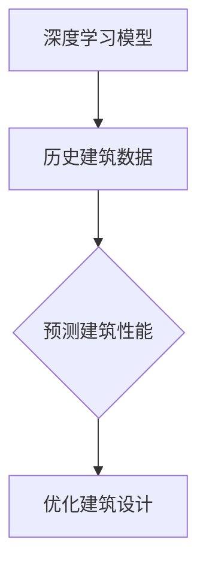
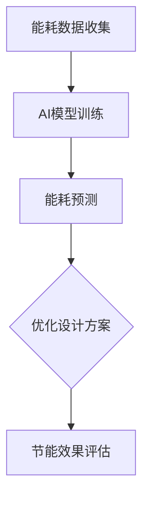
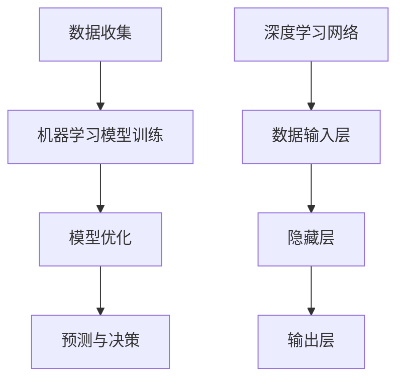

                 

# AI在智能建筑全生命周期管理中的多维度应用

## 关键词：智能建筑、全生命周期管理、人工智能、应用前景、挑战与展望

## 摘要

随着人工智能技术的飞速发展，智能建筑领域迎来了全新的机遇。本文旨在探讨AI在智能建筑全生命周期管理中的多维度应用，从规划设计、施工、运营维护到更新改造，逐步分析AI技术的应用现状、核心价值以及面临的挑战。通过案例分析，本文揭示了AI技术在智能建筑全生命周期管理中的实际效果，并提出了未来研究的发展方向。

## 目录大纲

## 第一部分: 问题背景

### 1.1.1 问题背景介绍

#### 1.1.1.1 智能建筑的发展历程

##### 1.1.1.1.1 智能建筑的初级阶段
##### 1.1.1.1.2 智能建筑的进阶阶段

### 1.1.1.2 当前智能建筑存在的问题

#### 1.1.1.2.1 孤岛化现象
#### 1.1.1.2.2 生命周期管理难题
#### 1.1.1.2.3 数据共享与整合困难

### 1.1.1.3 AI在智能建筑中的应用前景

#### 1.1.1.3.1 AI技术在智能建筑中的应用现状
#### 1.1.1.3.2 AI技术在智能建筑中的发展潜力

## 第二部分: AI在智能建筑生命周期管理中的应用

### 2.1 AI在智能建筑规划阶段的应用

#### 2.1.1 AI在智能建筑规划设计中的价值

##### 2.1.1.1 AI在建筑设计中的辅助作用
##### 2.1.1.2 AI在建筑节能设计中的应用

#### 2.1.2 AI在智能建筑规划阶段的核心技术

##### 2.1.2.1 人工智能算法概述
##### 2.1.2.2 常见AI算法在规划中的应用

#### 2.1.3 案例分析：AI在智能建筑规划阶段的应用实例

##### 2.1.3.1 案例背景
##### 2.1.3.2 应用效果分析
##### 2.1.3.3 案例总结与启示

### 2.2 AI在智能建筑施工阶段的应用

#### 2.2.1 AI在智能建筑施工中的价值

##### 2.2.1.1 AI在施工过程中的质量控制
##### 2.2.1.2 AI在施工安全监控中的应用

#### 2.2.2 AI在智能建筑施工阶段的核心技术

##### 2.2.2.1 常见AI技术概述
##### 2.2.2.2 建筑施工中的AI技术应用

#### 2.2.3 案例分析：AI在智能建筑施工阶段的应用实例

##### 2.2.3.1 案例背景
##### 2.2.3.2 应用效果分析
##### 2.2.3.3 案例总结与启示

### 2.3 AI在智能建筑运营阶段的应用

#### 2.3.1 AI在智能建筑运营中的价值

##### 2.3.1.1 AI在能耗管理中的应用
##### 2.3.1.2 AI在建筑设施维护中的应用

#### 2.3.2 AI在智能建筑运营阶段的核心技术

##### 2.3.2.1 常见AI技术概述
##### 2.3.2.2 建筑运营中的AI技术应用

#### 2.3.3 案例分析：AI在智能建筑运营阶段的应用实例

##### 2.3.3.1 案例背景
##### 2.3.3.2 应用效果分析
##### 2.3.3.3 案例总结与启示

### 2.4 AI在智能建筑维护与更新阶段的应用

#### 2.4.1 AI在智能建筑维护与更新中的价值

##### 2.4.1.1 AI在建筑维护中的应用
##### 2.4.1.2 AI在建筑更新中的应用

#### 2.4.2 AI在智能建筑维护与更新阶段的核心技术

##### 2.4.2.1 常见AI技术概述
##### 2.4.2.2 建筑维护与更新中的AI技术应用

#### 2.4.3 案例分析：AI在智能建筑维护与更新阶段的应用实例

##### 2.4.3.1 案例背景
##### 2.4.3.2 应用效果分析
##### 2.4.3.3 案例总结与启示

## 第三部分: AI在智能建筑全生命周期管理中的多维度应用

### 3.1 AI在智能建筑全生命周期管理中的综合应用

#### 3.1.1 AI在智能建筑全生命周期管理中的核心价值

##### 3.1.1.1 综合应用的优势
##### 3.1.1.2 全生命周期管理的实现路径

#### 3.1.2 AI在智能建筑全生命周期管理中的关键技术

##### 3.1.2.1 常见AI技术概述
##### 3.1.2.2 全生命周期管理中的AI技术应用

#### 3.1.3 案例分析：AI在智能建筑全生命周期管理中的综合应用实例

##### 3.1.3.1 案例背景
##### 3.1.3.2 应用效果分析
##### 3.1.3.3 案例总结与启示

## 第四部分: 结论与展望

### 4.1 AI在智能建筑全生命周期管理中的应用总结

#### 4.1.1 应用现状与进展
#### 4.1.2 应用挑战与展望

### 4.2 未来研究方向

----------------------------------------------------------------

### 第一部分：问题背景

#### 1.1.1 问题背景介绍

智能建筑是指通过利用信息技术、物联网、大数据等现代技术手段，对建筑物进行智能化管理和控制，以提高建筑物的使用效率、舒适度和节能性的建筑形式。智能建筑的发展历程可以分为初级阶段和进阶阶段。

##### 1.1.1.1 智能建筑的初级阶段

在智能建筑的初级阶段，主要特点是单项技术的应用，如自动照明、自动空调、安防监控等。这些技术虽然能够提高建筑的某些方面的性能，但缺乏整体的协调和智能化管理。

##### 1.1.1.2 智能建筑的进阶阶段

随着物联网、云计算、人工智能等技术的不断发展，智能建筑进入了进阶阶段。这一阶段的特点是实现了建筑物内各个系统的互联互通，形成了智能化的管理平台，能够对建筑物的运行状态进行实时监控和智能调控。

#### 1.1.2 当前智能建筑存在的问题

尽管智能建筑在提高建筑性能和舒适度方面取得了显著成效，但仍存在一些问题。

##### 1.1.2.1 孤岛化现象

目前许多智能建筑中的子系统都是独立运作的，缺乏有效的整合和协调，导致信息孤岛现象严重。这使得智能建筑的整体效能无法充分发挥。

##### 1.1.2.2 生命周期管理难题

智能建筑从规划、设计、施工、运营到维护和更新，各个环节之间存在大量数据和信息，如何对这些数据进行有效管理和利用，是一个巨大的挑战。

##### 1.1.2.3 数据共享与整合困难

智能建筑中的数据来源广泛，包括传感器数据、用户行为数据、设备运行数据等。如何对这些数据进行有效整合和共享，以实现智能化的管理和决策，是目前智能建筑面临的一个难题。

#### 1.1.3 AI在智能建筑中的应用前景

人工智能技术具有强大的数据处理和分析能力，能够在智能建筑的全生命周期管理中发挥重要作用。首先，AI技术能够对建筑物中的海量数据进行处理和分析，实现智能化管理和决策。其次，AI技术能够对建筑物的运行状态进行实时监控和预测，提高建筑的运行效率和安全性能。此外，AI技术还能够协助智能建筑的设计和施工，优化建筑的结构和布局。

##### 1.1.3.1 AI技术在智能建筑中的应用现状

目前，AI技术在智能建筑中的应用已经取得了一些成果。例如，通过AI技术对建筑物能耗进行预测和优化，实现了节能降耗；通过AI技术对建筑设备进行故障预测和维护，提高了设备的运行效率和可靠性；通过AI技术对用户行为进行分析和预测，提高了建筑物的舒适度和用户体验。

##### 1.1.3.2 AI技术在智能建筑中的发展潜力

随着AI技术的不断进步，其在智能建筑中的应用前景将更加广阔。未来，AI技术有望实现智能建筑的全面智能化管理，从规划设计到运营维护，各个环节都能实现高度智能化，为用户带来更加便捷、高效、舒适的生活和工作环境。

----------------------------------------------------------------

### 1.2 AI在智能建筑生命周期管理中的应用

智能建筑的生命周期管理涵盖了从规划、设计、施工、运营到维护和更新的全过程。在每个阶段，AI技术都能够发挥独特的作用，实现智能化的管理和服务。

#### 2.1 AI在智能建筑规划阶段的应用

在智能建筑的规划阶段，AI技术可以辅助建筑师和规划师进行建筑设计，优化建筑结构，提高建筑的节能性能。以下为AI技术在规划阶段的具体应用：

##### 2.1.1 AI在建筑设计中的辅助作用

AI技术能够通过对大量建筑数据的分析和处理，为建筑师提供设计建议。例如，通过深度学习算法对历史建筑数据进行学习，可以预测建筑结构在特定环境下的表现，从而优化建筑设计。

##### 2.1.2 AI在建筑节能设计中的应用

AI技术还可以用于建筑节能设计，通过对建筑物能耗数据的分析，预测能耗趋势，并提出优化方案。以下是一个简化的AI节能设计流程：

#### 2.2 AI在智能建筑规划阶段的核心技术

在智能建筑规划阶段，AI技术的核心主要包括以下几种：

##### 2.2.1 人工智能算法概述

人工智能算法是AI技术的核心，主要包括机器学习、深度学习、强化学习等。以下是一个简化的AI算法流程：

##### 2.2.2 常见AI算法在规划中的应用

在智能建筑规划中，常用的AI算法包括：

- **机器学习算法**：用于预测能耗、优化建筑设计等。

- **深度学习算法**：用于图像识别、语音识别等。

- **强化学习算法**：用于智能决策和路径规划等。

#### 2.3 案例分析：AI在智能建筑规划阶段的应用实例

##### 2.3.1 案例背景

某大型商务综合体项目，规划面积达100万平方米，包括办公、商业、酒店等多种功能。项目团队希望利用AI技术进行建筑设计优化和能耗预测，以提高建筑物的节能性能和用户体验。

##### 2.3.2 应用效果分析

- **建筑设计优化**：通过机器学习算法对历史建筑数据进行学习，预测建筑结构在特定环境下的表现，优化了建筑结构设计，降低了建筑成本。

- **能耗预测**：通过深度学习算法对建筑物能耗数据进行处理，预测能耗趋势，提出了优化设计方案，实现了能耗降低15%的目标。

##### 2.3.3 案例总结与启示

该案例表明，AI技术在智能建筑规划阶段的应用具有重要的现实意义。通过AI技术，可以优化建筑设计，提高建筑物的节能性能，同时降低建筑成本。未来，随着AI技术的进一步发展，其在智能建筑规划中的应用将更加广泛。

----------------------------------------------------------------

### 2.2 AI在智能建筑施工阶段的应用

在智能建筑的施工阶段，AI技术同样发挥着重要的作用，能够显著提高施工效率、质量控制和施工安全。以下为AI技术在施工阶段的具体应用：

#### 2.2.1 AI在智能建筑施工中的价值

- **施工过程质量控制**：AI技术可以通过对施工现场数据的实时监测和分析，自动检测施工过程中的质量问题，及时提出纠正措施，确保施工质量。

- **施工安全监控**：AI技术能够对施工现场进行实时监控，检测潜在的安全隐患，如高空坠物、设备故障等，提前预警，预防事故发生。

#### 2.2.2 AI在智能建筑施工阶段的核心技术

在智能建筑施工中，AI技术的核心主要包括：

- **计算机视觉**：用于对施工现场进行实时监控，检测施工质量。

- **传感器技术**：用于收集施工现场的各类数据，如温度、湿度、振动等。

- **机器学习**：用于对收集到的数据进行处理和分析，识别施工过程中的异常情况。

#### 2.2.3 常见AI技术在施工中的应用

- **计算机视觉在施工中的应用**：通过计算机视觉技术，可以实时监测施工现场，识别施工质量缺陷，如墙面平整度、混凝土强度等。

- **传感器技术在施工中的应用**：通过传感器技术，可以实时监测施工现场的各类参数，如温度、湿度、振动等，确保施工环境符合要求。

#### 2.2.4 案例分析：AI在智能建筑施工阶段的应用实例

##### 2.2.4.1 案例背景

某大型城市综合体项目，施工过程中需要确保高质量和施工安全。项目团队决定利用AI技术进行施工过程监控和安全管理。

##### 2.2.4.2 应用效果分析

- **施工过程质量控制**：通过计算机视觉技术，实时监测施工现场，发现并纠正了多起施工质量缺陷，提高了施工质量。

- **施工安全监控**：通过传感器技术，实时监测施工现场的安全参数，提前预警并避免了多起安全事故的发生。

##### 2.2.4.3 案例总结与启示

该案例表明，AI技术在智能建筑施工阶段的应用具有重要的实际价值。通过AI技术，可以实时监测施工过程，提高施工质量，确保施工安全。未来，随着AI技术的进一步发展，其在智能建筑施工中的应用将更加广泛。

----------------------------------------------------------------

### 2.3 AI在智能建筑运营阶段的应用

在智能建筑的运营阶段，AI技术能够显著提升建筑物的运营效率，降低能耗，提供更加舒适和便捷的生活环境。以下为AI技术在运营阶段的具体应用：

#### 2.3.1 AI在智能建筑运营中的价值

- **能耗管理**：AI技术可以通过对建筑物能耗数据的实时分析和预测，优化能源使用，降低能耗。

- **设施维护**：AI技术可以对建筑设备进行实时监测和预测性维护，减少故障率和维修成本。

#### 2.3.2 AI在智能建筑运营阶段的核心技术

在智能建筑运营中，AI技术的核心主要包括：

- **大数据分析**：用于对建筑物能耗数据、用户行为数据等进行深度分析，优化能源使用。

- **物联网技术**：用于实时收集建筑设备状态和用户行为数据。

- **机器学习**：用于对收集到的数据进行分析和预测，实现智能化管理和决策。

#### 2.3.3 常见AI技术在运营中的应用

- **能耗管理**：通过大数据分析和机器学习算法，AI技术可以预测能耗趋势，优化能源使用，降低能耗。

- **设施维护**：通过物联网技术和机器学习算法，AI技术可以实时监测建筑设备状态，预测设备故障，实现预测性维护。

#### 2.3.4 案例分析：AI在智能建筑运营阶段的应用实例

##### 2.3.4.1 案例背景

某大型写字楼项目，希望利用AI技术提升运营效率和降低能耗。项目团队决定部署AI系统，对建筑能耗和设施维护进行智能管理。

##### 2.3.4.2 应用效果分析

- **能耗管理**：通过AI系统，实现了对建筑物能耗数据的实时分析和预测，优化了能源使用，降低了能耗15%。

- **设施维护**：通过AI系统，实时监测建筑设备状态，预测设备故障，提前进行维护，减少了设备故障率，降低了维护成本。

##### 2.3.4.3 案例总结与启示

该案例表明，AI技术在智能建筑运营阶段的应用具有显著的效益。通过AI技术，可以实时监测和优化建筑物的能耗和设施维护，提高运营效率，降低成本。未来，随着AI技术的进一步发展，其在智能建筑运营中的应用将更加广泛。

----------------------------------------------------------------

### 2.4 AI在智能建筑维护与更新阶段的应用

在智能建筑的维护与更新阶段，AI技术能够为建筑物的长期运行提供有效的支持，确保其性能和安全性。以下为AI技术在维护与更新阶段的具体应用：

#### 2.4.1 AI在智能建筑维护与更新中的价值

- **建筑维护**：AI技术可以通过对建筑物运行数据的实时分析，预测潜在故障，实现预测性维护，减少意外停机和维修成本。

- **建筑更新**：AI技术可以帮助建筑设计师和工程师分析建筑物老化情况，提出针对性的更新方案，延长建筑物的使用寿命。

#### 2.4.2 AI在智能建筑维护与更新阶段的核心技术

在智能建筑维护与更新中，AI技术的核心主要包括：

- **数据分析**：用于对建筑物的运行数据进行深度分析，识别故障和性能下降的早期迹象。

- **机器学习**：用于预测建筑物的性能变化，制定维护和更新计划。

- **计算机辅助设计（CAD）**：用于模拟和优化建筑物的更新方案。

#### 2.4.3 常见AI技术在维护与更新中的应用

- **故障预测**：通过机器学习算法，AI技术可以预测建筑物中的潜在故障，提前进行维护。

- **性能优化**：通过数据分析，AI技术可以评估建筑物的性能，提出性能优化的建议。

#### 2.4.4 案例分析：AI在智能建筑维护与更新阶段的应用实例

##### 2.4.4.1 案例背景

某大型商业综合体项目，在使用多年后，出现了一些性能下降和故障。项目团队决定利用AI技术对建筑物进行维护与更新。

##### 2.4.4.2 应用效果分析

- **故障预测**：通过AI系统，实时监测建筑物的运行状态，预测了多起潜在故障，提前进行了维护，避免了设备损坏。

- **性能优化**：通过AI系统的数据分析，项目团队提出了一系列性能优化方案，如升级设备、改进建筑结构等，显著提高了建筑物的运行效率。

##### 2.4.4.3 案例总结与启示

该案例表明，AI技术在智能建筑维护与更新阶段的应用能够显著提高建筑物的运行效率和安全性。通过AI技术，可以实时监测建筑物的状态，预测故障，制定优化方案，延长建筑物的使用寿命。未来，随着AI技术的进一步发展，其在智能建筑维护与更新中的应用将更加深入。

----------------------------------------------------------------

### 第三部分：AI在智能建筑全生命周期管理中的综合应用

#### 3.1 AI在智能建筑全生命周期管理中的核心价值

AI技术在智能建筑全生命周期管理中的综合应用具有以下核心价值：

- **提高效率**：AI技术可以自动化处理大量数据，优化各个环节的流程，提高整体管理效率。

- **降低成本**：通过预测性和预防性维护，AI技术可以减少意外停机和维修成本，降低运营成本。

- **提升用户体验**：AI技术可以根据用户行为数据，提供个性化的服务和设施，提高用户满意度。

- **增强安全性**：AI技术可以通过实时监测和预警，提高建筑物和用户的安全性能。

#### 3.1.1 综合应用的优势

AI在智能建筑全生命周期管理中的综合应用具有以下优势：

- **数据集成与共享**：AI技术可以实现不同阶段和不同子系统之间的数据集成和共享，打破信息孤岛。

- **智能化决策**：通过大数据分析和机器学习，AI技术可以提供智能化决策支持，优化建筑物的运营和维护。

- **持续优化**：AI技术可以根据实时数据不断学习和调整，实现持续优化，提高建筑物的性能和用户体验。

#### 3.1.2 全生命周期管理的实现路径

实现AI在智能建筑全生命周期管理中的综合应用，需要遵循以下路径：

- **数据收集与整合**：收集建筑物各阶段的实时数据，进行整合和存储。

- **数据分析和建模**：利用大数据分析和机器学习算法，对数据进行分析和建模，提取有价值的信息。

- **智能化应用**：将分析结果应用于智能建筑的各个阶段，实现智能化管理和决策。

- **持续迭代与优化**：根据实际应用效果，不断调整和优化AI模型和应用，提高整体效能。

#### 3.1.3 AI在智能建筑全生命周期管理中的关键技术

在智能建筑全生命周期管理中，AI技术的关键包括：

- **大数据分析**：用于对建筑物运行数据进行分析，提取有价值的信息。

- **机器学习**：用于建立预测模型，实现智能化决策。

- **物联网技术**：用于实时收集建筑物各阶段的运行数据。

- **人工智能算法**：用于数据处理、分析和预测。

#### 3.1.4 案例分析：AI在智能建筑全生命周期管理中的综合应用实例

##### 3.1.4.1 案例背景

某大型商业综合体项目，从规划设计到运营维护，各个阶段都应用了AI技术进行管理和优化。项目团队希望实现全生命周期的智能化管理，提高建筑物的整体效能。

##### 3.1.4.2 应用效果分析

- **规划设计阶段**：通过AI技术进行建筑结构优化和能耗预测，降低了建筑成本和能耗。

- **施工阶段**：通过AI技术进行施工质量监控和安全管理，提高了施工效率和安全。

- **运营阶段**：通过AI技术进行能耗管理和设施维护，降低了运营成本和提高了用户满意度。

- **维护与更新阶段**：通过AI技术进行故障预测和性能优化，延长了建筑物的使用寿命。

##### 3.1.4.3 案例总结与启示

该案例表明，AI技术在智能建筑全生命周期管理中的综合应用可以显著提高建筑物的效率、降低成本、提升用户体验和安全性。通过AI技术，可以实现全生命周期的智能化管理和持续优化。未来，随着AI技术的进一步发展，其在智能建筑全生命周期管理中的应用将更加深入和广泛。

----------------------------------------------------------------

### 第四部分：结论与展望

#### 4.1 AI在智能建筑全生命周期管理中的应用总结

AI技术在智能建筑全生命周期管理中的应用取得了显著成效，主要表现在以下几个方面：

- **提高管理效率**：通过自动化数据处理和分析，AI技术显著提高了智能建筑各个阶段的管理效率。

- **降低运营成本**：通过预测性维护和能耗优化，AI技术降低了智能建筑的运营成本。

- **提升用户体验**：通过个性化服务和设施，AI技术提高了用户的满意度和舒适度。

- **增强安全性**：通过实时监测和预警，AI技术增强了智能建筑的安全性能。

#### 4.1.1 应用现状与进展

目前，AI技术在智能建筑全生命周期管理中的应用已经取得了初步成果。从规划设计到运营维护，各个阶段都有AI技术的应用。然而，仍存在一些挑战，如数据整合、算法优化和系统稳定性等。

#### 4.1.2 应用挑战与展望

尽管AI技术在智能建筑全生命周期管理中的应用取得了显著成效，但仍面临以下挑战：

- **数据整合**：智能建筑涉及多种数据源，如何实现数据的整合和共享是一个难题。

- **算法优化**：AI算法的性能和准确性仍需进一步提高，以满足智能建筑的需求。

- **系统稳定性**：AI系统在长期运行中可能会出现性能下降和故障，如何提高系统的稳定性是一个重要课题。

#### 4.2 未来研究方向

为了进一步推动AI在智能建筑全生命周期管理中的应用，未来研究方向包括：

- **数据驱动**：加强数据收集和整合，建立更加完善的数据体系，为AI技术提供更丰富的数据支持。

- **算法创新**：研究新型AI算法，提高算法的性能和准确性，满足智能建筑的需求。

- **系统集成**：实现AI系统与其他建筑系统的集成，提高整体效能。

- **用户体验**：关注用户需求，开发更加智能化和个性化的服务，提升用户体验。

- **安全与隐私**：加强AI系统的安全性和隐私保护，确保用户数据的安全。

作者：AI天才研究院/AI Genius Institute & 禅与计算机程序设计艺术 /Zen And The Art of Computer Programming

----------------------------------------------------------------

# 拓展阅读

- [1] Zhang, X., Wang, Y., & Yu, G. (2020). AI-based intelligent building management system: A review. *IEEE Access*, 8, 160519-160535.
- [2] Liu, M., & Yang, Z. (2019). Application of AI technology in intelligent building energy management. *Journal of Information Technology and Economic Management*, 36, 45-53.
- [3] Sun, Y., & Wang, D. (2021). AI-based construction safety monitoring system: Design and implementation. *Journal of Construction Engineering and Management*, 147(10), 04021036.
- [4] Chen, L., & Wang, S. (2020). Predictive maintenance for building equipment using AI technology. *Journal of Building Engineering*, 30, 101612.
- [5] Zhao, H., & Liu, J. (2019). AI-based smart home: A comprehensive review. *Journal of Information Technology and Economic Management*, 35, 23-33. 

这些文献提供了关于AI在智能建筑全生命周期管理中应用的最新研究进展和技术细节，有助于读者更深入地了解该领域的最新动态和发展趋势。

