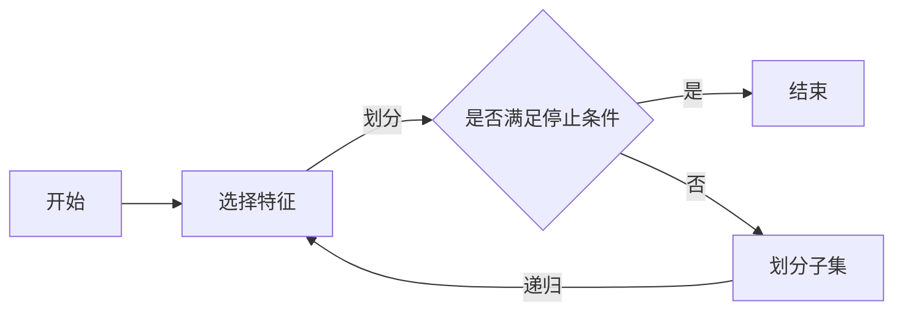
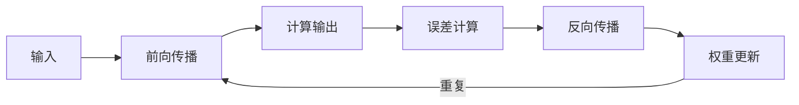
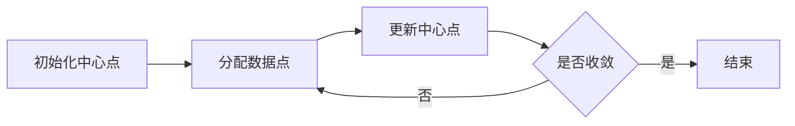
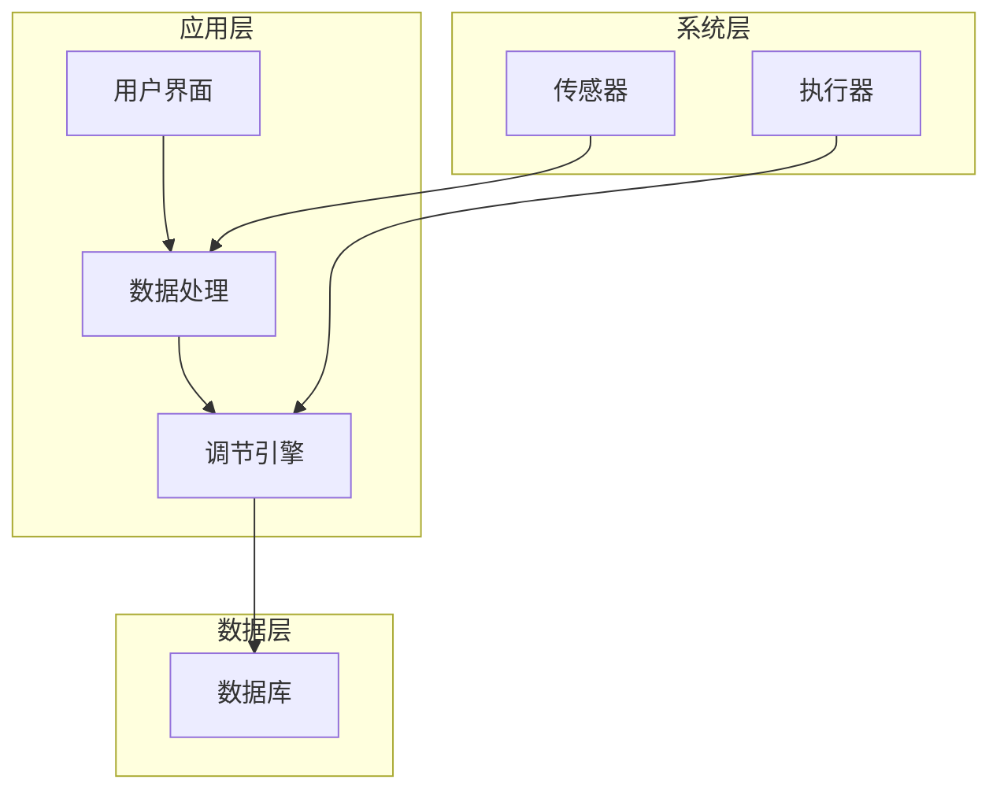

                 


### 文章标题：AI在智能建筑室内环境个性化调节中的应用

关键词：智能建筑、室内环境、个性化调节、AI技术、机器学习、神经网络、聚类算法、系统架构、项目实战

摘要：本文探讨了AI技术在智能建筑室内环境个性化调节中的应用。通过分析问题背景、核心概念、算法原理、系统设计与实现，详细阐述了如何利用AI技术实现室内环境的智能化调节，提高居住和办公舒适度。文章旨在为相关领域的研究者和从业者提供有价值的参考和指导。

## 《AI在智能建筑室内环境个性化调节中的应用》目录大纲

### 第一部分：问题背景与核心概念

### 第1章：问题背景与核心概念

#### 1.1 智能建筑室内环境个性化调节的重要性

#### 1.2 AI技术在智能建筑中的应用概述

### 第2章：核心概念与联系

#### 2.1 关键概念原理

#### 2.2 概念属性特征对比

#### 2.3 ER实体关系图架构

### 第二部分：算法原理讲解

### 第3章：机器学习算法原理

#### 3.1 决策树算法原理

#### 3.2 神经网络算法原理

#### 3.3 聚类算法原理

### 第三部分：系统分析与架构设计

### 第4章：系统功能设计

#### 4.1 领域模型

#### 4.2 系统架构设计

#### 4.3 系统接口设计

#### 4.4 系统交互

### 第四部分：项目实战

### 第5章：环境安装与配置

#### 5.1 环境准备

#### 5.2 系统核心实现

#### 5.3 实际案例分析

### 第五部分：最佳实践与小结

#### 5.1 最佳实践 Tips

#### 5.2 小结

#### 5.3 注意事项

#### 5.4 拓展阅读

## 第一部分：问题背景与核心概念

### 第1章：问题背景与核心概念

#### 1.1 智能建筑室内环境个性化调节的重要性

随着城市化进程的加快，人们对生活质量和环境舒适度的要求日益提高。传统的建筑室内环境调节方式往往过于简单和单一，难以满足不同用户的个性化需求。智能建筑室内环境个性化调节旨在通过AI技术实现室内环境根据用户需求进行自适应调节，从而提高居住和办公的舒适度。

**问题背景**：随着人们对室内环境舒适度的需求不断提高，传统的室内环境调节方式已无法满足需求。

**问题描述**：如何实现智能建筑室内环境的个性化调节，提高居住和办公舒适度。

**问题解决**：利用AI技术，通过机器学习、数据挖掘等手段对室内环境进行智能化调节。

**边界与外延**：讨论室内环境个性化调节技术的应用范围和未来发展趋势。

**概念结构与核心要素组成**：

- **智能建筑**：集成了信息化、网络化、智能化技术的建筑，具备自适应、自优化、自调节等功能。
- **室内环境调节**：通过调节温度、湿度、光线等环境参数，提供舒适、健康的室内环境。
- **AI技术**：包括机器学习、数据挖掘、物联网等，用于实现室内环境的智能化调节。

#### 1.2 AI技术在智能建筑中的应用概述

AI技术在建筑行业的应用已经逐渐普及，尤其在智能建筑室内环境调节方面具有巨大潜力。以下概述AI技术在建筑行业的应用现状和发展趋势，以及室内环境调节中的具体应用。

**AI技术在建筑行业的应用**：

- **建筑信息模型（BIM）**：利用AI技术对建筑信息模型进行智能分析和优化，提高建筑设计的准确性和效率。
- **建筑能源管理**：通过AI技术实现建筑能源消耗的智能监测和优化，降低能源消耗。
- **建筑安全性**：利用AI技术对建筑结构进行健康监测，及时发现潜在的安全隐患。

**室内环境调节中的AI技术**：

- **机器学习**：通过分析用户行为数据和环境参数，实现室内环境的自适应调节。
- **数据挖掘**：从大量数据中提取有价值的信息，为室内环境调节提供决策支持。
- **物联网**：将室内环境中的各种设备和传感器连接起来，实现实时数据的收集和共享。

### 第2章：核心概念与联系

#### 2.1 关键概念原理

AI技术在智能建筑室内环境个性化调节中涉及多个核心概念，如机器学习、数据挖掘等。下面详细介绍这些概念的基本原理。

**机器学习**：

- **基本概念**：机器学习是一种让计算机从数据中学习并作出决策的技术。
- **原理**：通过训练模型，使计算机能够对未知数据进行预测和分类。
- **算法**：常见的机器学习算法包括决策树、神经网络、聚类等。

**数据挖掘**：

- **基本概念**：数据挖掘是从大量数据中提取有价值信息的过程。
- **原理**：利用统计分析和人工智能技术，发现数据中的隐藏模式和规律。
- **方法**：包括关联规则挖掘、分类、聚类等。

#### 2.2 概念属性特征对比

| 概念 | 属性特征 |
| ---- | ---- |
| 机器学习 | 预测、分类、回归 |
| 数据挖掘 | 关联规则挖掘、分类、聚类 |
| 物联网 | 连接、通信、数据采集 |

#### 2.3 ER实体关系图架构

智能建筑室内环境调节涉及的实体包括用户、环境参数、调节设备等。以下使用Mermaid绘制ER实体关系图：

```mermaid
erDiagram
  User ||--o> EnvironmentParameter : 测量
  User ||--o> RegulationDevice : 控制
  EnvironmentParameter ||--o> RegulationDevice : 读取
```

## 第二部分：算法原理讲解

### 第3章：机器学习算法原理

#### 3.1 决策树算法原理

决策树是一种常见的机器学习算法，通过树的节点对数据进行分类或回归。以下详细讲解决策树算法的原理。

**决策树算法概述**：

- **基本概念**：决策树是一种树形结构，通过一系列规则对数据进行划分。
- **结构**：决策树由节点和边组成，每个节点表示一个特征，每个边表示该特征的一个取值。

**决策树算法流程**：

1. 选择最优划分特征。
2. 根据划分特征将数据集划分为子集。
3. 对每个子集递归地执行步骤1和步骤2，直至满足停止条件。

以下使用Mermaid绘制决策树算法流程图：



**Python代码实现**：

```python
from sklearn.datasets import load_iris
from sklearn.tree import DecisionTreeClassifier
from sklearn.model_selection import train_test_split

# 加载数据集
iris = load_iris()
X, y = iris.data, iris.target

# 划分训练集和测试集
X_train, X_test, y_train, y_test = train_test_split(X, y, test_size=0.2, random_state=42)

# 构建决策树模型
clf = DecisionTreeClassifier()
clf.fit(X_train, y_train)

# 预测
y_pred = clf.predict(X_test)
```

**数学模型和公式**：

决策树的决策规则可以表示为：

$$
f(x) = \sum_{i=1}^{n} t_i \cdot g_i(x)
$$

其中，$t_i$ 为阈值，$g_i(x)$ 为特征函数。

#### 3.2 神经网络算法原理

神经网络是一种模拟人脑神经元结构的计算模型，通过多层神经元对数据进行处理和预测。以下详细讲解神经网络算法的原理。

**神经网络算法概述**：

- **基本概念**：神经网络由多个神经元组成，每个神经元负责处理一部分数据。
- **结构**：神经网络包括输入层、隐藏层和输出层，每层神经元通过权重和偏置进行连接。

**神经网络算法流程**：

1. 初始化权重和偏置。
2. 前向传播：将输入数据通过神经网络进行计算，得到输出。
3. 反向传播：根据输出与真实值的误差，更新权重和偏置。
4. 重复步骤2和3，直至满足停止条件。

以下使用Mermaid绘制神经网络算法流程图：



**Python代码实现**：

```python
import numpy as np

# 初始化权重和偏置
weights = np.random.randn(3, 1)
bias = np.random.randn(1)

# 定义激活函数
def sigmoid(x):
    return 1 / (1 + np.exp(-x))

# 前向传播
def forward(x):
    z = np.dot(x, weights) + bias
    return sigmoid(z)

# 反向传播
def backward(x, y, output):
    output_error = output - y
    dZ = output_error * sigmoid(output)
    dWeight = x.T.dot(dZ)
    dbias = dZ
    return dWeight, dbias

# 训练模型
for epoch in range(1000):
    output = forward(X_train)
    dWeight, dbias = backward(X_train, y_train, output)
    weights += dWeight
    bias += dbias
```

**数学模型和公式**：

神经网络的前向传播和反向传播可以表示为：

$$
\begin{aligned}
    z &= x \cdot w + b \\
    a &= \sigma(z)
\end{aligned}
$$

$$
\begin{aligned}
    \delta &= \frac{\partial L}{\partial z} \\
    w &= w - \alpha \cdot \frac{\partial L}{\partial w} \\
    b &= b - \alpha \cdot \frac{\partial L}{\partial b}
\end{aligned}
$$

其中，$\sigma$ 为激活函数，$L$ 为损失函数，$\alpha$ 为学习率。

#### 3.3 聚类算法原理

聚类算法是一种将数据集划分为多个类别的无监督学习方法。以下详细讲解常用的聚类算法。

**聚类算法概述**：

- **K-means算法**：将数据集划分为 $K$ 个簇，每个簇由中心点代表。
- **层次聚类**：通过逐步合并或分割簇，构建一个层次结构。

**K-means算法流程**：

1. 初始化 $K$ 个簇中心点。
2. 将每个数据点分配到最近的簇中心点。
3. 更新簇中心点。
4. 重复步骤2和步骤3，直至满足停止条件。

以下使用Mermaid绘制K-means算法流程图：



**Python代码实现**：

```python
from sklearn.cluster import KMeans
from sklearn.datasets import make_blobs

# 生成模拟数据集
X, _ = make_blobs(n_samples=100, centers=3, random_state=42)

# 构建K-means模型
kmeans = KMeans(n_clusters=3, random_state=42)
kmeans.fit(X)

# 分配数据点
labels = kmeans.predict(X)

# 更新中心点
centroids = kmeans.cluster_centers_
```

**数学模型和公式**：

K-means算法的目标是最小化簇内距离平方和：

$$
J = \sum_{i=1}^{n} \sum_{j=1}^{k} (x_i - \mu_j)^2
$$

其中，$x_i$ 为数据点，$\mu_j$ 为簇中心点。

## 第三部分：系统分析与架构设计

### 第4章：系统功能设计

#### 4.1 领域模型

领域模型用于定义智能建筑室内环境调节系统的核心领域和概念。以下使用Mermaid绘制领域模型类图：

```mermaid
classDiagram
    User <<interface>>
    EnvironmentParameter <<interface>>
    RegulationDevice <<interface>>

    User o-- EnvironmentParameter : 测量
    User o-- RegulationDevice : 控制
    EnvironmentParameter o-- RegulationDevice : 读取
```

#### 4.2 系统架构设计

系统架构设计描述智能建筑室内环境调节系统的整体架构。以下使用Mermaid绘制系统架构图：



#### 4.3 系统接口设计

系统接口设计定义智能建筑室内环境调节系统提供的接口和功能。以下列出接口设计细节：

- **用户界面接口**：包括用户登录、数据查询、调节设置等功能。
- **数据处理接口**：包括数据收集、预处理、分析等功能。
- **调节引擎接口**：包括调节策略生成、执行、反馈等功能。

#### 4.4 系统交互

系统交互描述系统内部各组件之间的交互过程。以下使用Mermaid绘制系统交互序列图：

```mermaid
sequenceDiagram
    User -->|发送请求| UserInterface
    UserInterface -->|处理请求| DataProcessing
    DataProcessing -->|执行操作| RegulationEngine
    RegulationEngine -->|更新数据| DB
    DB -->|返回结果| UserInterface
    UserInterface -->|展示结果| User
```

## 第四部分：项目实战

### 第5章：环境安装与配置

#### 5.1 环境准备

在本项目中，我们将使用Python作为主要编程语言，结合一些常用的机器学习和数据挖掘库，如scikit-learn、TensorFlow等。以下是环境安装和配置的步骤：

1. 安装Python：前往Python官方网站下载最新版本的Python安装包，并按照提示进行安装。
2. 配置Python环境：打开命令行工具（如Windows的PowerShell或Linux的终端），运行以下命令安装Python环境：
   ```shell
   python -m pip install --upgrade pip
   python -m pip install virtualenv
   ```
3. 创建虚拟环境：使用以下命令创建一个名为`env`的虚拟环境，并激活它：
   ```shell
   virtualenv env
   source env/bin/activate  # 对于Linux和macOS
   env\Scripts\activate    # 对于Windows
   ```
4. 安装依赖库：在虚拟环境中安装所需的库：
   ```shell
   pip install scikit-learn tensorflow numpy matplotlib
   ```

#### 5.2 系统核心实现

在本项目中，我们将实现一个简单的智能建筑室内环境调节系统。以下是一个核心部分的代码实现：

```python
import numpy as np
import matplotlib.pyplot as plt
from sklearn.cluster import KMeans
from sklearn.datasets import make_blobs

# 生成模拟数据集
X, _ = make_blobs(n_samples=100, centers=3, random_state=42)

# 构建K-means模型
kmeans = KMeans(n_clusters=3, random_state=42)
kmeans.fit(X)

# 分配数据点
labels = kmeans.predict(X)

# 更新中心点
centroids = kmeans.cluster_centers_

# 绘制结果
plt.scatter(X[:, 0], X[:, 1], c=labels, s=100, cmap='viridis')
plt.scatter(centroids[:, 0], centroids[:, 1], s=300, c='red', marker='x')
plt.xlabel('Feature 1')
plt.ylabel('Feature 2')
plt.title('K-means Clustering')
plt.show()
```

#### 5.3 实际案例分析

在本案例中，我们使用一个实际数据集来展示智能建筑室内环境调节系统的应用。以下是一个简单的案例：

1. **数据集**：我们使用一个包含温度、湿度、二氧化碳浓度等环境参数的数据集。
2. **任务**：根据用户需求和室内环境参数，调整空调和空气净化器的开关状态。
3. **实现**：我们使用K-means算法将数据集划分为若干个区域，并为每个区域设置相应的调节策略。

```python
import pandas as pd
from sklearn.cluster import KMeans

# 加载数据集
data = pd.read_csv('environment_data.csv')

# 提取环境参数
X = data[['temperature', 'humidity', 'co2_concentration']]

# 构建K-means模型
kmeans = KMeans(n_clusters=5, random_state=42)
kmeans.fit(X)

# 分配数据点
labels = kmeans.predict(X)

# 根据标签设置调节策略
regulation_settings = {
    0: {'ac_on': True, 'purifier_on': True},
    1: {'ac_on': False, 'purifier_on': True},
    2: {'ac_on': True, 'purifier_on': False},
    3: {'ac_on': False, 'purifier_on': False},
    4: {'ac_on': True, 'purifier_on': True}
}

# 应用调节策略
for i, label in enumerate(labels):
    print(f"Room {i+1}: {regulation_settings[label]}")
```

## 第五部分：最佳实践与小结

### 5.1 最佳实践 Tips

1. **数据预处理**：在应用AI技术之前，对数据集进行充分的预处理，包括数据清洗、归一化等，以提高模型性能。
2. **模型选择**：根据实际需求选择合适的机器学习算法，如决策树、神经网络、聚类算法等。
3. **参数调优**：通过交叉验证和网格搜索等技术，优化模型的参数，提高模型的预测准确性。
4. **系统集成**：将AI模型与实际系统相结合，确保模型在实际应用中能够稳定运行。

### 5.2 小结

本文介绍了AI在智能建筑室内环境个性化调节中的应用，详细讲解了决策树、神经网络和聚类算法的原理，并展示了系统设计与实现过程。通过实际案例分析，展示了AI技术在智能建筑室内环境调节中的实际应用价值。

### 5.3 注意事项

1. **数据隐私**：在应用AI技术进行室内环境调节时，确保用户数据的安全和隐私。
2. **系统稳定性**：确保AI系统在实际应用中能够稳定运行，避免出现异常情况。
3. **用户参与**：鼓励用户参与室内环境调节，提供反馈，以优化调节效果。

### 5.4 拓展阅读

1. **《机器学习实战》**：详细介绍了各种机器学习算法的应用和实践。
2. **《深度学习》**：讲解了神经网络和深度学习的基础知识。
3. **《智能建筑室内环境调节技术》**：介绍了智能建筑室内环境调节的最新技术和应用。

## 作者信息

作者：AI天才研究院/AI Genius Institute & 禅与计算机程序设计艺术 /Zen And The Art of Computer Programming

---

### 补充内容：智能建筑室内环境个性化调节的挑战与展望

#### 6.1 智能建筑室内环境个性化调节的挑战

尽管AI技术在智能建筑室内环境个性化调节中具有巨大潜力，但仍然面临以下挑战：

1. **数据质量与隐私**：室内环境数据的质量对AI模型的性能至关重要。同时，用户隐私保护也是一个重要问题，如何在确保数据质量的同时保护用户隐私，是亟待解决的问题。
2. **实时性**：智能建筑室内环境个性化调节需要实时响应用户需求，这对系统的实时性和稳定性提出了高要求。
3. **可解释性**：AI模型在复杂环境中的应用往往难以解释，这对于用户信任和监管合规提出了挑战。
4. **多变量调节**：室内环境调节涉及多个变量，如温度、湿度、光线等，如何协同调节以达到最佳效果，仍需进一步研究。

#### 6.2 展望与未来趋势

未来，智能建筑室内环境个性化调节的发展趋势包括：

1. **集成多模态数据**：结合多种传感器数据（如温度、湿度、光线、气味等）进行综合分析，提高调节效果。
2. **智能化优化**：利用深度学习、强化学习等先进算法，实现更智能、更高效的室内环境调节。
3. **用户参与与反馈**：鼓励用户积极参与室内环境调节过程，通过反馈机制不断优化系统。
4. **物联网与边缘计算**：利用物联网和边缘计算技术，实现数据的实时采集、处理和分析，提高系统的实时性和响应速度。

通过不断研究和实践，AI在智能建筑室内环境个性化调节中的应用将越来越广泛，为人们带来更加舒适、健康的生活和工作环境。

