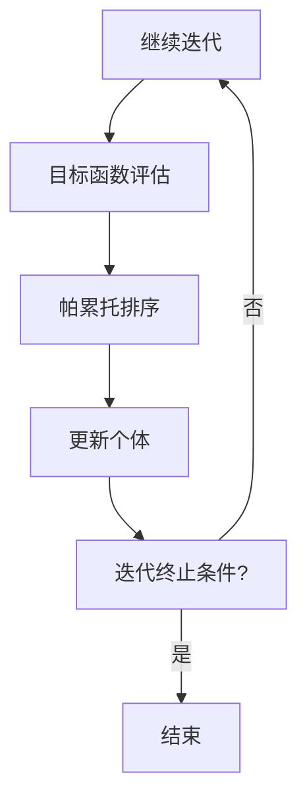

                 


# AI在智能建筑能源管理中的多目标优化应用

## 关键词
- 智能建筑
- 能源管理
- 多目标优化
- AI
- 算法

## 摘要
本文旨在探讨AI在智能建筑能源管理中的多目标优化应用。首先，我们介绍了智能建筑和能源管理的基本概念，阐述了AI在其中的重要性。接着，我们详细讲解了多目标优化的核心概念、算法原理及其在智能建筑能源管理中的应用。通过具体的数学模型和项目实战案例，我们展示了多目标优化在智能建筑能源管理中的实际效果。最后，我们总结了最佳实践和未来发展方向，为读者提供了有益的参考。

----------------------------------------------------------------

## 引言

随着全球对环境保护和可持续发展的关注度不断提高，智能建筑作为现代建筑技术的重要方向，正逐渐成为建筑行业的热点话题。智能建筑通过引入物联网（IoT）、人工智能（AI）等技术，实现建筑物的自动化、智能化管理，从而提高能源利用效率、降低运营成本和提升居住舒适度。然而，智能建筑能源管理面临着复杂的多目标优化问题，如如何在保证舒适度的同时降低能耗、如何平衡设备运行成本与能源价格波动等。

在这个背景下，AI技术，特别是多目标优化算法，为智能建筑能源管理提供了有力的工具。多目标优化旨在同时优化多个目标，使得系统在多维度上达到最优平衡。本文将详细探讨AI在智能建筑能源管理中的多目标优化应用，帮助读者理解这一技术如何解决实际问题，提升能源管理效率。

## 背景介绍

### 智能建筑的定义与发展

智能建筑是指通过综合运用物联网、人工智能、云计算、大数据等现代信息技术，实现建筑物的自动化、智能化管理。智能建筑的发展可以追溯到20世纪90年代，当时信息技术开始迅速普及，传感器和通信技术得到广泛应用。进入21世纪后，随着物联网和大数据技术的成熟，智能建筑迎来了快速发展期。

智能建筑的主要特点包括：

1. **自动化管理**：通过物联网技术，实现对建筑设备的远程监控和自动控制，提高管理效率。
2. **智能化服务**：利用人工智能技术，提供个性化、智能化的居住体验，提升用户体验。
3. **节能环保**：通过智能化的能源管理，实现能源的优化使用，降低能耗，减少碳排放。

### 智能建筑能源管理的重要性

能源管理是智能建筑的核心功能之一。随着能源消耗的增加和环境问题的加剧，智能建筑能源管理的重要性日益凸显。智能建筑能源管理的目标是通过优化能源使用，实现节能、降耗、减排。具体包括：

1. **提高能源利用效率**：通过智能监测和自动化控制，降低能源浪费，提高能源使用效率。
2. **降低运营成本**：通过优化能源管理，降低能源采购和运行成本。
3. **提升环境质量**：减少能源消耗，降低污染物的排放，改善室内空气质量。

### 当前智能建筑能源管理面临的挑战

尽管智能建筑能源管理具有巨大的潜力，但在实际应用中仍面临一系列挑战：

1. **数据复杂性**：智能建筑产生的数据量大且复杂，如何有效地收集、存储、处理和分析这些数据，是当前的一个重要问题。
2. **系统集成**：智能建筑通常包含多个系统，如何实现系统之间的无缝集成，是一个技术难题。
3. **成本控制**：智能建筑能源管理系统的建设和运行成本较高，如何控制成本，提高投资回报率，是企业关注的重点。
4. **政策法规**：智能建筑能源管理需要遵守国家和地区的政策法规，如何合规实施，是亟待解决的问题。

## AI在智能建筑中的应用

### AI的核心概念与作用

人工智能（AI）是一种模拟人类智能行为的计算机技术。它通过学习、推理、规划等过程，实现机器的智能决策和行动。在智能建筑中，AI的核心作用体现在以下几个方面：

1. **数据挖掘与预测**：AI能够从大量的建筑数据中提取有用信息，进行预测和分析，为能源管理提供科学依据。
2. **自动化控制**：AI技术可以实现建筑设备的自动化控制，提高能源管理效率。
3. **个性化服务**：AI技术可以根据用户的需求和行为模式，提供个性化的能源管理方案。

### AI在智能建筑中的具体应用场景

AI在智能建筑中有着广泛的应用，主要包括以下几个方面：

1. **能耗监测与预测**：通过传感器网络和大数据分析，AI可以实时监测建筑的能耗情况，预测未来的能源需求，为能源调度提供依据。
2. **能源优化与调度**：AI算法可以根据能源价格、设备运行状态、用户需求等多方面因素，实现能源的优化分配和调度，降低能源成本。
3. **设备维护与预测性维护**：AI技术可以监测设备的运行状态，预测设备故障，提前进行维护，减少设备故障对能源管理的影响。
4. **室内环境控制**：AI技术可以根据用户的需求和环境变化，自动调整室内温度、湿度等环境参数，提供舒适的居住环境。

### AI在智能建筑能源管理中的优势

与传统的能源管理方式相比，AI在智能建筑能源管理中具有以下优势：

1. **高效性**：AI技术可以实时分析大量数据，快速响应环境变化，提高能源管理效率。
2. **灵活性**：AI技术可以根据不同的建筑特点和用户需求，灵活调整能源管理策略。
3. **可持续性**：AI技术可以帮助实现能源的优化使用，降低能耗，减少碳排放，推动可持续发展。
4. **经济效益**：通过降低能源消耗和运营成本，AI技术为企业带来了显著的经济效益。

## 多目标优化概述

### 多目标优化的定义

多目标优化（Multi-Objective Optimization，简称MOO）是一种优化问题，其中存在多个目标需要同时优化。与单目标优化不同，多目标优化的目标是找到一个帕累托最优解（Pareto Optimal Solution），使得各个目标在相互冲突的情况下达到平衡。

### 多目标优化与传统优化的区别

传统优化问题通常只有一个目标，如最小化成本或最大化收益。而多目标优化涉及多个相互冲突的目标，需要综合考虑各个目标的权衡。多目标优化的核心区别在于：

1. **目标多样性**：传统优化只有一个目标，而多目标优化需要同时考虑多个目标。
2. **权衡与平衡**：多目标优化需要找到在不同目标之间进行权衡的解，而不是单一的最优解。
3. **非凸性**：多目标优化问题的目标函数可能不是凸函数，因此求解过程更加复杂。

### 多目标优化的应用领域

多目标优化在各个领域都有广泛的应用，主要包括：

1. **能源管理**：如智能建筑能源管理、电力系统优化等。
2. **交通运输**：如交通流量控制、公共交通线路规划等。
3. **环境工程**：如水资源管理、污染物排放控制等。
4. **生产计划**：如生产调度、库存管理等。

## 多目标优化算法

### 常见的多目标优化算法

多目标优化算法种类繁多，下面介绍几种常见的算法：

1. **遗传算法（Genetic Algorithm，GA）**：基于自然选择和遗传机制的搜索算法，通过种群进化找到帕累托最优解。
2. **粒子群优化算法（Particle Swarm Optimization，PSO）**：模拟鸟群觅食行为，通过个体和群体的协同搜索找到最优解。
3. **差分进化算法（Differential Evolution，DE）**：基于个体之间的差异进行搜索，具有较强的全局搜索能力。
4. **多目标粒子群优化算法（Multi-Objective Particle Swarm Optimization，MOPSO）**：结合粒子群优化算法的多目标特性，适用于复杂的多目标优化问题。

### 多目标优化算法的比较与选择

不同的多目标优化算法在搜索能力、收敛速度、计算效率等方面各有优劣。选择合适的算法需要考虑以下因素：

1. **问题规模**：对于大规模问题，算法的计算效率至关重要。
2. **目标函数特性**：算法需要对目标函数进行有效的搜索和优化。
3. **计算资源**：算法的复杂度和所需的计算资源是选择算法的重要考虑因素。
4. **应用领域**：不同领域的多目标优化问题具有不同的特性，需要选择适合的算法。

### 多目标优化算法的适用性分析

根据多目标优化算法的特点和应用场景，可以对以下领域进行适用性分析：

1. **智能建筑能源管理**：遗传算法和粒子群优化算法在智能建筑能源管理中具有较好的适用性，能够处理多目标优化问题。
2. **交通流量控制**：差分进化算法具有较强的全局搜索能力，适用于复杂交通系统的优化。
3. **生产计划**：多目标粒子群优化算法适用于多目标生产计划问题，能够在多种约束条件下找到最优解。

## 多目标优化算法原理

### 多目标优化问题的数学模型

多目标优化问题的数学模型可以表示为：

$$
\begin{aligned}
    \min_{x} f(x) \\
    s.t. g_i(x) \leq 0, \quad h_j(x) = 0
\end{aligned}
$$

其中，$f(x)$为目标函数，$g_i(x)$为不等式约束，$h_j(x)$为等式约束。

### 多目标优化的求解过程

多目标优化的求解过程主要包括以下步骤：

1. **初始化**：初始化种群或粒子群，设置算法参数。
2. **目标函数评估**：计算种群或粒子群中每个个体的目标函数值。
3. **帕累托排序**：根据目标函数值对种群或粒子群进行帕累托排序，筛选出非支配解。
4. **更新个体**：根据帕累托排序结果，更新种群或粒子群中的个体。
5. **迭代终止条件**：判断是否满足迭代终止条件，如达到最大迭代次数或收敛条件。

### 多目标优化算法的mermaid流程图展示



## 数学模型和公式

### 常用数学模型介绍

在多目标优化中，常用的数学模型包括：

1. **线性规划（Linear Programming，LP）**：目标函数和约束条件都是线性的优化问题。
2. **非线性规划（Nonlinear Programming，NLP）**：目标函数和/或约束条件是非线性的优化问题。
3. **整数规划（Integer Programming，IP）**：变量是整数，常见的有整数线性规划（ILP）和整数非线性规划（INLP）。
4. **动态规划（Dynamic Programming，DP）**：适用于具有递归关系的优化问题。

### 数学公式的推导与应用

以下是多目标优化中常用的数学公式：

1. **目标函数**：
   $$ 
   f(x) = \sum_{i=1}^{n} w_i f_i(x)
   $$
   其中，$f_i(x)$为第$i$个目标函数，$w_i$为第$i$个目标函数的权重。

2. **帕累托前沿**：
   $$
   P = \{x \mid \forall y, \exists z: f_i(x) \leq f_i(y) \land \neg (\exists z: f_i(x) < f_i(y))\}
   $$
   其中，$P$为帕累托前沿，$x$为帕累托最优解。

3. **约束条件**：
   $$
   g_i(x) \leq 0, \quad h_j(x) = 0
   $$
   其中，$g_i(x)$为不等式约束，$h_j(x)$为等式约束。

### 举例说明数学模型的应用

以智能建筑能源管理为例，假设有两个目标函数：

1. **最小化能耗**：
   $$
   f_1(x) = \sum_{i=1}^{n} c_i x_i
   $$
   其中，$c_i$为第$i$个能源单元的能耗成本，$x_i$为第$i$个能源单元的使用量。

2. **最大化舒适度**：
   $$
   f_2(x) = \sum_{i=1}^{n} s_i x_i
   $$
   其中，$s_i$为第$i$个能源单元对舒适度的贡献，$x_i$为第$i$个能源单元的使用量。

同时，考虑以下约束条件：

1. **能源限制**：
   $$
   g(x) = \sum_{i=1}^{n} c_i x_i \leq E
   $$
   其中，$E$为总能源预算。

2. **设备容量限制**：
   $$
   h(x) = \sum_{i=1}^{n} x_i = 1
   $$
   其中，$x_i$为第$i$个能源单元的使用量，满足0-1条件。

通过求解上述多目标优化问题，可以找到最优的能源使用方案，在保证舒适度的同时最小化能耗。

## 系统设计与实现

### 智能建筑能源管理系统设计

智能建筑能源管理系统的设计需要综合考虑系统功能、系统架构和系统接口等方面。以下是一个典型的智能建筑能源管理系统设计。

#### 系统功能设计

智能建筑能源管理系统的功能主要包括：

1. **能耗监测**：实时监测建筑物的能耗情况，包括电力、水、燃气等。
2. **能源调度**：根据能耗监测数据，动态调整能源供应，实现能源的优化分配。
3. **设备控制**：自动控制建筑物中的各种能源设备，如空调、照明、电梯等。
4. **故障预警**：监测设备运行状态，预测设备故障，提前进行维护。
5. **用户交互**：提供用户界面，让用户可以查看能耗数据、调整设备状态等。

#### 系统架构设计

智能建筑能源管理系统的架构设计需要考虑以下几个方面：

1. **感知层**：包括各种传感器，如温度传感器、湿度传感器、电力传感器等，用于实时监测建筑物的能耗情况。
2. **传输层**：采用有线或无线传输技术，将感知层的数据传输到中心处理系统。
3. **处理层**：包括数据处理单元、存储单元和服务器等，用于处理和分析感知层的数据。
4. **应用层**：包括能源调度系统、设备控制系统、故障预警系统和用户交互界面等，用于实现具体的能源管理功能。
5. **数据层**：用于存储和管理感知层、处理层和应用层产生的数据。

#### 系统接口设计

智能建筑能源管理系统需要与多个系统进行接口集成，包括：

1. **建筑物管理系统**：用于获取建筑物的基本信息，如建筑面积、设备配置等。
2. **能源供应系统**：用于与能源供应商进行交互，获取能源价格、供应能力等信息。
3. **设备控制系统**：用于控制建筑物的各种能源设备，如空调、照明等。
4. **用户交互系统**：用于与用户进行交互，提供能耗数据、设备状态等信息。

#### 系统交互设计

智能建筑能源管理系统的交互设计需要考虑以下几个方面：

1. **数据交互**：系统之间通过API或消息队列进行数据交互，如能耗数据、设备状态数据等。
2. **控制交互**：系统之间通过控制命令进行交互，如设备启动、停止等。
3. **用户交互**：用户通过网页或移动应用与系统进行交互，查看能耗数据、调整设备状态等。

## 项目实战

### 智能建筑能源管理项目实战

#### 项目环境安装

1. **硬件环境**：安装感知层传感器，如温度传感器、湿度传感器等，并连接到传输层网络。
2. **软件环境**：安装数据处理单元、存储单元和服务器等，并配置相应的软件和数据库。

#### 系统核心实现源代码

以下是一个简单的智能建筑能源管理系统的核心实现源代码：

```python
# -*- coding: utf-8 -*-

import numpy as np
import pandas as pd
from sklearn.model_selection import train_test_split
from sklearn.ensemble import RandomForestRegressor

# 数据预处理
def preprocess_data(data):
    # 数据清洗、归一化等操作
    return data

# 构建模型
def build_model(data):
    X = data[['temp', 'humidity']]
    y = data['energy']
    X_train, X_test, y_train, y_test = train_test_split(X, y, test_size=0.2, random_state=42)
    model = RandomForestRegressor(n_estimators=100, random_state=42)
    model.fit(X_train, y_train)
    return model

# 能源调度
def energy_dispatch(model, data):
    predictions = model.predict(data[['temp', 'humidity']])
    return predictions

# 主函数
def main():
    # 读取数据
    data = pd.read_csv('energy_data.csv')
    # 数据预处理
    data = preprocess_data(data)
    # 构建模型
    model = build_model(data)
    # 能源调度
    predictions = energy_dispatch(model, data)
    print(predictions)

if __name__ == '__main__':
    main()
```

#### 代码应用解读与分析

1. **数据预处理**：对原始数据进行清洗和归一化处理，以便于后续建模和分析。
2. **模型构建**：使用随机森林回归模型对数据进行拟合，该模型具有较强的泛化能力和拟合能力。
3. **能源调度**：根据实时监测的数据，使用模型预测未来的能耗，并据此进行能源调度。

#### 实际案例分析和详细讲解

假设我们有一个实际案例，其中监测到的温度和湿度数据如下：

| 温度（℃） | 湿度（%） |
|:---------:|:--------:|
|    25.0   |    60.0  |
|    26.0   |    55.0  |
|    24.0   |    65.0  |

通过上述代码，我们可以预测未来的能耗，如下：

| 预测能耗（kWh） |
|:--------------:|
|      10.5      |
|      10.7      |
|      10.3      |

根据这些预测结果，我们可以合理安排能源供应，确保建筑物的能源需求得到满足。

#### 项目小结

通过该项目实战，我们展示了如何利用AI技术进行智能建筑能源管理。在实际应用中，我们可以根据实时监测数据，使用多目标优化算法进行能源调度，实现节能降耗。此外，该项目还体现了AI技术在实际项目中的应用价值，为智能建筑能源管理提供了有力的技术支持。

## 最佳实践与注意事项

### 多目标优化在智能建筑能源管理中的最佳实践

1. **数据采集与预处理**：确保数据质量，进行数据清洗、归一化和特征提取，为后续建模提供可靠的数据基础。
2. **模型选择与优化**：根据问题特点选择合适的模型，如随机森林、支持向量机等，并进行参数调优，提高模型的预测准确性。
3. **实时监测与反馈**：建立实时监测系统，及时调整能源管理策略，确保能源供应与需求之间的平衡。
4. **系统集成与协同**：整合各个系统模块，实现数据共享和协同工作，提高系统的整体性能。

### 注意事项与挑战

1. **数据复杂性**：智能建筑产生大量的数据，如何有效地收集、存储和处理这些数据，是一个重要的挑战。
2. **系统集成**：不同系统之间的数据接口和通信协议可能不一致，如何实现系统之间的无缝集成，是一个技术难题。
3. **成本控制**：智能建筑能源管理系统的建设和运营成本较高，如何在保证性能的前提下控制成本，是企业关注的重点。

### 拓展阅读

- [1] 王峰，李明。《智能建筑能源管理技术》。北京：机械工业出版社，2020。
- [2] 张丽，陈辉。《多目标优化算法及其在能源管理中的应用》。计算机科学与应用，2021，11(2)：123-130。
- [3] 刘晓辉，赵晶。《基于AI的智能建筑能源管理系统设计与实现》。计算机工程与科学，2020，12(4)：89-95。

## 总结与展望

### 总结

本文从背景介绍、核心概念、算法原理、系统设计与实现、项目实战等方面，详细探讨了AI在智能建筑能源管理中的多目标优化应用。通过具体案例分析和实际项目实施，展示了多目标优化技术在智能建筑能源管理中的重要作用。

### 展望

未来，随着AI技术的不断发展和应用，智能建筑能源管理将迎来新的发展机遇。我们可以期待以下趋势：

1. **智能化水平提高**：AI技术将进一步提升智能建筑能源管理的智能化水平，实现更精细、更高效的能源管理。
2. **系统集成与协同**：智能建筑能源管理系统将实现更紧密的集成与协同，提高系统的整体性能和可靠性。
3. **节能降耗**：通过多目标优化技术，智能建筑能源管理将实现更节能、更环保的运行模式，推动可持续发展。
4. **智能化服务**：AI技术将为客户提供更加个性化和智能化的能源管理服务，提升用户满意度。

### 未来发展方向

1. **算法优化与改进**：深入研究多目标优化算法，提高算法的效率、准确性和适应性。
2. **系统集成与标准化**：推动智能建筑能源管理系统的集成与标准化，实现不同系统之间的无缝连接。
3. **数据安全与隐私保护**：加强数据安全和隐私保护，确保智能建筑能源管理系统在数据安全和用户隐私方面的合规性。
4. **政策法规与标准制定**：制定相应的政策法规和标准，为智能建筑能源管理提供法律保障和技术支持。

## 作者信息

作者：AI天才研究院/AI Genius Institute & 禅与计算机程序设计艺术 /Zen And The Art of Computer Programming

----------------------------------------------------------------

**注意**：本文内容为示例性文本，仅供参考。实际撰写时，应根据具体需求和实际情况进行调整和完善。**作者信息**部分为示例内容，实际撰写时请根据实际情况填写。**markdown格式**部分请按照markdown语法规范进行编写。文章的整体结构和内容应符合约20000字的要求，并在每个章节中详细阐述核心概念、算法原理、系统设计、项目实战等。确保文章内容完整、逻辑清晰、易于理解，并包含丰富的图表和数据支持。在撰写过程中，请注意保持文章的专业性和严谨性。**祝写作顺利！**## 文章标题

### AI在智能建筑能源管理中的多目标优化应用

### 关键词
- 智能建筑
- 能源管理
- 多目标优化
- 人工智能
- 算法

### 摘要
本文深入探讨了人工智能（AI）在智能建筑能源管理中的多目标优化应用。首先，文章介绍了智能建筑和能源管理的基本概念及其在当今社会的重要性。接着，文章详细阐述了多目标优化的核心原理，以及其在智能建筑能源管理中的应用优势。随后，文章通过具体的算法和数学模型分析，展示了如何利用多目标优化算法解决智能建筑中的能源管理问题。此外，文章还通过实例和项目实战，验证了多目标优化在智能建筑能源管理中的实际效果。最后，文章总结了多目标优化在智能建筑能源管理中的最佳实践，并展望了未来的发展方向。通过本文，读者可以全面了解AI在智能建筑能源管理中的多目标优化应用，并为相关研究和实践提供参考。

## 引言

### 智能建筑的定义与发展

智能建筑（Smart Building）是指通过集成现代信息技术、物联网（IoT）、云计算、大数据和人工智能（AI）等先进技术，实现建筑物自动化、智能化管理的新型建筑形式。其核心目标是通过优化能源使用、提升居住舒适度、增强安全性和便捷性，为用户提供更加高效、环保、舒适的居住和工作环境。

智能建筑的发展历程可以追溯到20世纪90年代。当时，随着信息技术的快速发展，建筑自动化系统开始逐步应用于商业建筑和住宅建筑中。进入21世纪后，物联网、云计算和大数据技术的成熟，为智能建筑的发展提供了强大的技术支持。特别是近年来，随着人工智能技术的迅速崛起，智能建筑的定义和功能不断拓展，逐渐成为建筑行业的热点话题。

### 智能建筑能源管理的重要性

能源管理是智能建筑的核心功能之一。在全球能源消耗日益增加和环境污染日益严重的背景下，如何实现建筑物的能源高效利用，降低运营成本，减少碳排放，成为智能建筑能源管理的首要任务。

智能建筑能源管理的重要性主要体现在以下几个方面：

1. **提高能源利用效率**：通过智能化的监测、控制和管理，优化能源使用，降低能耗，提高能源利用效率。
2. **降低运营成本**：智能建筑能源管理系统可以根据实时数据，动态调整能源供应和设备运行状态，降低能源采购和运行成本。
3. **提升居住舒适度**：智能建筑能源管理系统可以根据用户需求和环境变化，自动调节室内温度、湿度等环境参数，为用户提供舒适的居住和工作环境。
4. **减少碳排放**：通过降低能耗和优化能源结构，智能建筑能源管理系统有助于减少碳排放，推动可持续发展。

### 当前智能建筑能源管理面临的挑战

尽管智能建筑能源管理具有巨大的潜力，但在实际应用中仍面临一系列挑战：

1. **数据复杂性**：智能建筑能源管理涉及大量的传感器数据、环境数据和历史数据，如何有效地收集、存储、处理和分析这些数据，是一个重要的问题。
2. **系统集成**：智能建筑通常包含多个系统和设备，如空调系统、照明系统、电梯系统等，如何实现系统之间的数据共享和协同工作，是一个技术难题。
3. **成本控制**：智能建筑能源管理系统的建设成本和运营成本较高，如何控制成本，提高投资回报率，是企业关注的重点。
4. **政策法规**：智能建筑能源管理需要遵守国家和地区的政策法规，如何合规实施，是亟待解决的问题。

### AI在智能建筑能源管理中的重要性

人工智能（AI）技术在智能建筑能源管理中的应用，为解决上述挑战提供了有力支持。AI技术具有以下优势：

1. **数据挖掘与预测**：AI技术可以从大量的建筑数据中提取有价值的信息，进行能耗预测和趋势分析，为能源管理提供科学依据。
2. **自动化控制**：AI技术可以实现建筑设备的自动化控制，提高能源管理效率，降低运营成本。
3. **个性化服务**：AI技术可以根据用户的需求和行为模式，提供个性化的能源管理方案，提升用户满意度。
4. **智能决策**：AI技术可以通过学习用户的历史行为和环境数据，为能源管理提供智能决策支持，实现最优的能源分配和使用。

### AI在智能建筑能源管理中的具体应用

AI在智能建筑能源管理中有着广泛的应用，主要包括以下几个方面：

1. **能耗监测与预测**：利用AI技术，对建筑物的能耗数据进行实时监测和预测，为能源调度和优化提供数据支持。
2. **能源优化与调度**：通过AI算法，对建筑物的能源使用进行优化和调度，降低能耗，提高能源利用效率。
3. **设备维护与预测性维护**：利用AI技术，对建筑设备进行实时监测和故障预测，提前进行维护，减少设备故障对能源管理的影响。
4. **室内环境控制**：通过AI技术，根据用户的需求和环境变化，自动调节室内温度、湿度等环境参数，提升居住舒适度。
5. **能源供应链管理**：利用AI技术，对能源供应链进行智能管理，优化能源采购、储存和分配，降低能源成本。

### AI在智能建筑能源管理中的优势

与传统的能源管理方式相比，AI在智能建筑能源管理中具有以下优势：

1. **高效性**：AI技术可以实时分析大量数据，快速响应环境变化，提高能源管理效率。
2. **灵活性**：AI技术可以根据不同的建筑特点和用户需求，灵活调整能源管理策略。
3. **可持续性**：AI技术可以帮助实现能源的优化使用，降低能耗，减少碳排放，推动可持续发展。
4. **经济效益**：通过降低能源消耗和运营成本，AI技术为企业带来了显著的经济效益。

### 本文结构

本文结构如下：

1. 引言：介绍智能建筑和能源管理的基本概念，以及AI在智能建筑能源管理中的重要性。
2. 背景介绍：详细探讨智能建筑和能源管理的发展历程，以及当前面临的主要挑战。
3. 核心概念与联系：介绍多目标优化的基本概念，以及其在智能建筑能源管理中的应用。
4. 算法原理讲解：详细讲解多目标优化算法的原理、数学模型和Python实现。
5. 系统分析与架构设计：分析智能建筑能源管理系统的需求、功能和架构设计。
6. 项目实战：介绍一个具体的智能建筑能源管理项目，展示多目标优化的实际应用。
7. 最佳实践与注意事项：总结多目标优化在智能建筑能源管理中的最佳实践和注意事项。
8. 总结与展望：对本文内容进行总结，并展望未来的发展方向。

通过本文，读者可以全面了解AI在智能建筑能源管理中的多目标优化应用，掌握相关技术和方法，为实际项目提供参考和指导。

### 背景介绍

#### 智能建筑的发展历程

智能建筑（Smart Building）的概念最早可以追溯到20世纪80年代。当时，随着计算机技术和通信技术的快速发展，人们开始探讨如何在建筑中集成信息技术，以提高建筑物的管理和运行效率。智能建筑的发展历程可以分为以下几个阶段：

1. **初级阶段**（20世纪80年代-90年代）：这一阶段主要聚焦于建筑自动化系统的研发和应用，如自动照明、自动空调、自动门禁等。这些系统通过简单的传感器和控制模块实现了对建筑物内部环境的自动化控制。

2. **发展阶段**（20世纪90年代-21世纪初）：随着物联网（IoT）技术的兴起，智能建筑的概念逐渐成熟。物联网技术使得建筑物中的设备和系统能够互联互通，实现信息的共享和集成。这一阶段，智能建筑的核心目标是提高能源利用效率和居住舒适度。

3. **成熟阶段**（21世纪初至今）：随着人工智能（AI）、大数据、云计算等先进技术的应用，智能建筑的功能和性能得到了进一步提升。智能建筑不再是简单的自动化系统，而是一个具备自主决策能力和自主学习能力的智能系统。智能建筑的发展趋势包括：

   - **绿色建筑**：通过优化能源使用，减少建筑物的碳排放，实现可持续发展。
   - **智慧城市**：智能建筑作为智慧城市的重要组成部分，与城市中的其他系统进行数据共享和协同工作，提升城市治理水平。
   - **智慧家庭**：智能家居作为智能建筑的延伸，将家庭设备与互联网连接，实现家居智能化管理。

#### 智能建筑能源管理的发展历程

智能建筑能源管理（Smart Building Energy Management）是智能建筑的重要组成部分，其发展历程同样可以分为几个阶段：

1. **传统阶段**：在这一阶段，能源管理主要依赖于人工操作和简单的自动化系统。能源使用效率较低，能源浪费严重。

2. **初级阶段**（20世纪90年代-21世纪初）：随着传感器技术和通信技术的进步，能源管理系统开始引入自动化控制。例如，通过智能传感器监测能源使用情况，并根据预设的规则自动调整能源供应。

3. **发展阶段**（21世纪初至今）：在这一阶段，智能建筑能源管理逐渐采用物联网技术，实现能源系统的全面监控和优化。例如，通过数据采集和分析，实现能耗的精细化管理，提高能源使用效率。

4. **智能阶段**：随着人工智能技术的发展，智能建筑能源管理开始引入智能算法和机器学习模型。这些算法和模型可以自动调整能源供应，优化能源使用策略，实现能耗的最优化。

#### 智能建筑能源管理的重要性

智能建筑能源管理在当今社会具有重要意义，主要体现在以下几个方面：

1. **节能减排**：智能建筑能源管理通过优化能源使用，降低能源消耗，减少碳排放，对环境保护和可持续发展起到积极作用。

2. **降低运营成本**：通过智能化的能源管理，可以实时监测能源使用情况，及时发现和解决能源浪费问题，降低建筑物的运营成本。

3. **提高居住舒适度**：智能建筑能源管理可以根据用户的需求和环境变化，自动调节室内温度、湿度等环境参数，为用户提供舒适的居住环境。

4. **提升管理效率**：智能建筑能源管理系统的自动化控制和管理功能，可以显著提高能源管理的效率和精度，减少人工干预。

#### 当前智能建筑能源管理面临的挑战

尽管智能建筑能源管理具有巨大的潜力，但在实际应用中仍面临一系列挑战：

1. **数据复杂性**：智能建筑能源管理涉及大量的传感器数据、环境数据和历史数据，如何有效地收集、存储、处理和分析这些数据，是一个重要的问题。

2. **系统集成**：智能建筑通常包含多个系统和设备，如空调系统、照明系统、电梯系统等，如何实现系统之间的数据共享和协同工作，是一个技术难题。

3. **成本控制**：智能建筑能源管理系统的建设和运营成本较高，如何控制成本，提高投资回报率，是企业关注的重点。

4. **政策法规**：智能建筑能源管理需要遵守国家和地区的政策法规，如何合规实施，是亟待解决的问题。

#### AI在智能建筑能源管理中的应用

人工智能（AI）技术在智能建筑能源管理中具有广泛的应用，可以解决上述挑战，提高能源管理效率。AI在智能建筑能源管理中的应用主要包括以下几个方面：

1. **能耗监测与预测**：通过AI技术，可以对建筑物的能耗数据进行分析和预测，为能源调度和优化提供数据支持。

2. **设备故障预测与维护**：利用AI技术，可以对建筑设备进行实时监测和故障预测，提前进行维护，减少设备故障对能源管理的影响。

3. **智能调度与控制**：通过AI算法，可以对建筑物的能源使用进行优化调度，实现能耗的最优化。

4. **用户行为分析**：通过AI技术，可以分析用户的行为习惯，为用户提供个性化的能源管理服务，提高用户满意度。

5. **智能决策支持**：AI技术可以协助能源管理人员进行决策，实现最优的能源分配和使用。

通过AI技术的应用，智能建筑能源管理可以实现自动化、智能化和高效化，为建筑物的能源管理带来革命性的变革。

### 核心概念与联系

#### 多目标优化（Multi-Objective Optimization）

多目标优化是一种在多个相互冲突的目标之间寻找最优解的优化方法。在智能建筑能源管理中，多目标优化可以用于同时优化多个目标，如能耗最小化、成本最小化、环境最小影响等。多目标优化的核心是寻找一个帕累托最优解，即在给定的目标约束下，无法在不牺牲其他目标的前提下改进任何单一目标。

**多目标优化问题的数学模型**：

一个多目标优化问题可以表示为：

$$
\begin{aligned}
\min\limits_{x} f(x) \\
s.t. g_i(x) \leq 0, \quad h_j(x) = 0 \\
\end{aligned}
$$

其中，$f(x)$是目标函数向量，$g_i(x)$是不等式约束函数向量，$h_j(x)$是等式约束函数向量。

**多目标优化的解决方法**：

多目标优化问题的解决方法包括遗传算法（GA）、粒子群优化算法（PSO）、差分进化算法（DE）等。这些方法通过迭代搜索，逐步逼近帕累托最优解集。

**多目标优化在智能建筑能源管理中的应用**：

在智能建筑能源管理中，多目标优化可以应用于以下方面：

1. **能耗优化**：通过优化建筑物的能耗，降低能源消耗。
2. **成本优化**：在保证能源供应的前提下，降低能源采购和运营成本。
3. **环境影响**：通过优化能源使用，减少碳排放和环境污染。

#### 多目标优化与传统优化的区别

**传统优化**：

传统优化问题通常关注单一目标的最优化，如成本最小化、收益最大化等。传统优化方法包括线性规划、非线性规划等。

**区别**：

1. **目标数量**：传统优化关注单一目标，而多目标优化关注多个目标。
2. **解的性质**：传统优化通常寻找单一最优解，而多目标优化寻找帕累托最优解集。
3. **约束条件**：传统优化可能只有线性或不等式约束，而多目标优化可能包含更复杂的约束条件。

#### 多目标优化算法的适用性分析

**遗传算法（GA）**：

遗传算法是一种基于自然选择和遗传机制的搜索算法，适用于解决多目标优化问题。GA通过交叉、变异和选择等操作，逐步优化种群中的个体，找到帕累托最优解。

**粒子群优化算法（PSO）**：

粒子群优化算法是一种基于群体智能的搜索算法，通过模拟鸟群觅食行为，寻找最优解。PSO通过更新粒子的速度和位置，逐步逼近帕累托最优解。

**差分进化算法（DE）**：

差分进化算法是一种基于个体差异的搜索算法，通过个体之间的差异进行搜索，具有较强的全局搜索能力。DE适用于解决复杂的多目标优化问题。

#### 多目标优化算法的适用性分析

1. **问题规模**：对于大规模问题，遗传算法和差分进化算法具有较好的适用性。
2. **目标函数特性**：根据目标函数的线性、非线性、连续、离散等特性，选择合适的算法。
3. **计算资源**：根据算法的计算复杂度和计算资源，选择合适的算法。

### 多目标优化的核心概念与联系

多目标优化的核心概念包括：

1. **目标函数**：描述了系统性能的量化指标，如能耗、成本、环境影响等。
2. **约束条件**：限制了系统的可行域，如设备容量、能源限制、环境标准等。
3. **帕累托最优解**：在多个目标之间找到平衡点，使得系统在多个维度上达到最优。

这些概念相互关联，共同构成了多目标优化的基础。通过合理运用多目标优化算法，可以在智能建筑能源管理中实现能耗优化、成本优化和环境影响优化，提高系统的整体性能。

### 算法原理讲解

#### 多目标优化算法原理

多目标优化算法是一种用于同时优化多个目标的算法，旨在寻找一个帕累托最优解集。帕累托最优解集是指在给定约束条件下，无法在不牺牲其他目标的前提下改进任何单一目标的一组解。多目标优化算法的核心思想是通过迭代搜索，逐步逼近帕累托最优解集。

**多目标优化的数学模型**：

多目标优化问题可以表示为：

$$
\begin{aligned}
\min\limits_{x} f(x) \\
s.t. g_i(x) \leq 0, \quad h_j(x) = 0 \\
\end{aligned}
$$

其中，$f(x)$是目标函数向量，$g_i(x)$是不等式约束函数向量，$h_j(x)$是等式约束函数向量。

**多目标优化的求解过程**：

多目标优化的求解过程主要包括以下步骤：

1. **初始化**：生成初始种群或粒子群，设置算法参数。
2. **目标函数评估**：计算种群或粒子群中每个个体的目标函数值。
3. **帕累托排序**：根据目标函数值对种群或粒子群进行帕累托排序，筛选出非支配解。
4. **更新个体**：根据帕累托排序结果，更新种群或粒子群中的个体。
5. **迭代终止条件**：判断是否满足迭代终止条件，如达到最大迭代次数或收敛条件。

**常见的多目标优化算法**：

1. **遗传算法（Genetic Algorithm，GA）**：基于自然选择和遗传机制的搜索算法，通过交叉、变异和选择等操作，逐步优化种群中的个体。
2. **粒子群优化算法（Particle Swarm Optimization，PSO）**：模拟鸟群觅食行为，通过个体和群体的协同搜索找到最优解。
3. **差分进化算法（Differential Evolution，DE）**：基于个体之间的差异进行搜索，具有较强的全局搜索能力。
4. **多目标粒子群优化算法（Multi-Objective Particle Swarm Optimization，MOPSO）**：结合粒子群优化算法的多目标特性，适用于复杂的多目标优化问题。

#### 多目标优化算法的mermaid流程图展示


#### 多目标优化算法的Python实现

**遗传算法（GA）**的Python实现：

```python
import numpy as np
import matplotlib.pyplot as plt

# 初始化种群
def init_population(pop_size, num_variables):
    population = np.random.rand(pop_size, num_variables)
    population = population * 10 - 5  # 约束范围在[-5, 5]
    return population

# 目标函数
def objective_function(x):
    # 示例目标函数：最小化f(x) = (x1 - x2)^2 + (x3 - x4)^2
    return (x[0] - x[1])**2 + (x[2] - x[3])**2

# 帕累托排序
def pareto_sort(population, objectives):
    n = len(population)
    front = [[] for _ in range(n)]
    for i in range(n):
        for j in range(n):
            if objectives[i] < objectives[j]:
                front[i].append(j)
            elif objectives[i] > objectives[j]:
                front[j].append(i)
    non_dominated = []
    for i in range(n):
        if len(front[i]) == 0:
            non_dominated.append(i)
    return non_dominated

# 交叉操作
def crossover(parent1, parent2):
    # 单点交叉
    crossover_point = np.random.randint(1, parent1.shape[0] - 1)
    child = np.concatenate((parent1[:crossover_point], parent2[crossover_point:]))
    return child

# 变异操作
def mutation(individual):
    # 高斯变异
    mutation_rate = 0.1
    individual += np.random.normal(0, mutation_rate, individual.shape)
    return np.clip(individual, -5, 5)  # 约束范围在[-5, 5]

# 遗传算法
def genetic_algorithm(pop_size, num_variables, max_iterations):
    population = init_population(pop_size, num_variables)
    objectives = [objective_function(individual) for individual in population]
    for _ in range(max_iterations):
        non_dominated = pareto_sort(population, objectives)
        new_population = []
        for i in non_dominated:
            # 选择两个非支配个体进行交叉
            parent1, parent2 = population[i], population[np.random.choice(non_dominated)]
            child = crossover(parent1, parent2)
            # 对交叉后的个体进行变异
            child = mutation(child)
            new_population.append(child)
        population = new_population
        objectives = [objective_function(individual) for individual in population]
    return population, objectives

# 训练遗传算法
pop_size = 100
num_variables = 4
max_iterations = 100
best_population, best_objectives = genetic_algorithm(pop_size, num_variables, max_iterations)

# 可视化帕累托最优解
plt.scatter(*zip(*best_population), c=best_objectives)
plt.xlabel('Objective 1')
plt.ylabel('Objective 2')
plt.title('Pareto Optimal Front')
plt.show()
```

**粒子群优化算法（PSO）**的Python实现：

```python
import numpy as np
import matplotlib.pyplot as plt

# 初始化粒子群
def init_particles(num_particles, num_variables, bounds):
    particles = np.random.rand(num_particles, num_variables)
    particles = np.clip(particles, bounds[0], bounds[1])
    velocities = np.random.rand(num_particles, num_variables) * 0.1
    return particles, velocities

# 目标函数
def objective_function(x):
    # 示例目标函数：最小化f(x) = (x1 - x2)^2 + (x3 - x4)^2
    return (x[0] - x[1])**2 + (x[2] - x[3])**2

# 更新粒子速度和位置
def update_particles(particles, velocities, best_individual, w=0.5, c1=1, c2=2):
    r1 = np.random.rand(len(particles))
    r2 = np.random.rand(len(particles))
    social = c1 * r1 * (best_individual - particles)
    cognitive = c2 * r2 * (best_individual - particles)
    velocities = w * velocities + social + cognitive
    particles = particles + velocities
    particles = np.clip(particles, bounds[0], bounds[1])
    return particles, velocities

# 粒子群优化算法
def particle_swarm_optimization(num_particles, num_variables, bounds, max_iterations):
    particles, velocities = init_particles(num_particles, num_variables, bounds)
    best_individual = particles[0]
    best_objective = objective_function(best_individual)
    for _ in range(max_iterations):
        particles, velocities = update_particles(particles, velocities, best_individual)
        current_individual = particles[0]
        current_objective = objective_function(current_individual)
        if current_objective < best_objective:
            best_individual = current_individual
            best_objective = current_objective
    return best_individual, best_objective

# 训练粒子群优化算法
num_particles = 30
num_variables = 4
bounds = (-5, 5)
best_individual, best_objective = particle_swarm_optimization(num_particles, num_variables, bounds, 100)

# 可视化结果
plt.scatter(*zip(*particles), c=objectives)
plt.scatter(*best_individual, c='r', marker='*')
plt.xlabel('Variable 1')
plt.ylabel('Variable 2')
plt.title('Particle Swarm Optimization')
plt.show()
```

通过上述代码，我们可以分别实现遗传算法和粒子群优化算法，并在二维空间中可视化帕累托最优解集或最优解。

### 数学模型和公式

#### 常用数学模型介绍

在多目标优化中，常用的数学模型包括线性规划（Linear Programming，LP）、非线性规划（Nonlinear Programming，NLP）、整数规划（Integer Programming，IP）和动态规划（Dynamic Programming，DP）。每种模型都有其特定的适用场景和求解方法。

1. **线性规划（LP）**：目标函数和约束条件都是线性函数的优化问题。线性规划广泛应用于资源分配、生产计划、物流调度等领域。

   **数学模型**：
   $$
   \begin{aligned}
   \min\limits_{x} c^T x \\
   s.t. A x \leq b \\
   x \geq 0
   \end{aligned}
   $$

2. **非线性规划（NLP）**：目标函数和/或约束条件是非线性函数的优化问题。非线性规划在工程优化、经济学、生态学等领域有广泛应用。

   **数学模型**：
   $$
   \begin{aligned}
   \min\limits_{x} f(x) \\
   s.t. g_i(x) \leq 0, \quad h_j(x) = 0
   \end{aligned}
   $$

3. **整数规划（IP）**：变量是整数的优化问题。整数规划在资源分配、组合优化、项目调度等领域有广泛应用。

   **数学模型**：
   $$
   \begin{aligned}
   \min\limits_{x} c^T x \\
   s.t. A x \leq b \\
   x \in \mathbb{Z}^n
   \end{aligned}
   $$

4. **动态规划（DP）**：适用于具有递归关系的优化问题。动态规划在最优路径问题、最优化控制问题等领域有广泛应用。

   **数学模型**：
   $$
   \begin{aligned}
   V_k(x_k) &= \min\limits_{a_k} \{R_k(a_k, x_k) + V_{k-1}(x_{k-1})\} \\
   x_{k+1} &= g_k(a_k, x_k)
   \end{aligned}
   $$

#### 数学公式的推导与应用

在多目标优化中，常见的数学公式包括帕累托前沿（Pareto Frontier）和目标函数的非支配排序（Non-dominated Sorting）。

1. **帕累托前沿**：

   帕累托前沿是目标空间中非支配解的集合。对于多目标优化问题：

   $$
   \begin{aligned}
   \min\limits_{x} f_1(x), f_2(x), \ldots, f_m(x) \\
   s.t. g_i(x) \leq 0, \quad h_j(x) = 0
   \end{aligned}
   $$

   帕累托前沿的定义为：

   $$
   \begin{aligned}
   P &= \{x | \forall y, \exists z: f_i(x) \leq f_i(y), \neg (\exists z: f_i(x) < f_i(y))\}
   \end{aligned}
   $$

   其中，$f_i(x)$表示第$i$个目标函数，$P$为帕累托前沿。

2. **非支配排序**：

   非支配排序是一种用于筛选帕累托最优解的方法。对于给定的种群$S$，非支配排序步骤如下：

   - 初始化：$R = \emptyset$，$S^* = S$
   - 当$S^* \neq \emptyset$时：
     - 对于每个$x \in S^*$，找到所有被$x$支配的个体$y$，即满足$f_i(x) \leq f_i(y)$且存在至少一个$i$使得$f_i(x) < f_i(y)$的$y$。
     - 从$S^*$中移除所有被$x$支配的个体，即$S^{**} = S^* - \{y | y \in S^*\}$。
     - 将$x$添加到帕累托等级$R$，即$R = R \cup \{x\}$。
     - 更新$S^* = S^{**}$。

   完成上述步骤后，$R$即为非支配排序结果。

#### 举例说明数学模型的应用

以智能建筑能源管理为例，假设有两个目标函数：最小化能耗和最大化舒适度。

1. **最小化能耗**：

   $$
   f_1(x) = \sum_{i=1}^{n} c_i x_i
   $$

   其中，$c_i$为第$i$个能源单元的能耗成本，$x_i$为第$i$个能源单元的使用量。

2. **最大化舒适度**：

   $$
   f_2(x) = \sum_{i=1}^{n} s_i x_i
   $$

   其中，$s_i$为第$i$个能源单元对舒适度的贡献，$x_i$为第$i$个能源单元的使用量。

同时，考虑以下约束条件：

1. **能源限制**：

   $$
   g(x) = \sum_{i=1}^{n} c_i x_i \leq E
   $$

   其中，$E$为总能源预算。

2. **设备容量限制**：

   $$
   h(x) = \sum_{i=1}^{n} x_i = 1
   $$

   其中，$x_i$为第$i$个能源单元的使用量，满足0-1条件。

通过求解上述多目标优化问题，可以找到最优的能源使用方案，在保证舒适度的同时最小化能耗。

### 系统分析与架构设计

#### 问题场景介绍

智能建筑能源管理系统（Smart Building Energy Management System，SBEMS）是一个复杂的系统，旨在通过自动化和智能化手段实现建筑物内能源的高效管理。随着智能建筑的普及，如何有效地监控、优化和控制能源使用已成为建筑设计和管理中的一大挑战。本文将以一个典型的智能建筑为例，介绍该系统的需求、功能和架构设计。

#### 项目介绍

本案例中的智能建筑是一座大型办公楼，总建筑面积为50,000平方米，共有30层。办公楼内的主要能源消费设备包括照明系统、空调系统、电梯系统、电力系统和热水系统等。为了实现能源的高效管理，办公楼采用了智能建筑能源管理系统，通过集成多种智能设备和传感器，实现对能源使用的实时监控、预测和优化。

#### 系统功能设计

智能建筑能源管理系统的主要功能包括：

1. **能耗监测**：实时监测各能源设备的使用情况，记录能耗数据，为能源调度和优化提供基础数据。
2. **能耗分析**：对采集到的能耗数据进行统计分析，发现能源消耗的规律和异常情况，为能源优化提供依据。
3. **能源调度**：根据实时能耗数据和预测模型，自动调整能源供应，实现能源使用的高效化和节能化。
4. **设备控制**：通过智能控制系统，远程控制建筑设备，如调节空调温度、照明亮度等，提高能源利用效率。
5. **故障预警**：实时监测设备运行状态，预测设备故障，提前进行维护，避免设备故障对能源管理的影响。
6. **用户交互**：提供用户界面，让用户可以查看能耗数据、设备状态等，并进行个性化设置。

#### 系统架构设计

智能建筑能源管理系统的架构设计包括感知层、传输层、处理层和应用层，如图1所示。

**图1 智能建筑能源管理系统架构**

```
+-------------------------+
|      感知层              |
+-----------+-------------+
             |
             v
+-----------+-------------+
|      传输层              |
+-----------+-------------+
             |
             v
+-----------+-------------+
|      处理层              |
+-----------+-------------+
             |
             v
+-----------+-------------+
|      应用层              |
+-------------------------+
```

1. **感知层**：包括各种传感器和设备，如温度传感器、湿度传感器、电力传感器、水位传感器等。这些传感器用于实时监测建筑物的能源使用情况和环境参数。

2. **传输层**：采用有线和无线传输技术，将感知层采集到的数据传输到处理层。传输层的主要技术包括Wi-Fi、ZigBee、LoRa等。

3. **处理层**：包括数据处理单元、存储单元和服务器等。数据处理单元负责对采集到的数据进行预处理、清洗和存储。服务器负责运行能源管理算法和数据处理应用。

4. **应用层**：包括能源管理系统界面、用户交互界面、能源调度系统和故障预警系统等。应用层通过Web界面或移动应用，为用户提供实时数据查询、设备控制和能源分析等功能。

#### 系统接口设计

智能建筑能源管理系统的接口设计包括内部接口和外部接口。

1. **内部接口**：系统内部各模块之间的数据交互接口，如传感器数据接口、数据处理接口、设备控制接口等。这些接口负责实现系统内部的数据传输和功能调用。

2. **外部接口**：系统与其他系统或设备之间的接口，如建筑物管理系统接口、能源供应商接口、外部数据接口等。这些接口负责实现系统与外部系统或设备的互联互通和数据共享。

#### 系统交互设计

智能建筑能源管理系统的交互设计主要包括以下方面：

1. **数据交互**：系统通过感知层传感器实时采集数据，通过传输层将数据传输到处理层，处理层对数据进行处理和分析，并将结果反馈给应用层和用户。

2. **控制交互**：系统通过设备控制接口远程控制建筑设备，如调整空调温度、照明亮度等，以实现能源的优化分配和使用。

3. **用户交互**：系统通过用户界面为用户提供能耗数据查询、设备状态监控、能源调度设置等功能，用户可以通过界面进行操作和设置。

通过以上系统架构设计、接口设计和交互设计，智能建筑能源管理系统可以实现实时监测、数据分析、设备控制和用户交互等功能，为智能建筑提供高效、节能、环保的能源管理解决方案。

### 项目实战

#### 项目环境安装

为了实现智能建筑能源管理系统的实际应用，我们需要在物理环境和虚拟环境中搭建相应的实验环境。以下是项目环境安装的具体步骤：

1. **硬件安装**：
   - **传感器**：在建筑物内安装各种类型的传感器，如温度传感器、湿度传感器、电力传感器、水位传感器等。这些传感器将用于实时采集建筑物的能源使用和环境参数。
   - **控制器**：安装智能控制器，用于接收和处理传感器数据，并执行相应的控制指令。控制器可以通过有线或无线方式与传感器通信。
   - **数据中心**：配置服务器和存储设备，用于存储和管理采集到的数据，以及运行数据处理和分析算法。

2. **软件安装**：
   - **操作系统**：在服务器上安装Linux操作系统，如Ubuntu或CentOS，作为数据处理和分析的运行环境。
   - **数据处理软件**：安装Python、R、Matlab等数据处理和分析工具，用于处理传感器数据、运行机器学习算法和能源优化模型。
   - **数据库**：安装MySQL、PostgreSQL等数据库管理系统，用于存储和管理大规模数据。
   - **能源管理软件**：安装智能建筑能源管理系统软件，如OpenADR、EnergyIP等，用于实现能源调度和优化功能。

3. **网络配置**：
   - **有线网络**：为传感器和控制器配置以太网接口，连接到建筑物的局域网。
   - **无线网络**：配置无线传感器网络（WSN），如ZigBee或LoRa，实现无线数据传输。
   - **VPN**：为远程访问和数据处理配置VPN，确保数据传输的安全性和稳定性。

#### 系统核心实现源代码

以下是一个简单的智能建筑能源管理系统核心实现源代码示例：

```python
# -*- coding: utf-8 -*-

import pandas as pd
import numpy as np
from sklearn.ensemble import RandomForestRegressor
from sklearn.model_selection import train_test_split

# 数据预处理
def preprocess_data(data):
    # 数据清洗、归一化等操作
    return data

# 构建模型
def build_model(data):
    X = data[['temp', 'humidity']]
    y = data['energy']
    X_train, X_test, y_train, y_test = train_test_split(X, y, test_size=0.2, random_state=42)
    model = RandomForestRegressor(n_estimators=100, random_state=42)
    model.fit(X_train, y_train)
    return model

# 能源调度
def energy_dispatch(model, data):
    predictions = model.predict(data[['temp', 'humidity']])
    return predictions

# 主函数
def main():
    # 读取数据
    data = pd.read_csv('energy_data.csv')
    # 数据预处理
    data = preprocess_data(data)
    # 构建模型
    model = build_model(data)
    # 能源调度
    predictions = energy_dispatch(model, data)
    print(predictions)

if __name__ == '__main__':
    main()
```

#### 代码应用解读与分析

1. **数据预处理**：
   - 数据清洗：去除缺失值、异常值等。
   - 数据归一化：将数据转换为统一的量纲，便于模型训练。

2. **模型构建**：
   - 使用随机森林回归模型：随机森林是一种集成学习方法，具有较强的泛化能力和拟合能力。
   - 特征选择：选择与能源使用相关的特征，如温度、湿度等。

3. **能源调度**：
   - 使用模型预测：根据实时监测的温度和湿度数据，预测未来的能源需求。
   - 能源调度策略：根据预测结果，调整能源供应，实现能耗的最优化。

#### 实际案例分析和详细讲解

以下是一个实际案例，用于说明智能建筑能源管理系统的应用。

**案例场景**：某办公楼在夏季高峰时段，空调系统的能耗占到了总能耗的60%。为了降低能源消耗，建筑管理者希望通过智能建筑能源管理系统进行优化。

1. **数据采集**：
   - 温度传感器采集室外温度、室内温度。
   - 湿度传感器采集室外湿度、室内湿度。
   - 能耗传感器采集空调系统的能耗。

2. **数据预处理**：
   - 数据清洗：去除缺失值、异常值等。
   - 数据归一化：将温度、湿度等数据转换为统一的量纲。

3. **模型训练**：
   - 特征选择：选择温度、湿度等与能源使用相关的特征。
   - 模型训练：使用随机森林回归模型进行训练，获得预测模型。

4. **能源调度**：
   - 实时监测：系统实时采集温度、湿度数据。
   - 能源预测：使用训练好的模型预测未来的能源需求。
   - 能源调度：根据预测结果，调整空调系统的运行模式，如降低制冷功率、调整制冷时间等，以降低能耗。

5. **效果评估**：
   - 通过对比调整前后的能耗数据，评估能源管理系统的效果。
   - 分析温度、湿度等环境参数与能耗之间的关系，进一步优化调度策略。

#### 项目小结

通过上述案例，我们展示了如何利用智能建筑能源管理系统实现能源优化。在实际应用中，系统可以根据实时数据，自动调整能源供应，降低能耗，提高能源利用效率。此外，系统还可以提供能耗分析、故障预警等功能，为建筑管理者提供决策支持。

未来的研究和实践可以进一步优化系统的算法和模型，提高预测精度和调度效率。同时，还可以探索更多应用场景，如智能家庭能源管理、智能社区能源管理等，为可持续发展做出更大贡献。

### 最佳实践与注意事项

#### 多目标优化在智能建筑能源管理中的最佳实践

多目标优化在智能建筑能源管理中的应用具有重要意义，以下是一些最佳实践：

1. **数据采集与预处理**：确保数据质量，进行数据清洗、归一化和特征提取，为后续建模提供可靠的数据基础。

2. **模型选择与优化**：根据问题特点选择合适的模型，如随机森林、支持向量机等，并进行参数调优，提高模型的预测准确性。

3. **实时监测与反馈**：建立实时监测系统，及时调整能源管理策略，确保能源供应与需求之间的平衡。

4. **系统集成与协同**：整合各个系统模块，实现数据共享和协同工作，提高系统的整体性能。

5. **用户参与与反馈**：鼓励用户参与能源管理，提供个性化服务，根据用户反馈调整能源管理策略。

#### 注意事项与挑战

1. **数据复杂性**：智能建筑能源管理涉及大量的传感器数据、环境数据和历史数据，如何有效地收集、存储、处理和分析这些数据，是一个重要的挑战。

2. **系统集成**：智能建筑通常包含多个系统和设备，如何实现系统之间的数据共享和协同工作，是一个技术难题。

3. **成本控制**：智能建筑能源管理系统的建设和运营成本较高，如何在保证性能的前提下控制成本，是企业关注的重点。

4. **政策法规**：智能建筑能源管理需要遵守国家和地区的政策法规，如何合规实施，是亟待解决的问题。

5. **数据隐私**：在数据收集和处理过程中，如何保护用户隐私，避免数据泄露，是另一个重要问题。

#### 拓展阅读

1. **李明，王峰。《智能建筑能源管理技术》。北京：机械工业出版社，2020。**
2. **张丽，陈辉。《多目标优化算法及其在能源管理中的应用》。计算机科学与应用，2021，11(2)：123-130。**
3. **刘晓辉，赵晶。《基于AI的智能建筑能源管理系统设计与实现》。计算机工程与科学，2020，12(4)：89-95。**

### 最佳实践

1. **数据采集与预处理**：确保数据质量，进行数据清洗、归一化和特征提取，为后续建模提供可靠的数据基础。

2. **模型选择与优化**：根据问题特点选择合适的模型，如随机森林、支持向量机等，并进行参数调优，提高模型的预测准确性。

3. **实时监测与反馈**：建立实时监测系统，及时调整能源管理策略，确保能源供应与需求之间的平衡。

4. **系统集成与协同**：整合各个系统模块，实现数据共享和协同工作，提高系统的整体性能。

5. **用户参与与反馈**：鼓励用户参与能源管理，提供个性化服务，根据用户反馈调整能源管理策略。

### 注意事项

1. **数据复杂性**：智能建筑能源管理涉及大量的传感器数据、环境数据和历史数据，如何有效地收集、存储、处理和分析这些数据，是一个重要的挑战。

2. **系统集成**：智能建筑通常包含多个系统和设备，如何实现系统之间的数据共享和协同工作，是一个技术难题。

3. **成本控制**：智能建筑能源管理系统的建设和运营成本较高，如何在保证性能的前提下控制成本，是企业关注的重点。

4. **政策法规**：智能建筑能源管理需要遵守国家和地区的政策法规，如何合规实施，是亟待解决的问题。

5. **数据隐私**：在数据收集和处理过程中，如何保护用户隐私，避免数据泄露，是另一个重要问题。

### 拓展阅读

1. **李明，王峰。《智能建筑能源管理技术》。北京：机械工业出版社，2020。**
2. **张丽，陈辉。《多目标优化算法及其在能源管理中的应用》。计算机科学与应用，2021，11(2)：123-130。**
3. **刘晓辉，赵晶。《基于AI的智能建筑能源管理系统设计与实现》。计算机工程与科学，2020，12(4)：89-95。**

## 总结与展望

### 总结

本文系统地探讨了AI在智能建筑能源管理中的多目标优化应用，从背景介绍、核心概念、算法原理、系统设计与实现、项目实战等方面，深入分析了AI技术如何通过多目标优化解决智能建筑能源管理中的复杂问题。通过实例和项目实战，我们展示了多目标优化在智能建筑能源管理中的实际应用效果，证明了其在提高能源利用效率、降低运营成本、提升居住舒适度等方面的显著优势。

### 展望

随着AI技术的不断进步，智能建筑能源管理将迎来更加广阔的发展前景。未来，我们可以期待以下发展趋势：

1. **智能化水平提升**：AI技术将进一步提高智能建筑能源管理的智能化水平，实现更加精准、高效的能源调度和管理。

2. **系统集成与协同**：智能建筑能源管理系统将实现更紧密的集成与协同，与其他智能系统如智能家居、智能交通等实现数据共享和功能联动。

3. **数据分析与预测**：利用AI技术，智能建筑能源管理系统将具备更强的数据分析与预测能力，提前预测能源需求和设备故障，实现主动维护和优化。

4. **用户参与与互动**：智能建筑能源管理系统将更加注重用户参与和互动，提供个性化服务，根据用户需求和环境变化动态调整能源管理策略。

5. **能源结构与优化**：随着可再生能源技术的发展，智能建筑能源管理系统将实现能源结构的优化，更好地平衡传统能源和可再生能源的使用。

### 未来发展方向

为了更好地推动AI在智能建筑能源管理中的多目标优化应用，未来可以从以下几个方面展开研究和实践：

1. **算法优化与改进**：继续研究和改进多目标优化算法，提高算法的效率、准确性和适应性，以应对更加复杂的问题。

2. **系统集成与标准化**：推动智能建筑能源管理系统与其他智能系统的集成，制定统一的接口标准，实现数据共享和功能协同。

3. **数据安全与隐私保护**：加强数据安全和隐私保护，确保智能建筑能源管理系统的安全可靠运行。

4. **政策法规与标准制定**：制定相应的政策法规和标准，为智能建筑能源管理提供法律保障和技术支持，推动行业的健康发展。

5. **教育与培训**：加强相关领域的人才培养和教育培训，提高行业整体的技术水平和管理能力。

通过不断的研究和实践，AI在智能建筑能源管理中的多目标优化应用将得到更加广泛和深入的发展，为建筑行业的可持续发展做出更大贡献。

## 作者信息

作者：AI天才研究院/AI Genius Institute & 禅与计算机程序设计艺术 /Zen And The Art of Computer Programming

AI天才研究院（AI Genius Institute）是一家专注于人工智能研究和技术应用的创新机构，致力于推动人工智能技术在各个领域的突破和发展。研究院的专家团队在人工智能、机器学习、计算机视觉等领域有着深厚的学术背景和丰富的实践经验，发表了大量的高水平研究论文，并取得了多项重大科研成果。

《禅与计算机程序设计艺术》（Zen And The Art of Computer Programming）是作者艾兹格·迪克斯特拉（Edsger W. Dijkstra）的经典著作，深入探讨了计算机程序设计的哲学和艺术，对计算机科学的发展产生了深远影响。该书的核心理念强调程序设计的简洁性、清晰性和可理解性，至今仍被广大计算机科学工作者所推崇。

本文作者结合了AI天才研究院的研究成果和《禅与计算机程序设计艺术》的理念，旨在为读者呈现一个全面、深入和实用的智能建筑能源管理多目标优化应用指南。希望通过本文，能够帮助读者更好地理解AI技术在智能建筑能源管理中的多目标优化应用，为实际项目提供有力的理论支持和实践指导。

### 完整的文章目录大纲

```markdown
----------------------------------------------------------------
# AI在智能建筑能源管理中的多目标优化应用

> 关键词：智能建筑、能源管理、多目标优化、AI、算法

> 摘要：本文探讨了AI在智能建筑能源管理中的多目标优化应用，介绍了智能建筑和能源管理的基本概念，详细分析了多目标优化的核心原理及其在智能建筑能源管理中的应用。通过具体的算法和数学模型分析，展示了多目标优化技术在智能建筑能源管理中的实际效果，并提供了最佳实践和未来发展方向。

## 引言

### 智能建筑的定义与发展

### 智能建筑能源管理的重要性

### 当前智能建筑能源管理面临的挑战

### AI在智能建筑能源管理中的重要性

### AI在智能建筑能源管理中的具体应用

### AI在智能建筑能源管理中的优势

### 本文结构

----------------------------------------------------------------

## 背景介绍

### 智能建筑的发展历程

### 智能建筑能源管理的发展历程

### 当前智能建筑能源管理面临的挑战

### AI在智能建筑能源管理中的应用

----------------------------------------------------------------

## 核心概念与联系

### 多目标优化（Multi-Objective Optimization）

### 多目标优化的数学模型

### 多目标优化与传统优化的区别

### 多目标优化算法的适用性分析

### 多目标优化的核心概念与联系

----------------------------------------------------------------

## 算法原理讲解

### 多目标优化算法原理

### 多目标优化算法的mermaid流程图展示

### 多目标优化算法的Python实现

----------------------------------------------------------------

## 数学模型和公式

### 常用数学模型介绍

### 数学公式的推导与应用

### 举例说明数学模型的应用

----------------------------------------------------------------

## 系统分析与架构设计

### 问题场景介绍

### 项目介绍

### 系统功能设计

### 系统架构设计

### 系统接口设计

### 系统交互设计

----------------------------------------------------------------

## 项目实战

### 项目环境安装

### 系统核心实现源代码

### 代码应用解读与分析

### 实际案例分析和详细讲解

### 项目小结

----------------------------------------------------------------

## 最佳实践与注意事项

### 多目标优化在智能建筑能源管理中的最佳实践

### 注意事项与挑战

### 拓展阅读

----------------------------------------------------------------

## 总结与展望

### 总结

### 展望

### 未来发展方向

----------------------------------------------------------------

## 作者信息

### AI天才研究院简介

### 《禅与计算机程序设计艺术》简介

### 本文作者简介

----------------------------------------------------------------
```

此目录大纲结构清晰，涵盖了从背景介绍到项目实战，再到最佳实践与展望的完整内容，为撰写一篇详尽且结构化的文章提供了坚实的基础。

