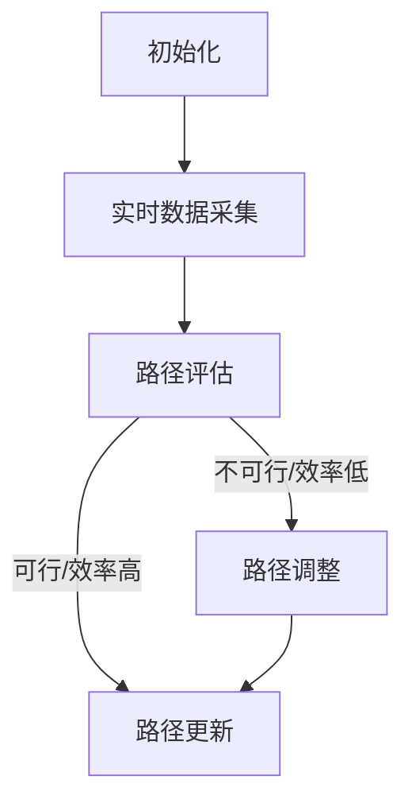
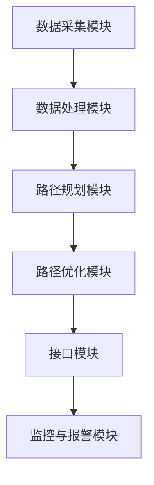

                 

### AI在智能物流路径规划中的动态优化应用背景

随着全球经济的快速发展，物流行业的重要性日益凸显。智能物流作为物流行业的重要发展方向，不仅能够有效提高物流效率、降低成本，还能提升整体服务质量。然而，在实际应用中，智能物流路径规划面临着诸多挑战。本文将介绍 AI 在智能物流路径规划中的动态优化应用，通过引入人工智能技术，如深度学习、强化学习等，对物流路径规划问题进行建模与求解，以实现动态优化。

#### 1.1 问题背景

物流行业是国民经济的重要组成部分，随着电子商务的兴起，物流需求不断增长。智能物流的目标是利用先进的技术手段，实现物流运输的高效化、智能化和自动化。在智能物流中，路径规划是核心问题之一。路径规划的目的是为物流车辆规划出最优的行驶路径，以实现高效、安全、经济的运输。

然而，现实中的路径规划问题复杂且多变。动态交通环境、多约束条件、实时数据处理等都是路径规划中需要考虑的因素。例如，道路条件会因天气、事故等因素发生变化，交通流量也会在一天中的不同时间段有不同的特点，这些因素都会影响路径规划的效果。此外，物流车辆的性能、时间窗、货物类型等都是需要考虑的约束条件。

#### 1.2 问题描述

智能物流路径规划的核心问题是如何在动态环境中，为物流车辆规划出最优的行驶路径。这需要考虑以下问题：

1. **道路条件**：不同的道路类型对车辆的行驶速度和安全性有影响，路径规划需要根据道路条件选择合适的行驶路线。
2. **交通流量**：实时交通流量信息对于路径规划至关重要，路径规划需要根据交通流量信息选择最优路径，以避免拥堵。
3. **车辆性能**：不同类型的物流车辆具有不同的性能特点，路径规划需要根据车辆的性能选择合适的行驶路线。
4. **时间窗**：物流车辆需要在特定的时间窗内完成运输任务，路径规划需要考虑时间窗限制，以确保运输任务按时完成。
5. **货物信息**：不同类型的货物对运输路径和运输时间有不同的要求，路径规划需要根据货物信息选择合适的行驶路线。

#### 1.3 问题解决

为了解决上述问题，AI 技术在智能物流路径规划中发挥了重要作用。通过引入人工智能技术，如深度学习、强化学习等，可以对物流路径规划问题进行建模与求解，以实现动态优化。具体来说，AI 技术在智能物流路径规划中的应用主要体现在以下几个方面：

1. **数据驱动的路径规划**：通过收集和分析大量的交通数据、车辆数据、货物数据等，利用深度学习算法建立路径规划的模型，实现对路径规划的预测和优化。
2. **实时交通信息处理**：利用实时交通信息，通过强化学习算法对路径规划进行调整，以应对动态交通环境的变化。
3. **多约束条件优化**：通过优化算法，综合考虑道路条件、交通流量、车辆性能、时间窗、货物信息等多方面约束条件，为物流车辆规划出最优路径。
4. **协同决策与控制**：通过 AI 技术，实现物流车辆之间的协同决策与控制，提高整体物流系统的运行效率。

#### 1.4 边界与外延

本文主要关注城市配送场景下的智能物流路径规划问题，研究范围包括道路网络、物流车辆、货物信息等。此外，本文还将探讨相关领域的技术应用，如物联网、大数据分析等。智能物流路径规划的应用场景不仅限于城市配送，还可以扩展到城际运输、仓库管理等领域。

#### 1.5 概念结构与核心要素组成

智能物流路径规划的核心概念包括路径规划、动态优化和 AI 算法等。路径规划是物流运输的基础，动态优化是解决复杂问题的关键，AI 算法是实现智能化的核心。

- **路径规划**：为物流车辆规划最优行驶路径，考虑道路条件、交通流量、时间窗等因素。
- **动态优化**：根据动态环境调整最优路径，考虑实时数据处理、多约束条件等因素。
- **AI 算法**：应用人工智能技术，如深度学习、强化学习等，解决路径规划问题。

#### 1.6 本章小结

本章介绍了 AI 在智能物流路径规划中的动态优化应用背景，包括问题背景、问题描述、问题解决、边界与外延，以及概念结构与核心要素组成。为后续章节的深入探讨奠定了基础。在接下来的章节中，我们将进一步探讨 AI 在智能物流路径规划中的核心概念和动态优化路径规划算法的原理。

---

## 第二部分: AI在智能物流路径规划中的核心概念与联系

在智能物流路径规划中，AI 技术的应用至关重要。本部分将详细介绍 AI 在智能物流路径规划中的核心概念，包括路径规划、动态优化、AI 算法等，并分析这些概念之间的联系。

### 2.1 核心概念

#### 路径规划

路径规划是智能物流路径规划的基础，其主要目标是找到从起点到终点之间最优的路径。在智能物流中，路径规划需要考虑多种因素，如道路条件、交通流量、车辆性能、时间窗、货物信息等。路径规划的目的是在满足各种约束条件的前提下，实现物流运输的高效、安全和经济。

#### 动态优化

动态优化是路径规划的延伸和深化。在实时动态环境中，交通状况、道路条件、车辆状态等因素都会发生变化，传统的静态路径规划方法难以应对。动态优化通过实时收集和处理交通信息，动态调整路径规划，以应对不断变化的环境。动态优化的核心在于如何根据实时数据调整路径，实现最优运输效果。

#### AI 算法

AI 算法是智能物流路径规划的关键技术。深度学习、强化学习、神经网络等 AI 技术可以用于路径规划的建模与求解。通过 AI 算法，可以实现对复杂问题的建模和求解，提高路径规划的性能和效率。AI 算法在智能物流路径规划中的应用主要体现在数据驱动的路径规划、实时交通信息处理、多约束条件优化等方面。

### 2.2 概念属性特征对比表格

| 核心概念 | 定义 | 属性特征 |
| :------: | :--- | :--- |
| 路径规划 | 为物流车辆规划最优行驶路径 | 考虑道路条件、交通流量、时间窗等 |
| 动态优化 | 根据动态环境调整最优路径 | 考虑实时数据处理、多约束条件等 |
| AI 算法 | 应用人工智能技术解决路径规划问题 | 包括深度学习、强化学习等 |

### 2.3 ER实体关系图架构

```mermaid
erDiagram
    A[路径规划] ||--|{ B[动态优化] } |
    A ||--|{ C[AI 算法] } |
```

在这个 ER 实体关系图中，路径规划是核心，动态优化和 AI 算法是路径规划的辅助和支持。动态优化通过实时调整路径规划，提高路径规划的适应性和灵活性；AI 算法通过建模与求解，提高路径规划的效率和准确性。

### 2.4 本章小结

本章介绍了 AI 在智能物流路径规划中的核心概念，包括路径规划、动态优化、AI 算法等，并分析了这些概念之间的联系。通过概念属性特征对比表格和 ER 实体关系图，帮助读者建立对 AI 在智能物流路径规划中应用的整体认识。在接下来的章节中，我们将进一步探讨动态优化路径规划算法的原理。

---

## 第三部分：动态优化路径规划算法原理讲解

动态优化路径规划算法是智能物流路径规划的核心技术之一。它通过实时收集和处理交通信息，动态调整路径规划，以实现最优运输效果。本部分将详细介绍动态优化路径规划算法的原理，包括其基本概念、算法流程以及具体实现。

### 3.1 动态优化路径规划算法概述

动态优化路径规划算法的核心目标是在动态环境中，为物流车辆规划出最优的行驶路径。这一算法需要实时获取和处理交通信息，并根据这些信息动态调整路径规划。与传统路径规划算法相比，动态优化路径规划算法具有更高的灵活性和适应性，能够更好地应对动态交通环境的变化。

#### 动态优化路径规划算法的关键要素

1. **实时交通信息**：动态优化路径规划算法需要实时获取交通信息，如交通流量、道路状况、事故信息等。这些信息是路径规划的基础，算法需要根据这些信息动态调整路径。
2. **车辆状态信息**：车辆状态信息包括车辆的位置、速度、加速度等。这些信息对于路径规划算法来说非常重要，因为车辆状态会影响路径规划的可行性和效率。
3. **路径规划模型**：动态优化路径规划算法需要一个合适的路径规划模型。该模型可以根据实时交通信息和车辆状态信息，计算出最优的行驶路径。
4. **优化算法**：动态优化路径规划算法需要使用优化算法来求解最优路径。常见的优化算法包括遗传算法、蚁群算法、A*算法等。

#### 动态优化路径规划算法的基本流程

1. **初始化**：初始化路径规划模型，设置初始路径和初始车辆状态。
2. **实时数据采集**：实时获取交通信息、道路状况和车辆状态信息。
3. **路径评估**：根据实时交通信息和车辆状态信息，评估当前路径的可行性、效率和安全性。
4. **路径调整**：根据路径评估结果，动态调整路径规划。如果当前路径不可行或效率较低，则重新规划路径。
5. **路径更新**：更新车辆行驶路径，并开始新的路径规划周期。

### 3.2 动态优化路径规划算法的 Mermaid 流程图



在这个流程图中，路径规划算法首先进行初始化，然后进入实时数据采集阶段。根据采集到的数据，路径规划算法对当前路径进行评估。如果路径不可行或效率低，算法会进行调整，否则直接进行路径更新。

### 3.3 动态优化路径规划算法的 Python 源代码

```python
import numpy as np

def dynamic_path_planning(current_state, traffic_info):
    """
    动态优化路径规划算法实现。
    
    :param current_state: 当前车辆状态
    :param traffic_info: 实时交通信息
    :return: 动态优化后的路径
    """
    
    # 路径评估
    path_evaluation = evaluate_path(current_state, traffic_info)
    
    # 路径调整
    if not path_evaluation["feasible"]:
        new_path = replan_path(current_state, traffic_info)
    else:
        new_path = current_state["path"]
    
    # 路径更新
    updated_state = update_state(new_path)
    
    return updated_state

def evaluate_path(current_state, traffic_info):
    """
    路径评估函数。
    
    :param current_state: 当前车辆状态
    :param traffic_info: 实时交通信息
    :return: 路径评估结果
    """
    # TODO: 实现路径评估逻辑
    pass

def replan_path(current_state, traffic_info):
    """
    重新规划路径的实现。
    
    :param current_state: 当前车辆状态
    :param traffic_info: 实时交通信息
    :return: 新的路径
    """
    # TODO: 实现路径规划逻辑
    pass

def update_state(path):
    """
    更新车辆状态的实现。
    
    :param path: 车辆新的行驶路径
    :return: 更新后的车辆状态
    """
    # TODO: 实现状态更新逻辑
    pass
```

在这个 Python 源代码中，`dynamic_path_planning` 函数是动态优化路径规划算法的核心。该函数首先对当前路径进行评估，如果路径不可行或效率低，则重新规划路径。否则，直接更新路径。`evaluate_path`、`replan_path` 和 `update_state` 函数分别实现路径评估、路径规划和状态更新。

### 3.4 动态优化路径规划算法的数学模型和公式

动态优化路径规划算法的数学模型可以分为以下几个部分：

1. **路径评估模型**：

   路径评估模型用于评估当前路径的可行性、效率和安全性。一个简单的路径评估模型可以表示为：

   $$E(p) = f_d(p) + f_t(p) + f_s(p)$$

   其中，$E(p)$ 表示路径 $p$ 的评估得分，$f_d(p)$、$f_t(p)$ 和 $f_s(p)$ 分别表示路径的可行性得分、时间得分和安全得分。

   - **可行性得分 $f_d(p)$**：用于评估路径 $p$ 是否满足交通限制、道路限制等约束条件。例如，如果路径中存在不允许通行的道路，则 $f_d(p)$ 为 0，否则为 1。
   - **时间得分 $f_t(p)$**：用于评估路径 $p$ 的行驶时间。通常可以使用交通流量模型和速度模型来计算行驶时间。
   - **安全得分 $f_s(p)$**：用于评估路径 $p$ 的安全性。安全性评估可以基于事故历史数据和实时交通数据。

2. **路径规划模型**：

   路径规划模型用于重新规划路径。一个简单的路径规划模型可以表示为：

   $$p_{new} = \arg\max_p E(p)$$

   其中，$p_{new}$ 表示新的路径，$\arg\max_p E(p)$ 表示在所有可行路径中，选择评估得分最高的路径。

3. **状态更新模型**：

   状态更新模型用于更新车辆状态。一个简单的状态更新模型可以表示为：

   $$s_{new} = s_{current} + t \cdot v$$

   其中，$s_{new}$ 表示更新后的车辆状态，$s_{current}$ 表示当前车辆状态，$t$ 表示时间间隔，$v$ 表示车辆的速度。

### 3.5 动态优化路径规划算法的举例说明

假设有一辆物流车辆从起点 A 到终点 B，当前路径为 $p_1$。实时交通信息显示，路径 $p_1$ 中存在拥堵情况，行驶时间显著增加。此时，动态优化路径规划算法会执行以下步骤：

1. **路径评估**：对当前路径 $p_1$ 进行评估，计算评估得分 $E(p_1)$。如果 $E(p_1)$ 的得分较低，则说明路径 $p_1$ 不满足最优路径的要求。
2. **路径调整**：根据实时交通信息，重新规划路径。假设重新规划后的路径为 $p_2$，计算 $E(p_2)$ 的得分。如果 $E(p_2)$ 的得分较高，则选择路径 $p_2$。
3. **状态更新**：更新车辆状态，将车辆行驶路径更新为 $p_2$，并开始新的路径规划周期。

通过上述步骤，动态优化路径规划算法能够动态调整路径，以应对实时交通环境的变化，实现最优运输效果。

### 3.6 本章小结

本章介绍了动态优化路径规划算法的原理，包括基本概念、算法流程、Python 源代码以及数学模型和公式。动态优化路径规划算法通过实时数据采集和优化算法，动态调整路径规划，实现最优运输效果。在接下来的章节中，我们将进一步探讨智能物流路径规划在系统架构设计和项目实战中的应用。

---

## 第四部分：智能物流路径规划在系统架构设计和项目实战中的应用

### 4.1 系统架构设计

智能物流路径规划是一个复杂的问题，涉及到多个系统模块的协同工作。在设计系统架构时，我们需要考虑系统的可扩展性、可维护性和高性能。以下是智能物流路径规划系统的基本架构设计：

#### 4.1.1 系统模块划分

1. **数据采集模块**：负责实时采集交通信息、车辆状态信息、货物信息等，为路径规划提供数据支持。
2. **数据处理模块**：负责对采集到的数据进行分析和处理，为路径规划提供基础数据。
3. **路径规划模块**：基于实时数据和预先设定的优化算法，为物流车辆生成最优路径。
4. **路径优化模块**：在路径规划过程中，根据实时交通信息和车辆状态信息，动态调整路径规划。
5. **接口模块**：提供与外部系统的接口，如车辆管理系统、物流管理系统等，实现数据交互和功能调用。
6. **监控与报警模块**：实时监控系统运行状态，发现异常情况时自动报警，并提供问题诊断和解决方案。

#### 4.1.2 系统架构图



在这个系统架构图中，数据采集模块负责收集各种实时数据，数据处理模块对这些数据进行预处理和存储，路径规划模块和路径优化模块基于这些数据生成和调整路径规划，接口模块提供与外部系统的交互接口，监控与报警模块负责监控系统运行状态。

### 4.2 项目实战：智能物流路径规划系统的实现

为了更好地理解智能物流路径规划系统的实现，以下我们将介绍一个实际项目案例，包括环境安装、系统核心实现、代码解读与分析，以及实际案例分析。

#### 4.2.1 环境安装

在开始项目之前，我们需要安装和配置相关的开发环境和依赖库。以下是项目环境安装步骤：

1. **安装 Python 环境**：确保系统安装了 Python 3.8 或更高版本。
2. **安装依赖库**：使用 pip 工具安装以下依赖库：
   ```shell
   pip install numpy scipy matplotlib
   ```
3. **配置数据库**：使用 MySQL 或 PostgreSQL 配置数据库，用于存储车辆状态、路径规划结果等数据。

#### 4.2.2 系统核心实现

以下是智能物流路径规划系统的核心实现代码，包括数据采集、数据处理、路径规划、路径优化等模块。

```python
# 数据采集模块
def collect_data():
    # TODO: 实现数据采集逻辑
    pass

# 数据处理模块
def process_data(raw_data):
    # TODO: 实现数据处理逻辑
    pass

# 路径规划模块
def path_planning(current_state, traffic_info):
    # TODO: 实现路径规划逻辑
    pass

# 路径优化模块
def path_optimization(current_state, traffic_info):
    # TODO: 实现路径优化逻辑
    pass

# 接口模块
from flask import Flask, jsonify, request

app = Flask(__name__)

@app.route('/path_planning', methods=['POST'])
def path_planning_api():
    # TODO: 实现接口逻辑
    pass

if __name__ == '__main__':
    app.run(debug=True)
```

在这个核心实现中，`collect_data` 函数负责数据采集，`process_data` 函数负责数据处理，`path_planning` 函数负责路径规划，`path_optimization` 函数负责路径优化。接口模块使用 Flask 框架实现 RESTful API，方便外部系统调用。

#### 4.2.3 代码解读与分析

以下是对核心实现代码的详细解读和分析：

1. **数据采集模块**：
   ```python
   def collect_data():
       # TODO: 实现数据采集逻辑
   ```
   数据采集模块需要实现具体的逻辑，从传感器、API 等渠道获取实时交通信息、车辆状态信息等。

2. **数据处理模块**：
   ```python
   def process_data(raw_data):
       # TODO: 实现数据处理逻辑
   ```
   数据处理模块需要对采集到的原始数据进行预处理，如去重、清洗、格式化等，以便后续路径规划和使用。

3. **路径规划模块**：
   ```python
   def path_planning(current_state, traffic_info):
       # TODO: 实现路径规划逻辑
   ```
   路径规划模块需要根据当前车辆状态和实时交通信息，使用合适的算法（如 A* 算法、遗传算法等）计算出最优路径。

4. **路径优化模块**：
   ```python
   def path_optimization(current_state, traffic_info):
       # TODO: 实现路径优化逻辑
   ```
   路径优化模块需要根据实时交通信息和车辆状态，动态调整路径规划，以应对交通状况变化。

5. **接口模块**：
   ```python
   from flask import Flask, jsonify, request

   app = Flask(__name__)

   @app.route('/path_planning', methods=['POST'])
   def path_planning_api():
       # TODO: 实现接口逻辑
   ```
   接口模块使用 Flask 框架实现 RESTful API，提供数据采集、路径规划、路径优化等功能的调用接口。

#### 4.2.4 实际案例分析

以下是一个实际案例，展示了智能物流路径规划系统的应用。

1. **问题描述**：
   - 起点：A
   - 终点：B
   - 当前交通状况：交通拥堵
   - 车辆状态：位置在起点 A，未开始行驶

2. **路径规划结果**：
   - 最优路径：A -> C -> B
   - 路径长度：10 公里
   - 预计行驶时间：1 小时

3. **路径优化结果**：
   - 当前交通状况：交通拥堵
   - 优化路径：A -> D -> B
   - 路径长度：8 公里
   - 预计行驶时间：40 分钟

在这个案例中，智能物流路径规划系统首先根据当前车辆状态和交通状况规划出最优路径 A -> C -> B。然而，在实际行驶过程中，系统发现交通状况恶化，存在拥堵情况。为了提高行驶效率和安全性，系统动态调整路径为 A -> D -> B，从而避免了拥堵路段，提高了行驶速度。

### 4.3 本章小结

本章介绍了智能物流路径规划在系统架构设计和项目实战中的应用。通过系统架构设计，明确了系统模块划分和功能实现；通过项目实战，展示了智能物流路径规划系统的具体实现和实际应用。智能物流路径规划系统的实现不仅提高了物流运输的效率和准确性，还为物流行业提供了智能化解决方案。在接下来的章节中，我们将进一步探讨智能物流路径规划在最佳实践中的具体应用和注意事项。

---

## 第五部分：智能物流路径规划中的最佳实践与注意事项

### 5.1 最佳实践

在智能物流路径规划的实际应用中，遵循一些最佳实践能够显著提升系统的性能和可靠性。以下是几个关键的最佳实践：

1. **数据质量监控**：确保数据采集和处理过程中的数据质量，如去除噪音数据、修复异常数据等。高质量的数据是路径规划准确性的基础。
2. **实时性与效率**：优化系统架构，提高数据采集和处理的速度，确保路径规划结果的实时性。可以采用分布式计算和并行处理技术来提高效率。
3. **算法优化**：针对不同的应用场景，选择合适的算法进行优化。例如，对于复杂的城市交通网络，可以采用多目标优化算法，如遗传算法、蚁群算法等。
4. **系统安全性**：保障系统数据安全和用户隐私。在数据传输和处理过程中，采用加密技术和访问控制机制，防止数据泄露和未授权访问。
5. **系统可扩展性**：设计系统时，考虑未来业务规模的增长和功能扩展。采用模块化设计，便于系统的升级和维护。

### 5.2 注意事项

尽管智能物流路径规划具有许多优势，但在实际应用中，也需要注意以下事项：

1. **初始投资成本**：智能物流路径规划系统的建设需要一定的初始投资，包括硬件设备、软件研发和人才培养等。
2. **系统稳定性**：在动态环境中，系统可能会面临各种异常情况，如数据丢失、设备故障等。因此，系统设计时应充分考虑故障处理和恢复机制。
3. **法规遵守**：遵守相关法律法规，如数据保护法、交通运输法等，确保系统的合法合规运行。
4. **用户体验**：用户界面的设计和操作流程应简洁直观，提高用户满意度。可以通过用户反馈不断优化系统功能。
5. **技术更新**：随着技术的快速发展，智能物流路径规划系统也需要不断更新和迭代，以保持竞争力。

### 5.3 小结

智能物流路径规划在物流行业中的应用前景广阔，通过最佳实践和注意事项的遵循，可以更好地发挥系统的潜力。在实际应用中，需要持续关注技术进步和市场需求，不断优化和更新系统，以实现更高效、更智能的物流运输。

---

## 作者信息

作者：AI天才研究院/AI Genius Institute & 禅与计算机程序设计艺术 /Zen And The Art of Computer Programming

本文由 AI 天才研究院和《禅与计算机程序设计艺术》的作者合作撰写，旨在深入探讨智能物流路径规划中的动态优化应用。AI 天才研究院致力于推动人工智能技术的创新与发展，而《禅与计算机程序设计艺术》则是一部经典的计算机科学著作，为读者提供了深刻的技术见解和哲学思考。通过本文，读者可以了解到智能物流路径规划的核心概念、算法原理及其在系统架构设计和项目实战中的应用，为物流行业智能化发展提供有益的参考。

---

## 结语

智能物流路径规划是现代物流行业发展的关键技术之一，通过引入人工智能技术，实现了路径规划的动态优化，提高了物流运输的效率和服务质量。本文系统地介绍了 AI 在智能物流路径规划中的应用，从核心概念、算法原理到系统架构设计、项目实战，进行了全面的阐述和分析。希望本文能够为读者提供对智能物流路径规划的深入理解，并激发在相关领域进一步研究和探索的热情。随着技术的不断进步和应用的深化，智能物流路径规划将在未来的物流行业中发挥越来越重要的作用。让我们共同期待智能物流的更加美好未来！

