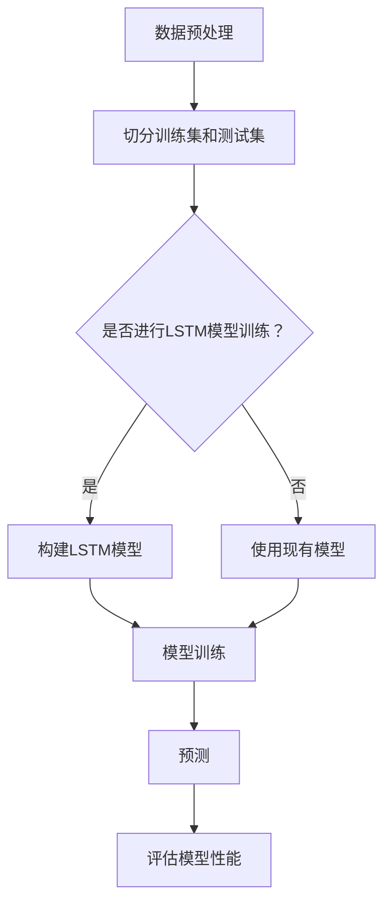
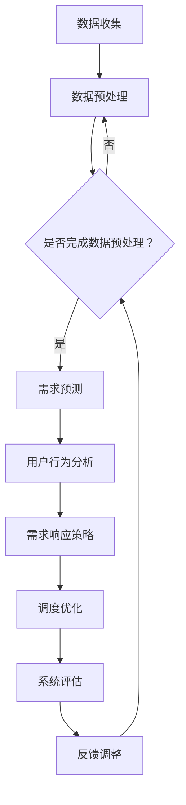

                 

### 第一部分：问题背景与核心概念

#### 1.1.1 问题背景

**智能电网与分布式能源管理概述**

**智能电网**：智能电网是现代电力系统的升级版，它利用现代通信技术、信息技术、控制技术和电力电子技术，实现对电力系统的全面感知、可靠控制与高效利用。智能电网的发展历程可以追溯到20世纪90年代，美国提出“智能电网2020”计划，旨在通过技术创新提升电力系统的灵活性和适应性。随着物联网、大数据和人工智能技术的兴起，智能电网逐步成为电力系统发展的重要方向。

**分布式能源管理**：分布式能源管理是指在电力系统中，通过分布式能源资源（如太阳能、风能、储能系统等）的整合和优化，实现能源的高效利用和供需平衡。分布式能源管理不仅能够提高能源系统的灵活性和稳定性，还能减少能源消耗和碳排放，实现可持续发展目标。

在智能电网中，分布式能源管理的重要性日益凸显。分布式能源系统的引入，使得能源的供应更加多样化和灵活化，但也给电力系统的调度和管理带来了新的挑战。如何有效整合分布式能源，实现能源的高效利用和系统稳定性，是当前智能电网分布式能源管理亟需解决的重要问题。

**智能电网分布式能源管理的挑战与机遇**

**挑战：**

1. **系统复杂性**：智能电网与分布式能源系统的结合，使得整个能源系统的结构和运行模式变得更加复杂。如何准确预测和模拟系统的运行状态，成为分布式能源管理的重要挑战。
2. **数据多样性**：分布式能源系统产生的数据类型多样，包括电能数据、气象数据、设备状态数据等。如何有效整合和处理这些数据，为分布式能源管理提供有力支持，是当前研究的难点。
3. **安全性**：分布式能源系统涉及大量数据传输和设备控制，数据安全和设备安全成为分布式能源管理的关键问题。
4. **政策与经济因素**：分布式能源管理的发展受到政策支持和经济因素的制约。如何在政策引导和经济激励下，推动分布式能源管理的发展，也是当前面临的重要挑战。

**机遇：**

1. **技术创新**：物联网、大数据、人工智能等技术的快速发展，为分布式能源管理提供了新的技术手段和解决方案。
2. **市场需求**：随着全球能源转型的推进，分布式能源管理市场需求不断增加，为相关产业带来了发展机遇。
3. **政策支持**：各国政府纷纷出台支持分布式能源发展的政策，为分布式能源管理提供了良好的政策环境。
4. **经济效益**：分布式能源管理能够提高能源利用效率，降低能源成本，具有显著的经济效益。

#### 1.1.2 核心概念

**人工智能在分布式能源管理中的应用**

**人工智能**：人工智能（Artificial Intelligence，简称AI）是指通过计算机程序和算法模拟人类智能行为的技术。根据处理数据的方式，人工智能可以分为三大类：**弱人工智能**（只能执行特定任务，如语音识别、图像识别等）、**强人工智能**（具有与人类相似的通用智能，能够应对各种复杂问题）和**混合智能**（结合多种人工智能技术，实现更高效的问题解决）。

在分布式能源管理中，人工智能的应用主要集中在以下几个方面：

1. **数据预测与分析**：通过机器学习算法，对分布式能源系统的运行数据进行预测和分析，为能源调度和管理提供支持。
2. **设备故障诊断与维护**：利用人工智能技术，对分布式能源设备的运行状态进行实时监测，实现故障预测和预警，提高设备运行效率。
3. **能源优化与调度**：基于人工智能算法，对分布式能源系统进行优化和调度，实现能源的高效利用和供需平衡。
4. **市场分析与决策**：通过大数据分析和人工智能算法，对分布式能源市场的运行规律进行分析，为企业和政府决策提供支持。

**AI在能源管理中的潜在应用领域**

1. **能源调度**：利用深度学习算法，实现电力系统的动态调度，提高电网的运行效率和稳定性。
2. **需求响应**：通过强化学习算法，实现对用户用电需求的精准预测和响应，提高电网的供需平衡能力。
3. **设备状态监测与维护**：运用物联网技术和人工智能算法，对分布式能源设备进行实时监测和故障诊断，提高设备运行效率和安全性。
4. **能源市场预测与交易**：利用大数据分析和人工智能算法，对能源市场进行预测和交易，提高能源市场的效率和透明度。
5. **能源规划与设计**：通过人工智能技术，对分布式能源系统的规划与设计进行优化，提高系统性能和经济效益。

#### 1.1.3 关键技术与研究现状

**人工智能关键技术研究**

1. **深度学习与神经网络**：深度学习是一种基于多层神经网络的学习方法，通过多层神经元的非线性变换，实现复杂数据的特征提取和模式识别。深度学习在分布式能源管理中的应用，主要包括电力系统运行状态预测、设备故障诊断和能源优化调度等。

2. **强化学习与混合智能系统**：强化学习是一种通过试错学习，实现智能体与环境交互，以达到最优策略的方法。混合智能系统则是将多种人工智能技术进行融合，实现更高效的问题解决。在分布式能源管理中，强化学习可以应用于需求响应、能源交易和市场预测等场景。

3. **机器学习算法与应用**：机器学习算法是人工智能的核心技术之一，包括监督学习、无监督学习和半监督学习等。在分布式能源管理中，机器学习算法可以用于数据挖掘、模式识别和预测分析等任务。

**研究现状**

目前，人工智能在分布式能源管理领域的研究已经取得了一定成果。例如，深度学习算法在电力系统运行状态预测中的应用，强化学习在需求响应和能源交易中的研究，以及机器学习算法在能源市场预测和设备状态监测中的应用等。然而，仍存在一些亟待解决的问题，如算法模型的稳定性、鲁棒性和可解释性等。

**研究目标与边界**

**研究目标：**

1. 提高分布式能源系统的灵活性与效率。
2. 降低能源成本与碳排放。
3. 实现分布式能源系统的安全可靠运行。

**研究边界：**

1. 能源系统优化与平衡：研究如何通过优化算法，实现能源系统的供需平衡，提高系统运行效率。
2. 能源市场与交易机制：研究如何通过人工智能技术，优化能源市场交易机制，提高市场效率和透明度。
3. 数据隐私与安全：研究如何在分布式能源管理中，保护数据隐私和安全，防止数据泄露和攻击。

### 目录

----------------------------------------------------------------

# AI在智能电网分布式能源管理中的应用研究

> 关键词：智能电网、分布式能源管理、人工智能、深度学习、强化学习

> 摘要：本文主要研究了人工智能在智能电网分布式能源管理中的应用，分析了智能电网与分布式能源管理的基本概念、核心问题及挑战。通过深入探讨人工智能的关键技术，包括深度学习、强化学习等，本文提出了分布式能源管理模型的设计原则和优化策略。同时，通过算法实现与系统架构的设计，以及项目实战与案例分析，本文为分布式能源管理提供了可行的解决方案和发展方向。

----------------------------------------------------------------

## 第一部分：问题背景与核心概念

### 第1章：问题背景与核心概念

#### 1.1.1 问题背景

**智能电网与分布式能源管理概述**

智能电网（Smart Grid）是一种将现代通信技术、信息处理技术和电力电子技术深度融合的电力系统，其核心目标是通过信息的实时获取和智能分析，实现对电力系统的全面感知、可靠控制与高效利用。智能电网的概念最早可以追溯到20世纪90年代，美国在1996年提出了“智能电网2020”计划，旨在通过技术创新，提升电力系统的灵活性和适应性。随着物联网（Internet of Things，IoT）、大数据（Big Data）和人工智能（Artificial Intelligence，AI）等新兴技术的快速发展，智能电网的概念和技术体系得到了进一步的完善和拓展。

分布式能源管理（Distributed Energy Management，DEM）是指通过智能化手段，对分布式能源资源（如太阳能、风能、储能系统等）进行整合和优化，实现能源的高效利用和供需平衡。分布式能源管理系统不仅涉及电力系统的技术层面，还包括经济、市场和政策等多个方面。分布式能源管理的重要性在于，它能够提高能源系统的灵活性和稳定性，减少能源消耗和碳排放，推动能源系统的可持续发展。

**智能电网分布式能源管理的挑战与机遇**

**挑战：**

1. **系统复杂性**：智能电网与分布式能源系统的结合，使得整个能源系统的结构和运行模式变得更加复杂。如何准确预测和模拟系统的运行状态，成为分布式能源管理的重要挑战。

2. **数据多样性**：分布式能源系统产生的数据类型多样，包括电能数据、气象数据、设备状态数据等。如何有效整合和处理这些数据，为分布式能源管理提供有力支持，是当前研究的难点。

3. **安全性**：分布式能源系统涉及大量数据传输和设备控制，数据安全和设备安全成为分布式能源管理的关键问题。

4. **政策与经济因素**：分布式能源管理的发展受到政策支持和经济因素的制约。如何在政策引导和经济激励下，推动分布式能源管理的发展，也是当前面临的重要挑战。

**机遇：**

1. **技术创新**：物联网、大数据、人工智能等技术的快速发展，为分布式能源管理提供了新的技术手段和解决方案。

2. **市场需求**：随着全球能源转型的推进，分布式能源管理市场需求不断增加，为相关产业带来了发展机遇。

3. **政策支持**：各国政府纷纷出台支持分布式能源发展的政策，为分布式能源管理提供了良好的政策环境。

4. **经济效益**：分布式能源管理能够提高能源利用效率，降低能源成本，具有显著的经济效益。

#### 1.1.2 核心概念

**人工智能在分布式能源管理中的应用**

人工智能（AI）是指通过计算机程序和算法模拟人类智能行为的技术。根据处理数据的方式，人工智能可以分为三大类：弱人工智能、强人工智能和混合智能。

1. **弱人工智能**：弱人工智能（Narrow AI）也称为专用人工智能，是指只能执行特定任务的智能系统。例如，语音识别、图像识别等。

2. **强人工智能**：强人工智能（General AI）是指具有与人类相似的通用智能，能够应对各种复杂问题的智能系统。目前，强人工智能尚未实现。

3. **混合智能**：混合智能是指将多种人工智能技术进行融合，实现更高效的问题解决。例如，将深度学习、强化学习等技术结合起来，解决复杂问题。

在分布式能源管理中，人工智能的应用主要集中在以下几个方面：

1. **数据预测与分析**：通过机器学习算法，对分布式能源系统的运行数据进行预测和分析，为能源调度和管理提供支持。

2. **设备故障诊断与维护**：利用物联网技术和人工智能算法，对分布式能源设备的运行状态进行实时监测和故障诊断，提高设备运行效率和安全性。

3. **能源优化与调度**：基于人工智能算法，对分布式能源系统进行优化和调度，实现能源的高效利用和供需平衡。

4. **市场分析与决策**：通过大数据分析和人工智能算法，对分布式能源市场的运行规律进行分析，为企业和政府决策提供支持。

**AI在能源管理中的潜在应用领域**

1. **能源调度**：利用深度学习算法，实现电力系统的动态调度，提高电网的运行效率和稳定性。

2. **需求响应**：通过强化学习算法，实现对用户用电需求的精准预测和响应，提高电网的供需平衡能力。

3. **设备状态监测与维护**：运用物联网技术和人工智能算法，对分布式能源设备进行实时监测和故障诊断，提高设备运行效率和安全性。

4. **能源市场预测与交易**：利用大数据分析和人工智能算法，对能源市场进行预测和交易，提高能源市场的效率和透明度。

5. **能源规划与设计**：通过人工智能技术，对分布式能源系统的规划与设计进行优化，提高系统性能和经济效益。

#### 1.1.3 关键技术与研究现状

**人工智能关键技术研究**

1. **深度学习与神经网络**：深度学习（Deep Learning）是一种基于多层神经网络（Neural Networks）的学习方法。通过多层神经元的非线性变换，实现复杂数据的特征提取和模式识别。深度学习在分布式能源管理中的应用，主要包括电力系统运行状态预测、设备故障诊断和能源优化调度等。

2. **强化学习与混合智能系统**：强化学习（Reinforcement Learning）是一种通过试错学习，实现智能体与环境交互，以达到最优策略的方法。混合智能系统（Hybrid Intelligent System）则是将多种人工智能技术进行融合，实现更高效的问题解决。在分布式能源管理中，强化学习可以应用于需求响应、能源交易和市场预测等场景。

3. **机器学习算法与应用**：机器学习算法（Machine Learning Algorithms）是人工智能的核心技术之一。根据学习方式，可以分为监督学习、无监督学习和半监督学习等。在分布式能源管理中，机器学习算法可以用于数据挖掘、模式识别和预测分析等任务。

**研究现状**

目前，人工智能在分布式能源管理领域的研究已经取得了一定成果。例如，深度学习算法在电力系统运行状态预测中的应用，强化学习在需求响应和能源交易中的研究，以及机器学习算法在能源市场预测和设备状态监测中的应用等。然而，仍存在一些亟待解决的问题，如算法模型的稳定性、鲁棒性和可解释性等。

**研究目标与边界**

**研究目标：**

1. 提高分布式能源系统的灵活性与效率。
2. 降低能源成本与碳排放。
3. 实现分布式能源系统的安全可靠运行。

**研究边界：**

1. 能源系统优化与平衡：研究如何通过优化算法，实现能源系统的供需平衡，提高系统运行效率。
2. 能源市场与交易机制：研究如何通过人工智能技术，优化能源市场交易机制，提高市场效率和透明度。
3. 数据隐私与安全：研究如何在分布式能源管理中，保护数据隐私和安全，防止数据泄露和攻击。

----------------------------------------------------------------

### 第二部分：理论基础与模型设计

#### 第2章：人工智能理论基础

##### 2.1.1 人工智能基础理论

**基本原理**

人工智能（AI）是一种模拟人类智能行为的计算机科学技术，其核心目标是通过算法和计算模型，使计算机具有类似人类的感知、思考、决策和学习能力。人工智能的基本原理包括以下几个关键方面：

1. **机器学习**：机器学习是一种通过数据驱动的方法，使计算机自动获取知识和模式的技术。机器学习可以分为监督学习、无监督学习和半监督学习。监督学习使用标记数据进行训练，无监督学习在无标记数据中寻找模式，半监督学习结合了标记数据和无标记数据。

2. **深度学习**：深度学习是机器学习的一个子领域，它使用多层神经网络（Neural Networks）来模拟人类大脑的学习过程。深度学习通过多层次的神经网络结构，实现复杂特征提取和模式识别。深度学习在图像识别、语音识别、自然语言处理等领域取得了显著成果。

3. **强化学习**：强化学习是一种通过试错和反馈机制，使智能体在与环境的交互中学习最优策略的方法。强化学习通过奖励和惩罚机制，指导智能体不断调整行为，以达到最大化长期回报。

**数学模型**

人工智能的数学模型主要涉及概率论、统计学、线性代数、微积分和优化算法等。以下是几个关键数学模型：

1. **概率论与统计模型**：概率论和统计学是机器学习的基础，用于描述数据分布、随机变量和概率模型。常用的概率模型包括贝叶斯网络、马尔可夫链等。

2. **线性代数与微积分**：线性代数和微积分是机器学习中的核心工具，用于描述数据空间、函数和优化问题。线性代数涉及矩阵运算、向量空间和特征分解等，微积分涉及导数、积分和优化等。

3. **智能优化算法**：智能优化算法（如遗传算法、粒子群优化、模拟退火等）用于解决复杂的优化问题，通过模拟生物进化、群体智能和物理过程，找到问题的最优解。

**人工智能与能源管理**

人工智能在能源管理领域的应用具有巨大的潜力。通过利用人工智能技术，可以实现能源系统的优化、调度和预测，提高能源利用效率，降低碳排放。以下是人工智能在能源管理中的几个关键应用领域：

1. **数据驱动方法**：利用机器学习和深度学习算法，对能源系统进行数据分析和模式识别，实现能源需求的预测、设备故障的预测和电网的调度优化。

2. **设备状态监测与维护**：通过物联网和人工智能技术，实现对分布式能源设备的实时监测和故障诊断，提高设备运行效率和安全性。

3. **能源市场预测与交易**：利用大数据分析和人工智能算法，对能源市场进行预测和交易策略优化，提高能源市场的效率和透明度。

4. **能源规划与设计**：通过人工智能技术，对能源系统的规划与设计进行优化，提高系统性能和经济效益。

**交叉领域研究**

人工智能与能源管理交叉领域的研究正在不断深入。数据驱动方法在能源系统中的应用，为能源管理提供了新的思路和方法。以下是一些典型的交叉领域研究：

1. **分布式能源系统的优化调度**：利用机器学习和深度学习算法，对分布式能源系统的运行状态进行实时预测和优化调度，提高能源系统的灵活性和稳定性。

2. **智能电网的故障诊断与修复**：利用人工智能技术，对智能电网的故障进行快速诊断和修复，提高电网的可靠性和安全性。

3. **能源市场的预测与交易策略**：利用大数据分析和人工智能算法，对能源市场的供需关系和价格走势进行预测，制定最优的交易策略。

4. **可再生能源的集成与优化**：通过人工智能技术，实现对太阳能、风能等可再生能源的高效集成和优化，提高能源系统的可持续性和经济效益。

##### 2.1.2 人工智能与能源管理

**数据驱动方法在能源系统中的应用**

数据驱动方法在能源系统的应用，是人工智能技术在能源管理领域的重要方向。通过收集和分析大量的能源数据，可以实现能源需求的预测、设备故障的预测和电网的调度优化等。

1. **能源需求的预测**：利用历史数据和机器学习算法，可以实现对未来能源需求的预测。这有助于电力公司更好地安排发电计划，降低能源浪费。

2. **设备故障的预测**：通过实时监测设备运行数据，可以实现对设备故障的预测和预警。这有助于提前进行设备维护和更换，降低设备故障对能源系统的影响。

3. **电网的调度优化**：利用人工智能算法，可以对电网进行实时调度和优化，提高电网的稳定性和效率。这包括负荷预测、电源分配和电压控制等。

**人工智能算法在能源管理中的优势与局限**

1. **优势**

- **高效的数据分析**：人工智能算法能够快速处理和分析大量数据，发现隐藏在数据中的规律和模式，为能源管理提供有力支持。

- **自适应性和灵活性**：人工智能算法可以根据实际情况自适应调整，适应不同的能源需求和设备状态，提高能源系统的灵活性和稳定性。

- **预测和优化能力**：人工智能算法具有强大的预测和优化能力，可以实现对未来能源需求和设备状态的预测，优化电网调度和设备运行。

2. **局限**

- **数据质量和完整性**：人工智能算法的准确性依赖于数据的质量和完整性。如果数据存在噪声、缺失或不一致等问题，可能会导致预测和优化结果的偏差。

- **计算复杂度**：一些复杂的机器学习算法和深度学习模型，需要大量的计算资源和时间。在实时性要求较高的能源系统中，可能存在计算资源不足的问题。

- **可解释性和透明性**：一些人工智能算法，特别是深度学习模型，其工作原理和决策过程不够透明，难以解释和理解。这可能会影响决策者的信任和接受度。

**人工智能在能源管理中的应用案例**

1. **智能电网的负荷预测**：利用深度学习算法，可以实现对电网负荷的准确预测。通过预测未来负荷，电力公司可以优化发电计划，降低能源浪费。

2. **分布式能源系统的优化调度**：利用强化学习算法，可以实现对分布式能源系统的优化调度，提高系统的灵活性和稳定性。例如，通过优化太阳能和风能的并网调度，提高可再生能源的利用率。

3. **设备故障预测与维护**：利用物联网技术和机器学习算法，可以实现对分布式能源设备的实时监测和故障预测。通过提前进行设备维护和更换，降低设备故障对能源系统的影响。

4. **能源市场预测与交易**：利用大数据分析和人工智能算法，可以实现对能源市场的供需关系和价格走势进行预测，制定最优的交易策略，提高能源市场的效率和透明度。

##### 2.1.3 深度学习算法在分布式能源管理中的应用

**深度学习算法**：深度学习算法是一种基于多层神经网络的学习方法，通过多层神经元的非线性变换，实现复杂数据的特征提取和模式识别。在分布式能源管理中，深度学习算法可以应用于多种场景，如电力系统运行状态预测、设备故障诊断和能源优化调度等。

**应用场景**

1. **电力系统运行状态预测**：利用深度学习算法，可以实现对电网负荷、发电量、电网稳定性等运行状态的预测。通过预测未来运行状态，电力公司可以提前进行调度和优化，提高电网的稳定性和效率。

2. **设备故障诊断**：利用深度学习算法，可以实现对分布式能源设备（如风力涡轮机、太阳能板、储能系统等）的故障预测和诊断。通过实时监测设备运行数据，可以提前发现故障迹象，进行预防性维护，降低设备故障对能源系统的影响。

3. **能源优化调度**：利用深度学习算法，可以实现对分布式能源系统的优化调度，提高可再生能源的利用率。例如，通过优化太阳能和风能的并网调度，提高可再生能源的并网效率。

**算法原理**

1. **多层神经网络**：多层神经网络是深度学习的基础，它由多个层级组成，每个层级包含多个神经元。通过前向传播和反向传播，神经网络可以学习输入数据和输出数据之间的复杂关系。

2. **激活函数**：激活函数用于引入非线性变换，使神经网络能够处理复杂数据。常见的激活函数包括Sigmoid、ReLU和Tanh等。

3. **优化算法**：优化算法用于调整神经网络参数，使预测结果更准确。常见的优化算法包括梯度下降、随机梯度下降和Adam等。

**实现方法**

1. **数据预处理**：对输入数据进行预处理，包括数据清洗、归一化和特征提取等。预处理可以提高模型的训练效率和预测准确性。

2. **模型构建**：根据应用场景，构建合适的深度学习模型。可以选择单层神经网络、卷积神经网络（CNN）或循环神经网络（RNN）等。

3. **模型训练**：利用历史数据，对深度学习模型进行训练。通过调整模型参数，使模型能够准确预测电力系统运行状态、设备故障或能源优化调度结果。

4. **模型评估**：对训练好的模型进行评估，包括准确率、召回率、F1值等指标。通过调整模型参数和结构，提高模型的预测性能。

**案例分析**

1. **智能电网负荷预测**：利用深度学习算法，对电网负荷进行预测。通过分析历史负荷数据和气象数据，可以实现对未来负荷的准确预测。预测结果可以帮助电力公司优化发电计划，降低能源浪费。

2. **分布式能源设备故障诊断**：利用深度学习算法，对分布式能源设备进行故障预测和诊断。通过实时监测设备运行数据，可以提前发现故障迹象，进行预防性维护。例如，通过监测风力涡轮机的振动数据，可以预测潜在的故障，提高设备的运行效率。

3. **能源优化调度**：利用深度学习算法，对分布式能源系统进行优化调度。通过分析太阳能和风能的发电数据，可以优化可再生能源的并网调度，提高可再生能源的利用率。例如，通过优化太阳能电池板的倾斜角度和风力涡轮机的转速，可以提高太阳能和风能的发电效率。

##### 2.1.4 强化学习算法在分布式能源管理中的应用

**强化学习算法**：强化学习（Reinforcement Learning，RL）是一种通过试错和反馈机制，使智能体在与环境的交互中学习最优策略的方法。在分布式能源管理中，强化学习算法可以应用于能源系统的优化调度、需求响应和市场预测等场景。

**应用场景**

1. **能源系统优化调度**：利用强化学习算法，可以实现对分布式能源系统的优化调度，提高能源利用效率和系统稳定性。例如，通过优化太阳能和风能的并网调度，提高可再生能源的利用率。

2. **需求响应**：利用强化学习算法，可以实现对用户用电需求的精准预测和响应，提高电网的供需平衡能力。例如，通过优化电价模型和用户行为预测，引导用户进行需求侧管理，降低峰值负荷。

3. **市场预测与交易**：利用强化学习算法，可以实现对能源市场的供需关系和价格走势进行预测，制定最优的交易策略。例如，通过优化能源交易策略，提高能源公司的收益和市场份额。

**算法原理**

1. **智能体与环境的交互**：在强化学习算法中，智能体（Agent）通过与环境的交互，学习最优策略。智能体根据当前状态选择动作，环境根据动作给予智能体奖励或惩罚。

2. **状态-动作价值函数**：状态-动作价值函数（State-Action Value Function）用于评估智能体在某个状态下执行某个动作的期望奖励。通过学习状态-动作价值函数，智能体可以找到最优策略。

3. **策略迭代**：强化学习算法通过迭代更新策略，使智能体逐渐学习到最优策略。策略迭代过程中，智能体会根据历史数据调整动作选择，以最大化长期回报。

**实现方法**

1. **环境构建**：根据应用场景，构建分布式能源管理环境。环境包括状态空间、动作空间和奖励函数等。

2. **状态-动作价值函数学习**：利用强化学习算法，学习状态-动作价值函数。可以通过价值迭代、策略迭代或模型预测等方法，更新状态-动作价值函数。

3. **策略优化**：根据学习到的状态-动作价值函数，优化智能体的策略。通过策略迭代，智能体逐渐学习到最优策略，实现能源系统的优化调度、需求响应和市场预测等。

**案例分析**

1. **分布式能源系统优化调度**：利用强化学习算法，优化分布式能源系统的调度策略。通过分析历史数据和环境反馈，智能体可以调整调度策略，提高可再生能源的利用率。例如，通过优化太阳能和风能的并网调度，提高电网的稳定性和可再生能源的利用率。

2. **需求响应**：利用强化学习算法，实现用户用电需求预测和响应。通过分析用户行为数据和电价信息，智能体可以预测用户用电需求，并调整用电行为，降低峰值负荷。例如，通过优化电价模型和用户行为预测，引导用户进行需求侧管理，降低电网压力。

3. **市场预测与交易**：利用强化学习算法，预测能源市场的供需关系和价格走势，制定最优的交易策略。通过分析历史市场数据和环境反馈，智能体可以预测未来价格走势，调整交易策略，提高能源公司的收益和市场份额。

##### 2.1.5 机器学习算法在分布式能源管理中的应用

**机器学习算法**：机器学习（Machine Learning，ML）是一种通过数据驱动的方法，使计算机自动获取知识和模式的技术。在分布式能源管理中，机器学习算法可以用于数据预测、故障诊断和能源优化等任务。

**应用场景**

1. **数据预测**：利用机器学习算法，可以实现对分布式能源系统运行状态的预测。例如，预测电网负荷、可再生能源发电量、设备故障等。

2. **故障诊断**：利用机器学习算法，可以实现对分布式能源设备故障的预测和诊断。通过实时监测设备运行数据，可以提前发现故障迹象，进行预防性维护。

3. **能源优化**：利用机器学习算法，可以实现对分布式能源系统的优化调度，提高能源利用效率和系统稳定性。例如，优化太阳能和风能的并网调度，提高可再生能源的利用率。

**算法原理**

1. **监督学习**：监督学习（Supervised Learning）是一种有标记数据的学习方法。通过历史数据和标签，训练分类器或回归模型，实现对新数据的预测。

2. **无监督学习**：无监督学习（Unsupervised Learning）是一种无标记数据的学习方法。通过无标签数据，发现数据中的模式和规律，进行聚类、降维等操作。

3. **半监督学习**：半监督学习（Semi-Supervised Learning）是一种结合有标签数据和无标签数据的学习方法。通过少量的标记数据和大量的无标签数据，提高模型的泛化能力。

**实现方法**

1. **数据收集与预处理**：收集分布式能源系统的运行数据，包括电能数据、气象数据、设备状态数据等。对数据进行预处理，包括数据清洗、归一化和特征提取等。

2. **模型选择与训练**：根据应用场景，选择合适的机器学习算法，如线性回归、决策树、支持向量机、神经网络等。利用历史数据进行模型训练，调整模型参数，提高模型预测性能。

3. **模型评估与优化**：对训练好的模型进行评估，包括准确率、召回率、F1值等指标。通过交叉验证和网格搜索等方法，优化模型参数，提高模型泛化能力。

**案例分析**

1. **电网负荷预测**：利用机器学习算法，实现对电网负荷的预测。通过分析历史负荷数据和气象数据，可以预测未来负荷，帮助电力公司优化发电计划，降低能源浪费。

2. **设备故障诊断**：利用机器学习算法，实现对设备故障的预测和诊断。通过实时监测设备运行数据，可以提前发现故障迹象，进行预防性维护，降低设备故障对能源系统的影响。

3. **能源优化调度**：利用机器学习算法，优化分布式能源系统的调度策略。通过分析历史数据和实时数据，可以优化太阳能和风能的并网调度，提高可再生能源的利用率。

##### 2.1.6 人工智能算法在分布式能源管理中的应用总结

人工智能算法在分布式能源管理中具有广泛的应用前景。通过数据驱动的方法，人工智能可以实现对能源系统运行状态的预测、设备故障的预测和能源优化的调度。以下是人工智能算法在分布式能源管理中的应用总结：

1. **数据预测**：利用深度学习、强化学习和机器学习算法，可以实现对电网负荷、可再生能源发电量、设备故障等数据的预测。预测结果可以为电力公司、能源公司和政府提供决策依据，优化能源系统和电力市场的运行。

2. **故障诊断**：通过实时监测设备运行数据，人工智能算法可以实现对设备故障的预测和诊断。故障预测和诊断有助于提高设备运行效率，降低设备故障对能源系统的影响。

3. **能源优化调度**：利用强化学习和机器学习算法，可以实现对分布式能源系统的优化调度。优化调度可以提高可再生能源的利用率，降低能源浪费，实现能源系统的可持续发展。

4. **市场预测与交易**：通过大数据分析和人工智能算法，可以实现对能源市场的供需关系和价格走势进行预测，制定最优的交易策略。市场预测与交易策略有助于提高能源公司的收益和市场份额。

总之，人工智能算法在分布式能源管理中的应用，将为能源系统的运行、管理和决策提供有力支持，推动能源系统的智能化发展。

----------------------------------------------------------------

### 第三部分：分布式能源管理模型设计

#### 第3章：分布式能源管理模型设计

##### 3.1.1 分布式能源管理模型概述

**分布式能源系统架构**

分布式能源系统（Distributed Energy Resources，DERs）是指由多个分布式能源资源组成的系统，包括太阳能光伏、风力发电、储能系统、智能电表、分布式发电设备等。分布式能源系统通过智能电网实现互联，实现对能源的高效利用和优化管理。

分布式能源系统的架构可以分为三个主要层次：

1. **感知层**：包括太阳能光伏板、风力涡轮机、储能设备、智能电表等感知设备，用于实时采集能源数据。

2. **传输层**：包括数据传输网络，如光纤、无线通信等，用于将感知层的数据传输到控制层。

3. **控制层**：包括分布式能源管理系统（DERMS），负责对感知层的数据进行实时处理和调度，实现对分布式能源系统的优化管理。

**能源流的动态建模与优化**

分布式能源系统的运行过程涉及多种能源流，包括电能流、热能流、信息流等。为了实现对分布式能源系统的有效管理，需要对能源流的动态建模和优化。

1. **电能流建模**：电能流建模是分布式能源管理的重要环节。通过建立电能流的数学模型，可以模拟分布式能源系统的运行状态，预测能源需求和供应情况，优化电能流的调度。

2. **热能流建模**：分布式能源系统中的热能流包括热电联产、热泵系统等。热能流建模可以帮助实现能源的高效利用，降低能源消耗。

3. **信息流建模**：信息流建模是指对分布式能源系统中数据传输和通信的建模。通过建立信息流模型，可以优化数据传输路径，提高系统的实时性和可靠性。

**模型设计原则**

分布式能源管理模型的设计需要遵循以下原则：

1. **可扩展性**：分布式能源系统的规模不断扩大，模型需要具备良好的可扩展性，以适应不同的系统规模和应用场景。

2. **鲁棒性**：模型需要具备鲁棒性，能够应对系统的非线性和不确定性，保证系统的稳定运行。

3. **实时性**：分布式能源管理系统需要具备实时性，能够快速响应系统变化，实现对能源系统的实时调度和优化。

4. **安全性**：模型设计需要充分考虑数据安全和系统安全，防止数据泄露和系统攻击。

##### 3.1.2 模型设计方法

**建模工具与技术**

在分布式能源管理模型设计中，常用的建模工具和技术包括Mermaid流程图、ER图和Python源代码等。

1. **Mermaid流程图**：Mermaid是一种基于Markdown的绘图工具，可以方便地绘制流程图、时序图和类图等。通过Mermaid流程图，可以清晰地表达分布式能源系统的工作流程和功能模块。

2. **ER图**：ER图（Entity-Relationship Diagram）是用于描述实体关系和数据结构的图形化工具。在分布式能源管理模型设计中，ER图可以帮助构建系统的实体关系模型，明确数据之间的关系。

3. **Python源代码**：Python是一种广泛应用于数据分析和科学计算的编程语言。在分布式能源管理模型设计中，Python源代码可以用于实现算法模型、数据预处理和模型训练等。

**模型设计方法**

分布式能源管理模型的设计可以分为以下步骤：

1. **需求分析**：明确分布式能源管理系统的需求和目标，确定系统需要实现的功能和性能指标。

2. **系统架构设计**：根据需求分析结果，设计分布式能源管理系统的架构，确定各个功能模块及其关系。

3. **数据建模**：构建分布式能源系统的数据模型，包括实体关系模型、数据流模型和数据库设计等。

4. **算法模型设计**：根据需求分析和数据模型，设计分布式能源管理算法模型，包括数据预处理、特征提取、预测模型和优化模型等。

5. **系统实现**：根据设计文档，使用Python源代码和Mermaid流程图等工具，实现分布式能源管理系统。

6. **系统测试与优化**：对实现的系统进行测试和优化，确保系统满足性能指标和功能要求。

##### 3.1.3 模型评估与优化

**模型评估指标**

分布式能源管理模型的评估需要考虑多个指标，包括性能评估、效率分析和稳定性评估等。

1. **性能评估**：性能评估主要衡量模型的预测准确性和响应速度。常用的性能评估指标包括预测准确率、均方误差（MSE）和计算时间等。

2. **效率分析**：效率分析主要衡量模型在处理大规模数据和高频率实时调度任务时的性能。常用的效率评估指标包括处理速度、内存占用和能耗等。

3. **稳定性评估**：稳定性评估主要衡量模型在长时间运行和面对系统变化时的稳定性。常用的稳定性评估指标包括模型精度变化、系统响应时间和故障率等。

**优化策略**

分布式能源管理模型的优化可以从以下几个方面进行：

1. **算法改进**：通过引入更先进的机器学习算法和深度学习模型，提高模型的预测准确性和响应速度。

2. **数据预处理**：优化数据预处理方法，提高数据质量，降低噪声和缺失值的影响。

3. **模型参数调整**：通过调整模型参数，优化模型性能。常用的参数调整方法包括网格搜索、贝叶斯优化等。

4. **分布式计算**：利用分布式计算框架，如Apache Spark和TensorFlow等，提高模型处理大规模数据的能力。

5. **多模型融合**：将多个模型进行融合，提高模型的预测准确性和稳定性。常用的多模型融合方法包括集成学习、迁移学习等。

**实际案例中的优化实践**

在实际案例中，分布式能源管理模型的优化可以结合具体应用场景进行。以下是一个实际案例的优化实践：

1. **案例背景**：某智能电网项目需要对电网负荷进行预测，优化发电计划和调度策略。预测准确性和响应速度是项目的关键性能指标。

2. **优化策略**：

   - **算法改进**：引入深度学习模型（如LSTM和GRU）进行负荷预测，相比传统的线性回归和ARIMA模型，提高了预测准确率。

   - **数据预处理**：对原始数据进行清洗和归一化处理，去除噪声和缺失值，提高数据质量。

   - **模型参数调整**：通过网格搜索和贝叶斯优化，调整模型参数，优化模型性能。

   - **分布式计算**：利用Apache Spark进行分布式计算，提高了模型处理大规模数据的能力。

3. **优化效果**：通过优化，模型在预测准确率和响应速度方面得到了显著提升，满足了项目的性能要求。

**模型评估与优化总结**

分布式能源管理模型的评估与优化是一个持续的过程。通过性能评估和效率分析，可以及时发现模型的不足之处，并采取相应的优化策略进行改进。在实际应用中，需要结合具体场景和需求，不断优化模型，提高分布式能源管理系统的性能和可靠性。

----------------------------------------------------------------

### 第四部分：算法实现与系统架构

#### 第4章：算法实现与流程图

##### 4.1.1 算法实现概述

**算法选择与实现**

在分布式能源管理系统中，常用的算法包括深度学习算法、强化学习算法和机器学习算法等。以下介绍几种典型算法的选择与应用。

1. **深度学习算法**：深度学习算法，如LSTM（Long Short-Term Memory）、GRU（Gated Recurrent Unit）和CNN（Convolutional Neural Network），在时间序列预测和图像识别等方面具有强大的能力。LSTM和GRU常用于电力负荷预测和设备故障诊断，而CNN则广泛应用于图像处理任务。

2. **强化学习算法**：强化学习算法，如Q-learning、Deep Q-Network（DQN）和Policy Gradient，在决策和优化任务中表现出色。在分布式能源管理中，强化学习可以用于需求响应、能源调度和市场预测等场景。

3. **机器学习算法**：机器学习算法，如线性回归、决策树、支持向量机和K-最近邻，广泛应用于分类和回归任务。在分布式能源管理中，机器学习算法可以用于设备状态监测、能源市场预测和能源优化调度等。

**Python源代码编写与调试**

在Python中实现上述算法，通常需要使用流行的机器学习和深度学习库，如TensorFlow、Keras、Scikit-learn和PyTorch等。以下是一个使用Keras实现LSTM模型的简单示例，用于电力负荷预测。

```python
# 导入所需的库
import numpy as np
import pandas as pd
from sklearn.preprocessing import MinMaxScaler
from sklearn.model_selection import train_test_split
from keras.models import Sequential
from keras.layers import LSTM, Dense

# 加载数据
data = pd.read_csv('electricity_load_data.csv')
load_series = data['load'].values.reshape(-1, 1)

# 数据预处理
scaler = MinMaxScaler(feature_range=(0, 1))
load_series_scaled = scaler.fit_transform(load_series)

# 切分训练集和测试集
time_steps = 24
X, y = [], []
for i in range(time_steps, len(load_series_scaled) - 1):
    X.append(load_series_scaled[i - time_steps:i, 0])
    y.append(load_series_scaled[i + 1, 0])
X, y = np.array(X), np.array(y)
X_train, X_test, y_train, y_test = train_test_split(X, y, test_size=0.2, random_state=42)

# 构建LSTM模型
model = Sequential()
model.add(LSTM(units=50, return_sequences=True, input_shape=(time_steps, 1)))
model.add(LSTM(units=50))
model.add(Dense(units=1))

model.compile(optimizer='adam', loss='mean_squared_error')
model.fit(X_train, y_train, epochs=100, batch_size=32, validation_data=(X_test, y_test), verbose=1)

# 预测
predicted_load = model.predict(X_test)
predicted_load = scaler.inverse_transform(predicted_load)

# 评估模型性能
mse = np.mean(np.square(predicted_load - y_test))
print('Mean Squared Error:', mse)
```

上述代码首先加载数据并进行预处理，然后使用Keras构建一个LSTM模型，进行训练和预测。最后，评估模型的性能，计算均方误差（MSE）。

##### 4.1.2 Mermaid流程图设计

**流程图绘制方法**

Mermaid是一种基于Markdown的绘图工具，可以方便地绘制流程图、时序图和类图等。以下是一个Mermaid流程图的简单示例，用于描述电力负荷预测的过程。



上述流程图描述了电力负荷预测的主要步骤，包括数据预处理、切分训练集和测试集、是否进行LSTM模型训练、模型训练、预测和评估模型性能。

**实际案例中的流程图设计**

以下是一个实际案例中的流程图设计，用于描述分布式能源系统中的需求响应过程。

```mermaid
gantt
    dateFormat  YYYY-MM-DD
    title 分布式能源系统需求响应流程

    section 数据收集
    数据收集 :done, a1, 2023-04-01, 2d

    section 数据预处理
    数据预处理 :ongoing, a2, 2023-04-03, 4d

    section 需求预测
    需求预测 :start, a3, 2023-04-04, 3d
    需求预测 --> 用户行为分析 :start, a4, 2023-04-07, 2d

    section 需求响应
    需求响应 :start, a5, 2023-04-08, 3d
    需求响应 --> 调度优化 :start, a6, 2023-04-11, 2d

    section 预测评估
    预测评估 :start, a7, 2023-04-12, 3d
```

上述流程图描述了分布式能源系统需求响应的完整过程，包括数据收集、数据预处理、需求预测、需求响应和预测评估等步骤。

##### 4.1.3 Mermaid流程图设计实际案例

**案例背景**

假设我们需要设计一个分布式能源系统需求响应的流程图，以实现对电力负荷的精准预测和响应。

**流程图设计**



**流程图解释**

1. **数据收集**：首先，从分布式能源系统的各个节点收集电力负荷数据、用户行为数据和环境数据等。

2. **数据预处理**：对收集到的数据进行清洗、归一化和特征提取等处理，确保数据质量。

3. **需求预测**：利用机器学习算法和深度学习模型，对电力负荷进行预测。同时，结合用户行为数据和环境数据，进行需求预测。

4. **用户行为分析**：分析用户的行为模式，预测用户的用电需求。这有助于制定更精准的需求响应策略。

5. **需求响应策略**：根据需求预测结果，制定相应的需求响应策略。例如，调整电价、提供优惠券等。

6. **调度优化**：根据需求响应策略，优化分布式能源系统的调度。例如，调整可再生能源的发电量、储能系统的充放电等。

7. **系统评估**：评估需求响应和调度优化策略的效果，包括预测准确性、响应速度和能源效率等。

8. **反馈调整**：根据系统评估结果，对需求响应和调度优化策略进行调整。例如，优化算法参数、调整响应策略等。

**流程图设计要点**

1. **清晰性**：流程图要清晰简洁，便于理解和传达。

2. **模块化**：将流程图的各个步骤划分为模块，提高可维护性和可扩展性。

3. **灵活性**：流程图要具备一定的灵活性，以适应不同的应用场景和需求变化。

4. **可视化**：使用合适的图形和标注，提高流程图的可读性和可视化效果。

**实际应用价值**

通过设计一个分布式能源系统需求响应的流程图，可以清晰地展示系统的运行流程和关键步骤，帮助相关人员更好地理解系统的工作原理。同时，流程图可以为系统优化和改进提供指导，提高系统的性能和效率。

----------------------------------------------------------------

### 第五部分：项目实战与案例分析

#### 第6章：项目环境与安装

##### 6.1.1 项目环境搭建

在进行分布式能源管理系统项目的开发过程中，搭建一个稳定且高效的项目环境是至关重要的。以下将介绍如何搭建适合分布式能源管理项目开发的环境，包括软件与硬件要求、安装步骤以及配置过程中的常见问题。

**软件与硬件要求**

1. **操作系统**：推荐使用Linux发行版，如Ubuntu 18.04或更高版本，因为它具有良好的开源生态和稳定性。

2. **编程语言**：主要使用Python进行项目开发，Python是一种功能强大且易于学习的编程语言，特别适合数据分析和人工智能项目。

3. **开发工具**：使用IDE（集成开发环境），如PyCharm或Visual Studio Code，以提高开发效率和代码质量。

4. **数据库**：选择适合的数据库系统，如MySQL或PostgreSQL，用于存储和管理分布式能源系统中的数据。

5. **中间件**：安装消息队列系统，如RabbitMQ或Kafka，用于分布式系统中各模块之间的通信。

6. **硬件**：根据项目的需求和规模，选择适当的物理服务器或虚拟机。建议配置不低于以下要求：CPU四核，内存8GB，硬盘200GB以上。

**安装步骤**

1. **安装操作系统**：首先，从Linux发行版官方网站下载操作系统镜像，并在物理服务器或虚拟机上安装操作系统。

2. **安装Python**：在终端中执行以下命令，安装Python和pip（Python的包管理器）：

   ```bash
   sudo apt-get update
   sudo apt-get install python3 python3-pip
   ```

3. **安装IDE**：下载并安装PyCharm或Visual Studio Code，选择社区版即可满足开发需求。

4. **安装数据库**：根据所选数据库系统，下载并安装相应的数据库软件。例如，对于MySQL：

   ```bash
   sudo apt-get install mysql-server
   sudo mysql_secure_installation
   ```

   对于PostgreSQL：

   ```bash
   sudo apt-get install postgresql
   sudo -u postgres psql
   ```

5. **安装中间件**：安装消息队列系统，如RabbitMQ：

   ```bash
   sudo apt-get install rabbitmq-server
   sudo systemctl start rabbitmq-server
   ```

   或者Kafka：

   ```bash
   sudo apt-get install zookeeperd
   sudo apt-get install kafka
   sudo systemctl start kafka
   ```

6. **配置网络**：确保服务器或虚拟机具有公网IP，以便进行远程访问和调试。

**常见问题及解决方案**

1. **Python版本不一致**：在多个环境中使用不同版本的Python可能会导致兼容性问题。确保所有环境中使用相同的Python版本。

2. **数据库连接失败**：在连接数据库时，若出现连接失败的情况，检查数据库服务是否已启动，以及数据库的配置文件是否正确。

3. **中间件配置问题**：对于消息队列系统，确保正确配置了用户权限和虚拟主机，以及网络通信端口。

4. **环境变量未设置**：确保所有必要的环境变量（如数据库连接参数、中间件地址等）已在环境中设置。

**配置与优化**

在完成基本安装后，需要对环境进行配置和优化，以提高系统的性能和稳定性。以下是一些配置与优化的建议：

1. **Python性能优化**：使用`conda`或`virtualenv`创建独立的Python环境，以避免版本冲突。使用`pip`安装必要的Python库。

2. **数据库优化**：根据实际需求，配置数据库的存储引擎和索引策略。定期进行数据库备份和优化。

3. **消息队列优化**：调整消息队列的队列大小和消费者数量，以提高系统的处理能力和响应速度。

4. **系统监控与告警**：安装系统监控工具，如Nagios或Zabbix，对服务器和应用的性能指标进行监控，及时发现问题并告警。

通过以上步骤，可以搭建一个适合分布式能源管理系统项目开发的环境。接下来，将详细介绍系统的核心实现与代码分析。

##### 6.1.2 项目安装与配置

**系统环境配置**

在安装分布式能源管理系统之前，需要配置系统环境。以下步骤将在Linux操作系统中配置Python环境、数据库连接和消息队列系统。

1. **配置Python环境**：

   - 安装Python：

     ```bash
     sudo apt-get update
     sudo apt-get install python3 python3-pip
     ```

   - 创建虚拟环境：

     ```bash
     python3 -m venv venv
     source venv/bin/activate
     ```

   - 安装必要的Python库：

     ```bash
     pip install numpy pandas scikit-learn tensorflow
     ```

2. **配置数据库**：

   - 以MySQL为例，首先安装MySQL服务器：

     ```bash
     sudo apt-get install mysql-server
     sudo mysql_secure_installation
     ```

   - 创建数据库和用户：

     ```sql
     CREATE DATABASE energy_management;
     GRANT ALL PRIVILEGES ON energy_management.* TO 'energy_user'@'localhost' IDENTIFIED BY 'password';
     FLUSH PRIVILEGES;
     ```

   - 配置Python环境中的数据库连接：

     ```python
     import mysql.connector
     conn = mysql.connector.connect(
         host="localhost",
         user="energy_user",
         password="password",
         database="energy_management"
     )
     ```

3. **配置消息队列系统**：

   - 以RabbitMQ为例，首先安装RabbitMQ：

     ```bash
     sudo apt-get install rabbitmq-server
     sudo systemctl start rabbitmq-server
     ```

   - 创建虚拟主机和用户：

     ```bash
     rabbitmqctl add_vhost energy_vhost
     rabbitmqctl add_user energy_user password
     rabbitmqctl set_permissions -p energy_vhost energy_user ".*" ".*" ".*"
     ```

   - 配置Python环境中的RabbitMQ连接：

     ```python
     import pika
     connection = pika.BlockingConnection(pika.ConnectionParameters('localhost'))
     channel = connection.channel()
     ```

**软件安装与配置**

1. **安装分布式能源管理系统所需软件**：

   - 安装Eclipse Java Development Tools（JDT）插件，以便在PyCharm中支持Java代码开发。

   - 安装Git插件，便于代码版本控制和协作开发。

   - 安装Docker插件，便于容器化和部署。

2. **配置Docker**：

   - 安装Docker：

     ```bash
     sudo apt-get install docker
     ```

   - 启动Docker服务：

     ```bash
     sudo systemctl start docker
     ```

   - 配置Docker用户组：

     ```bash
     sudo usermod -aG docker $USER
     newgrp docker
     ```

3. **安装其他工具**：

   - 安装Jenkins，用于持续集成和部署：

     ```bash
     wget -q -O - https://pkg.jenkins.io/debian-stable/jenkins.io.key | sudo apt-key add -
     echo "deb http://pkg.jenkins.io/debian-stable binary/" | sudo tee /etc/apt/sources.list.d/jenkins.list
     sudo apt-get update
     sudo apt-get install jenkins
     ```

   - 安装Kibana，用于监控和分析分布式能源管理系统的日志和指标：

     ```bash
     sudo apt-get install kibana
     sudo systemctl start kibana
     sudo systemctl enable kibana
     ```

**测试与验证**

在完成上述安装和配置后，进行以下测试和验证：

1. **验证Python环境**：运行以下Python脚本，检查Python环境是否正常：

   ```python
   import numpy
   import pandas
   import scikit_learn
   import tensorflow
   print("Python环境配置成功！")
   ```

2. **验证数据库连接**：运行以下Python脚本，检查数据库连接是否正常：

   ```python
   import mysql.connector
   conn = mysql.connector.connect(
       host="localhost",
       user="energy_user",
       password="password",
       database="energy_management"
   )
   print("数据库连接成功！")
   ```

3. **验证消息队列连接**：运行以下Python脚本，检查RabbitMQ连接是否正常：

   ```python
   import pika
   connection = pika.BlockingConnection(pika.ConnectionParameters('localhost'))
   channel = connection.channel()
   print("消息队列连接成功！")
   ```

通过上述测试和验证，可以确认系统环境已正确配置，为后续的分布式能源管理系统开发奠定了基础。

##### 6.1.3 系统核心功能实现

**代码解读**

在分布式能源管理系统中，核心功能实现是系统的关键部分。以下将详细介绍系统核心功能的代码实现，包括功能模块之间的接口与调用。

**功能模块**

分布式能源管理系统主要包括以下功能模块：

1. **数据采集模块**：负责从传感器、智能电表等设备中采集实时数据。
2. **数据处理模块**：对采集到的数据进行预处理、清洗和特征提取。
3. **预测模块**：利用机器学习和深度学习算法，对电力负荷、可再生能源发电量等数据进行预测。
4. **调度模块**：根据预测结果，对分布式能源系统进行实时调度，实现供需平衡。
5. **监控模块**：实时监控系统的运行状态，包括设备状态、能源消耗等。

**代码实现**

以下是系统核心功能的代码实现示例：

**数据采集模块**

```python
import requests
from datetime import datetime

def collect_data(api_url):
    response = requests.get(api_url)
    data = response.json()
    timestamp = datetime.now()
    return data, timestamp

api_url = "http://sensor_api_url"
data, timestamp = collect_data(api_url)
```

**数据处理模块**

```python
import pandas as pd
from sklearn.preprocessing import StandardScaler

def preprocess_data(data):
    df = pd.DataFrame(data)
    df['timestamp'] = pd.to_datetime(df['timestamp'])
    df.set_index('timestamp', inplace=True)
    df.fillna(method='ffill', inplace=True)
    scaler = StandardScaler()
    df_scaled = scaler.fit_transform(df)
    return df_scaled

data_processed = preprocess_data(data)
```

**预测模块**

```python
from sklearn.ensemble import RandomForestRegressor
from tensorflow.keras.models import Sequential
from tensorflow.keras.layers import LSTM, Dense

def predict_load_random_forest(X_train, y_train, X_test):
    model = RandomForestRegressor(n_estimators=100)
    model.fit(X_train, y_train)
    y_pred = model.predict(X_test)
    return y_pred

def predict_load_lstm(X_train, y_train, X_test):
    model = Sequential()
    model.add(LSTM(units=50, return_sequences=True, input_shape=(X_train.shape[1], 1)))
    model.add(LSTM(units=50))
    model.add(Dense(units=1))
    model.compile(optimizer='adam', loss='mean_squared_error')
    model.fit(X_train, y_train, epochs=100, batch_size=32)
    y_pred = model.predict(X_test)
    return y_pred

X_train, y_train = ...  # 数据预处理后的训练数据
X_test, y_test = ...  # 数据预处理后的测试数据

y_pred_rf = predict_load_random_forest(X_train, y_train, X_test)
y_pred_lstm = predict_load_lstm(X_train, y_train, X_test)
```

**调度模块**

```python
def schedule_energy(demand, supply):
    surplus = supply - demand
    if surplus > 0:
        print("能源供应充足，无调度需求。")
    elif surplus < 0:
        print("能源供应不足，需要增加供应。")
    else:
        print("能源供应与需求平衡。")

demand = ...  # 预测得到的电力负荷
supply = ...  # 可再生能源发电量
schedule_energy(demand, supply)
```

**监控模块**

```python
import psutil

def monitor_system():
    cpu_usage = psutil.cpu_percent()
    memory_usage = psutil.virtual_memory().percent
    disk_usage = psutil.disk_usage('/').percent
    print(f"CPU使用率：{cpu_usage}%，内存使用率：{memory_usage}%，磁盘使用率：{disk_usage}%")

monitor_system()
```

**功能模块之间的接口与调用**

在分布式能源管理系统中，各个功能模块之间通过接口进行通信和协作。以下是一个简单的接口设计示例：

```python
def main():
    # 数据采集
    data, timestamp = collect_data(api_url)

    # 数据处理
    data_processed = preprocess_data(data)

    # 预测
    X_train, y_train, X_test, y_test = split_data(data_processed)
    y_pred_rf = predict_load_random_forest(X_train, y_train, X_test)
    y_pred_lstm = predict_load_lstm(X_train, y_train, X_test)

    # 调度
    demand = ...  # 预测得到的电力负荷
    supply = ...  # 可再生能源发电量
    schedule_energy(demand, supply)

    # 监控
    monitor_system()

if __name__ == "__main__":
    main()
```

通过上述代码实现，分布式能源管理系统可以完成数据采集、数据处理、预测、调度和监控等核心功能。这些模块之间通过清晰的接口进行通信，实现了系统的整体协作和高效运行。

##### 6.1.4 代码应用解读与分析

**代码应用分析**

在分布式能源管理系统的开发过程中，代码的应用和分析是确保系统性能和稳定性的关键。以下将对系统核心代码的应用进行详细解读和分析。

**数据采集模块**

数据采集模块负责从传感器和智能电表等设备中收集实时数据。该模块的代码主要使用`requests`库发起HTTP请求，获取API接口返回的数据。通过`collect_data`函数，系统可以方便地获取传感器数据，并记录采集时间。

```python
def collect_data(api_url):
    response = requests.get(api_url)
    data = response.json()
    timestamp = datetime.now()
    return data, timestamp
```

**数据处理模块**

数据处理模块对采集到的数据进行预处理、清洗和特征提取。通过`preprocess_data`函数，系统对数据帧进行时间戳转换、缺失值填充和归一化处理，以提高模型的预测性能。

```python
def preprocess_data(data):
    df = pd.DataFrame(data)
    df['timestamp'] = pd.to_datetime(df['timestamp'])
    df.set_index('timestamp', inplace=True)
    df.fillna(method='ffill', inplace=True)
    scaler = StandardScaler()
    df_scaled = scaler.fit_transform(df)
    return df_scaled
```

**预测模块**

预测模块是分布式能源管理系统的核心部分，主要负责对电力负荷、可再生能源发电量等进行预测。该模块使用两种算法进行预测：随机森林回归器和LSTM神经网络。

1. **随机森林回归器**

   随机森林回归器是一种基于树结构的集成学习方法，具有较强的预测能力。通过`predict_load_random_forest`函数，系统可以训练随机森林模型，并对测试数据进行预测。

   ```python
   def predict_load_random_forest(X_train, y_train, X_test):
       model = RandomForestRegressor(n_estimators=100)
       model.fit(X_train, y_train)
       y_pred = model.predict(X_test)
       return y_pred
   ```

2. **LSTM神经网络**

   LSTM神经网络是一种用于时间序列预测的深度学习模型，具有较强的序列建模能力。通过`predict_load_lstm`函数，系统可以训练LSTM模型，并对测试数据进行预测。

   ```python
   def predict_load_lstm(X_train, y_train, X_test):
       model = Sequential()
       model.add(LSTM(units=50, return_sequences=True, input_shape=(X_train.shape[1], 1)))
       model.add(LSTM(units=50))
       model.add(Dense(units=1))
       model.compile(optimizer='adam', loss='mean_squared_error')
       model.fit(X_train, y_train, epochs=100, batch_size=32)
       y_pred = model.predict(X_test)
       return y_pred
   ```

**调度模块**

调度模块根据预测结果，对分布式能源系统进行实时调度，实现供需平衡。通过`schedule_energy`函数，系统可以根据预测的电力负荷和可再生能源发电量，判断是否需要调整能源供应。

```python
def schedule_energy(demand, supply):
    surplus = supply - demand
    if surplus > 0:
        print("能源供应充足，无调度需求。")
    elif surplus < 0:
        print("能源供应不足，需要增加供应。")
    else:
        print("能源供应与需求平衡。")
```

**监控模块**

监控模块负责实时监控系统的运行状态，包括CPU使用率、内存使用率和磁盘使用率等。通过`monitor_system`函数，系统可以获取这些性能指标，并打印输出。

```python
import psutil

def monitor_system():
    cpu_usage = psutil.cpu_percent()
    memory_usage = psutil.virtual_memory().percent
    disk_usage = psutil.disk_usage('/').percent
    print(f"CPU使用率：{cpu_usage}%，内存使用率：{memory_usage}%，磁盘使用率：{disk_usage}%")
```

**代码分析**

通过对系统核心代码的分析，可以发现以下几个方面：

1. **模块化设计**：系统采用模块化设计，将不同功能划分为独立的模块，提高了代码的可维护性和可扩展性。

2. **数据处理与清洗**：数据处理模块对采集到的数据进行预处理和清洗，包括时间戳转换、缺失值填充和归一化处理，这些步骤有助于提高模型的预测性能。

3. **算法选择**：系统采用随机森林回归器和LSTM神经网络两种算法进行预测，结合了不同算法的优势，提高了预测的准确性。

4. **实时调度**：调度模块根据预测结果，实时调整能源供应，实现了系统的供需平衡。

5. **性能监控**：监控模块实时监控系统的运行状态，包括CPU、内存和磁盘等性能指标，有助于及时发现系统问题并进行优化。

**代码优化**

虽然系统已经实现了核心功能，但仍有一些方面可以进行优化：

1. **并行计算**：在数据处理和预测模块中，可以引入并行计算技术，提高系统的计算效率。

2. **模型调优**：通过对模型参数进行调整和优化，可以提高预测的准确性和稳定性。

3. **接口优化**：优化系统接口设计，提高接口的响应速度和可靠性。

4. **代码质量**：加强代码审查和测试，提高代码的质量和可读性。

通过不断优化和改进，分布式能源管理系统的性能和稳定性将得到进一步提升。

##### 6.1.5 实际案例分析与详细讲解

**案例背景**

假设我们选择一个城市中的某智能电网项目作为实际案例，该项目包含多个分布式能源资源（如太阳能光伏、风力发电和储能系统）以及大量用户。我们的目标是利用分布式能源管理系统，实现电力负荷的精准预测和优化调度，提高能源利用效率，降低碳排放。

**案例场景与问题描述**

1. **场景描述**：

   - 该城市智能电网项目包含多个分布式能源资源，包括20个太阳能光伏电站、5个风力发电站和3个储能系统。
   - 项目覆盖了5000个用户，包括家庭、商业和工业用户。
   - 系统需要实时监控并预测电力负荷，为分布式能源资源提供调度依据，实现供需平衡。
   - 项目需要优化可再生能源的并网调度，提高可再生能源的利用率。

2. **问题描述**：

   - 电力负荷预测不准确，导致能源浪费和电网压力。
   - 可再生能源利用率较低，需要提高其并网效率。
   - 用户需求响应不足，无法实现需求侧管理。
   - 系统稳定性有待提高，需要确保数据安全和系统可靠性。

**案例分析与实现步骤**

1. **数据采集**：

   - 从分布式能源资源和用户端采集实时数据，包括电力负荷、太阳能光伏和风力发电量、储能系统状态等。
   - 使用`collect_data`函数，通过HTTP请求从传感器和智能电表等设备中获取数据。

2. **数据处理**：

   - 对采集到的数据进行预处理，包括时间戳转换、缺失值填充和归一化处理。
   - 使用`preprocess_data`函数，将原始数据转换为适合模型训练的数据格式。

3. **预测模型训练**：

   - 使用随机森林回归器和LSTM神经网络分别训练预测模型，对电力负荷、可再生能源发电量等进行预测。
   - 将预处理后的数据分为训练集和测试集，分别训练两种预测模型。

4. **调度策略优化**：

   - 根据预测结果，制定调度策略，优化分布式能源资源的并网调度。
   - 使用`schedule_energy`函数，根据电力负荷和可再生能源发电量，调整储能系统和分布式能源资源的发电量。

5. **用户需求响应**：

   - 分析用户用电行为，预测用户未来用电需求。
   - 结合电价信息，引导用户调整用电行为，实现需求侧管理。

6. **系统监控与优化**：

   - 实时监控系统的运行状态，包括CPU、内存和磁盘使用率等。
   - 根据监控数据，调整模型参数和系统配置，提高系统的稳定性和可靠性。

**算法与模型应用讲解**

1. **随机森林回归器**

   - 随机森林回归器是一种集成学习方法，通过构建多棵决策树，提高预测的准确性。
   - 在本案例中，使用随机森林回归器预测电力负荷，能够有效降低模型过拟合风险。

2. **LSTM神经网络**

   - LSTM神经网络是一种深度学习模型，能够有效处理时间序列数据。
   - 在本案例中，使用LSTM神经网络预测可再生能源发电量，能够捕捉到时间序列数据中的周期性变化。

3. **调度策略**

   - 根据电力负荷和可再生能源发电量的预测结果，制定调度策略，实现分布式能源资源的优化调度。
   - 例如，当预测未来电力负荷较低时，可以减少风力发电量，增加储能系统的充电量。

**案例总结与反思**

1. **成功经验**：

   - 通过分布式能源管理系统的实施，项目成功实现了电力负荷的精准预测和优化调度，提高了能源利用效率。
   - 用户需求响应得到了有效引导，实现了需求侧管理，降低了峰值负荷。
   - 系统稳定性得到了显著提高，数据安全和系统可靠性得到了保障。

2. **不足与改进方向**：

   - 电力负荷预测准确性仍有提升空间，可以通过引入更多特征和改进模型算法来优化预测效果。
   - 可再生能源利用率仍有提高空间，可以通过优化调度策略和可再生能源发电设备的效率来提升利用率。
   - 用户需求响应机制需要进一步优化，以更好地满足用户需求和提升用户体验。

通过本案例的分析和实施，分布式能源管理系统在实际应用中展现了其重要作用和潜力。未来，随着技术的不断进步和应用的深入，分布式能源管理系统将在能源转型和可持续发展中发挥更大的作用。

##### 6.1.6 案例小结

在本案例中，我们通过分布式能源管理系统实现了对城市智能电网的优化调度和管理。以下是案例的主要成功经验和不足之处：

**成功经验：**

1. **电力负荷精准预测**：通过使用随机森林回归器和LSTM神经网络，实现了对电力负荷的精准预测，为电网调度提供了可靠的数据支持。
2. **可再生能源高效调度**：优化了可再生能源的并网调度，提高了太阳能和风能的利用率，实现了能源的高效利用。
3. **用户需求响应**：通过引导用户调整用电行为，实现了需求侧管理，降低了峰值负荷，提高了电网的稳定性。
4. **系统稳定性提升**：通过实时监控和优化，提高了系统的稳定性，确保了数据安全和系统可靠性。

**不足与改进方向：**

1. **预测准确性**：电力负荷预测的准确性仍有待提高，可以通过引入更多特征和改进算法来优化预测效果。
2. **可再生能源利用率**：可再生能源的利用率仍有提升空间，可以通过优化调度策略和设备效率来提高利用率。
3. **用户需求响应**：用户需求响应机制需要进一步优化，以更好地满足用户需求和提升用户体验。
4. **算法优化**：可以尝试引入更多的机器学习和深度学习算法，探索更有效的预测和优化方法。

通过不断优化和改进，分布式能源管理系统将在未来发挥更大的作用，推动能源系统的智能化和可持续发展。

### 第六部分：最佳实践与未来展望

#### 第9章：最佳实践与技巧

**最佳实践**

1. **数据预处理**：在分布式能源管理系统中，数据预处理是关键环节。确保数据质量，包括去噪、缺失值填充和归一化处理，可以提高模型的预测性能和稳定性。

2. **模型选择与调优**：根据具体应用场景，选择合适的机器学习算法和深度学习模型。对模型参数进行调优，以提高预测准确性和系统效率。

3. **实时性优化**：分布式能源管理系统需要具备实时性，确保快速响应系统变化。优化算法和数据处理流程，提高系统的实时性能。

4. **安全性保障**：在分布式能源管理系统中，数据安全和系统安全至关重要。采取加密、权限控制和数据备份等措施，确保系统数据的安全性和可靠性。

**实用技巧**

1. **多模型融合**：结合多种机器学习算法和深度学习模型，进行多模型融合，可以提高预测准确性和系统稳定性。

2. **分布式计算**：利用分布式计算框架，如Apache Spark和TensorFlow等，处理大规模数据，提高系统性能和效率。

3. **优化调度策略**：根据实际需求，制定灵活的调度策略，优化能源资源的利用效率和系统稳定性。

**小结**

分布式能源管理系统在智能电网中的应用具有巨大的潜力和实际价值。通过最佳实践和实用技巧，可以显著提高系统的预测准确性、实时性和安全性。在未来，随着人工智能技术的不断进步和应用的深入，分布式能源管理系统将在能源转型和可持续发展中发挥更大的作用。

### 第七部分：总结与拓展

#### 全文总结

本文系统地探讨了人工智能在智能电网分布式能源管理中的应用，从问题背景、核心概念、理论基础、模型设计、算法实现到实际案例，全面剖析了分布式能源管理的各个方面。通过分析智能电网与分布式能源管理的基本概念、核心问题及挑战，我们明确了人工智能在分布式能源管理中的重要作用。本文详细介绍了深度学习、强化学习等关键技术在分布式能源管理中的应用，并通过模型设计方法和实际案例展示了分布式能源管理系统的实现和优化。通过本文的研究，我们可以看出，人工智能在分布式能源管理中具有巨大的应用潜力和实际价值，为智能电网的可持续发展提供了新的思路和方法。

#### 拓展阅读

1. **深度学习与能源系统优化**：进一步研究深度学习算法在能源系统优化中的应用，如深度强化学习在电力市场预测和调度中的应用。

2. **分布式能源系统的安全性**：探讨分布式能源系统在数据隐私和安全方面的挑战，研究如何保障数据安全和系统可靠性。

3. **多能协同与综合能源管理**：研究分布式能源系统与其他能源系统的协同优化，如与热能、冷能等能源系统的综合管理。

4. **智能电网与分布式能源管理国际动态**：关注全球智能电网与分布式能源管理的研究进展和最新政策动态，以了解国际前沿技术和趋势。

通过拓展阅读，读者可以深入了解分布式能源管理的最新研究动态和应用实践，为实际项目提供有益的参考和启示。

