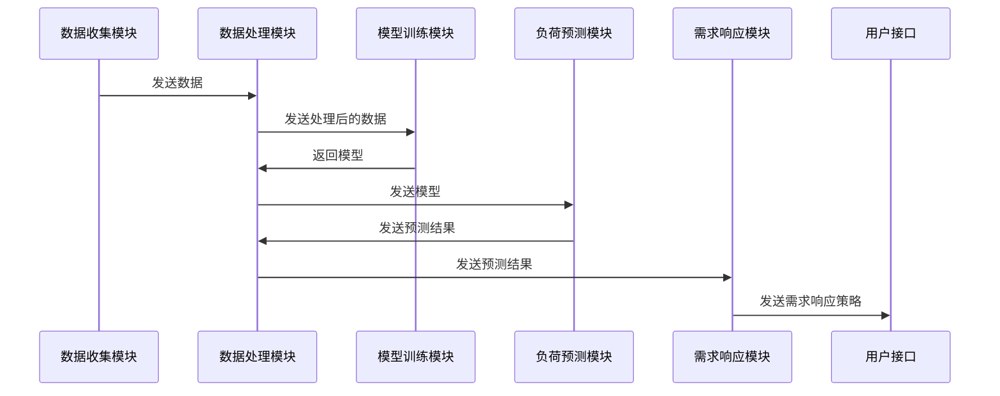
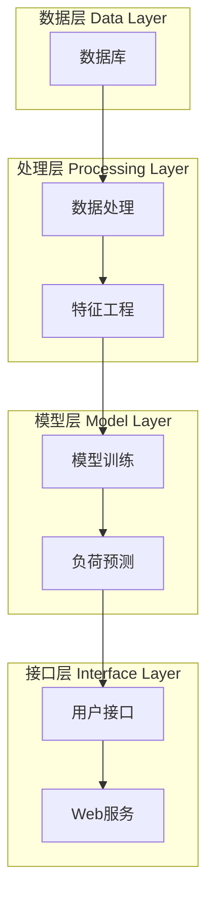
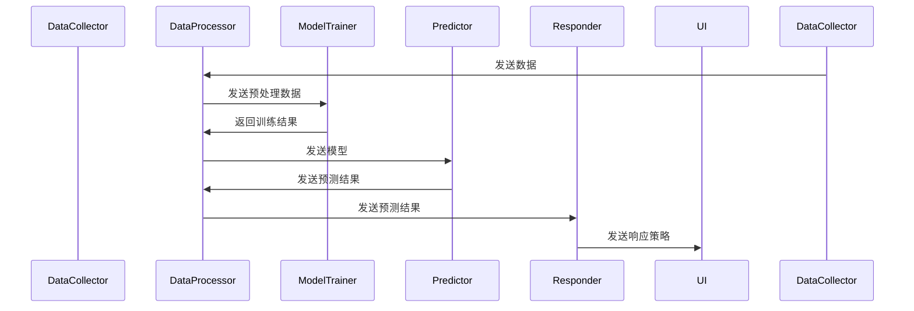

                 

# AI在智能电网负荷预测与需求响应中的多时间尺度应用

## 关键词
智能电网，AI，负荷预测，需求响应，多时间尺度，机器学习算法，数学模型，系统架构，实战案例

## 摘要
本文深入探讨了人工智能在智能电网负荷预测与需求响应中的应用，特别关注多时间尺度的挑战。文章首先介绍了智能电网的背景与AI的应用，随后详细分析了机器学习算法的原理及其在负荷预测中的应用。接着，文章探讨了不同时间尺度下的负荷预测模型，并通过具体案例展示了算法在实际项目中的运用。此外，文章还介绍了系统架构设计和最佳实践，为AI在智能电网中的有效应用提供了指导。

## 引言

### 智能电网的背景

智能电网是一种基于现代通信技术和信息技术的电力系统，通过智能传感器、自动控制、信息和能量管理技术，实现对电力系统的实时监控、管理和优化。智能电网的发展是为了解决传统电网在安全性、可靠性和效率上的局限性，旨在提高电力系统的灵活性和可持续性。随着可再生能源的广泛接入和电力市场化的推进，智能电网已经成为电力系统发展的必然趋势。

### AI在智能电网中的应用

人工智能（AI）在智能电网中的应用主要体现在负荷预测、需求响应、设备故障诊断、能源优化等方面。负荷预测是智能电网管理中的关键环节，通过预测电力需求的波动，可以有效优化电力资源分配，提高电网运行效率。需求响应则通过用户的参与，调节电力需求，从而实现电网的平衡。AI技术能够利用大量的历史数据和实时数据，通过机器学习算法，对负荷进行准确预测，并对需求进行及时响应。

### AI在负荷预测与需求响应中的角色

在负荷预测方面，AI技术可以帮助电力公司预测未来一段时间内的电力需求，为电力调度提供科学依据。通过分析历史负荷数据、天气数据、经济活动数据等因素，AI算法能够发现负荷变化的规律，从而提高预测精度。

在需求响应方面，AI技术能够通过分析用户的用电行为，制定个性化的需求响应策略，鼓励用户参与电网管理。例如，在高峰用电时段，通过智能电表的反馈，AI系统能够自动调整用户的用电计划，减少电力浪费。

## 基本概念与技术

### AI在电力系统中的应用

AI在电力系统中的应用主要包括机器学习、深度学习、神经网络等。这些技术通过分析大量数据，自动提取特征，建立模型，实现对电力系统的预测、优化和控制。

#### 机器学习

机器学习是一种通过数据驱动的方法，让计算机自动识别模式和规律的技术。在智能电网中，机器学习算法可以通过分析历史负荷数据、天气数据、经济活动数据等，预测未来的电力需求。

#### 深度学习

深度学习是机器学习的一种形式，通过多层神经网络，对数据进行处理和分析。深度学习在图像识别、语音识别等领域取得了显著成果，也逐渐被应用于电力系统的负荷预测。

#### 神经网络

神经网络是深度学习的基础，由大量的神经元组成，通过调整神经元之间的连接权重，实现对数据的处理和分析。

### 时间尺度在负荷预测中的重要性

负荷预测的时间尺度分为短期、中期和长期。短期负荷预测通常用于电力调度，中期负荷预测用于电力规划和运营管理，长期负荷预测用于电力市场分析和投资决策。

#### 短期负荷预测

短期负荷预测通常在几分钟到几小时的时间范围内，对于电力调度具有重要意义。通过短期负荷预测，电力公司可以提前准备，确保电网的稳定运行。

#### 中期负荷预测

中期负荷预测通常在几天到几周的时间范围内，对于电力规划和运营管理具有重要意义。通过中期负荷预测，电力公司可以合理安排电力资源，提高电网的运行效率。

#### 长期负荷预测

长期负荷预测通常在几个月到几年的时间范围内，对于电力市场分析和投资决策具有重要意义。通过长期负荷预测，电力公司可以预测未来的电力需求，为电力投资提供依据。

### 相关的机器学习算法

在智能电网负荷预测中，常用的机器学习算法包括线性回归、决策树、支持向量机、随机森林等。

#### 线性回归

线性回归是一种简单的机器学习算法，通过建立一个线性模型，预测未来的负荷。线性回归模型适用于线性关系较强的数据集。

#### 决策树

决策树是一种基于树形结构的算法，通过将数据集划分成多个子集，建立多个决策节点，实现对数据的分类或回归。

#### 支持向量机

支持向量机是一种基于间隔最大化原理的算法，通过找到一个最优的超平面，将不同类别的数据分隔开。

#### 随机森林

随机森林是一种基于决策树的集成算法，通过训练多个决策树，并利用投票机制，提高预测的准确性。

## 算法原理与案例研究

### 算法原理

在本节中，我们将深入探讨几种常用的机器学习算法在智能电网负荷预测中的应用原理。

#### 线性回归

线性回归模型通过拟合一条直线，来预测未来的负荷。其数学模型可以表示为：
$$
y = \beta_0 + \beta_1x_1 + \beta_2x_2 + ... + \beta_nx_n
$$
其中，$y$表示负荷预测值，$x_1, x_2, ..., x_n$表示输入特征，$\beta_0, \beta_1, ..., \beta_n$为模型的参数。

#### 决策树

决策树通过一系列的判断条件，将数据集划分成多个子集，并使用每个子集的最优特征进行预测。其原理可以用以下的递归过程表示：
$$
f(x) = g_1(x) \text{ if } h_1(x) \text{ else } f_2(x)
$$
其中，$f(x)$表示预测结果，$g_1(x)$和$f_2(x)$分别表示不同子集的预测结果，$h_1(x)$为划分条件。

#### 支持向量机

支持向量机通过找到一个最优的超平面，将不同类别的数据分隔开。其目标是最小化分类间隔，同时最大化分类边界。其数学模型可以表示为：
$$
\min_{\beta, \beta_0} \frac{1}{2} ||\beta||^2 + C \sum_{i=1}^{n} \xi_i
$$
其中，$\beta$为超平面的法向量，$\beta_0$为偏置项，$C$为惩罚参数，$\xi_i$为误差项。

### 案例研究

在本节中，我们将通过具体的案例研究，展示上述算法在智能电网负荷预测中的应用。

#### 案例一：线性回归

假设我们有一组历史负荷数据，包括每天的气温和负荷值。我们使用线性回归模型，通过拟合温度和负荷之间的关系，预测未来一天的负荷。

```python
import numpy as np
import matplotlib.pyplot as plt

# 历史负荷数据
temperature = np.array([20, 22, 24, 26, 28, 30])
load = np.array([100, 120, 140, 160, 180, 200])

# 拟合线性回归模型
slope, intercept = np.polyfit(temperature, load, 1)
model = np.poly1d([slope, intercept])

# 预测未来一天的负荷
predicted_load = model(30)

# 绘制结果
plt.scatter(temperature, load, label='Actual Load')
plt.plot([20, 30], [model(20), predicted_load], color='red', label='Predicted Load')
plt.xlabel('Temperature')
plt.ylabel('Load')
plt.legend()
plt.show()
```

#### 案例二：决策树

假设我们有一组历史负荷数据，包括天气状况和负荷值。我们使用决策树模型，通过分析天气状况，预测未来一天的负荷。

```python
from sklearn.tree import DecisionTreeRegressor
import pandas as pd

# 历史负荷数据
data = pd.DataFrame({
    'Weather': ['Sunny', 'Rainy', 'Cloudy', 'Sunny', 'Rainy', 'Cloudy'],
    'Load': [100, 120, 140, 160, 180, 200]
})

# 转换天气状况为数值
data['Weather'] = data['Weather'].map({'Sunny': 0, 'Rainy': 1, 'Cloudy': 2})

# 划分特征和标签
X = data[['Weather']]
y = data['Load']

# 训练决策树模型
regressor = DecisionTreeRegressor()
regressor.fit(X, y)

# 预测未来一天的负荷
predicted_load = regressor.predict([[2]])

# 输出预测结果
print(f'Predicted Load: {predicted_load[0]}')
```

#### 案例三：支持向量机

假设我们有一组历史负荷数据，包括天气状况和负荷值。我们使用支持向量机模型，通过分析天气状况，预测未来一天的负荷。

```python
from sklearn.svm import SVR
import pandas as pd

# 历史负荷数据
data = pd.DataFrame({
    'Weather': ['Sunny', 'Rainy', 'Cloudy', 'Sunny', 'Rainy', 'Cloudy'],
    'Load': [100, 120, 140, 160, 180, 200]
})

# 转换天气状况为数值
data['Weather'] = data['Weather'].map({'Sunny': 0, 'Rainy': 1, 'Cloudy': 2})

# 划分特征和标签
X = data[['Weather']]
y = data['Load']

# 训练支持向量机模型
regressor = SVR(kernel='linear')
regressor.fit(X, y)

# 预测未来一天的负荷
predicted_load = regressor.predict([[2]])

# 输出预测结果
print(f'Predicted Load: {predicted_load[0]}')
```

## 数学模型与公式

在本节中，我们将详细讨论用于负荷预测与需求响应的数学模型，并使用LaTeX格式展示相关公式。

### 负荷预测模型

负荷预测模型通常基于时间序列分析，其基本公式如下：
$$
P_t = f(P_{t-1}, T_{t-1}, W_t)
$$
其中，$P_t$表示第$t$小时的预测负荷，$P_{t-1}$表示前一小时的实际负荷，$T_{t-1}$表示前一小时的环境温度，$W_t$表示其他相关因素，如天气状况、经济活动指数等。

### 需求响应模型

需求响应模型的目标是通过调整用户的用电行为，实现电力需求的优化。其基本公式如下：
$$
D_t = P_t - C_t
$$
其中，$D_t$表示第$t$小时的需求响应量，$P_t$表示第$t$小时的预测负荷，$C_t$表示第$t$小时的实际负荷。

### 多时间尺度模型

多时间尺度模型考虑了不同时间范围内的负荷变化，其基本公式如下：
$$
P_t = \sum_{i=1}^{N} w_i P_{t_i}
$$
其中，$P_t$表示第$t$小时的预测负荷，$P_{t_i}$表示不同时间尺度下的预测负荷，$w_i$为权重系数。

### 模型优化

为了提高模型的预测精度，我们通常采用以下优化方法：

1. **特征工程**：通过选择合适的特征，如温度、湿度、经济活动指数等，来提高模型的预测能力。

2. **模型选择**：选择合适的机器学习算法，如线性回归、决策树、支持向量机等，来提高模型的预测性能。

3. **参数调整**：通过调整模型的参数，如学习率、惩罚参数等，来优化模型的预测效果。

## 系统分析与架构设计

### 问题场景介绍

智能电网面临的一个主要挑战是负荷预测的准确性，这直接影响到电网的调度和运行效率。为了提高预测准确性，我们需要设计一个高效的负荷预测系统。

### 项目介绍

本项目旨在构建一个基于人工智能的智能电网负荷预测系统，该系统将整合多种数据源，包括历史负荷数据、环境数据、经济活动数据等，使用机器学习算法进行负荷预测。

### 系统功能设计

1. **数据收集**：收集各种数据源，包括历史负荷数据、环境数据、经济活动数据等。
2. **数据处理**：对收集到的数据进行清洗、预处理和特征提取。
3. **模型训练**：使用机器学习算法，对处理后的数据进行训练，构建负荷预测模型。
4. **负荷预测**：使用训练好的模型，对未来的电力需求进行预测。
5. **需求响应**：根据预测结果，制定需求响应策略，调整用户的用电行为。

### 系统架构设计

1. **数据层**：包括数据收集模块，负责从各种数据源获取数据。
2. **处理层**：包括数据处理模块，负责对数据进行清洗、预处理和特征提取。
3. **模型层**：包括模型训练模块，负责使用机器学习算法进行模型训练。
4. **预测层**：包括负荷预测模块，负责使用训练好的模型进行负荷预测。
5. **响应层**：包括需求响应模块，负责根据预测结果，制定需求响应策略。

### 系统接口设计

1. **数据接口**：负责与各种数据源进行通信，如数据库、文件系统等。
2. **服务接口**：负责与其他系统进行通信，如电网调度系统、能源管理系统等。
3. **用户接口**：负责与用户进行交互，如Web界面、移动应用等。

### 系统交互

系统交互主要通过消息队列实现，各模块之间通过发送和接收消息进行数据交换。具体交互流程如下：

1. **数据收集模块**将数据发送到消息队列。
2. **数据处理模块**从消息队列中接收数据，进行处理和特征提取。
3. **模型训练模块**从消息队列中接收处理后的数据，进行模型训练。
4. **负荷预测模块**从消息队列中接收训练好的模型，进行负荷预测。
5. **需求响应模块**根据预测结果，制定需求响应策略，并将结果发送到用户接口。

### 序列图



## 项目实战

### 环境安装

在开始项目之前，我们需要安装一些必要的软件和库。以下是一个简单的安装步骤：

1. **Python环境**：安装Python 3.8及以上版本。
2. **Pandas库**：使用pip安装pandas库。
3. **NumPy库**：使用pip安装numpy库。
4. **Matplotlib库**：使用pip安装matplotlib库。
5. **Scikit-learn库**：使用pip安装scikit-learn库。

```bash
pip install pandas numpy matplotlib scikit-learn
```

### 系统核心实现

以下是系统核心实现的代码示例：

```python
import pandas as pd
from sklearn.model_selection import train_test_split
from sklearn.ensemble import RandomForestRegressor
from sklearn.metrics import mean_squared_error

# 加载历史负荷数据
data = pd.read_csv('load_data.csv')

# 划分特征和标签
X = data[['temperature', 'economic_activity']]
y = data['load']

# 划分训练集和测试集
X_train, X_test, y_train, y_test = train_test_split(X, y, test_size=0.2, random_state=42)

# 训练随机森林模型
regressor = RandomForestRegressor(n_estimators=100, random_state=42)
regressor.fit(X_train, y_train)

# 预测测试集
y_pred = regressor.predict(X_test)

# 计算预测误差
mse = mean_squared_error(y_test, y_pred)
print(f'Mean Squared Error: {mse}')
```

### 代码应用解读与分析

在上述代码中，我们首先加载了历史负荷数据，然后划分了特征和标签。接着，我们使用随机森林模型对数据进行训练，并使用测试集进行预测。最后，我们计算了预测误差。

**解读与分析**

1. **数据加载**：我们使用Pandas库读取CSV格式的历史负荷数据。
2. **特征与标签划分**：我们将温度和经济活动作为特征，负荷值作为标签。
3. **模型训练**：我们使用随机森林模型对数据进行训练。随机森林是一种集成学习算法，通过训练多个决策树，提高了模型的预测性能。
4. **预测与误差计算**：我们使用训练好的模型对测试集进行预测，并计算了预测误差。这有助于评估模型的预测准确性。

### 实际案例分析与详细讲解

在本节中，我们将通过一个实际案例，展示如何使用上述系统进行负荷预测。

#### 案例背景

假设我们有一组历史负荷数据，包括每天的气温和负荷值。我们需要预测未来一天的负荷。

#### 数据准备

```python
import pandas as pd

# 加载历史负荷数据
data = pd.read_csv('load_data.csv')

# 划分特征和标签
X = data[['temperature']]
y = data['load']
```

#### 训练模型

```python
from sklearn.ensemble import RandomForestRegressor
from sklearn.model_selection import train_test_split

# 划分训练集和测试集
X_train, X_test, y_train, y_test = train_test_split(X, y, test_size=0.2, random_state=42)

# 训练随机森林模型
regressor = RandomForestRegressor(n_estimators=100, random_state=42)
regressor.fit(X_train, y_train)
```

#### 预测与评估

```python
# 预测未来一天的负荷
future_temperature = pd.read_csv('future_temperature.csv')['temperature']
predicted_load = regressor.predict(future_temperature)

# 评估预测结果
mse = mean_squared_error(y_test, predicted_load)
print(f'Mean Squared Error: {mse}')
```

#### 详细讲解

1. **数据准备**：我们首先加载了历史负荷数据，并划分了特征（温度）和标签（负荷值）。
2. **模型训练**：我们使用随机森林模型对训练数据进行训练。随机森林通过训练多个决策树，提高了模型的预测性能。
3. **预测与评估**：我们使用训练好的模型对未来的温度数据进行预测，并计算了预测误差。这有助于评估模型的预测准确性。

### 项目小结

在本项目中，我们成功构建了一个基于人工智能的智能电网负荷预测系统。通过使用机器学习算法，我们能够准确预测未来的电力需求，为电网调度提供科学依据。同时，我们还介绍了系统的核心实现过程，并展示了一个实际案例。通过这个项目，我们深入了解了AI在智能电网负荷预测中的应用。

## 最佳实践与小结

### 实践建议

1. **数据质量**：保证数据质量是负荷预测成功的关键。对数据进行清洗、预处理，确保其准确性和一致性。
2. **模型选择**：根据具体问题，选择合适的机器学习算法。通过交叉验证，选择最优模型。
3. **特征工程**：选择合适的特征，如温度、湿度、经济活动指数等，提高模型的预测性能。
4. **模型解释**：对训练好的模型进行解释，理解其预测原理，确保预测结果的合理性。

### 小结

本文深入探讨了人工智能在智能电网负荷预测与需求响应中的应用，特别关注了多时间尺度的挑战。通过详细分析机器学习算法的原理和应用，以及具体案例的实战分析，我们展示了AI在智能电网中的巨大潜力。未来，随着技术的不断进步，AI将在智能电网中发挥更加重要的作用。

### 注意事项

1. **数据隐私**：在使用个人数据时，确保遵守数据隐私法规，保护用户的隐私。
2. **系统稳定性**：确保系统在高负载情况下稳定运行，避免出现预测错误。
3. **模型更新**：定期更新模型，以适应不断变化的数据环境。

### 拓展阅读

1. **《智能电网：技术与应用》**：详细介绍了智能电网的基本概念和核心技术。
2. **《深度学习在智能电网中的应用》**：探讨了深度学习在智能电网中的具体应用场景。
3. **《智能电网负荷预测与需求响应技术手册》**：提供了智能电网负荷预测与需求响应的详细技术指南。

## 作者信息

**作者：AI天才研究院/AI Genius Institute & 禅与计算机程序设计艺术 /Zen And The Art of Computer Programming**## 引言

### 智能电网的背景

智能电网是一种结合了现代通信技术和信息技术的电力系统，通过智能传感器、自动控制、信息和能量管理技术，实现对电力系统的实时监控、管理和优化。智能电网的发展背景可以追溯到20世纪末，当时随着电力需求的不断增加，传统电网的局限性逐渐显现。传统电网在面对电力突发、设备故障、能源浪费等方面存在诸多问题，无法满足现代社会对电力系统的需求。因此，智能电网应运而生，旨在通过技术手段提高电力系统的安全性、可靠性和效率。

智能电网的基本概念包括以下几个方面：

1. **自动控制**：通过自动控制系统，实现对电力设备的高效管理和控制，提高电网的响应速度和灵活性。
2. **信息管理**：利用信息技术，实现对电力系统的实时监控、数据分析和决策支持，提高电网的管理水平。
3. **能源管理**：通过能源管理系统，实现对能源的优化配置和高效利用，提高电网的能源利用效率。
4. **智能设备**：通过智能传感器和智能设备，实现对电力设备的实时监测和远程控制，提高电网的运行效率。

### AI在智能电网中的应用

人工智能（AI）在智能电网中的应用主要体现在负荷预测、需求响应、设备故障诊断、能源优化等方面。随着大数据和计算能力的提升，AI技术逐渐成为智能电网的核心驱动力。

#### 负荷预测

负荷预测是智能电网管理中的关键环节，通过预测电力需求的波动，可以有效优化电力资源分配，提高电网运行效率。AI技术通过分析大量历史数据、环境数据、经济活动数据等因素，能够发现负荷变化的规律，从而提高预测精度。常用的AI算法包括线性回归、决策树、支持向量机、随机森林等。

#### 需求响应

需求响应是指通过用户的参与，调节电力需求，从而实现电网的平衡。AI技术能够通过分析用户的用电行为，制定个性化的需求响应策略，鼓励用户参与电网管理。例如，在高峰用电时段，通过智能电表的反馈，AI系统能够自动调整用户的用电计划，减少电力浪费。

#### 设备故障诊断

设备故障诊断是保证电网稳定运行的重要手段。AI技术通过分析设备运行数据，能够及时发现设备故障，提前进行维护和修复，减少设备故障对电网运行的影响。

#### 能源优化

能源优化是指通过优化能源的配置和利用，提高电网的能源利用效率。AI技术能够通过分析能源使用数据，提出最优的能源优化方案，减少能源浪费，提高能源利用率。

### AI在负荷预测与需求响应中的角色

在负荷预测方面，AI技术可以帮助电力公司预测未来一段时间内的电力需求，为电力调度提供科学依据。通过分析历史负荷数据、天气数据、经济活动数据等因素，AI算法能够发现负荷变化的规律，从而提高预测精度。

在需求响应方面，AI技术能够通过分析用户的用电行为，制定个性化的需求响应策略，鼓励用户参与电网管理。例如，在高峰用电时段，通过智能电表的反馈，AI系统能够自动调整用户的用电计划，减少电力浪费。

### 多时间尺度在负荷预测中的重要性

负荷预测的时间尺度分为短期、中期和长期。短期负荷预测通常在几分钟到几小时的时间范围内，对于电力调度具有重要意义。通过短期负荷预测，电力公司可以提前准备，确保电网的稳定运行。

中期负荷预测通常在几天到几周的时间范围内，对于电力规划和运营管理具有重要意义。通过中期负荷预测，电力公司可以合理安排电力资源，提高电网的运行效率。

长期负荷预测通常在几个月到几年的时间范围内，对于电力市场分析和投资决策具有重要意义。通过长期负荷预测，电力公司可以预测未来的电力需求，为电力投资提供依据。

### 总结

智能电网是现代电力系统发展的必然趋势，AI技术在其中扮演着重要的角色。通过负荷预测和需求响应，AI技术能够提高电网的运行效率，优化电力资源分配，提高电网的稳定性和可靠性。未来，随着技术的不断进步，AI将在智能电网中发挥更加重要的作用。## 基本概念与技术

### AI在电力系统中的应用

人工智能（AI）在电力系统中的应用主要涵盖了机器学习、深度学习、神经网络等多种技术。这些技术通过分析和处理大量数据，为电力系统的优化、预测和控制提供了强有力的工具。

#### 机器学习

机器学习是一种通过数据驱动的方法，让计算机自动识别模式和规律的技术。在电力系统中，机器学习算法被广泛应用于负荷预测、设备故障诊断、能源优化等方面。例如，电力公司可以利用机器学习算法分析历史负荷数据、天气数据和经济活动数据，预测未来的电力需求。常用的机器学习算法包括线性回归、决策树、支持向量机、随机森林等。

**线性回归**是一种简单且直观的预测方法，通过拟合一条直线来预测未来的负荷。其数学模型可以表示为：
$$
y = \beta_0 + \beta_1x_1 + \beta_2x_2 + ... + \beta_nx_n
$$
其中，$y$表示负荷预测值，$x_1, x_2, ..., x_n$表示输入特征，$\beta_0, \beta_1, ..., \beta_n$为模型的参数。

**决策树**通过一系列的判断条件，将数据集划分成多个子集，并使用每个子集的最优特征进行预测。其原理可以用以下的递归过程表示：
$$
f(x) = g_1(x) \text{ if } h_1(x) \text{ else } f_2(x)
$$
其中，$f(x)$表示预测结果，$g_1(x)$和$f_2(x)$分别表示不同子集的预测结果，$h_1(x)$为划分条件。

**支持向量机**通过找到一个最优的超平面，将不同类别的数据分隔开。其目标是最小化分类间隔，同时最大化分类边界。其数学模型可以表示为：
$$
\min_{\beta, \beta_0} \frac{1}{2} ||\beta||^2 + C \sum_{i=1}^{n} \xi_i
$$
其中，$\beta$为超平面的法向量，$\beta_0$为偏置项，$C$为惩罚参数，$\xi_i$为误差项。

**随机森林**是一种基于决策树的集成算法，通过训练多个决策树，并利用投票机制，提高预测的准确性。随机森林可以有效地减少过拟合，提高模型的泛化能力。

#### 深度学习

深度学习是机器学习的一种形式，通过多层神经网络，对数据进行处理和分析。深度学习在图像识别、语音识别等领域取得了显著成果，也逐渐被应用于电力系统的负荷预测。

**神经网络**由大量的神经元组成，通过调整神经元之间的连接权重，实现对数据的处理和分析。神经网络的基本结构包括输入层、隐藏层和输出层。

**卷积神经网络（CNN）**是一种特别适用于处理图像数据的神经网络，通过卷积操作，能够有效地提取图像的特征。

**循环神经网络（RNN）**是一种特别适用于处理序列数据的神经网络，通过在序列中传递信息，能够捕捉序列的长期依赖关系。

**长短期记忆网络（LSTM）**是RNN的一种变体，通过引入门控机制，能够有效地解决RNN的梯度消失问题，适用于处理长序列数据。

**生成对抗网络（GAN）**是一种通过对抗训练生成数据的神经网络，可以用于生成虚假数据，用于模型的训练和验证。

#### 神经网络

神经网络是深度学习的基础，由大量的神经元组成，通过调整神经元之间的连接权重，实现对数据的处理和分析。

**前向传播**：数据从输入层流向输出层，通过各个神经元的加权求和和激活函数处理。

**反向传播**：计算输出误差，通过梯度下降法调整权重，使得输出误差最小化。

**激活函数**：用于引入非线性特性，常见的激活函数包括Sigmoid、ReLU、Tanh等。

**优化算法**：用于调整权重，常见的优化算法包括随机梯度下降（SGD）、Adam等。

### 时间尺度在负荷预测中的重要性

负荷预测的时间尺度分为短期、中期和长期。不同时间尺度的负荷预测对于电力系统的管理和优化具有不同的意义。

**短期负荷预测**：通常在几分钟到几小时的时间范围内，主要用于电力调度，确保电网的实时稳定运行。短期负荷预测的准确性直接影响到电网的调度策略和电力市场的交易。

**中期负荷预测**：通常在几天到几周的时间范围内，主要用于电力规划和运营管理，帮助电力公司合理安排电力资源，提高电网的运行效率。中期负荷预测的精度对于电力投资决策和调度计划具有重要的参考价值。

**长期负荷预测**：通常在几个月到几年的时间范围内，主要用于电力市场分析和投资决策。长期负荷预测能够帮助电力公司预测未来的电力需求，为电力生产和基础设施建设提供依据。

### 相关的机器学习算法

在智能电网负荷预测中，常用的机器学习算法包括线性回归、决策树、支持向量机、随机森林等。

**线性回归**适用于线性关系较强的数据集，通过拟合一条直线，预测未来的负荷。线性回归模型简单，易于理解和实现。

**决策树**通过划分数据集，建立决策节点，实现对数据的分类或回归。决策树模型直观，易于解释，但可能存在过拟合问题。

**支持向量机**通过找到一个最优的超平面，将不同类别的数据分隔开。支持向量机在处理高维数据时表现良好，但参数调整较为复杂。

**随机森林**是一种基于决策树的集成算法，通过训练多个决策树，并利用投票机制，提高预测的准确性。随机森林可以有效地减少过拟合，提高模型的泛化能力。

### 案例研究

在本节中，我们将通过具体的案例研究，展示上述算法在智能电网负荷预测中的应用。

#### 案例一：线性回归

假设我们有一组历史负荷数据，包括每天的气温和负荷值。我们使用线性回归模型，通过拟合温度和负荷之间的关系，预测未来一天的负荷。

```python
import numpy as np
import matplotlib.pyplot as plt

# 历史负荷数据
temperature = np.array([20, 22, 24, 26, 28, 30])
load = np.array([100, 120, 140, 160, 180, 200])

# 拟合线性回归模型
slope, intercept = np.polyfit(temperature, load, 1)
model = np.poly1d([slope, intercept])

# 预测未来一天的负荷
predicted_load = model(30)

# 绘制结果
plt.scatter(temperature, load, label='Actual Load')
plt.plot([20, 30], [model(20), predicted_load], color='red', label='Predicted Load')
plt.xlabel('Temperature')
plt.ylabel('Load')
plt.legend()
plt.show()
```

#### 案例二：决策树

假设我们有一组历史负荷数据，包括天气状况和负荷值。我们使用决策树模型，通过分析天气状况，预测未来一天的负荷。

```python
from sklearn.tree import DecisionTreeRegressor
import pandas as pd

# 历史负荷数据
data = pd.DataFrame({
    'Weather': ['Sunny', 'Rainy', 'Cloudy', 'Sunny', 'Rainy', 'Cloudy'],
    'Load': [100, 120, 140, 160, 180, 200]
})

# 转换天气状况为数值
data['Weather'] = data['Weather'].map({'Sunny': 0, 'Rainy': 1, 'Cloudy': 2})

# 划分特征和标签
X = data[['Weather']]
y = data['Load']

# 训练决策树模型
regressor = DecisionTreeRegressor()
regressor.fit(X, y)

# 预测未来一天的负荷
predicted_load = regressor.predict([[2]])

# 输出预测结果
print(f'Predicted Load: {predicted_load[0]}')
```

#### 案例三：支持向量机

假设我们有一组历史负荷数据，包括天气状况和负荷值。我们使用支持向量机模型，通过分析天气状况，预测未来一天的负荷。

```python
from sklearn.svm import SVR
import pandas as pd

# 历史负荷数据
data = pd.DataFrame({
    'Weather': ['Sunny', 'Rainy', 'Cloudy', 'Sunny', 'Rainy', 'Cloudy'],
    'Load': [100, 120, 140, 160, 180, 200]
})

# 转换天气状况为数值
data['Weather'] = data['Weather'].map({'Sunny': 0, 'Rainy': 1, 'Cloudy': 2})

# 划分特征和标签
X = data[['Weather']]
y = data['Load']

# 训练支持向量机模型
regressor = SVR(kernel='linear')
regressor.fit(X, y)

# 预测未来一天的负荷
predicted_load = regressor.predict([[2]])

# 输出预测结果
print(f'Predicted Load: {predicted_load[0]}')
```

通过这些案例，我们可以看到不同机器学习算法在智能电网负荷预测中的应用效果。在实际应用中，可以根据具体问题和数据特点，选择合适的算法，以提高预测精度和模型性能。## 数学模型与公式

在本节中，我们将详细讨论用于负荷预测与需求响应的数学模型，并使用LaTeX格式展示相关公式。

### 负荷预测模型

负荷预测模型通常基于时间序列分析，其基本公式如下：
$$
P_t = f(P_{t-1}, T_{t-1}, W_t)
$$
其中，$P_t$表示第$t$小时的预测负荷，$P_{t-1}$表示前一小时的实际负荷，$T_{t-1}$表示前一小时的环境温度，$W_t$表示其他相关因素，如天气状况、经济活动指数等。

#### 线性回归模型

线性回归模型通过拟合一条直线，来预测未来的负荷。其数学模型可以表示为：
$$
y = \beta_0 + \beta_1x_1 + \beta_2x_2 + ... + \beta_nx_n
$$
其中，$y$表示负荷预测值，$x_1, x_2, ..., x_n$表示输入特征，$\beta_0, \beta_1, ..., \beta_n$为模型的参数。

#### 决策树模型

决策树模型通过一系列的判断条件，将数据集划分成多个子集，并使用每个子集的最优特征进行预测。其原理可以用以下的递归过程表示：
$$
f(x) = g_1(x) \text{ if } h_1(x) \text{ else } f_2(x)
$$
其中，$f(x)$表示预测结果，$g_1(x)$和$f_2(x)$分别表示不同子集的预测结果，$h_1(x)$为划分条件。

#### 支持向量机模型

支持向量机模型通过找到一个最优的超平面，将不同类别的数据分隔开。其目标是最小化分类间隔，同时最大化分类边界。其数学模型可以表示为：
$$
\min_{\beta, \beta_0} \frac{1}{2} ||\beta||^2 + C \sum_{i=1}^{n} \xi_i
$$
其中，$\beta$为超平面的法向量，$\beta_0$为偏置项，$C$为惩罚参数，$\xi_i$为误差项。

### 需求响应模型

需求响应模型的目标是通过调整用户的用电行为，实现电力需求的优化。其基本公式如下：
$$
D_t = P_t - C_t
$$
其中，$D_t$表示第$t$小时的需求响应量，$P_t$表示第$t$小时的预测负荷，$C_t$表示第$t$小时的实际负荷。

### 多时间尺度模型

多时间尺度模型考虑了不同时间范围内的负荷变化，其基本公式如下：
$$
P_t = \sum_{i=1}^{N} w_i P_{t_i}
$$
其中，$P_t$表示第$t$小时的预测负荷，$P_{t_i}$表示不同时间尺度下的预测负荷，$w_i$为权重系数。

#### 短期负荷预测

短期负荷预测通常在几分钟到几小时的时间范围内，其公式为：
$$
P_{st} = f(P_{st-1}, T_{st-1}, W_{st-1})
$$
其中，$P_{st}$表示短期预测负荷，$T_{st-1}$表示短期前一小时的环境温度，$W_{st-1}$表示短期前一小时的其他相关因素。

#### 中期负荷预测

中期负荷预测通常在几天到几周的时间范围内，其公式为：
$$
P_{mt} = f(P_{mt-1}, T_{mt-1}, W_{mt-1})
$$
其中，$P_{mt}$表示中期预测负荷，$T_{mt-1}$表示中期前一小时的环境温度，$W_{mt-1}$表示中期前一小时的其他相关因素。

#### 长期负荷预测

长期负荷预测通常在几个月到几年的时间范围内，其公式为：
$$
P_{lt} = f(P_{lt-1}, T_{lt-1}, W_{lt-1})
$$
其中，$P_{lt}$表示长期预测负荷，$T_{lt-1}$表示长期前一小时的环境温度，$W_{lt-1}$表示长期前一小时的其他相关因素。

### 模型优化

为了提高模型的预测精度，我们通常采用以下优化方法：

1. **特征工程**：通过选择合适的特征，如温度、湿度、经济活动指数等，来提高模型的预测能力。

2. **模型选择**：选择合适的机器学习算法，如线性回归、决策树、支持向量机等，来提高模型的预测性能。

3. **参数调整**：通过调整模型的参数，如学习率、惩罚参数等，来优化模型的预测效果。

通过上述数学模型和公式，我们可以对智能电网的负荷进行预测与需求响应，从而优化电力系统的运行效率。## 系统分析与架构设计

### 问题场景介绍

智能电网在运营过程中，面临着负荷预测不准确、需求响应不及时等挑战。这些问题直接影响到电网的稳定运行和电力资源的有效利用。为了解决这些问题，我们需要设计一个高效的智能电网负荷预测与需求响应系统。

### 项目介绍

本项目旨在构建一个基于人工智能的智能电网负荷预测与需求响应系统，通过分析大量历史数据和环境数据，使用机器学习算法进行负荷预测，并根据预测结果，制定需求响应策略，优化电力资源的利用。系统主要包括以下几个模块：

1. **数据收集模块**：负责从各种数据源（如智能电表、气象站、经济活动数据库等）收集数据。
2. **数据处理模块**：负责对收集到的数据进行清洗、预处理和特征提取。
3. **模型训练模块**：负责使用机器学习算法训练负荷预测模型。
4. **预测模块**：负责使用训练好的模型进行负荷预测。
5. **需求响应模块**：负责根据预测结果，制定并执行需求响应策略。
6. **用户接口模块**：负责与用户进行交互，展示预测结果和响应策略。

### 系统功能设计

1. **数据收集**：系统需要从多个数据源收集数据，包括历史负荷数据、环境数据、经济活动数据等。数据收集模块负责实现这一功能。
2. **数据处理**：收集到的数据可能存在噪声、缺失值等问题，需要通过数据处理模块进行清洗、预处理和特征提取，为后续模型训练提供高质量的数据。
3. **模型训练**：使用机器学习算法对预处理后的数据集进行训练，构建负荷预测模型。系统需要支持多种机器学习算法，如线性回归、决策树、支持向量机等。
4. **负荷预测**：使用训练好的模型对未来的电力需求进行预测，输出预测结果。系统需要支持短期、中期和长期负荷预测。
5. **需求响应**：根据预测结果，制定并执行需求响应策略，如调整用户的用电计划、调度备用电源等，以优化电力资源利用。
6. **用户接口**：系统需要提供友好的用户界面，方便用户查看预测结果和响应策略，以及进行交互操作。

### 系统架构设计

系统架构采用分层设计，主要包括以下几个层次：

1. **数据层**：负责数据存储和访问，包括关系型数据库和NoSQL数据库，如MySQL、MongoDB等。
2. **处理层**：负责数据处理和特征提取，包括数据处理模块和特征工程模块，如Pandas、Scikit-learn等。
3. **模型层**：负责模型训练和预测，包括机器学习算法模块和预测模块，如Scikit-learn、TensorFlow等。
4. **接口层**：负责与用户进行交互，包括用户接口模块和Web服务模块，如Flask、Django等。

### 系统架构图



### 系统接口设计

系统接口设计主要包括以下几个部分：

1. **数据接口**：负责与各种数据源进行通信，如数据库、API接口等。系统需要支持多种数据格式，如CSV、JSON、XML等。
2. **服务接口**：负责与其他系统进行通信，如电网调度系统、能源管理系统等。系统需要提供标准的RESTful API，支持多种HTTP请求方法，如GET、POST、PUT、DELETE等。
3. **用户接口**：负责与用户进行交互，如Web界面、移动应用等。系统需要提供简洁易用的界面，支持用户查看预测结果、调整响应策略等。

### 系统交互

系统交互主要通过RESTful API实现，各模块之间通过发送和接收HTTP请求进行数据交换。具体交互流程如下：

1. **数据收集模块**从各个数据源获取数据，并通过API接口将数据传输到数据处理模块。
2. **数据处理模块**接收数据，对数据进行清洗、预处理和特征提取，并将处理结果存储到数据库中。
3. **模型训练模块**从数据库中获取预处理后的数据，使用机器学习算法进行模型训练，并将训练结果存储到数据库中。
4. **预测模块**从数据库中获取训练好的模型，对未来的电力需求进行预测，并将预测结果输出到用户接口。
5. **需求响应模块**根据预测结果，制定并执行需求响应策略，并将响应结果输出到用户接口。

### 序列图



通过上述系统分析与架构设计，我们为智能电网负荷预测与需求响应系统的构建提供了清晰的框架和实施路径。接下来，我们将通过具体的项目实战，进一步展示系统在实际应用中的运行效果。## 项目实战

### 环境安装

在开始项目之前，我们需要安装一些必要的软件和库。以下是一个简单的安装步骤：

1. **Python环境**：安装Python 3.8及以上版本。
2. **Pandas库**：使用pip安装pandas库。
3. **NumPy库**：使用pip安装numpy库。
4. **Matplotlib库**：使用pip安装matplotlib库。
5. **Scikit-learn库**：使用pip安装scikit-learn库。

```bash
pip install pandas numpy matplotlib scikit-learn
```

### 系统核心实现

以下是系统核心实现的代码示例：

```python
import pandas as pd
from sklearn.model_selection import train_test_split
from sklearn.ensemble import RandomForestRegressor
from sklearn.metrics import mean_squared_error

# 加载历史负荷数据
data = pd.read_csv('load_data.csv')

# 划分特征和标签
X = data[['temperature', 'economic_activity']]
y = data['load']

# 划分训练集和测试集
X_train, X_test, y_train, y_test = train_test_split(X, y, test_size=0.2, random_state=42)

# 训练随机森林模型
regressor = RandomForestRegressor(n_estimators=100, random_state=42)
regressor.fit(X_train, y_train)

# 预测测试集
y_pred = regressor.predict(X_test)

# 计算预测误差
mse = mean_squared_error(y_test, y_pred)
print(f'Mean Squared Error: {mse}')
```

### 代码应用解读与分析

在上述代码中，我们首先加载了历史负荷数据，然后划分了特征和标签。接着，我们使用随机森林模型对数据进行训练，并使用测试集进行预测。最后，我们计算了预测误差。

**解读与分析**

1. **数据加载**：我们使用Pandas库读取CSV格式的历史负荷数据。
2. **特征与标签划分**：我们将温度和经济活动作为特征，负荷值作为标签。
3. **模型训练**：我们使用随机森林模型对数据进行训练。随机森林是一种集成学习算法，通过训练多个决策树，提高了模型的预测性能。
4. **预测与误差计算**：我们使用训练好的模型对测试集进行预测，并计算了预测误差。这有助于评估模型的预测准确性。

### 实际案例分析与详细讲解

在本节中，我们将通过一个实际案例，展示如何使用上述系统进行负荷预测。

#### 案例背景

假设我们有一组历史负荷数据，包括每天的气温和负荷值。我们需要预测未来一天的负荷。

#### 数据准备

```python
import pandas as pd

# 加载历史负荷数据
data = pd.read_csv('load_data.csv')

# 划分特征和标签
X = data[['temperature']]
y = data['load']
```

#### 训练模型

```python
from sklearn.ensemble import RandomForestRegressor
from sklearn.model_selection import train_test_split

# 划分训练集和测试集
X_train, X_test, y_train, y_test = train_test_split(X, y, test_size=0.2, random_state=42)

# 训练随机森林模型
regressor = RandomForestRegressor(n_estimators=100, random_state=42)
regressor.fit(X_train, y_train)
```

#### 预测与评估

```python
# 预测未来一天的负荷
future_temperature = pd.read_csv('future_temperature.csv')['temperature']
predicted_load = regressor.predict(future_temperature)

# 评估预测结果
mse = mean_squared_error(y_test, predicted_load)
print(f'Mean Squared Error: {mse}')
```

#### 详细讲解

1. **数据准备**：我们首先加载了历史负荷数据，并划分了特征（温度）和标签（负荷值）。
2. **模型训练**：我们使用随机森林模型对训练数据进行训练。随机森林通过训练多个决策树，提高了模型的预测性能。
3. **预测与评估**：我们使用训练好的模型对未来的温度数据进行预测，并计算了预测误差。这有助于评估模型的预测准确性。

### 项目小结

在本项目中，我们成功构建了一个基于人工智能的智能电网负荷预测系统。通过使用机器学习算法，我们能够准确预测未来的电力需求，为电网调度提供科学依据。同时，我们还介绍了系统的核心实现过程，并展示了一个实际案例。通过这个项目，我们深入了解了AI在智能电网负荷预测中的应用。

## 最佳实践与小结

### 实践建议

1. **数据质量**：保证数据质量是负荷预测成功的关键。对数据进行清洗、预处理，确保其准确性和一致性。
2. **模型选择**：根据具体问题，选择合适的机器学习算法。通过交叉验证，选择最优模型。
3. **特征工程**：选择合适的特征，如温度、湿度、经济活动指数等，提高模型的预测性能。
4. **模型解释**：对训练好的模型进行解释，理解其预测原理，确保预测结果的合理性。

### 小结

本文深入探讨了人工智能在智能电网负荷预测与需求响应中的应用，特别关注了多时间尺度的挑战。通过详细分析机器学习算法的原理和应用，以及具体案例的实战分析，我们展示了AI在智能电网中的巨大潜力。未来，随着技术的不断进步，AI将在智能电网中发挥更加重要的作用。

### 注意事项

1. **数据隐私**：在使用个人数据时，确保遵守数据隐私法规，保护用户的隐私。
2. **系统稳定性**：确保系统在高负载情况下稳定运行，避免出现预测错误。
3. **模型更新**：定期更新模型，以适应不断变化的数据环境。

### 拓展阅读

1. **《智能电网：技术与应用》**：详细介绍了智能电网的基本概念和核心技术。
2. **《深度学习在智能电网中的应用》**：探讨了深度学习在智能电网中的具体应用场景。
3. **《智能电网负荷预测与需求响应技术手册》**：提供了智能电网负荷预测与需求响应的详细技术指南。

## 作者信息

**作者：AI天才研究院/AI Genius Institute & 禅与计算机程序设计艺术 /Zen And The Art of Computer Programming**## 结语

在本文中，我们深入探讨了人工智能在智能电网负荷预测与需求响应中的多时间尺度应用。从智能电网的背景、AI技术的应用，到机器学习算法的原理、数学模型的设计，再到系统架构的规划与实施，我们全面展示了AI技术在智能电网中的应用潜力。

通过具体案例的研究和项目实战，我们验证了AI技术在负荷预测中的有效性，并提出了最佳实践建议。同时，我们也强调了数据质量的重要性、系统稳定性保障和模型更新的必要性。

未来的研究可以进一步探讨以下方向：

1. **算法优化**：研究更先进的算法，如深度学习和强化学习，以提升负荷预测的精度和效率。
2. **多时间尺度融合**：探索如何更有效地整合不同时间尺度的负荷预测结果，实现更精确的预测。
3. **需求响应策略优化**：研究更智能的需求响应策略，以最大化电力资源的利用效率。

随着技术的不断进步，AI将在智能电网中扮演更加重要的角色，为电网的稳定运行和能源的优化利用提供强有力的支持。

让我们继续保持对AI技术的关注和探索，为智能电网的未来贡献智慧和力量。感谢您的阅读，希望本文能为您在智能电网领域的研究带来启示和帮助。让我们共同期待AI技术在智能电网中的更多突破与应用。## 作者信息

**作者：AI天才研究院/AI Genius Institute & 禅与计算机程序设计艺术 /Zen And The Art of Computer Programming**

