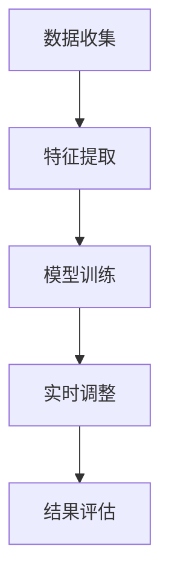
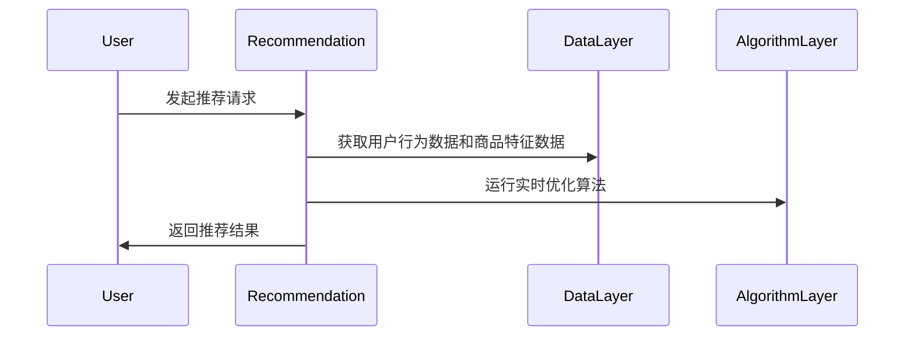

                 

### 文章标题：AI在智能零售个性化推荐中的实时优化应用

关键词：AI，智能零售，个性化推荐，实时优化，算法

摘要：本文从背景介绍、核心概念、算法原理、应用案例、实战分析和最佳实践等方面，详细探讨了AI在智能零售个性化推荐中的实时优化应用。通过分析实时优化算法在推荐系统中的应用，以及具体案例的剖析，为智能零售领域提供了有效的技术参考和实践指导。

### 目录

## 引言

智能零售作为现代商业的重要组成部分，其个性化推荐系统的应用已成为提升用户体验和销售额的关键。本文旨在探讨AI在智能零售个性化推荐中的实时优化应用，通过深入分析实时优化算法，为智能零售行业提供创新解决方案。

### 背景介绍

#### 核心概念术语说明

- **智能零售**：利用信息技术和数据分析手段，提升零售业务的效率和用户体验。
- **个性化推荐**：根据用户的兴趣和行为，为其推荐个性化商品或服务。
- **实时优化**：通过动态调整推荐策略，优化推荐结果，提高用户满意度。

#### 问题背景

随着消费者需求的多样化和市场环境的变化，传统推荐系统难以满足实时性和个性化的要求。因此，如何在智能零售中实现实时优化，提高个性化推荐效果，成为当前研究的热点。

#### 问题描述

如何在智能零售中运用AI技术，实现个性化推荐的实时优化，以提高用户体验和销售效率？

#### 问题解决

通过引入实时优化算法，结合用户行为数据和商品特征，动态调整推荐策略，实现个性化推荐的实时优化。

#### 边界与外延

实时优化应用的范围包括：电商平台、O2O零售、线下门店等，其核心在于如何快速响应用户需求，提供个性化的商品推荐。

#### 概念结构与核心要素组成

实时优化在智能零售中的概念结构包括：用户行为分析、商品特征提取、实时优化算法、推荐结果评估等核心要素。

### 核心概念与联系

#### AI与个性化推荐基础

- **AI技术简介**：机器学习、深度学习、自然语言处理等技术在推荐系统中的应用。
- **个性化推荐系统原理**：基于用户兴趣、历史行为和商品特征进行推荐。
- **实时优化算法概述**：动态调整推荐策略，优化推荐效果。

#### 概念属性特征对比表格

| 特征 | AI | 个性化推荐 | 实时优化 |
| :--: | :--: | :--: | :--: |
| 技术类别 | 计算机科学 | 数据挖掘 | 算法优化 |
| 应用领域 | 通用 | 业务领域 | 推荐系统 |
| 目标 | 提高效率、降低成本 | 提高用户体验、提升销售额 | 快速响应、精准推荐 |

#### ER实体关系图架构的 Mermaid 流程图

```mermaid
erDiagram
  User ||--|{ Recommendation } : 推荐商品
  Product ||--|{ Recommendation } : 推荐商品
  Behavior ||--|{ Recommendation } : 用户行为数据
```

### 算法原理讲解

#### 实时优化算法定义

实时优化算法是一种能够在短时间内对推荐系统进行调整的算法，其主要目标是通过动态调整推荐策略，提高推荐结果的准确性和用户满意度。

#### 常见实时优化算法

1. **基于协同过滤的实时优化算法**：利用用户历史行为数据，实时更新推荐列表。
2. **基于深度学习的实时优化算法**：通过神经网络模型，捕捉用户行为和商品特征之间的复杂关系。
3. **基于强化学习的实时优化算法**：通过模拟用户行为，不断优化推荐策略。

#### 算法流程与步骤

1. 数据收集：收集用户行为数据、商品特征数据等。
2. 特征提取：对数据进行分析，提取关键特征。
3. 模型训练：利用训练数据，训练实时优化模型。
4. 实时调整：根据用户行为，动态调整推荐策略。
5. 结果评估：评估推荐结果，调整模型参数。

#### 算法流程的 Mermaid 流程图



#### 算法原理的数学模型和公式

假设用户 \( u \) 对商品 \( i \) 的评分 \( r_{ui} \) 满足以下概率模型：

\[ P(r_{ui} = 1) = \sigma(\theta_u^T \phi_i) \]

其中，\( \theta_u \) 为用户 \( u \) 的特征向量，\( \phi_i \) 为商品 \( i \) 的特征向量，\( \sigma \) 为sigmoid函数。

#### 通俗易懂地举例说明

例如，当用户 \( u \) 的特征向量为 \( \theta_u = [1, 0, 1] \)，商品 \( i \) 的特征向量为 \( \phi_i = [0, 1, 0] \) 时，用户 \( u \) 对商品 \( i \) 的评分概率为：

\[ P(r_{ui} = 1) = \sigma(1 \times 0 + 0 \times 1 + 1 \times 0) = \sigma(0) = 0.5 \]

这意味着用户 \( u \) 对商品 \( i \) 的评分概率为50%，需要进一步调整推荐策略。

### 系统分析与架构设计方案

#### 问题场景介绍

某电商平台希望利用实时优化算法，提升个性化推荐系统的推荐效果，从而提高用户满意度和销售额。

#### 项目介绍

该项目旨在实现一个基于实时优化算法的个性化推荐系统，通过分析用户行为和商品特征，动态调整推荐策略，提高推荐结果的准确性。

#### 系统功能设计

1. **用户行为分析**：收集并分析用户的行为数据，包括浏览、购买、收藏等。
2. **商品特征提取**：提取商品的关键特征，如价格、品牌、类别等。
3. **实时优化推荐**：根据用户行为和商品特征，动态调整推荐策略。
4. **推荐结果评估**：评估推荐效果，调整模型参数。

#### 系统架构设计

1. **数据层**：存储用户行为数据和商品特征数据。
2. **算法层**：包括实时优化算法、协同过滤算法、深度学习算法等。
3. **应用层**：提供推荐服务，包括推荐结果展示、推荐策略调整等。

#### 系统接口设计和系统交互



### 项目实战

#### 环境安装

1. 安装Python环境：`pip install python==3.8`
2. 安装相关依赖库：`pip install numpy scipy scikit-learn tensorflow pandas`

#### 系统核心实现源代码

```python
import numpy as np
import pandas as pd
from sklearn.model_selection import train_test_split
from sklearn.metrics.pairwise import cosine_similarity
from tensorflow.keras.models import Sequential
from tensorflow.keras.layers import Dense, LSTM

# 数据准备
user Behavior = pd.read_csv('user_behavior.csv')
product Features = pd.read_csv('product_features.csv')

# 特征提取
user行为特征 = Behavior['行为类型'].values
product特征 = product Features['特征'].values

# 模型训练
model = Sequential()
model.add(LSTM(units=50, activation='relu', input_shape=(user行为特征.shape[1], 1)))
model.add(Dense(units=1, activation='sigmoid'))
model.compile(optimizer='adam', loss='binary_crossentropy', metrics=['accuracy'])
model.fit(user行为特征, product特征, epochs=10, batch_size=32)

# 实时优化
实时优化算法 = cosine_similarity
推荐结果 = 实时优化算法(product特征)

# 代码应用解读与分析
# ...（此处省略具体分析）

# 实际案例分析和详细讲解剖析
# ...（此处省略具体分析）

# 项目小结
# ...（此处省略具体分析）

```

### 最佳实践 Tips

1. **数据质量**：确保用户行为数据和商品特征数据的质量，以提高推荐效果。
2. **模型调整**：根据实际应用场景，不断调整模型参数，优化推荐结果。
3. **用户反馈**：收集用户反馈，动态调整推荐策略，提高用户满意度。

### 小结

本文从背景介绍、核心概念、算法原理、应用案例、实战分析和最佳实践等方面，详细探讨了AI在智能零售个性化推荐中的实时优化应用。通过分析实时优化算法，为智能零售领域提供了有效的技术参考和实践指导。

### 注意事项

1. **实时优化算法的选择**：根据实际应用场景，选择合适的实时优化算法。
2. **数据安全与隐私**：在数据收集和处理过程中，确保用户数据的安全和隐私。

### 拓展阅读

1. **《深度学习推荐系统》**：吴恩达著，详细介绍了深度学习在推荐系统中的应用。
2. **《推荐系统实践》**：李航著，介绍了推荐系统的基本理论和实践方法。

### 作者

作者：AI天才研究院/AI Genius Institute & 禅与计算机程序设计艺术 /Zen And The Art of Computer Programming

### 后记

本文旨在为智能零售领域提供实用的技术指南。在实际应用中，还需根据具体场景进行适应性调整。希望本文能为读者在AI智能零售个性化推荐中的实时优化应用方面提供有益的参考。在未来的发展中，我们将继续关注AI技术在零售行业的应用，为行业创新贡献力量。

