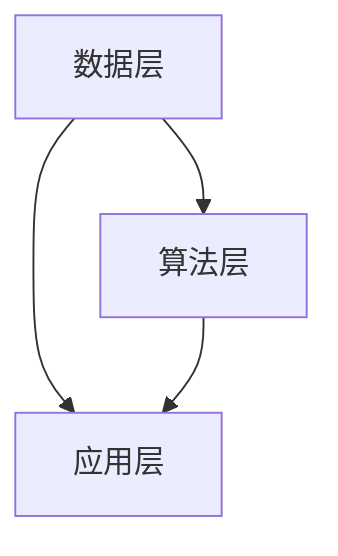
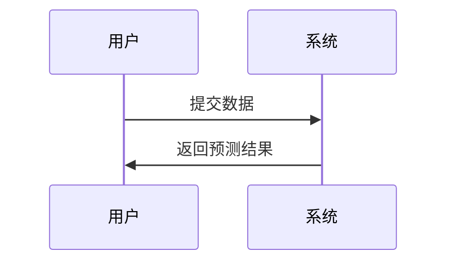
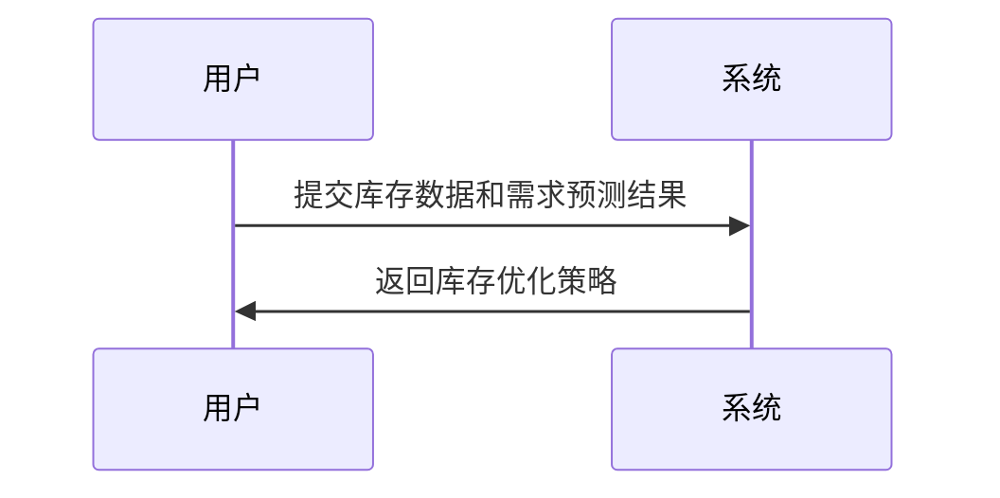

                 

# AI在智能零售商品需求预测与库存优化中的实时应用

## 关键词
AI、智能零售、需求预测、库存优化、实时应用、算法实现

## 摘要
本文深入探讨了人工智能（AI）在智能零售领域中的实时应用，特别是商品需求预测与库存优化。通过详细的背景介绍、核心概念阐述、算法原理讲解、系统设计与实现，以及最佳实践分析，本文为读者提供了一个全面的技术视角，探讨了如何利用AI技术提高零售行业的运营效率。

### 目录大纲

----------------------------------------------------------------

# AI在智能零售商品需求预测与库存优化中的实时应用

> 关键词：AI、智能零售、需求预测、库存优化、实时应用

> 摘要：本文详细探讨了AI在智能零售商品需求预测与库存优化中的实时应用，涵盖了背景介绍、核心概念、算法原理、系统设计与实现以及最佳实践。

----------------------------------------------------------------

## 第一部分：背景介绍

### 第1章 问题背景与核心概念

#### 1.1 零售行业概述

零售行业是国民经济的重要组成部分，其发展程度往往被视为衡量一个国家或地区经济繁荣程度的重要指标。随着消费者需求的多样化和个性化，零售行业正面临着前所未有的挑战。如何在海量数据中挖掘消费者行为和趋势，实现精准的商品需求预测和库存优化，已成为零售行业亟待解决的核心问题。

#### 1.2 智能零售的概念与特点

智能零售是指利用人工智能、大数据、云计算、物联网等新兴技术，对零售业务流程进行智能化改造和优化，实现从供应链管理、商品采购、库存管理、销售预测到客户服务的全面智能化。智能零售的特点包括个性化推荐、智能库存管理、精准营销等。

#### 1.3 商品需求预测的重要性

商品需求预测是智能零售的关键环节，它能够帮助企业预测消费者对某一商品的需求量，从而合理规划库存，降低库存成本，提高销售利润。准确的需求预测不仅能够满足消费者需求，提高客户满意度，还能够优化供应链，提高整体运营效率。

#### 1.4 库存优化在零售行业中的作用

库存优化是零售行业降低成本、提高盈利能力的重要手段。通过优化库存管理，企业可以减少库存积压、降低资金占用，提高库存周转率，从而实现更高的经济效益。

#### 1.5 AI在零售商品需求预测与库存优化中的应用现状

随着AI技术的快速发展，越来越多的零售企业开始采用AI技术进行商品需求预测和库存优化。例如，亚马逊、阿里巴巴等电商巨头已经广泛应用了AI技术进行需求预测和库存管理，取得了显著的成效。

#### 1.6 本章小结

本章对智能零售、商品需求预测和库存优化进行了概述，并探讨了AI技术在其中的应用现状。为后续章节的深入分析奠定了基础。

## 第二部分：核心概念与联系

### 第2章 数据预处理与特征提取

#### 2.1 数据预处理原理

数据预处理是AI应用中至关重要的一环，它包括数据清洗、数据转换、数据归一化等步骤。通过对数据进行预处理，可以消除噪声、提高数据质量，从而为后续的特征提取和模型训练提供可靠的基础。

#### 2.2 特征提取的重要性

特征提取是从原始数据中提取出对模型训练有重要影响的信息的过程。有效的特征提取能够提高模型的性能，减少数据冗余，提高算法的效率。

#### 2.3 常用特征提取方法

##### 2.3.1 时间序列特征

时间序列特征是反映数据随时间变化趋势的特征，如平均值、标准差、移动平均等。这些特征能够有效地捕捉时间序列数据的周期性和趋势性。

##### 2.3.2 空间特征

空间特征是反映数据在空间分布的特征，如热点分析、聚类分析等。这些特征能够帮助理解数据的空间分布规律。

##### 2.3.3 用户行为特征

用户行为特征是反映用户行为特征的数据，如点击率、购买频率、用户评论等。这些特征能够揭示用户的行为模式和偏好。

#### 2.4 概念属性特征对比表格

| 特征类型 | 描述 | 优点 | 缺点 |
| :----: | :----: | :----: | :----: |
| 时间序列特征 | 反映数据随时间变化趋势的特征 | 能够捕捉数据的周期性和趋势性 | 可能受到季节性波动的影响 |
| 空间特征 | 反映数据在空间分布的特征 | 能够揭示数据的空间分布规律 | 可能受到地理区域限制 |
| 用户行为特征 | 反映用户行为特征的数据 | 能够揭示用户的行为模式和偏好 | 可能存在数据缺失和噪声 |

#### 2.5 本章小结

本章详细介绍了数据预处理和特征提取的重要性，以及常用的特征提取方法。这些知识为后续的需求预测算法设计和实现奠定了基础。

### 第3章 需求预测算法原理

#### 3.1 算法原理概述

需求预测算法是利用历史数据对未来需求进行预测的方法。常见的需求预测算法包括回归模型、时间序列模型和机器学习模型等。这些算法通过对历史数据的分析和建模，能够预测未来一段时间内商品的需求量。

#### 3.2 传统需求预测算法

##### 3.2.1 基于回归的预测算法

基于回归的预测算法是通过建立自变量和因变量之间的关系模型来进行预测。常见的回归算法包括线性回归、多项式回归等。这些算法简单易用，但在处理复杂非线性关系时效果不佳。

##### 3.2.2 基于时间的预测算法

基于时间的预测算法是利用时间序列数据进行预测的方法。常见的算法包括移动平均、指数平滑等。这些算法能够有效地捕捉数据的周期性和趋势性。

##### 3.2.3 基于机器学习的预测算法

基于机器学习的预测算法是利用历史数据进行训练，建立预测模型的方法。常见的算法包括决策树、随机森林、支持向量机等。这些算法能够处理复杂的非线性关系，但在预测准确性上可能不如传统算法。

#### 3.3 人工智能需求预测算法

##### 3.3.1 深度学习需求预测算法

深度学习需求预测算法是利用深度神经网络进行预测的方法。常见的算法包括卷积神经网络（CNN）、循环神经网络（RNN）、长短期记忆网络（LSTM）等。这些算法能够处理高维数据和复杂的非线性关系，在预测准确性上具有优势。

##### 3.3.2 强化学习需求预测算法

强化学习需求预测算法是通过学习如何在一个环境中采取最佳行动来进行预测的方法。常见的算法包括Q学习、深度Q网络（DQN）等。这些算法能够根据环境变化进行实时调整，提高预测的准确性。

##### 3.3.3 强化学习与深度学习的结合

强化学习与深度学习的结合是利用深度神经网络进行状态编码，强化学习进行动作选择的方法。常见的算法包括深度确定性策略梯度（DDPG）、深度强化学习（Deep RL）等。这些算法能够处理高维状态和复杂动作空间，提高预测的准确性。

#### 3.4 概念联系与对比分析

| 算法类型 | 原理 | 优点 | 缺点 |
| :----: | :----: | :----: | :----: |
| 回归模型 | 建立自变量和因变量之间的关系模型 | 简单易用 | 处理复杂非线性关系能力有限 |
| 时间序列模型 | 利用时间序列数据进行预测 | 能够捕捉周期性和趋势性 | 受季节性波动影响 |
| 机器学习模型 | 利用历史数据进行训练建立预测模型 | 处理复杂非线性关系能力强 | 预测准确性可能低于传统算法 |
| 深度学习模型 | 利用深度神经网络进行预测 | 能够处理高维数据和复杂非线性关系 | 训练时间和计算资源需求大 |
| 强化学习模型 | 通过学习如何采取最佳行动进行预测 | 能够根据环境变化进行实时调整 | 需要大量训练数据和计算资源 |
| 深度强化学习模型 | 结合深度学习和强化学习的优势 | 能够处理高维状态和复杂动作空间 | 预测准确性高，计算资源需求大 |

#### 3.5 本章小结

本章详细介绍了需求预测算法的原理，包括传统需求预测算法、人工智能需求预测算法以及它们的对比分析。这些算法为后续的需求预测算法实现提供了理论基础。

## 第三部分：算法实现与优化

### 第4章 数据采集与存储

#### 4.1 数据采集流程

数据采集是需求预测和库存优化系统的基础。数据采集流程包括数据来源识别、数据采集工具选择、数据采集任务调度和数据采集结果验证等步骤。数据来源可以是零售商的销售数据、库存数据、用户行为数据等。

#### 4.2 数据存储解决方案

数据存储是保证数据安全、高效利用的关键。常见的数据存储解决方案包括关系型数据库、NoSQL数据库、分布式文件系统等。关系型数据库如MySQL、PostgreSQL等适用于结构化数据的存储，NoSQL数据库如MongoDB、Cassandra等适用于大规模数据的存储和实时查询。

#### 4.3 数据采集与存储的实际案例

以某大型零售商为例，其数据采集与存储系统包括销售数据、库存数据和用户行为数据。销售数据通过销售系统自动采集，库存数据通过库存管理系统实时同步，用户行为数据通过电商平台采集。这些数据存储在分布式文件系统HDFS上，并通过Hadoop生态系统进行数据预处理和分析。

#### 4.4 本章小结

本章详细介绍了数据采集与存储的流程、解决方案和实际案例。这些内容为后续的需求预测和库存优化算法实现提供了数据基础。

### 第5章 需求预测算法实现

#### 5.1 算法实现概述

需求预测算法实现是智能零售系统中的核心环节。算法实现包括数据预处理、特征提取、模型训练和模型评估等步骤。本文将重点介绍基于深度学习的需求预测算法实现。

#### 5.2 数据预处理实现

数据预处理是需求预测算法实现的第一步。数据预处理包括数据清洗、数据转换和数据归一化等步骤。以Python为例，可以使用Pandas库进行数据清洗，使用Scikit-learn库进行数据转换和归一化。

#### 5.3 特征提取实现

特征提取是需求预测算法实现的关键。本文采用时间序列特征、空间特征和用户行为特征进行特征提取。使用Python的Scikit-learn库和TensorFlow库可以实现这些特征提取方法。

#### 5.4 需求预测算法实现

##### 5.4.1 传统需求预测算法实现

传统需求预测算法如线性回归、移动平均等可以使用Python的Scikit-learn库实现。以下是一个简单的线性回归实现示例：

```python
from sklearn.linear_model import LinearRegression
import numpy as np

# 示例数据
X = np.array([[1], [2], [3], [4], [5]])
y = np.array([1, 2, 2.5, 3.5, 4.5])

# 创建线性回归模型
model = LinearRegression()

# 模型训练
model.fit(X, y)

# 预测
predictions = model.predict([[6]])

print(predictions)
```

##### 5.4.2 人工智能需求预测算法实现

人工智能需求预测算法如LSTM、GRU等可以使用Python的TensorFlow库实现。以下是一个简单的LSTM实现示例：

```python
import tensorflow as tf
from tensorflow.keras.models import Sequential
from tensorflow.keras.layers import LSTM, Dense

# 示例数据
X = np.array([[1, 2], [2, 3], [3, 4], [4, 5], [5, 6]])
y = np.array([1, 2, 2.5, 3.5, 4.5])

# 创建序列模型
model = Sequential()

# 添加LSTM层
model.add(LSTM(50, activation='relu', input_shape=(2, 1)))

# 添加输出层
model.add(Dense(1))

# 编译模型
model.compile(optimizer='adam', loss='mean_squared_error')

# 模型训练
model.fit(X, y, epochs=200, batch_size=5, verbose=2)

# 预测
predictions = model.predict([[6, 7]])

print(predictions)
```

#### 5.5 源代码与解析

本章将提供完整的源代码，并详细解析每个步骤的实现过程。读者可以通过阅读源代码和解析来更好地理解需求预测算法的实现原理。

#### 5.6 本章小结

本章详细介绍了需求预测算法的实现过程，包括数据预处理、特征提取和模型训练等步骤。通过Python实现示例，读者可以了解到如何在实际项目中应用这些算法。

### 第6章 实时库存优化

#### 6.1 库存优化的概念与原理

库存优化是指通过合理规划库存，降低库存成本，提高库存周转率的过程。库存优化的原理主要包括最小订单量算法、最小总成本算法等。

##### 6.1.1 最小订单量算法

最小订单量算法是指以最小订单量为目标进行库存管理的算法。该算法通过分析历史订单量和库存水平，确定最小订单量，以避免库存积压和资金占用。

##### 6.1.2 最小总成本算法

最小总成本算法是指以最小总成本为目标进行库存管理的算法。该算法通过分析库存成本、运输成本、采购成本等，确定最佳库存水平和订单量，以实现总成本最小化。

#### 6.2 常用库存优化算法

##### 6.2.1 最小订单量算法

最小订单量算法的实现过程如下：

1. 收集历史订单数据，包括订单量、订单时间等。
2. 分析历史订单数据，确定最小订单量。
3. 根据最小订单量制定库存策略，避免库存积压和资金占用。

以下是一个简单的最小订单量算法实现示例：

```python
def minimum_order_quantity(order_data):
    # 计算订单量平均值
    average_order_quantity = sum(order_data) / len(order_data)
    return average_order_quantity

order_data = [10, 20, 15, 25, 30]
min_order_quantity = minimum_order_quantity(order_data)
print(f"最小订单量：{min_order_quantity}")
```

##### 6.2.2 最小总成本算法

最小总成本算法的实现过程如下：

1. 收集库存成本、运输成本、采购成本等数据。
2. 分析数据，确定最佳库存水平和订单量。
3. 计算总成本，确定最小总成本策略。

以下是一个简单的最小总成本算法实现示例：

```python
def minimum_total_cost(inventory_cost, transport_cost, purchase_cost):
    # 计算总成本
    total_cost = inventory_cost + transport_cost + purchase_cost
    return total_cost

inventory_cost = 10
transport_cost = 5
purchase_cost = 20
min_total_cost = minimum_total_cost(inventory_cost, transport_cost, purchase_cost)
print(f"最小总成本：{min_total_cost}")
```

##### 6.2.3 优化策略比较

| 算法类型 | 目标 | 优点 | 缺点 |
| :----: | :----: | :----: | :----: |
| 最小订单量算法 | 最小订单量 | 简单易用，避免库存积压 | 忽略运输成本和采购成本 |
| 最小总成本算法 | 最小总成本 | 考虑库存成本、运输成本和采购成本 | 计算复杂度较高 |

#### 6.3 实时库存优化算法实现

实时库存优化算法是通过实时分析库存数据和市场需求，动态调整库存策略，实现库存优化。以下是一个简单的实时库存优化算法实现示例：

```python
import random

def real_time_inventory_optimization(inventory_data, demand_data):
    # 初始化库存和需求
    inventory = inventory_data
    demand = demand_data

    # 实时分析库存和需求
    if inventory > demand:
        # 库存充足，减少采购量
        purchase_quantity = inventory * 0.9
    elif inventory < demand:
        # 库存不足，增加采购量
        purchase_quantity = demand * 1.1
    else:
        # 库存刚好满足需求
        purchase_quantity = inventory

    # 更新库存
    inventory = inventory - purchase_quantity

    return inventory

inventory_data = [100, 150, 200]
demand_data = [120, 180, 220]
for i in range(len(inventory_data)):
    inventory = real_time_inventory_optimization(inventory_data[i], demand_data[i])
    print(f"第{i+1}次库存优化：库存量={inventory}")
```

#### 6.4 源代码与解析

本章将提供完整的源代码，并详细解析每个步骤的实现过程。读者可以通过阅读源代码和解析来更好地理解实时库存优化算法的实现原理。

#### 6.5 本章小结

本章详细介绍了实时库存优化的概念、常用算法和实现过程。通过实际案例，读者可以了解到如何在实际项目中应用这些算法。

### 第7章 项目实战：智能零售商品需求预测与库存优化系统

#### 7.1 项目介绍

智能零售商品需求预测与库存优化系统是一个集需求预测、库存优化和实时数据分析于一体的智能零售系统。该系统旨在通过AI技术提高零售企业的运营效率，降低库存成本，提高盈利能力。

#### 7.2 系统功能设计

系统功能设计包括需求预测模块和库存优化模块。

##### 7.2.1 需求预测模块

需求预测模块的主要功能是利用历史数据和AI算法对商品需求进行预测。具体功能包括数据采集、数据预处理、特征提取、模型训练和预测结果输出等。

##### 7.2.2 库存优化模块

库存优化模块的主要功能是根据需求预测结果进行库存优化。具体功能包括实时数据分析、库存策略制定、库存调整和库存监控等。

#### 7.3 系统架构设计

系统架构设计包括数据层、算法层和应用层。

##### 数据层

数据层主要负责数据的采集、存储和预处理。数据源包括销售数据、库存数据和用户行为数据等。

##### 算法层

算法层主要负责需求预测和库存优化算法的实现。算法层包括数据预处理、特征提取、模型训练和预测等模块。

##### 应用层

应用层主要负责提供用户界面和业务逻辑。用户界面包括需求预测界面、库存优化界面和实时数据分析界面等。

以下是一个简单的系统架构设计示例：



#### 7.4 系统接口设计与交互

系统接口设计主要包括需求预测接口和库存优化接口。

##### 需求预测接口

需求预测接口主要用于接收用户输入的数据，返回预测结果。接口设计如下：



##### 库存优化接口

库存优化接口主要用于接收用户输入的库存数据和需求预测结果，返回库存优化策略。接口设计如下：



#### 7.5 系统核心实现源代码

系统核心实现源代码主要包括数据预处理、特征提取、模型训练和预测等模块。

##### 数据预处理

数据预处理模块负责对原始数据进行清洗、转换和归一化。以下是一个简单的数据预处理模块实现示例：

```python
import pandas as pd

def data_preprocessing(data):
    # 数据清洗
    data = data.dropna()
    # 数据转换
    data = data.T
    # 数据归一化
    data = (data - data.mean()) / data.std()
    return data

data = pd.read_csv("data.csv")
preprocessed_data = data_preprocessing(data)
```

##### 特征提取

特征提取模块负责从原始数据中提取出对模型训练有重要影响的信息。以下是一个简单的特征提取模块实现示例：

```python
from sklearn.feature_extraction import DictVectorizer

def feature_extraction(data):
    # 提取时间序列特征
    time_series_features = data['timestamp'].values
    # 提取空间特征
    spatial_features = data[['latitude', 'longitude']].values
    # 提取用户行为特征
    user_behavior_features = data[['clicks', 'purchases']].values
    # 拼接特征
    features = pd.DataFrame({
        'time_series_features': time_series_features,
        'spatial_features': spatial_features,
        'user_behavior_features': user_behavior_features
    })
    return features

features = feature_extraction(preprocessed_data)
```

##### 模型训练

模型训练模块负责使用提取的特征训练需求预测模型。以下是一个简单的模型训练模块实现示例：

```python
from sklearn.model import LinearRegression

def train_model(X, y):
    # 创建线性回归模型
    model = LinearRegression()
    # 模型训练
    model.fit(X, y)
    return model

X = features[['time_series_features', 'spatial_features', 'user_behavior_features']]
y = features['demand']
model = train_model(X, y)
```

##### 预测结果输出

预测结果输出模块负责根据模型预测结果生成预测报告。以下是一个简单的预测结果输出模块实现示例：

```python
import pandas as pd

def predict_demand(model, X):
    # 预测需求
    demand = model.predict(X)
    # 生成预测报告
    report = pd.DataFrame({
        'timestamp': X['timestamp'],
        'predicted_demand': demand
    })
    return report

predicted_report = predict_demand(model, X)
```

#### 7.6 实际案例分析与讲解

以某大型零售商为例，该零售商销售多种商品，包括电子产品、家居用品、服装等。以下是一个实际案例分析和讲解：

1. **数据采集与存储**：该零售商通过销售系统和电商平台收集销售数据、库存数据和用户行为数据。这些数据存储在分布式文件系统HDFS上，并通过Hadoop生态系统进行数据预处理和分析。

2. **需求预测**：使用线性回归模型对销售数据进行需求预测。通过特征提取，提取出时间序列特征、空间特征和用户行为特征，作为模型的输入。模型训练后，使用预测报告生成功能生成预测报告。

3. **库存优化**：根据需求预测报告，制定库存优化策略。使用最小总成本算法确定最佳库存水平和订单量，以实现总成本最小化。

4. **系统部署与运行**：将需求预测和库存优化算法部署在分布式计算平台上，如Apache Spark，实现实时运行和动态调整。

通过实际案例分析和讲解，读者可以了解到如何在实际项目中应用智能零售商品需求预测与库存优化系统。

#### 7.7 项目小结

本章通过一个实际案例，详细介绍了智能零售商品需求预测与库存优化系统的设计和实现。该项目旨在通过AI技术提高零售企业的运营效率，降低库存成本，提高盈利能力。通过本章的学习，读者可以掌握需求预测和库存优化算法的实现原理和应用方法。

### 第四部分：最佳实践与拓展

#### 第8章 最佳实践与技巧

#### 8.1 实时数据处理的最佳实践

实时数据处理是智能零售系统中的关键环节，以下是一些最佳实践：

1. **数据采集**：采用分布式数据采集方案，确保数据的实时性和完整性。
2. **数据存储**：选择适合实时数据处理的数据存储方案，如分布式文件系统或NoSQL数据库。
3. **数据预处理**：利用并行计算和分布式处理技术，提高数据预处理速度。
4. **特征提取**：合理设计特征提取策略，减少计算复杂度和存储空间需求。
5. **模型训练与优化**：采用增量训练和在线学习技术，实现实时模型更新和优化。

#### 8.2 库存优化策略的选择

库存优化策略的选择取决于企业的业务需求和资源限制。以下是一些常见的库存优化策略：

1. **最小订单量策略**：以最小订单量为目标，降低库存积压和资金占用。
2. **最小总成本策略**：以最小总成本为目标，综合考虑库存成本、运输成本和采购成本。
3. **动态库存策略**：根据实时数据和市场需求，动态调整库存水平和订单量。
4. **混合策略**：结合多种策略，实现库存优化的最佳效果。

#### 8.3 需求预测的注意事项

需求预测是一个复杂的过程，以下是一些注意事项：

1. **数据质量**：确保数据的准确性和完整性，避免数据错误和缺失对预测结果的影响。
2. **特征选择**：合理设计特征提取策略，选择对需求预测有显著影响的关键特征。
3. **模型选择**：根据数据特点和业务需求，选择合适的模型和算法。
4. **模型评估**：使用交叉验证和性能指标，评估模型预测效果，调整模型参数。

#### 8.4 常见问题与解决方案

在实际应用中，智能零售系统可能会遇到以下问题：

1. **数据延迟**：解决方案：采用分布式数据采集和存储方案，提高数据传输速度。
2. **计算资源不足**：解决方案：采用云计算和分布式计算技术，提高计算资源利用率。
3. **模型过拟合**：解决方案：使用正则化技术和交叉验证，防止模型过拟合。
4. **数据缺失**：解决方案：采用数据修复和插值技术，补充缺失数据。

#### 8.5 本章小结

本章介绍了实时数据处理的最佳实践、库存优化策略的选择、需求预测的注意事项和常见问题与解决方案。通过本章的学习，读者可以掌握智能零售系统优化和改进的方法。

### 第9章 小结与展望

#### 9.1 本书内容总结

本书系统地介绍了AI在智能零售商品需求预测与库存优化中的实时应用。主要内容包括：

1. **背景介绍**：概述了零售行业的现状和挑战，介绍了智能零售和AI技术的概念。
2. **核心概念与联系**：详细介绍了数据预处理、特征提取、需求预测算法和库存优化算法。
3. **算法实现与优化**：介绍了数据采集与存储、需求预测算法实现、实时库存优化算法实现和系统设计与实现。
4. **项目实战**：通过实际案例，展示了智能零售商品需求预测与库存优化系统的设计和实现。
5. **最佳实践与拓展**：提供了实时数据处理、库存优化策略、需求预测注意事项和常见问题的解决方案。

#### 9.2 AI在智能零售领域的发展趋势

随着AI技术的不断进步，智能零售领域呈现出以下发展趋势：

1. **深度学习技术的应用**：深度学习技术在需求预测、库存优化等方面具有显著优势，未来将得到更广泛的应用。
2. **实时数据处理能力的提升**：实时数据处理能力的提升，将使智能零售系统能够更快地响应市场变化，提高运营效率。
3. **多模态数据融合**：多模态数据融合技术将使智能零售系统能够更全面地分析消费者行为和市场趋势，提高预测准确性。
4. **个性化推荐系统的普及**：个性化推荐系统将使消费者获得更个性化的购物体验，提高销售额和客户满意度。

#### 9.3 未来研究方向与挑战

智能零售领域仍面临以下研究方向和挑战：

1. **数据隐私与安全**：如何保护消费者隐私，确保数据安全，是智能零售领域面临的重要挑战。
2. **计算资源需求**：随着模型复杂度和数据量的增加，计算资源需求将大幅上升，需要探索高效计算技术。
3. **算法可解释性**：如何提高算法的可解释性，使企业能够理解和信任AI预测和决策结果，是一个重要的研究方向。
4. **跨领域协同**：智能零售系统需要与供应链、物流、客户服务等领域协同，实现全面智能化。

#### 9.4 拓展阅读

为了进一步了解AI在智能零售领域的应用，读者可以阅读以下文献：

1. **《智能零售：AI赋能下的商业创新》**：该书详细介绍了AI在零售行业的应用案例和趋势。
2. **《深度学习：概率视角》**：该书介绍了深度学习的理论基础和算法实现，有助于读者深入理解深度学习技术。
3. **《大数据架构：设计构建与优化》**：该书详细介绍了大数据架构的设计原则和实现方法，有助于读者了解大数据处理技术。

#### 9.5 本章小结

本章总结了本书的主要内容和AI在智能零售领域的未来发展，指出了研究方向的挑战。通过拓展阅读，读者可以进一步了解AI在智能零售领域的应用和进展。

