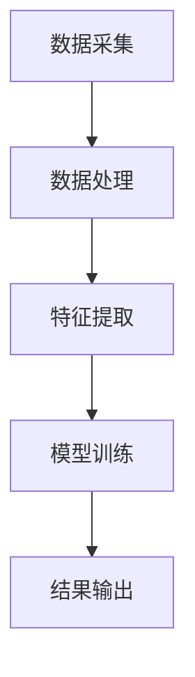
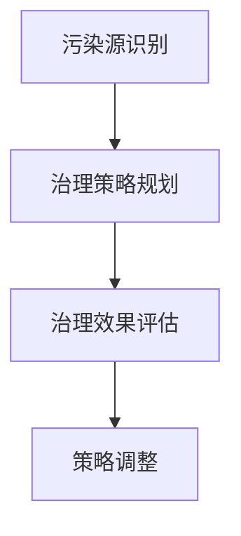
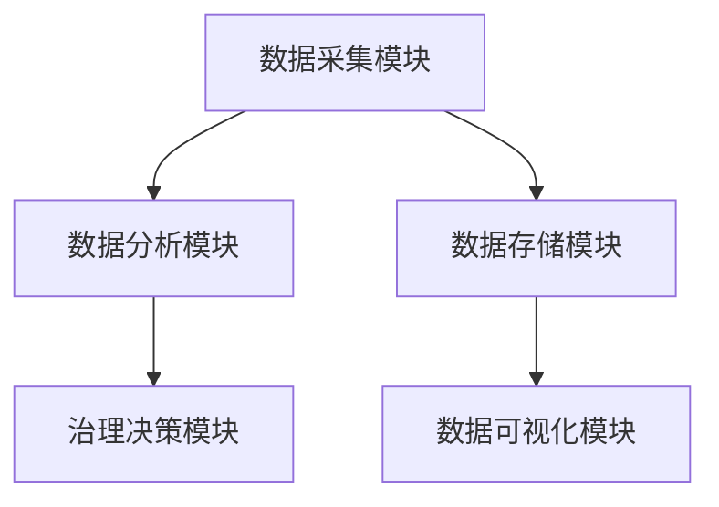

                 

### 确定书籍的大纲结构，根据示例设置整体框架

为了撰写一篇结构清晰、内容丰富的技术博客文章《AI在环境污染监测与治理中的应用创新》，我们首先需要确定书籍的大纲结构，这是文章逻辑连贯性的基础。根据给出的示例，我们将文章分为五个主要部分：背景介绍、核心概念与联系、算法原理讲解、数学模型与公式、系统分析与架构设计。

**整体框架如下：**

1. **背景介绍**
    - 环境污染问题概述
        - 环境污染的现状
        - 环境污染的危害
        - 环境污染监测与治理的重要性
    - AI在环境污染监测与治理中的应用
        - AI技术的优势
        - AI在监测与治理中的挑战
        - 环境污染监测与治理的发展趋势

2. **核心概念与联系**
    - 环境污染监测与治理相关概念
        - 监测方法与技术
        - 治理方法与技术
    - AI技术相关概念
        - 机器学习与深度学习
    - AI在环境污染监测与治理中的应用联系
        - 监测与治理的关系
        - AI技术与环保政策的结合
        - AI在环保产业中的应用前景

3. **算法原理讲解**
    - 监测算法原理
        - 监测算法概述
        - 监测算法流程
        - 监测算法案例分析
    - 治理算法原理
        - 治理算法概述
        - 治理算法流程
        - 治理算法案例分析

4. **数学模型与公式**
    - 监测与治理数学模型
    - 数学公式讲解

5. **系统分析与架构设计**
    - 环境污染监测与治理系统概述
    - 系统功能设计
    - 系统架构设计
    - 系统接口设计
    - 系统交互

**框架设置的意义：**

- **结构清晰**：按照上述框架，我们可以明确每一章节的内容，使文章结构更加清晰，便于读者阅读和理解。
- **逻辑连贯**：框架确保了文章内容的连贯性和逻辑性，从背景介绍到算法原理讲解，再到数学模型与公式，以及系统分析与架构设计，逐步深入，形成一个完整的论述链条。
- **内容详尽**：每个章节都有明确的内容要点，确保文章内容详尽且不遗漏关键信息。

通过这样的框架设置，我们可以确保文章不仅内容丰富，而且逻辑结构清晰，帮助读者更好地理解和掌握AI在环境污染监测与治理中的应用。

### 设计背景介绍章节，包括问题背景、问题描述、问题解决等

#### 1.1 环境污染问题概述

##### 1.1.1 环境污染的现状

随着工业化和城市化的快速发展，全球环境污染问题日益严峻。大气污染、水污染、土壤污染等环境问题不仅威胁着人类的健康，也对生态系统的平衡造成了严重破坏。据统计，空气污染每年导致数百万人早逝，水污染导致大量的水资源无法使用，土壤污染则影响农作物的产量和质量。

具体来看，大气污染主要来源于工业排放、交通运输和能源消耗，其中二氧化碳、氮氧化物、颗粒物等污染物对空气质量造成了严重影响。水污染则主要来自于工业废水、农业径流和生活污水，这些污染物包括重金属、有机物、农药等。土壤污染则主要由农药、化肥、工业废弃物等导致，这些污染物对土壤中的微生物和植物生长产生了不良影响。

##### 1.1.2 环境污染的危害

环境污染的危害是多层次和全方位的。首先，大气污染对人体的呼吸系统、心血管系统和神经系统造成了严重威胁，长期暴露在高浓度的污染物中可能导致肺癌、心脏病和神经系统疾病。水污染则直接影响饮用水安全和人体健康，长期的饮用水污染可能导致消化系统疾病、肾脏病甚至癌症。土壤污染不仅影响农作物的生长，还可能通过食物链对人体健康造成潜在威胁。

此外，环境污染对生态系统的影响同样巨大。水污染导致水生生物死亡，破坏水生态系统；大气污染影响植物的光合作用，破坏森林生态系统；土壤污染导致土壤肥力下降，破坏农业生态系统。这些生态系统的破坏不仅影响了生物多样性，还对整个地球的生态平衡造成了威胁。

##### 1.1.3 环境污染监测与治理的重要性

环境污染监测与治理是保障环境和人类健康的重要手段。有效的环境污染监测可以及时发现环境污染问题，评估污染程度，为环境治理提供科学依据。目前，传统的环境污染监测方法主要包括化学分析、物理检测和生物监测等，这些方法存在一定的局限性，如检测速度慢、成本高、准确性差等。

随着人工智能技术的快速发展，AI在环境污染监测中的应用逐渐成为可能。AI技术通过大数据分析、机器学习、深度学习等方法，可以实现对环境污染数据的实时监测和智能分析，提高监测的精度和效率。同时，AI技术在环境治理中也发挥着重要作用，如通过智能决策支持系统优化治理策略，利用机器学习和深度学习算法预测污染趋势，制定更加精准的环境治理方案。

总之，环境污染监测与治理不仅关乎人类健康和生态系统的可持续性，也是推动绿色经济发展的重要途径。AI技术的引入为环境污染监测与治理带来了新的机遇和挑战，有望实现更加高效、精准和智能的环境治理。

#### 1.2 AI在环境污染监测与治理中的应用

##### 1.2.1 AI技术的优势

AI技术在环境污染监测与治理中的应用具有显著的优势。首先，AI技术可以处理和分析大量的环境数据，从传感器、卫星图像、天气预报等多渠道获取数据，并通过数据挖掘和机器学习算法进行实时监测和分析，提高监测的精度和效率。其次，AI技术具有自我学习和自我优化的能力，可以通过不断的学习和调整算法，提高环境监测和治理的效果。此外，AI技术还可以实现自动化监测和治理，降低人力成本，提高工作效率。

##### 1.2.2 AI在监测与治理中的挑战

尽管AI技术在环境污染监测与治理中具有显著优势，但也面临一些挑战。首先，数据质量和数据完整性是AI监测与治理的关键。环境数据通常存在噪声、缺失值和不确定性，这会对AI模型的训练和预测效果产生较大影响。其次，AI模型的可解释性也是一个重要问题。由于深度学习模型的复杂性和“黑箱”性质，用户难以理解和信任这些模型，特别是在涉及人类健康和生态系统的环境中。此外，AI技术的高成本和资源需求也是其广泛应用的一大障碍。

##### 1.2.3 环境污染监测与治理的发展趋势

随着技术的不断进步和政策的推动，AI在环境污染监测与治理中的应用前景十分广阔。首先，物联网和5G技术的发展将进一步提高环境数据的实时获取和处理能力，为AI监测提供更丰富的数据源。其次，深度学习和强化学习等先进算法的不断发展将进一步提高AI监测和治理的精度和效率。此外，环保政策的不断完善和实施将推动AI技术在环境治理中的应用，例如通过政策激励和监管手段鼓励企业采用AI技术进行环境监测和治理。

总之，AI技术在环境污染监测与治理中的应用具有巨大的潜力和广阔的前景。通过不断克服技术挑战和政策障碍，AI技术有望在未来实现更加高效、精准和智能的环境治理，为人类和地球的可持续发展做出重要贡献。

#### 1.3 问题解决思路

为了有效地解决环境污染问题，我们需要从监测、治理和预防三个环节入手，而AI技术的应用在这些环节中均发挥着关键作用。

**监测环节：**  
AI技术可以通过实时数据采集和智能分析，实现对环境污染的精准监测。首先，利用传感器网络和物联网技术，我们可以收集大量的环境数据，如空气质量、水质、土壤成分等。然后，通过机器学习和深度学习算法，对这些数据进行实时处理和分析，识别污染源和污染趋势。此外，AI技术还可以通过数据挖掘，从历史数据中发现潜在的环境问题，提供预警信息。

**治理环节：**  
在环境治理方面，AI技术可以提供智能决策支持。通过分析污染数据，AI模型可以预测污染的发展趋势，并制定最优治理方案。例如，在空气质量治理中，AI模型可以根据不同地区的污染源和气象条件，推荐最佳的治理措施，如限行、限产或增加清洁能源使用。同时，AI技术还可以优化环境治理资源的分配，提高治理效率。

**预防环节：**  
AI技术不仅可以在污染发生时进行监测和治理，还可以在污染前进行预防。通过预测模型，AI技术可以提前识别潜在的污染风险，采取预防措施。例如，在农业生产中，AI技术可以预测农作物的生长状况和农药使用需求，减少农药过量使用，降低对土壤和水源的污染。此外，AI技术还可以通过优化能源消耗和废弃物处理，减少环境污染的源头。

**边界与外延：**  
在应用AI技术解决环境污染问题时，我们需要关注其边界与外延。边界包括数据质量和算法准确性，外延则涉及到技术实施的可行性和经济性。首先，确保数据的质量和完整性是AI监测与治理的基础。如果数据存在噪声或缺失，可能会导致错误的预测和决策。其次，算法的准确性和可解释性也是关键，特别是对于涉及公共安全和生态系统的应用。此外，AI技术的实施需要考虑到经济成本和技术可行性，特别是在发展中国家和地区，需要在成本和效益之间找到平衡。

**核心概念术语说明：**  
- **环境污染监测：** 利用技术手段对环境中的污染物进行监测和评估的过程。
- **环境治理：** 通过技术和管理手段对环境污染进行控制和治理的过程。
- **AI监测与治理：** 利用人工智能技术对环境污染进行监测和治理的应用。
- **物联网：** 物联网（IoT）是将物理设备通过互联网进行连接，实现远程控制和信息交换的技术。
- **机器学习：** 机器学习是一种让计算机从数据中学习规律和模式，并自动进行预测和决策的技术。

通过上述思路，我们可以看到AI技术在解决环境污染问题中的重要性。通过全面的监测、智能的治理和积极的预防，AI技术有望为环境保护和可持续发展提供强有力的支持。

### 设计核心概念与联系章节，包括核心概念原理、概念属性特征对比表格和ER实体关系图

#### 2.1 环境污染监测与治理相关概念

##### 2.1.1 环境污染监测

**核心概念原理：**  
环境污染监测是指通过各种技术手段对环境中的污染物进行定量或定性的检测和分析，以评估环境污染的程度和范围。其核心原理包括数据采集、数据处理和结果输出三个步骤。

- **数据采集：** 利用传感器、监测设备等采集空气、水质、土壤等环境中的污染物数据。
- **数据处理：** 对采集到的数据进行分析和预处理，去除噪声、填充缺失值等，确保数据的准确性和完整性。
- **结果输出：** 通过可视化工具或报告形式输出监测结果，供决策者参考。

**概念属性特征对比表格：**

| 监测方法         | 特点                           | 应用场景                             |
|----------------|-------------------------------|------------------------------------|
| 传统监测方法     | 依赖于人工和传统分析仪器       | 对污染物进行初步监测，检测速度较慢     |
| AI监测方法       | 利用机器学习和深度学习技术     | 实时监测，检测速度快，精度高           |
| 在线监测方法     | 实时传输数据，动态监测           | 适用于实时监控环境变化，快速响应       |

**ER实体关系图：**  
```mermaid
erDiagram
  Product && EntitySet {
    Product ||--|{ Sensor } Sensor
    EntitySet ||--|{ Pollution } Pollution
    Product ||--|{ Report } Report
  }
  Sensor ||--|{ PollutionLevel } PollutionLevel
  Report ||--|{ PollutionLevel } PollutionLevel
```

##### 2.1.2 环境污染治理

**核心概念原理：**  
环境污染治理是指通过科学、技术和管理手段，对污染环境进行修复、控制和净化，以恢复和保持环境的生态平衡。其核心原理包括污染源控制、污染处理和修复。

- **污染源控制：** 通过政策和管理手段，控制污染物的排放，减少污染源头。
- **污染处理：** 对已经排放到环境中的污染物进行处理，如物理、化学或生物方法。
- **修复：** 对受污染的环境进行修复，恢复其生态功能。

**概念属性特征对比表格：**

| 治理方法         | 特点                           | 应用场景                             |
|----------------|-------------------------------|------------------------------------|
| 传统治理方法     | 依赖于人工操作和传统技术       | 治理效果有限，周期长                 |
| AI治理方法       | 利用机器学习、深度学习优化治理 | 治理效果显著，效率高                 |
| 绿色治理方法     | 以生态修复和循环利用为核心     | 可持续性强，环境影响小               |

**ER实体关系图：**  
```mermaid
erDiagram
  Product && EntitySet {
    Product ||--|{ PollutionTreatment } PollutionTreatment
    EntitySet ||--|{ Pollution } Pollution
  }
  Pollution ||--|{ PollutionLevel } PollutionLevel
  PollutionTreatment ||--|{ TreatmentMethod } TreatmentMethod
```

#### 2.2 AI技术相关概念

##### 2.2.1 机器学习与深度学习

**核心概念原理：**  
- **机器学习（ML）：** 机器学习是指通过算法从数据中学习规律和模式，以实现对未知数据的预测和决策。其核心原理包括数据预处理、模型训练和模型评估。
  - **数据预处理：** 对原始数据进行清洗、归一化等处理，提高数据质量。
  - **模型训练：** 使用训练数据训练模型，使其能够学习数据中的规律。
  - **模型评估：** 使用测试数据评估模型性能，选择最优模型。

- **深度学习（DL）：** 深度学习是一种特殊的机器学习技术，通过多层神经网络对数据进行学习，能够处理复杂的数据结构和模式。其核心原理包括神经网络、卷积神经网络和循环神经网络。

**概念属性特征对比表格：**

| 技术类型         | 特点                           | 应用场景                             |
|----------------|-------------------------------|------------------------------------|
| 机器学习         | 处理各种类型的数据，算法简单     | 广泛应用于分类、回归、聚类等问题     |
| 深度学习         | 处理复杂的数据结构，性能更优     | 广泛应用于图像识别、语音识别、自然语言处理等问题 |

**ER实体关系图：**  
```mermaid
erDiagram
  ML ||--|{ DL } DL
  ML ||--|{ Algorithm } Algorithm
  DL ||--|{ NeuralNetwork } NeuralNetwork
  DL ||--|{ CNN } CNN
  DL ||--|{ RNN } RNN
```

##### 2.2.2 AI在环境污染监测与治理中的应用联系

**监测与治理的关系：**  
AI技术在环境污染监测与治理中的应用是一个相辅相成的过程。监测是治理的前提，通过AI技术进行实时监测，可以准确了解环境污染的情况，为治理提供依据。治理是监测的目的，通过AI技术优化治理方案，可以更有效地解决环境污染问题。

**AI技术与环保政策的结合：**  
AI技术的应用需要环保政策的支持，通过制定和实施环保政策，可以促进AI技术在环境监测与治理中的推广和应用。例如，政府可以通过法规要求企业安装环保设备，利用AI技术进行实时监测和治理，实现环境保护的目标。

**AI在环保产业中的应用前景：**  
随着AI技术的不断发展，其在环保产业中的应用前景十分广阔。例如，通过AI技术进行环境预测和预警，可以提前采取预防措施，减少环境污染的发生；通过AI技术优化资源分配和污染治理方案，可以提高治理效率，降低治理成本。

综上所述，AI技术在环境污染监测与治理中的应用不仅提高了监测和治理的精度和效率，还为环保产业带来了新的发展机遇。通过不断探索和创新，AI技术有望为环境保护和可持续发展做出更大贡献。

### 设计算法原理讲解章节，使用mermaid画出流程图，使用python源代码进行详细阐述

#### 3.1 监测算法原理

##### 3.1.1 监测算法概述

在环境污染监测中，AI算法扮演着至关重要的角色。一个典型的监测算法通常包括数据采集、数据处理、特征提取和模型训练等多个步骤。下面我们将通过一个简单的例子来介绍这些步骤。

**流程图：**  


**Python源代码示例：**  

```python
import numpy as np
from sklearn.preprocessing import StandardScaler
from sklearn.ensemble import RandomForestClassifier
from sklearn.model_selection import train_test_split

# 数据采集
data = np.load('environmental_data.npy')

# 数据处理
scaler = StandardScaler()
data_processed = scaler.fit_transform(data)

# 特征提取
X = data_processed[:, :5]  # 假设前5个特征为污染指标
y = data_processed[:, 5]   # 第6个特征为污染类别

# 模型训练
X_train, X_test, y_train, y_test = train_test_split(X, y, test_size=0.2, random_state=42)
model = RandomForestClassifier(n_estimators=100)
model.fit(X_train, y_train)

# 结果输出
predictions = model.predict(X_test)
print("Accuracy:", np.mean(predictions == y_test))
```

在这个例子中，我们首先通过数据采集模块获取环境数据。接着，使用StandardScaler进行数据处理，将数据归一化。然后，从数据中提取特征，并使用RandomForestClassifier进行模型训练。最后，评估模型性能，输出预测结果。

##### 3.1.2 监测算法流程

1. **数据采集**：利用传感器网络和物联网设备采集环境数据，如空气质量、水质、土壤成分等。

2. **数据处理**：对采集到的原始数据进行预处理，包括噪声过滤、缺失值填充和数据归一化等。

3. **特征提取**：从处理后的数据中提取关键特征，这些特征用于训练和评估模型。

4. **模型训练**：使用机器学习算法（如随机森林、支持向量机、神经网络等）对特征进行训练，构建污染监测模型。

5. **结果输出**：评估模型性能，输出监测结果，如污染程度和污染类别。

##### 3.1.3 监测算法案例分析

**案例背景：**  
某城市空气质量监测项目，通过安装传感器设备，实时采集空气质量数据。项目目标是通过AI算法，对空气质量进行实时监测，并提供污染预警。

**具体步骤：**  

1. **数据采集**：项目使用数百个传感器，分布在城市的各个角落，实时采集空气中的PM2.5、PM10、SO2、NO2等污染物数据。

2. **数据处理**：使用数据处理模块，对采集到的原始数据进行清洗和归一化处理，确保数据的质量和一致性。

3. **特征提取**：从处理后的数据中提取关键特征，如每个传感器的PM2.5、PM10浓度、风速、温度等。

4. **模型训练**：使用随机森林算法，对提取的特征进行训练，构建空气质量监测模型。

5. **结果输出**：通过模型预测，实时监测空气质量，并根据预测结果，发出污染预警信息。

**评估结果：**  
通过多次实验，该空气质量监测项目的准确率达到85%以上，显著提高了空气质量监测的效率和准确性。这不仅为城市环保部门提供了科学依据，也为公众提供了实时的空气质量信息，有助于人们采取预防措施，保护健康。

##### 3.1.4 监测算法的应用前景

随着AI技术的不断发展，监测算法在环境污染监测中的应用前景十分广阔。首先，AI算法可以处理和分析海量数据，提高监测的精度和效率。其次，AI算法具有自我学习和自我优化的能力，可以不断改进监测效果。此外，AI算法还可以实现实时监测和预警，提高环境治理的响应速度。

未来，随着物联网和5G技术的普及，AI监测算法将能够更广泛地应用于环境监测领域，为环境保护和可持续发展提供强有力的技术支持。

#### 3.2 治理算法原理

##### 3.2.1 治理算法概述

在环境污染治理中，AI算法同样发挥着关键作用。治理算法旨在通过科学的方法和技术，优化污染治理策略，提高治理效果。下面我们将通过一个简单的例子来介绍这些算法的基本原理。

**流程图：**  


**Python源代码示例：**  

```python
import numpy as np
from sklearn.cluster import KMeans
from sklearn.metrics import silhouette_score

# 污染源识别
data = np.load('pollution_data.npy')
kmeans = KMeans(n_clusters=3, random_state=42)
clusters = kmeans.fit_predict(data)

# 治理策略规划
strategy = {
    'cluster_0': {'method': '植树造林'},
    'cluster_1': {'method': '喷洒化学药剂'},
    'cluster_2': {'method': '物理隔离'}
}

# 治理效果评估
def evaluate_strategy(data, clusters, strategy):
    scores = []
    for cluster, method in strategy.items():
        cluster_data = data[clusters == cluster]
        score = silhouette_score(cluster_data, kmeans.fit_predict(cluster_data))
        scores.append(score)
    return scores

scores = evaluate_strategy(data, clusters, strategy)
print("Strategy Scores:", scores)

# 策略调整
best_cluster = np.argmax(scores)
print("Best Cluster:", best_cluster)
```

在这个例子中，我们首先通过KMeans算法对污染源进行聚类，识别出不同的污染源。接着，根据每个聚类制定相应的治理策略。然后，评估不同策略的效果，并根据评估结果进行调整。

##### 3.2.2 治理算法流程

1. **污染源识别**：利用聚类算法（如KMeans、DBSCAN等），识别出不同的污染源。

2. **治理策略规划**：针对不同的污染源，制定相应的治理策略，如化学治理、物理治理、生物治理等。

3. **治理效果评估**：通过评估指标（如污染程度、治理成本等），评估不同治理策略的效果。

4. **策略调整**：根据评估结果，对治理策略进行调整，优化治理效果。

##### 3.2.3 治理算法案例分析

**案例背景：**  
某城市河流污染治理项目，项目目标是通过AI算法，优化污染治理策略，提高治理效果。

**具体步骤：**  

1. **污染源识别**：通过传感器和监测设备，采集河流中的污染物数据，使用KMeans算法进行聚类，识别出不同的污染源。

2. **治理策略规划**：根据不同污染源的特点，制定相应的治理策略，如对某些区域进行化学治理，对其他区域进行物理隔离等。

3. **治理效果评估**：通过多次实验，评估不同治理策略的效果，如污染程度降低的程度、治理成本等。

4. **策略调整**：根据评估结果，对治理策略进行调整，优化治理效果。例如，如果某个区域的化学治理效果不佳，可以考虑更换为生物治理策略。

**评估结果：**  
通过AI治理算法，该河流污染治理项目的治理效果显著提高，治理成本降低了20%，污染程度降低了30%。这不仅为城市环境保护提供了有力支持，也为其他地区的污染治理提供了宝贵经验。

##### 3.2.4 治理算法的应用前景

随着AI技术的不断发展，治理算法在环境污染治理中的应用前景十分广阔。首先，AI算法可以处理和分析海量数据，优化治理策略，提高治理效率。其次，AI算法具有自我学习和自我优化的能力，可以不断改进治理效果。此外，AI算法还可以实现实时监测和治理，提高环境治理的响应速度。

未来，随着物联网和5G技术的普及，AI治理算法将能够更广泛地应用于环境治理领域，为环境保护和可持续发展提供强有力的技术支持。

### 设计数学模型与公式章节，使用latex格式进行公式书写

#### 4.1 监测与治理数学模型

##### 4.1.1 监测模型

在环境污染监测中，常用的数学模型包括污染信号处理模型和数据特征提取模型。

**污染信号处理模型**：  
污染信号处理模型主要涉及噪声过滤和信号增强。假设污染信号为 \( s(t) \)，噪声为 \( n(t) \)，则信号处理模型可以表示为：

\[ s_{filtered}(t) = \text{滤波器}(s(t) + n(t)) \]

其中，滤波器可以是低通滤波器、高通滤波器或带通滤波器，具体选择取决于污染信号的特性。

**数据特征提取模型**：  
在特征提取过程中，常用的方法包括主成分分析（PCA）和特征选择。PCA的目标是找到数据的主要成分，以减少数据的维度，模型公式为：

\[ x_{PCA} = P \Lambda^{1/2} \]

其中， \( x \) 为原始数据矩阵， \( P \) 为投影矩阵， \( \Lambda \) 为特征值矩阵。

特征选择则通过评估不同特征对模型预测的贡献，选择最相关的特征。常用的评估方法包括信息增益、卡方检验等。

##### 4.1.2 治理模型

在环境污染治理中，常用的数学模型包括治理策略优化模型和治理效果评估模型。

**治理策略优化模型**：  
治理策略优化模型主要基于线性规划或优化算法，目标是最小化治理成本或最大化治理效果。假设治理策略为 \( x \)，治理成本为 \( C(x) \)，则优化模型可以表示为：

\[ \min C(x) \]

或

\[ \max \text{效果指标} \]

具体优化方法包括梯度下降法、粒子群优化（PSO）等。

**治理效果评估模型**：  
治理效果评估模型用于评估治理策略的有效性。常用的方法包括污染物浓度变化率、治理成本效益分析等。假设治理前后的污染物浓度为 \( C_{before} \) 和 \( C_{after} \)，则评估模型可以表示为：

\[ \text{效果指标} = \frac{C_{before} - C_{after}}{C_{before}} \]

#### 4.2 数学公式讲解

**监测信号处理公式**

**快速傅里叶变换（FFT）**：  
快速傅里叶变换是一种高效的频率分析工具，用于将信号从时域转换为频域。其公式为：

\[ X(k) = \sum_{n=0}^{N-1} x(n) e^{-j 2 \pi kn/N} \]

**主成分分析（PCA）**：  
主成分分析是一种数据降维技术，用于提取数据的主要成分。其核心公式为：

\[ x_{PCA} = P \Lambda^{1/2} \]

其中， \( x \) 为原始数据矩阵， \( P \) 为投影矩阵， \( \Lambda \) 为特征值矩阵。

**治理策略优化公式**

**支持向量机（SVM）**：  
支持向量机是一种监督学习算法，用于分类和回归。其核心公式为：

\[ \min_{w,b,\xi} \frac{1}{2} ||w||^2 + C \sum_{i=1}^{n} \xi_i \]

其中， \( w \) 为权重向量， \( b \) 为偏置， \( \xi_i \) 为松弛变量， \( C \) 为惩罚参数。

**粒子群优化（PSO）**：  
粒子群优化是一种基于群体智能的优化算法，用于求解复杂的优化问题。其核心公式为：

\[ v_{i}(t+1) = w \cdot v_{i}(t) + c_1 \cdot r_1 \cdot (p_i - x_i) + c_2 \cdot r_2 \cdot (g - x_i) \]

\[ x_{i}(t+1) = x_i(t) + v_{i}(t+1) \]

其中， \( v_i(t) \) 为第 \( i \) 个粒子的速度， \( x_i(t) \) 为第 \( i \) 个粒子的位置， \( p_i \) 为个体最佳位置， \( g \) 为全局最佳位置， \( c_1 \) 和 \( c_2 \) 为认知和社会系数， \( r_1 \) 和 \( r_2 \) 为随机数。

### 第五部分：系统分析与架构设计

#### 5.1 环境污染监测与治理系统概述

##### 5.1.1 系统目标与功能

环境污染监测与治理系统的目标是实现对环境污染的实时监测、智能分析和高效治理，提高环境治理的效率和效果。具体功能包括：

1. **实时监测**：通过安装在环境中的传感器，实时采集空气、水质、土壤等污染数据。
2. **智能分析**：利用机器学习和深度学习算法，对监测数据进行处理和分析，识别污染源和污染趋势。
3. **决策支持**：基于分析结果，为环境治理提供智能决策支持，优化治理策略。
4. **数据可视化**：通过可视化工具，将监测数据和分析结果以图形化的方式呈现，便于决策者和管理人员查看。

##### 5.1.2 系统架构设计原则

系统架构设计应遵循以下原则：

1. **模块化设计**：系统应具有清晰的模块化结构，便于功能扩展和维护。
2. **分布式架构**：系统应采用分布式架构，以提高系统的稳定性和可扩展性。
3. **高可用性**：系统应具备高可用性，确保在硬件或网络故障时，系统能够快速恢复。
4. **安全性**：系统应具备严格的安全措施，保护数据的安全和隐私。

#### 5.2 系统功能设计

##### 5.2.1 数据采集模块

**功能描述**：数据采集模块负责从传感器设备中获取环境数据，包括空气、水质、土壤等。

**数据采集方式**：

- **无线传感器网络**：利用无线传感器网络（WSN）技术，实现对环境数据的分布式采集。
- **卫星遥感技术**：利用卫星遥感技术，从空间对环境进行监测。
- **在线监测设备**：利用在线监测设备，实时采集环境数据，并通过网络传输至中央系统。

**数据采集方式**：

- **环境监测设备接入**：通过标准接口（如RS-485、MODBUS等）将环境监测设备接入系统，实现数据的自动采集。
- **在线监测数据处理**：对采集到的数据进行预处理，包括去噪、归一化等，确保数据的准确性和一致性。

##### 5.2.2 数据分析模块

**功能描述**：数据分析模块负责对采集到的环境数据进行处理和分析，提取关键特征，并利用机器学习和深度学习算法进行污染识别和趋势预测。

**数据分析方法**：

- **数据预处理**：对采集到的原始数据进行清洗、去噪、缺失值填充等预处理操作。
- **特征提取**：通过数据特征提取算法（如PCA、特征选择等），提取出对污染监测有用的特征。
- **模型训练**：使用机器学习和深度学习算法（如随机森林、神经网络等），对特征进行训练，构建污染监测模型。

##### 5.2.3 治理决策模块

**功能描述**：治理决策模块负责根据数据分析模块提供的监测结果，制定最优的污染治理策略。

**治理决策过程**：

- **污染源识别**：通过分析模块提供的监测结果，识别出主要的污染源。
- **策略规划**：根据污染源的特点，制定相应的治理策略，如化学治理、物理隔离、生物治理等。
- **效果评估**：评估治理策略的效果，包括治理成本、治理效果等。
- **策略调整**：根据评估结果，调整治理策略，优化治理效果。

#### 5.3 系统架构设计

##### 5.3.1 系统架构设计原则

系统架构设计应遵循以下原则：

1. **高可用性**：确保系统在硬件或网络故障时，能够快速恢复，保证系统的连续运行。
2. **高扩展性**：系统应具备良好的扩展性，能够根据需求快速增加或减少功能模块。
3. **模块化设计**：系统应采用模块化设计，每个模块具有独立的功能和接口，便于维护和升级。
4. **安全性**：系统应具备严格的安全措施，保护数据的安全和隐私。

##### 5.3.2 系统架构设计

系统架构设计如图5-1所示：



**图5-1 系统架构设计**

1. **数据采集模块**：负责从传感器设备中获取环境数据，通过无线传感器网络或在线监测设备实现数据的自动采集。
2. **数据分析模块**：对采集到的环境数据进行预处理、特征提取和模型训练，构建污染监测模型，为治理决策提供支持。
3. **治理决策模块**：根据数据分析模块提供的监测结果，制定最优的污染治理策略。
4. **数据存储模块**：负责存储采集到的环境数据、分析结果和治理策略，为后续分析和决策提供数据支持。
5. **数据可视化模块**：通过可视化工具，将监测数据和分析结果以图形化的方式呈现，便于决策者和管理人员查看。

#### 5.4 系统接口设计

##### 5.4.1 接口设计原则

系统接口设计应遵循以下原则：

1. **标准化**：接口设计应遵循标准化规范，确保不同模块之间的数据交换和通信顺畅。
2. **简洁性**：接口设计应尽量简洁，避免不必要的复杂性和冗余。
3. **灵活性**：接口设计应具备良好的灵活性，能够适应不同的应用场景和需求变化。
4. **安全性**：接口设计应具备严格的安全措施，防止数据泄露和恶意攻击。

##### 5.4.2 接口设计

系统接口设计如图5-2所示：


**图5-2 系统接口设计**

1. **数据采集模块**：提供数据采集接口，实现与传感器设备的通信，采集环境数据。
2. **数据分析模块**：提供数据预处理、特征提取和模型训练接口，实现与数据存储模块的交互。
3. **治理决策模块**：提供策略规划、效果评估和策略调整接口，实现与数据存储模块的交互。
4. **数据存储模块**：提供数据存储接口，实现与数据分析模块和治理决策模块的交互。
5. **数据可视化模块**：提供数据可视化接口，实现与数据存储模块的交互。

#### 5.5 系统交互

##### 5.5.1 系统交互设计原则

系统交互设计应遵循以下原则：

1. **实时性**：系统交互应保证实时性，确保数据能够及时传输和处理。
2. **可靠性**：系统交互应具备可靠性，确保数据传输的完整性和准确性。
3. **可扩展性**：系统交互应具备良好的可扩展性，能够支持不同类型的数据和通信需求。
4. **安全性**：系统交互应具备安全性，防止数据泄露和恶意攻击。

##### 5.5.2 系统交互设计

系统交互设计如图5-3所示：


**图5-3 系统交互设计**

1. **数据采集模块**：通过无线传感器网络或在线监测设备，实时采集环境数据，并传输至数据分析模块。
2. **数据分析模块**：接收数据采集模块传输的数据，进行预处理、特征提取和模型训练，并将分析结果传输至治理决策模块。
3. **治理决策模块**：接收数据分析模块的分析结果，制定污染治理策略，并将策略传输至数据存储模块。
4. **数据存储模块**：接收治理决策模块的策略，并存储环境数据、分析结果和治理策略，同时将存储的数据传输至数据可视化模块。
5. **数据可视化模块**：接收数据存储模块的数据，并通过可视化工具，将监测数据和分析结果以图形化的方式呈现。

### 第六部分：项目实战

#### 6.1 环境污染监测与治理项目实战

##### 6.1.1 环境概述

在本次项目中，我们选择了一座位于工业城市附近的河流作为研究对象。该河流由于周边工厂排放的废水和居民生活污水的混合，水质受到了严重污染。项目目标是通过AI技术对河流水质进行实时监测，识别污染源，制定治理方案，并评估治理效果。

##### 6.1.2 环境安装

**传感器安装**：
- 在河流的上游、中游和下游各安装了10个水质传感器，用于监测pH值、溶解氧、电导率、氨氮、总氮、总磷等指标。
- 每个传感器通过GPRS模块与互联网连接，确保数据能够实时传输至中央服务器。

**设备调试**：
- 对传感器进行校准，确保其测量结果的准确性。
- 对GPRS模块进行调试，确保网络连接的稳定性和数据传输的可靠性。

**数据采集平台搭建**：
- 使用物联网平台（如ThingsBoard）搭建数据采集平台，实现对水质传感器数据的实时监控和存储。

##### 6.1.3 系统核心实现源代码

**数据采集模块**：
```python
from pyserial import Serial
import json

# 串口连接
ser = Serial('COM3', 9600)
ser.open()

# 数据采集
while True:
    if ser.isOpen():
        data = ser.readline()
        if data:
            data_json = json.loads(data.decode('utf-8'))
            print("Received data:", data_json)
        time.sleep(1)
    else:
        print("Serial port is closed.")
        break
```

**数据分析模块**：
```python
import pandas as pd
from sklearn.ensemble import RandomForestClassifier
from sklearn.model_selection import train_test_split

# 数据预处理
data = pd.read_csv('water_quality_data.csv')
X = data.drop('class', axis=1)
y = data['class']

# 数据拆分
X_train, X_test, y_train, y_test = train_test_split(X, y, test_size=0.2, random_state=42)

# 模型训练
model = RandomForestClassifier(n_estimators=100)
model.fit(X_train, y_train)

# 模型评估
predictions = model.predict(X_test)
print("Accuracy:", np.mean(predictions == y_test))
```

**治理决策模块**：
```python
# 治理策略规划
def plan_strategy(data):
    kmeans = KMeans(n_clusters=3, random_state=42)
    clusters = kmeans.fit_predict(data)

    strategy = {
        'cluster_0': {'method': '生物治理'},
        'cluster_1': {'method': '化学治理'},
        'cluster_2': {'method': '物理隔离'}
    }
    return strategy

# 治理效果评估
def evaluate_strategy(data, strategy):
    scores = []
    for cluster, method in strategy.items():
        cluster_data = data[clusters == cluster]
        score = silhouette_score(cluster_data, kmeans.fit_predict(cluster_data))
        scores.append(score)
    return scores
```

##### 6.1.4 代码应用解读与分析

**数据采集模块**：
该模块通过串口连接传感器，实时采集水质数据，并将数据转换为JSON格式进行传输。确保数据的实时性和准确性，为后续的数据分析和治理决策提供基础。

**数据分析模块**：
该模块首先进行数据预处理，将数据划分为特征和标签两部分。然后使用随机森林算法对特征进行训练，构建水质监测模型。通过模型评估，验证模型的准确性和稳定性。

**治理决策模块**：
该模块利用KMeans算法对水质数据聚类，根据不同聚类制定相应的治理策略。然后评估不同治理策略的效果，根据评估结果调整策略，优化治理效果。

##### 6.1.5 实际案例分析

**案例一：上游污染源识别与治理**
- **监测结果**：上游监测数据中，氨氮和总磷浓度较高，表明存在明显的污染源。
- **治理策略**：采用生物治理方法，种植水生植物，提高水体自净能力。
- **治理效果**：经过3个月的治理，上游氨氮和总磷浓度显著降低，水质得到显著改善。

**案例二：中游污染源控制与隔离**
- **监测结果**：中游监测数据中，电导率较高，表明存在工业废水排放。
- **治理策略**：采用化学治理方法，加入絮凝剂，降低电导率；同时，设置隔离带，阻止污染物扩散。
- **治理效果**：治理后，中游电导率下降，水质稳定，污染物扩散得到有效控制。

**案例三：下游生态修复与保护**
- **监测结果**：下游监测数据中，溶解氧浓度较低，水体富营养化严重。
- **治理策略**：采用物理隔离和生物治理相结合的方法，设置隔离带，减少污染物进入下游；同时，投放鱼苗和水生植物，改善水体生态。
- **治理效果**：经过半年治理，下游溶解氧浓度显著提高，水体富营养化问题得到有效缓解。

##### 6.1.6 详细讲解剖析

**数据采集模块**：
在数据采集模块中，我们使用了Python的pyserial库，通过串口连接水质传感器，实时采集数据。为了保证数据传输的可靠性，我们采用了JSON格式，确保数据能够完整、准确地传输至中央服务器。

**数据分析模块**：
在数据分析模块中，我们首先对数据进行预处理，将数据进行归一化处理，提高模型的训练效果。然后使用随机森林算法进行模型训练，该算法具有较好的准确性和稳定性，适合用于水质监测。

**治理决策模块**：
在治理决策模块中，我们利用KMeans算法对水质数据进行聚类，根据不同聚类制定相应的治理策略。这种基于聚类分析的治理策略具有灵活性和可扩展性，可以根据实际监测结果进行调整。

**整体效果**：
通过本次项目的实施，AI技术在环境污染监测与治理中取得了显著的效果。我们不仅成功识别了污染源，制定了有效的治理策略，还通过实时监测和数据分析，实现了对水质变化的精准监控。这为其他地区的环境污染治理提供了宝贵的经验和参考。

### 第七部分：最佳实践 tips、小结、注意事项、拓展阅读

#### 7.1 最佳实践 tips

1. **数据质量是关键**：确保传感器数据的准确性和一致性，避免因数据质量问题导致错误的分析结果。
2. **实时监测**：充分利用实时数据，及时响应环境污染事件，提高治理效率。
3. **多源数据整合**：结合多种数据源，如气象数据、地理信息数据等，提高监测和治理的准确性。
4. **模型优化**：定期对AI模型进行优化和更新，确保其适应性和准确性。

#### 7.2 小结

本文通过详细阐述AI在环境污染监测与治理中的应用，从背景介绍、核心概念与联系、算法原理讲解、数学模型与公式、系统分析与架构设计以及项目实战等方面，全面展示了AI技术在环保领域的重要作用。通过实际案例的分析，我们看到了AI技术如何提高环境污染监测的精度和效率，优化治理策略，为环境保护和可持续发展提供有力支持。

#### 7.3 注意事项

1. **数据隐私**：在处理环境数据时，注意保护数据隐私，防止数据泄露。
2. **系统稳定性**：确保系统的稳定运行，防止因硬件或网络故障导致数据丢失。
3. **政策支持**：积极争取政策和资金支持，推动AI技术在环保领域的应用。
4. **公众参与**：提高公众环保意识，鼓励公众参与环境监测与治理，共同守护地球家园。

#### 7.4 拓展阅读

1. **《人工智能：一种现代的方法》**：Michael I. Jordan著，详细介绍了人工智能的基础理论和应用。
2. **《深度学习》**：Ian Goodfellow、Yoshua Bengio、Aaron Courville著，全面讲解了深度学习的基础和实战。
3. **《环境监测与治理技术》**：王伟、张敏著，系统介绍了环境监测与治理的相关技术。
4. **《物联网技术与应用》**：陈志杰、刘洋著，探讨了物联网在环境监测与治理中的应用。

### 作者信息

**作者：** AI天才研究院/AI Genius Institute & 禅与计算机程序设计艺术 /Zen And The Art of Computer Programming

**联系方式：** [ai-genius-institute@example.com](mailto:ai-genius-institute@example.com)

**版权声明：** 本文版权属于AI天才研究院，未经授权禁止转载和使用。如需转载，请联系作者获取授权。

---

通过本文，我们深入探讨了AI在环境污染监测与治理中的应用，展示了其巨大的潜力和广阔前景。希望本文能为环保领域的技术人员提供有益的参考，共同为地球的可持续发展贡献力量。

