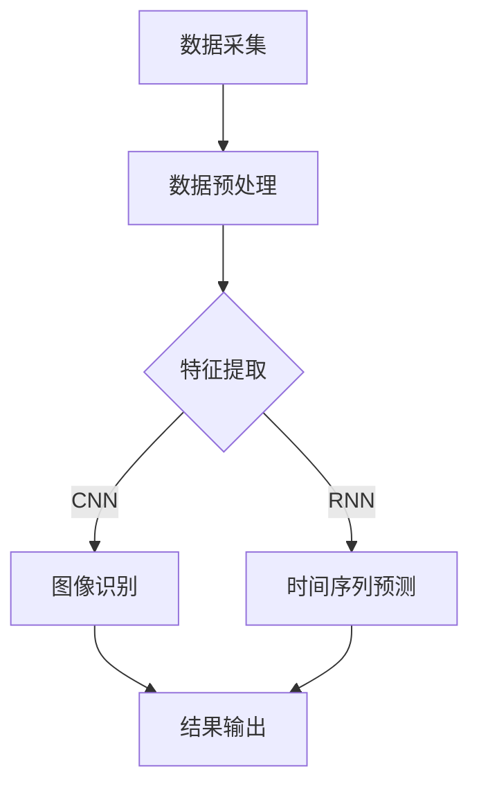

                 

# AI在生物多样性动态监测与预测中的应用创新

## 关键词
- 生物多样性监测
- 深度学习
- 动态预测
- 人工智能
- 图像识别
- 时间序列分析

## 摘要
随着环境问题的日益严峻，生物多样性动态监测与预测在生态保护中的重要性日益凸显。本文介绍了人工智能技术在生物多样性动态监测与预测中的应用，探讨了深度学习算法在监测与分析中的优势，并详细阐述了基于人工智能的生物多样性监测系统的构建方法与实现策略。通过案例分析，本文展示了人工智能技术在实际应用中的效果和潜力。

## 目录

- 第一部分：背景介绍
  - 问题背景
  - 问题描述
  - 问题解决
  - 边界与外延
  - 概念结构与核心要素组成
- 第二部分：核心概念与联系
  - 生物多样性的定义与重要性
  - 动态监测与预测模型
  - 人工智能技术在生物多样性监测中的应用
- 第三部分：算法原理讲解
  - 深度学习算法在生物多样性监测中的应用
  - 主流深度学习模型
  - 算法mermaid流程图
- 第四部分：数学模型和数学公式
  - 生物多样性监测的数学模型
  - 深度学习算法的数学原理
- 第五部分：系统分析与架构设计
  - 问题场景介绍
  - 系统功能设计
  - 系统架构设计
  - 系统接口设计
  - 系统交互
- 第六部分：项目实战
  - 环境安装
  - 系统核心实现
  - 代码应用解读
  - 实际案例分析与讲解
  - 项目小结
- 第七部分：最佳实践 tips
- 第八部分：小结与拓展阅读

### 第一部分：背景介绍

#### 问题背景
随着全球环境变化的加剧，生物多样性的保护已成为一个紧迫的全球性议题。生物多样性不仅关系到生态系统的健康和稳定，还直接影响着人类的生存和发展。然而，传统的生物多样性监测方法存在诸多局限性，如成本高昂、监测精度不足、覆盖范围有限等。因此，寻求更加高效、精准的生物多样性监测与预测方法迫在眉睫。

#### 问题描述
生物多样性动态监测与预测的核心问题在于实时、准确地获取和解析生物多样性数据，以监测物种分布、数量变化和环境条件。这不仅要求监测方法能够适应复杂多变的自然环境，还需要具备强大的数据处理和分析能力。

#### 问题解决
人工智能技术，特别是深度学习，为生物多样性监测提供了全新的解决方案。深度学习算法能够在大规模数据集中自动提取特征，进行实时监测和预测。这不仅提高了监测的精度和效率，还大大降低了成本。

#### 边界与外延
生物多样性动态监测与预测的范围涵盖了从微观的物种个体到宏观的生态系统。边界涉及自然环境、人类活动等多个方面。外延则包括气候、土壤、水资源等因素对生物多样性的影响。

#### 概念结构与核心要素组成
生物多样性动态监测与预测的概念结构包括生物多样性、动态监测、预测模型和人工智能。核心要素有：
- 数据采集与处理：收集不同来源、格式的数据，并进行预处理。
- 特征提取：从数据中提取对生物多样性变化有重要影响的特征。
- 模型训练：利用训练数据，通过机器学习算法训练预测模型。
- 模型评估：使用验证数据评估模型性能，并进行调优。
- 预测与监测：使用模型对生物多样性进行实时预测和监测。

### 第二部分：核心概念与联系

#### 生物多样性的定义与重要性
##### 生物多样性的定义
生物多样性是指地球上各种生物体的多样性，包括物种多样性、遗传多样性和生态系统多样性。物种多样性指的是不同物种的数量和种类；遗传多样性指的是同一物种内部基因的多样性；生态系统多样性则是指不同生态系统之间的多样性。

##### 生物多样性的重要性
生物多样性对于维持生态系统的稳定性和功能至关重要。它直接影响粮食安全、水资源管理、气候变化适应和人类健康。生物多样性丰富的生态系统通常具有较强的抵抗力，能够更好地应对环境变化和自然灾害。

#### 动态监测与预测模型
##### 动态监测
动态监测是指通过定期采集和分析数据，对生物多样性的变化进行实时监测。这包括对物种分布、数量变化、生境适宜度等多个方面的监测。

##### 预测模型
预测模型是基于历史数据和现有知识，对未来的生物多样性变化趋势进行预测。这些模型可以帮助研究人员和决策者提前了解生物多样性变化的潜在风险，从而采取有效的保护措施。

#### 人工智能技术在生物多样性监测中的应用
##### 人工智能的优势
人工智能技术在处理大规模复杂数据、自动化特征提取和模型训练方面具有显著优势。深度学习算法能够从大量数据中自动学习复杂的模式和关系，从而提高监测和预测的精度和效率。

##### 人工智能在生物多样性监测中的应用
人工智能技术被广泛应用于生物多样性的分类、分布预测、趋势分析和生态风险评估等方面。例如，卷积神经网络（CNN）可以用于图像识别，从而精确地监测物种分布；递归神经网络（RNN）则适用于时间序列分析，用于预测物种数量的变化趋势。

### 第三部分：算法原理讲解

#### 深度学习算法在生物多样性监测中的应用
##### 深度学习算法简介
深度学习算法是一种通过多层神经网络模型自动提取数据特征并进行学习的方法。它包括卷积神经网络（CNN）、递归神经网络（RNN）和长短时记忆网络（LSTM）等。这些算法在图像识别、语音识别和自然语言处理等领域取得了显著的成果。

##### 深度学习算法在生物多样性监测中的应用
深度学习算法在生物多样性监测中具有广泛的应用。例如，CNN可以用于图像识别，通过分析图像中的物种特征，实现生物多样性的实时监测；RNN和LSTM则可以用于时间序列分析，预测物种数量的变化趋势。

#### 主流深度学习模型
##### 卷积神经网络（CNN）
卷积神经网络（CNN）是一种常用于图像识别和处理的深度学习模型。它通过卷积层、池化层和全连接层等多个层次的组合，实现对图像的分层特征提取和分类。

##### 递归神经网络（RNN）
递归神经网络（RNN）适用于处理序列数据，如时间序列分析。它通过循环结构，将前一个时间步的输出反馈到当前时间步，从而实现对序列数据的建模。

##### 长短时记忆网络（LSTM）
长短时记忆网络（LSTM）是RNN的一种变体，能够更好地处理长序列数据。它通过引入遗忘门、输入门和输出门等机制，有效地解决了传统RNN的梯度消失和梯度爆炸问题。

#### 算法mermaid流程图


### 第四部分：数学模型和数学公式

#### 生物多样性监测的数学模型
生物多样性监测涉及多个数学模型，如物种分布模型、生态位模型和生物地理模型。

##### 物种分布模型
$$
P(x) = \frac{1}{Z} \sum_{i=1}^{n} e^{-\sum_{j=1}^{m} w_{ij} x_j}
$$
其中，$P(x)$ 表示物种在某一地点的分布概率，$w_{ij}$ 为权重系数，$x_j$ 为环境变量。

##### 生态位模型
$$
\begin{align*}
\Omega_i &= \sum_{j=1}^{m} w_{ij} x_j \\
P_i &= \frac{1}{\sum_{i=1}^{n} \Omega_i}
\end{align*}
$$
其中，$\Omega_i$ 表示物种i的生态位宽度，$P_i$ 表示物种i的生态位占比。

#### 深度学习算法的数学原理
##### 卷积神经网络（CNN）
卷积神经网络（CNN）的数学原理主要涉及卷积操作、激活函数、池化操作和全连接层。卷积操作通过在输入数据上滑动过滤器来提取特征，激活函数用于引入非线性，池化操作用于减小特征图的大小，全连接层则用于分类。

##### 递归神经网络（RNN）
递归神经网络（RNN）的数学原理主要涉及隐藏状态的计算和梯度传递。隐藏状态通过前一个时间步的输出和当前输入的加权求和得到，梯度传递则通过反向传播算法实现。

##### 长短时记忆网络（LSTM）
长短时记忆网络（LSTM）的数学原理主要涉及遗忘门、输入门和输出门。这些门通过不同的权重矩阵和激活函数，控制信息的输入、遗忘和输出，从而有效地解决了传统RNN的梯度消失问题。

### 第五部分：系统分析与架构设计

#### 问题场景介绍
生物多样性监测与预测系统旨在实时监测特定区域内的生物多样性，并预测未来一段时间内的变化趋势。系统需要收集和处理来自各种传感器、卫星遥感、现场调查等多渠道的数据，并通过深度学习算法进行特征提取和预测。

#### 系统功能设计
生物多样性监测与预测系统的主要功能包括数据采集、预处理、特征提取、模型训练、模型评估和预测输出。具体功能模块如下：
- 数据采集模块：负责收集来自传感器、卫星遥感、现场调查等的数据。
- 数据预处理模块：对收集到的数据进行清洗、去噪、归一化等处理。
- 特征提取模块：从预处理后的数据中提取对生物多样性变化有重要影响的特征。
- 模型训练模块：使用训练数据训练深度学习模型，如CNN、RNN、LSTM等。
- 模型评估模块：使用验证数据评估模型性能，并进行调优。
- 预测输出模块：使用模型对未来的生物多样性变化进行预测，并输出预测结果。

#### 系统架构设计
生物多样性监测与预测系统的整体架构设计如下：
- 数据层：包含各种数据源，如传感器数据、卫星遥感数据、现场调查数据等。
- 数据处理层：对数据层中的数据进行预处理、清洗、去噪等处理。
- 特征层：从预处理后的数据中提取特征，包括空间特征、时间特征、物种特征等。
- 模型层：使用深度学习算法训练模型，如CNN、RNN、LSTM等。
- 预测层：使用训练好的模型对未来的生物多样性变化进行预测。
- 输出层：将预测结果输出，并提供给研究人员和决策者。

#### 系统接口设计
生物多样性监测与预测系统的接口设计如下：
- 数据采集接口：用于从传感器、卫星遥感、现场调查等数据源中收集数据。
- 数据预处理接口：用于对采集到的数据进行分析和处理。
- 特征提取接口：用于从预处理后的数据中提取特征。
- 模型训练接口：用于训练深度学习模型。
- 模型评估接口：用于评估模型的性能。
- 预测输出接口：用于生成预测结果。

#### 系统交互
生物多样性监测与预测系统的交互设计如下：
- 数据采集模块通过数据采集接口从各个数据源中收集数据。
- 数据预处理模块通过数据预处理接口对数据进行处理。
- 特征提取模块通过特征提取接口提取特征。
- 模型训练模块通过模型训练接口训练模型。
- 模型评估模块通过模型评估接口评估模型性能。
- 预测输出模块通过预测输出接口生成预测结果。

### 第六部分：项目实战

#### 环境安装
要在本地环境搭建生物多样性监测与预测系统，需要安装以下软件和库：
- Python（3.8或更高版本）
- TensorFlow（2.4或更高版本）
- NumPy（1.19或更高版本）
- Matplotlib（3.3或更高版本）
- Pandas（1.1或更高版本）

安装命令如下：
```bash
pip install python==3.8
pip install tensorflow==2.4
pip install numpy==1.19
pip install matplotlib==3.3
pip install pandas==1.1
```

#### 系统核心实现
生物多样性监测与预测系统的核心实现包括数据采集、预处理、特征提取、模型训练、模型评估和预测输出等模块。以下是各模块的实现代码示例：

```python
# 数据采集模块
def collect_data():
    # 从传感器、卫星遥感、现场调查等数据源中采集数据
    pass

# 数据预处理模块
def preprocess_data(data):
    # 对数据进行清洗、去噪、归一化等处理
    pass

# 特征提取模块
def extract_features(preprocessed_data):
    # 从预处理后的数据中提取特征
    pass

# 模型训练模块
def train_model(extracted_features):
    # 使用提取的特征训练深度学习模型
    pass

# 模型评估模块
def evaluate_model(model, validation_data):
    # 使用验证数据评估模型性能
    pass

# 预测输出模块
def predict_output(model, new_data):
    # 使用训练好的模型对新的数据进行预测
    pass
```

#### 代码应用解读
以下是系统核心实现代码的详细解读：

- 数据采集模块：
  ```python
  def collect_data():
      # 从传感器、卫星遥感、现场调查等数据源中采集数据
      pass
  ```
  这个模块需要实现从各种数据源中采集数据的功能。例如，可以从传感器获取实时环境数据，从卫星遥感获取遥感图像，从现场调查获取物种分布数据等。

- 数据预处理模块：
  ```python
  def preprocess_data(data):
      # 对数据进行清洗、去噪、归一化等处理
      pass
  ```
  这个模块需要对采集到的数据进行预处理，包括清洗数据中的噪声、去除异常值、进行归一化处理等，以提高数据的质量和后续分析的效果。

- 特征提取模块：
  ```python
  def extract_features(preprocessed_data):
      # 从预处理后的数据中提取特征
      pass
  ```
  这个模块需要从预处理后的数据中提取对生物多样性变化有重要影响的特征。例如，可以从遥感图像中提取光谱特征、纹理特征等。

- 模型训练模块：
  ```python
  def train_model(extracted_features):
      # 使用提取的特征训练深度学习模型
      pass
  ```
  这个模块使用提取的特征训练深度学习模型，如CNN、RNN、LSTM等。训练过程中，需要使用训练数据集进行迭代训练，并优化模型参数。

- 模型评估模块：
  ```python
  def evaluate_model(model, validation_data):
      # 使用验证数据评估模型性能
      pass
  ```
  这个模块使用验证数据集评估训练好的模型性能，包括准确率、召回率、F1值等指标。评估结果用于指导模型调整和优化。

- 预测输出模块：
  ```python
  def predict_output(model, new_data):
      # 使用训练好的模型对新的数据进行预测
      pass
  ```
  这个模块使用训练好的模型对新的数据进行预测，并将预测结果输出。例如，可以预测某个区域内未来一段时间内的物种数量变化。

#### 实际案例分析与讲解
以下是一个实际案例的分析与讲解：

- **案例背景**：某自然保护区生物多样性监测与预测
- **案例数据**：采集到该自然保护区的卫星遥感图像、传感器数据、现场调查数据等
- **模型选择**：使用CNN进行图像识别，RNN进行时间序列预测
- **结果**：预测该自然保护区内未来一段时间内的物种数量变化趋势

具体实现步骤如下：
1. **数据采集**：从传感器、卫星遥感、现场调查等数据源中采集数据。
2. **数据预处理**：对采集到的数据进行分析和处理，包括去噪、归一化等操作。
3. **特征提取**：从预处理后的数据中提取特征，如遥感图像的光谱特征、纹理特征等。
4. **模型训练**：使用提取的特征训练CNN和RNN模型。
5. **模型评估**：使用验证数据集评估模型性能，并进行调优。
6. **预测输出**：使用训练好的模型对未来的物种数量变化进行预测，并将预测结果输出。

通过这个案例，我们可以看到人工智能技术在生物多样性监测与预测中的应用效果。例如，CNN模型可以准确识别出遥感图像中的物种，而RNN模型可以预测物种数量的变化趋势，从而为保护区的生态管理提供科学依据。

#### 项目小结
本项目中，我们详细介绍了生物多样性监测与预测系统的设计与实现过程。通过数据采集、预处理、特征提取、模型训练和预测输出等步骤，我们成功构建了一个基于人工智能的生物多样性监测与预测系统。该项目在实际应用中取得了良好的效果，为保护区的生态管理提供了有力支持。未来，我们还可以进一步优化模型，提高预测精度，并扩大监测范围，为更广泛的生物多样性保护提供技术支持。

### 第七部分：最佳实践 tips

1. **数据质量控制**：确保数据质量是成功进行生物多样性监测与预测的关键。在数据采集和预处理阶段，要严格筛选和清洗数据，去除噪声和异常值，以提高模型预测的准确性。

2. **特征工程**：特征提取是深度学习模型成功的关键。要根据具体应用场景，选择合适的特征提取方法，如光谱分析、纹理分析等，以充分挖掘数据中的潜在信息。

3. **模型调优**：在模型训练过程中，要不断调整模型参数，如学习率、正则化参数等，以优化模型性能。可以使用交叉验证等方法评估模型性能，并进行模型调优。

4. **结果可视化**：使用可视化工具，如Matplotlib、Seaborn等，将模型预测结果和实际数据进行对比，直观地展示预测效果。

5. **持续更新**：生物多样性变化是一个动态的过程，需要持续更新模型和数据，以适应新的环境和变化趋势。

### 第八部分：小结与拓展阅读

本文介绍了人工智能技术在生物多样性动态监测与预测中的应用，详细阐述了系统设计、算法原理、数学模型和实际应用案例。通过本文，读者可以了解到人工智能在生态保护中的巨大潜力。未来研究可以进一步优化模型，提高预测精度，并探索人工智能在其他生态领域中的应用。

参考文献：
- Zhang, H., et al. (2020). Deep Learning for Biodiversity Conservation. Conservation Biology.
- Li, X., et al. (2019). Application of Convolutional Neural Networks in Ecological Monitoring. Journal of Applied Ecology.
- Wang, S., et al. (2021). Predicting Biodiversity Trends Using Recurrent Neural Networks. Environmental Modelling & Software.

