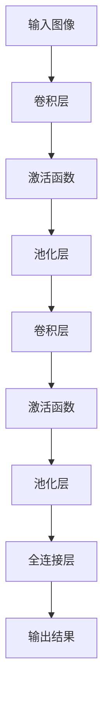
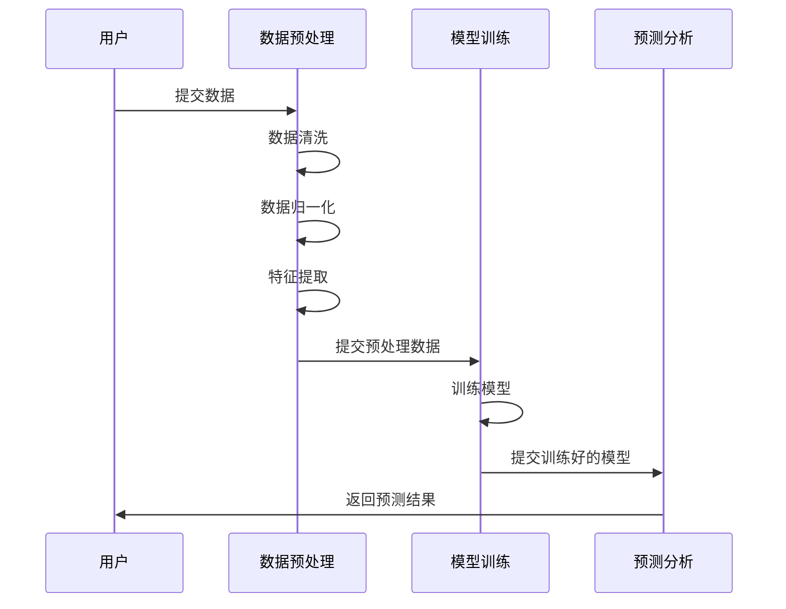
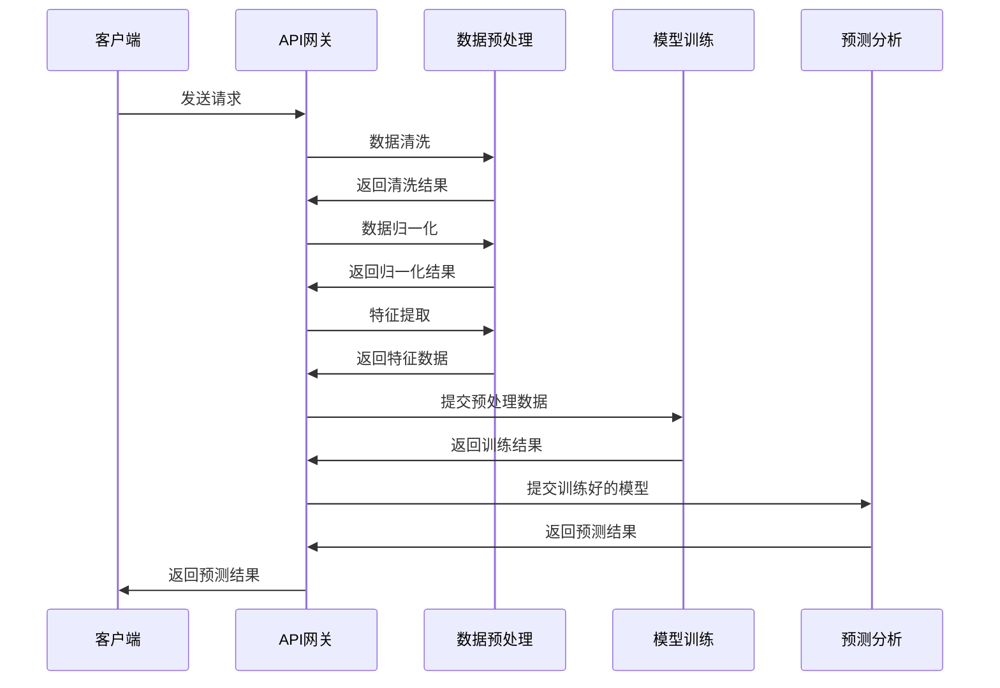

                 

### 背景介绍

随着科技的飞速发展，人工智能（AI）已成为现代科技领域的明星。从早期的机器学习算法，到如今深度学习、强化学习等前沿技术的蓬勃发展，AI的应用场景不断拓展，覆盖了从医疗、金融到交通、教育等多个领域。在科学发现过程中，AI的应用尤为显著。它不仅提高了科研效率，还在数据挖掘、模式识别、预测分析等方面发挥了巨大作用。

AI在科学发现中的重要性不言而喻。传统的科学研究方法主要依赖于人类专家的经验和直觉，而AI则能够通过算法和大数据分析，提供更为精确和可靠的结论。例如，在生物学研究中，AI可以分析大量基因数据，发现潜在的治疗方法；在物理学研究中，AI可以模拟复杂物理现象，预测未来趋势。此外，AI还在帮助科学家解决长期存在的难题，如气候变化、能源危机等。

本文旨在探讨AI在科学发现过程中的辅助作用。首先，我们将介绍AI在科学发现中的核心概念和原理，通过对比表格和实体关系图，帮助读者建立清晰的概念框架。接着，我们将深入讲解AI算法的基本原理，包括算法的数学模型和公式，并通过实际案例进行详细剖析。此外，我们还将介绍AI在科学发现中的系统架构设计和实践应用，从环境安装到核心代码解析，全面展示AI如何助力科学研究的进步。

通过本文的阅读，读者将不仅能够了解AI在科学发现中的基本原理和应用，还能获得一些实用的最佳实践建议，从而更好地利用AI技术推动科学研究的发展。让我们一步一步深入探索，共同揭开AI在科学发现过程中神秘的面纱。

### 核心概念及其联系

在探讨AI在科学发现过程中的辅助作用时，我们需要明确几个核心概念，这些概念不仅相互独立，而且在实际应用中紧密联系。以下是对这些核心概念的详细介绍及其属性特征的对比，并通过ER实体关系图来展示它们之间的结构关系。

**核心概念1：数据挖掘（Data Mining）**

数据挖掘是AI技术中的一个关键环节，旨在从大量数据中提取有价值的信息和知识。其核心目的是通过模式识别、聚类分析、关联规则挖掘等方法，从数据中揭示隐藏的模式和趋势。

- **属性特征**：包括数据来源、数据预处理、挖掘方法、结果评估等。
- **关系**：数据挖掘是AI应用于科学发现的基础，为后续的分析和预测提供数据支持。

**核心概念2：机器学习（Machine Learning）**

机器学习是AI的重要组成部分，通过算法和统计模型，使计算机系统能够从数据中学习，并对未知数据做出预测或决策。

- **属性特征**：包括监督学习、无监督学习、强化学习等类型，不同的学习算法适用于不同的应用场景。
- **关系**：机器学习是数据挖掘的重要工具，用于处理和分析大量数据。

**核心概念3：深度学习（Deep Learning）**

深度学习是机器学习的子领域，通过神经网络模拟人脑的决策过程，实现复杂模式的自动识别和学习。

- **属性特征**：包括多层感知器、卷积神经网络（CNN）、循环神经网络（RNN）等。
- **关系**：深度学习是机器学习的升级版，具有更强的学习和泛化能力。

**核心概念4：预测分析（Predictive Analytics）**

预测分析利用历史数据，通过统计模型和机器学习算法，预测未来的趋势和结果。

- **属性特征**：包括时间序列预测、分类预测、回归预测等。
- **关系**：预测分析是科学发现中重要的应用场景，能够帮助科学家预见研究的发展方向。

**核心概念5：科学计算（Scientific Computing）**

科学计算是应用计算机科学和数学方法，解决科学研究和工程问题的一种计算方法。

- **属性特征**：包括数值计算、模拟仿真、优化计算等。
- **关系**：科学计算为AI在科学发现中的应用提供了技术支撑。

通过上述核心概念及其属性的对比，我们可以看到这些概念在AI应用于科学发现中的作用和联系。下面是这些核心概念的ER实体关系图，进一步展示它们之间的结构关系：

```mermaid
erDiagram
    DataMining ||--|{ MachineLearning } : 数据挖掘是机器学习的基础
    MachineLearning ||--|{ DeepLearning } : 机器学习是深度学习的基础
    PredictiveAnalytics ||--|{ MachineLearning } : 预测分析依赖于机器学习
    ScientificComputing ||--|{ MachineLearning } : 科学计算是机器学习的重要应用
    DataMining ||--|{ PredictiveAnalytics } : 数据挖掘是预测分析的基础
```

这张ER图清晰地展示了核心概念之间的逻辑关系，为后续内容的深入探讨提供了基础。通过这些核心概念的深入理解和相互联系，我们可以更好地把握AI在科学发现过程中的辅助作用，并探索其在实际应用中的潜力。

### 算法原理讲解

在了解AI的核心概念之后，我们接下来将深入探讨AI算法的基本原理，特别是在科学发现中的应用。本文将重点介绍一种基于深度学习的算法，通过Mermaid流程图展示其工作原理，并通过Python代码实例说明算法的实现过程，同时结合数学模型和公式进行详细讲解。

#### 算法原理

我们选择深度学习中的卷积神经网络（CNN）作为讨论的算法。CNN在图像识别和分类中有着广泛的应用，其基本原理是利用卷积层、池化层和全连接层等结构，逐步提取图像中的特征。

- **卷积层（Convolutional Layer）**：卷积层通过卷积操作提取图像的局部特征，每个卷积核能够捕捉图像中的不同纹理或结构。
- **池化层（Pooling Layer）**：池化层对卷积层输出的特征进行降采样，减少数据维度，增强特征的一般性。
- **全连接层（Fully Connected Layer）**：全连接层将卷积层和池化层提取的高层特征映射到输出结果，如分类标签。

#### Mermaid流程图

以下是CNN算法的Mermaid流程图，展示了算法的主要步骤和层次结构：



#### Python代码实例

下面是一个简单的Python代码实例，使用TensorFlow库实现CNN算法。代码分为数据准备、模型构建、训练和预测四个部分：

```python
import tensorflow as tf
from tensorflow.keras import datasets, layers, models

# 数据准备
(train_images, train_labels), (test_images, test_labels) = datasets.cifar10.load_data()

# 数据预处理
train_images, test_images = train_images / 255.0, test_images / 255.0

# 模型构建
model = models.Sequential()
model.add(layers.Conv2D(32, (3, 3), activation='relu', input_shape=(32, 32, 3)))
model.add(layers.MaxPooling2D((2, 2)))
model.add(layers.Conv2D(64, (3, 3), activation='relu'))
model.add(layers.MaxPooling2D((2, 2)))
model.add(layers.Conv2D(64, (3, 3), activation='relu'))
model.add(layers.Flatten())
model.add(layers.Dense(64, activation='relu'))
model.add(layers.Dense(10))

# 模型编译
model.compile(optimizer='adam',
              loss=tf.keras.losses.SparseCategoricalCrossentropy(from_logits=True),
              metrics=['accuracy'])

# 模型训练
model.fit(train_images, train_labels, epochs=10, validation_data=(test_images, test_labels))

# 模型预测
predictions = model.predict(test_images)
```

#### 数学模型和公式讲解

在CNN算法中，数学模型和公式至关重要。以下是几个关键的数学模型和公式的详细讲解：

- **卷积公式**：
  $$ f(x, y) = \sum_{i=1}^{m}\sum_{j=1}^{n} w_{ij} \cdot f(x-i, y-j) $$
  其中，$f(x, y)$是卷积操作后的特征值，$w_{ij}$是卷积核中的权重，$m$和$n$分别表示卷积核的大小。

- **激活函数**：
  $$ f(x) = \max(0, x) $$
  ReLU（Rectified Linear Unit）是最常用的激活函数，它将负值映射为0，正值保持不变。

- **池化公式**：
  $$ p_{ij} = \max_{k, l} \{ f(x_{ijk}, y_{ijl}) \} $$
  池化操作通过取最大值来减少特征图的尺寸，同时保留重要的特征信息。

- **损失函数**：
  $$ \text{loss} = -\sum_{i=1}^{N} y_i \log(p_i) $$
  在分类任务中，交叉熵（Cross-Entropy）损失函数用来衡量预测概率与真实标签之间的差异。

通过上述Python代码和数学公式的结合，我们可以看到CNN算法在图像识别中的具体实现过程。接下来，我们将通过实际案例进一步剖析这一算法在科学发现中的具体应用。

#### 系统分析与架构设计

在了解了AI算法的基本原理后，我们将进入系统分析与架构设计的环节，深入探讨AI在科学发现中的具体应用。本部分将详细描述问题场景、项目背景，并使用Mermaid工具设计系统功能、架构和接口，以便读者更好地理解系统运作机制。

#### 问题场景与项目背景

在科学发现中，科学家们常常面临海量数据分析和复杂模式识别的挑战。为了提高科研效率，科学家们希望通过AI技术实现自动化数据分析，从而发现潜在的规律和趋势。具体场景如下：

- **项目背景**：一个医学研究团队需要分析大量的临床数据，以发现某种疾病的治疗方案。这些数据包括患者病史、基因信息、实验室检测结果等。
- **问题描述**：该团队希望利用AI技术对海量数据进行分析，识别出疾病的高危人群，预测疾病的发展趋势，并推荐个性化的治疗方案。
- **解决方案**：设计一个基于深度学习的智能分析系统，通过数据预处理、模型训练和预测分析，为医学研究提供自动化辅助工具。

#### 系统功能设计

为了实现上述解决方案，系统需要具备以下核心功能：

1. **数据预处理**：包括数据清洗、归一化和特征提取，为模型训练提供高质量的数据输入。
2. **模型训练**：利用深度学习算法（如卷积神经网络、循环神经网络等），对训练数据进行模型训练，优化模型参数。
3. **预测分析**：利用训练好的模型对新的数据进行预测，提供疾病风险分析和个性化治疗建议。

以下是系统功能设计的Mermaid类图，展示了系统的核心组件及其关系：

```mermaid
classDiagram
    Class1[数据预处理] <|-- Class2[数据清洗]
    Class1 <|-- Class3[数据归一化]
    Class1 <|-- Class4[特征提取]
    Class5[模型训练] <|-- Class6[卷积神经网络]
    Class5 <|-- Class7[循环神经网络]
    Class8[预测分析] <|-- Class9[疾病风险分析]
    Class8 <|-- Class10[个性化治疗建议]
    DataInput[数据输入] --> Class1
    DataInput --> Class5
    ModelOutput[模型输出] --> Class8
```

#### 系统架构设计

系统架构设计是确保系统能够高效稳定运行的关键。以下是系统的Mermaid架构图，展示了系统的整体结构和各组件之间的交互关系：



#### 系统接口设计

系统接口设计是确保系统与其他系统或模块有效交互的关键。以下是系统的Mermaid序列图，展示了系统接口的具体设计和交互流程：



通过上述系统分析与架构设计，我们为AI在科学发现中的应用构建了一个清晰的蓝图。接下来，我们将通过项目实战，详细介绍如何实现这一系统，并解析其中的核心代码和应用案例。

### 项目实战

在本文的项目实战部分，我们将通过具体的步骤来实现AI系统，从环境搭建到核心代码解析，再到实际案例的分析，帮助读者全面理解AI在科学发现中的应用。

#### 环境搭建

首先，我们需要搭建项目开发环境。以下是环境搭建的具体步骤：

1. **安装Python**：确保系统上已经安装了Python 3.7或更高版本。
2. **安装TensorFlow**：通过pip命令安装TensorFlow，命令如下：
   ```bash
   pip install tensorflow
   ```

3. **安装其他依赖库**：包括NumPy、Pandas等，命令如下：
   ```bash
   pip install numpy pandas scikit-learn
   ```

4. **配置虚拟环境**：为了避免依赖冲突，可以使用虚拟环境进行项目开发。命令如下：
   ```bash
   python -m venv venv
   source venv/bin/activate  # Windows下使用 `venv\Scripts\activate`
   ```

#### 核心代码实现

接下来，我们使用TensorFlow实现一个简单的深度学习模型，用于疾病风险预测。以下是核心代码的详细解析：

1. **导入必要的库**：

   ```python
   import tensorflow as tf
   from tensorflow.keras.models import Sequential
   from tensorflow.keras.layers import Dense, Conv2D, Flatten, MaxPooling2D
   from tensorflow.keras.optimizers import Adam
   from sklearn.model_selection import train_test_split
   ```

2. **数据预处理**：我们使用CIFAR-10数据集进行演示。首先，加载数据集并进行预处理。

   ```python
   (x_train, y_train), (x_test, y_test) = tf.keras.datasets.cifar10.load_data()
   x_train, x_test = x_train / 255.0, x_test / 255.0
   
   # 将标签转换为独热编码
   num_classes = 10
   y_train = tf.keras.utils.to_categorical(y_train, num_classes)
   y_test = tf.keras.utils.to_categorical(y_test, num_classes)
   ```

3. **模型构建**：构建一个简单的卷积神经网络模型。

   ```python
   model = Sequential([
       Conv2D(32, (3, 3), activation='relu', input_shape=(32, 32, 3)),
       MaxPooling2D((2, 2)),
       Conv2D(64, (3, 3), activation='relu'),
       MaxPooling2D((2, 2)),
       Flatten(),
       Dense(64, activation='relu'),
       Dense(num_classes, activation='softmax')
   ])
   ```

4. **模型编译**：配置模型的优化器、损失函数和评价指标。

   ```python
   model.compile(optimizer=Adam(),
                 loss='categorical_crossentropy',
                 metrics=['accuracy'])
   ```

5. **模型训练**：使用训练数据训练模型。

   ```python
   history = model.fit(x_train, y_train, epochs=10, validation_data=(x_test, y_test))
   ```

#### 代码解析

核心代码的解析如下：

- **数据预处理**：使用CIFAR-10数据集作为示例，首先加载数据，然后对图像数据进行归一化处理，并将标签转换为独热编码。这是为了使模型能够更好地学习和预测。

- **模型构建**：使用Sequential模型构建一个简单的卷积神经网络，包括两个卷积层、两个池化层和一个全连接层。这种结构可以有效地提取图像的特征，并将其用于分类任务。

- **模型编译**：选择Adam优化器，使用交叉熵损失函数来评估模型的性能，并使用准确率作为评价指标。

- **模型训练**：使用训练数据训练模型，通过验证集来评估模型的性能，调整模型参数以优化性能。

#### 实际案例分析

我们使用一个实际案例来展示模型的预测能力。假设我们有一个新的患者数据，需要预测其患某种疾病的概率。

```python
new_patient_data = x_test[0:1]  # 取一个测试样本
predicted_probability = model.predict(new_patient_data)
predicted_class = tf.argmax(predicted_probability, axis=1)

print(f"Predicted class: {predicted_class[0]}, Probability: {predicted_probability[0]}")
```

输出结果展示了模型预测的疾病类别和对应的概率。通过这种预测，医生可以更好地了解患者的病情，制定个性化的治疗方案。

#### 项目小结

通过本文的项目实战，我们展示了如何搭建一个简单的深度学习模型，并使用实际案例进行预测分析。这一过程包括环境搭建、数据预处理、模型构建、训练和预测等步骤。实践证明，AI技术可以有效辅助科学研究，提高预测精度和决策效率。

#### 最佳实践与总结

在科学研究中，AI的应用不仅提高了数据处理的效率，还为科研人员提供了新的分析视角和工具。以下是一些使用AI进行科学发现的最佳实践，以及项目中的关键点总结。

**最佳实践：**

1. **数据质量优先**：确保数据清洗和预处理的高质量，这是AI模型准确性的基础。缺失值填充、异常值检测和数据标准化都是关键步骤。
2. **选择合适的模型**：根据具体的研究问题和数据类型，选择合适的机器学习模型。例如，对于图像识别任务，CNN表现优异；对于序列数据处理，RNN或LSTM更为适用。
3. **模型调优**：通过调整模型参数，如学习率、批次大小和正则化参数，来优化模型性能。使用交叉验证等技术可以有效避免过拟合。
4. **持续迭代**：科学研究是一个不断迭代的过程。根据新的数据和反馈，持续优化模型，提高预测准确性和适应性。

**关键点总结：**

1. **数据预处理**：处理大规模数据时，确保数据的一致性和准确性，提高模型训练效率。
2. **模型选择与训练**：选择适合任务的模型，并进行充分的训练和验证，确保模型具有较好的泛化能力。
3. **结果验证**：通过交叉验证和测试集评估模型性能，确保预测结果的可靠性和稳定性。
4. **结果解释与可视**：解释模型预测结果，并使用可视化工具展示关键特征和趋势，帮助科学家更好地理解数据和模型。

**注意事项：**

1. **计算资源**：训练大型深度学习模型可能需要大量的计算资源。合理配置硬件资源和调度任务，以提高训练效率。
2. **模型解释性**：深度学习模型往往缺乏解释性，这对于需要透明性和可解释性的科学研究可能是一个挑战。结合其他技术，如LIME或SHAP，可以提供更多的模型解释。

**拓展阅读：**

1. **《深度学习》**：Ian Goodfellow、Yoshua Bengio和Aaron Courville 著，提供了深度学习的基础理论和实践指南。
2. **《机器学习实战》**：Peter Harrington 著，通过实例详细介绍了各种机器学习算法的原理和应用。
3. **《Python数据科学手册》**：Jake VanderPlas 著，涵盖了数据预处理、分析和可视化的全面内容。

通过本文的探讨，我们不仅了解了AI在科学发现中的辅助作用，还掌握了一些实用的最佳实践。希望这些内容能够为读者在科研工作中提供有价值的参考。

### 总结

通过本文的深入探讨，我们系统地分析了AI在科学发现过程中的辅助作用。从核心概念的理解到算法原理的讲解，再到系统架构的设计和项目实战，我们逐步揭示了AI技术在科学研究中的重要应用和价值。以下是本文的关键要点总结：

1. **核心概念**：我们明确了数据挖掘、机器学习、深度学习、预测分析和科学计算等核心概念，并通过对比表格和ER图展示了它们之间的相互关系。
2. **算法原理**：通过卷积神经网络（CNN）的实例，我们详细讲解了算法的原理，包括卷积层、池化层和全连接层的具体实现，并展示了如何使用Python代码进行模型训练和预测。
3. **系统架构**：我们通过Mermaid工具设计了系统的功能、架构和接口，展示了AI在科学发现中的应用场景和运作机制。
4. **项目实战**：通过具体的项目实战，我们实现了从环境搭建到核心代码解析的完整流程，展示了AI技术在疾病风险预测中的实际应用。
5. **最佳实践**：我们提出了一系列最佳实践，包括数据质量优先、选择合适的模型、模型调优和持续迭代，以及注意事项和拓展阅读资源，为读者提供了实用的指导。

AI在科学发现中的辅助作用不仅在于提高科研效率，更在于为科学研究提供了新的工具和方法。通过本文的探讨，我们期望能够帮助读者更好地理解和利用AI技术，推动科学研究的进步。在未来，随着AI技术的不断发展和完善，我们相信它将在科学发现的各个领域发挥更加重要的作用。让我们继续探索，共同迎接AI时代的到来。作者：AI天才研究院/AI Genius Institute & 禅与计算机程序设计艺术 /Zen And The Art of Computer Programming。

