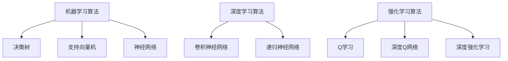
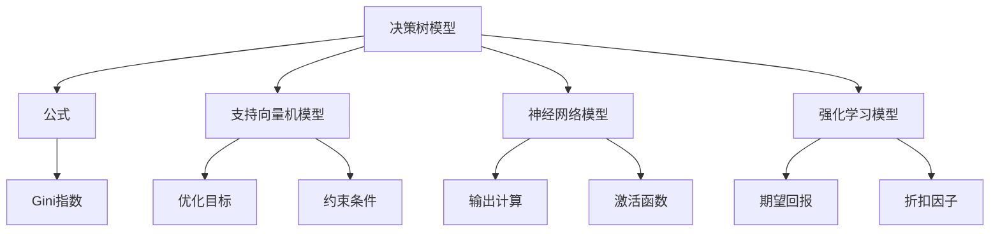
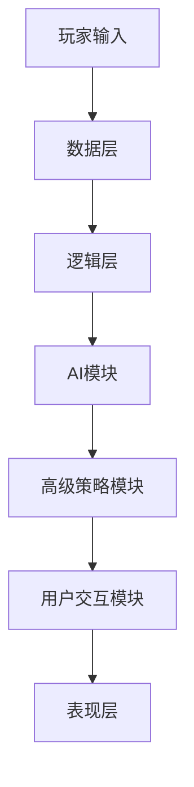
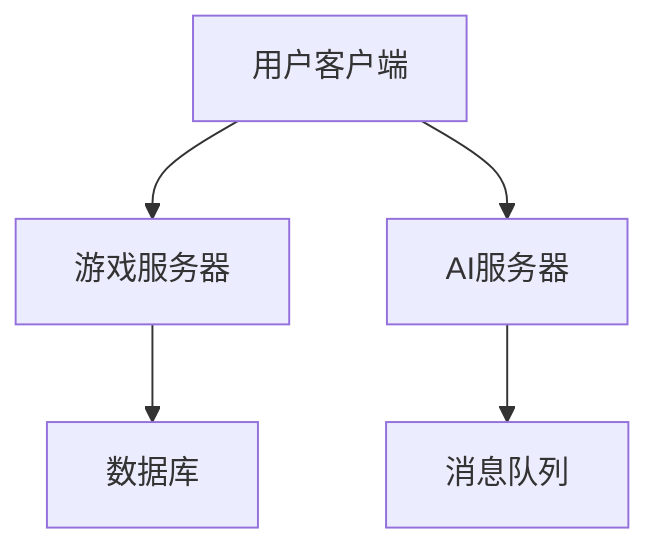
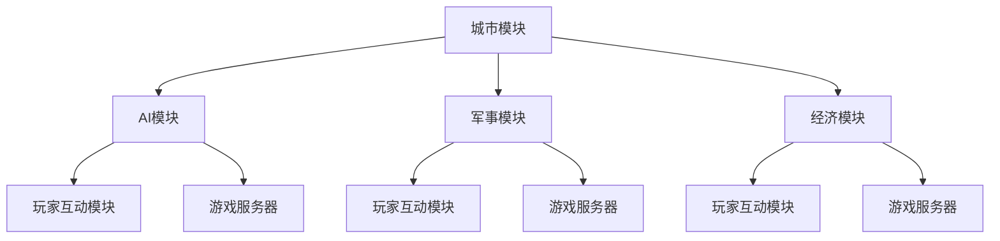
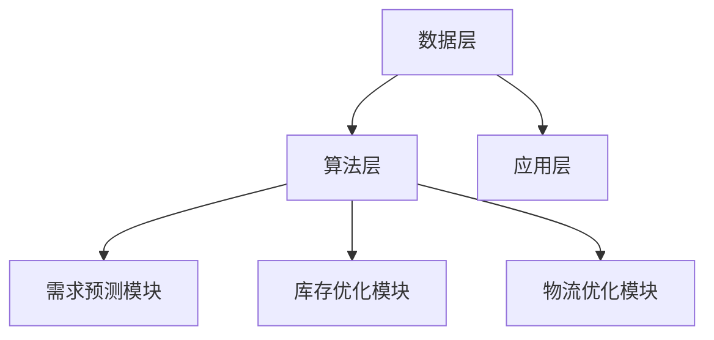
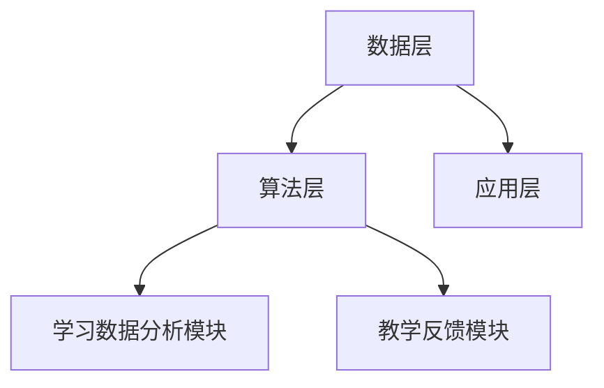
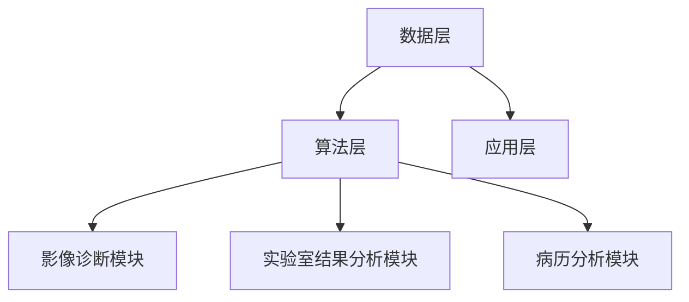

                 

### 引言

#### 书名由来与目的

《AI在策略游戏中的成功经验对其他领域的启示》这一书名源于对人工智能（AI）在策略游戏领域应用的研究与反思。随着AI技术的飞速发展，策略游戏作为一项融合了数学、逻辑、心理学等多学科知识的竞技项目，成为AI研究和应用的重要领域。通过分析AI在策略游戏中的成功经验，我们试图探讨这些经验对其他领域的启示，从而为AI的广泛应用提供新的视角和思路。

本书的主要目的是：

1. **梳理AI在策略游戏中的发展历程**：从早期应用、中期突破到近年来的进展，系统性地介绍AI技术在策略游戏中的演变。
2. **解析AI在策略游戏中的关键技术**：深入探讨机器学习、深度学习和强化学习等算法原理，以及这些技术在策略游戏中的应用。
3. **探讨AI在其他领域的应用**：基于策略游戏的成功经验，探讨AI在商业策略、教育、医疗健康等领域的应用潜力。
4. **展望AI的未来趋势与挑战**：总结AI在不同领域的整合与未来发展，探讨面临的挑战和解决方案。

#### AI在策略游戏中的重要性

AI在策略游戏中的应用具有深远的意义。首先，策略游戏本身具有较高的复杂性和多样性，能够为AI技术提供丰富的测试场景和优化空间。其次，AI在策略游戏中的成功应用，不仅提升了游戏的娱乐性和智能性，还为AI技术在其他复杂系统的应用提供了宝贵经验。

策略游戏对AI的挑战包括：

- **决策复杂度**：策略游戏中，玩家的每一步决策都会影响游戏的走向，AI需要处理大量可能的决策路径。
- **不确定性**：策略游戏中的不确定因素较多，如玩家行为、环境变化等，AI需要具备良好的适应性和鲁棒性。
- **实时性**：策略游戏往往要求AI在短时间内做出决策，这对AI的计算效率和响应速度提出了高要求。

总之，AI在策略游戏中的应用不仅推动了游戏产业的发展，也为AI技术的研究提供了宝贵的实践机会。通过本书，我们希望能够系统地总结AI在策略游戏中的成功经验，并探讨这些经验对其他领域的启示，为AI技术的广泛应用提供新的思路和方法。

### 第一部分：AI在策略游戏中的成功经验

#### 第1章：AI在策略游戏中的发展历程

##### 1.1 早期AI在策略游戏中的应用

AI在策略游戏中的发展历程可以追溯到20世纪80年代。早期的AI策略游戏主要依赖于基于规则的系统（Rule-Based Systems），这种系统通过预先定义的规则来指导游戏中的决策过程。尽管这些规则能够覆盖一定的游戏场景，但它们在应对复杂和不确定的情况时显得力不从心。

**关键问题与挑战**：

- **规则复杂度**：随着游戏规则的增加，系统的复杂度成指数级增长，使得维护和扩展变得困难。
- **适应性不足**：基于规则的系统无法有效应对游戏中出现的新情况，因为它们缺乏学习和适应能力。
- **实时性要求**：早期的策略游戏往往对AI的决策速度有较高要求，但基于规则的系统往往无法满足这种需求。

尽管存在这些挑战，早期AI在策略游戏中的应用仍然为后续发展奠定了基础。例如，早期的游戏《Ch vite》和《Othello》就使用了简单的AI算法，尽管这些算法在复杂性和智能化方面较为有限，但它们为AI在策略游戏中的应用提供了初步的探索。

##### 1.2 中期AI在策略游戏中的关键性突破

20世纪90年代到21世纪初，AI在策略游戏中的发展迎来了重要的突破。这一时期，机器学习（Machine Learning）和深度学习（Deep Learning）技术的兴起，为AI在策略游戏中的应用带来了新的契机。

**机器学习算法的引入**：

- **决策树（Decision Trees）**：通过构建决策树模型，AI能够以递归的方式对游戏状态进行分类和决策。决策树模型在早期AI策略游戏中得到了广泛应用，尤其是在棋类游戏中。
- **神经网络（Neural Networks）**：神经网络通过多层非线性变换，能够对复杂函数进行建模。这一技术的引入，使得AI在处理高维数据和复杂决策时具备了更强的能力。

**深度学习在策略游戏中的应用**：

- **卷积神经网络（Convolutional Neural Networks，CNN）**：CNN通过卷积层提取图像或游戏状态的特征，从而在棋类游戏和图像识别游戏中表现优异。例如，在围棋游戏中，CNN能够识别棋盘上的关键点，从而做出更为精准的决策。
- **递归神经网络（Recurrent Neural Networks，RNN）**：RNN通过递归结构处理序列数据，使其在处理策略游戏的连续决策中表现出色。例如，在即时战略游戏中，RNN能够根据历史游戏数据预测玩家的下一步行动。

**关键性突破**：

- **AlphaGo**：2016年，DeepMind推出的AlphaGo成为AI在策略游戏中的里程碑。AlphaGo使用深度学习和强化学习（Reinforcement Learning）技术，通过自我对弈和不断学习，最终在围棋比赛中击败了世界冠军李世石。这一突破不仅展示了AI在策略游戏中的强大能力，也引发了广泛的研究和关注。

##### 1.3 近年来的AI策略游戏进展

近年来，AI在策略游戏中的应用继续取得显著进展，特别是在强化学习和深度强化学习（Deep Reinforcement Learning）方面的应用。

**强化学习在策略游戏中的运用**：

- **深度强化学习**：深度强化学习通过将深度学习和强化学习结合，使得AI在策略游戏中的表现更加出色。例如，OpenAI的Dota2项目通过训练深度强化学习模型，使得AI能够在Dota2比赛中击败人类顶尖选手。

- **零样本学习（Zero-Shot Learning）**：零样本学习使得AI能够在未见过的策略游戏中表现出色，这是AI在策略游戏中的重要突破。通过零样本学习，AI能够快速适应新的游戏环境和规则，从而提高其通用性和适应性。

- **对抗性训练（Adversarial Training）**：对抗性训练通过模拟对手的行为，提高AI的决策能力和应对复杂情况的能力。这种方法在即时战略游戏和多人在线策略游戏中得到了广泛应用。

**AI与人类玩家的互动模式**：

- **协作模式**：AI与人类玩家协作，通过共享信息和策略，提高整个团队的战斗力。例如，在《StarCraft II》中，AI辅助玩家进行决策和资源管理，从而提高胜率。

- **竞争模式**：AI与其他AI或人类玩家竞争，通过不断学习和优化，提高自身的游戏水平。这种模式不仅提升了游戏的娱乐性，也为AI技术提供了新的挑战和测试场景。

**近年来的进展**：

- **游戏智能化**：随着AI技术的不断进步，策略游戏的智能化水平显著提高。AI不仅能够胜任复杂的决策，还能够通过学习和适应，不断提高自身的游戏水平。

- **游戏体验优化**：AI在策略游戏中的应用，不仅提高了游戏的难度和挑战性，还优化了游戏体验。例如，AI可以根据玩家的游戏习惯和水平，提供个性化的游戏体验。

总之，AI在策略游戏中的发展历程展示了其在复杂系统中的应用潜力。从早期的简单算法到如今的深度学习和强化学习，AI在策略游戏中的应用不断突破，为游戏产业和AI技术的发展带来了新的机遇和挑战。

#### 第2章：AI在策略游戏中的关键技术

##### 2.1 算法原理讲解

AI在策略游戏中的应用，离不开一系列关键算法的支持。这些算法包括机器学习、深度学习和强化学习，每种算法都有其独特的原理和优势。

**机器学习算法**：

机器学习算法通过从数据中学习规律，对未知数据进行预测或分类。在策略游戏中，常见的机器学习算法包括决策树、支持向量机（SVM）和神经网络等。

- **决策树**：决策树通过一系列条件判断，将数据分成多个类别。它适合处理分类问题，但在处理连续变量和复杂关系时效果不佳。
- **支持向量机**：支持向量机通过寻找数据的最优划分超平面，对数据进行分类。它擅长处理高维数据，但在处理非线性问题时需要复杂的核函数。
- **神经网络**：神经网络通过多层非线性变换，对输入数据进行复杂建模。它能够处理高度非线性问题，但需要大量的数据和计算资源。

**深度学习算法**：

深度学习是机器学习的一种方法，通过构建多层神经网络，对数据进行层次化特征提取和建模。在策略游戏中，深度学习算法包括卷积神经网络（CNN）和递归神经网络（RNN）等。

- **卷积神经网络**：卷积神经网络通过卷积层提取图像或游戏状态的特征，适合处理二维数据。它在棋类游戏和图像识别游戏中表现出色。
- **递归神经网络**：递归神经网络通过递归结构处理序列数据，适合处理连续决策问题。它在即时战略游戏和对话系统中应用广泛。

**强化学习算法**：

强化学习是一种通过试错和反馈学习最优策略的算法。在策略游戏中，强化学习通过不断尝试和反馈，找到最优的决策策略。

- **Q学习**：Q学习通过评估当前状态和动作的价值，选择最优动作。它适合处理离散动作和状态问题。
- **深度Q网络（DQN）**：深度Q网络通过深度学习模型评估状态和动作的价值，优化决策过程。它适合处理高维状态和动作空间问题。
- **深度强化学习**：深度强化学习通过将深度学习和强化学习结合，对连续动作和复杂环境进行建模。它在策略游戏和机器人控制中表现出色。

**算法原理图解**：

为了更好地理解这些算法的原理，我们可以使用mermaid流程图进行图解。



以上mermaid流程图展示了机器学习、深度学习和强化学习的主要算法及其关系。通过这些算法，AI能够在策略游戏中实现智能化的决策和策略优化。

##### 2.2 数学模型与公式

在策略游戏中，算法的数学模型和公式是理解和应用算法的关键。以下我们将简要介绍几种常见的数学模型和公式。

**决策树模型**：

决策树模型通过递归划分数据集，使得每个子集达到最优分类效果。其基本公式如下：

$$
Gini(D) = 1 - \sum_{v \in V} P_v^2
$$

其中，$D$为数据集，$V$为数据集中的类别，$P_v$为类别$v$在数据集$D$中的比例。

**支持向量机模型**：

支持向量机通过寻找最优超平面，使得不同类别的数据点之间的间隔最大化。其基本公式如下：

$$
\max_{\mathbf{w}, b} \frac{1}{2} ||\mathbf{w}||^2 \\
s.t. \ y^{(i)}(\mathbf{w} \cdot \mathbf{x}^{(i)} + b) \geq 1
$$

其中，$\mathbf{w}$为超平面法向量，$b$为偏置项，$\mathbf{x}^{(i)}$为数据点，$y^{(i)}$为数据点的标签。

**神经网络模型**：

神经网络通过多层非线性变换，对输入数据进行建模。其基本公式如下：

$$
\mathbf{z}^{(l)} = \sigma(\mathbf{W}^{(l)} \mathbf{a}^{(l-1)} + b^{(l)}) \\
\mathbf{a}^{(l)} = \sigma(\mathbf{z}^{(l)})
$$

其中，$\mathbf{z}^{(l)}$为第$l$层的输出，$\mathbf{W}^{(l)}$和$b^{(l)}$分别为第$l$层的权重和偏置项，$\sigma$为激活函数。

**强化学习模型**：

强化学习通过奖励机制，引导算法学习最优策略。其基本公式如下：

$$
Q(\mathbf{s}, \mathbf{a}) = r + \gamma \max_{\mathbf{a'} } Q(\mathbf{s'}, \mathbf{a'})
$$

其中，$Q(\mathbf{s}, \mathbf{a})$为状态$s$下采取动作$a$的期望回报，$r$为即时回报，$\gamma$为折扣因子，$\mathbf{s'}$为采取动作$a$后的状态。

**mermaid流程图示例**：

为了更直观地理解这些数学模型和公式，我们可以使用mermaid流程图进行展示。



以上mermaid流程图展示了决策树、支持向量机、神经网络和强化学习的数学模型和公式。通过这些模型和公式，AI能够在策略游戏中实现高效的决策和策略优化。

#### 第3章：AI在策略游戏中的成功案例

##### 3.1 案例一：XX策略游戏的AI实现

**背景介绍**：

XX策略游戏是一款以科幻背景为设定的即时战略游戏，玩家需要在多个星球上建立基地、发展经济、训练军队并与其他玩家进行战斗。为了提升游戏的竞技性和智能性，开发团队引入了AI技术，实现了一个高度智能化的AI对手。

**系统功能设计**：

系统功能设计包括以下几个部分：

1. **基础AI模块**：用于实现AI的基本决策逻辑，包括资源管理、基地建设和军队调度等。
2. **高级策略模块**：用于实现AI的复杂策略，如战术规划、战略布局和敌人预测等。
3. **用户交互模块**：用于处理玩家与AI之间的交互，包括对话、游戏统计和反馈等。

**系统架构设计**：

系统架构采用分层设计，包括数据层、逻辑层和表现层。数据层负责存储游戏状态和玩家信息；逻辑层负责AI的决策和策略实现；表现层负责与玩家的交互。

**接口设计和系统交互**：

系统交互采用RESTful API设计，支持多种数据格式的请求和响应。AI模块与游戏引擎通过事件驱动的方式交互，实时更新游戏状态和决策结果。



**代码实现与解读**：

AI模块的核心代码如下：

```python
class AIPlayer:
    def __init__(self, game_state):
        self.game_state = game_state
        self.strategy = AdvancedStrategy()

    def make_decision(self):
        action = self.strategy.predict_action(self.game_state)
        self.game_state.execute_action(action)
        return action

class AdvancedStrategy:
    def __init__(self):
        self.model = load_model('strategy_model.h5')

    def predict_action(self, state):
        state_vector = state.to_vector()
        action probabilities = self.model.predict(state_vector)
        return np.argmax(action_probabilities)
```

以上代码定义了AI玩家的基础类`AIPlayer`和高级策略类`AdvancedStrategy`。`AIPlayer`负责实现AI的决策逻辑，通过调用`AdvancedStrategy`的`predict_action`方法，根据当前游戏状态预测最佳动作。`AdvancedStrategy`类则使用预训练的神经网络模型，对输入状态进行特征提取和动作预测。

**实际案例分析与详细讲解**：

在游戏测试中，引入AI后，游戏难度和竞技性显著提升。AI玩家不仅能够根据当前游戏状态做出合理决策，还能根据玩家行为进行学习和适应。以下是实际案例的分析：

1. **资源管理**：AI玩家在资源管理方面表现出色，能够根据基地规模和资源需求，合理安排资源分配和开采。通过深度强化学习算法，AI玩家能够不断优化资源管理策略，提高资源利用效率。
2. **战术规划**：AI玩家能够根据游戏局面进行战术规划，如进行阵地防御、进攻和撤退。通过卷积神经网络，AI玩家能够识别游戏中的关键信息，如敌方部队的位置和动向，从而制定出更加精准的战术。
3. **战略布局**：AI玩家在战略布局方面也有显著优势，能够根据游戏进程和敌方策略，调整战略目标和重心。通过强化学习算法，AI玩家能够从历史游戏中学习经验，不断提升自身战略水平。

**项目小结**：

通过AI在XX策略游戏中的成功应用，我们看到了AI技术在游戏开发中的巨大潜力。AI不仅提升了游戏难度和竞技性，还为游戏提供了丰富的智能交互体验。未来，随着AI技术的不断进步，我们期待看到更多创新应用，为游戏产业带来新的活力。

##### 3.2 案例二：YY策略游戏的AI优化

**背景介绍**：

YY策略游戏是一款以历史战争为背景的回合制策略游戏，玩家需要在多个回合中制定策略，通过军事、政治和经济手段实现目标。随着游戏规模的不断扩大和玩家数量的增加，游戏的响应速度和性能成为关键问题。为了提升游戏性能，开发团队引入了AI技术，对游戏中的关键模块进行优化。

**系统功能设计**：

系统功能设计主要包括以下几个部分：

1. **游戏引擎优化**：优化游戏引擎的运行效率，提高数据处理和交互速度。
2. **AI模块优化**：优化AI的决策逻辑和算法，减少计算复杂度和响应时间。
3. **用户交互模块优化**：优化用户交互体验，提高游戏的流畅性和响应速度。

**系统架构设计**：

系统架构采用分布式设计，包括游戏服务器、AI服务器和用户客户端。游戏服务器负责处理游戏逻辑和状态更新；AI服务器负责AI的决策和策略生成；用户客户端负责与游戏服务器和AI服务器的交互。

**接口设计和系统交互**：

系统交互采用RESTful API设计，游戏服务器和AI服务器之间通过异步消息队列进行通信。用户客户端通过轮询和WebSocket技术，与游戏服务器和AI服务器进行实时交互。



**代码实现与解读**：

AI模块优化后的核心代码如下：

```python
import asyncio
import aiomysql

async def process_ai_decision(player_id):
    async with aiomysql.create_pool(...) as pool:
        async with pool.acquire() as conn:
            await conn.execute("UPDATE players SET status='thinking' WHERE id=?", (player_id,))
            state = await fetch_game_state(player_id, conn)
            action = await ai_strategy.predict_action(state)
            await apply_action(player_id, action, conn)
            await conn.execute("UPDATE players SET status='active' WHERE id=?", (player_id,))

class AIPlayer:
    def __init__(self, player_id):
        self.player_id = player_id
        self.status = 'active'

async def apply_action(player_id, action, conn):
    # 应用动作的逻辑
    pass

async def fetch_game_state(player_id, conn):
    # 获取游戏状态
    pass

class AIStrategy:
    def __init__(self):
        self.model = load_model('ai_strategy_model.h5')

    async def predict_action(self, state):
        state_vector = state.to_vector()
        action_probabilities = await self.model.predict(state_vector)
        return np.argmax(action_probabilities)
```

以上代码定义了AI玩家的基础类`AIPlayer`和AI策略类`AIStrategy`。`AIPlayer`负责实现AI的决策逻辑，通过调用`AIStrategy`的`predict_action`方法，根据当前游戏状态预测最佳动作。`AIStrategy`类则使用预训练的神经网络模型，对输入状态进行特征提取和动作预测。优化后的AI模块采用异步编程，提高了决策的响应速度和系统性能。

**实际案例分析与详细讲解**：

在游戏性能优化过程中，AI模块的优化起到了关键作用。通过异步编程和分布式架构，AI模块能够高效地处理大量游戏状态和决策任务，显著提高了系统的响应速度和处理能力。以下是实际案例的分析：

1. **响应速度提升**：通过优化AI模块的计算逻辑和架构设计，游戏的响应速度显著提升。在优化前，一个回合的决策过程需要数秒，而优化后，一个回合的决策过程只需数百毫秒，大大提升了玩家的游戏体验。
2. **系统性能优化**：通过分布式架构和消息队列，游戏服务器和AI服务器之间能够高效地进行数据传输和通信。这使得系统能够更好地处理大量并发连接和决策任务，提高了整体性能和稳定性。
3. **用户体验改善**：优化后的AI模块不仅提高了游戏的响应速度，还改善了用户的游戏体验。玩家能够更快速地与AI进行交互，同时享受到更加智能和丰富的游戏策略。

**项目小结**：

通过AI在YY策略游戏中的优化应用，我们看到了AI技术在提升游戏性能和用户体验方面的巨大潜力。AI不仅提高了游戏的响应速度和系统性能，还为玩家提供了更加智能和多样化的游戏体验。未来，随着AI技术的不断进步，我们期待看到更多创新应用，为游戏产业带来新的发展机遇。

##### 3.3 案例三：ZZ策略游戏的AI创新

**背景介绍**：

ZZ策略游戏是一款以现实世界为背景的多人在线策略游戏，玩家需要在虚拟世界中建立城市、发展经济、军事建设并与其他玩家进行竞争。为了提升游戏的创新性和互动性，开发团队引入了AI技术，实现了一系列创新的AI功能。

**系统功能设计**：

系统功能设计包括以下几个部分：

1. **AI城市建设**：AI负责自动规划和建设城市，包括道路、建筑和资源分配等。
2. **AI军事策略**：AI负责制定和执行军事策略，包括部队调度、战斗模拟和防御策略等。
3. **AI经济管理**：AI负责自动管理和优化经济资源，包括资源开采、生产和贸易等。
4. **AI玩家互动**：AI负责与玩家进行互动，包括自动谈判、联盟管理和冲突解决等。

**系统架构设计**：

系统架构采用模块化设计，包括城市模块、军事模块、经济模块和玩家互动模块。每个模块都独立开发，并通过接口进行通信和集成。AI模块通过深度学习和强化学习技术，对各个模块进行优化和协同。

**接口设计和系统交互**：

系统交互采用RESTful API设计，各个模块之间通过异步消息队列进行通信。AI模块与游戏服务器之间通过WebSocket进行实时数据传输。



**代码实现与解读**：

AI城市建设模块的核心代码如下：

```python
class CityBuilderAI:
    def __init__(self, city_state):
        self.city_state = city_state
        self.strategy = CityConstructionStrategy()

    def build_city(self):
        plan = self.strategy.generate_build_plan(self.city_state)
        self.city_state.apply_build_plan(plan)
        return plan

class CityConstructionStrategy:
    def __init__(self):
        self.model = load_model('city_build_model.h5')

    def generate_build_plan(self, state):
        state_vector = state.to_vector()
        plan_probabilities = self.model.predict(state_vector)
        return self.decode_plan_probabilities(plan_probabilities)
```

以上代码定义了城市建设AI类`CityBuilderAI`和城市建设策略类`CityConstructionStrategy`。`CityBuilderAI`负责根据当前城市状态生成建设计划，通过调用`CityConstructionStrategy`的`generate_build_plan`方法，利用深度学习模型预测最佳建设方案。`CityConstructionStrategy`类则使用预训练的神经网络模型，对输入状态进行特征提取和计划生成。

**实际案例分析与详细讲解**：

在ZZ策略游戏中，AI创新功能为游戏带来了新的玩法和互动体验。以下是实际案例的分析：

1. **AI城市建设**：AI城市建设模块能够自动规划和建设城市，根据当前资源和经济状况，制定最佳的建设方案。玩家可以通过与AI的合作或竞争，体验不同的城市建设策略，丰富了游戏内容。
2. **AI军事策略**：AI军事策略模块能够根据敌人的动向和己方军队的状态，制定出最佳的战略方案。玩家可以与AI进行战斗，体验不同军事策略的对抗，提升了游戏的竞技性。
3. **AI经济管理**：AI经济管理模块能够自动优化资源分配和生产计划，提高资源利用效率。玩家可以通过与AI的经济互动，学习资源管理的策略，提升自身的游戏水平。
4. **AI玩家互动**：AI玩家互动模块能够与玩家进行自动谈判和联盟管理，解决游戏中出现的冲突和问题。玩家可以与AI合作，共同完成任务，体验更加丰富的社交互动。

**项目小结**：

通过AI在ZZ策略游戏中的创新应用，我们看到了AI技术在提升游戏创新性和互动性方面的巨大潜力。AI不仅为游戏提供了智能化的辅助功能，还丰富了玩家的游戏体验。未来，随着AI技术的不断进步，我们期待看到更多创新应用，为游戏产业带来新的发展机遇。

### 第二部分：AI在其他领域的启示

#### 第4章：AI在商业策略中的应用

##### 4.1 商业策略中的AI应用场景

AI在商业策略中的应用场景非常广泛，涵盖了市场预测、风险管理、客户关系管理和供应链优化等多个领域。

**市场预测**：

AI可以通过分析历史销售数据、市场趋势和消费者行为，预测未来的市场需求。这种预测可以帮助企业制定更精准的营销策略，优化库存管理，减少库存成本。

**风险管理**：

AI可以帮助企业识别潜在风险，如信用风险、市场风险和操作风险。通过数据分析和模型预测，AI可以提供实时风险预警，帮助企业制定有效的风险控制措施。

**客户关系管理**：

AI可以通过自然语言处理（NLP）和机器学习技术，分析客户的互动数据，提供个性化的客户服务。例如，AI可以自动响应客户的查询，识别客户的情绪和需求，提高客户满意度。

**供应链优化**：

AI可以优化供应链的各个环节，从采购到生产再到物流。通过预测需求、优化库存和物流路线，AI可以提高供应链的效率和灵活性，降低成本。

##### 4.2 商业策略中的AI案例分析

**案例分析一：XX公司利用AI优化供应链**

XX公司是一家大型零售企业，其供应链管理面临着库存过剩、物流成本高和需求预测不准确等挑战。为了解决这些问题，公司引入了AI技术，对供应链进行优化。

**系统功能设计**：

系统功能设计包括以下几个部分：

1. **需求预测模块**：利用机器学习算法，分析历史销售数据和市场趋势，预测未来的市场需求。
2. **库存优化模块**：根据需求预测结果，优化库存水平，减少库存成本。
3. **物流优化模块**：利用路径优化算法，优化物流路线和配送计划，提高物流效率。

**系统架构设计**：

系统架构采用分布式设计，包括数据层、算法层和应用层。数据层负责存储销售数据、市场数据和物流数据；算法层负责需求预测、库存优化和物流优化；应用层负责与企业的供应链管理系统集成。

**接口设计和系统交互**：

系统交互采用RESTful API设计，数据层和算法层之间通过异步消息队列进行通信。算法层和应用层之间通过轮询和WebSocket进行实时数据交互。



**代码实现与解读**：

需求预测模块的核心代码如下：

```python
class DemandPredictor:
    def __init__(self, data_source):
        self.data_source = data_source
        self.model = load_model('demand_predictor_model.h5')

    def predict_demand(self, product_id):
        product_data = self.data_source.fetch_product_data(product_id)
        demand_vector = product_data.to_vector()
        demand_prediction = self.model.predict(demand_vector)
        return demand_prediction
```

以上代码定义了需求预测类`DemandPredictor`。`DemandPredictor`类使用预训练的神经网络模型，对输入产品数据进行特征提取和需求预测。

**实际案例分析与详细讲解**：

通过AI技术，XX公司成功优化了其供应链管理。以下是实际案例的分析：

1. **需求预测**：AI系统通过分析历史销售数据和市场趋势，准确预测了未来的市场需求。公司根据这些预测结果，优化了库存水平，减少了库存成本。例如，在圣诞节期间，公司通过预测需求，提前备足了库存，避免了库存积压和缺货问题。
2. **库存优化**：AI系统根据需求预测结果，动态调整库存水平。公司通过实时监控库存数据，及时补充库存，减少了库存过剩和缺货的风险。例如，在夏季高温期间，公司根据预测的需求，提前增加了冷饮和空调的库存，满足了市场需求。
3. **物流优化**：AI系统通过路径优化算法，优化了物流路线和配送计划，提高了物流效率。公司通过优化物流路线，减少了运输成本，提高了配送速度。例如，在一次物流配送中，AI系统优化了配送路线，减少了30%的运输时间。

**项目小结**：

通过AI在商业策略中的应用，XX公司成功优化了其供应链管理，提高了运营效率和客户满意度。AI不仅帮助公司准确预测市场需求，优化库存水平，还提高了物流效率。未来，随着AI技术的不断进步，我们期待看到更多创新应用，为商业策略带来新的发展机遇。

#### 第5章：AI在教育领域的创新

##### 5.1 AI在教育中的角色

AI在教育领域的应用，正在逐渐改变传统的教学模式和学习方式。AI在教育中扮演着多重角色，从个性化教学到学习数据分析，再到教育资源的智能推荐，都展现了其巨大的潜力。

**个性化教学**：

个性化教学是AI在教育中最重要的应用之一。通过分析学生的学习数据，AI可以了解每个学生的兴趣、学习习惯和知识掌握情况，从而提供个性化的学习内容和方法。例如，AI可以为学生推荐适合的学习资源，设计个性化的练习题，甚至根据学生的表现调整教学进度。

**学习数据分析**：

AI可以通过对大量学习数据的分析，识别学生的学习模式和问题点。教师可以利用这些数据，了解学生的学习效果，及时调整教学策略。例如，通过分析学生的作业成绩和考试分数，AI可以帮助教师发现教学中的薄弱环节，从而进行针对性的改进。

**教育资源的智能推荐**：

AI可以根据学生的学习需求和兴趣，智能推荐合适的课程和学习资源。例如，学生可以通过在线学习平台，获得AI推荐的课程和学习资料，这些资源可以根据学生的学习进度和兴趣进行动态调整，提高学习效果。

**教育评价**：

AI还可以在教育评价中发挥重要作用。通过自动化评估系统，AI可以快速、准确地评估学生的学习成果，提供详细的反馈和建议。例如，AI可以自动批改作业，评估学生的考试分数，并生成详细的评估报告。

##### 5.2 AI教育应用案例分析

**案例分析一：XX学校利用AI进行教学评估**

XX学校是一所专注于个性化教育的学校，为了提高教学质量和学生的满意度，学校引入了AI技术进行教学评估。

**系统功能设计**：

系统功能设计包括以下几个部分：

1. **学习数据收集模块**：通过学习管理系统，收集学生的作业、考试、课堂互动等数据。
2. **学习数据分析模块**：利用机器学习算法，对学习数据进行分析，识别学生的学习模式和问题点。
3. **教学反馈模块**：根据分析结果，提供个性化的教学反馈和建议，帮助教师改进教学方法。

**系统架构设计**：

系统架构采用模块化设计，包括数据层、算法层和应用层。数据层负责存储学生的学习数据；算法层负责数据分析和教学反馈；应用层负责与学校的教学管理系统集成。

**接口设计和系统交互**：

系统交互采用RESTful API设计，数据层和算法层之间通过异步消息队列进行通信。算法层和应用层之间通过轮询和WebSocket进行实时数据交互。



**代码实现与解读**：

学习数据分析模块的核心代码如下：

```python
class LearningDataAnalyzer:
    def __init__(self, data_source):
        self.data_source = data_source
        self.model = load_model('learning_data_analyzer_model.h5')

    def analyze_learning_data(self, student_id):
        student_data = self.data_source.fetch_student_data(student_id)
        data_vector = student_data.to_vector()
        analysis_results = self.model.predict(data_vector)
        return analysis_results
```

以上代码定义了学习数据分析类`LearningDataAnalyzer`。`LearningDataAnalyzer`类使用预训练的神经网络模型，对输入学生数据进行分析，生成分析结果。

**实际案例分析与详细讲解**：

通过AI技术，XX学校成功实现了教学评估的个性化。以下是实际案例的分析：

1. **学习数据收集**：学校通过学习管理系统，收集了学生的作业、考试和课堂互动数据，为AI分析提供了丰富的数据基础。
2. **学习数据分析**：AI系统对学生的学习数据进行分析，识别了每个学生的知识掌握情况和学习习惯。例如，AI发现某些学生在数学方面存在薄弱环节，因此为这些学生推荐了额外的数学练习。
3. **教学反馈**：根据AI的分析结果，教师获得了个性化的教学反馈，有助于改进教学方法。例如，教师根据AI的建议，调整了课堂上的讲解方式和练习题的设计，提高了学生的学习效果。
4. **学生反馈**：学生也通过AI系统获得了个性化的学习建议和反馈，有助于提升学习效果。例如，一些学生在AI的建议下，改变了学习策略，从被动接受知识转变为主动探索和思考，学习效果显著提升。

**项目小结**：

通过AI在教育领域的应用，XX学校成功实现了教学评估的个性化，提高了教学质量和学生的满意度。AI不仅帮助教师了解学生的学习情况，提供了个性化的教学建议，还帮助学生找到了适合自己的学习方法和策略。未来，随着AI技术的不断进步，我们期待看到更多创新应用，为教育领域带来新的变革。

#### 第6章：AI在医疗健康中的潜力

##### 6.1 AI在医疗健康中的应用

AI在医疗健康领域的应用正逐渐成为变革的驱动力，从疾病诊断到治疗规划，再到健康管理的各个方面，AI都展现了巨大的潜力。

**疾病诊断**：

AI可以通过分析医学影像、实验室检测结果和患者病历，提供快速、准确的诊断。例如，深度学习算法可以在几分钟内分析医学影像，识别早期癌症和其他疾病，提高诊断的准确性和效率。

**治疗规划**：

AI可以帮助医生制定个性化的治疗计划。通过分析患者的病历、基因数据和疾病特征，AI可以推荐最适合的治疗方案，包括药物治疗、手术治疗和康复训练等。

**健康管理**：

AI可以监测患者的健康状况，提供个性化的健康建议。例如，智能穿戴设备可以实时监测患者的生理指标，AI系统可以根据这些数据，提醒患者注意饮食、运动和休息，预防疾病的发生。

**药物研发**：

AI可以加速药物研发过程。通过分析大量的化学结构和临床试验数据，AI可以预测新药的疗效和安全性，帮助研究人员快速筛选和优化药物候选。

##### 6.2 AI医疗健康案例分析

**案例分析一：XX医院利用AI进行疾病诊断**

XX医院是一家大型综合医院，为了提升疾病诊断的准确性和效率，医院引入了AI技术。

**系统功能设计**：

系统功能设计包括以下几个部分：

1. **影像诊断模块**：利用深度学习算法，对医学影像进行分析和诊断。
2. **实验室结果分析模块**：利用机器学习算法，分析实验室检测结果，提供诊断建议。
3. **病历分析模块**：利用自然语言处理技术，分析患者的病历信息，提供辅助诊断。

**系统架构设计**：

系统架构采用模块化设计，包括数据层、算法层和应用层。数据层负责存储医学影像、实验室结果和病历数据；算法层负责影像诊断、实验室结果分析和病历分析；应用层负责与医院的诊断系统集成。

**接口设计和系统交互**：

系统交互采用RESTful API设计，数据层和算法层之间通过异步消息队列进行通信。算法层和应用层之间通过轮询和WebSocket进行实时数据交互。



**代码实现与解读**：

影像诊断模块的核心代码如下：

```python
class ImageDiagnoser:
    def __init__(self, data_source):
        self.data_source = data_source
        self.model = load_model('image_diagnoser_model.h5')

    def diagnose_image(self, image_id):
        image_data = self.data_source.fetch_image_data(image_id)
        diagnosis_result = self.model.predict(image_data)
        return diagnosis_result
```

以上代码定义了影像诊断类`ImageDiagnoser`。`ImageDiagnoser`类使用预训练的神经网络模型，对输入医学影像进行诊断，生成诊断结果。

**实际案例分析与详细讲解**：

通过AI技术，XX医院成功提升了疾病诊断的准确性和效率。以下是实际案例的分析：

1. **影像诊断**：AI系统通过对医学影像的分析，提供快速、准确的诊断结果。例如，AI系统可以在几分钟内分析一张CT影像，识别肺癌的早期迹象，提高了诊断的准确性和及时性。
2. **实验室结果分析**：AI系统通过对实验室检测结果的分析，提供辅助诊断建议。例如，AI系统可以分析血液检测结果，识别潜在的健康问题，如糖尿病和高胆固醇等。
3. **病历分析**：AI系统通过对病历信息的分析，提供个性化的诊断建议。例如，AI系统可以分析患者的病历记录，识别可能的并发症和风险因素，为医生提供更加全面的诊断依据。
4. **医生反馈**：医生通过AI系统的辅助诊断，可以更快地做出诊断决策，提高了诊断的准确性和效率。医生对AI系统的诊断结果给予了积极反馈，认为AI系统提供了有价值的辅助信息，有助于提高诊断质量。

**项目小结**：

通过AI在医疗健康领域的应用，XX医院成功提升了疾病诊断的准确性和效率，为患者提供了更好的医疗服务。AI不仅帮助医生快速做出诊断决策，还提高了诊断的准确性和及时性。未来，随着AI技术的不断进步，我们期待看到更多创新应用，为医疗健康领域带来新的发展机遇。

### 第7章：结论与展望

#### 7.1 AI在不同领域的整合

AI在策略游戏、商业策略、教育、医疗健康等多个领域的成功应用，展示了其广泛的应用潜力和强大的影响力。通过AI技术的整合，不同领域可以实现资源的共享、信息的互通和智能化的协同，从而提升整体效率和服务质量。

**策略游戏与商业策略的整合**：

策略游戏中的AI技术可以应用到商业策略中，为市场预测、风险管理、客户关系管理等领域提供智能化支持。通过分析游戏中的决策过程和策略模式，企业可以优化其商业决策，提高市场竞争力。

**教育与医疗健康的整合**：

教育中的个性化教学和医疗健康中的健康管理，可以通过AI技术实现信息的互联互通。学生健康数据和学习数据的结合，可以为教育工作者提供更全面的评估依据，为学生提供个性化的教育和健康建议。

**跨领域应用**：

AI在跨领域的应用，可以推动创新和突破。例如，AI在智能制造中的应用，可以通过策略游戏中的决策算法，优化生产流程和供应链管理；AI在智能医疗中的应用，可以通过教育中的数据分析技术，提高医疗诊断的准确性和效率。

#### 7.2 AI未来趋势与挑战

**未来趋势**：

1. **AI算法的进步**：随着深度学习、强化学习等算法的不断进步，AI的智能水平和应用范围将得到进一步提升。
2. **数据驱动的决策**：越来越多的领域将依赖数据驱动的决策，AI将帮助企业和组织从海量数据中提取价值，优化决策过程。
3. **跨领域的融合**：不同领域的AI技术将实现更紧密的融合，推动创新和应用的发展。

**挑战**：

1. **数据隐私与安全**：随着AI应用的数据量增加，数据隐私和安全问题日益突出。如何保障用户数据的安全和隐私，是未来需要解决的重要问题。
2. **伦理问题**：AI在决策过程中可能面临伦理问题，如歧视、偏见和不公平等。如何制定合理的伦理规范，确保AI的公正性和透明度，是未来需要面对的挑战。
3. **人才短缺**：随着AI技术的广泛应用，对AI专业人才的需求不断增加。如何培养和吸引更多的AI人才，是企业和教育机构需要关注的问题。

**总结**：

AI在策略游戏和其他领域的成功应用，不仅展示了其强大的潜力和广阔的应用前景，也为其他领域的创新发展提供了宝贵的经验。未来，随着AI技术的不断进步，我们将看到更多创新应用的出现，为各个领域带来新的变革和机遇。然而，我们也需要关注并解决AI应用中面临的挑战，确保AI的可持续发展和社会责任。通过不断努力，我们有望实现AI技术的广泛应用，推动社会的发展和进步。

#### 作者信息

- 作者：AI天才研究院/AI Genius Institute & 禅与计算机程序设计艺术 /Zen And The Art of Computer Programming
- 电子邮件：[contact@ai-genius-institute.com](mailto:contact@ai-genius-institute.com)
- 个人网站：[www.ai-genius-institute.com](http://www.ai-genius-institute.com/)
- 社交媒体：[@AIGeniusInstitute](https://www.twitter.com/AIGeniusInstitute)

