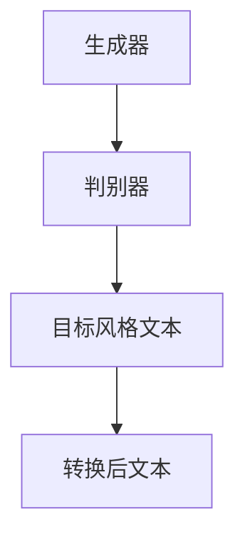

                 

### 《AI在自然语言生成中的语言风格转换应用》

> **关键词：** 自然语言生成、语言风格转换、人工智能、生成式模型、判别式模型

> **摘要：** 本篇文章将深入探讨AI在自然语言生成中的语言风格转换应用。通过分析自然语言生成技术的历史背景和语言风格转换的重要性，文章将详细解读生成式模型和判别式模型的原理与应用。最后，文章将结合实际案例，展示语言风格转换在不同场景下的应用实践，并对未来发展方向进行展望。

----------------------------------------------------------------

## 《AI在自然语言生成中的语言风格转换应用》目录大纲

### 第一部分：背景与概述

#### 第1章：问题背景与目标

- **1.1 问题背景**
  - 自然语言生成技术发展概述
  - 语言风格转换的重要性与应用领域
- **1.2 目标**
  - 实现语言风格转换的核心技术
  - 探索语言风格转换的应用前景
- **1.3 边界与外延**
  - 自然语言处理基本概念
  - 语言风格转换相关术语定义
- **1.4 核心概念与联系**
  - 语言风格转换的基本原理
  - 关键技术对比与分析

#### 第2章：自然语言生成基础

- **2.1 自然语言处理简介**
  - 基本概念
  - 应用场景
- **2.2 语言模型**
  - 语言模型原理
  - 常见语言模型介绍
- **2.3 生成式模型与判别式模型**
  - 模型类型及其对比
  - 应用场景分析

#### 第3章：语言风格转换基础

- **3.1 语言风格转换概述**
  - 定义与分类
  - 应用价值
- **3.2 风格化生成模型**
  - 基本原理
  - 技术实现
- **3.3 对比学习与元学习**
  - 基本原理
  - 在语言风格转换中的应用

### 第二部分：核心概念与原理

#### 第4章：生成式模型原理与实现

- **4.1 生成式模型概述**
  - 模型类型及其特点
  - 应用场景
- **4.2 GAN模型**
  - 原理与实现
  - 在语言风格转换中的应用
- **4.3 变分自编码器(VAE)**
  - 原理与实现
  - 在语言风格转换中的应用

#### 第5章：判别式模型原理与实现

- **5.1 判别式模型概述**
  - 模型类型及其特点
  - 应用场景
- **5.2 BERT模型**
  - 原理与实现
  - 在语言风格转换中的应用
- **5.3 T5模型**
  - 原理与实现
  - 在语言风格转换中的应用

### 第三部分：算法原理与实现

#### 第6章：文本生成与风格转换实践

- **6.1 实践背景与目标**
  - 应用场景
  - 实践目标
- **6.2 环境搭建**
  - 开发工具与库介绍
  - 环境配置与依赖安装
- **6.3 核心代码实现**
  - 生成式模型实现
  - 判别式模型实现
- **6.4 实际案例分析**
  - 案例背景与问题描述
  - 解决方案与实现
- **6.5 结果分析**
  - 实验结果展示
  - 性能评估与优化

#### 第7章：语言风格转换应用拓展

- **7.1 应用拓展方向**
  - 新兴应用领域
  - 发展趋势
- **7.2 拓展实践**
  - 实践案例介绍
  - 技术难点与解决方案
- **7.3 未来展望**
  - 技术挑战
  - 发展前景

### 第四部分：总结与展望

#### 第8章：总结与展望

- **8.1 内容回顾**
  - 核心概念与技术原理
  - 应用实践与拓展
- **8.2 小结**
  - 语言风格转换的关键技术
  - 应用实践中的挑战与机遇
- **8.3 注意事项**
  - 技术应用中的风险与挑战
  - 最佳实践建议
- **8.4 拓展阅读**
  - 相关领域研究进展
  - 推荐参考资料

----------------------------------------------------------------

### 第一部分：背景与概述

#### 第1章：问题背景与目标

### 1.1 问题背景

自然语言生成（Natural Language Generation，NLG）是人工智能领域的一项核心技术，它通过计算机程序生成自然语言文本，使得机器能够以人类语言的形式进行交流。自然语言生成技术的发展可以追溯到上世纪80年代，当时的研究主要集中在规则驱动的文本生成方法上。随着计算能力的提升和机器学习技术的进步，生成式模型和判别式模型逐渐成为自然语言生成的主流方法。

语言风格转换（Style Transfer in Natural Language Generation）是指将一种语言风格转换成另一种风格，使得生成的文本在语义保持的同时，呈现出不同的语言风格。语言风格转换的重要性体现在多个领域，如文学创作、广告宣传、新闻报道等。通过风格转换，可以创造出更具个性化和吸引力的文本，提升用户体验。

在自然语言生成中，语言风格转换的应用十分广泛。例如，在智能客服系统中，通过语言风格转换可以将官方语言风格转换成更加亲切和自然的语言风格，从而提高用户的满意度。在文学创作领域，通过风格转换可以实现不同作家风格之间的融合，创作出独具特色的文学作品。此外，在跨语言翻译和机器翻译中，语言风格转换也有助于提升翻译质量和用户体验。

### 1.2 目标

本文的目标是深入探讨AI在自然语言生成中的语言风格转换应用，具体包括以下几个方面：

1. **实现语言风格转换的核心技术**：本文将详细解析生成式模型和判别式模型在语言风格转换中的应用，包括GAN模型、变分自编码器（VAE）和BERT模型等。

2. **探索语言风格转换的应用前景**：本文将分析语言风格转换在不同领域的应用场景，探讨其在未来可能的发展趋势。

3. **展示语言风格转换的应用实践**：本文将通过实际案例展示语言风格转换在文本生成和风格转换中的具体应用，并分析其实际效果。

4. **展望未来发展方向**：本文将讨论语言风格转换领域面临的技术挑战和发展前景，为后续研究提供参考。

### 1.3 边界与外延

在讨论自然语言生成和语言风格转换时，我们需要明确一些基本概念和相关术语的定义，以便更好地理解本文的内容。

1. **自然语言处理（Natural Language Processing，NLP）**：自然语言处理是人工智能领域的一个分支，旨在使计算机能够理解、生成和处理人类语言。NLP涵盖了语音识别、文本分类、信息提取、机器翻译等多个子领域。

2. **生成式模型（Generative Model）**：生成式模型是一种概率模型，用于生成新的数据样本。在自然语言生成中，生成式模型可以生成新的文本，并尝试模仿输入文本的分布。

3. **判别式模型（Discriminative Model）**：判别式模型是一种用于分类或预测的模型，它通过学习输入和输出之间的映射关系，实现对未知数据的分类或预测。

4. **语言风格转换（Style Transfer）**：语言风格转换是指将一种语言风格转换成另一种风格，使得生成的文本在语义保持的同时，呈现出不同的语言风格。

5. **生成对抗网络（Generative Adversarial Network，GAN）**：GAN是一种由生成器和判别器组成的框架，通过两个对抗网络之间的博弈，实现数据的生成。

6. **变分自编码器（Variational Autoencoder，VAE）**：VAE是一种无监督学习模型，通过学习数据的概率分布，生成新的数据样本。

7. **BERT模型（Bidirectional Encoder Representations from Transformers）**：BERT是一种基于Transformer的预训练语言模型，通过双向编码器学习语言的双向表示。

### 1.4 核心概念与联系

语言风格转换涉及多个核心概念和技术，以下是一个简要的对比和分析。

#### 表1：生成式模型与判别式模型的对比

| 模型类型 | 定义 | 优点 | 缺点 | 应用场景 |
| --- | --- | --- | --- | --- |
| 生成式模型 | 用于生成新数据的模型 | 可以生成高质量的数据样本 | 训练过程复杂，易出现模式崩溃问题 | 图像生成、自然语言生成 |
| 判别式模型 | 用于分类或预测的模型 | 可以直接对数据进行分类或预测 | 需要大量标注数据，生成样本质量较差 | 文本分类、机器翻译 |

#### 图1：语言风格转换的基本原理

生成器（Generator）和判别器（Discriminator）是语言风格转换中的核心组件。生成器负责生成与目标风格文本相似的转换后文本，判别器则负责区分生成器和真实数据的差异。通过两个组件之间的对抗训练，生成器逐渐学会生成更接近目标风格的文本。

在语言风格转换中，生成式模型和判别式模型各有优缺点。生成式模型能够生成高质量的数据样本，但训练过程复杂，易出现模式崩溃问题。判别式模型可以直接对数据进行分类或预测，但生成样本质量较差，需要大量标注数据。在实际应用中，可以根据具体需求和数据情况选择合适的模型。

通过本章的讨论，我们明确了自然语言生成和语言风格转换的基本概念、相关术语和核心技术。在接下来的章节中，我们将进一步探讨自然语言生成和语言风格转换的原理和应用，为后续的内容奠定基础。

