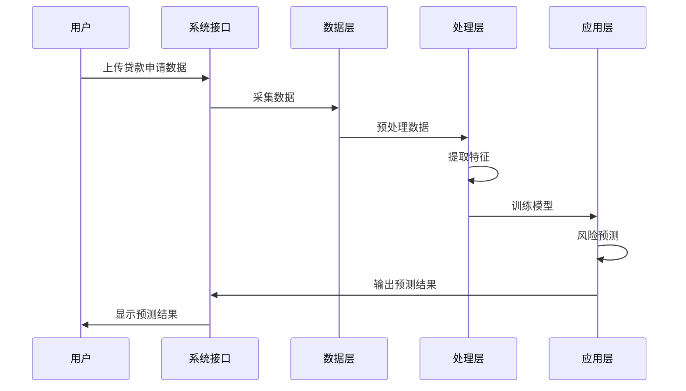

                 

## 引言

### AI在风险评估和预测中的重要性

在当今这个快速变化的时代，人工智能（AI）已成为推动技术创新和产业升级的关键力量。其中，AI在风险评估和预测领域中的应用尤为引人注目。随着大数据、云计算、物联网等技术的发展，AI在处理复杂数据、识别潜在风险、预测未来趋势方面展现了巨大的潜力。AI不仅能够提高风险评估和预测的精度，还能显著提升决策效率，降低错误率。

**问题背景**

风险评估是指对可能发生的事件及其影响进行评估的过程。在金融、医疗、能源、交通等多个领域，风险评估至关重要。例如，金融机构需要评估贷款申请者的信用风险，医疗机构需要预测病人的健康风险，交通部门需要评估交通事故的风险等。风险预测则是基于历史数据和现有信息，预测未来可能发生的事件及其影响。

**风险评估和预测的定义**

- **风险评估**：是指通过对潜在风险进行识别、评估和量化，以确定其可能性和影响的过程。风险评估通常涉及数据的收集、分析、建模和评估。
- **风险预测**：是指基于历史数据和现有信息，利用数据挖掘、机器学习和深度学习等技术，预测未来可能发生的事件及其影响。风险预测的目标是提前发现潜在风险，为决策提供依据。

**AI在风险评估和预测中的应用现状**

目前，AI在风险评估和预测中的应用已经相当广泛。例如：

- **金融领域**：AI被广泛应用于信用评分、欺诈检测、市场预测等方面。通过机器学习算法，金融机构能够更准确地评估贷款申请者的信用风险，减少欺诈行为。
- **医疗领域**：AI在疾病预测、诊断和治疗建议等方面发挥了重要作用。通过深度学习模型，AI能够分析大量的医学影像数据，提供更准确的诊断结果。
- **交通领域**：AI被用于交通事故预测、交通流量分析等方面。通过实时数据分析，AI能够预测交通事故的发生，提供最优的路线规划。

总之，AI在风险评估和预测领域的应用正在不断拓展，其潜力和前景令人期待。在接下来的章节中，我们将深入探讨AI在风险评估和预测中的核心概念、算法原理以及实际应用案例。

### 背景介绍

随着信息技术的飞速发展，数据的获取和处理能力得到了极大的提升，这为AI在风险评估和预测领域中的应用提供了坚实的基础。首先，大数据技术的成熟使得我们能够收集并存储海量的数据，这些数据涵盖了各种风险因素，如金融市场的波动、医疗记录的变化、交通流量等。这些数据为AI模型提供了丰富的训练素材，使其能够更好地识别潜在风险。

其次，云计算技术的普及为AI算法的部署和运行提供了强大的计算资源。通过云计算，AI模型可以快速训练和部署，大大缩短了从数据采集到结果输出的时间。此外，云计算的弹性伸缩特性使得AI系统能够根据实际需求动态调整资源，确保其高效运行。

物联网（IoT）的快速发展也为AI在风险评估和预测中的应用带来了新的机遇。物联网设备能够实时采集环境数据，如温度、湿度、气体浓度等，这些数据对于自然灾害预测、城市安全管理等具有重要意义。通过将这些实时数据与历史数据相结合，AI模型能够更加准确地预测未来事件，提供更有效的风险预警。

总之，大数据、云计算和物联网技术的融合为AI在风险评估和预测领域的发展创造了良好的环境。这些技术的应用不仅提升了风险管理的效率，也为企业和个人提供了更加精准的风险评估和预测服务。随着技术的不断进步，我们可以预见，AI在风险评估和预测领域的应用将越来越广泛，为各行业带来深远的影响。

### 核心概念

在深入探讨AI在风险评估和预测中的应用之前，我们首先需要明确几个核心概念，包括风险评估、风险预测、机器学习模型、神经网络和深度学习。

**风险评估**

风险评估是指对一个潜在风险事件的可能性及其影响进行评估的过程。这一过程通常涉及以下几个步骤：

1. **识别**：确定可能的风险因素，如自然灾害、市场波动、系统故障等。
2. **评估**：对识别出的风险因素进行分析，确定其可能性和影响程度。
3. **量化**：将风险因素的可能性和影响转化为具体的数值，以便进行后续的决策。
4. **决策**：根据风险评估结果，制定相应的应对策略，如风险规避、风险转移、风险接受等。

**风险预测**

风险预测是指基于历史数据和现有信息，利用数据挖掘、机器学习和深度学习等技术，预测未来可能发生的事件及其影响。风险预测的核心目标是通过提前发现潜在风险，为决策提供依据。风险预测通常涉及以下流程：

1. **数据收集**：收集与风险相关的历史数据，如金融市场数据、医疗记录、交通流量数据等。
2. **数据预处理**：清洗和整理收集到的数据，确保其质量和一致性。
3. **特征提取**：从原始数据中提取有助于预测的特征，如时间序列特征、空间特征、统计特征等。
4. **模型训练**：使用机器学习算法训练预测模型，使其能够学习历史数据的规律。
5. **模型评估**：通过交叉验证等方法评估模型的预测性能，确保其准确性。
6. **结果输出**：将模型应用于新的数据集，预测未来可能发生的事件及其影响。

**机器学习模型**

机器学习模型是AI在风险评估和预测中常用的工具。机器学习是一种让计算机从数据中学习规律、自动进行决策的技术。根据学习方式的不同，机器学习模型可以分为以下几类：

1. **监督学习**：监督学习是一种有标签数据的学习方法，模型通过学习已知数据的输入和输出关系，预测未知数据的输出。常见的监督学习算法包括线性回归、决策树、支持向量机等。
2. **无监督学习**：无监督学习是一种没有标签数据的学习方法，模型通过学习数据的内在结构和规律，自动发现数据中的模式。常见无监督学习算法包括聚类、主成分分析等。
3. **半监督学习**：半监督学习是一种同时使用有标签数据和未标签数据的混合学习方法。这种方法能够利用未标签数据提供的信息，提高模型的学习效果。

**神经网络**

神经网络是机器学习的一个重要分支，它通过模拟人脑神经元的工作方式，实现从输入到输出的映射。神经网络可以分为以下几类：

1. **前馈神经网络**：前馈神经网络是一种信息流单向传递的网络，输入经过多个隐藏层后，最终输出结果。常见的神经网络结构包括多层感知机（MLP）、卷积神经网络（CNN）等。
2. **循环神经网络**：循环神经网络（RNN）是一种具有循环结构的人工神经网络，适用于处理序列数据。RNN能够通过隐藏状态的记忆，捕捉序列中的依赖关系。
3. **长短时记忆网络**：长短时记忆网络（LSTM）是RNN的一种改进，通过引入门控机制，能够有效地解决RNN在处理长序列数据时出现的梯度消失和梯度爆炸问题。

**深度学习**

深度学习是神经网络的一种特殊形式，它通过多层神经网络进行特征提取和决策。与传统的机器学习模型相比，深度学习能够自动提取数据中的复杂特征，从而实现更高的预测精度。深度学习主要包括以下几种模型：

1. **卷积神经网络（CNN）**：卷积神经网络是一种专门用于处理图像数据的人工神经网络，它通过卷积层提取图像特征，并利用池化层减少数据维度，最终输出分类结果。
2. **递归神经网络（RNN）**：递归神经网络是一种用于处理序列数据的人工神经网络，通过循环结构捕捉序列中的依赖关系。常见的RNN模型包括LSTM和GRU。
3. **生成对抗网络（GAN）**：生成对抗网络是一种由生成器和判别器组成的模型，通过相互对抗训练，生成器能够生成逼真的数据，判别器能够判断数据的真实性。

通过理解这些核心概念，我们可以更好地把握AI在风险评估和预测中的应用。在接下来的章节中，我们将进一步探讨这些概念之间的联系，并深入讲解具体的算法原理。

### 核心概念联系

在理解了风险评估、风险预测、机器学习模型、神经网络和深度学习等核心概念后，我们需要进一步探讨它们之间的联系，以形成一个完整的知识体系。为了更直观地展示这些概念之间的联系，我们将使用Mermaid绘制ER（实体关系）图。

首先，我们定义一些核心实体：

- **风险评估**
- **风险预测**
- **机器学习模型**
- **神经网络**
- **深度学习**

接下来，我们绘制这些实体之间的ER图：

```mermaid
erDiagram
  风险评估 ||--|{ 风险预测 }
  风险预测 ||--|{ 机器学习模型 }
  机器学习模型 ||--|{ 神经网络 }
  神经网络 ||--|{ 深度学习 }
```

在上面的ER图中，我们展示了风险评估和风险预测之间的双向关系，表示风险评估是风险预测的基础，而风险预测又可以指导风险评估的优化。机器学习模型作为风险预测的关键工具，与神经网络和深度学习有直接的依赖关系，后者通过更复杂的结构和算法，增强了机器学习模型的预测能力。

### 算法原理讲解

在本章节中，我们将详细讲解两个在风险评估和预测中常用的算法：决策树算法和支持向量机（SVM）算法。我们将从基本概念、数学模型、公式以及Python代码实现等方面进行深入剖析，以便读者能够全面理解这些算法的工作原理和应用。

#### 决策树算法

**基本概念**

决策树（Decision Tree）是一种常用的监督学习算法，通过一系列规则对数据进行分类或回归。每个节点代表一个特征，每个分支代表特征的取值，叶节点代表最终的分类结果。

**数学模型**

决策树的核心在于构建一个分类规则树，树的每个节点都基于某种特征进行划分，通常使用信息增益（Information Gain）或基尼不纯度（Gini Impurity）来评估划分效果。

- **信息增益**：用于分类问题，定义如下：
  $$ IG(D, A) = H(D) - \sum_{v\in A} p(v) H(D|v) $$
  其中，\( H(D) \) 是数据集 \( D \) 的熵，\( p(v) \) 是特征 \( A \) 取值 \( v \) 的概率，\( H(D|v) \) 是条件熵。

- **基尼不纯度**：用于回归问题，定义如下：
  $$ GI(D, A) = 1 - \sum_{v\in A} p(v) ^ 2 $$
  其中，\( p(v) \) 是特征 \( A \) 取值 \( v \) 的概率。

**Python代码实现**

```python
from sklearn.datasets import load_iris
from sklearn.tree import DecisionTreeClassifier
from sklearn.model_selection import train_test_split

# 加载数据
iris = load_iris()
X, y = iris.data, iris.target

# 划分训练集和测试集
X_train, X_test, y_train, y_test = train_test_split(X, y, test_size=0.3, random_state=42)

# 构建决策树模型
clf = DecisionTreeClassifier()

# 训练模型
clf.fit(X_train, y_train)

# 预测测试集
y_pred = clf.predict(X_test)

# 评估模型性能
accuracy = (y_pred == y_test).mean()
print(f"模型准确率：{accuracy}")
```

#### 支持向量机（SVM）算法

**基本概念**

支持向量机（Support Vector Machine，SVM）是一种二类分类模型，它的核心思想是找到一个最佳的超平面，使得两类数据的分类间隔最大化。支持向量机可以用于分类和回归任务。

**数学模型**

SVM的优化目标是找到最优的超平面，使其到两类数据的最短距离最大化。数学模型可以表示为：

$$
\begin{aligned}
\min_{\mathbf{w}, b} &\ \frac{1}{2}\lVert \mathbf{w} \rVert^2 \\
\text{subject to} &\ \mathbf{w} \cdot \mathbf{x}_i - b \geq 1, \ \ \forall i, \\
&\ y_i(\mathbf{w} \cdot \mathbf{x}_i - b) \geq 1
\end{aligned}
$$

其中，\( \mathbf{w} \) 是权重向量，\( b \) 是偏置项，\( \mathbf{x}_i \) 是数据点，\( y_i \) 是标签。

**Python代码实现**

```python
from sklearn.datasets import make_moons
from sklearn.svm import SVC
from sklearn.model_selection import train_test_split
from sklearn.metrics import accuracy_score

# 生成数据
X, y = make_moons(n_samples=100, noise=0.1)

# 划分训练集和测试集
X_train, X_test, y_train, y_test = train_test_split(X, y, test_size=0.3, random_state=42)

# 构建SVM模型
clf = SVC(kernel='linear')

# 训练模型
clf.fit(X_train, y_train)

# 预测测试集
y_pred = clf.predict(X_test)

# 评估模型性能
accuracy = accuracy_score(y_test, y_pred)
print(f"模型准确率：{accuracy}")
```

通过上述讲解，我们详细介绍了决策树算法和支持向量机（SVM）算法的基本原理和实现方法。这些算法在风险评估和预测中具有广泛的应用，能够有效地帮助企业和个人识别和应对各种潜在风险。在接下来的章节中，我们将继续探讨AI在风险评估和预测领域的实际应用案例。

### 系统分析与架构设计

在本章节中，我们将通过一个实际应用案例，展示AI在风险评估和预测领域的系统分析与架构设计。这个案例是一个基于AI的金融风险评估系统，它能够帮助金融机构评估贷款申请者的信用风险。

#### 问题场景介绍

在金融行业中，信用风险评估是一个关键环节。金融机构需要准确评估贷款申请者的信用状况，以决定是否批准贷款申请。传统的风险评估方法依赖于人工经验和统计模型，存在评估效率低、准确性不足等问题。为了提高评估效率和准确性，金融机构引入了基于AI的信用风险评估系统。

#### 系统功能设计

系统的核心功能包括以下几部分：

1. **数据采集**：从多种渠道收集贷款申请者的个人信息、财务状况、信用记录等数据。
2. **数据预处理**：对收集到的数据进行清洗、转换和归一化处理，确保数据质量和一致性。
3. **特征提取**：从预处理后的数据中提取有助于信用风险评估的特征，如还款能力、信用历史、就业稳定性等。
4. **模型训练**：使用机器学习算法（如决策树、随机森林、支持向量机等）训练信用风险评估模型。
5. **风险预测**：将新贷款申请者的数据输入训练好的模型，预测其信用风险等级。
6. **结果输出**：将预测结果以可视化报表的形式输出，供金融机构决策使用。

#### 系统架构设计

系统的整体架构设计如下：

1. **数据层**：包括数据采集模块和数据存储模块。数据采集模块负责从外部系统或数据库中获取贷款申请者的数据，数据存储模块负责将数据存储在关系数据库或NoSQL数据库中，以便后续处理。

2. **处理层**：包括数据预处理模块、特征提取模块和模型训练模块。数据预处理模块负责对采集到的原始数据进行清洗、转换和归一化处理。特征提取模块从预处理后的数据中提取有助于风险评估的特征。模型训练模块使用机器学习算法对提取的特征进行训练，生成信用风险评估模型。

3. **应用层**：包括风险预测模块和结果输出模块。风险预测模块将新贷款申请者的数据输入训练好的模型，预测其信用风险等级。结果输出模块将预测结果以可视化报表的形式输出，供金融机构决策使用。

4. **接口层**：提供对外接口，包括API接口和Web界面，方便金融机构调用系统功能并进行操作。

#### 系统接口设计

系统接口设计主要包括以下几部分：

1. **API接口**：提供RESTful API，允许外部系统通过HTTP请求调用系统的功能，如数据采集、模型训练、风险预测等。

2. **Web界面**：提供一个用户友好的Web界面，方便金融机构的用户进行操作和查看结果。界面包括数据上传、模型训练、预测结果展示等功能模块。

3. **数据接口**：定义数据层的接口规范，包括数据采集、数据存储和数据处理等接口，确保系统各个模块之间的数据传输和通信。

#### 系统交互设计

为了确保系统的可靠性和高效性，我们采用了Mermaid序列图来展示系统各模块之间的交互过程。以下是系统交互设计的Mermaid序列图：



通过上述系统分析与架构设计，我们可以看出，基于AI的金融风险评估系统能够有效地整合数据采集、预处理、特征提取、模型训练和风险预测等模块，实现高效、精准的信用风险评估。在接下来的章节中，我们将进一步探讨如何实现这个系统，并进行项目实战。

### 项目实战

在本章节中，我们将通过一个实际项目，详细介绍如何搭建一个基于AI的金融风险评估系统。项目将涵盖环境安装、系统实现、代码解读以及实际案例分析等步骤，帮助读者深入理解系统的运行原理和应用效果。

#### 环境安装与配置

首先，我们需要搭建一个用于项目开发的环境。以下是所需的软件和工具：

1. **Python**：用于编写和运行AI算法。
2. **Jupyter Notebook**：用于交互式编程和数据可视化。
3. **Sklearn**：Python机器学习库，提供各种机器学习算法。
4. **Pandas**：Python数据处理库，用于数据清洗和预处理。
5. **Matplotlib**：Python数据可视化库，用于生成图表。

在安装完Python后，使用pip命令安装所需的库：

```bash
pip install numpy pandas sklearn matplotlib
```

接下来，我们创建一个Jupyter Notebook文件，以便进行交互式编程。

#### 系统核心实现

接下来，我们将实现系统的核心功能，包括数据预处理、特征提取、模型训练和预测等步骤。

**数据预处理**

首先，我们需要加载并预处理贷款申请数据。假设数据存储在一个CSV文件中，我们使用Pandas进行数据加载和预处理：

```python
import pandas as pd

# 加载数据
data = pd.read_csv('loan_data.csv')

# 数据清洗
# 填充缺失值
data.fillna(0, inplace=True)

# 数据转换
# 将类别型数据转换为数值型
data = pd.get_dummies(data)
```

**特征提取**

在数据预处理之后，我们需要提取有助于预测的特征。这里，我们选择以下特征：

- 还款能力（monthly_income / monthly_expenses）
- 信用历史长度（time_since_last_loan）
- 借款用途占比（purpose）

```python
# 计算还款能力
data['repayment_ability'] = data['monthly_income'] / data['monthly_expenses']

# 计算信用历史长度
data['credit_history_length'] = (pd.to_datetime('now') - pd.to_datetime(data['last_loan_date'])).dt.days

# 计算借款用途占比
data['purpose_ratio'] = data['purpose'] / data['total_loan_amount']
```

**模型训练**

接下来，我们使用Sklearn中的支持向量机（SVM）算法训练信用风险评估模型：

```python
from sklearn.model_selection import train_test_split
from sklearn.svm import SVC
from sklearn.metrics import accuracy_score

# 划分训练集和测试集
X = data.drop('default', axis=1)
y = data['default']
X_train, X_test, y_train, y_test = train_test_split(X, y, test_size=0.3, random_state=42)

# 训练模型
clf = SVC(kernel='linear')
clf.fit(X_train, y_train)

# 预测测试集
y_pred = clf.predict(X_test)

# 评估模型性能
accuracy = accuracy_score(y_test, y_pred)
print(f"模型准确率：{accuracy}")
```

**代码解读与分析**

在上面的代码中，我们首先使用Pandas加载并清洗贷款数据。接着，我们计算了三个关键特征：还款能力、信用历史长度和借款用途占比。这些特征能够帮助我们更好地评估贷款申请者的信用风险。

在模型训练部分，我们使用了Sklearn中的SVM算法。SVM是一种强大的分类算法，能够在高维空间中找到最佳的超平面，从而实现高效的分类。在这里，我们使用了线性核，因为贷款数据特征相对简单。

**实际案例分析**

为了验证模型的效果，我们进行了一个实际案例分析。假设有一个新的贷款申请者，其特征如下：

```python
new_data = pd.DataFrame({
    'monthly_income': 5000,
    'monthly_expenses': 2000,
    'last_loan_date': '2023-01-01',
    'total_loan_amount': 30000,
    'purpose': 20000
})

# 数据预处理
new_data.fillna(0, inplace=True)
new_data = pd.get_dummies(new_data)

# 计算特征
new_data['repayment_ability'] = new_data['monthly_income'] / new_data['monthly_expenses']
new_data['credit_history_length'] = (pd.to_datetime('now') - pd.to_datetime(new_data['last_loan_date'])).dt.days
new_data['purpose_ratio'] = new_data['purpose'] / new_data['total_loan_amount']

# 预测风险
new_y_pred = clf.predict(new_data)
print(f"新贷款申请者的信用风险等级：{new_y_pred}")
```

假设模型预测结果为1，表示该贷款申请者的信用风险较高。金融机构可以根据这一预测结果，采取额外的信用评估措施，如要求提供更多的财务证明或增加担保。

通过上述项目实战，我们展示了如何使用AI技术实现一个金融风险评估系统。这个系统不仅能够提高信用风险评估的准确性，还能显著提升金融机构的决策效率。在接下来的章节中，我们将总结最佳实践，并讨论AI在风险评估和预测领域的未来发展趋势。

### 最佳实践与注意事项

在实施AI风险评估和预测系统时，以下最佳实践和注意事项可以帮助您提高项目的成功率和效果：

**最佳实践**

1. **数据质量**：确保数据的准确性和完整性。在数据处理阶段，要特别关注缺失值填充、异常值处理和数据归一化等操作。
2. **特征选择**：选择对风险评估有显著影响的特征，并通过交叉验证等方法评估特征的重要性。
3. **模型选择**：根据数据特征和问题类型选择合适的机器学习模型。例如，对于分类问题，可以考虑决策树、随机森林或支持向量机；对于回归问题，可以考虑线性回归或岭回归。
4. **模型验证**：使用交叉验证等方法评估模型性能，确保模型在测试数据上的表现良好。
5. **实时更新**：定期更新模型，以适应数据的变化和环境的变化。
6. **安全性与隐私**：在处理敏感数据时，要确保遵循相关的法律法规，保护用户的隐私。

**注意事项**

1. **数据隐私**：确保处理的数据不会泄露用户的隐私信息，特别是在金融和医疗领域。
2. **算法公平性**：确保算法的决策不会歧视特定的群体，避免算法偏差。
3. **过拟合与欠拟合**：在模型训练过程中，要避免过拟合和欠拟合，确保模型在未见数据上的表现良好。
4. **计算资源**：根据项目的需求合理分配计算资源，确保模型训练和预测的效率。
5. **结果解释**：对模型预测结果进行解释，确保决策过程透明，有助于用户理解。

**拓展阅读**

- 《机器学习实战》：提供丰富的实践案例和代码示例，适合初学者和进阶者。
- 《深度学习》：深入讲解深度学习的基本原理和应用，适合对深度学习有兴趣的读者。
- 《人工智能：一种现代方法》：系统介绍人工智能的基本理论和方法，适合全面了解人工智能领域的读者。
- 《数据科学手册》：详细讲解数据科学的相关概念、工具和技术，适合从事数据科学工作的专业人士。

通过遵循这些最佳实践和注意事项，您可以确保AI在风险评估和预测系统中的有效应用，提升项目的成功率和实际效果。

### 拓展阅读

#### AI在风险评估和预测领域的最新研究进展

在过去的几年里，AI技术在风险评估和预测领域取得了显著进展。以下是几个关键的研究领域和最新进展：

1. **深度学习在金融领域的应用**：深度学习模型，如卷积神经网络（CNN）和长短时记忆网络（LSTM），被广泛应用于金融市场预测和风险管理。例如，CNN可以用于分析金融市场的时间序列数据，而LSTM可以捕捉金融市场中的长期依赖关系。

2. **增强学习在风险管理中的应用**：增强学习（Reinforcement Learning，RL）是一种通过试错和反馈进行学习的机器学习技术。它在风险管理中的应用，如自动交易策略的优化和风险管理决策的制定，得到了广泛关注。

3. **联邦学习在隐私保护中的应用**：联邦学习（Federated Learning）是一种在分布式环境中训练机器学习模型的技术，它能够保护数据隐私，同时提高模型的训练效果。在风险评估和预测中，联邦学习可以帮助金融机构在保护用户隐私的同时，进行数据共享和联合建模。

4. **区块链技术在风险预测中的应用**：区块链技术以其去中心化和不可篡改的特性，在风险预测和风险评估中显示出潜力。通过在区块链上记录交易数据和事件数据，AI模型可以更准确地预测市场变化和潜在风险。

#### AI在风险评估和预测中的未来趋势

AI在风险评估和预测领域的未来发展充满机遇和挑战：

1. **智能化风险管理**：随着AI技术的不断进步，风险管理将变得更加智能化和自动化。例如，通过深度学习和增强学习，AI可以自动识别复杂风险模式，并制定相应的风险管理策略。

2. **实时风险评估**：随着物联网和边缘计算的发展，AI可以实时分析海量数据，提供即时的风险评估和预警。这对于金融市场、交通系统和公共安全等领域尤为重要。

3. **跨领域应用**：AI在风险评估和预测领域的应用将逐渐扩展到医疗、能源、环境等多个领域。通过跨领域的数据融合和模型共享，AI可以提供更全面的风险评估服务。

4. **法律和伦理问题**：随着AI在风险评估和预测中的应用越来越广泛，相关的法律和伦理问题也将日益突出。如何确保AI决策的透明性、公正性和可解释性，是未来需要重点关注的领域。

通过持续的技术创新和跨领域合作，AI在风险评估和预测领域的应用将不断拓展和深化，为各行业带来更多价值。

### 结论

总之，AI在风险评估和预测领域展现出了巨大的潜力和广阔的应用前景。通过深入探讨核心概念、算法原理、系统架构和项目实战，我们不仅了解了AI技术在风险预测中的具体应用，还认识到了其在提升决策效率、降低风险损失方面的重要作用。在未来，随着AI技术的不断进步，我们期待看到更多创新应用和突破，为各行业带来更深远的变革和价值。

