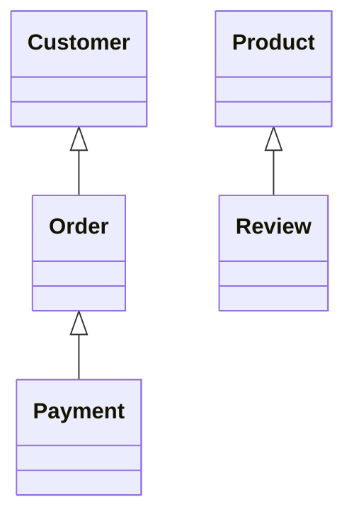
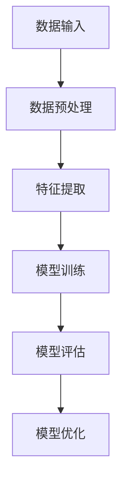
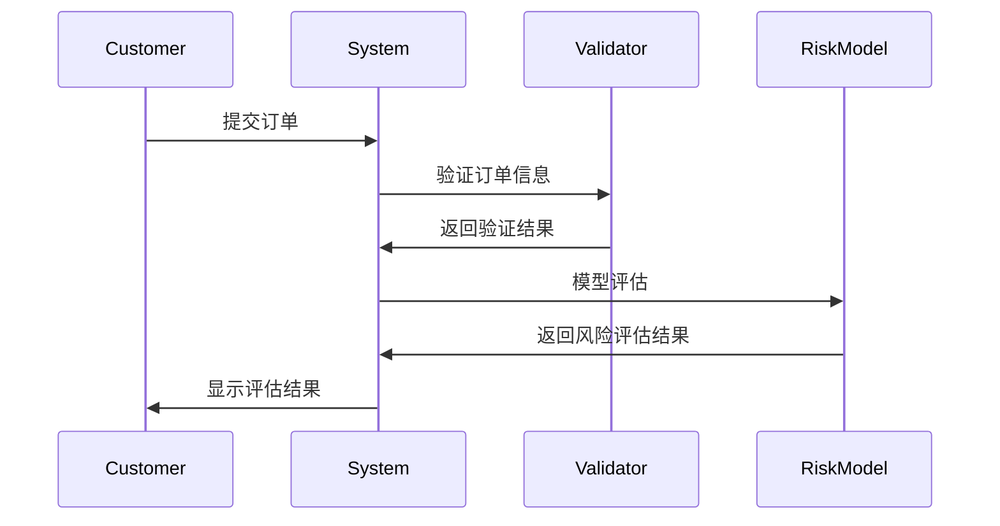

                 

**文章标题**：AI在高维度问题解决中的策略创新

**关键词**：人工智能、高维度问题、策略创新、机器学习、深度学习、算法、系统架构

**摘要**：
本文旨在探讨人工智能（AI）在高维度问题解决中的策略创新。随着数据量的激增和数据复杂度的提升，高维度问题成为了众多领域的瓶颈。本文首先介绍了AI的基本概念和高维度问题的特征，随后详细阐述了针对高维度问题的策略创新方法。通过具体的算法原理讲解、系统分析与架构设计方案，以及项目实战案例分析，本文旨在为读者提供对AI在高维度问题解决中策略创新的深刻理解。

**目录大纲设计**

----------------------------------------------------------------

## **AI在高维度问题解决中的策略创新**

> 关键词：人工智能、高维度问题、策略创新

> 摘要：本文介绍了AI在高维度问题解决中的策略创新，包括问题的背景、核心概念、策略创新方法以及具体的解决方案。

----------------------------------------------------------------

### 1. 背景介绍

#### 1.1 书名与核心概念

- **书名**：《AI在高维度问题解决中的策略创新》
- **核心概念**：人工智能、高维度问题、策略创新。

#### 1.2 问题描述

- **AI在处理高维度问题时的挑战**：数据量庞大、维度高度相关、计算复杂度高等。
- **策略创新的重要性**：如何在高维空间中有效处理数据和问题。

#### 1.3 问题解决

- **不同的策略和创新方法**：降维技术、特征选择、模型优化等。
- **如何应用AI解决高维度问题**：机器学习、深度学习等技术。

#### 1.4 边界与外延

- **高维度的定义**：维度数量远大于数据样本数量。
- **典型的高维度问题领域**：数据挖掘、图像处理、金融分析等。
- **当前研究的局限性**：对复杂高维度问题的处理能力仍有限。

#### 1.5 概念结构与核心要素组成

- **AI技术**：机器学习、深度学习、神经网络等。
- **高维度数据处理**：降维技术、特征选择等。
- **策略创新方法**：模型优化、算法改进等。

----------------------------------------------------------------

### 2. 核心概念与联系

#### 2.1 AI概念介绍

- **机器学习**：算法通过学习数据来预测或决策。
- **深度学习**：多层神经网络，可以处理复杂的数据结构。
- **神经网络**：模仿人脑结构和功能，处理输入输出数据。

#### 2.2 高维度问题特征对比表格

| 问题领域 | 特征1 | 特征2 | 特征3 |
| --- | --- | --- | --- |
| 数据挖掘 | 维度多 | 数据量大 | 非线性 |
| 图像处理 | 像素多 | 结构复杂 | 关联性 |
| 金融分析 | 参数多 | 变化快 | 数据冗余 |

#### 2.3 ER实体关系图

```mermaid
erDiagram
  Product ||--|{ Customer } Customer
  Customer ||--|{ Order } Order
```

----------------------------------------------------------------

### 3. 算法原理讲解

#### 3.1 算法流程图


#### 3.2 Python源代码

```python
# Python代码示例
import numpy as np

# 数据预处理
def preprocess_data(data):
    # 省略具体代码
    return processed_data

# 特征提取
def extract_features(data):
    # 省略具体代码
    return features

# 模型训练
def train_model(features, labels):
    # 省略具体代码
    return model

# 模型评估
def evaluate_model(model, test_data, test_labels):
    # 省略具体代码
    return accuracy

# 模型优化
def optimize_model(model, features, labels):
    # 省略具体代码
    return optimized_model
```

#### 3.3 数学模型和公式

$$
\text{损失函数} = \frac{1}{2}\sum_{i=1}^{n} (\hat{y}_i - y_i)^2
$$

#### 3.4 举例说明

假设我们有一个数据集，其中包含了100个样本，每个样本有10个特征。我们使用机器学习算法来预测样本的类别。以下是具体的步骤：

1. **数据输入**：加载数据集，并进行预处理。
2. **特征提取**：提取数据中的关键特征。
3. **模型训练**：使用训练数据集来训练模型。
4. **模型评估**：使用测试数据集来评估模型的性能。
5. **模型优化**：根据评估结果来调整模型参数。

----------------------------------------------------------------

### 4. 系统分析与架构设计方案

#### 4.1 问题场景介绍

以金融风控领域为例，高维度问题体现在大量的金融数据和复杂的业务逻辑中。

#### 4.2 项目介绍

本项目旨在构建一个智能风控系统，通过AI技术识别和预防金融风险。

#### 4.3 系统功能设计

使用Mermaid绘制领域模型类图：



#### 4.4 系统架构设计

使用Mermaid绘制系统架构图：



#### 4.5 系统接口设计和系统交互

使用Mermaid绘制接口设计和系统交互序列图：



----------------------------------------------------------------

### 5. 项目实战

#### 5.1 环境安装

- 安装Python环境：`pip install numpy`
- 安装机器学习库：`pip install scikit-learn`
- 安装深度学习库：`pip install tensorflow`

#### 5.2 系统核心实现源代码

```python
# 导入库
import numpy as np
from sklearn.model_selection import train_test_split
from sklearn.ensemble import RandomForestClassifier
from sklearn.metrics import accuracy_score

# 加载数据
data = np.load('data.npy')
labels = np.load('labels.npy')

# 数据预处理
processed_data = preprocess_data(data)

# 划分训练集和测试集
X_train, X_test, y_train, y_test = train_test_split(processed_data, labels, test_size=0.2)

# 模型训练
model = RandomForestClassifier()
model.fit(X_train, y_train)

# 模型评估
predictions = model.predict(X_test)
accuracy = accuracy_score(y_test, predictions)
print("Accuracy:", accuracy)
```

#### 5.3 代码应用解读与分析

- **数据预处理**：清洗和标准化数据。
- **模型选择**：选择随机森林分类器。
- **模型训练**：使用训练数据进行模型训练。
- **模型评估**：使用测试数据进行模型评估。

#### 5.4 实际案例分析和详细讲解剖析

假设我们有一个客户群体，每个客户有10个特征，包括收入、年龄、信用评分等。我们使用随机森林算法来预测客户是否违约。

1. **数据加载**：加载客户的特征数据和标签（是否违约）。
2. **数据预处理**：对特征进行清洗和标准化。
3. **模型训练**：使用训练数据进行随机森林分类器的训练。
4. **模型评估**：使用测试数据进行模型评估，计算准确率。

#### 5.5 项目小结

本项目通过实际案例展示了如何使用AI技术解决高维度问题。通过模型训练和评估，我们验证了模型在金融风控领域的有效性。未来可以进一步优化模型，提高预测准确性。

----------------------------------------------------------------

### 6. 最佳实践 tips、小结、注意事项、拓展阅读

#### 6.1 总结书中的关键点

- **核心概念**：AI、高维度问题、策略创新。
- **解决方案**：机器学习、深度学习、模型优化等。

#### 6.2 注意事项

- **数据预处理**：确保数据质量，进行有效清洗和标准化。
- **模型选择**：根据问题特点选择合适的算法。
- **模型优化**：持续调整模型参数，提高模型性能。

#### 6.3 拓展阅读

- **进一步学习资源**：
  - 《深度学习》
  - 《Python机器学习》
  - 《人工智能：一种现代方法》

----------------------------------------------------------------

**步骤总结**：

- 明确核心概念和结构。
- 设计详细章节内容，确保完整和有条理。
- 使用Markdown格式，确保清晰和易于阅读。
- 遵循内容完整性要求，不遗漏关键点。

现在，我们可以开始撰写详细的文章内容。根据上述目录大纲，逐步填充每个章节的内容。确保每个章节都有明确的目标和详细的内容。让我们一起一步一步深入分析AI在高维度问题解决中的策略创新。Let's think step by step!

