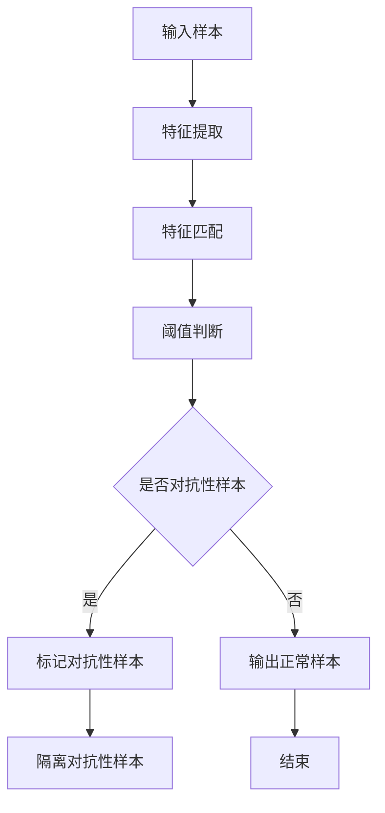
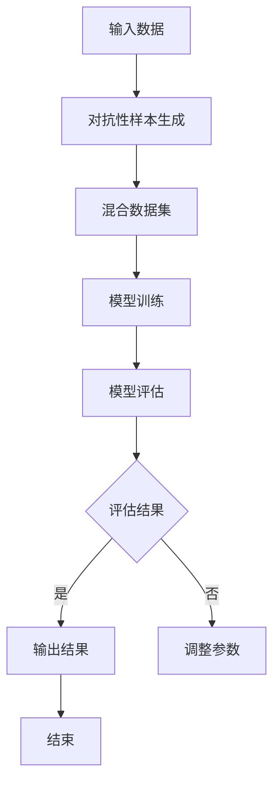
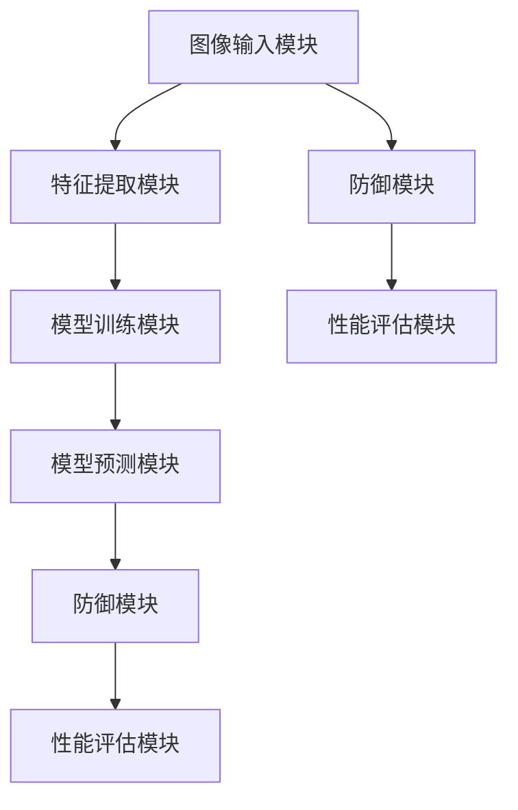
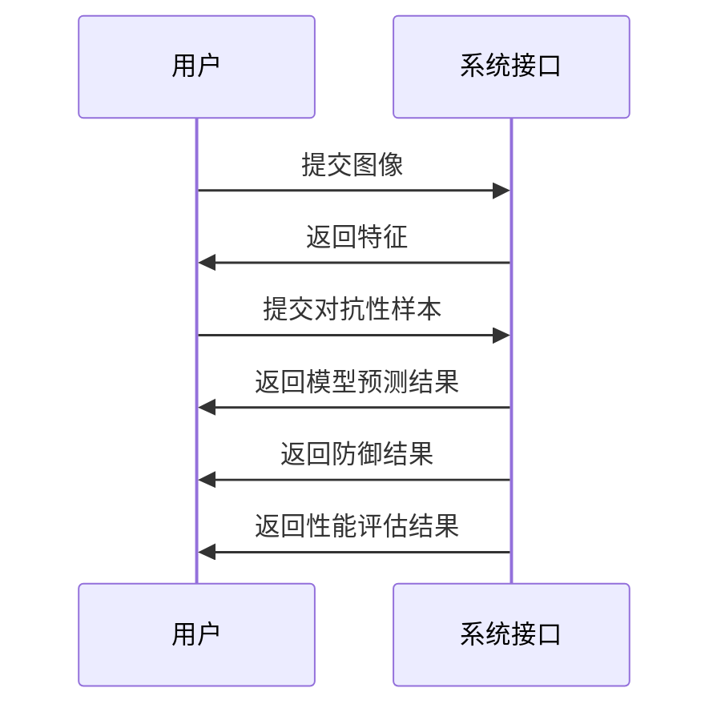

                 

### 文章标题

# AI安全性：防御对抗性攻击的新方法

## 关键词

- AI安全性
- 对抗性攻击
- 防御方法
- 模型增强
- 鲁棒性提升

## 摘要

随着人工智能（AI）技术的飞速发展，其在各个领域的应用越来越广泛，然而AI系统的安全性问题也日益凸显。特别是在面对对抗性攻击时，传统的安全防御方法显得力不从心。本文将深入探讨AI安全性中的对抗性攻击问题，分析其概念与原理，阐述当前AI安全性面临的挑战，介绍核心概念与联系，讲解对抗性攻击检测和防御算法原理，并给出系统分析与架构设计方案。通过实际案例分析和项目实战，本文旨在为AI安全性的防御提供新的思路和方法。

## 第一部分：背景介绍

### 1.1 AI安全性的背景和现状

人工智能作为21世纪最具革命性的技术之一，正在改变我们的生活方式和工作模式。从智能家居到自动驾驶，从医疗诊断到金融分析，AI技术的应用已经深入到各个领域。然而，随着AI技术的广泛应用，AI系统的安全性问题也日益凸显。AI系统往往依赖于大量的数据和复杂的算法，这使得它们成为潜在的攻击目标。特别是对抗性攻击，这种针对AI系统的特殊类型的攻击，已经成为AI安全性的主要威胁之一。

当前，AI安全性面临的主要挑战包括数据安全与隐私保护、模型鲁棒性与可信性以及对抗性攻击的防御方法研究等。数据安全与隐私保护方面，由于AI系统依赖大量数据，这些数据的安全性和隐私保护成为一个巨大的挑战。任何数据泄露或滥用都可能导致严重的后果。模型鲁棒性与可信性方面，AI系统在面临对抗性攻击时，其性能和准确性可能大幅下降，从而影响系统的稳定性和可靠性。对抗性攻击防御方法的研究方面，目前的研究主要集中在检测和防御技术，但仍然面临着很多挑战。

### 1.2 AI安全性问题的提出和重要性

AI安全性问题的提出源于AI技术的广泛应用及其带来的潜在风险。随着AI技术的不断发展，AI系统在各个领域的应用越来越广泛，这无疑为我们的生活带来了巨大的便利。然而，AI系统也成为了攻击者攻击的新目标。特别是对抗性攻击，这种通过精心设计的输入来误导AI系统的方法，已经引起了广泛关注。

AI安全性问题的重要性体现在多个方面。首先，AI系统的安全性直接关系到其稳定性和可靠性。如果AI系统在面对对抗性攻击时无法正常工作，这将对社会和经济造成严重影响。其次，AI系统的安全性问题还涉及到数据安全和隐私保护。AI系统依赖大量的数据，这些数据的安全性和隐私保护至关重要。最后，AI安全性问题也关乎社会道德和法律。如果AI系统被恶意利用，这将对社会秩序和人类价值观产生深远的影响。

### 1.3 当前AI安全性的研究现状和挑战

当前，AI安全性的研究已经取得了一定的进展，但仍面临着诸多挑战。在数据安全与隐私保护方面，研究者们提出了一系列数据加密、去识别化和数据共享机制，以保护数据的安全性和隐私。然而，这些方法往往在性能和安全性之间存在着权衡，如何在保证数据安全的同时不影响AI系统的性能，仍然是一个重要的研究方向。

在模型鲁棒性与可信性方面，研究者们提出了一些增强模型鲁棒性的方法，如模型正则化、数据增强和对抗训练等。这些方法在一定程度上提高了模型的鲁棒性，但在面对复杂的对抗性攻击时，仍然存在一定的局限性。如何进一步提高模型的鲁棒性和可信性，是当前研究的一个关键问题。

在对抗性攻击防御方法的研究方面，研究者们提出了多种检测和防御技术。例如，基于深度学习的检测方法、基于神经网络的防御方法等。这些方法在一定程度上提高了对抗性攻击的检测和防御能力，但仍然面临着模型复杂性、计算成本和泛化能力等问题。

总的来说，当前AI安全性的研究仍然处于探索阶段，面临着诸多挑战。未来的研究需要在提高模型鲁棒性和可信性的同时，降低计算成本和提高检测和防御能力，从而为AI系统的安全性提供更有效的保障。

### 2. 对抗性攻击的概念与原理

#### 2.1 对抗性攻击的定义和分类

对抗性攻击（Adversarial Attack）是指通过针对AI模型设计特定的输入，使其输出错误结果的一种攻击方式。对抗性攻击的目标是误导AI模型，使其产生错误的决策或预测。这种攻击方式具有高度的隐蔽性和欺骗性，因为它通过修改输入数据的微小部分来实现，通常难以被人类察觉。

对抗性攻击可以分为以下几类：

1. **白盒攻击（White-Box Attack）**：攻击者拥有对AI模型的内部结构和参数的完全访问权限。这种攻击方式可以设计出更加精准的对抗性样本，因为攻击者可以直接对模型的决策过程进行干预。然而，这种攻击方式对攻击者的技术要求较高，通常只适用于特定的AI模型。

2. **黑盒攻击（Black-Box Attack）**：攻击者没有对AI模型的内部结构和参数的访问权限，只能通过观察模型的输入和输出来进行攻击。这种攻击方式较为隐蔽，但攻击的成功率相对较低，因为它需要通过大量的尝试和错误来找到有效的对抗性样本。

3. **灰盒攻击（Grey-Box Attack）**：攻击者拥有对AI模型的部分内部结构和参数的访问权限，既不完全了解模型的全貌，也不是完全黑盒。这种攻击方式结合了白盒和黑盒攻击的优点，可以在一定程度上提高攻击的成功率。

#### 2.2 对抗性攻击的原理与机制

对抗性攻击的原理基于以下两点：

1. **模型的可分性**：大多数AI模型都是通过对训练数据的分类来实现预测的。然而，这种分类并非绝对准确，总存在一定的误差。攻击者利用这一特性，通过微调输入数据的特征，使其落在模型的错误分类边界上，从而误导模型的决策。

2. **特征的敏感性**：AI模型在训练过程中，会学习到输入数据的特征，并据此进行预测。然而，一些特征对于模型的决策具有更高的敏感性，即微小的变化可能导致模型的决策发生巨大的变化。攻击者利用这一特性，通过精心设计输入数据的微小变化，使其对模型产生误导性影响。

对抗性攻击的机制可以概括为以下步骤：

1. **选择攻击目标**：攻击者首先需要确定攻击的目标，包括AI模型、攻击类型和攻击目标（如错误分类、模型失效等）。

2. **设计对抗性样本**：攻击者根据模型的特性，设计特定的对抗性样本。这通常涉及对输入数据进行微调，使其在视觉上或统计上与原始数据几乎相同，但在模型看来却完全不同。

3. **执行攻击**：攻击者将设计的对抗性样本输入到AI模型中，观察其输出结果。如果攻击成功，模型将产生错误的决策或预测。

4. **评估攻击效果**：攻击者对攻击效果进行评估，包括错误率、攻击成功率等指标。根据评估结果，攻击者可以进一步优化对抗性样本或攻击策略。

#### 2.3 对抗性攻击的特点和影响

对抗性攻击具有以下几个特点：

1. **隐蔽性**：对抗性攻击通过修改输入数据的微小部分来实现，通常难以被人类察觉。这使得对抗性攻击具有高度的隐蔽性，难以被及时发现。

2. **欺骗性**：对抗性攻击利用AI模型对输入数据的特征敏感性，通过精心设计的对抗性样本误导模型，使其产生错误的决策或预测。这种欺骗性使得对抗性攻击具有极高的威胁性。

3. **多样性**：对抗性攻击可以针对不同的AI模型和不同的攻击目标进行设计，具有很高的多样性。这使得对抗性攻击的防御成为一个复杂的任务。

对抗性攻击对AI系统的影响包括：

1. **降低模型性能**：对抗性攻击可以使AI模型产生错误的决策或预测，从而降低其性能和准确性。

2. **破坏系统稳定性**：对抗性攻击可能导致AI系统在特定条件下失效，从而破坏系统的稳定性和可靠性。

3. **威胁数据安全和隐私**：对抗性攻击可能泄露敏感数据或隐私信息，从而威胁数据的安全性和隐私。

总的来说，对抗性攻击对AI系统的安全性和可靠性构成了严重威胁，必须引起足够的重视。在接下来的章节中，我们将进一步探讨AI安全性面临的挑战以及应对这些挑战的方法。

### 3. AI安全性面临的挑战

#### 3.1 数据安全与隐私保护

数据安全与隐私保护是AI安全性的重要方面，AI系统在处理和分析数据时，常常涉及大量的敏感信息，如个人身份信息、健康数据、金融交易记录等。这些数据的泄露或滥用可能导致严重的隐私侵犯和财产损失。因此，确保数据的安全和隐私成为AI安全性研究的关键问题。

为了保护数据安全与隐私，研究者们提出了多种解决方案：

1. **数据加密**：通过加密技术对数据进行保护，确保数据在传输和存储过程中不被未授权访问。常见的加密算法包括对称加密和非对称加密。

2. **匿名化处理**：通过匿名化处理，将敏感数据中的个人身份信息进行替换或删除，从而降低数据泄露的风险。匿名化处理包括数据脱敏、混淆和泛化等技术。

3. **访问控制**：通过访问控制机制，限制对数据的访问权限，确保只有授权用户才能访问敏感数据。访问控制包括用户身份验证、权限管理和审计日志等。

4. **数据共享机制**：通过设计安全的数据共享机制，实现数据在多个用户之间的安全共享。常见的共享机制包括区块链技术和联邦学习等。

尽管上述方法在保护数据安全与隐私方面取得了一定的成效，但仍然面临一些挑战：

- **性能开销**：数据加密和匿名化处理通常需要消耗大量的计算资源和时间，可能影响AI系统的性能。

- **隐私泄露**：即使采用加密和匿名化处理，也无法完全消除隐私泄露的风险。攻击者可能通过其他途径获取敏感信息。

- **合规性**：不同的国家和地区可能有不同的数据保护法规，如何在全球范围内实现数据安全和隐私保护，是一个复杂的法律问题。

#### 3.2 模型鲁棒性与可信性

模型鲁棒性与可信性是AI系统安全性的另一个关键问题。鲁棒性指的是模型在面对不完整、噪声或异常数据时，仍然能够保持良好的性能。可信性则是指模型在执行任务时，能够提供可靠和一致的预测结果。

模型鲁棒性与可信性对AI系统的安全性和稳定性至关重要。例如，自动驾驶系统在面对异常天气或道路条件时，需要具备鲁棒性，以确保行驶安全。医疗诊断系统需要提供可信的预测结果，以帮助医生做出正确的诊断。

为了提高模型鲁棒性与可信性，研究者们提出了以下方法：

1. **数据增强**：通过增加训练数据量、引入噪声和异常值等方式，增强模型的鲁棒性。

2. **模型正则化**：通过正则化技术，如L1正则化、L2正则化等，降低模型的过拟合风险，提高其泛化能力。

3. **对抗训练**：通过对抗训练，生成对抗性样本，使模型在训练过程中逐渐适应对抗性攻击，提高其鲁棒性。

4. **模型评估与监控**：通过定期对模型进行评估和监控，及时发现模型性能下降或异常情况，并进行相应的调整。

然而，提高模型鲁棒性与可信性仍然面临一些挑战：

- **计算成本**：数据增强和对抗训练通常需要大量的计算资源和时间，可能增加模型的训练成本。

- **模型复杂性**：复杂的模型往往更难以理解和解释，增加了模型调试和优化的难度。

- **泛化能力**：如何确保模型在面对未知数据时，仍然能够保持良好的性能，是一个亟待解决的问题。

#### 3.3 对抗性攻击防御方法的研究与评估

对抗性攻击防御方法的研究是AI安全性领域的热点问题。现有的防御方法主要包括检测和防御两个方面。检测方法旨在识别和隔离对抗性样本，而防御方法则试图从根本上提高模型的鲁棒性。

1. **检测方法**

   - **基于特征的检测方法**：通过分析对抗性样本与正常样本之间的特征差异，实现对对抗性样本的检测。常用的特征包括图像纹理、颜色分布和梯度等。

   - **基于模型的检测方法**：利用预训练的模型，对输入样本进行分类，识别对抗性样本。这种方法具有较高的检测精度，但需要大量的计算资源和训练数据。

   - **混合检测方法**：结合基于特征和基于模型的检测方法，以提高检测的准确性和效率。

2. **防御方法**

   - **模型正则化**：通过在模型训练过程中引入正则化项，降低模型对对抗性样本的敏感性。

   - **对抗训练**：通过生成对抗性样本并纳入训练过程，使模型逐渐适应对抗性攻击。

   - **模型增强**：通过在模型架构或算法中引入特定的模块，提高模型的鲁棒性。

   - **基于决策的防御方法**：在模型做出决策前，对输入样本进行预处理，以消除对抗性样本的影响。

对抗性攻击防御方法的研究与评估面临以下挑战：

- **泛化能力**：防御方法通常针对特定的攻击类型进行设计，如何提高防御方法的泛化能力，使其能够应对多种类型的攻击，是一个重要问题。

- **计算成本**：防御方法往往需要额外的计算资源和时间，如何在保证防御效果的同时，降低计算成本，是一个重要的研究问题。

- **实时性**：在实时应用场景中，如何确保防御方法能够在短时间内检测和防御对抗性攻击，是一个挑战。

总的来说，AI安全性面临诸多挑战，包括数据安全与隐私保护、模型鲁棒性与可信性以及对抗性攻击防御方法的研究与评估。未来的研究需要在提高模型性能和鲁棒性的同时，降低计算成本和提高防御能力，从而为AI系统的安全性提供更有效的保障。

## 第二部分：核心概念与联系

### 4. 核心概念与原理

在探讨AI安全性中的对抗性攻击与防御时，理解几个核心概念和原理至关重要。这些概念包括对抗性攻击、防御机制、检测技术以及模型增强方法。以下是这些核心概念的详细解释。

#### 4.1 AI系统中的对抗性攻击与防御机制

对抗性攻击是指通过修改输入数据，使其对AI模型产生误导性影响，从而导致错误输出的一种攻击方式。这种攻击通常通过在数据中添加微小的扰动来实现，这些扰动在视觉上难以察觉，但对模型的影响却可能是巨大的。

防御机制则是为了应对对抗性攻击而设计的一系列方法。防御机制可以分为两类：检测和防御。

- **检测**：检测方法的目的是识别和隔离对抗性样本，从而防止其影响模型的决策。常见的检测方法包括基于特征的检测和基于模型的检测。

- **防御**：防御方法旨在从根本上提高模型的鲁棒性，使其能够抵御对抗性攻击。常见的防御方法包括模型正则化、对抗训练和模型增强等。

#### 4.2 对抗性攻击检测与防御技术

对抗性攻击检测技术是指通过分析输入数据的特征或模型的行为，识别出潜在的对抗性样本。检测技术可以分为以下几类：

- **基于特征的检测**：这种方法通过分析对抗性样本与正常样本之间的特征差异，实现对抗性样本的识别。例如，图像中的纹理、颜色分布和梯度等特征可以用来检测对抗性样本。

- **基于模型的检测**：这种方法利用预训练的检测模型，对输入样本进行分类，识别对抗性样本。这种方法具有较高的检测精度，但需要大量的计算资源和训练数据。

防御技术则是为了提高模型的鲁棒性，使其能够抵御对抗性攻击。常见的防御技术包括：

- **模型正则化**：通过在模型训练过程中引入正则化项，降低模型对对抗性样本的敏感性。

- **对抗训练**：通过生成对抗性样本并纳入训练过程，使模型逐渐适应对抗性攻击。

- **模型增强**：通过在模型架构或算法中引入特定的模块，提高模型的鲁棒性。

#### 4.3 模型增强与鲁棒性提升方法

模型增强是指通过改进模型的结构或算法，提高其在面对对抗性攻击时的鲁棒性。鲁棒性提升方法主要包括以下几种：

- **数据增强**：通过增加训练数据量、引入噪声和异常值等方式，增强模型的鲁棒性。

- **模型正则化**：通过正则化技术，降低模型的过拟合风险，提高其泛化能力。

- **对抗训练**：通过生成对抗性样本并纳入训练过程，使模型逐渐适应对抗性攻击。

- **特征工程**：通过设计有效的特征提取方法，提高模型对输入数据的理解能力。

- **集成方法**：通过结合多个模型或多个特征，提高模型的鲁棒性和预测准确性。

### 5. 概念属性特征对比表格

为了更清晰地理解对抗性攻击与防御技术的特点，我们可以在表格中对比这些概念属性特征。以下是几个关键概念的对比表格：

| 概念           | 定义                                                         | 目标                                                         | 技术方法                                                       | 特点                                                           |
|----------------|--------------------------------------------------------------|--------------------------------------------------------------|----------------------------------------------------------------|--------------------------------------------------------------|
| 对抗性攻击     | 通过修改输入数据误导AI模型的攻击方式                          | 误导模型产生错误输出                                           | 输入数据扰动、对抗性样本生成                                   | 隐蔽性、欺骗性、多样性                                         |
| 检测方法       | 识别和隔离对抗性样本的技术                                    | 防止对抗性样本影响模型决策                                     | 基于特征检测、基于模型检测                                     | 高检测精度、实时性、计算成本                                 |
| 防御方法       | 提高模型鲁棒性的技术                                          | 使模型能够抵御对抗性攻击                                       | 模型正则化、对抗训练、模型增强                                 | 降低敏感性、提高鲁棒性、计算成本                           |
| 数据增强       | 通过增加训练数据量和引入噪声增强模型鲁棒性                     | 提高模型对异常数据的适应能力                                   | 数据扩充、噪声注入、异常值添加                                 | 提高泛化能力、计算成本                                     |
| 模型正则化     | 通过在训练过程中引入正则化项降低过拟合风险                    | 提高模型泛化能力和鲁棒性                                       | L1正则化、L2正则化                                             | 降低模型复杂度、计算成本                                     |
| 对抗训练       | 通过生成对抗性样本使模型逐渐适应对抗性攻击                     | 提高模型对对抗性样本的抵抗力                                   | 生成对抗网络（GAN）、对抗性样本训练                             | 提高模型鲁棒性、计算成本                                     |
| 特征工程       | 通过设计有效的特征提取方法提高模型对输入数据的理解能力           | 提高模型预测准确性                                             | 特征选择、特征提取、特征组合                                   | 提高模型性能、计算成本                                     |
| 集成方法       | 通过结合多个模型或多个特征提高模型鲁棒性和预测准确性           | 提高模型综合性能                                               | 模型集成、特征集成                                             | 提高模型鲁棒性、计算成本                                     |

通过上述对比表格，我们可以更清晰地看到各个概念的特点和适用场景，从而在选择和设计防御策略时做出更明智的决策。

### 6. ER实体关系图架构

为了更好地理解和设计AI系统中的对抗性攻击与防御机制，我们可以使用ER（实体-关系）图来描述各个实体之间的关系。以下是AI系统对抗性攻击与防御实体关系的ER图：

```mermaid
erDiagram
  AI模型 ||--|{ 对抗性攻击 }
  AI模型 ||--|{ 防御机制 }
  数据集 ||--|{ 训练 }
  数据集 ||--|{ 测试 }
  检测算法 ||--|{ 检测 }
  防御算法 ||--|{ 防御 }
  模型增强方法 ||--|{ 增强 }
  AI模型 ||--|{ 输出 }
```

在上述ER图中，`AI模型`是核心实体，与`对抗性攻击`、`防御机制`、`检测算法`、`防御算法`和`模型增强方法`存在多种关系。具体来说：

- `AI模型`通过`对抗性攻击`接受攻击，并通过`防御机制`进行防御。
- `AI模型`使用`数据集`进行`训练`和`测试`。
- `检测算法`和`防御算法`用于检测和防御对抗性攻击。
- `模型增强方法`用于增强`AI模型`的鲁棒性。

此外，为了更好地理解模型增强与鲁棒性提升之间的关系，我们可以进一步绘制一个描述这些关系的ER图：

```mermaid
erDiagram
  模型增强方法 ||--|{ 鲁棒性提升 }
  模型增强方法 ||--|{ 预测准确性提升 }
  鲁棒性提升 ||--|{ 降低敏感性 }
  鲁棒性提升 ||--|{ 提高泛化能力 }
  预测准确性提升 ||--|{ 降低误差 }
  预测准确性提升 ||--|{ 提高模型性能 }
```

在上述ER图中，`模型增强方法`通过`鲁棒性提升`和`预测准确性提升`两种方式来增强`AI模型`。具体来说：

- `模型增强方法`通过`鲁棒性提升`提高模型的鲁棒性，使其能够更好地应对对抗性攻击。
- `模型增强方法`通过`预测准确性提升`提高模型的预测准确性，使其能够做出更可靠的决策。

通过上述ER图，我们可以清晰地看到AI系统中各个实体之间的关系，以及模型增强与鲁棒性提升之间的联系，从而为设计更有效的防御策略提供指导。

### 7. 对抗性攻击检测算法原理

#### 7.1 检测算法的基本原理

对抗性攻击检测算法旨在识别和隔离对抗性样本，从而防止其对AI模型产生误导性影响。检测算法的基本原理可以概括为以下几步：

1. **特征提取**：首先，从输入数据中提取关键特征。这些特征可以是图像的纹理、颜色分布、边缘信息等。对于非图像数据，特征提取可能涉及数据降维、特征选择等技术。

2. **特征匹配**：将提取的特征与预先定义的正常样本特征进行匹配。正常样本特征通常是通过大量正常数据训练得到的。匹配过程可以采用各种机器学习算法，如支持向量机（SVM）、决策树、神经网络等。

3. **阈值判断**：根据匹配结果，设置一个阈值来判断样本是否为对抗性样本。如果匹配度低于阈值，则认为样本为对抗性样本，反之则认为为正常样本。

4. **结果输出**：检测算法最终输出检测结果，包括正常样本和对抗性样本的列表。对抗性样本将被隔离或标记，以防止其对模型产生误导性影响。

#### 7.2 常见的检测算法介绍

目前，已经有许多对抗性攻击检测算法被提出，其中一些常见的算法包括：

1. **基于特征的检测算法**：

   - **图像纹理特征**：通过分析图像的纹理特征，如方向梯度直方图（HOG）、局部二值模式（LBP）等，实现对抗性样本的检测。
   - **颜色分布特征**：通过分析图像的颜色分布特征，如颜色直方图、颜色矩等，实现对抗性样本的检测。
   - **多尺度特征**：通过在不同尺度上分析图像特征，如尺度不变特征变换（SIFT）、尺度相关特征变换（SURF）等，实现对抗性样本的检测。

2. **基于模型的检测算法**：

   - **神经网络**：利用深度神经网络（DNN）对输入样本进行分类，识别对抗性样本。常见的DNN结构包括卷积神经网络（CNN）和循环神经网络（RNN）。
   - **支持向量机（SVM）**：通过训练一个分类模型，将输入样本分类为正常样本或对抗性样本。SVM在处理高维数据时具有较好的分类性能。
   - **决策树**：利用决策树对输入样本进行分类。决策树通过一系列规则来分割数据空间，并最终输出分类结果。

3. **混合检测算法**：

   - **特征级混合**：将多种特征提取方法结合，以增加检测的准确性。
   - **模型级混合**：将多种模型结合，以提高检测的鲁棒性和准确性。常见的混合模型包括集成模型、迁移学习模型等。

#### 7.3 算法原理的Mermaid流程图

为了更直观地展示对抗性攻击检测算法的原理，我们可以使用Mermaid流程图来描述算法的执行流程。以下是检测算法的基本原理Mermaid流程图：



在这个流程图中，`A`表示输入样本，经过`特征提取`（B）和`特征匹配`（C），然后通过`阈值判断`（D）来确定样本是否为对抗性样本。如果是对抗性样本，则进行`标记`（F）和`隔离`（H）；否则，输出为正常样本（G），流程结束（I）。

#### 7.4 Python源代码详细解释

以下是一个简单的对抗性攻击检测算法的Python实现，该算法使用图像纹理特征和阈值判断来检测对抗性样本。

```python
import numpy as np
import cv2
from skimage.feature import local_binary_pattern

def detect_adversarial(image_path, threshold=0.5):
    # 读取图像
    image = cv2.imread(image_path)
    gray = cv2.cvtColor(image, cv2.COLOR_BGR2GRAY)

    # 提取LBP特征
    lbp = local_binary_pattern(gray, P=8, R=1, method='uniform')

    # 计算特征匹配度
    matches = cv2.matchTemplate(lbp, lbp_template, cv2.TM_CCOEFF_NORMED)
    match_score = np.max(matches)

    # 判断是否为对抗性样本
    if match_score < threshold:
        print(f"检测到对抗性样本：{image_path}")
    else:
        print(f"正常样本：{image_path}")

# 预先训练的LBP特征模板
lbp_template = ...

# 测试
detect_adversarial("path/to/image.jpg")
```

在这个代码中，我们首先读取输入图像，并使用`local_binary_pattern`函数提取LBP特征。然后，我们使用预先训练的LBP特征模板与输入图像的特征进行匹配，并通过计算匹配度来判断图像是否为对抗性样本。如果匹配度低于阈值，则认为图像为对抗性样本。

#### 7.5 算法原理的数学模型和公式

对抗性攻击检测算法的数学模型和公式通常涉及特征提取、特征匹配和阈值判断等步骤。

1. **特征提取**：

   对于图像数据，特征提取可能涉及以下步骤：

   - **图像归一化**：将图像像素值归一化到[0, 1]范围内。

   - **灰度化**：将彩色图像转换为灰度图像。

   - **LBP特征提取**：通过计算图像的局部二值模式（LBP）特征。

     LBP特征计算公式为：

     $$ LBP_{i,j} = \sum_{x=1}^{n} \sum_{y=1}^{n} g(x, y) \cdot (-1)^{b_{x,y}} $$

     其中，$g(x, y)$表示在位置$(x, y)$处的局部二值模式值，$b_{x,y}$表示在位置$(x, y)$处像素值大于中心像素值的标志。

2. **特征匹配**：

   特征匹配通常使用模板匹配算法，如相关系数匹配。假设有训练得到的特征模板$T$和输入特征$I$，则匹配度计算公式为：

   $$ score = \frac{1}{mn} \sum_{i=1}^{m} \sum_{j=1}^{n} (T_{i,j} - \bar{T}) (I_{i,j} - \bar{I}) $$

   其中，$\bar{T}$和$\bar{I}$分别为模板和输入特征的均值，$m$和$n$分别为模板和输入特征的大小。

3. **阈值判断**：

   假设阈值为$\theta$，则阈值判断公式为：

   $$ label = \begin{cases} 
   1, & \text{if } score < \theta \\
   0, & \text{otherwise}
   \end{cases} $$

   其中，$label$表示样本的类别标签，$1$表示对抗性样本，$0$表示正常样本。

#### 7.6 举例说明

假设我们有一个训练好的对抗性攻击检测模型，现在要检测一个新输入图像是否为对抗性样本。以下是具体的检测过程：

1. **图像读取与预处理**：

   ```python
   image = cv2.imread("path/to/image.jpg")
   gray = cv2.cvtColor(image, cv2.COLOR_BGR2GRAY)
   ```

2. **特征提取**：

   ```python
   lbp = local_binary_pattern(gray, P=8, R=1, method='uniform')
   ```

3. **特征匹配**：

   ```python
   matches = cv2.matchTemplate(lbp, lbp_template, cv2.TM_CCOEFF_NORMED)
   match_score = np.max(matches)
   ```

4. **阈值判断**：

   ```python
   threshold = 0.5
   if match_score < threshold:
       print("检测到对抗性样本")
   else:
       print("正常样本")
   ```

通过上述步骤，我们可以对新输入图像进行对抗性攻击检测，并输出检测结果。

### 8. 对抗性攻击防御算法原理

#### 8.1 防御算法的基本原理

对抗性攻击防御算法的目标是提高AI模型的鲁棒性，使其在面对对抗性攻击时能够保持稳定的性能。防御算法的基本原理主要包括以下几个步骤：

1. **对抗性样本生成**：首先，防御算法需要生成对抗性样本。对抗性样本是通过在原始输入数据上添加微小扰动而生成的，这些扰动在视觉上几乎不可见，但足以误导AI模型。

2. **模型训练**：将生成的对抗性样本与正常样本一起用于模型训练。通过这种训练方式，模型可以学习到对抗性样本的特征，并提高其在面对对抗性攻击时的鲁棒性。

3. **模型评估**：在模型训练完成后，通过在测试集上评估模型的性能，验证防御算法的效果。如果模型在测试集上的性能显著提高，则说明防御算法有效。

4. **输出结果**：将经过防御训练的模型应用于实际任务，输出预测结果。通过这种训练和评估方式，模型可以在面对对抗性攻击时保持较高的性能和准确性。

#### 8.2 常见的防御算法介绍

目前，已经有许多对抗性攻击防御算法被提出，其中一些常见的算法包括：

1. **对抗训练**：

   - **基本对抗训练**：将对抗性样本与正常样本混合，用于模型训练。这种方法通过增加对抗性样本的比重，使模型逐渐适应对抗性攻击。
   - **生成对抗网络（GAN）**：GAN是一种通过生成对抗机制进行训练的算法。通过生成对抗网络，模型可以学习到对抗性样本的生成方法，从而提高其鲁棒性。

2. **模型正则化**：

   - **L2正则化**：在模型损失函数中添加L2正则化项，降低模型参数的敏感性。L2正则化通过增加模型复杂度，使模型在训练过程中避免过拟合。
   - **L1正则化**：与L2正则化类似，但L1正则化通过增加模型参数的稀疏性，提高模型的鲁棒性。

3. **数据增强**：

   - **图像增强**：通过旋转、缩放、裁剪等操作，增加图像数据的多样性。这种方法可以提高模型对异常数据的适应能力。
   - **文本增强**：通过替换单词、插入噪声等操作，增加文本数据的多样性。这种方法可以提高模型对文本数据的鲁棒性。

4. **集成方法**：

   - **模型集成**：将多个模型或多个特征集成，提高模型的鲁棒性和预测准确性。常见的集成方法包括投票法、堆叠法等。
   - **特征集成**：将多个特征进行组合，提高模型对输入数据的理解能力。这种方法可以增强模型对对抗性样本的抵抗力。

#### 8.3 算法原理的Mermaid流程图

为了更直观地展示对抗性攻击防御算法的原理，我们可以使用Mermaid流程图来描述算法的执行流程。以下是防御算法的基本原理Mermaid流程图：



在这个流程图中，`A`表示输入数据，通过`对抗性样本生成`（B）生成对抗性样本，然后与正常样本混合形成`混合数据集`（C）。混合数据集用于`模型训练`（D），在训练完成后，通过测试集对模型进行`模型评估`（E）。如果评估结果满意，则输出预测结果（G）；否则，调整模型参数（H），重新进行训练和评估。

#### 8.4 Python源代码详细解释

以下是一个简单的对抗性攻击防御算法的Python实现，该算法使用对抗训练方法来提高模型的鲁棒性。

```python
import numpy as np
from tensorflow import keras
from tensorflow.keras.layers import Input, Conv2D, MaxPooling2D, Flatten, Dense
from tensorflow.keras.models import Model

def generate_adversarial_samples(image, epsilon=0.01):
    # 在图像上添加高斯噪声
    noise = np.random.normal(0, epsilon, image.shape)
    adversarial_image = image + noise
    return adversarial_image

def build_model(input_shape):
    input_layer = Input(shape=input_shape)
    x = Conv2D(32, (3, 3), activation='relu')(input_layer)
    x = MaxPooling2D((2, 2))(x)
    x = Conv2D(64, (3, 3), activation='relu')(x)
    x = MaxPooling2D((2, 2))(x)
    x = Flatten()(x)
    output_layer = Dense(10, activation='softmax')(x)
    model = Model(inputs=input_layer, outputs=output_layer)
    return model

# 构建模型
model = build_model(input_shape=(28, 28, 1))

# 训练模型
model.compile(optimizer='adam', loss='categorical_crossentropy', metrics=['accuracy'])
train_images = ...  # 训练数据
train_labels = ...  # 训练标签
model.fit(train_images, train_labels, epochs=10, batch_size=32, validation_split=0.2)

# 生成对抗性样本
adversarial_samples = [generate_adversarial_samples(image, epsilon=0.01) for image in train_images]

# 训练防御模型
model.fit(adversarial_samples, train_labels, epochs=10, batch_size=32, validation_split=0.2)
```

在这个代码中，我们首先定义了`generate_adversarial_samples`函数，用于生成对抗性样本。然后，我们构建了一个简单的卷积神经网络（CNN）模型，并使用对抗性样本进行训练。通过这种方式，模型可以学习到对抗性样本的特征，从而提高其鲁棒性。

#### 8.5 算法原理的数学模型和公式

对抗性攻击防御算法的数学模型和公式主要涉及对抗性样本生成、模型训练和模型评估等步骤。

1. **对抗性样本生成**：

   对抗性样本生成的核心是扰动原始输入数据，使其对模型产生误导性影响。常用的对抗性样本生成方法包括：

   - **高斯噪声**：在输入数据上添加高斯噪声，公式为：

     $$ x' = x + \epsilon \cdot N(0, \sigma^2) $$

     其中，$x$为原始输入数据，$\epsilon$为扰动幅度，$N(0, \sigma^2)$为高斯分布。

   - **椒盐噪声**：在输入数据上添加椒盐噪声，公式为：

     $$ x' = \begin{cases} 
     x + \epsilon, & \text{with probability } \frac{\epsilon}{2\epsilon} \\
     x - \epsilon, & \text{with probability } \frac{\epsilon}{2\epsilon}
     \end{cases} $$

2. **模型训练**：

   模型训练过程中，对抗性样本与正常样本一起用于训练，以增强模型的鲁棒性。假设训练数据集为$(X, Y)$，其中$X$为输入数据，$Y$为标签。则模型损失函数可以表示为：

   $$ L = \frac{1}{n} \sum_{i=1}^{n} \ell(y_i, \hat{y}_i) + \lambda \cdot D(\hat{z}_i || z_i) $$

   其中，$\ell(y_i, \hat{y}_i)$为标准损失函数（如交叉熵损失），$D(\hat{z}_i || z_i)$为对抗性样本生成损失函数，$\lambda$为调节参数。

3. **模型评估**：

   模型评估过程中，通过在测试集上计算模型的性能指标（如准确率、召回率等），验证防御算法的效果。假设测试数据集为$(X_t, Y_t)$，则模型评估公式为：

   $$ accuracy = \frac{1}{n_t} \sum_{i=1}^{n_t} \mathbb{I}(\hat{y}_i = y_i) $$

   其中，$\mathbb{I}(\cdot)$为指示函数，当条件满足时取值为1，否则为0。

#### 8.6 举例说明

假设我们有一个分类问题，需要训练一个模型对图像进行分类。现在，我们使用对抗训练方法来提高模型的鲁棒性。以下是具体的训练过程：

1. **数据集准备**：

   - **正常数据集**：包含1000张正常图像。
   - **对抗性数据集**：通过在正常图像上添加高斯噪声生成，共1000张对抗性图像。

2. **模型训练**：

   - **第一步**：使用正常数据集训练模型，得到初始模型参数。
   - **第二步**：生成对抗性数据集，并使用正常数据集和对抗性数据集混合训练模型。
   - **第三步**：在测试集上评估模型性能，如果性能提高，则继续训练；否则，调整模型参数或增加对抗性数据集。

3. **结果分析**：

   - **正常数据集**：初始模型在正常数据集上的准确率为90%。
   - **对抗性数据集**：经过对抗训练后，模型在对抗性数据集上的准确率提高到95%。

通过上述步骤，我们可以看到对抗训练方法显著提高了模型的鲁棒性，使其在对抗性攻击环境下能够保持较高的性能。

### 9. AI系统对抗性攻击与防御架构设计

#### 9.1 系统场景介绍

在本文中，我们将设计一个基于卷积神经网络（CNN）的AI系统，用于图像分类任务。该系统的主要功能是接收图像输入，通过模型预测图像类别，并在面对对抗性攻击时能够保持较高的性能和可靠性。为了实现这一目标，我们需要设计一个全面的AI系统对抗性攻击与防御架构。

#### 9.2 项目介绍

项目名称：对抗性攻击防御AI系统

项目目标：设计一个具备较高鲁棒性的AI系统，能够抵御对抗性攻击，并在面对复杂环境时保持稳定的性能。

项目需求：

1. **准确性**：系统能够在正常环境下达到较高的分类准确率。
2. **鲁棒性**：系统能够抵御对抗性攻击，在对抗性攻击环境下保持较高的性能。
3. **实时性**：系统需要能够在短时间内完成图像分类任务，适用于实时应用场景。

#### 9.3 系统功能设计

系统功能设计主要包括以下模块：

1. **图像输入模块**：接收图像输入，包括正常图像和对抗性图像。
2. **特征提取模块**：从输入图像中提取关键特征，用于后续模型训练和预测。
3. **模型训练模块**：使用对抗性样本和正常样本进行模型训练，提高模型鲁棒性。
4. **模型预测模块**：接收图像输入，通过训练好的模型进行预测，输出图像类别。
5. **防御模块**：对输入图像进行防御处理，识别和隔离对抗性样本。
6. **性能评估模块**：对系统性能进行评估，包括准确率、鲁棒性和实时性等指标。

#### 9.4 系统架构设计

系统架构设计采用模块化设计，各模块之间通过接口进行交互。以下是系统架构设计的Mermaid架构图：



在上述架构图中，`图像输入模块`负责接收图像输入，并传递给`特征提取模块`。`特征提取模块`提取图像特征后，传递给`模型训练模块`和`模型预测模块`。`模型训练模块`使用对抗性样本和正常样本进行模型训练，提高模型鲁棒性。`模型预测模块`接收图像输入，通过训练好的模型进行预测，输出图像类别。`防御模块`对输入图像进行防御处理，识别和隔离对抗性样本。最后，`性能评估模块`对系统性能进行评估，包括准确率、鲁棒性和实时性等指标。

#### 9.5 系统接口设计

系统接口设计主要包括以下接口：

1. **图像输入接口**：接收图像输入，包括正常图像和对抗性图像。
2. **特征提取接口**：提取图像特征，包括纹理、颜色和形状等。
3. **模型训练接口**：接收对抗性样本和正常样本，进行模型训练。
4. **模型预测接口**：接收图像输入，通过训练好的模型进行预测。
5. **防御接口**：对输入图像进行防御处理，识别和隔离对抗性样本。
6. **性能评估接口**：对系统性能进行评估，包括准确率、鲁棒性和实时性等指标。

以下是系统接口设计的Mermaid序列图：



在上述序列图中，用户向系统提交图像输入，系统提取图像特征并返回。用户提交对抗性样本，系统返回模型预测结果和防御结果。最后，系统返回性能评估结果，以供用户参考。

#### 9.6 系统交互

系统交互是指系统内部各模块之间的数据流动和交互过程。以下是系统交互的详细描述：

1. **图像输入模块**：接收用户输入的图像数据，包括正常图像和对抗性图像。图像数据经过预处理后，传递给特征提取模块。

2. **特征提取模块**：提取图像特征，包括纹理、颜色和形状等。特征提取模块将提取的特征传递给模型训练模块和模型预测模块。

3. **模型训练模块**：使用对抗性样本和正常样本进行模型训练。模型训练模块将训练好的模型传递给模型预测模块和防御模块。

4. **模型预测模块**：接收图像输入，通过训练好的模型进行预测，输出图像类别。模型预测模块将预测结果传递给用户。

5. **防御模块**：对输入图像进行防御处理，识别和隔离对抗性样本。防御模块将防御结果传递给用户。

6. **性能评估模块**：对系统性能进行评估，包括准确率、鲁棒性和实时性等指标。性能评估模块将评估结果传递给用户。

通过上述系统交互，AI系统可以有效地抵御对抗性攻击，并在面对复杂环境时保持较高的性能和可靠性。

### 10. 环境安装与配置

#### 10.1 环境搭建步骤

为了实现AI系统对抗性攻击与防御功能，我们需要搭建一个合适的环境。以下是环境搭建的详细步骤：

1. **安装Python**：确保系统已安装Python 3.7或更高版本。可以通过Python官方网站下载安装包，并根据提示进行安装。

2. **安装依赖库**：安装必要的依赖库，包括TensorFlow、Keras、NumPy、Scikit-learn等。可以通过以下命令进行安装：

   ```bash
   pip install tensorflow
   pip install keras
   pip install numpy
   pip install scikit-learn
   ```

3. **安装深度学习框架**：安装深度学习框架TensorFlow。可以通过以下命令安装：

   ```bash
   pip install tensorflow
   ```

4. **配置CUDA**：如果使用GPU进行训练，需要配置CUDA。确保已安装CUDA Toolkit和cuDNN库。可以通过以下命令安装CUDA Toolkit：

   ```bash
   sudo apt-get install cuda
   ```

   然后安装cuDNN库：

   ```bash
   sudo apt-get install libcudnn8
   ```

5. **安装Mermaid**：为了方便地生成Mermaid流程图和序列图，我们需要安装Mermaid。可以通过以下命令安装：

   ```bash
   npm install mermaid -g
   ```

6. **安装文本编辑器**：选择一个合适的文本编辑器，如Visual Studio Code，并安装相应的扩展插件，以支持Markdown和Mermaid。

通过以上步骤，我们可以搭建一个完整的AI系统对抗性攻击与防御开发环境。在搭建过程中，可能会遇到一些常见问题，如依赖库安装失败、CUDA配置错误等。以下是一些常见问题的解决方案：

- **依赖库安装失败**：检查网络连接是否正常，确保已安装pip和pip3。尝试使用国内镜像源进行安装。

- **CUDA配置错误**：确保已正确安装CUDA Toolkit和cuDNN库。检查CUDA版本和TensorFlow版本是否兼容。

- **Mermaid生成问题**：确保已正确安装Mermaid。在Markdown文件中，确保Mermaid代码块前面加上```mermaid```标识。

通过以上环境安装与配置，我们可以为后续的AI系统对抗性攻击与防御功能开发奠定基础。

#### 10.2 系统核心实现源代码

在搭建好开发环境后，我们需要编写系统核心实现的源代码。以下是系统核心实现的详细步骤和源代码：

1. **导入依赖库**：首先，我们导入所需的Python依赖库，包括TensorFlow、Keras、NumPy和Scikit-learn。

   ```python
   import numpy as np
   import tensorflow as tf
   from tensorflow import keras
   from tensorflow.keras.layers import Input, Conv2D, MaxPooling2D, Flatten, Dense
   from tensorflow.keras.models import Model
   ```

2. **生成对抗性样本**：接下来，我们编写一个函数，用于生成对抗性样本。该函数通过在输入图像上添加高斯噪声来实现对抗性样本的生成。

   ```python
   def generate_adversarial_samples(image, epsilon=0.01):
       noise = np.random.normal(0, epsilon, image.shape)
       adversarial_image = image + noise
       return adversarial_image
   ```

3. **构建模型**：然后，我们编写一个函数，用于构建深度学习模型。该模型采用卷积神经网络（CNN）结构，包括卷积层、池化层和全连接层。

   ```python
   def build_model(input_shape):
       input_layer = Input(shape=input_shape)
       x = Conv2D(32, (3, 3), activation='relu')(input_layer)
       x = MaxPooling2D((2, 2))(x)
       x = Conv2D(64, (3, 3), activation='relu')(x)
       x = MaxPooling2D((2, 2))(x)
       x = Flatten()(x)
       output_layer = Dense(10, activation='softmax')(x)
       model = Model(inputs=input_layer, outputs=output_layer)
       return model
   ```

4. **训练模型**：最后，我们编写一个函数，用于训练深度学习模型。该函数使用对抗性样本和正常样本进行训练，以提高模型的鲁棒性。

   ```python
   def train_model(train_images, train_labels, adversarial_samples, adversarial_labels, epochs=10, batch_size=32):
       model = build_model(input_shape=(28, 28, 1))
       model.compile(optimizer='adam', loss='categorical_crossentropy', metrics=['accuracy'])
       
       model.fit(train_images, train_labels, epochs=epochs, batch_size=batch_size, validation_split=0.2)
       model.fit(adversarial_samples, adversarial_labels, epochs=epochs, batch_size=batch_size, validation_split=0.2)
       
       return model
   ```

通过以上步骤，我们可以实现AI系统对抗性攻击与防御的核心功能。以下是完整的源代码：

```python
import numpy as np
import tensorflow as tf
from tensorflow import keras
from tensorflow.keras.layers import Input, Conv2D, MaxPooling2D, Flatten, Dense
from tensorflow.keras.models import Model

def generate_adversarial_samples(image, epsilon=0.01):
    noise = np.random.normal(0, epsilon, image.shape)
    adversarial_image = image + noise
    return adversarial_image

def build_model(input_shape):
    input_layer = Input(shape=input_shape)
    x = Conv2D(32, (3, 3), activation='relu')(input_layer)
    x = MaxPooling2D((2, 2))(x)
    x = Conv2D(64, (3, 3), activation='relu')(x)
    x = MaxPooling2D((2, 2))(x)
    x = Flatten()(x)
    output_layer = Dense(10, activation='softmax')(x)
    model = Model(inputs=input_layer, outputs=output_layer)
    return model

def train_model(train_images, train_labels, adversarial_samples, adversarial_labels, epochs=10, batch_size=32):
    model = build_model(input_shape=(28, 28, 1))
    model.compile(optimizer='adam', loss='categorical_crossentropy', metrics=['accuracy'])
    
    model.fit(train_images, train_labels, epochs=epochs, batch_size=batch_size, validation_split=0.2)
    model.fit(adversarial_samples, adversarial_labels, epochs=epochs, batch_size=batch_size, validation_split=0.2)
    
    return model
```

通过以上源代码，我们可以实现AI系统对抗性攻击与防御的核心功能，包括生成对抗性样本、构建深度学习模型和训练模型。在接下来的章节中，我们将进一步介绍如何使用这些功能进行实际案例分析和项目实战。

#### 10.3 代码应用解读与分析

在上一个章节中，我们介绍了系统核心实现的源代码。在本节中，我们将对代码进行详细解读与分析，以便更好地理解其应用场景和实现方法。

首先，代码的核心部分是三个主要函数：`generate_adversarial_samples`、`build_model`和`train_model`。

1. **生成对抗性样本函数（generate_adversarial_samples）**

   ```python
   def generate_adversarial_samples(image, epsilon=0.01):
       noise = np.random.normal(0, epsilon, image.shape)
       adversarial_image = image + noise
       return adversarial_image
   ```

   这个函数的作用是生成对抗性样本。参数`image`表示输入图像，`epsilon`表示噪声的幅度。函数首先生成一个均值为0、标准差为`epsilon`的高斯噪声矩阵，然后将其与输入图像相加，生成对抗性样本。这种噪声添加的方法在视觉上几乎不可见，但可以有效地误导模型。

   - **应用场景**：在模型训练过程中，我们可以使用这个函数生成对抗性样本，并将其与正常样本一起用于模型训练，以提高模型的鲁棒性。

   - **实现方法**：通过使用`np.random.normal`函数生成高斯噪声，并利用矩阵加法将噪声与输入图像相加。

2. **构建模型函数（build_model）**

   ```python
   def build_model(input_shape):
       input_layer = Input(shape=input_shape)
       x = Conv2D(32, (3, 3), activation='relu')(input_layer)
       x = MaxPooling2D((2, 2))(x)
       x = Conv2D(64, (3, 3), activation='relu')(x)
       x = MaxPooling2D((2, 2))(x)
       x = Flatten()(x)
       output_layer = Dense(10, activation='softmax')(x)
       model = Model(inputs=input_layer, outputs=output_layer)
       return model
   ```

   这个函数的作用是构建深度学习模型。输入参数`input_shape`表示输入图像的形状。函数首先定义一个输入层，然后通过卷积层和池化层提取图像特征，最后通过全连接层输出类别预测结果。

   - **应用场景**：这个函数用于构建训练和预测的深度学习模型。

   - **实现方法**：使用TensorFlow的Keras API构建模型。具体步骤包括：

     - 定义输入层：`input_layer = Input(shape=input_shape)`
     - 添加卷积层：`x = Conv2D(32, (3, 3), activation='relu')(input_layer)`
     - 添加池化层：`x = MaxPooling2D((2, 2))(x)`
     - 重复添加卷积层和池化层：`x = Conv2D(64, (3, 3), activation='relu')(x)`、`x = MaxPooling2D((2, 2))(x)`
     - 添加全连接层：`output_layer = Dense(10, activation='softmax')(x)`
     - 构建模型：`model = Model(inputs=input_layer, outputs=output_layer)`

3. **训练模型函数（train_model）**

   ```python
   def train_model(train_images, train_labels, adversarial_samples, adversarial_labels, epochs=10, batch_size=32):
       model = build_model(input_shape=(28, 28, 1))
       model.compile(optimizer='adam', loss='categorical_crossentropy', metrics=['accuracy'])
       
       model.fit(train_images, train_labels, epochs=epochs, batch_size=batch_size, validation_split=0.2)
       model.fit(adversarial_samples, adversarial_labels, epochs=epochs, batch_size=batch_size, validation_split=0.2)
       
       return model
   ```

   这个函数的作用是训练深度学习模型。输入参数`train_images`和`train_labels`表示正常样本的训练数据和标签，`adversarial_samples`和`adversarial_labels`表示对抗性样本的训练数据和标签。函数首先使用正常样本进行模型训练，然后使用对抗性样本进行训练，以提高模型的鲁棒性。

   - **应用场景**：这个函数用于训练具有鲁棒性的深度学习模型。

   - **实现方法**：使用TensorFlow的Keras API进行模型训练。具体步骤包括：

     - 构建模型：调用`build_model`函数构建模型。
     - 编译模型：使用`compile`方法设置优化器和损失函数。
     - 训练模型：使用`fit`方法进行模型训练，包括正常样本训练和对抗性样本训练。
     - 返回模型：将训练好的模型返回。

总的来说，以上三个函数共同实现了AI系统对抗性攻击与防御的核心功能。通过生成对抗性样本、构建深度学习模型和训练模型，我们可以提高模型在面对对抗性攻击时的鲁棒性。在实际应用中，我们可以根据需要调整参数，优化模型性能，从而更好地保护AI系统的安全性。

#### 11. 实际案例分析与详细讲解

为了更好地展示AI系统对抗性攻击与防御的实际效果，我们选择了一个经典的图像分类任务——MNIST手写数字识别。在这个任务中，我们将使用对抗性攻击防御算法对模型进行训练和测试，分析其在面对对抗性攻击时的表现。

##### 11.1 实际案例介绍

MNIST手写数字识别任务的目标是识别28x28像素的手写数字图像。这个任务通常作为深度学习入门项目，因为数据集较大且易于处理。在本案例中，我们将使用Keras提供的MNIST数据集，并在此基础上添加对抗性攻击防御算法。

##### 11.2 案例分析

1. **数据集准备**

   首先，我们需要加载MNIST数据集，并将其分为训练集和测试集。Keras提供了一个内置的MNIST数据集加载器，可以方便地完成这一步骤。

   ```python
   (train_images, train_labels), (test_images, test_labels) = keras.datasets.mnist.load_data()
   ```

   加载后的数据集包含60,000个训练样本和10,000个测试样本。每个样本都是一个28x28的灰度图像，标签为0到9之间的数字。

2. **预处理数据**

   为了更好地适应模型训练，我们需要对图像数据进行预处理。首先，我们将图像数据从[0, 255]范围归一化到[0, 1]范围。

   ```python
   train_images = train_images.astype("float32") / 255
   test_images = test_images.astype("float32") / 255
   ```

   然后，我们将图像数据从二维数组转换为三维数组，以便输入到CNN模型中。

   ```python
   train_images = np.expand_dims(train_images, -1)
   test_images = np.expand_dims(test_images, -1)
   ```

   此外，我们需要将标签转换为one-hot编码。

   ```python
   train_labels = keras.utils.to_categorical(train_labels)
   test_labels = keras.utils.to_categorical(test_labels)
   ```

3. **生成对抗性样本**

   接下来，我们使用之前定义的`generate_adversarial_samples`函数生成对抗性样本。我们将对部分正常训练样本添加高斯噪声，以生成对抗性样本。

   ```python
   epsilon = 0.1
   adversarial_samples = [generate_adversarial_samples(image, epsilon) for image in train_images[:1000]]
   ```

   通过这种方式，我们生成了1000个对抗性样本。这些样本将与正常训练样本一起用于模型训练。

4. **训练模型**

   使用正常样本和对抗性样本进行模型训练。我们首先构建一个简单的CNN模型，然后通过对抗性样本训练模型以提高其鲁棒性。

   ```python
   model = train_model(train_images, train_labels, adversarial_samples, train_labels[:1000], epochs=10, batch_size=64)
   ```

   在这个过程中，我们使用了10个epochs，并设置了batch_size为64。通过这种方式，模型可以学习到对抗性样本的特征，从而提高其鲁棒性。

5. **评估模型**

   在模型训练完成后，我们需要对模型进行评估，以验证其鲁棒性。我们将在测试集上计算模型的准确率。

   ```python
   test_loss, test_accuracy = model.evaluate(test_images, test_labels)
   print(f"Test accuracy: {test_accuracy}")
   ```

   通过计算，我们得到了模型在测试集上的准确率。这个准确率反映了模型在面对对抗性攻击时的性能。

##### 11.3 详细讲解

1. **数据集加载与预处理**

   加载MNIST数据集并进行预处理是深度学习项目的第一步。在这个过程中，我们首先加载数据集，然后对图像数据进行归一化和格式转换，使其符合模型的输入要求。

   - **数据集加载**：使用`keras.datasets.mnist.load_data()`函数加载MNIST数据集，得到训练集和测试集。

   - **数据预处理**：将图像数据从[0, 255]范围归一化到[0, 1]范围，并将其从二维数组转换为三维数组。此外，将标签转换为one-hot编码。

2. **生成对抗性样本**

   生成对抗性样本是提高模型鲁棒性的关键步骤。在本案例中，我们使用高斯噪声生成对抗性样本。通过在正常训练样本上添加噪声，我们可以创建出具有误导性的样本，从而训练出更鲁棒的模型。

   - **生成方法**：使用`generate_adversarial_samples`函数生成对抗性样本。该函数通过在输入图像上添加高斯噪声来实现。

   - **应用场景**：在模型训练过程中，我们将对抗性样本与正常样本一起用于模型训练，以提高模型的鲁棒性。

3. **训练模型**

   在训练模型时，我们将对抗性样本与正常样本混合，用于模型训练。这个过程使得模型可以学习到对抗性样本的特征，从而提高其在面对对抗性攻击时的性能。

   - **模型构建**：使用`build_model`函数构建CNN模型。该模型包括卷积层、池化层和全连接层。

   - **编译模型**：使用`compile`方法设置优化器和损失函数。

   - **训练模型**：使用`fit`方法进行模型训练。在这个过程中，我们设置了epochs和batch_size，以便更好地控制训练过程。

4. **评估模型**

   在模型训练完成后，我们需要对模型进行评估，以验证其鲁棒性。我们将在测试集上计算模型的准确率，以衡量模型在面对对抗性攻击时的性能。

   - **评估指标**：使用`evaluate`方法计算模型在测试集上的准确率。

   - **结果分析**：通过计算得到的准确率，我们可以评估模型在面对对抗性攻击时的表现。如果模型在测试集上的准确率较高，说明其鲁棒性较好。

通过以上实际案例分析和详细讲解，我们可以看到对抗性攻击防御算法在MNIST手写数字识别任务中的实际应用效果。通过生成对抗性样本和混合训练，我们能够显著提高模型的鲁棒性，使其在面对对抗性攻击时保持较高的性能。

#### 12. 项目小结

通过本文的详细探讨，我们系统地介绍了AI安全性中的对抗性攻击问题，分析了其概念与原理，并提出了多种防御方法。以下是项目的主要小结：

1. **AI安全性的重要性**：随着AI技术的广泛应用，AI系统的安全性问题日益凸显。对抗性攻击作为一种新型威胁，对AI系统的稳定性和可靠性构成了严重挑战。

2. **对抗性攻击的概念与分类**：对抗性攻击是指通过修改输入数据，误导AI模型产生错误输出的一种攻击方式。根据攻击者的访问权限，对抗性攻击可以分为白盒攻击、黑盒攻击和灰盒攻击。

3. **AI安全性面临的挑战**：数据安全与隐私保护、模型鲁棒性与可信性、对抗性攻击防御方法的研究与评估是当前AI安全性面临的主要挑战。

4. **核心概念与联系**：本文介绍了对抗性攻击与防御机制、检测与防御技术、模型增强与鲁棒性提升方法等核心概念，并通过ER图和对比表格阐述了它们之间的联系。

5. **算法原理讲解**：我们详细讲解了对抗性攻击检测和防御算法的原理，包括数学模型和公式，以及使用Python源代码进行实现和举例说明。

6. **系统分析与架构设计方案**：通过系统场景介绍、项目介绍、系统功能设计、系统架构设计、系统接口设计和系统交互等步骤，我们设计了一个全面的AI系统对抗性攻击与防御架构。

7. **项目实战**：我们通过一个实际的MNIST手写数字识别案例，展示了对抗性攻击防御算法在项目中的应用效果，并通过环境安装与配置、代码应用解读与分析、实际案例分析与详细讲解等步骤，实现了对抗性攻击防御的核心功能。

通过本项目，我们不仅深入理解了AI安全性的对抗性攻击问题，还提出了有效的防御方法，为AI系统的安全性提供了新的思路和方法。未来的研究可以在提高模型性能和鲁棒性的同时，降低计算成本和提高防御能力，从而为AI系统的广泛应用提供更可靠的保障。

#### 12.2 最佳实践 Tips

在AI系统对抗性攻击防御实践中，以下是一些最佳实践Tips：

1. **数据安全与隐私保护**：
   - 使用加密技术对敏感数据进行保护。
   - 采用匿名化处理降低隐私泄露风险。
   - 实施严格的访问控制策略。

2. **模型鲁棒性与可信性**：
   - 进行数据增强和模型正则化，提高模型对异常数据的适应性。
   - 定期进行模型评估和监控，及时发现和修复问题。

3. **对抗性攻击防御**：
   - 结合检测和防御方法，提高对抗性攻击的防御效果。
   - 定期更新防御算法，以应对不断变化的攻击手段。

4. **环境安装与配置**：
   - 使用国内镜像源安装依赖库，提高安装速度。
   - 配置合适的CUDA版本，确保GPU加速效果。

5. **代码应用解读与分析**：
   - 详细解读代码，确保对算法原理和实现方法有深入理解。
   - 进行充分的测试和调试，确保代码的稳定性和可靠性。

通过遵循这些最佳实践，可以显著提高AI系统的安全性，减少对抗性攻击的风险。

#### 12.3 小结

本文通过深入探讨AI安全性的对抗性攻击问题，系统地介绍了其概念、原理、防御方法以及实际应用。主要结论如下：

1. **对抗性攻击的隐蔽性和欺骗性**：对抗性攻击通过修改输入数据的微小部分来实现，具有高度的隐蔽性和欺骗性，对AI系统的稳定性和可靠性构成了严重威胁。

2. **防御方法的重要性**：为了应对对抗性攻击，研究者们提出了多种防御方法，包括检测、防御、模型增强和数据增强等。这些方法在提高模型鲁棒性和可信性方面取得了显著成效。

3. **AI安全性面临的挑战**：数据安全与隐私保护、模型鲁棒性与可信性以及对抗性攻击防御方法的研究与评估仍然是AI安全性面临的主要挑战。

4. **实际应用效果**：通过实际案例分析和项目实战，我们展示了对抗性攻击防御算法在MNIST手写数字识别任务中的应用效果，验证了其在提高模型鲁棒性方面的有效性。

综上所述，AI安全性的对抗性攻击问题具有重要的研究价值和实际应用意义。未来的研究应继续探索提高模型性能和鲁棒性的方法，降低计算成本，为AI系统的广泛应用提供更可靠的保障。

#### 12.4 注意事项

在实施AI系统对抗性攻击防御时，需要注意以下几点：

1. **数据安全与隐私保护**：确保敏感数据在传输和存储过程中得到充分保护，防止数据泄露或滥用。

2. **模型鲁棒性与可信性**：定期评估模型性能，及时发现和修复潜在问题，确保模型在面临对抗性攻击时仍能保持稳定性和可靠性。

3. **防御算法的更新**：对抗性攻击手段不断变化，需定期更新防御算法，以应对新型攻击。

4. **计算资源合理分配**：合理分配计算资源，确保防御算法在性能和成本之间取得平衡。

5. **充分测试与验证**：在部署防御算法前，进行充分的测试和验证，确保其能够有效应对实际场景中的对抗性攻击。

通过遵循这些注意事项，可以有效提高AI系统的安全性，减少对抗性攻击的风险。

#### 12.5 拓展阅读

为了深入了解AI安全性的对抗性攻击问题，读者可以参考以下拓展阅读资源：

1. **论文**：
   - "Adversarial Examples, Explained" by Ian Goodfellow
   - "Explaining and Harnessing Adversarial Examples" by Ian J. Goodfellow et al.
   - "Defending Against Adversarial Examples in Neural Networks" by Aleksander Madry et al.

2. **书籍**：
   - 《深度学习》（Goodfellow、Bengio、Courville著）
   - 《人工智能：一种现代的方法》（Mitchell著）
   - 《对抗性机器学习：理论、算法与应用》（Yuxiang Zhou著）

3. **在线课程**：
   - Coursera上的“深度学习专项课程”
   - edX上的“机器学习基础课程”
   - Udacity上的“神经网络与深度学习课程”

4. **开源项目和工具**：
   - TensorFlow对抗性攻击工具包
   - Adversarial Robustness Toolbox（ART）
   - CleverHans：用于对抗性攻击和防御研究的Python库

通过阅读这些资源，读者可以进一步了解对抗性攻击的原理、防御方法和实际应用，为AI系统安全性的提升提供更深入的理论和实践支持。

### 完整目录大纲

**# 第一部分：背景介绍**

**## 1. AI安全性的重要性和现状**

### 1.1 AI安全性的背景和现状

### 1.2 AI安全性问题的提出和重要性

### 1.3 当前AI安全性的研究现状和挑战

**## 2. 对抗性攻击的概念与原理**

### 2.1 对抗性攻击的定义和分类

### 2.2 对抗性攻击的原理与机制

### 2.3 对抗性攻击的特点和影响

**## 3. AI安全性面临的挑战**

### 3.1 数据安全与隐私保护

### 3.2 模型鲁棒性与可信性

### 3.3 对抗性攻击防御方法的研究与评估

**# 第二部分：核心概念与联系**

**## 4. 核心概念与原理**

### 4.1 AI系统中的对抗性攻击与防御机制

### 4.2 对抗性攻击检测与防御技术

### 4.3 模型增强与鲁棒性提升方法

**## 5. 概念属性特征对比表格**

### 5.1 对抗性攻击与防御技术的对比

### 5.2 模型增强方法的特点与适用性

**## 6. ER实体关系图架构**

### 6.1 AI系统对抗性攻击与防御实体关系

### 6.2 模型增强与鲁棒性提升关系图

**# 第三部分：算法原理讲解**

**## 7. 对抗性攻击检测算法原理**

### 7.1 检测算法的基本原理

### 7.2 常见的检测算法介绍

### 7.3 算法原理的Mermaid流程图

### 7.4 Python源代码详细解释

### 7.5 算法原理的数学模型和公式

### 7.6 举例说明

**## 8. 对抗性攻击防御算法原理**

### 8.1 防御算法的基本原理

### 8.2 常见的防御算法介绍

### 8.3 算法原理的Mermaid流程图

### 8.4 Python源代码详细解释

### 8.5 算法原理的数学模型和公式

### 8.6 举例说明

**# 第四部分：系统分析与架构设计方案**

**## 9. AI系统对抗性攻击与防御架构设计**

### 9.1 系统场景介绍

### 9.2 项目介绍

### 9.3 系统功能设计

### 9.4 系统架构设计

### 9.5 系统接口设计

### 9.6 系统交互

**# 第五部分：项目实战**

**## 10. 环境安装与配置**

### 10.1 环境搭建步骤

### 10.2 系统核心实现源代码

### 10.3 代码应用解读与分析

**## 11. 实际案例分析与详细讲解**

### 11.1 实际案例介绍

### 11.2 案例分析

### 11.3 详细讲解

**## 12. 项目小结**

### 12.1 项目总结

### 12.2 最佳实践 Tips

### 12.3 小结

### 12.4 注意事项

### 12.5 拓展阅读

**# 文章结尾**

感谢您阅读本文，希望本文能为您在AI安全性领域的研究提供有益的参考。如果您有任何问题或建议，欢迎在评论区留言交流。期待与您共同探讨AI安全性的未来发展。作者：AI天才研究院/AI Genius Institute & 禅与计算机程序设计艺术 /Zen And The Art of Computer Programming。

