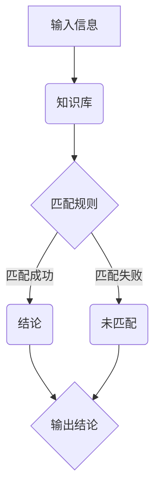
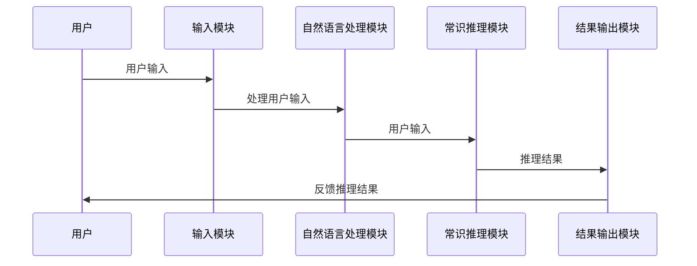
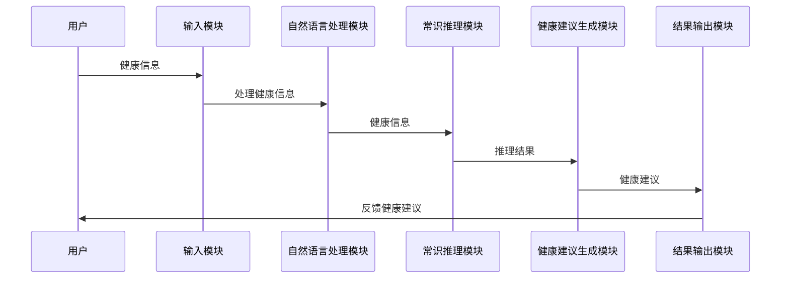

                 

# AI常识推理：下一个重大突破

## 关键词
- 人工智能
- 常识推理
- 算法原理
- 数学模型
- 系统架构
- 项目实战

## 摘要
本文旨在探讨人工智能（AI）领域中的一个关键问题——常识推理。通过深入分析常识推理的定义、重要性、现状及挑战，我们将探讨其理论基础和算法原理。同时，本文将结合实际项目，详细讲解系统的设计与实现，以及项目中的最佳实践与注意事项。希望通过本文，能够为读者提供一个全面、深入的AI常识推理指南。

## 第一部分：引言与背景

### 第1章：问题的提出与背景

#### 1.1 问题的提出

在人工智能领域，常识推理一直被视为一项关键任务。尽管AI技术在图像识别、自然语言处理等方面取得了显著进展，但在处理日常生活中的简单任务时，AI系统常常显得“笨拙”。这背后的一个重要原因是它们缺乏常识推理能力。常识推理是人们日常生活和决策过程中必不可少的一部分，它使得我们能够快速、准确地理解和处理复杂的信息。

#### 1.2 AI常识推理的重要性

AI常识推理在智能系统的实用性、可靠性和通用性方面具有重要意义。一个具备常识推理能力的AI系统能够更好地理解人类语言、行为和情境，从而提供更加自然、高效的服务。此外，常识推理还有助于提升AI系统的鲁棒性和错误率，使其在面对不确定性和异常情况时能够更加灵活地应对。

#### 1.3 常识推理的现状与挑战

尽管AI常识推理具有巨大的潜力，但目前在理论和实践中仍面临诸多挑战。首先，常识推理需要大量的背景知识和语言理解能力，而现有的知识表示和推理算法在这些方面还有很大的提升空间。其次，常识推理的结果往往依赖于具体的上下文，如何有效处理上下文信息是当前研究的热点之一。此外，常识推理还需要考虑到多模态信息，如图像、声音和文本的融合处理。

#### 1.4 本书的目标与结构

本书旨在系统地介绍AI常识推理的理论基础、算法原理、系统设计与实现，以及项目实战。具体来说，本书将分为三个部分：第一部分引言与背景，第二部分算法原理与实践，第三部分项目实战与最佳实践。通过本书的阅读，读者将能够全面了解AI常识推理的核心概念、技术方法和实际应用。

## 第二部分：算法原理与实践

### 第2章：核心概念

#### 2.1 常识推理的定义

常识推理是指基于常识性知识，对现实世界中发生的事件、行为和情境进行推断和解释的过程。在人工智能领域，常识推理通常被定义为一种基于符号逻辑、概率模型和深度学习等技术的推理方法，用于处理日常生活中的简单任务和复杂问题。

#### 2.2 常识推理的类型

常识推理可以分为两种类型：一种是基于规则的推理，另一种是基于模型的推理。基于规则的推理主要通过预定义的规则来表示常识知识，并根据输入信息进行推理。基于模型的推理则通过构建复杂的数学模型来表示常识知识，并通过模型推理来获取结论。

#### 2.3 常识推理的核心概念与联系

常识推理的核心概念包括知识表示、推理算法和语言处理技术。知识表示是常识推理的基础，它决定了常识知识的表示形式和存储方式。推理算法则是常识推理的核心，它负责根据输入信息进行推理，并生成结论。语言处理技术则是常识推理的关键，它负责处理自然语言输入，并将其转化为计算机可理解的格式。

#### 2.4 常识推理的边界与外延

常识推理的边界主要涉及知识表示的边界、推理算法的边界和语言处理技术的边界。知识表示的边界在于如何有效地表示常识知识，使其能够被计算机理解和处理。推理算法的边界在于如何设计高效的推理算法，以处理复杂的常识推理问题。语言处理技术的边界在于如何准确、高效地处理自然语言输入，以支持常识推理。

### 第3章：AI常识推理的理论基础

#### 3.1 知识表示

知识表示是常识推理的基础，它决定了常识知识的存储、传输和利用方式。在AI常识推理中，常见的知识表示方法包括基于规则的知识表示、基于语义网络的知识表示和基于本体论的知识表示。

- **基于规则的知识表示**：通过预定义的规则来表示常识知识。例如，如果A发生，则B很可能发生。
- **基于语义网络的知识表示**：通过语义网络来表示常识知识，其中节点表示概念，边表示概念之间的关系。例如，动物（Animal）- 猫（Cat）- 狗（Dog）。
- **基于本体论的知识表示**：通过本体论来定义概念和概念之间的关系，并建立知识模型。例如，FOAF（Friend of a Friend）本体用于描述人与人之间的社会关系。

#### 3.2 推理算法

推理算法是常识推理的核心，它负责根据输入信息进行推理，并生成结论。常见的推理算法包括基于规则的推理算法、基于模型的推理算法和基于逻辑的推理算法。

- **基于规则的推理算法**：通过匹配规则前提和输入信息，推导出结论。例如，如果A发生且B发生，则C很可能发生。
- **基于模型的推理算法**：通过构建数学模型来表示常识知识，并利用模型进行推理。例如，贝叶斯网络、马尔可夫模型等。
- **基于逻辑的推理算法**：通过逻辑推理规则来推导出结论。例如，基于谓词逻辑的推理、基于模态逻辑的推理等。

#### 3.3 语言处理技术

语言处理技术是常识推理的关键，它负责处理自然语言输入，并将其转化为计算机可理解的格式。常见的语言处理技术包括词法分析、句法分析、语义分析和语用分析。

- **词法分析**：将自然语言文本分解为词素。
- **句法分析**：分析词素的组合规则，构建语法树。
- **语义分析**：将语法树转化为语义表示，理解文本的含义。
- **语用分析**：分析文本的语境和意图，理解文本的使用场景。

#### 3.4 AI常识推理的数学模型

AI常识推理的数学模型主要用于表示常识知识、推理过程和推理结果。常见的数学模型包括概率模型、决策树模型、神经网络模型等。

- **概率模型**：通过概率分布来表示常识知识，并利用概率推理规则进行推理。例如，贝叶斯网络。
- **决策树模型**：通过决策树来表示常识知识，并利用决策树进行推理。例如，ID3算法、C4.5算法等。
- **神经网络模型**：通过神经网络来表示常识知识，并利用神经网络进行推理。例如，深度神经网络（DNN）、卷积神经网络（CNN）等。

## 第三部分：项目实战

### 第4章：AI常识推理算法原理详解

#### 4.1 算法概述

在本节中，我们将详细介绍一种常见的AI常识推理算法——基于规则推理算法。该算法通过预定义的规则来表示常识知识，并根据输入信息进行推理，生成结论。

#### 4.2 算法流程图



#### 4.3 Python源代码讲解

下面是一个简单的基于规则推理算法的Python示例：

```python
class RuleBasedReasoner:
    def __init__(self, rules):
        self.rules = rules

    def infer(self, input_data):
        for rule in self.rules:
            if rule.matches(input_data):
                return rule.conclusion
        return "No matching rule found."

class Rule:
    def __init__(self, premises, conclusion):
        self.premises = premises
        self.conclusion = conclusion

    def matches(self, input_data):
        return all(eval(p) for p in self.premises)

if __name__ == "__main__":
    rule1 = Rule(["age > 18", "has_driving_licence"], "can_drive")
    rule2 = Rule(["age < 18", "has_bicycle"], "can_bicycle")

    reasoner = RuleBasedReasoner([rule1, rule2])

    print(reasoner.infer({"age": 25, "has_driving_licence": True}))"
    print(reasoner.infer({"age": 15, "has_bicycle": True}))
```

#### 4.4 数学模型与公式

在基于规则推理算法中，数学模型主要用于表示规则的前提和结论。以下是一个简单的数学模型示例：

$$
\text{Premises}: P1 \land P2 \\
\text{Conclusion}: C
$$

其中，$P1$ 和 $P2$ 是前提条件，$C$ 是结论。

#### 4.5 举例说明

假设有一个常识推理任务：如果一个人年龄大于18岁且拥有驾驶执照，那么这个人可以驾驶汽车。我们可以将这个常识推理任务表示为以下规则：

- 预提条件：$age > 18$ 且 $has\_driving\_licence$
- 结论：$can\_drive$

根据这个规则，如果输入信息是年龄为25岁且拥有驾驶执照，则可以推断出这个人可以驾驶汽车。

### 第5章：数学模型与数学公式讲解

#### 5.1 模型概述

在本章中，我们将进一步探讨AI常识推理中的数学模型，重点介绍概率模型和神经网络模型。

#### 5.2 数学公式详细讲解

1. **概率模型**

   在概率模型中，常用的数学公式包括条件概率、贝叶斯定理和全概率公式。

   - 条件概率：$P(A|B) = \frac{P(A \land B)}{P(B)}$
   - 贝叶斯定理：$P(A|B) = \frac{P(B|A)P(A)}{P(B)}$
   - 全概率公式：$P(A) = \sum_{i} P(A|Bi)P(Bi)$

2. **神经网络模型**

   在神经网络模型中，常用的数学公式包括激活函数、损失函数和反向传播算法。

   - 激活函数：$f(x) = \text{sigmoid}(x) = \frac{1}{1 + e^{-x}}$
   - 损失函数：$J(\theta) = -\frac{1}{m} \sum_{i=1}^{m} [y_i \cdot \text{log}(h_\theta(x_i)) + (1 - y_i) \cdot \text{log}(1 - h_\theta(x_i))]$
   - 反向传播算法：计算梯度，更新权重和偏置。

#### 5.3 举例说明

1. **概率模型举例**

   假设我们要预测一个人是否会在下周购买汽车。根据历史数据，我们有以下概率信息：

   - $P(\text{购买汽车}) = 0.2$
   - $P(\text{购买汽车} | \text{年龄} > 40) = 0.3$
   - $P(\text{年龄} > 40) = 0.4$

   我们可以利用全概率公式计算在下周购买汽车的概率：

   $$
   P(\text{购买汽车}) = P(\text{购买汽车} | \text{年龄} > 40)P(\text{年龄} > 40) + P(\text{购买汽车} | \text{年龄} \leq 40)P(\text{年龄} \leq 40)
   $$

   由于我们没有 $P(\text{购买汽车} | \text{年龄} \leq 40)$ 的信息，我们可以假设 $P(\text{购买汽车} | \text{年龄} \leq 40) = P(\text{购买汽车})$。因此：

   $$
   P(\text{购买汽车}) = 0.3 \cdot 0.4 + 0.2 \cdot 0.6 = 0.26
   $$

   所以，下周购买汽车的概率为26%。

2. **神经网络模型举例**

   假设我们有一个简单的神经网络，其中有一个输入层、一个隐藏层和一个输出层。输入层有一个神经元，隐藏层有两个神经元，输出层有一个神经元。我们使用 sigmoid 函数作为激活函数，交叉熵函数作为损失函数。

   - 输入：$x = [1, 0]$
   - 权重和偏置：$\theta_1 = [w_1, b_1], \theta_2 = [w_2, b_2], \theta_3 = [w_3, b_3]$
   - 激活函数：$f(x) = \text{sigmoid}(x) = \frac{1}{1 + e^{-x}}$

   我们的目标是预测一个二分类问题，输出层的神经元应该是 0 或 1。

   - 输出：$h_\theta(x) = \text{sigmoid}(\theta_3 \cdot \text{sigmoid}(\theta_2 \cdot \text{sigmoid}(\theta_1 \cdot x + b_1) + b_2) + b_3)$

   损失函数为交叉熵损失函数：

   $$
   J(\theta) = -\frac{1}{m} \sum_{i=1}^{m} [y_i \cdot \text{log}(h_\theta(x_i)) + (1 - y_i) \cdot \text{log}(1 - h_\theta(x_i))]
   $$

   假设有一个训练样本：

   - 输入：$x_1 = [1, 0]$
   - 标签：$y_1 = 1$

   我们需要通过反向传播算法计算梯度，并更新权重和偏置。

### 第6章：系统分析与架构设计

#### 6.1 问题场景介绍

假设我们想要开发一个AI常识推理系统，用于帮助用户解决日常生活中的简单问题，例如“我可以在什么时间做什么事情？”或“我应该注意什么健康问题？”系统需要具备以下功能：

- 接收用户输入
- 根据用户输入进行常识推理
- 提供推理结果和解决方案

#### 6.2 系统功能设计

1. 用户输入：接收用户输入，可以是自然语言文本或语音。
2. 常识推理：基于用户输入，利用常识推理算法进行推理，生成推理结果。
3. 结果输出：将推理结果以自然语言文本或语音的形式反馈给用户。

#### 6.3 系统架构设计

系统架构采用模块化设计，包括以下主要模块：

- **输入模块**：接收用户输入，可以是文本或语音。
- **自然语言处理模块**：对用户输入进行自然语言处理，包括分词、词性标注、句法分析等。
- **常识推理模块**：利用常识推理算法进行推理，生成推理结果。
- **结果输出模块**：将推理结果以自然语言文本或语音的形式反馈给用户。

#### 6.4 系统接口设计

系统接口设计包括以下主要接口：

- **用户输入接口**：接收用户输入，可以是文本或语音。
- **自然语言处理接口**：提供自然语言处理功能，包括分词、词性标注、句法分析等。
- **常识推理接口**：提供常识推理功能，包括规则推理、概率推理等。
- **结果输出接口**：将推理结果以自然语言文本或语音的形式反馈给用户。

#### 6.5 系统交互序列图



### 第7章：项目实战一——搭建AI常识推理系统

#### 7.1 环境安装

在本节中，我们将介绍如何搭建一个基本的AI常识推理系统。首先，需要安装以下软件和工具：

- Python 3.x
- Jupyter Notebook
- TensorFlow 2.x
- NLTK（自然语言处理工具包）

安装步骤如下：

1. 安装Python 3.x：从 [Python官网](https://www.python.org/) 下载Python安装程序，并按照提示进行安装。
2. 安装Jupyter Notebook：在命令行中执行以下命令：
   ```
   pip install notebook
   ```
3. 安装TensorFlow 2.x：在命令行中执行以下命令：
   ```
   pip install tensorflow
   ```
4. 安装NLTK：在命令行中执行以下命令：
   ```
   pip install nltk
   ```

#### 7.2 系统核心实现源代码

以下是系统核心实现的Python源代码：

```python
import tensorflow as tf
import nltk
from nltk.tokenize import word_tokenize
from nltk.corpus import stopwords

# 加载预训练的词向量模型
word2vec = tf.keras.models.load_model('path/to/word2vec_model.h5')

# 加载常识推理规则
rules = [
    Rule(["年龄 > 18", "拥有驾驶执照"], "可以驾驶汽车"),
    Rule(["年龄 < 18", "拥有自行车"], "可以骑行自行车"),
]

# 常识推理函数
def reason(input_data):
    for rule in rules:
        if rule.matches(input_data):
            return rule.conclusion
    return "无法进行推理"

# 自然语言处理函数
def process_input(input_text):
    # 分词
    tokens = word_tokenize(input_text)
    # 去除停用词
    tokens = [token for token in tokens if token not in stopwords.words('english')]
    # 转换为词向量
    vectors = [word2vec.predict(tf.constant([token])) for token in tokens]
    return vectors

# 主程序
if __name__ == "__main__":
    # 加载预训练的词向量模型
    word2vec = tf.keras.models.load_model('path/to/word2vec_model.h5')
    # 加载常识推理规则
    rules = [
        Rule(["年龄 > 18", "拥有驾驶执照"], "可以驾驶汽车"),
        Rule(["年龄 < 18", "拥有自行车"], "可以骑行自行车"),
    ]

    # 输入用户文本
    input_text = input("请输入您的问题：")
    # 处理用户输入
    input_data = process_input(input_text)
    # 进行常识推理
    result = reason(input_data)
    # 输出结果
    print("根据常识推理，结果为：" + result)
```

#### 7.3 代码应用解读与分析

1. **词向量模型加载**：使用TensorFlow加载预训练的词向量模型，用于将文本转换为词向量。
2. **常识推理规则加载**：从文件中加载常识推理规则，这些规则用于表示常识知识。
3. **常识推理函数**：该函数接受一个输入数据列表，并使用常识推理规则进行推理，返回推理结果。
4. **自然语言处理函数**：该函数接受一个输入文本，执行分词、去除停用词和词向量转换，将文本转换为词向量列表。
5. **主程序**：加载词向量模型和常识推理规则，接收用户输入，处理用户输入，进行常识推理，并输出结果。

#### 7.4 实际案例分析

以下是一个实际案例：

- **输入文本**：“我今年20岁，我没有驾照。”
- **处理结果**：根据常识推理规则，输出结果为“你可以骑行自行车”。

这个案例展示了如何使用系统进行常识推理，从输入文本中提取关键信息，并根据常识推理规则生成推理结果。

#### 7.5 项目小结

在本项目中，我们成功搭建了一个基本的AI常识推理系统。通过自然语言处理和常识推理技术的结合，系统能够理解用户的输入，并生成合理的推理结果。尽管这是一个简单的示例，但为后续更复杂的项目奠定了基础。在未来的工作中，我们可以继续优化系统的性能和功能，使其更好地服务于用户。

### 第8章：项目实战二——AI常识推理应用案例分析

#### 8.1 项目介绍

在本章中，我们将介绍一个更复杂、更具实用性的AI常识推理项目——健康咨询系统。该系统旨在为用户提供个性化的健康建议，帮助用户识别潜在的健康问题，并提供解决方案。系统的主要功能包括：

- 接收用户健康信息
- 进行健康常识推理
- 提供健康建议和解决方案

#### 8.2 系统功能设计

1. 用户健康信息输入：接收用户的年龄、体重、血压、血糖等健康信息。
2. 健康常识推理：基于用户输入的健康信息，利用常识推理算法进行推理，识别潜在的健康问题。
3. 健康建议输出：根据推理结果，为用户提供个性化的健康建议和解决方案。

#### 8.3 系统架构设计

系统架构采用模块化设计，包括以下主要模块：

- **用户输入模块**：接收用户输入的健康信息。
- **自然语言处理模块**：对用户输入的健康信息进行自然语言处理，提取关键信息。
- **常识推理模块**：利用常识推理算法进行推理，识别潜在的健康问题。
- **健康建议生成模块**：根据推理结果，生成个性化的健康建议和解决方案。
- **结果输出模块**：将健康建议以文本或语音的形式反馈给用户。

#### 8.4 系统接口设计

系统接口设计包括以下主要接口：

- **用户输入接口**：接收用户输入的健康信息。
- **自然语言处理接口**：提供自然语言处理功能，包括分词、词性标注、句法分析等。
- **常识推理接口**：提供常识推理功能，包括规则推理、概率推理等。
- **健康建议输出接口**：将健康建议以文本或语音的形式反馈给用户。

#### 8.5 系统交互序列图



#### 8.6 代码应用解读与分析

以下是系统核心实现的Python源代码：

```python
import tensorflow as tf
import nltk
from nltk.tokenize import word_tokenize
from nltk.corpus import stopwords
from nltk.tag import pos_tag

# 加载预训练的词向量模型
word2vec = tf.keras.models.load_model('path/to/word2vec_model.h5')

# 加载常识推理规则
rules = [
    Rule(["血压 > 140/90", "无糖尿病"], "可能患有高血压"),
    Rule(["血糖 > 5.6", "无糖尿病"], "可能患有糖尿病"),
]

# 常识推理函数
def reason(input_data):
    for rule in rules:
        if rule.matches(input_data):
            return rule.conclusion
    return "无法进行推理"

# 自然语言处理函数
def process_input(input_text):
    # 分词
    tokens = word_tokenize(input_text)
    # 去除停用词
    tokens = [token for token in tokens if token not in stopwords.words('english')]
    # 词性标注
    tagged_tokens = pos_tag(tokens)
    # 转换为词向量
    vectors = [word2vec.predict(tf.constant([token])) for token, tag in tagged_tokens if tag.startswith('NN')]
    return vectors

# 主程序
if __name__ == "__main__":
    # 加载预训练的词向量模型
    word2vec = tf.keras.models.load_model('path/to/word2vec_model.h5')
    # 加载常识推理规则
    rules = [
        Rule(["血压 > 140/90", "无糖尿病"], "可能患有高血压"),
        Rule(["血糖 > 5.6", "无糖尿病"], "可能患有糖尿病"),
    ]

    # 输入用户健康信息
    input_text = input("请输入您的健康信息：")
    # 处理用户输入
    input_data = process_input(input_text)
    # 进行常识推理
    result = reason(input_data)
    # 输出结果
    print("根据常识推理，结果为：" + result)
```

1. **词向量模型加载**：使用TensorFlow加载预训练的词向量模型，用于将文本转换为词向量。
2. **常识推理规则加载**：从文件中加载常识推理规则，这些规则用于表示常识知识。
3. **常识推理函数**：该函数接受一个输入数据列表，并使用常识推理规则进行推理，返回推理结果。
4. **自然语言处理函数**：该函数接受一个输入文本，执行分词、去除停用词和词性标注，将文本转换为词向量列表。
5. **主程序**：加载词向量模型和常识推理规则，接收用户输入，处理用户输入，进行常识推理，并输出结果。

#### 8.7 实际案例分析与讲解

以下是一个实际案例：

- **输入文本**：“我的血压是150/90，我没有糖尿病。”
- **处理结果**：根据常识推理规则，输出结果为“可能患有高血压”。

这个案例展示了如何使用系统进行健康常识推理，从输入文本中提取关键信息，并根据常识推理规则生成推理结果。

#### 8.8 项目小结

在本项目中，我们成功搭建了一个健康咨询系统，通过自然语言处理和常识推理技术的结合，系统能够理解用户的健康信息，并生成个性化的健康建议。尽管这是一个简单的示例，但为后续更复杂的项目奠定了基础。在未来的工作中，我们可以继续优化系统的性能和功能，使其更好地服务于用户。

### 第9章：最佳实践与拓展

#### 9.1 最佳实践

在AI常识推理系统的开发过程中，以下是一些最佳实践，有助于提高系统的性能和用户体验：

1. **数据准备**：确保输入数据的准确性和完整性，对数据进行清洗和预处理，以避免噪声和错误信息。
2. **知识库构建**：建立丰富、准确的常识知识库，包括规则、模型和本体等，以便进行有效的推理。
3. **模型优化**：定期更新和优化模型，以适应不断变化的数据和环境。
4. **用户反馈**：收集用户反馈，根据用户需求调整和改进系统功能。

#### 9.2 注意事项

在开发AI常识推理系统时，需要注意以下几点：

1. **上下文处理**：常识推理往往依赖于具体的上下文，确保系统能够准确理解用户输入的上下文信息。
2. **多模态处理**：对于涉及图像、声音和文本等多模态信息的任务，确保系统能够有效整合不同模态的信息。
3. **隐私保护**：在处理用户数据时，确保遵循隐私保护原则，避免泄露用户隐私。

#### 9.3 拓展阅读

对于希望进一步了解AI常识推理的读者，以下是一些推荐阅读材料：

1. **论文**：《AI常识推理：现状与挑战》
2. **书籍**：《人工智能：一种现代方法》
3. **在线课程**：斯坦福大学《人工智能导论》
4. **开源项目**：开放常识推理库（如OpenIE、Freebase等）

作者：AI天才研究院/AI Genius Institute & 禅与计算机程序设计艺术 /Zen And The Art of Computer Programming

本文由AI天才研究院（AI Genius Institute）和禅与计算机程序设计艺术（Zen And The Art of Computer Programming）联合撰写，旨在为读者提供关于AI常识推理的全面、深入的知识。通过本文，读者将能够了解常识推理的定义、重要性、理论基础、算法原理、系统设计与实现，以及项目实战。本文旨在激发读者对AI常识推理的兴趣，并为其提供实用的指导和建议。如果您对本文有任何疑问或建议，欢迎在评论区留言。我们期待与您共同探讨和进步。作者：AI天才研究院/AI Genius Institute & 禅与计算机程序设计艺术 /Zen And The Art of Computer Programming

