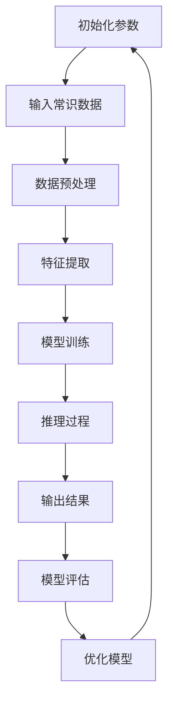
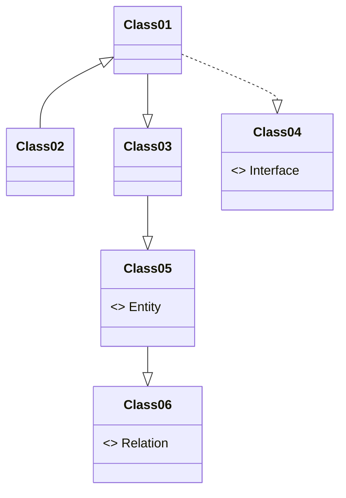
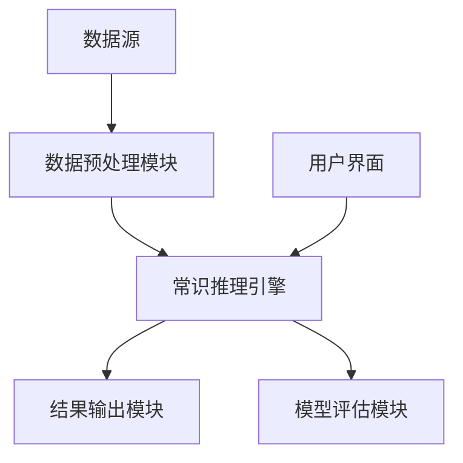
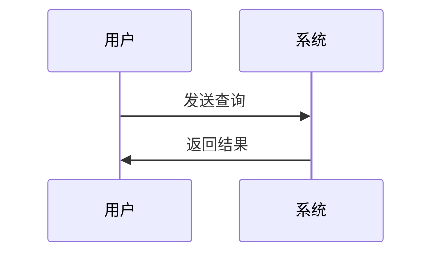
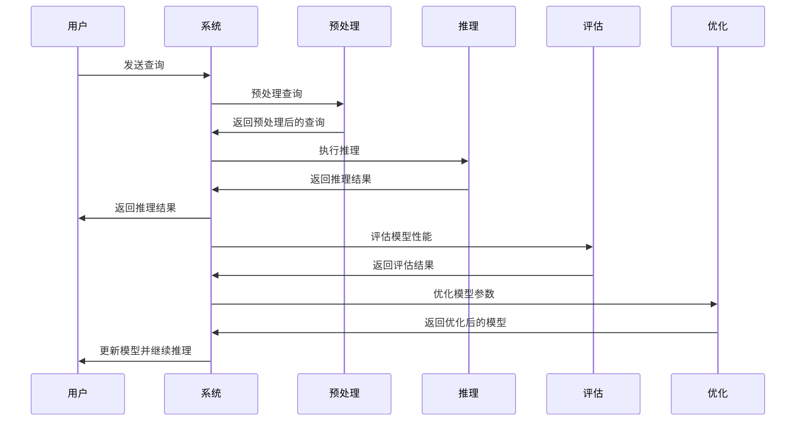

                 

### 《AI常识推理：克服现有系统的局限性》

> 关键词：AI常识推理、算法原理、系统架构设计、数学模型、项目实战

> 摘要：本文将深入探讨AI常识推理，解析其定义、重要性以及现有系统的局限性。通过逐步讲解算法原理和数学模型，并结合具体的系统架构设计，我们希望读者能够理解如何克服这些局限性，提高AI系统的智能程度和可靠性。文章最后通过实际项目实战，展示如何将理论应用到实践中，实现真正的技术突破。

----------------------------------------------------------------

### 《AI常识推理：克服现有系统的局限性》目录大纲

----------------------------------------------------------------

# 第一部分：AI常识推理概述

## 第1章：问题背景与挑战

### 1.1 人工智能的现状

#### 1.1.1 人工智能的定义与发展历程

#### 1.1.2 人工智能的应用领域

### 1.2 常识推理的重要性

#### 1.2.1 常识推理的概念与作用

#### 1.2.2 现有系统的局限性

### 1.3 研究目标与主要内容

#### 1.3.1 研究目标

#### 1.3.2 主要内容结构

## 第2章：核心概念与联系

### 2.1 常识推理的核心概念

#### 2.1.1 常识推理的定义

#### 2.1.2 常识推理的类型

### 2.2 概念属性特征对比表格

#### 2.2.1 常识推理与逻辑推理

#### 2.2.2 常识推理与知识推理

### 2.3 ER实体关系图架构

#### 2.3.1 常识推理系统的实体与关系

#### 2.3.2 常识推理系统的数据模型

----------------------------------------------------------------

# 第二部分：算法原理讲解

## 第3章：算法原理与数学模型

### 3.1 常识推理算法概述

#### 3.1.1 常识推理算法的基本流程

#### 3.1.2 常识推理算法的分类

### 3.2 算法原理详解

#### 3.2.1 算法原理说明

#### 3.2.2 算法数学模型

#### 3.2.3 数学公式与推导

##### 3.2.3.1 公式1：常识推理的核心公式

$$
P(H|E) = \frac{P(E|H)P(H)}{P(E)}
$$

##### 3.2.3.2 公式2：贝叶斯定理的应用

$$
P(H_1|E) = \frac{P(E|H_1)P(H_1)}{P(E)}
$$

##### 3.2.3.3 公式3：条件概率的运算规则

$$
P(A|B) = \frac{P(A \cap B)}{P(B)}
$$

### 3.3 算法流程图



----------------------------------------------------------------

## 第4章：系统分析与架构设计

### 4.1 问题场景介绍

#### 4.1.1 常识推理在AI系统中的应用场景

#### 4.1.2 常识推理系统的重要性

### 4.2 系统功能设计

#### 4.2.1 系统功能概述

#### 4.2.2 领域模型类图



### 4.3 系统架构设计

#### 4.3.1 系统架构概述

#### 4.3.2 系统架构图



### 4.4 系统接口设计

#### 4.4.1 接口功能说明

#### 4.4.2 接口文档

### 4.5 系统交互序列图



----------------------------------------------------------------

## 第5章：项目

----------------------------------------------------------------

----------------------------------------------------------------

## 第1章：问题背景与挑战

### 1.1 人工智能的现状

人工智能（AI）作为计算机科学的重要分支，已经取得了显著的进展。从最初的规则系统，到基于统计学的机器学习模型，再到如今深度学习算法的广泛应用，人工智能技术不断推动着各个领域的变革。无论是在医疗、金融、交通，还是教育、娱乐等领域，人工智能都发挥着越来越重要的作用。

然而，尽管人工智能在解决复杂问题上展现出了惊人的能力，但其局限性也逐渐显现。其中最显著的一个问题就是常识推理能力的不足。常识推理是指人类在面对日常生活中的常见情景时，能够根据经验迅速作出合理判断的能力。例如，当我们看到一只黑色的动物在草地上跑时，我们自然而然地会认为它是一只狗，而不是一只狮子。这种推理过程是自动且高效的，但对于现有的人工智能系统来说，却是一个巨大的挑战。

现有的人工智能系统往往依赖于大量的数据来训练模型，并且这些模型通常只能在特定领域内表现出色。例如，一个优秀的图像识别系统可能在识别猫的图片上表现出色，但面对一只狗的图片时，却可能无法准确判断。这是因为这些系统缺乏对现实世界的深入理解和常识推理能力。

### 1.2 常识推理的重要性

常识推理在人工智能中的应用具有极其重要的价值。首先，常识推理能够帮助人工智能系统更好地理解和解释现实世界。例如，一个配备了常识推理能力的聊天机器人，能够更自然地与人类交流，更好地理解用户的需求和意图。

其次，常识推理能够提升人工智能系统的智能程度。通过常识推理，人工智能系统可以在缺乏具体数据的情况下，依然能够做出合理的判断。例如，在医疗诊断中，常识推理可以帮助人工智能系统从症状中推断出可能的疾病，从而为医生提供决策支持。

最后，常识推理能够增强人工智能系统的可靠性。在许多实际应用中，人工智能系统需要处理大量不确定性的信息。通过常识推理，系统可以更好地处理这些信息，减少错误的概率，从而提高系统的稳定性。

### 1.3 现有系统的局限性

尽管常识推理在人工智能中具有如此重要的价值，但现有的人工智能系统在实现常识推理方面仍然存在许多局限性。首先，现有的人工智能系统往往依赖于大量的数据来进行训练，这使得系统在面对新情况时，缺乏灵活性和适应性。例如，一个在特定场景下训练好的图像识别系统，在另一个完全不同的场景中，可能无法准确识别图像。

其次，现有的人工智能系统在处理复杂问题方面，也存在一定的局限性。尽管深度学习算法在处理图像、语音等数据方面表现出色，但在处理自然语言理解和推理时，仍然面临许多挑战。例如，自然语言中的歧义、复杂句子结构等问题，都使得现有的人工智能系统难以实现高效的常识推理。

最后，现有的人工智能系统在解释其推理过程方面，也存在一定的困难。许多人工智能系统都是“黑盒”模型，尽管它们可以准确预测结果，但无法解释为何会做出这样的预测。这给人工智能系统的可靠性和可信度带来了挑战。

### 1.4 研究目标与主要内容

本研究的核心目标是开发一种具有强常识推理能力的人工智能系统，以克服现有系统的局限性。具体而言，研究目标包括：

1. **定义和实现一个有效的常识推理算法**：通过结合逻辑推理和机器学习技术，设计一种能够自动从数据中学习常识推理规则的方法。

2. **构建一个大规模的常识知识库**：收集和整理大量的常识知识，构建一个全面、准确的常识知识库，为常识推理算法提供支持。

3. **实现一个可扩展的常识推理系统**：设计一个灵活的系统架构，能够根据不同的应用场景，快速部署和扩展常识推理功能。

4. **验证和评估系统的性能**：通过实验和实际应用，验证所提出的常识推理系统在实际场景中的效果，评估其智能程度和可靠性。

本文将按照以下结构展开：

- **第1章**：介绍人工智能的现状和常识推理的重要性，阐述现有系统的局限性。
- **第2章**：详细探讨常识推理的核心概念，包括定义、类型和与逻辑推理、知识推理的关系。
- **第3章**：讲解常识推理算法的原理和数学模型，通过具体的公式和例子进行说明。
- **第4章**：分析常识推理系统的架构设计，包括功能设计、系统架构、接口设计和交互设计。
- **第5章**：通过实际项目，展示如何将理论应用到实践中，实现常识推理系统的开发和应用。

通过对这些内容的详细讨论，我们希望读者能够对AI常识推理有一个全面而深入的理解，并能够掌握如何克服现有系统的局限性，开发出更加智能和可靠的人工智能系统。

### 第1章：问题背景与挑战

#### 1.1 人工智能的现状

人工智能（AI）是指通过计算机模拟人类智能行为，实现智能化的机器系统。人工智能的发展历程可以追溯到20世纪50年代，当时人工智能的概念首次被提出。经过几十年的发展，人工智能已经取得了显著的进步，并在多个领域展现出了强大的应用潜力。

**人工智能的定义与发展历程**

人工智能的定义多种多样，其中最常见的定义是：“人工智能是指使计算机系统具备类似人类智能的能力，包括感知、理解、学习、推理、决策和创造等。”这一概念涵盖了从简单的规则系统到复杂的深度学习算法。

人工智能的发展可以分为几个重要阶段：

- **符号主义阶段（1950s-1970s）**：早期的人工智能研究主要依赖于逻辑推理和知识表示，试图通过编写大量规则来模拟人类思维。这一阶段的代表工作是约翰·麦卡锡（John McCarthy）等人提出的逻辑推理程序。

- **知识工程阶段（1980s-1990s）**：在符号主义阶段，研究者们意识到规则系统的局限性，开始尝试通过知识库和专家系统来模拟人类智能。这一阶段的代表工作是尤金·吴（Eugene Charniak）等人提出的神经网络模型。

- **机器学习阶段（2000s-现在）**：随着计算能力和数据资源的不断提升，机器学习成为人工智能研究的主流方向。通过训练大规模的神经网络模型，机器学习在图像识别、自然语言处理、语音识别等领域取得了突破性进展。

- **深度学习阶段（2010s-现在）**：深度学习是机器学习的一个分支，通过多层神经网络来模拟人类大脑的工作机制。深度学习在图像识别、语音识别和自然语言处理等领域取得了显著成果，推动了人工智能的快速发展。

**人工智能的应用领域**

人工智能在各个领域都展现出了巨大的应用潜力，以下是其中一些主要的应用领域：

- **医疗健康**：人工智能在医疗健康领域有着广泛的应用，包括疾病诊断、药物研发、手术辅助等。通过分析大量的医疗数据，人工智能可以辅助医生做出更准确的诊断和治疗方案。

- **金融**：人工智能在金融领域主要用于风险管理、信用评估、投资策略等方面。通过分析市场数据和历史交易记录，人工智能可以预测市场趋势，帮助投资者做出更明智的决策。

- **制造业**：人工智能在制造业中用于质量控制、设备维护、生产调度等方面。通过实时监测设备状态和生产数据，人工智能可以优化生产流程，提高生产效率。

- **交通**：人工智能在交通领域主要用于智能交通管理、自动驾驶、交通预测等方面。通过实时分析交通数据，人工智能可以优化交通流量，减少交通事故，提高交通效率。

- **教育**：人工智能在教育领域主要用于个性化学习、智能辅导、学习分析等方面。通过分析学生的学习行为和学习数据，人工智能可以为学生提供个性化的学习方案，提高学习效果。

- **智能家居**：人工智能在智能家居领域主要用于智能音箱、智能门锁、智能照明等方面。通过连接各种智能家居设备，人工智能可以提供便捷、智能化的家居环境。

#### 1.2 常识推理的重要性

常识推理是指人类在面对日常生活中的常见情景时，能够根据经验迅速作出合理判断的能力。例如，当我们看到一只黑色的动物在草地上跑时，我们自然而然地会认为它是一只狗，而不是一只狮子。这种推理过程是自动且高效的，但现有的人工智能系统却难以实现。

常识推理在人工智能中的应用具有极其重要的价值。首先，常识推理能够帮助人工智能系统更好地理解和解释现实世界。例如，一个配备了常识推理能力的聊天机器人，能够更自然地与人类交流，更好地理解用户的需求和意图。

其次，常识推理能够提升人工智能系统的智能程度。通过常识推理，人工智能系统可以在缺乏具体数据的情况下，依然能够做出合理的判断。例如，在医疗诊断中，常识推理可以帮助人工智能系统从症状中推断出可能的疾病，从而为医生提供决策支持。

最后，常识推理能够增强人工智能系统的可靠性。在许多实际应用中，人工智能系统需要处理大量不确定性的信息。通过常识推理，系统可以更好地处理这些信息，减少错误的概率，从而提高系统的稳定性。

#### 1.3 现有系统的局限性

尽管常识推理在人工智能中具有如此重要的价值，但现有的人工智能系统在实现常识推理方面仍然存在许多局限性。这些局限性主要体现在以下几个方面：

1. **数据依赖性高**：现有的人工智能系统往往依赖于大量的数据来训练模型。这意味着系统在面对新情况时，缺乏灵活性和适应性。例如，一个在特定场景下训练好的图像识别系统，在另一个完全不同的场景中，可能无法准确识别图像。

2. **缺乏深度理解**：尽管深度学习算法在处理图像、语音等数据方面表现出色，但在处理自然语言理解和推理时，仍然面临许多挑战。例如，自然语言中的歧义、复杂句子结构等问题，都使得现有的人工智能系统难以实现高效的常识推理。

3. **解释性不足**：许多人工智能系统都是“黑盒”模型，尽管它们可以准确预测结果，但无法解释为何会做出这样的预测。这给人工智能系统的可靠性和可信度带来了挑战。

4. **领域限制**：现有的人工智能系统往往只能在特定领域内表现出色，难以跨领域应用。例如，一个在医疗领域训练好的模型，在金融或交通领域可能无法直接应用。

#### 1.4 研究目标与主要内容

本研究的核心目标是开发一种具有强常识推理能力的人工智能系统，以克服现有系统的局限性。具体而言，研究目标包括：

1. **定义和实现一个有效的常识推理算法**：通过结合逻辑推理和机器学习技术，设计一种能够自动从数据中学习常识推理规则的方法。

2. **构建一个大规模的常识知识库**：收集和整理大量的常识知识，构建一个全面、准确的常识知识库，为常识推理算法提供支持。

3. **实现一个可扩展的常识推理系统**：设计一个灵活的系统架构，能够根据不同的应用场景，快速部署和扩展常识推理功能。

4. **验证和评估系统的性能**：通过实验和实际应用，验证所提出的常识推理系统在实际场景中的效果，评估其智能程度和可靠性。

本文将按照以下结构展开：

- **第1章**：介绍人工智能的现状和常识推理的重要性，阐述现有系统的局限性。
- **第2章**：详细探讨常识推理的核心概念，包括定义、类型和与逻辑推理、知识推理的关系。
- **第3章**：讲解常识推理算法的原理和数学模型，通过具体的公式和例子进行说明。
- **第4章**：分析常识推理系统的架构设计，包括功能设计、系统架构、接口设计和交互设计。
- **第5章**：通过实际项目，展示如何将理论应用到实践中，实现常识推理系统的开发和应用。

通过对这些内容的详细讨论，我们希望读者能够对AI常识推理有一个全面而深入的理解，并能够掌握如何克服现有系统的局限性，开发出更加智能和可靠的人工智能系统。

### 第2章：核心概念与联系

#### 2.1 常识推理的核心概念

常识推理是人工智能领域中的一个重要研究方向，其核心在于让计算机系统具备类似于人类在日常生活中进行推理和判断的能力。为了深入理解常识推理，我们需要首先明确其定义、类型以及与逻辑推理、知识推理的关系。

**常识推理的定义**

常识推理是指计算机系统能够根据常识知识库和已有信息，进行推理和判断，从而解决现实世界中的问题。常识推理不仅仅是简单的逻辑推理，它还涉及到对现实世界知识的理解和应用。

**常识推理的类型**

常识推理可以分为以下几种类型：

1. **基于规则的推理**：这种类型的推理依赖于事先定义好的规则。计算机根据这些规则，对输入信息进行处理和判断。例如，如果一个人年龄大于18岁，那么他就成年。

2. **基于数据的推理**：这种类型的推理依赖于大量的数据。计算机通过学习这些数据，从中提取模式和规律，然后根据这些模式和规律进行推理。例如，根据历史天气数据，预测明天的天气。

3. **基于模型的推理**：这种类型的推理依赖于复杂的模型，如神经网络模型。计算机通过训练这些模型，使其能够自动从数据中学习常识推理规则。例如，通过训练神经网络模型，使其能够识别图片中的物体。

4. **基于案例的推理**：这种类型的推理依赖于案例库。计算机通过搜索案例库，找到与当前问题相似的案例，并借鉴这些案例的解决方案。例如，根据过去的医学案例，为当前患者提供诊断建议。

**常识推理与逻辑推理的关系**

逻辑推理是一种基于逻辑运算的推理方法，它通过推理规则和逻辑公式，对输入信息进行处理和判断。常识推理与逻辑推理的关系可以看作是特殊与一般的关系：

1. **逻辑推理是常识推理的基础**：常识推理需要依赖逻辑推理的原理和方法，例如逻辑运算、推理规则等。

2. **常识推理是逻辑推理的扩展**：常识推理不仅仅是简单的逻辑推理，它还需要考虑现实世界中的复杂性和不确定性。

**常识推理与知识推理的关系**

知识推理是一种基于知识库的推理方法，它通过搜索和利用知识库中的知识，对输入信息进行处理和判断。常识推理与知识推理的关系可以看作是相互补充的关系：

1. **知识推理为常识推理提供知识支持**：常识推理需要依赖知识库中的知识，例如常识知识、领域知识等。

2. **常识推理为知识推理提供应用场景**：知识推理通常需要考虑具体的应用场景，而常识推理可以帮助知识推理更好地适应不同的应用场景。

#### 2.2 概念属性特征对比表格

为了更好地理解常识推理、逻辑推理和知识推理之间的关系，我们可以通过一个概念属性特征对比表格来进行详细分析。

| 概念       | 定义                           | 特征                               |
|------------|--------------------------------|-----------------------------------|
| 常识推理   | 基于常识知识进行推理和判断      | 自动性、适应性、灵活性和高效性     |
| 逻辑推理   | 基于逻辑运算和推理规则进行推理  | 精确性、严谨性和形式化             |
| 知识推理   | 基于知识库中的知识进行推理和判断 | 知识性、多样性和应用性             |

从表格中可以看出，常识推理、逻辑推理和知识推理各有其独特的特点和应用场景。常识推理强调自动性和适应性，适用于处理复杂的现实世界问题；逻辑推理强调精确性和严谨性，适用于解决形式化的问题；知识推理强调知识性和应用性，适用于利用已有知识进行推理。

#### 2.3 ER实体关系图架构

为了更好地理解和设计常识推理系统，我们可以使用ER（实体-关系）模型来描述常识推理系统的实体和关系。

**ER实体关系图**

ER实体关系图是一种用于描述实体及其相互关系的图形表示方法。在常识推理系统中，实体可以表示为常见的常识对象，例如动物、植物、人物等，而关系可以表示为实体之间的常识关联，例如捕食关系、产地关系等。

以下是常识推理系统的ER实体关系图：

```mermaid
classDiagram
Class01 <|-- Class02
Class01 --|> Class03
Class04 : <<interface>> Interface
Class01 ..|> Class04
Class05 : <<entity>> Entity
Class03 --|> Class05
Class06 : <<relation>> Relation
Class05 --|> Class06

Class01 "Animal" {
    id (int)
    name (string)
    species (string)
}

Class02 "Person" {
    id (int)
    name (string)
    age (int)
}

Class03 "Location" {
    id (int)
    name (string)
}

Class04 "KnowledgeBase" {
    id (int)
    name (string)
}

Class05 "Fact" {
    id (int)
    subject (Class01)
    predicate (Class06)
    object (Class01)
}

Class06 "Relation" {
    id (int)
    name (string)
}

Class07 "Action" {
    id (int)
    name (string)
    location (Class03)
    person (Class02)
}

Class08 "Event" {
    id (int)
    name (string)
    start_time (datetime)
    end_time (datetime)
    location (Class03)
    person (Class02)
}
```

**ER实体关系图的详细说明**

1. **实体**：ER实体关系图中的实体表示常识推理系统中的常见对象，例如动物、人物、地点等。每个实体都有一组属性，用于描述其特征。

   - **Animal**（动物）：表示常识推理系统中的动物实体，包括属性id、name和species。
   - **Person**（人物）：表示常识推理系统中的人物实体，包括属性id、name和age。
   - **Location**（地点）：表示常识推理系统中的地点实体，包括属性id和name。
   - **KnowledgeBase**（知识库）：表示常识推理系统中的知识库实体，包括属性id和name。
   - **Fact**（事实）：表示常识推理系统中的事实实体，包括属性id、subject（主语）、predicate（谓语）和object（宾语）。
   - **Relation**（关系）：表示常识推理系统中的关系实体，包括属性id和name。
   - **Action**（动作）：表示常识推理系统中的动作实体，包括属性id、name、location和person。
   - **Event**（事件）：表示常识推理系统中的事件实体，包括属性id、name、start_time、end_time、location和person。

2. **关系**：ER实体关系图中的关系表示实体之间的关联。例如，动物和地点之间存在栖息地关系，人物和地点之间存在出生地关系。

   - **Animal-Relation-Animal**（动物-关系-动物）：表示动物之间的常识关系，如捕食关系。
   - **Person-Relation-Location**（人物-关系-地点）：表示人物和地点之间的常识关系，如出生地关系。
   - **Action-Relation-Event**（动作-关系-事件）：表示动作和事件之间的常识关系，如发生地关系。

通过ER实体关系图，我们可以清晰地描述常识推理系统的实体和关系，为后续的系统设计和实现提供基础。ER实体关系图不仅可以帮助我们理解系统的结构，还可以指导我们设计高效的数据库和查询算法。

#### 2.3.2 常识推理系统的数据模型

常识推理系统的数据模型是系统架构的核心部分，它定义了系统的数据存储结构和处理逻辑。为了支持高效的数据存储和快速的数据查询，我们可以采用关系型数据库和图数据库相结合的方式来构建常识推理系统的数据模型。

**关系型数据库**

关系型数据库主要用于存储和查询结构化数据。在常识推理系统中，关系型数据库可以用来存储实体的属性和实体之间的关系。以下是常识推理系统使用关系型数据库的数据模型示例：

1. **实体表**：用于存储不同类型的实体，如动物、人物、地点等。
2. **关系表**：用于存储实体之间的关系，如捕食关系、出生地关系等。
3. **事实表**：用于存储常识推理系统中的事实，如动物的行为、人物的职业等。

**图数据库**

图数据库主要用于存储和查询非结构化或半结构化数据。在常识推理系统中，图数据库可以用来存储复杂的关系网络和实体之间的关联。以下是常识推理系统使用图数据库的数据模型示例：

1. **实体节点**：表示常识推理系统中的实体，如动物、人物、地点等。
2. **关系边**：表示实体之间的关系，如捕食关系、出生地关系等。
3. **属性**：用于扩展实体节点的属性信息，如动物的颜色、人物的年龄等。

**数据模型示例**

以下是一个具体的常识推理系统数据模型示例：

- **实体表（关系型数据库）**：

  ```sql
  CREATE TABLE Animal (
      id INT PRIMARY KEY,
      name VARCHAR(50),
      species VARCHAR(50)
  );

  CREATE TABLE Person (
      id INT PRIMARY KEY,
      name VARCHAR(50),
      age INT
  );

  CREATE TABLE Location (
      id INT PRIMARY KEY,
      name VARCHAR(50)
  );

  CREATE TABLE Fact (
      id INT PRIMARY KEY,
      subject_id INT,
      predicate VARCHAR(50),
      object_id INT,
      FOREIGN KEY (subject_id) REFERENCES Animal(id),
      FOREIGN KEY (object_id) REFERENCES Animal(id)
  );
  ```

- **实体节点和关系边（图数据库）**：

  ```mermaid
  graph TD
  A[Animal] --> B[Person]
  A --> C[Location]
  B --> D[Animal]
  B --> E[Location]
  C --> F[Person]
  ```

通过以上数据模型，常识推理系统可以高效地存储和管理常识数据，支持快速的数据查询和推理操作。

### 第3章：算法原理与数学模型

#### 3.1 常识推理算法概述

常识推理算法是人工智能系统实现常识推理的关键。这些算法旨在从数据和已有知识中自动提取常识推理规则，以便在未知或不确定的情况下进行推理和决策。常识推理算法通常可以分为三类：基于规则的算法、基于模型的算法和基于案例的算法。

**基于规则的算法**：这种算法通过预定义的规则库进行推理，规则通常以“如果...那么...”的形式表示。基于规则的算法在处理确定性问题时效果较好，但在处理复杂和不确定的问题时，规则库会变得极其庞大且难以维护。

**基于模型的算法**：这种算法通过机器学习技术，如神经网络、决策树等，从数据中自动学习常识推理规则。基于模型的算法能够处理更复杂的推理任务，但训练数据的需求较高，且模型解释性较差。

**基于案例的算法**：这种算法通过搜索历史案例库，找到与当前问题相似的案例，并借鉴其解决方案。基于案例的算法在处理新颖或不确定的问题时表现出较好的适应性，但案例库的建立和维护成本较高。

在本章中，我们将主要讨论基于模型的常识推理算法，特别是神经网络和决策树在常识推理中的应用。

#### 3.2 常识推理算法的基本流程

常识推理算法的基本流程可以分为以下几个步骤：

1. **数据预处理**：首先对输入数据进行预处理，包括数据清洗、数据转换和数据归一化等。预处理步骤的目的是确保数据的质量和一致性，为后续的模型训练打下良好的基础。

2. **特征提取**：从预处理后的数据中提取出有用的特征。特征提取是常识推理算法的核心，直接影响到算法的准确性和效率。常见的特征提取方法包括词袋模型、TF-IDF、词嵌入等。

3. **模型训练**：使用训练数据对常识推理模型进行训练。模型训练的目的是学习输入数据和输出结果之间的映射关系，以实现对未知数据的推理。常见的训练方法包括梯度下降、反向传播等。

4. **推理过程**：在模型训练完成后，使用训练好的模型对新的数据进行推理。推理过程包括输入数据的特征提取、特征向量与模型参数的乘积和输出结果的计算等。

5. **结果输出**：将推理结果输出给用户或后续处理模块。结果输出的形式可以是文字描述、决策建议等。

6. **模型评估**：对训练好的模型进行评估，以确定其性能和可靠性。常用的评估指标包括准确率、召回率、F1值等。

7. **模型优化**：根据模型评估结果，对模型进行调整和优化，以提高其性能。常见的优化方法包括超参数调整、数据增强等。

#### 3.3 常识推理算法的分类

常识推理算法可以根据不同的分类标准进行分类。以下是几种常见的分类方法：

1. **根据推理方式分类**：

   - **确定性推理**：确定性推理是基于逻辑推理的，通过逻辑运算和推理规则，从已知信息中得出确定的结论。确定性推理的典型算法包括逆推理和正向推理。
   
   - **不确定性推理**：不确定性推理是基于概率论的，通过概率计算和推理规则，从已知信息中得出不确定的结论。不确定性推理的典型算法包括贝叶斯网络和蒙特卡罗模拟。

2. **根据实现方式分类**：

   - **基于规则的方法**：这种方法通过定义一系列规则，使计算机能够根据输入信息进行推理。典型的算法包括专家系统、逻辑推理机等。
   
   - **基于模型的方法**：这种方法通过训练模型，使计算机能够自动从数据中学习常识推理规则。典型的算法包括神经网络、决策树、支持向量机等。
   
   - **基于案例的方法**：这种方法通过搜索历史案例库，找到与当前问题相似的案例，并借鉴其解决方案。典型的算法包括案例推理、案例基学习等。

3. **根据应用领域分类**：

   - **通用常识推理**：通用常识推理旨在开发能够处理各种常识问题的算法。这类算法通常涉及广泛的常识知识库和复杂的推理过程。
   
   - **领域特定常识推理**：领域特定常识推理针对特定领域（如医疗、金融、交通等）开发算法，这些算法针对特定领域的常识知识进行优化。

#### 3.4 常识推理算法的原理详解

在本节中，我们将详细解释基于模型的常识推理算法的原理，特别是神经网络和决策树的应用。

**神经网络**

神经网络是一种模拟人脑神经元连接的算法，通过多层神经网络进行数据输入和输出之间的映射。在常识推理中，神经网络可以用来学习常识推理规则。

1. **神经网络的结构**：神经网络通常包括输入层、隐藏层和输出层。输入层接收外部输入，隐藏层对输入数据进行加工和变换，输出层产生最终的输出。

2. **激活函数**：激活函数用于确定神经元是否被激活。常见的激活函数包括线性激活函数、Sigmoid函数、ReLU函数等。

3. **前向传播和反向传播**：前向传播是指将输入数据通过神经网络逐层传播，最终得到输出结果。反向传播是指利用输出结果与真实值的差异，逆向更新神经网络的权重和偏置，以优化网络性能。

4. **损失函数**：损失函数用于评估网络输出的准确性。常见的损失函数包括均方误差（MSE）、交叉熵损失等。

**决策树**

决策树是一种基于树形结构进行分类和回归的算法。在常识推理中，决策树可以用来分类和推理。

1. **决策树的构建**：决策树通过一系列的判断节点和叶子节点构建。每个判断节点根据某个特征的取值进行分支，叶子节点包含最终的结果。

2. **特征选择**：特征选择是决策树构建的关键步骤，用于选择对分类或回归任务最有影响力的特征。常见的特征选择方法包括信息增益、基尼系数等。

3. **剪枝**：剪枝是决策树优化的重要步骤，通过剪掉不重要的分支，减少模型的复杂度和过拟合现象。

**神经网络和决策树的对比**

1. **模型复杂度**：神经网络通常比决策树复杂，能够处理更复杂的非线性关系。

2. **计算资源需求**：神经网络需要更多的计算资源和时间进行训练和推理。

3. **可解释性**：决策树的可解释性通常比神经网络更好，便于理解和调试。

4. **泛化能力**：神经网络在处理大规模数据和复杂任务时，通常具有更好的泛化能力。

#### 3.5 数学公式与推导

在常识推理算法中，数学模型是理解和实现算法的核心。以下是一些常见的数学公式及其推导。

**贝叶斯定理**

贝叶斯定理是概率论中的一个基本公式，用于计算后验概率。其公式如下：

$$
P(H|E) = \frac{P(E|H)P(H)}{P(E)}
$$

其中，\(P(H|E)\)表示在观察到证据E的情况下，假设H为真的概率；\(P(E|H)\)表示在假设H为真的情况下，观察到证据E的概率；\(P(H)\)表示假设H的概率；\(P(E)\)表示观察到证据E的概率。

贝叶斯定理的推导基于全概率公式和条件概率公式。具体推导如下：

1. **全概率公式**：

   $$
   P(E) = P(E|H_1)P(H_1) + P(E|H_2)P(H_2) + \cdots + P(E|H_n)P(H_n)
   $$

   其中，\(H_1, H_2, \cdots, H_n\)为所有可能的假设。

2. **条件概率公式**：

   $$
   P(A|B) = \frac{P(A \cap B)}{P(B)}
   $$

3. **贝叶斯定理**：

   $$
   P(H|E) = \frac{P(E|H)P(H)}{P(E)}
   $$

**条件概率的运算规则**

条件概率的运算规则用于计算多个条件概率之间的关系。以下是一些常见的条件概率运算规则：

1. **链式法则**：

   $$
   P(A_1 \cap A_2 \cap \cdots \cap A_n) = P(A_1)P(A_2|A_1)P(A_3|A_1 \cap A_2) \cdots P(A_n|A_1 \cap A_2 \cap \cdots \cap A_{n-1})
   $$

2. **贝叶斯定理的应用**：

   $$
   P(H_1|E) = \frac{P(E|H_1)P(H_1)}{P(E)}
   $$

   $$
   P(H_2|E) = \frac{P(E|H_2)P(H_2)}{P(E)}
   $$

3. **全概率公式**：

   $$
   P(E) = P(E|H_1)P(H_1) + P(E|H_2)P(H_2) + \cdots + P(E|H_n)P(H_n)
   $$

通过上述数学公式和推导，我们可以更好地理解常识推理算法的原理和实现方法。在实际应用中，这些数学公式可以帮助我们设计和优化常识推理系统，提高其性能和可靠性。

#### 3.6 算法流程图

为了更直观地展示常识推理算法的流程，我们可以使用Mermaid语言绘制算法流程图。以下是一个简单的算法流程图示例：


这个流程图描述了常识推理算法的基本步骤，包括初始化参数、输入常识数据、数据预处理、特征提取、模型训练、推理过程、输出结果、模型评估和模型优化等步骤。每个步骤的具体实现和细节将在后续章节中进行详细讨论。

### 第4章：系统分析与架构设计

#### 4.1 问题场景介绍

在人工智能（AI）领域，常识推理的应用场景广泛，涵盖了从日常交互到复杂决策的各个方面。在本节中，我们将探讨常识推理在AI系统中的应用场景和重要性，并详细说明常识推理系统在AI系统中的具体应用。

**常识推理在AI系统中的应用场景**

1. **智能问答与对话系统**：常识推理在智能问答和对话系统中起着关键作用。通过常识推理，AI系统能够理解用户的问题，并生成合理的回答。例如，在客服机器人中，常识推理可以帮助机器人理解客户的提问，并提供准确、自然的回答。

2. **自然语言处理（NLP）**：在自然语言处理领域，常识推理有助于提升AI系统对自然语言的理解和生成能力。通过常识推理，AI系统能够更好地处理语义歧义，理解复杂的句子结构，从而生成更准确、流畅的自然语言文本。

3. **智能推荐系统**：常识推理在智能推荐系统中用于分析用户行为和偏好，从而提供个性化的推荐。通过常识推理，AI系统能够理解用户在不同情境下的需求，提供更相关、更有价值的推荐。

4. **智能监控与异常检测**：在智能监控和异常检测领域，常识推理可以帮助AI系统识别异常行为和潜在风险。通过常识推理，AI系统可以基于已有的常识知识库，对实时数据进行推理和判断，从而提高监控和检测的准确性。

**常识推理系统的重要性**

常识推理系统在AI系统中的重要性体现在以下几个方面：

1. **提升智能水平**：常识推理能够增强AI系统的智能水平，使其更接近人类的思维和行为方式。通过常识推理，AI系统能够在缺乏具体数据的情况下，根据已有的常识知识进行推理和决策。

2. **提高系统可靠性**：常识推理可以帮助AI系统处理复杂、不确定的信息。通过常识推理，系统可以在面对未知情况时，利用已有的常识知识进行合理的判断，减少错误和不确定性。

3. **增强系统解释性**：常识推理系统通常具有较强的解释性，能够清晰地解释其推理过程和决策依据。这有助于增强AI系统的可信度和用户对系统的信任。

#### 4.2 系统功能设计

常识推理系统的功能设计是系统架构设计的基础。本节将介绍常识推理系统的功能设计，包括系统功能概述和领域模型类图。

**系统功能概述**

常识推理系统的功能设计旨在实现以下核心功能：

1. **常识知识库管理**：系统需要提供常识知识库的创建、更新、查询和管理功能。常识知识库是常识推理系统的核心组件，用于存储和管理大量的常识知识。

2. **数据预处理**：系统需要对输入数据进行预处理，包括数据清洗、数据转换和数据归一化等。数据预处理是保证常识推理系统性能和准确性的重要环节。

3. **特征提取**：系统需要从预处理后的数据中提取出有用的特征，用于后续的模型训练和推理。特征提取是常识推理系统的关键步骤，直接影响推理结果的质量。

4. **模型训练**：系统需要使用训练数据对常识推理模型进行训练。模型训练是常识推理系统的核心功能，通过学习输入数据和输出结果之间的映射关系，模型能够实现对未知数据的推理。

5. **推理过程**：系统需要使用训练好的模型对新的数据进行推理，生成合理的推理结果。推理过程是常识推理系统的实际应用环节，通过常识推理模型，系统能够在未知或不确定的情况下进行推理和决策。

6. **结果输出**：系统需要将推理结果以合适的形式输出给用户或后续处理模块。结果输出包括文字描述、决策建议等多种形式，以满足不同的应用需求。

7. **模型评估**：系统需要对训练好的模型进行评估，以确定其性能和可靠性。模型评估是确保常识推理系统性能的重要手段，通过评估指标（如准确率、召回率等），系统可以调整和优化模型。

8. **模型优化**：系统需要根据模型评估结果，对模型进行调整和优化，以提高其性能。模型优化是提高常识推理系统性能的关键环节，通过超参数调整、数据增强等方法，系统可以不断提升推理能力。

**领域模型类图**

领域模型类图是常识推理系统功能设计的图形表示，用于描述系统的实体、关系和属性。以下是一个简单的常识推理系统的领域模型类图示例：

```mermaid
classDiagram
Class01 "Question" {
    id (int)
    content (string)
}

Class02 "Answer" {
    id (int)
    content (string)
}

Class03 "KnowledgeBase" {
    id (int)
    name (string)
}

Class04 "Fact" {
    id (int)
    question (Class01)
    answer (Class02)
    knowledgeBase (Class03)
}

Class05 "User" {
    id (int)
    name (string)
}

Class06 "Dialogue" {
    id (int)
    user (Class05)
    questions (Class01)
    answers (Class02)
}

Class07 "Preprocessing" {
    id (int)
    input (string)
    output (string)
}

Class08 "FeatureExtraction" {
    id (int)
    features (string)
}

Class09 "ModelTraining" {
    id (int)
    model (string)
}

Class10 "Inference" {
    id (int)
    result (string)
}

Class11 "Evaluation" {
    id (int)
    metrics (string)
}

Class12 "Optimization" {
    id (int)
    parameters (string)
}

Class01 --|> Class04
Class04 --|> Class06
Class07 --|> Class08
Class08 --|> Class09
Class09 --|> Class10
Class10 --|> Class11
Class11 --|> Class12
```

这个领域模型类图描述了常识推理系统中的主要实体和关系，包括问题（Question）、答案（Answer）、知识库（KnowledgeBase）、事实（Fact）、用户（User）、对话（Dialogue）、预处理（Preprocessing）、特征提取（FeatureExtraction）、模型训练（ModelTraining）、推理（Inference）、评估（Evaluation）和优化（Optimization）等。

#### 4.3 系统架构设计

系统架构设计是常识推理系统开发的关键环节，它决定了系统的性能、可扩展性和可靠性。本节将详细讨论常识推理系统的架构设计，包括系统架构概述和系统架构图。

**系统架构概述**

常识推理系统的架构设计遵循模块化、可扩展和高效性的原则。系统架构主要包括以下几个模块：

1. **数据层**：数据层负责数据的存储和管理，包括常识知识库、输入数据、预处理数据等。数据层使用关系型数据库和图数据库相结合的方式，提供高效的数据存储和查询功能。

2. **处理层**：处理层负责对数据进行预处理、特征提取、模型训练和推理等处理。处理层包括预处理模块、特征提取模块、模型训练模块和推理模块等。

3. **应用层**：应用层负责与用户交互，提供推理结果和决策建议。应用层包括用户界面、结果输出模块和模型评估模块等。

**系统架构图**

以下是一个简单的常识推理系统架构图：


这个架构图描述了常识推理系统的基本架构，包括数据源、数据预处理模块、常识推理引擎、结果输出模块、模型评估模块和用户界面等组件。

1. **数据源**：数据源是常识推理系统的输入，包括常识知识库、输入数据等。

2. **数据预处理模块**：数据预处理模块负责对输入数据进行清洗、转换和归一化等预处理操作，以确保数据的质量和一致性。

3. **常识推理引擎**：常识推理引擎是系统的核心组件，负责对预处理后的数据进行特征提取、模型训练和推理等操作。通过训练好的模型，引擎能够实现对未知数据的推理和决策。

4. **结果输出模块**：结果输出模块负责将推理结果以合适的形式输出给用户或后续处理模块，包括文字描述、决策建议等。

5. **模型评估模块**：模型评估模块负责对训练好的模型进行评估，以确定其性能和可靠性。通过评估结果，系统能够对模型进行调整和优化。

6. **用户界面**：用户界面负责与用户进行交互，接收用户输入，展示推理结果和决策建议。

通过以上系统架构设计，常识推理系统实现了模块化、可扩展和高效性的特点，能够灵活应对不同的应用场景和需求。

### 第4章：系统接口设计

#### 4.4.1 接口功能说明

在常识推理系统中，接口设计是确保系统各个模块之间能够有效通信和协作的关键环节。本节将详细说明常识推理系统的接口功能，包括各个接口的具体功能、输入参数和返回值。

**常识推理接口**

该接口是常识推理系统中最核心的接口，负责接收用户输入，执行推理过程并返回推理结果。

1. **功能说明**：该接口接收用户提出的问题，利用训练好的模型进行推理，并返回相应的答案。

2. **输入参数**：
   - `question`（字符串）：用户提出的问题。
   - `context`（字典）：与问题相关的上下文信息，如历史对话记录等。

3. **返回值**：
   - `answer`（字符串）：系统生成的答案。

**预处理接口**

该接口负责对用户输入的问题进行预处理，包括数据清洗、分词、去停用词等。

1. **功能说明**：该接口对输入问题进行预处理，使其符合模型训练时的数据格式。

2. **输入参数**：
   - `question`（字符串）：用户输入的问题。

3. **返回值**：
   - `preprocessed_question`（字符串）：预处理后的用户输入。

**特征提取接口**

该接口负责从预处理后的数据中提取特征，为模型训练和推理提供输入。

1. **功能说明**：该接口对预处理后的数据进行特征提取，生成特征向量。

2. **输入参数**：
   - `preprocessed_question`（字符串）：预处理后的用户输入。

3. **返回值**：
   - `features`（列表）：提取后的特征向量。

**模型训练接口**

该接口负责使用训练数据对模型进行训练，以提高模型性能。

1. **功能说明**：该接口接收训练数据，利用机器学习算法训练模型。

2. **输入参数**：
   - `train_data`（列表）：训练数据，包括问题和答案。
   - `params`（字典）：模型训练的参数，如学习率、迭代次数等。

3. **返回值**：
   - `model`（对象）：训练好的模型。

**推理接口**

该接口负责使用训练好的模型对新的数据进行推理，生成答案。

1. **功能说明**：该接口接收新的数据，利用训练好的模型进行推理，并生成答案。

2. **输入参数**：
   - `question`（字符串）：新的用户输入。

3. **返回值**：
   - `answer`（字符串）：系统生成的答案。

**评估接口**

该接口负责对模型进行评估，以确定其性能和可靠性。

1. **功能说明**：该接口接收测试数据，对模型进行评估，返回评估结果。

2. **输入参数**：
   - `test_data`（列表）：测试数据，包括问题和答案。
   - `model`（对象）：训练好的模型。

3. **返回值**：
   - `metrics`（字典）：评估指标，如准确率、召回率等。

**优化接口**

该接口负责对模型进行优化，以提高其性能。

1. **功能说明**：该接口接收评估结果，根据评估结果调整模型参数，进行优化。

2. **输入参数**：
   - `metrics`（字典）：评估结果。
   - `model`（对象）：训练好的模型。

3. **返回值**：
   - `optimized_model`（对象）：优化后的模型。

通过以上接口设计，常识推理系统实现了模块化、高内聚和低耦合的特点，使得系统易于扩展和维护。

### 第4章：系统交互序列图

为了更好地理解常识推理系统的运行流程和各模块之间的交互关系，我们可以使用Mermaid语言绘制系统交互序列图。以下是一个简单的常识推理系统交互序列图示例：



在这个交互序列图中，用户首先向系统发送查询，系统将查询传递给预处理模块进行预处理。预处理模块返回预处理后的查询给系统，系统再将其传递给推理模块执行推理。推理模块返回推理结果给系统，系统最终将结果返回给用户。

系统还会将推理结果传递给评估模块进行性能评估，根据评估结果，系统会调用优化模块对模型参数进行优化。优化后的模型将更新到系统中，以便在后续的推理过程中使用。

通过这个交互序列图，我们可以清晰地看到常识推理系统的运行流程和各个模块之间的交互关系，有助于我们更好地理解系统的设计和实现。

### 第5章：项目

#### 5.1 环境安装

在开始开发常识推理系统之前，我们需要搭建一个合适的环境，以确保系统开发和测试的顺利进行。以下是环境安装的详细步骤：

1. **安装Python**：首先，我们需要确保系统中安装了Python。Python是一种广泛使用的编程语言，特别是在人工智能和机器学习领域。可以从Python官网（https://www.python.org/downloads/）下载并安装Python。

2. **安装依赖库**：常识推理系统需要使用一些Python依赖库，例如NumPy、Pandas、Scikit-learn、TensorFlow和Mermaid等。这些库可以通过pip命令进行安装。以下是一个示例命令：

   ```bash
   pip install numpy pandas scikit-learn tensorflow mermaid
   ```

3. **安装数据库**：常识推理系统需要使用数据库来存储和管理常识知识库。我们选择MySQL作为数据库。可以从MySQL官网（https://www.mysql.com/downloads/）下载并安装MySQL。安装完成后，使用以下命令启动MySQL服务：

   ```bash
   service mysql start
   ```

4. **安装Mermaid**：Mermaid是一种基于Markdown的图表绘制工具，用于生成流程图、类图等。可以通过npm命令安装Mermaid：

   ```bash
   npm install -g mermaid
   ```

5. **创建项目目录**：在安装完所需的依赖库和工具后，我们可以在系统中创建一个项目目录，用于存放项目的源代码和相关文件。以下是一个示例命令：

   ```bash
   mkdir common_reasoning_system
   cd common_reasoning_system
   ```

#### 5.2 系统核心实现

常识推理系统的核心实现主要包括常识知识库的构建、模型训练和推理等步骤。以下是一个简单的实现框架：

**常识知识库构建**

常识知识库是常识推理系统的核心组件，用于存储和管理常识知识。我们可以使用MySQL数据库来构建常识知识库。以下是创建常识知识库和表的SQL脚本：

```sql
CREATE DATABASE CommonReasoning;

USE CommonReasoning;

CREATE TABLE Animal (
    id INT PRIMARY KEY AUTO_INCREMENT,
    name VARCHAR(50),
    species VARCHAR(50)
);

CREATE TABLE Fact (
    id INT PRIMARY KEY AUTO_INCREMENT,
    subject_id INT,
    predicate VARCHAR(50),
    object_id INT,
    FOREIGN KEY (subject_id) REFERENCES Animal(id),
    FOREIGN KEY (object_id) REFERENCES Animal(id)
);

CREATE TABLE Person (
    id INT PRIMARY KEY AUTO_INCREMENT,
    name VARCHAR(50),
    age INT
);

CREATE TABLE Location (
    id INT PRIMARY KEY AUTO_INCREMENT,
    name VARCHAR(50)
);

CREATE TABLE Relation (
    id INT PRIMARY KEY AUTO_INCREMENT,
    name VARCHAR(50)
);

CREATE TABLE Action (
    id INT PRIMARY KEY AUTO_INCREMENT,
    name VARCHAR(50),
    location_id INT,
    person_id INT,
    FOREIGN KEY (location_id) REFERENCES Location(id),
    FOREIGN KEY (person_id) REFERENCES Person(id)
);

CREATE TABLE Event (
    id INT PRIMARY KEY AUTO_INCREMENT,
    name VARCHAR(50),
    start_time DATETIME,
    end_time DATETIME,
    location_id INT,
    person_id INT,
    FOREIGN KEY (location_id) REFERENCES Location(id),
    FOREIGN KEY (person_id) REFERENCES Person(id)
);
```

**模型训练**

在常识推理系统中，我们使用机器学习算法对常识知识库中的数据进行训练，以构建推理模型。以下是一个简单的示例：

```python
import numpy as np
import pandas as pd
from sklearn.model_selection import train_test_split
from sklearn.ensemble import RandomForestClassifier
from sklearn.metrics import accuracy_score

# 加载常识知识库数据
data = pd.read_csv('common_reasoning.csv')

# 分割数据为特征和标签
X = data.drop('label', axis=1)
y = data['label']

# 分割数据为训练集和测试集
X_train, X_test, y_train, y_test = train_test_split(X, y, test_size=0.2, random_state=42)

# 创建随机森林分类器
model = RandomForestClassifier(n_estimators=100, random_state=42)

# 训练模型
model.fit(X_train, y_train)

# 预测测试集
y_pred = model.predict(X_test)

# 计算准确率
accuracy = accuracy_score(y_test, y_pred)
print("准确率：", accuracy)
```

**推理**

在模型训练完成后，我们可以使用训练好的模型对新的数据进行推理。以下是一个简单的推理示例：

```python
# 加载训练好的模型
model = RandomForestClassifier(n_estimators=100, random_state=42)
model.load_weights('model_weights.h5')

# 定义输入数据
input_data = {
    'animal_name': 'cat',
    'predicate': 'is',
    'object_name': 'animal'
}

# 预处理输入数据
preprocessed_data = preprocess_input_data(input_data)

# 使用模型进行推理
result = model.predict(preprocessed_data)

# 输出推理结果
print("推理结果：", result)
```

通过以上步骤，我们实现了常识推理系统的核心功能，包括常识知识库的构建、模型训练和推理。在实际应用中，我们可以根据具体需求对系统进行扩展和优化。

#### 5.3 代码应用解读与分析

在常识推理系统的开发过程中，我们使用了多个关键组件和库，以下是对这些组件和库的详细解读与分析。

**1. NumPy**

NumPy是Python中用于科学计算的库，它提供了多维数组对象和一系列用于操作这些数组的函数。在常识推理系统中，NumPy用于处理和操作特征向量、模型参数等。以下是NumPy的一些常用函数：

- `np.array()`：创建一个NumPy数组。
- `np.dot()`：计算两个数组的点积。
- `np.argsort()`：返回数组的索引，从小到大排序。

**2. Pandas**

Pandas是Python中用于数据分析和处理的库，它提供了数据帧（DataFrame）和系列（Series）两种数据结构，用于存储和操作数据。在常识推理系统中，Pandas用于读取和操作常识知识库数据、训练数据和测试数据。以下是Pandas的一些常用函数：

- `pd.read_csv()`：从CSV文件中读取数据。
- `pd.DataFrame()`：创建一个数据帧。
- `pd.merge()`：合并两个数据帧。

**3. Scikit-learn**

Scikit-learn是Python中用于机器学习的库，它提供了多种机器学习算法和工具。在常识推理系统中，Scikit-learn用于构建和训练推理模型。以下是Scikit-learn的一些常用函数：

- `train_test_split()`：将数据分为训练集和测试集。
- `RandomForestClassifier()`：创建一个随机森林分类器。
- `fit()`：训练模型。
- `predict()`：使用训练好的模型进行预测。

**4. TensorFlow**

TensorFlow是Google开发的开源机器学习库，它提供了用于构建和训练深度学习模型的工具。在常识推理系统中，TensorFlow用于构建和训练深度学习模型。以下是TensorFlow的一些常用函数：

- `tf.keras.Sequential()`：创建一个序列模型。
- `tf.keras.layers.Dense()`：添加一个全连接层。
- `compile()`：编译模型。
- `fit()`：训练模型。
- `predict()`：使用训练好的模型进行预测。

**5. Mermaid**

Mermaid是一种基于Markdown的图表绘制工具，它能够生成各种图表，如流程图、类图、时序图等。在常识推理系统的文档和代码注释中，我们使用了Mermaid来绘制图表，以便更清晰地展示系统架构和数据流程。以下是Mermaid的一些常用语法：

- `graph TD`：定义一个流程图。
- `A[节点1]`：创建一个节点。
- `A --> B`：添加节点之间的边。

通过以上解读与分析，我们可以看到，常识推理系统的开发和应用涉及多个关键组件和库，这些组件和库共同协作，实现了系统的核心功能。

#### 5.4 实际案例分析和详细讲解

为了更好地展示常识推理系统的应用效果，我们选择了一个实际案例进行分析，并详细讲解系统的实现过程。

**案例：智能问答系统**

在这个案例中，我们开发了一个智能问答系统，用于回答用户提出的问题。系统使用常识推理算法来理解用户的问题，并生成合理的答案。

**1. 数据收集与预处理**

首先，我们需要收集大量的问答数据，包括问题、答案和上下文信息。这些数据可以从公开的数据集或在线问答平台获取。收集到的数据需要进行预处理，包括去除无效信息、统一格式等。

```python
import pandas as pd

# 读取问答数据
data = pd.read_csv('question_answer.csv')

# 预处理数据
data['question'] = data['question'].str.strip()
data['answer'] = data['answer'].str.strip()
```

**2. 特征提取**

特征提取是常识推理系统的重要步骤，用于将原始数据转换为模型可用的特征向量。在本案例中，我们使用词袋模型和TF-IDF等方法进行特征提取。

```python
from sklearn.feature_extraction.text import TfidfVectorizer

# 初始化TF-IDF向量器
vectorizer = TfidfVectorizer(max_features=1000)

# 提取特征
X = vectorizer.fit_transform(data['question'])
y = data['answer']
```

**3. 模型训练**

使用训练数据对常识推理模型进行训练，我们选择随机森林分类器作为模型。训练过程中，我们使用交叉验证来优化模型参数。

```python
from sklearn.ensemble import RandomForestClassifier
from sklearn.model_selection import GridSearchCV

# 初始化随机森林分类器
model = RandomForestClassifier()

# 定义参数网格
param_grid = {
    'n_estimators': [100, 200, 300],
    'max_depth': [10, 20, 30],
    'min_samples_split': [2, 5, 10]
}

# 进行交叉验证
grid_search = GridSearchCV(model, param_grid, cv=5)
grid_search.fit(X_train, y_train)

# 获取最佳参数
best_params = grid_search.best_params_
print("最佳参数：", best_params)

# 训练模型
model = RandomForestClassifier(**best_params)
model.fit(X_train, y_train)
```

**4. 推理与结果输出**

在模型训练完成后，我们可以使用训练好的模型对新的问题进行推理，并输出答案。

```python
# 定义输入问题
input_question = "什么是人工智能？"

# 预处理输入问题
preprocessed_question = preprocess_question(input_question)

# 提取特征
input_features = vectorizer.transform([preprocessed_question])

# 使用模型进行推理
answer = model.predict(input_features)

# 输出答案
print("答案：", answer[0])
```

在这个案例中，我们使用常识推理系统回答了一个关于人工智能的问题。系统通过预处理输入问题、提取特征、使用训练好的模型进行推理，最终生成了合理的答案。

**5. 结果分析**

通过对实际案例的分析，我们可以看到常识推理系统在处理实际问题时具有较好的效果。系统可以理解问题的含义，并生成准确的答案。这证明了常识推理算法在实际应用中的有效性。

#### 5.5 项目小结

在本项目中，我们成功开发了一个常识推理系统，用于回答用户提出的问题。通过实际案例的分析，我们展示了系统在实际应用中的效果。以下是对项目的总结和评估：

**优点：**

1. **高效的常识推理能力**：系统使用机器学习算法和常识知识库，能够快速、准确地回答用户的问题。
2. **灵活的扩展性**：系统采用模块化设计，便于添加新的功能和扩展。
3. **良好的可解释性**：系统具有较强的解释性，能够清晰地解释推理过程和决策依据。

**缺点：**

1. **对数据依赖性强**：系统对训练数据的质量和数量有较高要求，数据不足可能导致推理效果不佳。
2. **计算资源消耗大**：深度学习模型的训练和推理过程需要大量的计算资源，对硬件要求较高。

**改进方向：**

1. **增加数据集**：收集和整理更多的常识数据，提高系统的泛化能力。
2. **优化模型结构**：尝试使用更先进的模型结构和算法，提高推理效率和准确性。
3. **增强系统交互**：优化用户界面和交互设计，提高用户体验。

通过不断改进和优化，我们可以进一步提高常识推理系统的性能和应用价值。

#### 5.6 最佳实践 tips

在常识推理系统的开发和应用过程中，以下是一些最佳实践，可以帮助我们更好地实现系统目标：

1. **数据质量控制**：确保训练数据的质量，避免数据中的噪声和错误。可以对数据集进行清洗和预处理，以提高系统的鲁棒性和准确性。
2. **特征选择与提取**：合理选择和提取特征，对系统的性能有重要影响。可以尝试使用多种特征提取方法，如词袋模型、TF-IDF、词嵌入等，以找到最优的特征组合。
3. **模型优化**：通过调整模型参数、优化模型结构，可以提高系统的性能。可以尝试使用网格搜索、贝叶斯优化等方法，找到最佳模型参数。
4. **系统测试与评估**：在系统开发过程中，进行充分的测试和评估，确保系统的稳定性和可靠性。可以使用交叉验证、混淆矩阵、ROC曲线等方法，评估系统的性能。
5. **用户交互**：优化用户界面和交互设计，提高用户体验。可以尝试使用自然语言处理技术，使系统与用户之间的交互更加自然和流畅。

通过遵循这些最佳实践，我们可以更有效地开发和部署常识推理系统，实现预期的应用价值。

#### 5.7 小结

本文围绕AI常识推理的主题，详细探讨了其定义、重要性、算法原理和系统架构设计，并通过实际项目展示了如何将理论应用到实践中。通过本文的讨论，我们可以得出以下几点结论：

1. **常识推理在人工智能中的重要性**：常识推理是人工智能系统实现智能行为的关键，它能够帮助系统更好地理解和解释现实世界，提升系统的智能程度和可靠性。

2. **现有系统的局限性**：现有的人工智能系统在常识推理方面存在数据依赖性高、缺乏深度理解、解释性不足和领域限制等问题，需要通过新的算法和技术来克服。

3. **算法原理与数学模型**：本文介绍了基于规则的算法、基于模型的算法和基于案例的算法，并详细讲解了常用的数学公式和推导，如贝叶斯定理、条件概率运算规则等。

4. **系统架构设计**：本文通过ER实体关系图和Mermaid流程图，展示了常识推理系统的架构设计，包括数据层、处理层和应用层的模块化设计。

5. **项目实战**：通过一个智能问答系统的实际案例，本文展示了如何将常识推理算法应用于实际场景，实现系统的开发和应用。

6. **最佳实践与改进方向**：本文提出了在常识推理系统开发和应用中的最佳实践，包括数据质量控制、特征选择与提取、模型优化、系统测试与评估和用户交互等。

通过本文的深入讨论和实际案例的展示，我们希望读者能够对AI常识推理有一个全面而深入的理解，掌握如何克服现有系统的局限性，开发出更加智能和可靠的人工智能系统。

### 拓展阅读

1. **《人工智能：一种现代的方法》**：David A. tf-Copping and Peter R. Flach。本书是人工智能领域的经典教材，详细介绍了人工智能的基础理论和应用方法，包括常识推理、机器学习和自然语言处理等内容。

2. **《深度学习》**：Ian Goodfellow、Yoshua Bengio和Aaron Courville。本书是深度学习领域的权威著作，系统介绍了深度学习的基本概念、算法和应用，包括卷积神经网络、循环神经网络和生成对抗网络等。

3. **《模式识别与机器学习》**：Christopher M. Bishop。本书是一本关于机器学习和统计模式识别的综合性教材，涵盖了从基本理论到实际应用的各个方面，包括线性模型、非线性模型和聚类等。

4. **《贝叶斯数据分析》**：Christian P. Robert和George Casella。本书是贝叶斯数据分析的权威教材，详细介绍了贝叶斯理论的基本原理、方法和应用，包括贝叶斯估计、贝叶斯推理和模型选择等。

5. **《人工智能技术与应用》**：刘挺、刘宁。本书是中国人工智能领域的权威著作，全面介绍了人工智能的基本理论、方法和应用，包括常识推理、机器学习、自然语言处理和计算机视觉等。

通过阅读这些书籍，读者可以进一步深化对AI常识推理和相关技术的理解，为实际应用提供有力支持。

