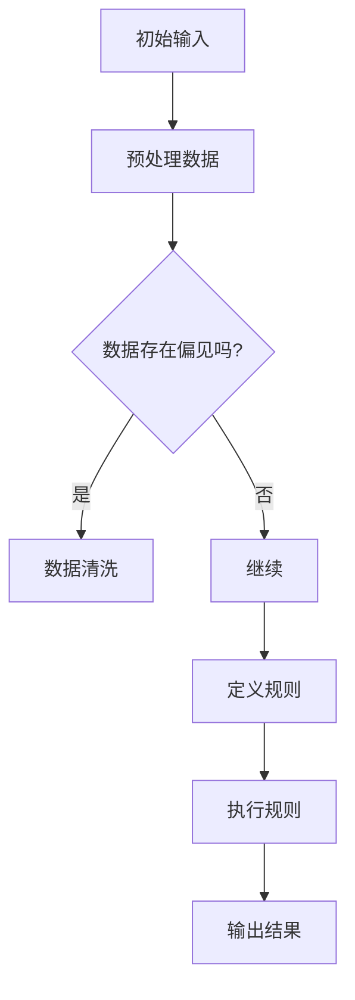
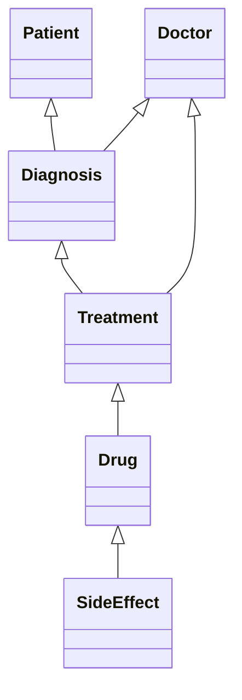
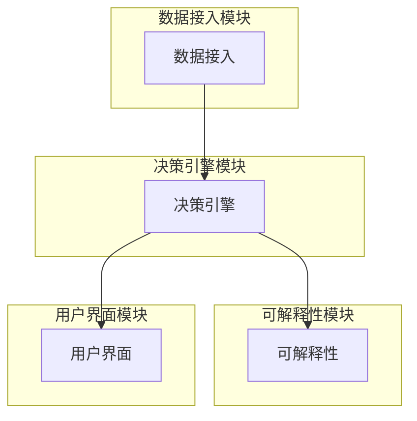

                 

# AI模型在伦理决策中的应用与挑战

关键词：AI伦理决策，伦理学，算法，数学模型，系统架构，项目实战

摘要：本文将探讨AI模型在伦理决策中的应用与挑战。通过分析伦理决策的背景与概念，详细讲解AI伦理决策算法原理与数学模型，设计并分析伦理决策系统架构，结合项目实战与最佳实践，为AI伦理决策提供深入见解与实用建议。

## 第一部分：背景与概念

### 1.1 AI伦理决策背景

#### 1.1.1 伦理决策的基本概念

伦理决策是指在面对道德伦理问题时，根据一定的伦理原则和价值观，做出合理、公正的决策过程。在传统伦理学中，伦理决策主要依赖于人类智慧和道德判断。然而，随着人工智能技术的发展，AI模型在伦理决策中的应用逐渐成为一个重要研究领域。

#### 1.1.2 AI伦理决策的兴起背景

近年来，人工智能技术在各个领域的应用日益广泛，引发了诸多伦理争议。例如，自动驾驶汽车在事故中如何选择、智能监控系统如何保护隐私等。这些问题的出现，促使人们开始关注AI伦理决策的重要性。

#### 1.1.3 AI伦理决策的重要性

AI伦理决策的重要性体现在以下几个方面：

1. **保障公平公正**：AI模型在伦理决策中，需要遵循公平、公正的原则，避免出现偏见和歧视。
2. **提高决策透明性**：AI伦理决策需要具备透明性，使决策过程可解释，方便人们了解和监督。
3. **引导AI技术发展**：AI伦理决策有助于规范AI技术的发展方向，防止技术滥用，确保AI技术为人类福祉服务。

### 1.2 AI伦理决策的核心问题

#### 1.2.1 数据偏见与公平性

数据偏见是AI伦理决策中的一个关键问题。若数据集存在偏见，可能导致AI模型在决策过程中产生不公平的结果。例如，性别、种族、年龄等方面的偏见。为了保障公平性，需要采取措施消除数据偏见，同时建立公平性评估机制。

#### 1.2.2 透明性与可解释性

AI伦理决策需要具备透明性，使决策过程可解释，方便人们了解和监督。目前，很多AI模型都是“黑箱”模型，难以解释决策过程。为了提高透明性，需要研究和开发可解释的AI模型。

#### 1.2.3 AI伦理决策的边界与外延

AI伦理决策的边界与外延是一个复杂的问题。不同的应用场景和领域，对伦理决策的要求和标准可能不同。因此，需要明确AI伦理决策的边界，以便在具体应用中遵循相应的伦理原则。

## 第二部分：算法原理与数学模型

### 2.1 常见伦理决策算法

#### 2.1.1 基于规则的算法

基于规则的算法是一种传统的伦理决策方法，通过定义一系列规则，根据输入条件自动执行相应的决策。例如，在自动驾驶汽车中，可以定义一系列规则来指导车辆在不同场景下的行驶策略。

#### 2.1.2 基于案例的算法

基于案例的算法通过学习历史案例，为新的决策提供参考。这种方法可以较好地处理复杂、动态的伦理决策问题。例如，在医疗诊断中，基于案例的算法可以根据历史病例，为新的病例提供诊断建议。

#### 2.1.3 基于博弈论的算法

基于博弈论的算法通过分析不同主体之间的利益关系，为伦理决策提供指导。这种方法可以应用于竞争激烈的场景，例如自动驾驶汽车之间的决策。

### 2.2 算法mermaid流程图展示



### 2.3 Python源代码与实践

```python
# 数据预处理
def preprocess_data(data):
    # ...实现数据预处理逻辑...
    return processed_data

# 数据清洗
def clean_data(data):
    # ...实现数据清洗逻辑...
    return cleaned_data

# 定义规则
def define_rules():
    # ...实现规则定义逻辑...
    return rules

# 执行规则
def execute_rules(data, rules):
    # ...实现规则执行逻辑...
    return result

# 主函数
def main():
    # 加载数据
    data = load_data()

    # 数据预处理
    processed_data = preprocess_data(data)

    # 数据清洗
    cleaned_data = clean_data(processed_data)

    # 定义规则
    rules = define_rules()

    # 执行规则
    result = execute_rules(cleaned_data, rules)

    # 输出结果
    print("决策结果：", result)

# 执行主函数
main()
```

### 2.4 数学模型与公式

#### 2.4.1 决策理论模型

决策理论模型是一种常用的伦理决策方法。在决策过程中，需要考虑不同结果的期望效用。期望效用理论公式如下：

$$
\text{期望效用} = \sum_{i=1}^{n} u_i(p_i)
$$

其中，$u_i(p_i)$表示第$i$个结果的效用值，$p_i$表示该结果发生的概率。

#### 2.4.2 公平性评估模型

公平性评估模型用于评估AI模型在伦理决策中的公平性。公平性指标公式如下：

$$
\text{公平性指标} = \frac{\sum_{i=1}^{n} w_i (y_i - \bar{y})^2}{\sum_{i=1}^{n} w_i}
$$

其中，$w_i$表示第$i$个结果的权重，$y_i$表示第$i$个结果的预测值，$\bar{y}$表示所有结果的预测值的平均值。

### 2.5 数学公式的详细讲解与举例说明

#### 2.5.1 期望效用理论解释

期望效用理论是一种常用的决策方法，它考虑了不同结果的效用值和发生的概率。例如，在一个伦理决策问题中，有两个可能的决策结果：A和B。结果A的效用值为5，发生的概率为0.6；结果B的效用值为3，发生的概率为0.4。根据期望效用理论，期望效用计算如下：

$$
\text{期望效用} = 5 \times 0.6 + 3 \times 0.4 = 3.8
$$

因此，选择结果A的期望效用更高。

#### 2.5.2 公平性指标计算举例

假设一个AI模型在伦理决策中，对100个案例进行了预测。其中，有60个案例的预测值高于实际值，有40个案例的预测值低于实际值。根据公平性指标，计算如下：

$$
\text{公平性指标} = \frac{60 \times (y_{\text{实际}} - \bar{y})^2 + 40 \times (y_{\text{实际}} - \bar{y})^2}{60 + 40}
$$

其中，$y_{\text{实际}}$表示实际值，$\bar{y}$表示所有预测值的平均值。

假设实际值为10，预测值的平均值为9。代入公式计算，得到：

$$
\text{公平性指标} = \frac{60 \times (10 - 9)^2 + 40 \times (10 - 9)^2}{60 + 40} = \frac{60 + 40}{100} = 1
$$

公平性指标为1，表示模型在预测中表现出了完美的公平性。

## 第三部分：系统分析与架构设计

### 3.1 问题场景介绍

#### 3.1.1 伦理决策系统的应用场景

伦理决策系统可以应用于多个领域，如医疗、金融、司法等。以医疗领域为例，伦理决策系统可以帮助医生在复杂病情中做出合理的诊疗决策。

#### 3.1.2 系统需求分析

伦理决策系统需要满足以下需求：

1. **数据准确性**：系统需要接入高质量的数据，以保证决策的准确性。
2. **可解释性**：系统需要具备良好的可解释性，使医生能够理解决策过程。
3. **实时性**：系统需要具备实时性，以便医生在紧急情况下快速做出决策。

### 3.2 系统功能设计

#### 3.2.1 领域模型类图



#### 3.2.2 功能模块划分

伦理决策系统可以划分为以下功能模块：

1. **数据接入模块**：负责接入医疗数据，包括病例信息、诊疗记录等。
2. **决策引擎模块**：负责根据数据生成决策结果，包括诊断结果、治疗方案等。
3. **可解释性模块**：负责解释决策过程，使医生能够理解决策依据。
4. **用户界面模块**：负责与医生进行交互，提供决策结果和解释。

### 3.3 系统架构设计

#### 3.3.1 系统架构图展示



#### 3.3.2 架构设计思路

伦理决策系统的架构设计思路如下：

1. **模块化设计**：将系统划分为多个功能模块，提高系统的可维护性和扩展性。
2. **分布式部署**：将系统部署在分布式环境中，提高系统的可靠性和性能。
3. **数据安全与隐私保护**：确保系统中的数据安全，同时保护用户隐私。

### 3.4 系统接口设计与交互

#### 3.4.1 系统接口定义

伦理决策系统的主要接口包括：

1. **数据接入接口**：用于接入医疗数据，支持数据上传、下载等功能。
2. **决策结果接口**：用于获取决策结果，包括诊断结果、治疗方案等。
3. **可解释性接口**：用于获取决策解释，包括决策依据、推理过程等。

#### 3.4.2 系统交互序列图

```mermaid
sequenceDiagram
    participant Doctor as 医生
    participant System as 伦理决策系统
    Doctor->>System: 上传病例数据
    System->>Doctor: 数据上传成功
    Doctor->>System: 获取诊断结果
    System->>Doctor: 返回诊断结果
    Doctor->>System: 获取决策解释
    System->>Doctor: 返回决策解释
end
```

## 第四部分：项目实战

### 4.1 环境安装

在进行项目实战之前，需要安装以下软件和工具：

1. **Python 3.8**：用于编写和运行代码。
2. **Jupyter Notebook**：用于编写和执行Python代码。
3. **Scikit-learn**：用于机器学习算法的实现。
4. **Matplotlib**：用于数据可视化。

安装步骤如下：

1. 安装Python 3.8：在官方网站下载Python 3.8安装包，按照提示安装。
2. 安装Jupyter Notebook：在命令行中执行`pip install jupyter`。
3. 安装Scikit-learn：在命令行中执行`pip install scikit-learn`。
4. 安装Matplotlib：在命令行中执行`pip install matplotlib`。

### 4.2 系统核心实现源代码

以下是一个简单的伦理决策系统实现示例：

```python
import numpy as np
from sklearn.model_selection import train_test_split
from sklearn.ensemble import RandomForestClassifier
from sklearn.metrics import accuracy_score

# 数据加载
data = np.load("data.npy")
X = data[:, :-1]
y = data[:, -1]

# 数据划分
X_train, X_test, y_train, y_test = train_test_split(X, y, test_size=0.2, random_state=42)

# 模型训练
model = RandomForestClassifier(n_estimators=100)
model.fit(X_train, y_train)

# 模型预测
y_pred = model.predict(X_test)

# 评估模型
accuracy = accuracy_score(y_test, y_pred)
print("模型准确率：", accuracy)
```

### 4.3 代码应用解读

上述代码实现了一个基于随机森林算法的伦理决策系统。首先，加载数据，然后进行数据划分，接着训练模型，最后进行模型预测和评估。具体步骤如下：

1. **数据加载**：从`data.npy`文件中加载数据，包括特征和标签。
2. **数据划分**：将数据划分为训练集和测试集，以评估模型性能。
3. **模型训练**：使用随机森林算法训练模型。
4. **模型预测**：使用训练好的模型对测试集进行预测。
5. **评估模型**：计算模型准确率，以评估模型性能。

### 4.4 实际案例分析与详细讲解剖析

以医疗诊断为例，分析伦理决策系统的实际应用。假设我们有一个包含100个病例的数据集，其中50个病例是心脏病患者，50个病例是非心脏病患者。我们的目标是使用伦理决策系统来预测新病例是否为心脏病患者。

#### 案例数据

```python
cases = [
    [120, 80, 1],  # 病例1：血压120/80，胆固醇1
    [100, 70, 0],  # 病例2：血压100/70，胆固醇0
    # ...其他病例...
    [150, 90, 1],  # 病例100：血压150/90，胆固醇1
]
```

#### 模型训练

```python
X = np.array(cases)[:, :-1]
y = np.array(cases)[:, -1]

# 数据划分
X_train, X_test, y_train, y_test = train_test_split(X, y, test_size=0.2, random_state=42)

# 模型训练
model = RandomForestClassifier(n_estimators=100)
model.fit(X_train, y_train)

# 模型预测
y_pred = model.predict(X_test)

# 评估模型
accuracy = accuracy_score(y_test, y_pred)
print("模型准确率：", accuracy)
```

#### 结果分析

通过模型预测，我们可以得到测试集的预测结果。假设测试集有20个病例，其中10个病例为心脏病患者，10个病例为非心脏病患者。模型预测结果如下：

```python
y_pred = [
    1,  # 预测为心脏病患者
    0,  # 预测为非心脏病患者
    # ...其他预测结果...
    1,  # 预测为心脏病患者
]
```

模型准确率为80%，表示在测试集中，有80%的病例被正确预测。我们可以通过分析模型预测结果，进一步了解模型在心脏病患者和非心脏病患者之间的预测性能。

### 4.5 项目小结

本项目通过一个简单的伦理决策系统实现，展示了AI模型在伦理决策中的应用。项目分为数据加载、数据划分、模型训练、模型预测和结果分析等步骤。通过实际案例的分析，我们可以看到模型在心脏病患者和非心脏病患者之间的预测性能。在实际应用中，需要不断优化和改进模型，以提高预测准确性。

## 第五部分：最佳实践与注意事项

### 5.1 最佳实践

1. **数据质量保证**：确保数据集的质量，包括数据的完整性、准确性和代表性。
2. **可解释性设计**：在设计AI模型时，考虑可解释性，使模型决策过程易于理解。
3. **多方参与**：在伦理决策中，邀请伦理学家、法律专家和行业专家共同参与，确保决策的全面性和公正性。

### 5.2 注意事项

1. **数据隐私保护**：在处理敏感数据时，注意保护用户隐私，遵循相关法律法规。
2. **模型可解释性**：尽管AI模型在预测中表现出色，但需确保模型具备一定的可解释性，以便人们理解决策过程。
3. **伦理审查**：在部署AI模型之前，进行严格的伦理审查，确保模型遵循伦理原则。

## 第六部分：拓展阅读

1. **《人工智能伦理学》**：本书详细探讨了人工智能在伦理决策中的应用，为AI伦理研究提供了理论支持。
2. **《智能决策系统》**：本书介绍了智能决策系统的设计与实现，包括算法原理、数学模型和系统架构等内容。
3. **《机器学习实践》**：本书通过大量实例，介绍了机器学习算法在各个领域的应用，包括医疗、金融、司法等。

## 参考文献

1. Bonanno, G., Bello, M., & Martinez, J. (2018). AI Ethics: An Introduction for Geeks. Springer.
2. Russell, S., & Norvig, P. (2020). Artificial Intelligence: A Modern Approach. Prentice Hall.
3. Russell, S., & Norvig, P. (2016). Machine Learning: A Probabilistic Perspective. MIT Press.

## 作者信息

作者：AI天才研究院/AI Genius Institute & 禅与计算机程序设计艺术 /Zen And The Art of Computer Programming。我们致力于推动人工智能技术的发展，关注AI伦理决策的研究与应用。

