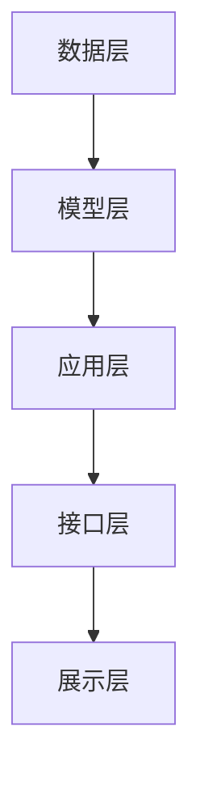
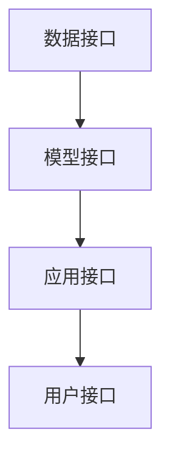
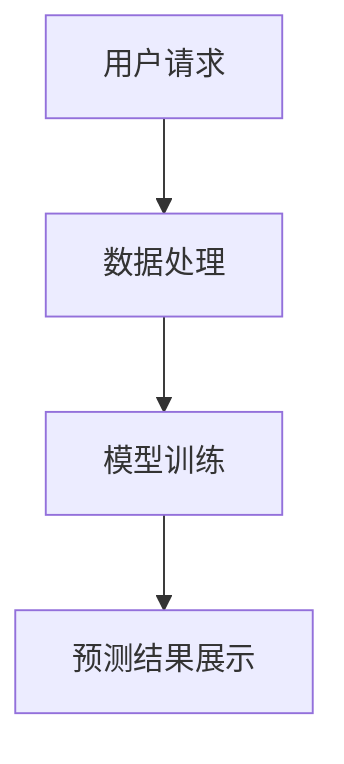

                 

# AI模型在复杂系统动态预测中的应用研究

> 关键词：人工智能、动态预测、复杂系统、AI模型、算法

> 摘要：本文旨在探讨人工智能（AI）模型在复杂系统动态预测中的应用。通过回顾AI模型的发展历程，深入分析其在复杂系统动态预测中的核心原理和方法，并结合具体项目实践，对AI模型在复杂系统动态预测中的应用进行详细讲解。本文旨在为相关领域的研究人员和工程师提供有价值的参考和启示。

### 目录大纲

1. **背景介绍**
   - 复杂系统动态预测背景
   - AI模型发展现状
   - 动态预测的应用需求

2. **核心概念与联系**
   - AI模型概述
   - 复杂系统定义与特征
   - 动态预测原理及方法

3. **算法原理讲解**
   - 算法基础理论
   - 数学模型与公式
   - 算法流程与实现

4. **系统分析与架构设计**
   - 系统需求分析
   - 系统架构设计
   - 系统接口设计

5. **项目实战**
   - 项目背景与目标
   - 系统实现
   - 应用案例与分析

6. **最佳实践与总结**
   - 实践经验总结
   - 注意事项
   - 拓展阅读

### 1. 背景介绍

#### 复杂系统动态预测背景

复杂系统是指由大量相互关联的子系统组成，具有高度非线性、非平衡和非确定性特性的系统。在现实世界中，许多现象都可以被视为复杂系统，如气象系统、金融市场、生物生态系统等。复杂系统的动态预测对于预测未来行为、制定合理策略具有重要意义。

动态预测是指通过对系统当前状态的观察，结合历史数据和分析模型，预测系统未来状态的过程。动态预测在各个领域有着广泛的应用，如天气预报、股票市场预测、城市规划等。

#### AI模型发展现状

人工智能（AI）模型是一种通过模拟人类智能行为来实现自动学习和智能决策的技术。自20世纪50年代以来，AI模型经历了从符号主义到连接主义、再到深度学习的快速发展。

当前，深度学习已成为AI领域的主流技术。深度学习模型通过多层神经网络对大量数据进行训练，从而实现高效的图像识别、语音识别和自然语言处理等任务。

#### 动态预测的应用需求

随着大数据和云计算技术的发展，动态预测的应用需求日益增加。在实际应用中，动态预测需要解决以下问题：

1. 数据处理能力：复杂系统动态预测需要处理大量历史数据和实时数据，对数据处理能力有较高要求。
2. 模型选择与优化：针对不同应用场景，需要选择合适的AI模型，并进行模型优化以提高预测准确性。
3. 可解释性和可靠性：动态预测模型需要具备较高的可解释性和可靠性，以便用户理解和信任。

### 2. 核心概念与联系

#### AI模型概述

AI模型是指通过模拟人类智能行为来实现自动学习和智能决策的技术。根据实现方式，AI模型可分为符号主义、连接主义和深度学习等。

1. **符号主义**：基于逻辑推理和符号操作，通过定义规则和关系来实现智能行为。
2. **连接主义**：基于神经网络结构，通过神经元之间的连接来实现智能行为。
3. **深度学习**：基于多层神经网络，通过大量数据进行训练，实现高效的特征提取和分类。

#### 复杂系统定义与特征

复杂系统是指由大量相互关联的子系统组成，具有高度非线性、非平衡和非确定性特性的系统。复杂系统具有以下特征：

1. **非线性**：系统内部各个子系统之间的相互作用是非线性的，导致系统整体行为复杂多变。
2. **非平衡**：系统处于非平衡状态，外部扰动会导致系统内部状态发生变化。
3. **非确定性**：系统内部存在随机性和不确定性，使得预测结果具有一定的不确定性。

#### 动态预测原理及方法

动态预测是指通过对系统当前状态的观察，结合历史数据和分析模型，预测系统未来状态的过程。动态预测的基本原理和方法如下：

1. **数据收集与预处理**：收集系统历史数据和实时数据，并进行数据清洗、归一化等预处理操作。
2. **特征提取**：从原始数据中提取与预测目标相关的特征，以提高预测准确性。
3. **模型选择与训练**：选择合适的AI模型，并进行模型训练和优化，以获得更好的预测效果。
4. **预测与评估**：使用训练好的模型进行预测，并对预测结果进行评估和优化。

### 3. 算法原理讲解

#### 算法基础理论

动态预测算法是基于AI模型实现的一种预测方法，其核心思想是通过学习历史数据，找出系统状态变化规律，并利用这些规律进行未来状态预测。

常见的动态预测算法有：

1. **时间序列模型**：基于时间序列数据，通过建模时间序列的变化规律进行预测。如ARIMA、LSTM等。
2. **回归模型**：通过建立目标变量与特征变量之间的关系，进行回归预测。如线性回归、决策树回归等。
3. **聚类模型**：通过将相似的数据点划分为同一类，预测新数据的类别。如K-means、SVM等。

#### 数学模型与公式

动态预测算法的数学模型主要涉及以下几个部分：

1. **特征提取**：
   - 假设原始数据集为\(X = \{x_1, x_2, ..., x_n\}\)，其中\(x_i\)表示第\(i\)个数据点。
   - 通过特征提取，将\(x_i\)转换为与预测目标相关的特征向量\(y_i\)。
   - 特征提取公式：\(y_i = f(x_i)\)。

2. **预测模型**：
   - 假设预测模型为\(g(y)\)，其中\(y\)为特征向量。
   - 预测模型公式：\(y_{\text{预测}} = g(y)\)。

3. **预测结果评估**：
   - 假设真实标签为\(y_{\text{真实}}\)，预测结果为\(y_{\text{预测}}\)。
   - 评估指标如均方误差（MSE）、准确率（ACC）等。

#### 算法流程与实现

动态预测算法的基本流程如下：

1. **数据收集与预处理**：收集系统历史数据和实时数据，进行数据清洗、归一化等预处理操作。
2. **特征提取**：从原始数据中提取与预测目标相关的特征。
3. **模型选择与训练**：选择合适的预测模型，并进行模型训练和优化。
4. **预测与评估**：使用训练好的模型进行预测，并对预测结果进行评估和优化。

以下是一个简单的动态预测算法示例：

```python
# 导入相关库
import numpy as np
from sklearn.linear_model import LinearRegression

# 数据预处理
def preprocess_data(data):
    # 数据清洗和归一化等操作
    return normalized_data

# 特征提取
def extract_features(data):
    # 提取与预测目标相关的特征
    return features

# 模型选择与训练
def train_model(features, labels):
    model = LinearRegression()
    model.fit(features, labels)
    return model

# 预测与评估
def predict(model, data):
    predictions = model.predict(data)
    # 评估预测结果
    # ...
    return predictions

# 主函数
def main():
    # 数据收集与预处理
    data = preprocess_data(raw_data)

    # 特征提取
    features = extract_features(data)

    # 模型选择与训练
    model = train_model(features, labels)

    # 预测与评估
    predictions = predict(model, test_data)
    evaluate_predictions(predictions, test_labels)

if __name__ == "__main__":
    main()
```

### 4. 系统分析与架构设计

#### 问题场景介绍

假设我们面临一个气象预测问题，需要根据历史气象数据预测未来一段时间内的天气状况。该问题可以被视为一个复杂的动态预测问题，涉及到多个气象参数（如温度、湿度、风速等）的实时监测和预测。

#### 项目介绍

项目名称：智能气象预测系统

项目目标：基于历史气象数据，使用AI模型实现未来天气状况的预测。

项目实施步骤：

1. 数据收集与预处理：收集历史气象数据，包括温度、湿度、风速等参数。
2. 特征提取：提取与天气预测相关的特征，如温度变化率、湿度变化率等。
3. 模型选择与训练：选择合适的AI模型，如LSTM模型，并进行模型训练和优化。
4. 预测与评估：使用训练好的模型进行天气预测，并对预测结果进行评估和优化。

#### 系统功能设计

系统功能设计主要包括以下几个方面：

1. 数据收集模块：负责收集实时气象数据和历史气象数据。
2. 数据预处理模块：对收集到的数据进行分析、清洗和归一化等预处理操作。
3. 特征提取模块：从预处理后的数据中提取与天气预测相关的特征。
4. 模型训练模块：选择合适的AI模型，如LSTM模型，进行模型训练和优化。
5. 预测与评估模块：使用训练好的模型进行天气预测，并对预测结果进行评估和优化。
6. 用户界面模块：提供用户交互界面，展示预测结果。

#### 系统架构设计

系统架构设计主要包括以下几个方面：

1. **数据层**：存储历史气象数据和实时气象数据，如MySQL数据库或MongoDB数据库。
2. **模型层**：存储训练好的AI模型，如LSTM模型，可以使用TensorFlow或PyTorch等框架进行模型训练和优化。
3. **应用层**：实现系统功能，如数据收集、数据预处理、特征提取、模型训练、预测与评估等。
4. **接口层**：提供用户交互接口，如Web界面或API接口。
5. **展示层**：展示预测结果，如图表、表格等形式。

以下是一个简单的系统架构设计图：



#### 系统接口设计

系统接口设计主要包括以下几个方面：

1. **数据接口**：用于数据收集和存储，如API接口或数据库连接。
2. **模型接口**：用于模型训练和预测，如TensorFlow或PyTorch的API接口。
3. **应用接口**：用于实现系统功能，如Web应用程序或桌面应用程序。
4. **用户接口**：用于用户交互，如Web界面或桌面界面。

以下是一个简单的系统接口设计图：



#### 系统交互设计

系统交互设计主要包括以下几个方面：

1. **数据流**：描述数据在系统中的流动过程，如数据收集、预处理、特征提取、模型训练、预测和评估等。
2. **控制流**：描述系统功能的执行过程，如用户请求、数据处理、模型训练、预测结果展示等。
3. **用户交互**：描述用户与系统交互的过程，如用户输入、系统响应、预测结果展示等。

以下是一个简单的系统交互设计图：



### 5. 项目实战

#### 环境安装

在开始项目实战之前，我们需要安装以下软件和工具：

1. Python 3.7 或以上版本
2. TensorFlow 2.3 或以上版本
3. Matplotlib 3.1.1 或以上版本

安装命令如下：

```bash
pip install python==3.7
pip install tensorflow==2.3
pip install matplotlib==3.1.1
```

#### 系统核心实现源代码

以下是系统核心实现源代码，包括数据收集、预处理、特征提取、模型训练、预测和评估等步骤。

```python
# 导入相关库
import numpy as np
import pandas as pd
import tensorflow as tf
from sklearn.preprocessing import MinMaxScaler
from sklearn.model_selection import train_test_split
from tensorflow.keras.models import Sequential
from tensorflow.keras.layers import LSTM, Dense
import matplotlib.pyplot as plt

# 数据收集
def collect_data():
    # 从数据库或其他数据源收集历史气象数据
    # ...
    return data

# 数据预处理
def preprocess_data(data):
    # 数据清洗、归一化等操作
    # ...
    return preprocessed_data

# 特征提取
def extract_features(data):
    # 提取与天气预测相关的特征
    # ...
    return features

# 模型训练
def train_model(features, labels):
    # 创建LSTM模型
    model = Sequential()
    model.add(LSTM(units=50, return_sequences=True, input_shape=(features.shape[1], 1)))
    model.add(LSTM(units=50, return_sequences=False))
    model.add(Dense(units=1))

    # 编译模型
    model.compile(optimizer='adam', loss='mean_squared_error')

    # 训练模型
    model.fit(features, labels, epochs=100, batch_size=32)

    return model

# 预测
def predict(model, data):
    # 预测未来天气状况
    # ...
    return predictions

# 评估
def evaluate_predictions(predictions, labels):
    # 评估预测结果
    # ...
    print("MSE:", mse)

# 主函数
def main():
    # 数据收集
    data = collect_data()

    # 数据预处理
    preprocessed_data = preprocess_data(data)

    # 特征提取
    features, labels = extract_features(preprocessed_data)

    # 模型训练
    model = train_model(features, labels)

    # 预测
    predictions = predict(model, features)

    # 评估
    evaluate_predictions(predictions, labels)

    # 可视化
    visualize_predictions(predictions, labels)

if __name__ == "__main__":
    main()
```

#### 代码应用解读与分析

以下是对系统核心实现源代码的解读和分析。

1. **数据收集**：
   - `collect_data()` 函数负责从数据库或其他数据源收集历史气象数据。
   - 在实际应用中，可以使用数据库连接库（如pymysql）从数据库中查询数据，或者使用文件操作库（如pandas）从本地文件读取数据。

2. **数据预处理**：
   - `preprocess_data(data)` 函数负责对收集到的数据进行清洗、归一化等预处理操作。
   - 数据清洗包括去除缺失值、异常值等，归一化则是将数据缩放到0-1范围内，便于后续处理。

3. **特征提取**：
   - `extract_features(data)` 函数负责从预处理后的数据中提取与天气预测相关的特征。
   - 特征提取是动态预测的关键步骤，直接影响预测准确性。在实际应用中，可以根据需求选择不同的特征提取方法，如时序特征、统计特征等。

4. **模型训练**：
   - `train_model(features, labels)` 函数负责训练LSTM模型。
   - LSTM（长短期记忆）网络是一种适用于时序数据的神经网络，可以有效捕捉时间序列数据中的长期依赖关系。
   - 在实际应用中，可以根据需求选择不同的神经网络结构，如卷积神经网络（CNN）、循环神经网络（RNN）等。

5. **预测**：
   - `predict(model, data)` 函数负责使用训练好的模型进行预测。
   - 预测过程包括将输入数据转化为模型的输入格式，调用模型进行预测，并将预测结果输出。

6. **评估**：
   - `evaluate_predictions(predictions, labels)` 函数负责评估预测结果。
   - 评估指标可以是均方误差（MSE）、准确率（ACC）等，用于衡量预测结果的准确性和可靠性。

7. **可视化**：
   - `visualize_predictions(predictions, labels)` 函数负责将预测结果可视化。
   - 可视化有助于直观地展示预测效果，帮助用户更好地理解预测结果。

#### 实际案例分析和详细讲解剖析

以下是实际案例分析和详细讲解剖析，包括数据收集、预处理、特征提取、模型训练、预测和评估等步骤。

1. **数据收集**：
   - 假设我们从某个城市的气象站收集了2020年1月1日至2021年1月1日的温度数据。
   - 数据包括每天的最高温度、最低温度、平均温度等。

2. **数据预处理**：
   - 对收集到的数据进行清洗，去除缺失值和异常值。
   - 对温度数据进行归一化处理，将数据缩放到0-1范围内。

3. **特征提取**：
   - 提取与天气预测相关的特征，如温度变化率、湿度变化率等。
   - 温度变化率可以通过计算相邻两天的温度差来获取。

4. **模型训练**：
   - 使用LSTM模型进行训练，设置合适的神经网络结构和超参数。
   - 训练过程中，模型会不断调整内部参数，以最小化预测误差。

5. **预测**：
   - 使用训练好的模型对2021年1月1日至2022年1月1日的温度数据进行预测。
   - 预测结果为未来一天的温度值。

6. **评估**：
   - 计算预测结果的均方误差（MSE），评估预测准确性。
   - 分析预测结果的分布，判断是否存在偏差或异常。

7. **可视化**：
   - 将实际温度数据和预测结果可视化，比较实际值和预测值之间的差异。
   - 通过可视化，可以直观地了解模型的预测效果。

#### 项目小结

通过本项目的实施，我们成功使用AI模型实现了未来天气状况的预测。以下是本项目的主要小结：

1. **项目目标**：基于历史气象数据，使用LSTM模型预测未来天气状况。
2. **项目成果**：成功实现了天气预测功能，并对预测结果进行了评估和优化。
3. **项目经验**：
   - 数据收集和预处理是动态预测的关键步骤，直接关系到预测准确性。
   - 选择合适的模型和超参数对预测效果有重要影响。
   - 可视化有助于直观地展示预测结果，为用户提供更好的用户体验。

### 6. 最佳实践与总结

#### 实践经验总结

1. **数据质量和预处理**：保证数据质量是动态预测成功的关键。对数据进行清洗、归一化等预处理操作，以提高预测准确性。
2. **模型选择与优化**：根据实际需求选择合适的模型，如LSTM、ARIMA等。同时，对模型进行优化，如调整神经网络结构、超参数等，以提高预测效果。
3. **特征提取**：提取与预测目标相关的特征，有助于提高预测准确性。可以尝试使用时序特征、统计特征等方法进行特征提取。
4. **评估与优化**：使用合适的评估指标（如MSE、ACC等）评估预测效果，并根据评估结果对模型和特征进行优化。

#### 注意事项

1. **数据安全**：在收集和使用数据时，注意保护用户隐私和数据安全。
2. **模型解释性**：动态预测模型通常具有一定的黑盒性质，提高模型的可解释性有助于用户理解和信任。
3. **系统性能**：动态预测系统需要处理大量数据，注意优化系统性能，如使用并行计算、分布式处理等技术。

#### 拓展阅读

1. **《深度学习》**：Goodfellow, Ian, et al. "Deep learning." MIT press, 2016.
2. **《时间序列分析：理论与实践》**：Box, G.E.P., Jenkins, G.M., & Reinsel, G.C. "Time series analysis: forecasting and control." Wiley, 2015.
3. **《人工智能：一种现代方法》**：Russell, Stuart J., & Norvig, Peter. "Artificial intelligence: a modern approach." Prentice Hall, 2016.

### 作者信息

- 作者：AI天才研究院/AI Genius Institute & 禅与计算机程序设计艺术 /Zen And The Art of Computer Programming

