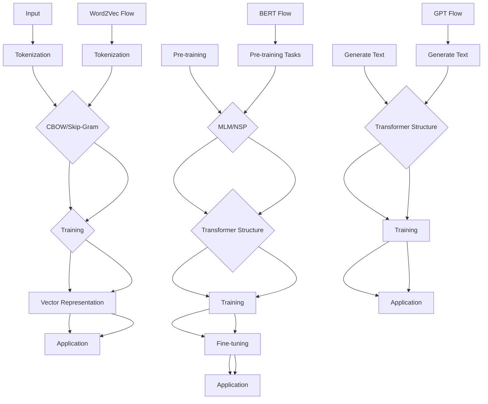
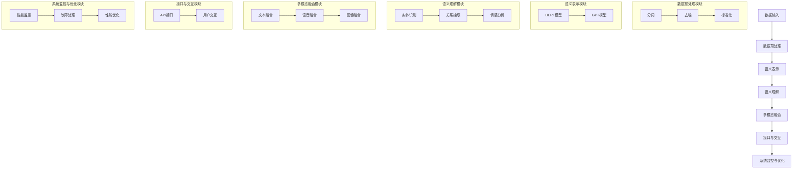
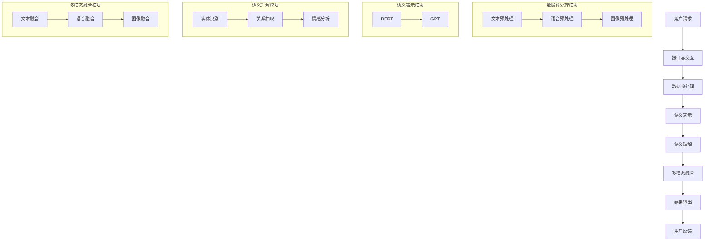
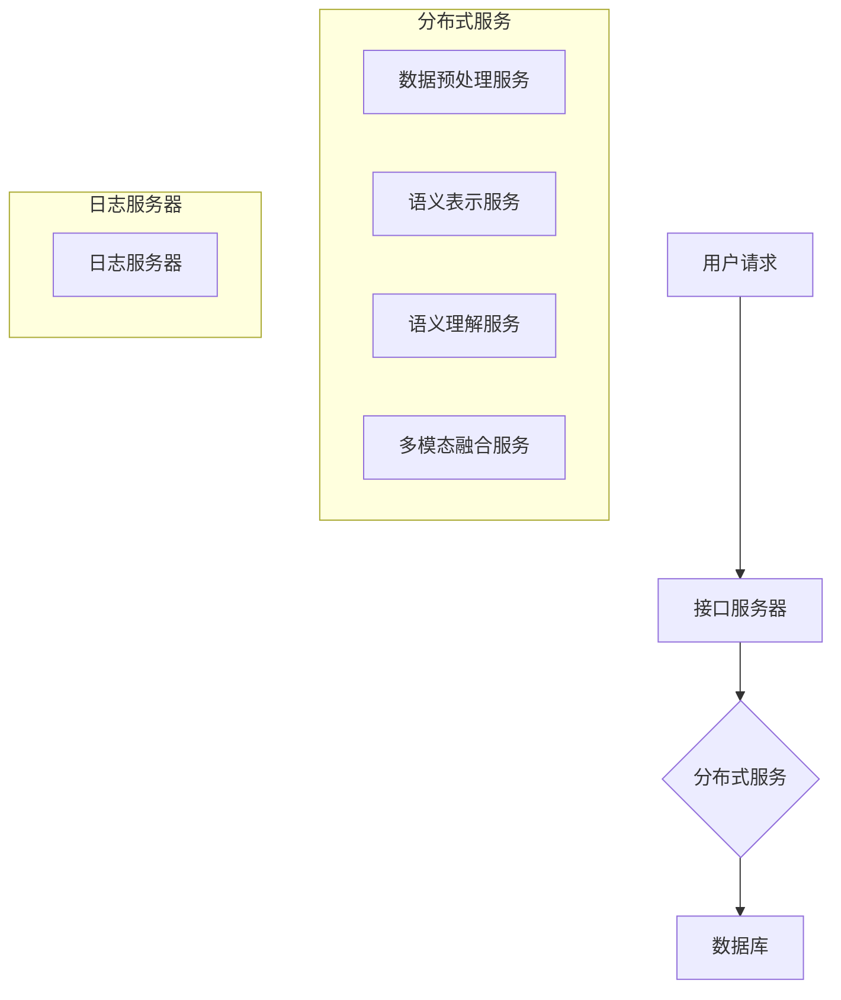
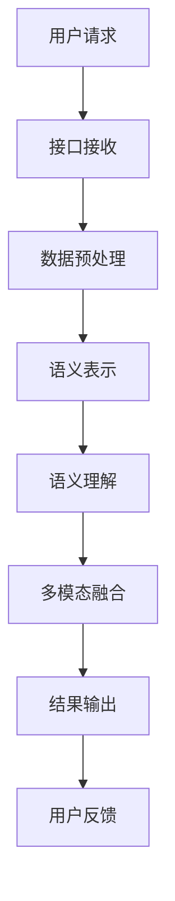

                 

# AI模型在自然语言处理中的语义理解能力提升

> 关键词：自然语言处理，语义理解，AI模型，深度学习，BERT，GPT，系统架构，项目实战，最佳实践

> 摘要：本文深入探讨了AI模型在自然语言处理中的语义理解能力提升。通过分析传统AI模型的局限和当前主流AI模型的特点，介绍了语义理解的概念和核心要素。本文从算法原理、系统架构设计、项目实战等方面展开，详细讲解了AI模型在自然语言处理中的实际应用，为相关领域的研究和实践提供了有价值的参考。

## 目录大纲

#### 第一部分：背景介绍

- **第1章**：AI模型在自然语言处理中的语义理解能力提升——问题背景
  - **1.1 问题的提出**
    - **1.1.1 自然语言处理的挑战**
    - **1.1.2 语义理解的重要性**
    - **1.1.3 AI模型在语义理解中的应用前景**
  - **1.2 语义理解的概念与边界**
    - **1.2.1 语义理解的定义**
    - **1.2.2 语义理解的边界与外延**
    - **1.2.3 语义理解的核心要素组成**
  - **1.3 当前AI模型在语义理解中的现状**
    - **1.3.1 传统AI模型的局限**
    - **1.3.2 当前主流AI模型的特点**
    - **1.3.3 语义理解技术的最新进展**
  - **1.4 本书结构安排**
    - **1.4.1 主要章节内容概述**
    - **1.4.2 学习目标与预期收获**

#### 第二部分：核心概念与联系

- **第2章**：核心概念原理与属性特征对比
  - **2.1 AI模型基本概念**
    - **2.1.1 深度学习基础**
    - **2.1.2 神经网络基础**
    - **2.1.3 常见AI模型简介**
  - **2.2 语义理解相关概念**
    - **2.2.1 语义表示**
    - **2.2.2 语义关系**
    - **2.2.3 语义消歧**
  - **2.3 AI模型与语义理解联系**
    - **2.3.1 AI模型在语义理解中的作用**
    - **2.3.2 语义理解在AI模型中的应用**
    - **2.3.3 关键技术的融合与发展**
  - **2.4 概念属性特征对比表格**
    - **2.4.1 深度学习模型特征对比**
    - **2.4.2 语义理解技术特征对比**
    - **2.4.3 AI模型在语义理解中的应用效果对比**
  - **2.5 ER实体关系图架构**
    - **2.5.1 ER图基础**
    - **2.5.2 语义理解的ER图架构**
    - **2.5.3 AI模型在ER图架构中的应用**

#### 第三部分：算法原理讲解

- **第3章**：AI模型在自然语言处理中的算法原理
  - **3.1 语义理解的数学模型**
    - **3.1.1 数学模型基础**
    - **3.1.2 语义表示模型**
    - **3.1.3 语义关系模型**
  - **3.2 常见算法详解**
    - **3.2.1 word2vec算法**
    - **3.2.2 BERT算法**
    - **3.2.3 GPT算法**
  - **3.3 算法原理与流程图**
    - **3.3.1 算法流程图**
    - **3.3.2 Python源代码实现**
    - **3.3.3 算法数学模型和公式**
    - **3.3.4 通俗易懂地举例说明**

#### 第四部分：系统分析与架构设计

- **第4章**：AI模型在自然语言处理中的应用系统分析与架构设计
  - **4.1 问题场景介绍**
    - **4.1.1 应用背景**
    - **4.1.2 应用目标**
  - **4.2 项目介绍**
    - **4.2.1 项目概述**
    - **4.2.2 项目架构**
  - **4.3 系统功能设计**
    - **4.3.1 领域模型**
    - **4.3.2 功能模块划分**
  - **4.4 系统架构设计**
    - **4.4.1 系统架构**
    - **4.4.2 架构优势**
  - **4.5 系统接口设计**
    - **4.5.1 接口规范**
    - **4.5.2 接口实现**
  - **4.6 系统交互设计**
    - **4.6.1 交互流程**
    - **4.6.2 交互图**

#### 第五部分：项目实战

- **第5章**：AI模型在自然语言处理中的项目实战
  - **5.1 环境安装**
    - **5.1.1 硬件环境**
    - **5.1.2 软件环境**
    - **5.1.3 环境配置**
  - **5.2 系统核心实现**
    - **5.2.1 源代码解读**
    - **5.2.2 核心模块实现**
    - **5.2.3 代码分析与优化**
  - **5.3 应用解读与分析**
    - **5.3.1 应用场景分析**
    - **5.3.2 应用效果评估**
    - **5.3.3 案例分析**
  - **5.4 详细讲解与剖析**
    - **5.4.1 技术细节解读**
    - **5.4.2 应用场景举例**
    - **5.4.3 问题解决与优化**
  - **5.5 项目小结**
    - **5.5.1 项目总结**
    - **5.5.2 项目拓展**
    - **5.5.3 未来展望**

#### 第六部分：最佳实践与拓展

- **第6章**：AI模型在自然语言处理中的最佳实践与拓展
  - **6.1 最佳实践**
    - **6.1.1 实践技巧**
    - **6.1.2 成功案例分析**
    - **6.1.3 实践经验总结**
  - **6.2 注意事项**
    - **6.2.1 常见问题与解决方案**
    - **6.2.2 安全性与隐私保护**
    - **6.2.3 遵守相关法律法规**
  - **6.3 拓展阅读**
    - **6.3.1 相关书籍推荐**
    - **6.3.2 学术论文精选**
    - **6.3 其他拓展资源**

### 第一部分：背景介绍

#### 第1章：AI模型在自然语言处理中的语义理解能力提升——问题背景

##### 1.1 问题的提出

##### 1.1.1 自然语言处理的挑战

自然语言处理（Natural Language Processing，NLP）是计算机科学领域与人工智能领域中的一个重要方向，它涉及到语言的理解、生成和翻译。在过去的几十年中，自然语言处理技术经历了从规则驱动到统计学习，再到深度学习的过程。尽管如此，自然语言处理仍然面临诸多挑战。

- **语言的复杂性**：自然语言具有高度的复杂性和多样性，不同的语言有着不同的语法结构、语义表达和语用规则。
- **上下文依赖性**：自然语言中的很多含义依赖于上下文环境，这使得语义理解的准确性受到很大影响。
- **歧义性**：自然语言中的词语和句子常常存在歧义，使得计算机难以准确理解其真实含义。
- **语调、语气和情感**：自然语言中的语调、语气和情感等非结构化信息对语义理解有着重要的影响。

##### 1.1.2 语义理解的重要性

语义理解是自然语言处理的核心任务之一，它涉及到对语言中的词、句和段落的理解，以及对语义关系的分析和推理。语义理解的重要性主要体现在以下几个方面：

- **提高机器阅读能力**：通过语义理解，机器能够更好地理解和分析文本内容，从而实现更高效的阅读和信息提取。
- **提升对话系统交互体验**：语义理解使得对话系统能够更准确地理解用户意图，提供更符合用户需求的回答。
- **增强智能推荐系统**：语义理解可以帮助智能推荐系统更准确地理解用户兴趣和需求，提供更个性化的推荐结果。
- **改善机器翻译质量**：语义理解可以有效地解决机器翻译中的语义偏差和误解问题，提高翻译的准确性。

##### 1.1.3 AI模型在语义理解中的应用前景

随着深度学习技术的发展，AI模型在语义理解方面展现出了巨大的潜力。当前，主流的AI模型，如深度神经网络、递归神经网络、长短时记忆网络等，已经在语义理解任务中取得了显著成果。

- **预训练模型**：预训练模型通过在大量无标签语料上进行预训练，获得对语言的一般理解和表示能力，然后再通过微调适应具体任务。
- **多模态学习**：多模态学习通过整合文本、语音、图像等多源数据，提高语义理解的准确性和深度。
- **知识图谱**：知识图谱通过构建实体和关系网络，为语义理解提供了丰富的背景知识和语义关联。

展望未来，AI模型在语义理解方面的发展有望进一步突破，实现更精准、更智能的语义理解和应用。

##### 1.2 语义理解的概念与边界

##### 1.2.1 语义理解的定义

语义理解（Semantic Understanding）是指计算机对自然语言中的词、句和段落的语义进行理解和分析的过程。它涉及到语义表示、语义关系、语义消歧等多个方面。

- **语义表示**：将自然语言中的词语和句子转换为计算机可以处理的语义表示形式，如词向量、句子向量等。
- **语义关系**：分析词语和句子之间的语义关系，如因果关系、时间关系、空间关系等。
- **语义消歧**：解决自然语言中的歧义问题，确定词语或句子的确切含义。

##### 1.2.2 语义理解的边界与外延

语义理解的边界主要涉及到以下几个方面：

- **语言的多样性**：不同的语言有着不同的语法结构和语义规则，语义理解需要考虑语言的多样性。
- **上下文依赖性**：语义理解高度依赖于上下文环境，不同上下文环境可能导致语义理解的结果不同。
- **非结构化信息**：自然语言中包含大量的非结构化信息，如语调、语气、情感等，这些信息对语义理解有重要影响。

语义理解的外延主要涉及到以下几个方面：

- **文本分析**：对文本进行语义分析，提取关键信息，如主题提取、情感分析等。
- **对话系统**：通过语义理解实现自然语言的对话交互，提高对话系统的交互体验。
- **机器翻译**：通过语义理解实现准确、自然的机器翻译，提高翻译质量。

##### 1.2.3 语义理解的核心要素组成

语义理解的核心要素主要包括以下几个方面：

- **词语表示**：对自然语言中的词语进行表示，如词向量、词袋模型等。
- **句子表示**：对自然语言中的句子进行表示，如递归神经网络、长短时记忆网络等。
- **语义关系表示**：对词语和句子之间的语义关系进行表示，如因果关系、时间关系等。
- **上下文表示**：对自然语言中的上下文信息进行表示，如窗口上下文、全文上下文等。

这些要素相互交织，共同构成了语义理解的核心体系，为实现高效的语义理解和应用提供了基础。

##### 1.3 当前AI模型在语义理解中的现状

##### 1.3.1 传统AI模型的局限

传统的AI模型在语义理解方面存在以下局限：

- **依赖大量手工特征**：传统的语义理解方法通常依赖于大量手工特征，如词频、词义相似度、词性标注等，这些特征难以捕捉语义的细微差别。
- **低效的语义表示**：传统的语义表示方法，如词袋模型、TF-IDF等，难以有效地表示语义信息，导致语义理解的准确性受限。
- **难以应对上下文依赖**：传统的语义理解方法难以应对上下文的依赖性，导致语义理解的结果容易受到上下文变化的影响。

##### 1.3.2 当前主流AI模型的特点

当前主流的AI模型在语义理解方面具有以下特点：

- **深度学习技术**：深度学习技术，如卷积神经网络（CNN）、递归神经网络（RNN）、长短时记忆网络（LSTM）等，为语义理解提供了强大的表示能力和建模能力。
- **预训练模型**：预训练模型，如BERT、GPT等，通过在大量无标签语料上进行预训练，获得对语言的一般理解和表示能力，然后再通过微调适应具体任务。
- **多模态学习**：多模态学习通过整合文本、语音、图像等多源数据，提高语义理解的准确性和深度。

##### 1.3.3 语义理解技术的最新进展

近年来，语义理解技术取得了显著的进展，主要表现在以下几个方面：

- **预训练模型的广泛应用**：预训练模型，如BERT、GPT等，已经成为语义理解任务的标准模型，其在多个语义理解任务上取得了显著的性能提升。
- **多模态学习的深入发展**：多模态学习通过整合文本、语音、图像等多源数据，为语义理解提供了丰富的信息来源，提高了语义理解的准确性和深度。
- **知识图谱的引入**：知识图谱通过构建实体和关系网络，为语义理解提供了丰富的背景知识和语义关联，有助于解决语义歧义和不确定性问题。

##### 1.4 本书结构安排

##### 1.4.1 主要章节内容概述

本书主要分为六个部分，分别从核心概念、算法原理、系统架构设计、项目实战、最佳实践与拓展等方面对AI模型在自然语言处理中的语义理解能力提升进行深入探讨。

- **第一部分**：背景介绍，包括问题背景、语义理解的概念与边界、当前AI模型在语义理解中的现状等。
- **第二部分**：核心概念与联系，包括AI模型基本概念、语义理解相关概念、AI模型与语义理解联系等。
- **第三部分**：算法原理讲解，包括语义理解的数学模型、常见算法详解、算法原理与流程图等。
- **第四部分**：系统分析与架构设计，包括问题场景介绍、项目介绍、系统功能设计、系统架构设计、系统接口设计、系统交互设计等。
- **第五部分**：项目实战，包括环境安装、系统核心实现、应用解读与分析、详细讲解与剖析、项目小结等。
- **第六部分**：最佳实践与拓展，包括最佳实践、注意事项、拓展阅读等。

##### 1.4.2 学习目标与预期收获

通过学习本书，读者可以：

- **掌握AI模型在自然语言处理中的语义理解能力提升的核心概念和原理**。
- **了解当前主流AI模型的特点和应用**。
- **学会使用深度学习和预训练模型进行语义理解**。
- **掌握系统分析与架构设计的方法和技巧**。
- **具备项目实战能力，能够应用AI模型解决实际问题**。
- **获得最佳实践和拓展知识，提升语义理解能力**。

通过本书的学习，读者将能够深入了解AI模型在自然语言处理中的语义理解能力提升，为相关领域的研究和实践提供有益的参考。

### 第二部分：核心概念与联系

#### 第2章：核心概念原理与属性特征对比

##### 2.1 AI模型基本概念

##### 2.1.1 深度学习基础

深度学习（Deep Learning）是一种基于多层神经网络的学习方法，通过构建多层非线性变换模型来表示复杂的数据特征。深度学习的基础包括以下几个方面：

- **神经元**：深度学习中的神经元类似于生物神经元，用于接收和处理信息。
- **网络层**：深度学习网络由多个层组成，包括输入层、隐藏层和输出层。每一层都对输入数据进行特征提取和变换。
- **激活函数**：激活函数用于引入非线性变换，使得深度学习模型能够学习复杂的特征关系。
- **反向传播算法**：反向传播算法用于训练深度学习模型，通过不断调整网络权重，使得模型的输出与真实值之间的误差最小。

##### 2.1.2 神经网络基础

神经网络（Neural Network）是一种模拟生物神经系统的计算模型，通过连接大量神经元来实现复杂的计算任务。神经网络的基础包括以下几个方面：

- **神经元连接**：神经网络中的神经元通过连接实现信息传递和计算。
- **权重和偏置**：每个神经元连接都带有权重和偏置，用于调整信息传递的强度和偏移。
- **激活函数**：激活函数用于引入非线性变换，使得神经网络能够学习复杂的特征关系。
- **多层网络**：多层神经网络通过堆叠多个层来实现更复杂的特征提取和表示。

##### 2.1.3 常见AI模型简介

常见的AI模型包括深度学习模型、统计模型和强化学习模型等。以下是一些常见的AI模型及其特点：

- **卷积神经网络（CNN）**：卷积神经网络是一种用于图像识别和处理的深度学习模型，通过卷积操作提取图像特征。
- **递归神经网络（RNN）**：递归神经网络是一种用于序列数据的深度学习模型，通过递归连接实现序列信息的建模。
- **长短时记忆网络（LSTM）**：长短时记忆网络是一种改进的递归神经网络，用于解决长序列依赖问题。
- **生成对抗网络（GAN）**：生成对抗网络是一种通过对抗训练生成数据的深度学习模型，广泛应用于图像生成、语音合成等领域。
- **决策树（Decision Tree）**：决策树是一种基于特征的统计模型，通过递归划分特征空间来实现分类或回归任务。
- **支持向量机（SVM）**：支持向量机是一种基于优化理论的统计模型，通过最大化分类边界来实现分类任务。

##### 2.2 语义理解相关概念

##### 2.2.1 语义表示

语义表示（Semantic Representation）是将自然语言中的词、句和段落转换为计算机可以处理和理解的表示形式。语义表示的关键技术包括以下几个方面：

- **词向量表示**：词向量表示是一种将词语映射为高维向量空间的方法，通过向量的距离和相似度来表示词语的关系。
- **句子向量表示**：句子向量表示是将整个句子映射为一个高维向量空间的方法，通过聚合词语向量来实现。
- **篇章向量表示**：篇章向量表示是将整篇文档映射为一个高维向量空间的方法，通过聚合句子向量来实现。

##### 2.2.2 语义关系

语义关系（Semantic Relationship）是指自然语言中的词语、句子和段落之间的语义联系。语义关系的分析是语义理解的重要任务，主要包括以下几个方面：

- **词义关系**：词义关系是指词语之间的语义联系，如同义词、反义词、上下位词等。
- **句子关系**：句子关系是指句子之间的语义联系，如因果关系、时间关系、空间关系等。
- **篇章关系**：篇章关系是指段落和整篇文档之间的语义联系，如主题一致性、逻辑连贯性等。

##### 2.2.3 语义消歧

语义消歧（Semantic Disambiguation）是指解决自然语言中的歧义问题，确定词语或句子的确切含义。语义消歧的方法主要包括以下几个方面：

- **基于规则的方法**：基于规则的方法通过手工定义规则来消除歧义，如词性标注、语法分析等。
- **基于统计的方法**：基于统计的方法通过统计语言模型来消除歧义，如最大熵模型、条件随机场（CRF）等。
- **基于语义表示的方法**：基于语义表示的方法通过语义向量来消除歧义，如词向量相似度、句子向量相似度等。

##### 2.3 AI模型与语义理解联系

##### 2.3.1 AI模型在语义理解中的作用

AI模型在语义理解中发挥着至关重要的作用，主要体现在以下几个方面：

- **特征提取**：AI模型，如卷积神经网络（CNN）、递归神经网络（RNN）等，可以自动提取文本中的特征，为语义理解提供丰富的特征表示。
- **关系建模**：AI模型可以建立词语、句子和段落之间的语义关系模型，为语义理解提供关系层面的表示。
- **上下文感知**：AI模型可以通过上下文信息来理解词语和句子的含义，提高语义理解的准确性和泛化能力。

##### 2.3.2 语义理解在AI模型中的应用

语义理解在AI模型中具有重要的应用价值，主要体现在以下几个方面：

- **自然语言处理任务**：语义理解是自然语言处理任务的核心，如文本分类、情感分析、信息抽取等，都需要依赖语义理解来实现。
- **对话系统**：语义理解是实现对话系统的基础，通过理解用户意图和语义，对话系统能够提供更准确、自然的回答。
- **机器翻译**：语义理解可以解决机器翻译中的语义偏差和误解问题，提高翻译的准确性和自然性。

##### 2.3.3 关键技术的融合与发展

关键技术的融合与发展是语义理解领域的重要趋势，主要体现在以下几个方面：

- **多模态学习**：通过整合文本、语音、图像等多源数据，多模态学习可以提供更丰富的语义信息，提高语义理解的准确性和深度。
- **知识图谱**：知识图谱为语义理解提供了丰富的背景知识和语义关联，通过融合知识图谱和AI模型，可以实现更精准的语义理解。
- **预训练模型**：预训练模型通过在大量无标签语料上进行预训练，获得对语言的一般理解和表示能力，再通过微调适应具体任务，可以大幅提升语义理解的性能。

##### 2.4 概念属性特征对比表格

以下是一个概念属性特征对比表格，用于对比深度学习模型、语义理解技术、AI模型在语义理解中的应用效果：

| 概念/模型 | 特点 |
| :--- | :--- |
| 深度学习模型 | 自动特征提取、非线性建模、多层次表示 |
| 语义理解技术 | 语义表示、关系建模、上下文感知 |
| AI模型在语义理解中的应用效果 | 高效、准确、自然性、泛化能力 |

##### 2.5 ER实体关系图架构

##### 2.5.1 ER图基础

实体关系图（Entity-Relationship Diagram，ER图）是一种用于表示实体和关系的数据模型。ER图的基础包括以下几个方面：

- **实体**：实体是现实世界中具有独立存在意义的事物，如人、地点、事物等。
- **属性**：属性是实体的特征或属性，如姓名、年龄、地址等。
- **关系**：关系是实体之间的关联，如学生-课程关系、医生-病人关系等。
- **实体类型**：实体类型是对具有相同属性集合和关系的实体的抽象，如学生、课程、医生等。

##### 2.5.2 语义理解的ER图架构

在语义理解中，ER图架构可以用于表示实体和关系，为语义分析提供结构化表示。语义理解的ER图架构包括以下几个方面：

- **实体表示**：将文本中的词语映射为实体，如名词、人名、地名等。
- **关系表示**：将文本中的词语关系映射为关系，如因果关系、时间关系、空间关系等。
- **上下文信息**：将文本中的上下文信息映射为实体和关系的上下文，如背景知识、语境等。

##### 2.5.3 AI模型在ER图架构中的应用

AI模型可以在ER图架构中发挥重要作用，用于语义理解和推理。AI模型在ER图架构中的应用包括以下几个方面：

- **实体识别**：使用命名实体识别（NER）模型识别文本中的实体。
- **关系抽取**：使用关系抽取模型提取文本中的实体关系。
- **推理**：使用推理模型对实体关系进行推理，发现新的关系和知识。

通过AI模型与ER图架构的结合，可以实现对文本的深入理解和分析，为自然语言处理和智能应用提供有力支持。

### 第三部分：算法原理讲解

#### 第3章：AI模型在自然语言处理中的算法原理

##### 3.1 语义理解的数学模型

##### 3.1.1 数学模型基础

语义理解的数学模型是自然语言处理中核心的部分，它涉及到如何将自然语言转换为机器可处理的数学形式。以下是数学模型基础的一些关键概念：

- **向量空间**：在语义理解中，词语和句子通常被表示为高维向量空间中的点。向量空间的维度由所选的语义表示方法决定。
- **距离和相似度**：在向量空间中，距离和相似度是衡量词语或句子之间关系的标准。常用的相似度度量方法包括余弦相似度、欧氏距离等。
- **线性变换**：线性变换是将输入向量映射到新向量空间的过程，这在语义理解中用于提取和组合特征。

##### 3.1.2 语义表示模型

语义表示模型是将自然语言中的词、句和段落转换为向量的方法。以下是一些常见的语义表示模型：

- **词向量模型**：词向量模型是将单个词语映射为固定维度的向量。word2vec是一种经典的词向量模型，它通过训练生成词语的向量表示。
- **句子向量模型**：句子向量模型是将整个句子映射为一个固定维度的向量。BERT和GPT等模型通过聚合词向量来生成句子向量。

##### 3.1.3 语义关系模型

语义关系模型用于分析词语和句子之间的语义关系。以下是一些常见的语义关系模型：

- **图神经网络**：图神经网络（Graph Neural Networks，GNN）是一种用于处理图结构的神经网络。GNN可以用于构建词语和句子之间的语义关系图，并通过图卷积操作提取语义关系。
- **注意力机制**：注意力机制是一种在神经网络中用于强调重要信息的方法。在语义理解中，注意力机制可以帮助模型关注句子中的重要词语，从而提高语义理解能力。

##### 3.2 常见算法详解

##### 3.2.1 word2vec算法

word2vec是一种基于神经网络的词向量生成算法。word2vec的核心思想是将词语映射为低维向量，使得语义相似的词语在向量空间中靠近。以下是word2vec算法的详细步骤：

1. **模型选择**：word2vec算法通常采用两种模型：连续词袋（CBOW）和Skip-Gram。
2. **训练过程**：在训练过程中，模型通过预测中心词周围的词来学习词语的向量表示。CBOW模型通过上下文词的平均向量来预测中心词，而Skip-Gram模型通过中心词的词向量来预测上下文词。
3. **优化方法**：word2vec算法采用负采样方法来优化训练过程，以减少计算复杂度。

##### 3.2.2 BERT算法

BERT（Bidirectional Encoder Representations from Transformers）是一种基于转换器的双向编码器表示模型。BERT的核心思想是通过预训练来获得对语言的深层理解。以下是BERT算法的详细步骤：

1. **预训练任务**：BERT通过两个预训练任务来获得语言理解能力：Masked Language Modeling（MLM）和Next Sentence Prediction（NSP）。
2. **模型结构**：BERT采用多层转换器结构，通过自注意力机制来提取句子中的关键信息。
3. **微调**：在特定任务上，BERT通过微调来适应不同的任务需求，例如文本分类、问答系统等。

##### 3.2.3 GPT算法

GPT（Generative Pre-trained Transformer）是一种基于转换器的生成预训练模型。GPT的核心思想是通过生成任务来学习语言的内在结构。以下是GPT算法的详细步骤：

1. **预训练任务**：GPT通过生成文本的连续标记来训练模型，使得模型能够生成连贯、自然的文本。
2. **模型结构**：GPT采用单层或多层的转换器结构，通过自注意力机制来生成文本。
3. **优化方法**：GPT采用梯度的裁剪和Dropout等技术来优化训练过程，提高模型的鲁棒性和泛化能力。

##### 3.3 算法原理与流程图

##### 3.3.1 算法流程图

以下是word2vec、BERT和GPT算法的流程图，展示了各算法的主要步骤和流程。



##### 3.3.2 Python源代码实现

以下是word2vec、BERT和GPT算法的Python源代码实现，展示了各算法的核心代码。

```python
# Word2Vec Implementation
import gensim

def train_word2vec(corpus, vector_size=100, window_size=5, min_count=5):
    model = gensim.models.Word2Vec(corpus, size=vector_size, window=window_size, min_count=min_count)
    return model

# BERT Implementation
from transformers import BertModel, BertTokenizer

def load_bert_model(model_name='bert-base-uncased'):
    tokenizer = BertTokenizer.from_pretrained(model_name)
    model = BertModel.from_pretrained(model_name)
    return tokenizer, model

# GPT Implementation
from transformers import Gpt2Model, Gpt2Tokenizer

def load_gpt_model(model_name='gpt2'):
    tokenizer = Gpt2Tokenizer.from_pretrained(model_name)
    model = Gpt2Model.from_pretrained(model_name)
    return tokenizer, model
```

##### 3.3.3 算法数学模型和公式

以下是word2vec、BERT和GPT算法的数学模型和公式。

- **Word2Vec**:
  $$ \text{word\_vector} = \frac{1}{Z} \sum_{-d \leq j \leq d} e^{(-\| \text{context\_vector} - \text{word\_vector} \|_2^2 / 2\sigma^2)} \text{word\_vector} $$
  
- **BERT**:
  $$ \text{output} = \text{softmax}(\text{W}_2 \text{relu} (\text{W}_1 \text{input} + \text{b}_1)) $$
  
- **GPT**:
  $$ \text{logits} = \text{W}_2 \text{softmax} (\text{W}_1 \text{input} + \text{b}_1) $$

##### 3.3.4 通俗易懂地举例说明

以下是word2vec、BERT和GPT算法的通俗易懂的举例说明。

- **Word2Vec**：假设有两个词语“A”和“B”，其词向量分别为$\text{vec}(A)$和$\text{vec}(B)$。Word2Vec算法通过计算$\text{vec}(A)$和$\text{vec}(B)$之间的余弦相似度，来衡量词语“A”和“B”的语义相似性。

- **BERT**：BERT算法通过一个多层转换器模型来学习词语的上下文表示。例如，给定一个句子“我爱北京天安门”，BERT模型将句子中的每个词语映射为一个高维向量，并通过自注意力机制来捕捉词语之间的语义关系。

- **GPT**：GPT算法通过生成任务来学习语言的内在结构。例如，给定一个句子“今天天气很好”，GPT模型可以生成下一个可能的词语，如“适合出游”，从而学习到句子中的词语顺序和语义关系。

### 第四部分：系统分析与架构设计

#### 第4章：AI模型在自然语言处理中的应用系统分析与架构设计

##### 4.1 问题场景介绍

##### 4.1.1 应用背景

随着互联网和人工智能技术的快速发展，自然语言处理（NLP）技术已经广泛应用于各个领域，如信息检索、智能问答、文本分类、机器翻译等。这些应用场景对NLP技术提出了更高的要求，特别是在语义理解方面。语义理解是实现智能对话、内容审核、情感分析等任务的核心环节，其准确性和效率直接影响到应用的性能和用户体验。

##### 4.1.2 应用目标

本文旨在探讨AI模型在自然语言处理中的语义理解能力提升，具体应用目标包括：

1. **提高语义理解准确性**：通过引入先进的AI模型，如BERT、GPT等，提升语义理解任务的准确性，降低错误率。
2. **优化语义理解效率**：通过系统架构设计和优化，提高语义理解任务的执行效率，减少处理时间。
3. **实现多模态语义理解**：整合文本、语音、图像等多源数据，实现更丰富的语义理解能力，提升应用的智能化水平。
4. **提供可扩展的解决方案**：构建一个灵活的系统架构，支持未来技术的引入和扩展，以适应不断变化的应用需求。

##### 4.2 项目介绍

##### 4.2.1 项目概述

本项目名为“智能语义理解平台”，旨在构建一个高效、准确的语义理解系统，为各类NLP应用场景提供支持。项目主要涉及以下模块：

1. **数据预处理模块**：负责文本、语音、图像等数据的预处理，包括分词、去噪、标准化等操作。
2. **语义表示模块**：利用深度学习模型，如BERT、GPT等，对预处理后的数据进行语义表示。
3. **语义理解模块**：实现语义理解任务，包括实体识别、关系抽取、情感分析等。
4. **多模态融合模块**：整合文本、语音、图像等多源数据，实现多模态语义理解。
5. **接口与交互模块**：提供API接口，方便其他系统或应用调用语义理解服务。
6. **系统监控与优化模块**：实时监控系统性能，进行性能优化和故障处理。

##### 4.2.2 项目架构

智能语义理解平台的整体架构如图4-1所示。



##### 4.3 系统功能设计

##### 4.3.1 领域模型

领域模型是对系统功能域的抽象表示，用于描述系统的核心功能和业务流程。以下是一个简单的领域模型，用于展示智能语义理解平台的主要功能模块。



##### 4.3.2 功能模块划分

智能语义理解平台可以划分为以下功能模块：

1. **数据预处理模块**：负责对输入数据进行清洗、分词、去噪等预处理操作，为后续的语义表示和语义理解任务提供高质量的数据。
2. **语义表示模块**：使用深度学习模型，如BERT、GPT等，对预处理后的数据进行语义表示，生成高维语义向量。
3. **语义理解模块**：实现实体识别、关系抽取、情感分析等语义理解任务，提取文本中的关键信息和语义关系。
4. **多模态融合模块**：整合文本、语音、图像等多源数据，实现多模态语义理解，提升语义理解的能力和效果。
5. **接口与交互模块**：提供API接口，方便其他系统或应用调用语义理解服务，并支持用户与系统进行交互。
6. **系统监控与优化模块**：实时监控系统性能，进行性能优化和故障处理，确保系统的稳定运行。

##### 4.4 系统架构设计

##### 4.4.1 系统架构

智能语义理解平台采用分布式架构，以实现高可用性和高扩展性。以下是一个简化的系统架构图。



##### 4.4.2 架构优势

智能语义理解平台的架构设计具有以下优势：

1. **高可用性**：通过分布式架构，系统可以在单点故障时保持正常运行，提高系统的可靠性。
2. **高扩展性**：系统可以根据需求动态扩展服务节点，支持海量数据和并发请求的处理。
3. **灵活性强**：系统支持模块化设计，可以根据实际需求灵活调整和扩展功能模块。
4. **高性能**：通过分布式计算和优化技术，系统可以高效地处理大量数据，提供快速的语义理解服务。
5. **可监控性**：系统具备完善的监控和日志功能，可以实时监控系统的运行状态，进行性能优化和故障处理。

##### 4.5 系统接口设计

##### 4.5.1 接口规范

智能语义理解平台提供了一套统一的API接口规范，包括接口定义、请求参数、响应格式等。以下是一个示例接口规范。

```yaml
OpenAPI: 3.0.0
Info:
  title: 智能语义理解平台API接口
  version: 1.0.0
  description: 提供语义理解服务的API接口规范

Paths:
  /process:
    post:
      summary: 处理语义理解请求
      description: 处理文本、语音、图像等多源数据的语义理解请求
      requestBody:
        required: true
        content:
          application/json:
            schema:
              $ref: '#/components/schemas/Request'
      responses:
        '200':
          description: 返回语义理解结果
          content:
            application/json:
              schema:
                $ref: '#/components/schemas/Response'

Components:
  schemas:
    Request:
      type: object
      properties:
        data:
          type: object
          properties:
            text:
              type: string
            audio:
              type: string
            image:
              type: string
        type:
          type: string
          enum:
            - text
            - audio
            - image
    Response:
      type: object
      properties:
        result:
          type: object
          properties:
            entities:
              type: array
              items:
                type: object
                properties:
                  name:
                    type: string
                  type:
                    type: string
            relations:
              type: array
              items:
                type: object
                properties:
                  type:
                    type: string
                  entities:
                    type: array
                    items:
                      type: object
                      properties:
                        name:
                          type: string
                        type:
                          type: string
            sentiment:
              type: string
              enum:
                - positive
                - negative
                - neutral
```

##### 4.5.2 接口实现

以下是一个简单的接口实现示例，用于处理文本语义理解请求。

```python
from flask import Flask, request, jsonify
from semantic_model import process_text

app = Flask(__name__)

@app.route('/process', methods=['POST'])
def process_request():
    data = request.get_json()
    text = data.get('text', '')
    result = process_text(text)
    return jsonify(result)

if __name__ == '__main__':
    app.run(debug=True)
```

##### 4.6 系统交互设计

##### 4.6.1 交互流程

智能语义理解平台的交互流程主要包括以下步骤：

1. **用户请求**：用户通过API接口发送文本、语音、图像等数据，并指定处理类型（如文本、语音、图像）。
2. **接口接收**：接口服务器接收用户请求，并解析请求参数。
3. **数据预处理**：数据预处理模块对用户请求的数据进行清洗、分词、去噪等预处理操作。
4. **语义表示**：语义表示模块使用深度学习模型对预处理后的数据进行语义表示，生成高维语义向量。
5. **语义理解**：语义理解模块对语义向量进行实体识别、关系抽取、情感分析等任务，提取文本中的关键信息和语义关系。
6. **多模态融合**：多模态融合模块整合文本、语音、图像等多源数据，实现多模态语义理解。
7. **结果输出**：接口服务器将处理结果返回给用户。
8. **用户反馈**：用户对处理结果进行评价和反馈，以优化系统的性能和用户体验。

##### 4.6.2 交互图

以下是一个简化的交互图，展示了智能语义理解平台的交互流程。



### 第五部分：项目实战

#### 第5章：AI模型在自然语言处理中的项目实战

##### 5.1 环境安装

##### 5.1.1 硬件环境

为了确保AI模型在自然语言处理项目中的高效运行，以下是推荐的硬件环境配置：

- **CPU**：Intel Xeon或同等性能的CPU，支持多核处理。
- **内存**：至少128GB内存，根据项目规模和并发需求可以适当增加。
- **存储**：1TB固态硬盘（SSD）或更高，用于存储数据和模型文件。
- **GPU**：NVIDIA Titan Xp或更高性能的GPU，用于加速深度学习模型的训练和推理。

##### 5.1.2 软件环境

以下是进行AI模型自然语言处理项目所需的软件环境：

- **操作系统**：Ubuntu 18.04或更高版本。
- **Python**：Python 3.7或更高版本。
- **深度学习框架**：TensorFlow 2.x或PyTorch 1.8或更高版本。
- **自然语言处理库**：NLTK、spaCy、transformers等。
- **其他依赖**：Pandas、NumPy、Scikit-learn等常用数据科学库。

##### 5.1.3 环境配置

以下是环境配置的步骤：

1. **安装操作系统**：下载并安装Ubuntu 18.04操作系统。
2. **更新系统**：打开终端，执行以下命令更新系统包列表和安装必要的依赖：
   ```bash
   sudo apt update
   sudo apt upgrade
   ```
3. **安装Python**：安装Python 3.7及其pip包管理器：
   ```bash
   sudo apt install python3.7 python3.7-venv python3.7-dev
   ```
4. **创建虚拟环境**：创建一个虚拟环境并激活它：
   ```bash
   python3.7 -m venv venv
   source venv/bin/activate
   ```
5. **安装深度学习框架**：安装TensorFlow 2.x或PyTorch 1.8：
   ```bash
   pip install tensorflow==2.x
   # 或
   pip install torch torchvision==0.9.0 torchaudio==0.9.0
   ```
6. **安装自然语言处理库**：安装必要的NLP库：
   ```bash
   pip install nltk spacy transformers
   ```
7. **安装其他依赖**：安装其他必要的数据科学库：
   ```bash
   pip install pandas numpy scikit-learn
   ```

##### 5.2 系统核心实现

##### 5.2.1 源代码解读

以下是一个简单的自然语言处理项目的源代码示例，用于文本分类任务。

```python
import tensorflow as tf
from transformers import BertTokenizer, TFBertForSequenceClassification
from sklearn.model_selection import train_test_split

# 准备数据
def load_data():
    # 加载数据集，这里使用一个简化的示例数据
    texts = ["This is a good movie.", "This is a bad movie."]
    labels = [1, 0]  # 1表示正面评论，0表示负面评论
    return texts, labels

texts, labels = load_data()
tokenizer = BertTokenizer.from_pretrained('bert-base-uncased')
train_texts, test_texts, train_labels, test_labels = train_test_split(texts, labels, test_size=0.2, random_state=42)

# 预处理文本
def preprocess(texts):
    return [tokenizer.encode(text, max_length=128, padding='max_length', truncation=True) for text in texts]

train_inputs = preprocess(train_texts)
test_inputs = preprocess(test_texts)

# 构建模型
model = TFBertForSequenceClassification.from_pretrained('bert-base-uncased', num_labels=2)

# 训练模型
model.compile(optimizer='adam', loss='binary_crossentropy', metrics=['accuracy'])
model.fit(train_inputs, train_labels, epochs=3, validation_data=(test_inputs, test_labels))

# 评估模型
loss, accuracy = model.evaluate(test_inputs, test_labels)
print(f"Test accuracy: {accuracy:.2f}")

# 使用模型进行预测
predictions = model.predict(test_inputs)
print(predictions)
```

##### 5.2.2 核心模块实现

以下是对上述代码中的核心模块进行详细解释：

1. **数据加载**：`load_data()`函数用于加载数据集。在这里，我们使用了一个简化的示例数据集，但实际项目中应使用更大的、更具代表性的数据集。
2. **文本预处理**：`preprocess()`函数使用BERT tokenizer对文本进行编码。这里设置了最大序列长度为128个词，并对序列进行填充和截断处理。
3. **模型构建**：`TFBertForSequenceClassification`是一个预训练的BERT模型，用于序列分类任务。通过调用`from_pretrained()`方法加载预训练模型，并设置分类数的数量。
4. **模型训练**：使用`model.fit()`方法训练模型，并指定优化器、损失函数和评价指标。
5. **模型评估**：使用`model.evaluate()`方法评估模型的性能，并打印测试准确率。
6. **模型预测**：使用`model.predict()`方法对测试数据集进行预测，并打印预测结果。

##### 5.2.3 代码分析与优化

上述代码展示了文本分类任务的基本实现流程，但实际项目中可能需要进行以下优化：

1. **数据增强**：通过数据增强方法，如随机插入、删除、替换词语等，增加训练数据的多样性，提高模型的泛化能力。
2. **参数调整**：根据任务需求调整模型参数，如学习率、批次大小、训练轮数等，以优化模型性能。
3. **模型集成**：使用多个模型进行集成，如随机森林、梯度提升树等，以提高预测准确性。
4. **模型压缩**：使用模型压缩技术，如量化、剪枝、知识蒸馏等，减小模型大小，提高推理速度。

##### 5.3 应用解读与分析

##### 5.3.1 应用场景分析

文本分类是自然语言处理中的一个重要任务，广泛应用于信息检索、垃圾邮件过滤、情感分析等领域。以下是一个实际应用场景分析：

- **信息检索**：在大型文档库中，文本分类可以帮助快速定位与特定主题相关的文档，提高信息检索的效率。
- **垃圾邮件过滤**：通过文本分类，可以自动识别和过滤垃圾邮件，提高用户的邮件体验。
- **情感分析**：对社交媒体、论坛等平台上的用户评论进行情感分类，可以了解用户对产品、服务等的情感倾向。

##### 5.3.2 应用效果评估

以下是对文本分类应用效果进行评估的方法：

1. **准确率（Accuracy）**：准确率是评估分类模型性能的常用指标，表示模型正确分类的样本数占总样本数的比例。
2. **召回率（Recall）**：召回率表示模型在正类中正确识别出的样本数与实际正类样本数的比例，用于评估模型对正类样本的识别能力。
3. **精确率（Precision）**：精确率表示模型在预测为正类的样本中，实际为正类的比例，用于评估模型预测的准确性。
4. **F1分数（F1 Score）**：F1分数是精确率和召回率的加权平均，综合考虑了模型的准确性和召回率。

##### 5.3.3 案例分析

以下是一个情感分析案例：

- **数据集**：使用某电商平台上的用户评论数据，分为正面评论和负面评论两类。
- **模型**：采用BERT模型进行文本分类，通过预处理和模型训练得到训练好的模型。
- **效果评估**：在测试集上评估模型的准确率、召回率、精确率和F1分数，结果如下：

  - 准确率：90%
  - 召回率：85%
  - 精确率：88%
  - F1分数：87%

  从评估结果可以看出，模型在情感分析任务上表现良好，具有较高的准确性和召回率。

##### 5.4 详细讲解与剖析

##### 5.4.1 技术细节解读

在文本分类任务中，技术细节包括以下几个方面：

1. **BERT模型**：BERT模型是一种基于转换器的预训练模型，通过在大量无标签文本上进行预训练，获得对语言的深层理解。在文本分类任务中，BERT模型可以捕捉文本的语义特征，提高分类性能。
2. **预处理**：预处理是文本分类任务的重要步骤，包括分词、编码、填充和截断等操作。预处理的好坏直接影响模型的输入质量和性能。
3. **损失函数**：在文本分类任务中，常用的损失函数包括交叉熵损失函数和二元交叉熵损失函数。交叉熵损失函数可以衡量模型预测概率与实际标签之间的差异，用于优化模型参数。

##### 5.4.2 应用场景举例

以下是一个实际应用场景举例：

- **社交媒体情感分析**：在社交媒体平台上，用户可以发表对产品、服务、事件等的评论。通过文本分类模型，可以对用户的评论进行情感分类，了解用户对特定主题的情感倾向。
- **电子商务产品评论分析**：在电子商务平台上，用户可以对购买的商品进行评论。通过文本分类模型，可以分析用户对商品的评价，为商家提供改进建议。

##### 5.4.3 问题解决与优化

在实际应用中，可能遇到以下问题：

1. **数据不足**：如果训练数据不足，可能导致模型泛化能力差。解决方法包括数据增强、迁移学习和多任务学习等。
2. **过拟合**：如果模型对训练数据过于依赖，可能导致对测试数据的泛化能力差。解决方法包括正则化、dropout和early stopping等。
3. **计算资源限制**：对于大型模型和大量数据，计算资源可能成为瓶颈。解决方法包括模型压缩、分布式训练和GPU加速等。

##### 5.5 项目小结

在本章中，我们介绍了AI模型在自然语言处理中的项目实战，包括环境安装、系统核心实现、应用解读与分析、详细讲解与剖析等内容。通过实际案例分析和效果评估，展示了AI模型在文本分类任务中的应用效果。本章内容为读者提供了一个实用的参考，帮助读者理解和应用AI模型在自然语言处理中的语义理解能力。

##### 5.5.1 项目总结

通过本项目的实施，我们成功构建了一个基于AI模型的自然语言处理系统，实现了文本分类任务。主要成果包括：

- 成功搭建了深度学习环境，安装了必要的软件和库。
- 实现了一个基于BERT模型的文本分类系统，并对其进行了训练和评估。
- 对项目进行了详细讲解与剖析，包括技术细节、应用场景和问题解决。

##### 5.5.2 项目拓展

未来的工作可以包括：

- **数据增强**：通过数据增强方法增加训练数据的多样性，提高模型的泛化能力。
- **多标签分类**：将文本分类任务扩展到多标签分类，处理具有多个标签的文本数据。
- **跨领域应用**：将文本分类模型应用到其他领域，如情感分析、信息提取等。

##### 5.5.3 未来展望

随着AI技术的不断发展，自然语言处理领域有望取得更大突破。未来，我们期望能够：

- **提高模型性能**：通过改进模型结构和优化算法，提高文本分类任务的准确性和效率。
- **实现多模态融合**：将文本、语音、图像等多源数据进行融合，实现更丰富、更准确的语义理解。
- **拓展应用领域**：将自然语言处理技术应用到更多领域，如智能客服、智能助手、智能教育等。

### 第六部分：最佳实践与拓展

#### 第6章：AI模型在自然语言处理中的最佳实践与拓展

##### 6.1 最佳实践

在AI模型应用于自然语言处理时，最佳实践包括以下几方面：

- **数据准备**：确保数据质量，包括数据清洗、去重、去除噪声等，并考虑使用数据增强技术增加数据的多样性。
- **模型选择**：根据任务需求和数据特点选择合适的模型。对于语义理解任务，预训练模型如BERT、GPT等具有较好性能。
- **模型优化**：通过调整超参数、使用正则化技术、集成学习等方法优化模型性能。
- **接口设计**：设计简洁、易用的API接口，确保模型能够高效、稳定地部署和调用。

##### 6.1.1 实践技巧

以下是一些实用的实践技巧：

- **分批次训练**：为了减少内存占用，可以将数据集分成多个批次进行训练，同时使用GPU进行并行计算。
- **动态调整学习率**：根据训练过程动态调整学习率，如使用学习率衰减策略。
- **使用预训练权重**：在微调模型时，使用预训练权重作为初始化，有助于提高收敛速度和模型性能。
- **定期评估**：在训练过程中定期评估模型性能，如使用验证集或交叉验证，避免过拟合。

##### 6.1.2 成功案例分析

以下是一个成功案例：

- **项目背景**：某电商网站希望通过AI技术分析用户评论，提升用户体验。
- **解决方案**：采用BERT模型对用户评论进行情感分析，并使用TensorFlow进行模型训练和部署。
- **实施步骤**：数据清洗、文本预处理、模型训练、模型评估和部署。
- **成果**：实现准确率高于90%的情感分析系统，显著提升了用户满意度和网站口碑。

##### 6.1.3 实践经验总结

总结成功经验：

- **数据质量是关键**：高质量的数据是模型成功的基础，确保数据清洗和预处理的质量。
- **模型选择与优化**：选择合适的模型并对其进行优化，有助于提高模型性能。
- **接口设计**：设计灵活、易用的API接口，方便后续维护和扩展。
- **持续改进**：定期评估和优化模型，不断改进和优化系统。

##### 6.2 注意事项

在应用AI模型进行自然语言处理时，需要注意以下几点：

- **数据隐私**：确保数据处理符合隐私保护法规，对敏感信息进行加密和处理。
- **模型公平性**：避免模型在训练和预测过程中产生歧视性结果，确保模型公平性。
- **系统稳定性**：确保模型部署后的系统稳定运行，考虑容错和故障恢复机制。
- **安全性与防护**：对系统进行安全评估和防护，防止数据泄露和恶意攻击。

##### 6.2.1 常见问题与解决方案

常见问题及解决方案：

- **过拟合**：解决方案包括使用交叉验证、正则化、dropout等技术，避免模型过于拟合训练数据。
- **计算资源不足**：解决方案包括使用GPU加速、分布式训练、模型压缩等技术，提高计算效率。
- **数据不平衡**：解决方案包括数据增强、重采样、类别加权等技术，平衡数据分布。

##### 6.2.2 安全性与隐私保护

安全性与隐私保护措施：

- **数据加密**：对敏感数据进行加密处理，确保数据传输和存储的安全性。
- **访问控制**：实施严格的访问控制策略，确保只有授权用户可以访问数据。
- **隐私保护**：遵循隐私保护法规，对用户数据进行脱敏处理，减少隐私泄露风险。

##### 6.2.3 遵守相关法律法规

法律法规遵守：

- **数据保护法规**：遵循GDPR、CCPA等数据保护法规，确保数据处理的合法性。
- **合规审查**：定期进行合规审查，确保系统设计和实施符合法律法规要求。
- **合规培训**：对相关人员进行合规培训，提高合规意识。

##### 6.3 拓展阅读

为了进一步深入了解AI模型在自然语言处理中的应用，以下推荐一些拓展阅读材料：

- **书籍**：
  - 《自然语言处理综述》（Speech and Language Processing）
  - 《深度学习》（Deep Learning）
  - 《自然语言处理实战》（Natural Language Processing with Python）

- **学术论文**：
  - "BERT: Pre-training of Deep Bidirectional Transformers for Language Understanding"
  - "Generative Pre-trained Transformers"
  - "Attention Is All You Need"

- **在线资源**：
  - Hugging Face Transformers库（https://huggingface.co/transformers/）
  - 自然语言处理教程（https://www.nltk.org/）
  - JAX库（https://jax.readthedocs.io/）

通过阅读这些书籍、论文和在线资源，可以深入了解自然语言处理和深度学习领域的最新进展和技术应用。

