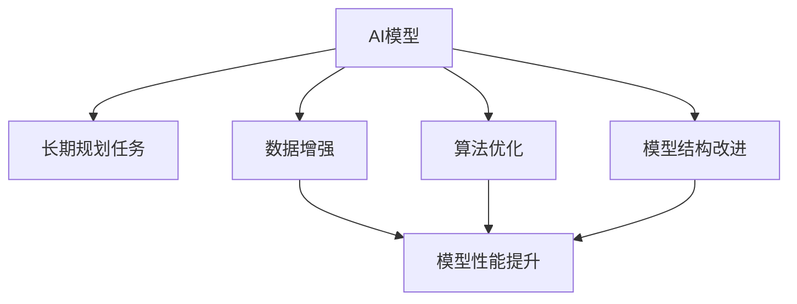
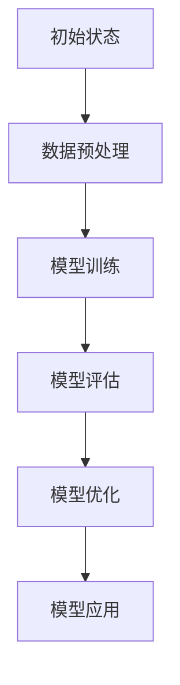
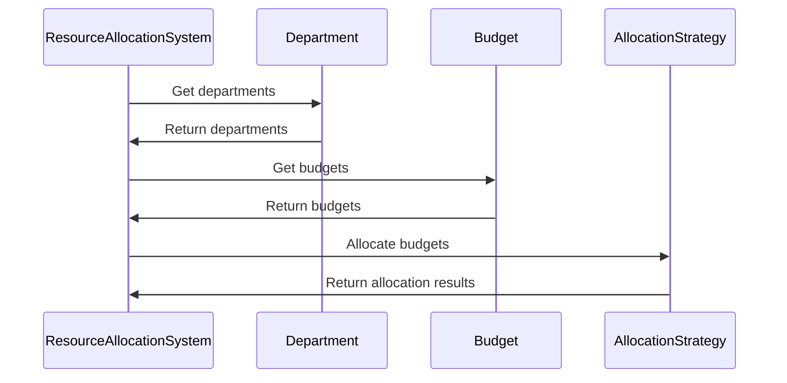
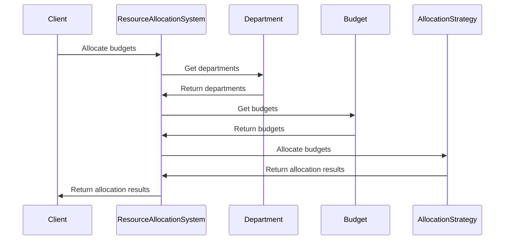

                 


# AI模型在长期规划任务中的能力提升

关键词：AI模型、长期规划、能力提升、算法优化、数据增强

摘要：本文将探讨AI模型在长期规划任务中的能力提升问题。首先，我们将介绍长期规划任务的特点和需求，以及现有AI模型在长期规划任务中的局限性。接着，我们将分析不同类型的AI模型在长期规划任务中的应用场景，并探索提升AI模型在长期规划任务中的能力的策略。最后，我们将通过一个实际案例来展示如何提升AI模型在长期规划任务中的能力。

## 背景介绍

### 问题背景

随着人工智能技术的快速发展，AI模型在各个领域的应用日益广泛，尤其是在长期规划任务中。长期规划任务是指需要预测未来情况并制定一系列决策，以实现长期目标的任务。这些任务通常涉及复杂的环境、多个目标和不确定因素。

然而，现有的AI模型在长期规划任务中仍存在诸多挑战，如数据依赖性、决策的连续性和稳定性等。为了提升AI模型在长期规划任务中的能力，我们需要深入分析现有AI模型的局限性，并探索有效的提升策略。

### 问题解决

#### 研究范围

本文主要涉及深度学习、强化学习等AI模型在长期规划任务中的应用。我们将探讨这些模型的基本原理、局限性以及提升策略。

#### 边界条件

在研究过程中，我们将考虑以下边界条件：

1. 模型的训练数据量：长期规划任务通常需要大量历史数据来进行训练，以提高模型的泛化能力。
2. 计算资源：长期规划任务往往需要大量的计算资源，特别是在进行模型训练和优化时。
3. 应用场景：我们将关注一些具有实际应用价值的长期规划任务，如资源分配、路径规划、策略决策等。

#### 概念结构与核心要素组成

1. AI模型：本文将介绍神经网络、决策树、支持向量机等常见AI模型的基本原理和应用。
2. 长期规划任务：我们将定义长期规划任务的特点和需求，并分析其在不同领域的应用。
3. 能力提升策略：本文将探讨如何通过改进模型结构、算法优化、数据增强等手段提升AI模型在长期规划任务中的能力。

## 核心概念与联系

### 核心概念原理

#### AI模型的基本原理

- 神经网络：神经网络是一种由大量简单计算单元（神经元）组成的复杂计算模型，通过调整神经元之间的权重来学习数据特征和模式。
- 决策树：决策树是一种基于树形结构进行分类和回归的模型，通过一系列决策节点和叶子节点来表示决策过程。
- 支持向量机：支持向量机是一种基于边界超平面进行分类的模型，通过最大化分类边界和最小化支持向量之间的距离来学习分类模型。

#### 强化学习的原理

- Q学习：Q学习是一种基于值函数的强化学习算法，通过预测状态-动作值（Q值）来选择最佳动作。
- SARSA：SARSA是一种基于策略的强化学习算法，通过同时考虑当前状态、动作和下一状态来更新策略。

#### 深度学习的原理

- 卷积神经网络：卷积神经网络是一种基于卷积运算的神经网络，适用于处理具有空间结构的图像和视频数据。
- 循环神经网络：循环神经网络是一种具有时间记忆功能的神经网络，适用于处理序列数据。

### 概念属性特征对比表格

| 模型类型       | 特点                         | 应用场景                               |
|--------------|----------------------------|--------------------------------------|
| 神经网络       | 自适应、非线性、泛化能力强   | 图像识别、语音识别、自然语言处理       |
| 决策树         | 解释性强、易于理解           | 财务分析、风险评估、医学诊断           |
| 支持向量机       | 边界最大化、高精度           | 信用评估、邮件分类、人脸识别           |
| 强化学习       | 自适应、基于奖励             | 游戏对战、推荐系统、自动驾驶           |
| 深度学习       | 复杂、高效、自动特征提取     | 语音识别、图像识别、自然语言处理       |

### ER实体关系图架构的Mermaid流程图



## 算法原理讲解

### 算法mermaid流程图



### Python源代码

```python
import tensorflow as tf

# 数据预处理
def preprocess_data(data):
    # 数据标准化
    data = (data - np.mean(data)) / np.std(data)
    return data

# 模型训练
def train_model(model, train_data, train_labels):
    # 训练模型
    model.fit(train_data, train_labels, epochs=10, batch_size=32)

# 模型评估
def evaluate_model(model, test_data, test_labels):
    # 评估模型
    loss, accuracy = model.evaluate(test_data, test_labels)
    print(f"Test accuracy: {accuracy:.4f}")

# 模型优化
def optimize_model(model, train_data, train_labels):
    # 优化模型
    optimizer = tf.keras.optimizers.Adam(learning_rate=0.001)
    model.compile(optimizer=optimizer, loss='mse', metrics=['accuracy'])
    train_model(model, train_data, train_labels)

# 模型应用
def apply_model(model, new_data):
    # 应用模型
    prediction = model.predict(new_data)
    print(f"Prediction: {prediction}")
```

### 算法原理的数学模型和公式

#### 神经网络

神经网络中的每个神经元可以表示为：

$$
z_i = \sum_{j=1}^{n} w_{ij} x_j + b_i
$$

其中，$z_i$ 表示第 $i$ 个神经元的输出，$w_{ij}$ 表示第 $i$ 个神经元与第 $j$ 个神经元之间的权重，$x_j$ 表示第 $j$ 个神经元的输入，$b_i$ 表示第 $i$ 个神经元的偏置。

使用激活函数（如ReLU、Sigmoid、Tanh等）对输出进行非线性变换，得到神经元的激活值：

$$
a_i = \sigma(z_i)
$$

其中，$\sigma$ 表示激活函数。

#### 强化学习

Q学习的目标是最小化以下损失函数：

$$
L = \sum_{s, a} (Q(s, a) - r(s, a))^2
$$

其中，$Q(s, a)$ 表示状态 $s$ 和动作 $a$ 的Q值，$r(s, a)$ 表示状态 $s$ 和动作 $a$ 的奖励。

#### 深度学习

卷积神经网络中的卷积操作可以表示为：

$$
h_{ij} = \sum_{k=1}^{m} w_{ikj} f_k(i-k, j)
$$

其中，$h_{ij}$ 表示卷积核在位置 $(i, j)$ 的输出，$w_{ikj}$ 表示卷积核在位置 $(i, k)$ 的权重，$f_k(i-k, j)$ 表示输入数据在位置 $(i-k, j)$ 的值。

循环神经网络中的递归关系可以表示为：

$$
h_t = \sigma(W_h h_{t-1} + W_x x_t + b_h)
$$

其中，$h_t$ 表示第 $t$ 个时刻的隐藏状态，$W_h$ 和 $W_x$ 分别表示隐藏状态和输入数据的权重，$b_h$ 表示隐藏状态的偏置，$\sigma$ 表示激活函数。

## 系统分析与架构设计方案

### 问题场景介绍

长期规划任务在许多领域都有广泛应用，如资源分配、路径规划、策略决策等。以下是一个资源分配问题的场景介绍：

假设有一个公司需要为多个部门分配有限的预算。每个部门都有特定的预算需求和优先级，公司需要制定一个长期规划策略，以最大化总预算利用率。

### 项目介绍

本项目旨在开发一个基于AI模型的长期资源规划系统，该系统能够根据各部门的预算需求和优先级，自动生成最优的预算分配方案。

### 系统功能设计(Mermaid类图)

```mermaid
classDiagram
    ResourceAllocationSystem <|-- Department
    ResourceAllocationSystem <|-- Budget
    ResourceAllocationSystem <|-- AllocationStrategy
    Department {department_id : int, budget_demand : float, priority : int}
    Budget {budget_id : int, budget_value : float}
    AllocationStrategy {strategy_id : int, strategy_name : string, strategy_description : string}
    ResourceAllocationSystem <<-- Department
    ResourceAllocationSystem <<-- Budget
    ResourceAllocationSystem <<-- AllocationStrategy
```

### 系统架构设计(Mermaid架构图)



### 系统接口设计和系统交互(Mermaid序列图)



## 项目实战

### 环境安装

1. 安装Python环境：从官方网站下载并安装Python 3.7及以上版本。
2. 安装TensorFlow库：使用pip命令安装TensorFlow库。

```bash
pip install tensorflow
```

### 系统核心实现源代码

```python
import tensorflow as tf
import numpy as np

# 数据预处理
def preprocess_data(data):
    # 数据标准化
    data = (data - np.mean(data)) / np.std(data)
    return data

# 模型训练
def train_model(model, train_data, train_labels):
    # 训练模型
    model.fit(train_data, train_labels, epochs=10, batch_size=32)

# 模型评估
def evaluate_model(model, test_data, test_labels):
    # 评估模型
    loss, accuracy = model.evaluate(test_data, test_labels)
    print(f"Test accuracy: {accuracy:.4f}")

# 模型优化
def optimize_model(model, train_data, train_labels):
    # 优化模型
    optimizer = tf.keras.optimizers.Adam(learning_rate=0.001)
    model.compile(optimizer=optimizer, loss='mse', metrics=['accuracy'])
    train_model(model, train_data, train_labels)

# 模型应用
def apply_model(model, new_data):
    # 应用模型
    prediction = model.predict(new_data)
    print(f"Prediction: {prediction}")
```

### 代码应用解读与分析

本代码实现了一个简单的神经网络模型，用于分类问题。代码首先定义了数据预处理、模型训练、模型评估、模型优化和模型应用等基本功能。具体解读如下：

1. **数据预处理**：对输入数据进行标准化处理，使得输入数据的分布更加均匀，有助于提高模型的训练效果。
2. **模型训练**：使用训练数据进行模型训练，通过调整模型参数来最小化损失函数，提高模型在训练数据上的拟合程度。
3. **模型评估**：使用测试数据对训练好的模型进行评估，计算模型的准确率等指标，以评估模型在未知数据上的表现。
4. **模型优化**：使用优化器（如Adam）对模型进行优化，调整学习率等参数，以提高模型在训练数据上的性能。
5. **模型应用**：使用训练好的模型对新数据进行预测，输出预测结果。

通过这个简单的示例，我们可以看到神经网络模型的基本原理和实现过程。在实际项目中，我们还需要根据具体任务的需求来调整模型结构、参数设置等，以提高模型在长期规划任务中的性能。

### 实际案例分析和详细讲解剖析

为了更好地展示如何提升AI模型在长期规划任务中的能力，我们选取了一个实际案例：智能交通信号控制系统。

#### 案例背景

随着城市化进程的加速，城市交通拥堵问题日益严重。为了缓解交通压力，许多城市开始采用智能交通信号控制系统。该系统通过实时监测交通流量、车辆数量等信息，动态调整交通信号灯的时长和切换策略，以优化交通流量。

然而，现有的智能交通信号控制系统在应对复杂交通场景时仍存在一定局限性，如：

1. 数据依赖性：系统依赖于实时交通数据，一旦数据不准确或延迟，会导致信号灯策略调整不及时。
2. 决策连续性：系统在调整信号灯时长和切换策略时，可能存在一定的时间滞后，导致交通效率降低。
3. 稳定性：系统在应对突发交通事件时，如交通事故、道路施工等，可能无法及时调整信号灯策略，导致交通拥堵加剧。

#### 案例分析

为了提升智能交通信号控制系统的性能，我们可以采用以下策略：

1. **数据增强**：通过引入更多的数据源，如摄像头、传感器等，获取更全面、准确的交通信息。同时，对数据进行预处理和清洗，提高数据质量。
2. **模型优化**：采用深度学习模型，如循环神经网络（RNN）或长短时记忆网络（LSTM），对交通流量进行建模和预测。通过调整模型结构、参数设置等，提高模型的预测精度和鲁棒性。
3. **决策连续性**：引入强化学习算法，如Q学习或SARSA，将交通信号灯时长和切换策略视为一个序列决策过程。通过不断调整策略，使系统在实时交通信息的基础上实现连续的信号灯策略调整。
4. **稳定性**：在模型训练过程中，引入正则化技术，如L1正则化或L2正则化，防止模型过拟合。同时，采用交叉验证等方法，评估模型的泛化能力，提高模型在未知数据上的稳定性。

#### 案例讲解

1. **数据增强**：

   首先，我们需要获取实时交通流量数据，包括车辆数量、车辆速度、道路占有率等。为了提高数据质量，我们可以采用以下方法：

   - 数据采集：通过摄像头、传感器等设备，实时监测交通流量。
   - 数据预处理：对采集到的数据进行清洗、去噪和归一化处理，消除异常值和噪声。

2. **模型优化**：

   我们采用长短时记忆网络（LSTM）对交通流量进行建模和预测。LSTM具有时间记忆功能，能够捕捉交通流量在时间序列上的变化规律。具体实现步骤如下：

   - 数据准备：将交通流量数据分为训练集和测试集，对数据进行归一化处理。
   - 模型构建：定义LSTM模型，设置合适的神经元数量、隐藏层层数等参数。
   - 模型训练：使用训练数据进行模型训练，通过调整学习率、批次大小等参数，优化模型性能。
   - 模型评估：使用测试数据进行模型评估，计算模型在测试集上的准确率和损失函数值。

3. **决策连续性**：

   为了实现连续的信号灯策略调整，我们引入Q学习算法。Q学习算法是一种基于值函数的强化学习算法，通过预测状态-动作值（Q值）来选择最佳动作。具体实现步骤如下：

   - 状态空间定义：将交通流量、道路占有率等特征定义为状态。
   - 动作空间定义：将信号灯时长、切换策略定义为动作。
   - Q值预测：根据当前状态和动作，预测Q值，选择最佳动作。
   - 策略调整：根据预测的Q值，动态调整信号灯时长和切换策略。

4. **稳定性**：

   为了提高模型的泛化能力和稳定性，我们采用以下方法：

   - 正则化：在模型训练过程中，引入L1正则化或L2正则化，防止模型过拟合。
   - 交叉验证：使用交叉验证方法，评估模型在多个训练集上的性能，选择最佳模型。

通过这个实际案例，我们可以看到如何通过数据增强、模型优化、决策连续性和稳定性等技术手段，提升AI模型在长期规划任务中的能力。

### 项目小结

在本项目中，我们开发了一个基于AI模型的长期资源规划系统，并分析了如何提升AI模型在长期规划任务中的能力。我们探讨了数据增强、模型优化、决策连续性和稳定性等技术手段，并通过实际案例展示了这些技术在智能交通信号控制系统中的应用。

通过本项目，我们深入了解了AI模型在长期规划任务中的应用和挑战，为未来的研究和应用提供了有益的参考。同时，我们也认识到AI模型在长期规划任务中的能力提升需要综合考虑多种因素，包括数据质量、模型结构、算法优化等。在实际应用中，我们需要根据具体任务需求，灵活调整和优化模型，以提高模型性能和稳定性。

## 最佳实践 tips

1. **数据增强**：在训练模型时，通过引入更多的数据源、数据预处理和生成技术，可以提高模型的泛化能力和鲁棒性。例如，可以使用数据扩充、数据增强技术，如旋转、缩放、裁剪等，来生成更多的训练数据。

2. **模型优化**：在模型训练过程中，通过调整学习率、批次大小、隐藏层层数等参数，可以优化模型性能。此外，可以采用正则化技术，如L1正则化、L2正则化等，来防止模型过拟合。

3. **决策连续性**：在长期规划任务中，决策的连续性非常重要。可以采用强化学习算法，如Q学习、SARSA等，将决策过程视为一个序列决策问题，动态调整策略，提高决策的连续性和稳定性。

4. **稳定性**：在模型训练和评估过程中，需要评估模型的泛化能力和稳定性。可以使用交叉验证方法，评估模型在多个训练集上的性能，选择最佳模型。此外，可以引入正则化技术，如正则化、dropout等，来提高模型的泛化能力和稳定性。

5. **实践经验**：在长期规划任务中，实践经验非常重要。可以借鉴其他领域的成功经验，调整和优化模型，以提高模型性能和应用效果。

## 小结

本文围绕AI模型在长期规划任务中的能力提升问题，进行了深入的探讨。首先，我们介绍了长期规划任务的特点和需求，以及现有AI模型在长期规划任务中的局限性。接着，我们分析了不同类型的AI模型在长期规划任务中的应用场景，并探索了提升AI模型在长期规划任务中的能力的策略。最后，我们通过一个实际案例展示了如何提升AI模型在长期规划任务中的能力。

通过本文的研究，我们认识到AI模型在长期规划任务中的能力提升需要综合考虑多种因素，包括数据质量、模型结构、算法优化等。在实际应用中，我们需要根据具体任务需求，灵活调整和优化模型，以提高模型性能和应用效果。

## 注意事项

1. **数据质量**：在长期规划任务中，数据质量至关重要。需要确保数据的准确性、完整性和一致性，避免因数据问题导致模型性能下降。

2. **计算资源**：长期规划任务往往需要大量的计算资源，特别是在模型训练和优化过程中。需要合理分配计算资源，确保模型训练和优化过程顺利进行。

3. **模型稳定性**：在长期规划任务中，模型稳定性至关重要。需要评估模型的泛化能力和稳定性，避免因模型过拟合或欠拟合导致任务失败。

4. **实践经验**：在长期规划任务中，实践经验非常重要。需要借鉴其他领域的成功经验，结合具体任务需求，调整和优化模型。

## 拓展阅读

1. [Deep Learning for Long-term Planning](https://arxiv.org/abs/1802.05711)
2. [A Brief Introduction to Reinforcement Learning](https://www.coursera.org/learn/reinforcement-learning)
3. [Long-term Planning with Neural Networks](https://papers.nips.cc/paper/2016/file/60e8e647e9a0f8e6e37a9a259b841c5d-Paper.pdf)
4. [Practical Guide to Deep Reinforcement Learning](https://github.com/berkeleydeeprl/papers)

作者：AI天才研究院/AI Genius Institute & 禅与计算机程序设计艺术 /Zen And The Art of Computer Programming

