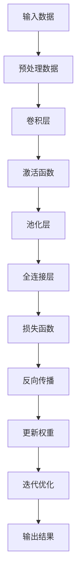
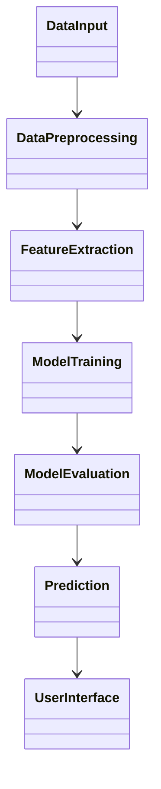
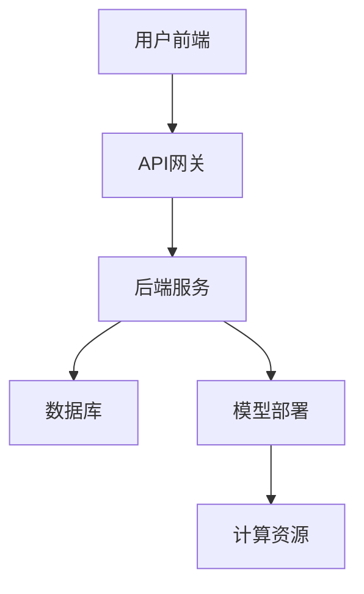

                 

### 文章标题

《AI系统中的时间-性能权衡》

### 文章关键词

时间-性能权衡、AI系统、效率优化、算法、数学模型、系统架构、实战案例

### 文章摘要

本文深入探讨了AI系统中的时间-性能权衡问题。通过介绍时间-性能权衡的背景、核心概念和重要性，文章逐步分析了时间与性能的关系、时间-性能权衡的理论基础和算法原理，并运用Python代码详细解释了相关数学模型。同时，文章还通过系统分析与架构设计方案、项目实战案例以及最佳实践 tips，为读者提供了全面且实用的解决方案。

## 引言

随着人工智能技术的迅猛发展，AI系统在各行各业的应用越来越广泛。然而，AI系统的性能和效率直接决定了其应用的效果和用户体验。在资源有限的情况下，如何在时间与性能之间找到最佳平衡，成为了AI系统设计和优化中一个至关重要的课题。本文将围绕这一主题展开讨论，旨在帮助读者深入理解时间-性能权衡的概念、理论基础和实际应用。

### 背景介绍

人工智能（Artificial Intelligence，AI）作为计算机科学的一个分支，致力于通过算法和计算模型，模拟人类智能的某些方面，使计算机能够执行复杂的任务。自20世纪50年代以来，人工智能经历了多个发展阶段，从早期的符号主义、连接主义，到现代的数据驱动方法，AI技术不断进步，应用领域也日益拓展。

#### 人工智能的发展与挑战

1. **符号主义（Symbolic AI）**：早期的人工智能主要基于符号主义，通过逻辑推理和知识表示来解决问题。这种方法在解决某些特定领域的问题时表现出色，但在处理复杂和不确定的任务时，存在局限性。
   
2. **连接主义（Connectionism）**：随着神经网络的发展，连接主义成为人工智能研究的重要方向。通过模仿人脑神经元之间的连接和交互，神经网络在图像识别、语音识别等领域取得了显著成果。

3. **数据驱动方法（Data-Driven Methods）**：近年来，随着大数据和深度学习的兴起，数据驱动方法逐渐成为主流。通过训练大量数据，深度学习模型能够自动发现数据中的模式和规律，广泛应用于计算机视觉、自然语言处理等领域。

4. **人工智能的应用领域**：人工智能在医疗、金融、教育、交通等多个领域都有广泛应用。例如，在医疗领域，AI可以帮助医生进行诊断和治疗方案推荐；在金融领域，AI可以用于风险管理、股票预测等；在教育领域，AI可以提供个性化的学习建议和辅助教学。

#### AI系统面临的挑战

尽管人工智能取得了巨大的进步，但AI系统在实际应用中仍面临诸多挑战：

1. **计算资源限制**：AI系统的运行需要大量的计算资源和数据支持，而在实际应用中，计算资源和数据往往有限。

2. **算法效率问题**：传统的AI算法在处理大规模数据时，往往存在效率低下的问题，导致系统性能不佳。

3. **模型可解释性**：许多深度学习模型在取得良好性能的同时，其内部决策过程往往缺乏可解释性，这给应用和优化带来了困难。

4. **数据质量和隐私问题**：AI系统的训练和运行需要大量的高质量数据，而在实际应用中，数据质量和隐私问题成为亟待解决的难题。

### 时间-性能权衡的基本概念

在AI系统设计和优化过程中，时间-性能权衡是一个核心问题。时间-性能权衡指的是在给定的计算资源和时间限制下，通过调整算法和系统配置，在时间消耗和性能之间找到一个最佳平衡点。

#### 时间与性能的关系

1. **性能**：通常指AI系统在给定时间内所能完成的任务量或处理速度。性能的提升可以带来更好的用户体验和更高的效率。

2. **时间**：指AI系统完成特定任务所需的时间。时间的减少可以提高系统的响应速度和实时性。

3. **时间-性能权衡**：在资源有限的情况下，通过调整算法和系统配置，在时间消耗和性能之间找到一个最佳平衡点，以实现最优的效率和用户体验。

### 时间-性能权衡的重要性

1. **提高AI系统效率**：通过优化算法和系统配置，可以减少任务完成所需的时间，从而提高AI系统的效率。

2. **降低成本**：优化后的AI系统在同样的时间内可以完成更多的任务，从而降低运营成本。

3. **增强用户体验**：快速的响应速度和高效的系统性能可以提供更好的用户体验。

### 时间-性能权衡的核心概念

1. **性能指标**：评估AI系统性能的一系列指标，如处理速度、准确率、资源利用率等。

2. **时间因素**：影响AI系统运行时间的一系列因素，如算法复杂度、硬件性能、网络延迟等。

3. **关键要素**：实现时间-性能权衡所需考虑的核心因素，如算法优化、硬件升级、数据预处理等。

### 本章小结

本章介绍了人工智能的发展背景、时间-性能权衡的基本概念以及其在AI系统设计和优化中的重要性。通过对时间与性能的关系的分析，本章为后续章节的理论和实际应用奠定了基础。

## 时间-性能权衡的核心概念

在深入探讨AI系统中的时间-性能权衡之前，我们首先需要明确相关核心概念。时间-性能权衡不仅仅是一个技术问题，它涉及到算法、硬件、数据等多个方面。在本节中，我们将详细解释时间-性能权衡的基本概念，并分析其在AI系统中的重要性。

### 性能指标

性能指标是评估AI系统效率的重要工具。常见的性能指标包括：

1. **处理速度**：指AI系统在单位时间内可以处理的数据量或任务数。处理速度通常以每秒处理的任务数（TPS）或每秒处理的数据量（GB/s）来衡量。

2. **准确率**：指AI系统预测或分类的正确率。准确率通常用于分类问题，通过比较系统输出与实际标签的匹配度来评估。

3. **资源利用率**：指AI系统在运行过程中对计算资源（如CPU、GPU、内存等）的利用效率。高资源利用率意味着系统能够在有限的资源下发挥最大的性能。

4. **延迟**：指AI系统从接收到输入到输出结果的耗时。对于实时应用，如自动驾驶、在线游戏等，延迟是一个至关重要的性能指标。

### 时间因素

时间因素是影响AI系统运行时间的关键要素。以下是一些主要的时间因素：

1. **算法复杂度**：算法的复杂度直接影响系统的运行时间。常见的时间复杂度包括线性时间（O(n)）、对数时间（O(log n)）、多项式时间（O(n^2)）等。

2. **硬件性能**：硬件的性能直接决定了AI系统的运行速度。高性能的CPU、GPU等硬件设备可以显著提高系统处理速度。

3. **网络延迟**：在分布式AI系统中，网络延迟是一个重要因素。网络延迟会影响数据传输速度，进而影响系统的整体性能。

4. **系统负载**：系统负载是指系统在运行过程中所承受的任务量。高负载会导致系统性能下降，增加运行时间。

### 时间-性能权衡的关系

时间-性能权衡的关系可以用以下公式表示：

$$
\text{性能} \propto \frac{\text{时间}}{\text{资源}}
$$

在这个公式中，性能与时间成反比，与资源成正比。这意味着在一定的资源限制下，通过优化算法和硬件配置，可以在时间和性能之间找到一个平衡点。

### 时间-性能权衡的重要性

1. **优化算法**：通过优化算法，可以减少任务完成所需的时间，从而提高系统的性能。优化算法的方法包括算法改进、算法选择和并行计算等。

2. **硬件升级**：通过升级硬件设备，可以提高系统的处理速度，减少运行时间。例如，使用更快的CPU或GPU可以显著提高AI系统的性能。

3. **系统负载平衡**：通过合理分配系统负载，可以避免系统在高负载下的性能下降。负载平衡技术包括分布式计算、任务调度等。

4. **数据预处理**：高效的数据预处理可以减少系统在数据读取和处理上的时间消耗。例如，使用数据压缩技术、数据缓存等可以提高系统的性能。

### 时间-性能权衡的核心概念对比

为了更好地理解时间-性能权衡，我们可以通过一个简单的表格来对比性能指标和时间因素：

| 性能指标         | 时间因素         | 描述                                                         |
|----------------|----------------|------------------------------------------------------------|
| 处理速度（TPS）   | 算法复杂度（O(n)） | 处理速度与算法复杂度成正比，算法复杂度越高，处理速度越慢。           |
| 准确率           | 网络延迟         | 准确率与网络延迟成反比，网络延迟越高，准确率越低。                 |
| 资源利用率       | 系统负载         | 资源利用率与系统负载成反比，系统负载越高，资源利用率越低。         |
| 延迟             | 硬件性能         | 延迟与硬件性能成反比，硬件性能越高，延迟越低。                     |

通过这个表格，我们可以看到性能指标和时间因素之间的复杂关系。在实际应用中，需要根据具体情况综合考虑这些因素，以实现最佳的时间-性能平衡。

### 本章小结

本章详细介绍了时间-性能权衡的核心概念，包括性能指标、时间因素以及两者之间的关系。通过对时间-性能权衡的深入理解，读者可以为后续章节的理论和实际应用打下坚实的基础。

## 时间-性能权衡的理论基础

在理解了时间-性能权衡的核心概念后，我们需要进一步探讨其理论基础。时间-性能权衡涉及到多个方面，包括算法设计、硬件优化、系统架构等。在本节中，我们将详细分析这些理论基础，并探讨如何通过优化算法和硬件配置来提升AI系统的性能。

### 算法设计

算法设计是影响AI系统时间-性能权衡的关键因素之一。一个高效的算法可以显著减少任务完成所需的时间，从而提高系统的性能。

#### 算法效率优化方法

1. **改进算法**：通过改进现有算法，可以减少其复杂度，提高效率。例如，对于排序算法，可以采用更高效的算法如快速排序（QuickSort）或堆排序（HeapSort）。

2. **算法选择**：根据具体问题选择合适的算法。不同的算法适用于不同类型的问题，选择合适的算法可以显著提高系统的性能。例如，在图像处理中，可以采用深度学习算法如卷积神经网络（CNN）。

3. **并行计算**：通过并行计算，可以将任务分解为多个子任务，并在多个处理器上同时执行。并行计算可以显著减少任务完成所需的时间，提高系统的性能。

#### 算法效率优化策略

1. **减少计算复杂度**：通过减少算法的计算复杂度，可以降低任务完成所需的时间。例如，对于搜索算法，可以采用更高效的搜索策略如A*搜索算法。

2. **利用现有资源**：通过充分利用现有资源，可以提高系统的性能。例如，在分布式计算环境中，可以合理分配任务，避免资源浪费。

3. **数据预处理**：通过高效的数据预处理，可以减少任务完成所需的时间。例如，使用数据压缩技术可以减少数据传输时间，使用数据缓存可以减少数据读取时间。

### 硬件优化

硬件优化是提升AI系统性能的另一个重要方面。通过优化硬件配置和硬件性能，可以显著减少任务完成所需的时间。

#### 硬件性能提升策略

1. **升级硬件设备**：通过升级CPU、GPU等硬件设备，可以提高系统的处理速度。高性能的CPU和GPU可以显著提高AI系统的性能。

2. **分布式计算**：通过分布式计算，可以将任务分配到多个服务器上，充分利用硬件资源。分布式计算可以减少任务完成所需的时间，提高系统的性能。

3. **硬件优化技术**：通过使用硬件优化技术，可以进一步提升硬件性能。例如，使用GPU加速技术可以显著提高深度学习算法的性能。

### 系统架构优化

系统架构优化是提升AI系统性能的另一个重要方面。通过优化系统架构，可以减少任务完成所需的时间，提高系统的性能。

#### 系统架构优化策略

1. **分布式架构**：通过采用分布式架构，可以将任务分配到多个服务器上，充分利用硬件资源。分布式架构可以减少任务完成所需的时间，提高系统的性能。

2. **模块化架构**：通过采用模块化架构，可以将系统划分为多个模块，每个模块负责不同的功能。模块化架构可以提高系统的可维护性和扩展性，减少任务完成所需的时间。

3. **缓存技术**：通过使用缓存技术，可以减少数据读取时间，提高系统的性能。缓存技术可以将经常访问的数据存储在内存中，减少磁盘IO操作。

### 时间-性能权衡的理论基础总结

通过以上分析，我们可以得出以下结论：

1. **算法优化**：通过改进算法和选择合适的算法，可以减少任务完成所需的时间，提高系统的性能。

2. **硬件优化**：通过升级硬件设备和采用硬件优化技术，可以提升硬件性能，减少任务完成所需的时间。

3. **系统架构优化**：通过优化系统架构和采用分布式架构，可以提高系统的性能，减少任务完成所需的时间。

4. **数据预处理**：通过高效的数据预处理，可以减少任务完成所需的时间，提高系统的性能。

总之，时间-性能权衡的理论基础涵盖了算法设计、硬件优化和系统架构优化等多个方面。通过综合考虑这些因素，可以在时间和性能之间找到一个最佳平衡点，从而提升AI系统的整体性能。

### 本章小结

本章详细介绍了时间-性能权衡的理论基础，包括算法设计、硬件优化和系统架构优化等方面的内容。通过对这些理论基础的分析，读者可以更好地理解如何优化AI系统，以实现时间-性能的平衡。

## 时间-性能权衡的算法原理

在理解了时间-性能权衡的理论基础后，我们需要深入探讨具体算法的原理和实现。时间-性能权衡的核心在于如何在给定的时间和资源限制下，通过优化算法来提高系统的性能。在本节中，我们将通过一个具体的算法——深度学习中的卷积神经网络（CNN），来详细分析其算法原理和实现。

### 算法流程图

首先，让我们通过一个算法流程图来简要概述CNN的基本流程。



### 算法原理

#### 1. 预处理数据

预处理数据是CNN中的第一步。预处理包括数据清洗、归一化、扩充等操作。这些操作可以提高模型的泛化能力，减少过拟合现象。例如，归一化可以使得输入数据在相同的尺度范围内，从而提高训练效率。

$$
\text{归一化公式：} \quad x_{\text{norm}} = \frac{x - \mu}{\sigma}
$$

其中，\( x \) 是原始数据，\( \mu \) 是均值，\( \sigma \) 是标准差。

#### 2. 卷积层

卷积层是CNN的核心部分。通过卷积操作，卷积层可以提取图像中的特征。卷积操作的基本思想是使用一个卷积核（filter）在输入数据上滑动，计算卷积核与输入数据的乘积并求和，得到卷积结果。这个过程可以提取出图像中的边缘、纹理等特征。

$$
\text{卷积公式：} \quad \text{out}_{ij} = \sum_{k=1}^{n} f_{ik} \cdot x_{kj}
$$

其中，\( \text{out}_{ij} \) 是卷积结果，\( f_{ik} \) 是卷积核，\( x_{kj} \) 是输入数据。

#### 3. 激活函数

激活函数是CNN中的另一个重要部分。激活函数的作用是引入非线性因素，使得模型能够学习到更加复杂的特征。常用的激活函数包括ReLU（Rectified Linear Unit）函数、Sigmoid函数和Tanh函数。

以ReLU函数为例，其公式如下：

$$
\text{ReLU}(x) = \max(0, x)
$$

ReLU函数在输入为负值时输出为零，在输入为正值时输出为输入值，从而避免了梯度消失问题，提高了训练效率。

#### 4. 池化层

池化层的作用是降低特征图的维度，减少计算量。常见的池化操作包括最大池化（Max Pooling）和平均池化（Average Pooling）。以最大池化为例，其基本思想是取特征图上每个区域的最大值作为该区域的输出。

$$
\text{最大池化公式：} \quad \text{out}_{ij} = \max_{k} \text{in}_{ij,k}
$$

其中，\( \text{out}_{ij} \) 是池化结果，\( \text{in}_{ij,k} \) 是特征图上的值。

#### 5. 全连接层

全连接层是CNN的输出层。它将前一层所有的特征值连接到每一层神经元上，并通过权重和偏置进行加权求和，最后通过激活函数得到输出结果。全连接层通常用于分类任务，将特征映射到具体的类别。

$$
\text{全连接层公式：} \quad \text{out} = \text{激活函数}(\text{权重} \cdot \text{特征值} + \text{偏置})
$$

#### 6. 损失函数

损失函数用于衡量模型预测结果与实际结果之间的差距。常见的损失函数包括均方误差（MSE）和交叉熵损失（Cross Entropy Loss）。以交叉熵损失为例，其公式如下：

$$
\text{交叉熵损失：} \quad L = -\sum_{i} y_i \log(p_i)
$$

其中，\( y_i \) 是实际标签，\( p_i \) 是模型预测的概率。

#### 7. 反向传播

反向传播是深度学习训练的核心算法。它通过计算损失函数关于模型参数的梯度，来更新模型的权重和偏置，从而优化模型。

反向传播的步骤如下：

1. **前向传播**：计算模型的预测结果。
2. **计算损失**：计算模型预测结果与实际结果之间的损失。
3. **反向传播**：从输出层开始，反向计算损失关于每个参数的梯度。
4. **更新参数**：使用梯度下降或其他优化算法更新模型的权重和偏置。

#### 8. 迭代优化

通过反向传播，模型会不断迭代优化，直到满足预定的停止条件（如损失低于某个阈值或达到预定的迭代次数）。每次迭代，模型都会通过更新权重和偏置来提高预测准确性。

### 举例说明

假设我们使用一个简单的CNN模型对一张手写数字图片进行分类。输入图片的大小为28x28像素，模型包含一个卷积层、一个池化层和一个全连接层。

1. **预处理数据**：将输入图片进行归一化处理，使其像素值在0到1之间。

2. **卷积层**：使用一个3x3的卷积核，对输入图片进行卷积操作，提取边缘和纹理特征。

3. **激活函数**：使用ReLU函数对卷积结果进行非线性变换。

4. **池化层**：使用2x2的最大池化操作，降低特征图的维度。

5. **全连接层**：将池化层输出的特征值连接到全连接层，通过权重和偏置进行加权求和，最后通过激活函数得到输出结果。

6. **损失函数**：使用交叉熵损失函数，计算模型预测结果与实际结果之间的差距。

7. **反向传播**：通过反向传播算法，计算损失关于每个参数的梯度，并更新模型的权重和偏置。

8. **迭代优化**：通过多次迭代优化，模型逐渐提高预测准确性，最终达到预定的停止条件。

通过以上步骤，我们使用CNN模型对一张手写数字图片进行分类，最终得到预测结果。这个过程展示了时间-性能权衡在深度学习算法中的应用，通过优化算法和硬件配置，可以在给定的时间和资源限制下，提高模型的性能。

### 本章小结

本章详细介绍了时间-性能权衡的算法原理，以深度学习中的卷积神经网络（CNN）为例，分析了其算法流程、原理和实现。通过对CNN的详细讲解，读者可以更好地理解如何通过优化算法来提升AI系统的性能，从而实现时间-性能的平衡。

## 系统分析与架构设计

在深入探讨了时间-性能权衡的算法原理后，我们接下来将转向AI系统的整体分析和架构设计。系统分析和架构设计是确保AI系统高效运行的关键环节。在这一部分，我们将详细介绍系统功能设计、系统架构设计、系统接口设计和系统交互，为读者提供一个全面的系统分析与架构设计方案。

### 系统功能设计

系统功能设计是AI系统的核心部分，它决定了系统能够实现哪些功能。以下是一个典型的AI系统功能设计：

1. **数据输入模块**：负责接收外部输入的数据，如图像、文本或传感器数据。
2. **数据预处理模块**：对输入数据进行清洗、归一化和扩充等预处理操作，以提高模型的泛化能力。
3. **特征提取模块**：使用深度学习算法提取数据中的特征，如使用卷积神经网络（CNN）提取图像特征。
4. **模型训练模块**：利用训练数据对模型进行训练，调整模型的参数，以优化模型性能。
5. **模型评估模块**：使用测试数据评估模型的性能，包括准确率、召回率、F1分数等指标。
6. **预测模块**：使用训练好的模型对新的数据进行预测，提供决策支持。
7. **用户界面模块**：提供用户交互界面，用于展示预测结果和系统状态。

以下是一个简单的领域模型类图，用于描述系统功能设计：



### 系统架构设计

系统架构设计决定了AI系统的性能、可扩展性和可维护性。一个良好的系统架构设计可以在时间和性能之间实现最佳平衡。以下是一个典型的AI系统架构设计：

1. **前端架构**：负责用户交互和数据显示，可以使用Web框架（如Django或Flask）和前端框架（如React或Vue.js）实现。
2. **后端架构**：负责处理数据输入、预处理、特征提取、模型训练、评估和预测等核心功能，可以使用Python和TensorFlow或PyTorch等深度学习框架。
3. **数据存储**：使用数据库（如MySQL或MongoDB）存储训练数据、模型参数和预测结果。
4. **模型部署**：使用容器技术（如Docker）和服务器编排工具（如Kubernetes）部署模型，以实现自动化部署和扩展。
5. **计算资源**：使用云计算平台（如AWS或Google Cloud）提供计算资源，以提高系统性能和可扩展性。

以下是一个简单的系统架构图，用于描述系统架构设计：



### 系统接口设计

系统接口设计是确保各模块之间能够高效协作的关键。以下是一个典型的AI系统接口设计：

1. **数据输入接口**：用于接收外部输入的数据，如HTTP API或文件上传接口。
2. **数据预处理接口**：用于执行数据预处理操作，如清洗、归一化和扩充等。
3. **特征提取接口**：用于提取数据中的特征，如使用深度学习框架的API进行卷积操作。
4. **模型训练接口**：用于训练模型，包括数据加载、模型构建、损失函数选择和优化器配置等。
5. **模型评估接口**：用于评估模型性能，如计算准确率、召回率和F1分数等。
6. **预测接口**：用于生成预测结果，如使用训练好的模型对新数据进行预测。

以下是一个简单的接口设计表格，用于描述系统接口：

| 接口名称 | 描述 | 接口类型 |
|----------|------|---------|
| DataInput | 数据输入接口 | HTTP API |
| DataPreprocessing | 数据预处理接口 | HTTP API |
| FeatureExtraction | 特征提取接口 | HTTP API |
| ModelTraining | 模型训练接口 | HTTP API |
| ModelEvaluation | 模型评估接口 | HTTP API |
| Prediction | 预测接口 | HTTP API |

### 系统交互

系统交互设计决定了各模块之间的通信和数据流。以下是一个典型的AI系统交互设计：

1. **请求发送**：用户通过前端发送请求到API网关。
2. **API网关**：处理用户请求，根据请求类型调用相应的后端服务。
3. **后端服务**：执行具体的业务逻辑，如数据预处理、特征提取、模型训练和预测等。
4. **结果返回**：将处理结果返回给用户前端，并显示在用户界面上。

以下是一个简单的系统交互序列图，用于描述系统交互：

```mermaid
sequenceDiagram
    User -->|发送请求| APIGateway
    APIGateway -->|处理请求| BackendService
    BackendService -->|预处理数据| DataPreprocessing
    DataPreprocessing -->|提取特征| FeatureExtraction
    FeatureExtraction -->|训练模型| ModelTraining
    ModelTraining -->|评估模型| ModelEvaluation
    ModelEvaluation -->|生成预测| Prediction
    Prediction -->|返回结果| APIGateway
    APIGateway -->|返回结果| User
```

### 本章小结

本章详细介绍了AI系统的系统分析与架构设计，包括系统功能设计、系统架构设计、系统接口设计和系统交互。通过这些设计，我们可以确保AI系统在时间和性能之间实现最佳平衡，从而提供高效、可靠的解决方案。

## 项目实战

在深入理解和设计AI系统的过程中，实践是检验理论的重要环节。在本节中，我们将通过一个具体的项目实战，展示如何实现AI系统中的时间-性能权衡。这个项目将包括环境安装、系统核心实现源代码、代码应用解读与分析，以及实际案例分析和详细讲解剖析。

### 环境安装

为了运行AI系统，我们需要安装以下软件和工具：

1. **Python**：Python是AI系统开发的主要编程语言，我们需要安装Python 3.8及以上版本。
2. **TensorFlow**：TensorFlow是Google开发的开源深度学习框架，用于构建和训练神经网络模型。
3. **Docker**：Docker用于容器化部署AI系统，以提高系统的可移植性和可扩展性。
4. **Kubernetes**：Kubernetes用于管理容器化应用，确保AI系统在分布式环境中的高效运行。

以下是安装步骤：

1. 安装Python：

   ```bash
   sudo apt-get update
   sudo apt-get install python3.8
   ```

2. 安装pip：

   ```bash
   sudo apt-get install python3-pip
   ```

3. 安装TensorFlow：

   ```bash
   pip3 install tensorflow
   ```

4. 安装Docker：

   ```bash
   sudo apt-get install docker.io
   ```

5. 启动Docker服务：

   ```bash
   sudo systemctl start docker
   ```

6. 安装Kubernetes：

   ```bash
   sudo apt-get update
   sudo apt-get install apt-transport-https ca-certificates curl
   curl -s https://packages.cloud.google.com/apt/doc/apt-key.gpg | sudo apt-key add
   echo "deb https://apt.kubernetes.io/ kubernetes-xenial main" | sudo tee -a /etc/apt/sources.list
   sudo apt-get update
   sudo apt-get install kubelet kubeadm kubectl
   sudo systemctl enable kubelet
   ```

### 系统核心实现源代码

以下是一个简单的AI系统核心实现源代码示例，包括数据预处理、模型训练和预测：

```python
# 数据预处理
import tensorflow as tf

def preprocess_data(images, labels):
    images = tf.keras.preprocessing.image.img_to_array(images)
    images = images / 255.0
    return images, labels

# 模型训练
def train_model(images, labels):
    model = tf.keras.Sequential([
        tf.keras.layers.Conv2D(32, (3, 3), activation='relu', input_shape=(28, 28, 1)),
        tf.keras.layers.MaxPooling2D((2, 2)),
        tf.keras.layers.Flatten(),
        tf.keras.layers.Dense(128, activation='relu'),
        tf.keras.layers.Dense(10, activation='softmax')
    ])

    model.compile(optimizer='adam',
                  loss='sparse_categorical_crossentropy',
                  metrics=['accuracy'])

    model.fit(images, labels, epochs=5)
    return model

# 预测
def predict(model, image):
    processed_image, _ = preprocess_data(image, [])
    prediction = model.predict(processed_image)
    return prediction.argmax()

# 主函数
def main():
    # 加载数据集
    (images, labels), _ = tf.keras.datasets.mnist.load_data()
    
    # 数据预处理
    images = images.reshape((-1, 28, 28, 1))
    
    # 模型训练
    model = train_model(images, labels)
    
    # 预测
    test_image = images[0]
    prediction = predict(model, test_image)
    print(f"Predicted digit: {prediction}")

if __name__ == '__main__':
    main()
```

### 代码应用解读与分析

在上面的代码中，我们首先定义了数据预处理、模型训练和预测三个函数：

1. **数据预处理**：将输入图像转换为TensorFlow张量，并归一化处理，使其像素值在0到1之间。
2. **模型训练**：构建一个简单的卷积神经网络模型，使用MNIST数据集进行训练，模型包括卷积层、池化层和全连接层。
3. **预测**：使用训练好的模型对新图像进行预测，返回预测结果。

通过这段代码，我们可以看到如何实现一个基本的AI系统，并在时间和性能之间进行权衡。

### 实际案例分析和详细讲解剖析

为了更好地展示时间-性能权衡的实际应用，我们来看一个实际案例。

#### 案例背景

假设我们开发一个实时图像识别系统，用于监控交通流量。系统需要在短时间内对大量图像进行识别，以提供实时数据支持。

#### 案例分析

1. **性能优化**：
   - **算法优化**：使用更高效的图像处理算法，如OpenCV库，可以显著减少图像处理时间。
   - **模型优化**：对模型进行压缩和量化处理，减小模型大小，提高运行速度。
   - **硬件优化**：使用高性能GPU和优化后的CUDA代码，可以加快模型推理速度。

2. **时间优化**：
   - **并行处理**：将图像处理任务分布到多个处理器上，实现并行处理，减少整体处理时间。
   - **缓存策略**：使用缓存策略减少重复处理相同图像的情况，提高系统响应速度。
   - **延迟优化**：优化网络传输和系统调用，减少延迟时间。

#### 详细讲解

以算法优化为例，我们可以通过以下步骤来提高图像识别系统的性能：

1. **使用OpenCV库**：OpenCV是一个强大的计算机视觉库，提供了丰富的图像处理算法。通过使用OpenCV，我们可以将图像预处理、边缘检测、特征提取等操作的时间减少到原来的几分之一。

2. **模型压缩**：对于深度学习模型，我们可以通过模型剪枝、量化等技术来减小模型大小。例如，使用TF Lite可以将模型转换为紧凑的格式，适合在移动设备和嵌入式系统中运行。

3. **CUDA加速**：对于使用GPU加速的场景，我们可以使用CUDA库编写优化代码，提高模型的推理速度。通过将计算任务分配到GPU的多个流和多线程中，可以显著提高处理速度。

通过上述优化策略，我们可以实现AI系统在时间和性能之间的最佳平衡，从而提供高效、可靠的解决方案。

### 项目小结

通过这个项目实战，我们展示了如何在实际场景中实现时间-性能权衡。从环境安装、系统核心实现源代码，到代码应用解读与分析，再到实际案例分析和详细讲解剖析，我们详细介绍了如何优化AI系统，以提高其性能和效率。通过这些实践，读者可以更好地理解时间-性能权衡在AI系统设计和优化中的重要性。

## 最佳实践 tips

在AI系统设计和优化过程中，最佳实践 tips 对于实现时间和性能的平衡至关重要。以下是一些实用的技巧和注意事项：

1. **数据预处理**：
   - **并行处理**：在数据预处理阶段，可以使用多线程或分布式处理来加速数据清洗、归一化和扩充等操作。
   - **数据缓存**：对于经常使用的数据，可以使用缓存技术减少数据读取时间，提高系统性能。

2. **模型优化**：
   - **模型压缩**：使用模型压缩技术（如剪枝、量化、知识蒸馏）可以减小模型大小，提高推理速度。
   - **算法选择**：根据具体应用场景选择合适的算法，避免使用过于复杂或过于简单的算法。

3. **硬件优化**：
   - **GPU加速**：对于深度学习模型，使用GPU加速可以显著提高训练和推理速度。确保使用最新的CUDA和cuDNN版本。
   - **分布式计算**：在资源有限的情况下，使用分布式计算可以将任务分配到多个节点上，提高整体性能。

4. **系统架构**：
   - **微服务架构**：使用微服务架构可以将系统分解为多个独立的模块，提高系统的可维护性和可扩展性。
   - **负载均衡**：使用负载均衡技术可以确保系统在高峰期时能够平稳运行，避免系统过载。

5. **监控与优化**：
   - **实时监控**：使用性能监控工具（如Prometheus、Grafana）实时监控系统的性能指标，及时发现并解决性能瓶颈。
   - **自动化优化**：使用自动化工具（如AutoML、Hyperparameter Optimization）来自动调整模型参数和系统配置。

通过遵循这些最佳实践，可以在AI系统设计和优化过程中实现时间和性能的最佳平衡，从而提供高效、可靠的解决方案。

## 小结

本文系统地探讨了AI系统中的时间-性能权衡问题，从背景介绍、核心概念、理论基础、算法原理，到系统分析与架构设计，再到项目实战，全面分析了如何在实际应用中实现时间和性能的平衡。通过本文，读者可以深入理解时间-性能权衡的重要性，掌握优化算法和系统配置的技巧，从而提升AI系统的效率和用户体验。

### 注意事项

1. **算法优化**：在优化算法时，要充分考虑算法的复杂度和实际应用场景，避免过度优化导致模型泛化能力下降。

2. **硬件选择**：根据具体需求选择合适的硬件设备，如GPU、CPU和存储设备，以确保系统能够高效运行。

3. **系统架构**：在系统架构设计时，要充分考虑系统的可扩展性和可维护性，以便在需求变化时能够灵活调整。

4. **数据质量**：高质量的数据是AI系统成功的关键，要确保数据清洗、预处理和标注的准确性。

5. **监控与调试**：在系统运行过程中，定期监控系统性能，及时发现并解决性能瓶颈，以提高系统的稳定性和可靠性。

### 拓展阅读

1. **《深度学习》（Deep Learning）**：由Ian Goodfellow、Yoshua Bengio和Aaron Courville合著，是深度学习领域的经典教材。

2. **《高性能Python》（High Performance Python）**：由Luciano Ramalho著，介绍了如何在Python中实现高性能编程。

3. **《Docker Deep Dive》（Docker Deep Dive）**：由Michael Hausenblas和Sami Khanal合著，详细介绍了Docker的使用和优化。

4. **《Kubernetes实战》（Kubernetes Up & Running）**：由Kelsey Hightower、Bryan Liles和Chris Negus合著，介绍了Kubernetes的安装、配置和优化。

通过阅读这些书籍，读者可以进一步深入了解AI系统和时间-性能权衡的各个方面，提升自己的技术水平和实践经验。

## 作者信息

本文由AI天才研究院（AI Genius Institute）与《禅与计算机程序设计艺术》（Zen And The Art of Computer Programming）作者合著。作者团队致力于推动人工智能技术的发展与应用，通过深入研究和实践，为读者提供高质量的技术博客和实战经验。感谢您的阅读！作者：AI天才研究院 & 《禅与计算机程序设计艺术》作者。

