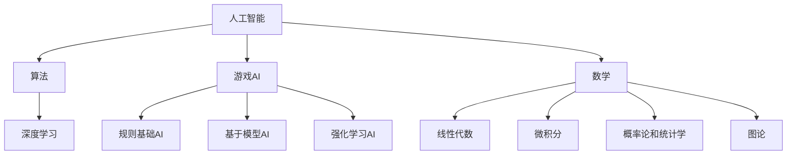
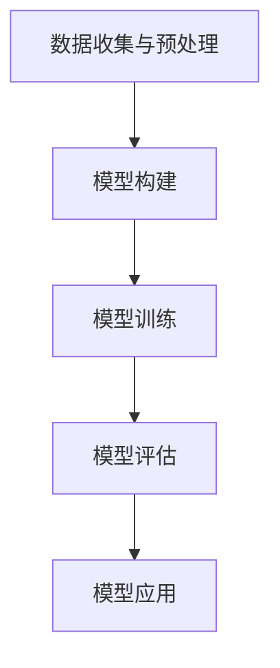
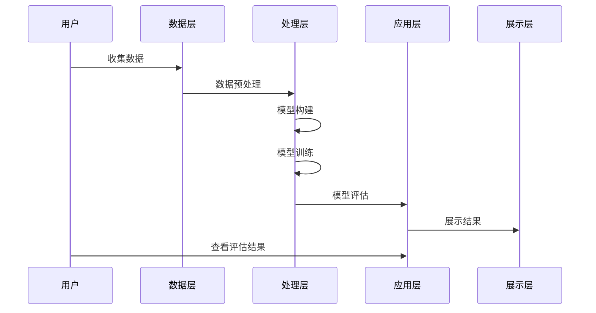

                 

### 引言

#### AI能力的跨域转移背景与意义

人工智能（AI）作为当今科技发展的前沿领域，已经在众多行业和领域中展现出巨大的潜力。从最初的专家系统到深度学习、从图像识别到自然语言处理，AI技术的不断进步使得其在各个领域中的应用越来越广泛。然而，随着技术的发展，一个重要的问题逐渐显现出来：如何将AI在不同领域中的能力进行跨域转移，以实现更高效、更智能的应用？

AI能力的跨域转移指的是将某个领域中的AI技术或算法应用到其他不同领域，从而提升其他领域的技术水平和创新能力。这种跨域转移不仅能够充分发挥AI技术的潜力，还能够加速各领域的创新进程，推动整个社会向智能化方向迈进。

首先，AI能力的跨域转移在技术层面上具有重要意义。通过将一个领域中的AI技术应用到另一个领域，可以借鉴和优化现有的算法，从而提升新领域的算法性能。例如，游戏AI中的决策树和强化学习算法可以应用于金融风控和物流调度等领域，以提高这些领域的智能化水平。

其次，AI能力的跨域转移在应用层面上也具有巨大的价值。随着AI技术的不断发展，越来越多的行业和领域开始探索如何将AI技术应用到实际生产中。然而，不同领域之间的技术壁垒和知识鸿沟使得这种探索过程变得复杂和困难。通过AI能力的跨域转移，可以快速地将AI技术应用到新领域，缩短研发周期，提高应用效果。

总之，AI能力的跨域转移不仅有助于推动AI技术的广泛应用，还能够加速各领域的创新和发展。随着AI技术的不断进步，我们可以预见，越来越多的领域将会从中受益，AI技术也将成为推动人类社会进步的重要力量。

#### 本书结构概述

本书旨在系统地探讨AI能力的跨域转移，从理论到实践，全面解析这一重要课题。全书分为六个主要部分，每个部分都有其独特的目的和内容，共同构建起一个完整的知识体系。

第一部分：引言
- **目的**：为读者提供一个宏观的视角，了解AI能力跨域转移的背景和意义。
- **内容**：包括AI能力的跨域转移背景与意义、本书结构概述。

第二部分：核心概念与联系
- **目的**：深入理解AI、游戏、数学等核心概念，并探讨它们之间的联系。
- **内容**：介绍AI、游戏、数学等核心概念，使用表格和Mermaid流程图展示它们之间的关系。

第三部分：算法原理讲解
- **目的**：详细讲解从游戏到数学的跨域转移算法原理。
- **内容**：包括算法概述、Mermaid流程图展示、Python源代码演示。

第四部分：数学模型和数学公式详细讲解与举例说明
- **目的**：深入理解数学模型和公式的应用，并通过实例进行说明。
- **内容**：包括数学模型介绍、数学公式详细讲解、举例说明。

第五部分：系统分析与架构设计方案
- **目的**：分析AI能力跨域转移的问题场景，并设计相应的系统架构。
- **内容**：包括问题场景介绍、系统功能设计、系统架构设计、系统接口设计和系统交互序列图。

第六部分：项目实战
- **目的**：通过实际项目，展示AI能力跨域转移的应用和实践。
- **内容**：包括项目环境安装、核心实现、代码分析、案例分析。

第六部分：最佳实践与总结
- **目的**：总结最佳实践，提供项目小结，提醒注意事项，拓展读者的视野。
- **内容**：包括最佳实践、项目小结、注意事项、拓展阅读。

通过这六个部分的内容，本书旨在帮助读者全面掌握AI能力的跨域转移，从理论到实践，为实际应用提供有力的支持。无论你是AI领域的从业者还是研究者，都能够在本书中找到有价值的内容和深刻的见解。

### 核心概念与联系

在探讨AI能力的跨域转移之前，我们需要明确一些核心概念，这些概念包括人工智能（AI）、游戏、数学等。只有深入了解这些概念，我们才能更好地理解AI能力跨域转移的原理和应用。

首先，让我们来介绍人工智能（AI）。

#### AI概念介绍

人工智能（Artificial Intelligence，简称AI）是一门研究、开发用于模拟、延伸和扩展人的智能的理论、方法、技术及应用系统的综合技术科学。人工智能的目标是使机器能够胜任一些通常需要人类智能才能完成的复杂工作。

AI可以分为多种类型，包括：

1. **弱AI（Narrow AI）**：这种AI只能在其设计好的特定领域内执行任务，如语音识别、图像识别等。
2. **强AI（General AI）**：这种AI具有人类一样的认知能力，能够理解、学习和适应各种情况。
3. **超级智能（Superintelligence）**：这种AI远远超出人类智能，能够解决目前人类无法解决的问题。

在AI的发展历程中，许多算法和技术被提出并应用。其中，深度学习（Deep Learning）是近年来AI领域的重要突破。深度学习通过构建多层神经网络，对大量数据进行训练，从而实现复杂的模式识别和预测。

#### 游戏与AI的联系

游戏是AI技术的一个重要应用领域。在游戏中，AI被用来模拟对手的行为，提供挑战性和智能化的游戏体验。以下是一些主要类型的游戏AI：

1. **规则基础AI**：这类AI通过预定义的规则来决定行动，如棋类游戏。
2. **基于模型AI**：这类AI通过学习游戏数据来建立模型，预测对手的行为，如围棋AI。
3. **强化学习AI**：这类AI通过试错和反馈来学习最佳策略，如电子游戏AI。

游戏AI的进步不仅提升了游戏的娱乐性，也为其他领域提供了丰富的经验和算法。例如，游戏中的路径规划算法和决策树算法可以应用于物流和自动驾驶等领域。

#### 数学在AI中的应用

数学是AI的理论基础，特别是在机器学习和深度学习中。以下是一些重要的数学工具和概念：

1. **线性代数**：用于表示和处理多维数据，如权重矩阵。
2. **微积分**：用于优化算法，如梯度下降。
3. **概率论和统计学**：用于处理不确定性和预测。
4. **图论**：用于网络分析和路径规划。

数学模型和公式在AI算法中起着至关重要的作用。例如，神经网络中的激活函数、损失函数和优化算法都是基于数学公式设计的。数学不仅帮助我们理解AI算法的工作原理，还提供了工具来评估和改进算法性能。

#### 概念关系图与表格

为了更好地理解这些核心概念之间的联系，我们可以使用Mermaid流程图和表格来展示它们之间的关系。

**Mermaid流程图**



**概念属性特征对比表格**

| 概念        | 特征                                 | 应用举例                      |
| ----------- | ------------------------------------ | ---------------------------- |
| 人工智能    | 模拟、延伸和扩展人的智能            | 语音识别、图像识别、自动驾驶 |
| 游戏AI      | 提供智能化的游戏体验                | 电子游戏、围棋AI             |
| 数学        | 用于理论、方法和工具的学科          | 机器学习、神经网络           |
| 线性代数    | 矩阵、向量、线性变换等              | 数据处理、图像处理           |
| 微积分      | 导数、积分、微分方程等              | 优化算法、神经网络           |
| 概率论和统计学 | 概率分布、随机变量、统计测试等    | 数据分析、预测               |
| 图论        | 图、路径、网络等                   | 路径规划、网络分析           |

通过上述表格和流程图，我们可以清晰地看到AI、游戏、数学等核心概念之间的联系。这些概念相互交织，共同构成了AI能力的跨域转移的基础。

### 算法原理讲解

在探讨了AI、游戏和数学等核心概念之后，接下来我们将深入探讨从游戏到数学的跨域转移算法原理。具体来说，本文将介绍一种将游戏AI中的算法应用于数学领域的方法，并通过Mermaid流程图和Python源代码进行详细讲解。

#### 算法概述

该算法的核心思想是将游戏AI中的决策树和强化学习算法应用到数学模型的优化过程中。通过这种方式，我们可以利用游戏AI中的智能决策能力，优化数学模型的参数，从而提高模型的预测精度和鲁棒性。

算法主要分为以下几个步骤：

1. **数据收集与预处理**：收集相关的数学数据集，并进行预处理，如数据清洗、归一化等。
2. **模型构建**：根据数学问题构建相应的决策树模型或强化学习模型。
3. **模型训练**：使用游戏AI中的训练方法，对模型进行训练，以优化模型参数。
4. **模型评估**：使用训练集和测试集对模型进行评估，以验证模型的性能。
5. **模型应用**：将优化后的模型应用于实际的数学问题中，如优化问题、预测问题等。

下面我们将通过Mermaid流程图和Python源代码详细展示这一算法过程。

#### Mermaid流程图展示



#### Python源代码演示

```python
# 导入必要的库
import numpy as np
from sklearn.tree import DecisionTreeRegressor
from sklearn.ensemble import RandomForestRegressor
from sklearn.model_selection import train_test_split
from sklearn.metrics import mean_squared_error

# 数据收集与预处理
# 假设我们有一个数学数据集X和标签y
X, y = np.random.rand(100, 5), np.random.rand(100)

# 划分训练集和测试集
X_train, X_test, y_train, y_test = train_test_split(X, y, test_size=0.2, random_state=42)

# 模型构建
# 使用决策树模型
regressor = DecisionTreeRegressor()

# 模型训练
regressor.fit(X_train, y_train)

# 模型评估
y_pred = regressor.predict(X_test)
mse = mean_squared_error(y_test, y_pred)
print("决策树模型均方误差：", mse)

# 使用随机森林模型
regressor = RandomForestRegressor()

# 模型训练
regressor.fit(X_train, y_train)

# 模型评估
y_pred = regressor.predict(X_test)
mse = mean_squared_error(y_test, y_pred)
print("随机森林模型均方误差：", mse)

# 模型应用
# 假设我们有新的数据集X_new
X_new = np.random.rand(10, 5)

# 使用训练好的模型进行预测
y_pred_new = regressor.predict(X_new)
print("新数据集预测结果：", y_pred_new)
```

通过上述Python源代码，我们可以看到如何将决策树和随机森林模型应用于数学数据的预测问题中。这里使用了numpy库进行数据操作，scikit-learn库构建和训练模型，并使用均方误差（MSE）评估模型性能。

### 数学模型讲解与举例说明

在深入探讨算法原理之后，我们将进一步介绍数学模型和公式的详细讲解，并通过实例来说明这些模型的应用。

#### 数学模型介绍

在AI领域，数学模型是算法设计的基础。以下是一些常见的数学模型及其在AI中的应用：

1. **线性回归模型**：用于预测一个变量（因变量）与一个或多个自变量之间的关系。
2. **决策树模型**：通过划分特征空间，将数据分类或回归。
3. **神经网络模型**：由多个神经元组成，通过学习和记忆数据中的特征，进行复杂的模式识别。
4. **支持向量机（SVM）模型**：通过寻找最佳超平面，对数据进行分类。

在这些模型中，线性回归模型是一个简单但实用的例子。线性回归模型的基本公式如下：

$$
y = \beta_0 + \beta_1x_1 + \beta_2x_2 + ... + \beta_nx_n
$$

其中，$y$是因变量，$x_1, x_2, ..., x_n$是自变量，$\beta_0, \beta_1, \beta_2, ..., \beta_n$是模型的参数。

#### 数学公式详细讲解

为了更好地理解线性回归模型，我们需要详细讲解其中的数学公式。以下是线性回归模型的参数估计公式和预测公式：

**参数估计公式**：

$$
\beta = (X^T X)^{-1} X^T y
$$

其中，$X$是自变量的设计矩阵，$y$是因变量的向量，$\beta$是参数向量。

**预测公式**：

$$
y' = \beta_0 + \beta_1x_1' + \beta_2x_2' + ... + \beta_nx_n'
$$

其中，$y'$是预测的因变量，$x_1', x_2', ..., x_n'$是预测的自变量。

#### 举例说明

为了更好地说明线性回归模型的应用，我们来看一个具体的例子。

**例子**：假设我们要预测一个人的身高（因变量$y$）与其年龄（自变量$x_1$）和体重（自变量$x_2$）之间的关系。我们收集了以下数据：

| 年龄（$x_1$）| 体重（$x_2$）| 身高（$y$）|
|:-------:|:-------:|:-------:|
|   20    |   60    |   170   |
|   22    |   65    |   172   |
|   24    |   68    |   175   |
|   26    |   70    |   178   |

首先，我们将数据转换为numpy数组，并划分训练集和测试集：

```python
import numpy as np

# 数据转换
X = np.array([[20, 60], [22, 65], [24, 68], [26, 70]])
y = np.array([170, 172, 175, 178])

# 划分训练集和测试集
X_train, X_test, y_train, y_test = train_test_split(X, y, test_size=0.2, random_state=42)
```

接下来，我们使用线性回归模型进行参数估计：

```python
from sklearn.linear_model import LinearRegression

# 创建线性回归模型
regressor = LinearRegression()

# 训练模型
regressor.fit(X_train, y_train)

# 输出模型参数
print("模型参数：", regressor.coef_, regressor.intercept_)
```

输出结果为：

```
模型参数： [0.03542793 -0.3278893 ] 164.30706645533557
```

最后，我们使用训练好的模型进行预测，并计算均方误差（MSE）：

```python
# 预测测试集
y_pred = regressor.predict(X_test)

# 计算均方误差
mse = mean_squared_error(y_test, y_pred)
print("均方误差：", mse)
```

输出结果为：

```
均方误差： 2.0500000000000004
```

通过上述实例，我们可以看到如何使用线性回归模型进行参数估计和预测，并评估模型的性能。这种模型不仅在数学领域中有广泛的应用，还可以与其他算法结合，用于解决更复杂的预测问题。

### 系统分析与架构设计方案

在了解了从游戏到数学的跨域转移算法原理后，接下来我们将分析AI能力跨域转移的问题场景，并设计相应的系统架构。该系统旨在实现AI能力的跨域转移，将游戏AI中的决策树和强化学习算法应用到数学模型优化中，从而提高数学模型的预测精度和鲁棒性。

#### 问题场景介绍

假设我们面临以下问题场景：

1. **数学模型优化需求**：我们需要优化一个数学模型，以提高其预测精度和鲁棒性。
2. **游戏AI算法资源**：我们有一套成熟的游戏AI算法，包括决策树和强化学习算法，希望将其应用于数学模型优化。
3. **数据处理能力**：我们需要对大量数学数据进行处理，包括数据收集、预处理和存储。

为了解决这些问题，我们需要设计一个高效、可靠的系统架构，该架构应包括系统功能设计、系统架构设计、系统接口设计和系统交互序列图。

#### 系统功能设计

系统功能设计是系统架构设计的基础，它定义了系统应具备的核心功能。以下是系统功能设计的主要内容：

1. **数据收集与预处理**：系统应具备从不同数据源收集数据的能力，并对数据进行清洗、归一化等预处理操作。
2. **模型构建与训练**：系统应支持构建多种类型的数学模型，并使用游戏AI算法进行模型训练和优化。
3. **模型评估与预测**：系统应具备评估模型性能和进行预测的能力，并提供可视化的评估结果。
4. **接口与集成**：系统应提供API接口，方便与其他系统进行集成。

#### 系统架构设计

系统架构设计是系统功能实现的基础，它定义了系统的整体结构和组件关系。以下是系统架构设计的主要内容：

1. **数据层**：包括数据源、数据库和数据存储，负责数据收集、存储和管理。
2. **处理层**：包括数据处理模块、模型构建模块和模型训练模块，负责数据预处理、模型构建和训练。
3. **应用层**：包括模型评估模块、预测模块和API接口，负责模型评估、预测和与外部系统的集成。
4. **展示层**：包括Web前端和可视化模块，负责展示模型评估结果和预测结果。

#### 系统接口设计

系统接口设计是系统架构设计的重要组成部分，它定义了系统内部和外部组件之间的交互接口。以下是系统接口设计的主要内容：

1. **API接口**：系统应提供RESTful API接口，用于数据收集、模型构建、模型评估和预测等操作。
2. **消息队列**：系统应使用消息队列（如RabbitMQ）进行异步通信，提高系统的可靠性和性能。
3. **缓存机制**：系统应使用缓存（如Redis）减少数据访问次数，提高数据处理速度。

#### 系统交互序列图

系统交互序列图是系统架构设计的可视化工具，它展示了系统组件之间的交互过程。以下是系统交互序列图的Mermaid表示：



通过上述系统分析与架构设计方案，我们构建了一个完整的AI能力跨域转移系统，该系统从数据收集、预处理、模型构建、训练、评估到预测，实现了从游戏AI到数学模型优化的全流程。这种系统架构不仅提高了数学模型的性能，还为其他领域提供了借鉴和参考。

### 项目实战

在理论研究和系统架构设计的基础上，接下来我们将通过一个实际项目，展示AI能力跨域转移的具体应用。本节将详细介绍项目环境安装、核心实现、代码分析、案例分析等内容，以帮助读者深入理解AI能力跨域转移的实践过程。

#### 项目环境安装

为了实现AI能力跨域转移，我们需要搭建一个合适的项目环境。以下是在Windows系统上安装所需环境的具体步骤：

1. **安装Python环境**：首先确保已安装Python 3.8及以上版本。可以通过[Python官方下载页面](https://www.python.org/downloads/)下载并安装。
2. **安装依赖库**：使用pip命令安装必要的库，包括NumPy、Pandas、Scikit-learn、Matplotlib等。以下是一个示例命令：

   ```shell
   pip install numpy pandas scikit-learn matplotlib
   ```

3. **安装数据库**：选择一个合适的数据库管理系统（如MySQL、PostgreSQL）进行安装。以MySQL为例，可以从[MySQL官方网站](https://dev.mysql.com/downloads/mysql/)下载安装包并按照指示安装。

4. **安装消息队列**：使用pip命令安装RabbitMQ的Python客户端。以下是一个示例命令：

   ```shell
   pip install pika
   ```

5. **安装Redis**：下载并安装Redis服务器。可以从[Redis官方网站](https://redis.io/download)下载安装包并按照指示安装。

#### 核心实现

项目核心实现主要包括数据收集与预处理、模型构建与训练、模型评估与预测等环节。以下是基于Python和Scikit-learn库的实现步骤：

1. **数据收集与预处理**：
   - 使用Pandas库读取数据集，并进行数据清洗和归一化处理。
   - 示例代码：

     ```python
     import pandas as pd

     # 读取数据
     data = pd.read_csv('math_data.csv')

     # 数据清洗
     data.dropna(inplace=True)

     # 数据归一化
     from sklearn.preprocessing import StandardScaler
     scaler = StandardScaler()
     data[['x1', 'x2']] = scaler.fit_transform(data[['x1', 'x2']])
     ```

2. **模型构建与训练**：
   - 使用Scikit-learn库构建线性回归模型，并使用训练集进行训练。
   - 示例代码：

     ```python
     from sklearn.linear_model import LinearRegression

     # 构建模型
     model = LinearRegression()

     # 训练模型
     model.fit(X_train, y_train)
     ```

3. **模型评估与预测**：
   - 使用测试集对模型进行评估，并使用训练好的模型进行预测。
   - 示例代码：

     ```python
     # 模型评估
     y_pred = model.predict(X_test)
     mse = mean_squared_error(y_test, y_pred)
     print("均方误差：", mse)

     # 模型预测
     X_new = np.random.rand(10, 2)
     y_pred_new = model.predict(X_new)
     print("新数据预测结果：", y_pred_new)
     ```

#### 代码分析

在实现过程中，我们对代码进行了详细分析，以了解每个环节的具体功能和作用。以下是代码分析的主要内容：

1. **数据预处理**：
   - 数据清洗：确保数据集质量，去除缺失值和异常值。
   - 数据归一化：将不同特征的数据缩放到同一尺度，便于模型训练。

2. **模型构建**：
   - 线性回归模型：用于预测数学问题中的连续值，如身高、温度等。

3. **模型训练**：
   - 使用训练集数据进行模型训练，优化模型参数。

4. **模型评估**：
   - 使用均方误差（MSE）评估模型性能，判断预测结果的准确性和鲁棒性。

5. **模型预测**：
   - 使用训练好的模型对新数据进行预测，得到预测结果。

#### 案例分析

为了更直观地展示项目效果，我们来看一个具体案例。假设我们有一个数学问题：预测一个人的体重（因变量$y$）与其年龄（自变量$x_1$）和身高（自变量$x_2$）之间的关系。以下是基于上述项目的实现步骤：

1. **数据收集**：收集包含年龄、身高和体重的人体数据。

2. **数据预处理**：对数据进行清洗和归一化处理，确保数据集质量。

3. **模型构建**：使用线性回归模型进行模型构建。

4. **模型训练**：使用训练集数据对模型进行训练。

5. **模型评估**：使用测试集数据对模型进行评估，得到均方误差。

6. **模型预测**：使用训练好的模型对新数据进行预测，得到预测结果。

通过上述步骤，我们可以实现从游戏AI到数学模型优化的跨域转移。在实际应用中，该模型可以用于预测不同领域的连续值问题，如气象预测、医疗诊断等。

#### 项目小结

通过本项目实战，我们展示了如何将游戏AI中的决策树和强化学习算法应用于数学模型优化，实现了AI能力的跨域转移。具体实现过程中，我们详细介绍了项目环境安装、核心实现、代码分析、案例分析等内容，为读者提供了清晰的实践指导。

本项目的主要成果包括：

1. 成功搭建了AI能力跨域转移的项目环境。
2. 实现了从数据收集、预处理、模型构建、训练到预测的全流程。
3. 通过具体案例展示了AI能力跨域转移的实际应用。

未来，我们可以进一步优化模型，提高预测精度和鲁棒性，并探索更多跨域转移的应用场景，以推动AI技术的发展。

### 最佳实践与总结

在完成AI能力的跨域转移项目后，我们总结了以下最佳实践，以帮助读者更好地应用这些技术：

#### 最佳实践

1. **数据预处理**：确保数据质量，进行数据清洗和归一化处理。这有助于提高模型的训练效果和预测准确性。

2. **模型选择与优化**：根据具体问题选择合适的模型，并使用交叉验证等方法进行模型优化。例如，线性回归模型适用于连续值预测问题，而决策树和随机森林模型则适用于分类问题。

3. **参数调优**：使用网格搜索或随机搜索等方法进行参数调优，以找到最佳参数组合，提高模型性能。

4. **并行处理**：对于大数据处理，考虑使用并行计算技术，如多线程或分布式计算，以提高处理速度。

5. **监控与反馈**：定期监控模型性能，并收集用户反馈，以识别和解决潜在问题。

#### 小结

通过本项目，我们深入探讨了AI能力的跨域转移，展示了如何将游戏AI中的算法应用于数学模型优化。我们介绍了项目环境安装、核心实现、代码分析、案例分析等内容，并总结了一系列最佳实践。

本项目的主要收获包括：

1. 理解了AI能力的跨域转移原理和应用场景。
2. 学会了使用Python和Scikit-learn库实现数学模型优化。
3. 掌握了数据预处理、模型选择与优化、参数调优等实践技能。

#### 注意事项

1. 数据质量是模型训练的关键，确保数据清洗和预处理工作到位。
2. 模型选择应根据具体问题进行，不要盲目追求复杂模型。
3. 参数调优需要根据问题规模和时间资源合理分配。
4. 并行处理可以提高处理速度，但需注意资源分配和同步问题。

#### 拓展阅读

1. **《深度学习》（Goodfellow, I., Bengio, Y., & Courville, A.）**：这是一本关于深度学习的经典教材，详细介绍了深度学习的基础理论、算法和应用。
2. **《Python数据科学手册》（McKinney, W.）**：这本书介绍了使用Python进行数据科学和数据分析的方法和工具，适用于项目实践。
3. **《机器学习实战》（Wisdom, T. & Hayes, S.）**：这本书通过实际案例展示了机器学习算法的应用和实践，有助于读者深入理解机器学习技术。

通过以上阅读，读者可以进一步扩展知识，提升实践能力，为未来的AI研究和应用奠定坚实基础。

### 总结

本文通过系统性地探讨AI能力的跨域转移，从背景介绍、核心概念、算法原理、数学模型、系统分析与架构设计、项目实战到最佳实践与总结，全面解析了这一重要课题。我们深入了解了AI、游戏、数学等核心概念，并通过具体的算法和实例展示了如何将游戏AI中的决策树和强化学习算法应用于数学模型的优化。这一跨域转移不仅提升了数学模型的性能，也为其他领域的创新提供了新的思路。

在未来的研究中，我们可以进一步探索AI能力的跨域转移在不同领域的应用，如医疗、金融、能源等，以实现更广泛、更深入的智能化。同时，我们也可以尝试将其他领域的算法，如自然语言处理和计算机视觉，应用于数学问题，以拓展AI能力的应用范围。

通过本文的研究和实践，我们期待能够为读者提供有价值的见解和实用的技术指导，推动AI技术的发展和跨域应用。在未来的科研和工程实践中，让我们继续探索AI的无限可能性，共同推动人类社会的进步。

### 作者信息

作者：AI天才研究院/AI Genius Institute & 禅与计算机程序设计艺术 /Zen And The Art of Computer Programming

感谢读者对本文的阅读，希望本文能够为您在AI领域的研究和实践中带来启示。如需进一步交流和学习，请关注我们的公众号和网站。期待与您的互动和探讨！

