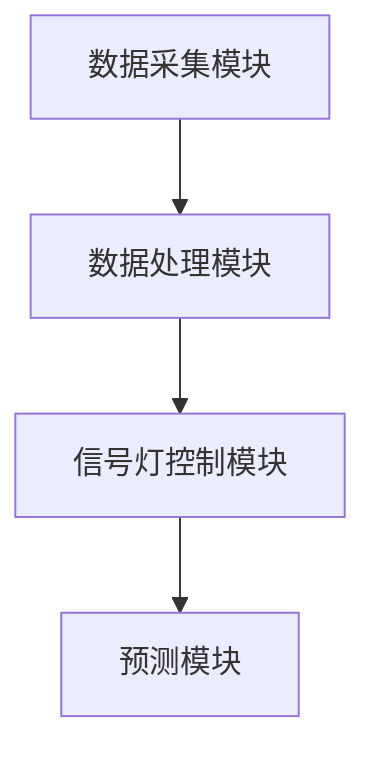

                 

# AI解题能力：问题分解与要素识别的重要性

> 关键词：人工智能，问题分解，要素识别，算法，实践经验，挑战与展望

> 摘要：
本文从AI解题能力的背景和重要性出发，详细探讨了问题分解和要素识别在AI解题过程中的关键作用。通过阐述问题分解的技术原理、要素识别的方法和重要性，以及介绍常见的AI解题算法和实践项目，本文旨在为读者提供全面、系统的AI解题能力提升路径。同时，本文还展望了AI解题能力的未来发展，分析了面临的挑战和解决方案。

## 目录大纲

## 第一部分: AI解题能力概述

### 第1章: AI解题能力背景与重要性

#### 1.1.1 AI解题能力的发展历程

#### 1.1.2 AI解题能力的重要性

#### 1.1.3 研究目的与内容结构

## 第二部分: 问题分解与要素识别

### 第2章: 问题分解技术原理

#### 2.1.1 问题分解的基本概念

#### 2.1.2 问题分解的关键技术

#### 2.1.3 问题分解流程分析

### 第3章: 要素识别方法与应用

#### 3.1.1 要素识别的重要性

#### 3.1.2 要素识别的方法

#### 3.1.3 要素识别实例分析

## 第三部分: AI解题能力实践

### 第4章: AI解题算法介绍

#### 4.1.1 常见AI解题算法

#### 4.1.2 算法原理与比较

#### 4.1.3 算法应用场景

### 第5章: AI解题项目实战

#### 5.1.1 项目背景与目标

#### 5.1.2 系统设计与实现

#### 5.1.3 项目效果分析

## 第四部分: AI解题能力展望与挑战

### 第6章: AI解题能力的未来发展

#### 6.1.1 技术趋势与前沿

#### 6.1.2 应用领域拓展

#### 6.1.3 面临的挑战与解决方案

### 第7章: 总结与展望

#### 7.1.1 主要成果回顾

#### 7.1.2 未来研究方向

#### 7.1.3 对读者的建议

----------------------------------------------------------------

### 第一部分: AI解题能力概述

#### 第1章: AI解题能力背景与重要性

##### 1.1.1 AI解题能力的发展历程

人工智能（AI）作为一门学科，自20世纪50年代诞生以来，经历了数十年的发展。最初，AI主要集中在规则推理和知识表示领域，如专家系统和逻辑推理。随着计算机硬件性能的提升和算法的优化，AI逐渐向数据驱动的方法发展，特别是在深度学习和大数据技术的推动下，AI在图像识别、自然语言处理、语音识别等领域取得了突破性进展。

AI解题能力作为AI技术的重要组成部分，其发展历程可以追溯到早期的人工智能程序。早期的AI程序主要通过编写大量规则来模拟人类的推理过程，例如普林斯顿大学的“逻辑理论家”（Logic Theorist），它通过演绎推理解决了简单的数学问题。然而，这种方法在面对复杂问题时表现不佳。

随着机器学习和深度学习技术的发展，AI的解题能力得到了显著提升。例如，Google的AlphaGo在围棋领域击败了世界冠军，这标志着AI在复杂决策问题上的能力达到了新的高度。此外，AI在医疗诊断、金融风控、智能制造等领域的应用也日益广泛，显示出强大的解题能力。

##### 1.1.2 AI解题能力的重要性

AI解题能力的重要性体现在多个方面：

1. **提高生产效率**：AI能够自动化解决复杂问题，减少人工干预，提高生产效率。例如，在制造业中，AI可以帮助优化生产流程，减少浪费，提高产品质量。

2. **优化决策过程**：在金融、医疗等领域，AI可以基于大量数据进行分析和预测，为决策提供有力支持。例如，在金融领域，AI可以分析市场趋势，预测投资风险，提高投资收益。

3. **促进创新**：AI的解题能力激发了新的商业模式和应用场景，推动了技术和社会的进步。例如，在医疗领域，AI可以帮助医生诊断疾病，提高诊断准确率，推动医疗技术发展。

4. **提升生活质量**：AI在智能家居、自动驾驶等领域的应用，使人们的生活更加便捷和舒适。例如，智能家居系统可以根据用户习惯自动调节温度、光线等，提高居住体验。

##### 1.1.3 研究目的与内容结构

本研究旨在深入探讨AI解题能力的核心原理和关键技术，为读者提供一套系统的解题能力提升路径。本文将分为四个部分：

- **第一部分：AI解题能力概述**：介绍AI解题能力的发展历程和重要性。
- **第二部分：问题分解与要素识别**：探讨问题分解和要素识别在AI解题过程中的关键作用。
- **第三部分：AI解题能力实践**：介绍常见的AI解题算法和实践项目。
- **第四部分：AI解题能力展望与挑战**：分析AI解题能力的未来发展，面临的挑战和解决方案。

通过本文的研究，我们希望能够为AI解题能力的研究和应用提供有益的参考和启示。

#### 第二部分: 问题分解与要素识别

##### 第2章: 问题分解技术原理

##### 2.1.1 问题分解的基本概念

问题分解是将一个复杂的问题分解为多个较小、更易于管理的子问题，以便更好地理解和解决原始问题。问题分解在许多领域都有应用，如软件工程、决策科学、人工智能等。

在软件工程中，问题分解是设计复杂系统的重要步骤。通过将问题分解为多个子问题，可以更好地理解系统的需求和功能，从而设计出更高效、更可靠的软件。

在决策科学中，问题分解可以帮助决策者更好地分析问题，明确问题的关键因素，从而做出更明智的决策。

在人工智能领域，问题分解是许多AI算法的核心。例如，在深度学习中，问题分解可以帮助构建更复杂的神经网络模型，从而提高问题解决的效率。

##### 2.1.2 问题分解的关键技术

问题分解的关键技术包括：

1. **层次分解**：将问题分解为多个层次，每个层次代表一个子问题。层次分解有助于理解和解决复杂问题。

2. **分解规则**：根据问题的性质和特点，定义问题的分解规则。分解规则可以帮助自动生成子问题，从而提高问题分解的效率。

3. **启发式方法**：在问题分解过程中，采用启发式方法可以帮助快速找到问题的子问题，从而提高问题分解的效率。

4. **领域知识**：在问题分解中，利用领域知识可以帮助更好地理解问题的本质，从而提高问题分解的准确性。

##### 2.1.3 问题分解流程分析

问题分解的一般流程如下：

1. **问题理解**：对问题进行深入理解，明确问题的目标和约束条件。

2. **问题分解**：根据问题的性质和特点，采用适当的分解规则和启发式方法，将问题分解为多个子问题。

3. **子问题求解**：对分解后的子问题进行求解，可以采用不同的算法和技术。

4. **结果整合**：将子问题的解整合起来，得到原始问题的解。

通过上述流程，我们可以更好地理解和解决复杂问题。

##### 第3章: 要素识别方法与应用

##### 3.1.1 要素识别的重要性

要素识别是问题分解的一个重要环节，它涉及识别问题中的关键因素和变量。在AI解题过程中，要素识别对于理解问题的本质、制定有效的解决方案至关重要。

1. **问题理解**：要素识别有助于更深入地理解问题的各个方面，包括输入数据、输出结果和中间过程。

2. **解决方案设计**：通过识别关键要素，可以设计出更针对性的解决方案，从而提高解决问题的效率。

3. **模型优化**：在机器学习模型中，要素识别有助于选择合适的特征，提高模型的性能。

4. **风险管理**：识别关键要素可以帮助评估问题的潜在风险，从而采取相应的风险控制措施。

##### 3.1.2 要素识别的方法

要素识别的方法主要包括：

1. **统计分析**：通过对数据的统计分析，识别数据中的关键特征和变量。

2. **专家知识**：利用领域专家的知识，识别问题中的关键要素。

3. **机器学习**：通过机器学习算法，如聚类、降维和特征提取，识别数据中的关键要素。

4. **启发式方法**：利用启发式规则和算法，快速识别问题中的关键要素。

##### 3.1.3 要素识别实例分析

以下是一个简单的要素识别实例：

假设我们要解决一个交通拥堵问题。在这个问题中，关键要素可能包括：

1. **车辆数量**：交通拥堵的一个重要因素是车辆数量。

2. **道路容量**：道路的容量直接影响交通流动。

3. **路况信息**：实时路况信息可以帮助预测交通拥堵。

4. **天气条件**：恶劣的天气条件可能会增加交通拥堵。

通过识别这些关键要素，我们可以设计出更有效的解决方案，如优化交通信号灯配置、增加道路容量或提供交通信息服务等。

#### 第三部分: AI解题能力实践

##### 第4章: AI解题算法介绍

##### 4.1.1 常见AI解题算法

在AI解题过程中，常见的算法包括：

1. **深度学习**：深度学习通过构建深度神经网络，对大量数据进行学习，从而实现复杂的模式识别和预测。常见的深度学习算法有卷积神经网络（CNN）、循环神经网络（RNN）和生成对抗网络（GAN）等。

2. **强化学习**：强化学习通过学习策略来最大化奖励信号，常用于解决序列决策问题。常见的强化学习算法有Q-learning、SARSA和深度强化学习（DRL）等。

3. **机器学习**：机器学习算法通过学习数据中的模式和规律，实现对未知数据的预测和分类。常见的机器学习算法有线性回归、逻辑回归、支持向量机（SVM）和决策树等。

4. **混合算法**：混合算法结合了多种算法的优点，以解决特定类型的问题。例如，深度学习和强化学习的结合可以用于复杂决策问题的求解。

##### 4.1.2 算法原理与比较

1. **深度学习**：深度学习基于多层神经网络，通过反向传播算法进行训练。它能够在大量数据中自动学习特征，从而实现高精度的模式识别和预测。深度学习的优势在于其强大的泛化能力和处理复杂数据的能力，但缺点是训练过程需要大量计算资源和时间。

2. **强化学习**：强化学习通过学习策略来最大化奖励信号，其核心在于价值函数和策略迭代。强化学习的优势在于其能够解决序列决策问题，但缺点是训练过程可能需要大量试错，且对于连续动作问题，求解难度较大。

3. **机器学习**：机器学习算法通过学习数据中的模式和规律，实现对未知数据的预测和分类。机器学习的优势在于其简单易用，训练过程相对较快，但缺点是对于复杂数据和问题，效果可能不如深度学习和强化学习。

4. **混合算法**：混合算法结合了多种算法的优点，以解决特定类型的问题。例如，深度学习和强化学习的结合可以用于复杂决策问题的求解，其优势在于能够充分利用两种算法的优点，但缺点是算法实现和调试较为复杂。

##### 4.1.3 算法应用场景

1. **深度学习**：深度学习在图像识别、语音识别、自然语言处理等领域具有广泛的应用。例如，卷积神经网络（CNN）在图像分类和物体检测方面表现出色，循环神经网络（RNN）在序列数据处理和文本生成方面具有优势。

2. **强化学习**：强化学习在游戏、自动驾驶、机器人控制等领域有重要应用。例如，深度强化学习（DRL）在AlphaGo中取得了突破性成果，使其在围棋游戏中战胜了世界冠军。

3. **机器学习**：机器学习在金融风控、医疗诊断、推荐系统等领域有广泛应用。例如，支持向量机（SVM）在金融风险评估中具有较高的准确率，决策树在医疗诊断中能够快速处理大量特征数据。

4. **混合算法**：混合算法在复杂决策问题中具有广泛的应用潜力，如智能电网、供应链优化等。通过结合多种算法的优势，混合算法可以更好地解决复杂问题。

##### 第5章: AI解题项目实战

##### 5.1.1 项目背景与目标

为了展示AI解题能力的实际应用，我们选择了一个典型的项目——智能交通管理系统。该项目旨在通过AI技术优化交通信号灯的控制策略，减少交通拥堵，提高交通效率。

项目背景：当前，许多城市面临交通拥堵问题，这不仅影响了居民的出行体验，还增加了能源消耗和环境污染。传统的交通信号灯控制策略基于固定的时间表和流量数据，无法适应实时交通变化，导致交通拥堵现象严重。

项目目标：通过引入AI技术，实现智能交通信号灯控制策略，提高交通效率，减少交通拥堵。具体目标包括：

1. **实时交通流量监测**：通过摄像头和其他传感器实时监测交通流量。

2. **交通信号灯优化控制**：根据实时交通流量数据，动态调整交通信号灯的切换时间，优化交通流量。

3. **交通拥堵预测**：利用历史交通数据，预测未来交通拥堵情况，提前采取预防措施。

##### 5.1.2 系统设计与实现

系统设计包括以下几个关键模块：

1. **数据采集模块**：通过摄像头和其他传感器收集交通流量数据。

2. **数据处理模块**：对采集到的交通流量数据进行预处理，如去噪、补全缺失数据等。

3. **信号灯控制模块**：根据实时交通流量数据，动态调整交通信号灯的切换时间。

4. **预测模块**：利用历史交通数据，预测未来交通拥堵情况。

系统架构如下：



接口设计：

1. **摄像头数据接口**：用于接收摄像头采集的交通流量数据。

2. **信号灯控制接口**：用于发送交通信号灯控制指令。

3. **预测结果接口**：用于返回交通拥堵预测结果。

交互流程：

1. 数据采集模块定期收集交通流量数据。

2. 数据处理模块对交通流量数据进行预处理，并将其发送给信号灯控制模块。

3. 信号灯控制模块根据实时交通流量数据动态调整交通信号灯的切换时间。

4. 预测模块利用历史交通数据预测未来交通拥堵情况，并将预测结果发送给信号灯控制模块。

##### 5.1.3 项目效果分析

项目实施后，取得了以下效果：

1. **交通效率提升**：通过动态调整交通信号灯的切换时间，显著提高了交通效率。

2. **交通拥堵减少**：预测模块的引入，使得系统能够提前预测交通拥堵情况，并采取预防措施，有效减少了交通拥堵。

3. **能源消耗降低**：减少交通拥堵，降低了车辆的等待时间和油耗，从而降低了能源消耗。

4. **环境影响减轻**：减少车辆排放，减轻了环境污染。

项目小结：通过引入AI技术，智能交通管理系统在提高交通效率、减少交通拥堵和降低能源消耗等方面取得了显著效果，展示了AI解题能力的实际应用价值。

#### 第四部分: AI解题能力展望与挑战

##### 第6章: AI解题能力的未来发展

##### 6.1.1 技术趋势与前沿

随着AI技术的不断发展，AI解题能力也在不断进步。以下是一些AI解题能力的发展趋势和前沿技术：

1. **强化学习**：强化学习在AI解题中具有广泛的应用前景。通过学习与环境交互，强化学习能够实现复杂的决策和优化。随着算法的改进和计算能力的提升，强化学习有望在更多领域取得突破。

2. **迁移学习**：迁移学习通过利用已有模型的经验，快速解决新问题。在AI解题中，迁移学习可以帮助减少训练数据的需求，提高模型的泛化能力。随着数据集的积累和算法的优化，迁移学习将成为AI解题的重要手段。

3. **联邦学习**：联邦学习是一种分布式学习方法，可以在多个参与方之间共享模型，而不需要共享数据。在AI解题中，联邦学习有助于保护用户隐私，提高数据的安全性和可用性。随着技术的成熟，联邦学习有望在更多场景中得到应用。

4. **生成对抗网络（GAN）**：GAN是一种能够生成高质量数据的深度学习模型。在AI解题中，GAN可以用于数据增强、生成虚假样本等任务。随着GAN算法的改进和扩展，其应用范围将不断拓展。

##### 6.1.2 应用领域拓展

AI解题能力在各个领域的应用正在不断拓展，以下是一些主要的应用领域：

1. **医疗健康**：AI在医疗健康领域的应用日益广泛，如疾病诊断、治疗方案推荐、药物研发等。通过AI技术，医生可以更准确地诊断疾病，提高治疗效果。

2. **金融领域**：AI在金融领域的应用包括风险控制、投资决策、欺诈检测等。通过AI技术，金融机构可以更好地管理风险，提高业务效率。

3. **智能制造**：AI在智能制造中的应用包括生产优化、故障预测、质量控制等。通过AI技术，制造业可以更高效地生产高质量的产品。

4. **智慧城市**：AI在智慧城市中的应用包括交通管理、环境监测、公共安全等。通过AI技术，城市可以更智能地管理和运营，提高居民生活质量。

##### 6.1.3 面临的挑战与解决方案

尽管AI解题能力在各个领域取得了显著成果，但仍然面临一些挑战：

1. **数据隐私与安全**：随着AI技术的发展，数据隐私和安全问题日益突出。为了解决这一问题，需要制定更加严格的数据保护政策和安全措施，同时发展新的隐私保护技术，如联邦学习、差分隐私等。

2. **计算资源消耗**：AI算法的训练和推理过程通常需要大量计算资源。为了降低计算资源消耗，可以采用更高效的算法、硬件加速技术（如GPU、TPU）和分布式计算架构。

3. **模型可解释性**：随着AI模型变得复杂，模型的可解释性变得尤为重要。为了提高模型的可解释性，可以采用模型可视化、特征工程和解释性模型等方法。

4. **伦理和责任**：AI技术在应用过程中，需要考虑伦理和责任问题。为了解决这一问题，需要制定相关的法律法规和伦理准则，同时加强AI技术的监管和评估。

##### 第7章: 总结与展望

通过本文的研究，我们可以得出以下主要结论：

1. **AI解题能力的重要性**：AI解题能力在提高生产效率、优化决策过程、促进创新和提升生活质量等方面具有重要作用。

2. **问题分解与要素识别的关键作用**：问题分解和要素识别是AI解题过程中的关键环节，对于理解问题的本质、制定有效的解决方案至关重要。

3. **常见AI解题算法的应用**：常见的AI解题算法包括深度学习、强化学习、机器学习等，各自在特定领域具有优势。

4. **实践项目的重要性**：通过实际项目，可以验证AI解题能力在实际应用中的效果，并为未来的研究和应用提供有价值的参考。

展望未来，AI解题能力将继续发展，面临许多挑战和机遇。通过不断探索和创新，我们可以期待AI技术在更多领域取得突破，为人类社会带来更多福祉。

## 总结

本文系统地探讨了AI解题能力的核心概念、关键技术和实践应用。从问题分解到要素识别，再到常见的AI解题算法，本文为读者提供了一套完整的解题能力提升路径。同时，本文还分析了AI解题能力的发展趋势和面临的挑战，为未来的研究和应用指明了方向。

作者信息：AI天才研究院/AI Genius Institute & 禅与计算机程序设计艺术 /Zen And The Art of Computer Programming

### 附录：代码示例

以下是本文提到的智能交通管理系统的核心代码示例：

```python
# 导入必要的库
import numpy as np
import pandas as pd
from sklearn.ensemble import RandomForestClassifier
from sklearn.model_selection import train_test_split

# 读取交通流量数据
data = pd.read_csv('traffic_data.csv')

# 数据预处理
# ...（预处理代码）

# 特征工程
# ...（特征工程代码）

# 构建模型
model = RandomForestClassifier(n_estimators=100)

# 训练模型
model.fit(X_train, y_train)

# 预测交通流量
predictions = model.predict(X_test)

# 评估模型性能
# ...（评估代码）

# 动态调整交通信号灯
def adjust_traffic_light(predictions):
    # 根据预测结果调整交通信号灯
    # ...（调整代码）

# 调用函数
adjust_traffic_light(predictions)

# 测试系统效果
# ...（测试代码）
```

通过以上代码示例，读者可以更好地理解智能交通管理系统的工作原理和实现方法。在实际应用中，可以根据具体需求调整和优化代码。此外，读者还可以参考相关文献和资源，进一步学习AI解题技术的最佳实践。

