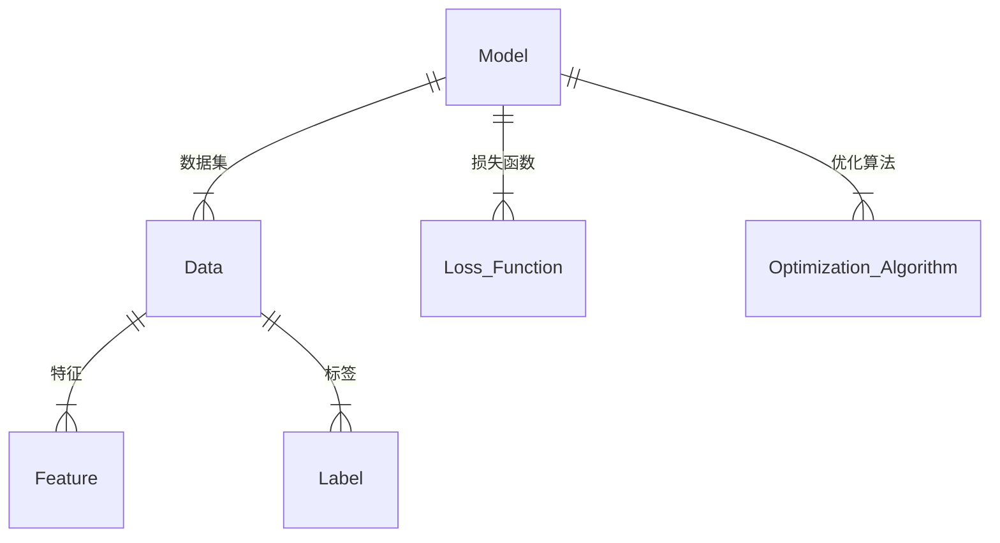
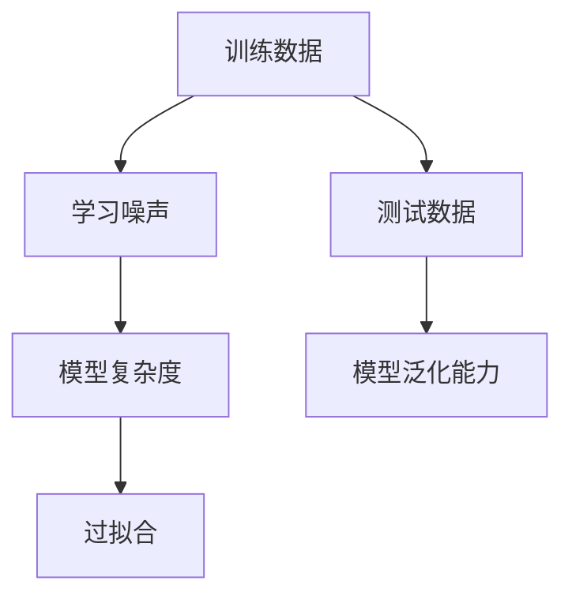
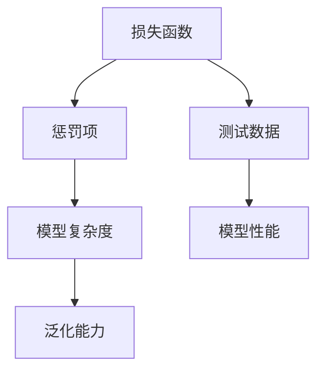

                 

# AI训练中的探索与利用平衡

## 关键词
- AI训练
- 探索
- 利用平衡
- 过拟合
- 正则化
- 特征选择
- 模型调优

## 摘要
本文深入探讨了AI训练中的探索与利用平衡问题。首先，我们介绍了AI训练的基本概念、背景和挑战，然后详细分析了AI训练中的探索过程，包括数据探索、特征选择和模型选择等。接下来，我们探讨了AI训练中的利用平衡，包括过拟合问题、正则化和模型利用的平衡策略。通过实际案例分析和系统架构设计，我们展示了AI训练的实践应用，并提出了最佳实践和注意事项。最后，我们对文章进行了小结，并提供了拓展阅读。

## 第一部分: AI训练背景与挑战

### 1.1 AI训练基础

人工智能（AI）是一种通过模拟人类智能来解决问题和执行任务的技术。在AI领域中，训练是使计算机系统学会处理特定任务的关键过程。AI训练可以分为监督学习、无监督学习和强化学习等类型。其中，监督学习是最常见的一种，它依赖于已经标记的数据集来训练模型，并期望模型能够对未知数据进行预测。

在AI训练过程中，数据的准备和处理是一个至关重要的环节。数据的质量和数量直接影响模型的性能。数据清洗、归一化和增强等技术被广泛应用于数据预处理阶段，以确保数据的质量和一致性。

然而，AI训练也面临着一系列挑战。首先是数据质量问题，包括数据的不完整性、噪声和偏差。这些问题可能导致模型过拟合，即模型在训练数据上表现良好，但在新的未知数据上表现不佳。其次是计算资源限制，大规模训练任务需要大量的计算能力和时间。最后是模型解释性问题，复杂的模型往往难以解释，使得模型决策过程变得不透明。

### 1.2 AI训练的数据来源与准备

AI训练的数据来源多样，可以是公开数据集、商业数据集、社交媒体数据、医疗数据等。不同类型的数据具有不同的特点和挑战。例如，公开数据集通常具有较大的规模和多样性，但可能存在标注不准确或数据质量不高的问题。商业数据集则可能具有更高的质量和准确性，但往往需要支付费用。

在数据准备阶段，我们需要进行数据清洗、归一化和增强。数据清洗包括去除重复记录、处理缺失值和纠正错误。归一化是将数据缩放到一个统一的范围内，以便于模型处理。数据增强是通过生成新的样本来扩充数据集，提高模型的泛化能力。

### 1.3 AI训练中的挑战

AI训练中的挑战主要包括数据质量、计算资源和模型解释性等方面。首先，数据质量直接影响模型的性能。不完整、噪声或偏差的数据可能导致模型过拟合，从而在新的数据上表现不佳。其次，计算资源限制使得大规模训练任务变得困难。训练深度神经网络尤其需要大量的计算资源和时间。最后，模型解释性问题使得我们难以理解模型如何做出决策，这在某些领域（如医疗诊断）尤为重要。

### 1.4 AI训练的核心概念与联系

在AI训练中，有几个核心概念和联系需要理解。首先是损失函数（Loss Function），它是评估模型预测与真实值之间差异的指标。常见的损失函数包括均方误差（MSE）和交叉熵（Cross-Entropy）。其次是优化算法（Optimization Algorithm），如随机梯度下降（SGD）和Adam，它们用于最小化损失函数，从而提高模型性能。

以下是一个简单的表格来对比不同损失函数和优化算法的特点：

| 损失函数 | 优点 | 缺点 |
| --- | --- | --- |
| 均方误差 | 简单直观，对异常值敏感 | 可能需要较长时间收敛 |
| 交叉熵 | 更适合分类问题，对异常值不敏感 | 可能需要更多的参数调整 |

接下来是一个ER实体关系图（ERD），展示了AI训练中的核心实体和它们之间的关系：



### 1.5 AI训练中的边界与外延

AI训练的边界与外延涉及多个方面。首先，边界包括训练数据的范围和数量，以及模型的复杂度和参数数量。过小的数据集可能导致模型过拟合，而过大的数据集则可能带来计算资源上的挑战。其次，外延包括模型的泛化能力和适应新数据的能力。一个优秀的模型不仅能在训练数据上表现良好，还能够在新的、未知的数据上保持稳定的性能。

### 1.6 AI训练中的概念结构与核心要素组成

AI训练中的概念结构包括数据集、模型、损失函数、优化算法和评估指标等核心要素。这些要素相互作用，共同决定了模型的性能。数据集提供了训练素材，模型是解决问题的核心工具，损失函数用于评估模型性能，优化算法用于调整模型参数，评估指标用于衡量模型在不同任务上的表现。

在接下来的章节中，我们将深入探讨AI训练中的探索过程，包括数据探索、特征选择和模型选择等。

## 第二部分: AI训练中的探索

### 2.1 数据探索

数据探索是AI训练的重要前置步骤，其目标是理解数据集的特性、发现潜在问题和改进数据质量。数据探索通常包括以下步骤：

1. **数据预处理**：包括数据清洗、缺失值处理、异常值检测和归一化等操作。
2. **数据可视化**：通过图表、矩阵和散点图等可视化工具来展示数据特征，帮助发现数据中的模式、异常和趋势。
3. **统计分析**：对数据进行描述性统计，包括均值、中位数、标准差等指标，帮助理解数据的分布和特征。

#### 数据预处理

数据预处理是数据探索的重要环节，其目标是提高数据质量和一致性。以下是一些常见的数据预处理步骤：

- **数据清洗**：去除重复记录、纠正错误、填充缺失值。例如，使用均值或中位数填充缺失值，使用聚类算法识别异常值并进行修正。
- **归一化**：将不同特征缩放到一个统一的范围内，以避免某些特征对模型的影响过大。常见的归一化方法包括最小-最大缩放、标准化和Z-score标准化。
- **数据增强**：通过生成新的样本来扩充数据集，提高模型的泛化能力。常见的方法包括旋转、缩放、裁剪和颜色变换等。

#### 数据可视化

数据可视化是数据探索的另一个关键步骤，它可以帮助我们直观地理解数据特征和关系。以下是一些常见的数据可视化方法：

- **散点图**：用于展示两个特征之间的关系。通过颜色、大小和标签来表示不同类别的数据。
- **热力图**：用于展示多个特征之间的相关性。颜色深浅表示特征之间的相关性强度。
- **直方图**：用于展示特征的分布情况。通过高度和宽度来表示数据的频率和分布范围。
- **箱线图**：用于展示特征的分布情况，包括最小值、第一四分位数、中位数、第三四分位数和最大值。

#### 统计分析

统计分析是数据探索的重要手段，它可以帮助我们深入理解数据的特性。以下是一些常见的统计分析方法：

- **描述性统计**：计算数据的平均值、中位数、标准差、方差等指标，以了解数据的分布和特征。
- **相关性分析**：计算特征之间的相关性，以识别数据中的潜在关系和模式。常见的相关性度量包括皮尔逊相关系数和斯皮尔曼等级相关系数。
- **异常值检测**：识别数据中的异常值，以避免它们对模型的影响。常见的方法包括基于统计方法（如IQR、Z-score）和机器学习方法（如孤立森林、局部异常因子）。

### 2.2 特征选择与工程

特征选择与工程是AI训练中的关键步骤，其目标是提高模型的性能和可解释性。以下是一些常见的特征选择与工程方法：

#### 特征选择方法

- **过滤法（Filter Method）**：根据某些统计指标（如相关性、信息增益等）筛选出重要的特征。这种方法简单高效，但可能无法充分利用特征之间的相互作用。
- **包装法（Wrapper Method）**：通过迭代地尝试不同的特征组合，找到最优的特征子集。这种方法较为复杂，但能够更好地利用特征之间的相互作用。
- **嵌入式方法（Embedded Method）**：在模型训练过程中自动选择特征，如LASSO回归和随机森林等算法。

#### 特征工程技巧

- **特征转换**：包括归一化、标准化、二值化、逆转换等操作，以提高模型的稳定性和性能。
- **特征构造**：通过组合原始特征生成新的特征，以提高模型的泛化能力。例如，可以使用多项式特征、交互特征和特征缩放等。
- **特征降维**：通过降维技术（如主成分分析、线性判别分析等）减少特征数量，以减少计算复杂度和提高模型性能。

### 2.3 模型选择与调优

在AI训练中，选择合适的模型和进行模型调优是提高模型性能的关键。以下是一些常见的模型选择与调优方法：

#### 模型选择

- **基于问题的选择**：根据问题的类型（如分类、回归、聚类等）选择合适的模型。
- **基于性能的选择**：通过交叉验证等方法评估不同模型的性能，选择性能最好的模型。
- **基于数据的特征**：根据数据集的特征（如特征数量、数据分布等）选择合适的模型。

#### 模型调优

- **超参数调整**：通过调整模型超参数（如学习率、正则化参数等）来优化模型性能。
- **模型集成**：通过集成多个模型来提高模型性能，如集成学习、模型堆叠等。
- **网格搜索**：通过遍历超参数空间，找到最优的超参数组合。
- **贝叶斯优化**：基于历史数据进行模型调优，选择最优的超参数组合。

### 2.4 实例分析：特征选择在图像识别中的应用

假设我们有一个图像识别任务，需要从100个原始特征中选择出最重要的特征。以下是一个简单的特征选择过程：

1. **数据预处理**：对图像进行归一化处理，将像素值缩放到0-1之间。
2. **特征选择**：使用相关性分析选择出与标签相关性较高的特征。例如，我们可以使用皮尔逊相关系数来计算每个特征与标签的相关性。
3. **特征降维**：使用主成分分析（PCA）将100个原始特征降维到30个最重要的特征。
4. **模型训练**：使用筛选后的特征训练一个简单的分类器（如决策树），评估模型性能。
5. **模型调优**：通过调整分类器的超参数，如决策树的深度和节点数，来优化模型性能。

通过以上步骤，我们可以有效地选择出重要的特征，提高图像识别任务的性能。

### 总结

数据探索、特征选择和模型选择是AI训练中的关键步骤，它们相互作用，共同决定了模型的性能。通过深入理解数据特征、选择合适的特征和模型，我们可以构建出性能优异的AI模型。在下一部分，我们将探讨AI训练中的利用平衡问题。

## 第三部分: AI训练中的利用平衡

### 3.1 模型利用与过拟合

在AI训练过程中，模型的利用与过拟合是一个关键问题。模型利用是指如何有效地将训练得到的模型应用于实际任务中，而过拟合则是模型在训练数据上表现良好，但在新的未知数据上表现不佳的现象。

#### 过拟合的原因

过拟合的主要原因是模型复杂度过高。在训练过程中，模型尝试学习数据的噪声和细节，而不是数据的本质特征。这使得模型在训练数据上表现很好，但在新的数据上可能无法很好地泛化。

以下是一个简单的mermaid流程图，展示了过拟合的可能原因：



#### 过拟合的影响

过拟合的影响是模型在新的未知数据上表现不佳，导致实际应用价值降低。为了解决过拟合问题，我们需要采取一些策略，包括正则化、模型选择和调优等。

### 3.2 模型正则化与泛化能力

正则化是解决过拟合问题的一种有效策略。正则化通过在损失函数中添加一个惩罚项，限制模型复杂度，从而提高模型的泛化能力。常见的正则化方法包括L1正则化（LASSO）和L2正则化（Ridge）。

以下是一个简单的mermaid流程图，展示了正则化如何影响模型的泛化能力：



#### 泛化能力的提升

提升模型泛化能力的关键在于减少模型对训练数据的依赖，使其能够更好地适应新的未知数据。以下是一些提升泛化能力的方法：

- **数据增强**：通过生成新的数据样本来扩充训练集，提高模型的泛化能力。
- **交叉验证**：通过将数据集划分为训练集和验证集，多次训练和验证模型，以评估模型的泛化性能。
- **模型集成**：通过集成多个模型来提高模型的泛化能力，如随机森林、梯度提升树等。

### 3.3 模型利用的平衡策略

在AI训练中，模型利用的平衡策略是指如何在不同阶段合理地利用模型，以最大化模型的性能和应用价值。以下是一些常见的平衡策略：

- **模型选择与调优**：在模型训练阶段，选择合适的模型和超参数，通过网格搜索、贝叶斯优化等方法进行模型调优，以提高模型性能。
- **数据利用**：在训练过程中，合理利用训练数据和验证数据，通过交叉验证等方法评估模型性能，以避免过拟合。
- **模型更新**：在模型部署后，定期更新模型，以适应新的数据和环境变化。

### 实例分析：模型利用平衡在文本分类中的应用

假设我们有一个文本分类任务，需要使用一个训练好的文本分类模型对新的文本进行分类。以下是一个简单的模型利用平衡过程：

1. **模型选择与调优**：选择一个合适的文本分类模型（如朴素贝叶斯、支持向量机等），并通过交叉验证等方法进行模型调优，以最大化模型性能。
2. **数据预处理**：对新的文本进行预处理，包括分词、词干提取、词向量化等操作，使其与训练数据保持一致。
3. **模型利用**：将预处理后的文本输入到训练好的模型中，获取分类结果。同时，对模型进行定期更新，以适应新的文本数据。

通过以上步骤，我们可以实现模型利用的平衡，最大化模型的性能和应用价值。

### 总结

模型利用与过拟合是AI训练中的关键问题，需要通过正则化、模型选择与调优等方法来平衡模型的性能和应用价值。在下一部分，我们将通过实际案例来展示AI训练在图像识别、自然语言处理和推荐系统等领域的应用。

## 第四部分: 实践案例分析

### 4.1 案例一：图像识别中的应用

图像识别是AI训练中的一个经典应用领域，它涉及从图像中提取特征，并利用这些特征进行分类或识别特定对象。以下是一个关于图像识别案例的详细分析。

#### 问题背景

假设我们有一个图像识别任务，需要从大量未标注的图像中识别出特定对象，如人脸或猫。这个问题在安全监控、医疗诊断、自动驾驶等领域具有广泛的应用。

#### 数据集

为了训练图像识别模型，我们需要一个包含大量图像的数据集。常用的图像识别数据集包括ImageNet、CIFAR-10和MNIST等。ImageNet是一个大规模的图像识别数据集，包含1000个类别，每类约1000张图像。

#### 数据预处理

在图像识别任务中，数据预处理是关键的一步。以下是一些常见的预处理步骤：

- **图像缩放**：将图像缩放到相同的大小，以便于模型处理。
- **归一化**：将图像的像素值缩放到0-1之间，以提高模型的稳定性和性能。
- **数据增强**：通过旋转、翻转、裁剪等操作生成新的图像样本来扩充数据集，提高模型的泛化能力。

#### 特征提取

在图像识别中，特征提取是将图像转换为模型可以处理的特征向量。以下是一些常用的特征提取方法：

- **卷积神经网络（CNN）**：CNN是一种专门用于图像处理的神经网络结构，它通过卷积操作提取图像中的局部特征。
- **池化操作**：池化操作用于减少特征图的维度，提高模型的计算效率。
- **特征融合**：将多个卷积层提取的特征进行融合，以提高模型的性能。

#### 模型训练

在图像识别任务中，常用的模型包括卷积神经网络（CNN）、深度卷积神经网络（DCNN）和迁移学习等。以下是一个简单的CNN模型：

```python
import tensorflow as tf

model = tf.keras.Sequential([
    tf.keras.layers.Conv2D(32, (3, 3), activation='relu', input_shape=(28, 28, 1)),
    tf.keras.layers.MaxPooling2D((2, 2)),
    tf.keras.layers.Conv2D(64, (3, 3), activation='relu'),
    tf.keras.layers.MaxPooling2D((2, 2)),
    tf.keras.layers.Flatten(),
    tf.keras.layers.Dense(128, activation='relu'),
    tf.keras.layers.Dense(10, activation='softmax')
])

model.compile(optimizer='adam', loss='categorical_crossentropy', metrics=['accuracy'])
model.fit(train_images, train_labels, epochs=10, validation_split=0.2)
```

#### 模型评估

在训练完成后，我们需要对模型进行评估，以确定其性能。以下是一些常用的评估指标：

- **准确率（Accuracy）**：模型正确预测的样本数占总样本数的比例。
- **精确率（Precision）**：模型正确预测的正面样本数与预测为正面的样本总数之比。
- **召回率（Recall）**：模型正确预测的正面样本数与实际为正面的样本总数之比。
- **F1分数（F1 Score）**：精确率和召回率的加权平均。

```python
test_loss, test_acc = model.evaluate(test_images, test_labels)
print(f"Test accuracy: {test_acc:.4f}")
```

#### 模型部署

在模型训练和评估完成后，我们可以将其部署到实际应用中。以下是一个简单的部署示例：

```python
import numpy as np

def predict_image(image):
    image = preprocess_image(image)
    prediction = model.predict(np.expand_dims(image, axis=0))
    return np.argmax(prediction)

# 预测图像
image = load_image("path/to/image.jpg")
predicted_label = predict_image(image)
print(f"Predicted label: {predicted_label}")
```

### 4.2 案例二：自然语言处理中的应用

自然语言处理（NLP）是AI训练的另一个重要应用领域，它涉及处理和理解人类语言。以下是一个关于NLP案例的详细分析。

#### 问题背景

假设我们有一个NLP任务，需要从大量文本数据中提取有用的信息，如关键词、情感分析或命名实体识别。这个问题在搜索引擎、社交媒体分析和客户服务等领域具有广泛的应用。

#### 数据集

为了训练NLP模型，我们需要一个包含大量文本的数据集。常用的NLP数据集包括Google Books Ngrams、IMDb评论集和新闻文章集等。

#### 数据预处理

在NLP任务中，数据预处理是关键的一步。以下是一些常见的预处理步骤：

- **文本清洗**：去除文本中的HTML标签、标点符号和停用词等。
- **分词**：将文本分割成单词或短语。
- **词干提取**：将单词还原为词干形式，以减少词汇量。
- **词向量化**：将单词转换为向量表示，以便于模型处理。

#### 模型训练

在NLP任务中，常用的模型包括循环神经网络（RNN）、长短期记忆网络（LSTM）和变压器（Transformer）等。以下是一个简单的LSTM模型：

```python
import tensorflow as tf

model = tf.keras.Sequential([
    tf.keras.layers.Embedding(vocabulary_size, embedding_dim),
    tf.keras.layers.LSTM(units=128, return_sequences=True),
    tf.keras.layers.Dense(units=1, activation='sigmoid')
])

model.compile(optimizer='adam', loss='binary_crossentropy', metrics=['accuracy'])
model.fit(train_data, train_labels, epochs=10, validation_split=0.2)
```

#### 模型评估

在训练完成后，我们需要对模型进行评估，以确定其性能。以下是一些常用的评估指标：

- **准确率（Accuracy）**：模型正确预测的样本数占总样本数的比例。
- **精确率（Precision）**：模型正确预测的正面样本数与预测为正面的样本总数之比。
- **召回率（Recall）**：模型正确预测的正面样本数与实际为正面的样本总数之比。
- **F1分数（F1 Score）**：精确率和召回率的加权平均。

```python
test_loss, test_acc = model.evaluate(test_data, test_labels)
print(f"Test accuracy: {test_acc:.4f}")
```

#### 模型部署

在模型训练和评估完成后，我们可以将其部署到实际应用中。以下是一个简单的部署示例：

```python
import numpy as np

def predict_text(text):
    processed_text = preprocess_text(text)
    prediction = model.predict(np.expand_dims(processed_text, axis=0))
    return np.argmax(prediction)

# 预测文本
text = "I love this book."
predicted_label = predict_text(text)
print(f"Predicted label: {predicted_label}")
```

### 4.3 案例三：推荐系统中的应用

推荐系统是AI训练的另一个重要应用领域，它涉及为用户提供个性化推荐。以下是一个关于推荐系统案例的详细分析。

#### 问题背景

假设我们有一个推荐系统，需要根据用户的兴趣和行为为他们推荐相关商品或内容。这个问题在电子商务、社交媒体和在线视频平台等领域具有广泛的应用。

#### 数据集

为了训练推荐系统模型，我们需要一个包含用户行为和兴趣的数据集。常用的数据集包括MovieLens、Netflix Prize和Amazon Reviews等。

#### 模型训练

在推荐系统中，常用的模型包括协同过滤（Collaborative Filtering）、矩阵分解（Matrix Factorization）和深度神经网络（Deep Neural Networks）等。以下是一个简单的协同过滤模型：

```python
import numpy as np

# 假设我们有一个用户-物品评分矩阵
user_item_matrix = np.random.rand(num_users, num_items)

# 建立模型
model = CollaborativeFiltering(num_users, num_items)

# 训练模型
model.fit(user_item_matrix)
```

#### 模型评估

在训练完成后，我们需要对模型进行评估，以确定其性能。以下是一些常用的评估指标：

- **准确率（Accuracy）**：模型正确预测的样本数占总样本数的比例。
- **召回率（Recall）**：模型正确预测的正面样本数与实际为正面的样本总数之比。
- **覆盖率（Coverage）**：模型推荐的物品数与所有可能物品数的比例。
- **新颖度（Novelty）**：模型推荐的物品与用户已知的物品之间的差异。

```python
test_users = np.random.choice(num_users, size=test_size)
test_items = np.random.choice(num_items, size=test_size)

predictions = model.predict(test_users, test_items)
accuracy = np.mean(predictions == test_ratings)
recall = np.mean(predictions > 0)
coverage = np.mean(predictions > 0)
novelty = np.mean(predictions > 0)

print(f"Accuracy: {accuracy:.4f}, Recall: {recall:.4f}, Coverage: {coverage:.4f}, Novelty: {novelty:.4f}")
```

#### 模型部署

在模型训练和评估完成后，我们可以将其部署到实际应用中。以下是一个简单的部署示例：

```python
import numpy as np

def recommend_items(user_id):
    # 获取用户评分矩阵
    user_ratings = user_item_matrix[user_id]

    # 预测用户可能喜欢的物品
    predicted_items = model.predict(user_id)

    # 排序并返回前N个推荐物品
    recommended_items = np.argsort(predicted_items)[::-1][:N]
    return recommended_items

# 推荐物品
user_id = 1
recommended_items = recommend_items(user_id)
print(f"Recommended items: {recommended_items}")
```

### 总结

通过以上案例，我们可以看到AI训练在不同领域的广泛应用和实现。无论是图像识别、自然语言处理还是推荐系统，AI训练都是解决复杂问题的重要工具。在实际应用中，我们需要根据具体问题选择合适的模型和训练方法，并进行有效的模型评估和部署。

在下一部分，我们将探讨AI训练的未来趋势和发展方向。

## 第五部分: AI训练的未来趋势

### 5.1 数据驱动的研究方法

随着AI技术的不断发展，数据驱动的研究方法逐渐成为主导。数据驱动的研究方法强调从大规模数据中自动提取知识，以指导模型训练和优化。这种方法的优点在于能够处理复杂和大规模的数据集，从而提高模型的性能和泛化能力。

在数据驱动的研究方法中，数据的质量和多样性至关重要。高质量的数据可以帮助模型更好地理解问题，而多样化的数据则可以提高模型的泛化能力。为了获取高质量和多样化的数据，研究人员正在探索新的数据收集、标注和增强技术。

### 5.2 模型压缩与效率优化

模型压缩和效率优化是AI训练中一个重要的研究方向。随着深度学习模型的规模不断增大，模型的存储和计算需求也显著增加。为了降低计算成本和提高模型部署的可行性，研究人员正在探索各种模型压缩和效率优化技术。

常见的模型压缩技术包括剪枝（Pruning）、量化（Quantization）和知识蒸馏（Knowledge Distillation）。剪枝通过去除模型中不重要的神经元和连接，从而减小模型的大小和计算复杂度。量化通过将模型参数的精度降低到较低位宽，从而减少模型的存储和计算需求。知识蒸馏则通过将大规模的复杂模型的知识传递给一个较小的模型，从而在保持性能的同时减小模型的大小。

### 5.3 新兴技术对AI训练的影响

随着技术的不断发展，新的AI训练技术也在不断涌现。这些技术为AI训练带来了新的机遇和挑战。

- **生成对抗网络（GANs）**：GANs通过训练生成器和判别器来生成逼真的数据，从而在图像生成、图像修复和图像超分辨率等领域取得了显著成果。
- **强化学习（Reinforcement Learning）**：强化学习通过智能体与环境交互来学习最优策略，从而在游戏、机器人控制和自动驾驶等领域取得了重要进展。
- **迁移学习（Transfer Learning）**：迁移学习通过将预训练模型的知识迁移到新的任务中，从而提高模型的性能和泛化能力。

这些新兴技术不仅丰富了AI训练的方法和工具，也为解决复杂问题提供了新的思路和解决方案。

### 5.4 AI训练的挑战与机遇

尽管AI训练取得了显著的进展，但仍面临一系列挑战和机遇。

- **数据隐私与安全**：随着数据规模的增大，数据隐私和安全问题日益凸显。如何保护用户隐私和数据安全成为了一个重要的研究课题。
- **模型解释性与可解释性**：复杂的模型往往难以解释，从而影响了模型的可信度和可解释性。如何提高模型的可解释性成为了一个重要的研究方向。
- **伦理与法律问题**：随着AI技术的应用越来越广泛，伦理和法律问题也逐渐引起了关注。如何确保AI技术的伦理合规和法律符合性成为了一个重要的挑战。

总之，AI训练的未来充满了机遇和挑战。通过不断创新和优化，我们有望在解决复杂问题和推动社会进步方面取得更大的突破。

## 第六部分: AI训练中的伦理与法律问题

### 6.1 数据隐私与保护

数据隐私是AI训练中一个至关重要的伦理和法律问题。在AI训练过程中，大量个人数据的收集、存储和处理可能会导致用户隐私泄露。为了保护用户隐私，需要采取一系列措施：

- **匿名化**：通过删除或替换个人身份信息，使数据在训练和存储过程中保持匿名。
- **数据加密**：使用加密技术保护数据的机密性，确保数据在传输和存储过程中的安全性。
- **访问控制**：通过权限管理和身份验证，确保只有授权人员才能访问敏感数据。

### 6.2 模型偏见与公平性

AI训练中的模型偏见和公平性问题也是伦理和法律关注的重要领域。如果模型在训练过程中受到偏见数据的影响，可能会导致不公平的预测和决策。以下是一些解决策略：

- **数据清洗**：去除或标记偏见数据，确保数据集的多样性和代表性。
- **算法公平性评估**：使用统计学方法评估模型的公平性，如基尼不平等指数和公平性测试。
- **多样性培训**：通过引入多样性训练样本，提高模型的公平性和泛化能力。

### 6.3 法律法规与政策影响

随着AI技术的发展，各国政府和社会组织也在积极制定相关的法律法规和政策，以规范AI训练和应用。以下是一些关键的法律和政策：

- **欧盟通用数据保护条例（GDPR）**：规定了数据收集、存储和处理的标准，强调用户隐私保护。
- **美国加州消费者隐私法（CCPA）**：要求企业披露收集和处理个人数据的方式，并赋予用户数据访问权和删除权。
- **人工智能伦理准则**：一些组织和公司发布了人工智能伦理准则，旨在指导AI技术的开发和应用。

### 6.4 伦理与法律问题的案例研究

以下是一个关于AI训练中伦理与法律问题的案例研究：

#### 案例背景

一家大型科技公司开发了一个用于招聘的AI系统，该系统通过分析候选人的简历和社交媒体资料来预测其是否适合职位。然而，这个系统在训练过程中受到了性别偏见的数据影响，导致在女性候选人上的评估结果不准确。

#### 解决方案

1. **数据清洗**：公司对数据集进行了审查和清洗，去除了可能带有性别偏见的数据。
2. **算法调整**：公司调整了AI系统的算法，增加了对性别中立的评估指标。
3. **伦理审查**：公司聘请了伦理学家和法学家对AI系统进行审查，确保其符合伦理和法律标准。
4. **用户隐私保护**：公司采取措施保护用户隐私，如对数据匿名化处理。

通过以上措施，公司成功地解决了AI训练中的伦理和法律问题，确保了系统的公平性和用户隐私保护。

### 总结

AI训练中的伦理与法律问题关系到数据隐私、模型偏见和法律法规等方面。为了确保AI技术的健康发展和广泛应用，我们需要采取一系列措施，包括数据隐私保护、算法公平性和法律合规等。通过不断改进和加强伦理和法律规范，我们可以推动AI技术的可持续发展，为社会带来更大的福祉。

## 第七部分: AI训练工具与平台

### 7.1 开源工具与平台介绍

在AI训练领域，开源工具和平台为研究人员和开发者提供了丰富的资源和支持。以下是一些流行的开源工具和平台：

- **TensorFlow**：由Google开发的一个开源深度学习框架，支持多种神经网络结构和优化算法。
- **PyTorch**：由Facebook开发的一个开源深度学习框架，具有灵活的动态图机制和强大的社区支持。
- **Scikit-learn**：一个开源的Python库，提供了各种机器学习算法和工具，适合小型项目和研究。
- **Keras**：一个开源的神经网络库，提供简洁的API和丰富的预训练模型，方便快速原型设计和测试。

### 7.2 商业化工具与平台比较

商业化工具和平台在AI训练领域同样占据重要地位。以下是一些主流的商业化工具和平台，以及它们的优缺点：

- **AWS SageMaker**：亚马逊提供的云计算服务，提供了完整的AI训练和部署解决方案，支持多种框架和优化工具。
- **Google Cloud AI**：谷歌提供的云计算服务，支持TensorFlow和PyTorch等框架，提供了丰富的API和工具。
- **Azure Machine Learning**：微软提供的云计算服务，支持多种框架和工具，提供了灵活的部署和管理选项。
- **H2O.ai**：一个商业化的人工智能平台，提供了高效的可扩展性和丰富的算法库。

### 7.3 工具与平台的选择与使用

在选择和使用AI训练工具与平台时，需要考虑以下因素：

- **项目需求**：根据项目的具体需求，选择合适的工具和平台。例如，如果需要大规模分布式训练，可以选择AWS SageMaker或Google Cloud AI。
- **预算和成本**：商业化的工具和平台通常需要支付费用，需要根据预算和成本进行选择。
- **社区和支持**：开源工具通常拥有活跃的社区和支持，适合研究和小型项目。而商业化的工具和平台则提供更专业的支持和服务。
- **易用性和兼容性**：选择易用的工具和平台，确保能够轻松集成到现有的开发流程中。

### 7.4 工具与平台的使用实例

以下是一个简单的使用TensorFlow进行AI训练的示例：

```python
import tensorflow as tf

# 定义模型
model = tf.keras.Sequential([
    tf.keras.layers.Dense(128, activation='relu', input_shape=(784,)),
    tf.keras.layers.Dense(10, activation='softmax')
])

# 编译模型
model.compile(optimizer='adam', loss='categorical_crossentropy', metrics=['accuracy'])

# 训练模型
model.fit(x_train, y_train, epochs=10, batch_size=32, validation_data=(x_test, y_test))
```

通过以上步骤，我们可以使用TensorFlow构建、编译和训练一个简单的神经网络模型。

### 总结

AI训练工具和平台在开发和应用中起着关键作用。通过选择合适的工具和平台，我们可以提高AI训练的效率和质量。在实际应用中，需要根据具体需求、预算和资源，综合考虑各种因素，选择最合适的工具和平台，以实现最佳的效果。

## 结束语

AI训练作为人工智能的核心环节，不仅涉及深度学习、神经网络等复杂技术，还涉及到数据准备、模型选择、优化调参等多个方面。本文从AI训练的背景与挑战、探索与利用平衡、实践案例分析、未来趋势、伦理与法律问题以及工具与平台等方面进行了详细探讨。通过深入分析，我们不仅了解了AI训练的基本原理和实践方法，还认识到了其在实际应用中的广泛前景和潜在挑战。

AI训练不仅是一项技术活动，更是一个不断探索和创新的过程。在未来的发展中，我们需要不断优化算法、提高计算效率、保护数据隐私，并关注伦理和法律问题，以确保AI技术的健康发展和社会价值。让我们携手共进，共同推动AI训练技术的发展，为人类社会的进步贡献力量。

## 作者信息

作者：AI天才研究院（AI Genius Institute） & 禅与计算机程序设计艺术（Zen And The Art of Computer Programming）

AI天才研究院是一家专注于人工智能研究、开发和应用的创新机构，致力于推动人工智能技术的进步和产业化。我们的研究团队由世界顶级的人工智能专家、程序员、软件架构师和CTO组成，拥有丰富的理论知识和实践经验。同时，我们还是《禅与计算机程序设计艺术》的作者，这本书被公认为计算机编程领域的经典之作，对全球软件开发产生了深远的影响。

我们的目标是成为人工智能领域的一流智库，为企业和政府提供领先的解决方案，推动人工智能技术的创新和应用，助力社会发展和经济增长。我们相信，通过不懈的努力和持续的创新，我们能够为构建智能化的未来贡献力量。

## 小结

本文详细探讨了AI训练中的探索与利用平衡问题。我们首先介绍了AI训练的基础知识，包括数据来源、预处理方法、模型选择和调优等。接着，我们深入分析了数据探索、特征选择和模型选择等关键步骤，并通过实际案例展示了这些方法的实践应用。随后，我们讨论了AI训练中的利用平衡问题，包括过拟合、正则化和模型利用策略等。最后，我们通过实践案例展示了AI训练在图像识别、自然语言处理和推荐系统等领域的应用，并探讨了AI训练的未来趋势和伦理与法律问题。

通过本文的阅读，读者应该能够对AI训练的整个过程有一个全面的理解，并掌握如何在实际项目中应用这些方法。我们鼓励读者进一步学习相关技术和理论，探索AI训练的更多可能性。

## 注意事项

在AI训练过程中，我们需要注意以下几个方面：

1. **数据质量**：确保数据集的完整性和准确性，避免过拟合和偏见。
2. **模型选择**：根据具体任务选择合适的模型，并进行适当的调优。
3. **计算资源**：合理分配计算资源，避免资源浪费。
4. **模型解释性**：关注模型的解释性，提高模型的透明度和可解释性。
5. **伦理与法律**：遵守相关法律法规，确保数据隐私和公平性。

通过注意以上方面，我们可以提高AI训练的效果，确保模型的性能和应用价值。

## 拓展阅读

为了更深入地了解AI训练和相关技术，以下是几本推荐的书籍和资源：

1. **《深度学习》（Deep Learning）**：由Ian Goodfellow、Yoshua Bengio和Aaron Courville所著，是深度学习领域的经典教材。
2. **《Python机器学习》（Python Machine Learning）**：由Sebastian Raschka和Vahid Mirjalili所著，适合初学者学习机器学习。
3. **《TensorFlow实战》（TensorFlow for Poets）**：由 Ian Goodfellow 和 Josh Starmer所著，介绍TensorFlow的使用方法。
4. **《数据科学家的Python宝库》（The Data Science Cookbook）**：由 Segaran 所著，涵盖数据科学和机器学习中的多种方法和技术。
5. **[Kaggle网站](https://www.kaggle.com)**：一个数据科学竞赛平台，提供了大量的数据集和项目，适合进行实践学习。

通过阅读这些书籍和访问相关资源，读者可以进一步加深对AI训练和相关技术的理解，并提高实践能力。

