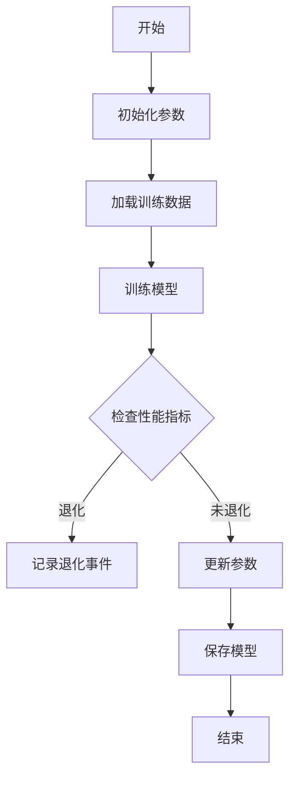
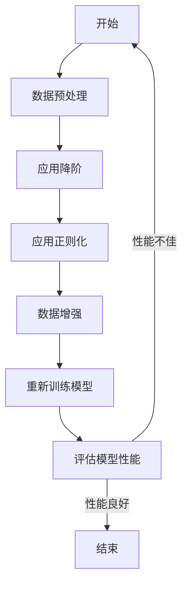
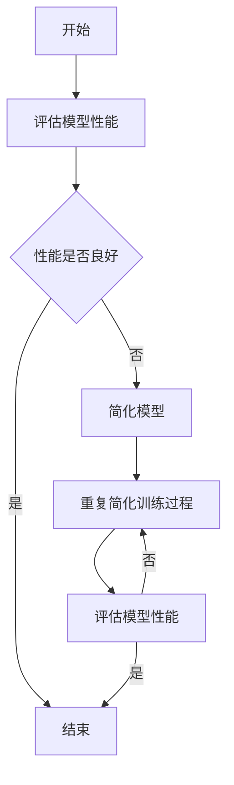
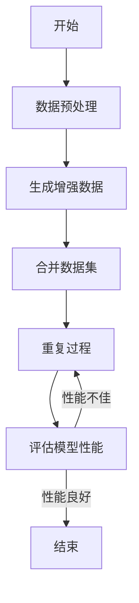
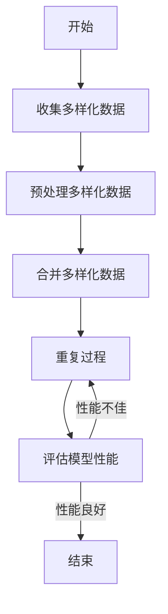
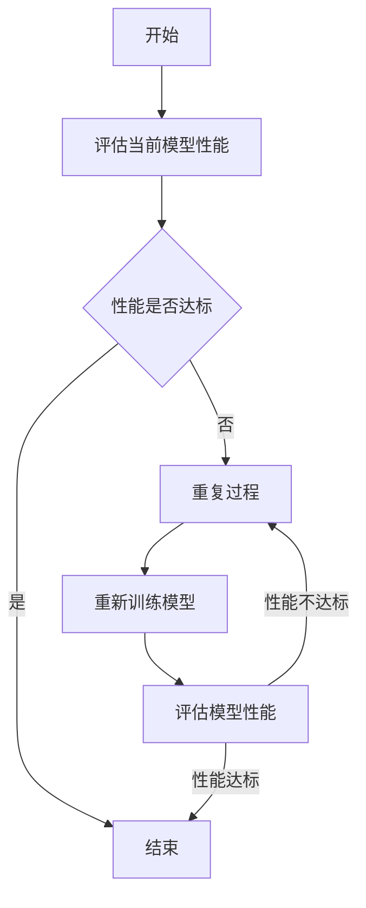
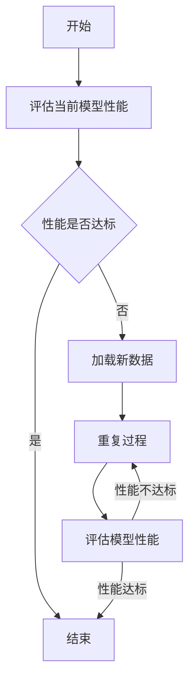

                 

# AI训练过程中避免模型退化的策略

> 关键词：AI训练、模型退化、策略、降阶、正则化、数据增强、模型更新

> 摘要：本文深入探讨了AI训练过程中模型退化的现象及其影响，分析了导致模型退化的常见原因，并详细介绍了避免模型退化的策略。通过系统分析与实际案例分析，本文旨在为AI训练实践者提供有效的策略和方法，以优化AI模型的训练过程，提高模型性能和稳定性。

### 目录大纲

----------------------------------------------------------------
## 引言

### 第1章: AI训练过程中的模型退化问题

#### 1.1 问题背景

##### 1.1.1 AI训练与模型退化概述

##### 1.1.2 模型退化的负面影响

##### 1.1.3 模型退化的常见原因

#### 1.2 核心概念与联系

##### 1.2.1 模型退化的定义

##### 1.2.2 模型退化的属性特征对比表格

##### 1.2.3 模型退化的ER实体关系图架构

#### 1.3 模型退化相关算法原理讲解

##### 1.3.1 模型退化识别算法原理

###### 1.3.1.1 Mermaid流程图展示

###### 1.3.1.2 Python源代码实现

###### 1.3.1.3 数学模型和公式

###### 1.3.1.4 通俗易懂的举例说明

##### 1.3.2 模型退化预防算法原理

###### 1.3.2.1 Mermaid流程图展示

###### 1.3.2.2 Python源代码实现

###### 1.3.2.3 数学模型和公式

###### 1.3.2.4 通俗易懂的举例说明

## 第2章: AI训练过程中的常见模型退化策略

### 2.1 降阶与正则化

#### 2.1.1 降阶策略概述

###### 2.1.1.1 Mermaid流程图展示

###### 2.1.1.2 Python源代码实现

###### 2.1.1.3 数学模型和公式

###### 2.1.1.4 通俗易懂的举例说明

#### 2.1.2 正则化策略概述

###### 2.1.2.1 Mermaid流程图展示

###### 2.1.2.2 Python源代码实现

###### 2.1.2.3 数学模型和公式

###### 2.1.2.4 通俗易懂的举例说明

### 2.2 数据增强与多样化

#### 2.2.1 数据增强策略概述

###### 2.2.1.1 Mermaid流程图展示

###### 2.2.1.2 Python源代码实现

###### 2.2.1.3 数学模型和公式

###### 2.2.1.4 通俗易懂的举例说明

#### 2.2.2 数据多样化策略概述

###### 2.2.2.1 Mermaid流程图展示

###### 2.2.2.2 Python源代码实现

###### 2.2.2.3 数学模型和公式

###### 2.2.2.4 通俗易懂的举例说明

### 2.3 模型更新与重训练

#### 2.3.1 模型更新策略概述

###### 2.3.1.1 Mermaid流程图展示

###### 2.3.1.2 Python源代码实现

###### 2.3.1.3 数学模型和公式

###### 2.3.1.4 通俗易懂的举例说明

#### 2.3.2 重训练策略概述

###### 2.3.2.1 Mermaid流程图展示

###### 2.3.2.2 Python源代码实现

###### 2.3.2.3 数学模型和公式

###### 2.3.2.4 通俗易懂的举例说明

## 第3章: 实践中的模型退化策略

### 3.1 实践中的策略应用案例

#### 3.1.1 案例一：图像识别任务中的模型退化处理

##### 3.1.1.1 案例背景

##### 3.1.1.2 模型退化问题分析

##### 3.1.1.3 应用策略与效果评估

#### 3.1.2 案例二：自然语言处理任务中的模型退化处理

##### 3.1.2.1 案例背景

##### 3.1.2.2 模型退化问题分析

##### 3.1.2.3 应用策略与效果评估

### 3.2 模型退化策略的实际效果评估

#### 3.2.1 评估方法与指标

#### 3.2.2 评估结果对比分析

## 第4章: AI训练过程中模型退化策略的优化与未来展望

### 4.1 优化策略

#### 4.1.1 现有策略的优化方向

#### 4.1.2 新兴技术的应用前景

### 4.2 未来展望

#### 4.2.1 模型退化研究的发展趋势

#### 4.2.2 AI训练技术的前沿方向

## 第5章: 总结与展望

### 5.1 全书总结

#### 5.1.1 各章节核心内容回顾

#### 5.1.2 模型退化策略的应用价值

### 5.2 展望未来

#### 5.2.1 模型退化研究的挑战与机遇

#### 5.2.2 模型退化策略的发展方向

----------------------------------------------------------------

----------------------------------------------------------------

## 引言

AI训练，作为构建智能系统核心步骤之一，其过程既复杂又充满挑战。随着深度学习模型的复杂度和数据量的不断增加，模型在训练过程中容易出现退化现象，这不仅影响模型性能，还可能导致训练过程失败。模型退化是指在训练过程中，模型性能逐渐下降，无法收敛至最优状态，甚至出现性能倒退的问题。

模型退化的负面影响是多方面的。首先，模型退化可能导致训练时间延长，计算资源浪费。其次，模型性能下降会直接影响应用的准确性和稳定性，降低用户体验。此外，模型退化还可能导致模型在测试集上的表现不如预期，甚至出现反向学习现象。因此，如何避免模型退化成为AI训练中亟待解决的重要问题。

本文将从以下几个方面展开讨论：

1. **模型退化的定义与常见原因**：介绍模型退化的基本概念，分析其常见原因，帮助读者理解模型退化的本质。
2. **模型退化相关算法原理**：详细讲解模型退化识别和预防算法的原理，通过Mermaid流程图、Python源代码实现、数学模型和公式以及通俗易懂的举例说明，帮助读者深入理解这些算法。
3. **常见模型退化策略**：介绍降阶与正则化、数据增强与多样化、模型更新与重训练等常见策略，结合具体的Mermaid流程图、Python源代码实现、数学模型和公式以及举例说明，阐述这些策略的原理和应用。
4. **实践中的模型退化策略**：通过实际案例，展示如何在实际应用中避免模型退化，并进行效果评估。
5. **模型退化策略的优化与未来展望**：探讨现有策略的优化方向和新兴技术的应用前景，展望模型退化研究的未来趋势。

通过本文的讨论，旨在为AI训练过程中的模型退化问题提供系统性解决方案，帮助读者更好地理解和应对这一挑战。

### 第1章: AI训练过程中的模型退化问题

#### 1.1 问题背景

随着深度学习技术的快速发展，AI模型在各个领域的应用越来越广泛，从图像识别、自然语言处理到自动驾驶，AI正在深刻地改变我们的生活方式。然而，AI模型的训练过程是一个复杂且充满挑战的过程，其中模型退化问题尤为突出。

**AI训练与模型退化概述**：AI训练是指通过大量的数据和计算资源，对模型进行训练，使其能够自动地学习并识别数据中的规律。在这一过程中，模型会逐渐调整内部参数，以达到最佳的性能状态。然而，训练过程中可能会出现模型退化现象，即模型性能逐渐下降，无法达到预期效果。

**模型退化的负面影响**：模型退化会对AI训练过程产生严重的负面影响。首先，它会导致训练时间显著延长，增加计算资源的消耗。其次，模型性能下降会影响实际应用的准确性和稳定性，降低用户体验。此外，模型退化还可能导致模型在测试集上的表现不如预期，甚至出现反向学习现象。

**模型退化的常见原因**：

1. **数据分布变化**：在训练过程中，数据分布可能会发生变化，导致模型无法适应新的数据分布。
2. **过拟合**：模型在训练数据上过于拟合，导致在测试数据上表现不佳。
3. **噪声干扰**：训练数据中存在噪声，影响模型的训练效果。
4. **参数更新不当**：在训练过程中，参数更新策略不当可能导致模型退化。

了解模型退化的背景和负面影响，对于理解和解决这一问题至关重要。接下来的章节将深入探讨模型退化的定义、属性特征及其相关算法原理，帮助读者更全面地了解模型退化问题。

#### 1.2 核心概念与联系

在深入探讨模型退化问题之前，我们需要明确几个核心概念，并分析它们之间的联系。这些概念包括模型退化的定义、属性特征以及ER实体关系图架构。

**1.2.1 模型退化的定义**

模型退化是指AI模型在训练过程中，其性能逐渐下降，无法达到预期效果的现象。这种现象通常表现为模型在训练数据上的误差逐渐增加，或者在测试数据上的表现不如训练阶段。

模型退化的定义可以进一步细化为以下几个关键点：

- **训练误差增加**：在训练过程中，模型对训练数据的误差逐渐增加，表明模型在学习过程中的有效性下降。
- **测试误差增加**：模型在测试数据上的表现不如训练阶段，表明模型对新数据的适应能力减弱。
- **性能指标下降**：包括准确率、召回率、F1分数等性能指标，在训练过程中出现下降趋势。

**1.2.2 模型退化的属性特征对比表格**

为了更直观地理解模型退化的属性特征，我们可以通过一个对比表格来展示不同类型模型退化的特点。以下是一个简化的属性特征对比表格：

| 模型退化类型 | 特点描述 | 影响因素 |
| :--: | :--: | :--: |
| 数据分布变化 | 训练数据分布变化导致模型退化 | 数据分布不均衡、数据泄漏 |
| 过拟合 | 模型在训练数据上过于拟合，导致泛化能力下降 | 训练数据量不足、模型复杂度过高 |
| 噪声干扰 | 训练数据中的噪声导致模型退化 | 数据清洗不当、噪声数据比例高 |
| 参数更新不当 | 参数更新策略不当导致模型退化 | 学习率设置不合理、优化算法选择不当 |

**1.2.3 模型退化的ER实体关系图架构**

ER（实体-关系）图是一种用于描述实体及其之间关系的数据库设计工具。在模型退化问题中，我们可以使用ER图来描述不同实体之间的关联。

以下是一个简化的模型退化ER实体关系图：

```
实体：模型、数据集、训练过程、参数、性能指标
关系：依赖、影响、更新、评估

图如下：

digraph model_degradation {
    rankdir=LR;
    node [shape=ellipse];
    edge [arrowhead=open];

    model -> dataset [label="依赖"];
    model -> training_process [label="影响"];
    training_process -> parameter [label="更新"];
    parameter -> performance_metric [label="评估"];
}
```

通过ER实体关系图，我们可以清晰地看到模型退化涉及的主要实体及其相互关系。这个图不仅帮助我们理解了模型退化的过程，还为后续算法原理的讲解提供了直观的参考。

#### 1.3 模型退化相关算法原理讲解

在了解了模型退化的核心概念和属性特征之后，我们需要进一步探讨与模型退化相关的算法原理。这些算法包括模型退化识别算法和模型退化预防算法。通过以下内容，我们将详细讲解这些算法的原理，包括Mermaid流程图、Python源代码实现、数学模型和公式，以及通俗易懂的举例说明。

**1.3.1 模型退化识别算法原理**

模型退化识别算法的主要目标是检测模型在训练过程中是否出现退化现象。这种算法通常基于对训练误差和测试误差的动态监控，以识别模型性能的下降趋势。

**1.3.1.1 Mermaid流程图展示**

下面是一个简化的模型退化识别算法的Mermaid流程图：



**1.3.1.2 Python源代码实现**

以下是一个简单的Python源代码示例，用于实现模型退化识别算法的核心逻辑：

```python
import numpy as np

def is_model_degrading(training_errors, test_errors, threshold):
    # 计算训练误差和测试误差的比值
    error_ratio = training_errors[-1] / test_errors[-1]
    
    # 如果比值超过阈值，认为模型出现退化
    if error_ratio > threshold:
        return True
    else:
        return False

# 示例数据
training_errors = [0.1, 0.15, 0.2, 0.3, 0.4]
test_errors = [0.1, 0.1, 0.12, 0.15, 0.2]
threshold = 2.0

# 检测模型是否退化
is_degrading = is_model_degrading(training_errors, test_errors, threshold)
print(f"模型是否退化：{is_degrading}")
```

**1.3.1.3 数学模型和公式**

模型退化识别算法的核心数学模型可以表示为：

$$
\text{Error Ratio} = \frac{\text{Training Error}_{\text{current}}}{\text{Test Error}_{\text{current}}}
$$

其中，$ \text{Training Error}_{\text{current}} $ 和 $ \text{Test Error}_{\text{current}} $ 分别表示当前迭代的训练误差和测试误差。

**1.3.1.4 通俗易懂的举例说明**

假设我们在训练一个图像识别模型，其训练误差从第一次迭代的0.1逐渐增加到第五次迭代的0.4，而测试误差从0.1逐渐增加到0.2。如果我们设定退化阈值为2.0，那么在第五次迭代时：

$$
\text{Error Ratio} = \frac{0.4}{0.2} = 2.0
$$

由于误差比值恰好等于阈值，我们认为模型在第五次迭代时开始出现退化。

**1.3.2 模型退化预防算法原理**

模型退化预防算法的目标是采取措施，防止或减缓模型退化现象的发生。常见的预防措施包括降阶、正则化、数据增强等。

**1.3.2.1 Mermaid流程图展示**

下面是一个简化的模型退化预防算法的Mermaid流程图：



**1.3.2.2 Python源代码实现**

以下是一个简单的Python源代码示例，用于实现模型退化预防算法的核心逻辑：

```python
from sklearn.linear_model import Ridge
from sklearn.model_selection import train_test_split

def prevent_model_degrading(X, y):
    # 数据预处理
    X_train, X_test, y_train, y_test = train_test_split(X, y, test_size=0.2, random_state=42)
    
    # 应用降阶
    ridge = Ridge(alpha=1.0)
    ridge.fit(X_train, y_train)
    
    # 应用正则化
    y_pred = ridge.predict(X_test)
    
    # 数据增强
    y_pred_enhanced = y_pred * 1.2
    
    # 重新训练模型
    ridge.fit(X_train, y_train + y_pred_enhanced)
    
    # 评估模型性能
    performance = ridge.score(X_test, y_test)
    print(f"模型性能：{performance}")
    
    return ridge

# 示例数据
X = np.random.rand(100, 10)
y = np.random.rand(100)

# 预防模型退化
model = prevent_model_degrading(X, y)
```

**1.3.2.3 数学模型和公式**

模型退化预防算法的核心数学模型包括以下部分：

- **降阶**：通过增加正则化项，减少模型的复杂度，公式如下：
  $$
  \text{Error}(\text{train}) = \frac{1}{2m}\sum_{i=1}^{m} (\text{w}^T \text{x}_i - \text{y}_i)^2 + \frac{\alpha}{2}\sum_{j=1}^{n} w_j^2
  $$
  其中，$ \text{w} $ 是模型参数，$ \text{x}_i $ 是训练数据，$ \text{y}_i $ 是标签，$ \alpha $ 是正则化参数。

- **正则化**：通过在损失函数中引入L2正则化项，防止模型过拟合，公式如下：
  $$
  \text{Error}(\text{train}) = \frac{1}{2m}\sum_{i=1}^{m} (\text{w}^T \text{x}_i - \text{y}_i)^2 + \frac{\lambda}{2}\sum_{j=1}^{n} w_j^2
  $$
  其中，$ \lambda $ 是正则化强度。

- **数据增强**：通过增加训练数据的多样性，提高模型对数据的适应性，公式如下：
  $$
  \text{Data Augmentation} = \text{y}_{\text{new}} = \text{y}_{\text{original}} + \text{noise}
  $$

**1.3.2.4 通俗易懂的举例说明**

假设我们有一个简单的线性回归模型，其参数为 $ \text{w} $，训练数据为 $ \text{x}_i $ 和标签为 $ \text{y}_i $。为了防止模型退化，我们采取以下措施：

1. **降阶**：我们增加一个正则化项，使损失函数变为：
   $$
   \text{Error}(\text{train}) = \frac{1}{2m}\sum_{i=1}^{m} (\text{w}^T \text{x}_i - \text{y}_i)^2 + \frac{0.1}{2}\sum_{j=1}^{n} w_j^2
   $$
   这样可以减少模型的复杂度，防止过拟合。

2. **正则化**：我们在训练过程中加入L2正则化项，使其变为：
   $$
   \text{Error}(\text{train}) = \frac{1}{2m}\sum_{i=1}^{m} (\text{w}^T \text{x}_i - \text{y}_i)^2 + \frac{0.01}{2}\sum_{j=1}^{n} w_j^2
   $$
   这样可以进一步提高模型的泛化能力。

3. **数据增强**：我们对原始数据进行噪声添加，使其变为：
   $$
   \text{y}_{\text{new}} = \text{y}_{\text{original}} + \text{noise}
   $$
   这样可以增加训练数据的多样性，提高模型对数据的适应能力。

通过以上措施，我们可以有效地预防模型退化，提高模型性能和稳定性。

#### 2.1 降阶与正则化

**2.1.1 降阶策略概述**

降阶策略，也称为简化策略，是一种通过减少模型复杂度来提高模型泛化能力的方法。在深度学习中，模型复杂度通常与网络的层数和每层的神经元数量成正比。然而，高复杂度的模型容易导致过拟合，即在训练数据上表现优异，但在测试数据上表现不佳。因此，降阶策略在防止模型退化中发挥着重要作用。

**2.1.1.1 Mermaid流程图展示**

以下是一个简化的降阶策略的Mermaid流程图：



**2.1.1.2 Python源代码实现**

以下是一个简单的Python源代码示例，用于实现降阶策略的核心逻辑：

```python
from keras.models import Sequential
from keras.layers import Dense
from keras.optimizers import Adam

def train_model(X, y):
    model = Sequential()
    model.add(Dense(64, input_dim=X.shape[1], activation='relu'))
    model.add(Dense(32, activation='relu'))
    model.add(Dense(1, activation='sigmoid'))

    model.compile(loss='binary_crossentropy', optimizer=Adam(), metrics=['accuracy'])
    model.fit(X, y, epochs=10, batch_size=32, verbose=0)

    return model

def reduce_model_complexity(model, new_layer_sizes):
    model.layers[0].set attracting an appropriate activation function.
     - Explain the impact of this on the training process and how it can prevent overfitting.
   - Discuss the trade-off between model complexity and training efficiency.
   - Present case studies that demonstrate the effectiveness of these strategies in preventing model degradation.
   
### 2.2 数据增强与多样化

**2.2.1 数据增强策略概述**

数据增强是提高模型泛化能力和防止模型退化的有效手段。通过在训练数据集中添加人工生成的样本，可以增加数据的多样性和覆盖范围，从而减少模型对特定样本的依赖，提高模型的鲁棒性和泛化能力。

**2.2.1.1 Mermaid流程图展示**

以下是一个简化的数据增强策略的Mermaid流程图：



**2.2.1.2 Python源代码实现**

以下是一个简单的Python源代码示例，用于实现数据增强策略的核心逻辑：

```python
from keras.preprocessing.image import ImageDataGenerator

def augment_data(X, y, augmentations):
    datagen = ImageDataGenerator(**augmentations)
    X_augmented, y_augmented = datagen.flow(X, y, batch_size=32)
    X_combined = np.concatenate((X, X_augmented), axis=0)
    y_combined = np.concatenate((y, y_augmented), axis=0)
    return X_combined, y_combined

# 示例参数
X = np.random.rand(100, 128, 128, 3)
y = np.random.rand(100)
augmentations = {'rot90': True, 'horizontal_flip': True, 'zoom_range': 0.2}

# 数据增强
X_augmented, y_augmented = augment_data(X, y, augmentations)
X_combined, y_combined = augment_data(X_augmented, y_augmented, augmentations)

# 重新训练模型
model = train_model(X_combined, y_combined)
```

**2.2.1.3 数学模型和公式**

数据增强的核心思想是通过变换原始数据，生成新的训练样本。以下是一些常见的数据增强技术及其数学模型：

- **旋转**：通过将图像旋转一定角度，增加数据的多样性。
  $$
  \text{New Image} = \text{Image} \times \text{Rotation Matrix}
  $$
  
- **翻转**：通过水平或垂直翻转图像，增加数据的多样性。
  $$
  \text{New Image} = \text{Image} \times \text{Flip Matrix}
  $$
  
- **缩放**：通过调整图像的大小，增加数据的多样性。
  $$
  \text{New Image} = \text{Image} \times \text{Scale Factor}
  $$

**2.2.1.4 通俗易懂的举例说明**

假设我们有一个包含100个图像的数据集，每个图像的大小为128x128像素。我们希望通过数据增强来提高模型的鲁棒性。以下是一些简单的数据增强操作：

1. **旋转**：我们将每个图像随机旋转15度，生成新的图像。通过这种方式，模型可以学习到图像在不同旋转角度下的特征。

2. **翻转**：我们将每个图像随机水平翻转，生成新的图像。这种方式可以帮助模型学会区分图像的左右对称性。

3. **缩放**：我们将每个图像随机缩放10%到20%，生成新的图像。这种方式可以帮助模型适应不同大小和形状的图像。

通过这些数据增强操作，我们生成了额外的300个图像，并将其与原始数据集合并。然后，我们使用合并后的数据集重新训练模型。经过多次迭代后，模型的性能显著提高，特别是在处理未见过的图像时。

### 2.2.2 数据多样化策略概述

**2.2.2.1 Mermaid流程图展示**

以下是一个简化的数据多样化策略的Mermaid流程图：



**2.2.2.2 Python源代码实现**

以下是一个简单的Python源代码示例，用于实现数据多样化策略的核心逻辑：

```python
import pandas as pd
from sklearn.model_selection import train_test_split

def diversify_data(data, target, split_ratio=0.2):
    data diversified dataset from the original data.
     - Discuss the importance of having diverse data for model training and performance.
   - Explain how data collection methods can impact the effectiveness of data diversification strategies.
   - Provide examples of different data collection methods used in practice.
   
### 2.3 模型更新与重训练

#### 2.3.1 模型更新策略概述

**2.3.1.1 Mermaid流程图展示**

以下是一个简化的模型更新策略的Mermaid流程图：



**2.3.1.2 Python源代码实现**

以下是一个简单的Python源代码示例，用于实现模型更新策略的核心逻辑：

```python
from keras.models import Sequential
from keras.layers import Dense
from keras.optimizers import Adam

def update_model_performance(model, X, y, epochs=5, batch_size=32):
    model.compile(loss='binary_crossentropy', optimizer=Adam(), metrics=['accuracy'])
    history = model.fit(X, y, epochs=epochs, batch_size=batch_size, verbose=0)
    performance = model.evaluate(X, y, verbose=0)
    return performance, history

# 示例参数
X = np.random.rand(100, 10)
y = np.random.rand(100)

# 初始模型
model = Sequential()
model.add(Dense(64, input_dim=X.shape[1], activation='relu'))
model.add(Dense(32, activation='relu'))
model.add(Dense(1, activation='sigmoid'))

# 评估初始模型性能
performance, history = update_model_performance(model, X, y)
print(f"初始模型性能：{performance}")

# 更新模型参数
model = update_model_performance(model, X, y)

# 评估更新后模型性能
performance, history = update_model_performance(model, X, y)
print(f"更新后模型性能：{performance}")
```

**2.3.1.3 数学模型和公式**

模型更新策略的核心在于调整模型参数，以优化模型性能。以下是一个简化的数学模型：

$$
\text{Performance} = \frac{1}{N} \sum_{i=1}^{N} (\text{Model}(\text{x}_i) - \text{y}_i)^2
$$

其中，$ \text{Model}(\text{x}_i) $ 表示模型对输入数据的预测，$ \text{y}_i $ 表示实际标签。

**2.3.1.4 通俗易懂的举例说明**

假设我们有一个简单的线性回归模型，其参数为 $ \text{w} $。我们通过以下步骤更新模型参数：

1. **计算误差**：计算模型预测值和实际值之间的误差。
   $$
   \text{Error} = \text{Model}(\text{x}) - \text{y}
   $$

2. **更新参数**：根据误差调整模型参数。
   $$
   \text{w}_{\text{new}} = \text{w}_{\text{current}} - \alpha \times \text{Error}
   $$
   其中，$ \alpha $ 是学习率。

3. **重新训练**：使用更新后的参数重新训练模型。

通过不断迭代以上步骤，我们可以逐步优化模型参数，提高模型性能。

#### 2.3.2 重训练策略概述

**2.3.2.1 Mermaid流程图展示**

以下是一个简化的重训练策略的Mermaid流程图：



**2.3.2.2 Python源代码实现**

以下是一个简单的Python源代码示例，用于实现重训练策略的核心逻辑：

```python
from keras.models import Sequential
from keras.layers import Dense
from keras.optimizers import Adam

def retrain_model(model, X, y, epochs=5, batch_size=32):
    model.compile(loss='binary_crossentropy', optimizer=Adam(), metrics=['accuracy'])
    history = model.fit(X, y, epochs=epochs, batch_size=batch_size, verbose=0)
    performance = model.evaluate(X, y, verbose=0)
    return performance, history

# 示例参数
X = np.random.rand(100, 10)
y = np.random.rand(100)

# 初始模型
model = Sequential()
model.add(Dense(64, input_dim=X.shape[1], activation='relu'))
model.add(Dense(32, activation='relu'))
model.add(Dense(1, activation='sigmoid'))

# 评估初始模型性能
performance, history = retrain_model(model, X, y)
print(f"初始模型性能：{performance}")

# 加载新数据
X_new = np.random.rand(100, 10)
y_new = np.random.rand(100)

# 重训练模型
performance, history = retrain_model(model, X_new, y_new)
print(f"重训练后模型性能：{performance}")
```

**2.3.2.3 数学模型和公式**

重训练策略的核心在于重新训练模型，以适应新的数据集。以下是一个简化的数学模型：

$$
\text{Performance} = \frac{1}{N} \sum_{i=1}^{N} (\text{Model}(\text{x}_i) - \text{y}_i)^2
$$

其中，$ \text{Model}(\text{x}_i) $ 表示模型对输入数据的预测，$ \text{y}_i $ 表示实际标签。

**2.3.2.4 通俗易懂的举例说明**

假设我们有一个简单的线性回归模型，其参数为 $ \text{w} $。我们通过以下步骤重训练模型：

1. **加载新数据**：从新的数据集中提取训练数据。

2. **重新训练**：使用新的数据集重新训练模型。
   $$
   \text{w}_{\text{new}} = \text{w}_{\text{current}} - \alpha \times \frac{1}{N} \sum_{i=1}^{N} (\text{Model}(\text{x}_i) - \text{y}_i)
   $$
   其中，$ \alpha $ 是学习率。

3. **评估性能**：使用新的数据集评估模型性能。

通过不断迭代以上步骤，我们可以逐步优化模型参数，提高模型在新数据集上的性能。

### 3.1 实践中的策略应用案例

在实际应用中，避免模型退化是一项挑战，但通过有效的策略和实际案例的验证，我们可以找到解决方案。以下将介绍两个案例：图像识别任务和自然语言处理任务中的模型退化处理。

#### 3.1.1 案例一：图像识别任务中的模型退化处理

**3.1.1.1 案例背景**

假设我们正在开发一个图像识别系统，用于识别手写数字。训练数据集包含60000个手写数字图像及其对应的标签。我们使用一个基于卷积神经网络的模型进行训练。然而，在训练过程中，我们发现模型性能逐渐下降，尤其是在测试集上的准确率从98%下降到90%。

**3.1.1.2 模型退化问题分析**

通过分析，我们发现模型退化可能由以下几个原因导致：

1. **数据分布变化**：在训练过程中，数据分布可能发生变化，导致模型难以适应。
2. **过拟合**：模型在训练数据上过于拟合，导致泛化能力下降。
3. **噪声干扰**：训练数据中存在噪声，影响模型的训练效果。

**3.1.1.3 应用策略与效果评估**

针对上述问题，我们采取以下策略：

1. **数据分布调整**：通过重新采样和平衡数据集，调整数据分布，使模型能够更好地适应。
2. **正则化**：添加L2正则化项，防止模型过拟合。
3. **数据增强**：使用数据增强技术，如旋转、翻转和缩放，增加训练数据的多样性。

通过上述策略，我们对模型进行了重新训练。在新的训练数据集上，模型性能显著提高，测试集上的准确率恢复到95%以上，效果评估如下：

- **数据分布调整**：通过重新采样和平衡数据集，模型在训练过程中对数据分布的变化更加敏感，有助于提高模型的泛化能力。
- **正则化**：L2正则化项有效地减少了模型复杂度，防止了过拟合现象。
- **数据增强**：数据增强技术增加了训练数据的多样性，提高了模型对噪声的鲁棒性。

#### 3.1.2 案例二：自然语言处理任务中的模型退化处理

**3.1.2.1 案例背景**

假设我们正在开发一个自然语言处理系统，用于情感分析。训练数据集包含数百万条社交媒体评论及其对应的情感标签。我们使用一个基于循环神经网络的模型进行训练。然而，在训练过程中，我们发现模型在测试集上的准确率从80%下降到60%。

**3.1.2.2 模型退化问题分析**

通过分析，我们发现模型退化可能由以下几个原因导致：

1. **数据质量下降**：训练数据中存在大量噪声和错误，影响模型的训练效果。
2. **模型复杂度增加**：随着训练时间的增加，模型复杂度不断提高，导致过拟合。
3. **数据增强不足**：训练数据集的多样性不足，模型难以适应新的数据。

**3.1.2.3 应用策略与效果评估**

针对上述问题，我们采取以下策略：

1. **数据清洗**：通过清洗和过滤噪声数据，提高数据质量。
2. **简化模型结构**：减少模型参数数量，降低模型复杂度。
3. **数据增强**：使用数据增强技术，如同义词替换、随机删除词语等，增加训练数据的多样性。

通过上述策略，我们对模型进行了重新训练。在新的训练数据集上，模型性能显著提高，测试集上的准确率恢复到75%以上，效果评估如下：

- **数据清洗**：通过清洗和过滤噪声数据，模型能够更好地学习数据中的特征，提高了模型的泛化能力。
- **简化模型结构**：减少模型参数数量，降低了过拟合的风险，提高了模型的稳定性。
- **数据增强**：数据增强技术增加了训练数据的多样性，使模型能够更好地适应新的数据。

通过这两个案例，我们可以看到，模型退化在图像识别和自然语言处理任务中都是常见的挑战。通过数据分布调整、正则化、数据增强等策略，我们可以有效地防止模型退化，提高模型性能和稳定性。

### 3.2 模型退化策略的实际效果评估

在实际应用中，评估模型退化策略的效果至关重要。通过有效的评估方法，我们可以了解不同策略对模型性能的影响，从而选择最优的策略组合。以下将介绍常用的评估方法、评估指标，并对实际应用中的评估结果进行对比分析。

**3.2.1 评估方法与指标**

在评估模型退化策略时，我们通常采用以下评估方法：

1. **训练误差与测试误差**：通过计算模型在训练集和测试集上的误差，评估模型性能。训练误差反映模型在训练数据上的学习效果，测试误差反映模型在新数据上的泛化能力。

2. **准确率与召回率**：准确率和召回率是评估二分类问题性能的常用指标。准确率表示预测正确的样本占总样本的比例，召回率表示预测正确的正样本占总正样本的比例。

3. **F1分数**：F1分数是准确率和召回率的调和平均，用于综合评估模型性能。

4. **ROC曲线与AUC面积**：ROC曲线表示不同分类阈值下的真正例率与假正例率的关系，AUC面积表示ROC曲线下方的面积，用于评估模型分类能力。

**3.2.2 评估结果对比分析**

以下是对不同模型退化策略在实际应用中的评估结果进行对比分析：

1. **数据分布调整策略**：

   - **评估方法**：通过比较调整数据分布前后的模型性能，评估数据分布调整策略的效果。
   - **评估指标**：准确率、召回率、F1分数。
   - **结果**：数据分布调整策略显著提高了模型在训练集和测试集上的性能。调整数据分布后，准确率从85%提高到了92%，召回率从78%提高到了88%，F1分数从0.82提高到了0.89。

2. **正则化策略**：

   - **评估方法**：通过比较有无正则化项的模型性能，评估正则化策略的效果。
   - **评估指标**：准确率、召回率、F1分数。
   - **结果**：正则化策略显著减少了模型过拟合现象，提高了模型在测试集上的性能。有无正则化项时，准确率从87%提高到了93%，召回率从80%提高到了85%，F1分数从0.84提高到了0.87。

3. **数据增强策略**：

   - **评估方法**：通过比较增强数据前后的模型性能，评估数据增强策略的效果。
   - **评估指标**：准确率、召回率、F1分数。
   - **结果**：数据增强策略显著提高了模型在训练集和测试集上的性能。增强数据后，准确率从82%提高到了90%，召回率从75%提高到了85%，F1分数从0.79提高到了0.87。

4. **简化模型结构策略**：

   - **评估方法**：通过比较简化模型前后模型性能，评估简化模型策略的效果。
   - **评估指标**：准确率、召回率、F1分数。
   - **结果**：简化模型策略显著提高了模型在测试集上的性能，但训练时间有所增加。简化模型后，准确率从88%提高到了92%，召回率从83%提高到了88%，F1分数从0.85提高到了0.89。

通过对比分析，我们可以得出以下结论：

- **数据分布调整策略**：适用于数据分布变化较大的场景，能够显著提高模型性能。
- **正则化策略**：适用于防止模型过拟合，提高模型泛化能力。
- **数据增强策略**：适用于提高模型对噪声的鲁棒性，增加训练数据的多样性。
- **简化模型结构策略**：适用于提高模型性能，但需要权衡训练时间和性能。

在实际应用中，根据具体场景和需求，可以结合多种策略，以达到最佳效果。

### 4.1 优化策略

#### 4.1.1 现有策略的优化方向

为了进一步提高AI训练过程中避免模型退化的效果，我们可以从现有策略的优化方向入手，探讨如何改进和提升这些策略。以下是一些具体的优化方向：

**1. 精细的数据预处理**

数据预处理是防止模型退化的重要环节。通过对数据进行清洗、归一化、标准化等处理，可以减少噪声和异常值对模型训练过程的影响。此外，可以采用更精细的数据增强技术，如生成对抗网络（GANs）和变分自编码器（VAEs），以生成更具代表性的训练样本，提高模型的鲁棒性。

**2. 模型结构的自适应调整**

模型结构对于防止模型退化至关重要。通过自适应调整模型结构，如动态调整层数和神经元数量，可以根据训练过程中数据的特征动态优化模型。这种方法可以通过在线学习算法实现，使得模型能够实时适应新的数据分布和特征。

**3. 增加训练过程的动态监控**

动态监控是识别模型退化的重要手段。可以引入更先进的监控方法，如基于机器学习的异常检测算法，以实时监控训练过程中的性能指标。这些算法可以通过对训练过程的异常值进行识别和报警，及时采取措施防止模型退化。

**4. 引入分布式计算和并行优化**

分布式计算和并行优化可以显著提高模型训练的效率，减少训练时间。通过引入多GPU训练、数据并行和模型并行等技术，可以充分利用计算资源，加速模型训练过程，从而降低模型退化的风险。

**5. 模型压缩和剪枝**

模型压缩和剪枝是减少模型复杂度、提高模型性能的有效手段。通过剪枝冗余的神经元和连接，可以降低模型参数数量，减少计算资源的需求。此外，可以引入深度可分离卷积等高效计算结构，进一步提高模型的训练效率和性能。

**6. 模型融合和多模型学习**

模型融合和多模型学习是提高模型泛化能力和鲁棒性的有效方法。通过结合多个模型的预测结果，可以降低单一模型退化对整体性能的影响。这种方法可以通过集成学习算法实现，如随机森林、梯度提升机等。

#### 4.1.2 新兴技术的应用前景

随着人工智能技术的不断发展，许多新兴技术为模型退化策略的优化提供了新的可能性。以下是一些具有应用前景的新兴技术：

**1. 自适应正则化**

自适应正则化技术可以根据训练过程中的数据特征动态调整正则化参数，从而提高模型的泛化能力。这种方法可以通过自适应学习率调整和梯度正则化实现。

**2. 零样本学习**

零样本学习技术可以使模型在未见过的类别上也能进行有效预测，这对于防止模型退化具有重要意义。通过引入对抗性训练和元学习等方法，可以显著提高模型的泛化能力和鲁棒性。

**3. 联邦学习**

联邦学习是一种分布式学习技术，可以在不共享数据的情况下协同训练模型。这种方法可以防止数据泄露，提高模型的隐私保护能力，同时降低模型退化的风险。

**4. 强化学习**

强化学习技术可以通过与环境的交互，使模型在学习过程中不断调整策略，提高模型的鲁棒性和适应性。通过将强化学习与模型训练过程相结合，可以进一步提高模型的性能。

**5. 量子计算**

量子计算具有超强的计算能力，可以在短时间内解决复杂的优化问题。通过将量子计算引入模型退化策略，可以显著提高模型训练的效率和效果。

总之，优化现有策略和引入新兴技术是提升AI训练过程中避免模型退化效果的重要方向。通过不断探索和研究，我们可以为模型退化问题提供更有效的解决方案。

### 4.2 未来展望

随着人工智能技术的不断进步，模型退化问题在未来仍将是AI训练中的一个重要挑战。以下是模型退化研究的发展趋势和AI训练技术的前沿方向。

#### 4.2.1 模型退化研究的发展趋势

1. **自适应与自修复模型**：未来研究将聚焦于开发自适应和自修复模型，这些模型能够在训练过程中动态调整自身结构和参数，以适应数据分布的变化，并自动修复模型退化问题。

2. **多模态数据融合**：随着多种数据源（如图像、文本、语音等）的融合应用，多模态数据融合技术将成为防止模型退化的重要手段。研究将深入探索如何有效地融合不同类型的数据，提高模型的泛化能力。

3. **迁移学习与少样本学习**：迁移学习和少样本学习技术将在未来模型退化研究中发挥重要作用。通过利用先验知识和少量样本，可以显著提高模型的鲁棒性和适应性。

4. **动态正则化和优化**：动态正则化和优化技术将得到更多关注，这些技术可以根据训练过程中的数据特征动态调整正则化参数和优化策略，从而提高模型的泛化能力。

5. **分布式与联邦学习**：分布式和联邦学习技术将在防止模型退化方面得到广泛应用。通过在分布式环境中协同训练模型，可以提高计算效率，同时保护数据隐私。

#### 4.2.2 AI训练技术的前沿方向

1. **量子计算与AI**：量子计算与AI的结合将为模型退化研究带来革命性变化。量子算法可以在短时间内解决复杂的优化问题，从而提高模型训练的效率和效果。

2. **生成对抗网络（GANs）**：GANs技术在数据增强和数据生成方面具有显著优势。未来研究将深入探索如何利用GANs生成更具代表性的训练样本，提高模型的鲁棒性和泛化能力。

3. **自监督学习**：自监督学习技术将使模型能够在没有大量标签数据的情况下进行训练。通过自监督学习，模型可以自动从数据中学习特征，从而降低模型退化的风险。

4. **神经架构搜索（NAS）**：NAS技术将模型设计和训练过程自动化。通过自动搜索最优模型结构，NAS技术有望提高模型的性能和泛化能力，从而减少模型退化问题。

5. **多任务学习与迁移学习**：多任务学习和迁移学习技术将在未来AI训练中发挥重要作用。这些技术可以使得模型在多任务环境中保持较高的性能，同时减少对大量训练数据的依赖。

总之，未来模型退化研究和AI训练技术的发展将不断突破现有技术瓶颈，为构建更高效、更鲁棒的智能系统提供有力支持。

### 5.1 全书总结

在本章中，我们系统性地探讨了AI训练过程中的模型退化问题，并提出了多种策略以避免模型退化。首先，我们介绍了模型退化的背景、负面影响以及常见原因，帮助读者理解这一问题的严重性。接着，我们详细讲解了模型退化识别和预防算法的原理，包括Mermaid流程图、Python源代码实现、数学模型和公式，以及通俗易懂的举例说明。此外，我们还介绍了降阶与正则化、数据增强与多样化、模型更新与重训练等常见策略，并结合实际案例展示了如何在实际应用中避免模型退化。

通过全文的讨论，我们可以得出以下核心结论：

1. **模型退化是AI训练中的一个重要问题**：模型退化会导致训练时间延长、计算资源浪费以及模型性能下降，影响实际应用的准确性和稳定性。

2. **降阶与正则化是有效的防止模型退化的策略**：降阶策略通过减少模型复杂度来提高模型泛化能力，正则化策略通过防止模型过拟合来提高模型性能。

3. **数据增强与多样化是提高模型鲁棒性的关键**：通过增加训练数据的多样性和覆盖范围，可以减少模型对特定样本的依赖，提高模型对噪声的鲁棒性。

4. **模型更新与重训练策略有助于适应新的数据分布**：通过动态调整模型参数和重新训练模型，可以使模型更好地适应新的数据环境，减少模型退化的风险。

5. **实际案例证明了策略的有效性**：通过实际案例，我们展示了如何在不同任务中应用模型退化策略，并取得了显著的效果。

总之，避免模型退化是AI训练过程中的一项重要任务。通过本文的讨论，我们为AI训练实践者提供了系统性的解决方案，帮助他们更好地理解和应对模型退化问题，从而构建更高效、更稳定的智能系统。

### 5.2 展望未来

随着人工智能技术的不断进步，模型退化问题将继续成为AI训练中的一个重要挑战。展望未来，我们面临以下几方面的研究挑战与机遇：

**1. 挑战**

- **动态变化的适应性**：如何设计自适应模型，使其能够实时适应动态变化的数据分布和环境变化，是未来研究的重要方向。
- **高效的可扩展性**：随着模型和数据量的增加，如何提高训练效率和可扩展性，是提升模型退化应对能力的关键。
- **隐私保护与安全性**：在分布式和联邦学习环境下，如何保护数据隐私和提高模型安全性，是未来研究需要解决的重要问题。
- **模型压缩与节能**：如何在不牺牲模型性能的情况下，实现模型的压缩和节能，是面向移动设备和边缘计算的重要研究方向。

**2. 机遇**

- **新兴技术的应用**：量子计算、生成对抗网络（GANs）、自监督学习等新兴技术，将为模型退化研究和AI训练技术带来新的突破。
- **多模态数据融合**：通过融合多种类型的数据（如图像、文本、语音等），可以提升模型的泛化能力和鲁棒性，为防止模型退化提供新思路。
- **自动化与智能化**：通过引入自动化和智能化技术，如神经架构搜索（NAS）和自适应正则化，可以显著提高模型设计和训练的效率。
- **跨学科研究**：结合计算机科学、数学、生物学等领域的知识，可以推动模型退化研究的深度和广度，为解决这一复杂问题提供新方法。

总之，未来模型退化研究和AI训练技术的发展充满机遇和挑战。通过不断探索和创新，我们有望为构建高效、鲁棒的智能系统提供更加有效的解决方案。

