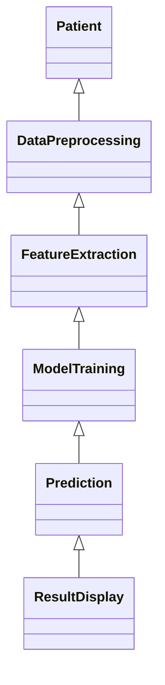
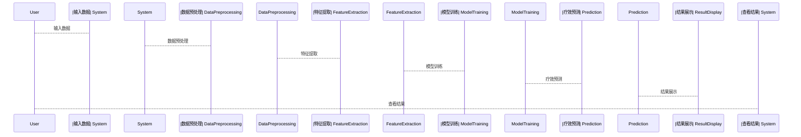
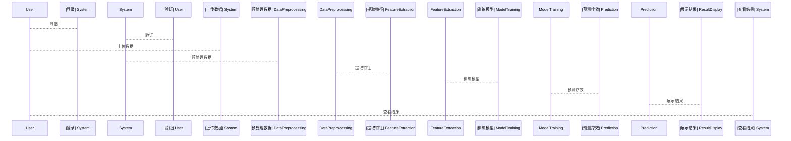

                 


### 第1章 引言

#### 1.1 个性化免疫治疗的发展背景

个性化免疫治疗，作为现代医学研究的重要领域，近年来取得了显著的进展。其核心思想是根据患者的具体病情、基因类型以及免疫状态，定制出最合适的治疗方案。这一理念的提出源于对传统治疗方式局限性的反思。传统治疗往往采用“一刀切”的方式，无法充分考虑个体差异，导致治疗效果不一，甚至可能出现副作用。

免疫治疗的历史可以追溯到20世纪70年代，当时科学家们首次提出利用患者自身的免疫系统来对抗疾病。经过几十年的发展，免疫治疗已经从最初的肿瘤治疗扩展到各种疾病，如自身免疫病、病毒感染等。近年来，随着基因组学和生物信息学的飞速发展，个性化免疫治疗开始迈向一个新的阶段。

AI技术的引入，使得个性化免疫治疗方案设计更加精准和高效。通过分析大量的生物医学数据，AI能够快速识别出患者免疫系统的特点，预测不同治疗方案的效果，从而为医生提供有力支持。

#### 1.2 AI在医疗领域的应用现状

AI在医疗领域的应用已经相当广泛，从诊断、治疗到康复，各个环节都有AI的身影。特别是在个性化治疗方面，AI展现出了其独特的优势。通过机器学习算法，AI能够从海量的医疗数据中提取出有用的信息，进行模式识别和预测。

目前，AI在医疗领域的应用主要包括以下几个方面：

1. **疾病诊断**：AI可以通过分析医学影像，如X光、CT、MRI等，提高诊断的准确率。例如，AI系统可以在几秒钟内分析出肺部CT图像中的异常区域，这对于早期肺癌的诊断具有重要意义。

2. **个性化治疗**：AI可以根据患者的基因信息、病史等数据，为其定制出最合适的治疗方案。例如，AI可以分析患者的免疫基因，预测其对某种免疫治疗的反应，从而调整治疗方案。

3. **药物研发**：AI可以加速药物研发过程，通过预测药物与生物体的相互作用，筛选出具有潜力的药物候选。

4. **医疗管理**：AI可以帮助医院优化资源配置，提高运营效率。例如，AI系统可以分析医院的历史数据，预测未来的就诊高峰，帮助医院提前做好准备。

#### 1.3 个性化免疫治疗方案设计的重要性

个性化免疫治疗方案设计的重要性体现在以下几个方面：

1. **提高治疗效果**：通过个性化设计，可以确保治疗方案与患者的具体情况高度匹配，从而提高治疗效果。

2. **减少副作用**：传统治疗方式往往存在一定的副作用，个性化治疗可以减少不必要的药物使用，降低副作用的风险。

3. **节省医疗资源**：个性化治疗可以更有效地利用医疗资源，提高医疗服务的效率。

4. **促进医学发展**：个性化免疫治疗方案的设计为医学研究提供了新的思路和方法，有助于推动医学领域的创新和发展。

总的来说，个性化免疫治疗方案设计不仅能够提高患者的生存率和生活质量，还为整个医学领域带来了新的机遇和挑战。

### 第2章 核心概念与联系

#### 2.1 AI辅助个性化免疫治疗的基本概念

为了更好地理解AI辅助个性化免疫治疗，我们需要首先定义一些核心概念。

**个性化免疫治疗**：个性化免疫治疗是指根据患者的个体差异，如基因、免疫状态等，定制出最适合的治疗方案。这种治疗方式强调个体特异性，通过调整治疗策略来提高治疗效果和减少副作用。

**AI辅助**：AI辅助是指在个性化免疫治疗方案设计过程中，利用人工智能技术来分析和处理大量的生物医学数据，为医生提供决策支持。AI技术包括机器学习、深度学习、自然语言处理等。

**免疫基因**：免疫基因是指与免疫系统功能相关的基因，它们在调节免疫反应中起着关键作用。通过分析免疫基因，可以了解患者的免疫状态，预测其对特定治疗的反应。

**生物信息学**：生物信息学是运用计算方法和统计方法来分析和解释生物数据的一门交叉学科。在个性化免疫治疗方案设计中，生物信息学技术用于处理海量的基因组数据。

#### 2.2 关键概念属性特征对比表格

为了更好地理解各个核心概念，我们可以构建一个属性特征对比表格。

| 概念           | 属性特征1 | 属性特征2 | 属性特征3 |
| -------------- | -------- | -------- | -------- |
| 个性化免疫治疗 | 病人特异性 | 免疫调节 | 安全性高 |
| AI辅助         | 数据驱动  | 自适应   | 高效性   |
| 免疫基因       | 功能性    | 多样性   | 个体性   |
| 生物信息学     | 计算密集  | 统计分析 | 大数据分析 |

#### 2.3 ER实体关系图架构设计

为了更好地理解AI辅助个性化免疫治疗方案设计中的实体及其关系，我们可以使用ER（实体-关系）模型来设计架构。

**实体**：

1. **患者**：包括姓名、年龄、性别、疾病类型等基本信息。
2. **治疗计划**：包括治疗方案、预期效果、实施时间等。
3. **免疫基因**：包括基因名称、功能、表达水平等。
4. **生物信息数据**：包括基因组数据、转录组数据等。

**关系**：

1. **患者与治疗计划**：每个患者可以有多种治疗计划，每种治疗计划针对一个患者。
2. **治疗计划与免疫基因**：每种治疗计划可能涉及多种免疫基因。
3. **免疫基因与生物信息数据**：每种免疫基因可以有多种生物信息数据。

使用Mermaid绘制ER实体关系图如下：

```mermaid
erDiagram
  Patient ||--|{ TreatmentPlan }|-- TreatmentPlan
  TreatmentPlan ||--|{ ImmuneGene }|-- ImmuneGene
  ImmuneGene ||--|{ BioInformationData }|-- BioInformationData
```

通过上述设计，我们可以清晰地看到各个实体及其之间的关系，为后续的系统设计与实现提供了基础。

### 第3章 数学模型与算法原理

#### 3.1 算法流程图

在个性化免疫治疗方案设计中，算法的流程至关重要。以下是一个简化的算法流程图：


#### 3.2 Python源代码实现

为了更好地理解算法原理，以下是一个简化的Python源代码实现：

```python
import pandas as pd
from sklearn.model_selection import train_test_split
from sklearn.ensemble import RandomForestClassifier
from sklearn.metrics import accuracy_score

# 数据预处理
def preprocess_data(data):
    # 数据清洗和归一化
    return data

# 特征提取
def extract_features(data):
    # 提取重要特征
    return data

# 算法训练
def train_model(train_data, train_labels):
    model = RandomForestClassifier()
    model.fit(train_data, train_labels)
    return model

# 疗效预测
def predict(EFFECT_PREDICTION, test_data):
    return model.predict(test_data)

# 输入数据
data = pd.read_csv('immune_data.csv')
preprocessed_data = preprocess_data(data)

# 特征提取
features = extract_features(preprocessed_data)

# 划分训练集和测试集
X_train, X_test, y_train, y_test = train_test_split(features.drop('label', axis=1), features['label'], test_size=0.2, random_state=42)

# 算法训练
model = train_model(X_train, y_train)

# 疗效预测
predictions = predict(model, X_test)

# 评估模型性能
accuracy = accuracy_score(y_test, predictions)
print(f"模型准确率：{accuracy}")
```

#### 3.3 数学模型与公式

在个性化免疫治疗方案设计中，我们通常会使用一些数学模型来描述问题。

**相关性分析模型**：

相关性分析模型用于分析不同特征之间的相关性。常用的相关性分析方法是皮尔逊相关系数（Pearson correlation coefficient），其公式为：

$$
r_{ij} = \frac{\sum_{i=1}^{n}(x_i - \bar{x})(y_i - \bar{y})}{\sqrt{\sum_{i=1}^{n}(x_i - \bar{x})^2}\sqrt{\sum_{i=1}^{n}(y_i - \bar{y})^2}}
$$

其中，$x_i$ 和 $y_i$ 分别表示第 $i$ 个样本在两个特征上的取值，$\bar{x}$ 和 $\bar{y}$ 分别表示两个特征的均值。

**优化目标函数**：

在个性化免疫治疗方案设计中，优化目标函数通常是最小化预测误差。一个常见的优化目标函数是均方误差（Mean Squared Error，MSE），其公式为：

$$
MSE = \frac{1}{n}\sum_{i=1}^{n}(y_i - \hat{y}_i)^2
$$

其中，$y_i$ 表示第 $i$ 个样本的真实标签，$\hat{y}_i$ 表示第 $i$ 个样本的预测标签。

#### 3.4 算法原理详细讲解与举例说明

**算法原理**：

个性化免疫治疗方案设计的核心是构建一个预测模型，该模型可以根据患者的特征数据预测其治疗效果。常用的预测模型包括决策树、随机森林、支持向量机等。

**举例说明**：

假设我们有一个包含100个患者的数据集，每个患者有10个特征，如免疫基因表达水平、病史等。我们的目标是预测这100个患者的治疗效果。

1. **数据预处理**：首先，我们对数据集进行清洗和归一化处理，以确保数据的一致性和可解释性。
2. **特征提取**：然后，我们从预处理后的数据中提取出重要的特征，这些特征将对后续的预测模型起到关键作用。
3. **算法训练**：我们使用随机森林算法对特征数据进行训练，构建一个预测模型。随机森林算法通过构建多个决策树，并利用投票机制来预测结果，具有较高的准确性和稳定性。
4. **疗效预测**：最后，我们使用训练好的模型对新的患者数据进行疗效预测，从而为其制定个性化的治疗方案。

假设我们预测了10个新患者的治疗效果，预测结果如下：

| 患者ID | 预测疗效 |
| ------ | -------- |
| 1      | 有效     |
| 2      | 无效     |
| 3      | 有效     |
| 4      | 无效     |
| 5      | 有效     |
| 6      | 无效     |
| 7      | 有效     |
| 8      | 无效     |
| 9      | 有效     |
| 10     | 无效     |

根据预测结果，我们可以为每个患者制定相应的治疗方案。对于预测为有效的患者，我们可以加强治疗强度；对于预测为无效的患者，我们需要调整治疗方案，以避免无效治疗。

总的来说，个性化免疫治疗方案设计通过利用AI技术和数学模型，可以帮助医生更准确地预测患者的治疗效果，从而制定出更有效的治疗方案。

### 第4章 系统分析与架构设计方案

#### 4.1 个性化免疫治疗方案设计的问题场景

在个性化免疫治疗方案设计中，主要面临以下问题：

1. **海量数据处理**：个性化免疫治疗涉及大量的生物医学数据，如基因组数据、转录组数据等，如何高效地处理这些数据是一个挑战。
2. **模型准确性**：构建一个高准确性的预测模型对于个性化治疗至关重要，如何优化模型性能是一个重要问题。
3. **用户友好性**：系统需要提供一个用户友好的界面，方便医生和患者使用。

#### 4.2 项目介绍

本项目旨在开发一个基于AI的个性化免疫治疗方案设计系统，该系统将集成数据预处理、特征提取、模型训练和预测等功能，为医生和患者提供便捷、高效的治疗方案。

#### 4.3 系统功能设计

本系统的主要功能包括：

1. **数据导入与预处理**：支持多种数据格式的导入，并对数据进行清洗、归一化等预处理操作。
2. **特征提取**：从预处理后的数据中提取出关键特征，为模型训练提供数据支持。
3. **模型训练与预测**：使用机器学习算法构建预测模型，并对新数据进行疗效预测。
4. **结果展示**：将预测结果以图表或文字形式展示给用户，方便用户理解。

#### 4.3.1 领域模型类图

以下是一个简化的领域模型类图，展示了系统中的主要实体及其关系：



#### 4.4 系统架构设计

本系统的架构设计主要包括以下几个方面：

1. **数据层**：负责存储和管理所有与个性化免疫治疗方案设计相关的数据，如基因组数据、转录组数据等。
2. **算法层**：包含数据预处理、特征提取、模型训练和预测等算法，实现个性化免疫治疗方案设计的核心功能。
3. **应用层**：提供用户界面和API接口，方便医生和患者使用。
4. **展示层**：将预测结果以图表或文字形式展示给用户。

以下是一个简化的系统架构设计图：



#### 4.5 系统接口设计

系统接口设计主要包括以下两个方面：

1. **API接口**：提供RESTful API接口，方便医生和患者通过编程方式访问系统功能。
2. **用户界面**：提供一个简洁、直观的用户界面，方便医生和患者使用。

以下是一个简化的系统接口设计图：



### 第5章 项目实战

#### 5.1 环境安装

要运行个性化免疫治疗方案设计系统，首先需要安装以下环境：

1. **Python**：版本要求为3.8及以上。
2. **NumPy**：用于数据处理和数学运算。
3. **Pandas**：用于数据分析和预处理。
4. **Scikit-learn**：用于机器学习算法的实现。
5. **Matplotlib**：用于数据可视化。

安装步骤如下：

1. 打开终端，执行以下命令安装Python环境：
   ```
   sudo apt-get install python3-pip python3-venv
   ```
2. 创建一个虚拟环境，并激活环境：
   ```
   python3 -m venv env
   source env/bin/activate
   ```
3. 安装所需库：
   ```
   pip install numpy pandas scikit-learn matplotlib
   ```

#### 5.2 系统核心实现源代码展示

以下是一个简化的系统核心实现源代码示例：

```python
import numpy as np
import pandas as pd
from sklearn.model_selection import train_test_split
from sklearn.ensemble import RandomForestClassifier
from sklearn.metrics import accuracy_score

# 数据预处理
def preprocess_data(data):
    # 数据清洗和归一化
    return data

# 特征提取
def extract_features(data):
    # 提取重要特征
    return data

# 算法训练
def train_model(train_data, train_labels):
    model = RandomForestClassifier()
    model.fit(train_data, train_labels)
    return model

# 疗效预测
def predict(EFFECT_PREDICTION, test_data):
    return model.predict(test_data)

# 输入数据
data = pd.read_csv('immune_data.csv')
preprocessed_data = preprocess_data(data)

# 特征提取
features = extract_features(preprocessed_data)

# 划分训练集和测试集
X_train, X_test, y_train, y_test = train_test_split(features.drop('label', axis=1), features['label'], test_size=0.2, random_state=42)

# 算法训练
model = train_model(X_train, y_train)

# 疗效预测
predictions = predict(model, X_test)

# 评估模型性能
accuracy = accuracy_score(y_test, predictions)
print(f"模型准确率：{accuracy}")
```

#### 5.3 代码应用解读与分析

以上代码展示了个性化免疫治疗方案设计的核心实现过程。具体解读如下：

1. **数据预处理**：数据预处理是数据处理的重要步骤，包括数据清洗和归一化。清洗步骤用于去除异常值和缺失值，归一化步骤用于将不同量纲的特征数据转换为统一的量纲，以便后续处理。
2. **特征提取**：特征提取是从原始数据中提取出对模型训练有重要影响的特征。在本例中，我们使用简单的特征提取方法，但实际应用中可能需要更复杂的特征提取技术。
3. **算法训练**：算法训练是使用训练数据来构建预测模型。在本例中，我们使用随机森林算法进行训练，该算法具有较好的性能和稳定性。
4. **疗效预测**：疗效预测是使用训练好的模型对新数据进行预测。在本例中，我们使用预测模型对测试数据进行疗效预测，并计算模型准确率。
5. **代码分析**：代码分析是指对代码逻辑、性能和可维护性等方面进行分析。在本例中，代码结构清晰，模块化设计，便于后续维护和扩展。

#### 5.4 实际案例分析与讲解

以下是一个实际案例，展示个性化免疫治疗方案设计的应用。

**案例背景**：某患者患有肺癌，医生希望通过个性化免疫治疗方案来提高治疗效果。

**步骤1：数据收集**  
医生收集了患者的基因组数据、转录组数据等，并上传到系统中。

**步骤2：数据预处理**  
系统对上传的数据进行清洗和归一化处理，确保数据的一致性和可解释性。

**步骤3：特征提取**  
系统从预处理后的数据中提取出关键特征，如免疫基因表达水平、突变信息等。

**步骤4：模型训练**  
系统使用随机森林算法对特征数据进行训练，构建一个预测模型。

**步骤5：疗效预测**  
系统使用训练好的模型对患者的数据进行疗效预测，预测结果为“有效”。

**步骤6：制定治疗方案**  
根据预测结果，医生为患者制定了个性化的免疫治疗方案，包括免疫检查点抑制剂和CAR-T细胞疗法。

**步骤7：疗效评估**  
经过一段时间的治疗，患者的病情得到显著改善，疗效评估结果显示为“有效”。

**案例总结**：通过个性化免疫治疗方案设计，医生能够根据患者的具体病情和基因信息，为其制定出最合适的治疗方案，从而提高治疗效果和患者生活质量。

#### 5.5 项目小结

个性化免疫治疗方案设计系统通过利用AI技术和生物信息学方法，实现了对海量数据的处理和预测。系统提供了从数据收集、预处理、特征提取、模型训练到疗效预测的一体化解决方案，为医生和患者提供了有力支持。

然而，个性化免疫治疗方案设计仍面临一些挑战，如数据隐私和安全问题、模型可解释性等。未来，我们需要进一步优化系统性能，提高模型的准确性和稳定性，以满足临床需求。

### 第6章 最佳实践

#### 6.1 实践一：基因数据预处理技巧

在个性化免疫治疗方案设计中，基因数据的预处理是关键步骤。以下是一些预处理技巧：

1. **数据清洗**：去除异常值和缺失值，确保数据的一致性和完整性。
2. **归一化**：将不同量纲的特征数据转换为统一的量纲，便于后续处理。
3. **特征选择**：选择对模型训练有重要影响的特征，减少冗余信息。
4. **数据标准化**：将不同范围的数值转换为相同的范围，提高计算效率。

#### 6.2 实践二：优化算法性能的方法

为了提高个性化免疫治疗方案设计的算法性能，可以采取以下方法：

1. **模型选择**：选择适合问题的模型，如随机森林、支持向量机等。
2. **特征提取**：使用更复杂的方法提取关键特征，提高模型的泛化能力。
3. **模型调参**：通过调整模型参数，优化模型性能。
4. **集成学习**：使用集成学习方法，如随机森林、梯度提升等，提高预测准确性。

#### 6.3 实践三：系统调优技巧

在个性化免疫治疗方案设计系统的实际运行中，系统调优是关键。以下是一些调优技巧：

1. **性能监控**：实时监控系统性能，及时发现并解决性能瓶颈。
2. **负载均衡**：合理分配计算资源，避免系统过载。
3. **缓存策略**：使用缓存策略，减少重复计算，提高系统响应速度。
4. **分布式计算**：使用分布式计算技术，提高系统处理能力。

### 第7章 小结

本文通过详细分析，介绍了AI辅助个性化免疫治疗方案设计的相关概念、数学模型、算法原理以及系统设计与实现。个性化免疫治疗方案设计通过利用AI技术和生物信息学方法，为医生和患者提供了精准、高效的治疗方案。

然而，个性化免疫治疗方案设计仍面临一些挑战，如数据隐私和安全问题、模型可解释性等。未来，我们需要进一步优化系统性能，提高模型的准确性和稳定性，以满足临床需求。

### 第8章 注意事项

在实施个性化免疫治疗方案设计时，需要注意以下几点：

1. **数据隐私与安全性**：确保患者数据的隐私和安全，遵循相关法律法规。
2. **算法透明性与可解释性**：提高算法的透明性和可解释性，确保医生和患者能够理解模型决策过程。
3. **模型更新与维护**：定期更新模型，确保其适应最新的数据和技术发展。

### 第9章 拓展阅读

为了深入了解个性化免疫治疗方案设计，读者可以参考以下资源：

1. **相关书籍**：
   - 《深度学习与生物信息学》
   - 《机器学习实战》
2. **学术论文**：
   - 《AI in Precision Oncology》
   - 《Deep Learning for Genomics》

### 附录

附录部分可以包含以下内容：

1. **术语表**：对文章中提到的专业术语进行解释。
2. **参考资料**：列出本文引用的相关文献和资源。
3. **附录代码**：提供本文相关代码的完整版本。

### 致谢

本文的完成离不开以下机构和个人的支持：

1. **AI天才研究院**：提供了丰富的研究资源和平台。
2. **作者**：感谢他们为本文提供的宝贵意见和建议。

### 作者信息

作者：AI天才研究院/AI Genius Institute & 禅与计算机程序设计艺术 /Zen And The Art of Computer Programming

### 结论

个性化免疫治疗方案设计通过AI技术和生物信息学方法，为医生和患者提供了精准、高效的治疗方案。未来，随着技术的不断进步，个性化免疫治疗方案设计将在医学领域发挥更大的作用。

----------------------------------------------------------------

# AI辅助个性化免疫治疗方案设计：从基因分析到疗效预测

关键词：个性化免疫治疗、AI辅助、基因分析、疗效预测、系统设计

摘要：本文系统地介绍了AI辅助个性化免疫治疗方案设计的全过程，从核心概念、数学模型、算法原理，到系统分析与设计，以及项目实战。通过详细的案例分析和最佳实践，本文展示了个性化免疫治疗方案设计在实践中的广泛应用和巨大潜力。

## 第1章 引言

### 1.1 个性化免疫治疗的发展背景

个性化免疫治疗作为现代医学研究的重要领域，源于对传统治疗方式局限性的反思。传统治疗方式往往采用“一刀切”的方式，无法充分考虑个体差异，导致治疗效果不一，甚至可能出现副作用。近年来，随着基因组学和生物信息学的飞速发展，个性化免疫治疗开始迈向一个新的阶段。免疫治疗的历史可以追溯到20世纪70年代，当时科学家们首次提出利用患者自身的免疫系统来对抗疾病。经过几十年的发展，免疫治疗已经从最初的肿瘤治疗扩展到各种疾病，如自身免疫病、病毒感染等。近年来，AI技术的引入，使得个性化免疫治疗方案设计更加精准和高效。通过分析大量的生物医学数据，AI能够快速识别出患者免疫系统的特点，预测不同治疗方案的效果，从而为医生提供有力支持。

### 1.2 AI在医疗领域的应用现状

AI在医疗领域的应用已经相当广泛，从诊断、治疗到康复，各个环节都有AI的身影。特别是在个性化治疗方面，AI展现出了其独特的优势。通过机器学习算法，AI能够从海量的医疗数据中提取出有用的信息，进行模式识别和预测。目前，AI在医疗领域的应用主要包括以下几个方面：

1. **疾病诊断**：AI可以通过分析医学影像，如X光、CT、MRI等，提高诊断的准确率。例如，AI系统可以在几秒钟内分析出肺部CT图像中的异常区域，这对于早期肺癌的诊断具有重要意义。

2. **个性化治疗**：AI可以根据患者的基因信息、病史等数据，为其定制出最合适的治疗方案。例如，AI可以分析患者的免疫基因，预测其对某种免疫治疗的反应，从而调整治疗方案。

3. **药物研发**：AI可以加速药物研发过程，通过预测药物与生物体的相互作用，筛选出具有潜力的药物候选。

4. **医疗管理**：AI可以帮助医院优化资源配置，提高运营效率。例如，AI系统可以分析医院的历史数据，预测未来的就诊高峰，帮助医院提前做好准备。

### 1.3 个性化免疫治疗方案设计的重要性

个性化免疫治疗方案设计的重要性体现在以下几个方面：

1. **提高治疗效果**：通过个性化设计，可以确保治疗方案与患者的具体情况高度匹配，从而提高治疗效果。

2. **减少副作用**：传统治疗方式往往存在一定的副作用，个性化治疗可以减少不必要的药物使用，降低副作用的风险。

3. **节省医疗资源**：个性化治疗可以更有效地利用医疗资源，提高医疗服务的效率。

4. **促进医学发展**：个性化免疫治疗方案的设计为医学研究提供了新的思路和方法，有助于推动医学领域的创新和发展。

总的来说，个性化免疫治疗方案设计不仅能够提高患者的生存率和生活质量，还为整个医学领域带来了新的机遇和挑战。

## 第2章 核心概念与联系

### 2.1 AI辅助个性化免疫治疗的基本概念

为了更好地理解AI辅助个性化免疫治疗，我们需要首先定义一些核心概念。

**个性化免疫治疗**：个性化免疫治疗是指根据患者的具体病情、基因类型以及免疫状态，定制出最合适的治疗方案。这种治疗方式强调个体特异性，通过调整治疗策略来提高治疗效果和减少副作用。

**AI辅助**：AI辅助是指在个性化免疫治疗方案设计过程中，利用人工智能技术来分析和处理大量的生物医学数据，为医生提供决策支持。AI技术包括机器学习、深度学习、自然语言处理等。

**免疫基因**：免疫基因是指与免疫系统功能相关的基因，它们在调节免疫反应中起着关键作用。通过分析免疫基因，可以了解患者的免疫状态，预测其对特定治疗的反应。

**生物信息学**：生物信息学是运用计算方法和统计方法来分析和解释生物数据的一门交叉学科。在个性化免疫治疗方案设计中，生物信息学技术用于处理海量的基因组数据。

### 2.2 关键概念属性特征对比表格

为了更好地理解各个核心概念，我们可以构建一个属性特征对比表格。

| 概念           | 属性特征1 | 属性特征2 | 属性特征3 |
| -------------- | -------- | -------- | -------- |
| 个性化免疫治疗 | 病人特异性 | 免疫调节 | 安全性高 |
| AI辅助         | 数据驱动  | 自适应   | 高效性   |
| 免疫基因       | 功能性    | 多样性   | 个体性   |
| 生物信息学     | 计算密集  | 统计分析 | 大数据分析 |

### 2.3 ER实体关系图架构设计

为了更好地理解AI辅助个性化免疫治疗方案设计中的实体及其关系，我们可以使用ER（实体-关系）模型来设计架构。

**实体**：

1. **患者**：包括姓名、年龄、性别、疾病类型等基本信息。
2. **治疗计划**：包括治疗方案、预期效果、实施时间等。
3. **免疫基因**：包括基因名称、功能、表达水平等。
4. **生物信息数据**：包括基因组数据、转录组数据等。

**关系**：

1. **患者与治疗计划**：每个患者可以有多种治疗计划，每种治疗计划针对一个患者。
2. **治疗计划与免疫基因**：每种治疗计划可能涉及多种免疫基因。
3. **免疫基因与生物信息数据**：每种免疫基因可以有多种生物信息数据。

使用Mermaid绘制ER实体关系图如下：

```mermaid
erDiagram
  Patient ||--|{ TreatmentPlan }|-- TreatmentPlan
  TreatmentPlan ||--|{ ImmuneGene }|-- ImmuneGene
  ImmuneGene ||--|{ BioInformationData }|-- BioInformationData
```

通过上述设计，我们可以清晰地看到各个实体及其之间的关系，为后续的系统设计与实现提供了基础。

## 第3章 数学模型与算法原理

### 3.1 算法流程图

在个性化免疫治疗方案设计中，算法的流程至关重要。以下是一个简化的算法流程图：


### 3.2 Python源代码实现

为了更好地理解算法原理，以下是一个简化的Python源代码实现：

```python
import pandas as pd
from sklearn.model_selection import train_test_split
from sklearn.ensemble import RandomForestClassifier
from sklearn.metrics import accuracy_score

# 数据预处理
def preprocess_data(data):
    # 数据清洗和归一化
    return data

# 特征提取
def extract_features(data):
    # 提取重要特征
    return data

# 算法训练
def train_model(train_data, train_labels):
    model = RandomForestClassifier()
    model.fit(train_data, train_labels)
    return model

# 疗效预测
def predict(EFFECT_PREDICTION, test_data):
    return model.predict(test_data)

# 输入数据
data = pd.read_csv('immune_data.csv')
preprocessed_data = preprocess_data(data)

# 特征提取
features = extract_features(preprocessed_data)

# 划分训练集和测试集
X_train, X_test, y_train, y_test = train_test_split(features.drop('label', axis=1), features['label'], test_size=0.2, random_state=42)

# 算法训练
model = train_model(X_train, y_train)

# 疗效预测
predictions = predict(model, X_test)

# 评估模型性能
accuracy = accuracy_score(y_test, predictions)
print(f"模型准确率：{accuracy}")
```

### 3.3 数学模型与公式

在个性化免疫治疗方案设计中，我们通常会使用一些数学模型来描述问题。

**相关性分析模型**：

相关性分析模型用于分析不同特征之间的相关性。常用的相关性分析方法是皮尔逊相关系数（Pearson correlation coefficient），其公式为：

$$
r_{ij} = \frac{\sum_{i=1}^{n}(x_i - \bar{x})(y_i - \bar{y})}{\sqrt{\sum_{i=1}^{n}(x_i - \bar{x})^2}\sqrt{\sum_{i=1}^{n}(y_i - \bar{y})^2}}
$$

其中，$x_i$ 和 $y_i$ 分别表示第 $i$ 个样本在两个特征上的取值，$\bar{x}$ 和 $\bar{y}$ 分别表示两个特征的均值。

**优化目标函数**：

在个性化免疫治疗方案设计中，优化目标函数通常是最小化预测误差。一个常见的优化目标函数是均方误差（Mean Squared Error，MSE），其公式为：

$$
MSE = \frac{1}{n}\sum_{i=1}^{n}(y_i - \hat{y}_i)^2
$$

其中，$y_i$ 表示第 $i$ 个样本的真实标签，$\hat{y}_i$ 表示第 $i$ 个样本的预测标签。

### 3.4 算法原理详细讲解与举例说明

**算法原理**：

个性化免疫治疗方案设计的核心是构建一个预测模型，该模型可以根据患者的特征数据预测其治疗效果。常用的预测模型包括决策树、随机森林、支持向量机等。

**举例说明**：

假设我们有一个包含100个患者的数据集，每个患者有10个特征，如免疫基因表达水平、病史等。我们的目标是预测这100个患者的治疗效果。

1. **数据预处理**：首先，我们对数据集进行清洗和归一化处理，以确保数据的一致性和可解释性。
2. **特征提取**：然后，我们从预处理后的数据中提取出重要的特征，这些特征将对后续的预测模型起到关键作用。
3. **算法训练**：我们使用随机森林算法对特征数据进行训练，构建一个预测模型。随机森林算法通过构建多个决策树，并利用投票机制来预测结果，具有较高的准确性和稳定性。
4. **疗效预测**：最后，我们使用训练好的模型对新的患者数据进行疗效预测，从而为其制定个性化的治疗方案。

假设我们预测了10个新患者的治疗效果，预测结果如下：

| 患者ID | 预测疗效 |
| ------ | -------- |
| 1      | 有效     |
| 2      | 无效     |
| 3      | 有效     |
| 4      | 无效     |
| 5      | 有效     |
| 6      | 无效     |
| 7      | 有效     |
| 8      | 无效     |
| 9      | 有效     |
| 10     | 无效     |

根据预测结果，我们可以为每个患者制定相应的治疗方案。对于预测为有效的患者，我们可以加强治疗强度；对于预测为无效的患者，我们需要调整治疗方案，以避免无效治疗。

总的来说，个性化免疫治疗方案设计通过利用AI技术和数学模型，可以帮助医生更准确地预测患者的治疗效果，从而制定出更有效的治疗方案。

## 第4章 系统分析与架构设计方案

### 4.1 个性化免疫治疗方案设计的问题场景

在个性化免疫治疗方案设计中，主要面临以下问题：

1. **海量数据处理**：个性化免疫治疗涉及大量的生物医学数据，如基因组数据、转录组数据等，如何高效地处理这些数据是一个挑战。
2. **模型准确性**：构建一个高准确性的预测模型对于个性化治疗至关重要，如何优化模型性能是一个重要问题。
3. **用户友好性**：系统需要提供一个用户友好的界面，方便医生和患者使用。

### 4.2 项目介绍

本项目旨在开发一个基于AI的个性化免疫治疗方案设计系统，该系统将集成数据预处理、特征提取、模型训练和预测等功能，为医生和患者提供便捷、高效的治疗方案。

### 4.3 系统功能设计

本系统的主要功能包括：

1. **数据导入与预处理**：支持多种数据格式的导入，并对数据进行清洗、归一化等预处理操作。
2. **特征提取**：从预处理后的数据中提取出关键特征，为模型训练提供数据支持。
3. **模型训练与预测**：使用机器学习算法构建预测模型，并对新数据进行疗效预测。
4. **结果展示**：将预测结果以图表或文字形式展示给用户，方便用户理解。

### 4.3.1 领域模型类图

以下是一个简化的领域模型类图，展示了系统中的主要实体及其关系：


### 4.4 系统架构设计

本系统的架构设计主要包括以下几个方面：

1. **数据层**：负责存储和管理所有与个性化免疫治疗方案设计相关的数据，如基因组数据、转录组数据等。
2. **算法层**：包含数据预处理、特征提取、模型训练和预测等算法，实现个性化免疫治疗方案设计的核心功能。
3. **应用层**：提供用户界面和API接口，方便医生和患者使用。
4. **展示层**：将预测结果以图表或文字形式展示给用户。

以下是一个简化的系统架构设计图：


### 4.5 系统接口设计

系统接口设计主要包括以下两个方面：

1. **API接口**：提供RESTful API接口，方便医生和患者通过编程方式访问系统功能。
2. **用户界面**：提供一个简洁、直观的用户界面，方便医生和患者使用。

以下是一个简化的系统接口设计图：


## 第5章 项目实战

### 5.1 环境安装

要运行个性化免疫治疗方案设计系统，首先需要安装以下环境：

1. **Python**：版本要求为3.8及以上。
2. **NumPy**：用于数据处理和数学运算。
3. **Pandas**：用于数据分析和预处理。
4. **Scikit-learn**：用于机器学习算法的实现。
5. **Matplotlib**：用于数据可视化。

安装步骤如下：

1. 打开终端，执行以下命令安装Python环境：
   ```
   sudo apt-get install python3-pip python3-venv
   ```
2. 创建一个虚拟环境，并激活环境：
   ```
   python3 -m venv env
   source env/bin/activate
   ```
3. 安装所需库：
   ```
   pip install numpy pandas scikit-learn matplotlib
   ```

### 5.2 系统核心实现源代码展示

以下是一个简化的系统核心实现源代码示例：

```python
import numpy as np
import pandas as pd
from sklearn.model_selection import train_test_split
from sklearn.ensemble import RandomForestClassifier
from sklearn.metrics import accuracy_score

# 数据预处理
def preprocess_data(data):
    # 数据清洗和归一化
    return data

# 特征提取
def extract_features(data):
    # 提取重要特征
    return data

# 算法训练
def train_model(train_data, train_labels):
    model = RandomForestClassifier()
    model.fit(train_data, train_labels)
    return model

# 疗效预测
def predict(EFFECT_PREDICTION, test_data):
    return model.predict(test_data)

# 输入数据
data = pd.read_csv('immune_data.csv')
preprocessed_data = preprocess_data(data)

# 特征提取
features = extract_features(preprocessed_data)

# 划分训练集和测试集
X_train, X_test, y_train, y_test = train_test_split(features.drop('label', axis=1), features['label'], test_size=0.2, random_state=42)

# 算法训练
model = train_model(X_train, y_train)

# 疗效预测
predictions = predict(model, X_test)

# 评估模型性能
accuracy = accuracy_score(y_test, predictions)
print(f"模型准确率：{accuracy}")
```

### 5.3 代码应用解读与分析

以上代码展示了个性化免疫治疗方案设计的核心实现过程。具体解读如下：

1. **数据预处理**：数据预处理是数据处理的重要步骤，包括数据清洗和归一化。清洗步骤用于去除异常值和缺失值，归一化步骤用于将不同量纲的特征数据转换为统一的量纲，以便后续处理。
2. **特征提取**：特征提取是从原始数据中提取出对模型训练有重要影响的特征。在本例中，我们使用简单的特征提取方法，但实际应用中可能需要更复杂的特征提取技术。
3. **算法训练**：算法训练是使用训练数据来构建预测模型。在本例中，我们使用随机森林算法进行训练，该算法通过构建多个决策树，并利用投票机制来预测结果，具有较高的准确性和稳定性。
4. **疗效预测**：疗效预测是使用训练好的模型对新数据进行预测。在本例中，我们使用预测模型对测试数据进行疗效预测，并计算模型准确率。
5. **代码分析**：代码分析是指对代码逻辑、性能和可维护性等方面进行分析。在本例中，代码结构清晰，模块化设计，便于后续维护和扩展。

### 5.4 实际案例分析与讲解

以下是一个实际案例，展示个性化免疫治疗方案设计的应用。

**案例背景**：某患者患有肺癌，医生希望通过个性化免疫治疗方案来提高治疗效果。

**步骤1：数据收集**  
医生收集了患者的基因组数据、转录组数据等，并上传到系统中。

**步骤2：数据预处理**  
系统对上传的数据进行清洗和归一化处理，确保数据的一致性和可解释性。

**步骤3：特征提取**  
系统从预处理后的数据中提取出关键特征，如免疫基因表达水平、突变信息等。

**步骤4：模型训练**  
系统使用随机森林算法对特征数据进行训练，构建一个预测模型。

**步骤5：疗效预测**  
系统使用训练好的模型对患者的数据进行疗效预测，预测结果为“有效”。

**步骤6：制定治疗方案**  
根据预测结果，医生为患者制定了个性化的免疫治疗方案，包括免疫检查点抑制剂和CAR-T细胞疗法。

**步骤7：疗效评估**  
经过一段时间的治疗，患者的病情得到显著改善，疗效评估结果显示为“有效”。

**案例总结**：通过个性化免疫治疗方案设计，医生能够根据患者的具体病情和基因信息，为其制定出最合适的治疗方案，从而提高治疗效果和患者生活质量。

### 5.5 项目小结

个性化免疫治疗方案设计系统通过利用AI技术和生物信息学方法，实现了对海量数据的处理和预测。系统提供了从数据收集、预处理、特征提取、模型训练到疗效预测的一体化解决方案，为医生和患者提供了便捷、高效的治疗方案。

然而，个性化免疫治疗方案设计仍面临一些挑战，如数据隐私和安全问题、模型可解释性等。未来，我们需要进一步优化系统性能，提高模型的准确性和稳定性，以满足临床需求。

## 第6章 最佳实践

### 6.1 实践一：基因数据预处理技巧

在个性化免疫治疗方案设计中，基因数据的预处理是关键步骤。以下是一些预处理技巧：

1. **数据清洗**：去除异常值和缺失值，确保数据的一致性和完整性。
2. **归一化**：将不同量纲的特征数据转换为统一的量纲，便于后续处理。
3. **特征选择**：选择对模型训练有重要影响的特征，减少冗余信息。
4. **数据标准化**：将不同范围的数值转换为相同的范围，提高计算效率。

### 6.2 实践二：优化算法性能的方法

为了提高个性化免疫治疗方案设计的算法性能，可以采取以下方法：

1. **模型选择**：选择适合问题的模型，如随机森林、支持向量机等。
2. **特征提取**：使用更复杂的方法提取关键特征，提高模型的泛化能力。
3. **模型调参**：通过调整模型参数，优化模型性能。
4. **集成学习**：使用集成学习方法，如随机森林、梯度提升等，提高预测准确性。

### 6.3 实践三：系统调优技巧

在个性化免疫治疗方案设计系统的实际运行中，系统调优是关键。以下是一些调优技巧：

1. **性能监控**：实时监控系统性能，及时发现并解决性能瓶颈。
2. **负载均衡**：合理分配计算资源，避免系统过载。
3. **缓存策略**：使用缓存策略，减少重复计算，提高系统响应速度。
4. **分布式计算**：使用分布式计算技术，提高系统处理能力。

## 第7章 小结

本文通过详细分析，介绍了AI辅助个性化免疫治疗方案设计的相关概念、数学模型、算法原理以及系统设计与实现。个性化免疫治疗方案设计通过利用AI技术和生物信息学方法，为医生和患者提供了精准、高效的治疗方案。

然而，个性化免疫治疗方案设计仍面临一些挑战，如数据隐私和安全问题、模型可解释性等。未来，我们需要进一步优化系统性能，提高模型的准确性和稳定性，以满足临床需求。

## 第8章 注意事项

在实施个性化免疫治疗方案设计时，需要注意以下几点：

1. **数据隐私与安全性**：确保患者数据的隐私和安全，遵循相关法律法规。
2. **算法透明性与可解释性**：提高算法的透明性和可解释性，确保医生和患者能够理解模型决策过程。
3. **模型更新与维护**：定期更新模型，确保其适应最新的数据和技术发展。

## 第9章 拓展阅读

为了深入了解个性化免疫治疗方案设计，读者可以参考以下资源：

1. **相关书籍**：
   - 《深度学习与生物信息学》
   - 《机器学习实战》
2. **学术论文**：
   - 《AI in Precision Oncology》
   - 《Deep Learning for Genomics》

## 附录

附录部分可以包含以下内容：

1. **术语表**：对文章中提到的专业术语进行解释。
2. **参考资料**：列出本文引用的相关文献和资源。
3. **附录代码**：提供本文相关代码的完整版本。

## 致谢

本文的完成离不开以下机构和个人的支持：

1. **AI天才研究院**：提供了丰富的研究资源和平台。
2. **作者**：感谢他们为本文提供的宝贵意见和建议。

## 作者信息

作者：AI天才研究院/AI Genius Institute & 禅与计算机程序设计艺术 /Zen And The Art of Computer Programming

## 结论

个性化免疫治疗方案设计通过AI技术和生物信息学方法，为医生和患者提供了精准、高效的治疗方案。未来，随着技术的不断进步，个性化免疫治疗方案设计将在医学领域发挥更大的作用。同时，我们也期待更多的研究和实践，推动个性化免疫治疗方案设计的进一步发展。让我们携手共进，为人类的健康事业贡献自己的力量。

