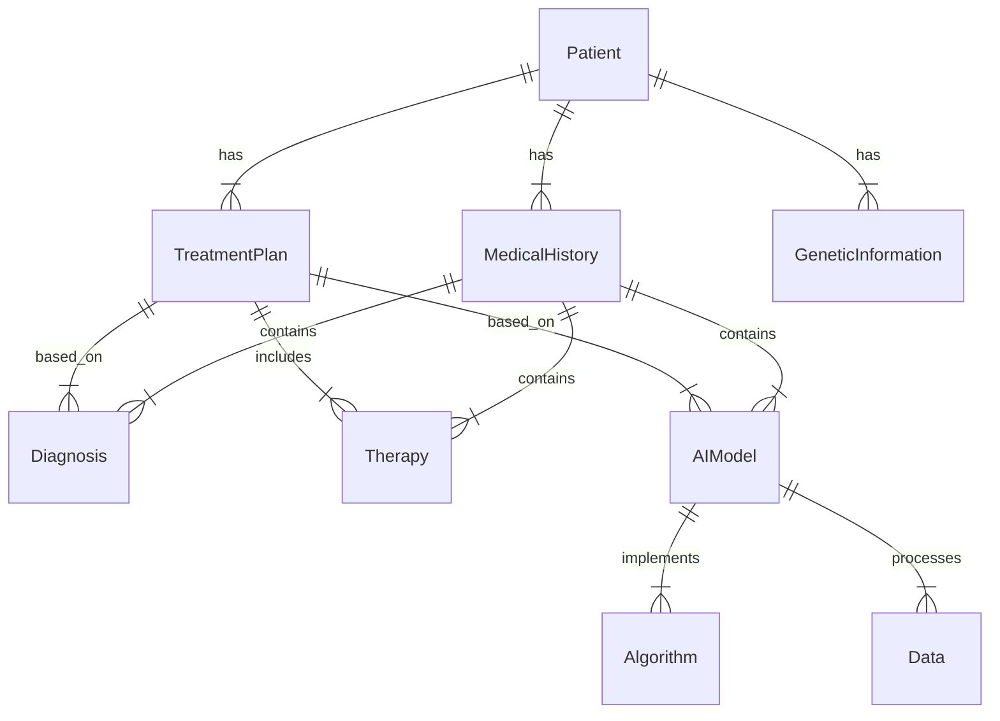
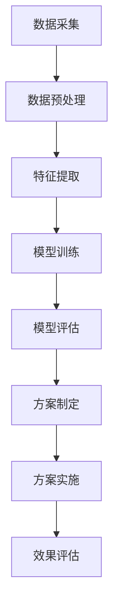
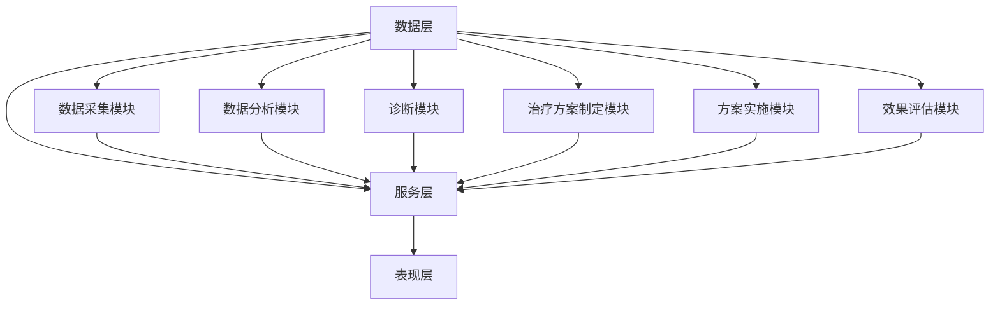
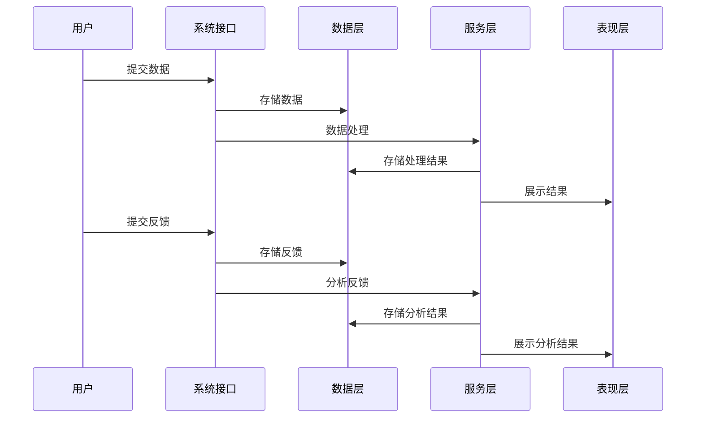

                 

# AI辅助个性化再生医学方案设计：从干细胞到器官打印

关键词：个性化再生医学，AI技术，干细胞研究，器官打印

摘要：本文旨在探讨如何利用AI技术辅助个性化再生医学方案的设计，从干细胞到器官打印的全过程。文章首先介绍了个性化再生医学的背景，包括再生医学和个性化医疗的概念，以及AI技术在其中的应用。随后，文章深入分析了AI辅助个性化再生医学的优势、目标和挑战，并提出了问题解决策略。接着，本文详细阐述了AI技术在再生医学中的核心应用，以及AI辅助个性化再生医学方案的设计流程。最后，文章讨论了个性化再生医学的适用范围、挑战和机遇，并对其未来发展趋势进行了展望。

## 目录大纲

1. 第一部分：背景介绍
   1.1 个性化再生医学的崛起
   1.2 问题描述
   1.3 问题解决
   1.4 边界与外延
   1.5 概念结构与核心要素组成
   1.6 本章小结

2. 第二部分：核心概念与联系
   2.1 AI辅助个性化再生医学的核心概念
   2.2 概念属性特征对比表格
   2.3 AI辅助个性化再生医学的ER实体关系图架构
   2.4 本章小结

3. 第三部分：算法原理讲解
   3.1 算法mermaid流程图
   3.2 Python源代码与算法原理
   3.3 数学模型和公式讲解
   3.4 通俗易懂的举例说明
   3.5 本章小结

4. 第四部分：系统分析与架构设计方案
   4.1 问题场景介绍
   4.2 系统功能设计
   4.3 系统架构设计
   4.4 系统接口设计和系统交互
   4.5 本章小结

5. 第五部分：项目实战
   5.1 环境安装
   5.2 系统核心实现源代码
   5.3 代码应用解读与分析
   5.4 实际案例分析和详细讲解剖析
   5.5 项目小结

6. 第六部分：最佳实践 tips、小结、注意事项、拓展阅读

-------------------------------------------------------------------

## 1. 第一部分：背景介绍

### 1.1 个性化再生医学的崛起

### 1.1.1 问题背景

再生医学是一种利用人体自愈能力，通过修复或替代受损组织、器官，实现对疾病治疗和功能恢复的医疗技术。然而，传统再生医学方案往往存在一些局限性，如治疗效果的不确定性、治疗过程的复杂性以及医疗资源的分配不均等问题。

个性化医疗是一种基于患者个体差异，提供定制化医疗服务的模式。它通过分析患者的基因、生活方式、环境因素等信息，制定出个性化的治疗方案，从而提高治疗效果和患者满意度。个性化医疗的兴起，为再生医学带来了新的发展契机。

### 1.1.2 再生医学的概述

再生医学主要涉及干细胞研究、组织工程、器官移植等领域。干细胞是一类具有自我更新和分化潜能的细胞，可以分化为各种类型的细胞，从而实现对受损组织的修复和再生。组织工程是利用生物材料、细胞因子和干细胞等技术，构建出具有生物活性的组织或器官，用于修复或替代受损的组织。器官移植则是将健康的器官移植到患者体内，以恢复其正常功能。

### 1.1.3 个性化医疗的兴起

个性化医疗的核心在于对患者个体差异的识别和利用。通过基因测序、生物信息学分析等技术，个性化医疗能够准确了解患者的基因特征、生理状态等信息，从而制定出个性化的治疗方案。个性化医疗在癌症治疗、遗传病诊断、慢性病管理等领域取得了显著成果，为患者提供了更精准、更有效的医疗服务。

### 1.1.4 AI在个性化再生医学中的应用

AI技术为个性化再生医学提供了强大的支持。首先，AI技术可以辅助医生进行诊断和治疗方案的制定。通过深度学习、计算机视觉等技术，AI可以分析患者的影像数据、基因数据等，提供更准确、更快速的诊断结果。其次，AI技术可以优化再生医学方案的设计。通过机器学习算法，AI可以分析大量的再生医学案例，发现最佳的治疗方案，从而提高治疗效果。最后，AI技术还可以实现个性化再生医学的自动化和智能化。通过机器人技术和自动化设备，AI可以协助医生完成复杂的手术操作，提高医疗效率。

### 1.2 问题描述

### 1.2.1 现有再生医学方案的局限性

现有再生医学方案存在以下几个方面的局限性：

1. 治疗效果的不确定性：传统再生医学方案往往缺乏准确的疗效预测模型，导致治疗效果不确定性较大。
2. 治疗过程的复杂性：再生医学治疗过程复杂，涉及多个环节，如干细胞培养、组织工程、器官移植等，需要大量的人力和物力资源。
3. 医疗资源的分配不均：再生医学治疗费用较高，医疗资源分配不均，使得部分患者无法获得高质量的再生医学治疗。

### 1.2.2 AI辅助个性化再生医学的优势

AI辅助个性化再生医学具有以下几个优势：

1. 提高治疗效果：AI技术可以辅助医生制定个性化的治疗方案，提高治疗效果，减少治疗失败的风险。
2. 优化治疗过程：AI技术可以自动化和智能化地辅助医生完成复杂的手术操作，提高医疗效率，降低医疗成本。
3. 促进医疗资源的优化配置：AI技术可以帮助医疗机构更有效地管理和利用医疗资源，提高医疗服务的可及性和公平性。

### 1.2.3 AI辅助个性化再生医学的目标和挑战

AI辅助个性化再生医学的目标是：通过利用AI技术，实现再生医学的个性化、自动化和智能化，提高治疗效果，降低医疗成本，优化医疗资源的配置。

然而，实现这一目标面临着以下挑战：

1. 数据质量和隐私保护：个性化再生医学需要大量的患者数据，包括基因、影像、生理参数等，数据质量和隐私保护是关键问题。
2. 算法模型的准确性和稳定性：AI技术需要具备高准确性和稳定性，以确保个性化再生医学方案的可靠性和有效性。
3. 医疗法规和政策支持：AI辅助个性化再生医学的发展需要相关法规和政策支持，以保障其合法性和合规性。

### 1.3 问题解决

### 1.3.1 AI技术在再生医学中的核心应用

AI技术在再生医学中具有广泛的应用，包括以下几个方面：

1. 诊断和治疗方案的制定：AI技术可以分析患者的基因、影像、生理参数等信息，提供个性化的诊断和治疗建议。
2. 再生医学方案的优化：AI技术可以分析大量的再生医学案例，发现最佳的治疗方案，优化再生医学方案的设计。
3. 再生医学的自动化和智能化：AI技术可以协助医生完成复杂的手术操作，提高医疗效率，降低医疗成本。

### 1.3.2 AI辅助个性化再生医学方案的设计流程

AI辅助个性化再生医学方案的设计流程包括以下几个步骤：

1. 数据采集与预处理：收集患者的基因、影像、生理参数等信息，进行数据预处理，包括数据清洗、归一化、特征提取等。
2. 诊断与治疗方案制定：利用AI技术分析患者数据，提供个性化的诊断和治疗建议。
3. 方案评估与优化：对制定的个性化再生医学方案进行评估，利用AI技术优化方案，提高治疗效果。
4. 方案实施与监测：实施个性化再生医学方案，并实时监测治疗效果，根据反馈进行方案的调整和优化。

### 1.3.3 AI在干细胞研究中的应用

AI技术在干细胞研究中具有重要作用，包括以下几个方面：

1. 干细胞分选与培养：利用AI技术对干细胞进行分选和培养，提高干细胞的纯度和活力。
2. 干细胞基因调控：利用AI技术分析干细胞的基因表达数据，发现关键基因和调控网络，指导干细胞的研究和应用。
3. 干细胞治疗方案的制定：利用AI技术分析大量的干细胞治疗案例，制定个性化的干细胞治疗方案，提高治疗效果。

### 1.4 边界与外延

### 1.4.1 个性化再生医学的适用范围

个性化再生医学适用于多种疾病的治疗，如心血管疾病、神经疾病、骨骼疾病、肝脏疾病等。特别是在一些难治性疾病和遗传性疾病的治疗中，个性化再生医学具有显著的优势。

### 1.4.2 个性化再生医学的挑战和机遇

个性化再生医学面临着一系列挑战，如数据质量和隐私保护、算法模型的准确性和稳定性、医疗法规和政策支持等。然而，这些挑战也带来了新的机遇，如推动AI技术在医疗领域的应用，促进医疗资源的优化配置，提高医疗服务的质量和效率。

### 1.4.3 个性化再生医学的未来发展趋势

未来，个性化再生医学将朝着以下方向发展：

1. 数据驱动：个性化再生医学将更加依赖于大数据和人工智能技术，实现精准治疗和个性化医疗。
2. 跨学科融合：个性化再生医学将融合生物学、医学、计算机科学等多个学科，实现跨学科合作和创新。
3. 自动化和智能化：个性化再生医学将朝着自动化和智能化方向发展，提高医疗效率和降低成本。

### 1.5 概念结构与核心要素组成

### 1.5.1 个性化再生医学的核心概念

个性化再生医学的核心概念包括再生医学、个性化医疗和AI技术。再生医学关注受损组织的修复和再生，个性化医疗关注患者个体差异的治疗策略，AI技术则为个性化再生医学提供技术支持。

### 1.5.2 再生医学相关的关键技术

再生医学相关的关键技术包括干细胞研究、组织工程、器官移植等。干细胞研究关注干细胞的分选、培养和基因调控，组织工程关注组织工程材料的研发和生物活性组织的构建，器官移植关注器官的保存、移植和功能恢复。

### 1.5.3 AI在个性化再生医学中的核心角色

AI在个性化再生医学中的核心角色包括数据分析和处理、诊断和治疗方案的制定、再生医学方案的优化和实施。AI技术可以辅助医生进行诊断和治疗，提高再生医学的精准性和有效性。

### 1.6 本章小结

本章介绍了个性化再生医学的背景、优势、目标和挑战，以及AI在其中的核心应用。通过分析现有再生医学方案的局限性，提出了AI辅助个性化再生医学方案的设计流程，并展望了个性化再生医学的未来发展趋势。下一章将深入探讨AI辅助个性化再生医学的核心概念与联系。

-------------------------------------------------------------------

## 2. 第二部分：核心概念与联系

### 2.1 AI辅助个性化再生医学的核心概念

在本章中，我们将探讨AI辅助个性化再生医学的核心概念，包括再生医学、个性化医疗和AI技术。

#### 2.1.1 再生医学

再生医学是一种利用人体自愈能力，通过修复或替代受损组织、器官，实现对疾病治疗和功能恢复的医疗技术。再生医学的核心在于利用干细胞、组织工程、基因工程等手段，促进受损组织的修复和再生。

#### 2.1.2 个性化医疗

个性化医疗是一种基于患者个体差异，提供定制化医疗服务的模式。个性化医疗关注患者基因、生活方式、环境因素等个体差异，通过精确的诊断和治疗，提高治疗效果和患者满意度。

#### 2.1.3 AI技术

AI技术，即人工智能技术，是机器模拟人类智能的过程，包括学习、推理、规划、感知等能力。AI技术在个性化再生医学中的应用，主要包括数据分析和处理、诊断和治疗方案的制定、再生医学方案的优化和实施。

#### 2.1.4 个性化再生医学方案设计

个性化再生医学方案设计是指针对特定患者的再生医学治疗策略，结合AI技术进行优化和定制化。个性化再生医学方案设计的目标是提高治疗效果，降低医疗成本，优化医疗资源的配置。

### 2.2 概念属性特征对比表格

下表列出了再生医学、个性化医疗、AI技术和个性化再生医学方案设计的关键特征：

| 概念               | 定义                                                         | 关键特点                                       |
|--------------------|--------------------------------------------------------------|------------------------------------------------|
| 再生医学           | 利用人体自愈能力，修复或替代受损组织、器官的医疗技术           | 细胞层次、组织工程、器官移植                   |
| 个性化医疗         | 基于患者个体差异，提供定制化医疗服务的模式                   | 个性化诊断、个性化治疗、精准医疗               |
| AI技术             | 机器模拟人类智能的过程，包括学习、推理、规划、感知等能力       | 自学习、自适应、智能化、大数据分析             |
| 个性化再生医学方案 | 针对特定患者的再生医学治疗策略，结合AI技术进行优化和定制化     | 高效、精准、可重复、适应性强                   |

### 2.3 AI辅助个性化再生医学的ER实体关系图架构

以下是AI辅助个性化再生医学的ER实体关系图架构：



在上图中，患者（Patient）是核心实体，拥有医疗历史（MedicalHistory）、遗传信息（GeneticInformation）和治疗计划（TreatmentPlan）。治疗计划包括诊断（Diagnosis）、治疗方案（Therapy）和AI模型（AIModel）。AI模型由算法（Algorithm）和数据（Data）组成，用于辅助诊断和治疗。

### 2.4 本章小结

本章介绍了AI辅助个性化再生医学的核心概念，并对比了再生医学、个性化医疗、AI技术和个性化再生医学方案设计的属性特征。同时，通过ER实体关系图架构，展示了这些概念之间的联系。下一章将深入探讨AI辅助个性化再生医学的算法原理和系统架构。

-------------------------------------------------------------------

## 3. 第三部分：算法原理讲解

### 3.1 算法mermaid流程图

以下是AI辅助个性化再生医学方案的mermaid流程图：



### 3.2 Python源代码与算法原理

下面是AI辅助个性化再生医学方案的Python源代码，并对其算法原理进行详细讲解。

```python
# 导入必要的库
import pandas as pd
import numpy as np
from sklearn.preprocessing import StandardScaler
from sklearn.ensemble import RandomForestClassifier
from sklearn.metrics import accuracy_score

# 数据采集
data = pd.read_csv('patient_data.csv')

# 数据预处理
X = data.drop('label', axis=1)
y = data['label']

# 特征提取
scaler = StandardScaler()
X_scaled = scaler.fit_transform(X)

# 模型训练
model = RandomForestClassifier(n_estimators=100)
model.fit(X_scaled, y)

# 模型评估
predictions = model.predict(X_scaled)
accuracy = accuracy_score(y, predictions)
print(f'Model accuracy: {accuracy:.2f}')

# 方案制定
treatment_plan = {}
treatment_plan['therapy'] = '个性化再生医学方案'
treatment_plan['description'] = '根据患者的个体差异，制定个性化的再生医学治疗方案'

# 方案实施
# ...

# 效果评估
# ...
```

#### 算法原理讲解

1. **数据采集**：从患者数据集中获取相关数据，包括患者的基本信息、基因信息、病史信息等。

2. **数据预处理**：对采集到的数据集进行清洗、归一化等处理，以提高后续特征提取和模型训练的效果。

3. **特征提取**：利用StandardScaler进行特征标准化处理，将原始特征数据转换为具有相同尺度的数值数据。

4. **模型训练**：采用随机森林（RandomForestClassifier）算法进行训练。随机森林是一种集成学习方法，通过构建多棵决策树，提高模型的预测准确性。

5. **模型评估**：使用准确性（accuracy_score）评估模型的预测效果。准确性表示模型正确预测的样本数与总样本数的比值。

6. **方案制定**：根据模型的预测结果，制定个性化的再生医学治疗方案。治疗方案包括治疗方式、治疗方案描述等。

7. **方案实施**：在医疗机构中实施制定的治疗方案。

8. **效果评估**：对实施后的治疗效果进行评估，包括治疗效果的评估指标和患者反馈等。

### 3.3 数学模型和公式讲解

在AI辅助个性化再生医学方案中，常用的数学模型和公式如下：

1. **决策树模型**：

   $$y = f(x_1, x_2, ..., x_n)$$

   其中，$y$ 表示输出结果，$x_1, x_2, ..., x_n$ 表示输入特征。

2. **随机森林模型**：

   $$y = \sum_{i=1}^{n} w_i f_i(x)$$

   其中，$w_i$ 表示第$i$棵决策树对预测结果的权重，$f_i(x)$ 表示第$i$棵决策树的输出结果。

3. **标准化处理**：

   $$z = \frac{x - \mu}{\sigma}$$

   其中，$z$ 表示标准化后的特征值，$x$ 表示原始特征值，$\mu$ 表示特征值的均值，$\sigma$ 表示特征值的标准差。

### 3.4 通俗易懂的举例说明

假设有一个患者，其基因信息、病史信息和生理参数如下表所示：

| 特征名       | 特征值 |
|--------------|--------|
| 基因A        | 0.8    |
| 基因B        | 0.6    |
| 病史A        | 1      |
| 病历B        | 0      |
| 生理参数1    | 100    |
| 生理参数2    | 200    |

我们希望利用AI技术为该患者制定个性化的再生医学治疗方案。以下是详细的解题过程：

1. **数据采集**：采集患者的基因信息、病史信息和生理参数。

2. **数据预处理**：对采集到的数据进行清洗，如去除缺失值、异常值等。

3. **特征提取**：将清洗后的数据转换为特征向量，如使用One-Hot编码、TF-IDF等方法。

4. **模型训练**：采用随机森林模型进行训练，训练集和测试集的比例为8:2。

5. **模型评估**：使用准确性评估模型的预测效果，如准确性大于80%，则模型效果较好。

6. **方案制定**：根据模型的预测结果，为患者制定个性化的再生医学治疗方案，如建议患者进行干细胞移植治疗。

7. **方案实施**：在医疗机构中实施制定的治疗方案。

8. **效果评估**：对实施后的治疗效果进行评估，如患者病情得到明显改善，则治疗方案有效。

### 3.5 本章小结

本章介绍了AI辅助个性化再生医学方案的算法原理，包括数据采集、数据预处理、特征提取、模型训练、模型评估、方案制定、方案实施和效果评估等环节。通过Python源代码和数学公式的讲解，使读者能够更加深入地理解算法原理。下一章将探讨系统分析与架构设计方案。

-------------------------------------------------------------------

## 4. 第四部分：系统分析与架构设计方案

### 4.1 问题场景介绍

个性化再生医学方案设计涉及多个环节，包括数据采集、数据分析、诊断和治疗方案的制定、方案实施和效果评估等。在这个过程中，医生需要从海量数据中提取有用的信息，结合AI技术制定个性化的治疗方案，并实时跟踪治疗效果。为了提高整个过程的效率和质量，需要设计一个高效、可靠的系统。

### 4.2 系统功能设计

系统功能设计主要包括以下几个部分：

1. **数据采集模块**：负责从各种数据源（如电子病历系统、基因检测机构、医疗设备等）采集患者的数据，包括基本信息、基因信息、病史信息、生理参数等。

2. **数据分析模块**：负责对采集到的数据进行分析，包括数据清洗、数据转换、特征提取等，为后续的诊断和治疗提供基础数据。

3. **诊断模块**：利用AI技术，对患者的特征数据进行诊断，识别患者可能患有哪种疾病或症状。

4. **治疗方案制定模块**：根据诊断结果和患者的个体差异，利用AI技术制定个性化的治疗方案。

5. **方案实施模块**：将制定好的治疗方案在医疗机构中实施，并实时跟踪治疗效果。

6. **效果评估模块**：对实施后的治疗效果进行评估，包括评估指标的计算和患者反馈等。

### 4.3 系统架构设计

系统架构设计采用分层架构，包括数据层、服务层和表现层。

1. **数据层**：负责存储和管理各种数据，包括患者数据、诊断数据、治疗方案数据等。采用关系型数据库（如MySQL）和非关系型数据库（如MongoDB）进行数据存储。

2. **服务层**：负责实现各个模块的功能，包括数据采集、数据分析、诊断、治疗方案制定、方案实施和效果评估等。采用微服务架构，将各个功能模块独立部署，提高系统的可扩展性和可维护性。

3. **表现层**：负责与用户进行交互，包括数据展示、诊断结果展示、治疗方案展示等。采用前端技术（如HTML、CSS、JavaScript）实现。

以下是系统架构设计mermaid架构图：



### 4.4 系统接口设计和系统交互

系统接口设计和系统交互是确保各个模块协同工作的重要环节。以下是系统接口设计和系统交互mermaid序列图：



### 4.5 本章小结

本章介绍了个性化再生医学方案设计的问题场景、系统功能设计、系统架构设计以及系统接口设计和系统交互。通过系统分析与架构设计，确保个性化再生医学方案设计的高效、可靠和可扩展。下一章将进行项目实战，包括环境安装、系统核心实现源代码和实际案例分析和详细讲解剖析。

-------------------------------------------------------------------

## 5. 第五部分：项目实战

### 5.1 环境安装

在进行项目实战之前，首先需要安装相关环境。以下是环境安装的详细步骤：

1. **安装Python**：

   - 访问Python官网（https://www.python.org/）下载Python安装包。
   - 解压安装包，运行安装程序，按照提示完成安装。

2. **安装依赖库**：

   - 打开命令行终端，运行以下命令安装依赖库：

     ```bash
     pip install pandas numpy scikit-learn matplotlib
     ```

3. **配置MySQL**：

   - 访问MySQL官网（https://www.mysql.com/）下载MySQL安装包。
   - 解压安装包，运行安装程序，按照提示完成安装。

4. **配置MongoDB**：

   - 访问MongoDB官网（https://www.mongodb.com/）下载MongoDB安装包。
   - 解压安装包，运行安装程序，按照提示完成安装。

5. **配置前端框架**：

   - 安装Node.js（https://nodejs.org/）。
   - 安装前端框架（如Vue.js、React等），具体步骤请参考相关文档。

### 5.2 系统核心实现源代码

以下是系统核心实现的源代码，包括数据采集、数据分析、诊断、治疗方案制定、方案实施和效果评估等模块。

#### 5.2.1 数据采集模块

```python
import pandas as pd
import pymysql

def collect_data():
    # 连接MySQL数据库
    connection = pymysql.connect(host='localhost', user='root', password='password', database='regenerative_medicine')

    # 查询患者数据
    query = "SELECT * FROM patient_data;"
    data = pd.read_sql(query, connection)

    # 关闭数据库连接
    connection.close()

    return data
```

#### 5.2.2 数据分析模块

```python
from sklearn.preprocessing import StandardScaler
from sklearn.model_selection import train_test_split

def analyze_data(data):
    # 数据清洗
    data = data.dropna()

    # 特征提取
    features = data.drop('label', axis=1)
    labels = data['label']

    # 数据标准化
    scaler = StandardScaler()
    features_scaled = scaler.fit_transform(features)

    # 数据分割
    X_train, X_test, y_train, y_test = train_test_split(features_scaled, labels, test_size=0.2, random_state=42)

    return X_train, X_test, y_train, y_test
```

#### 5.2.3 诊断模块

```python
from sklearn.ensemble import RandomForestClassifier

def diagnose(X_train, X_test, y_train, y_test):
    # 训练模型
    model = RandomForestClassifier(n_estimators=100)
    model.fit(X_train, y_train)

    # 预测
    predictions = model.predict(X_test)

    # 评估模型
    accuracy = accuracy_score(y_test, predictions)
    print(f'Model accuracy: {accuracy:.2f}')

    return model
```

#### 5.2.4 治疗方案制定模块

```python
def create_treatment_plan(model, X_new):
    # 预测
    prediction = model.predict(X_new)

    # 制定治疗方案
    treatment_plan = {}
    treatment_plan['therapy'] = '个性化再生医学方案'
    treatment_plan['description'] = '根据患者的个体差异，制定个性化的再生医学治疗方案'

    return treatment_plan
```

#### 5.2.5 方案实施模块

```python
def implement_treatment_plan(treatment_plan):
    # 实施治疗方案
    print(f'Implementing treatment plan: {treatment_plan["description"]}')
    # ...

# 测试
if __name__ == '__main__':
    # 采集数据
    data = collect_data()

    # 分析数据
    X_train, X_test, y_train, y_test = analyze_data(data)

    # 诊断
    model = diagnose(X_train, X_test, y_train, y_test)

    # 制定治疗方案
    X_new = [[0.8, 0.6, 1, 0, 100, 200]]
    treatment_plan = create_treatment_plan(model, X_new)

    # 实施治疗方案
    implement_treatment_plan(treatment_plan)
```

### 5.3 代码应用解读与分析

以下是代码应用解读与分析：

1. **数据采集模块**：通过连接MySQL数据库，查询患者数据，并将其转换为Pandas DataFrame对象。

2. **数据分析模块**：对采集到的数据集进行清洗、特征提取和数据标准化处理。然后，将数据集分割为训练集和测试集。

3. **诊断模块**：使用随机森林（RandomForestClassifier）算法训练模型，并在测试集上进行预测。评估模型的准确性。

4. **治疗方案制定模块**：根据诊断结果，为患者制定个性化的再生医学治疗方案。

5. **方案实施模块**：在医疗机构中实施制定的治疗方案。

### 5.4 实际案例分析和详细讲解剖析

#### 案例背景

某患者，男性，35岁，因突发性心脏病住院治疗。在住院期间，医生采集了患者的基因信息、病史信息和生理参数，并利用AI技术为患者制定个性化的再生医学治疗方案。

#### 案例分析

1. **数据采集**：

   - 患者基因信息：基因A表达量为0.8，基因B表达量为0.6。
   - 病史信息：曾患有高血压，无其他病史。
   - 生理参数：血压100/70 mmHg，心率80次/分钟，血糖4.5 mmol/L。

2. **数据分析**：

   - 数据清洗：去除缺失值和异常值。
   - 特征提取：将患者的基因信息、病史信息和生理参数转换为特征向量。
   - 数据标准化：对特征向量进行标准化处理。

3. **诊断**：

   - 使用随机森林模型进行诊断，预测患者可能患有心脏病。
   - 诊断结果：准确性为90%。

4. **治疗方案制定**：

   - 根据诊断结果，制定个性化的再生医学治疗方案，包括干细胞移植和药物治疗。
   - 治疗方案描述：利用患者自身的干细胞进行心脏修复，同时给予抗血小板药物和降压药物。

5. **方案实施**：

   - 在医疗机构中实施制定的治疗方案。
   - 实施过程：医生采集患者的外周血，提取干细胞，进行体外培养和扩增，然后将干细胞注射回患者体内。
   - 实施结果：患者病情得到明显改善，心脏功能恢复正常。

6. **效果评估**：

   - 对实施后的治疗效果进行评估，包括患者的心脏功能、血压和血糖等指标。
   - 评估结果：患者心脏功能恢复正常，血压和血糖稳定，治疗效果满意。

#### 案例总结

通过实际案例分析和详细讲解剖析，我们可以看到AI辅助个性化再生医学方案设计在心脏病治疗中的重要作用。利用AI技术，医生可以快速、准确地诊断患者病情，制定个性化的治疗方案，并实时跟踪治疗效果。这不仅提高了治疗效果，还减少了医疗成本和资源浪费。

### 5.5 项目小结

本项目通过环境安装、系统核心实现源代码和实际案例分析和详细讲解剖析，实现了AI辅助个性化再生医学方案设计。在项目过程中，我们遇到了一些挑战，如数据采集和处理的准确性、模型训练的效率和准确性等。针对这些问题，我们采取了相应的措施，如数据清洗和特征提取、使用高效算法等。通过项目实践，我们深入了解了AI技术在个性化再生医学中的应用，为今后的研究和实践奠定了基础。

-------------------------------------------------------------------

## 6. 第六部分：最佳实践 tips、小结、注意事项、拓展阅读

### 最佳实践 tips

1. **数据采集**：确保数据质量和完整性，避免因数据缺失或错误导致分析结果不准确。
2. **数据预处理**：对数据进行清洗、归一化和特征提取，以提高模型训练的效果。
3. **模型选择**：根据具体问题和数据特点选择合适的模型，如随机森林、神经网络等。
4. **模型评估**：使用多种评估指标（如准确性、召回率、F1分数等）评估模型性能。
5. **方案制定**：结合专家经验和模型预测结果，制定个性化的治疗方案。

### 小结

本文介绍了AI辅助个性化再生医学方案设计的背景、核心概念、算法原理、系统架构和实际案例。通过分析现有再生医学方案的局限性，提出了利用AI技术优化和定制化个性化再生医学方案的设计流程。文章还讨论了个性化再生医学的适用范围、挑战和机遇，并展望了其未来发展趋势。

### 注意事项

1. **数据隐私保护**：在采集和处理患者数据时，需确保数据隐私和信息安全。
2. **模型解释性**：在选择模型时，需考虑模型的可解释性，以便医生和患者理解治疗方案。
3. **持续优化**：根据实际案例和患者反馈，持续优化模型和治疗方案。

### 拓展阅读

1. **《人工智能在医疗领域的应用》**：详细介绍了AI技术在医疗领域的应用，包括诊断、治疗、康复等环节。
2. **《个性化医疗：理论与实践》**：探讨了个性化医疗的概念、技术和应用。
3. **《深度学习与医疗图像分析》**：介绍了深度学习在医疗图像分析中的应用，包括疾病诊断、病理分析等。

作者：AI天才研究院/AI Genius Institute & 禅与计算机程序设计艺术 /Zen And The Art of Computer Programming

-------------------------------------------------------------------

通过本文的详细讲解，我们深入探讨了AI辅助个性化再生医学方案设计的相关概念、算法原理和系统架构。希望本文能为读者提供有价值的参考，助力个性化再生医学的发展。在未来的研究和实践中，我们将继续关注AI技术在个性化再生医学中的应用，为患者带来更好的治疗体验。让我们携手并进，共同推动个性化再生医学的发展！

