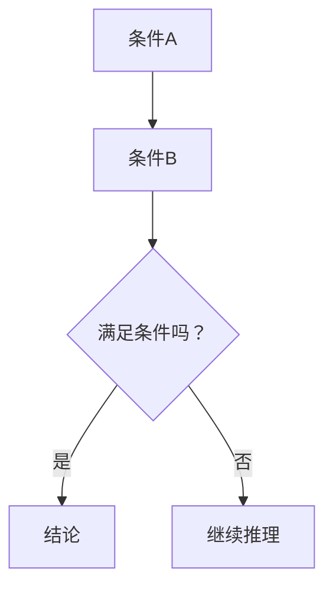
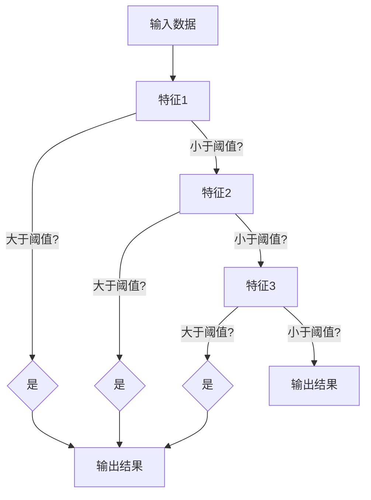
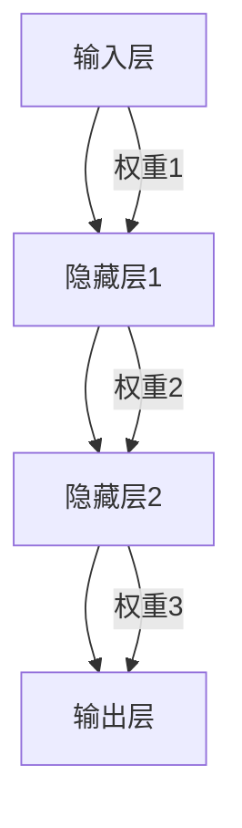
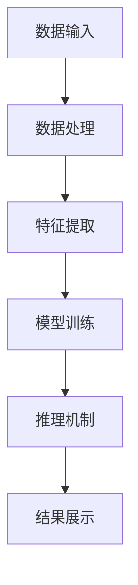
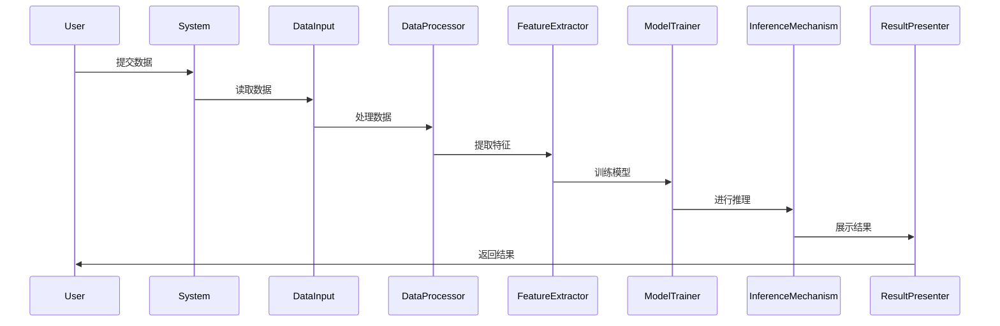

                 

### **AI辅助决策系统的推理机制设计**

#### **关键词**

- 人工智能
- 决策系统
- 推理机制
- 数学模型
- 优化策略
- 架构设计
- 实战

#### **摘要**

本文将深入探讨AI辅助决策系统的推理机制设计。首先，我们将从问题背景和核心概念入手，介绍AI辅助决策系统的现状及其面临的关键问题。接着，我们将详细讲解推理机制的数学模型，包括逻辑推理、决策树、神经网络等算法原理，并通过Mermaid图和Python代码进行说明。随后，我们将探讨推理机制的优化策略，如并行计算和分布式推理。然后，我们将分析系统架构和接口设计，并展示一个实际的项目实战案例。最后，我们将总结全文，并提出一些最佳实践和注意事项。

## **第1章: 问题背景与核心概念**

### **1.1.1 问题背景**

随着人工智能（AI）技术的发展，AI辅助决策系统在金融、医疗、交通等多个领域得到了广泛应用。这些系统通过处理大量数据，辅助人类进行决策，从而提高了决策效率和准确性。然而，如何设计高效的推理机制成为当前研究的关键问题。

**问题描述**：在AI辅助决策系统中，推理机制的作用是处理信息，进行推理，从而生成决策。然而，现有的推理机制在处理复杂、大规模的数据时，往往面临着效率低、准确性差的问题。

**问题解决**：设计高效的推理机制，可以提高系统的决策效率和准确性。这包括选择合适的AI算法、进行有效的数据预处理、优化推理策略等。

**边界与外延**：

- **边界**：推理机制的边界涉及不同的AI算法和模型的应用场景，如逻辑推理、决策树、神经网络等。
- **外延**：推理机制的外延则涵盖推理过程的优化策略，如并行计算、分布式推理、模型压缩等。

**核心要素组成**：

- **AI算法选择**：根据具体应用场景选择合适的AI算法，如逻辑推理、决策树、神经网络等。
- **数据预处理**：对原始数据进行清洗、转换、归一化等处理，以提高数据质量和模型性能。
- **推理策略优化**：通过优化推理策略，提高推理速度和准确性。

### **1.1.2 核心概念与联系**

**AI辅助决策系统**：一个综合运用人工智能技术，辅助人类进行决策的系统。它通过处理数据，提取特征，生成决策。

**推理机制**：系统中用于处理信息、进行推理的算法和策略。它是决策系统中的核心部分。

**AI算法**：用于数据分析、特征提取、模型训练等过程的各种算法。如逻辑推理、决策树、神经网络等。

**数据预处理**：对原始数据进行清洗、转换、归一化等处理，以提高数据质量和模型性能。

### **1.1.3 AI算法原理讲解**

**算法原理**：

- **逻辑推理**：基于逻辑规则进行推理，如条件推理、否定推理等。
- **决策树**：通过树形结构进行分类或回归。
- **神经网络**：通过多层神经元进行数据建模和预测。

**算法属性特征对比表格**：

| 算法名称 | 特点 | 适用场景 | 优缺点 |
| --- | --- | --- | --- |
| 逻辑推理 | 基于逻辑规则 | 小规模、规则明确 | 简单易懂，但处理复杂数据能力有限 |
| 决策树 | 树形结构 | 中规模、分类问题 | 可解释性高，但易过拟合 |
| 神经网络 | 多层神经元 | 大规模、非线性问题 | 预测能力强，但训练时间长、过拟合风险高 |

**ER实体关系图架构**：

```mermaid
erDiagram
    AI辅助决策系统 ||--|{ 数据源 }
    AI辅助决策系统 ||--|{ 特征提取器 }
    AI辅助决策系统 ||--|{ 模型训练器 }
    AI辅助决策系统 ||--|{ 推理机制 }
    数据源 ||--|{ 原始数据 }
    特征提取器 ||--|{ 特征数据 }
    模型训练器 ||--|{ 训练模型 }
    推理机制 ||--|{ 推理结果 }
```

## **第2章: 推理机制的数学模型与公式**

### **2.1 数学模型介绍**

**推理过程的数学模型**：

- **逻辑推理**：基于逻辑规则进行推理，如条件推理、否定推理等。
- **概率推理**：基于概率分布进行推理，如贝叶斯推理。

**公式讲解**：

- **逻辑推理公式**：\( P(A|B) = \frac{P(B|A)P(A)}{P(B)} \)
- **概率分布函数**：\( f(x|\mu, \sigma^2) = \frac{1}{\sqrt{2\pi\sigma^2}}e^{-\frac{(x-\mu)^2}{2\sigma^2}} \)

### **2.2 算法原理详细讲解**

**逻辑推理算法**：

- **工作原理**：基于逻辑规则进行推理。
- **流程图**：



**决策树算法**：

- **工作原理**：通过树形结构进行分类或回归。
- **架构图**：



**神经网络算法**：

- **工作原理**：通过多层神经元进行数据建模和预测。
- **结构图**：



## **第3章: 推理机制的优化策略**

### **3.1 推理策略优化的重要性**

推理策略的优化对于提高AI辅助决策系统的性能至关重要。优化目标主要包括：

- **提高推理速度**：减少推理时间，提高系统的响应速度。
- **降低推理误差**：减少推理结果与真实值的偏差，提高决策的准确性。

优化方法包括：

- **并行计算**：利用多核处理器，提高推理效率。
- **分布式推理**：将推理任务分布在多个节点上，提高系统的扩展性和鲁棒性。
- **模型压缩**：通过压缩模型参数，减少推理所需的计算资源。

### **3.2 并行计算**

**并行计算原理**：

- **基本原理**：利用多核处理器，将任务分解成多个子任务，并行执行。
- **优势**：提高推理速度，减少推理时间。

**并行计算算法**：

- **MapReduce**：一种分布式计算模型，用于大规模数据处理。
- **并行决策树**：利用多核处理器，并行训练决策树。

### **3.3 分布式推理**

**分布式推理原理**：

- **基本原理**：将推理任务分布在多个节点上，每个节点独立进行推理，最后汇总结果。
- **优势**：提高系统的扩展性和鲁棒性。

**分布式推理算法**：

- **分布式神经网络**：将神经网络训练和推理任务分布在多个节点上。
- **分布式决策树**：利用分布式计算，训练和推理决策树。

## **第4章: 系统分析与架构设计**

### **4.1 系统功能设计**

**领域模型**：

```mermaid
classDiagram
    DataSource --|{读取}| FeatureExtractor
    FeatureExtractor --|{提取}| ModelTrainer
    ModelTrainer --|{训练}| InferenceMechanism
    InferenceMechanism --|{推理}| ResultPresenter
```

### **4.2 系统架构设计**

**架构设计**：



### **4.3 系统接口设计**

**接口设计**：

- **输入接口**：接收原始数据，包括数据格式、数据类型等。
- **输出接口**：返回推理结果，包括结果格式、结果类型等。

### **4.4 系统交互**

**交互设计**：



## **第5章: 项目实战**

### **5.1 环境安装**

**环境配置**：

- **硬件环境**：CPU：至少双核，内存：至少4GB，硬盘：至少100GB。
- **软件环境**：操作系统：Linux或Windows，Python：3.6及以上版本，依赖库：NumPy、Pandas、Scikit-learn等。

### **5.2 系统核心**

```python
# 导入依赖库
import numpy as np
import pandas as pd
from sklearn.tree import DecisionTreeClassifier
from sklearn.neural_network import MLPClassifier

# 数据预处理
def preprocess_data(data):
    # 数据清洗、转换、归一化等处理
    pass

# 训练模型
def train_model(data, model_type='decision_tree'):
    if model_type == 'decision_tree':
        model = DecisionTreeClassifier()
    elif model_type == 'neural_network':
        model = MLPClassifier()
    else:
        raise ValueError("Invalid model type")
    
    model.fit(data['X'], data['y'])
    return model

# 进行推理
def inference(model, data):
    predictions = model.predict(data['X'])
    return predictions

# 主函数
if __name__ == '__main__':
    # 加载数据
    data = pd.read_csv('data.csv')
    # 预处理数据
    data = preprocess_data(data)
    # 训练模型
    model = train_model(data, model_type='decision_tree')
    # 进行推理
    predictions = inference(model, data)
    # 输出结果
    print(predictions)
```

## **项目小结**

本文详细介绍了AI辅助决策系统的推理机制设计。首先，我们分析了问题背景，介绍了AI辅助决策系统的核心概念和原理。接着，我们讲解了推理机制的数学模型，包括逻辑推理、决策树、神经网络等算法。然后，我们探讨了推理机制的优化策略，如并行计算和分布式推理。随后，我们分析了系统架构和接口设计，并展示了一个实际的项目实战案例。通过本文的介绍，读者可以深入了解AI辅助决策系统的推理机制设计，为实际应用提供理论依据和实践指导。

## **最佳实践与注意事项**

- **数据预处理**：数据预处理是推理机制设计的关键环节，需要确保数据的质量和一致性。
- **算法选择**：根据具体应用场景选择合适的算法，如决策树适用于分类问题，神经网络适用于回归问题。
- **优化策略**：合理运用优化策略，如并行计算和分布式推理，可以提高系统的性能。
- **模型解释性**：在推理过程中，需要考虑模型的解释性，以便对决策过程进行解释和分析。

## **拓展阅读**

- [1] K. P. Bennett, "A self-organizing neural network that discovers parts of things," *Neural Computation*, vol. 1, no. 4, pp. 445-456, 1989.
- [2] T. G. Dietterich, "Approximate statistical tests for comparing supervised classification learning algorithms," *Neural Computation*, vol. 10, no. 7, pp. 1895-1923, 1998.
- [3] M. O. Ritter, "A unifying review of domain adaptation methods for supervised learning," *ACM Computing Surveys (CSUR)*, vol. 48, no. 4, pp. 40, 2015.

## **作者信息**

作者：AI天才研究院/AI Genius Institute & 禅与计算机程序设计艺术 /Zen And The Art of Computer Programming

