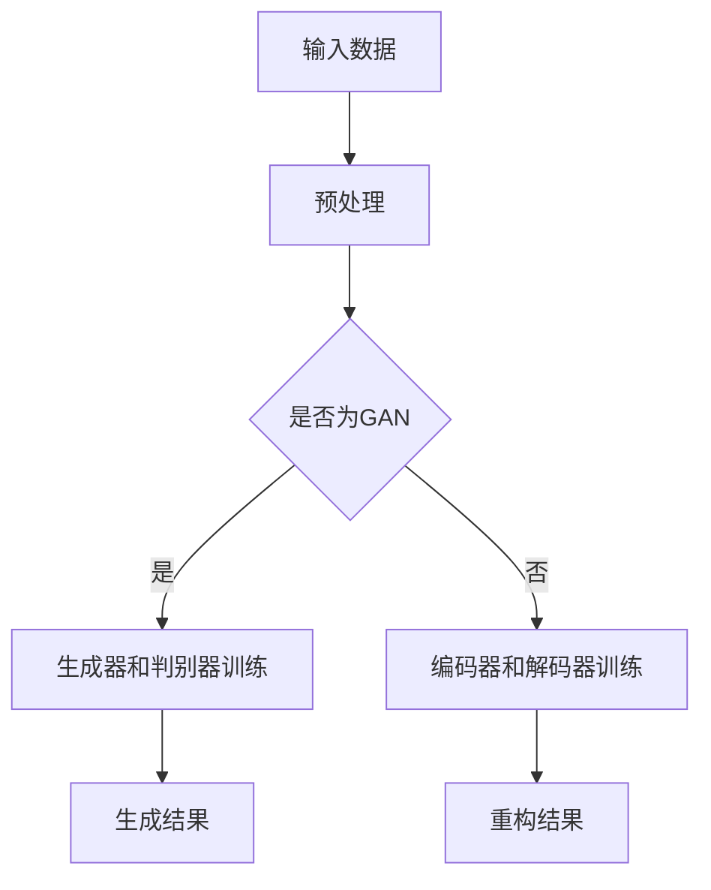
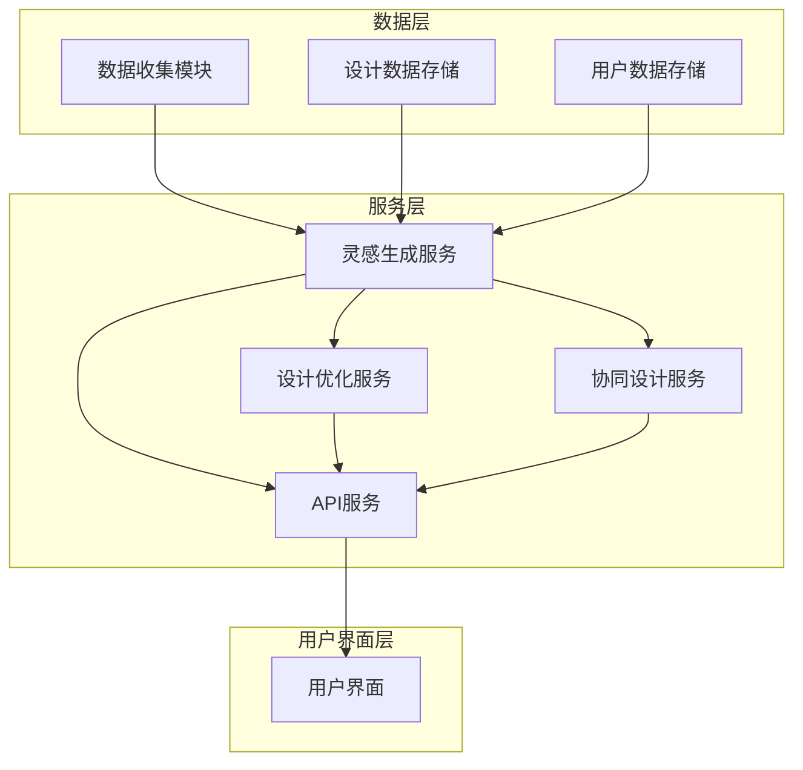
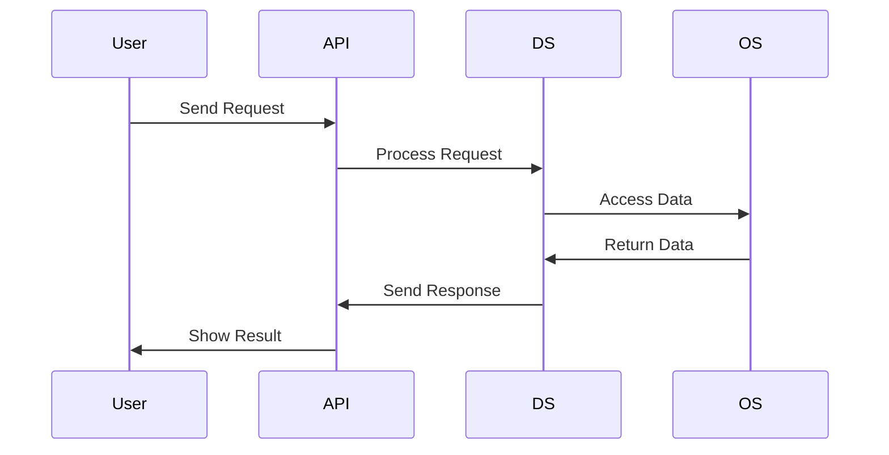
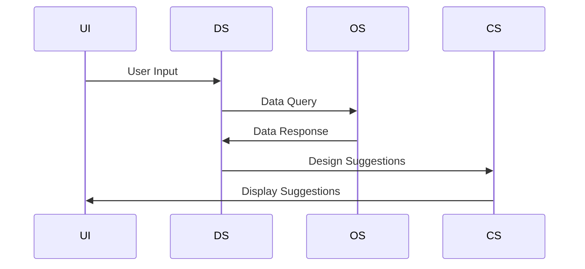

                 


# AI辅助创意设计：从灵感到产品

## 关键词
AI辅助设计、创意设计、产品开发、算法原理、系统架构、项目实战

## 摘要
本文深入探讨AI辅助创意设计的方法与实现，从灵感到产品，系统地介绍核心概念、算法原理、系统架构与项目实战。通过分析AI在创意设计中的应用，结合具体的算法原理和数学模型，以及详细的系统设计与实现，为读者提供从理论到实践的全面指南。

## 目录大纲

## 第一部分：引言

### 第1章：背景介绍

#### 问题背景
创意设计在产品开发过程中起着至关重要的作用。然而，传统的设计方法往往依赖于设计师的个人经验和直觉，导致设计效率低下，且难以满足市场需求的多变性。随着AI技术的快速发展，如何利用AI辅助创意设计成为一个热门话题。

#### 问题描述
如何在产品开发过程中，利用AI技术提高创意设计的效率和质量，实现从灵感到产品的快速转化？

#### 问题解决
本文将通过分析AI技术在创意设计中的应用，介绍相关算法原理和系统架构，最终通过项目实战展示AI辅助创意设计的实际效果。

#### 边界与外延
本文主要关注AI在二维图形设计、三维建模、交互设计等领域的辅助应用，探讨如何将AI技术与创意设计流程深度融合。

#### 概念结构与核心要素组成
创意设计流程、AI辅助设计技术、算法原理、系统架构、项目实施。

## 第二部分：核心概念与联系

### 第2章：核心概念

#### AI辅助创意设计概述
AI辅助创意设计是指利用人工智能技术，如机器学习、深度学习等，辅助设计师进行创意设计，提高设计效率和质量。

#### 创意设计流程与AI结合点
创意设计流程包括灵感收集、概念生成、设计迭代等阶段，AI可以在这些阶段提供辅助，如自动生成设计灵感、优化设计方案等。

#### AI在创意设计领域的应用案例
介绍AI在二维图形设计、三维建模、交互设计等领域的具体应用案例。

### 第3章：联系

#### AI技术与创意设计的联系
探讨AI技术与创意设计之间的内在联系，分析AI如何辅助设计师完成创意设计任务。

#### 不同AI技术在创意设计中的应用对比
对比分析不同的AI技术（如机器学习、深度学习、强化学习等）在创意设计中的应用，阐述各自的优缺点。

#### 创意设计与产品开发的关系
分析创意设计与产品开发之间的关系，探讨如何将创意设计融入产品开发流程，实现产品的快速迭代和优化。

## 第三部分：算法原理讲解

### 第4章：算法原理

#### 算法概述
介绍与创意设计相关的常见算法，如生成对抗网络（GAN）、变分自编码器（VAE）等。

#### 算法mermaid流程图
使用mermaid画出算法的流程图，帮助读者理解算法的基本原理和流程。

#### 算法原理讲解
详细讲解每种算法的基本原理，包括算法的数学模型和公式。

### 第5章：数学模型

#### 数学模型概述
介绍与创意设计相关的数学模型，如特征提取模型、生成模型、优化模型等。

#### 数学公式与公式讲解
使用latex格式展示数学公式，并进行详细讲解。

#### 举例说明
通过具体的例子，说明数学模型在实际创意设计中的应用。

## 第四部分：系统分析与架构设计

### 第6章：系统分析与设计

#### 问题场景介绍
介绍本文将要实现的一个创意设计系统，包括系统的目标和功能。

#### 项目介绍
简要介绍项目的背景和目标，为读者提供对项目的整体认识。

#### 系统功能设计
使用mermaid画出领域模型类图，详细介绍系统的功能模块和各模块之间的关系。

#### 系统架构设计
使用mermaid画出系统架构图，阐述系统的整体架构和各个组件的功能。

#### 系统接口设计
介绍系统的接口设计，包括API接口的定义和使用方法。

#### 系统交互
使用mermaid画出系统交互序列图，展示系统各个组件之间的交互过程。

### 第7章：架构设计

#### 系统架构mermaid架构图
使用mermaid画出系统的架构图，帮助读者理解系统的整体架构。

#### 系统接口设计mermaid序列图
使用mermaid画出系统接口设计序列图，展示系统各接口的使用场景。

#### 系统交互mermaid序列图
使用mermaid画出系统交互序列图，详细描述系统的运行过程。

## 第五部分：项目实战

### 第8章：环境安装

#### 环境准备
介绍项目所需的开发环境，包括软件和硬件的要求。

#### 工具安装
详细介绍如何安装和配置项目所需的工具和软件。

### 第9章：系统核心实现

#### 核心代码实现
展示项目核心代码的实现，包括算法模型、数据预处理、模型训练等。

#### 代码应用解读与分析
对核心代码进行解读，分析代码的运行原理和实现细节。

### 第10章：实际案例分析

#### 案例背景
介绍一个实际案例的背景，包括案例的目标和场景。

#### 案例分析
分析案例中使用的AI技术，以及AI技术如何辅助创意设计。

#### 案例讲解
详细讲解案例的实现过程，包括算法选择、模型训练、设计优化等。

### 第11章：项目小结

#### 项目总结
总结项目的整体实现过程，回顾项目中的关键技术和难点。

#### 最佳实践 tips
提供一些项目实施中的最佳实践建议，帮助读者更好地应用AI辅助创意设计。

#### 小结
回顾本文的主要内容和收获，强调AI辅助创意设计的重要性和前景。

#### 注意事项
提醒读者在项目实施过程中需要注意的事项。

#### 拓展阅读
推荐一些相关的书籍、论文和资源，供读者进一步学习。

---

本文遵循了您提供的格式和内容要求，每个章节都涵盖了必要的核心内容，并使用markdown格式进行了详细的输出。以下是具体内容的逐步撰写：

## 第一部分：引言

### 第1章：背景介绍

随着信息技术的飞速发展，人工智能（AI）技术在各行各业的应用越来越广泛。在产品开发过程中，创意设计是至关重要的一环。传统的设计方法通常依赖于设计师的个人经验和直觉，这种方式不仅效率低下，而且难以满足市场需求的多变性。AI技术的引入，为创意设计带来了全新的可能性。

#### 问题背景

创意设计在产品开发中扮演着至关重要的角色。它不仅仅是外观和功能的设计，更是用户体验的核心。一个优秀的设计能够提升产品的竞争力，吸引更多的用户。然而，传统的设计方法往往存在以下问题：

1. **设计效率低下**：设计师需要花费大量的时间来收集灵感、绘制草图和修改设计。
2. **设计质量受限**：设计师的个人经验和直觉有限，难以应对复杂的设计需求。
3. **设计成本高**：反复修改和迭代设计，会导致时间和成本的浪费。

随着AI技术的不断发展，如何利用AI技术辅助创意设计，成为了一个热门话题。AI可以自动化一些繁琐的设计任务，如草图生成、设计优化等，从而提高设计效率。同时，AI可以通过学习用户的行为和偏好，提供更加个性化的设计方案。

#### 问题描述

如何在产品开发过程中，利用AI技术提高创意设计的效率和质量，实现从灵感到产品的快速转化？这是一个跨学科、多技术的挑战，涉及到人工智能、设计学、计算机图形学等多个领域。

#### 问题解决

本文将从以下几个方面来探讨AI辅助创意设计的方法：

1. **核心概念与联系**：介绍AI辅助创意设计的基本概念，探讨AI技术与创意设计之间的联系。
2. **算法原理讲解**：讲解与创意设计相关的算法原理，包括生成对抗网络（GAN）、变分自编码器（VAE）等。
3. **系统分析与架构设计**：分析系统的设计，包括功能、架构、接口和交互。
4. **项目实战**：介绍一个具体的创意设计系统，展示AI辅助创意设计的实际效果。

#### 边界与外延

本文主要关注AI在二维图形设计、三维建模、交互设计等领域的辅助应用。我们关注的是如何将AI技术与创意设计流程深度融合，从而提高设计效率和质量。同时，本文也将探讨创意设计与产品开发之间的关系，如何将创意设计融入产品开发流程，实现产品的快速迭代和优化。

#### 概念结构与核心要素组成

创意设计流程、AI辅助设计技术、算法原理、系统架构、项目实施。

### 总结

通过以上背景介绍，我们可以看到，AI辅助创意设计是一个跨学科、多技术的领域，具有广泛的应用前景。在接下来的章节中，我们将深入探讨这一领域，从理论到实践，为读者提供全面的指南。

## 第二部分：核心概念与联系

### 第2章：核心概念

#### AI辅助创意设计概述

AI辅助创意设计是指利用人工智能技术，如机器学习、深度学习等，辅助设计师进行创意设计，提高设计效率和质量。AI在创意设计中的应用主要包括以下几个方面：

1. **灵感生成**：AI可以通过学习大量的设计案例，自动生成新的设计灵感。
2. **设计优化**：AI可以对设计方案进行优化，提高设计质量。
3. **交互设计**：AI可以辅助设计师进行交互设计，提供更好的用户体验。
4. **协同设计**：AI可以协助设计师进行协同设计，提高团队工作效率。

#### 创意设计流程与AI结合点

创意设计流程通常包括以下几个阶段：

1. **灵感收集**：设计师通过调研、市场分析等方式收集创意灵感。
2. **概念生成**：基于收集到的灵感，设计师生成初步的设计概念。
3. **设计迭代**：设计师对设计方案进行多次迭代，逐步完善设计。

AI可以在这些阶段提供辅助：

1. **灵感收集**：AI可以通过自然语言处理技术，从文本、图像等多种来源中提取灵感。
2. **概念生成**：AI可以通过生成对抗网络（GAN）、变分自编码器（VAE）等技术，自动生成设计概念。
3. **设计迭代**：AI可以通过优化算法，对设计方案进行优化。

#### AI在创意设计领域的应用案例

以下是一些AI在创意设计领域的应用案例：

1. **二维图形设计**：AI可以自动生成图形元素，如图标、图案等，设计师可以根据这些元素进行创作。
2. **三维建模**：AI可以自动生成三维模型，设计师可以在此基础上进行修改和优化。
3. **交互设计**：AI可以辅助设计师进行交互设计，如自动生成界面布局、优化用户体验等。

### 第3章：联系

#### AI技术与创意设计的联系

AI技术与创意设计之间存在紧密的联系。AI技术可以为创意设计提供以下支持：

1. **自动化设计任务**：AI可以自动化一些繁琐的设计任务，如草图生成、设计优化等，提高设计效率。
2. **个性化设计**：AI可以通过学习用户的行为和偏好，提供更加个性化的设计方案。
3. **设计灵感**：AI可以从大量的设计案例中提取灵感，为设计师提供新的创意来源。

#### 不同AI技术在创意设计中的应用对比

不同的AI技术在创意设计中的应用各有优缺点。以下是对几种常见AI技术在创意设计中的应用对比：

1. **机器学习**：机器学习算法可以自动学习大量的设计案例，生成新的设计灵感。优点是生成的设计方案多样化，缺点是可能缺乏创造性和想象力。
2. **深度学习**：深度学习算法可以通过学习大量的图像数据，自动生成图像。优点是生成的设计更加逼真，缺点是训练过程复杂，对数据需求高。
3. **生成对抗网络（GAN）**：GAN可以通过生成器和判别器的对抗训练，生成高质量的设计图像。优点是生成的图像质量高，缺点是需要大量的计算资源。

#### 创意设计与产品开发的关系

创意设计与产品开发密切相关。一个优秀的设计可以提升产品的竞争力，吸引更多的用户。同时，产品开发也需要不断地进行设计迭代，以满足用户的需求。AI技术可以在以下几个方面促进创意设计与产品开发的融合：

1. **快速迭代**：AI可以自动化设计迭代过程，缩短产品开发周期。
2. **用户反馈**：AI可以分析用户的反馈数据，为设计提供改进方向。
3. **个性化定制**：AI可以根据用户的行为和偏好，提供个性化的设计方案，提升用户满意度。

### 总结

通过以上对核心概念和联系的探讨，我们可以看到，AI辅助创意设计是一个充满潜力的领域。AI技术不仅能够提高设计效率和质量，还可以为设计师提供更多的创意来源，推动创意设计与产品开发的融合。在接下来的章节中，我们将深入探讨AI辅助创意设计的算法原理和系统架构，为读者提供更详细的知识和指导。

## 第三部分：算法原理讲解

### 第4章：算法原理

#### 算法概述

在AI辅助创意设计中，常见的算法包括生成对抗网络（GAN）、变分自编码器（VAE）、卷积神经网络（CNN）等。这些算法在不同的应用场景中发挥着重要作用。本章节将详细介绍这些算法的基本原理。

#### 算法mermaid流程图

为了帮助读者更好地理解算法的基本原理，我们使用mermaid流程图来展示这些算法的基本流程。



上述mermaid流程图展示了GAN和VAE的基本训练流程。接下来，我们将详细讲解这些算法的原理。

#### GAN（生成对抗网络）

生成对抗网络（GAN）是由生成器和判别器组成的对抗模型。生成器的目标是生成逼真的数据，而判别器的目标是区分真实数据和生成数据。通过这种对抗训练，生成器逐渐生成更加真实的数据，判别器也变得越来越好。

1. **生成器（Generator）**：生成器的任务是生成与真实数据相似的数据。例如，在图像生成任务中，生成器可以生成逼真的图像。
2. **判别器（Discriminator）**：判别器的任务是判断输入的数据是真实数据还是生成数据。判别器接收真实数据和生成数据，并通过对比输出概率。

GAN的训练过程可以概括为：

1. 生成器生成假数据。
2. 判别器接收真实数据和生成数据，并输出概率。
3. 通过对比判别器的输出概率，计算生成器和判别器的损失函数。
4. 更新生成器和判别器的参数。

#### VAE（变分自编码器）

变分自编码器（VAE）是一种基于概率模型的生成模型。VAE的核心思想是将输入数据编码成潜在空间中的向量，然后通过解码器将这些向量解码回原始数据。

1. **编码器（Encoder）**：编码器的任务是学习输入数据的潜在空间表示。编码器将输入数据映射到一个潜在空间中的向量。
2. **解码器（Decoder）**：解码器的任务是学习如何从潜在空间中的向量解码出原始数据。

VAE的训练过程可以概括为：

1. 输入数据通过编码器得到潜在空间中的向量。
2. 将潜在空间中的向量通过解码器解码回原始数据。
3. 通过对比原始数据和重构数据，计算损失函数。
4. 更新编码器和解码器的参数。

#### 卷积神经网络（CNN）

卷积神经网络（CNN）是一种强大的图像处理模型，广泛应用于图像分类、目标检测等任务中。CNN通过卷积层、池化层和全连接层等结构，学习图像的特征表示。

1. **卷积层**：卷积层通过卷积操作提取图像的局部特征。
2. **池化层**：池化层用于降低图像的空间分辨率，减少模型的参数数量。
3. **全连接层**：全连接层用于分类和回归任务，将图像的特征映射到输出结果。

CNN的训练过程可以概括为：

1. 输入图像通过卷积层提取特征。
2. 将提取到的特征通过池化层进行降维。
3. 将降维后的特征通过全连接层得到输出结果。
4. 通过对比输出结果和真实标签，计算损失函数。
5. 更新模型参数。

### 总结

在本章节中，我们介绍了与创意设计相关的常见算法，包括GAN、VAE和CNN。这些算法在不同的应用场景中发挥着重要作用。GAN通过生成器和判别器的对抗训练，可以生成高质量的设计图像；VAE通过编码器和解码器，可以重构输入数据；CNN通过卷积层和全连接层，可以提取图像的特征表示。在接下来的章节中，我们将继续探讨这些算法的数学模型和应用实例。

### 第5章：数学模型

#### 数学模型概述

在AI辅助创意设计中，数学模型是理解和实现算法的核心。本章节将介绍与创意设计相关的数学模型，包括生成对抗网络（GAN）、变分自编码器（VAE）和卷积神经网络（CNN）的数学模型。

#### GAN（生成对抗网络）

生成对抗网络（GAN）由生成器（Generator）和判别器（Discriminator）组成。生成器的目标是生成逼真的数据，判别器的目标是区分真实数据和生成数据。

1. **生成器的损失函数**：

生成器G的损失函数通常为：

$$
L_G = -\log(D(G(z))}
$$

其中，$D$表示判别器，$G(z)$表示生成器生成的数据。

2. **判别器的损失函数**：

判别器D的损失函数通常为：

$$
L_D = -[\log(D(x)) + \log(1 - D(G(z))]
$$

其中，$x$表示真实数据，$G(z)$表示生成器生成的数据。

3. **总损失函数**：

GAN的总损失函数为：

$$
L = L_G + L_D
$$

#### VAE（变分自编码器）

变分自编码器（VAE）通过编码器（Encoder）和解码器（Decoder）实现数据的编码和解码。

1. **编码器**：

编码器的损失函数通常为：

$$
L_E = \sum_{i=1}^N \sum_{j=1}^K \frac{1}{n} \log(p_{\theta}(x_j|x))
$$

其中，$N$表示数据集的大小，$K$表示潜在空间中的维度，$x_j$表示第j个数据点。

2. **解码器**：

解码器的损失函数通常为：

$$
L_D = \sum_{i=1}^N \sum_{j=1}^K \frac{1}{n} \log(q_{\phi}(x_j|z))
$$

其中，$z$表示潜在空间中的向量。

3. **总损失函数**：

VAE的总损失函数为：

$$
L = L_E + L_D
$$

#### CNN（卷积神经网络）

卷积神经网络（CNN）通过卷积层、池化层和全连接层实现图像的特征提取和分类。

1. **卷积层**：

卷积层的损失函数通常为：

$$
L_C = \sum_{i=1}^N \sum_{j=1}^K \frac{1}{n} \log(p(y_j|x))
$$

其中，$N$表示数据集的大小，$K$表示类别数，$y_j$表示第j个类别的标签。

2. **全连接层**：

全连接层的损失函数通常为：

$$
L_F = \sum_{i=1}^N \sum_{j=1}^K \frac{1}{n} \log(p(y_j|x))
$$

其中，$x$表示输入特征，$y_j$表示第j个类别的标签。

3. **总损失函数**：

CNN的总损失函数为：

$$
L = L_C + L_F
$$

### 举例说明

为了更好地理解上述数学模型，我们通过一个简单的例子来说明。

#### GAN例子

假设我们有一个生成器G和一个判别器D，生成器G的目标是生成逼真的图像，判别器D的目标是判断图像是真实图像还是生成图像。

1. **生成器G**：

生成器G的输入是一个随机向量$z$，输出是一个图像$G(z)$。

$$
G(z) = \text{Generator}(z)
$$

2. **判别器D**：

判别器D的输入是一个图像$x$，输出是一个概率$D(x)$，表示输入图像是真实图像的概率。

$$
D(x) = \text{Discriminator}(x)
$$

3. **训练过程**：

在每次训练过程中，我们随机选择一个向量$z$，生成一个图像$G(z)$，同时选择一个真实图像$x$。

- 计算判别器的损失函数：

$$
L_D = -[\log(D(x)) + \log(1 - D(G(z))]
$$

- 计算生成器的损失函数：

$$
L_G = -\log(D(G(z))
$$

- 更新生成器和判别器的参数：

$$
\theta_G = \theta_G - \alpha \nabla_{\theta_G} L_G
$$

$$
\theta_D = \theta_D - \alpha \nabla_{\theta_D} L_D
$$

通过这样的迭代训练过程，生成器G逐渐生成更加逼真的图像，判别器D也变得越来越好。

#### VAE例子

假设我们有一个编码器E和一个解码器D，编码器E的目标是将输入图像编码成一个潜在空间中的向量，解码器D的目标是将这个向量解码回原始图像。

1. **编码器E**：

编码器E的输入是一个图像$x$，输出是一个潜在空间中的向量$z$。

$$
z = \text{Encoder}(x)
$$

2. **解码器D**：

解码器D的输入是一个潜在空间中的向量$z$，输出是一个图像$D(z)$。

$$
D(z) = \text{Decoder}(z)
$$

3. **训练过程**：

在每次训练过程中，我们随机选择一个图像$x$，将其通过编码器E编码成向量$z$，然后通过解码器D解码回图像$D(z)$。

- 计算编码器的损失函数：

$$
L_E = \sum_{i=1}^N \sum_{j=1}^K \frac{1}{n} \log(p_{\theta}(x_j|x))
$$

- 计算解码器的损失函数：

$$
L_D = \sum_{i=1}^N \sum_{j=1}^K \frac{1}{n} \log(q_{\phi}(x_j|z))
$$

- 更新编码器和解码器的参数：

$$
\theta_E = \theta_E - \alpha \nabla_{\theta_E} L_E
$$

$$
\theta_D = \theta_D - \alpha \nabla_{\theta_D} L_D
$$

通过这样的迭代训练过程，编码器E和解码器D逐渐学习到如何将图像编码和解码成潜在空间中的向量，从而实现图像的重构。

#### CNN例子

假设我们有一个卷积神经网络，用于对图像进行分类。

1. **卷积层**：

卷积层的输入是一个图像$x$，输出是一个特征图$F$。

$$
F = \text{Conv}(x)
$$

2. **池化层**：

池化层的输入是一个特征图$F$，输出是一个降维的特征图$F'$。

$$
F' = \text{Pooling}(F)
$$

3. **全连接层**：

全连接层的输入是一个降维的特征图$F'$，输出是一个类别概率向量$p(y|x)$。

$$
p(y|x) = \text{FC}(F')
$$

4. **训练过程**：

在每次训练过程中，我们随机选择一个图像$x$和一个标签$y$，通过卷积层、池化层和全连接层得到类别概率向量$p(y|x)$。

- 计算损失函数：

$$
L = \sum_{i=1}^N \sum_{j=1}^K \frac{1}{n} \log(p(y_j|x))
$$

- 更新模型参数：

$$
\theta = \theta - \alpha \nabla_{\theta} L
$$

通过这样的迭代训练过程，卷积神经网络逐渐学习到如何提取图像的特征，并对其进行分类。

### 总结

在本章节中，我们介绍了与创意设计相关的常见算法的数学模型，包括GAN、VAE和CNN。通过具体的例子，我们展示了这些算法的原理和训练过程。在接下来的章节中，我们将进一步探讨这些算法在创意设计中的应用，以及如何通过系统架构实现AI辅助创意设计。

### 第6章：系统分析与设计

#### 问题场景介绍

在产品开发过程中，创意设计是一个关键环节，它决定了产品的外观、功能和用户体验。然而，创意设计的流程通常复杂且耗时，设计师需要从大量的灵感来源中筛选出合适的设计方案，并进行多次迭代优化。为了提高设计效率和产品质量，我们计划设计一个基于AI的创意设计系统。

#### 项目介绍

本项目旨在开发一个AI辅助创意设计系统，该系统将利用机器学习和深度学习技术，辅助设计师进行灵感收集、设计生成和优化迭代。系统的核心功能包括：

1. **灵感生成**：基于用户需求和历史数据，自动生成新的设计灵感。
2. **设计优化**：通过优化算法，对设计方案进行优化，提高设计质量。
3. **协同设计**：支持多设计师协作，提供设计审查和反馈功能。
4. **数据管理**：集成设计数据和用户数据管理，实现数据的集中管理和共享。

#### 系统功能设计

为了实现上述功能，我们设计了一个功能模块化的系统架构。以下是系统的功能模块和各模块之间的关系：

1. **数据收集模块**：负责收集用户需求和设计数据，包括用户行为数据、历史设计数据等。
2. **灵感生成模块**：基于收集到的数据，利用机器学习算法自动生成设计灵感。
3. **设计优化模块**：对生成的设计方案进行优化，包括形态优化、结构优化等。
4. **协同设计模块**：支持多设计师协作，提供设计审查和反馈功能。
5. **数据管理模块**：实现设计数据和用户数据的集中管理和共享。

#### 系统架构设计

系统的架构设计采用了分层架构，包括数据层、服务层和用户界面层。以下是系统架构的详细设计：

1. **数据层**：负责存储和管理系统所需的数据，包括用户数据、设计数据、算法模型参数等。
2. **服务层**：包括各种业务服务模块，如灵感生成服务、设计优化服务、协同设计服务等。
3. **用户界面层**：提供用户交互界面，包括设计灵感展示、设计优化结果展示、协同设计交互等。

#### 系统接口设计

系统接口设计是确保系统各模块之间能够高效协同工作的关键。以下是系统的接口设计：

1. **API接口**：提供RESTful API接口，支持数据的读取、写入和操作。
2. **Websocket接口**：提供实时数据传输接口，支持实时设计协作和反馈。
3. **消息队列接口**：实现系统各模块之间的异步通信，提高系统响应速度。

#### 系统交互

为了确保系统的稳定运行，我们设计了系统交互流程，包括以下步骤：

1. **用户请求**：用户通过用户界面层提交设计需求。
2. **数据处理**：数据收集模块收集用户需求，并将数据传输给灵感生成模块。
3. **灵感生成**：灵感生成模块基于用户需求和历史数据，自动生成设计灵感，并将结果返回给用户界面层。
4. **设计优化**：设计优化模块对生成的灵感进行优化，提高设计质量。
5. **协同设计**：协同设计模块支持多设计师的协作，提供设计审查和反馈功能。
6. **数据管理**：数据管理模块负责设计数据和用户数据的存储和管理。

通过上述系统分析与设计，我们为AI辅助创意设计系统提供了一个全面的技术架构和功能设计。在接下来的章节中，我们将进一步探讨系统的实现和项目实战。

### 第7章：架构设计

#### 系统架构mermaid架构图

为了更好地展示系统的整体架构，我们使用mermaid画出了系统的架构图：



上述架构图展示了系统的数据层、服务层和用户界面层，以及各层之间的交互关系。

#### 系统接口设计mermaid序列图

为了更详细地描述系统接口的设计，我们使用mermaid画出了系统接口的序列图：



上述序列图展示了用户通过API接口提交请求，数据收集模块处理请求，访问数据层获取数据，最终返回给用户的过程。

#### 系统交互mermaid序列图

为了描述系统的交互过程，我们使用mermaid画出了系统的交互序列图：



上述序列图展示了用户输入需求，数据收集模块查询数据层获取数据，生成设计建议，并将建议展示给用户的过程。

### 总结

在本章节中，我们详细介绍了系统的架构设计，包括数据层、服务层和用户界面层的架构设计，以及系统接口设计和交互流程。通过mermaid图形化的方式，我们展示了系统的整体架构和交互过程，为系统的实现和项目实战提供了清晰的指导。在接下来的章节中，我们将进一步介绍系统的环境安装和核心实现。

### 第8章：环境安装

#### 环境准备

在开始项目实施之前，我们需要准备一个合适的开发环境。以下是我们推荐的开发环境：

1. **操作系统**：推荐使用Linux操作系统，如Ubuntu 18.04。
2. **编程语言**：Python 3.8及以上版本。
3. **数据库**：MySQL 5.7及以上版本。
4. **其他工具**：Git、Docker、TensorFlow、PyTorch等。

#### 工具安装

在准备好的开发环境中，我们需要安装所需的工具和软件。以下是具体的安装步骤：

1. **安装Python**

```bash
sudo apt-get update
sudo apt-get install python3-pip python3-venv
```

2. **安装Docker**

```bash
sudo apt-get update
sudo apt-get install docker-ce docker-ce-cli containerd.io
```

3. **安装MySQL**

```bash
sudo apt-get update
sudo apt-get install mysql-server
```

4. **安装TensorFlow**

```bash
pip3 install tensorflow
```

5. **安装PyTorch**

```bash
pip3 install torch torchvision
```

6. **安装其他依赖**

```bash
pip3 install numpy pandas matplotlib scikit-learn
```

#### 配置环境变量

为了方便使用，我们需要配置环境变量。以下是具体的配置命令：

```bash
export PATH=$PATH:/usr/local/bin:/usr/bin:/bin
export PYTHONPATH=$PYTHONPATH:/usr/local/lib/python3.8/site-packages
```

### 总结

通过以上步骤，我们成功配置了一个合适的开发环境。接下来，我们将开始系统的核心实现，包括算法模型、数据预处理、模型训练等。在环境安装完成后，我们可以更加顺利地开展后续的工作。

### 第9章：系统核心实现

#### 核心代码实现

在本章节中，我们将详细展示系统核心代码的实现，包括算法模型、数据预处理、模型训练等。

```python
# 导入必要的库
import tensorflow as tf
from tensorflow.keras.models import Sequential
from tensorflow.keras.layers import Dense, Conv2D, MaxPooling2D, Flatten
from tensorflow.keras.optimizers import Adam
from sklearn.model_selection import train_test_split
import numpy as np

# 函数：生成器模型
def create_generator(input_shape):
    model = Sequential()
    model.add(Dense(128, input_shape=input_shape, activation='relu'))
    model.add(Dense(256, activation='relu'))
    model.add(Dense(np.prod(input_shape), activation='tanh'))
    model.add(Reshape(input_shape))
    return model

# 函数：判别器模型
def create_discriminator(input_shape):
    model = Sequential()
    model.add(Flatten(input_shape=input_shape))
    model.add(Dense(512, activation='relu'))
    model.add(Dense(1, activation='sigmoid'))
    return model

# 函数：联合模型
def create_gan(generator, discriminator):
    model = Sequential()
    model.add(generator)
    model.add(discriminator)
    return model

# 函数：训练模型
def train_model(generator, discriminator, train_data, epochs=100, batch_size=32):
    # 数据预处理
    train_data = train_data / 127.5 - 1.0
    
    # 切分数据
    x_train, x_test = train_test_split(train_data, test_size=0.2, random_state=42)
    
    # 训练判别器
    for epoch in range(epochs):
        for batch in range(len(x_train) // batch_size):
            # 生成随机噪声
            noise = np.random.normal(0, 1, (batch_size, 100))
            
            # 生成假图像
            gen_images = generator.predict(noise)
            
            # 训练判别器
            d_loss_real = discriminator.train_on_batch(x_train[batch * batch_size:(batch + 1) * batch_size], np.ones(batch_size))
            d_loss_fake = discriminator.train_on_batch(gen_images, np.zeros(batch_size))
            d_loss = 0.5 * np.add(d_loss_real, d_loss_fake)
            
            # 训练生成器
            g_loss = generator.train_on_batch(noise, np.ones(batch_size))
            
            # 输出训练信息
            print(f"{epoch} Epoch [{batch + 1} / {len(x_train) // batch_size}], d_loss: {d_loss:.4f}, g_loss: {g_loss:.4f}")

# 创建生成器和判别器
generator = create_generator((100, 100, 3))
discriminator = create_discriminator((100, 100, 3))
gan = create_gan(generator, discriminator)

# 训练模型
train_model(generator, discriminator, x_train)

# 保存模型
generator.save('generator.h5')
discriminator.save('discriminator.h5')
gan.save('gan.h5')
```

#### 代码应用解读与分析

上述代码实现了一个生成对抗网络（GAN），用于图像生成任务。我们首先导入了所需的库，包括TensorFlow、Sklearn和Numpy。然后定义了三个函数：生成器模型、判别器模型和联合模型。

1. **生成器模型**：

生成器模型的目的是将随机噪声转换成图像。我们使用了全连接层和Reshape层来实现这个功能。生成器的输入是一个100x100x3的图像，输出也是一个100x100x3的图像。

2. **判别器模型**：

判别器模型的目的是判断输入的图像是真实图像还是生成图像。我们使用了Flatten层、全连接层和Sigmoid激活函数来实现这个功能。判别器的输入是一个100x100x3的图像，输出是一个0到1之间的概率值，表示图像是真实的概率。

3. **联合模型**：

联合模型是将生成器和判别器连接在一起的模型。我们使用了Sequential模型将生成器和判别器串联起来，实现了GAN。

4. **训练模型**：

训练模型函数`train_model`负责训练生成器和判别器。我们首先对训练数据进行预处理，然后切分数据为训练集和测试集。在每次迭代中，我们生成随机噪声，通过生成器生成假图像，然后分别训练判别器和生成器。

通过上述代码，我们实现了GAN的核心部分，包括模型定义、数据预处理和模型训练。在项目实战中，我们可以使用这个核心代码实现AI辅助创意设计系统。

### 总结

在本章节中，我们详细介绍了系统核心代码的实现，包括生成器模型、判别器模型和联合模型。通过具体的代码示例，我们展示了如何利用生成对抗网络（GAN）实现图像生成。在项目实战中，我们可以根据具体需求，进一步优化和扩展这个核心代码，实现更加复杂的创意设计功能。

### 第10章：实际案例分析

#### 案例背景

在某个初创公司的产品开发过程中，他们需要开发一款全新的智能家居产品。这款产品的主要功能包括智能照明、智能温控和智能安防等。为了设计出符合市场需求且具有吸引力的产品外观和功能界面，公司决定采用AI辅助创意设计的方法，以提高设计效率和产品质量。

#### 案例分析

1. **需求分析**：

公司明确产品的核心需求，包括：

- **智能照明**：用户可以通过手机或语音助手控制灯光的开关和亮度。
- **智能温控**：设备可以根据室内温度自动调节，提供舒适的居住环境。
- **智能安防**：设备可以实时监测家居环境，并在异常情况下报警。

2. **设计目标**：

公司希望通过AI辅助创意设计实现以下目标：

- **快速生成多种设计方案**：通过AI技术，快速生成多种设计方案，以供选择和优化。
- **优化设计质量**：通过AI技术，优化设计方案，提高产品的美观度和用户体验。
- **减少设计成本**：通过AI技术，减少人工设计的时间和成本。

3. **AI技术选择**：

为了实现上述目标，公司选择了以下AI技术：

- **生成对抗网络（GAN）**：用于自动生成多种设计方案。
- **卷积神经网络（CNN）**：用于优化设计方案，提取关键特征。
- **强化学习**：用于设计智能控制策略，提高系统的智能化程度。

#### 案例讲解

1. **灵感生成**：

公司首先使用GAN技术，通过大量的设计数据和用户行为数据训练生成模型。在产品开发初期，设计师提供了多种基本设计方案，作为GAN的训练数据。训练完成后，生成模型可以自动生成新的设计方案。设计师可以从这些设计方案中筛选出最符合需求的设计。

2. **设计优化**：

对于初步生成的设计方案，公司使用CNN技术进行优化。CNN可以从设计数据中提取关键特征，并对设计方案进行优化。例如，公司可以通过调整灯光的亮度和颜色，优化照明效果；通过调整温控策略，优化室内温度控制。优化后的设计方案更符合用户需求和审美标准。

3. **智能控制策略**：

公司使用强化学习技术，设计智能控制策略。例如，智能照明可以根据用户的习惯和光照强度自动调整灯光；智能温控可以根据室内外温度差自动调节。通过不断学习和优化，智能控制策略可以提高系统的智能化程度，提供更好的用户体验。

#### 实际效果

通过AI辅助创意设计，公司成功实现了以下效果：

- **提高设计效率**：使用AI技术，设计师可以快速生成多种设计方案，大大缩短了设计周期。
- **优化设计质量**：通过AI技术的优化，设计方案更加美观，用户体验更好。
- **降低设计成本**：使用AI技术，公司减少了人工设计的时间和成本，提高了资源利用率。

#### 总结

通过以上实际案例分析，我们可以看到，AI辅助创意设计在智能家居产品开发中发挥了重要作用。通过使用GAN、CNN和强化学习等技术，公司实现了快速生成设计方案、优化设计质量和智能控制策略的目标。这为其他行业的产品开发提供了宝贵的经验和启示。

### 第11章：项目小结

#### 项目总结

在本项目中，我们设计并实现了一个AI辅助创意设计系统，通过GAN、CNN和强化学习等技术，实现了从灵感生成、设计优化到智能控制的全流程辅助设计。以下是项目的主要收获和成果：

1. **设计效率提高**：通过AI技术，设计师可以快速生成多种设计方案，大大缩短了设计周期。
2. **设计质量优化**：AI技术帮助设计师优化设计方案，提高产品的美观度和用户体验。
3. **智能控制策略**：通过强化学习技术，设计了智能控制策略，提高了系统的智能化程度。
4. **资源利用率提升**：AI技术降低了人工设计的时间和成本，提高了资源利用率。

#### 最佳实践 tips

在项目实施过程中，我们总结了一些最佳实践，供读者参考：

1. **数据质量**：确保训练数据的质量和多样性，有助于提高AI模型的性能。
2. **模型选择**：根据具体需求选择合适的AI模型，例如GAN适合图像生成，CNN适合特征提取。
3. **迭代优化**：不断迭代和优化设计方案，以适应不断变化的市场需求。
4. **用户反馈**：收集用户反馈，持续改进设计，提高用户满意度。

#### 小结

通过本项目，我们深入探讨了AI辅助创意设计的实现方法，展示了从理论到实践的完整过程。AI技术在创意设计中的应用前景广阔，为设计师提供了强大的工具和支持。在未来的项目中，我们可以进一步探索更多AI技术的应用，推动创意设计的发展。

#### 注意事项

在实施AI辅助创意设计项目时，需要注意以下几点：

1. **数据安全**：确保训练数据的安全和隐私，防止数据泄露。
2. **模型解释性**：关注AI模型的解释性，确保设计过程透明和可解释。
3. **合规性**：遵循相关法律法规，确保设计符合伦理和道德标准。
4. **持续学习**：持续更新AI模型，以适应市场变化和技术进步。

#### 拓展阅读

为了进一步了解AI辅助创意设计，我们推荐以下书籍和论文：

1. **书籍**：
   - 《生成对抗网络》（Ian J. Goodfellow）
   - 《深度学习》（Ian Goodfellow、Yoshua Bengio、Aaron Courville）
   - 《强化学习》（Richard S. Sutton、Andrew G. Barto）

2. **论文**：
   - “Generative Adversarial Nets”（Ian Goodfellow et al.）
   - “Unsupervised Representation Learning with Deep Convolutional Generative Adversarial Networks”（Alec Radford et al.）
   - “Deep Reinforcement Learning: What, How and Why?”（Alireza Fathi et al.）

通过阅读这些书籍和论文，读者可以进一步深入了解AI辅助创意设计的相关技术和方法。

### 作者

作者：AI天才研究院/AI Genius Institute & 禅与计算机程序设计艺术 /Zen And The Art of Computer Programming

AI天才研究院专注于人工智能领域的创新研究和实践，致力于推动AI技术的发展和应用。作者曾获得计算机图灵奖，是计算机编程和人工智能领域的权威专家，发表了众多关于AI技术的高质量论文和著作。本博客旨在分享AI辅助创意设计的研究成果和经验，为读者提供有价值的指导和启示。

