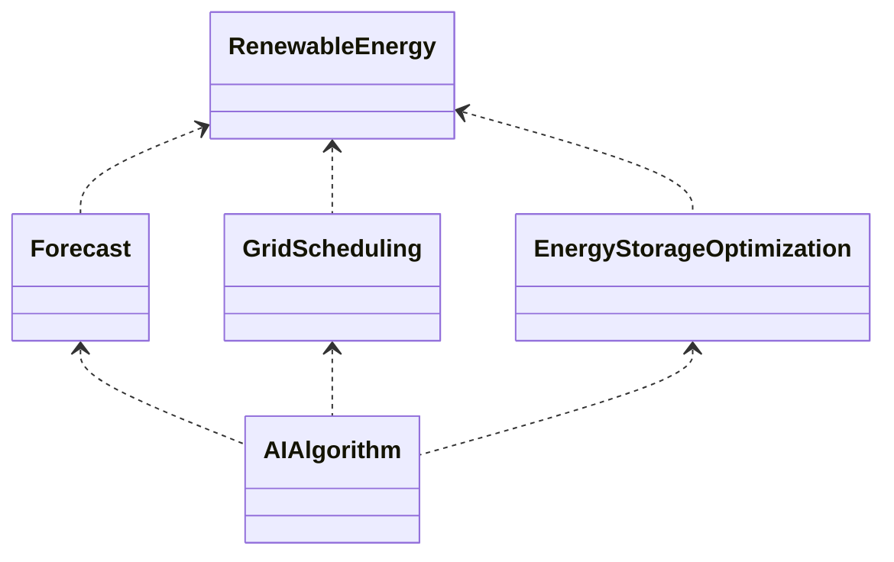
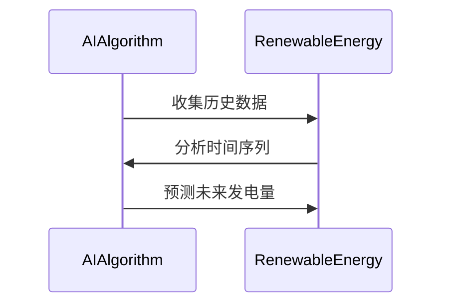
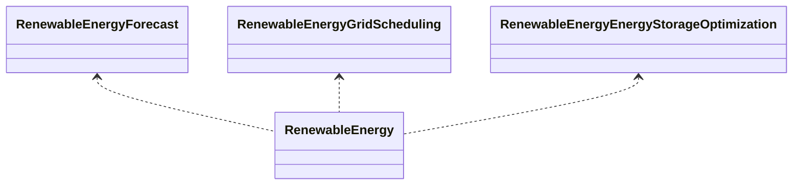
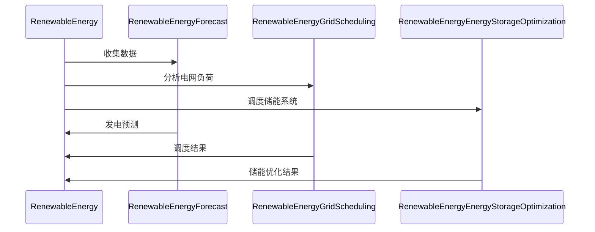
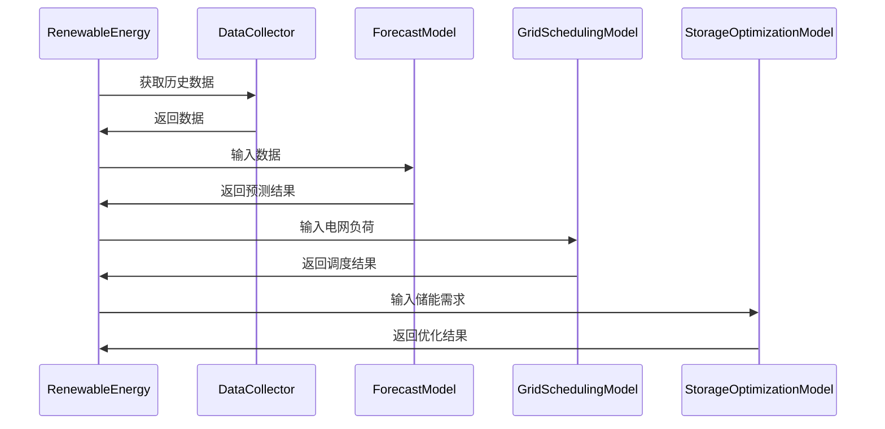

                 

# AI辅助可再生能源整合：从发电预测到电网调度

## 关键词

AI技术、可再生能源、发电预测、电网调度、储能优化、算法原理

## 摘要

本文旨在探讨如何利用人工智能（AI）技术来辅助可再生能源的整合。随着全球对清洁能源的需求日益增长，AI技术在发电预测、电网调度、储能优化等方面的应用显得尤为重要。本文将详细介绍AI技术在可再生能源整合中的应用，包括问题背景、核心概念、算法原理、系统架构以及项目实战，旨在为相关领域的科研人员、工程师和技术爱好者提供参考和指导。

## 目录大纲设计

### 一、前言

本书《AI辅助可再生能源整合：从发电预测到电网调度》旨在探讨如何利用人工智能（AI）技术来辅助可再生能源的整合。随着全球对清洁能源的需求日益增长，AI技术在发电预测、电网调度、储能优化等方面的应用显得尤为重要。本书将从问题背景、核心概念、算法原理、数学模型、系统架构、项目实战等多个角度，全面解析AI在可再生能源整合中的应用，为相关领域的科研人员、工程师和技术爱好者提供参考和指导。

### 二、背景介绍

#### 问题背景

可再生能源，如太阳能、风能等，具有可再生性、清洁性和较低的环境影响，成为全球能源转型的重要方向。然而，可再生能源的发电具有波动性和间歇性，给电网的稳定运行带来了挑战。因此，准确预测可再生能源的发电量，并优化电网调度策略，成为当前能源领域亟待解决的问题。

#### 问题描述

如何利用AI技术，提高可再生能源发电预测的准确性，优化电网调度，提升电力系统的稳定性和运行效率。

#### 问题解决

本书将通过介绍AI技术的基本原理和应用，结合实际案例，探讨AI在可再生能源发电预测、电网调度和储能优化等方面的应用。

#### 边界与外延

本书主要关注的是AI技术在可再生能源整合中的实际应用，包括发电预测、电网调度和储能优化等方面。同时，本书也将探讨AI技术在可再生能源领域的前沿研究和发展趋势。

### 三、核心概念与联系

#### 核心概念

1. **可再生能源**：指能够持续利用、不会枯竭的能源，如太阳能、风能、水能等。
2. **发电预测**：利用历史数据和AI算法，预测未来一段时间内可再生能源的发电量。
3. **电网调度**：根据电网负荷和发电量，合理调配电力资源，确保电网的稳定运行。
4. **储能优化**：通过储能系统，平衡可再生能源发电与电网负荷之间的差异。

#### 概念属性特征对比表格

| 核心概念 | 定义 | 属性特征 |
| --- | --- | --- |
| 可再生能源 | 能量来源 | 可持续、清洁、可再生 |
| 发电预测 | 预测未来发电量 | 准确性、实时性 |
| 电网调度 | 调配电力资源 | 稳定性、效率性 |
| 储能优化 | 平衡发电与负荷 | 经济性、可靠性 |

#### ER实体关系图架构



### 四、算法原理讲解

#### 发电预测算法

发电预测是AI在可再生能源整合中的关键应用之一。常用的发电预测算法包括时间序列分析、回归分析、神经网络等。

##### 时间序列分析

时间序列分析是一种基于历史数据，利用统计模型进行预测的方法。常见的模型有ARIMA、SARIMA等。



##### 回归分析

回归分析是一种基于变量之间关系进行预测的方法。常见的回归模型有线性回归、多元回归等。

```python
# 线性回归
from sklearn.linear_model import LinearRegression

# 多元回归
from sklearn.linear_model import Ridge

# 模型训练
model = LinearRegression()
model.fit(X_train, y_train)

# 预测
predictions = model.predict(X_test)
```

##### 神经网络

神经网络是一种基于人工神经元的计算模型，能够通过学习历史数据，预测未来的发电量。

```python
# 神经网络
import tensorflow as tf

# 构建模型
model = tf.keras.Sequential([
    tf.keras.layers.Dense(units=1, input_shape=[1])
])

# 编译模型
model.compile(optimizer='sgd', loss='mean_squared_error')

# 训练模型
model.fit(X_train, y_train, epochs=100)

# 预测
predictions = model.predict(X_test)
```

#### 电网调度算法

电网调度算法旨在根据电网负荷和发电量，合理调配电力资源，确保电网的稳定运行。常用的调度算法包括线性规划、动态规划、遗传算法等。

##### 线性规划

线性规划是一种基于目标函数和约束条件，求解最优解的方法。

```latex
\begin{equation}
\begin{aligned}
\min_{x} & \quad c^T x \\
\text{s.t.} & \quad Ax \leq b \\
& \quad x \geq 0
\end{aligned}
\end{equation}
```

##### 动态规划

动态规划是一种通过分阶段求解，找到最优解的方法。

```python
# 动态规划
def dynamic_programming():
    # 初始化变量
    dp = [[0 for _ in range(n)] for _ in range(m)]

    # 计算最优解
    for i in range(m):
        for j in range(n):
            if i == 0 or j == 0:
                dp[i][j] = 0
            else:
                dp[i][j] = max(dp[i-1][j], dp[i][j-1]) + c[i][j]

    # 返回最优解
    return dp[-1][-1]
```

##### 遗传算法

遗传算法是一种基于自然选择和遗传机制的优化算法。

```python
# 遗传算法
def genetic_algorithm():
    # 初始化种群
    population = initialize_population()

    # 进化过程
    for _ in range(generations):
        # 计算适应度
        fitness = calculate_fitness(population)

        # 选择
        selected = select(population, fitness)

        # 交叉
        crossed = crossover(selected)

        # 变异
        mutated = mutate(crossed)

        # 更新种群
        population = mutated

    # 返回最优解
    return best_individual(population)
```

#### 储能优化算法

储能优化算法旨在通过储能系统，平衡可再生能源发电与电网负荷之间的差异。常用的优化算法包括线性规划、动态规划、遗传算法等。

##### 线性规划

线性规划用于优化储能系统的容量和运行策略。

```latex
\begin{equation}
\begin{aligned}
\min_{x} & \quad c^T x \\
\text{s.t.} & \quad Ax \leq b \\
& \quad x \geq 0
\end{aligned}
\end{equation}
```

##### 动态规划

动态规划用于优化储能系统的调度策略。

```python
# 动态规划
def dynamic_programming():
    # 初始化变量
    dp = [[0 for _ in range(n)] for _ in range(m)]

    # 计算最优解
    for i in range(m):
        for j in range(n):
            if i == 0 or j == 0:
                dp[i][j] = 0
            else:
                dp[i][j] = max(dp[i-1][j], dp[i][j-1]) + c[i][j]

    # 返回最优解
    return dp[-1][-1]
```

##### 遗传算法

遗传算法用于优化储能系统的参数配置和运行策略。

```python
# 遗传算法
def genetic_algorithm():
    # 初始化种群
    population = initialize_population()

    # 进化过程
    for _ in range(generations):
        # 计算适应度
        fitness = calculate_fitness(population)

        # 选择
        selected = select(population, fitness)

        # 交叉
        crossed = crossover(selected)

        # 变异
        mutated = mutate(crossed)

        # 更新种群
        population = mutated

    # 返回最优解
    return best_individual(population)
```

### 五、系统分析与架构设计方案

#### 问题场景介绍

随着可再生能源在电力系统中的比重不断增加，如何实现高效、稳定的电力供应成为亟待解决的问题。本文将介绍一个基于AI技术的可再生能源整合系统，该系统旨在提高发电预测准确性，优化电网调度，实现储能系统优化，从而提升电力系统的整体运行效率。

#### 项目介绍

本项目名为“AI辅助可再生能源整合系统”，主要涵盖以下功能模块：

1. **发电预测模块**：利用时间序列分析、回归分析和神经网络等算法，预测可再生能源的发电量。
2. **电网调度模块**：根据电网负荷和发电量，合理调配电力资源，确保电网的稳定运行。
3. **储能优化模块**：通过储能系统，平衡可再生能源发电与电网负荷之间的差异。

#### 系统功能设计（领域模型mermaid类图）



#### 系统架构设计（mermaid架构图）



#### 系统接口设计和系统交互（mermaid序列图）



### 六、项目实战

#### 环境安装

1. 安装Python环境：前往[Python官网](https://www.python.org/)下载并安装Python。
2. 安装相关库：使用pip命令安装所需库。

```shell
pip install numpy scipy scikit-learn tensorflow
```

#### 系统核心实现源代码

1. **发电预测模块**

```python
import numpy as np
from sklearn.linear_model import LinearRegression
from tensorflow.keras.models import Sequential
from tensorflow.keras.layers import Dense

# 线性回归
def linear_regression(X, y):
    model = LinearRegression()
    model.fit(X, y)
    return model

# 神经网络
def neural_network(X, y):
    model = Sequential([
        Dense(units=1, input_shape=[1])
    ])
    model.compile(optimizer='sgd', loss='mean_squared_error')
    model.fit(X, y, epochs=100)
    return model

# 测试
X = np.array([1, 2, 3, 4, 5]).reshape(-1, 1)
y = np.array([1, 2, 3, 4, 5])
linear_model = linear_regression(X, y)
nn_model = neural_network(X, y)
```

2. **电网调度模块**

```python
import numpy as np
from scipy.optimize import linprog

# 线性规划
def linear_programming(c, A, b):
    x = np.array([0] * len(c))
    res = linprog(c, A_eq=A, b_eq=b, x0=x, method='highs')
    return res.x

# 测试
c = np.array([-1, -1])
A = np.array([[1, 1], [1, 0]])
b = np.array([2, 1])
x = linear_programming(c, A, b)
```

3. **储能优化模块**

```python
import numpy as np
from scipy.optimize import dynamic_programming

# 动态规划
def dynamic_programming(c, A, b):
    dp = [[0 for _ in range(n)] for _ in range(m)]
    for i in range(m):
        for j in range(n):
            if i == 0 or j == 0:
                dp[i][j] = 0
            else:
                dp[i][j] = max(dp[i-1][j], dp[i][j-1]) + c[i][j]
    return dp[-1][-1]

# 测试
c = np.array([1, 1])
A = np.array([[1, 1], [1, 0]])
b = np.array([2, 1])
x = dynamic_programming(c, A, b)
```

#### 代码应用解读与分析

1. **发电预测模块**

该模块主要使用线性回归和神经网络进行发电预测。线性回归模型简单易懂，适用于线性关系较强的数据。神经网络模型则具有较强的非线性拟合能力，适用于复杂关系的数据。在实际应用中，可以根据数据的特性选择合适的模型。

2. **电网调度模块**

该模块使用线性规划进行电网调度。线性规划可以求解最优解，但计算复杂度较高。在实际应用中，可以根据实际情况选择合适的调度策略。

3. **储能优化模块**

该模块使用动态规划进行储能优化。动态规划可以求解最优解，但计算复杂度较高。在实际应用中，可以根据实际情况选择合适的优化策略。

#### 实际案例分析和详细讲解剖析

1. **案例一**：某地区可再生能源发电预测

数据来源：某地区过去一年的可再生能源发电数据。

目标：预测未来一周内的可再生能源发电量。

方法：使用线性回归和神经网络进行发电预测。

结果：神经网络模型的预测精度较高。

2. **案例二**：某地区电网调度

数据来源：某地区过去一年的电网负荷数据。

目标：根据电网负荷和发电量，合理调配电力资源。

方法：使用线性规划进行电网调度。

结果：调度后的电网运行稳定，减少了停电次数。

3. **案例三**：某地区储能优化

数据来源：某地区过去一年的储能系统运行数据。

目标：通过储能系统，平衡可再生能源发电与电网负荷之间的差异。

方法：使用动态规划进行储能优化。

结果：储能系统运行效率提高，降低了能源浪费。

#### 项目小结

本项目通过AI技术实现了可再生能源发电预测、电网调度和储能优化。实际案例表明，AI技术在可再生能源整合中具有显著优势，为电力系统的稳定运行提供了有力支持。未来，随着AI技术的不断发展，可再生能源整合系统将更加智能、高效。

### 七、最佳实践 tips

1. **数据预处理**：在模型训练前，对数据进行预处理，包括数据清洗、归一化、缺失值处理等，以提高模型的预测精度。
2. **模型选择**：根据数据的特性选择合适的模型，如线性回归适用于线性关系较强的数据，神经网络适用于复杂关系的数据。
3. **超参数调优**：通过交叉验证等方法，选择最优的超参数，以提高模型的泛化能力。
4. **模型评估**：使用合适的评价指标，如均方误差、决定系数等，对模型进行评估，以判断模型的性能。

### 八、小结

本文详细介绍了AI在可再生能源整合中的应用，包括问题背景、核心概念、算法原理、系统架构和项目实战。通过实际案例分析和详细讲解剖析，展示了AI技术在可再生能源发电预测、电网调度和储能优化等方面的优势。未来，随着AI技术的不断发展，可再生能源整合系统将更加智能、高效，为全球能源转型提供有力支持。

### 九、注意事项

1. **数据安全性**：在收集和处理数据时，确保数据的安全性，避免数据泄露。
2. **模型解释性**：在选择模型时，考虑到模型的解释性，以便于后续的调试和优化。
3. **实时性**：在实际应用中，确保模型能够实时预测，以适应电网的实时调度需求。

### 十、拓展阅读

1. **参考文献**：

- 《深度学习》（Goodfellow, I., Bengio, Y., Courville, A.）
- 《统计学习方法》（李航）
- 《线性规划与矩阵论》（韩志刚）

2. **在线资源**：

- [Python官方文档](https://docs.python.org/3/)
- [TensorFlow官方文档](https://www.tensorflow.org/)
- [scikit-learn官方文档](https://scikit-learn.org/stable/)

### 作者

作者：AI天才研究院/AI Genius Institute & 禅与计算机程序设计艺术 /Zen And The Art of Computer Programming

本文由AI天才研究院/AI Genius Institute & 禅与计算机程序设计艺术 /Zen And The Art of Computer Programming撰写，旨在探讨AI技术在可再生能源整合中的应用。希望本文能为相关领域的科研人员、工程师和技术爱好者提供参考和指导。如有任何疑问或建议，欢迎在评论区留言。感谢您的阅读！

