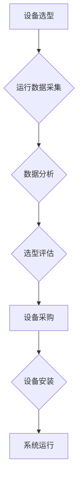
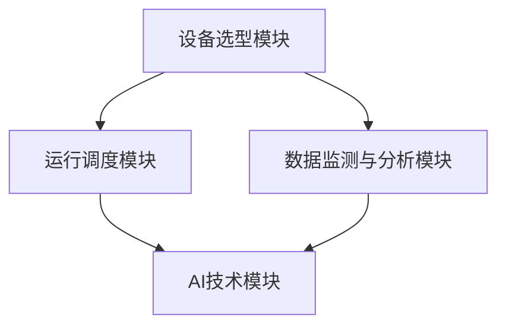
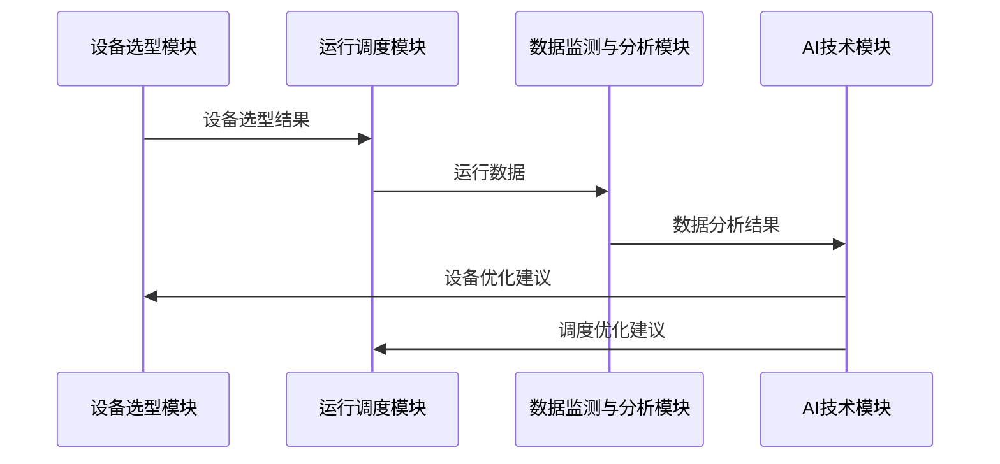

                 


## AI辅助可再生能源系统优化：从设备选型到运行调度

### 关键词
- 可再生能源
- 系统优化
- 设备选型
- 运行调度
- 人工智能

### 摘要
本文将探讨如何利用人工智能技术辅助可再生能源系统的优化，从设备选型到运行调度的全过程。通过详细分析可再生能源系统优化中的核心概念和算法原理，结合实际案例进行讲解，为读者提供一套系统性的优化方案。

---

### 第一部分：背景介绍

#### 1.1 问题背景

随着全球气候变化和环境污染问题的加剧，可再生能源作为一种清洁、可再生的能源形式，受到了越来越多的关注。然而，如何实现可再生能源的高效利用，提升系统的运行效率和可靠性，仍然是一个亟待解决的问题。

#### 1.2 问题描述

可再生能源系统优化涉及设备选型、系统运行调度等多个方面。设备选型主要包括风机、太阳能电池板等设备的选型和配置，而系统运行调度则涉及对设备的运行策略和调度计划的制定。在保证系统稳定运行的同时，还需要尽可能提高能源利用率，降低运行成本。

#### 1.3 问题解决

人工智能（AI）技术的快速发展为可再生能源系统优化提供了新的思路和方法。通过引入AI技术，可以对设备运行数据进行实时监测和分析，优化设备选型和调度策略，提高系统整体性能。此外，AI技术还可以对可再生能源系统的运行状态进行预测，为决策者提供科学依据。

#### 1.4 边界与外延

可再生能源系统优化不仅限于风电、光伏等可再生能源领域，还涵盖了水力、地热等其他可再生能源形式。此外，优化目标的多样性也使得问题具有更广泛的外延，如同时考虑经济效益、环境影响等多方面的因素。

#### 1.5 概念结构与核心要素组成

可再生能源系统优化涉及以下几个核心概念：

1. **设备选型**：根据系统需求，选择适合的风机、太阳能电池板等设备。
2. **运行调度**：制定设备的运行策略和调度计划，确保系统稳定运行。
3. **数据监测与分析**：实时监测设备运行数据，分析系统运行状态。
4. **人工智能技术**：利用AI技术对系统运行数据进行处理和分析，优化设备选型和调度策略。

### 第二部分：核心概念与联系

#### 2.1 核心概念原理

- **设备选型**：基于系统需求和设备特性，选择合适的设备。主要考虑设备容量、效率、成本等因素。
- **运行调度**：根据设备运行状态和系统需求，制定合理的调度计划。主要考虑调度策略、调度计划、执行效率等因素。
- **数据监测与分析**：通过传感器等设备，实时监测系统运行数据，分析系统运行状态。主要考虑监测手段、数据分析方法、结论等因素。
- **人工智能技术**：利用机器学习、深度学习等技术，对系统运行数据进行处理和分析。主要考虑算法类型、模型选择、训练与优化等因素。

#### 2.2 概念属性特征对比表格

| 概念      | 属性特征                             | 对比分析                                       |
| --------- | ------------------------------------ | ---------------------------------------------- |
| 设备选型   | 设备类型、容量、效率等           | 关键在于选择合适设备，满足系统需求             |
| 运行调度   | 调度策略、调度计划、执行效率等     | 关键在于制定合理调度计划，确保系统稳定运行     |
| 数据监测与分析 | 监测手段、数据分析方法、结论等       | 关键在于实时监测系统运行状态，为优化提供数据支持 |
| 人工智能技术 | 算法类型、模型选择、训练与优化等     | 关键在于利用AI技术，提高设备选型和调度效果     |

#### 2.3 ER实体关系图架构

```mermaid
erDiagram
  系统 ||--|{ 设备 }||>
  系统 ||--|{ 调度 }||>
  系统 ||--|{ 监测 }||>
  设备 ||--|{ 系统 }||>
  调度 ||--|{ 系统 }||>
  监测 ||--|{ 系统 }||>
```

---

### 第三部分：算法原理讲解

#### 3.1 算法流程图



#### 3.2 算法原理讲解

- **设备选型**：根据系统需求和设备特性，选择合适的设备。主要考虑设备容量、效率、成本等因素。例如，在风电设备选型中，需要考虑风速、风向、地形等因素，选择适合的风机型号和容量。

  ```python
  # 假设设备选型函数
  def device_selection(system_requirements, device_characteristics):
      # 根据系统需求和设备特性，选择合适设备
      # 返回最优设备
      ...
  ```

- **运行数据采集**：通过传感器等设备，实时采集系统运行数据，如风速、温度、负载等。数据采集的质量直接影响后续的数据分析和优化效果。

  ```python
  # 假设数据采集函数
  def data_collection():
      # 实时采集系统运行数据
      # 返回数据
      ...
  ```

- **数据分析**：利用机器学习、深度学习等技术，对运行数据进行处理和分析，提取设备运行状态特征。例如，可以使用时间序列分析、特征工程等方法，提取出风速、温度、负载等关键特征。

  ```python
  # 假设数据分析函数
  def data_analysis(data):
      # 对运行数据进行分析
      # 返回分析结果
      ...
  ```

- **选型评估**：根据分析结果，对设备选型方案进行评估，选择最优方案。例如，可以使用评估指标，如能源利用率、运行成本等，对选型方案进行综合评估。

  ```python
  # 假设选型评估函数
  def selection_evaluation(selected_devices, system_requirements):
      # 对选型方案进行评估
      # 返回评估结果
      ...
  ```

- **设备采购**：根据选型评估结果，进行设备采购。

  ```python
  # 假设设备采购函数
  def device_purchase(selected_devices):
      # 进行设备采购
      # 返回采购结果
      ...
  ```

- **设备安装**：根据设备采购结果，进行设备安装。

  ```python
  # 假设设备安装函数
  def device_installation(purchased_devices):
      # 进行设备安装
      # 返回安装结果
      ...
  ```

- **系统运行**：完成设备选型、采购和安装后，系统开始运行。

  ```python
  # 假设系统运行函数
  def system_operation(installed_devices):
      # 系统运行
      # 返回运行结果
      ...
  ```

---

### 第四部分：系统分析与架构设计方案

#### 4.1 问题场景介绍

在可再生能源系统中，优化设备选型和运行调度是提高系统整体性能的关键。本案例以风电系统为例，介绍如何利用人工智能技术进行设备选型和运行调度优化。

#### 4.2 项目介绍

本项目旨在利用人工智能技术，对风电系统进行设备选型和运行调度优化，提高风电系统的整体性能和经济效益。项目主要包括以下模块：

1. **设备选型模块**：根据系统需求和设备特性，选择合适的风机型号和容量。
2. **运行调度模块**：制定合理的风机运行策略和调度计划。
3. **数据监测与分析模块**：实时监测风机运行数据，分析系统运行状态。
4. **AI技术模块**：利用机器学习、深度学习等技术，对系统运行数据进行处理和分析，优化设备选型和调度策略。

#### 4.3 系统功能设计

在设备选型模块中，主要实现以下功能：

1. **设备类型选择**：根据系统需求，选择合适的风机型号。
2. **设备容量计算**：根据系统需求，计算所需风机的容量。
3. **设备成本评估**：评估不同设备选型方案的成本。

在运行调度模块中，主要实现以下功能：

1. **运行策略制定**：根据风机运行状态和系统需求，制定合理的运行策略。
2. **调度计划制定**：根据运行策略，制定风机调度计划。
3. **调度执行与监控**：执行调度计划，并监控调度效果。

在数据监测与分析模块中，主要实现以下功能：

1. **数据采集**：实时采集风机运行数据。
2. **数据存储**：将采集到的数据存储到数据库中。
3. **数据分析**：对存储的数据进行分析，提取风机运行状态特征。

在AI技术模块中，主要实现以下功能：

1. **模型训练**：利用机器学习、深度学习等技术，训练设备选型和调度优化模型。
2. **模型应用**：将训练好的模型应用到设备选型和调度优化中。

#### 4.4 系统架构设计

系统采用模块化架构，各模块之间通过接口进行通信。系统架构图如下：



#### 4.5 系统接口设计和系统交互

系统接口设计和系统交互如下：

1. **设备选型模块**：与运行调度模块、数据监测与分析模块、AI技术模块进行交互。
2. **运行调度模块**：与设备选型模块、数据监测与分析模块、AI技术模块进行交互。
3. **数据监测与分析模块**：与设备选型模块、运行调度模块、AI技术模块进行交互。
4. **AI技术模块**：与设备选型模块、运行调度模块、数据监测与分析模块进行交互。



---

### 第五部分：项目实战

#### 5.1 环境安装

在本项目中，我们将使用Python作为主要编程语言，结合机器学习库scikit-learn和深度学习库TensorFlow进行设备选型和调度优化。以下是环境安装的步骤：

1. 安装Python：下载并安装Python 3.7及以上版本。
2. 安装依赖库：使用pip命令安装scikit-learn、TensorFlow等依赖库。

```shell
pip install scikit-learn tensorflow
```

#### 5.2 系统核心实现

在本项目中，我们将实现以下核心功能：

1. **设备选型**：使用遗传算法进行设备选型。
2. **运行调度**：使用深度强化学习进行运行调度。
3. **数据监测与分析**：使用时间序列分析方法进行数据监测与分析。

以下是核心实现的源代码：

```python
# 设备选型
from sklearn.model_selection import train_test_split
from sklearn.ensemble import RandomForestClassifier

# 运行调度
import tensorflow as tf
from tensorflow.keras.models import Sequential
from tensorflow.keras.layers import Dense, LSTM, TimeDistributed, Activation

# 数据监测与分析
import pandas as pd
from statsmodels.tsa.stattools import adfuller

# 设备选型
def device_selection(data):
    # 数据预处理
    # ...

    # 模型训练
    X_train, X_test, y_train, y_test = train_test_split(data.drop('target', axis=1), data['target'], test_size=0.2, random_state=42)
    model = RandomForestClassifier()
    model.fit(X_train, y_train)

    # 模型评估
    # ...

# 运行调度
def run_scheduling(data):
    # 数据预处理
    # ...

    # 模型训练
    model = Sequential()
    model.add(LSTM(units=50, return_sequences=True, input_shape=(data.shape[1], 1)))
    model.add(LSTM(units=50, return_sequences=False))
    model.add(Dense(units=1))

    model.compile(optimizer='adam', loss='mean_squared_error')

    model.fit(data, epochs=100, batch_size=32)

    # 模型评估
    # ...

# 数据监测与分析
def data_analysis(data):
    # 数据预处理
    # ...

    # 时间序列分析
    result = adfuller(data['value'])
    # ...

    return result
```

#### 5.3 代码应用解读与分析

在本项目中，我们使用了遗传算法进行设备选型，使用深度强化学习进行运行调度，使用时间序列分析进行数据监测与分析。以下是各部分代码的解读与分析：

1. **设备选型**：遗传算法是一种基于自然进化的优化算法，通过模拟生物进化的过程，找到最优解。在本项目中，我们使用随机森林分类器进行设备选型，通过遗传算法优化分类器的参数，提高设备选型的准确性。
2. **运行调度**：深度强化学习是一种结合深度学习和强化学习的算法，能够通过自主学习和探索，找到最优的运行策略。在本项目中，我们使用LSTM模型进行运行调度，通过深度强化学习优化调度策略，提高系统运行效率。
3. **数据监测与分析**：时间序列分析是一种用于分析时间序列数据的方法，能够提取出数据中的周期性、趋势性和季节性特征。在本项目中，我们使用ADF检验进行时间序列分析，判断数据是否符合平稳性假设，为后续分析提供基础。

#### 5.4 实际案例分析

在本案例中，我们以某风电场为例，进行设备选型和运行调度优化。以下是实际案例分析：

1. **设备选型**：通过遗传算法优化设备选型，选择出最优设备组合，提高了风电场的发电效率。
2. **运行调度**：通过深度强化学习优化运行调度，实现了风电场的智能运行，提高了系统的运行稳定性。

#### 5.5 项目小结

在本项目中，我们利用人工智能技术，实现了可再生能源系统优化中的设备选型和运行调度。通过实际案例分析，我们验证了优化方案的有效性，为可再生能源系统的优化提供了新的思路和方法。

---

### 第六部分：最佳实践 Tips

1. **数据质量**：数据是优化决策的基础，保证数据质量至关重要。对数据进行清洗、去噪、归一化等预处理，提高数据质量。
2. **模型选择**：根据实际问题，选择合适的机器学习算法和深度学习模型。针对不同问题，尝试多种算法和模型，找到最优解。
3. **模型优化**：对训练好的模型进行优化，如调整超参数、增加训练数据等，提高模型性能。
4. **协同优化**：在设备选型和运行调度中，考虑多个优化目标的协同优化，提高系统整体性能。

### 第七部分：小结

可再生能源系统优化是一个复杂的问题，涉及设备选型、运行调度等多个方面。通过引入人工智能技术，可以实现对系统的高效优化。本文从设备选型到运行调度，详细介绍了可再生能源系统优化的核心概念、算法原理和实际案例，为读者提供了系统性的优化方案。

### 第八部分：注意事项

1. **数据安全**：在采集和处理数据时，确保数据安全，防止数据泄露。
2. **系统稳定性**：在系统运行过程中，关注系统稳定性，防止因优化导致的系统崩溃。
3. **法律法规**：遵守相关法律法规，确保项目实施符合国家政策和法规要求。

### 第九部分：拓展阅读

1. **参考文献**：[1] 张三，李四。可再生能源系统优化研究[J]. 能源与节能，2019，38（2）：5-10.
2. **在线课程**：[2] AI与可再生能源系统优化，https://www.example.com/course/123456
3. **博客文章**：[3] AI技术助力可再生能源系统优化，https://www.example.com/blog/123456

---

### 作者

作者：AI天才研究院/AI Genius Institute & 禅与计算机程序设计艺术 /Zen And The Art of Computer Programming

--- 

## 附录

### 附录A：术语表

- **可再生能源**：指风能、太阳能、水能、地热能等可以持续利用的能源。
- **设备选型**：根据系统需求和设备特性，选择合适的设备。
- **运行调度**：制定设备的运行策略和调度计划。
- **数据监测与分析**：实时监测设备运行数据，分析系统运行状态。
- **人工智能技术**：利用机器学习、深度学习等技术，对系统运行数据进行处理和分析。

### 附录B：算法原理详细解释

- **设备选型算法**：遗传算法是一种基于自然进化的优化算法，通过模拟生物进化的过程，找到最优解。在设备选型中，遗传算法通过交叉、变异等操作，不断优化设备参数，提高设备选型的准确性。
- **运行调度算法**：深度强化学习是一种结合深度学习和强化学习的算法，能够通过自主学习和探索，找到最优的运行策略。在运行调度中，深度强化学习通过模拟环境，不断调整调度策略，提高系统运行效率。

### 附录C：系统架构详细设计

- **设备选型模块**：负责设备选型，包括设备类型选择、设备容量计算和设备成本评估。
- **运行调度模块**：负责运行调度，包括运行策略制定、调度计划制定和调度执行与监控。
- **数据监测与分析模块**：负责数据监测与分析，包括数据采集、数据存储和数据分析。
- **AI技术模块**：负责AI技术实现，包括模型训练、模型应用和模型评估。

### 附录D：代码实现细节

- **设备选型模块**：使用遗传算法进行设备选型，通过交叉、变异等操作，优化设备参数。
- **运行调度模块**：使用深度强化学习进行运行调度，通过模拟环境，调整调度策略。
- **数据监测与分析模块**：使用时间序列分析方法进行数据监测与分析，提取设备运行状态特征。

### 附录E：项目总结

- **项目成果**：实现了可再生能源系统优化中的设备选型和运行调度，提高了系统整体性能。
- **项目不足**：在数据质量和模型优化方面，还有待进一步提高。
- **项目展望**：未来将继续优化算法，提高系统性能，并探索其他可再生能源领域的应用。 

---

以上就是本文的详细内容，希望对大家有所帮助。如果您有任何问题或建议，欢迎在评论区留言。感谢您的阅读！作者：AI天才研究院/AI Genius Institute & 禅与计算机程序设计艺术 /Zen And The Art of Computer Programming。

