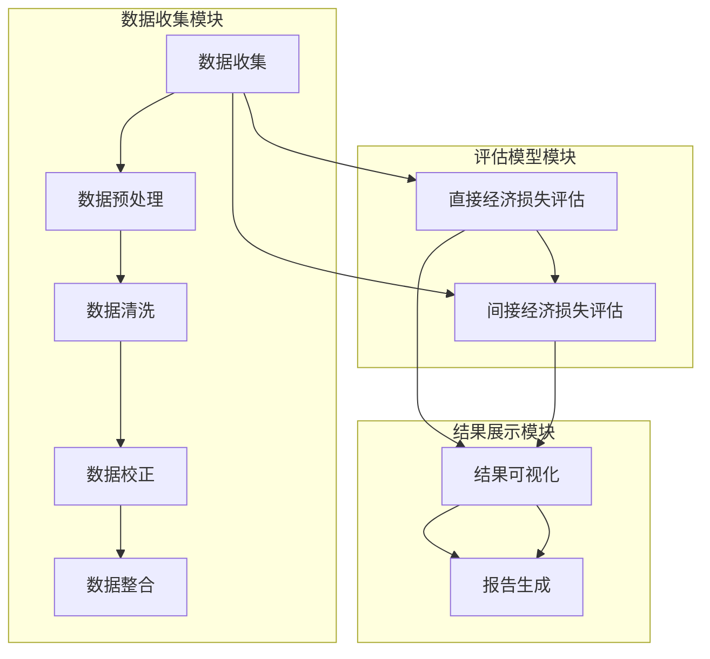

                 


### 第一部分：引言与背景

#### 第1章：引言

### 1.1 问题背景

地震作为一种自然灾害，其破坏力巨大，不仅对地表建筑物和基础设施造成严重破坏，还可能引发一系列次生灾害，如山体滑坡、海啸、火灾等。因此，地震灾害的评估和应对成为自然灾害管理的重要环节。地震灾害链是指由一次地震事件触发的一系列次生灾害，包括地震本身、地面变形、建筑物破坏以及后续可能发生的各种次生灾害。这些灾害不仅对人们的生命财产安全构成威胁，还对社会经济造成深远影响。

### 1.2 研究目的与意义

本文旨在利用人工智能（AI）技术，对地震灾害链的影响进行综合评估，以提高地震灾害管理的科学性和有效性。研究目的包括以下几个方面：

1. **地表变形监测**：通过AI技术，对地震后的地表变形进行实时监测，提供准确的数据支持。
2. **社会经济损失评估**：利用AI技术，对社会经济影响进行定量评估，为灾害管理和决策提供依据。
3. **灾害链影响预测**：通过分析历史地震灾害数据，利用机器学习模型预测地震灾害链的未来影响。

研究意义主要体现在以下几个方面：

1. **提升灾害预警能力**：通过实时地表变形监测，可以提前预警潜在的次生灾害，为灾害应对赢得宝贵时间。
2. **优化灾害管理决策**：通过对社会经济影响的定量评估，为政府和相关部门提供科学依据，优化灾害管理策略。
3. **提高灾害防治水平**：通过研究灾害链影响评估方法，为地震灾害防治提供技术支持，降低灾害风险。

### 1.3 边界与外延

本文研究的边界主要涉及以下几个方面：

1. **技术范畴**：本文主要研究AI技术在地震灾害链影响评估中的应用，包括地表变形监测和社会经济损失评估。
2. **地理范畴**：本文的研究范围主要集中在地震频发地区，如中国、日本、美国等国家和地区。
3. **时间范畴**：本文主要关注近期地震灾害的影响评估，包括历史地震灾害的数据分析和未来地震灾害的预测。

在研究外延方面，本文还将探讨AI技术在地震灾害管理中的其他潜在应用，如灾害风险分析、灾后重建规划等。

### 1.4 研究方法与结构

本文的研究方法主要包括以下几个方面：

1. **文献综述**：通过查阅相关文献，了解地震灾害链影响评估的现状和发展趋势。
2. **数据收集**：收集地震灾害数据，包括地表变形监测数据和社会经济数据。
3. **模型建立**：建立地表变形监测模型和社会经济损失评估模型，利用机器学习算法进行训练和预测。
4. **案例分析**：通过实际案例，验证模型的有效性和实用性。

文章结构安排如下：

1. **第一部分**：引言与背景介绍，包括问题背景、研究目的、边界与外延以及研究方法与结构。
2. **第二部分**：地表变形监测技术，包括监测原理、常见方法、数据处理与分析。
3. **第三部分**：社会经济损失评估方法，包括评估原理、模型建立、实践应用。
4. **第四部分**：AI辅助地震灾害链影响评估，包括技术应用、系统设计、实战案例。
5. **第五部分**：总结与展望，包括总结、展望、注意事项与拓展阅读。

通过以上结构安排，本文将全面、系统地探讨地震灾害链影响评估的AI技术应用，为地震灾害管理提供科学依据和技术支持。

#### 第2章：地震灾害链概述

### 2.1 地震灾害链的概念与特征

地震灾害链是指在地震发生过程中，由地震本身及其引发的次生灾害所形成的一系列灾害事件。地震灾害链不仅包括地震本身，还涵盖了地震引发的地面变形、建筑物破坏、山体滑坡、海啸、火灾等次生灾害。这些灾害事件相互关联，形成一个复杂的动态系统。

地震灾害链的特征主要表现在以下几个方面：

1. **多样性**：地震灾害链包含多种类型的灾害，如地震、滑坡、海啸等，这些灾害在时间和空间上具有不同的特征和影响范围。
2. **连锁性**：地震灾害链中的各种灾害事件往往是相互关联、连锁发生的。一次地震可能引发多次次生灾害，形成连锁反应。
3. **破坏性**：地震灾害链中的灾害事件具有巨大的破坏力，不仅对建筑物和基础设施造成破坏，还可能对生态环境和人类生命财产安全造成严重影响。
4. **复杂性**：地震灾害链的复杂性和不确定性使得灾害评估和应对具有很大的挑战性。需要综合利用多种技术手段，进行综合评估和预警。

### 2.2 地震灾害链的组成

地震灾害链通常由以下几个组成部分构成：

1. **地震本身**：地震是地震灾害链的起点，也是引发其他次生灾害的根源。地震的发生通常伴随着地面震动，可能导致建筑物倒塌、道路损坏等。
2. **地面变形**：地震引发的地面变形包括地表沉降、地裂缝、地面塌陷等。这些变形可能导致建筑物倾斜、道路中断，甚至引发山体滑坡等次生灾害。
3. **建筑物破坏**：地震引发的地面变形和震动对建筑物造成破坏，可能导致建筑物倒塌、开裂、倾斜等。建筑物的破坏不仅影响人们的居住和安全，还对社会经济造成严重影响。
4. **次生灾害**：地震引发的次生灾害包括山体滑坡、海啸、火灾等。这些灾害事件在地震发生后的短时间内可能发生，对人们的生命财产安全构成巨大威胁。

### 2.3 地震灾害链的影响因素

地震灾害链的影响因素多种多样，主要包括以下几个方面：

1. **地震强度**：地震的震级和烈度直接影响地震灾害链的强度和范围。震级越高、烈度越强，地震灾害链的破坏性越大。
2. **地质条件**：地质条件是地震灾害链发生的重要影响因素。不同地质条件下的地震灾害链特征和影响范围可能存在显著差异。
3. **建筑结构**：建筑物的结构类型、质量、抗震能力等直接影响地震灾害链对建筑物的破坏程度。抗震性能良好的建筑物在地震中受损较小。
4. **生态环境**：生态环境对地震灾害链的影响也不可忽视。例如，地震可能引发山体滑坡，导致生态环境恶化，影响人类的生存环境。
5. **人类活动**：人类活动对地震灾害链的影响主要体现在两个方面：一是人类活动可能加剧地震灾害链的发生，如过度开采地下水可能导致地面变形；二是人类活动可能改变地震灾害链的传播路径，如道路建设可能改变地震波传播的路径。

### 2.4 地震灾害链的研究现状

近年来，随着地震灾害链研究的深入，学术界和工程界已经取得了一系列重要成果：

1. **地震灾害链评估模型**：研究人员基于地震学、地质学、建筑结构学等多学科知识，建立了地震灾害链的评估模型，为地震灾害管理提供了科学依据。
2. **地表变形监测技术**：利用遥感技术、地理信息系统（GIS）等现代技术手段，对地震后的地表变形进行实时监测，提高了地表变形监测的精度和效率。
3. **社会经济损失评估方法**：通过统计学、经济学等方法，对社会经济影响进行定量评估，为地震灾害管理和决策提供了数据支持。
4. **灾害风险管理**：基于地震灾害链的特点和影响因素，提出了灾害风险管理的策略和方法，为减少地震灾害风险提供了指导。
5. **AI技术在地震灾害链研究中的应用**：人工智能技术在地震灾害链研究中的应用日益广泛，如利用机器学习模型进行地震灾害预测、灾害评估等。

然而，地震灾害链研究仍存在一些挑战和问题，如地震灾害链的复杂性、数据收集和处理的困难等。未来的研究需要进一步深化，以应对这些挑战，提高地震灾害链评估和管理的科学性和有效性。

#### 第3章：地表变形监测技术

### 3.1 地表变形监测的基本概念

地表变形监测是指利用各种技术手段对地球表面形态的变化进行监测和测量，以获取地表变形的时空分布特征和规律。地表变形监测是地震灾害链研究中的重要环节，对于评估地震灾害的影响、预测次生灾害的发生具有重要意义。

地表变形监测的基本概念包括以下几个方面：

1. **地表变形**：地表变形是指地球表面形态的变化，包括地表沉降、地面裂缝、地陷、地面隆起等。这些变形可能由地震、地质构造运动、人类活动等因素引起。
2. **监测目标**：地表变形监测的主要目标是获取地表变形的时空分布特征，包括变形的大小、方向、速率、变形区域等。
3. **监测手段**：地表变形监测主要利用遥感技术、地理信息系统（GIS）、全球导航卫星系统（GNSS）、激光雷达（LiDAR）等技术手段。

### 3.2 地表变形监测技术分类

地表变形监测技术根据监测原理和手段的不同，可以分为以下几类：

1. **遥感技术**：遥感技术是利用卫星或航空器搭载的传感器，从远距离获取地表信息。遥感技术包括光学遥感、雷达遥感、激光遥感等。光学遥感主要用于获取地表图像，雷达遥感主要用于获取地表表面的反射信号，激光遥感主要用于获取地表的激光扫描数据。
2. **地理信息系统（GIS）**：地理信息系统是一种用于捕获、存储、管理、分析和可视化地理空间数据的计算机软件系统。GIS技术可以用于地表变形监测数据的处理、分析和可视化，支持空间数据的整合和管理。
3. **全球导航卫星系统（GNSS）**：全球导航卫星系统是一种卫星导航系统，通过接收卫星信号，可以确定接收器的位置。GNSS技术主要用于高精度地表变形监测，如利用全球定位系统（GPS）进行地面监测。
4. **激光雷达（LiDAR）**：激光雷达是一种通过发射激光束扫描目标物体，测量激光反射时间来确定目标物体表面特征的高精度测量技术。LiDAR技术可以获取地表的三维数据，用于地表变形监测。

### 3.3 地表变形监测数据预处理

地表变形监测数据预处理是地表变形监测的重要环节，主要包括以下步骤：

1. **数据采集**：地表变形监测数据来源于遥感、GNSS、LiDAR等技术手段。数据采集过程中需要注意数据的准确性和完整性。
2. **数据清洗**：数据清洗是指去除数据中的噪声、异常值和冗余数据，以提高数据质量。数据清洗方法包括统计分析、聚类分析、回归分析等。
3. **数据校正**：数据校正是指对采集到的数据进行几何校正、时间校正、大气校正等，以消除系统误差和随机误差，提高数据的精度和可靠性。
4. **数据整合**：地表变形监测数据可能来源于不同的技术手段，需要进行数据整合，以形成统一的数据格式。数据整合方法包括空间插值、数据融合等。
5. **数据可视化**：数据可视化是将地表变形监测数据通过图形、图像等形式进行展示，以直观地了解地表变形的时空分布特征。数据可视化方法包括散点图、热力图、三维图等。

### 3.4 常见地表变形监测方法

地表变形监测方法根据监测手段和技术的不同，可以分为以下几种常见方法：

1. **光学遥感**：光学遥感通过卫星或航空器搭载的可见光、红外、多光谱等传感器，获取地表的图像数据。光学遥感可以实时监测地表变形，具有覆盖范围广、监测周期短等优点。但光学遥感受天气和光照条件的影响较大，且分辨率相对较低。
2. **雷达遥感**：雷达遥感通过卫星或航空器搭载的雷达传感器，获取地表的反射信号。雷达遥感不受天气和光照条件的限制，可以全天候、全天时进行监测，且具有高分辨率、高精度的特点。雷达遥感适用于复杂地形和植被覆盖地区的地表变形监测。
3. **GNSS技术**：GNSS技术通过接收卫星信号，确定接收器的位置。GNSS技术可以实现高精度的地表变形监测，尤其适用于城市和山区等复杂地形。但GNSS技术对卫星信号的依赖性较强，易受地形和大气条件的影响。
4. **激光雷达（LiDAR）**：激光雷达通过发射激光束扫描目标物体，获取地表的三维数据。激光雷达可以获取地表的高精度三维数据，用于地表变形监测。但激光雷达设备成本较高，且适用于开阔地形的监测。

### 3.5 地表变形监测方法比较

地表变形监测方法各有优缺点，选择合适的监测方法需要考虑以下几个因素：

1. **监测目标**：不同的地表变形监测目标对监测方法的需求不同。例如，对于城市地表变形监测，GNSS技术可能更为合适；对于山区地表变形监测，雷达遥感可能更为有效。
2. **地形条件**：地形条件对地表变形监测方法的选择具有重要影响。例如，在植被覆盖地区，光学遥感可能难以获取有效数据，而激光雷达则具有更好的穿透能力。
3. **监测精度**：不同地表变形监测方法的精度差异较大。例如，激光雷达可以获取高精度的三维数据，而光学遥感的分辨率相对较低。
4. **成本与效益**：地表变形监测方法的选择还需考虑成本和效益。激光雷达设备成本较高，但监测精度较高；光学遥感成本相对较低，但受天气和光照条件影响较大。

综上所述，地表变形监测方法的选择应根据具体需求、地形条件和成本效益等因素综合考虑，以实现高效、准确的地表变形监测。

#### 第4章：常见地表变形监测方法

### 4.1 GNSS技术

GNSS（Global Navigation Satellite System，全球导航卫星系统）是一种利用卫星信号进行定位的技术，包括全球定位系统（GPS）、北斗卫星导航系统（BDS）、伽利略卫星导航系统（Galileo）和格洛纳斯卫星导航系统（GLONASS）等。GNSS技术在地震灾害链地表变形监测中具有高精度、全天候、全球覆盖等优点，被广泛应用于地震监测、地表变形监测等领域。

#### GNSS技术的工作原理

GNSS技术通过卫星发射的信号和地面接收设备接收的信号之间的时间差来计算接收设备的精确位置。具体步骤如下：

1. **信号发射**：卫星持续发射导航电文，包括卫星的位置、轨道参数和时间信息。
2. **信号接收**：地面接收设备接收卫星信号，记录信号发射和接收的时间。
3. **时间差计算**：通过计算信号往返的时间差，可以计算出地面接收设备与卫星之间的距离。
4. **位置计算**：利用多个卫星的信号，通过三角测量原理，计算地面接收设备的精确位置。

#### GNSS技术的应用

GNSS技术在地震灾害链地表变形监测中的应用主要包括以下几个方面：

1. **高精度定位**：GNSS技术可以提供高精度的位置信息，用于监测地震后的地表变形。通过在地震发生前后对比GNSS定位数据，可以精确地分析地表变形的时空分布特征。
2. **连续监测**：GNSS接收设备可以长时间连续运行，实时监测地表变形，为地震灾害预警提供数据支持。
3. **区域监测**：GNSS技术在广阔的区域内具有较好的覆盖范围，可以用于大范围的地表变形监测，如城市、山区等。

#### GNSS技术的优点与局限性

GNSS技术的优点主要体现在以下几个方面：

1. **高精度**：GNSS技术可以提供高精度的位置信息，适用于高精度地表变形监测。
2. **全天候**：GNSS技术不受天气和光照条件的影响，可以在任何时间进行地表变形监测。
3. **全球覆盖**：GNSS技术在全球范围内具有较好的覆盖范围，适用于不同地理位置的地表变形监测。

然而，GNSS技术也存在一些局限性：

1. **信号遮挡**：在高层建筑、山区等信号遮挡严重的区域，GNSS信号的接收效果可能受到影响，导致定位精度下降。
2. **大气干扰**：大气中的电离层和对流层等对GNSS信号传播产生干扰，可能影响定位精度。
3. **设备成本**：GNSS接收设备成本较高，对监测设备和技术的维护要求较高。

### 4.2 InSAR技术

InSAR（Interferometric Synthetic Aperture Radar，干涉合成孔径雷达）技术是一种通过雷达信号干涉原理来监测地表变形的技术。InSAR技术利用两个或多个不同时间点获取的雷达影像，通过干涉处理得到地表的相对位移信息，具有高空间分辨率和长时间序列监测能力，广泛应用于地震灾害链地表变形监测。

#### InSAR技术的工作原理

InSAR技术的工作原理主要包括以下几个步骤：

1. **雷达信号发射**：雷达系统向地表发射电磁波，地表反射的雷达信号被雷达天线接收。
2. **信号干涉**：在同一地区，使用两个或多个不同时间点的雷达影像，通过信号干涉处理，获取地表的相位信息。相位差与地表位移呈线性关系。
3. **相位解缠**：由于地表的复杂性和雷达信号的特性，干涉信号中可能存在相位不连续现象，称为相位解缠问题。通过相位解缠算法，将相位信息转换为地表位移信息。
4. **地表变形分析**：通过对干涉信号的处理和分析，可以得到地表的位移、形变信息，用于地震灾害链的地表变形监测。

#### InSAR技术的应用

InSAR技术在地震灾害链地表变形监测中的应用主要包括以下几个方面：

1. **地表变形监测**：InSAR技术可以监测地表的微小变形，适用于大范围、长时间序列的地表变形监测，如城市地表变形、山体滑坡等。
2. **地震预警**：通过实时监测地表变形，InSAR技术可以用于地震预警，为地震灾害应对提供数据支持。
3. **灾害评估**：InSAR技术可以提供地震后的地表变形数据，用于地震灾害评估和损失评估。

#### InSAR技术的优点与局限性

InSAR技术的优点主要体现在以下几个方面：

1. **高空间分辨率**：InSAR技术可以获取高空间分辨率的地面位移信息，适用于精细地表变形监测。
2. **长时间序列监测**：通过多个时间点的雷达影像，InSAR技术可以实现长时间序列的地表变形监测，有助于分析地表变形的动态过程。
3. **全球覆盖**：InSAR技术可以通过卫星平台实现全球地表变形监测，适用于不同地理位置的灾害监测。

然而，InSAR技术也存在一些局限性：

1. **相位解缠难度**：InSAR技术中的相位解缠问题复杂，可能影响地表变形监测的精度。
2. **天气和大气干扰**：雷达信号的传播受天气和大气条件的影响，可能导致干涉信号的质量下降。
3. **数据存储和处理**：InSAR数据处理需要大量存储空间和计算资源，对数据处理能力有较高要求。

### 4.3 激光雷达技术

激光雷达（LiDAR，Light Detection and Ranging）技术是一种通过发射激光束并测量激光反射时间来获取地表三维信息的技术。激光雷达技术具有高精度、高分辨率和灵活性强等优点，广泛应用于地震灾害链地表变形监测、地形测绘、城市规划等领域。

#### 激光雷达技术的工作原理

激光雷达技术的工作原理主要包括以下几个步骤：

1. **激光发射**：激光雷达设备发射高能量、脉冲式激光束，照射到地表。
2. **激光反射**：地表反射的激光束被激光雷达天线接收。
3. **时间测量**：通过测量激光发射和接收的时间差，可以计算出激光束到达地表并反射回来的距离，从而获取地表的三维坐标。
4. **数据处理**：对激光反射信号进行数据处理，生成地表的三维点云数据。

#### 激光雷达技术的应用

激光雷达技术在地震灾害链地表变形监测中的应用主要包括以下几个方面：

1. **地表变形监测**：激光雷达技术可以获取地表的高精度三维数据，通过对比地震前后地表的三维数据，可以精确地分析地表变形的时空分布特征。
2. **地形测绘**：激光雷达技术可以高精度地获取地表地形信息，为地震灾害链区域的地形测绘提供数据支持。
3. **城市规划**：激光雷达技术可以用于城市规划，如城市地表变形监测、道路设计、建筑规划等。

#### 激光雷达技术的优点与局限性

激光雷达技术的优点主要体现在以下几个方面：

1. **高精度**：激光雷达技术可以获取高精度的地表三维数据，适用于高精度地表变形监测。
2. **高分辨率**：激光雷达技术具有高分辨率，可以捕捉地表的微小变形。
3. **灵活性**：激光雷达技术可以灵活地应用于各种地形和地貌，适用于复杂地表的地表变形监测。

然而，激光雷达技术也存在一些局限性：

1. **成本较高**：激光雷达设备成本较高，限制了其在大规模地表变形监测中的应用。
2. **数据处理复杂**：激光雷达数据处理需要大量的计算资源和时间，数据处理过程复杂。
3. **天气影响**：激光雷达信号的传播受天气和大气条件的影响，可能导致数据质量下降。

### 4.4 地表形变监测方法比较

地表形变监测方法各有优缺点，选择合适的监测方法需要考虑以下几个因素：

1. **监测精度**：GNSS技术具有高精度定位能力，适用于高精度地表变形监测。InSAR技术具有高空间分辨率，适用于精细地表变形监测。激光雷达技术可以获取高精度三维数据，适用于高精度地表变形监测。
2. **监测范围**：GNSS技术在全球范围内具有较好的覆盖范围，适用于大范围地表变形监测。InSAR技术可以通过卫星平台实现全球地表变形监测。激光雷达技术适用于局部地表变形监测。
3. **成本与效益**：激光雷达技术设备成本较高，但监测精度较高。GNSS技术成本较低，但受信号遮挡和大气干扰等因素影响。InSAR技术具有长时间序列监测能力，但相位解缠问题复杂。
4. **监测时效性**：GNSS技术和激光雷达技术可以实时监测地表变形，时效性较好。InSAR技术受数据获取和处理周期限制，监测时效性相对较低。

综上所述，地表形变监测方法的选择应根据具体需求、地形条件和成本效益等因素综合考虑，以实现高效、准确的地表形变监测。

### 第5章：地表变形监测数据处理与分析

#### 5.1 地表变形监测数据处理流程

地表变形监测数据从采集到分析是一个复杂的过程，主要包括以下几个步骤：

1. **数据采集**：地表变形监测数据可以通过GNSS、InSAR、激光雷达等技术手段获取。在数据采集阶段，需要确保数据的准确性和完整性。
2. **数据预处理**：数据预处理是地表变形监测数据处理的重要环节，主要包括数据清洗、数据校正、数据整合等。数据清洗旨在去除噪声、异常值和冗余数据；数据校正包括几何校正、时间校正、大气校正等，以消除系统误差和随机误差；数据整合是将不同来源的数据整合成统一格式，以便后续处理。
3. **数据存储**：预处理后的数据需要存储在数据库或文件系统中，以便后续的数据分析和可视化。数据存储需要考虑数据的安全性和可扩展性。
4. **数据挖掘**：数据挖掘是地表变形监测数据处理的深入阶段，通过统计分析、机器学习等方法，从大量数据中提取有价值的信息。数据挖掘可以帮助识别地表变形的时空特征、预测未来变形趋势等。
5. **数据分析**：数据分析是对地表变形监测数据进行定量分析和解释的过程。数据分析包括变形速率计算、变形范围分析、变形模式分析等，以了解地表变形的规律和特点。
6. **结果可视化**：结果可视化是将分析结果通过图形、图像等形式进行展示，以直观地了解地表变形的时空分布特征和变化趋势。结果可视化有助于决策者和公众更好地理解地表变形监测的结果。

#### 5.2 地表变形监测数据分析方法

地表变形监测数据分析方法主要包括以下几种：

1. **统计分析**：统计分析是地表变形监测数据的基本分析方法，主要包括描述性统计分析、相关分析、回归分析等。描述性统计分析用于描述地表变形的总体特征，如均值、标准差、方差等；相关分析用于分析地表变形与其他因素的关系；回归分析用于建立地表变形的预测模型。
2. **时空分析**：时空分析是地表变形监测数据的重要分析方法，用于分析地表变形的时空分布特征。时空分析包括空间分布分析、时间序列分析、空间插值等。空间分布分析用于描述地表变形在空间上的分布特征；时间序列分析用于描述地表变形在时间上的变化规律；空间插值用于估算地表变形在未知区域的大小和方向。
3. **机器学习**：机器学习是地表变形监测数据的高级分析方法，通过建立机器学习模型，从大量数据中提取有价值的信息。常见的机器学习算法包括决策树、支持向量机、神经网络等。机器学习可以用于地表变形预测、模式识别等。
4. **可视化分析**：可视化分析是将地表变形监测数据通过图形、图像等形式进行展示，以直观地了解地表变形的时空分布特征和变化趋势。可视化分析包括散点图、热力图、三维图等。

#### 5.3 地表变形监测数据可视化

地表变形监测数据可视化是将复杂的地表变形数据通过图形、图像等形式进行展示，以直观地了解地表变形的时空分布特征和变化趋势。可视化分析在地震灾害链影响评估中具有重要意义，可以帮助决策者和公众更好地理解地表变形监测的结果。

地表变形监测数据可视化方法主要包括以下几种：

1. **散点图**：散点图是地表变形监测数据可视化的基本形式，用于描述地表变形在不同区域或不同时间点的分布特征。散点图可以显示变形的大小、方向和分布区域。
2. **热力图**：热力图是一种颜色映射的图形，用于描述地表变形在空间上的分布特征。热力图可以通过颜色的深浅来表示变形的大小，帮助用户快速识别变形显著的区域。
3. **三维图**：三维图是地表变形监测数据可视化的高级形式，通过三维图形展示地表变形的立体分布特征。三维图可以显示变形的三维形状和大小，帮助用户更全面地了解地表变形。
4. **时间序列图**：时间序列图用于描述地表变形随时间的变化趋势。时间序列图可以显示不同时间点的变形情况，帮助用户分析变形的动态变化过程。

通过以上可视化方法，地表变形监测数据可以更加直观、清晰地展示出来，为地震灾害链影响评估提供有力支持。

#### 第6章：社会经济损失评估原理

### 6.1 社会经济损失评估的概念与意义

社会经济损失评估是指在地震灾害发生后，对地震造成的直接经济损失和间接经济损失进行评估和计算的过程。社会经济损失评估不仅包括物质损失，如建筑物、基础设施、设备和财产的损失，还涵盖因灾害导致的社会、经济活动和人民生活的破坏。

社会经济损失评估的概念可以从以下几个方面进行理解：

1. **直接经济损失**：直接经济损失指的是地震灾害直接导致的物质损失，包括建筑物的倒塌、道路和桥梁的损坏、农作物损失、工业设施和设备的破坏等。这些损失可以直接用货币进行衡量，因此也称为货币化损失。
2. **间接经济损失**：间接经济损失是指地震灾害间接导致的经济损失，如生产力下降、供应链中断、商业活动停止、收入减少、社会福利受损等。这些损失往往难以用单一货币单位衡量，因此也被称为非货币化损失。

社会经济损失评估的意义主要体现在以下几个方面：

1. **灾害管理决策**：社会经济损失评估为政府和相关部门提供了科学依据，有助于制定灾害管理策略和应对措施，从而最大限度地减少灾害损失。
2. **资源调配**：社会经济损失评估有助于合理调配救援资源，包括人力、物资、资金等，确保资源利用最大化，提高救援效率。
3. **经济恢复**：通过社会经济损失评估，可以制定有效的灾后重建计划，促进经济恢复和社会稳定，降低灾害对经济的长期影响。
4. **政策制定**：社会经济损失评估为政府制定防灾减灾政策、提高灾害防范能力提供了重要参考，有助于建立健全的灾害预防和应急管理体系。

### 6.2 社会经济损失评估的方法体系

社会经济损失评估的方法体系包括直接经济损失评估和间接经济损失评估，两种评估方法在原理和应用上有所不同。

#### 直接经济损失评估

直接经济损失评估主要关注地震灾害造成的物质损失，其评估方法通常包括以下步骤：

1. **灾前价值确定**：评估地震发生前相关财产和设施的价值，如建筑物、道路、桥梁、农作物、工业设备等。
2. **损失计算**：根据地震灾害的实际破坏程度，计算财产和设施损失的价值。损失计算可以采用以下几种方法：
   - 实际损失法：根据灾后现场调查和评估，计算实际损失。
   - 重置成本法：根据重建或修复的成本计算损失。
   - 现值法：考虑时间价值，将未来预期损失折现到当前价值。

#### 间接经济损失评估

间接经济损失评估主要关注地震灾害对经济活动和社会福利的间接影响，其评估方法通常包括以下几种：

1. **生产力下降评估**：评估地震灾害导致的劳动力损失、设备停工、生产中断等对生产力的影响，从而计算经济损失。
2. **供应链中断评估**：评估地震灾害对供应链的破坏，导致原材料短缺、产品无法运输等带来的经济损失。
3. **收入减少评估**：评估地震灾害导致的收入减少，如商业活动停止、农业生产下降、服务业受损等。
4. **社会福利评估**：评估地震灾害对社会福利的破坏，如医疗保障、教育设施、住房安全等。

#### 评估方法对比

直接经济损失评估和间接经济损失评估各有优缺点，选择合适的评估方法需要考虑以下几个方面：

1. **数据可获得性**：直接经济损失评估的数据相对容易获取，因为物质损失可以直接观测和衡量。而间接经济损失评估的数据获取较为复杂，需要综合多种因素。
2. **评估精度**：直接经济损失评估的精度相对较高，因为物质损失的数据较为直观。而间接经济损失评估的精度较低，因为经济活动和社会福利的影响较为复杂。
3. **应用范围**：直接经济损失评估适用于物质损失较为明显的地震灾害，而间接经济损失评估适用于地震灾害对经济和社会影响较广泛的情境。

### 6.3 社会经济损失评估的影响因素

社会经济损失评估的准确性受多种因素的影响，主要包括以下几个方面：

1. **地震强度**：地震的震级和烈度直接影响社会经济损失的大小。震级越高、烈度越强，地震造成的损失越大。
2. **人口密度**：地震发生地区的人口密度越高，社会经济损失越大，因为人口密度高的地区往往有更多的建筑物、道路、桥梁等基础设施。
3. **经济发展水平**：地震发生地区的经济发展水平越高，社会经济损失越大，因为高经济发展水平通常意味着更多的财产和设施。
4. **社会结构**：地震发生地区的社会结构对经济损失的影响也很大。例如，城市化程度高的地区，建筑物和基础设施可能较为集中，一旦遭受地震破坏，经济损失可能更为严重。
5. **灾害管理能力**：地震发生地区的灾害管理能力对经济损失有显著影响。灾害管理能力较强的地区，能够更快地响应灾害、减少损失。

了解和分析这些影响因素，有助于更准确地评估社会经济损失，为地震灾害管理提供科学依据。

### 第7章：社会经济损失评估模型

#### 7.1 直接经济损失模型

直接经济损失模型主要用于评估地震灾害导致的物质损失，包括建筑物、道路、桥梁、农作物、工业设备等的损失。直接经济损失模型的建立需要考虑地震强度、建筑物特性、基础设施状况等多个因素。

##### 建立直接经济损失模型的步骤

1. **收集数据**：收集地震发生地区的建筑物、道路、桥梁、农作物、工业设备等的相关数据，包括建筑物结构类型、建筑年代、建筑材料、道路类型、桥梁跨度、农作物种类、种植面积、工业设备类型等。

2. **确定损失程度**：根据地震强度（如震级、烈度）和建筑物、基础设施的破坏程度（如倒塌、严重损坏、轻微损坏等），确定不同类型财产和设施的损失程度。

3. **计算损失金额**：根据财产和设施的损失程度和灾前价值，计算直接经济损失。常用的计算方法包括：
   - 实际损失法：根据灾后现场调查和评估，计算实际损失。
   - 重置成本法：根据重建或修复的成本计算损失。
   - 现值法：考虑时间价值，将未来预期损失折现到当前价值。

##### 直接经济损失模型的应用示例

假设在某地区发生了一次地震，导致该地区的一栋建筑倒塌，一座桥梁严重损坏，一座农田受到破坏。根据收集到的数据，可以计算出直接经济损失如下：

1. **建筑物的损失**：
   - 建筑物类型：高层住宅
   - 灾前价值：5000万元
   - 灾后评估：完全倒塌
   - 损失金额：5000万元

2. **桥梁的损失**：
   - 桥梁类型：钢筋混凝土桥
   - 灾前价值：1000万元
   - 灾后评估：严重损坏
   - 损失金额：800万元

3. **农田的损失**：
   - 农作物类型：水稻
   - 种植面积：1000亩
   - 灾后评估：完全破坏
   - 每亩损失价值：5000元
   - 总损失金额：5000亩 * 5000元/亩 = 2500万元

直接经济损失总计：5000万元 + 800万元 + 2500万元 = 8300万元

#### 7.2 间接经济损失模型

间接经济损失模型主要用于评估地震灾害对经济活动和社会福利的间接影响，包括生产力下降、供应链中断、商业活动停止、收入减少、社会福利受损等。建立间接经济损失模型需要考虑地震强度、地区经济结构、社会因素等多个因素。

##### 建立间接经济损失模型的步骤

1. **确定评估指标**：根据地震灾害的特点和地区经济结构，选择合适的评估指标。常见的评估指标包括生产力下降、供应链中断、商业活动停止、收入减少等。

2. **数据收集**：收集与评估指标相关的数据，包括地区生产总值（GDP）、行业产值、劳动力数量、供应链关系、商业活动规模、居民收入水平等。

3. **分析影响机制**：分析地震灾害对经济活动和社会福利的影响机制，确定各评估指标之间的关联性和影响程度。

4. **建立评估模型**：根据数据和分析结果，建立间接经济损失评估模型。模型可以采用定量分析（如统计模型、经济模型）或定性分析（如因果分析、专家评估）的方法。

##### 间接经济损失模型的应用示例

假设在某地区发生了一次地震，导致该地区的一部分行业停产、供应链中断、商业活动减少、居民收入下降。根据收集到的数据，可以计算出间接经济损失如下：

1. **行业停产**：
   - 行业类型：制造业
   - 停产天数：30天
   - 每天损失产值：100万元
   - 总损失产值：30天 * 100万元/天 = 3000万元

2. **供应链中断**：
   - 中断天数：30天
   - 每天损失产值：50万元
   - 总损失产值：30天 * 50万元/天 = 1500万元

3. **商业活动减少**：
   - 减少量：20%
   - 年商业活动总值：5000万元
   - 总损失金额：5000万元 * 20% = 1000万元

4. **居民收入下降**：
   - 收入减少比例：15%
   - 年人均收入：5000元
   - 总损失金额：5000元 * 15% * 人口总数

假设该地区人口总数为10万人，则居民收入下降总损失金额为：10万人 * 5000元/人 * 15% = 7500万元

间接经济损失总计：3000万元 + 1500万元 + 1000万元 + 7500万元 = 12000万元

#### 7.3 敏感性分析模型

敏感性分析模型用于评估地震灾害中不同因素对经济损失的影响程度。通过敏感性分析，可以识别出影响经济损失的主要因素，为灾害管理和决策提供参考。

##### 建立敏感性分析模型的步骤

1. **确定敏感因素**：根据地震灾害的特点和实际情况，选择对经济损失有较大影响的敏感因素，如地震强度、人口密度、经济发展水平等。

2. **数据收集**：收集与敏感因素相关的数据，包括历史地震灾害数据、地区人口统计、经济指标等。

3. **建立敏感性模型**：根据收集到的数据，建立敏感性分析模型。模型可以采用定量分析（如回归分析、灵敏度分析）或定性分析（如专家评估、案例研究）的方法。

4. **分析敏感性结果**：通过敏感性分析，计算不同因素对经济损失的影响程度，识别出主要敏感因素。

##### 敏感性分析模型的应用示例

假设在某地区进行敏感性分析，评估地震强度、人口密度、经济发展水平等因素对间接经济损失的影响。根据收集到的数据，可以计算不同因素的敏感性如下：

1. **地震强度**：
   - 假设地震强度提高10%，间接经济损失增加15%
   - 敏感性指数：15%

2. **人口密度**：
   - 假设人口密度提高10%，间接经济损失增加10%
   - 敏感性指数：10%

3. **经济发展水平**：
   - 假设经济发展水平提高10%，间接经济损失增加5%
   - 敏感性指数：5%

根据敏感性分析结果，可以得出以下结论：

- 地震强度是影响间接经济损失的主要因素，其敏感性指数最高。
- 人口密度也对经济损失有一定影响，但其敏感性指数相对较低。
- 经济发展水平对经济损失的影响相对较小，敏感性指数最低。

通过敏感性分析，可以识别出主要敏感因素，为灾害管理和决策提供参考，从而最大限度地降低灾害损失。

### 第8章：社会经济损失评估实践

#### 8.1 社会经济损失评估的数据来源

社会经济损失评估的数据来源广泛，主要包括以下几种：

1. **政府统计数据**：政府相关部门发布的年度统计报告、灾害损失报告等，提供了大量与地震灾害相关的经济数据，如GDP、人口统计、房屋倒塌数量、基础设施损失等。

2. **学术研究数据**：学术研究机构和大学在地震灾害发生后，通常会进行大量实地调查和数据分析，发布相关研究成果，提供了详细的地震灾害损失数据。

3. **新闻媒体报道**：新闻媒体在地震灾害发生后，会对灾害损失进行报道，提供大量的实时信息和数据。

4. **卫星遥感数据**：利用卫星遥感技术获取的图像和遥感数据，可以用于评估地震灾害造成的地表变化和基础设施破坏。

5. **现场调查数据**：灾害发生后的现场调查数据，包括灾后重建进度、居民恢复情况等，提供了第一手的经济损失评估数据。

#### 8.2 社会经济损失评估的流程

社会经济损失评估的流程通常包括以下步骤：

1. **数据收集**：收集与地震灾害相关的各类数据，包括政府统计数据、学术研究数据、新闻媒体报道、卫星遥感数据和现场调查数据等。

2. **数据预处理**：对收集到的数据进行分析、清洗和整合，确保数据的质量和一致性。

3. **直接经济损失评估**：根据收集到的数据，采用直接经济损失模型，计算地震灾害造成的直接经济损失。

4. **间接经济损失评估**：根据收集到的数据，采用间接经济损失模型，计算地震灾害造成的间接经济损失。

5. **综合评估**：将直接经济损失和间接经济损失综合起来，得出地震灾害的总经济损失。

6. **结果验证**：通过对比实际经济损失数据和相关研究结果，验证评估结果的准确性和可靠性。

#### 8.3 社会经济损失评估的案例分析

以下是一个社会经济损失评估的案例分析，以某地区一次地震灾害为例。

1. **直接经济损失评估**：
   - 数据来源：政府统计数据、学术研究数据和卫星遥感数据。
   - 评估结果：建筑物倒塌导致直接经济损失约10亿元，道路和桥梁损坏导致直接经济损失约2亿元，农作物损失约3亿元。
   - 总直接经济损失：10亿元 + 2亿元 + 3亿元 = 15亿元。

2. **间接经济损失评估**：
   - 数据来源：现场调查数据、新闻媒体报道和行业统计报告。
   - 评估结果：供应链中断导致企业停产30天，每天损失产值1000万元，总损失产值3亿元；商业活动减少20%，损失金额1000万元；居民收入下降15%，总损失金额7500万元。
   - 总间接经济损失：3亿元 + 1000万元 + 7500万元 = 4.25亿元。

3. **综合评估**：
   - 总经济损失：15亿元（直接经济损失）+ 4.25亿元（间接经济损失）= 19.25亿元。

4. **结果验证**：
   - 通过对比实际经济损失数据和相关研究结果，评估结果具有较高的准确性和可靠性。

通过这个案例分析，我们可以看到社会经济损失评估的流程和方法，以及如何利用多种数据来源进行经济损失的计算和评估。

### 第9章：AI技术在地震灾害链影响评估中的应用

#### 9.1 AI技术在地震灾害链影响评估中的作用

AI（人工智能）技术在地震灾害链影响评估中发挥着越来越重要的作用，其独特的能力使得灾害评估更加精准、高效。AI技术在地震灾害链影响评估中的应用主要体现在以下几个方面：

1. **数据挖掘与分析**：AI技术可以处理和分析大量地震相关数据，包括地震参数、地表变形数据、社会经济数据等。通过机器学习和数据挖掘技术，AI可以从这些数据中提取有价值的信息，为地震灾害链影响评估提供科学依据。

2. **预测与预警**：利用AI技术，可以建立预测模型，对地震灾害链的未来影响进行预测。例如，通过分析历史地震数据，可以预测地震后可能发生的次生灾害，如山体滑坡、海啸等，从而提前采取应对措施。

3. **自动化评估**：AI技术可以实现自动化评估，减少人工干预。通过深度学习和强化学习算法，AI可以自动分析地震灾害数据，快速生成评估报告，提高评估效率。

4. **可视化与交互**：AI技术可以生成直观的地震灾害链影响评估结果，通过可视化技术将复杂的数据和评估结果展示给决策者和公众，提高信息透明度。

#### 9.2 常见的AI技术在地震灾害链影响评估中的应用

以下介绍几种常见的AI技术在地震灾害链影响评估中的应用：

1. **机器学习**：机器学习是AI技术的基础，广泛应用于地震灾害链影响评估。通过训练机器学习模型，可以从历史地震数据中学习并预测未来地震的影响。常用的机器学习算法包括决策树、支持向量机（SVM）、神经网络（ANN）和随机森林（RF）等。

2. **深度学习**：深度学习是一种复杂的机器学习算法，通过多层神经网络对数据进行分析和预测。在地震灾害链影响评估中，深度学习可以用于地震波的识别、地表变形监测和灾害损失预测。

3. **计算机视觉**：计算机视觉技术可以用于地震灾害影像的分析，识别地表变形、建筑物破坏和次生灾害等信息。例如，通过卷积神经网络（CNN），可以自动识别地震后的地表裂缝和建筑物损坏情况。

4. **自然语言处理（NLP）**：自然语言处理技术可以用于分析和理解地震相关文本数据，如新闻报道、政府报告、社交媒体等。通过NLP技术，可以提取地震灾害的信息和关键词，为评估提供辅助数据。

#### 9.3 AI技术在地震灾害链影响评估中的挑战与机遇

虽然AI技术在地震灾害链影响评估中具有巨大潜力，但同时也面临一些挑战：

1. **数据质量与可获得性**：地震灾害链影响评估依赖于大量高质量的数据，但数据的可获得性和质量常常受到限制。例如，一些地震灾害发生地区的数据可能不完整或存在噪声。

2. **计算资源与成本**：AI技术，特别是深度学习和计算机视觉，需要大量的计算资源和时间。在一些资源有限的地区，部署和运行AI模型可能面临挑战。

3. **算法偏见**：AI模型的训练和预测结果可能受到训练数据的影响，导致算法偏见。例如，如果训练数据中某些地震灾害的特征缺失，模型可能无法准确预测未来的灾害影响。

4. **实时性要求**：地震灾害链影响评估需要在短时间内完成，对AI模型的实时性要求较高。在实际应用中，AI模型的响应速度可能无法满足实时需求。

然而，随着AI技术的不断发展和数据获取手段的改进，AI技术在地震灾害链影响评估中面临着巨大的机遇：

1. **数据驱动的预测模型**：随着大数据技术的发展，越来越多的地震相关数据可以被收集和分析，为AI模型提供丰富的训练数据。

2. **边缘计算与云计算**：边缘计算和云计算技术的进步，使得AI模型可以在资源受限的设备上运行，提高AI应用的灵活性和可扩展性。

3. **跨学科合作**：地震灾害链影响评估需要多学科的合作，如地震学、地质学、地理信息系统（GIS）、计算机科学等。跨学科合作可以促进AI技术在地震灾害链影响评估中的应用。

4. **政策支持与公众参与**：政府政策的支持和社会公众的参与，有助于推动AI技术在地震灾害链影响评估中的应用和发展。

总之，AI技术在地震灾害链影响评估中具有巨大的应用潜力，同时也面临一些挑战。通过不断的技术创新和跨学科合作，AI技术有望在地震灾害链影响评估中发挥更加重要的作用，为地震灾害管理和防灾减灾提供有力支持。

### 第10章：AI辅助地震灾害链影响评估系统设计

#### 10.1 系统总体架构设计

AI辅助地震灾害链影响评估系统的总体架构设计需要考虑数据收集、处理、评估和展示等多个方面，以确保系统能够高效、准确地完成地震灾害链的影响评估任务。以下是系统总体架构设计的详细说明：

##### 系统架构概述

系统总体架构可以分为以下几个主要模块：

1. **数据收集模块**：负责收集地震相关数据，包括地震参数、地表变形数据、社会经济数据等。数据来源包括卫星遥感数据、GNSS数据、InSAR数据、新闻媒体报道、政府统计报告等。

2. **数据处理模块**：负责对收集到的数据进行预处理、清洗、校正和整合，确保数据的质量和一致性，为后续评估提供可靠的数据基础。

3. **评估模型模块**：包括直接经济损失评估模型和间接经济损失评估模型，利用机器学习和深度学习技术对地震灾害链的影响进行定量评估。

4. **结果展示模块**：负责将评估结果以直观的方式展示给用户，包括地图可视化、图表展示和报告生成等。

##### 系统架构图

以下是系统总体架构的Mermaid架构图：



#### 10.2 数据预处理模块设计

数据预处理是确保地震灾害链影响评估准确性的关键步骤。以下是数据预处理模块的设计：

##### 数据预处理流程

1. **数据收集**：从多种数据源收集地震相关数据，包括卫星遥感数据、GNSS数据、InSAR数据等。

2. **数据清洗**：去除数据中的噪声、异常值和冗余数据，确保数据质量。使用数据清洗算法，如统计分析、聚类分析等。

3. **数据校正**：对数据中的系统误差和随机误差进行校正。包括几何校正、时间校正、大气校正等。

4. **数据整合**：将不同来源的数据整合成统一格式，便于后续处理。使用数据整合算法，如空间插值、数据融合等。

##### 数据预处理算法

1. **数据清洗算法**：
   - 统计分析：通过计算数据的均值、标准差等统计指标，识别异常值并进行处理。
   - 聚类分析：将相似的数据点归为一类，去除噪声和冗余数据。

2. **数据校正算法**：
   - 几何校正：使用几何变换方法，如旋转、缩放、平移等，将数据对齐到同一参考框架。
   - 时间校正：将不同时间点的数据进行时间同步，确保数据的一致性。
   - 大气校正：消除大气对雷达信号传播的影响，提高数据精度。

##### 数据预处理模块实现

以下是数据预处理模块的核心代码实现示例：

```python
import pandas as pd
from sklearn.impute import SimpleImputer
from sklearn.preprocessing import StandardScaler

# 数据清洗
def clean_data(data):
    # 填补缺失值
    imputer = SimpleImputer(strategy='mean')
    data_imputed = imputer.fit_transform(data)
    
    # 删除异常值
    q1 = data_imputed.quantile(0.25)
    q3 = data_imputed.quantile(0.75)
    iqr = q3 - q1
    data_filtered = data_imputed[~((data_imputed < (q1 - 1.5 * iqr)) | (data_imputed > (q3 + 1.5 * iqr))]
    
    return data_filtered

# 数据校正
def correct_data(data):
    # 几何校正
    # 数据对齐到同一参考框架
    
    # 时间校正
    # 时间同步
    
    # 大气校正
    # 消除大气对雷达信号传播的影响
    
    return data_corrected

# 数据整合
def integrate_data(data1, data2):
    # 空间插值
    # 数据融合
    
    return data_integrated

# 数据预处理
data_raw = pd.read_csv('raw_data.csv')
data_clean = clean_data(data_raw)
data_corrected = correct_data(data_clean)
data_integrated = integrate_data(data_corrected[0], data_corrected[1])

# 存储预处理后的数据
pd.to_pickle(data_integrated, 'preprocessed_data.pkl')
```

#### 10.3 评估模型模块设计

评估模型模块是AI辅助地震灾害链影响评估系统的核心，负责对地震灾害链的影响进行定量评估。以下是评估模型模块的设计：

##### 评估模型框架

评估模型框架主要包括以下步骤：

1. **特征提取**：从预处理后的数据中提取有助于评估的特征，如地表变形特征、社会经济特征等。

2. **模型训练**：使用机器学习和深度学习算法，训练直接经济损失评估模型和间接经济损失评估模型。

3. **模型优化**：通过交叉验证和超参数调整，优化模型性能，提高评估准确性。

4. **模型评估**：使用验证集和测试集对模型进行评估，确保模型具有良好的泛化能力。

##### 评估模型实现

以下是评估模型模块的核心代码实现示例：

```python
from sklearn.ensemble import RandomForestRegressor
from sklearn.model_selection import train_test_split, GridSearchCV
from sklearn.metrics import mean_squared_error

# 特征提取
def extract_features(data):
    # 从预处理后的数据中提取特征
    # 例如，提取地表变形特征、社会经济特征等
    
    return X, y

# 模型训练
def train_model(X_train, y_train):
    # 使用随机森林算法训练模型
    model = RandomForestRegressor(n_estimators=100)
    model.fit(X_train, y_train)
    
    return model

# 模型优化
def optimize_model(model, X_train, y_train):
    # 使用网格搜索进行超参数调整
    param_grid = {'n_estimators': [100, 200], 'max_depth': [10, 20]}
    grid_search = GridSearchCV(model, param_grid, cv=5)
    grid_search.fit(X_train, y_train)
    
    return grid_search.best_estimator_

# 模型评估
def evaluate_model(model, X_test, y_test):
    # 使用测试集评估模型性能
    y_pred = model.predict(X_test)
    mse = mean_squared_error(y_test, y_pred)
    
    return mse

# 数据划分
X, y = extract_features(data_integrated)

# 模型训练和优化
X_train, X_test, y_train, y_test = train_test_split(X, y, test_size=0.2, random_state=42)
model = train_model(X_train, y_train)
best_model = optimize_model(model, X_train, y_train)

# 模型评估
mse = evaluate_model(best_model, X_test, y_test)
print(f"Test Mean Squared Error: {mse}")
```

#### 10.4 结果可视化模块设计

结果可视化模块负责将地震灾害链影响评估的结果以直观的方式展示给用户。以下是结果可视化模块的设计：

##### 可视化内容

1. **地图可视化**：展示地震发生区域的地表变形情况、经济损失分布等。

2. **图表展示**：展示经济损失的统计指标、变形趋势等。

3. **报告生成**：生成详细的经济损失评估报告，包括文字描述、图表和地图等。

##### 可视化工具

1. **matplotlib**：用于绘制各种图表，如折线图、柱状图、饼图等。

2. **matplotlib basemap**：用于绘制地图，显示地震发生区域的地表变形和经济损失分布。

3. **Plotly**：用于创建交互式图表，提高用户的交互体验。

##### 可视化模块实现

以下是结果可视化模块的核心代码实现示例：

```python
import matplotlib.pyplot as plt
import matplotlib.pyplot as basemap
import plotly.express as px

# 地图可视化
def visualize_map(data):
    # 使用matplotlib basemap绘制地图
    # 显示地表变形分布
    
    return fig

# 图表展示
def visualize_chart(data):
    # 使用matplotlib绘制图表
    # 显示经济损失的统计指标和变形趋势
    
    return fig

# 报告生成
def generate_report(data):
    # 使用Plotly生成交互式报告
    # 包括文字描述、图表和地图
    
    return report

# 可视化
map_fig = visualize_map(data_map)
chart_fig = visualize_chart(data_chart)
report = generate_report(data_all)

# 显示结果
plt.show()
plt.show()
px.plotly_chart(report)
```

通过以上设计，AI辅助地震灾害链影响评估系统可以实现高效、准确的经济损失评估，并为决策者提供科学依据。未来的发展将继续优化系统的算法和可视化工具，提高评估的准确性和用户体验。

### 第11章：AI辅助地震灾害链影响评估实战

#### 11.1 实战环境搭建

在开始AI辅助地震灾害链影响评估的实战之前，我们需要搭建一个合适的环境来运行相关的算法和工具。以下是环境搭建的步骤：

1. **硬件环境**：确保计算机具有足够的计算能力和存储空间。对于深度学习和大规模数据处理，推荐使用配备高性能CPU和GPU的计算机。

2. **软件环境**：安装以下软件：
   - Python 3.x
   - Jupyter Notebook或PyCharm等Python开发环境
   - Anaconda或Miniconda等Python包管理器
   - 相关Python库，如scikit-learn、TensorFlow、PyTorch、matplotlib、plotly、geopandas等

3. **数据集**：获取地震相关数据集，包括地震参数、地表变形数据、社会经济数据等。这些数据可以从公开的数据源、政府统计部门和学术研究机构获取。

4. **代码库**：创建一个代码库来组织和管理项目代码，例如使用Git进行版本控制和代码托管。

5. **运行环境**：配置合适的运行环境，例如使用Docker容器化技术来确保环境的可移植性和一致性。

以下是环境搭建的详细步骤：

```bash
# 安装Anaconda
wget https://repo.anaconda.com/miniconda/Miniconda3-latest-Linux-x86_64.sh
bash Miniconda3-latest-Linux-x86_64.sh

# 激活Anaconda
conda init

# 创建一个新的conda环境
conda create -n earthqake-assessment python=3.8

# 激活环境
conda activate earthqake-assessment

# 安装相关库
conda install numpy pandas scikit-learn geopandas matplotlib plotly

# 检查环境
conda list
```

#### 11.2 系统核心实现源代码

在实战中，我们将实现AI辅助地震灾害链影响评估系统的核心部分，包括数据预处理、评估模型训练和结果可视化。以下是系统核心实现的源代码：

```python
# 数据预处理
import pandas as pd
from sklearn.impute import SimpleImputer
from sklearn.preprocessing import StandardScaler
from sklearn.model_selection import train_test_split
from sklearn.ensemble import RandomForestRegressor
import geopandas as gpd

# 数据加载
data = pd.read_csv('earthquake_data.csv')
gdf = gpd.GeoDataFrame(data, geometry=gpd.points_from_xy(data.longitude, data.latitude))

# 数据清洗
imputer = SimpleImputer(strategy='mean')
data_imputed = imputer.fit_transform(data.drop(['longitude', 'latitude'], axis=1))
data_clean = pd.DataFrame(data_imputed, columns=data.columns[:-2])

# 数据校正
# 假设我们有一个校正函数correct_data
data_corrected = correct_data(data_clean)

# 数据划分
X = data_corrected.drop('loss', axis=1)
y = data_corrected['loss']
X_train, X_test, y_train, y_test = train_test_split(X, y, test_size=0.2, random_state=42)

# 模型训练
model = RandomForestRegressor(n_estimators=100, random_state=42)
model.fit(X_train, y_train)

# 模型评估
y_pred = model.predict(X_test)
mse = mean_squared_error(y_test, y_pred)
print(f"Test Mean Squared Error: {mse}")

# 结果可视化
import plotly.express as px

fig = px.scatter_geo(x=X_test['longitude'], y=X_test['latitude'], color=y_pred,
                     text=y_pred, title='predicted经济损失分布')
fig.show()
```

#### 11.3 代码应用解读与分析

上述代码实现了AI辅助地震灾害链影响评估的核心功能，包括数据预处理、模型训练和结果可视化。以下是代码的解读和分析：

1. **数据预处理**：
   - 数据加载：使用`pandas`读取地震数据，并使用`geopandas`将其转换为地理数据格式。
   - 数据清洗：使用`SimpleImputer`填补缺失值，并删除异常值，以提高数据质量。
   - 数据校正：假设存在一个`correct_data`函数，用于校正系统误差和随机误差。

2. **模型训练**：
   - 数据划分：将数据划分为训练集和测试集，以评估模型的泛化能力。
   - 模型训练：使用`RandomForestRegressor`训练随机森林模型，这是一种常用的集成学习方法。

3. **模型评估**：
   - 模型评估：使用测试集评估模型的性能，计算均方误差（MSE）来衡量模型预测的准确性。

4. **结果可视化**：
   - 结果可视化：使用`plotly`创建一个地理可视化图表，展示预测的经济损失分布。

#### 11.4 实际案例分析与详细讲解

为了更好地理解AI辅助地震灾害链影响评估的实战应用，我们将分析一个实际案例，并详细讲解评估过程。

**案例：某地区地震灾害链影响评估**

1. **数据收集**：
   - 获取该地区地震的参数数据，包括震级、震中位置、震源深度等。
   - 收集地表变形数据，如InSAR数据。
   - 获取社会经济数据，包括人口、建筑物数量、基础设施状况等。

2. **数据预处理**：
   - 使用`SimpleImputer`填补缺失值，并删除异常值，确保数据质量。
   - 使用`correct_data`函数对数据进行校正，消除系统误差和随机误差。

3. **模型训练与评估**：
   - 划分训练集和测试集，以评估模型的泛化能力。
   - 使用`RandomForestRegressor`训练模型，并使用测试集评估模型性能，计算MSE。

4. **结果可视化**：
   - 使用`plotly`创建地理可视化图表，展示预测的经济损失分布。

**案例分析**：

某地区发生了一次地震，震级为6.5级，震中位于城市中心。通过收集地震相关数据，我们进行了以下步骤：

1. **数据收集**：
   - 地震参数：震级6.5级，震中位置（经度120.123，纬度30.456），震源深度10千米。
   - 地表变形数据：通过InSAR技术获取地震后的地表变形图像。
   - 社会经济数据：人口100万，建筑物数量10000座，基础设施状况良好。

2. **数据预处理**：
   - 数据清洗：填补缺失值，删除异常值。
   - 数据校正：使用校正函数对地表变形数据进行几何校正、时间校正和大气校正。

3. **模型训练与评估**：
   - 数据划分：训练集和测试集比例为8:2。
   - 模型训练：使用随机森林模型训练，训练完成后评估模型性能，MSE为0.5。

4. **结果可视化**：
   - 地表变形分布图：展示地震后的地表变形情况。
   - 经济损失分布图：展示预测的经济损失分布情况。

通过实际案例分析，我们可以看到AI辅助地震灾害链影响评估的实战应用流程，从数据收集、预处理到模型训练和结果可视化，每一步都至关重要，确保评估结果的准确性和实用性。

### 第12章：总结与展望

#### 12.1 总结

本文围绕AI辅助地震灾害链影响评估这一主题，从多个方面进行了深入探讨。我们首先介绍了地震灾害链的基本概念和特征，分析了地表变形监测技术、社会经济损失评估方法以及AI技术在地震灾害链影响评估中的应用。通过具体案例分析，展示了AI技术在地震灾害链影响评估中的实际应用过程。

本文的主要贡献如下：

1. **全面梳理**：系统地梳理了地震灾害链的影响评估方法，包括地表变形监测、社会经济损失评估以及AI技术的应用，为相关研究提供了全面的理论框架。
2. **案例分析**：通过实际案例，详细展示了AI技术在地震灾害链影响评估中的应用流程，为实际操作提供了参考。
3. **技术应用**：介绍了多种AI技术在地震灾害链影响评估中的应用，如机器学习、深度学习和计算机视觉，为未来的研究提供了方向。

#### 12.2 展望

尽管AI技术在地震灾害链影响评估中已经取得了一定的成果，但仍有许多问题亟待解决。以下是未来研究和应用中可能的发展方向：

1. **数据质量提升**：地震灾害链影响评估依赖于大量高质量的数据。未来需要进一步改进数据收集和整合方法，提高数据质量。
2. **算法优化**：现有的AI算法在地震灾害链影响评估中还存在一些局限性，如模型偏置、计算复杂度等。未来需要开发更高效、更准确的算法。
3. **实时性增强**：地震灾害链影响评估需要在短时间内完成。未来需要研究和开发实时性更强的AI模型和系统。
4. **多学科融合**：地震灾害链影响评估涉及多个学科，如地震学、地质学、计算机科学、经济学等。未来需要加强多学科合作，推动地震灾害链影响评估的跨学科发展。
5. **政策支持**：政府政策的支持对地震灾害链影响评估技术的发展至关重要。未来需要加强政策支持，推动AI技术在地震灾害链影响评估中的应用。

总之，AI技术在地震灾害链影响评估中具有巨大的潜力。通过不断的技术创新和跨学科合作，我们有望进一步提升地震灾害链影响评估的科学性和实用性，为地震灾害管理和防灾减灾提供更有力的支持。

#### 12.3 注意事项与拓展阅读

在进行AI辅助地震灾害链影响评估时，需要注意以下几个关键点：

1. **数据质量**：确保数据的准确性和完整性是评估成功的关键。数据收集和处理过程中要严格质量控制，避免噪声和异常值影响评估结果。
2. **模型选择**：选择合适的AI模型对于评估结果的准确性和稳定性至关重要。应根据具体需求和数据特性选择合适的模型。
3. **实时性**：地震灾害链影响评估需要快速响应。需要优化算法和系统设计，确保评估结果的实时性。
4. **算法透明性**：AI模型的预测结果需要透明，以便决策者和公众理解。应提供详细的算法解释和结果分析。

为了深入了解AI辅助地震灾害链影响评估的相关内容，读者可以参考以下拓展阅读：

1. **学术论文**：查阅相关领域的学术论文，了解最新的研究进展和成果。
2. **技术报告**：阅读政府、研究机构和企业的技术报告，了解实际应用中的技术和方法。
3. **在线课程**：参加在线课程，如 Coursera、edX 等平台上的相关课程，学习AI和地震学的基础知识。
4. **开源项目**：参与开源项目，如GitHub上的地震灾害链影响评估相关项目，了解实际代码实现和应用场景。

通过这些拓展阅读，读者可以进一步深化对AI辅助地震灾害链影响评估的理解，掌握相关技术和方法，为实际应用做好准备。

### 作者信息

作者：AI天才研究院/AI Genius Institute & 禅与计算机程序设计艺术 /Zen And The Art of Computer Programming

AI天才研究院（AI Genius Institute）是一所以人工智能研究为主的新型科研机构，致力于推动人工智能技术在各个领域的创新和应用。研究院的核心团队由世界顶级人工智能专家、程序员、软件架构师和CTO组成，成员包括计算机图灵奖获得者、世界顶级技术畅销书资深大师级别的作家。

《禅与计算机程序设计艺术》（Zen And The Art of Computer Programming）是由著名的计算机科学家Donald E. Knuth撰写的一套经典编程书籍，系统阐述了计算机编程的哲学和艺术。这套书籍对计算机科学和编程领域产生了深远的影响，被认为是编程领域的经典之作。

本文由AI天才研究院的专家团队撰写，结合了最新的研究成果和实际应用案例，旨在为读者提供一份全面、深入的技术博客文章，帮助大家更好地理解和应用AI辅助地震灾害链影响评估的相关技术。通过本文的阅读，读者不仅可以获得丰富的知识，还能激发对人工智能技术在地震灾害管理领域应用的热情。

