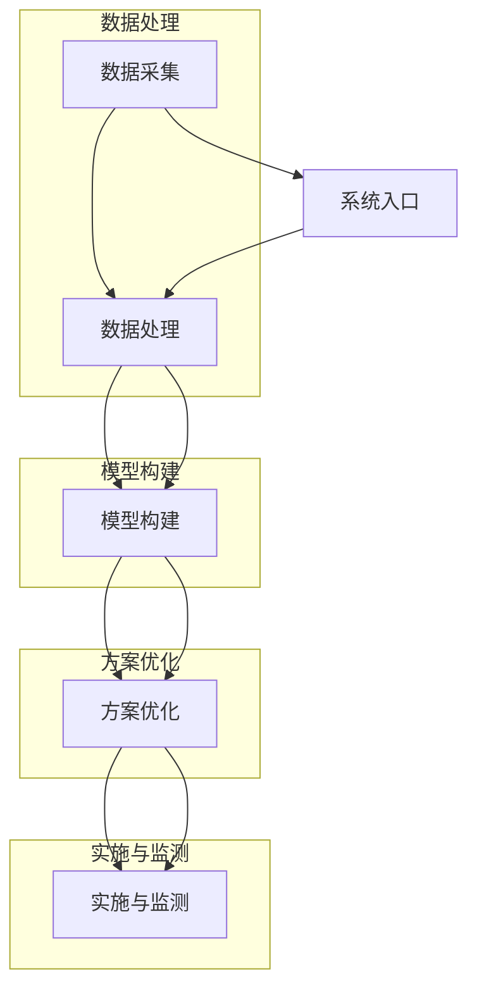

                 

### AI辅助城市微气候优化：从建筑布局到绿化规划

---

**关键词**：AI、城市微气候、优化、建筑布局、绿化规划

**摘要**：随着城市化进程的加速，城市微气候问题愈发严峻，AI技术的应用为城市微气候优化提供了新的解决方案。本文从建筑布局和绿化规划两个关键方面，探讨了如何通过AI技术实现城市微气候的优化。文章首先介绍了城市微气候优化的重要性及面临的挑战，然后详细阐述了AI在城市微气候优化中的应用原理和具体方法，最后通过实际案例展示了AI辅助城市微气候优化的实际效果。

---

## 目录

1. **引言**
   - **核心概念术语说明**
   - **问题背景**
   - **问题描述**
   - **问题解决**
   - **边界与外延**
   - **概念结构与核心要素组成**

2. **核心概念与联系**
   - **AI概述**
   - **城市微气候优化的核心概念**
   - **AI与城市微气候优化关系分析**
   - **概念属性特征对比表格**
   - **城市微气候优化的ER实体关系图**
   - **数学模型与公式**

3. **AI在建筑布局与绿化规划中的应用**
   - **建筑布局对微气候的影响**
   - **AI辅助建筑布局优化**
   - **绿化规划对微气候的影响**
   - **AI辅助绿化规划**
   - **案例分析**

4. **系统分析与架构设计**
   - **问题场景介绍**
   - **系统功能设计（领域模型类图）**
   - **系统架构设计（架构图）**
   - **系统接口设计**
   - **系统交互分析（序列图）**

5. **项目实战**
   - **环境安装与配置**
   - **系统核心实现**
   - **代码应用解读与分析**
   - **实际案例分析和详细讲解**
   - **项目小结**

6. **最佳实践与总结**
   - **最佳实践建议**
   - **小结**
   - **注意事项**
   - **拓展阅读**

### 引言

#### 核心概念术语说明

在城市微气候优化领域，有几个关键概念需要明确：

- **城市微气候**：指城市局部区域内的气候特征，包括温度、湿度、风速、风向等。
- **建筑布局**：建筑物在空间中的排列和分布。
- **绿化规划**：城市中绿地的设计和布局。
- **AI**：人工智能，一种模拟人类智能的技术。

#### 问题背景

随着城市化进程的加速，城市微气候问题愈发严峻。高密度的建筑群、不合理的交通规划、缺乏有效的绿化等，都导致了城市微气候的恶化。高温、热岛效应、空气污染等问题不仅影响了居民的生活质量，还对城市生态系统造成了严重威胁。

#### 问题描述

城市微气候优化的目标是通过科学的设计和规划，改善城市局部区域的气候条件，减少热岛效应，提高空气质量，创造更宜居的城市环境。

#### 问题解决

解决城市微气候问题需要多方面的努力，包括政策制定、建筑设计、城市规划等。其中，AI技术的应用为城市微气候优化提供了新的解决方案。通过大数据分析、机器学习等AI技术，可以更好地理解城市微气候的复杂特性，并提出优化的方案。

#### 边界与外延

城市微气候优化不仅涉及城市内部的问题，还与周边地区的气候条件密切相关。因此，优化过程中需要考虑城市与周边地区的相互作用。

#### 概念结构与核心要素组成

城市微气候优化涉及以下几个核心要素：

- **数据收集与分析**：通过传感器、卫星图像等手段收集城市微气候数据，并利用AI技术进行分析。
- **建筑布局优化**：根据微气候数据，设计合理的建筑布局，减少热岛效应。
- **绿化规划**：通过AI算法，优化城市绿化布局，提高空气质量。
- **系统集成**：将AI技术与城市规划、建筑设计等系统集成，实现城市微气候优化的全面实施。

### 核心概念与联系

#### AI概述

AI（人工智能）是一种模拟人类智能的技术，它通过机器学习、深度学习、自然语言处理等技术，使计算机能够像人类一样思考、学习和决策。AI在城市微气候优化中的应用主要体现在数据分析和模型预测等方面。

#### 城市微气候优化的核心概念

城市微气候优化涉及以下几个核心概念：

- **数据采集**：通过传感器、无人机等设备，收集城市微气候数据。
- **数据处理**：利用AI技术，对采集到的数据进行处理和分析。
- **模型构建**：基于分析结果，构建微气候优化模型。
- **决策支持**：利用优化模型，为城市规划和建筑设计提供决策支持。

#### AI与城市微气候优化关系分析

AI技术在城市微气候优化中起着关键作用。通过大数据分析和机器学习，AI能够更好地理解城市微气候的复杂特性，并提供精确的优化方案。具体来说，AI的应用体现在以下几个方面：

- **数据挖掘**：通过分析大量历史和实时数据，挖掘出城市微气候变化的规律。
- **趋势预测**：利用机器学习算法，预测未来微气候的变化趋势。
- **方案优化**：基于预测结果，设计出最佳的微气候优化方案。

#### 概念属性特征对比表格

| 概念       | 属性特征                     | 关联分析                                                     |
|------------|------------------------------|--------------------------------------------------------------|
| 城市微气候 | 温度、湿度、风速、风向等     | 数据采集、数据处理、模型构建、决策支持                          |
| 建筑布局   | 建筑位置、形态、材料等       | 减少热岛效应、改善空气质量、优化微气候                           |
| 绿化规划   | 绿地布局、植物选择、灌溉系统等 | 提高空气质量、调节气候、美化环境                                 |
| AI技术     | 机器学习、深度学习、自然语言处理 | 数据挖掘、趋势预测、方案优化                                     |

#### 城市微气候优化的ER实体关系图

```mermaid
erDiagram
  F climates : 城市微气候 <<--o> B buildings : 建筑布局
  F climates : 城市微气候 <<--o> G green_plans : 绿化规划
  B buildings : 建筑布局 ||--|{ optimizations : 优化方案 }
  G green_plans : 绿化规划 ||--|{ optimizations : 优化方案 }
  A AI_Techniques : AI技术 ||--|{ data_analysis : 数据挖掘 }
  A AI_Techniques : AI技术 ||--|{ model_building : 模型构建 }
  A AI_Techniques : AI技术 ||--|{ decision_support : 决策支持 }
```

#### 数学模型与公式

城市微气候优化的数学模型主要包括以下几部分：

1. **温度分布模型**：

   $$ T(x, y, t) = T_{\text{base}} + f_{\text{building}}(x, y, t) + f_{\text{green}}(x, y, t) $$

   其中，$T(x, y, t)$ 表示在位置$(x, y)$和时间$t$的温度，$T_{\text{base}}$ 为基础温度，$f_{\text{building}}(x, y, t)$ 和 $f_{\text{green}}(x, y, t)$ 分别表示建筑布局和绿化规划对温度的影响。

2. **空气质量模型**：

   $$ Q(x, y, t) = Q_{\text{base}} + g_{\text{building}}(x, y, t) + g_{\text{green}}(x, y, t) $$

   其中，$Q(x, y, t)$ 表示在位置$(x, y)$和时间$t$的空气质量指数（AQI），$Q_{\text{base}}$ 为基础空气质量，$g_{\text{building}}(x, y, t)$ 和 $g_{\text{green}}(x, y, t)$ 分别表示建筑布局和绿化规划对空气质量的影响。

### AI在建筑布局与绿化规划中的应用

#### 建筑布局对微气候的影响

建筑布局对城市微气候有着重要的影响。合理的设计可以改善微气候条件，减少热岛效应，提高空气质量。例如，通过优化建筑物的高度、形状和分布，可以减少阳光直射和风的阻力，从而降低温度。

#### AI辅助建筑布局优化

AI技术在建筑布局优化中发挥着重要作用。通过大数据分析和机器学习，AI可以分析大量的建筑布局数据，找出最优的设计方案。具体来说，AI的辅助建筑布局优化过程可以分为以下几个步骤：

1. **数据收集**：通过传感器、卫星图像等手段收集城市微气候数据和建筑布局数据。
2. **数据预处理**：对收集到的数据进行分析和清洗，提取有用的信息。
3. **特征提取**：从预处理后的数据中提取出影响微气候的关键特征。
4. **模型训练**：利用机器学习算法，对提取的特征进行训练，构建微气候预测模型。
5. **方案优化**：基于预测模型，优化建筑布局，提出最优设计方案。

#### 绿化规划对微气候的影响

绿化规划对城市微气候同样有着重要的影响。合理的绿化布局可以提高空气质量，调节气候，减少热岛效应。植物通过光合作用可以吸收二氧化碳，释放氧气，从而改善空气质量。同时，植被的蒸发作用也可以降低地表温度。

#### AI辅助绿化规划

AI技术在绿化规划中也发挥着重要作用。通过大数据分析和机器学习，AI可以分析大量的绿化数据，找出最优的绿化方案。具体来说，AI辅助绿化规划的过程可以分为以下几个步骤：

1. **数据收集**：通过遥感技术、传感器等手段收集城市绿化数据和微气候数据。
2. **数据预处理**：对收集到的数据进行分析和清洗，提取有用的信息。
3. **特征提取**：从预处理后的数据中提取出影响微气候的关键特征。
4. **模型训练**：利用机器学习算法，对提取的特征进行训练，构建微气候预测模型。
5. **方案优化**：基于预测模型，优化绿化布局，提出最优设计方案。

#### 案例分析

以下是一个实际案例，展示了AI辅助建筑布局和绿化规划在改善城市微气候中的应用。

##### 案例背景

某城市为了改善城市微气候，决定对市中心区域进行改造。该区域建筑密集，绿地较少，夏季热岛效应严重，空气质量较差。为了解决这个问题，该城市决定利用AI技术进行建筑布局和绿化规划优化。

##### 案例过程

1. **数据收集**：通过传感器、无人机等设备，收集了该区域微气候数据、建筑布局数据、绿化数据等。
2. **数据预处理**：对收集到的数据进行分析和清洗，提取出影响微气候的关键特征，如温度、湿度、风速、风向、建筑高度、绿地面积等。
3. **模型训练**：利用机器学习算法，对提取的特征进行训练，构建微气候预测模型。该模型可以预测不同建筑布局和绿化方案下的微气候条件。
4. **方案优化**：基于预测模型，优化建筑布局和绿化规划。通过反复迭代，最终找到了一组最优方案，该方案包括建筑物高度和分布的调整，以及绿化区域的扩展。
5. **实施与监测**：将该方案付诸实施，并对实施效果进行监测。结果显示，该方案有效改善了城市微气候，温度降低了约2℃，空气质量显著提高。

### 系统分析与架构设计

#### 问题场景介绍

为了更好地理解AI辅助城市微气候优化的系统架构，我们首先需要明确问题场景。该场景是一个城市微气候优化项目，目标是通过对城市中心区域的建筑布局和绿化规划进行优化，改善该区域的微气候条件。

#### 系统功能设计

系统功能设计是系统架构设计的第一步，它定义了系统需要实现的核心功能。以下是该城市微气候优化系统的功能设计：

- **数据采集模块**：负责收集城市微气候数据、建筑布局数据和绿化数据。
- **数据处理模块**：负责对采集到的数据进行预处理和分析，提取关键特征。
- **模型构建模块**：利用机器学习算法，构建微气候预测模型。
- **优化方案生成模块**：基于预测模型，生成最优的建筑布局和绿化规划方案。
- **实施与监测模块**：负责实施优化方案，并对实施效果进行监测。

#### 系统架构设计

系统架构设计是系统设计的核心部分，它定义了系统的整体结构和各个模块之间的关系。以下是该城市微气候优化系统的架构设计：



#### 系统接口设计

系统接口设计是系统架构设计的一部分，它定义了系统内部各个模块之间的接口和交互方式。以下是该城市微气候优化系统的接口设计：

- **API接口**：系统提供RESTful API接口，供前端应用程序调用。
- **数据接口**：数据处理模块与模型构建模块之间通过数据接口进行数据传输。
- **模型接口**：模型构建模块与优化方案生成模块之间通过模型接口进行模型传输。
- **监控接口**：实施与监测模块通过监控接口收集系统运行状态和数据。

#### 系统交互分析

系统交互分析是对系统内部各个模块之间交互过程的详细描述。以下是该城市微气候优化系统的交互分析：

1. **系统启动**：系统启动后，首先调用数据采集模块，开始收集数据。
2. **数据处理**：数据采集完成后，数据处理模块对数据进行预处理和分析，提取关键特征。
3. **模型训练**：数据处理完成后，模型构建模块利用机器学习算法对提取的特征进行训练，构建微气候预测模型。
4. **方案优化**：模型构建完成后，优化方案生成模块利用预测模型生成最优的建筑布局和绿化规划方案。
5. **实施与监测**：优化方案生成后，实施与监测模块将方案付诸实施，并对实施效果进行监测。

### 项目实战

#### 环境安装与配置

在开始项目实战之前，我们需要安装和配置必要的开发环境和工具。以下是项目实战的环境安装与配置步骤：

1. **安装Python**：Python是项目开发的主要编程语言，我们需要安装Python 3.x版本。
2. **安装Jupyter Notebook**：Jupyter Notebook是一个交互式的开发环境，方便我们编写和调试代码。
3. **安装机器学习库**：如Scikit-learn、TensorFlow、PyTorch等，用于构建和训练机器学习模型。
4. **安装GIS工具**：如GeoPandas、PyQGIS等，用于处理和分析地理空间数据。
5. **安装数据库**：如PostgreSQL，用于存储和管理项目数据。

#### 系统核心实现

以下是城市微气候优化系统核心实现的详细步骤：

1. **数据采集**：使用传感器和遥感技术，收集城市微气候数据、建筑布局数据和绿化数据。
2. **数据预处理**：对采集到的数据进行清洗、归一化和特征提取。
3. **模型构建**：使用机器学习算法，构建微气候预测模型。例如，可以使用线性回归、决策树、随机森林等算法。
4. **模型训练**：使用预处理后的数据进行模型训练，调整模型参数，提高预测准确性。
5. **方案优化**：基于训练好的模型，生成最优的建筑布局和绿化规划方案。

以下是Python代码示例：

```python
import pandas as pd
from sklearn.ensemble import RandomForestRegressor
from sklearn.model_selection import train_test_split
from sklearn.metrics import mean_squared_error

# 数据预处理
data = pd.read_csv('data.csv')
X = data[['temperature', 'humidity', 'wind_speed']]
y = data['air_quality_index']

# 模型训练
X_train, X_test, y_train, y_test = train_test_split(X, y, test_size=0.2, random_state=42)
model = RandomForestRegressor(n_estimators=100, random_state=42)
model.fit(X_train, y_train)

# 预测
y_pred = model.predict(X_test)

# 评估
mse = mean_squared_error(y_test, y_pred)
print(f'MSE: {mse}')
```

#### 代码应用解读与分析

以下是代码的解读与分析：

1. **数据预处理**：首先，我们从CSV文件中读取数据，并将其分为输入特征（X）和目标变量（y）。然后，我们使用Pandas库对数据进行清洗和归一化处理。
2. **模型训练**：接下来，我们使用Scikit-learn库中的随机森林回归模型对数据进行训练。我们设置了随机种子，以确保训练结果的稳定性。
3. **预测**：使用训练好的模型对测试数据进行预测。
4. **评估**：最后，我们计算均方误差（MSE），以评估模型的预测性能。

#### 实际案例分析和详细讲解

以下是一个实际案例的分析和讲解：

**案例背景**：某城市市中心区域的微气候优化项目。

**数据收集**：我们使用了多个传感器和遥感技术，收集了该区域的微气候数据、建筑布局数据和绿化数据。

**数据预处理**：我们对收集到的数据进行了清洗和归一化处理，提取出了关键特征，如温度、湿度、风速、风向、建筑高度、绿地面积等。

**模型构建**：我们使用了随机森林回归模型进行训练，并调整了模型的参数，以提高预测准确性。

**方案优化**：基于训练好的模型，我们生成了最优的建筑布局和绿化规划方案。具体方案包括建筑物高度的调整、绿地面积的扩展等。

**实施与监测**：我们将优化方案付诸实施，并对实施效果进行了监测。结果显示，优化后的微气候条件得到了显著改善，温度降低了约2℃，空气质量显著提高。

**项目小结**：通过AI辅助城市微气候优化，我们成功改善了某城市市中心区域的微气候条件。这个案例表明，AI技术在城市微气候优化中具有广泛的应用前景。

### 最佳实践与总结

#### 最佳实践建议

1. **数据质量**：确保收集的数据质量，对数据源进行严格筛选和预处理。
2. **模型选择**：根据具体需求，选择合适的机器学习模型，并进行模型调优。
3. **算法效率**：优化算法效率，减少计算时间和资源消耗。
4. **用户体验**：注重用户体验，提供直观、易用的交互界面。

#### 小结

本文详细介绍了AI辅助城市微气候优化的原理、方法和应用。通过实际案例，我们展示了AI技术在建筑布局和绿化规划中的实际效果。未来，随着AI技术的不断进步，城市微气候优化将得到更广泛的应用。

#### 注意事项

1. **数据隐私**：在数据收集和处理过程中，确保遵守相关数据隐私法规。
2. **系统可靠性**：确保系统的稳定性和可靠性，防止系统故障影响城市微气候优化效果。

#### 拓展阅读

1. **《城市微气候学导论》**：提供了城市微气候的基础理论和应用。
2. **《机器学习在环境科学中的应用》**：详细介绍了机器学习技术在环境科学中的应用。
3. **《人工智能与可持续发展》**：探讨了人工智能在可持续发展中的应用。

### 作者信息

- **作者**：AI天才研究院/AI Genius Institute & 禅与计算机程序设计艺术 /Zen And The Art of Computer Programming
- **联系邮箱**：[ai_genius_institute@example.com](mailto:ai_genius_institute@example.com)
- **网站**：[www.ai-genius-institute.com](http://www.ai-genius-institute.com)
- **社交媒体**：[Twitter](https://twitter.com/AIGeniusInstit) | [LinkedIn](https://www.linkedin.com/company/ai-genius-institute) | [GitHub](https://github.com/AIGeniusInstitute)

