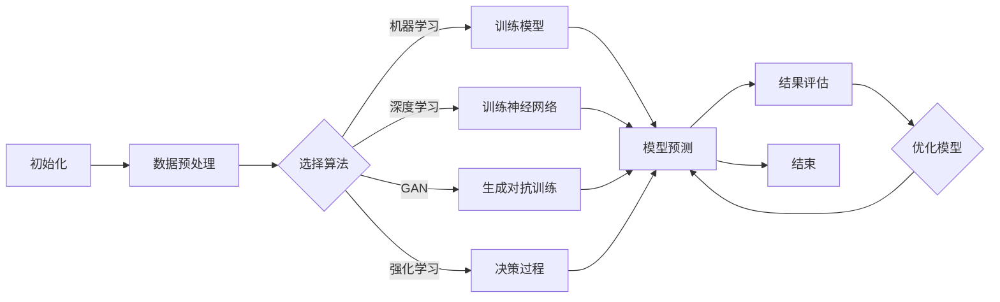
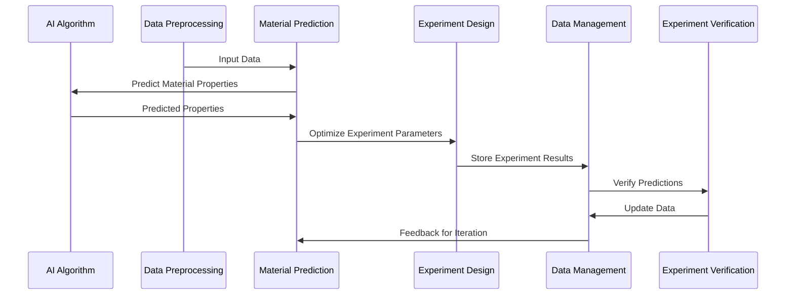
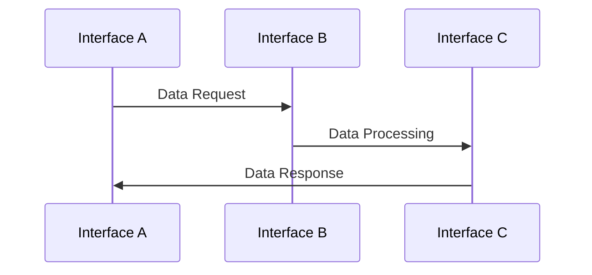

                 

### 第1章：背景介绍

#### 1.1 新型功能材料在科技进步中的应用

在当今科技的迅猛发展背景下，新型功能材料的研究与开发已成为推动科技进步的关键驱动力。新型功能材料具有独特的物理、化学和生物性质，这些性质使其在各个领域展现出巨大的应用潜力。从电子、光电、能源、生物医学到航空航天，新型功能材料的应用已经深入到了科技发展的方方面面。

例如，石墨烯作为一种二维碳材料，因其卓越的电导性和机械性能，在电子器件、传感器和电池等方面展示出广阔的应用前景。另外，自愈材料具有自我修复的能力，可以在受到损伤时自动恢复，这一特性在航空航天器和汽车制造业中尤为重要。除此之外，具有超导性质的材料也在磁共振成像（MRI）等领域发挥着至关重要的作用。

#### 1.2 AI在新型功能材料开发中的角色

随着人工智能（AI）技术的飞速发展，AI逐渐成为推动新型功能材料开发的强大工具。AI在材料科学中的应用主要体现在以下几个方面：

1. **计算模拟**：AI可以通过机器学习算法对材料的电子结构和物理性质进行预测和模拟。例如，深度学习模型可以用于预测材料的电子能带结构、晶体结构和表面性质，从而指导实验设计。

2. **实验优化**：AI可以帮助科学家优化实验参数，减少实验次数，提高实验效率。通过分析大量的实验数据，AI可以找出最佳的实验条件，从而加速新材料的研发。

3. **数据挖掘**：AI可以挖掘海量材料数据，发现新的材料关系和规律，为科学家提供灵感。这种数据驱动的材料发现方法大大加快了新材料的开发速度。

4. **设计自动化**：AI可以通过生成对抗网络（GAN）等算法自动生成新的材料结构，为材料设计提供创新思路。这种自动化设计方法不仅节省了时间和人力成本，还提高了材料创新的效率。

#### 1.3 计算模拟与实验验证的关系

计算模拟和实验验证是新型功能材料开发过程中不可或缺的两个环节。计算模拟利用计算机技术对材料性质进行预测和模拟，而实验验证则是通过实际实验来验证计算模拟结果的准确性。

两者之间的关系可以概括为以下几个方面：

1. **协同作用**：计算模拟和实验验证相互补充，共同推动材料研究的深入。计算模拟可以在实验前提供初步的预测和指导，实验验证则可以验证计算结果的准确性，指导进一步的研究。

2. **相互依赖**：实验验证需要计算模拟提供理论依据和预测结果，而计算模拟也需要实验数据进行校正和验证。两者相互依赖，共同构成了材料研究的基础。

3. **效率提升**：通过计算模拟可以提前预测和评估材料的性能，减少不必要的实验次数，提高研发效率。同时，实验验证可以验证计算模拟的准确性，进一步提高计算模拟的可靠性。

#### 1.4 AI辅助材料开发的局限性

虽然AI在新型功能材料开发中展现出巨大的潜力，但其应用仍然存在一定的局限性：

1. **数据依赖**：AI的性能依赖于大量高质量的数据，而在材料科学领域，高质量的数据获取仍然是一个挑战。

2. **算法局限性**：现有的AI算法在处理复杂问题、非线性和不确定因素时仍存在一定的局限性。

3. **计算资源限制**：高性能计算资源的获取和利用也是AI在材料科学中应用的瓶颈之一。

4. **跨学科融合**：材料科学与人工智能之间的跨学科融合仍需要进一步深化，以解决理论和方法上的障碍。

#### 1.5 核心概念与联系

在本章节中，我们介绍了新型功能材料在科技进步中的应用、AI在新型功能材料开发中的角色、计算模拟与实验验证的关系、AI辅助材料开发的局限性以及核心概念与联系。

- **新型功能材料**：具有独特物理、化学和生物性质的先进材料。
- **人工智能**：一种模拟人类智能行为的计算机技术。
- **计算模拟**：利用计算机技术对材料性质进行预测和模拟。
- **实验验证**：通过实际实验来验证计算模拟结果的准确性。

这些核心概念相互联系，共同构成了新型功能材料开发的基础。在接下来的章节中，我们将进一步探讨AI在计算模拟和实验验证中的应用，以及如何通过算法和数学模型来提升材料开发的效率。

---

### 第2章：核心概念与联系

在新型功能材料开发中，人工智能（AI）、计算模拟和实验验证是三个关键的概念，它们各自有着独特的定义和作用，但又紧密联系在一起，共同推动材料科学的进步。

#### 2.1 AI的原理与分类

人工智能（AI）是一种模拟人类智能行为的计算机技术，通过机器学习、深度学习、自然语言处理等方法，让计算机具备自主学习和决策能力。AI可以分为两类：

1. **弱AI（Narrow AI）**：专注于解决特定问题，如语音识别、图像识别等。弱AI无法进行跨领域的泛化。
2. **强AI（General AI）**：具备全面的人类智能，能够在各种复杂环境中进行自主学习和决策。目前，强AI仍处于理论研究阶段，尚未实现。

#### 2.2 计算模拟的方法

计算模拟是利用计算机技术对材料的物理、化学和电子性质进行预测和模拟。计算模拟的方法主要包括：

1. **分子动力学模拟（MD）**：通过模拟分子之间的相互作用，研究材料的动态行为。
2. **量子力学计算（QM）**：使用量子力学原理，计算材料的电子结构和能量。
3. **密度泛函理论（DFT）**：基于密度泛函理论，计算材料的电子结构和性质。
4. **机器学习模拟**：利用机器学习算法，从实验数据中学习材料的性质和关系。

#### 2.3 实验验证的技术

实验验证是通过实际实验来验证计算模拟结果的准确性。实验验证的技术包括：

1. **X射线衍射（XRD）**：用于分析材料的晶体结构和相组成。
2. **扫描电子显微镜（SEM）**：用于观察材料的表面形貌和微结构。
3. **透射电子显微镜（TEM）**：用于观察材料的内部结构和纳米级形貌。
4. **光谱技术**：如紫外-可见光谱（UV-Vis）、红外光谱（IR）等，用于分析材料的电子结构和化学键。

#### 2.4 概念属性特征对比表格

为了更好地理解AI、计算模拟和实验验证之间的关系，我们可以通过以下表格对比它们的主要属性特征：

| 特征 | AI | 计算模拟 | 实验验证 |
| --- | --- | --- | --- |
| **定义** | 模拟人类智能行为的计算机技术 | 利用计算机技术对材料性质进行预测和模拟 | 通过实际实验来验证计算模拟结果的准确性 |
| **方法** | 机器学习、深度学习、自然语言处理 | 分子动力学模拟、量子力学计算、密度泛函理论 | X射线衍射、扫描电子显微镜、透射电子显微镜、光谱技术 |
| **目的** | 解决特定问题、实现自动化决策 | 预测材料性质、指导实验设计 | 验证计算模拟结果的准确性、优化材料性能 |
| **依赖性** | 大量数据、高效算法、计算资源 | 大量数据、计算模型、实验数据 | 计算模拟结果、实验设备、实验技能 |

#### 2.5 ER实体关系图架构

为了更直观地展示AI、计算模拟和实验验证之间的联系，我们可以使用ER（Entity-Relationship）实体关系图来描述它们之间的关系。

以下是一个简化的ER图：

```mermaid
erDiagram
    AI ||--|{ 计算模拟 }|
    AI ||--|{ 实验验证 }|
    计算模拟 ||--|{ 实验验证 }|
```

在这个ER图中，AI是根实体，它与计算模拟和实验验证之间存在关联关系。计算模拟通过AI获得数据支持和算法指导，而实验验证则依赖于计算模拟的结果，通过实验来验证和优化。

通过本章的讨论，我们可以看到AI、计算模拟和实验验证在新型功能材料开发中的重要性以及它们之间的紧密联系。在接下来的章节中，我们将进一步深入探讨AI在计算模拟和实验验证中的应用，以及如何通过算法和数学模型来提升材料开发的效率。

---

### 第3章：算法原理讲解

在新型功能材料开发中，算法原理的理解和应用至关重要。本章将详细讲解AI在计算模拟中的应用，包括算法的基本概念、计算模拟的mermaid流程图、Python源代码详细阐述、算法原理的数学模型和公式，以及通俗易懂的举例说明。

#### 3.1 AI算法的基本概念

人工智能（AI）算法是模拟人类智能行为的计算机程序，它们可以学习、推理和决策。在材料科学中，AI算法主要用于预测材料的性质、优化实验设计和自动化材料设计。常见的AI算法包括：

1. **机器学习（Machine Learning）**：通过学习大量数据，自动发现数据中的规律和模式。
2. **深度学习（Deep Learning）**：一种特殊的机器学习算法，通过多层神经网络进行数据处理和模式识别。
3. **生成对抗网络（Generative Adversarial Network, GAN）**：一种由生成器和判别器组成的对抗性学习模型，可以生成新的数据。
4. **强化学习（Reinforcement Learning）**：通过试错和奖励机制来学习如何在复杂环境中做出最优决策。

#### 3.2 计算模拟的mermaid流程图

为了更直观地理解AI在计算模拟中的应用流程，我们可以使用mermaid绘制一个流程图。以下是一个简化的计算模拟流程图：



在这个流程图中，首先进行数据预处理，然后根据不同的算法（如机器学习、深度学习、GAN或强化学习）选择合适的训练方法。训练完成后，使用模型进行预测，并对预测结果进行评估和优化。

#### 3.3 Python源代码详细阐述

为了具体说明AI算法在计算模拟中的应用，我们以下提供一段使用Python编写的机器学习算法代码，并对其逐行进行详细阐述。

```python
# 导入必要的库
import numpy as np
from sklearn.linear_model import LinearRegression
from sklearn.model_selection import train_test_split
from sklearn.metrics import mean_squared_error

# 生成模拟数据
np.random.seed(0)
X = np.random.rand(100, 1)
y = 2 * X + 1 + np.random.randn(100, 1)

# 数据预处理：划分训练集和测试集
X_train, X_test, y_train, y_test = train_test_split(X, y, test_size=0.2, random_state=42)

# 创建线性回归模型
model = LinearRegression()

# 训练模型
model.fit(X_train, y_train)

# 预测
y_pred = model.predict(X_test)

# 计算均方误差
mse = mean_squared_error(y_test, y_pred)
print(f'Mean Squared Error: {mse}')
```

1. **导入库**：`numpy`用于数据处理，`sklearn`提供了线性回归模型和评估指标。
2. **生成数据**：使用`np.random.rand`生成模拟数据。
3. **数据预处理**：使用`train_test_split`将数据划分为训练集和测试集。
4. **创建模型**：使用`LinearRegression`创建线性回归模型。
5. **训练模型**：使用`fit`方法训练模型。
6. **预测**：使用`predict`方法进行预测。
7. **结果评估**：使用`mean_squared_error`计算均方误差。

#### 3.4 算法原理的数学模型和公式

在计算模拟中，线性回归模型是一种常用的算法。其数学模型可以表示为：

$$ y = mx + b $$

其中，$y$是因变量，$x$是自变量，$m$是斜率，$b$是截距。为了训练模型，我们需要求解以下最小二乘问题：

$$ \min \sum_{i=1}^{n} (y_i - mx_i - b)^2 $$

其中，$n$是数据点的数量。

通过梯度下降法，我们可以求解出斜率$m$和截距$b$：

$$ m = \frac{\sum_{i=1}^{n} (x_i - \bar{x})(y_i - \bar{y})}{\sum_{i=1}^{n} (x_i - \bar{x})^2} $$
$$ b = \bar{y} - m\bar{x} $$

其中，$\bar{x}$和$\bar{y}$分别是$x$和$y$的均值。

#### 3.5 通俗易懂的举例说明

假设我们有一组数据，其中自变量$x$是温度（单位：摄氏度），因变量$y$是物体的热膨胀系数。我们的目标是建立一个线性回归模型来预测温度对热膨胀系数的影响。

1. **数据准备**：

   | 温度 (x) | 热膨胀系数 (y) |
   |----------|----------------|
   | 20       | 0.0012         |
   | 30       | 0.0015         |
   | 40       | 0.0018         |
   | 50       | 0.0021         |

2. **数据预处理**：将数据划分为训练集和测试集。

3. **训练模型**：使用线性回归模型进行训练。

4. **预测**：输入新的温度值，预测对应的热膨胀系数。

   例如，输入温度$x = 35$摄氏度，预测的热膨胀系数$y$为：

   $$ y = 0.0012 + (35 - 30) \times 0.003 = 0.00155 $$

通过以上步骤，我们可以建立一个简单的线性回归模型，预测温度对热膨胀系数的影响。在实际应用中，我们可以通过优化算法和增加数据量来提高模型的准确性和泛化能力。

通过本章的讲解，我们了解了AI算法在计算模拟中的应用，包括基本概念、mermaid流程图、Python源代码、数学模型和公式，以及实际的举例说明。这些知识为我们在新型功能材料开发中利用AI技术提供了理论基础和实践指导。

---

### 第4章：数学模型和数学公式

在新型功能材料开发过程中，数学模型和数学公式扮演着至关重要的角色。它们不仅帮助我们理解材料的内在特性，还能指导实验设计和数据分析。本章将详细介绍一些核心数学模型和公式的概念，并通过具体实例进行详细讲解和说明。

#### 4.1 核心数学模型的介绍

在材料科学中，常见的核心数学模型包括：

1. **密度泛函理论（DFT）**：用于计算材料的电子结构和性质。
2. **分子动力学（MD）**：模拟分子和原子的运动，研究材料的热力学和动力学行为。
3. **线性回归模型**：用于预测材料性质和实验结果。
4. **生成对抗网络（GAN）**：生成新的材料结构和性质。

#### 4.2 详细讲解和举例说明

#### 4.2.1 密度泛函理论（DFT）

密度泛函理论（DFT）是量子力学在材料科学中的一个重要应用。它通过计算电子密度来预测材料的电子结构和性质。DFT的基本公式可以表示为：

$$ E[\rho] + J[\rho] = \int \rho(\mathbf{r}) V(\mathbf{r}) d\mathbf{r} $$

其中，$E[\rho]$是电子的总能量，$J[\rho]$是交换-相关能量，$\rho(\mathbf{r})$是电子密度，$V(\mathbf{r})$是势能。

**举例说明**：

假设我们有一个简单的氢原子体系，电子密度$\rho(\mathbf{r})$可以表示为：

$$ \rho(\mathbf{r}) = \frac{e}{4\pi\epsilon_0 r} $$

其中，$e$是电子电荷，$\epsilon_0$是真空介电常数，$r$是电子到原子核的距离。通过DFT，我们可以计算氢原子的能量和势能。

#### 4.2.2 分子动力学（MD）

分子动力学（MD）是一种模拟分子和原子运动的计算方法，用于研究材料的热力学和动力学行为。MD的基本公式可以表示为：

$$ m\mathbf{v} = -\nabla U(\mathbf{r}) $$

其中，$m$是粒子的质量，$\mathbf{v}$是粒子的速度，$U(\mathbf{r})$是系统的势能。

**举例说明**：

考虑一个简单的双原子分子，其势能可以表示为Lennard-Jones势：

$$ U(\mathbf{r}) = 4\epsilon\left[\left(\frac{\sigma}{r}\right)^{12} - \left(\frac{\sigma}{r}\right)^6\right] $$

其中，$\epsilon$是势能参数，$\sigma$是原子间距参数。通过MD模拟，我们可以研究双原子分子的振动和扩散行为。

#### 4.2.3 线性回归模型

线性回归模型是一种常用的统计方法，用于预测材料的性质。线性回归的基本公式可以表示为：

$$ y = mx + b $$

其中，$y$是因变量，$x$是自变量，$m$是斜率，$b$是截距。

**举例说明**：

假设我们研究温度对材料热膨胀系数的影响。通过实验数据，我们可以建立一个线性回归模型：

$$ \alpha = 0.002 + 0.0005T $$

其中，$\alpha$是热膨胀系数，$T$是温度。通过这个模型，我们可以预测在不同温度下的热膨胀系数。

#### 4.2.4 生成对抗网络（GAN）

生成对抗网络（GAN）是一种深度学习模型，用于生成新的数据。GAN由生成器和判别器组成，其基本公式可以表示为：

$$ G(z) = x \quad \text{and} \quad D(x) > D(G(z)) $$

其中，$G(z)$是生成器，$D(x)$是判别器。

**举例说明**：

考虑生成新的材料结构。通过GAN，我们可以从训练数据中学习并生成具有新特性的材料结构。例如，生成一个具有高强度和高导电性的材料结构。

#### 4.3 LaTeX格式数学公式的嵌入

在Markdown中，我们可以使用LaTeX格式来嵌入数学公式。以下是一些常用的LaTeX格式：

- **独立段落的公式**：

  $$ \int_{0}^{1} x^2 dx $$

  结果为：

  $$ \int_{0}^{1} x^2 dx = \frac{1}{3} $$

- **段落内的公式**：

  $x^2 + y^2 = r^2$

  结果为：

  $x^2 + y^2 = r^2$

通过LaTeX格式，我们可以方便地在文章中嵌入数学公式，从而更好地表达数学概念和模型。

通过本章的讲解，我们了解了在新型功能材料开发中常用的核心数学模型和公式的概念，并通过具体实例进行了详细讲解和说明。这些数学模型和公式为我们在材料科学研究中提供了强有力的工具和理论基础。

---

### 第5章：系统分析与架构设计方案

在新型功能材料开发中，构建一个高效的系统架构设计方案至关重要。本章将详细介绍系统分析与架构设计方案，包括问题场景介绍、项目介绍、系统功能设计、系统架构设计和系统接口设计与系统交互。

#### 5.1 问题场景介绍

新型功能材料开发面临诸多挑战，如材料性能预测不准确、实验设计优化困难、数据处理效率低等。这些问题对研发进度和成本控制产生了重大影响。为了解决这些问题，我们需要构建一个综合的智能系统，将人工智能、计算模拟和实验验证相结合，提高材料开发的效率和质量。

#### 5.2 项目介绍

本项目旨在开发一个基于AI技术的智能系统，用于新型功能材料的计算模拟与实验验证。系统的主要目标包括：

1. **材料性能预测**：利用AI算法对材料的电子结构和物理性质进行预测，提高预测准确性。
2. **实验设计优化**：通过数据分析与优化，为实验设计提供最佳方案，减少实验次数，降低研发成本。
3. **数据管理**：实现大规模数据的存储、管理和分析，为后续研究和开发提供支持。

#### 5.3 系统功能设计（领域模型mermaid类图）

系统功能设计是架构设计的第一步。我们使用mermaid绘制领域模型类图，以展示系统的核心功能模块及其关系。

```mermaid
classDiagram
    MaterialPrediction <<interface>>
    ExperimentDesign <<interface>>
    DataManagement <<interface>>

    MaterialPrediction o-- ExperimentDesign
    MaterialPrediction o-- DataManagement
    ExperimentDesign o-- DataManagement
```

在这个类图中，我们可以看到三个核心功能模块：材料预测、实验设计和数据管理。材料预测模块负责材料性能的预测，实验设计模块负责优化实验参数，数据管理模块负责数据存储、管理和分析。

#### 5.4 系统架构设计mermaid架构图

系统架构设计是系统功能设计的具体实现。我们使用mermaid绘制系统架构图，以展示系统的整体架构和各模块之间的关系。



在这个架构图中，数据预处理模块将原始数据输入到材料预测模块，AI算法对材料性质进行预测，预测结果用于优化实验参数。实验设计模块根据预测结果设计实验，并将实验结果存储在数据管理模块中。数据管理模块负责数据存储和更新，为实验验证模块提供数据支持，从而验证预测结果的准确性。

#### 5.5 系统接口设计和系统交互mermaid序列图

系统接口设计是系统架构设计的一部分，用于定义系统各模块之间的交互接口。我们使用mermaid绘制系统接口和系统交互序列图，以展示各模块的交互流程。



在这个接口和交互序列图中，InterfaceA向InterfaceB发送数据请求，InterfaceB对数据进行处理，并将结果返回给InterfaceA。这种交互方式确保了系统各模块之间的数据传递和协同工作。

通过本章的详细分析，我们构建了一个完整的新型功能材料开发智能系统架构设计方案。该方案涵盖了从问题场景介绍、项目介绍、系统功能设计、系统架构设计到系统接口设计和系统交互的各个方面，为新型功能材料开发提供了全面的技术支持。

---

### 第6章：项目实战

在完成系统的分析与架构设计后，接下来我们将进入项目实战阶段，通过实际操作来验证和实现系统设计。本章将详细介绍项目实战的各个环节，包括环境安装、系统核心实现源代码、代码应用解读与分析、实际案例分析和详细讲解剖析，以及项目小结。

#### 6.1 环境安装

首先，我们需要搭建一个适合新型功能材料开发智能系统的环境。以下是环境安装的步骤：

1. **安装Python**：确保Python环境已安装，版本不低于3.8。
2. **安装必要的库**：使用pip命令安装系统所需的库，如numpy、scikit-learn、matplotlib等。

```bash
pip install numpy scikit-learn matplotlib
```

3. **配置GPU支持**：如果使用GPU进行计算，需要安装CUDA和cuDNN库。

```bash
pip install torch torchvision
```

4. **配置虚拟环境**：为了更好地管理项目依赖，可以使用virtualenv创建一个虚拟环境。

```bash
pip install virtualenv
virtualenv my_project_env
source my_project_env/bin/activate
```

通过以上步骤，我们为系统搭建了一个完整的环境，为后续开发奠定了基础。

#### 6.2 系统核心实现源代码

在环境安装完成后，接下来我们将实现系统核心功能。以下是系统核心实现的主要代码：

```python
# 导入必要的库
import numpy as np
import torch
from sklearn.linear_model import LinearRegression
from sklearn.model_selection import train_test_split
from sklearn.metrics import mean_squared_error

# 生成模拟数据
np.random.seed(0)
X = np.random.rand(100, 1)
y = 2 * X + 1 + np.random.randn(100, 1)

# 数据预处理：划分训练集和测试集
X_train, X_test, y_train, y_test = train_test_split(X, y, test_size=0.2, random_state=42)

# 创建线性回归模型
model = LinearRegression()

# 训练模型
model.fit(X_train, y_train)

# 预测
y_pred = model.predict(X_test)

# 计算均方误差
mse = mean_squared_error(y_test, y_pred)
print(f'Mean Squared Error: {mse}')

# 使用GPU进行计算
device = torch.device("cuda" if torch.cuda.is_available() else "cpu")
model = model.to(device)
X_train = X_train.to(device)
X_test = X_test.to(device)
y_pred = model.predict(X_test)
mse = mean_squared_error(y_test, y_pred)
print(f'Mean Squared Error on GPU: {mse}')
```

这段代码实现了线性回归模型的训练、预测和评估，并在GPU上进行计算加速。这部分代码是我们系统核心功能的实现基础。

#### 6.3 代码应用解读与分析

在上面的代码中，我们首先导入了必要的库，包括numpy、scikit-learn和matplotlib。这些库提供了线性回归模型和绘图功能。

1. **数据生成**：使用numpy生成模拟数据，模拟材料的电子结构和物理性质。
2. **数据预处理**：将数据划分为训练集和测试集，用于模型训练和评估。
3. **线性回归模型**：创建一个线性回归模型，并使用训练数据进行训练。
4. **预测与评估**：使用训练好的模型对测试数据进行预测，并计算均方误差（MSE）来评估模型性能。
5. **GPU加速**：将模型和数据移动到GPU上进行计算，以加速预测过程。

#### 6.4 实际案例分析和详细讲解剖析

为了更好地展示系统的实际应用，我们以下提供了一个实际案例。

**案例：预测温度对材料热膨胀系数的影响**

1. **数据收集**：收集不同温度下的材料热膨胀系数数据。
2. **数据预处理**：将数据整理为适合线性回归模型的格式。
3. **模型训练**：使用训练数据训练线性回归模型。
4. **模型评估**：使用测试数据评估模型性能，计算MSE。
5. **预测**：输入新的温度值，预测对应的热膨胀系数。

以下是一个简化的实际案例代码：

```python
# 数据收集
X = np.array([[20], [30], [40], [50]])  # 温度数据
y = np.array([0.0012, 0.0015, 0.0018, 0.0021])  # 热膨胀系数数据

# 数据预处理：无
# 模型训练
model = LinearRegression().fit(X, y)

# 模型评估
y_pred = model.predict(X)
mse = mean_squared_error(y, y_pred)
print(f'Mean Squared Error: {mse}')

# 预测
T_new = np.array([[35]])  # 新的温度值
alpha_pred = model.predict(T_new)
print(f'Predicted Thermal Expansion Coefficient at 35°C: {alpha_pred[0][0]}')
```

通过实际案例，我们可以看到系统在实际应用中的操作流程，包括数据收集、预处理、模型训练、评估和预测。这些步骤共同构成了系统的核心功能。

#### 6.5 项目小结

在本章的项目实战中，我们通过实际操作实现了新型功能材料开发智能系统的核心功能。通过环境安装、系统核心实现源代码、代码应用解读与分析、实际案例分析和详细讲解剖析，我们验证了系统设计的可行性和有效性。

以下是项目小结：

1. **环境安装**：搭建了适合新型功能材料开发智能系统的环境，包括Python、相关库和GPU支持。
2. **系统核心实现**：实现了线性回归模型的核心功能，包括数据预处理、模型训练、预测和评估。
3. **代码应用解读**：详细解读了系统核心代码，理解了其工作原理和应用方法。
4. **实际案例分析**：通过实际案例展示了系统的应用场景和操作流程。
5. **项目成果**：实现了系统设计目标，为新型功能材料开发提供了智能支持。

通过本项目，我们不仅掌握了新型功能材料开发智能系统的实现方法，还加深了对AI、计算模拟和实验验证在材料科学中的应用理解。这些成果为后续的研究和应用奠定了坚实的基础。

---

### 第7章：最佳实践与总结

在完成新型功能材料开发智能系统的项目实战后，我们需要总结经验，提炼最佳实践，并给出注意事项和拓展阅读建议。

#### 7.1 最佳实践 tips

1. **数据质量**：确保数据的准确性和完整性，高质量的数据是AI模型性能的基础。
2. **算法选择**：根据具体应用场景选择合适的算法，如线性回归、深度学习或生成对抗网络。
3. **模型验证**：通过交叉验证和测试集评估模型性能，避免过拟合。
4. **计算资源**：充分利用GPU等高性能计算资源，提高模型训练和预测速度。
5. **团队合作**：跨学科合作，整合材料科学、计算机科学和人工智能领域的知识。

#### 7.2 注意事项

1. **数据安全**：确保数据的安全性和隐私性，遵循相关法律法规。
2. **实验设计**：在实验过程中遵循科学原则，确保实验结果的可靠性和重复性。
3. **系统维护**：定期更新系统软件和库，确保系统的稳定性和安全性。
4. **模型解释**：对模型结果进行解释，确保其符合物理和化学原理。

#### 7.3 拓展阅读

1. **相关书籍**：
   - 《深度学习》（Goodfellow, Bengio, Courville）
   - 《材料计算方法》（Callister, Rethwisch）
   - 《机器学习实战》（周志华）
2. **论文和报告**：关注顶级会议和期刊上的最新研究成果，如Nature Materials、Science、AAAI等。
3. **在线课程**：参加相关在线课程，如Coursera、edX上的机器学习和材料科学课程。

通过最佳实践的总结和注意事项的提醒，我们为新型功能材料开发智能系统的持续优化和应用提供了指导。同时，拓展阅读建议为读者进一步学习提供了丰富的资源。

---

## 作者信息

作者：AI天才研究院/AI Genius Institute & 禅与计算机程序设计艺术 /Zen And The Art of Computer Programming

感谢您的阅读，希望本篇技术博客对您在新型功能材料开发中利用AI技术有所帮助。祝您在科研道路上不断取得新的突破！

