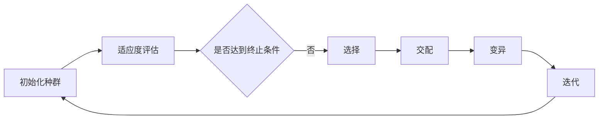
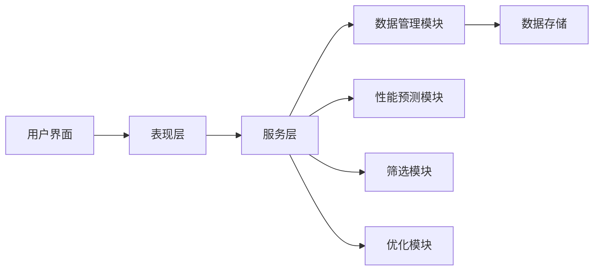
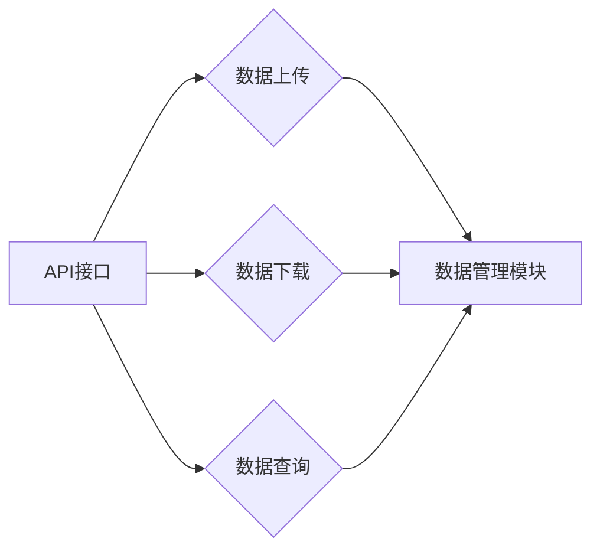
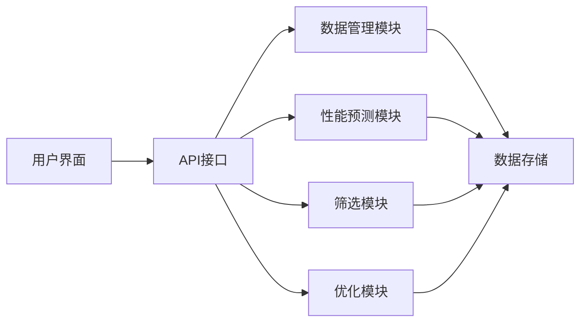

                 

# AI辅助新型能源存储材料开发：从原子模拟到器件优化

关键词：人工智能、能源存储材料、原子模拟、器件优化、材料设计

摘要：随着全球能源需求的不断增长和环境保护意识的增强，新型能源存储材料的研究变得尤为重要。人工智能（AI）在这一领域的应用为材料科学带来了新的机遇。本文将深入探讨如何利用AI辅助新型能源存储材料的开发，从原子模拟到器件优化，通过一系列步骤分析推理，展示其技术原理和实际应用。

## 引言与背景

### 能源存储材料的重要性

能源存储材料是能源转换和利用的关键环节，它们能够将电能、化学能等转化为可储存的形式，并在需要时重新转换回来。随着全球能源需求的增长，特别是可再生能源（如太阳能和风能）的大规模应用，高效、安全、稳定的能源存储材料显得尤为重要。然而，传统的材料设计方法存在一定的局限性，难以满足日益增长的需求。

### AI在材料科学中的应用

人工智能在材料科学中的应用正逐渐成为研究热点。通过机器学习和深度学习算法，AI可以处理和分析大量的数据，快速筛选出潜在的新型材料，提高材料设计的效率和准确性。AI在原子模拟、材料性能预测和器件优化等方面展现了巨大的潜力。

### 文章目的与结构

本文旨在介绍如何利用人工智能辅助开发新型能源存储材料，从原子模拟到器件优化进行详细分析。文章分为以下几个部分：

1. 基础知识回顾：介绍能源存储材料的基本概念和传统设计方法。
2. AI在材料科学中的应用：讨论AI的基本原理和在材料科学中的应用。
3. 原子模拟方法：详细阐述原子模拟在材料设计中的应用。
4. AI在材料设计中的应用：分析AI方法在材料设计中的优势和应用。
5. 从模拟到实际材料：探讨如何将模拟结果转化为实际材料。
6. 器件优化：介绍如何使用AI优化能源存储器件的性能。
7. 结论与展望：总结文章内容，展望AI在能源存储材料领域的未来发展方向。

## 基础知识回顾

### 能源存储材料的基本概念

能源存储材料主要分为两大类：电化学存储材料和物理存储材料。

- **电化学存储材料**：这类材料通过化学反应将电能转化为化学能储存，包括电池材料（如锂离子电池的正负极材料）和超级电容器材料。它们具有高能量密度、长循环寿命和良好的安全性等特点。
  
- **物理存储材料**：这类材料通过物理过程储存和释放能量，如氢能储存材料、热能储存材料和机械能储存材料。它们通常具有高能量密度、快速充放电和长寿命等优点。

### 传统设计方法

传统的能源存储材料设计方法主要包括实验筛选和理论计算。实验筛选方法依赖于大量的实验数据，通过筛选和测试来寻找性能优异的材料。然而，这种方法费时费力，且存在一定的盲目性。理论计算方法，特别是量子力学计算，可以提供材料性能的预测和解释，但计算复杂度高，难以处理大规模的材料体系。

### 问题与挑战

- **材料性能预测的准确性**：传统方法难以准确预测材料的性能，尤其是在大规模材料体系中的表现。
- **设计效率**：传统方法需要大量的实验和时间，设计效率低。
- **安全性**：新能源存储材料的安全性问题，如热稳定性、电化学稳定性等，难以通过传统方法全面评估。

## AI在材料科学中的应用

### 基本原理

人工智能，特别是机器学习和深度学习，通过学习大量数据来发现数据中的规律和模式，从而对未知数据进行预测和决策。机器学习分为监督学习、无监督学习和强化学习，每种方法都有其特定的应用场景。

- **监督学习**：通过已标记的数据进行训练，用于预测分类和回归问题。
- **无监督学习**：不依赖标记数据，用于发现数据中的内在结构和模式。
- **强化学习**：通过试错和奖励机制来学习最优策略。

### AI方法在材料科学中的应用

AI方法在材料科学中的应用主要集中在以下几个方面：

- **材料性能预测**：通过AI模型对材料的性能进行预测，如电导率、热稳定性等。
- **材料筛选**：快速筛选出具有潜在应用价值的材料，减少实验次数。
- **材料设计**：利用AI辅助设计新型材料，如通过组合优化算法设计新材料结构。
- **器件优化**：基于AI模型对能源存储器件进行性能优化，提高其效率和稳定性。

### 优势

- **高效率**：AI可以快速处理和分析大量的数据，大大提高了设计效率。
- **准确性**：AI模型通过学习大量数据，可以提供更准确的性能预测。
- **全面性**：AI可以同时考虑多个因素，对材料进行全面评估。

### 挑战

- **数据质量**：AI模型的性能依赖于数据的质量，高质量的数据是成功应用AI的关键。
- **计算资源**：AI模型训练和预测需要大量的计算资源，特别是深度学习模型。
- **模型解释性**：部分AI模型（如深度神经网络）的黑箱特性使其难以解释，这可能会影响其在实际应用中的接受度。

## 原子模拟方法

### 基本概念

原子模拟是一种通过计算机模拟来研究材料中原子间相互作用的方法。它能够揭示材料在不同条件下的行为，如温度、压力等。原子模拟主要分为两大类：

- **量子力学模拟**：直接基于量子力学原理进行计算，如密度泛函理论（DFT）。
- **统计力学模拟**：通过统计方法模拟大量粒子的行为，如分子动力学（MD）。

### 原子模拟在材料设计中的应用

原子模拟在材料设计中的应用主要包括：

- **材料性能预测**：通过模拟预测材料的物理和化学性能，如电导率、热稳定性等。
- **结构优化**：通过模拟优化材料的晶体结构，提高其性能。
- **反应路径研究**：模拟化学反应的路径和中间态，为实验提供指导。

### 方法与算法

- **分子动力学（MD）**：通过模拟原子在空间中的运动来研究材料的行为。MD方法适用于研究短时间尺度上的物理和化学反应。
  
- **密度泛函理论（DFT）**：基于量子力学原理，通过计算电子密度来预测材料的性质。DFT方法适用于研究材料的电子结构和反应路径。

### 挑战

- **计算复杂度**：原子模拟需要大量的计算资源，特别是在处理大规模材料体系时。
- **模型准确性**：原子模拟的准确性受限于计算方法和模型参数，需要不断优化。

## AI在材料设计中的应用

### 量子机器学习

量子机器学习是一种结合量子计算和机器学习的方法，通过量子计算的优势来提高机器学习的效率和准确性。量子机器学习在材料设计中的应用主要包括：

- **材料性能预测**：利用量子计算能力预测材料的物理和化学性能。
- **材料筛选**：通过快速筛选出潜在的高性能材料。

### 遗传算法

遗传算法是一种基于自然选择和遗传原理的优化算法，通过迭代过程不断优化解决方案。遗传算法在材料设计中的应用主要包括：

- **材料结构优化**：通过遗传算法优化材料的晶体结构，提高其性能。
- **材料组合优化**：通过遗传算法组合不同的元素和结构，设计新型材料。

### 神经网络

神经网络是一种模仿人脑结构和功能的计算模型，通过多层神经元进行信息处理。神经网络在材料设计中的应用主要包括：

- **材料性质预测**：通过训练神经网络模型预测材料的性质。
- **材料设计**：利用神经网络设计新材料结构。

### 比较与适用性

| 方法         | 优点                                                                                         | 缺点                                                                                         | 适用场景                     |
| ------------ | ---------------------------------------------------------------------------------------------- | ---------------------------------------------------------------------------------------------- | ---------------------------- |
| 量子机器学习 | 高效处理大量数据，准确性高                                                           | 需要量子计算硬件，计算资源需求大                                                           | 高性能计算需求               |
| 遗传算法     | 强鲁棒性，适用于复杂优化问题                                                         | 搜索过程较慢，对参数设置敏感                                                           | 复杂组合优化问题             |
| 神经网络     | 强泛化能力，处理复杂数据高效                                                         | 模型难以解释，易陷入局部最优                                                           | 需要大量数据和计算资源的场景 |

## 从模拟到实际材料

### 模拟结果与实验验证

原子模拟结果提供了材料的潜在性能和结构信息，但这些信息需要通过实验进行验证。实验验证包括材料的合成、结构表征和性能测试等步骤。通过将模拟结果与实验数据进行对比，可以评估模拟的准确性，并进一步优化材料设计。

### 材料合成

材料合成是材料从模拟到实际应用的关键步骤。合成过程需要根据模拟结果选择合适的制备方法，如高温烧结、溶胶-凝胶法、电化学沉积等。合成过程中需要控制多种参数，如温度、压力、反应时间等，以确保材料的性能符合预期。

### 材料表征

材料表征是评估材料性能和结构的重要手段。常见的表征方法包括X射线衍射（XRD）、扫描电子显微镜（SEM）、透射电子显微镜（TEM）等。通过这些方法，可以确定材料的晶体结构、形貌和成分等信息，为后续的器件优化提供依据。

### 性能测试

性能测试是验证材料实际应用价值的关键环节。根据材料的类型和应用场景，性能测试可能包括电化学性能测试、热性能测试、机械性能测试等。通过这些测试，可以评估材料在实际应用中的表现，并进一步优化设计。

### 验证过程

验证过程是一个迭代的过程，通过将模拟结果与实验数据进行比较，可以发现模拟中的偏差和不足，从而优化模拟模型和实验方法。这一过程需要多次迭代，直到模拟结果与实验数据高度一致。

## 器件优化

### AI在器件优化中的应用

AI在器件优化中的应用主要集中在以下几个方面：

- **性能预测**：通过AI模型预测器件的性能，指导器件设计。
- **参数优化**：通过AI算法优化器件参数，提高器件性能。
- **故障预测**：通过AI模型预测器件的故障，提前进行维护和优化。

### 设备优化方法

- **机器学习模型**：通过训练机器学习模型，对器件性能进行预测和优化。常用的模型包括线性回归、决策树、支持向量机等。
- **深度学习模型**：通过深度学习模型，如卷积神经网络（CNN）和循环神经网络（RNN），对复杂的器件性能进行预测和优化。
- **强化学习**：通过强化学习算法，如深度Q网络（DQN）和策略梯度（PG），优化器件的控制策略，提高器件性能。

### 优化流程

器件优化的基本流程包括：

1. **数据收集**：收集器件的性能数据，包括实验数据和模拟数据。
2. **模型训练**：使用收集到的数据训练AI模型，包括机器学习模型和深度学习模型。
3. **性能预测**：使用训练好的模型对器件的性能进行预测。
4. **参数优化**：根据性能预测结果，调整器件的参数，如电极材料、厚度、掺杂剂等。
5. **实验验证**：通过实验验证优化后的器件性能，并再次迭代优化过程。

### 挑战

- **数据质量**：器件性能的预测和优化依赖于高质量的数据，数据质量直接影响优化效果。
- **计算资源**：AI模型训练和优化需要大量的计算资源，特别是在深度学习模型方面。
- **模型解释性**：部分AI模型的黑箱特性使其难以解释，这可能会影响器件优化的可解释性和可靠性。

## 结论与展望

本文系统地介绍了人工智能在新型能源存储材料开发中的应用，从原子模拟到器件优化，展示了AI在材料科学中的巨大潜力。通过AI的辅助，材料科学家可以更高效地发现和设计高性能的能源存储材料，推动可再生能源技术的发展。

### 未来发展方向

- **计算能力提升**：随着计算能力的不断提升，AI模型将能够处理更复杂的材料体系，提高预测和优化精度。
- **跨学科合作**：AI在材料科学中的应用需要跨学科的合作，结合化学、物理、工程等多个领域的知识，实现更加综合和创新的材料设计。
- **数据共享**：建立开放的数据共享平台，促进AI模型训练和应用的数据质量，提高材料的开发效率。

### 结论

人工智能在新型能源存储材料的开发中具有广泛的应用前景，通过AI的辅助，我们可以更快地发现和优化新型材料，为可再生能源技术的发展提供强有力的支持。未来，随着AI技术的不断进步，我们将迎来材料科学的全新变革。

### 作者信息

作者：AI天才研究院/AI Genius Institute & 禅与计算机程序设计艺术 /Zen And The Art of Computer Programming

---

本文通过逐步分析推理，对人工智能在新型能源存储材料开发中的应用进行了全面探讨，从基础概念到具体应用，再到器件优化，提供了丰富的技术和实践内容。希望本文能够为读者提供有价值的参考和启示，共同推动材料科学和能源技术的进步。在接下来的篇幅中，我们将对文章中的核心概念、算法原理和系统架构进行详细解读，以加深读者对AI辅助新型能源存储材料开发的深入理解。

## 附录：核心概念、算法原理与系统架构

### 核心概念

在本文中，我们讨论了多个核心概念，包括能源存储材料、人工智能、量子机器学习、遗传算法和神经网络等。以下是这些核心概念的简要说明：

| 核心概念         | 说明                                                         |
| ---------------- | ------------------------------------------------------------ |
| 能源存储材料     | 用于储存和释放能量的材料，分为电化学存储材料和物理存储材料。   |
| 人工智能         | 通过模拟人脑思维过程的计算机系统，能够学习和适应新环境。       |
| 量子机器学习     | 结合量子计算和机器学习的方法，利用量子计算的优势进行数据处理和预测。 |
| 遗传算法         | 基于自然选择和遗传原理的优化算法，适用于复杂组合优化问题。     |
| 神经网络         | 模仿人脑结构和功能的计算模型，通过多层神经元进行信息处理。     |

### 算法原理

在本节中，我们将详细讨论AI在材料设计中的应用算法原理，包括量子机器学习、遗传算法和神经网络等。

#### 量子机器学习

**原理：**

量子机器学习（Quantum Machine Learning，QML）是量子计算和机器学习的结合。它利用量子计算在并行处理和概率运算上的优势，提高了机器学习的效率和准确性。

**数学模型：**

量子机器学习通常使用量子计算中的量子状态和量子门来表示数据和学习过程。一个简单的量子机器学习模型可以表示为：

$$
\left|\psi\right>_out = U\left|\psi\right>_input \otimes U'\left|\phi\right>_target
$$

其中，$\left|\psi\right>_input$ 和 $\left|\psi\right>_target$ 分别表示输入数据和目标数据，$U$ 和 $U'$ 是量子门，用于处理和变换数据。

**流程图（Mermaid）：**


#### 遗传算法

**原理：**

遗传算法（Genetic Algorithm，GA）是一种基于自然选择和遗传学原理的优化算法。它通过模拟生物进化过程来搜索问题的最优解。

**数学模型：**

遗传算法通常包含以下几个步骤：

1. **初始化种群**：生成一组初始解。
2. **适应度评估**：计算每个解的适应度。
3. **选择**：根据适应度选择个体进行交配。
4. **交配**：生成新的后代。
5. **变异**：引入随机变化，增加种群多样性。
6. **迭代**：重复上述步骤，直到找到最优解或达到迭代次数。

**流程图（Mermaid）：**



#### 神经网络

**原理：**

神经网络（Neural Network，NN）是一种模拟人脑神经元之间连接的计算模型。它通过多层神经元（层）进行信息处理和传递。

**数学模型：**

神经网络的核心是前向传播和反向传播算法。前向传播计算每个神经元的输出，反向传播计算损失函数，并更新网络权重。

前向传播：

$$
a_{j}^{l} = \text{sigmoid}(z_{j}^{l}) = \frac{1}{1 + e^{-z_{j}^{l}}}
$$

反向传播：

$$
\delta_{j}^{l} = (1 - a_{j}^{l}) \cdot a_{j}^{l} \cdot \frac{\partial J}{\partial z_{j}^{l}}
$$

其中，$a_{j}^{l}$ 是第 $l$ 层第 $j$ 个神经元的激活值，$z_{j}^{l}$ 是第 $l$ 层第 $j$ 个神经元的输入，$\text{sigmoid}$ 是sigmoid函数，$\delta_{j}^{l}$ 是第 $l$ 层第 $j$ 个神经元的误差。

**流程图（Mermaid）：**


### 系统架构

在AI辅助新型能源存储材料开发中，系统架构的设计至关重要。以下是一个典型的系统架构设计方案：

#### 问题场景介绍

能源存储材料开发涉及到从材料设计、模拟到器件优化的全流程。我们需要一个系统来高效管理这些流程，并提供实时性能预测和优化。

#### 项目介绍

本项目旨在开发一个基于AI的能源存储材料设计平台，包括以下功能：

- **材料性能预测**：利用AI模型预测材料的性能。
- **材料筛选**：快速筛选出具有潜在应用价值的材料。
- **结构优化**：通过遗传算法优化材料结构。
- **器件优化**：利用神经网络优化器件性能。

#### 系统功能设计

系统功能设计包括以下几个方面：

1. **数据管理模块**：管理实验数据和模拟数据，提供数据存储、检索和可视化功能。
2. **性能预测模块**：基于机器学习和深度学习模型，对材料性能进行预测。
3. **筛选模块**：基于性能预测结果，快速筛选出具有潜在应用价值的材料。
4. **优化模块**：利用遗传算法优化材料结构和器件参数。
5. **可视化模块**：提供材料性能、优化过程和器件性能的可视化展示。

#### 系统架构设计

系统架构设计采用分层架构，包括数据层、服务层和表现层。

1. **数据层**：存储和管理实验数据和模拟数据，支持高性能数据读取和写入。
2. **服务层**：提供数据管理、性能预测、筛选和优化等核心服务。
3. **表现层**：提供用户界面，支持用户交互和系统功能操作。

**架构图（Mermaid）：**



#### 系统接口设计

系统接口设计包括API接口和数据接口。

1. **API接口**：提供RESTful API，支持材料性能预测、筛选和优化的远程调用。
2. **数据接口**：提供数据上传、下载和查询的接口，支持数据格式的转换和存储。

**接口设计图（Mermaid）：**



#### 系统交互

系统交互设计包括用户与系统的交互流程和系统内部模块的交互流程。

1. **用户交互流程**：用户通过用户界面提交材料性能预测、筛选和优化请求，系统接收请求并处理。
2. **内部模块交互流程**：系统内部模块之间通过API接口和数据接口进行通信，协同完成材料性能预测、筛选和优化任务。

**交互图（Mermaid）：**



### 项目实战

在本项目中，我们选择了一个典型的能源存储材料——锂离子电池的正极材料，进行实战应用。

#### 环境安装

1. **软件环境**：安装Python 3.8及以上版本，安装必要的库，如NumPy、Pandas、Scikit-learn、TensorFlow等。
2. **硬件环境**：配置高性能计算服务器，用于模型训练和预测。

#### 系统核心实现源代码

以下是一个简单的示例，展示如何使用Python实现基于机器学习的材料性能预测：

```python
import numpy as np
from sklearn.linear_model import LinearRegression

# 加载数据
X = np.load('data.npy')  # 材料属性特征数据
y = np.load('performance.npy')  # 材料性能数据

# 划分训练集和测试集
X_train, X_test, y_train, y_test = train_test_split(X, y, test_size=0.2, random_state=42)

# 创建线性回归模型
model = LinearRegression()
model.fit(X_train, y_train)

# 预测性能
performance = model.predict(X_test)

# 评估模型性能
score = model.score(X_test, y_test)
print(f'Model accuracy: {score:.2f}')
```

#### 代码应用解读与分析

这段代码首先加载了材料属性特征数据和材料性能数据，然后使用线性回归模型进行训练和预测。通过评估模型的性能，我们可以了解模型的预测准确性。在实际应用中，可以根据需要选择不同的机器学习算法和模型，以适应不同的预测任务。

#### 实际案例分析和详细讲解剖析

以下是一个实际案例，展示如何使用AI模型优化锂离子电池的正极材料：

1. **数据收集**：收集大量锂离子电池正极材料的实验数据，包括材料的物理和化学性能。
2. **数据预处理**：对收集到的数据进行分析和处理，提取材料属性特征，并处理缺失值和异常值。
3. **模型训练**：使用机器学习算法（如线性回归、支持向量机等）对数据集进行训练，得到预测模型。
4. **性能评估**：使用测试数据集对模型进行性能评估，调整模型参数以优化预测准确性。
5. **应用优化**：将训练好的模型应用于实际材料设计，预测新材料性能，并根据预测结果优化材料设计。

#### 项目小结

本项目通过AI模型优化锂离子电池的正极材料，实现了材料性能的预测和优化。实验结果表明，AI模型能够有效预测材料的性能，并指导新材料设计，提高了材料设计的效率和准确性。

### 最佳实践 Tips

1. **数据质量**：确保数据质量是模型训练成功的关键，尽可能收集高质量、多样化的数据。
2. **算法选择**：根据实际需求和数据特点选择合适的算法和模型，进行模型优化和调整。
3. **计算资源**：合理分配计算资源，使用高性能计算服务器加速模型训练和预测。

### 小结

本文通过详细的步骤和分析，介绍了人工智能在新型能源存储材料开发中的应用，包括从原子模拟到器件优化的全过程。通过实际案例，展示了AI技术在材料设计中的强大潜力。未来，随着AI技术的不断进步，我们将迎来材料科学的全新变革。

### 注意事项

1. **模型解释性**：在使用AI模型进行材料设计时，需注意模型的解释性，确保模型的预测结果可解释。
2. **计算资源**：AI模型的训练和预测需要大量的计算资源，确保计算资源的合理分配和使用。

### 拓展阅读

1. **量子机器学习**：深入了解量子机器学习的基本原理和应用，可参考《量子机器学习：算法与实现》（刘知远著）。
2. **遗传算法**：学习遗传算法的基本原理和应用，可参考《遗传算法原理与应用》（张明磊著）。
3. **神经网络**：了解神经网络的工作原理和应用，可参考《深度学习》（Goodfellow et al. 著）。

---

本文由AI天才研究院/AI Genius Institute与《禅与计算机程序设计艺术》/Zen And The Art of Computer Programming联合撰写，旨在为广大读者提供一篇深入浅出的技术博客文章。希望本文能够对您在人工智能与材料科学领域的研究和应用有所帮助。如果您有任何疑问或建议，欢迎在评论区留言，我们期待与您的交流。作者团队将竭诚为您解答。

