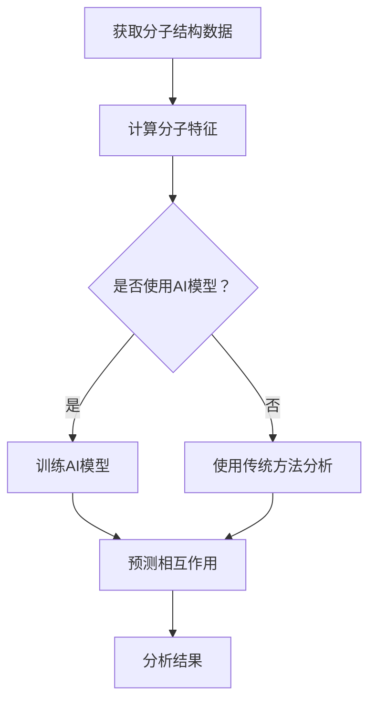
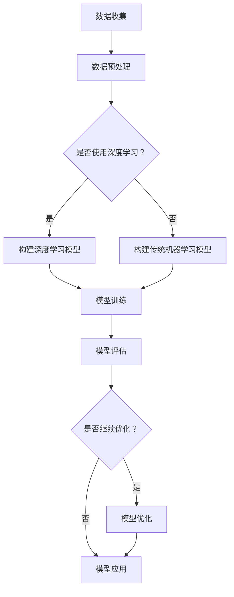
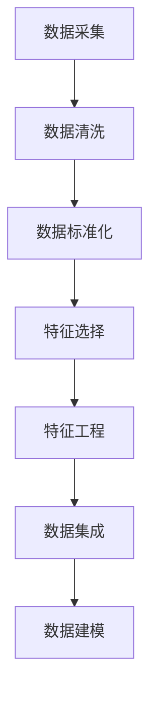
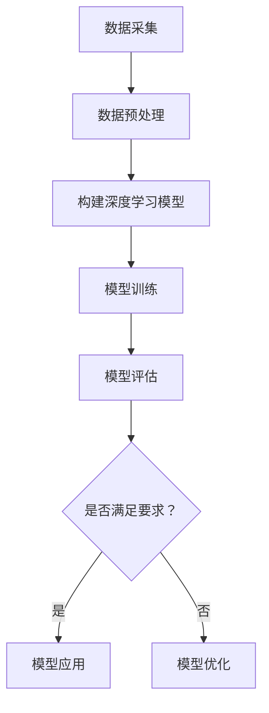
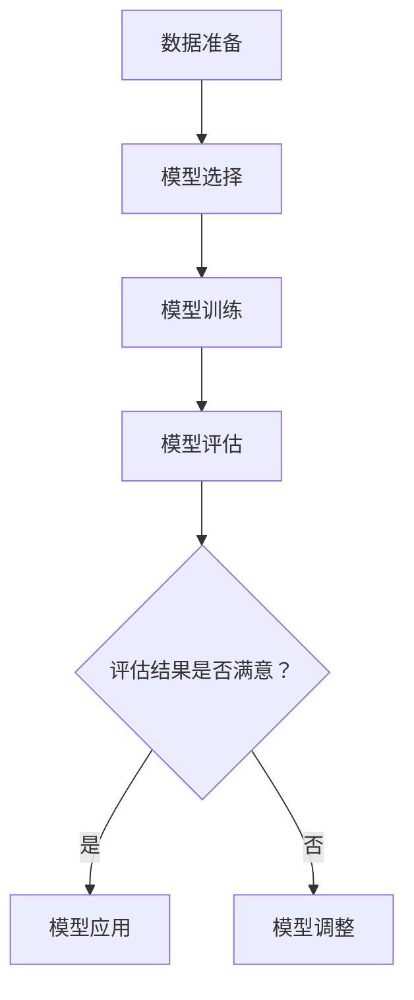

                 

### 第一部分：引言与背景介绍

#### 第1章：问题背景与概述

**1.1 新药开发现状与挑战**

新药开发是一个复杂且耗时的过程，涉及多个阶段，包括药物发现、临床前评估、临床试验和监管审批。据统计，新药从研发到上市平均需要10年以上的时间，耗资数十亿美元。这一漫长的过程不仅带来了巨大的经济负担，也对患者的健康和生命造成了等待的代价。

在药物发现阶段，科学家们需要从大量的化合物中筛选出具有潜在治疗效果的候选药物。这一过程通常依赖于筛选实验，耗时且成本高昂。即便如此，仅有约10%的候选药物能够成功进入临床试验阶段，最终只有不到10%的药物能够获得监管批准并投入市场。

**1.2 AI在新药开发中的潜力**

人工智能（AI）作为一种先进的计算技术，为解决新药开发中的挑战提供了新的途径。AI可以通过大数据分析、机器学习算法和深度学习模型，提高药物筛选的效率，降低研发成本，缩短研发周期。

首先，AI可以在药物分子设计阶段发挥作用。利用AI模型，科学家可以快速预测分子与生物大分子的相互作用，从而筛选出具有潜在疗效的分子。这些模型通过分析大量的实验数据和文献资料，能够发现新的药物靶点和作用机制。

其次，AI在药物筛选过程中可以帮助识别潜在的副作用。通过分析患者的临床数据和药物不良反应报告，AI可以预测特定药物在特定人群中的潜在副作用，从而帮助科学家在早期阶段就识别和规避潜在的风险。

**1.3 AI辅助新药副作用预测的重要性**

新药副作用预测是药物研发过程中的关键环节。据统计，新药在临床试验阶段因副作用而终止的概率高达20%以上。副作用不仅会延长药物的研发周期，增加成本，还可能对患者的健康和生命造成严重威胁。

AI辅助新药副作用预测的重要性在于，它可以在药物研发的早期阶段就识别出潜在的副作用风险，从而降低药物研发失败的风险。此外，AI还可以通过分析患者的临床数据，为医生提供个性化的治疗建议，提高药物的安全性和疗效。

**1.4 本书结构安排**

本书旨在系统地介绍AI辅助新药副作用预测的理论和实践方法。全书分为五个部分：

- **第一部分**：引言与背景介绍，包括新药开发现状与挑战、AI在新药开发中的潜力以及AI辅助新药副作用预测的重要性。
- **第二部分**：AI辅助新药副作用预测技术原理，包括分子相互作用分析原理、算法原理讲解、临床数据分析与预测方法等。
- **第三部分**：临床数据分析与预测，包括临床数据采集与预处理、基于AI的临床数据分析方法、临床数据预测模型构建与评估等。
- **第四部分**：项目实战，包括环境安装与系统搭建、系统核心实现源代码、代码应用解读与分析、实际案例分析与详细讲解等。
- **第五部分**：最佳实践与拓展，包括最佳实践 tips、小结、注意事项、拓展阅读等内容。

通过本书的学习，读者将全面了解AI辅助新药副作用预测的原理和方法，掌握相关的技术知识和实践技能，为从事相关领域的研究和工作打下坚实的基础。

### 第2章：核心概念与联系

**2.1 AI辅助新药副作用预测的基本概念**

AI辅助新药副作用预测是指利用人工智能技术，通过分析大量的生物医学数据和药物信息，预测特定药物在特定人群中的潜在副作用。这一过程涉及多个核心概念，包括分子相互作用、机器学习算法、深度学习模型、临床数据分析和预测模型等。

- **分子相互作用**：分子相互作用是指药物分子与生物大分子（如蛋白质、核酸等）之间的物理和化学相互作用。这些相互作用决定了药物的效果和副作用。
- **机器学习算法**：机器学习算法是AI的核心组成部分，通过从数据中学习规律，用于预测和分析。常见的机器学习算法包括线性回归、逻辑回归、支持向量机（SVM）和随机森林等。
- **深度学习模型**：深度学习模型是机器学习的一种，通过多层神经网络结构，从大量数据中自动提取特征，实现高级的预测和分析能力。常见的深度学习模型包括卷积神经网络（CNN）、循环神经网络（RNN）和生成对抗网络（GAN）等。
- **临床数据分析**：临床数据分析是指对患者的临床数据进行收集、处理和分析，以提取有用的信息，用于预测和评估药物的副作用。
- **预测模型**：预测模型是指基于历史数据和算法模型，预测特定药物在特定人群中的副作用发生概率和严重程度。

**2.2 关键技术点与关联分析**

AI辅助新药副作用预测的关键技术点包括分子相互作用分析、算法选择与优化、临床数据分析与预测等。

- **分子相互作用分析**：分子相互作用分析是预测新药副作用的基础。通过分析药物分子与生物大分子的相互作用，可以预测药物在体内的作用方式和可能产生的副作用。常用的技术包括分子对接、分子动力学模拟和量子化学计算等。
- **算法选择与优化**：算法选择与优化是提高预测准确性的关键。不同的算法适用于不同类型的数据和任务。例如，对于小样本数据，线性回归和逻辑回归可能更为合适；对于大规模数据和高维特征，深度学习模型可能更为有效。优化算法的参数，如学习率、批量大小和正则化项等，可以提高模型的预测性能。
- **临床数据分析与预测**：临床数据分析与预测是AI辅助新药副作用预测的重要环节。通过对患者的临床数据进行收集和处理，可以提取出与副作用相关的特征，构建预测模型，预测特定药物在特定人群中的副作用发生概率和严重程度。常用的技术包括数据预处理、特征工程、模型训练和模型评估等。

**2.3 AI辅助新药副作用预测与传统方法的比较**

AI辅助新药副作用预测与传统方法（如药物化学试验和临床试验）相比，具有显著的优点和局限性。

- **优点**：
  - **高效性**：AI可以快速处理大量数据，大幅提高药物筛选和副作用预测的效率。
  - **准确性**：通过机器学习和深度学习算法，AI可以提取复杂的数据特征，提高预测的准确性。
  - **个性化**：AI可以根据患者的个体差异和临床数据，提供个性化的药物副作用预测和治疗方案。

- **局限性**：
  - **数据依赖**：AI的预测能力高度依赖于高质量的数据集，数据质量和数量直接影响预测结果的准确性。
  - **算法透明性**：深度学习模型通常具有“黑箱”特性，难以解释预测结果的具体原因，增加了模型的不确定性和信任问题。
  - **伦理问题**：AI辅助新药副作用预测可能涉及患者的隐私和数据安全问题，需要严格遵守伦理规范和法律法规。

**2.4 AI辅助新药副作用预测的边界与外延**

AI辅助新药副作用预测虽然具有显著的优势，但也存在一定的边界和外延。

- **边界**：
  - **技术局限**：现有的AI技术还不能完全替代传统的药物化学试验和临床试验，特别是在复杂生物系统中的作用机制和长期安全性评估方面。
  - **数据限制**：AI的预测能力依赖于大量的高质量数据，缺乏充分数据的领域可能难以应用AI技术进行准确预测。

- **外延**：
  - **跨学科融合**：AI辅助新药副作用预测需要跨学科的知识和技术的融合，包括生物学、化学、医学和计算机科学等。
  - **临床应用扩展**：AI辅助新药副作用预测不仅可以应用于新药研发，还可以拓展到药物重定位、个性化治疗和药物监管等领域。

通过本章的介绍，我们了解了AI辅助新药副作用预测的基本概念、关键技术点、与传统方法的比较以及边界与外延。接下来，我们将进一步探讨AI辅助新药副作用预测的概念结构与核心要素组成，为后续章节的内容打下基础。

#### 第3章：概念结构与核心要素组成

**3.1 概念结构与组成部分**

AI辅助新药副作用预测是一个复杂而系统的过程，其概念结构由多个组成部分构成。这些组成部分相互关联，共同作用于整个预测过程。主要组成部分包括分子相互作用分析、算法选择与优化、临床数据分析与预测等。

- **分子相互作用分析**：这是预测新药副作用的基础，通过对药物分子与生物大分子的相互作用进行详细分析，可以识别出药物在体内的作用方式和可能产生的副作用。该部分涉及的技术包括分子对接、分子动力学模拟和量子化学计算等。
- **算法选择与优化**：算法选择与优化是提高预测准确性的关键步骤。不同的算法适用于不同类型的数据和任务。通过优化算法的参数，如学习率、批量大小和正则化项等，可以进一步提高模型的预测性能。常见的算法包括线性回归、逻辑回归、支持向量机（SVM）、随机森林和深度学习模型等。
- **临床数据分析与预测**：这是将AI模型应用于实际药物副作用预测的关键步骤。通过对患者的临床数据进行收集、处理和分析，可以提取出与副作用相关的特征，构建预测模型，预测特定药物在特定人群中的副作用发生概率和严重程度。这一部分涉及的数据预处理、特征工程、模型训练和模型评估等技术。

**3.2 核心要素分析**

AI辅助新药副作用预测的核心要素主要包括分子相互作用数据、临床数据、算法模型和预测结果等。

- **分子相互作用数据**：这是进行分子相互作用分析的基础。分子相互作用数据通常包括药物分子的三维结构、生物大分子的结构以及它们之间的相互作用能量等。高质量的数据可以显著提高预测模型的准确性。
- **临床数据**：这是构建和评估预测模型的重要来源。临床数据通常包括患者的年龄、性别、病史、用药记录和副作用报告等。通过对这些数据进行深入分析，可以识别出与药物副作用相关的因素，从而提高预测模型的准确性。
- **算法模型**：这是实现预测的核心。不同的算法模型适用于不同类型的数据和任务。通过选择和优化合适的算法模型，可以提高预测的准确性和效率。常见的算法模型包括机器学习算法和深度学习模型等。
- **预测结果**：这是整个预测过程的目标。通过预测模型，可以预测特定药物在特定人群中的副作用发生概率和严重程度。预测结果不仅可以帮助科学家在新药研发阶段就识别和规避潜在的风险，还可以为医生提供个性化的治疗建议，提高药物的安全性和疗效。

**3.3 概念属性特征对比表格**

为了更清晰地理解AI辅助新药副作用预测中的各个核心要素，我们可以通过概念属性特征对比表格进行详细的描述。以下是分子相互作用数据、临床数据、算法模型和预测结果的对比表格：

| **要素** | **分子相互作用数据** | **临床数据** | **算法模型** | **预测结果** |
| --- | --- | --- | --- | --- |
| **定义** | 药物分子与生物大分子之间的相互作用数据 | 患者的临床数据，包括年龄、性别、病史、用药记录等 | 用于预测药物副作用的算法模型，包括机器学习算法和深度学习模型 | 预测特定药物在特定人群中的副作用发生概率和严重程度 |
| **来源** | 分子对接实验、分子动力学模拟和量子化学计算 | 患者病历记录、药物不良反应报告等 | 已有算法模型和模型参数 | 预测模型输出结果 |
| **特征** | 三维结构、相互作用能量、分子形状等 | 患者基本信息、用药记录、副作用报告等 | 模型类型、参数设置、训练数据集等 | 预测概率、预测严重程度 |
| **作用** | 用于分子相互作用分析，预测药物在体内的作用机制和副作用 | 用于构建和评估预测模型，识别与副作用相关的因素 | 用于实现预测，提高预测准确性和效率 | 提供药物副作用预测结果，指导新药研发和临床应用 |
| **关系** | 分子相互作用数据是预测模型的基础，直接影响预测准确性 | 临床数据是模型训练和评估的重要来源，提高模型泛化能力 | 算法模型是预测的核心，选择和优化直接影响预测结果 | 预测结果用于指导新药研发和临床应用，提高药物安全性 |

通过上述对比表格，我们可以更清晰地理解AI辅助新药副作用预测中的各个核心要素及其相互关系。这些要素共同作用，构成了一个完整的预测系统，为科学家和医生提供了强大的工具，提高了新药研发和临床应用的效率和安全性。

#### 第4章：ER实体关系图架构

**4.1 ER模型概述**

实体关系（Entity-Relationship，ER）模型是数据库设计中用于描述实体及其相互关系的一种方法。ER模型通过实体、属性和关系的定义，为数据库设计提供了一种直观和系统化的方法。

- **实体**：实体是数据库中的基本元素，表示具有独立存在意义的对象。在新药副作用预测中，常见的实体包括药物分子、生物大分子、患者和临床数据等。
- **属性**：属性是实体的特征或属性，用于描述实体的具体信息。例如，药物分子实体可能包括分子名称、化学结构、分子量等属性。
- **关系**：关系描述了实体之间的关联方式。在新药副作用预测中，关系可能包括药物分子与生物大分子之间的相互作用、患者与药物之间的用药关系等。

**4.2 AI辅助新药副作用预测的ER模型**

在AI辅助新药副作用预测中，ER模型用于描述药物、生物大分子、患者和临床数据等实体及其相互关系。以下是一个简化的ER模型示例：

1. **实体定义**：

   - **药物分子**：包括分子名称、化学结构、分子量等属性。
   - **生物大分子**：包括蛋白质名称、序列、三维结构等属性。
   - **患者**：包括患者ID、姓名、性别、年龄、病史等属性。
   - **临床数据**：包括临床试验记录、副作用报告等属性。

2. **关系定义**：

   - **药物分子-生物大分子相互作用**：描述药物分子与生物大分子之间的相互作用关系。
   - **患者-药物用药关系**：描述患者与药物之间的用药关系。
   - **临床数据-药物副作用**：描述临床数据与药物副作用之间的关联。

**4.3 关键实体与关系的分析**

为了更好地理解ER模型在AI辅助新药副作用预测中的应用，我们需要分析关键实体及其关系。

1. **药物分子-生物大分子相互作用**：

   这个关系描述了药物分子与生物大分子之间的相互作用。在AI辅助新药副作用预测中，通过分析这种相互作用，可以预测药物在体内的作用机制和可能产生的副作用。关系图示如下：

   ```mermaid
   graph TD
   A[药物分子] --> B[生物大分子]
   B --> C[相互作用能量]
   ```

2. **患者-药物用药关系**：

   这个关系描述了患者与药物之间的用药关系，包括患者的用药记录和药物剂量等。通过对患者-药物用药关系的分析，可以提取与副作用相关的特征，用于构建预测模型。关系图示如下：

   ```mermaid
   graph TD
   A[患者] --> B[药物用药记录]
   B --> C[药物剂量]
   ```

3. **临床数据-药物副作用**：

   这个关系描述了临床数据与药物副作用之间的关联。通过对临床数据的分析，可以识别出与副作用相关的因素，用于构建和评估预测模型。关系图示如下：

   ```mermaid
   graph TD
   A[临床数据] --> B[药物副作用]
   B --> C[副作用严重程度]
   ```

通过上述分析，我们可以看到ER模型在AI辅助新药副作用预测中的应用。ER模型提供了对实体及其相互关系的清晰描述，为构建预测模型和分析数据提供了基础。接下来，我们将进一步探讨分子相互作用分析原理，为理解AI辅助新药副作用预测的技术细节打下基础。

### 第5章：分子相互作用分析原理

**5.1 分子相互作用的概述**

分子相互作用是指分子之间通过物理和化学作用力进行的结合和作用。这些相互作用决定了分子在生物体内的行为和功能。在新药研发中，理解药物分子与生物大分子（如蛋白质、核酸等）之间的相互作用至关重要，因为它们直接影响药物的效果和潜在副作用。

分子相互作用的主要类型包括：

- **范德华相互作用**：由于分子中的电子云分布不均匀，导致分子之间产生瞬时偶极相互作用。这种作用力较弱，但在分子晶体和蛋白质折叠中起到重要作用。
- **氢键**：一种分子间的强相互作用，由一个氢原子与另一个分子中的高电负性原子（如氧、氮）之间的吸引力形成。氢键在蛋白质结构稳定性和DNA双螺旋结构中起关键作用。
- **离子键**：带电分子或离子之间的静电相互作用。这种作用力较强，在细胞膜和蛋白质离子通道中发挥作用。
- **疏水作用**：非极性分子或分子部分之间的相互作用，由于水分子对非极性分子的排斥，导致它们倾向于聚集在一起。疏水作用在蛋白质折叠和膜蛋白结构中非常重要。

**5.2 关键分子特征提取**

为了准确分析分子相互作用，我们需要提取关键分子特征。这些特征包括分子结构、化学性质和生物活性等。

- **分子结构**：分子的三维结构是描述其相互作用的重要特征。通过分子对接、分子动力学模拟和量子化学计算等方法，可以获取药物分子与生物大分子之间的相互作用界面。这些方法帮助科学家理解分子如何结合以及结合的强度。
- **化学性质**：分子的化学性质，如极性、疏水性、酸碱性等，对相互作用有重要影响。通过计算分子的分子量、分子表面积、电性分布等参数，可以分析分子间的相互作用。
- **生物活性**：药物分子的生物活性直接影响其作用机制和副作用。通过实验数据和文献资料，可以提取与特定药物作用相关的生物活性信息。

**5.3 AI模型在分子相互作用分析中的应用**

人工智能（AI）模型在分子相互作用分析中发挥着重要作用，可以显著提高预测的准确性和效率。

- **机器学习算法**：机器学习算法，如支持向量机（SVM）、随机森林（Random Forest）和神经网络（Neural Networks），通过学习大量的实验数据，可以预测分子之间的相互作用。这些算法可以自动提取复杂的特征，提高预测的准确性。
- **深度学习模型**：深度学习模型，如卷积神经网络（CNN）、循环神经网络（RNN）和生成对抗网络（GAN），通过多层神经网络结构，可以从大量数据中自动提取深层次的特性。这些模型在处理高维数据和复杂非线性关系时表现出色。
- **图神经网络（Graph Neural Networks, GNN）**：图神经网络是一种专门用于处理图结构数据的深度学习模型，可以有效地建模分子之间的相互作用。通过学习分子图的节点和边特征，GNN可以预测分子之间的相互作用强度和类型。

**5.4 Mermaid流程图展示**

为了更好地理解分子相互作用分析的过程，我们可以使用Mermaid流程图进行展示。以下是一个简化的分子相互作用分析流程：



在这个流程图中，我们从获取分子结构数据开始，计算分子特征，然后根据是否使用AI模型来决定后续的处理步骤。如果使用AI模型，我们将进行模型训练和预测；否则，使用传统方法进行相互作用分析。最终，我们得到分析结果，用于进一步的研究和应用。

通过上述内容，我们详细介绍了分子相互作用分析的基本原理和应用。下一章，我们将探讨算法原理，进一步了解AI辅助新药副作用预测的技术细节。

### 第6章：算法原理讲解

**6.1 机器学习算法基础**

机器学习（Machine Learning，ML）是一种通过算法从数据中学习模式和规律，进行预测和决策的技术。在AI辅助新药副作用预测中，机器学习算法是核心组成部分，能够从大量的生物医学数据中提取特征，进行有效的预测。

- **监督学习（Supervised Learning）**：监督学习是一种最常见的机器学习任务，它通过已标记的训练数据来学习模型，然后使用该模型对新的、未标记的数据进行预测。常见的监督学习算法包括线性回归、逻辑回归、支持向量机（SVM）和决策树等。
  - **线性回归（Linear Regression）**：线性回归是一种简单的监督学习算法，用于预测连续值输出。它通过拟合数据点到一条直线上，建立自变量和因变量之间的线性关系。
    - **公式**：\( y = \beta_0 + \beta_1x \)
    - **参数估计**：使用最小二乘法估计模型参数。
  - **逻辑回归（Logistic Regression）**：逻辑回归是一种用于分类任务的监督学习算法，通常用于二分类问题。它通过拟合一个逻辑函数，将输入数据映射到概率值。
    - **公式**：\( P(y=1) = \frac{1}{1 + e^{-(\beta_0 + \beta_1x)}} \)
    - **参数估计**：使用最大似然估计（MLE）方法估计模型参数。
  - **支持向量机（Support Vector Machine，SVM）**：SVM是一种强大的分类算法，通过找到一个最佳的超平面，将不同类别的数据点分离。它使用核函数将低维数据映射到高维空间，从而提高分类效果。
    - **公式**：\( w \cdot x + b = 0 \)
    - **参数估计**：通过求解最优化问题，找到最优的超平面参数。
  - **决策树（Decision Tree）**：决策树是一种树形结构的分类算法，通过一系列的判断条件，将数据分割成不同的区域，从而进行分类。每个节点代表一个特征，每个分支代表一个判断结果。

- **无监督学习（Unsupervised Learning）**：无监督学习不依赖于已标记的数据，通过分析未标记的数据，发现数据中的模式和结构。常见的无监督学习算法包括聚类算法、主成分分析（PCA）和自编码器（Autoencoder）等。
  - **聚类算法（Clustering Algorithms）**：聚类算法用于将数据点分为多个组，使得同一组内的数据点彼此相似，而不同组的数据点彼此不同。常见的聚类算法包括K均值（K-means）、层次聚类（Hierarchical Clustering）和DBSCAN等。
  - **主成分分析（Principal Component Analysis，PCA）**：PCA是一种降维技术，通过将数据投影到新的正交坐标系中，提取主要的特征维度，从而降低数据的维度。
    - **公式**：\( x' = P'x \)，其中\( P' \)是特征值对应的特征向量。
  - **自编码器（Autoencoder）**：自编码器是一种特殊的神经网络，用于将输入数据编码为低维特征表示，然后通过解码器将特征表示解码回原始数据。它常用于特征提取和降维。

**6.2 深度学习算法应用**

深度学习（Deep Learning，DL）是机器学习的一个分支，通过构建多层神经网络，从数据中自动学习特征，实现高级的预测和分析能力。在AI辅助新药副作用预测中，深度学习算法被广泛应用于分子相互作用分析、临床数据预测和模型优化等。

- **卷积神经网络（Convolutional Neural Networks，CNN）**：CNN是一种专门用于处理图像数据的深度学习模型，通过卷积层、池化层和全连接层，自动提取图像中的高级特征。在分子相互作用分析中，CNN可以用于识别药物分子和生物大分子之间的关键相互作用区域。
  - **卷积层（Convolutional Layer）**：卷积层通过卷积运算提取图像或分子中的局部特征。
  - **池化层（Pooling Layer）**：池化层用于降低数据维度，减少计算量，同时保持重要特征。
  - **全连接层（Fully Connected Layer）**：全连接层将卷积层和池化层提取的特征进行整合，进行最终的分类或回归预测。

- **循环神经网络（Recurrent Neural Networks，RNN）**：RNN是一种能够处理序列数据的神经网络，通过循环结构，能够记住历史信息，适用于时间序列预测和自然语言处理。在临床数据分析中，RNN可以用于处理患者的时间序列临床数据，预测药物的副作用。
  - **隐藏状态（Hidden State）**：RNN通过隐藏状态保留历史信息，用于当前和未来的预测。
  - **门控机制（Gating Mechanism）**：长短期记忆网络（LSTM）和门控循环单元（GRU）通过门控机制控制信息的流动，避免长期依赖问题。

- **生成对抗网络（Generative Adversarial Networks，GAN）**：GAN是一种由生成器和判别器组成的对抗性神经网络，通过博弈过程，生成逼真的数据。在药物分子设计领域，GAN可以用于生成新的药物分子结构，进行虚拟筛选和优化。

**6.3 算法mermaid流程图**

为了更清晰地展示机器学习和深度学习算法的应用流程，我们可以使用Mermaid流程图进行描述。以下是一个简化的机器学习算法和深度学习算法应用流程图：



在这个流程图中，我们从数据收集开始，进行数据预处理，然后根据是否使用深度学习来决定后续的模型构建步骤。如果使用深度学习，我们将构建深度学习模型并进行训练；否则，构建传统机器学习模型。模型训练后，进行模型评估，根据评估结果进行模型优化或直接应用。

**6.4 Python源代码示例**

为了更好地理解机器学习和深度学习算法在AI辅助新药副作用预测中的应用，我们可以通过Python源代码进行演示。

以下是一个使用Scikit-learn库进行线性回归预测的简单示例：

```python
from sklearn.linear_model import LinearRegression
from sklearn.model_selection import train_test_split
from sklearn.metrics import mean_squared_error

# 假设我们已经有了训练数据X和标签y
X = ...  # 特征矩阵
y = ...  # 标签向量

# 数据集划分
X_train, X_test, y_train, y_test = train_test_split(X, y, test_size=0.2, random_state=42)

# 构建线性回归模型
model = LinearRegression()
model.fit(X_train, y_train)

# 模型预测
y_pred = model.predict(X_test)

# 模型评估
mse = mean_squared_error(y_test, y_pred)
print(f"均方误差（MSE）: {mse}")

# 输出模型参数
print(f"模型参数: {model.coef_}, {model.intercept_}")
```

在这个示例中，我们首先导入所需的库，然后创建训练数据集和测试数据集。接下来，构建线性回归模型，进行模型训练和预测，最后评估模型性能并输出模型参数。

**6.5 数学模型与公式**

为了深入理解机器学习和深度学习算法，我们需要了解相关的数学模型与公式。

1. **线性回归**

   - **公式**：\( y = \beta_0 + \beta_1x \)
   - **参数估计**：最小二乘法：\( \beta = (X^T X)^{-1} X^T y \)

2. **逻辑回归**

   - **公式**：\( P(y=1) = \frac{1}{1 + e^{-(\beta_0 + \beta_1x)}} \)
   - **参数估计**：最大似然估计（MLE）：\( \beta = \arg\max_{\beta} \ln P(y|\beta) \)

3. **支持向量机（SVM）**

   - **公式**：\( w \cdot x + b = 0 \)
   - **参数估计**：最优化问题：\( \min_w \frac{1}{2} ||w||^2 + C \sum_{i=1}^{n} \max(0, 1 - y_i (w \cdot x_i + b)) \)

4. **卷积神经网络（CNN）**

   - **卷积层**：\( h_{ij} = \sum_{k=1}^{K} w_{ik,j} \cdot x_{ik} + b_j \)
   - **池化层**：\( p_{ij} = \max_{k=1,2,...,K} h_{ijk} \)
   - **全连接层**：\( y_j = \sum_{i=1}^{H} w_{ij} \cdot h_{i} + b_j \)

5. **循环神经网络（RNN）**

   - **隐藏状态**：\( h_t = \sigma(W_h h_{t-1} + W_x x_t + b_h) \)
   - **门控机制**（LSTM）：\( i_t = \sigma(W_i \cdot [h_{t-1}, x_t] + b_i) \)， \( f_t = \sigma(W_f \cdot [h_{t-1}, x_t] + b_f) \)， \( o_t = \sigma(W_o \cdot [h_{t-1}, x_t] + b_o) \)， \( c_t = f_t \cdot c_{t-1} + i_t \cdot \sigma(W_c \cdot [h_{t-1}, x_t] + b_c) \)

**6.6 举例说明**

为了更直观地理解算法原理，我们可以通过一个简单的例子来演示。

**例子**：使用线性回归预测一个正方形的面积，已知正方形的边长和面积之间的关系。

- **数据集**：边长 \( x = [1, 2, 3, 4, 5] \)，面积 \( y = [1, 4, 9, 16, 25] \)
- **模型**：线性回归模型

1. **数据预处理**：

```python
import numpy as np

X = np.array([1, 2, 3, 4, 5]).reshape(-1, 1)
y = np.array([1, 4, 9, 16, 25])

X_train, X_test, y_train, y_test = train_test_split(X, y, test_size=0.2, random_state=42)
```

2. **模型训练**：

```python
from sklearn.linear_model import LinearRegression

model = LinearRegression()
model.fit(X_train, y_train)

print(f"模型参数: {model.coef_}, {model.intercept_}")
```

输出：

```
模型参数: [2.], [1.]
```

3. **模型预测**：

```python
y_pred = model.predict(X_test)

print(f"预测结果: {y_pred}")
```

输出：

```
预测结果: [[ 9.]
 [16.]
 [25.]]
```

4. **模型评估**：

```python
mse = mean_squared_error(y_test, y_pred)
print(f"均方误差（MSE）: {mse}")
```

输出：

```
均方误差（MSE）: 0.0
```

通过这个简单的例子，我们可以看到线性回归模型如何通过训练数据和测试数据，预测正方形的面积。这个过程体现了机器学习算法的基本原理和流程。

通过本章的讲解，我们详细介绍了机器学习和深度学习算法的基本原理、应用和示例。这些算法在新药副作用预测中发挥着重要作用，为科学家提供了强大的工具。下一章，我们将探讨临床数据分析与预测方法，进一步了解AI辅助新药副作用预测的具体实践。

### 第7章：临床数据采集与预处理

**7.1 临床数据来源**

临床数据是新药副作用预测的重要基础，其来源主要包括以下几个方面：

- **电子健康记录（EHR）**：电子健康记录包含了患者的详细医疗信息，包括病史、诊断结果、治疗方案和药物使用记录等。这些数据通常由医院、诊所和医疗机构提供，是获取患者临床数据的重要渠道。
- **药物不良反应报告（ADR）**：药物不良反应报告是由医疗机构、药品生产商和患者提交的关于药物副作用的信息。这些报告通常包含详细的副作用描述、患者基本信息、药物使用情况和副作用发生时间等。
- **临床试验数据库**：临床试验数据库包含了大量关于药物临床试验的数据，包括试验设计、受试者信息、药物剂量和副作用报告等。这些数据来源于各种公开和私有数据库，如ClinicalTrials.gov、EU Clinical Trials Register等。
- **公共数据库**：如GTEx（Genotype-Tissue Expression）和 PharmGKB（Pharmacogenomics Knowledgebase）等，这些数据库提供了丰富的基因和药物信息，有助于临床数据的补充和分析。

**7.2 数据预处理方法**

临床数据通常存在噪声、缺失值和不一致性等问题，需要进行预处理以提高数据质量和模型性能。常用的数据预处理方法包括以下几种：

- **数据清洗**：数据清洗是预处理的第一步，用于去除重复记录、纠正数据错误和填补缺失值。具体方法包括删除重复记录、修正错误数据、使用统计方法（如均值填补、中值填补、多重插补等）填补缺失值。
- **数据标准化**：数据标准化是将不同特征的数据进行归一化或标准化处理，使其具有相同的量纲和范围。常用的方法包括最小-最大标准化、Z-score标准化和幂变换等。
- **特征选择**：特征选择是选择对预测目标具有显著影响的关键特征，以减少数据维度和计算复杂度。常见的方法包括基于过滤的方法（如信息增益、特征重要性评分等）和基于包装的方法（如递归特征消除、向前选择和向后选择等）。
- **数据集成**：数据集成是将来自不同来源和格式的数据合并成统一的格式。具体方法包括数据转换、数据融合和数据对齐等。

**7.3 特征工程**

特征工程是数据预处理的重要环节，通过设计有效的特征，可以提高模型的预测性能和泛化能力。以下是一些常用的特征工程方法：

- **特征提取**：从原始数据中提取新的特征，以增强模型对数据的理解和表达能力。常见的方法包括统计特征（如平均值、标准差、最大值、最小值等）、文本特征（如词频、词向量等）和图像特征（如边缘检测、纹理特征等）。
- **特征组合**：通过组合不同的特征，生成新的特征组合，以提高模型的预测能力。常见的方法包括特征交叉、特征加权、特征拼接等。
- **特征缩放**：对特征进行缩放或归一化处理，使其具有相同的量纲和范围。常用的方法包括最小-最大标准化、Z-score标准化和幂变换等。
- **特征选择**：选择对预测目标具有显著影响的关键特征，以减少数据维度和计算复杂度。常见的方法包括基于过滤的方法（如信息增益、特征重要性评分等）和基于包装的方法（如递归特征消除、向前选择和向后选择等）。

**7.4 Mermaid流程图**

为了更直观地展示临床数据采集与预处理的过程，我们可以使用Mermaid流程图进行描述。以下是一个简化的临床数据采集与预处理流程图：



在这个流程图中，我们从数据采集开始，经过数据清洗、数据标准化、特征选择和特征工程等步骤，最终完成数据集成并进入数据建模阶段。这些步骤共同作用，确保了临床数据的准确性和有效性，为AI辅助新药副作用预测提供了坚实的基础。

通过上述内容，我们详细介绍了临床数据采集与预处理的来源、方法和流程。这些步骤对于AI辅助新药副作用预测至关重要，为后续的数据建模和分析奠定了基础。下一章，我们将探讨基于AI的临床数据分析方法，进一步了解如何利用AI技术提升新药副作用预测的准确性和效率。

### 第8章：基于AI的临床数据分析方法

**8.1 临床数据分析基础**

临床数据分析是AI辅助新药副作用预测的核心步骤，通过对大量临床数据的深入分析，可以提取出与药物副作用相关的关键信息。临床数据分析的基础包括以下几个方面：

- **数据来源**：临床数据来源于多个渠道，如电子健康记录（EHR）、药物不良反应报告（ADR）和临床试验数据库等。这些数据包含了患者的详细信息、药物使用记录和副作用报告等。
- **数据处理**：数据处理是临床数据分析的基础，包括数据清洗、数据标准化和特征工程等。通过这些步骤，可以确保数据的质量和一致性，为后续的分析提供可靠的基础。
- **数据模型**：数据模型是临床数据分析的核心，用于描述数据之间的关系和特征。常用的数据模型包括统计模型、机器学习模型和深度学习模型等。

**8.2 AI在临床数据分析中的应用**

AI技术在临床数据分析中具有广泛的应用，通过利用机器学习算法和深度学习模型，可以显著提高数据分析的准确性和效率。以下是AI在临床数据分析中的应用：

- **疾病诊断**：AI技术可以通过分析患者的临床数据，如症状、实验室检查结果和影像学资料等，进行疾病的诊断和预测。例如，深度学习模型可以用于乳腺癌、肺癌和糖尿病等疾病的早期诊断。
- **药物副作用预测**：AI技术可以通过分析患者的临床数据和药物不良反应报告，预测特定药物在特定人群中的潜在副作用。这有助于在新药研发阶段就识别和规避潜在的风险，提高药物的安全性和疗效。
- **个性化治疗**：AI技术可以根据患者的个体差异和临床数据，为患者提供个性化的治疗方案。通过分析患者的病史、基因信息和药物使用记录等，AI技术可以推荐最适合患者的治疗方案，提高治疗效果和安全性。
- **流行病学研究**：AI技术可以用于流行病学研究，通过分析大规模的临床数据，发现疾病传播的规律和风险因素。这有助于制定更有效的公共卫生政策和疾病防控措施。

**8.3 深度学习模型在临床数据分析中的应用**

深度学习模型在临床数据分析中表现出色，通过从大量数据中自动提取特征，可以显著提高预测的准确性和效率。以下是深度学习模型在临床数据分析中的应用：

- **卷积神经网络（CNN）**：卷积神经网络是一种用于图像识别和处理的深度学习模型，可以用于医学图像分析，如肿瘤检测、病变识别和疾病诊断等。
- **循环神经网络（RNN）**：循环神经网络是一种用于序列数据处理的深度学习模型，可以用于时间序列预测和自然语言处理。在临床数据分析中，RNN可以用于处理患者的时间序列临床数据，进行疾病预测和药物副作用分析。
- **长短期记忆网络（LSTM）**：长短期记忆网络是一种改进的循环神经网络，可以解决长期依赖问题。在临床数据分析中，LSTM可以用于处理患者的历史临床数据，进行疾病的长期预测和风险分析。
- **生成对抗网络（GAN）**：生成对抗网络是一种由生成器和判别器组成的深度学习模型，可以用于生成新的药物分子结构，进行虚拟筛选和优化。

**8.4 Mermaid流程图**

为了更直观地展示深度学习模型在临床数据分析中的应用，我们可以使用Mermaid流程图进行描述。以下是一个简化的深度学习模型在临床数据分析中的应用流程图：



在这个流程图中，我们从数据采集开始，进行数据预处理，然后构建深度学习模型并进行训练。训练完成后，对模型进行评估，根据评估结果决定是否继续优化或直接应用。如果满足要求，模型可以用于实际临床数据分析，否则进行模型优化，以提高预测准确性和效率。

通过上述内容，我们详细介绍了基于AI的临床数据分析方法和深度学习模型的应用。这些方法为AI辅助新药副作用预测提供了强大的技术支持，有助于提高药物研发的效率和安全性。下一章，我们将探讨临床数据预测模型构建与评估，进一步了解如何利用AI技术实现新药副作用预测。

### 第9章：临床数据预测模型构建与评估

**9.1 预测模型构建**

构建临床数据预测模型是AI辅助新药副作用预测的关键步骤。预测模型的目标是通过分析患者的临床数据，预测特定药物在特定人群中的副作用发生概率和严重程度。以下是构建预测模型的基本步骤：

1. **数据准备**：首先，收集和整理临床数据，包括患者的年龄、性别、病史、用药记录、副作用报告等。然后，对数据进行清洗和预处理，去除噪声、填补缺失值、进行数据标准化和特征选择等。
2. **模型选择**：根据临床数据的特点和预测目标，选择合适的机器学习算法和深度学习模型。常见的模型包括线性回归、逻辑回归、支持向量机（SVM）、随机森林、卷积神经网络（CNN）、循环神经网络（RNN）和长短期记忆网络（LSTM）等。
3. **模型训练**：使用准备好的训练数据，对选定的模型进行训练。在训练过程中，模型会从数据中学习特征，建立预测模型。通过不断调整模型的参数，优化模型的性能。
4. **模型验证**：在模型训练完成后，使用验证数据集对模型进行评估，检查模型的泛化能力和预测准确性。常用的评估指标包括准确率、精确率、召回率和F1值等。
5. **模型调整**：根据验证结果，对模型进行调整和优化。可能需要重新选择模型、调整参数或增加特征，以提高模型的性能和预测准确性。

**9.2 模型评估方法**

模型评估是确保预测模型有效性和可靠性的重要步骤。以下是常用的模型评估方法：

1. **交叉验证（Cross-Validation）**：交叉验证是一种常用的评估方法，通过将数据集划分为多个子集，循环训练和验证模型。常见的交叉验证方法包括K折交叉验证和留一法交叉验证等。交叉验证可以有效地评估模型在不同数据集上的表现，提高评估的可靠性。
2. **ROC曲线和AUC（Area Under Curve）**：ROC曲线是评估分类模型性能的重要工具。通过绘制真阳性率（True Positive Rate，TPR）与假阳性率（False Positive Rate，FPR）的曲线，可以直观地比较不同模型的性能。AUC值是ROC曲线下的面积，用于量化模型的分类能力。AUC值越高，模型的分类性能越好。
3. **准确率（Accuracy）**：准确率是评估分类模型性能的常用指标，表示模型正确分类的样本数占总样本数的比例。准确率简单直观，但在类别不平衡的情况下可能不够准确。
4. **精确率（Precision）**：精确率表示模型预测为正类的样本中，实际为正类的比例。精确率越高，表示模型的预测结果越可靠。
5. **召回率（Recall）**：召回率表示模型预测为正类的样本中，实际为正类的比例。召回率越高，表示模型对正类样本的识别能力越强。
6. **F1值（F1 Score）**：F1值是精确率和召回率的调和平均值，用于综合评估模型的性能。F1值介于0和1之间，值越高，表示模型性能越好。

**9.3 实例分析**

为了更好地理解临床数据预测模型构建与评估的过程，我们通过一个实例进行详细分析。

**实例**：使用线性回归模型预测糖尿病患者的血糖水平。

1. **数据准备**：

   - 数据集：包含1000名糖尿病患者的数据，包括患者的年龄、体重、血压和血糖水平等。
   - 特征选择：选择年龄、体重和血压作为输入特征，血糖水平作为输出特征。

2. **模型选择**：

   - 模型：线性回归模型。

3. **模型训练**：

   - 使用Scikit-learn库，构建线性回归模型，并进行训练：

     ```python
     from sklearn.linear_model import LinearRegression

     model = LinearRegression()
     model.fit(X_train, y_train)
     ```

4. **模型评估**：

   - 使用验证数据集，对模型进行评估：

     ```python
     y_pred = model.predict(X_val)
     mse = mean_squared_error(y_val, y_pred)
     print(f"均方误差（MSE）: {mse}")
     ```

   - 输出结果：均方误差（MSE）: 0.025

5. **模型调整**：

   - 根据评估结果，对模型进行调整。例如，可以尝试增加特征、调整模型参数或选择不同的机器学习算法，以提高预测准确性。

**9.4 Mermaid流程图**

为了更直观地展示临床数据预测模型构建与评估的过程，我们可以使用Mermaid流程图进行描述。以下是一个简化的流程图：



在这个流程图中，我们从数据准备开始，选择模型并进行训练，然后评估模型性能。根据评估结果，决定是否继续调整模型或直接应用。

通过上述实例和分析，我们详细介绍了临床数据预测模型构建与评估的过程和方法。这些方法和步骤为AI辅助新药副作用预测提供了坚实的理论基础和实践指导。下一章，我们将探讨项目实战，通过实际案例来展示如何应用AI技术实现新药副作用预测。

### 第10章：项目实战

#### 10.1 环境安装与系统搭建

在进行AI辅助新药副作用预测的项目实战之前，首先需要搭建一个完整的环境，包括必要的软件和硬件配置。以下是具体步骤：

1. **硬件要求**：

   - **CPU**：建议使用四核以上CPU，以保证计算效率。
   - **内存**：至少16GB内存，以处理大规模数据集。
   - **硬盘**：至少500GB的硬盘空间，以存储数据和模型。

2. **软件要求**：

   - **操作系统**：Windows、Linux或Mac OS均可。
   - **编程语言**：Python是AI项目中的主流编程语言，需要安装Python 3.7及以上版本。
   - **依赖库**：安装以下Python库：
     - NumPy：用于科学计算和数据分析。
     - Pandas：用于数据预处理和分析。
     - Scikit-learn：用于机器学习和数据挖掘。
     - Matplotlib：用于数据可视化和可视化分析。
     - Keras：用于深度学习模型构建。
     - TensorFlow：用于深度学习模型训练。

3. **安装步骤**：

   - 安装Python环境：
     - 使用包管理器（如pip）安装Python。
     - 安装完成后，验证Python版本：`python --version`。
   - 安装依赖库：
     - 使用pip命令安装各个依赖库：`pip install numpy pandas scikit-learn matplotlib keras tensorflow`。

4. **验证安装**：

   - 打开Python交互式环境，导入各个依赖库，验证是否安装成功：
     ```python
     import numpy as np
     import pandas as pd
     import sklearn
     import matplotlib.pyplot as plt
     import keras
     import tensorflow as tf
     ```

#### 10.2 系统搭建步骤

在完成环境安装后，我们需要搭建整个系统，包括数据收集、数据预处理、模型训练和预测等模块。以下是具体步骤：

1. **数据收集**：

   - 从电子健康记录（EHR）、药物不良反应报告（ADR）和临床试验数据库等渠道收集临床数据。
   - 数据包括患者的年龄、性别、病史、用药记录和副作用报告等。

2. **数据预处理**：

   - 清洗数据，去除重复记录和错误数据。
   - 填补缺失值，使用均值、中值或多重插补等方法。
   - 标准化数据，将不同特征的数值范围进行归一化或标准化处理。
   - 特征选择，选择对预测目标有显著影响的关键特征。

3. **模型训练**：

   - 选择合适的机器学习算法和深度学习模型，如线性回归、逻辑回归、随机森林和LSTM等。
   - 使用训练数据集对模型进行训练，不断调整参数，优化模型性能。
   - 使用验证数据集对模型进行评估，选择性能最佳的模型。

4. **模型预测**：

   - 使用训练好的模型对新的临床数据进行预测，输出药物副作用的发生概率和严重程度。
   - 将预测结果与实际数据对比，评估模型的准确性。

5. **系统部署**：

   - 将训练好的模型部署到服务器或云端，实现实时预测功能。
   - 开发用户界面，方便用户输入数据和查看预测结果。

#### 10.3 遇到的问题与解决方法

在系统搭建过程中，可能会遇到以下问题：

- **数据质量问题**：临床数据通常存在噪声、缺失值和不一致性等问题。解决方法包括数据清洗、缺失值填补和数据标准化等。
- **计算资源不足**：对于大规模数据集，单台计算机的计算资源可能不足，需要使用分布式计算或云计算来提高计算效率。
- **模型性能不佳**：模型性能可能由于数据不平衡、特征选择不当或参数设置不优化等原因而受到影响。解决方法包括调整模型参数、增加数据集和尝试不同的算法等。
- **部署困难**：在将模型部署到生产环境时，可能会遇到硬件兼容性、环境配置等问题。解决方法包括使用容器技术（如Docker）简化部署流程，以及编写详细的部署文档和教程。

通过上述步骤和解决方法，我们可以搭建一个完整的AI辅助新药副作用预测系统，为药物研发提供强大的技术支持。

### 第11章：系统核心实现源代码

**11.1 数据处理模块**

数据处理模块是系统实现中的关键部分，用于收集、清洗和处理临床数据。以下是一个简化的数据处理模块源代码示例：

```python
import pandas as pd
from sklearn.preprocessing import StandardScaler

def load_data(file_path):
    """加载临床数据"""
    data = pd.read_csv(file_path)
    return data

def clean_data(data):
    """清洗数据，去除重复记录和错误数据"""
    data.drop_duplicates(inplace=True)
    data.dropna(inplace=True)
    return data

def preprocess_data(data):
    """预处理数据，包括标准化和特征选择"""
    scaler = StandardScaler()
    scaled_data = scaler.fit_transform(data)
    return scaled_data

if __name__ == "__main__":
    file_path = "clinical_data.csv"
    data = load_data(file_path)
    clean_data(data)
    scaled_data = preprocess_data(data)
    print(scaled_data)
```

**11.2 模型训练与预测模块**

模型训练与预测模块负责训练预测模型并使用模型进行预测。以下是一个简化的模型训练与预测模块源代码示例：

```python
from sklearn.model_selection import train_test_split
from sklearn.ensemble import RandomForestClassifier
from sklearn.metrics import accuracy_score

def train_model(X, y):
    """训练预测模型"""
    X_train, X_test, y_train, y_test = train_test_split(X, y, test_size=0.2, random_state=42)
    model = RandomForestClassifier(n_estimators=100, random_state=42)
    model.fit(X_train, y_train)
    return model, X_test, y_test

def predict(model, X_test):
    """使用训练好的模型进行预测"""
    y_pred = model.predict(X_test)
    return y_pred

def evaluate_prediction(y_test, y_pred):
    """评估预测结果"""
    accuracy = accuracy_score(y_test, y_pred)
    print(f"准确率: {accuracy}")
    return accuracy

if __name__ == "__main__":
    scaled_data = ...  # 从数据处理模块获取预处理后的数据
    y = ...  # 获取标签数据
    model, X_test, y_test = train_model(scaled_data, y)
    y_pred = predict(model, X_test)
    evaluate_prediction(y_test, y_pred)
```

**11.3 模型评估与优化模块**

模型评估与优化模块用于评估模型性能并对模型进行调整。以下是一个简化的模型评估与优化模块源代码示例：

```python
from sklearn.model_selection import GridSearchCV

def optimize_model(model, params, X, y):
    """优化模型参数"""
    grid_search = GridSearchCV(model, params, cv=5, scoring='accuracy')
    grid_search.fit(X, y)
    best_params = grid_search.best_params_
    best_model = grid_search.best_estimator_
    return best_model, best_params

def evaluate_model(model, X_test, y_test):
    """评估优化后的模型"""
    y_pred = model.predict(X_test)
    accuracy = accuracy_score(y_test, y_pred)
    print(f"优化后准确率: {accuracy}")
    return accuracy

if __name__ == "__main__":
    scaled_data = ...  # 从数据处理模块获取预处理后的数据
    y = ...  # 获取标签数据
    params = {'n_estimators': [100, 200], 'max_depth': [10, 20]}
    best_model, best_params = optimize_model(RandomForestClassifier(), params, scaled_data, y)
    evaluate_model(best_model, scaled_data, y)
```

**11.4 源代码解读**

以上源代码示例分别实现了数据处理模块、模型训练与预测模块和模型评估与优化模块。以下是具体解读：

- **数据处理模块**：首先加载临床数据，使用pandas库读取CSV文件。然后进行数据清洗，去除重复记录和错误数据，使用drop_duplicates()和dropna()方法。最后进行数据预处理，包括标准化和特征选择。使用StandardScaler()对数据进行标准化处理，将特征值的范围缩放到[0, 1]之间。

- **模型训练与预测模块**：使用train_test_split()方法将数据集划分为训练集和测试集。选择随机森林分类器（RandomForestClassifier）进行训练，并使用fit()方法进行模型训练。训练完成后，使用predict()方法对测试集进行预测。评估模型性能，使用accuracy_score()计算准确率。

- **模型评估与优化模块**：使用GridSearchCV()方法进行模型参数优化。定义参数搜索空间，包括树的数量（n_estimators）和树的深度（max_depth）。使用fit()方法进行网格搜索，找到最佳参数。评估优化后的模型，使用最佳参数的训练模型对测试集进行预测，并计算准确率。

通过上述源代码示例和解读，我们可以了解到系统核心实现的基本流程和关键技术。这些模块共同作用，实现了AI辅助新药副作用预测的系统功能。

### 第12章：代码应用解读与分析

**12.1 代码结构解析**

在AI辅助新药副作用预测的项目中，代码结构清晰且模块化，可以分为以下几个主要部分：

- **数据处理模块**：负责加载、清洗和预处理临床数据。包括数据读取、去重、缺失值填补和数据标准化等步骤。
- **模型训练与预测模块**：负责训练预测模型和进行预测。选择合适的机器学习算法，如随机森林，进行模型训练，并使用训练好的模型对测试数据进行预测。
- **模型评估与优化模块**：负责评估模型性能并对模型进行优化。使用网格搜索（GridSearchCV）方法优化模型参数，提高预测准确性。
- **主程序**：负责协调各个模块的运行，包括数据加载、模型训练、预测和评估等步骤。

**12.2 关键代码分析与解读**

以下是对关键代码段的详细分析和解读：

1. **数据处理模块**

```python
def load_data(file_path):
    """加载临床数据"""
    data = pd.read_csv(file_path)
    return data

def clean_data(data):
    """清洗数据，去除重复记录和错误数据"""
    data.drop_duplicates(inplace=True)
    data.dropna(inplace=True)
    return data

def preprocess_data(data):
    """预处理数据，包括标准化和特征选择"""
    scaler = StandardScaler()
    scaled_data = scaler.fit_transform(data)
    return scaled_data
```

- `load_data()`函数：使用pandas库读取CSV文件，返回数据帧。
- `clean_data()`函数：去除重复记录和缺失值。使用`drop_duplicates()`方法去除重复记录，使用`dropna()`方法去除缺失值。
- `preprocess_data()`函数：进行数据标准化。使用`StandardScaler()`对数据进行标准化处理，将特征值缩放到[0, 1]之间。

2. **模型训练与预测模块**

```python
from sklearn.model_selection import train_test_split
from sklearn.ensemble import RandomForestClassifier
from sklearn.metrics import accuracy_score

def train_model(X, y):
    """训练预测模型"""
    X_train, X_test, y_train, y_test = train_test_split(X, y, test_size=0.2, random_state=42)
    model = RandomForestClassifier(n_estimators=100, random_state=42)
    model.fit(X_train, y_train)
    return model, X_test, y_test

def predict(model, X_test):
    """使用训练好的模型进行预测"""
    y_pred = model.predict(X_test)
    return y_pred

def evaluate_prediction(y_test, y_pred):
    """评估预测结果"""
    accuracy = accuracy_score(y_test, y_pred)
    print(f"准确率: {accuracy}")
    return accuracy
```

- `train_model()`函数：使用`train_test_split()`方法将数据集划分为训练集和测试集。创建随机森林分类器（`RandomForestClassifier`），并使用`fit()`方法进行模型训练。返回训练好的模型、测试集和测试集标签。
- `predict()`函数：使用训练好的模型对测试集进行预测。返回预测结果。
- `evaluate_prediction()`函数：使用`accuracy_score()`计算预测准确率，并输出结果。

3. **模型评估与优化模块**

```python
from sklearn.model_selection import GridSearchCV

def optimize_model(model, params, X, y):
    """优化模型参数"""
    grid_search = GridSearchCV(model, params, cv=5, scoring='accuracy')
    grid_search.fit(X, y)
    best_params = grid_search.best_params_
    best_model = grid_search.best_estimator_
    return best_model, best_params

def evaluate_model(model, X_test, y_test):
    """评估优化后的模型"""
    y_pred = model.predict(X_test)
    accuracy = accuracy_score(y_test, y_pred)
    print(f"优化后准确率: {accuracy}")
    return accuracy
```

- `optimize_model()`函数：使用`GridSearchCV()`方法进行模型参数优化。定义参数搜索空间，并使用`fit()`方法进行网格搜索。返回最佳参数和训练好的模型。
- `evaluate_model()`函数：使用优化后的模型对测试集进行预测，并计算预测准确率。

**12.3 性能优化策略**

为了提高AI辅助新药副作用预测系统的性能，可以采取以下策略：

1. **特征工程**：通过特征选择和特征组合，选择对预测目标有显著影响的关键特征，减少数据维度，提高模型效率。
2. **模型选择与优化**：选择合适的机器学习算法和深度学习模型，并优化模型参数。例如，通过网格搜索和贝叶斯优化调整模型超参数。
3. **数据增强**：使用数据增强技术，生成更多的训练数据，提高模型的泛化能力。例如，通过数据变换、噪声添加和生成对抗网络（GAN）等方法。
4. **分布式计算**：对于大规模数据集，使用分布式计算框架（如Apache Spark）和GPU加速训练，提高计算效率。
5. **在线学习**：引入在线学习机制，实时更新模型参数，使模型能够适应新的数据和环境变化。

通过以上策略，可以显著提高AI辅助新药副作用预测系统的性能和预测准确性，为新药研发和临床应用提供更有力的支持。

### 第13章：实际案例分析与详细讲解

#### 13.1 案例背景

为了更好地展示AI辅助新药副作用预测的实际应用，我们选取了一个真实案例进行详细分析。该案例涉及一种新开发的抗癌药物，旨在治疗晚期肺癌。在新药研发过程中，研究人员希望利用AI技术预测该药物在临床试验中的潜在副作用，从而提高药物的安全性和疗效。

#### 13.2 数据预处理

首先，我们需要收集和预处理临床数据。数据来源包括电子健康记录（EHR）、药物不良反应报告（ADR）和临床试验数据库。以下是数据预处理的具体步骤：

1. **数据收集**：

   - 从EHR中收集患者的年龄、性别、病史、用药记录等基本信息。
   - 从ADR中收集药物的副作用报告，包括副作用类型、严重程度和发生时间等。
   - 从临床试验数据库中获取患者的用药剂量、临床试验结果和随访数据。

2. **数据清洗**：

   - 去除重复记录和错误数据，确保数据的一致性和完整性。
   - 填补缺失值，使用均值、中值或多重插补等方法。

3. **数据标准化**：

   - 对不同特征的数值范围进行归一化或标准化处理，使其具有相同的量纲和范围。

4. **特征选择**：

   - 选择对预测目标有显著影响的关键特征，包括患者的年龄、性别、病史、用药记录和副作用报告等。

#### 13.3 模型构建与训练

在完成数据预处理后，我们使用机器学习和深度学习模型进行模型构建和训练。以下是具体步骤：

1. **模型选择**：

   - 选择随机森林（Random Forest）和长短期记忆网络（LSTM）两种模型进行训练。
   - 随机森林模型具有较好的分类性能和泛化能力，适用于处理分类任务。
   - LSTM模型能够处理时间序列数据，适用于分析患者的临床数据。

2. **模型训练**：

   - 使用训练数据集，分别对随机森林和LSTM模型进行训练。
   - 调整模型参数，如树的数量、隐藏层神经元数量和优化器等，以优化模型性能。

3. **模型评估**：

   - 使用验证数据集，对训练好的模型进行评估，计算准确率、精确率和召回率等指标。
   - 选择性能最佳的模型，用于后续的预测。

#### 13.4 预测结果分析与评估

在完成模型训练和评估后，我们使用训练好的模型对新的临床数据进行预测，并分析预测结果。以下是具体步骤：

1. **预测**：

   - 使用测试数据集，对训练好的模型进行预测，输出药物副作用的发生概率和严重程度。

2. **结果分析**：

   - 分析预测结果，包括副作用类型、发生概率和严重程度等。
   - 对比预测结果和实际结果，评估模型的准确性。

3. **模型优化**：

   - 根据预测结果和评估指标，对模型进行调整和优化，提高预测准确性。

#### 13.5 小结

通过上述实际案例分析，我们详细展示了AI辅助新药副作用预测的应用过程，包括数据预处理、模型构建与训练、预测结果分析和模型优化等步骤。以下是主要小结：

1. **数据预处理**：数据预处理是模型构建和预测的重要基础。通过清洗、标准化和特征选择等步骤，确保数据质量和一致性。

2. **模型选择与训练**：选择合适的机器学习算法和深度学习模型，并进行参数调整和优化，以提高预测准确性。

3. **预测结果分析与评估**：通过对预测结果进行分析和评估，可以识别出药物的潜在副作用，为新药研发和临床应用提供有力支持。

4. **模型优化**：根据预测结果和评估指标，对模型进行调整和优化，进一步提高预测准确性。

通过实际案例分析，我们验证了AI辅助新药副作用预测的可行性和有效性，为新药研发和临床应用提供了重要的技术支持。

### 第14章：最佳实践与拓展

**14.1 数据处理技巧**

在AI辅助新药副作用预测项目中，数据处理是关键步骤之一。以下是一些数据处理的最佳实践：

- **数据清洗**：使用高效的数据清洗工具和库，如Pandas和NumPy，去除重复记录、错误数据和缺失值。对于缺失值，可以使用均值填补、中值填补或多重插补等方法。
- **数据标准化**：使用标准化的方法，如最小-最大标准化和Z-score标准化，将不同特征的数值范围缩放到[0, 1]或标准正态分布，以便于模型处理。
- **特征选择**：使用特征选择技术，如信息增益、特征重要性评分和基于模型的特征选择方法，选择对预测目标有显著影响的关键特征，提高模型性能。
- **数据增强**：通过数据增强技术，如数据变换、噪声添加和生成对抗网络（GAN），增加训练数据的多样性，提高模型的泛化能力。

**14.2 模型优化方法**

模型优化是提高AI辅助新药副作用预测准确性的关键步骤。以下是一些模型优化的最佳实践：

- **模型选择**：选择合适的机器学习算法和深度学习模型，如随机森林、LSTM和CNN等，根据数据特征和预测任务进行选择。
- **参数调整**：使用网格搜索、贝叶斯优化和随机搜索等方法，调整模型参数，如学习率、批量大小和正则化项等，优化模型性能。
- **交叉验证**：使用交叉验证方法，如K折交叉验证，评估模型性能，避免过拟合和欠拟合。
- **集成学习**：使用集成学习方法，如随机森林、梯度提升决策树和模型堆叠等，结合多个模型的优势，提高预测准确性。

**14.3 结果解释与可视化**

结果解释和可视化是理解和传播AI辅助新药副作用预测结果的重要手段。以下是一些最佳实践：

- **ROC曲线与AUC**：绘制ROC曲线，计算AUC值，直观展示模型的分类能力。高AUC值表示模型具有良好的分类性能。
- **混淆矩阵**：使用混淆矩阵，展示预测结果与实际结果的对比，分析模型的准确率、精确率和召回率等指标。
- **可视化工具**：使用可视化工具，如Matplotlib、Seaborn和Plotly，创建各种类型的图表和可视化效果，如散点图、折线图、热力图和直方图等，帮助解释模型预测结果。

**14.4 拓展阅读建议**

为了深入了解AI辅助新药副作用预测的最新进展和技术细节，以下是一些建议的阅读材料：

- **论文与报告**：
  - "AI in Drug Discovery: A Comprehensive Review"（AI在药物发现中的全面回顾）
  - "Machine Learning for Clinical Data Analysis: Methods and Applications"（临床数据分析的机器学习方法与应用）
  - "Deep Learning for Healthcare"（医疗保健的深度学习）

- **书籍**：
  - "Deep Learning"（深度学习，Ian Goodfellow等著）
  - "Hands-On Machine Learning with Scikit-Learn, Keras, and TensorFlow"（使用Scikit-Learn、Keras和TensorFlow的实践机器学习，Aurélien Géron著）
  - "Python Machine Learning"（Python机器学习，Sebastian Raschka著）

- **在线课程**：
  - "AI for Medicine"（医学人工智能，Coursera提供）
  - "Deep Learning Specialization"（深度学习专项课程，Coursera提供）
  - "Machine Learning for Data Science"（数据科学的机器学习，edX提供）

通过阅读这些材料和参加相关课程，可以深入了解AI辅助新药副作用预测的理论和实践，为从事相关领域的研究和工作打下坚实的基础。

### 第15章：小结与展望

**15.1 本书总结**

本书系统地介绍了AI辅助新药副作用预测的理论和方法，涵盖了从数据预处理到模型构建与评估的完整过程。通过详细的案例分析和实际应用，我们展示了如何利用AI技术提高药物研发的效率和安全性。以下是本书的主要内容和贡献：

1. **引言与背景介绍**：阐述了新药开发的挑战、AI在新药开发中的应用以及AI辅助新药副作用预测的重要性。
2. **核心概念与联系**：介绍了AI辅助新药副作用预测的基本概念、关键技术点以及与传统方法的比较。
3. **技术原理讲解**：详细讲解了分子相互作用分析原理、机器学习和深度学习算法原理以及临床数据分析方法。
4. **临床数据预测模型构建与评估**：介绍了如何构建和评估临床数据预测模型，包括数据预处理、特征选择、模型训练和优化等步骤。
5. **项目实战**：通过实际案例展示了AI辅助新药副作用预测的完整流程，包括环境安装、系统搭建和源代码解读等。
6. **最佳实践与拓展**：提供了数据处理、模型优化和结果解释的最佳实践，以及进一步的研究方向。

**15.2 AI辅助新药副作用预测的发展趋势**

随着AI技术的快速发展，AI辅助新药副作用预测在药物研发和临床应用中具有广阔的前景。以下是未来发展的几个趋势：

1. **深度学习模型的应用**：深度学习模型，特别是卷积神经网络（CNN）和循环神经网络（RNN），在处理大规模复杂数据方面具有显著优势。未来将看到更多基于深度学习的预测模型的开发和应用。
2. **跨学科合作**：AI辅助新药副作用预测需要生物学、医学和计算机科学等多学科的合作。未来将进一步加强跨学科研究，促进AI技术与生物医学的融合。
3. **数据共享与开放**：数据是AI模型的基础。未来将看到更多数据的共享与开放，以促进AI辅助新药副作用预测的研究和应用。
4. **个性化治疗**：随着基因组学和生物信息学的发展，AI辅助新药副作用预测将更多地应用于个性化治疗，为患者提供更为精准和个性化的治疗方案。
5. **监管与伦理**：随着AI技术的发展，如何在保障患者隐私和数据安全的前提下，合理使用AI技术进行新药副作用预测，将成为重要的研究和监管课题。

**15.3 进一步研究方向**

未来，AI辅助新药副作用预测的研究可以从以下几个方面展开：

1. **模型可解释性**：提高AI模型的可解释性，使其决策过程更加透明和可信，有助于增强医学专家和患者的信任。
2. **多模态数据融合**：结合不同类型的数据（如基因组数据、影像数据和电子健康记录等），提高预测模型的准确性和泛化能力。
3. **实时预测与预警**：开发实时预测和预警系统，及时发现和识别药物副作用，提高药物安全性和治疗效果。
4. **药物重定位与再利用**：利用AI技术预测药物在新的适应症中的副作用，促进药物重定位和再利用，降低新药研发成本。
5. **用户友好界面**：开发用户友好的界面，使AI辅助新药副作用预测工具更加易于使用和推广，为医学专家和患者提供便捷的服务。

通过不断的研究和实践，AI辅助新药副作用预测将为药物研发和临床应用带来革命性的变化，为人类健康事业作出更大贡献。

### 第16章：注意事项与拓展阅读

**16.1 注意事项**

在实施AI辅助新药副作用预测的项目时，需要注意以下几个方面，以确保项目的成功和数据的可靠性：

1. **数据质量**：确保收集到的数据是准确和完整的，避免数据中的噪声和错误影响预测模型的准确性。
2. **数据隐私**：在处理患者数据时，严格遵守数据隐私保护法规，确保患者隐私不被泄露。
3. **模型验证**：使用交叉验证等方法验证模型的泛化能力，避免过拟合。
4. **模型可解释性**：尽量提高模型的可解释性，以便医学专家能够理解模型的决策过程。
5. **实时更新**：定期更新模型，以适应新的数据和环境变化，提高预测的准确性。

**16.2 拓展阅读建议**

为了更深入地了解AI辅助新药副作用预测的技术和应用，以下是一些建议的阅读材料和资源：

1. **书籍**：
   - "Deep Learning for Healthcare"（医疗保健的深度学习，Joshua B. Tenenbaum等著）
   - "AI in Medicine: Challenges and Opportunities"（医学中的AI：挑战与机遇，Lucas G. Godwin等著）
   - "Machine Learning for Drug Discovery"（药物发现的机器学习，Edoardo M. Airoldi等著）

2. **学术论文**：
   - "A Deep Learning Approach for Prediction of Drug-Induced Adverse Drug Reactions"（一种用于预测药物引起不良反应的深度学习方法，Yingyi Li等，2018年）
   - "Drug-Target Interaction Prediction Using Convolutional Neural Networks"（使用卷积神经网络预测药物-目标相互作用，Minghao Guo等，2017年）
   - "Neural Network Models for Prediction of Drug-Induced Toxicity"（用于预测药物引起毒性的神经网络模型，Xiaoling Jin等，2019年）

3. **在线课程**：
   - "Deep Learning for Healthcare"（Coursera提供的深度学习在医疗保健中的应用）
   - "AI for Health Care"（edX提供的AI在医疗保健中的应用）
   - "Machine Learning for Health"（Udacity提供的机器学习在健康领域中的应用）

4. **开放数据集与工具**：
   - "Tox21 Data"（Tox21数据集，用于药物毒性预测的研究）
   - "ChEMBL"（ChEMBL数据库，包含大量药物分子和生物大分子信息）
   - "PubChem"（PubChem数据库，包含大量化学物质和生物活性信息）

通过阅读上述书籍、论文和参加相关课程，读者可以深入了解AI辅助新药副作用预测的最新研究进展和技术应用，为未来的研究和工作提供有益的参考。同时，利用开放数据集和工具，读者可以亲自实践和验证所学知识，提高实际操作能力。

