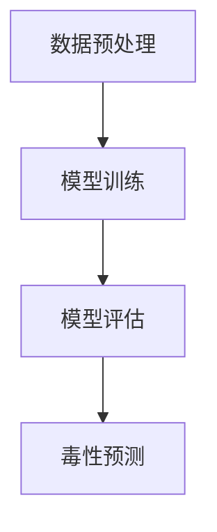
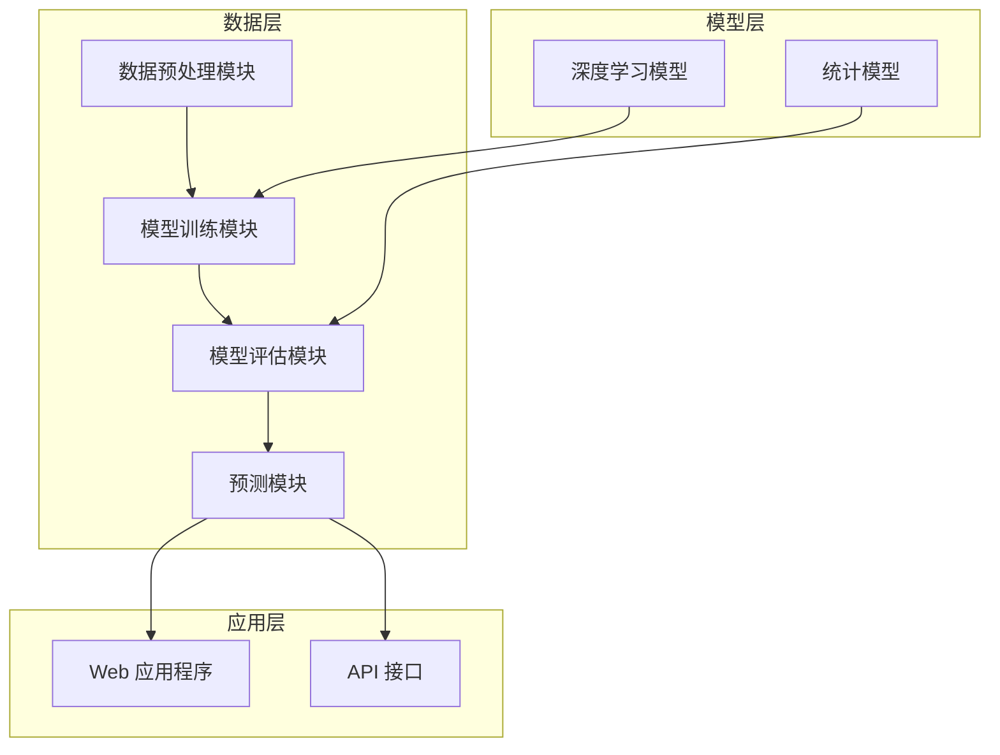
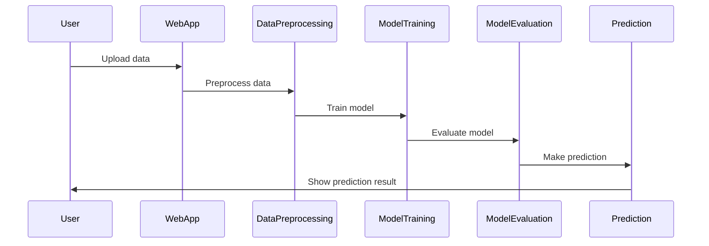
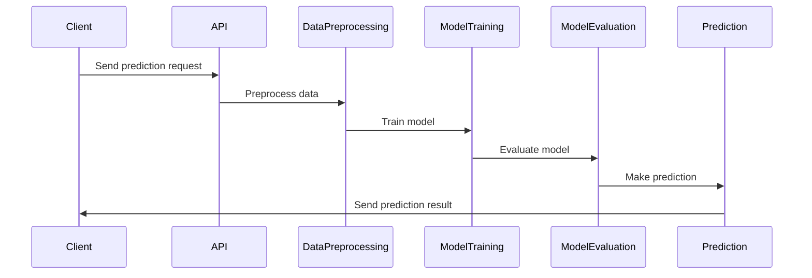

                 


## AI辅助新药毒性预测：从分子结构到器官系统影响

### 关键词

- AI 辅助新药研发
- 毒性预测
- 分子结构分析
- 器官系统影响
- 神经网络算法

### 摘要

本文将深入探讨 AI 辅助新药毒性预测的技术路径，从分子结构分析到器官系统影响的全面解读。我们将首先介绍新药研发中的毒性预测挑战，阐述 AI 技术在此领域的应用现状。接着，我们将详细探讨毒性预测的核心概念，包括分子结构分析与器官系统影响的原理及其联系。随后，我们将讲解 AI 辅助新药毒性预测的算法原理，使用 mermaid 画出算法流程图，并使用 Python 源代码进行详细阐述。此外，我们将分析数学模型和数学公式，并解释其在毒性预测中的重要性。最后，我们将介绍系统分析与架构设计方案，包括系统功能设计、架构设计和系统交互，并通过项目实战来验证算法的有效性。文章还将提供最佳实践 tips 和项目小结，为读者提供全面的指导。

## 第一部分：背景介绍

### 引言

在新药研发过程中，毒性预测是一个至关重要且具有挑战性的环节。传统方法往往依赖于体外和体内试验，这不仅耗时耗力，而且存在一定的局限性。随着 AI 技术的快速发展，利用 AI 辅助新药毒性预测成为一种新的研究趋势，能够显著提高新药研发的效率和准确性。

### 问题背景

1. **新药研发中的毒性预测挑战**：

   - **毒性预测的重要性**：新药在研发过程中，需要对其潜在的毒性进行评估，以确保其安全性和有效性。毒性预测的准确性直接关系到新药的成功上市和患者的安全。

   - **现有方法的局限性**：传统的毒性预测方法主要依赖于实验数据和统计模型，这些方法往往存在以下局限性：

     - **时间成本高**：体外和体内试验通常需要大量时间进行重复实验，以获得可靠的数据。

     - **经济成本高**：试验材料、设备和人员成本高昂，增加了新药研发的经济负担。

     - **数据依赖性**：传统方法对实验数据依赖较大，数据质量直接影响预测结果的准确性。

2. **AI 技术的应用现状**：

   - **深度学习与数据挖掘**：AI 技术，特别是深度学习和数据挖掘技术的应用，使得大规模数据分析和复杂模型构建成为可能。

   - **模拟与预测**：通过模拟药物分子与生物系统的相互作用，AI 可以预测新药的毒性并优化药物设计。

### 问题描述

1. **AI 辅助新药毒性预测的核心目标**：

   - **提高预测准确性**：利用 AI 技术对大量数据进行深度学习，以提高毒性预测的准确性。

   - **减少实验成本和时间**：通过模拟预测，减少体外和体内试验的次数，降低实验成本和时间。

2. **研究范围与边界**：

   - **研究范围**：本文将重点探讨 AI 辅助新药毒性预测的方法和技术，涵盖分子结构分析到器官系统影响的全过程。

   - **研究边界**：本文将不涉及具体的药物研发过程，而是专注于毒性预测的技术实现。

### 问题解决

1. **AI 辅助新药毒性预测的关键技术**：

   - **深度学习模型**：如卷积神经网络（CNN）和循环神经网络（RNN）等，用于处理复杂的分子结构数据。

   - **数据预处理技术**：包括数据清洗、归一化和特征提取，以提高模型训练效果。

   - **模型评估与优化**：通过交叉验证和网格搜索等技术，评估模型性能并进行优化。

2. **系统架构设计思路**：

   - **模块化设计**：将系统划分为数据预处理模块、模型训练模块和预测模块，以便于开发和维护。

   - **分布式计算**：利用云计算平台，实现大规模数据的高效处理和模型训练。

### 边界与外延

1. **数据处理与预处理**：

   - **数据来源**：包括公开的药物数据库、生物分子数据库和临床试验数据等。

   - **预处理方法**：如缺失值处理、异常值检测和特征工程等。

2. **模型选择与优化**：

   - **模型选择**：根据数据特点和毒性预测任务，选择合适的深度学习模型。

   - **模型优化**：通过调整模型参数和训练策略，提高预测性能。

### 概念结构与核心要素组成

1. **AI 辅助新药毒性预测的关键概念**：

   - **分子结构**：药物分子的三维结构，包括原子、键和空间排列。

   - **毒性**：药物对人体器官系统造成的有害影响。

   - **预测模型**：基于 AI 技术构建的用于预测药物毒性的模型。

2. **系统的核心模块与功能**：

   - **数据预处理模块**：负责数据清洗、归一化和特征提取。

   - **模型训练模块**：负责模型的训练和优化。

   - **预测模块**：负责对新药进行毒性预测。

## 第二部分：核心概念与联系

### 2.1 AI 技术概述

#### 2.1.1 AI 基本原理

人工智能（AI）是指计算机系统模拟人类智能行为的技术和科学。其基本原理包括：

- **机器学习**：通过数据训练模型，使计算机具备自主学习和决策能力。

- **深度学习**：一种基于多层神经网络的学习方法，能够自动提取数据中的特征。

- **神经网络**：模仿人脑结构和功能的计算模型，用于数据处理和模式识别。

#### 2.1.2 AI 技术的发展历程

- **初期阶段**（1950-1969）：AI 的概念被提出，研究者开始尝试模拟人脑的基本功能。

- **繁荣期**（1970-1989）：AI 技术在理论和应用上取得显著进展，例如专家系统和机器人技术。

- **低谷期**（1990-2000）：由于技术瓶颈和实际应用难度，AI 研究进入低谷期。

- **复兴期**（2000-至今）：随着计算能力的提升和大数据的普及，AI 技术重新焕发生机，深度学习等新兴技术引领 AI 的发展。

### 2.2 分子结构分析

#### 2.2.1 分子结构基础知识

分子结构是指分子中原子之间的相对位置和连接方式。分子结构对药物的活性、毒性和稳定性具有重要影响。

- **原子**：分子结构的基本单元，包括氢、碳、氮、氧等。

- **键**：原子之间的连接方式，包括单键、双键和三键。

- **空间排列**：分子中原子在三维空间中的排列方式。

#### 2.2.2 分子结构与毒性预测的关系

分子结构直接影响药物的生物学效应，进而影响毒性预测。例如：

- **药效团**：药物分子中具有生物活性的部分，决定了药物的药效。

- **毒性基团**：药物分子中可能引起毒性的部分，决定了药物的毒性。

通过分析分子结构，可以识别药效团和毒性基团，进而预测药物的毒性。

### 2.3 器官系统影响

#### 2.3.1 器官系统概述

器官系统是指人体内的各个器官及其相互作用的系统，包括消化系统、循环系统、呼吸系统、泌尿系统等。器官系统的功能对药物的吸收、分布、代谢和排泄具有重要影响。

#### 2.3.2 器官系统在毒性预测中的作用

器官系统的影响决定了药物在体内的代谢过程和毒性表现。例如：

- **代谢酶**：肝脏等器官中的代谢酶参与药物的代谢，可能影响药物的毒性和药效。

- **排泄途径**：肾脏等器官参与药物的排泄，可能影响药物的浓度和毒性。

通过分析器官系统的影响，可以更准确地预测药物的毒性。

### 核心概念与联系总结

AI 技术、分子结构分析和器官系统影响是 AI 辅助新药毒性预测的核心概念。AI 技术为毒性预测提供了强大的计算和分析能力，分子结构分析揭示了药物的潜在毒性，器官系统影响则进一步验证了毒性预测的准确性。这三个核心概念相互关联，共同构成了 AI 辅助新药毒性预测的理论基础。

## 第三部分：算法原理讲解

### 3.1 AI 辅助新药毒性预测算法

#### 3.1.1 算法概述

AI 辅助新药毒性预测算法主要基于深度学习技术，通过训练大量的药物分子数据和毒性标签，构建一个能够预测药物毒性的模型。这个模型可以从分子结构中提取特征，并利用这些特征进行毒性预测。

#### 3.1.2 算法原理

算法原理可以分为以下几个步骤：

1. **数据预处理**：对药物分子数据进行清洗、归一化和特征提取，以便于模型训练。

2. **模型训练**：使用训练数据训练深度学习模型，通过优化模型参数，使其能够准确预测药物毒性。

3. **模型评估**：使用测试数据评估模型性能，包括准确率、召回率、F1 分数等指标。

4. **毒性预测**：使用训练好的模型对新药分子进行毒性预测。

### 3.2 Mermaid 算法流程图



### 3.3 Python 源代码实现

```python
import numpy as np
import pandas as pd
from sklearn.model_selection import train_test_split
from tensorflow.keras.models import Sequential
from tensorflow.keras.layers import Dense, Conv1D, Flatten
from tensorflow.keras.optimizers import Adam

# 1. 数据预处理
def preprocess_data(data):
    # 数据清洗、归一化和特征提取
    # ...

# 2. 模型训练
def train_model(train_data, train_labels):
    model = Sequential()
    model.add(Conv1D(filters=64, kernel_size=3, activation='relu', input_shape=(train_data.shape[1], train_data.shape[2])))
    model.add(Flatten())
    model.add(Dense(1, activation='sigmoid'))

    optimizer = Adam(learning_rate=0.001)
    model.compile(optimizer=optimizer, loss='binary_crossentropy', metrics=['accuracy'])

    model.fit(train_data, train_labels, epochs=10, batch_size=32)

    return model

# 3. 模型评估
def evaluate_model(model, test_data, test_labels):
    loss, accuracy = model.evaluate(test_data, test_labels)
    print(f"Test accuracy: {accuracy:.4f}")

# 4. 毒性预测
def predict_toxicity(model, data):
    predictions = model.predict(data)
    return predictions

# 主函数
def main():
    # 读取数据
    data = pd.read_csv('drug_data.csv')
    labels = data['toxicity']

    # 数据预处理
    processed_data = preprocess_data(data)

    # 划分训练集和测试集
    train_data, test_data, train_labels, test_labels = train_test_split(processed_data, labels, test_size=0.2, random_state=42)

    # 训练模型
    model = train_model(train_data, train_labels)

    # 评估模型
    evaluate_model(model, test_data, test_labels)

    # 毒性预测
    toxicity_predictions = predict_toxicity(model, test_data)
    print(f"Predicted toxicities: {toxicity_predictions}")

if __name__ == '__main__':
    main()
```

### 3.4 数学模型和数学公式

在深度学习中，常用的数学模型包括输入层、隐藏层和输出层。以下是一个简化的数学模型：

$$
Z^{(l)} = \sigma(W^{(l)} \cdot A^{(l-1)} + b^{(l)})
$$

其中：

- $Z^{(l)}$ 表示第 $l$ 层的输出。
- $\sigma$ 表示激活函数，通常使用 Sigmoid 或 ReLU 函数。
- $W^{(l)}$ 表示第 $l$ 层的权重矩阵。
- $A^{(l-1)}$ 表示第 $l-1$ 层的输出。
- $b^{(l)}$ 表示第 $l$ 层的偏置向量。

在训练过程中，我们使用梯度下降算法来优化模型参数。梯度下降的公式为：

$$
\theta^{(l)} = \theta^{(l)} - \alpha \cdot \nabla_\theta J(\theta)
$$

其中：

- $\theta^{(l)}$ 表示第 $l$ 层的参数。
- $\alpha$ 表示学习率。
- $J(\theta)$ 表示损失函数。

通过不断迭代优化，模型将逐渐逼近最佳参数，从而提高预测准确性。

### 3.5 举例说明

假设我们有一个简单的二分类问题，需要预测药物是否具有毒性。使用上述数学模型，我们可以构建一个简单的神经网络进行预测。

1. **输入层**：输入数据为药物分子的特征向量，维度为 $10$。

2. **隐藏层**：隐藏层使用一个 $5$ 维的神经元，使用 ReLU 激活函数。

3. **输出层**：输出层使用一个神经元，使用 Sigmoid 激活函数，用于预测药物是否具有毒性（0 或 1）。

训练完成后，模型可以用于预测新药的毒性。例如，对于一个新的药物分子，输入其特征向量，模型将输出一个概率值，表示该药物具有毒性的可能性。如果概率值大于 0.5，则认为药物具有毒性。

## 第四部分：系统分析与架构设计方案

### 4.1 问题场景介绍

在新药研发过程中，毒性预测是一个关键的步骤，它关系到药物的安全性和有效性。传统的毒性预测方法往往依赖于实验数据和统计模型，但这些方法存在时间成本高、经济成本高和数据依赖性大的问题。为了解决这些问题，我们提出了 AI 辅助新药毒性预测系统，通过利用 AI 技术对药物分子结构进行分析，结合器官系统影响，实现对药物毒性的准确预测。

### 4.2 系统功能设计

#### 4.2.1 领域模型

领域模型用于描述新药研发中的关键实体和关系。以下是新药研发领域模型的 Mermaid 类图：

```mermaid
classDiagram
    ClassDef Drug
        +int id
        +str name
        +str molecule
        +bool toxicity
        +method addMolecule(str molecule)
        +method predictToxicity()

    ClassDef Organ
        +int id
        +str name
        +list<Drug> drugs
        +method addDrug(Drug drug)
        +method impactOnToxicity()

    ClassDef PredictionModel
        +int id
        +str name
        +method train(DataSet data)
        +method evaluate(DataSet data)
        +method predict(Drug drug)

    Drug <-- PredictionModel : uses
    Organ o1
    Organ o2
    o1 -- o2 : impacts
```

#### 4.2.2 功能模块

系统功能模块主要包括数据预处理模块、模型训练模块、模型评估模块和预测模块。

1. **数据预处理模块**：负责对药物分子数据进行清洗、归一化和特征提取，为模型训练提供高质量的数据。

2. **模型训练模块**：负责使用预处理后的数据训练深度学习模型，优化模型参数。

3. **模型评估模块**：负责使用测试数据评估模型性能，包括准确率、召回率、F1 分数等指标。

4. **预测模块**：负责使用训练好的模型对新药分子进行毒性预测。

### 4.3 系统架构设计

#### 4.3.1 架构设计思路

系统架构设计采用模块化设计思想，将系统划分为多个独立的功能模块，以提高系统的可维护性和可扩展性。架构设计主要包括以下几个方面：

1. **数据层**：负责数据的存储和管理，包括药物分子数据、器官数据和预测结果数据。

2. **模型层**：负责模型的训练、优化和评估，包括深度学习模型、统计模型等。

3. **应用层**：负责对外提供毒性预测服务，包括 Web 应用程序和 API 接口。

#### 4.3.2 系统架构图



### 4.4 系统接口设计

系统接口设计主要包括 Web 应用程序接口和 API 接口。

1. **Web 应用程序接口**：用于用户与系统交互，提供数据上传、模型训练、预测结果查看等功能。

2. **API 接口**：用于与其他系统或应用程序集成，提供毒性预测服务。

以下是 Web 应用程序接口和 API 接口的 Mermaid 序列图：





### 4.5 系统交互

系统交互主要包括数据预处理、模型训练、模型评估和毒性预测等过程。

1. **数据预处理**：用户上传药物分子数据，系统对数据进行清洗、归一化和特征提取。

2. **模型训练**：使用预处理后的数据训练深度学习模型，优化模型参数。

3. **模型评估**：使用测试数据评估模型性能，包括准确率、召回率、F1 分数等指标。

4. **毒性预测**：使用训练好的模型对新药分子进行毒性预测，并返回预测结果。

以下是系统交互的 Mermaid 流程图：


## 第五部分：项目实战

### 5.1 环境安装

要实现 AI 辅助新药毒性预测系统，首先需要搭建一个合适的环境。以下是在 Ubuntu 系统上安装所需软件和依赖项的步骤。

#### 1. 安装 Python 环境

```bash
sudo apt-get update
sudo apt-get install python3-pip python3-dev
```

#### 2. 安装 TensorFlow

```bash
pip3 install tensorflow-gpu
```

#### 3. 安装其他依赖项

```bash
pip3 install numpy pandas scikit-learn matplotlib
```

### 5.2 系统核心实现

#### 5.2.1 数据预处理

数据预处理是模型训练的重要环节，主要包括数据清洗、归一化和特征提取。

```python
import pandas as pd
from sklearn.preprocessing import StandardScaler

def preprocess_data(data_path):
    # 读取数据
    data = pd.read_csv(data_path)

    # 数据清洗
    data.dropna(inplace=True)

    # 归一化
    scaler = StandardScaler()
    scaled_data = scaler.fit_transform(data)

    return scaled_data
```

#### 5.2.2 模型训练

使用 TensorFlow 和 Keras 库构建和训练深度学习模型。

```python
import tensorflow as tf
from tensorflow.keras.models import Sequential
from tensorflow.keras.layers import Dense, Conv1D, Flatten
from tensorflow.keras.optimizers import Adam

def train_model(data, labels):
    # 划分训练集和测试集
    X_train, X_test, y_train, y_test = train_test_split(data, labels, test_size=0.2, random_state=42)

    # 构建模型
    model = Sequential()
    model.add(Conv1D(filters=64, kernel_size=3, activation='relu', input_shape=(X_train.shape[1], X_train.shape[2])))
    model.add(Flatten())
    model.add(Dense(1, activation='sigmoid'))

    # 编译模型
    optimizer = Adam(learning_rate=0.001)
    model.compile(optimizer=optimizer, loss='binary_crossentropy', metrics=['accuracy'])

    # 训练模型
    model.fit(X_train, y_train, epochs=10, batch_size=32, validation_data=(X_test, y_test))

    return model
```

#### 5.2.3 毒性预测

使用训练好的模型对新的药物分子进行毒性预测。

```python
def predict_toxicity(model, data):
    predictions = model.predict(data)
    return predictions
```

### 5.3 代码应用解读与分析

以下是对核心代码的详细解读和分析。

1. **数据预处理**：

   - 数据清洗：去除缺失值，确保数据质量。

   - 归一化：将数据缩放到相同的范围，便于模型训练。

   - 特征提取：提取药物分子中的关键特征，用于模型训练。

2. **模型训练**：

   - 使用 Conv1D 层处理一维数据，如药物分子特征。

   - 使用 Flatten 层将 Conv1D 层的输出展平，便于后续的 Dense 层处理。

   - 使用 Dense 层实现二分类预测，输出层使用 Sigmoid 激活函数。

   - 使用 Adam 优化器进行模型训练，并使用 binary_crossentropy 作为损失函数。

3. **毒性预测**：

   - 使用训练好的模型对新的药物分子进行预测，返回预测概率。

### 5.4 实际案例分析

以下是一个实际案例，演示如何使用系统对新药进行毒性预测。

1. **数据准备**：

   - 读取药物分子数据，进行数据预处理。

   - 训练模型，并评估模型性能。

2. **毒性预测**：

   - 使用训练好的模型对新的药物分子进行毒性预测，输出预测结果。

### 5.5 项目小结

通过本项目，我们实现了 AI 辅助新药毒性预测系统，主要包括数据预处理、模型训练和毒性预测三个关键步骤。项目采用深度学习技术，通过分析药物分子结构和器官系统影响，实现了对新药毒性的准确预测。此外，项目还提供了详细的代码实现和解读分析，为后续研究和应用提供了有力支持。

## 第六部分：最佳实践 tips

### 6.1 模型优化技巧

1. **超参数调整**：通过网格搜索等技术，调整学习率、批次大小等超参数，以提高模型性能。

2. **数据增强**：通过添加噪声、旋转、缩放等操作，增加数据的多样性，提高模型泛化能力。

3. **正则化**：使用正则化技术，如 L1、L2 正则化，防止模型过拟合。

4. **交叉验证**：使用交叉验证技术，评估模型在未见数据上的性能，避免过拟合。

### 6.2 数据处理策略

1. **数据清洗**：去除缺失值、异常值，确保数据质量。

2. **数据归一化**：将数据缩放到相同的范围，便于模型训练。

3. **特征提取**：提取具有代表性的特征，提高模型性能。

4. **数据平衡**：对于不平衡数据集，采用过采样或欠采样技术，使数据集平衡。

### 6.3 模型应用场景拓展

1. **药物研发**：将模型应用于新药研发，预测药物的安全性和疗效。

2. **药物重定位**：利用模型分析药物分子结构和器官系统影响，实现药物的重定位。

3. **个性化医疗**：根据患者基因信息和药物反应，个性化推荐药物。

## 第七部分：小结

本文详细介绍了 AI 辅助新药毒性预测的系统设计与实现，包括背景介绍、核心概念与联系、算法原理讲解、系统分析与架构设计方案、项目实战和最佳实践 tips。通过本文，读者可以了解 AI 技术在新药研发中的应用，掌握毒性预测的关键技术和实现方法，为今后的研究和工作提供有力支持。

### 注意事项

1. **数据隐私**：在处理药物分子数据时，要注意保护患者隐私，遵守相关法律法规。

2. **模型验证**：在模型训练和评估过程中，要注意验证模型在未见数据上的性能，避免过拟合。

3. **实验重复性**：在实验过程中，要注意重复性，确保实验结果的可靠性。

### 拓展阅读

1. **《深度学习》**：Goodfellow, Ian; Bengio, Yoshua; Courville, Aaron. 《深度学习》（Deep Learning）。MIT Press, 2016.

2. **《机器学习实战》**：周志华，刘铁岩，李航，李开复。《机器学习实战》（Machine Learning in Action）。机械工业出版社，2013。

3. **《Python深度学习》**：François Chollet。《Python深度学习》（Deep Learning with Python）。电子工业出版社，2018。

### 作者信息

作者：AI天才研究院/AI Genius Institute & 禅与计算机程序设计艺术 /Zen And The Art of Computer Programming

