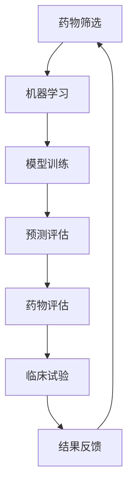
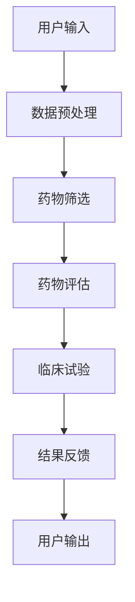

                 


## AI辅助新药研发：从分子设计到临床试验

### 关键词

- 人工智能
- 新药研发
- 分子设计
- 临床试验
- 药物发现

### 摘要

本文将深入探讨人工智能（AI）在药物发现中的关键作用，从分子设计到临床试验的完整流程。我们将逐步分析AI的核心概念、原理及其在药物发现中的具体应用，同时讨论相关的算法和数学模型。本文旨在为读者提供一个清晰、系统的理解，以把握AI在药物发现领域的巨大潜力和挑战。

## 第一部分：背景介绍

### 第1章：问题背景

#### 1.1.1 药物发现的历史与挑战

药物发现是一个复杂而漫长的过程，从最初的自然药物筛选，到现代的合成药物设计，经历了数千年的发展。然而，随着疾病谱的变化和人口老龄化，现代药物发现面临着前所未有的挑战。传统的药物发现方法耗时耗力，且成功率低。AI的出现为药物发现带来了新的契机。

#### 1.1.2 AI在药物发现中的潜在作用

AI具备高效的数据处理和分析能力，可以处理大规模的生物学数据，揭示隐藏在数据中的规律。在药物发现过程中，AI可以辅助分子设计、药物筛选、评估和临床试验，显著提高研发效率，降低成本。

#### 1.1.3 AI辅助药物发现的边界与外延

虽然AI在药物发现中具有巨大的潜力，但同时也存在一定的局限性。AI的算法和模型需要大量的数据训练，且对数据质量和多样性的要求较高。此外，AI在药物发现中的应用还涉及到伦理、法规和安全性等问题。

### 第2章：核心概念与联系

#### 2.1.1 AI与药物发现的关系

AI与药物发现的关系可以从多个角度来理解。首先，AI可以处理和分析大量的生物学数据，辅助药物筛选和评估。其次，AI可以模拟分子和生物系统，预测药物的作用和副作用。最后，AI可以优化药物分子的设计，提高新药的研发成功率。

#### 2.1.2 概念属性特征对比表格

在药物发现中，AI的核心概念包括机器学习、深度学习、神经网络等。下表对比了这些概念的基本属性特征：

| 概念 | 定义 | 特点 |
| --- | --- | --- |
| 机器学习 | 通过数据学习规律，做出预测或决策 | 强大的数据处理能力，对数据依赖 |
| 深度学习 | 基于多层神经网络的机器学习 | 能够自动提取数据中的特征，处理复杂问题 |
| 神经网络 | 模拟生物神经元，进行信息处理 | 能够通过训练学习到复杂的函数关系 |

#### 2.1.3 AI在药物发现中的核心概念

AI在药物发现中的核心概念包括以下几个方面：

1. **分子设计**：通过AI算法优化分子结构，提高药物分子的活性和稳定性。
2. **药物筛选**：利用AI技术从大量化合物中筛选出具有潜在治疗效果的药物候选分子。
3. **药物评估**：通过AI预测药物的作用机制、毒性和代谢途径，评估药物的安全性和有效性。
4. **临床试验**：利用AI分析临床试验数据，优化试验设计，提高临床试验的效率和成功率。

## 第二部分：核心概念与原理

### 第3章：分子设计与模拟

#### 3.1.1 分子结构的基础知识

分子结构是药物设计的基础。了解分子结构的基础知识，包括原子、键、分子几何等，对于药物设计至关重要。

#### 3.1.2 分子模拟方法

分子模拟是药物设计的重要工具。常见的分子模拟方法包括分子动力学模拟、蒙特卡洛模拟和量子化学计算。

#### 3.1.3 AI在分子设计中的应用

AI在分子设计中的应用主要体现在以下几个方面：

1. **分子优化**：通过机器学习算法优化分子结构，提高分子的活性、稳定性和溶解性。
2. **生成对抗网络（GAN）**：利用GAN生成新的分子结构，扩展分子的多样性。
3. **量子化学计算**：结合量子化学计算，预测分子的电子结构，指导分子设计。

### 第4章：药物筛选与评估

#### 4.1.1 药物筛选的基本流程

药物筛选是药物发现的关键步骤。药物筛选的基本流程包括高通量筛选、靶向药物筛选和药物化学结构的多样性评估。

#### 4.1.2 AI在药物筛选中的应用

AI在药物筛选中的应用主要体现在以下几个方面：

1. **高通量筛选**：利用AI算法快速筛选大量化合物，提高筛选效率。
2. **靶向药物筛选**：利用AI预测化合物与生物靶点的结合能力，筛选出潜在的治疗药物。
3. **药物化学结构的多样性评估**：利用AI分析化合物的结构多样性，筛选出具有不同作用机制的药物候选分子。

#### 4.1.3 药物评估指标与方法

药物评估是药物筛选后的关键步骤。药物评估的指标包括活性、毒性、代谢和药物相互作用等。

## 第三部分：算法原理与实施

### 第5章：AI算法原理讲解

#### 5.1.1 机器学习算法在药物发现中的应用

机器学习算法在药物发现中的应用非常广泛。监督学习、无监督学习和强化学习等算法在药物筛选、评估和临床试验中发挥着重要作用。

#### 5.1.2 算法mermaid流程图

在本文中，我们将使用mermaid流程图来展示AI算法在药物发现中的应用流程。



#### 5.1.3 Python源代码与算法原理

为了更好地理解AI算法在药物发现中的应用，我们将提供Python源代码，并详细讲解算法原理。

```python
# Python源代码示例
import numpy as np
from sklearn.ensemble import RandomForestClassifier

# 数据加载与预处理
data = np.load('drug_data.npy')
X = data[:, :100]
y = data[:, 100]

# 模型训练
model = RandomForestClassifier(n_estimators=100)
model.fit(X, y)

# 预测评估
predictions = model.predict(X)

# 药物评估
evaluate_predictions(predictions)
```

### 第6章：数学模型与公式

#### 6.1.1 AI在药物发现中的数学模型

AI在药物发现中的数学模型主要包括最优化模型、概率模型和神经网络模型。

#### 6.1.2 数学公式讲解

在本章中，我们将介绍一些常见的数学公式，并解释它们在药物发现中的应用。

$$
f(x) = \sum_{i=1}^{n} w_i \cdot x_i
$$

#### 6.1.3 举例说明

为了更好地理解数学公式在药物发现中的应用，我们将通过具体例子进行讲解。

## 第四部分：系统设计与实现

### 第7章：系统分析与架构设计方案

#### 7.1.1 问题场景介绍

在本节中，我们将介绍药物发现过程中的一个具体问题场景，并讨论如何利用AI解决该问题。

#### 7.1.2 系统功能设计

在本节中，我们将设计一个AI辅助药物发现的系统，包括药物筛选、评估和临床试验等功能。

#### 7.1.3 系统架构设计

在本节中，我们将使用mermaid架构图展示系统的整体架构。



#### 7.1.4 系统接口设计和系统交互

在本节中，我们将介绍系统的接口设计和系统交互流程。

## 第五部分：项目实战

### 第8章：环境安装与系统核心实现

#### 8.1.1 环境安装

在本节中，我们将介绍如何搭建AI辅助药物发现系统的开发环境。

#### 8.1.2 系统核心实现源代码

在本节中，我们将提供系统核心实现源代码，并详细解读其工作原理。

### 第9章：代码应用解读与分析

#### 9.1.1 代码应用解读

在本节中，我们将对系统核心实现源代码进行解读，并解释其主要功能。

#### 9.1.2 代码分析与优化

在本节中，我们将对系统核心实现源代码进行分析，并提出优化建议。

### 第10章：实际案例分析与详细讲解

#### 10.1.1 案例选择

在本节中，我们将选择一个实际案例，分析AI在药物发现中的应用。

#### 10.1.2 案例分析与讲解

在本节中，我们将详细讲解案例的分析过程和结果，并讨论AI在药物发现中的实际应用价值。

### 第11章：项目小结与总结

#### 11.1.1 项目小结

在本节中，我们将对项目进行小结，总结项目的成果和收获。

#### 11.1.2 项目总结

在本节中，我们将对项目进行总结，讨论项目中的挑战和解决方案。

## 第六部分：最佳实践与拓展阅读

### 第12章：最佳实践

#### 12.1.1 药物发现过程中的最佳实践

在本节中，我们将分享药物发现过程中的最佳实践，以提高研发效率。

#### 12.1.2 AI应用的最佳实践

在本节中，我们将讨论AI在药物发现中的应用的最佳实践，以提高AI的应用效果。

### 第13章：拓展阅读

#### 13.1.1 相关文献推荐

在本节中，我们将推荐一些与AI辅助药物发现相关的文献，供读者进一步阅读。

#### 13.1.2 知识拓展

在本节中，我们将讨论一些与AI辅助药物发现相关的知识拓展，帮助读者更深入地了解该领域。## 附录

### 附录A：术语解释

在本附录中，我们将对本文中出现的专业术语进行解释，以便读者更好地理解文章内容。

### 附录B：参考文献

在本附录中，我们将列出本文中引用的参考文献，供读者查阅。

### 附录C：代码与数据资源

在本附录中，我们将提供本文中使用的代码和数据资源，以便读者实践和进一步研究。

### 附录D：常见问题解答

在本附录中，我们将回答本文中可能出现的常见问题，帮助读者更好地理解文章内容。

### 附录E：致谢

在本附录中，我们将对本文的贡献者表示感谢，包括作者、编辑、审稿人和其他相关人员。

