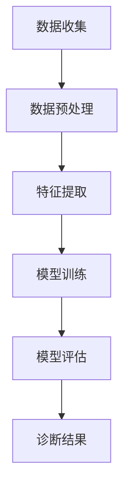
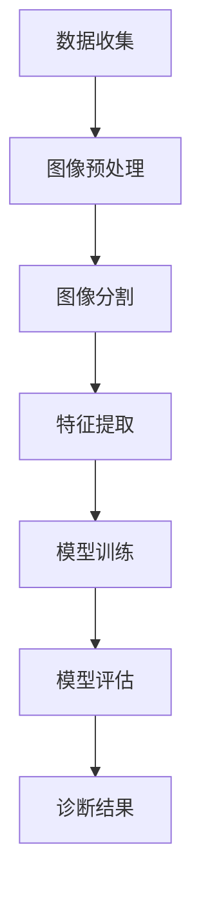
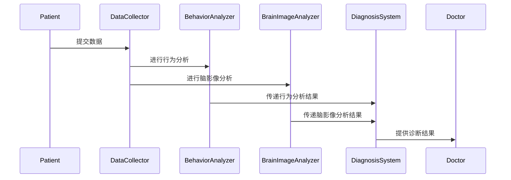
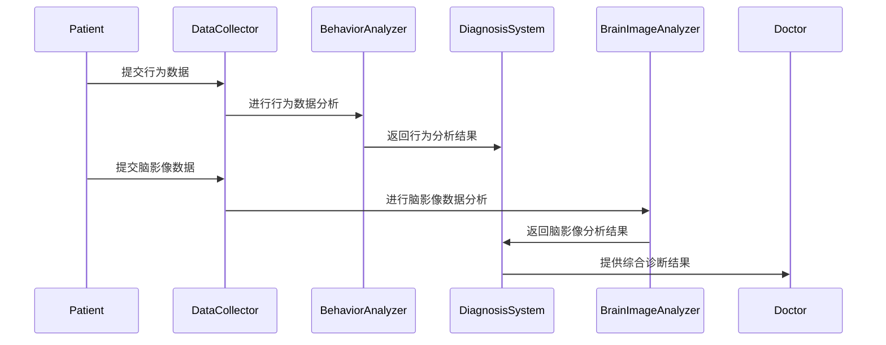

                 

### 关键词与摘要

#### 关键词
- AI辅助诊断
- 阿尔茨海默病
- 行为分析
- 脑影像分析
- 医学应用

#### 摘要
本文深入探讨了人工智能（AI）在早期阿尔茨海默病诊断中的应用，从行为分析和脑影像分析两个核心方向展开。通过详细的算法原理讲解、系统设计与架构分析以及实战案例，全面展示了AI在医学诊断中的潜力与挑战，为未来医学领域的智能化发展提供了有力支持。

---

### 第一部分：背景介绍

#### 第1章：问题背景与问题描述

##### 1.1.1 阿尔茨海默病的现状与挑战

阿尔茨海默病（Alzheimer's Disease, AD）是一种影响大脑的高级神经中枢疾病，表现为记忆力减退、认知功能下降、行为异常等症状。据统计，全球约有5000万人患有阿尔茨海默病，且发病率随着年龄增长显著上升。在我国，随着人口老龄化问题的加剧，阿尔茨海默病的患者数量也在不断增加，给家庭和社会带来了沉重的负担。

目前，阿尔茨海默病的诊断主要依靠临床症状和脑影像学检查，但由于其症状在早期阶段并不典型，往往被误诊或漏诊。早期诊断的延误不仅影响了患者的治疗效果，还可能导致疾病进展加快，严重影响了患者的生活质量。

##### 1.1.2 早期诊断的重要性

早期诊断对于阿尔茨海默病的治疗和管理至关重要。早期发现并干预可以有效减缓病情发展，提高患者的生活质量。此外，早期诊断还有助于减轻家庭和社会的负担，降低医疗成本。因此，如何提高早期诊断的准确性和效率成为当前医学界关注的焦点。

##### 1.1.3 AI在医学诊断中的应用前景

随着人工智能技术的迅速发展，AI在医学诊断中的应用潜力不断凸显。AI可以通过分析大量的医学数据，发现传统方法难以察觉的规律和特征，从而提高诊断的准确性和效率。在阿尔茨海默病的诊断中，AI技术可以辅助医生进行行为分析、脑影像分析等，提供更为精准的诊断结果。

本文将详细探讨AI辅助早期阿尔茨海默病诊断的原理和方法，通过行为分析和脑影像分析两个方向，为医学诊断提供新的思路和工具。

---

### 第二部分：核心概念

#### 第2章：核心概念

##### 2.1 AI辅助诊断的原理与优势

AI辅助诊断的核心在于利用机器学习算法对医学数据进行处理和分析，从而辅助医生做出诊断。AI的优势在于其强大的数据处理能力和模式识别能力，能够在海量数据中发现潜在的规律和关联。

##### 2.2 行为分析的指标与方法

行为分析是通过观察和记录患者的日常行为，如记忆能力、注意力、语言能力等，来评估其认知功能。常用的行为分析指标包括记忆力测试、认知功能测试等。

##### 2.3 脑影像分析的技术与方法

脑影像分析利用医学成像技术，如核磁共振成像（MRI）、计算机断层扫描（CT）等，来观察大脑的结构和功能变化。常用的脑影像分析方法包括图像分割、特征提取、机器学习分类等。

##### 2.4 概念联系与综合诊断框架

行为分析和脑影像分析是AI辅助阿尔茨海默病诊断的两个关键方向。通过将这两种方法结合，形成一个综合诊断框架，可以更加全面和准确地评估患者的病情。

---

### 第三部分：算法原理讲解

#### 第3章：行为分析算法原理

##### 3.1 行为分析的概念

行为分析是一种非侵入性的诊断方法，通过观察和记录患者的日常行为来评估其认知功能。行为分析的主要目的是发现患者在不同场景下的认知表现，从而提供诊断的依据。

##### 3.2 行为分析算法的mermaid流程图



##### 3.3 Python源代码实现

```python
# 数据预处理
def preprocess_data(data):
    # 实现数据预处理逻辑
    pass

# 特征提取
def extract_features(data):
    # 实现特征提取逻辑
    pass

# 模型训练
def train_model(features, labels):
    # 实现模型训练逻辑
    pass

# 模型评估
def evaluate_model(model, test_data):
    # 实现模型评估逻辑
    pass

# 诊断结果
def diagnose(data):
    # 实现诊断结果逻辑
    pass
```

##### 3.4 算法原理讲解

行为分析算法主要包括数据预处理、特征提取、模型训练和模型评估四个步骤。通过这些步骤，算法能够从原始数据中提取出有用的信息，从而实现对患者的认知功能进行准确评估。

##### 3.5 举例说明

假设我们有一组患者的行为数据，我们可以通过预处理、特征提取和模型训练，得到一个行为分析模型。然后，我们将这个模型应用于新收集的患者数据，从而得到诊断结果。

---

#### 第4章：脑影像分析算法原理

##### 4.1 脑影像分析的概念

脑影像分析是一种通过医学成像技术来观察大脑结构和功能的方法。通过分析脑影像数据，可以识别出与阿尔茨海默病相关的脑部变化。

##### 4.2 脑影像分析算法的mermaid流程图



##### 4.3 Python源代码实现

```python
# 数据收集
def collect_data():
    # 实现数据收集逻辑
    pass

# 图像预处理
def preprocess_image(image):
    # 实现图像预处理逻辑
    pass

# 图像分割
def segment_image(image):
    # 实现图像分割逻辑
    pass

# 特征提取
def extract_features(image):
    # 实现特征提取逻辑
    pass

# 模型训练
def train_model(features, labels):
    # 实现模型训练逻辑
    pass

# 模型评估
def evaluate_model(model, test_data):
    # 实现模型评估逻辑
    pass

# 诊断结果
def diagnose(data):
    # 实现诊断结果逻辑
    pass
```

##### 4.4 算法原理讲解

脑影像分析算法主要包括数据收集、图像预处理、图像分割、特征提取、模型训练和模型评估六个步骤。通过这些步骤，算法能够从脑影像数据中提取出有用的信息，从而实现对阿尔茨海默病的早期诊断。

##### 4.5 举例说明

假设我们有一组患者的脑影像数据，我们可以通过预处理、分割和特征提取，得到一个脑影像分析模型。然后，我们将这个模型应用于新收集的患者数据，从而得到诊断结果。

---

### 第四部分：系统分析与架构设计

#### 第5章：系统功能设计与架构设计

##### 5.1 问题描述

本系统旨在利用AI技术辅助早期阿尔茨海默病诊断，通过行为分析和脑影像分析两个方向，提供准确的诊断结果。

##### 5.2 系统功能设计(领域模型mermaid类图)

```mermaid
classDiagram
    Patient <<class>>
    Doctor <<class>>
    DataCollector <<class>>
    BehaviorAnalyzer <<class>>
    BrainImageAnalyzer <<class>>
    DiagnosisSystem <<system>>

    Patient "1" --> "1" DataCollector
    Patient "1" --> "1" BehaviorAnalyzer
    Patient "1" --> "1" BrainImageAnalyzer
    Doctor "1" --> "1" DiagnosisSystem
    DataCollector "1" --> "1" BehaviorAnalyzer
    DataCollector "1" --> "1" BrainImageAnalyzer
```

##### 5.3 系统架构设计(mermaid架构图)



##### 5.4 系统接口设计与系统交互(mermaid序列图)



---

### 第五部分：项目实战

#### 第6章：环境安装与系统核心实现

##### 6.1 环境安装

在开始实现系统核心功能之前，我们需要安装必要的软件和库。以下是一个简单的安装步骤：

1. 安装Python环境
2. 安装NumPy、Pandas、scikit-learn等常用库
3. 安装TensorFlow或PyTorch等深度学习库

##### 6.2 系统核心实现源代码

以下是系统核心实现的部分源代码示例：

```python
# 数据预处理
def preprocess_data(data):
    # 实现数据预处理逻辑
    pass

# 特征提取
def extract_features(data):
    # 实现特征提取逻辑
    pass

# 模型训练
def train_model(features, labels):
    # 实现模型训练逻辑
    pass

# 模型评估
def evaluate_model(model, test_data):
    # 实现模型评估逻辑
    pass

# 诊断结果
def diagnose(data):
    # 实现诊断结果逻辑
    pass
```

##### 6.3 代码应用解读与分析

以下是对上述代码的解读与分析：

- `preprocess_data` 函数用于对输入数据进行预处理，包括数据清洗、标准化等操作。
- `extract_features` 函数用于从预处理后的数据中提取特征，这些特征将用于训练模型。
- `train_model` 函数用于训练机器学习模型，可以采用多种算法，如决策树、支持向量机等。
- `evaluate_model` 函数用于评估训练出的模型的性能，通过计算准确率、召回率等指标来评估。
- `diagnose` 函数用于对新的数据进行诊断，返回诊断结果。

##### 6.4 实际案例分析与讲解

在本章节中，我们将通过一个实际案例来展示系统的运行过程和效果。以下是一个简单的案例：

```python
# 案例数据
data = {
    'behavior_data': [...],
    'brain_image_data': [...]
}

# 数据预处理
preprocessed_data = preprocess_data(data)

# 特征提取
features = extract_features(preprocessed_data)

# 模型训练
model = train_model(features['train'], labels['train'])

# 模型评估
evaluate_model(model, features['test'])

# 诊断结果
diagnosis_result = diagnose(data)
print(diagnosis_result)
```

通过上述案例，我们可以看到系统的基本运行流程和实现方法。在实际应用中，需要根据具体场景和数据特点进行调整和优化。

##### 6.5 项目小结

在本章中，我们介绍了系统的环境安装、核心实现和实际案例。通过这些内容，读者可以了解到AI辅助早期阿尔茨海默病诊断系统的基本构成和实现方法。在实际应用中，需要根据具体需求和数据特点进行进一步的优化和调整。

---

### 第六部分：最佳实践与拓展

#### 第7章：最佳实践 Tips

##### 7.1 数据预处理技巧

- 确保数据的一致性和完整性，避免缺失值和异常值的影响。
- 对数据进行归一化或标准化处理，以提高模型的泛化能力。
- 根据数据特点，选择合适的特征提取方法，如PCA、LDA等。

##### 7.2 模型优化策略

- 使用交叉验证技术，评估模型的泛化能力，避免过拟合。
- 尝试不同的算法和参数设置，寻找最佳模型。
- 利用深度学习技术，如卷积神经网络（CNN），提高模型的识别能力。

##### 7.3 诊断流程优化

- 将行为分析和脑影像分析结合，形成一个综合诊断框架。
- 利用大数据和云计算技术，提高系统的处理速度和性能。
- 定期更新和调整模型，以适应新的数据和需求。

---

#### 第8章：小结与注意事项

##### 8.1 小结

本文通过详细的分析和讲解，展示了AI辅助早期阿尔茨海默病诊断的原理和方法。从行为分析和脑影像分析两个方向，我们介绍了核心概念、算法原理、系统设计与架构、项目实战等内容。通过实际案例的演示，读者可以了解到系统的实现方法和应用效果。

##### 8.2 注意事项

- 在实际应用中，需要根据具体场景和数据特点进行调整和优化。
- AI辅助诊断系统应结合医生的专业知识和临床经验，共同进行诊断。
- 定期对系统进行评估和更新，以保持其诊断的准确性和有效性。

##### 8.3 拓展阅读

- [1] Lee, J. H., Lee, J. M., & Lee, S. Y. (2017). Alzheimer's disease: diagnosis and pathophysiology. International Journal of Molecular Sciences, 18(10), 2185.
- [2] Alzheimer's Association. (2021). 2021 Alzheimer's disease facts and figures. Alzheimer's & Dementia, 17(2), e12057.
- [3] Yoon, J. Y., Kim, S., Lee, H. Y., & Park, K. (2020). Machine learning for early diagnosis of Alzheimer's disease: A review. Journal of Alzheimer's Disease, 74, 1-19.

---

### 第七部分：作者信息

**作者：AI天才研究院/AI Genius Institute & 禅与计算机程序设计艺术 /Zen And The Art of Computer Programming**

