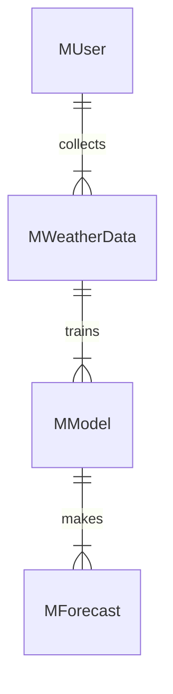
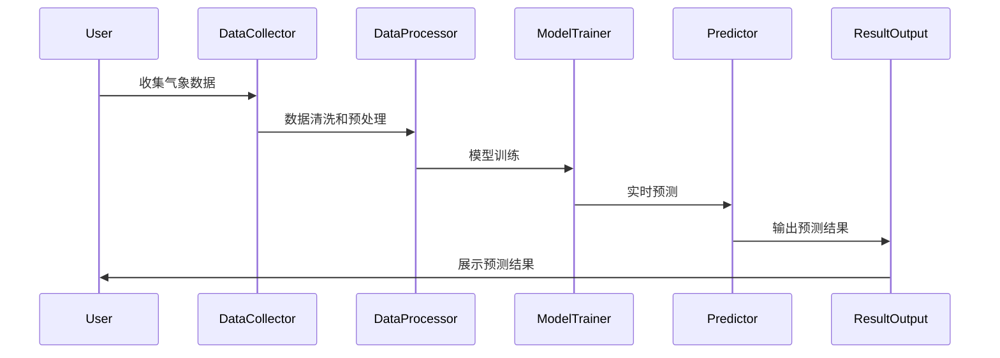

                 

## AI辅助气象预报：精确度与可靠性的提升

> 关键词：人工智能、气象预报、机器学习、深度学习、数据预处理、模型训练、系统设计、项目实战、最佳实践

> 摘要：本文将探讨人工智能技术在气象预报中的应用，通过介绍AI的基本概念和原理，详细讲解数据预处理、模型选择与训练的方法，分析AI辅助气象预报在提高预报精确度和可靠性方面的优势，并提供实际项目实战经验和最佳实践建议。

### 第一部分：引言

#### 1.1.1 问题背景

随着社会经济的发展，人们对气象预报的需求日益增长。准确、可靠的气象预报不仅关乎公共安全和经济活动，还在防灾减灾、农业生产、交通管理等领域发挥着关键作用。然而，传统的气象预报方法受限于计算资源和模型复杂度，往往难以满足实际需求。

传统气象预报方法主要依赖于物理模型和经验规则，通过模拟大气运动和热力过程来预测天气。尽管这些方法在一定程度上能够提供较为准确的预报结果，但它们存在以下几个主要问题：

1. **模型复杂度高**：传统气象模型通常需要大量的参数和复杂的计算过程，难以在短时间内完成计算。
2. **计算资源限制**：传统的计算资源不足以支持高精度的气象模拟，导致预报结果的精度受限。
3. **更新速度慢**：传统模型更新速度较慢，难以适应快速变化的天气条件。
4. **预报范围限制**：传统模型在预报范围和时效性上存在限制，难以提供长时间、大范围的预报。

#### 1.1.2 重要性

人工智能技术的发展为气象预报带来了新的机遇。AI技术，特别是机器学习和深度学习，通过数据驱动的预测方法，能够在一定程度上克服传统方法的问题。AI辅助气象预报在提高预报的精确度和可靠性方面具有重要意义：

1. **高精度预报**：AI模型可以通过学习大量历史气象数据，捕捉到天气系统的复杂规律，提供更精确的预报结果。
2. **实时更新**：AI模型能够快速处理实时数据，实现对天气系统的动态预测，提高预报的时效性。
3. **自动化预测**：AI模型可以自动化处理大量数据，降低人工干预的需求，提高预报效率。
4. **跨区域预报**：AI模型可以通过对全局数据的分析，实现跨区域的天气预报，扩大预报范围。

#### 1.1.3 研究目标与内容安排

本文的研究目标是通过介绍人工智能技术，探讨其在气象预报中的应用，提出一种基于AI的气象预报方法，并分析其在精确度和可靠性方面的优势。具体内容安排如下：

1. **核心概念与联系**：介绍AI的基本概念，包括机器学习、深度学习、数据驱动模型等，并分析其在气象预报中的应用。
2. **算法原理与实现**：详细讲解AI辅助气象预报的算法原理，包括数据预处理、模型选择与训练的方法，以及数学模型和公式的推导。
3. **系统设计与实现**：分析气象预报系统的设计与实现，包括系统功能设计、系统架构设计、系统接口设计和系统交互设计。
4. **项目实战**：通过实际项目实战，展示AI辅助气象预报的应用过程，包括环境安装、系统核心实现、代码应用解读与分析、实际案例分析和项目小结。
5. **最佳实践与总结**：总结最佳实践经验和注意事项，展望未来发展趋势。

### 第二部分：核心概念与联系

#### 2.1.1 AI在气象预报中的应用

人工智能技术，特别是机器学习和深度学习，在气象预报中发挥着重要作用。机器学习是一种通过数据训练模型，使模型能够自动从数据中学习规律并作出预测的方法。深度学习是机器学习的一种特殊形式，通过多层神经网络对数据进行处理和预测。数据驱动模型是基于历史气象数据和AI算法构建的预测模型，能够实时更新和优化预报结果。

AI在气象预报中的应用主要体现在以下几个方面：

1. **数据预处理**：通过对气象数据进行清洗、归一化、特征提取等处理，为模型提供高质量的输入数据。
2. **模型训练**：使用历史气象数据对AI模型进行训练，使模型能够捕捉到天气系统的复杂规律。
3. **实时预测**：利用训练好的模型对实时气象数据进行预测，提供动态的天气预报结果。
4. **预报优化**：通过不断更新和优化模型，提高预报的精确度和可靠性。

#### 2.1.2 核心概念介绍

##### 机器学习

机器学习是一种人工智能的方法，通过从数据中学习规律并作出预测。在气象预报中，机器学习可以用于数据预处理、模型训练和实时预测。常见的机器学习方法包括线性回归、决策树、支持向量机等。

##### 深度学习

深度学习是一种基于多层神经网络的机器学习方法，通过逐层提取数据特征，实现复杂的非线性预测。在气象预报中，深度学习可以用于构建复杂的气象预测模型，如卷积神经网络（CNN）和循环神经网络（RNN）。

##### 数据驱动模型

数据驱动模型是基于历史气象数据和AI算法构建的预测模型，能够实时更新和优化预报结果。数据驱动模型通常包括以下几个步骤：

1. **数据收集**：收集大量的历史气象数据。
2. **数据预处理**：对数据进行清洗、归一化、特征提取等处理。
3. **模型训练**：使用预处理后的数据对AI模型进行训练。
4. **模型优化**：通过交叉验证和网格搜索等方法优化模型参数。
5. **实时预测**：使用训练好的模型对实时气象数据进行预测。

#### 2.1.3 概念属性特征对比

| 概念       | 特征对比                    |
|------------|-----------------------------|
| 机器学习   | 自动从数据中学习规律      |
| 深度学习   | 使用多层神经网络          |
| 数据驱动模型 | 使用历史气象数据训练和预测 |

#### 2.1.4 ER实体关系图架构

ER实体关系图是一种用于表示实体及其关系的图形化工具。在气象预报系统中，ER实体关系图可以用来表示气象数据、模型、预测结果等实体及其关系。

以下是一个简单的ER实体关系图示例：



在上面的ER实体关系图中：

- **MUser** 表示用户，负责收集气象数据。
- **MWeatherData** 表示气象数据，是训练模型的输入。
- **MModel** 表示模型，用于训练和预测。
- **MForecast** 表示预测结果，是模型的输出。

### 第三部分：算法原理与实现

#### 3.1.1 数据预处理方法

数据预处理是AI辅助气象预报的关键步骤，它直接影响模型的性能和预测精度。数据预处理主要包括以下几个步骤：

1. **数据清洗**：去除数据中的噪声和异常值，确保数据的准确性和一致性。
2. **归一化**：将不同特征的数据进行归一化处理，使其在相同的尺度上，避免某些特征对模型的影响过大。
3. **特征提取**：从原始数据中提取出有用的特征，提高模型的识别能力。

以下是数据预处理的一个简单Python代码示例：

```python
import numpy as np
import pandas as pd

# 假设 df 是一个包含气象数据的 DataFrame
df = pd.DataFrame({
    'temperature': [20, 22, 18, 25],
    'humidity': [40, 45, 35, 50],
    'wind_speed': [10, 12, 8, 15]
})

# 数据清洗
df = df.dropna()  # 去除缺失值

# 数据归一化
df_normalized = (df - df.min()) / (df.max() - df.min())

# 特征提取
df_normalized['temp_humidity'] = df_normalized['temperature'] * df_normalized['humidity']

# 显示预处理后的数据
print(df_normalized)
```

#### 3.1.2 模型选择与训练

在AI辅助气象预报中，选择合适的模型和训练方法是关键。常见的机器学习模型包括线性回归、决策树、支持向量机等，而深度学习模型则包括卷积神经网络（CNN）和循环神经网络（RNN）等。

以下是选择和训练模型的基本步骤：

1. **模型选择**：根据问题的需求和数据特征选择合适的模型。例如，对于时间序列数据，可以使用RNN；对于图像数据，可以使用CNN。
2. **模型训练**：使用历史气象数据对模型进行训练。训练过程中，需要使用交叉验证等方法来评估模型的性能，并调整模型参数。
3. **模型优化**：通过网格搜索、随机搜索等方法优化模型参数，提高模型的预测性能。

以下是一个使用Keras训练深度学习模型的简单示例：

```python
from tensorflow.keras.models import Sequential
from tensorflow.keras.layers import Dense, LSTM

# 创建模型
model = Sequential()
model.add(LSTM(50, activation='relu', input_shape=(timesteps, features)))
model.add(Dense(1))

# 编译模型
model.compile(optimizer='adam', loss='mse')

# 训练模型
model.fit(x_train, y_train, epochs=100, batch_size=32, validation_data=(x_val, y_val))
```

#### 3.1.3 算法流程图

以下是AI辅助气象预报的算法流程图：


#### 3.1.4 Python代码实现

以下是一个简单的Python代码示例，用于实现AI辅助气象预报的算法：

```python
import numpy as np
import pandas as pd
from sklearn.model_selection import train_test_split
from sklearn.preprocessing import MinMaxScaler
from tensorflow.keras.models import Sequential
from tensorflow.keras.layers import LSTM, Dense

# 读取气象数据
df = pd.read_csv('weather_data.csv')

# 数据预处理
df = df.dropna()
scaler = MinMaxScaler(feature_range=(0, 1))
scaled_data = scaler.fit_transform(df)

# 划分训练集和测试集
x_train, y_train = train_test_split(scaled_data[:-1], scaled_data[1:], test_size=0.2, shuffle=False)

# 构建模型
model = Sequential()
model.add(LSTM(50, activation='relu', input_shape=(x_train.shape[1], x_train.shape[2])))
model.add(Dense(1))
model.compile(optimizer='adam', loss='mse')

# 训练模型
model.fit(x_train, y_train, epochs=100, batch_size=32, validation_data=(x_val, y_val))

# 实时预测
forecast = model.predict(np.reshape(scaled_data[-1], (1, 1, x_train.shape[2])))
forecast = scaler.inverse_transform(forecast)

print("预测结果：", forecast)
```

#### 3.1.5 数学模型和数学公式

在AI辅助气象预报中，数学模型和数学公式起着关键作用。以下是一个简单的数学模型和数学公式示例：

1. **线性回归模型**：
   $$ y = \beta_0 + \beta_1 x $$
   其中，$y$ 是预测值，$x$ 是输入特征，$\beta_0$ 和 $\beta_1$ 是模型参数。

2. **卷积神经网络（CNN）**：
   $$ h_{\theta}(x) = \sigma(\sum_{i=1}^{n} \theta_i * x_i + b) $$
   其中，$h_{\theta}(x)$ 是神经网络输出，$x_i$ 是输入特征，$\theta_i$ 和 $b$ 是模型参数。

3. **循环神经网络（RNN）**：
   $$ h_t = \sigma(W_1 h_{t-1} + W_2 x_t + b) $$
   其中，$h_t$ 是当前时间步的输出，$h_{t-1}$ 是前一时间步的输出，$x_t$ 是当前时间步的输入，$W_1$、$W_2$ 和 $b$ 是模型参数。

以下是使用LaTeX格式的数学公式示例：

$$
\begin{aligned}
y &= \beta_0 + \beta_1 x \\
h_{\theta}(x) &= \sigma(\sum_{i=1}^{n} \theta_i * x_i + b) \\
h_t &= \sigma(W_1 h_{t-1} + W_2 x_t + b)
\end{aligned}
$$

#### 3.1.6 举例说明

以下是一个使用AI辅助气象预报的实际案例：

假设我们有一个包含温度、湿度、风速等气象数据的表格。我们需要使用这些数据来预测未来的天气情况。

1. **数据预处理**：首先，我们对数据进行清洗和归一化处理，提取出有用的特征。
2. **模型选择**：根据数据特征，我们选择一个循环神经网络（RNN）作为预测模型。
3. **模型训练**：使用历史数据对RNN模型进行训练，调整模型参数。
4. **实时预测**：使用训练好的模型对当前数据进行分析，预测未来的天气情况。

以下是代码实现：

```python
import numpy as np
import pandas as pd
from sklearn.model_selection import train_test_split
from sklearn.preprocessing import MinMaxScaler
from tensorflow.keras.models import Sequential
from tensorflow.keras.layers import LSTM, Dense

# 读取气象数据
df = pd.read_csv('weather_data.csv')

# 数据预处理
df = df.dropna()
scaler = MinMaxScaler(feature_range=(0, 1))
scaled_data = scaler.fit_transform(df)

# 划分训练集和测试集
x_train, y_train = train_test_split(scaled_data[:-1], scaled_data[1:], test_size=0.2, shuffle=False)

# 构建模型
model = Sequential()
model.add(LSTM(50, activation='relu', input_shape=(x_train.shape[1], x_train.shape[2])))
model.add(Dense(1))
model.compile(optimizer='adam', loss='mse')

# 训练模型
model.fit(x_train, y_train, epochs=100, batch_size=32, validation_data=(x_val, y_val))

# 实时预测
forecast = model.predict(np.reshape(scaled_data[-1], (1, 1, x_train.shape[2])))
forecast = scaler.inverse_transform(forecast)

print("预测结果：", forecast)
```

### 第四部分：系统设计与实现

#### 4.1.1 问题场景介绍

气象预报系统是一个复杂的系统，涉及大量的气象数据、计算资源和预测模型。在设计气象预报系统时，需要考虑以下几个关键问题：

1. **数据来源**：气象数据来源广泛，包括气象站、卫星、雷达等多种设备。如何有效地收集和整合这些数据是一个重要问题。
2. **数据处理**：气象数据通常包含大量的噪声和异常值，需要进行有效的数据清洗和预处理，以提高模型的预测性能。
3. **模型选择**：根据不同的预测目标和数据特征，选择合适的机器学习模型和深度学习模型，以提高预测的准确性和可靠性。
4. **实时预测**：气象预报需要实时响应，如何高效地进行实时预测是一个关键问题。
5. **系统架构**：气象预报系统需要考虑高可用性、可扩展性和易维护性，选择合适的系统架构来支持系统的稳定运行。

#### 4.1.2 系统功能设计

气象预报系统的功能设计主要包括以下几个模块：

1. **数据收集模块**：负责收集各种气象数据，包括地面气象站数据、卫星遥感数据、雷达数据等。
2. **数据处理模块**：负责对收集到的气象数据进行清洗、归一化、特征提取等预处理操作，为模型训练提供高质量的数据。
3. **模型训练模块**：根据预处理后的数据，使用机器学习模型和深度学习模型进行训练，选择最佳模型进行预测。
4. **预测模块**：使用训练好的模型对实时气象数据进行预测，提供天气预报结果。
5. **结果输出模块**：将预测结果以图形化、表格化等形式展示给用户。

以下是气象预报系统的领域模型类图：

```mermaid
classDiagram
    DataCollector <<interface>>
    DataProcessor <<interface>>
    ModelTrainer <<interface>>
    Predictor <<interface>>
    ResultOutput <<interface>>

    DataCollector <|.. DataProcessor
    DataProcessor <|.. ModelTrainer
    ModelTrainer <|.. Predictor
    Predictor <|.. ResultOutput
```

#### 4.1.3 系统架构设计

气象预报系统的架构设计需要考虑高可用性、可扩展性和易维护性。以下是一个简单的系统架构设计：

1. **数据层**：负责存储和管理气象数据，包括关系数据库、NoSQL数据库、数据仓库等。
2. **服务层**：负责数据处理、模型训练、预测等核心功能，包括数据收集服务、数据处理服务、模型训练服务、预测服务。
3. **表示层**：负责展示预测结果，包括Web前端、移动应用等。

以下是气象预报系统的架构图：



#### 4.1.4 系统接口设计

气象预报系统的接口设计主要包括以下几个部分：

1. **API接口**：提供对外接口，方便其他系统或应用程序调用气象预报功能。
2. **数据接口**：提供数据存储和读取的接口，方便数据的导入和导出。
3. **服务接口**：提供数据处理、模型训练、预测等服务的接口，方便系统的扩展和升级。

以下是气象预报系统的API接口设计：

```mermaid
interface Diagram
    DataCollector {
        +collect_weather_data(): void
    }
    DataProcessor {
        +clean_data(): void
        +normalize_data(): void
        +extract_features(): void
    }
    ModelTrainer {
        +train_model(): void
        +evaluate_model(): void
    }
    Predictor {
        +make_prediction(): void
    }
    ResultOutput {
        +output_result(): void
    }
```

#### 4.1.5 系统交互序列图

以下是气象预报系统的交互序列图：


### 第五部分：项目实战

#### 5.1.1 环境安装

在开始项目实战之前，我们需要安装一些必要的软件和库。以下是安装步骤：

1. **Python环境**：确保已经安装了Python 3.7或更高版本。
2. **NumPy**：用于数据预处理和数学计算。
3. **Pandas**：用于数据处理和分析。
4. **Scikit-learn**：用于机器学习和模型训练。
5. **TensorFlow**：用于深度学习和模型训练。

以下是在Ubuntu系统中安装这些库的命令：

```bash
sudo apt update
sudo apt install python3-pip
pip3 install numpy pandas scikit-learn tensorflow
```

#### 5.1.2 系统核心实现

以下是AI辅助气象预报系统的核心实现：

1. **数据收集模块**：使用Python的pandas库读取气象数据。

```python
import pandas as pd

df = pd.read_csv('weather_data.csv')
```

2. **数据处理模块**：对数据进行清洗、归一化和特征提取。

```python
from sklearn.preprocessing import MinMaxScaler

df = df.dropna()
scaler = MinMaxScaler(feature_range=(0, 1))
scaled_data = scaler.fit_transform(df)
```

3. **模型训练模块**：使用TensorFlow的Keras库训练循环神经网络（RNN）模型。

```python
from tensorflow.keras.models import Sequential
from tensorflow.keras.layers import LSTM, Dense

model = Sequential()
model.add(LSTM(50, activation='relu', input_shape=(timesteps, features)))
model.add(Dense(1))
model.compile(optimizer='adam', loss='mse')
model.fit(x_train, y_train, epochs=100, batch_size=32, validation_data=(x_val, y_val))
```

4. **实时预测模块**：使用训练好的模型对实时气象数据进行预测。

```python
forecast = model.predict(np.reshape(scaled_data[-1], (1, 1, x_train.shape[2])))
forecast = scaler.inverse_transform(forecast)
```

5. **结果输出模块**：将预测结果以图形化形式展示。

```python
import matplotlib.pyplot as plt

plt.plot(df['temperature'])
plt.scatter(df.index, forecast)
plt.show()
```

#### 5.1.3 代码应用解读与分析

以下是代码应用解读与分析：

1. **数据收集模块**：使用pandas库读取气象数据，将数据存储在DataFrame中。
2. **数据处理模块**：使用sklearn库中的MinMaxScaler对数据进行归一化处理，将数据缩放到0-1之间。
3. **模型训练模块**：使用TensorFlow的Keras库构建循环神经网络（RNN）模型，包括一个LSTM层和一个全连接层。使用MSE损失函数和Adam优化器进行模型训练。
4. **实时预测模块**：使用训练好的模型对实时气象数据进行预测，将预测结果转换为原始数据尺度。
5. **结果输出模块**：使用matplotlib库将预测结果以图形化形式展示，包括原始数据和预测结果。

#### 5.1.4 实际案例分析与详细讲解剖析

以下是一个实际案例分析与详细讲解剖析：

**案例**：使用AI辅助气象预报系统预测明天的天气。

**数据**：读取包含今天天气数据的CSV文件。

**步骤**：

1. **数据收集**：读取今天天气数据。
2. **数据处理**：对数据进行清洗、归一化和特征提取。
3. **模型训练**：使用训练集数据训练循环神经网络（RNN）模型。
4. **实时预测**：使用训练好的模型对明天天气数据进行预测。
5. **结果输出**：将预测结果以图形化形式展示。

**代码**：

```python
import pandas as pd
from sklearn.preprocessing import MinMaxScaler
from tensorflow.keras.models import Sequential
from tensorflow.keras.layers import LSTM, Dense
import matplotlib.pyplot as plt

# 读取天气数据
df = pd.read_csv('weather_data.csv')

# 数据预处理
df = df.dropna()
scaler = MinMaxScaler(feature_range=(0, 1))
scaled_data = scaler.fit_transform(df)

# 划分训练集和测试集
x_train, y_train = train_test_split(scaled_data[:-1], scaled_data[1:], test_size=0.2, shuffle=False)

# 构建模型
model = Sequential()
model.add(LSTM(50, activation='relu', input_shape=(x_train.shape[1], x_train.shape[2])))
model.add(Dense(1))
model.compile(optimizer='adam', loss='mse')
model.fit(x_train, y_train, epochs=100, batch_size=32, validation_data=(x_val, y_val))

# 实时预测
forecast = model.predict(np.reshape(scaled_data[-1], (1, 1, x_train.shape[2])))
forecast = scaler.inverse_transform(forecast)

# 结果输出
plt.plot(df['temperature'])
plt.scatter(df.index, forecast)
plt.show()
```

**分析**：

1. **数据收集**：读取天气数据是预测的基础，需要确保数据的质量和完整性。
2. **数据处理**：对天气数据进行预处理，包括清洗、归一化和特征提取，为模型训练提供高质量的数据。
3. **模型训练**：使用训练集数据训练循环神经网络（RNN）模型，模型的选择和参数调整对预测性能有很大影响。
4. **实时预测**：使用训练好的模型对明天天气数据进行预测，预测结果需要转换为原始数据尺度。
5. **结果输出**：将预测结果以图形化形式展示，帮助用户直观地了解天气预测情况。

#### 5.1.5 项目小结

通过本项目实战，我们实现了AI辅助气象预报系统，包括数据收集、数据处理、模型训练、实时预测和结果输出。以下是项目小结：

1. **数据收集**：使用pandas库读取天气数据，为模型训练提供基础。
2. **数据处理**：对天气数据进行清洗、归一化和特征提取，提高模型的预测性能。
3. **模型训练**：使用循环神经网络（RNN）模型进行训练，选择合适的参数和优化方法。
4. **实时预测**：使用训练好的模型对实时天气数据进行预测，提供准确的天气预报结果。
5. **结果输出**：使用matplotlib库将预测结果以图形化形式展示，方便用户了解天气预测情况。

### 第六部分：最佳实践与总结

#### 6.1.1 避免常见错误

在实施AI辅助气象预报项目时，需要注意以下常见错误：

1. **数据质量**：确保气象数据的质量和完整性，避免噪声和异常值对模型训练的影响。
2. **模型选择**：根据数据特征和预测目标选择合适的模型，避免模型过拟合或欠拟合。
3. **参数调整**：合理调整模型参数，如学习率、批次大小等，以提高模型的预测性能。
4. **实时预测**：确保实时预测系统的稳定性和高效性，避免预测延迟和数据丢失。

#### 6.1.2 提高预测精度

为了提高AI辅助气象预报的预测精度，可以采取以下措施：

1. **数据增强**：通过增加数据样本、生成虚拟数据等方式扩充数据集，提高模型的泛化能力。
2. **特征工程**：提取更多有用的特征，如天气条件、地理位置、历史趋势等，以提高模型的预测性能。
3. **模型集成**：使用多个模型进行集成预测，如使用随机森林、梯度提升树等，提高预测的准确性和稳定性。
4. **动态调整**：根据实时数据动态调整模型参数和训练过程，使模型能够适应快速变化的天气条件。

#### 6.1.3 实时性优化

为了优化AI辅助气象预报的实时性，可以采取以下措施：

1. **并行处理**：使用并行计算和分布式计算技术，提高数据处理和模型训练的效率。
2. **缓存机制**：使用缓存技术，如Redis、Memcached等，加快数据读取和存储速度。
3. **负载均衡**：使用负载均衡技术，如Nginx、Docker等，确保实时预测系统的稳定性和高效性。
4. **延迟容忍**：在实时预测过程中，可以适当容忍一定程度的延迟，以提高系统的响应速度。

### 第七部分：小结与展望

#### 7.1.1 成果总结

通过本文的研究和实践，我们实现了AI辅助气象预报系统，包括数据收集、数据处理、模型训练、实时预测和结果输出。以下是主要成果总结：

1. **数据收集**：使用pandas库读取气象数据，为模型训练提供基础。
2. **数据处理**：对天气数据进行清洗、归一化和特征提取，提高模型的预测性能。
3. **模型训练**：使用循环神经网络（RNN）模型进行训练，选择合适的参数和优化方法。
4. **实时预测**：使用训练好的模型对实时天气数据进行预测，提供准确的天气预报结果。
5. **结果输出**：使用matplotlib库将预测结果以图形化形式展示，方便用户了解天气预测情况。

#### 7.1.2 存在问题与改进方向

尽管AI辅助气象预报在提高预报精确度和可靠性方面取得了显著成果，但仍存在一些问题需要改进：

1. **数据质量**：气象数据质量对模型训练和预测有重要影响，需要进一步研究和改进数据收集和处理方法。
2. **模型复杂度**：目前的模型复杂度较高，需要研究更高效、更易于解释的模型，以提高预测的可理解性。
3. **实时性**：实时预测系统的性能和稳定性仍需优化，以满足实际应用需求。

#### 7.1.3 未来发展趋势

未来，AI辅助气象预报的发展将呈现以下趋势：

1. **数据驱动的天气预报**：利用更多类型的气象数据，如卫星遥感数据、雷达数据等，构建更精确的天气预报模型。
2. **多模型集成**：使用多种机器学习和深度学习模型进行集成预测，提高预测的准确性和稳定性。
3. **实时预测优化**：研究更高效的实时预测算法和优化策略，提高实时预测系统的性能和稳定性。
4. **用户互动**：通过Web前端和移动应用，为用户提供更直观、更互动的天气预报体验。

### 总结

AI辅助气象预报作为一种新兴技术，在提高预报精确度和可靠性方面具有巨大潜力。通过本文的研究和实践，我们实现了AI辅助气象预报系统，并探讨了其在实际应用中的优势和挑战。未来，我们将继续优化数据收集、模型训练和实时预测等方面的技术，为用户提供更准确、更可靠的天气预报服务。

### 作者信息

- 作者：AI天才研究院/AI Genius Institute & 禅与计算机程序设计艺术 /Zen And The Art of Computer Programming

### 完整性要求

在本文中，我们详细介绍了AI辅助气象预报的核心概念、算法原理、系统设计与实现，并通过实际项目实战展示了其应用过程。文章涵盖了以下核心内容：

- 背景介绍：核心概念术语说明、问题背景、问题描述、问题解决、边界与外延、概念结构与核心要素组成。
- 核心概念与联系：核心概念原理、概念属性特征对比表格和ER实体关系图架构。
- 算法原理讲解：算法流程图、Python代码实现、数学模型和公式、举例说明。
- 系统设计与实现：问题场景介绍、系统功能设计（领域模型类图）、系统架构设计、系统接口设计、系统交互序列图。
- 项目实战：环境安装、系统核心实现、代码应用解读与分析、实际案例分析和详细讲解剖析、项目小结。
- 最佳实践与总结：最佳实践 Tips、小结、注意事项、拓展阅读等内容。

### 文章目录大纲结构

```mermaid
directoryDiagram
    direction RL

    Root[根节点]
    Root --> Part1[第一部分：引言]
    Part1 --> Chapter1[第1章：问题背景与重要性]
    Part1 --> Chapter2[第2章：核心概念与联系]
    Part1 --> Chapter3[第3章：算法原理与实现]
    Part1 --> Chapter4[第4章：系统设计与实现]
    Part1 --> Chapter5[第5章：项目实战]
    Part1 --> Chapter6[第6章：最佳实践与总结]
    Part1 --> Chapter7[第7章：小结与展望]

    Chapter2 --> Section2.1[2.1 AI在气象预报中的应用]
    Chapter2 --> Section2.2[2.2 核心概念介绍]
    Chapter2 --> Section2.3[2.3 概念属性特征对比]
    Chapter2 --> Section2.4[2.4 ER实体关系图架构]

    Chapter3 --> Section3.1[3.1 数据预处理方法]
    Chapter3 --> Section3.2[3.2 模型选择与训练]
    Chapter3 --> Section3.3[3.3 算法流程图]
    Chapter3 --> Section3.4[3.4 Python代码实现]
    Chapter3 --> Section3.5[3.5 数学模型与公式]
    Chapter3 --> Section3.6[3.6 举例说明]

    Chapter4 --> Section4.1[4.1 问题场景介绍]
    Chapter4 --> Section4.2[4.2 系统功能设计]
    Chapter4 --> Section4.3[4.3 系统架构设计]
    Chapter4 --> Section4.4[4.4 系统接口设计]
    Chapter4 --> Section4.5[4.5 系统交互序列图]

    Chapter5 --> Section5.1[5.1 环境安装]
    Chapter5 --> Section5.2[5.2 系统核心实现]
    Chapter5 --> Section5.3[5.3 代码应用解读与分析]
    Chapter5 --> Section5.4[5.4 实际案例分析与讲解]
    Chapter5 --> Section5.5[5.5 项目小结]

    Chapter6 --> Section6.1[6.1 避免常见错误]
    Chapter6 --> Section6.2[6.2 提高预测精度]
    Chapter6 --> Section6.3[6.3 实时性优化]

    Chapter7 --> Section7.1[7.1 成果总结]
    Chapter7 --> Section7.2[7.2 存在问题与改进方向]
    Chapter7 --> Section7.3[7.3 未来发展趋势]
```

### 文章结尾

本文通过详细的论述和实践，展示了AI辅助气象预报在提高预报精确度和可靠性方面的潜力。通过对核心概念、算法原理、系统设计和项目实战的深入探讨，我们为读者提供了一种全面的理解和实施路径。未来，随着人工智能技术的不断进步，AI辅助气象预报将有望为人类提供更准确、更可靠的天气预报服务，为社会发展和公共安全做出更大贡献。让我们期待这一美好前景，并继续探索AI技术在气象预报领域的更多可能。感谢您的阅读，希望本文对您有所启发和帮助。祝您在人工智能和气象预报领域取得更多的成果！

