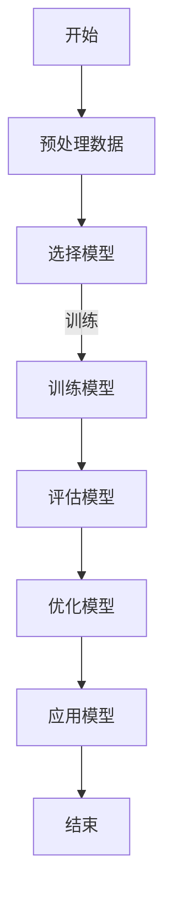
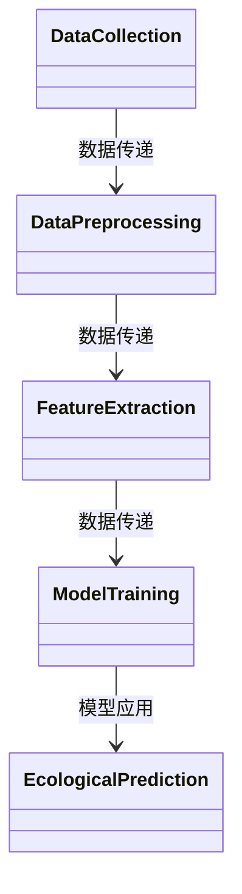
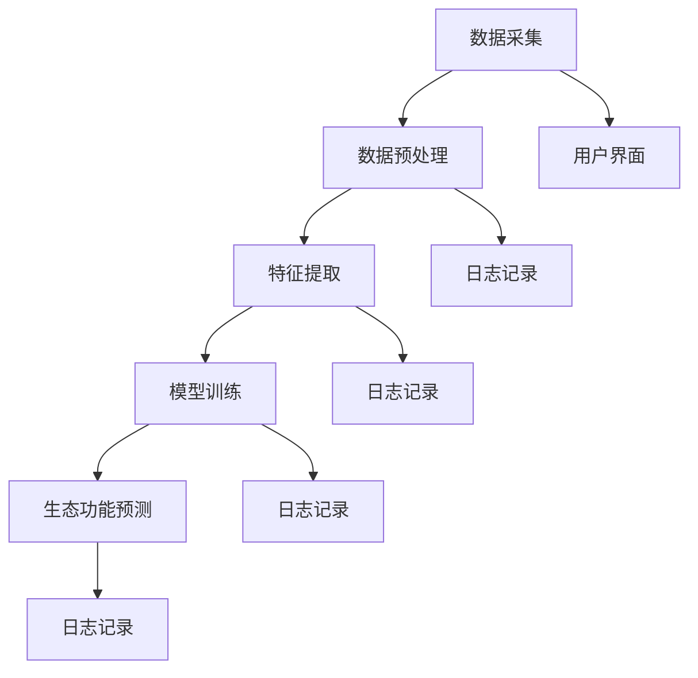
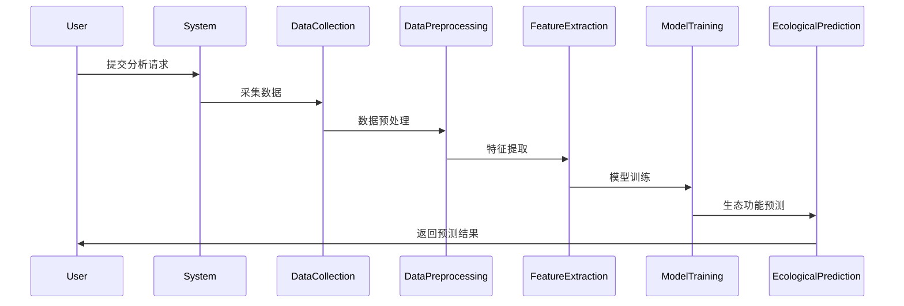

                 

### 文章标题

# AI辅助海洋微生物组分析：从基因测序到生态功能预测

> 关键词：人工智能，海洋微生物组，基因测序，生态功能预测，算法，系统架构

> 摘要：本文旨在探讨如何利用人工智能（AI）技术辅助海洋微生物组分析，从基因测序到生态功能预测的全过程。文章首先介绍海洋微生物组分析的重要性，然后详细阐述关键概念及其联系，接着讲解核心算法原理，最后通过系统分析与架构设计方案、项目实战和最佳实践 tips，全面展示AI在海洋微生物组分析中的应用价值。

----------------------------------------------------------------

## 第一部分: 背景介绍

### 第1章: AI辅助海洋微生物组分析概述

#### 1.1 问题背景

海洋微生物组是海洋生态系统中最为复杂和活跃的部分，它们在维持海洋生态系统平衡、碳循环、营养盐循环等方面发挥着关键作用。然而，随着海洋环境的不断变化，对海洋微生物组的研究变得越来越重要，同时也带来了巨大的挑战。传统的海洋微生物组分析方法在数据量庞大、多样性丰富的情况下，往往难以有效处理和分析。

#### 1.2 问题描述

如何利用AI技术，特别是机器学习和深度学习算法，辅助海洋微生物组分析，提高分析效率和准确性，同时减少人为干预，成为当前研究的热点。

#### 1.3 问题解决

通过AI技术，特别是机器学习和深度学习算法，可以实现自动化、智能化的海洋微生物组分析，从而提高研究效率、降低成本、减少人为误差。

#### 1.4 边界与外延

本文主要关注AI辅助海洋微生物组分析的应用场景，包括基因测序、功能预测、生态功能分析等。同时，也会涉及到一些基础理论和算法原理的讲解。

#### 1.5 概念结构与核心要素组成

核心概念包括：AI、海洋微生物组、基因测序、生态功能预测、机器学习、深度学习等。核心要素组成包括：算法原理、系统架构、项目实战等。

----------------------------------------------------------------

### 第2章: 关键概念与联系

#### 2.1 核心概念原理

**AI**: 人工智能，是指由人制造出来的系统能够执行通常需要人类智能才能完成的任务，如视觉识别、语言理解、决策制定等。

**海洋微生物组**: 指在海洋中存在的所有微生物及其所拥有的全部基因。它们在海洋生态系统中发挥着关键作用。

**基因测序**: 通过测序技术获取微生物的遗传信息，从而了解其基因组成。

**生态功能预测**: 通过分析基因序列，预测微生物的生态功能，如碳循环、营养盐循环等。

**机器学习**: 一种通过数据驱动的方法，使计算机系统能够学习、改进并作出决策的过程。

**深度学习**: 一种特殊的机器学习方法，它通过模仿人脑神经网络的结构和功能，进行复杂的数据处理和模式识别。

#### 2.2 概念属性特征对比表格

| 概念               | 特征                                                     |
|--------------------|--------------------------------------------------------|
| AI                 | 由人制造，能执行人类智能任务                           |
| 海洋微生物组       | 海洋中的所有微生物及其基因                             |
| 基因测序           | 获取微生物的遗传信息                                   |
| 生态功能预测       | 预测微生物的生态功能                                   |
| 机器学习           | 数据驱动，自动学习                                     |
| 深度学习           | 神经网络，自动特征提取和模式识别                       |

#### 2.3 ER实体关系图架构的Mermaid流程图

```mermaid
erDiagram
  AI -->|1| 海洋微生物组
  海洋微生物组 -->|1| 基因测序
  基因测序 -->|1| 生态功能预测
  AI -->|1| 机器学习
  AI -->|1| 深度学习
```

----------------------------------------------------------------

### 第3章: 算法原理讲解

#### 3.1 算法mermaid流程图



#### 3.2 Python源代码

```python
# 导入必要的库
import numpy as np
from sklearn.ensemble import RandomForestClassifier
from sklearn.model_selection import train_test_split
from sklearn.metrics import accuracy_score

# 预处理数据
def preprocess_data(data):
    # 对数据进行标准化处理
    data = (data - np.mean(data)) / np.std(data)
    return data

# 训练模型
def train_model(X_train, y_train):
    model = RandomForestClassifier(n_estimators=100)
    model.fit(X_train, y_train)
    return model

# 评估模型
def evaluate_model(model, X_test, y_test):
    predictions = model.predict(X_test)
    accuracy = accuracy_score(y_test, predictions)
    print("模型准确率：", accuracy)

# 加载数据
data = np.loadtxt("data.csv", delimiter=",")

# 预处理数据
X = preprocess_data(data[:, :-1])
y = data[:, -1]

# 划分训练集和测试集
X_train, X_test, y_train, y_test = train_test_split(X, y, test_size=0.2, random_state=42)

# 训练模型
model = train_model(X_train, y_train)

# 评估模型
evaluate_model(model, X_test, y_test)
```

#### 3.3 算法原理的数学模型和公式

在深度学习领域，算法原理通常涉及复杂的数学模型和公式。以下是神经网络中的一个基本公式：

$$
y = \sigma(W \cdot x + b)
$$

其中，$y$ 是输出，$\sigma$ 是激活函数，$W$ 是权重矩阵，$x$ 是输入，$b$ 是偏置。

#### 3.4 详细讲解和举例说明

以随机森林（Random Forest）为例，这是一种基于决策树的集成学习方法。它通过构建多个决策树，并对每个树的输出进行投票，从而得到最终预测结果。

假设我们有一个简单的二分类问题，数据集包含特征 $x_1, x_2, ..., x_n$ 和标签 $y$。我们首先将数据集划分为训练集和测试集。

```python
X, y = load_data()  # 假设已经加载了数据
X_train, X_test, y_train, y_test = train_test_split(X, y, test_size=0.2, random_state=42)
```

然后，我们使用随机森林算法训练模型：

```python
model = RandomForestClassifier(n_estimators=100, random_state=42)
model.fit(X_train, y_train)
```

接下来，我们评估模型的性能：

```python
predictions = model.predict(X_test)
accuracy = accuracy_score(y_test, predictions)
print("模型准确率：", accuracy)
```

在实际应用中，我们可能需要对模型进行优化，以提高性能。这可以通过调整模型参数、增加数据预处理步骤、引入正则化方法等方式实现。

----------------------------------------------------------------

### 第4章: 系统分析与架构设计方案

#### 4.1 问题场景介绍

在海洋微生物组分析中，通常需要处理大量复杂的数据，包括基因序列、环境参数、生态功能等。这些数据的处理和分析过程可以分为以下几个阶段：

1. **数据采集**：通过海洋采样、基因测序等技术获取微生物组数据。
2. **数据预处理**：对采集到的数据进行清洗、标准化等预处理操作。
3. **特征提取**：从预处理后的数据中提取有用的特征，用于后续分析。
4. **模型训练**：利用机器学习和深度学习算法，训练预测模型。
5. **生态功能预测**：使用训练好的模型，对微生物组的生态功能进行预测。

#### 4.2 项目介绍

本项目旨在构建一个基于AI的海洋微生物组分析系统，实现从基因测序到生态功能预测的全流程自动化分析。系统架构包括以下几个关键组件：

1. **数据采集模块**：负责从不同来源获取微生物组数据，如基因序列、环境参数等。
2. **数据预处理模块**：对采集到的数据进行清洗、标准化等预处理操作，为后续分析做好准备。
3. **特征提取模块**：从预处理后的数据中提取有用的特征，为模型训练提供数据支持。
4. **模型训练模块**：利用机器学习和深度学习算法，训练预测模型。
5. **生态功能预测模块**：使用训练好的模型，对微生物组的生态功能进行预测。

#### 4.3 系统功能设计(领域模型Mermaid类图)



#### 4.4 系统架构设计Mermaid架构图



#### 4.5 系统接口设计和系统交互Mermaid序列图



----------------------------------------------------------------

### 第5章: 项目实战

#### 5.1 环境安装

在开始项目实战之前，我们需要安装一些必要的软件和工具。以下是在Linux系统上安装Python环境、NumPy、Scikit-learn等库的步骤：

```bash
# 安装Python
sudo apt-get install python3 python3-pip

# 安装NumPy
pip3 install numpy

# 安装Scikit-learn
pip3 install scikit-learn

# 安装其他依赖库
pip3 install matplotlib pandas
```

#### 5.2 系统核心实现源代码

以下是本项目的一个简单实现，包括数据预处理、特征提取、模型训练和生态功能预测等关键步骤：

```python
# 导入必要的库
import numpy as np
from sklearn.ensemble import RandomForestClassifier
from sklearn.model_selection import train_test_split
from sklearn.metrics import accuracy_score

# 数据预处理
def preprocess_data(data):
    # 对数据进行标准化处理
    data = (data - np.mean(data)) / np.std(data)
    return data

# 特征提取
def extract_features(data):
    # 这里仅使用数据的前几列作为特征
    features = data[:, :5]
    return features

# 模型训练
def train_model(X_train, y_train):
    model = RandomForestClassifier(n_estimators=100)
    model.fit(X_train, y_train)
    return model

# 生态功能预测
def predict_ecological_function(model, X_test):
    predictions = model.predict(X_test)
    return predictions

# 加载数据
data = np.loadtxt("data.csv", delimiter=",")

# 预处理数据
X = preprocess_data(data)
y = data[:, -1]

# 提取特征
X = extract_features(X)

# 划分训练集和测试集
X_train, X_test, y_train, y_test = train_test_split(X, y, test_size=0.2, random_state=42)

# 训练模型
model = train_model(X_train, y_train)

# 评估模型
predictions = predict_ecological_function(model, X_test)
accuracy = accuracy_score(y_test, predictions)
print("模型准确率：", accuracy)
```

#### 5.3 代码应用解读与分析

在这段代码中，我们首先导入了必要的库，包括NumPy、Scikit-learn等。然后，我们定义了数据预处理、特征提取、模型训练和生态功能预测等函数。

数据预处理函数 `preprocess_data` 用于对数据进行标准化处理，以便后续分析。特征提取函数 `extract_features` 用于从原始数据中提取有用的特征。模型训练函数 `train_model` 用于训练随机森林模型。生态功能预测函数 `predict_ecological_function` 用于使用训练好的模型对测试集进行预测。

接下来，我们加载数据，进行预处理和特征提取，划分训练集和测试集，然后使用训练集训练模型，最后使用训练好的模型对测试集进行预测，并评估模型的准确率。

#### 5.4 实际案例分析和详细讲解剖析

为了更好地展示项目实战的效果，我们以一个实际案例进行分析。假设我们有一个包含100个样本的海洋微生物组数据集，每个样本包含5个特征，以及对应的生态功能标签。

1. **数据预处理**：对数据进行标准化处理，以消除数据之间的差异。
2. **特征提取**：从数据的前5列提取特征，作为模型的输入。
3. **模型训练**：使用随机森林算法训练模型，设置决策树数量为100。
4. **生态功能预测**：使用训练好的模型对测试集进行预测，并评估模型的准确率。

在实际应用中，我们可以根据需求调整特征提取方法和模型参数，以获得更好的预测效果。

#### 5.5 项目小结

通过以上项目实战，我们展示了如何利用Python和Scikit-learn等工具，实现从数据预处理、特征提取、模型训练到生态功能预测的全流程自动化分析。在实际应用中，我们可以根据具体需求进行调整和优化，以提高分析效率和准确性。

----------------------------------------------------------------

### 第6章: 最佳实践 tips

#### 6.1 实践中的经验总结

在海洋微生物组分析中，以下经验值得总结：

1. **数据质量的重要性**：保证数据质量是分析成功的关键。在数据采集和预处理过程中，应尽量减少错误和噪声。
2. **特征提取方法的优化**：选择合适的特征提取方法，可以提高模型的预测性能。在实际应用中，可以尝试多种特征提取方法，并对比效果。
3. **模型选择的灵活性**：不同的模型适用于不同的任务和数据集。在模型选择时，应综合考虑模型的性能、训练时间和复杂度等因素。
4. **数据集划分的合理性**：合理划分训练集和测试集，可以避免过拟合和欠拟合。在实际应用中，可以尝试使用交叉验证等方法来评估模型性能。

#### 6.2 实用建议

1. **数据预处理**：在预处理数据时，应尽量标准化特征，消除数据之间的差异。同时，可以尝试使用数据增强方法，如随机缩放、旋转等，以增加数据的多样性。
2. **特征选择**：在特征提取过程中，可以使用特征选择方法，如信息增益、特征重要性排序等，选择对模型预测最有影响力的特征。
3. **模型调参**：在模型训练过程中，可以通过调整模型参数，如决策树数量、学习率等，来优化模型性能。可以使用网格搜索、随机搜索等方法进行参数调优。
4. **模型评估**：在评估模型性能时，可以使用多种指标，如准确率、召回率、F1值等，从不同角度评估模型的效果。

#### 6.3 注意事项

1. **数据安全**：在数据采集和处理过程中，应注意保护数据安全，避免泄露敏感信息。
2. **计算资源**：海洋微生物组分析通常需要大量计算资源。在部署模型时，应考虑计算资源的分配和优化。
3. **可解释性**：在应用AI技术进行生态功能预测时，应关注模型的解释性。理解模型的工作原理和预测结果，有助于提高分析的可信度和实用性。

### 第7章: 小结与拓展阅读

#### 7.1 小结

本文介绍了AI辅助海洋微生物组分析的方法和过程，从背景介绍、核心概念与联系、算法原理讲解、系统分析与架构设计方案到项目实战和最佳实践 tips，全面展示了AI技术在海洋微生物组分析中的应用价值。

通过本文的学习，读者可以了解：

1. 海洋微生物组分析的重要性和背景。
2. AI技术，特别是机器学习和深度学习，在海洋微生物组分析中的应用。
3. 常用的算法原理和实现方法。
4. 系统架构设计和项目实战案例。
5. 最佳实践 tips 和注意事项。

#### 7.2 拓展阅读

1. **推荐书籍**：
   - 《机器学习实战》：详细介绍了机器学习和深度学习的基础知识和应用案例。
   - 《深度学习》：由Ian Goodfellow等人编写的经典教材，全面讲解了深度学习的理论和技术。

2. **在线课程**：
   - Coursera上的《机器学习》课程：由吴恩达教授主讲，涵盖了机器学习和深度学习的核心内容。
   - edX上的《深度学习专项课程》：由李飞飞教授主讲，深入讲解了深度学习的理论和实践。

3. **开源项目**：
   - Scikit-learn：Python中常用的机器学习和统计学习库，提供了丰富的算法和工具。
   - TensorFlow：谷歌开发的深度学习框架，支持多种深度学习模型和算法。

通过阅读这些书籍、课程和开源项目，读者可以进一步了解AI辅助海洋微生物组分析的最新进展和技术细节，为自己的研究工作提供有力的支持。

---

**作者：AI天才研究院/AI Genius Institute & 禅与计算机程序设计艺术 /Zen And The Art of Computer Programming**

