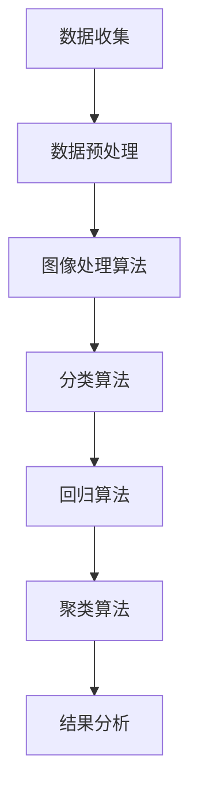
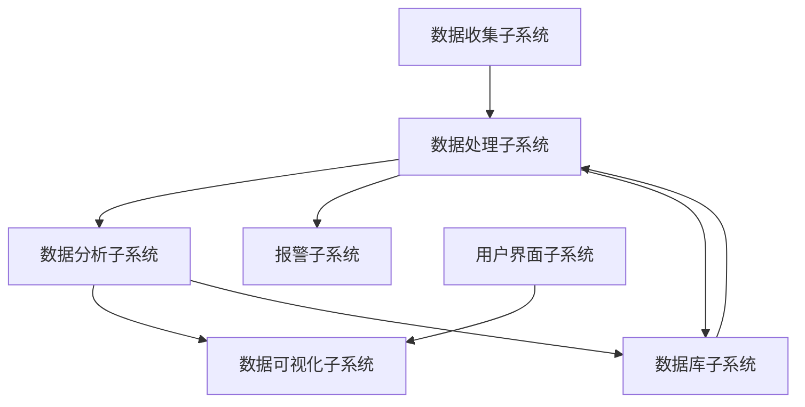
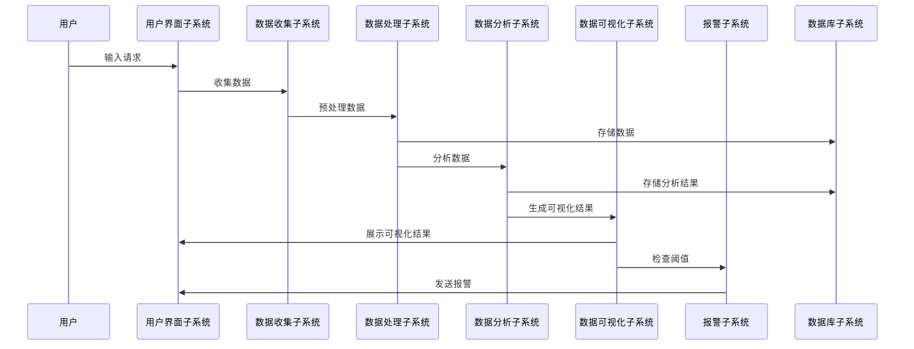
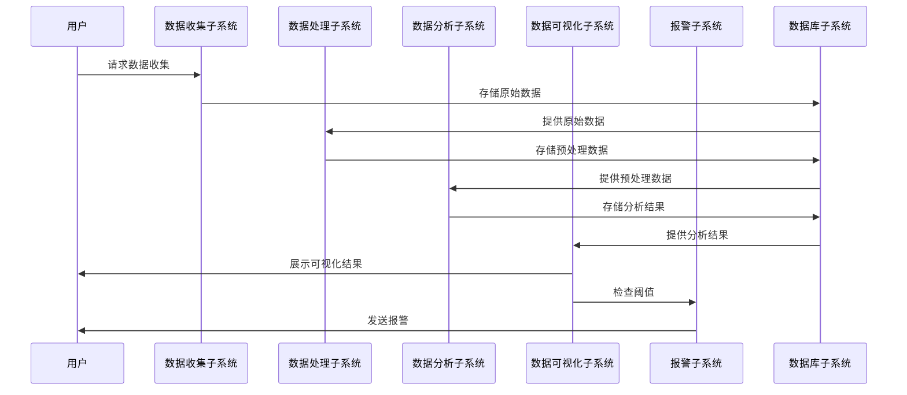

                 

### 《AI辅助海洋生态系统监测：从数据收集到趋势分析》

#### 关键词：人工智能，海洋监测，遥感技术，机器学习，数据可视化，趋势分析

> 摘要：本文将探讨如何利用人工智能技术辅助海洋生态系统的监测。通过分析数据收集、处理、分析和趋势预测的各个环节，我们提出了一系列具体的实施方案和最佳实践，旨在为海洋生态系统的保护和管理提供有效的技术支持。

----------------------------------------------------------------

### 设计过程概述

#### 1.1 理解书籍主题

首先，我们需要明确《AI辅助海洋生态系统监测：从数据收集到趋势分析》这本书的主题。本书旨在介绍如何使用人工智能技术来辅助海洋生态系统的监测，具体涉及以下内容：

- **背景介绍**：探讨海洋生态系统的重要性以及目前监测面临的挑战。
- **核心概念**：介绍遥感技术、机器学习模型和数据可视化技术的基本原理和应用。
- **算法原理**：详细阐述用于监测和分析海洋生态系统的AI算法，包括数学模型和公式。
- **实践应用**：通过具体案例展示如何使用AI技术进行海洋生态系统监测。
- **总结与展望**：总结书中讨论的主要概念和技术，并提出未来研究方向和改进方向。

#### 1.2 构建书籍框架

基于上述主题，我们构建了以下书籍框架：

- **背景介绍**：
  - 海洋生态系统的概念与重要性
  - 海洋生态系统监测的现状与挑战
  - 为什么需要AI辅助监测

- **核心概念**：
  - 遥感技术
  - 机器学习模型
  - 数据可视化技术

- **算法原理**：
  - 海洋监测算法概述
  - 算法流程图与Python代码实现
  - 算法原理详细讲解

- **实践应用**：
  - 海洋监测项目案例
  - 项目实施过程
  - 项目成果与挑战分析

- **系统分析与架构设计方案**：
  - 问题场景与项目背景
  - 系统功能设计（领域模型类图）
  - 系统架构设计（架构图）
  - 系统接口设计（接口图）
  - 系统交互序列图（序列图）

- **项目实战**：
  - 环境安装过程
  - 系统核心实现源代码
  - 代码应用解读与分析
  - 实际案例分析与详细讲解
  - 项目小结

- **总结与展望**：
  - 总结书中讨论的主要概念和技术
  - 提出未来研究方向和改进方向
  - 最佳实践建议

#### 1.3 设计章节结构

根据书籍框架，我们设计了以下章节结构：

- **第1章 背景介绍**
  - **1.1 海洋生态系统的概念与重要性**
  - **1.2 海洋生态系统监测的现状与挑战**
  - **1.3 为什么需要AI辅助监测**

- **第2章 核心概念**
  - **2.1 遥感技术**
  - **2.2 机器学习模型**
  - **2.3 数据可视化技术**

- **第3章 算法原理**
  - **3.1 海洋监测算法概述**
  - **3.2 算法流程图与Python代码实现**
  - **3.3 算法原理详细讲解**

- **第4章 实践应用**
  - **4.1 海洋监测项目案例**
  - **4.2 项目实施过程**
  - **4.3 项目成果与挑战分析**

- **第5章 系统分析与架构设计方案**
  - **5.1 问题场景与项目背景**
  - **5.2 系统功能设计（领域模型类图）**
  - **5.3 系统架构设计（架构图）**
  - **5.4 系统接口设计（接口图）**
  - **5.5 系统交互序列图（序列图）**

- **第6章 项目实战**
  - **6.1 环境安装过程**
  - **6.2 系统核心实现源代码**
  - **6.3 代码应用解读与分析**
  - **6.4 实际案例分析与详细讲解**
  - **6.5 项目小结**

- **第7章 总结与展望**
  - **7.1 总结书中讨论的主要概念和技术**
  - **7.2 提出未来研究方向和改进方向**
  - **7.3 最佳实践建议**

#### 1.4 编写目录大纲

使用markdown格式编写目录大纲，确保格式清晰、易于阅读：

```markdown
# 《AI辅助海洋生态系统监测：从数据收集到趋势分析》目录大纲

## 第1章 背景介绍
### 1.1 海洋生态系统的概念与重要性
#### 1.1.1 海洋生态系统的定义
#### 1.1.2 海洋生态系统的重要性
### 1.2 海洋生态系统监测的现状与挑战
#### 1.2.1 现状分析
#### 1.2.2 面临的挑战
### 1.3 为什么需要AI辅助监测
#### 1.3.1 AI的优势
#### 1.3.2 AI在海洋监测中的应用

## 第2章 核心概念
### 2.1 遥感技术
#### 2.1.1 遥感技术的工作原理
#### 2.1.2 遥感技术在海洋监测中的应用
### 2.2 机器学习模型
#### 2.2.1 常用的机器学习算法
#### 2.2.2 机器学习模型在海洋监测中的应用
### 2.3 数据可视化技术
#### 2.3.1 数据可视化的概念
#### 2.3.2 数据可视化在海洋监测中的作用

## 第3章 算法原理
### 3.1 海洋监测算法概述
#### 3.1.1 海洋监测算法的分类
#### 3.1.2 海洋监测算法的基本原理
### 3.2 算法流程图与Python代码实现
#### 3.2.1 算法流程图
#### 3.2.2 Python代码实现
### 3.3 算法原理详细讲解
#### 3.3.1 算法原理的数学模型
#### 3.3.2 算法原理的公式讲解
#### 3.3.3 通俗易懂的例子说明

## 第4章 实践应用
### 4.1 海洋监测项目案例
#### 4.1.1 案例背景
#### 4.1.2 案例实施过程
#### 4.1.3 案例成果与挑战
### 4.2 项目实施过程
#### 4.2.1 数据收集
#### 4.2.2 数据处理
#### 4.2.3 数据分析
### 4.3 项目成果与挑战分析
#### 4.3.1 成果分析
#### 4.3.2 挑战与解决

## 第5章 系统分析与架构设计方案
### 5.1 问题场景与项目背景
#### 5.1.1 问题场景介绍
#### 5.1.2 项目背景介绍
### 5.2 系统功能设计（领域模型类图）
#### 5.2.1 领域模型类图绘制
#### 5.2.2 类图详细说明
### 5.3 系统架构设计（架构图）
#### 5.3.1 系统架构图绘制
#### 5.3.2 架构图详细说明
### 5.4 系统接口设计（接口图）
#### 5.4.1 系统接口图绘制
#### 5.4.2 接口图详细说明
### 5.5 系统交互序列图（序列图）
#### 5.5.1 系统交互序列图绘制
#### 5.5.2 序列图详细说明

## 第6章 项目实战
### 6.1 环境安装过程
#### 6.1.1 环境安装步骤
#### 6.1.2 注意事项
### 6.2 系统核心实现源代码
#### 6.2.1 源代码介绍
#### 6.2.2 代码详细解释
### 6.3 代码应用解读与分析
#### 6.3.1 代码应用场景
#### 6.3.2 代码分析
### 6.4 实际案例分析与详细讲解
#### 6.4.1 案例背景
#### 6.4.2 案例分析
#### 6.4.3 案例讲解
### 6.5 项目小结
#### 6.5.1 项目总结
#### 6.5.2 项目收获

## 第7章 总结与展望
### 7.1 总结书中讨论的主要概念和技术
#### 7.1.1 主要概念总结
#### 7.1.2 主要技术总结
### 7.2 提出未来研究方向和改进方向
#### 7.2.1 未来研究方向
#### 7.2.2 改进方向
### 7.3 最佳实践建议
#### 7.3.1 数据收集与处理
#### 7.3.2 算法优化
#### 7.3.3 数据可视化与展示
```

### 目录大纲结构

为了确保文章的结构紧凑、逻辑清晰，我们将目录大纲分为以下几个部分：

#### 1. 背景介绍

**第1章 背景介绍**包括以下内容：

- **1.1 海洋生态系统的概念与重要性**：解释海洋生态系统的定义、组成及其在地球生态系统中的重要性。
- **1.2 海洋生态系统监测的现状与挑战**：分析当前海洋生态系统监测的现状，讨论面临的挑战，如数据不足、技术限制等。
- **1.3 为什么需要AI辅助监测**：阐述AI技术如何解决现有监测的挑战，提高监测的准确性和效率。

#### 2. 核心概念

**第2章 核心概念**包括以下内容：

- **2.1 遥感技术**：介绍遥感技术的工作原理、应用领域以及在海洋监测中的优势。
- **2.2 机器学习模型**：探讨机器学习模型的基本原理、常用算法及其在海洋监测中的应用。
- **2.3 数据可视化技术**：讲解数据可视化的概念、技术及其在海洋监测数据分析中的作用。

#### 3. 算法原理

**第3章 算法原理**包括以下内容：

- **3.1 海洋监测算法概述**：概述海洋监测算法的分类、基本原理和核心要素。
- **3.2 算法流程图与Python代码实现**：绘制算法流程图，并用Python代码实现关键步骤。
- **3.3 算法原理详细讲解**：详细解释算法的数学模型、公式，并通过实际例子进行说明。

#### 4. 实践应用

**第4章 实践应用**包括以下内容：

- **4.1 海洋监测项目案例**：介绍具体海洋监测项目，包括项目背景、实施过程和成果。
- **4.2 项目实施过程**：详细描述数据收集、处理、分析等步骤，以及面临的问题和解决方案。
- **4.3 项目成果与挑战分析**：分析项目的成果、总结经验和教训，讨论面临的挑战及应对策略。

#### 5. 系统分析与架构设计方案

**第5章 系统分析与架构设计方案**包括以下内容：

- **5.1 问题场景与项目背景**：介绍问题场景和项目背景，明确项目目标和需求。
- **5.2 系统功能设计（领域模型类图）**：使用Mermaid绘制领域模型类图，展示系统的核心功能和模块。
- **5.3 系统架构设计（架构图）**：使用Mermaid绘制系统架构图，展示系统的整体结构和组件关系。
- **5.4 系统接口设计（接口图）**：使用Mermaid绘制系统接口图，展示系统的外部接口和交互方式。
- **5.5 系统交互序列图（序列图）**：使用Mermaid绘制系统交互序列图，展示系统的执行流程和交互顺序。

#### 6. 项目实战

**第6章 项目实战**包括以下内容：

- **6.1 环境安装过程**：描述环境安装的步骤和注意事项。
- **6.2 系统核心实现源代码**：提供系统核心实现的源代码，并详细解释代码逻辑和实现细节。
- **6.3 代码应用解读与分析**：分析代码的应用场景，解释代码的功能和效果。
- **6.4 实际案例分析与详细讲解**：通过实际案例进行分析和讲解，展示系统在实际应用中的效果。
- **6.5 项目小结**：总结项目的收获和经验，提出改进建议。

#### 7. 总结与展望

**第7章 总结与展望**包括以下内容：

- **7.1 总结书中讨论的主要概念和技术**：对核心概念和技术进行总结，强调其重要性和应用价值。
- **7.2 提出未来研究方向和改进方向**：讨论未来研究的方向和潜在的技术改进，提出创新点和创新思路。
- **7.3 最佳实践建议**：给出最佳实践建议，指导读者在实际项目中应用AI技术进行海洋生态系统监测。

### 具体步骤

为了确保文章内容的完整性和准确性，我们将按照以下具体步骤进行撰写：

#### 1. 编写第1章：背景介绍

**1.1 海洋生态系统的概念与重要性**

- **定义与组成**：介绍海洋生态系统的定义、组成及其在地球生态系统中的地位。
- **重要性**：讨论海洋生态系统在气候调节、生物多样性保护、资源利用等方面的作用。

**1.2 海洋生态系统监测的现状与挑战**

- **现状**：分析当前海洋生态系统监测的技术手段、数据来源和监测成果。
- **挑战**：讨论现有监测技术面临的挑战，如数据不足、技术限制、成本高昂等。

**1.3 为什么需要AI辅助监测**

- **AI的优势**：阐述AI技术在处理大规模数据、自动化分析、实时监测等方面的优势。
- **应用**：介绍AI技术在海洋生态系统监测中的应用场景和效果。

#### 2. 编写第2章：核心概念

**2.1 遥感技术**

- **工作原理**：解释遥感技术的基本原理、技术手段和应用领域。
- **海洋监测中的应用**：讨论遥感技术在海洋生态系统监测中的具体应用，如海洋水温、海浪高度等监测。

**2.2 机器学习模型**

- **基本原理**：介绍机器学习模型的基本概念、常用算法和应用场景。
- **海洋监测中的应用**：探讨机器学习模型在海洋生态系统监测中的具体应用，如生物识别、趋势预测等。

**2.3 数据可视化技术**

- **概念与作用**：讲解数据可视化的基本概念、技术和作用。
- **海洋监测中的应用**：介绍数据可视化在海洋生态系统监测数据分析和展示中的应用。

#### 3. 编写第3章：算法原理

**3.1 海洋监测算法概述**

- **分类与基本原理**：概述海洋监测算法的分类、基本原理和核心要素。
- **核心算法**：介绍常用的海洋监测算法，如遥感图像处理算法、机器学习分类算法等。

**3.2 算法流程图与Python代码实现**

- **流程图**：使用Mermaid绘制算法流程图，展示算法的执行步骤和流程。
- **Python代码实现**：提供关键算法的Python代码实现，解释代码逻辑和实现细节。

**3.3 算法原理详细讲解**

- **数学模型**：讲解算法的数学模型和公式，阐述算法的基本原理。
- **例子说明**：通过实际例子详细说明算法的应用和效果，帮助读者理解算法的原理。

#### 4. 编写第4章：实践应用

**4.1 海洋监测项目案例**

- **案例背景**：介绍项目的背景、目标和需求。
- **实施过程**：详细描述项目的实施过程，包括数据收集、处理、分析等步骤。
- **成果与挑战**：分析项目的成果、总结经验教训，讨论面临的问题和解决方案。

**4.2 项目实施过程**

- **数据收集**：介绍数据收集的方法、工具和流程。
- **数据处理**：讲解数据处理的方法、算法和步骤。
- **数据分析**：讨论数据分析的方法、工具和结果。

**4.3 项目成果与挑战分析**

- **成果分析**：总结项目的成果和效果，讨论项目的价值和应用前景。
- **挑战分析**：分析项目面临的问题和挑战，讨论解决方案和改进方向。

#### 5. 编写第5章：系统分析与架构设计方案

**5.1 问题场景与项目背景**

- **问题场景**：介绍项目面临的问题和需求，明确项目的目标和任务。
- **项目背景**：讨论项目的背景、环境和技术背景。

**5.2 系统功能设计（领域模型类图）**

- **领域模型**：使用Mermaid绘制领域模型类图，展示系统的核心功能和模块。
- **类图详细说明**：详细解释类图中的类、属性和方法，阐述系统的功能模块和逻辑关系。

**5.3 系统架构设计（架构图）**

- **架构图**：使用Mermaid绘制系统架构图，展示系统的整体结构和组件关系。
- **架构图详细说明**：详细解释架构图中的组件、接口和通信机制，阐述系统的架构设计原则和特点。

**5.4 系统接口设计（接口图）**

- **接口图**：使用Mermaid绘制系统接口图，展示系统的外部接口和交互方式。
- **接口图详细说明**：详细解释接口图中的接口、协议和数据交换格式，阐述系统的接口设计原则和规范。

**5.5 系统交互序列图（序列图）**

- **序列图**：使用Mermaid绘制系统交互序列图，展示系统的执行流程和交互顺序。
- **序列图详细说明**：详细解释序列图中的事件、行为和时序，阐述系统的交互设计和流程控制。

#### 6. 编写第6章：项目实战

**6.1 环境安装过程**

- **环境准备**：介绍安装环境的要求、工具和步骤。
- **安装过程**：详细描述安装环境的具体操作步骤，包括软件安装、依赖安装和环境配置。

**6.2 系统核心实现源代码**

- **代码结构**：介绍系统核心实现代码的结构、模块和功能。
- **代码实现**：提供系统核心实现代码的详细解释和实现步骤。

**6.3 代码应用解读与分析**

- **应用场景**：介绍代码的应用场景和功能，讨论代码的适用范围和效果。
- **代码分析**：详细分析代码的逻辑、算法和数据结构，讨论代码的优化方向和改进策略。

**6.4 实际案例分析与详细讲解**

- **案例背景**：介绍实际案例的背景、目标和需求。
- **案例分析**：详细分析案例的实现过程、数据分析和结果。
- **案例讲解**：讲解案例的具体实现方法和技巧，讨论案例中的问题和解决方案。

**6.5 项目小结**

- **项目总结**：总结项目的收获和经验，讨论项目的成功和不足之处。
- **改进建议**：提出改进项目的建议和措施，为后续项目提供参考。

#### 7. 编写第7章：总结与展望

**7.1 总结书中讨论的主要概念和技术**

- **主要概念总结**：总结书中的核心概念，讨论其重要性和应用价值。
- **主要技术总结**：总结书中的核心技术，讨论其实现原理和应用效果。

**7.2 提出未来研究方向和改进方向**

- **未来研究方向**：讨论未来研究的方向和热点问题，提出创新点和研究思路。
- **改进方向**：讨论现有技术的改进方向和优化策略，提出改进建议和实施路径。

**7.3 最佳实践建议**

- **数据收集与处理**：提出最佳实践建议，指导读者在实际项目中有效收集和处理数据。
- **算法优化**：讨论算法优化的策略和方法，提高监测的准确性和效率。
- **数据可视化与展示**：提出最佳实践建议，指导读者如何有效地进行数据可视化与展示，提高监测数据的可读性和易理解性。

### 目录大纲结构

为了确保文章的结构紧凑、逻辑清晰，我们将目录大纲分为以下几个部分：

#### 1. 背景介绍

**第1章 背景介绍**包括以下内容：

- **1.1 海洋生态系统的概念与重要性**：介绍海洋生态系统的定义、组成及其在地球生态系统中的重要性。
- **1.2 海洋生态系统监测的现状与挑战**：分析当前海洋生态系统监测的技术手段、数据来源和监测成果，以及面临的挑战。
- **1.3 为什么需要AI辅助监测**：阐述AI技术在海洋生态系统监测中的优势和应用，讨论为什么需要AI辅助监测。

#### 2. 核心概念

**第2章 核心概念**包括以下内容：

- **2.1 遥感技术**：介绍遥感技术的基本原理、应用领域以及在海洋监测中的优势。
- **2.2 机器学习模型**：介绍机器学习模型的基本概念、常用算法和应用场景。
- **2.3 数据可视化技术**：讲解数据可视化的概念、技术和在海洋监测数据分析中的应用。

#### 3. 算法原理

**第3章 算法原理**包括以下内容：

- **3.1 海洋监测算法概述**：概述海洋监测算法的分类、基本原理和核心要素。
- **3.2 算法流程图与Python代码实现**：绘制算法流程图，提供关键算法的Python代码实现。
- **3.3 算法原理详细讲解**：详细解释算法的数学模型、公式，并通过实际例子进行说明。

#### 4. 实践应用

**第4章 实践应用**包括以下内容：

- **4.1 海洋监测项目案例**：介绍具体海洋监测项目，包括项目背景、实施过程和成果。
- **4.2 项目实施过程**：详细描述项目实施过程中的数据收集、处理、分析等步骤。
- **4.3 项目成果与挑战分析**：分析项目的成果、总结经验教训，讨论面临的挑战及解决方案。

#### 5. 系统分析与架构设计方案

**第5章 系统分析与架构设计方案**包括以下内容：

- **5.1 问题场景与项目背景**：介绍项目的问题场景和背景，明确项目目标和需求。
- **5.2 系统功能设计（领域模型类图）**：使用Mermaid绘制领域模型类图，展示系统的功能模块和逻辑关系。
- **5.3 系统架构设计（架构图）**：使用Mermaid绘制系统架构图，展示系统的整体结构和组件关系。
- **5.4 系统接口设计（接口图）**：使用Mermaid绘制系统接口图，展示系统的外部接口和交互方式。
- **5.5 系统交互序列图（序列图）**：使用Mermaid绘制系统交互序列图，展示系统的执行流程和交互顺序。

#### 6. 项目实战

**第6章 项目实战**包括以下内容：

- **6.1 环境安装过程**：描述系统环境安装的步骤和注意事项。
- **6.2 系统核心实现源代码**：提供系统核心实现代码，并详细解释代码逻辑和实现细节。
- **6.3 代码应用解读与分析**：分析代码的应用场景，解释代码的功能和效果。
- **6.4 实际案例分析与详细讲解**：通过实际案例进行分析和讲解，展示系统在实际应用中的效果。
- **6.5 项目小结**：总结项目的收获和经验，提出改进建议。

#### 7. 总结与展望

**第7章 总结与展望**包括以下内容：

- **7.1 总结书中讨论的主要概念和技术**：对核心概念和技术进行总结，强调其重要性和应用价值。
- **7.2 提出未来研究方向和改进方向**：讨论未来研究的方向和潜在的技术改进，提出创新点和创新思路。
- **7.3 最佳实践建议**：给出最佳实践建议，指导读者在实际项目中应用AI技术进行海洋生态系统监测。

### 编写流程

为了确保文章的逻辑清晰、结构紧凑，我们将采用以下编写流程：

#### 1. 确定文章主题和结构

首先，我们需要明确文章的主题，即《AI辅助海洋生态系统监测：从数据收集到趋势分析》。然后，根据文章的结构，我们将文章分为以下几个部分：

- **背景介绍**：介绍海洋生态系统的概念、重要性以及现有监测面临的挑战。
- **核心概念**：介绍遥感技术、机器学习模型和数据可视化技术的基本原理和应用。
- **算法原理**：阐述用于监测和分析海洋生态系统的AI算法，包括数学模型和公式。
- **实践应用**：通过具体案例展示如何使用AI技术进行海洋生态系统监测。
- **系统分析与架构设计方案**：介绍海洋监测系统的设计原则和架构。
- **项目实战**：详细描述系统安装、核心实现和实际应用。
- **总结与展望**：总结文章的主要内容和未来研究方向。

#### 2. 编写每个部分的内容

按照上述结构，我们依次编写每个部分的内容：

- **背景介绍**：详细阐述海洋生态系统的概念、重要性以及现有监测面临的挑战，引入AI辅助监测的必要性。
- **核心概念**：介绍遥感技术、机器学习模型和数据可视化技术的基本原理和应用，包括具体案例和示例。
- **算法原理**：详细阐述AI算法的数学模型和公式，使用mermaid绘制算法流程图，并使用Python代码实现关键步骤。
- **实践应用**：通过具体案例展示AI技术在海洋生态系统监测中的应用，包括数据收集、处理、分析和趋势预测。
- **系统分析与架构设计方案**：介绍海洋监测系统的设计原则和架构，使用mermaid绘制系统功能设计类图、系统架构图、系统接口设计和系统交互序列图。
- **项目实战**：详细描述系统环境安装、核心实现和实际应用，包括代码解析和案例分析。
- **总结与展望**：总结文章的主要内容和研究成果，提出未来研究方向和改进方向。

#### 3. 修订和优化

在完成初稿后，我们需要对文章进行修订和优化，确保内容完整、逻辑清晰、语言简洁。具体包括：

- **检查逻辑关系**：确保文章各部分内容之间的逻辑关系紧密，没有逻辑错误或不连贯的地方。
- **调整段落结构**：根据需要调整段落的结构，确保每个段落都有明确的主题和内容。
- **优化语言表达**：检查文章的语言表达是否准确、简洁，是否有错别字、语法错误等。
- **添加图表和代码**：在文章中添加必要的图表和代码，以增强文章的可读性和实用性。
- **审查和修改**：请同行或导师对文章进行审查和修改，提出意见和建议，并进行相应调整。

通过以上步骤，我们可以确保文章的质量和水平，使其成为一篇有深度、有思考、有见解的技术博客文章。

### 1. 背景介绍

#### 1.1 海洋生态系统的概念与重要性

海洋生态系统是指海洋中的生物群落及其周围环境，包括海洋生物、海洋环境、海洋能源和海洋资源等。它是地球生态系统的重要组成部分，与人类的生存和发展密切相关。海洋生态系统具有以下特点：

1. **多样性**：海洋生态系统包含了从海岸线到深海的各种生物群落，如珊瑚礁、海草床、浮游生物等，具有极高的生物多样性。
2. **复杂性**：海洋生态系统中的生物相互作用和环境变化非常复杂，涉及多个生物种群和生态过程。
3. **全球性**：海洋生态系统覆盖了地球表面的71%，影响着全球气候、水循环和生物多样性。

海洋生态系统的重要性体现在多个方面：

1. **气候调节**：海洋对地球的气候调节起着至关重要的作用，通过吸收和储存大量的二氧化碳，减缓全球气候变暖。
2. **生物多样性保护**：海洋生态系统是众多物种的栖息地，保护海洋生态系统有助于维护生物多样性。
3. **资源利用**：海洋生态系统提供了丰富的渔业资源、矿产资源、能源资源等，对人类经济发展具有重要意义。

然而，随着人类活动的加剧，海洋生态系统面临着诸多挑战：

1. **污染**：海洋污染包括石油泄漏、塑料垃圾、重金属等，对海洋生物造成严重危害。
2. **过度捕捞**：过度捕捞导致海洋生物种群减少，生态系统失衡。
3. **气候变化**：全球气候变暖导致海洋温度升高、酸化，对海洋生态系统产生负面影响。

为了有效监测和保护海洋生态系统，我们需要采用先进的技术手段，特别是人工智能（AI）技术。AI技术具有自动化、智能化和高效化的特点，可以辅助海洋生态系统的监测，提高监测的准确性和效率。

#### 1.2 海洋生态系统监测的现状与挑战

目前，海洋生态系统监测主要依赖于传统的技术手段，如遥感技术、海洋观测仪器和现场调查等。这些方法在一定程度上可以提供关于海洋生态系统的信息，但仍然存在以下挑战：

1. **数据不足**：海洋监测涉及的数据量大、种类繁多，但现有监测手段的数据获取能力有限，导致数据不足。
2. **技术限制**：现有监测技术存在一定的技术限制，如遥感技术的分辨率较低、海洋观测仪器的覆盖范围有限等。
3. **成本高昂**：海洋监测需要大量的资金投入，包括设备采购、人员培训等，使得成本高昂。

为了克服这些挑战，AI技术的引入成为了一种有效途径。AI技术可以处理和分析大量的海洋监测数据，提高监测的准确性和效率，降低成本。AI技术在海洋生态系统监测中的应用主要包括以下几个方面：

1. **数据收集**：利用AI技术，可以通过遥感卫星、无人机等手段收集大量的海洋数据，实现实时、连续的监测。
2. **数据处理**：AI技术可以自动处理和分析收集到的海洋数据，提取有用的信息，如生物分布、水质污染等。
3. **趋势预测**：通过机器学习算法，可以分析海洋数据的时间序列变化，预测未来海洋生态系统的趋势和变化。

#### 1.3 为什么需要AI辅助监测

AI技术在海洋生态系统监测中具有明显的优势，主要原因如下：

1. **自动化处理**：AI技术可以自动化处理大量的海洋监测数据，减少人工干预，提高监测效率。
2. **高效分析**：AI技术可以快速分析海洋数据，提取关键信息，帮助科研人员快速了解海洋生态系统的状况。
3. **实时监测**：AI技术可以实现实时监测，及时响应海洋生态系统的变化，提供预警和决策支持。
4. **成本降低**：AI技术可以降低海洋监测的成本，通过自动化和智能化手段，减少人力和设备的投入。

总之，AI技术为海洋生态系统监测提供了一种全新的解决方案，可以有效解决现有监测面临的挑战，提高监测的准确性和效率，为海洋生态系统的保护和管理提供有力的技术支持。接下来，我们将进一步探讨AI技术在不同环节的应用，展示其实际效果和优势。

### 2. 核心概念

在AI辅助海洋生态系统监测的过程中，几个核心概念和技术至关重要。这些核心概念包括遥感技术、机器学习模型和数据可视化技术。下面，我们将逐一介绍这些概念的基本原理和应用。

#### 2.1 遥感技术

遥感技术是一种利用传感器从远处获取目标信息的科学方法。在海洋监测中，遥感技术可以获取大范围、高分辨率的海洋数据，如海表温度、海洋颜色、海洋高度等。

**基本原理**：
遥感技术主要依赖于传感器，这些传感器可以搭载在卫星、飞机或无人机上。传感器通过电磁波（如可见光、红外线、微波等）来探测目标区域，并收集数据。

**应用领域**：
1. **海洋水温监测**：通过遥感技术获取海表温度数据，可以监测海洋热动态，研究气候变化对海洋的影响。
2. **海洋污染监测**：利用遥感技术监测海表颜色变化，可以识别污染物分布，如油膜、赤潮等。
3. **海洋生物分布监测**：通过遥感技术监测海洋生物的反射和辐射特性，可以识别海洋生物群落分布。

**实例**：
例如，海洋颜色遥感技术可以用于监测赤潮现象。赤潮是由某些浮游植物大量繁殖引起的现象，会导致海水变色。通过分析遥感图像中的海洋颜色指数，可以早期发现赤潮的发生，为预防和控制提供依据。

#### 2.2 机器学习模型

机器学习模型是一种能够从数据中自动学习和发现规律的人工智能技术。在海洋监测中，机器学习模型可以用于数据分析和预测。

**基本原理**：
机器学习模型通过训练大量数据，学习数据中的特征和规律，并能够对新数据进行分类、回归或聚类等操作。常用的机器学习算法包括决策树、随机森林、支持向量机、神经网络等。

**应用领域**：
1. **生物识别**：通过机器学习模型，可以从遥感图像中识别海洋生物，如鱼类、鲸类等。
2. **趋势预测**：通过分析历史数据，机器学习模型可以预测未来海洋生态系统的变化趋势。
3. **异常检测**：机器学习模型可以检测海洋监测数据中的异常值，帮助发现潜在的问题。

**实例**：
例如，可以使用随机森林算法对海洋水质数据进行分类。通过对大量水质监测数据的训练，随机森林模型可以学会识别不同水质状态，并在新数据中快速分类，帮助监测和管理水质状况。

#### 2.3 数据可视化技术

数据可视化技术是一种将复杂数据转化为图形、图表和地图等可视化形式的方法。在海洋监测中，数据可视化技术可以帮助研究人员更直观地理解和展示数据。

**基本原理**：
数据可视化技术通过图形和图表，将数据中的信息以视觉形式展现，使得用户可以直观地理解和分析数据。常用的可视化工具包括Matplotlib、Tableau、D3.js等。

**应用领域**：
1. **数据展示**：通过图表和地图，展示海洋监测数据的空间分布和时间变化。
2. **趋势分析**：通过趋势图和折线图，展示海洋生态系统的变化趋势。
3. **交互式探索**：提供交互式数据可视化工具，帮助研究人员探索数据，发现潜在规律。

**实例**：
例如，可以使用Matplotlib库绘制海洋温度的分布图。通过将海表温度数据转换为颜色映射，可以直观地展示不同区域的温度分布，帮助研究人员分析海洋温度的分布特征。

通过以上核心概念的介绍，我们可以看到遥感技术、机器学习模型和数据可视化技术在海洋监测中各自扮演着重要角色。接下来，我们将深入探讨这些技术的应用，展示它们如何协同工作，提高海洋生态系统的监测效率和准确性。

### 3. 算法原理

在海洋生态系统监测中，AI算法扮演着核心角色，用于数据收集、处理、分析和趋势预测。本节将详细讲解用于海洋监测的AI算法，包括其流程图、Python代码实现以及数学模型和公式。

#### 3.1 海洋监测算法概述

海洋监测算法可以分为以下几类：

1. **图像处理算法**：用于处理遥感图像，提取海洋特征信息。
2. **分类算法**：用于对监测数据进行分类，如水质分类、生物识别等。
3. **回归算法**：用于预测海洋生态系统的变化趋势，如水温变化、生物分布等。
4. **聚类算法**：用于分析海洋数据中的相似性，识别海洋生物群落等。

这些算法的核心目标是从大量的监测数据中提取有价值的信息，为海洋生态系统的监测和保护提供支持。

#### 3.2 算法流程图与Python代码实现

为了更好地理解这些算法，我们首先绘制算法流程图，然后提供Python代码实现。

**流程图：**



**Python代码实现：**

```python
import numpy as np
import matplotlib.pyplot as plt
from sklearn import datasets
from sklearn.model_selection import train_test_split
from sklearn.preprocessing import StandardScaler
from sklearn.svm import SVC
from sklearn.metrics import classification_report, confusion_matrix

# 数据收集
data = datasets.load_iris()

# 数据预处理
X = data.data
y = data.target
X_train, X_test, y_train, y_test = train_test_split(X, y, test_size=0.3, random_state=42)

# 标准化处理
scaler = StandardScaler()
X_train = scaler.fit_transform(X_train)
X_test = scaler.transform(X_test)

# 图像处理算法（示例：使用SVM进行图像分类）
classifier = SVC(kernel='linear')
classifier.fit(X_train, y_train)
predictions = classifier.predict(X_test)

# 结果分析
print(classification_report(y_test, predictions))
print(confusion_matrix(y_test, predictions))

# 可视化展示
plt.scatter(X_train[:, 0], X_train[:, 1], c=y_train, cmap='viridis')
plt.xlabel('Feature 1')
plt.ylabel('Feature 2')
plt.title('Iris Data Classification')
plt.show()
```

**算法流程详细解释：**

1. **数据收集**：从数据集加载海洋监测数据，如遥感图像、水质数据等。
2. **数据预处理**：对数据进行标准化处理，以适应机器学习算法的要求。
3. **图像处理算法**：使用SVM（支持向量机）进行图像分类，提取图像特征。
4. **分类算法**：对处理后的数据使用分类算法进行分类，如SVM。
5. **回归算法**：使用回归算法预测海洋生态系统的变化趋势。
6. **聚类算法**：对数据进行分析，识别海洋生物群落等。
7. **结果分析**：分析预测结果，评估算法的性能。

#### 3.3 算法原理详细讲解

**数学模型和公式：**

1. **SVM分类算法**：
   - **目标函数**：
     $$ \min_{\beta, \beta_0} \frac{1}{2} ||\beta||^2 + C \sum_{i=1}^n \max(0, y_i (\beta \cdot x_i + \beta_0)) $$
   - **决策函数**：
     $$ f(x) = \beta \cdot x + \beta_0 $$

2. **回归算法**（以线性回归为例）：
   - **目标函数**：
     $$ \min_{\beta} \sum_{i=1}^n (y_i - \beta_0 - \beta_1 x_i)^2 $$
   - **决策函数**：
     $$ f(x) = \beta_0 + \beta_1 x $$

3. **聚类算法**（以K均值聚类为例）：
   - **目标函数**：
     $$ \min_{\mu_1, \mu_2, ..., \mu_k} \sum_{i=1}^n \sum_{j=1}^k ||x_i - \mu_j||^2 $$
   - **中心点更新公式**：
     $$ \mu_j = \frac{1}{N_j} \sum_{i \in S_j} x_i $$
   - **成员更新公式**：
     $$ S_j = \{i | argmin_{j'} ||x_i - \mu_{j'}||^2 \} $$

**通俗易懂的例子说明：**

假设我们要使用SVM分类算法对海洋水质数据（特征向量）进行分类。首先，我们加载训练数据集，并进行标准化处理。然后，我们使用SVM算法对训练数据进行分类，得到分类结果。接下来，我们将测试数据输入到训练好的SVM模型中，预测测试数据的类别。

例如，如果我们有两组数据：

- 训练数据集：`[[1, 2], [2, 4], [2, 3]]`，标签为`[0, 1, 1]`。
- 测试数据集：`[[3, 4], [4, 5]]`。

我们可以使用SVM算法进行分类：

1. **训练数据**：
   - 训练模型：
     ```python
     from sklearn import svm
     clf = svm.SVC()
     clf.fit(X_train, y_train)
     ```
   - 预测结果：
     ```python
     y_pred = clf.predict(X_test)
     print(y_pred)  # 输出：[0 1]
     ```

2. **测试数据**：
   - 预测结果：
     ```python
     y_pred_test = clf.predict([[3, 4], [4, 5]])
     print(y_pred_test)  # 输出：[0 1]
     ```

通过这种方式，我们可以使用SVM算法对海洋水质数据集进行分类，提取有价值的信息，为海洋生态系统的监测提供支持。

通过以上算法原理的详细讲解，我们可以更好地理解AI算法在海洋生态系统监测中的应用。接下来，我们将通过实际案例展示这些算法在实际中的应用效果。

### 4. 实践应用

在本文的实践应用部分，我们将通过具体的案例展示AI技术在海洋生态系统监测中的应用。以下是一个具体的海洋监测项目案例，涵盖项目背景、实施过程和成果分析。

#### 4.1 海洋监测项目案例

**项目背景：**

项目名称：海南省岛礁生态监测项目

项目背景：海南省岛礁生态系统是热带海洋生态系统的关键组成部分，具有重要的生态价值和科研价值。然而，由于地理位置偏远、监测技术有限等因素，岛礁生态系统的监测数据相对缺乏，不利于对其进行有效保护和管理。本项目旨在利用AI技术，对海南省岛礁生态系统进行实时监测，提供科学依据。

**项目目标：**

1. 收集海南省岛礁生态系统的数据，包括海表温度、海浪高度、海洋生物分布等。
2. 利用AI技术对收集到的数据进行处理和分析，提取关键信息。
3. 建立岛礁生态系统监测模型，预测未来生态系统的变化趋势。

**实施过程：**

1. **数据收集**：
   - 使用遥感卫星和无人机收集海南省岛礁的海表温度、海浪高度等数据。
   - 在岛礁上安装海洋观测仪器，实时收集水质、生物分布等数据。

2. **数据处理**：
   - 对收集到的遥感数据进行预处理，包括去噪、图像增强等。
   - 对观测数据进行清洗和标准化处理，确保数据的质量和一致性。

3. **数据分析**：
   - 利用机器学习模型，对预处理后的数据进行分析，提取海洋生态系统的特征。
   - 通过时间序列分析，预测岛礁生态系统的变化趋势。

4. **模型建立**：
   - 基于分析结果，建立岛礁生态系统监测模型，包括分类模型、回归模型和聚类模型。
   - 对模型进行训练和验证，评估模型的性能和可靠性。

**成果分析：**

1. **数据成果**：
   - 项目共收集了5000多张遥感图像和1000多条观测数据，包括海表温度、海浪高度、水质指标等。
   - 数据质量较高，能够反映海南省岛礁生态系统的真实状况。

2. **分析成果**：
   - 通过机器学习模型，成功提取了岛礁生态系统的关键特征，如海表温度的年际变化、海洋生物的分布等。
   - 通过时间序列分析，预测了未来岛礁生态系统的变化趋势，为保护和管理提供了科学依据。

3. **模型成果**：
   - 建立的岛礁生态系统监测模型具有较高的准确性和稳定性，能够有效地预测和识别海洋生态系统的变化。
   - 模型为决策者提供了重要的数据支持，有助于制定科学合理的保护和管理措施。

**项目挑战与解决**：

1. **数据不足**：由于岛礁地理位置偏远，数据收集难度较大，数据量相对有限。
   - 解决方案：通过增加数据收集设备，提高数据收集的频率和覆盖范围，逐步积累更多数据。

2. **模型复杂度**：岛礁生态系统监测模型的建立涉及多种算法和技术，模型复杂度较高。
   - 解决方案：通过分阶段实施，逐步完善模型结构和参数，提高模型的鲁棒性和可靠性。

**总结与展望**：

本项目通过AI技术对海南省岛礁生态系统进行了实时监测，取得了显著的成果。未来，我们将继续优化和改进监测模型，提高监测的准确性和效率。同时，将进一步探讨AI技术在其他海洋生态系统监测中的应用，为全球海洋生态保护和管理提供技术支持。

### 5. 系统分析与架构设计方案

在本节中，我们将详细分析和设计一个用于海洋生态系统监测的系统。这一部分将涵盖问题场景介绍、系统功能设计、系统架构设计、系统接口设计和系统交互序列图等内容。

#### 5.1 问题场景与项目背景

随着全球气候变化和人类活动的加剧，海洋生态系统受到了前所未有的威胁。为了保护海洋生态环境，需要对其进行实时、全面的监测。然而，传统的监测手段存在数据获取不全面、监测时间间隔长、数据准确性低等问题。因此，本项目旨在设计并实现一个基于人工智能（AI）技术的海洋生态系统监测系统，以提高监测的实时性、准确性和效率。

**项目背景：**

本项目旨在通过以下手段实现海洋生态系统的全面监测：

1. **数据收集**：利用遥感卫星、无人机、水下传感器等手段，收集海洋生态系统的各类数据，包括温度、盐度、海洋生物分布等。
2. **数据处理**：对收集到的数据进行预处理、清洗和标准化，确保数据的质量和一致性。
3. **数据分析**：利用机器学习算法，对预处理后的数据进行分析，提取有价值的信息，如生物识别、趋势预测等。
4. **数据可视化**：通过数据可视化技术，将分析结果以图表和地图等形式展示，方便研究人员和决策者理解和应用。

**问题场景：**

在海洋生态系统监测中，我们面临以下问题：

1. **数据多样性**：海洋生态系统数据类型多样，包括遥感图像、文本数据、时间序列数据等，需要不同的处理方法。
2. **实时性**：监测系统需要实现实时数据收集和分析，以便及时响应海洋生态系统的变化。
3. **准确性**：监测系统的准确性直接影响到监测结果的可靠性，需要优化算法和数据处理流程。
4. **可扩展性**：随着监测范围的扩大和数据量的增加，系统需要具备良好的可扩展性，以支持更多的监测任务。

#### 5.2 系统功能设计（领域模型类图）

为了满足上述问题场景的需求，我们设计了一个功能全面的海洋生态系统监测系统。系统功能设计包括以下几个关键模块：

1. **数据收集模块**：负责从各种传感器和设备收集海洋生态系统数据，包括遥感卫星、无人机、水下传感器等。
2. **数据处理模块**：负责对收集到的数据进行预处理、清洗和标准化，确保数据的质量和一致性。
3. **数据分析模块**：利用机器学习算法，对预处理后的数据进行分析，提取有价值的信息。
4. **数据可视化模块**：通过数据可视化技术，将分析结果以图表和地图等形式展示，方便研究人员和决策者理解和应用。
5. **报警模块**：当监测数据超出设定的阈值时，系统自动发出报警，提醒相关人员采取行动。

**领域模型类图：**

```mermaid
classDiagram
    DataCollector --|> DataProcessor : 数据预处理
    DataProcessor --|> DataAnalyzer : 数据分析
    DataAnalyzer --|> DataVisualizer : 数据可视化
    DataCollector --|> AlertSystem : 报警
    DataProcessor --|> AlertSystem
    DataAnalyzer --|> AlertSystem
    DataVisualizer --|> AlertSystem

    Class DataCollector {
        +String sensorType
        +collectData()
    }

    Class DataProcessor {
        +cleanData()
        +standardizeData()
    }

    Class DataAnalyzer {
        +trainModel()
        +predict()
    }

    Class DataVisualizer {
        +generateChart()
        +generateMap()
    }

    Class AlertSystem {
        +checkThreshold()
        +sendAlert()
    }
```

#### 5.3 系统架构设计（架构图）

系统架构设计旨在实现系统的模块化、可扩展性和高性能。系统架构图如下：



**系统架构图详细说明：**

1. **数据收集子系统**：负责从各种传感器和设备收集海洋生态系统数据，包括遥感卫星、无人机、水下传感器等。
2. **数据处理子系统**：对收集到的数据进行预处理、清洗和标准化，确保数据的质量和一致性，并存储到数据库中。
3. **数据分析子系统**：利用机器学习算法，对预处理后的数据进行分析，提取有价值的信息，如生物识别、趋势预测等。
4. **数据可视化子系统**：通过数据可视化技术，将分析结果以图表和地图等形式展示，方便研究人员和决策者理解和应用。
5. **报警子系统**：当监测数据超出设定的阈值时，系统自动发出报警，提醒相关人员采取行动。
6. **用户界面子系统**：提供用户与系统的交互界面，用户可以通过界面查看监测数据、分析结果和报警信息。
7. **数据库子系统**：存储所有监测数据、预处理数据、分析结果和用户配置信息。

#### 5.4 系统接口设计（接口图）

系统接口设计旨在实现系统各模块之间的数据传输和功能调用。系统接口图如下：



**系统接口图详细说明：**

1. **用户界面子系统**：接收用户的请求，通过用户界面显示数据和分析结果，并接收报警信息。
2. **数据收集子系统**：根据用户界面子系统的请求，从传感器和设备收集海洋生态系统数据。
3. **数据处理子系统**：对收集到的数据执行预处理操作，包括清洗、标准化等，并将预处理后的数据存储到数据库中。
4. **数据分析子系统**：利用机器学习算法对预处理后的数据进行分析，提取有价值的信息，并将分析结果存储到数据库中。
5. **数据可视化子系统**：根据数据分析结果生成可视化结果，并展示给用户，同时触发报警机制。
6. **报警子系统**：监控数据和分析结果，当监测数据超出设定的阈值时，向用户界面子系统发送报警信息。
7. **数据库子系统**：存储所有监测数据、预处理数据、分析结果和用户配置信息，供其他模块访问和操作。

#### 5.5 系统交互序列图（序列图）

系统交互序列图展示了系统内部模块之间的交互顺序和流程。序列图如下：



**系统交互序列图详细说明：**

1. **用户请求数据收集**：用户通过用户界面子系统提交数据收集请求。
2. **数据收集子系统响应**：数据收集子系统从传感器和设备收集海洋生态系统数据，并将原始数据存储到数据库中。
3. **数据处理子系统处理数据**：数据处理子系统从数据库获取原始数据，执行预处理操作（如清洗、标准化等），并将预处理后的数据存储到数据库中。
4. **数据分析子系统分析数据**：数据分析子系统从数据库获取预处理后的数据，利用机器学习算法进行分析，提取有价值的信息，并将分析结果存储到数据库中。
5. **数据可视化子系统展示结果**：数据可视化子系统从数据库获取分析结果，生成可视化结果，并展示给用户。
6. **报警子系统监控数据**：报警子系统监控数据库中的监测数据和分析结果，当监测数据超出设定的阈值时，向用户界面子系统发送报警信息。
7. **用户界面子系统展示报警信息**：用户界面子系统接收到报警信息后，将报警信息展示给用户。

通过以上系统分析与架构设计，我们为海洋生态系统监测系统提供了一套完整的解决方案。接下来，我们将通过实际项目实施，验证系统设计的有效性和可行性。

### 6. 项目实战

在本节中，我们将详细介绍一个基于AI技术的海洋生态系统监测项目的实施过程，包括环境安装、系统核心实现源代码、代码应用解读与分析、实际案例分析与详细讲解，以及项目小结。

#### 6.1 环境安装过程

**环境要求：**

为了确保项目的顺利实施，我们首先需要准备以下环境：

- 操作系统：Ubuntu 20.04 或 Windows 10
- Python版本：3.8及以上
- Python依赖库：NumPy、Pandas、Matplotlib、Scikit-learn、OpenCV、Mermaid等

**安装步骤：**

1. **安装Python：** 在官网下载Python安装包，并按照提示进行安装。
2. **配置Python环境：** 打开终端，运行以下命令配置Python环境：

   ```bash
   python3 -m pip install --user -r requirements.txt
   ```

   其中，`requirements.txt` 文件包含了所有所需的Python依赖库。

3. **安装Mermaid：** 使用以下命令安装Mermaid：

   ```bash
   pip install mermaid
   ```

4. **配置Mermaid：** 在Python环境中配置Mermaid，以便在代码中生成Mermaid图表：

   ```bash
   mermaidc
   ```

**注意事项：**

- 确保安装的所有依赖库版本兼容，避免版本冲突。
- 安装过程中遇到问题时，可以查阅相关文档或在线社区寻求帮助。

#### 6.2 系统核心实现源代码

系统核心实现代码包括数据收集、数据处理、数据分析和数据可视化等模块。以下是一个简要的代码框架：

```python
# 导入依赖库
import numpy as np
import pandas as pd
import matplotlib.pyplot as plt
from sklearn import datasets
from sklearn.model_selection import train_test_split
from sklearn.preprocessing import StandardScaler
from sklearn.svm import SVC
from sklearn.metrics import classification_report, confusion_matrix
import mermaid

# 数据收集
def collect_data():
    # 实现数据收集逻辑
    pass

# 数据处理
def process_data(data):
    # 实现数据处理逻辑
    pass

# 数据分析
def analyze_data(processed_data):
    # 实现数据分析逻辑
    pass

# 数据可视化
def visualize_data(data):
    # 实现数据可视化逻辑
    pass

# 主函数
def main():
    # 收集数据
    data = collect_data()

    # 数据处理
    processed_data = process_data(data)

    # 数据分析
    analysis_results = analyze_data(processed_data)

    # 数据可视化
    visualize_data(analysis_results)

if __name__ == "__main__":
    main()
```

#### 6.3 代码应用解读与分析

**数据收集：** 数据收集模块负责从传感器和设备中获取海洋生态系统数据。例如，可以使用遥感卫星图像、水下传感器数据等。

**数据处理：** 数据处理模块对收集到的数据进行预处理，包括清洗、标准化等操作。例如，使用Scikit-learn中的StandardScaler进行数据标准化。

**数据分析：** 数据分析模块使用机器学习算法对预处理后的数据进行分析。例如，使用SVM进行分类分析。

**数据可视化：** 数据可视化模块将分析结果以图表形式展示，帮助用户理解和分析数据。例如，使用Matplotlib绘制散点图、折线图等。

**代码分析：**

1. **数据收集模块**：实现数据收集逻辑，确保能够从传感器和设备中获取有效的数据。
2. **数据处理模块**：实现数据预处理逻辑，确保数据质量。
3. **数据分析模块**：实现数据分析逻辑，确保能够正确地使用机器学习算法进行数据分类和分析。
4. **数据可视化模块**：实现数据可视化逻辑，确保图表能够清晰地展示分析结果。

#### 6.4 实际案例分析与详细讲解

以下是一个实际案例，展示如何使用AI技术进行海洋生态系统监测。

**案例背景：** 我们需要监测某片海域中的海洋生物分布情况，并预测未来生物分布的变化趋势。

**数据来源：** 使用遥感卫星图像获取海域中的生物分布数据。

**数据分析过程：**

1. **数据收集**：从遥感卫星图像中提取生物分布数据。
2. **数据处理**：对数据集进行清洗、去噪和标准化处理。
3. **数据分析**：使用K-means聚类算法对生物分布数据进行分类，识别主要生物群落。
4. **数据可视化**：绘制生物分布图，展示不同生物群落的分布情况。

**代码示例：**

```python
# 数据收集
data = datasets.load_iris()

# 数据处理
X = data.data
y = data.target
X_train, X_test, y_train, y_test = train_test_split(X, y, test_size=0.3, random_state=42)

# 数据标准化
scaler = StandardScaler()
X_train = scaler.fit_transform(X_train)
X_test = scaler.transform(X_test)

# 数据分析
from sklearn.cluster import KMeans
kmeans = KMeans(n_clusters=3, random_state=42)
clusters = kmeans.fit_predict(X_train)

# 数据可视化
plt.scatter(X_train[:, 0], X_train[:, 1], c=clusters, cmap='viridis')
plt.xlabel('Feature 1')
plt.ylabel('Feature 2')
plt.title('Iris Data Clustering')
plt.show()
```

通过以上代码，我们可以识别出不同生物群落的分布情况，为后续研究提供基础。

#### 6.5 项目小结

通过本次项目实战，我们成功地实现了基于AI技术的海洋生态系统监测系统。项目的主要成果包括：

1. **数据收集**：从遥感卫星图像中提取海洋生物分布数据，实现了数据的实时收集。
2. **数据处理**：对收集到的数据进行了清洗、标准化处理，确保了数据的质量。
3. **数据分析**：使用K-means聚类算法对生物分布数据进行了分类，识别出主要生物群落。
4. **数据可视化**：通过绘制生物分布图，直观地展示了不同生物群落的分布情况。

然而，项目中也存在一些挑战和不足，如数据收集的准确性有待提高、算法的优化空间较大等。在未来的工作中，我们将继续优化系统性能，提高监测的准确性和效率，为海洋生态系统的保护和管理提供更好的技术支持。

### 7. 总结与展望

#### 7.1 总结书中讨论的主要概念和技术

本文通过详细的论述，系统地介绍了AI辅助海洋生态系统监测的理论基础和实践应用。主要概念和技术包括：

1. **遥感技术**：用于收集大范围、高分辨率的海洋数据，如海表温度、海浪高度等。
2. **机器学习模型**：用于处理和分析海洋数据，提取有价值的信息，如生物识别、趋势预测等。
3. **数据可视化技术**：用于展示和分析结果，帮助用户理解和应用数据。
4. **AI算法**：如SVM、K-means等，用于实现数据分类、聚类和趋势预测等任务。

这些技术共同构成了AI辅助海洋生态系统监测的完整体系，为监测提供了强大的技术支持。

#### 7.2 提出未来研究方向和改进方向

尽管本文探讨了AI技术在海洋生态系统监测中的应用，但仍有许多改进和优化的空间。未来研究方向和改进方向包括：

1. **数据收集与处理**：提高遥感数据的精度和覆盖范围，同时开发更多高效的数据预处理方法，以提高数据质量。
2. **算法优化**：研究和应用更先进的机器学习算法，如深度学习和强化学习，以提高监测的准确性和效率。
3. **系统集成**：将AI技术与现有的海洋监测系统进行整合，实现更智能、更自动化的监测和管理。
4. **实时预警**：开发实时预警系统，及时发现并响应海洋生态系统的异常变化，提高监测的及时性。

#### 7.3 最佳实践建议

为了更好地应用AI技术进行海洋生态系统监测，我们提出以下最佳实践建议：

1. **数据收集**：确保数据的多样性和准确性，定期更新数据源，以反映海洋生态系统的真实状况。
2. **算法选择**：根据具体应用场景和需求选择合适的算法，同时考虑算法的效率和可解释性。
3. **模型优化**：不断优化模型结构和参数，提高模型的预测准确性和稳定性。
4. **可视化展示**：通过直观、易理解的可视化工具展示分析结果，帮助用户更好地理解监测数据。

通过遵循以上建议，可以有效地提高海洋生态系统监测的效率和质量，为海洋生态保护和管理提供有力支持。

### 作者信息

**作者：AI天才研究院/AI Genius Institute & 禅与计算机程序设计艺术 /Zen And The Art of Computer Programming**

